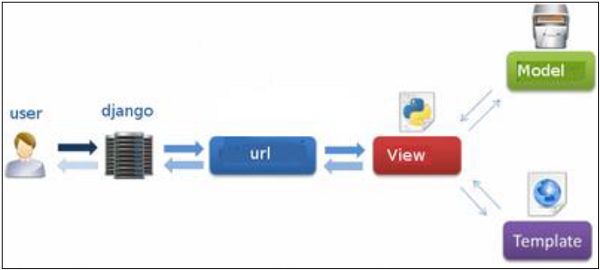

# 初始化 `Django` 

>   1. 创建 `Django` 项目 `django-admin startproject Acapp` 
>
>   2. 在 `Acapp/Acapp/settings.py` 将服务器的地址加入到 `Django` 项目中
>
>       ```python
>       ALLOWED_HOSTS = [
>           '101.35.165.69', # 服务器地址
>       ]
>       ```
>
>   3. 启动 `Django` 项目 `python3 manage.py runserver 0.0.0.0:8000`
>
>   4. 对数据库做迁移, 每次对数据库做改动的时候, 都必须进行下面两步
>
>       ```python
>       # 第一步: 迁移准备
>       python3 manage.py makemigrations
>       # 第二步: 迁移
>       python3 manage.py migrate
>       ```
>
>   5. 在 `Acapp/Acapp/settings.py` 修改时区, 并且重启项目使其生效
>
>       ```python
>       TIME_ZONE = 'Asia/Shanghai' # 更改时区
>       ```
>
>   6. 在 `Acapp/Acapp/settings.py` 将 `static` 文件夹加入地址路径
>
>       ```python
>       STATIC_ROOT = os.path.join(BASE_DIR, 'static')
>       ```
>
>   7. 在 `Acapp/` 下创建 `APP` 应用 `python3 manage.py startapp Game`
>
>   8. 在 `Acapp/Acapp/settings.py` 将当前新建的 `App` 加入到 `Django` 项目中
>
>       ```python
>       INSTALLED_APPS = [
>           'Game.apps.GameConfig', # 添加 Game
>       ]
>       ```

# 初始化 `App`

>   1.   `MTV` 模式
>
>        
>
>   2.   在 `Acapp/Acapp/urls.py` 里设置全局的 `URL`
>
>        ```python
>        urlpatterns = [
>            path('', include('Game.urls.index')), # 添加Game的Url路径
>        ]
>        ```
>
>   3.   在 `Acapp/Game/urls/index.py` 里设置 `Game` 的 `URL`
>
>        ```python
>        from django.urls import path
>        
>        urlpatterns = []
>        ```
>
>   4.   在 `Acapp/Game/templates/multiends/` 下创建模板文件 `web.html`
>
>        ```html
>        <head>
>            <!-- 引入 jquery css 文件-->
>            <link rel="stylesheet" href="https://cdn.acwing.com/static/jquery-ui-dist/jquery-ui.min.css">
>            <!-- 引入 jquery js 文件 -->
>            <script src="https://cdn.acwing.com/static/jquery/js/jquery-3.3.1.min.js"></script>
>            <!-- 引入网站图标 -->
>            <link rel="icon" href="https://cdn.acwing.com/media/article/image/2021/12/17/1_be4c11ce5f-acapp.png">
>        </head>
>        <!-- 将 body 的外边框设置为 0px 更加美观 -->
>        <body style="margin: 0px;">
>            <div id="ac_game_12345678">你好</div>
>        </body>
>        ```
>
>   5.   在 `Acapp/Game/views/index.py` 里设置 `Game` 的 `VIEW`
>
>        ```python
>        from django.shortcuts import render
>        
>        def index(request):
>            # render的作用就是加载模板或者渲染模板
>            return render(request, 'multiends/web.html')
>        ```
>
>        [Django模板详细介绍](https://www.cnblogs.com/rexcheny/p/9635764.html)
>
>        >   1.   `Django` 模板载⼊有两种模式:
>        >
>        >        +   `django.template.loaders.filesystem.Loader` 它会遍历所有 `app` 中的 `templates` 然后找到符合名字的就返回
>        >
>        >        +   `django.template.loaders.app_directories.Loader` 它会从 `app` 对应的 `templates` ⽬录中查找要渲染的模板⽂件,即使找不到也不去其
>        >            他 `app` ⾥⾯找
>        >
>        >            
>        >
>        >        +   `APP_DIRS` 的值设置为 `TRUE` ,表⽰启⽤`django.template.loaders.app_directories.Loader`, `DIRS` 为空即可.
>        >
>        >        +   如果不设置 `APP_DIRS` 或者设置为 `False`,则启⽤ `django.template.loaders.filesystem.Loader` 模式,这个模式需要把 `DIRS` 设置好,要不然找不到任何模板
>        >
>        >   2.   在 `Acapp/Acapp/settings.py` 将当前新建的 `App` 的模板加入到 `Django` 项目中
>        >
>        >        ```python
>        >        TEMPLATES = [
>        >            {
>        >                'BACKEND': 'django.template.backends.django.DjangoTemplates',
>        >                'DIRS': [
>        >                    os.path.join(BASE_DIR, 'Game/templates') # 加入app的模板路径
>        >                ],
>        >                'APP_DIRS': False, # 设置为False
>        >                'OPTIONS': {
>        >                    'context_processors': [
>        >                        'django.template.context_processors.debug',
>        >                        'django.template.context_processors.request',
>        >                        'django.contrib.auth.context_processors.auth',
>        >                        'django.contrib.messages.context_processors.messages',
>        >                    ],
>        >                },
>        >            },
>        >        ]
>        >        ```
>
>   6.   在 `Acapp/Game/urls/index.py` 里引入视图函数 `index`
>
>        ```python
>        from django.urls import path
>        from Game.views.index import index # 导入index函数
>                                                
>        urlpatterns = [
>            path('', index, name = 'index') # 添加路由
>        ]
>        ```

# `App` 根目录设置

>   1.   在 `Acapp/Game/templates/multiends/web.html` 中创建 `ac_game`
>
>        ```html
>        <!-- 加载 static 文件夹 -->
>        
>        <head>
>            <!-- 引入 jquery css 文件-->
>            <link rel="stylesheet" href="https://cdn.acwing.com/static/jquery-ui-dist/jquery-ui.min.css">
>            <!-- 引入 jquery js 文件 -->
>            <script src="https://cdn.acwing.com/static/jquery/js/jquery-3.3.1.min.js"></script>
>            <!-- 引入网站图标 -->
>            <link rel="icon" href="https://cdn.acwing.com/media/article/image/2021/12/17/1_be4c11ce5f-acapp.png">
>        </head>
>        <!-- 将 body 的外边框设置为 0px 更加美观 -->
>        <body style="margin: 0px;">
>            <div id="ac_game_12345678"></div>
>            <!-- 模块化编程 -->
>            <script type="module">
>                import {AcGame} from "";
>                $(document).ready(function() { // 作用:希望在页面加载完，自动执行定义js代码
>                    let ac_game = new AcGame("ac_game_12345678");
>                });
>            </script>
>        </body>
>        ```
>
>   2.   在 `Acapp/Game/static/js/src` 下创建根 `Js` 文件 `zbase.js`
>
>        ```javascript
>        // 使用 Javescript 面向对象 需要向外界暴露一个窗口 使用 export 关键字
>        export class AcGame {
>            constructor(id) {
>                // id 即为传进来的id 名称
>                this.id = id;
>                // 获取 id 所对应的 div 标签
>                this.$ac_game = $('#' + id);
>            }
>        }
>        ```
>
>   3.   在 `Acapp/scripts/compress_game_js.sh` 里写入内容
>
>        ```shell
>        #! /bin/bash
>                                           
>        JS_PATH=/home/django/Acapp/Game/static/js # js路径
>        JS_PATH_DIST=${JS_PATH}/dist # 压缩文件夹
>        JS_PATH_SRC=${JS_PATH}/src # 源文件夹
>        find $JS_PATH_SRC -type f -name '*.js' | sort | xargs cat > ${JS_PATH_DIST}/game.js # 压缩文件
>        ```
>
>        给 `compress_game_js.sh` 添加可执行权限
>
>        ```shell
>        chmod +x compress_game_js.sh
>        ```

# 界面设置

## 前端界面

### 菜单 `menu` 界面

#### 编写 `JS` 文件

>   1.   创建 `Acapp/Game/static/js/src/menu/zbase.js`
>
>        ```javascript
>        class AcGameMenu {
>            constructor(root) {
>                this.root = root;
>                this.$menu = $(`
>                    <div class="ac_game_menu">
>                        <div class="ac_game_menu_field">
>                            <div class="ac_game_menu_field_item ac_game_menu_field_item_single_mode">
>                                单人模式
>                            </div>
>                            <br>
>                            <div class="ac_game_menu_field_item ac_game_menu_field_item_multi_mode">
>                                多人模式
>                            </div>
>                            <br>
>                            <div class="ac_game_menu_field_item ac_game_menu_field_item_settings">
>                                设置
>                            </div>
>                        </div>
>                    </div>
>                `);
>                // 将菜单界面添加到根界面中
>                this.root.$ac_game.append(this.$menu);
>            }
>            show() { // 显示菜单界面
>                this.$menu.show();
>            }
>            hide() { // 隐藏菜单界面
>                this.$menu.hide();
>            }
>        }
>        ```
>
>   2.   在 `Acapp/Game/static/js/src/zbase.js` 里将菜单界面创建出来
>
>        ```javascript
>        // 使用 Javescript 面向对象 需要向外界暴露一个窗口 使用 export 关键字
>        export class AcGame {
>            constructor(id) {
>                // 创建菜单界面
>                this.menu = new AcGameMenu(this);
>            }
>        }
>        ```

#### 编写 `CSS` 文件

>   1.   下载背景图片
>
>        +   下载背景图片,放到 `Acapp/Game/static/image/menu/`
>        +   `ubuntu` 下载图片命令 `wget --output-document=图片别名 图片地址 图片存储地址`
>        +   [图片地址](https://gimg2.baidu.com/image_search/src=http%3A%2F%2Finews.gtimg.com%2Fnewsapp_match%2F0%2F11156556256%2F0.jpg&refer=http%3A%2F%2Finews.gtimg.com&app=2002&size=f9999,10000&q=a80&n=0&g=0n&fmt=jpeg)
>        +   背景图片加载不出来
>            +   原因:可能是百度反爬的问题 导致无法加载图片
>            +   解决方案:下载到本地,然后上传到服务器即可
>            +   上传文件夹 `scp -r 文件或者文件夹路径 服务器名:路径`
>            +   !! 注意 `-r` 的位置
>
>   2.   创建 `Acapp/Game/static/css/game.css` 并写入一下内容
>
>        ```css
>        .ac_game_menu {
>            width: 100%;
>            height: 100%;
>            background-image: url("/static/image/menu/background.gif");
>            /* 禁止左右上下拉伸 */
>            background-size: 100% 100%;
>            /* 禁止用户鼠标点选 */
>            user-select: none;
>        }
>        
>        .ac_game_menu_field {
>            width: 20vw;
>            position: relative;
>            top: 40vh;
>            left: 19vw;
>        }
>        
>        .ac_game_menu_field_item {
>            color: white;
>            height: 7vh;
>            width: 20vw;
>            font-size: 6vh;
>            /* 设置字体样式为斜体 */
>            font-style: italic;
>            padding: 2vh;
>            text-align: center;
>            background-color: rgba(39, 21, 28, 0.6);
>            border-radius: 10px;
>            /* 设置字体之间的间距 */
>            letter-spacing: 0.5vw;
>            /* 设置鼠标样式 接触到之后变成指针样式 */
>            cursor: pointer;
>        }
>        
>        .ac_game_menu_field_item:hover {
>            /* 设置缩放效果 */
>            transform: scale(1.2);
>            /* 设置秒数 */
>            transition: 100ms;
>        }
>        ```
>
>   3.   在 `Acapp/Game/templates/multiends/web.html` 中引入 `game.css` 文件
>
>        ```html
>        <!-- 加载 static 文件夹 -->
>        
>        <head>
>            <!-- 引入 css 文件 -->
>            <link rel="stylesheet" href="">
>        </head>
>        ```
>

### 玩家 `playground` 界面

#### 编写 `JS` 文件

> 1.   创建 `acapp/game/static/js/src/playground/zbase.js`
>
>      ```javascript
>      class AcGamePlayground {
>          constructor(root) {
>              this.root = root;
>              this.$playground = $(`
>                  <div class="ac_game_playground"></div>
>              `);
>              // 一开始将玩家界面隐藏
>              this.hide();
>              // 将玩家界面添加到根界面中
>              this.root.$ac_game.append(this.$playground);
>              // 添加启动函数
>              this.start();
>          }
>          start() {
>              let outer = this;
>              // 当页面大小发生变化的时候触发此函数
>              $(window).resize(function() {
>                  // 调用外部的resize()函数
>                  outer.resize();
>              });
>          }
>          resize() {
>              // 获取宽度
>              this.width = this.$playground.width();
>              // 获取高度
>              this.height = this.$playground.height();
>              // 获取单位
>              let unit = Math.min(this.width / 16, this.height / 9);
>              // 宽度占16份
>              this.width = unit * 16;
>              // 高度占9份
>              this.height = unit * 9;
>              // 获取缩放比例
>              this.scale = this.height;
>              // 如果存在地图, 则调用地图的resize()函数
>              if (this.game_map) {
>                  this.game_map.resize();
>              }
>          }
>          show(mode) {
>              // 显示玩家界面
>              this.$playground.show();
>              // 获取玩家界面的宽度
>              this.width = this.$playground.width();
>              // 获取玩家界面的高度
>              this.height = this.$playground.height();
>              // 将地图创建出来
>              this.game_map = new GameMap(this);
>              // 当前模式
>              this.mode = mode;
>              // 调用resize()函数, 将宽高比设置为16:9
>              this.resize();
>          }
>          hide() { // 隐藏玩家界面
>              this.$playground.hide();
>          }
>      }
>      ```
>
> 2.   在 `Acapp/Game/static/js/src/zbase.js` 里将玩家界面创建出来
>
>      ```javascript
>      // 使用 Javescript 面向对象 需要向外界暴露一个窗口 使用 export 关键字
>      export class AcGame {
>          constructor(id) {
>              // 创建玩家界面
>              this.playground = new AcGamePlayground(this);
>          }
>      }
>      ```
>
> 3.   缩放比例说明
>
>      

#### 编写 `CSS` 文件

>   1.   修改 `Acapp/Game/static/css/game.css`
>
>        ```css
>        .ac_game_playground {
>            width: 100%;
>            height: 100%;
>            /* 禁止用户选中 */
>            user-select: none;
>            /* 添加一层灰色背景 */
>            background-color: grey;
>        }
>        ```

### 添加点击 `Click` 事件

> 1.   修改 `Acapp/Game/static/js/src/menu/zbase.js`
>
>      ```javascript
>      class AcGameMenu {
>          constructor(root) {
>              // 找到单人模式的权柄
>              this.$single_mode = this.$menu.find('.ac_game_menu_field_item_single_mode');
>              // 调用启动函数
>              this.start();
>          }
>          start() {
>              // 添加监听事件
>              this.add_listening_events();
>          }
>          add_listening_events() {
>              let outer = this; // 保存当前权柄
>              // 点击单人模式时, 触发此函数
>              this.$single_mode.click(function() {
>                  outer.hide(); // 隐藏菜单界面
>                  outer.root.playground.show("single mode"); // 显示玩家界面
>              });
>          }
>      }
>      ```
>

### 编写游戏引擎

> 1.   创建 `Acapp/Game/static/js/src/playground/ac_game_object/zbase.js`
>
>      ```javascript
>      let AC_GAME_OBJECTS = [];
>      class AcGameObject {
>          constructor() {
>              // 将所有继承此类的对象加入到此数组中
>              AC_GAME_OBJECTS.push(this);
>              // 是否已经执行第一帧
>              this.has_called_start = false;
>              // 统计时间间隔
>              this.timedelta = 0;
>          }
>          start() {} // 仅在第一帧执行
>          update() {} // 从第一帧之后的每一帧都执行
>          on_destory() {} // 临死之前应该做啥
>          destory() { // 判处死刑
>              this.on_destory(); // 临死之前满足你的要求
>              for (let i = 0; i < AC_GAME_OBJECTS.length; i ++ ) { // 遍历
>                  if (AC_GAME_OBJECTS[i] === this) { // 相等就进行删除
>                      AC_GAME_OBJECTS.splice(i, 1);
>                      break; // 只删除一个,故跳出循环
>                  }
>              }
>          }
>      }
>      let last_timestamp = 0; // 统计时间
>      let AC_GAME_ANIMATION = function(timestamp) {
>          // 遍历所有对象
>          for (let i = 0; i < AC_GAME_OBJECTS.length; i ++ ) {
>              let obj = AC_GAME_OBJECTS[i];
>              // 如果没有执行第一帧, 则执行
>              if (!obj.has_called_start) {
>                  // 执行第一帧
>                  obj.start();
>                  // 置为true
>                  obj.has_called_start = true;
>              }
>              else {
>                  // 计算时间差
>                  obj.timedelta = timestamp - last_timestamp;
>                  // 执行第一帧之后的每一帧
>                  obj.update();
>              }
>          }
>          // 更新时间戳
>          last_timestamp = timestamp;
>          // 递归调用
>          requestAnimationFrame(AC_GAME_ANIMATION);
>      };
>      // 第一帧肯定得在外部调用
>      requestAnimationFrame(AC_GAME_ANIMATION);
>      ```
> 

### 创建游戏地图

#### 编写 `JS` 文件

> 1.   创建 `Acapp/Game/static/js/src/playground/game_map/zbase.js`
>
>      ```javascript
>      class GameMap extends AcGameObject {
>          constructor(playground) {
>              // 继承父类的所有方法
>              super();
>              this.playground = playground;
>              // 地图
>              this.$canvas = $(`
>                  <canvas></canvas>
>              `);
>              // 获取地图的权柄
>              this.ctx = this.$canvas[0].getContext('2d');
>              // 地图的宽度
>              this.ctx.canvas.width = this.playground.width;
>              // 地图的高度
>              this.ctx.canvas.height = this.playground.height;
>              // 将地图添加到玩家界面中
>              this.playground.$playground.append(this.$canvas);
>          }
>          start() {}
>          resize() { // 调整宽高比16:9
>              // 获取地图的宽度
>              this.ctx.canvas.width = this.playground.width;
>              // 获取地图的高度
>              this.ctx.canvas.height = this.playground.height;
>              // 覆盖一层不透明的黑色背景
>              this.ctx.fillStyle = "rgba(0, 0, 0, 1)";
>              // 画
>              this.ctx.fillRect(0, 0, this.ctx.canvas.width, this.ctx.canvas.height);
>          }
>          update() {
>              // 渲染地图
>              this.render();
>          }
>          render() {
>              // 填充颜色
>              this.ctx.fillStyle = "rgba(0, 0, 0, 0.2)";
>              // 画正方形, (左上角坐标, 右下角坐标)
>              this.ctx.fillRect(0, 0, this.ctx.canvas.width, this.ctx.canvas.height);
>          }
>      }
>      ```
>
> 2.   在 `Acapp/Game/static/js/src/playground/zbase.js` 里将地图创建出来
>
>      ```javascript
>      class AcGamePlayground {
>          constructor(root) {
>              // 将地图创建出来
>              this.game_map = new GameMap(this);
>          }
>      }
>      ```

#### 编写 `CSS` 文件

>   1.   修改 `Acapp/Game/static/css/game.css`
>
>        ```c++
>        .ac_game_playground > canvas {
>            position: relative;
>            top: 50%;
>            left: 50%;
>            /* 平移给定元素 */
>            transform: translate(-50%, -50%);
>        }
>        ```

### 创建玩家

#### 编写 `JS` 文件

> 1.   创建 `Acapp/Game/static/js/src/playground/player/zbase.js`
>
>      ```javascript
>      class Player extends AcGameObject {
>          constructor(playground, x, y, radius, color) {
>              // 继承父类的方法
>              super();
>              this.playground = playground;
>              // 获取地图的权柄
>              this.ctx = this.playground.game_map.ctx;
>              this.x = x;
>              this.y = y;
>              this.radius = radius;
>              this.color = color;
>          }
>          start() {}
>          update() {
>              // 渲染玩家
>              this.render();
>          }
>          render() {
>              // 获取新地图的缩放比例,不是旧地图的缩放比例this.scale
>              let scale = this.playground.scale;
>              // 告诉浏览器开始作画
>              this.ctx.beginPath();
>              // 画圆弧
>              // 单位坐标✖️缩放比例
>              this.ctx.arc(this.x * scale, this.y * scale, this.radius * scale, 0, Math.PI * 2, false);
>              // 拿起当前颜色的画笔
>              this.ctx.fillStyle = this.color;
>              // 用当前颜色的画笔进行填充
>              this.ctx.fill();
>          }
>      }
>      ```
>
> 2.   在 `Acapp/Game/static/js/src/playground/zbase.js` 里将玩家创建出来
>
>      ```javascript
>      class AcGamePlayground {
>          show() {
>              // 创建玩家列表
>              this.players = [];
>              // 将玩家插入玩家列表
>              // 宽度寸的是比例
>              this.players.push(new Player(this, this.width / 2 / this.scale, 0.5, 0.05, "white"));
>          }
>      }
>      ```

### 操作玩家移动

> 1.   修改 `Acapp/Game/static/js/src/playground/player/zbase.js` 
>
>      ```javascript
>      class Player extends AcGameObject {
>          constructor(playground, x, y, radius, color, speed, character) {
>              this.vx = 0; // x轴上的移动速度
>              this.vy = 0; // y轴上的移动速度
>              this.speed = speed;
>              this.move_length = 0; // 移动距离
>              this.character = character; // 当前的角色
>              this.eps = 1e-4; // 极小值
>          }
>          start() {
>              // 如果当前的角色是本人
>              if (this.character === "me") {
>                  // 添加监听事件
>                  this.add_listening_events();
>              }
>          }
>          add_listening_events() {
>              let outer = this;
>              // 禁用鼠标右键功能
>              this.playground.game_map.$canvas.on("contextmenu", function() {
>                  return false;
>              });
>              this.playground.game_map.$canvas.mousedown(function(e) {
>                  // 注意: 此句话位置处于mousedown函数里面
>                  const rect = outer.ctx.canvas.getBoundingClientRect();
>                  if (e.which === 3) { // 点击右键
>                      // 获取相对距离
>                      let tx = (e.clientX - rect.left) / outer.playground.scale;
>                      let ty = (e.clientY - rect.top) / outer.playground.scale;
>                      // 移动
>                      outer.move_to(tx, ty);
>                  }
>              });
>          }
>          update() {
>              // 更新移动
>              this.update_move();
>              // 渲染
>              this.render();
>          }
>          update_move() {
>              // 如果当前剩余的距离小于this.eps, 则认为其已经到达目的地
>              if (this.move_length < this.eps) {
>                  // 将速度和移动距离设置为0
>                  this.vx = this.vy = this.move_length = 0;
>              }
>              else {
>                  // 获取移动距离, 取较小值
>                  let moved = Math.min(this.move_length, this.speed * this.timedelta / 1000);
>                  // 获取x轴的移动距离
>                  this.x += this.vx * moved;
>                  // 获取y轴的移动距离
>                  this.y += this.vy * moved;
>                  // 剩余距离减去移动的距离
>                  this.move_length -= moved;
>              }
>          }
>          get_dist(x1, y1, x2, y2) { // 计算欧几里得距离
>              let dx = x1 - x2;
>              let dy = y1 - y2;
>              return Math.sqrt(dx * dx + dy * dy);
>          }
>          move_to(tx, ty) {
>              // 获取距离
>              this.move_length = this.get_dist(this.x, this.y, tx, ty);
>              // 获取角度
>              let angle = Math.atan2(ty - this.y, tx - this.x);
>              // 获取x轴的角度
>              this.vx = Math.cos(angle);
>              // 获取y轴的角度
>              this.vy = Math.sin(angle);
>          }
>      }
>      ```
>
> 2.   在 `Acapp/Game/static/js/src/playground/zbase.js` 里更新玩家的属性
>
>      ```javascript
>      class AcGamePlayground {
>          show() {
>              // 宽度存的是比例
>              this.players.push(new Player(this, this.width / 2 / this.scale, 0.5, 0.05, "white", 0.2, "me"));
>          }
>      }
>      ```
>
> 3.   相关函数解释
>
>      +   `Element.getBoundingClientRect()`
>
>          >   1.   含义: `Element.getBoundingClientRect()` 方法返回元素的大小及其相对于视口的位置
>          >
>          >   2.   解释
>          >
>          >        
>
>      +   `Math.atan2()`
>
>          >   1.   含义: `Math.atan2()` 返回从原点 `(0,0)` 到 `(x,y)` 点的线段与<font style="color: red"> `x` 轴正方向</font>之间的平面角度(弧度值)，也就是 `Math.atan2(y,x)`
>

### 让玩家发射炮弹

#### 编写 `JS` 文件

>   1.   创建 `Acapp/Game/static/js/src/playground/skill/fireball/zbase.js`
>
>        ```javascript
>        class FireBall extends AcGameObject {
>            constructor(playground, player, x, y, radius, vx, vy, color, speed, move_length) {
>                super();
>                this.playground = playground;
>                this.player = player;
>                // 获取画布的权柄
>                this.ctx = this.playground.game_map.ctx;
>                this.x = x;
>                this.y = y;
>                this.radius = radius;
>                this.vx = vx;
>                this.vy = vy;
>                this.color = color;
>                this.speed = speed;
>                this.move_length = move_length;
>                // 极小值
>                this.eps = 1e-4;
>            }
>            update() {
>                // 移动距离为0
>                if (this.move_length < this.eps) {
>                    return false;
>                }
>                // 获取移动距离
>                let moved = Math.min(this.move_length, this.speed * this.timedelta / 1000);
>                // 获取x轴的坐标
>                this.x += moved * this.vx;
>                // 获取y轴的坐标
>                this.y += moved * this.vy;
>                // 当前剩余的距离减去移动的距离
>                this.move_length -= moved;
>                // 渲染
>                this.render();
>            }
>            render() {
>                // 告诉浏览器开始作画
>                this.ctx.beginPath();
>                // 圆弧的参数
>                this.ctx.arc(this.x, this.y, this.radius, 0, Math.PI * 2, false);
>                // 使用的颜色
>                this.ctx.fillStyle = this.color;
>                // 一切准备就绪, 画!!
>                this.ctx.fill();
>            }
>        }
>        ```
>
>   2.   修改 
>
>   3.   相关函数解释
>
>        +   `Image()`
>
>            >   1.   含义: `Image()`函数将会创建一个新的[`HTMLImageElement`](https://developer.mozilla.org/zh-CN/docs/Web/API/HTMLImageElement)实例,它的功能等价于 [`document.createElement('img')`](https://developer.mozilla.org/zh-CN/docs/Web/API/Document/createElement)
>            >
>            >   2.   解释
>            >
>            >        ```javascript
>            >        var myImage = new Image(100, 200);
>            >        myImage.src = 'picture.jpg';
>            >        document.body.appendChild(myImage);
>            >        ```
>            >
>            >        等价于
>            >
>            >        ```javascript
>            >        
>            >        ```
>
>        +   `CanvasRenderingContext2D.save()`
>
>            >   1.   含义: `CanvasRenderingContext2D.save()` 是 `Canvas 2D API` 通过将当前状态放入栈中，保存 `canvas` 全部状态的方法

#### 添加到玩家手中

> 修改 `acapp/game/static/js/src/playground/player/zbase.js`
>
> ```javascript
> class Player extends AcGameObject {
>     constructor(playground, x, y, radius, color, speed, is_me) {
>         <!-- 添加当前技能 -->
>         this.cur_skill = null;
>     }
>     add_listening_events() {
>         let outer = this;
>         this.playground.game_map.$canvas.mousedown(function(e) {
>             if (e.which == 3) {
>                 outer.move_to(e.clientX, e.clientY);
>             }
>             else if (e.which == 1) { <!-- 如果当前按的键是左键 -->
>                 <!-- 如果当前技能是火球技能 -->
>                 if (outer.cur_skill === "fireball") {
>                     outer.shoot_fireball(e.clientX, e.clientY);
>                 }
>                 <!-- 发完技能之后 清空技能 -->
>                 outer.cur_skill = null;
>             }
>         });
>         $(window).keydown(function(e) {
>             <!-- 如果按下Q键 -->
>             if (e.which == 81) {
>                 outer.cur_skill = "fireball";
>                 return true;
>             }
>         });
>     }
>     shoot_fireball(tx, ty) {
>         let x = this.x;
>         let y = this.y;
>         let radius = this.playground.height * 0.01;
>         let angle = Math.atan2(ty - this.y, tx - this.x);
>         let vx = Math.cos(angle);
>         let vy = Math.sin(angle);
>         let color = "orange";
>         let speed = this.playground.height * 0.5;
>         let move_length = this.playground.height * 0.8;
>         new FireBall(this.playground, this, x, y, radius, vx, vy, color, speed, move_length);
>     }
> }
> ```

### 添加 `AI` 机器人

#### 将玩家修改成机器人

> 修改 `acapp/game/static/js/src/playground/player/zbase.js`
>
> ```javascript
> class Player extends AcGameObject {
>     constructor(playground, x, y, radius, color, speed, is_me) {
>     start() {
>         if (this.is_me) {
>             this.add_listening_events();
>         }
>         else {
>             <!-- 如果不是本人 则随机指定一个地方 -->
>             let tx = Math.random() * this.playground.width;
>             let ty = Math.random() * this.playground.height;
>             this.move_to(tx, ty);
>         }
>     }
>     update() {
>         if (this.move_length < this.eps) {
>             this.move_length = this.vx = this.vy = 0;
>             <!-- 如果不是本人 则当停止下来之后 重新在随机选择一个方向 -->
>             if (!this.is_me) {
>                 let tx = Math.random() * this.playground.width;
>                 let ty = Math.random() * this.playground.height;
>                 this.move_to(tx, ty);
>             }
>         }
>         else {
>             let moved = Math.min(this.move_length, this.speed * this.timedelta / 1000);
>             this.x += this.vx * moved;
>             this.y += this.vy * moved;
>             this.move_length -= moved;
>         }
>         this.render();
>     }
> }
> ```

#### 修改玩家属性

> 修改 `acapp/game/static/js/src/playground/zbase.js`
>
> ```javascript
> for (let i = 0; i < 5; i ++ ) {
>     <!-- 注意最后一个参数是 false 表示不是本人 -->
> 	this.players.push(new Player(this, this.width / 2, this.height / 2, this.height * 0.05, "red", this.height * 0.2, false));
> }
> ```

### 让 `AI` 发射炮弹

#### 修改机器人 `JS` 文件

> 修改 `acapp/game/static/js/src/playground/player/zbase.js`
>
> ```javascript
> class Player extends AcGameObject {
>     update() {
>         <!-- 如果是机器人 发射炮弹的频率设置 < 1 / 180.0 -->
>         if (!this.is_me && Math.random() < 1 / 180.0) {
>             let player = this.playground.players[Math.floor(Math.random() * this.playground.players.length)];
>             let tx = player.x + player.speed * this.vx * this.timedelta / 1000 * 2;
>             let ty = player.y + player.speed * this.vy * this.timedelta / 1000 * 2;
>             this.shoot_fireball(tx, ty);
>         }
>     }
> }
> ```

#### 让炮弹对敌人形成伤害

> 修改 `acapp/game/static/js/src/playground/skill/fireball/zbase.js`
>
> ```javascript
> class FireBall extends AcGameObject {
>     constructor(playground, player, x, y, radius, vx, vy, color, speed, move_length, damage) {
>         <!-- 火球的伤害值 -->
>         this.damage = damage;
>     }
>     update() {
>         for (let i = 0; i < this.playground.players.length; i ++ ) {
>             let player = this.playground.players[i];
>             if (this.player !== player && this.is_collision(player)) {
>                 console.log("attack");
>                 this.attack(player);
>             }
>         }
>         this.render();
>     }
>     get_dist(x1, y1, x2, y2) {
>         let dx = x1 - x2;
>         let dy = y1 - y2;
>         return Math.sqrt(dx * dx + dy * dy);
>     }
>     <!-- 判断火球是否攻击到敌人 -->
>     is_collision(player) {
>         let distance = this.get_dist(this.x, this.y, player.x, player.y);
>         if (distance < this.radius + player.radius) {
>             return true;
>         }
>         return false;
>     }
>     attack(player) {
>         <!-- 角度 -->
>         let angle = Math.atan2(player.y - this.y, player.x - this.x);
>         <!-- 朝着某个角度 进行攻击 伤害值为 this.damage -->
>         player.is_attacked(angle, this.damage);
>         <!-- 火球攻击完敌人之后 火球即消失 -->
>         this.destory();
>     }
> }
> ```
>
> 修改 `acapp/game/static/js/src/playground/player/zbase.js`
>
> ```javascript
> class Player extends AcGameObject {
>     shoot_fireball(tx, ty) {
>         <!-- 给火球添加伤害 -->
>         new FireBall(this.playground, this, x, y, radius, vx, vy, color, speed, move_length, this.playground.height * 0.01);
>     }
>     is_attacked(angle, damage) {
>         this.radius -= damage;
>         if (this.radius < 20) {
>             this.destory();
>             return false;
>         }
>     }
>     <!-- on_destory 不是 destroy -->
>     <!-- destory 函数删除的是 AC_GAME_OBJECTS 列表里面的对象 -->
>     <!-- on_destory 函数删除的是 this.playground.players 列表里面的玩家-->
>     on_destory() {
>         for (let i = 0; i < this.playground.players.length; i ++ ) {
>             if (this.playground.players[i] === this) {
>                 this.playground.players.splice(i, 1);
>                 break;
>             }
>         }
>     }
> }
> ```

### 设置炮弹击中效果

#### 后退效果

> 修改 `acapp/game/static/js/src/playground/player/zbase.js`
>
> ```javascript
> class Player extends AcGameObject {
>     constructor(playground, x, y, radius, color, speed, is_me) {
>         <!-- 被击中在 x 轴上的方向 -->
>         this.damage_x = 0;
>         <!-- 被击中在 y 轴上的方向 -->
>         this.damage_y = 0;
>         <!-- 被击中之后的速度 -->
>         this.damage_speed = 0;
>         <!-- 被击中之后的摩擦力 -->
>         this.friction = 0.9;
>     }
>     is_attacked(angle, damage) {
>         this.damage_x = Math.cos(angle);
>         this.damage_y = Math.sin(angle);
>         <!-- 被击中之后 更新下速度 -->
>         this.damage_speed = damage * 80;
>         <!-- 被击中之后的速度下降为原来的80% -->
>         this.speed *= 0.8;
>     }
>     update() {
>         <!-- 如果被击中的速度 > 10 暂停自己原来的速度 -->
>         if (this.damage_speed > 10) {
>             <!-- 将原来的速度和移动距离设置为 0 -->
>             this.vx = this.vy = this.move_length = 0;
>             <!-- 更新下当前的位置 -->
>             this.x += this.damage_x + this.damage_speed * this.timedelta / 1000;
>             this.y += this.damage_y + this.damage_speed * this.timedelta / 1000;
>             <!-- 速度✖️摩擦力 速度会越来越慢 -->
>             this.damage_speed *= this.friction;
>         }
>         <!-- 否则 没有变化 -->
>         else {
>             if (this.move_length < this.eps) {
>                 this.move_length = this.vx = this.vy = 0;
>                 if (!this.is_me) {
>                     let tx = Math.random() * this.playground.width;
>                     let ty = Math.random() * this.playground.height;
>                     this.move_to(tx, ty);
>                 }
>             }
>             else {
>                 let moved = Math.min(this.move_length, this.speed * this.timedelta / 1000);
>                 this.x += this.vx * moved;
>                 this.y += this.vy * moved;
>                 this.move_length -= moved;
>             }
>         }
>         this.render();
>     }
> }
> ```

#### 烟花效果

> 创建 `acapp/game/static/js/src/playground/particle/zbase.js`
>
> ```javascript
> class Particle extends AcGameObject {
>     constructor(playground, x, y, radius, vx, vy, color, speed, move_length) {
>         super();
>         this.playground = playground;
>         <!-- 获取权柄 -->
>         this.ctx = this.playground.game_map.ctx;
>         this.x = x;
>         this.y = y;
>         this.radius = radius;
>         this.vx = vx;
>         this.vy = vy;
>         this.color = color;
>         this.speed = speed;
>         this.move_length = move_length;
>         this.friction = 0.9;
>         this.eps = 1;
>     }
>     update() {
>         if (this.move_length < this.eps || this.speed < this.eps) {
>             this.destory();
>             return false;
>         }
>         let moved = Math.min(this.move_length, this.speed * this.timedelta / 1000);
>         this.x += this.vx * moved;
>         this.y += this.vy * moved;
>         this.speed *= this.friction;
>         this.move_length -= moved;
>         this.render();
>     }
>     render() {
>         this.ctx.beginPath();
>         this.ctx.arc(this.x, this.y, this.radius, 0, Math.PI * 2, false);
>         this.ctx.fillStyle = this.color;
>         this.ctx.fill();
>     }
> }
> ```
>
> 修改 `acapp/game/static/js/src/playground/player/zbase.js`
>
> ```javascript
> class Player extends AcGameObject {
>     is_attacked(angle, damage) {
>         <!-- 释放烟花 -->
>         for (let i = 0; i < 15 + Math.random() * 5; i ++ ) {
>             let x = this.x;
>             let y = this.y;
>             let radius = this.radius * Math.random() * 0.3;
>             let angle = Math.PI * 2 * Math.random();
>             let vx = Math.cos(angle);
>             let vy = Math.sin(angle);
>             let color = this.color;
>             let speed = this.speed * 10;
>             let move_length = this.radius * Math.random() * 10;
>             new Particle(this.playground, x, y, radius, vx, vy, color, speed, move_length);
>         }
>     }
> }
> ```

### 人机相关设置

#### 给人机分配不同的颜色

> 修改 `acapp/game/static/js/src/playground/zbase.js`
>
> ```javascript
> class AcGamePlayground {
>     constructor(root) {
>         for (let i = 0; i < 5; i ++ ) {
>             <!-- 颜色这一属性调用随机颜色函数即可 -->
>             this.players.push(new Player(this, this.width / 2, this.height / 2, this.height * 0.05, this.get_random_color(), this.height * 0.2, false));
>         }
>     }
>     get_random_color() {
>         let colors = ["red", "yellow", "blue", "green", "gray"];
>         <!-- 返回随机颜色 -->
>         return colors[Math.floor(Math.random() * 5)];
>     }
> }
> ```

#### 设置开局 `5s` 后再进行攻击

> 修改 `acapp/game/static/js/src/playground/player/zbase.js`
>
> ```javascript
> class Player extends AcGameObject {
>     constructor(playground, x, y, radius, color, speed, is_me) {
>         <!-- 计算时间 -->
>         this.spent_time = 0;
>     }
>     update() {
>         <!-- 计时 -->
>         this.spent_time += this.timedelta / 1000;
>         if (!this.is_me && this.spent_time > 5 && Math.random() < 1 / 180.0) {
>             let player = this.playground.players[Math.floor(Math.random() * this.playground.players.length)];
>             let tx = player.x + player.speed * this.vx * this.timedelta / 1000 * 2;
>             let ty = player.y + player.speed * this.vy * this.timedelta / 1000 * 2;
>             this.shoot_fireball(tx, ty);
>         }
>     }
> }
> ```

## 部署 `nginx` 与对接 `acapp`

### 增加容器运行的端口

> 1. `https` 是 `443` 端口；`http` 是 `80` 端口
>
> 2. 给容器增加端口映射
>
>    + 登录容器，关闭所有运行中的任务
>
>    + 登录<font style="color:red">**运行容器的服务器**</font>，然后执行
>
>      ```dockerfile
>      # 将容器保存成镜像
>      docker commit 容器名称 别名
>      # 停止容器
>      docker stop 容器名称
>      # 删除容器
>      docker rm 容器名称
>      # 使用保存的镜像重新创建容器
>      docker run -p 20000:22 -p 8000:8000 -p 80:80 -p 443:443 --name 容器名称 -itd 镜像名称
>      ```
>
>    + 去租的服务器中开放 `80` 和 `443` 端口
>

### 创建 `Acapp`

#### 修改相关配置文件

> 1. [讲义位置](https://www.acwing.com/file_system/file/content/whole/index/content/3257028/)
> 2. 将 [nginx.conf](https://www.acwing.com/user/myspace/application/conf/nginx_conf/149/) 中的内容写到服务器 `/etc/nginx/nginx.conf`
> 3. 将 [acapp.key](https://www.acwing.com/user/myspace/application/conf/acapp_key/149/) 中的内容写到服务器 `/etc/nginx/cert/acapp.key`
> 4. 将 [acapp.pem](https://www.acwing.com/user/myspace/application/conf/acapp_pem/149/) 中的内容写到服务器 `/etc/nginx/cert/acapp.pem`
> 5. 启动 `nginx` 服务 `sudo /etc/init.d/nginx start`，出现 `OK` 则说明成功启动服务

#### 修改 `Django` 项目的配置

> 1. 打开 `acapp/acapp/settings.py`
>
>    ```python
>    # 将域名添加到ALLOWED_HOSTS
>    ALLOWED_HOSTS = [
>        # 注意：删除开头的https://
>        'app149.acapp.acwing.com.cn'
>    ]
>    ```
>
> 2. 将 `DEBUG = True` 设置为 `DEBUG = False`
>
> 3. 将创建的 `app` 下的 `static` 文件，归档（复制）到根目录 `acapp` 下
>
>    ```python
>    # 根目录下出现了static文件
>    python3 manage.py collectstatic
>    ```

#### 修改 `uwsgi` 配置文件

>1. `uwsgi` 相当于在 `nginx` 和 `django` 中间架起了一座桥梁，访问速度更加快速和流畅
>
>2. 将配置文件写入 `acapp/scripts/uwsgi.ini`
>
>   ```ini
>   [uwsgi]
>   ; IP地址+端口号
>   socket          = 127.0.0.1:8000
>   ; Django项目地址
>   chdir           = /home/django/acapp
>   ; Django项目中wsgi的地址
>   wsgi-file       = /home/django/acapp/acapp/wsgi.py
>   master          = true
>   ; 开的进程（核）的数量
>   processes       = 2
>   ; 每个进程（核）的线程数量
>   threads         = 5
>   vacuum          = true
>   ```
>
>3. 启动 `uwsgi` 服务
>
>   + `uwsgi --ini scripts/uwsgi.ini`
>   + <font style="color:red">**注意⚠️：务必关闭 python3 ... runserver 服务**</font>

#### 填写剩余的信息

> 1. <font style="color: red">**注意⚠️：css或js前面的https地址是应用的地址，不一定是app149**</font>
> 1. `css` 地址：`https://app149.acapp.acwing.com.cn/static/css/game.css`
> 2. `js` 地址：`https://app149.acapp.acwing.com.cn/statis/js/dist/game.js`
> 3. 主类名：`js` 中暴露出来的类名（加 `export`）

#### 相关问题出错排查

##### 加载静态文件出错

> 进入 `nginx` 配置文件
>
> ```bash
> # 修改nginx配置信息
> # 进入nginx配置文件夹
> cd /etc/nginx
> # 修改nginx配置文件
> sudo vim nginx.conf
> ```
>
> 修改 `nginx` 配置文件
>
> ```nginx
> # 将static文件修改成自己的
> alias /home/django/acapp/static/;
> # 将media文件修改成自己的
> alias /home/django/acapp/media/;
> # 将443端口修改成自己网站地址
> server_name Acapp的应用域名
> # 将80端口修改成自己网站地址
> server_name Acapp的应用域名
> ```

#### `acapp bug` 修复

##### 修改脚本文件

> 修改 `acapp/scripts/compress_game_js.sh`
>
> ```shell
> # 先执行python3 manage.py collectstatic命令
> # 再输入yes
> echo yes | python3 manage.py collectstatic
> ```

##### 修改 `acwing` 中应用的坐标

> 产生原因：代码 `e.clientX, e.clientY` 写的是网页的绝对位置（最左上角位置），而画布是网页的相对位置，故需要做一个映射，使用函数 [`getBoundingClientRect()`](https://developer.mozilla.org/zh-CN/docs/Web/API/Element/getBoundingClientRect)
>
> 图示如下：
>
> 
>
> 修改 `acapp/game/statis/js/src/playground/player/zbase.js`
>
> ```javascript
> const rect = outer.ctx.canvas.getBoundingClientRect();
> outer.move_to(e.clientX - rect.left, e.clientY - rect.top);
> outer.shoot_fireball(e.clientX - rect.left, e.clientY - rect.top);
> ```
>
> 清理下缓存，然后重新加载页面即可

##### 显示菜单界面

> 修改 `acapp/game/static/js/src/zbase.js`
>
> ```javascript
> <!-- 取消此行的注释 -->
> this.menu = new AcGameMenu(this);
> ```
>

##### 修改玩家页面大小

> 修改 `acapp/game/static/js/src/playground/zbase.js`
>
> ```javascript
> class AcGamePlayground {
>  constructor(root) {
>      this.root = root;
>     this.$playground = $(`
>          <div class = "ac_game_playground"></div>
>     `);
>      <!-- 刚开始隐藏玩家界面 -->
>      this.hide();
>     }
>     show() {
>         this.$playground.show();
>         <!-- 将代码移动此处，玩家界面出来之后，再计算页面大小 -->
>         this.root.$ac_game.append(this.$playground);
>         this.width = this.$playground.width();
>         this.height = this.$playground.height();
>         this.game_map = new GameMap(this);
>         this.players = [];
>         this.players.push(new Player(this, this.width / 2, this.height / 2, this.height * 0.05, "white", this.height * 0.2, true));
>         for (let i = 0; i < 10; i ++ ) {
>             this.players.push(new Player(this, this.width / 2, this.height / 2, this.height * 0.05, this.get_random_color(), this.height * 0.2, false));
>         }
>     }
>    }
>    ```

##### 自适应页面大小

> 修改 `acapp/game/static/css/game.css`
>
> ```css
> .ac_game_menu_field {
>  	/* 顶部和左边距修改成百分比% */
>  	top: 40%;
>  	left: 25%;
> }
> 
> .ac_game_menu_field_item {
>  	/* 设置高度 */
> 	height: 7vh;
>  	/* 设置字体大小 */
>  	font-size: 5vh;
>     /* 【删除】内边距 */
>     padding: 2vw;
> }
> ```

## 创建账号系统

### 创建数据库

#### 显示错误信息

> 将 `acapp/acapp/setting.py` 中的 `DEBUG` 改成 `True`，否则，前端只会出现错误代码不会出现具体错误信息

#### 创建超级用户

> 在根目录下，运行命令 `python3 manage.py createsuperuser` 创建超级用户
>
> <font style="color: red">**邮箱📮可以不填写**</font>

#### 创建数据库表

> 创建数据库表，修改 `acapp/game/models/player/player.py` 并写入以下内容，函数 [`CASCADE`](https://www.cnblogs.com/nucdy/p/5768784.html) 的用法
>
> ```python
> # 继承数据库基类
> from django.db import models
> # 继承数据库用户表
> from django.contrib.auth.models import User
> # 每个数据表类都需要继承models.Model类
> class Player(models.Model):
>  	# 继承基础的用户信息（一对一的映射）
>  	# CASCADE 级联删除，user 删除的时候与之有关的对象都一并删除
>  	user = models.OneToOneField(User, on_delete = models.CASCADE)
>  	# 照片的URL
>  	photo = models.URLField(max_length = 256, blank = True)
> 	# 显示用户的名称
>  	def __str__(self):
>      		return str(self.user)
> ```

#### 注册到管理员页面

> 将数据库表注册到管理员页面，修改 `acapp/game/admin.py`
>
> ```python
># 引入Player表
> from game.models.player.player import Player
>
> # Register your models here.
># 将player表注册到管理员页面
> admin.site.register(Player)
> ```
> 
> 退到项目根目录下，按照顺序执行如下命令
> 
> ```django
> python3 manage.py makemigrations
>    python3 manage.py migrate
>    ```
>    
>    重启 `uwsgi` 服务
>    
> <font style="color:red">**对数据库每一次改动都需要迁移并且重启服务**</font>

### 登录注册界面

#### 准备工作

##### 主要逻辑步骤

> 用户登录的时候会向服务器发送请求 `getinfo`，服务器会返回相对应的信息；当用户登录成功时，会返回用户的基本信息和头像信息；当用户未登录时，返回未登录信息
>
> 附图一
>
> 
>
> 附图二
>
> 

##### 添加端口变量

> 修改 `acapp/game/static/js/src/zbase.js`
>
> ```javascript
> export class AcGame {
>        <!-- 添加 AcWingOs 变量，用于判断是哪个端口 -->
>        constructor(id, AcWingOS) {
>            this.AcWingOS = AcWingOS;
>        }
> }
> ```

##### 编写 `getinfo_web` 函数的 `VIEWS`

> 创建 `acapp/game/views/settings/getinfo.py`
>
> ```python
> # 引入 JsonResponse 包
> from django.http import JsonResponse
> # 引入 Player 数据库表（类）
> from game.models.player.player import Player
> 
> def getinfo_acapp(request):
>     # 取得第一个用户值的信息
>     player = Player.objects.all()[0]
>     return JsonResponse({
>         # 返回响应的结果
>         'result': "success",
>         # 返回用户名
>         'username': player.user.username,
>         # 返回用户的头像
>         'photo': player.photo
> 	})
> 
> def getinfo_web(request):
>     # 查找当前登录的用户
>     user = request.user
>     # 如果当前用户没有登录，user的值为Anonymous[匿名]User
>     if not user.is_authenticated: # authenticated [已被认证]
>         return JsonResponse({
>             'result': "未登录"
>         })
>     else:
> 		# 获取当前用户的所有信息
>         player = Player.objects.get(user = user)
>         return JsonResponse({
>             'result': "success",
>             'username': player.user.username,
>             'photo': player.photo
>         })
> 
> def getinfo(request):
>     # 获取平台的信息ge
>     platform = request.GET.get('platform')
>     # 如果是 ACAPP 端
>     if platform == 'ACAPP':
>         return getinfo_acapp(request)
>     # 注意：如果写成elif == 'WEB'，则会出现返回空，即报错，因此，写成else，以后再进行修改
>     else:
>         return getinfo_web(request)
> ```

##### 编写 `getinfo_web` 函数的 `URL`

> 修改 `app` 的路由 `acapp/game/urls/index.py`
>
> ```python
> # 导入include关键字
> from django.urls import path, include
> 
> urlpatterns = [
>  	# 添加路径路由
>  	path('settings/', include('game.urls.settings.index'))
> ]
> ```
>
> 修改 `settings` 的路由 `acapp/game/urls/settings/index.py`
>
> ```python
> from django.urls import path
> # 调用getinfo函数
> from game.views.settings.getinfo import getinfo
> 
> urlpatterns = [
>        # 添加路径
>        path('getinfo/', getinfo, name = 'settings_getinfo')
> ]
> ```
>

##### 前端调用 `getinfo_web` 函数

> 创建 `acapp/game/static/js/src/settings/zbase.js` 并写入以下内容
>
> ```javascript
> class Settings {
>        constructor(root) {
>            this.root = root;
>            <!-- 默认平台是 WEB 平台 -->
>            this.platform = "WEB";
>            if (this.root.AcWingOS) {
>                this.platform = "ACAPP";
>            }
>            this.start();
>        }
>        start() {
>            this.getinfo_web();
>        }
>        login() {}
>        getinfo_web() {
>            let outer = this;
>            $.ajax({
>                <!-- url 地址别写错 -->
>                url: "https://app149.acapp.acwing.com.cn/settings/getinfo/",
>                type: "GET",
>                data: {
>                    platform: outer.platform
>                },
>                success: function(resp) {
>                    console.log(resp);
>                    <!-- 如果是登录状态，则显示菜单界面 -->
>                    if (resp.result == "success") {
>                        outer.hide();
>                        outer.root.menu.show();
>                    }
>                    <!-- 如果是未登录状态，则跳转到登录界面 -->
>                    else {
>                        outer.login();
>                    }
>                }
>            });
>        }
>        hide() {}
>    }
>    ```

##### 编写 `menu` 的 `show` 函数

>   修改 `acapp/game/static/js/src/menu/zbase.js`，添加一下内容
>
>   ```javascript
>   class AcGameMenu {
>       show() {
>           this.$menu.show();
>       }
>   }
>   ```

##### 将 `Settings` 添加到主界面

>   修改 `acapp/game/static/js/src/zbase.js`，并写入以下内容
>
>   ```javascript
>   <!-- 注意this.settings的位置，必须位于this.playground的前面 -->
>   <!-- 因为this.playground需要调用this.settings，因此，this.settings必须先创建 -->
>   this.settings = new Settings(this);
>   ```

##### 渲染用户头像

>   修改 `acapp/game/static/js/src/settings/zbase.js`
>
>   ```javascript
>   class Settings {
>       constructor(root) {
>         	<!-- 添加用户的用户名和头像 -->
>           this.username = '';
>           this.photo = '';
>       }
>       getinfo() {
>           $.ajax({
>               success: function(resp) {
>                   if (resp.result == 'success') {
>                       <!-- 获取用户名 -->
>                       outer.username = resp.username;
>                       <!-- 获取密码 -->
>                       outer.photo = resp.photo;
>                   }
>               }
>           })
>       }
>   }
>   ```
>
>   修改 `acapp/game/static/js/src/playground/player/zbase.js`
>
>   ```javascript
>   class Player extends AcGameObject {
>       constructor(playground, x, y, radius, color, speed, is_me) {
>           <!-- 如果是本人，则获取头像和头像地址 -->
>           if (this.is_me) {
>               <!-- 建立图像的对象 -->
>               this.img = new Image();
>               this.img.src = this.playground.root.settings.photo;
>           }
>       }
>       render() {
>           <!-- 如果是本人，则加载用户头像并且将头像画出来 -->
>           if (this.is_me) {
>               this.ctx.save();
>               this.ctx.beginPath();
>               this.ctx.arc(this.x, this.y, this.radius, 0, Math.PI * 2, false);
>               this.ctx.stroke();
>               this.ctx.clip();
>               this.ctx.drawImage(this.img, this.x - this.radius, this.y - this.radius, this.radius * 2, this.radius * 2); 
>               this.ctx.restore();
>           }
>           else {
>               this.ctx.beginPath();
>               this.ctx.arc(this.x, this.y, this.radius, 0, Math.PI * 2, false);
>               this.ctx.fillStyle = this.color;
>               this.ctx.fill();
>           }
>       }
>   }
>   ```

#### 用户登录与注册页面

##### 隐藏菜单界面

>   修改 `acapp/game/static/js/src/menu/zbase.js`
>
>   ```javascript
>   class AcGameMenu {
>       constructor(root) {
>           <!-- 刚开始需要隐藏菜单界面，登录成功再进行显示 -->
>           <!-- 注意：先在Django后台退出登录，否则，登录状态的话，菜单界面会一直显示 -->
>           this.hide();
>       }
>   }
>   ```

##### 编写登录界面的 `HTML`

>   1.   下载 `logo` 图片到 `acapp/game/static/image/settings/acwing_login.png`
>
>   + `wget --output-document=图片别名 图片地址 ` [图片地址](https://cdn.acwing.com/media/article/image/2021/11/18/1_ea3d5e7448-logo64x64_2.png)
>   + 记得重启服务
>
>   2.   修改 `acapp/game/static/js/src/settings/zbase.js`
>
>   ```javascript
>   class Settings {
>       constructor(root) {
>           this.$settings = $(`
>               <div class = "ac_game_settings">
>               	<!-- 编写登录界面 -->
>                   <div class = "ac_game_settings_login">
>                       <div class = "ac_game_settings_title">
>                           登录
>                       </div>
>                       <div class = "ac_game_settings_username">
>                           <div class = "ac_game_settings_item">
>                               <input type = "text" placeholder = "用户名">
>                           </div>
>                       </div>
>                       <div class = "ac_game_settings_password">
>                           <div class = "ac_game_settings_item">
>                               <input type = "password" placeholder = "密码">
>                           </div>
>                       </div>
>                       <div class = "ac_game_settings_submit">
>                           <div class = "ac_game_settings_item">
>                               <button>登录</button>
>                           </div>
>                       </div>
>                       <div class = "ac_game_settings_error_messages"></div>
>                       <div class = "ac_game_settings_option">
>                           注册
>                       </div>
>                       <div class = "ac_game_settings_acwing">
>                       	<br>
>                           
>                           <br>
>                           <div>
>                               AcWing一键登录
>                           </div>
>                       </div>
>                   </div>
>               </div>
>                           `);
>           <!-- 将settings界面添加到主界面中去 -->
>           this.root.$ac_game.append(this.$settings);
>       }
>   }
>   ```

##### 编写登录界面的 `css`

>   修改 `acapp/game/static/css/game.css`
>
>   ```css
>   /* 登录界面相关设置 */
>   .ac_game_settings {
>       width: 100%;
>       height: 100%;
>       background-image: url('/static/image/menu/background.gif');
>       background-size: 100% 100%;
>       user-select: none;
>   }
>   
>   .ac_game_settings_login {
>       height: 43vh;
>       width: 20vw;
>       position: relative;
>       top: 50%;
>       left: 50%;
>       transform: translate(-50%, -50%);
>       background-color: rgba(0, 0, 0, 0.7);
>       border-radius: 5px;
>   }
>   
>   .ac_game_settings_title {
>       color: white;
>       font-size: 3vh;
>       text-align: center;
>       padding-top: 2vh;
>       margin-bottom: 2vh;
>   }
>   
>   .ac_game_settings_username {
>       display: block;
>       height: 7vh;
>   }
>   
>   .ac_game_settings_item {
>       width: 100%;
>       height: 100%;
>   }
>   
>   .ac_game_settings_item > input {
>       width: 90%;
>       line-height: 3vh;
>       position: relative;
>       top: 50%;
>       left: 50%;
>       transform: translate(-50%, -50%);
>   }
>   
>   .ac_game_settings_password {
>       display: block;
>       height: 7vh;
>   }
>   
>   .ac_game_settings_submit {
>       display: block;
>       height: 7vh;
>   }
>   
>   .ac_game_settings_item > button {
>       color: white;
>       width: 90%;
>       line-height: 3vh;
>       position: relative;
>       top: 50%;
>       left: 50%;
>       transform: translate(-50%, -50%);
>       background-color: #4CAF50;
>       border-radius: 5px;
>   }
>   
>   .ac_game_settings_error_messages {
>       color: red;
>       font-size: 0.8vh;
>       display: inline;
>       float: left;
>       padding-left: 1vw;
>   }
>   
>   .ac_game_settings_option {
>       color: white;
>       font-size: 1.8vh;
>       display: inline;
>       float: right;
>       padding-right: 1vw;
>       cursor: pointer;
>   }
>   
>   .ac_game_settings_acwing {
>       display: block;
>       height: 7vh;
>   }
>   
>   .ac_game_settings_acwing > img {
>       position: relative;
>       top: 50%;
>       left: 50%;
>       display: block;
>       transform: translate(-50%, -50%);
>       cursor: pointer;
>   }
>   
>   .ac_game_settings_acwing > div {
>       color: white;
>       font-size: 1.5vh;
>       text-align: center;
>   }
>   ```
>   

##### 编写注册界面的 `HTML`

>   修改 `acapp/game/static/js/src/settings/zbase.js`
>
>   ```javascript
>   class Settings {
>       constructor(root) {
>           this.$settings = $(`
>               <div class = "ac_game_settings">
>               	<!-- 编写注册界面 -->
>                   <div class = "ac_game_settings_register">
>                       <div class = "ac_game_settings_title">
>                           注册
>                       </div>
>                       <div class = "ac_game_settings_username">
>                           <div class = "ac_game_settings_item">
>                               <input type = "text" placeholder = "用户名">
>                           </div>
>                       </div>
>                       <div class = "ac_game_settings_password">
>                           <div class = "ac_game_settings_item">
>                               <input type = "password" placeholder = "密码">
>                           </div>
>                       </div>
>                       <div class = "ac_game_settings_password_confirm">
>                           <div class = "ac_game_settings_item">
>                               <input type = "password" placeholder = "确认密码">
>                           </div>
>                       </div>
>                       <div class = "ac_game_settings_submit">
>                           <div class = "ac_game_settings_item">
>                               <button>注册</button>
>                           </div>
>                       </div>
>                       <div class = "ac_game_settings_error_messages"></div>
>                       <div class = "ac_game_settings_option">
>                           登录
>                       </div>
>                       <div class = "ac_game_settings_acwing">
>                           <br>
>                           
>                           <br>
>                           <div>
>                               AcWing一键登录
>                           </div>
>                       </div>
>                   </div>
>               </div>
>           `);
>           <!-- 获取登录界面的权柄 -->
>           this.$login = this.$settings.find(".ac_game_settings_login");
>           <!-- 将登录界面隐藏，显示注册界面，方便调试 -->
>           this.$login.hide();
>           this.start();
>       }
>   }
>   ```

##### 编写注册界面的 `css`

>   修改 `acapp/game/static/css/game.css`
>
>   ```css
>   /* 注册界面相关设置 */
>   .ac_game_settings_register {
>       height: 50vh;
>       width: 20vw;
>       position: relative;
>       top: 50%;
>       left: 50%;
>       transform: translate(-50%, -50%);
>       background-color: rgba(0, 0, 0, 0.7);
>       border-radius: 5px;
>   }
>   ```

##### 登录和注册相互跳转

>   修改 `acapp/game/static/js/src/settings/zbase.js`
>
>   ```javascript
>   class Settings {
>       constructor(root) {
>           <!-- 获取登录的权柄 -->
>           this.$login = this.$settings.find(".ac_game_settings_login");
>           <!-- 获取登录中的注册按钮的权柄 -->
>           this.$login_register = this.$login.find(".ac_game_settings_option");
>           <!-- 获取注册的权柄 -->
>           this.$register = this.$settings.find(".ac_game_settings_register");
>           <!-- 获取注册中的登录按钮的权柄 -->
>           this.$register_login = this.$register.find(".ac_game_settings_option");
>           <!-- 默认显示登录界面，因此，一开始将注册界面隐藏 -->
>           this.$register.hide();
>           this.start();
>       }
>       start() {
>           <!-- 添加监听事件 -->
>           this.add_listening_events();
>       }
>       add_listening_events() {
>           <!-- 添加登录的监听事件 -->
>           this.add_listening_events_login();
>           <!-- 添加注册的监听事件 -->
>           this.add_listening_events_register();
>       }
>       add_listening_events_login() {
>           <!-- 获取外部的权柄 -->
>           let outer = this;
>   		<!-- 点击注册按钮 -->
>           this.$login_register.click(function() {
>               <!-- 登录界面隐藏 -->
>               outer.$login.hide();
>               <!-- 注册界面显示 -->
>               outer.$register.show();
>           });
>       }
>       add_listening_events_register() {
>           <!-- 获取外部的权柄 -->
>           let outer = this;
>           <!-- 点击登录按钮 -->
>           this.$register_login.click(function() {
>               <!-- 注册界面隐藏 -->
>               outer.$register.hide();
>               <!-- 登录界面显示 -->
>               outer.$login.show();
>           });
>       }
>   }
>   ```

#### 登录后台交互

##### 编写 `VIEWS` 函数

>   创建 `acapp/game/views/settings/login.py`，写入以下内容
>
>   ```python
>   from django.http import JsonResponse
>   from django.contrib.auth import authenticate, login
>   
>   def signin(request):
>       # 接收【前端】发送来的数据
>       data = request.GET
>       username = data.get('username')
>       password = data.get('password')
>   	# Django存储的是密码的哈希值，因此，使用内置函数
>   	# Django比较的是密码的哈希值，不是密码的值本身，先将输入的密码哈希，再与数据库中的哈希值进行比较，查看是否一致
>       user = authenticate(username = username, password = password)
>       if not user:
>           return JsonResponse({
>               'result': "用户名或者密码不正确"
>           })
>   	# login内置函数将登录的信息存储在浏览器的cookie里面
>       login(request, user)
>       return JsonResponse({
>           'result': "success"
>       })
>   ```

##### 编写 `URL` 函数

>   修改 `acapp/game/urls/settings/index.py`
>
>   ```python
>   # 添加signin函数
>   from game.views.settings.login import signin
>   
>   urlpatterns = [
>       # 添加相对应的路由
>       path('login/', signin, name = 'settings_login')
>   ]
>   ```

##### 前端调用 `signin` 函数

>   修改 `acapp/game/static/js/src/settings/zbase.js`
>
>   ```javascript
>   class Settings {
>       constructor(root) {
>           <!-- 获取登录用户名的权柄 -->
>           this.$login_username = this.$login.find(".ac_game_settings_username input");
>           <!-- 获取登录密码的权柄 -->
>           this.$login_password = this.$login.find(".ac_game_settings_password input");
>           <!-- 获取登录按钮的权柄 -->
>           this.$login_submit = this.$login.find(".ac_game_settings_submit");
>           <!-- 获取登录错误信息的权柄 -->
>           this.$login_error_message = this.$login.find(".ac_game_settings_error_messages");
>           <!-- 获取登录中的注册按钮的权柄 -->
>           this.$login_register = this.$login.find(".ac_game_settings_option");
>           <!-- 将登录界面隐藏 -->
>           this.$login.hide();
>           this.$register = this.$settings.find(".ac_game_settings_register");
>           this.$register_login = this.$register.find(".ac_game_settings_option");
>           <!-- 将注册界面隐藏 -->
>           this.$register.hide();
>           this.start();
>       }
>       start() {
>           this.add_listening_events();
>           this.getinfo_web();
>       }
>       add_listening_events() {
>           this.add_listening_events_login();
>       }
>       add_listening_events_login() {
>           let outer = this;
>           <!-- 点击登录按钮 -->
>           this.$login_submit.click(function() {
>               outer.login_on_remote();
>           });
>       }
>       login_on_remote() {
>           let outer = this;
>           <!-- 获取用户名 -->
>           let username = this.$login_username.val();
>           <!-- 获取密码 -->
>           let password = this.$login_password.val();
>           <!-- 清空错误信息 -->
>           this.$login_error_message.empty();
>           $.ajax({
>               url: 'https://app1164.acapp.acwing.com.cn/settings/login/',
>               type: 'GET',
>               data: {
>                   username: username,
>                   password: password
>               },
>               success: function(resp) {
>                   <!-- 成功登录 -->
>                   if (resp.result === "success") {
>                       <!-- 重载页面 -->
>                       location.reload();
>                   }
>                   else {
>                       <!-- 打印错误信息 -->
>                       outer.$login_error_message.html(resp.result);
>                   }
>               }
>           });
>       }
>       <!-- 将settings页面进行隐藏 -->
>       hide() {
>           this.$settings.hide();
>       }
>   }
>   ```

#### 登出后台交互

##### 编写 `VIEWS` 函数

>   修改 `acapp/game/views/settings/logout.py`
>
>   ```python
>   from django.http import JsonResponse
>   # 导入登出函数
>   from django.contrib.auth import logout
>   
>   def signout(request):
>       # request.user是系统内嵌的函数，查找当前登录的用户，如果当前没有用户登录
>       # 返回匿名用户
>       user = request.user
>       # 如果用户没有登录，则正常返回
>       if not user.is_authenticated:
>           return JsonResponse({
>               'result': "success"
>           })
>       # 如果用户处于登录状态，则退出登录，之后再正常返回
>       logout(request)
>       return JsonResponse({
>           'result': "success"
>       })
>   ```

##### 编写 `URL` 函数

>   修改 `acapp/game/urls/settings/index.py`
>
>   ```python
>   # 导入视图函数
>   from game.views.settings.logout import signout
>   
>   urlpatterns = [
>       # 添加路由
>       path('logout/', signout, name = 'settings_logout')
>   ]
>   ```

##### 前端调用 `signout` 函数

>   修改 `acapp/game/static/js/src/settings/zbase.js`
>
>   ```javascript
>   <!-- 添加登出函数 -->
>   logout_on_remote() {
>       <!-- 如果当前登录的平台是ACAPP，则直接返回即可，因为ACAPP不是退出登录而是关闭界面 -->
>   	if (this.platform === 'ACAPP') return false;
>   	$.ajax({
>   		url: 'https://app149.acapp.acwing.com.cn/settings/logout/',
>   		type: 'GET',
>   		success: function(resp) {
>   			console.log(resp);
>   			if (resp.result === 'success') {
>                   <!-- 刷新界面 -->
>   				location.reload();
>   			}
>   		}
>   	});
>   }
>   ```
>
>   绑定登出点击事件，修改 `acapp/game/static/js/src/menu/zbase.js`
>
>   ```javascript
>   class AcGameMenu {
>       constructor(root) {
>           this.root = root;
>           this.$menu = $(`
>               <div class="ac_game_menu">
>               		<!-- 将设置修改成退出 -->
>                       <div class="ac_game_menu_field_item ac_game_menu_field_item_settings">
>                           退出
>                       </div>
>                   </div>
>               </div>
>           `);
>           <!-- 获取设置的权柄 -->
>           this.$settings = this.$menu.find(".ac_game_menu_field_item_settings");
>       }
>       add_listening_events() {
>           let outer = this;
>           <!-- 点击设置按钮 -->
>           this.$settings.click(function() {
>               outer.root.settings.logout_on_remote();
>           });
>       }
>   }
>   ```

#### 注册后台交互

##### 编写 `VIEWS` 函数

>   修改 `acapp/game/views/settings/register.py`
>
>   ```python
>   from django.http import JsonResponse
>   from django.contrib.auth import login
>   from django.contrib.auth.models import User
>   from game.models.player.player import Player
>   
>   def register(request):
>       data = request.GET
>       # 获取用户名，否则，返回空
>       # strip()去除前后空格
>       username = data.get('username', '').strip()
>       # 获取密码，否则，返回空
>       # strip()去除前后空格
>       password = data.get('password', '').strip()
>       # 获取确认密码，否则，返回空
>       # strip()去除前后空格
>       password_confirm = data.get('password_confirm', '').strip()
>       if not username or not password or not password_confirm:
>           return JsonResponse({
>               'result': '用户名或者密码不能为空'
>           })
>       if password != password_confirm:
>           return JsonResponse({
>               'result': '两次密码不一致'
>           })
>       if User.objects.filter(username = username).exists():
>           return JsonResponse({
>               'result': '用户名已存在'
>           })
>       user = User(username = username)
>       user.set_password(password)
>       # 将新创建的用户进行保存
>       user.save()
>       # 创建user的其他属性
>       Player.objects.create(
>           user = user,
>           photo = 'https://ss0.baidu.com/-Po3dSag_xI4khGko9WTAnF6hhy/baike/pic/item/4afbfbedab64034f930bfd5eafc379310b551da7.jpg')
>       # 将新用户注册到后台页面
>       login(request, user)
>       return JsonResponse({
>           'result': 'success'
>       })
>   ```

##### 编写 `URL` 函数

>   修改路由 `acapp/game/urls/settings/index.py`
>
>   ```python
>   # 导入注册视图
>   from game.views.settings.register import register
>   
>   urlpatterns = [
>       # 添加注册路由
>       path('register/', register, name = 'settings_register')
>   ]
>   ```

##### 前端调用 `register` 函数

>   修改前端页面 `acapp/game/static/js/src/settings/zbase.js`
>
>   ```javascript
>   class Settings {
>       constructor(root) {
>           this.$settings = $(`
>               <div class = "ac_game_settings">
>                   <div class = "ac_game_settings_register">
>                   	<!-- 设置两个类名 -->
>                   	<!-- 第一个类名：方便调整格式 -->
>                   	<!-- 第二个类名：方便找到权柄并且便于后台获取获取 -->
>                       <div class = "ac_game_settings_password ac_game_settings_password_first">
>                           <div class = "ac_game_settings_item">
>                               <input type = "password" placeholder = "密码">
>                           </div>
>                       </div>
>                       <!-- 设置两个类名 -->
>                   	<!-- 第一个类名：方便调整格式 -->
>                   	<!-- 第二个类名：方便找到权柄并且便于后台获取获取 -->
>                       <div class = "ac_game_settings_password ac_game_settings_password_second">
>                           <div class = "ac_game_settings_item">
>                               <input type = "password" placeholder = "确认密码">
>                           </div>
>                       </div>
>                   </div>
>               </div>
>           `);
>           <!-- 获取各种权柄 -->
>           this.$register = this.$settings.find(".ac_game_settings_register");
>           this.$register_username = this.$register.find(".ac_game_settings_username input");
>           this.$register_password = this.$register.find(".ac_game_settings_password_first input");
>           this.$register_password_confirm = this.$register.find(".ac_game_settings_password_second input");
>           this.$register_submit = this.$register.find(".ac_game_settings_submit");
>           this.$register_error_message = this.$register.find(".ac_game_settings_error_messages");
>           this.$register_login = this.$register.find(".ac_game_settings_option");
>           this.$register.hide();
>           this.start();
>       }
>       add_listening_events_register() {
>           <!-- 点击注册按钮 -->
>           this.$register_submit.click(function() {
>               outer.register_on_remote();
>           });
>       }
>       register_on_remote() {
>           let outer = this;
>           let username = this.$register_username.val();
>           let password = this.$register_password.val();
>           let password_confirm = this.$register_password_confirm.val();
>           this.$register_error_message.empty();
>           $.ajax({
>               url: 'https://app1164.acapp.acwing.com.cn/settings/register/',
>               type: 'GET',
>               data: {
>                   username: username,
>                   password: password,
>                   password_confirm: password_confirm
>               },
>               success: function(resp) {
>                   console.log(resp);
>                   if (resp.result === 'success') {
>                       <!-- 重新加载页面 -->
>                       location.reload();
>                   }
>                   else {
>                       <!-- 打印错误信息 -->
>                       outer.$register_error_message.html(resp.result);
>                   }
>               }
>           })
>       }
>   }
>   ```

### `OAuth2` 协议

#### 步骤详解

>   

##### 注意事项

>   `token` 令牌只有需要拿用户名和密码的时候才有用，因为，第一次拿完之后会将信息存储在系统的数据库里面，下次，直接查询数据库即可

### `Redis` 教程

#### `Django` 配置 `redis`

>   1.   在 `Django` 中集成 `redis` 也叫内存数据库，存储的是键值对
>
>        +   安装 `redis` ，执行命令 `pip3 install django_redis` 进行安装
>
>        +   配置 `acapp/acapp/settings.py` 文件，写入内容
>
>            ```python
>            # 注意粘贴的位置，位于# Database的位置，也就是数据库的位置
>            CACHES = {
>                'default': {
>                    'BACKEND': 'django_redis.cache.RedisCache',
>                    'LOCATION': 'redis://127.0.0.1:6379/1',
>                    "OPTIONS": {
>                        "CLIENT_CLASS": "django_redis.client.DefaultClient",
>                    },
>                },
>            }
>            USER_AGENTS_CACHE = 'default'
>            ```
>
>   2.   启动 `redis-server` 服务
>
>        ```bash
>        sudo redis-server /etc/redis/redis.conf
>        ```
>
>   3.   使用 `top` 命令查看是否含有进程 `redis-server`
>
>   4.   重启服务 `uwsgi`即可，使得 `redis` 对 `Django` 项目生效

#### `redis` 的基本操作

>   1.   执行命令 `python3 manage.py shell`，打开 `django` 后台
>
>        ```python
>        # 导入缓存包
>        from django.core.cache import cache
>        # 查询所有的键keys，支持正则表达式
>        cache.keys('*')
>        # 设置键值对
>        # 第一个参数：key
>        # 第二个参数：value
>        # 第三个参数：过期时间（单位：秒），None表示永远不会过期
>        cache.set('yxc', 1, 5)
>        # 查询某个键是否存在，存在返回True，否则，返回False
>        cache.has_key('wyp')
>        # 查询某个键对应的值
>        cache.get('wyp')
>        # 删除关键字
>        cache.delete('wyp')
>        ```

### 网页端 `AcWing` 一键登录

#### [讲义](https://www.acwing.com/blog/content/12466/)

#### 给用户添加 `openid` 属性

>   1.   修改 `acapp/game/models/player/player.py`
>
>        ```python
>        # 添加openid属性
>        # 第一个参数：默认值
>        # 第二个参数：最大长度
>        # 第三个参数：空
>        # 第四个参数：空
>        openid = models.CharField(default = '', max_length = 50, blank = True, null = True)
>        ```
>
>   2.   将修改注册到 `Django` 后台，返回到 `acapp/`，执行如下命令
>
>        ```python
>        # 准备做迁移，准备工作
>        python3 manage.py makemigrations
>        # 迁移
>        python3 manage.py migrate
>        ```
>
>   3.   务必记得重启服务器

#### 申请用户信息

##### 编写申请用户信息的 `VIEWS`

>   修改 `acapp/game/views/settings/acwing/web/apply_code.py`
>
>   ```python
>   from django.http import JsonResponse
>   # 导入编码库
>   from urllib.parse import quote
>   # 导入随机数库
>   from random import randint
>   # 导入redis相关库
>   from django.core.cache import cache
>   
>   # 随机生成8位随机数
>   def get_state():
>       res = ''
>       for i in range(8):
>           res += str(randint(0, 9))
>       return res
>   
>   # 申请授权码code的函数
>   def apply_code(request):
>       # 用户id
>       appid = '1164'
>       # 重定向地址
>       # 一开始会报错，因为还没写receive_code
>       # 但是逻辑就是这么个逻辑
>       redirect_uri = quote('https://app1164.acapp.acwing.com.cn/settings/acwing/web/receive_code/')
>       # 返回用户信息
>       scope = 'userinfo'
>       # 接收8位随机数
>       state = get_state()
>       # 设置有效期
>       cache.set(state, True, 7200)
>       # 申请授权码的API
>       apply_code_url = 'https://www.acwing.com/third_party/api/oauth2/web/authorize/'
>       return JsonResponse({
>           'result': "success",
>           # 拼接地址
>           'apply_code_url': apply_code_url + '?appid=%s&redirect_uri=%s&scope=%s&state=%s' % (appid, redirect_uri, scope, state)
>       })
>   ```
>

##### 编写申请用户信息的 `URL`

>   修改 `acapp/game/urls/settings/acwing/index.py`
>
>   ```python
>   # 导入include函数
>   from django.urls import path
>   # 导入申请授权码的函数apply_code
>   from game.views.settings.acwing.web.apply_code import apply_code as web_apply_code
>   
>   urlpatterns = [
>       # 添加申请授权码的路由
>       path('web/apply_code/', web_apply_code, name = 'settings_acwing_web_apply_code')
>   ]
>   ```
>
>   修改 `acapp/game/urls/settings/index.py`
>
>   ```python
>   # 导入include函数
>   from django.urls import path, include
>   
>   urlpatterns = [
>       # 添加web的路由
>       path('acwing/', include('game.urls.settings.acwing.index'))
>   ]
>   ```

##### 前端调用申请用户信息的函数

>   ```javascript
>   class Settings {
>       constructor(root) {
>           <!-- 找到AcWing一键登录的按钮 -->
>           this.$acwing_login = this.$settings.find(".ac_game_settings_acwing img")
>       }
>       add_listening_events() {
>           <!-- 添加外部权柄 -->
>           let outer = this;
>           <!-- 点击AcWing一键登录按钮 -->
>           this.$acwing_login.click(function() {
>               <!-- 触发一键登录函数 -->
>               outer.acwing_login();
>           });
>       }
>       <!-- 一键登录函数 -->
>       acwing_login() {
>           <!-- 返回ajax信息 -->
>           $.ajax({
>               <!-- 请求的url -->
>               url: 'https://app149.acapp.acwing.com.cn/settings/acwing/web/apply_code',
>               type: 'GET',
>               success: function(resp) {
>                   console.log(resp);
>                   if (resp.result === 'success') {
>                       <!-- 如果成功，返回重定向的网址 -->
>                       window.location.replace(resp.apply_code_url)
>                   }
>               }
>           })
>       }
>   }
>   ```

#### 接收用户信息

##### 编写接收用户信息的 `VIEWS`

>   修改 `acapp/game/views/settings/acwing/web/receive_code.py`
>
>   ```python
>   import requests
>   from django.shortcuts import redirect
>   from django.core.cache import cache
>   from django.contrib.auth.models import User
>   from game.models.player.player import Player
>   from django.contrib.auth import login
>   from random import randint
>   
>   def receive_code(request):
>       # 获取数据
>       data = request.GET
>       # 获取授权码
>       code = data.get('code')
>       # 获取状态
>       state = data.get('state')
>       # 如果当前请求来源于别的地方，则直接忽略
>       if not cache.has_key(state):
>           return redirect('index')
>       # 将当前状态删掉
>       cache.delete(state)
>       # 获取access_token的API地址
>       apply_access_token_url = 'https://www.acwing.com/third_party/api/oauth2/access_token/'
>       # 参数
>       params = {
>           'appid': '1164',
>           'secret': '023a763448e444ae80815e8dc107fa8f',
>           'code': code
>       }
>       # 转成json格式
>       access_token_res = requests.get(apply_access_token_url, params = params).json()
>       # 提取access_token
>       access_token = access_token_res['access_token']
>       # 提取openid
>       openid = access_token_res['openid']
>       # 获取用户
>       players = Player.objects.filter(openid = openid)
>       # 如果用户已经存在
>       if players.exists():
>           # 直接登录即可
>           login(request, players[0].user)
>           # 重定向到首页
>           return redirect('index')
>       # 获取userinfo的API接口
>       get_userinfo_url = 'https://www.acwing.com/third_party/api/meta/identity/getinfo/'
>       # 参数
>       params = {
>           'access_token': access_token,
>           'openid': openid
>       }
>       # 转成json格式
>       userinfo_res = requests.get(get_userinfo_url, params = params).json()
>       # 提取用户名
>       username = userinfo_res['username']
>       # 提取用户头像
>       photo = userinfo_res['photo']
>       # 如果用户已经存在【授权的账号的名称和当前网站的用户名重复】，则随机添加某个数，防止冲突
>       while User.objects.filter(username = username).exists():
>           username += str(randint(0, 9))
>     	# 创建用户的基本信息
>       user = User.objects.create(username = username)
>       # 创建用户的附加信息
>       player = Player.objects.create(user = user, photo = photo, openid = openid)
>       # 使用新创建的用户进行登录
>       login(request, user)
>       # 返回重定向的网址
>       # 'index'对应【acapp/game/urls/index.py】中的路由的第一项，name=index
>       return redirect('index')
>   ```

##### 编写接收用户信息的 `URL`

>   修改 `acapp/game/urls/settings/acwing/index.py`
>
>   ```python
>   # 导入接收授权码的函数receive_code
>   from game.views.settings.acwing.receive_code import receive_code as web_receive_code
>   
>   urlpatterns = [
>       # 添加接收授权码的路由
>       path('web/receive_code/', web_receive_code, name = 'settings_acwing_web_receive_code')
>   ]
>   ```

### 网站 `Acapp` 的一键登录

#### [讲义](https://www.acwing.com/blog/content/12467/)

#### 申请用户信息

##### 编写申请用户信息的 `VIEWS`

>   修改 `acapp/game/views/settings/acwing/acapp/apply_code.py` 函数
>
>   ```python
>   from django.http import JsonResponse
>   from urllib.parse import quote
>   from random import randint
>   from django.core.cache import cache
>   
>   def get_state():
>       res = ''
>       for i in range(8):
>           res += str(randint(0, 9))
>       return res
>   
>   def apply_code(request):
>       appid = '1164'
>       redirect_uri = quote('https://app1164.acapp.acwing.com.cn/settings/acwing/acapp/receive_code')
>       scope = 'userinfo'
>       state = get_state()
>       cache.set(state, True, 7200)
>       return JsonResponse({
>           'result': "success",
>           'appid': appid,
>           'redirect_uri': redirect_uri,
>           'scope': scope,
>           'state': state
>       })
>   ```

##### 编写申请用户信息的 `URL`

>   修改路由 `acapp/game/urls/settings/acwing/index.py`
>
>   ```python
>   from django.urls import path
>   from game.views.settings.acwing.acapp.apply_code import apply_code as acapp_apply_code
>   
>   urlpatterns = [
>       path('acapp/apply_code/', acapp_apply_code, name = 'settings_acwing_acapp_apply_code')
>   ]
>   ```

##### 前端调用申请用户信息的函数

>   修改 `acapp/game/statis/js/src/settings/zbase.js`
>
>   ```javascript
>   class Settings {
>       start() {
>           <!-- 如果是ACAPP端 -->
>           if (this.platform === 'ACAPP') {
>               this.getinfo_acapp();
>           }
>           else {
>               <!-- 先获取信息 -->
>               this.getinfo_web();
>               this.add_listening_events();
>           }
>       }
>       <!-- acapp_login登录函数 -->
>       acapp_login(appid, redirect_uri, scope, state) {
>           let outer = this;
>          	<!-- 注意写法this.root. -->
>           this.root.AcWingOS.api.oauth2.authorize(appid, redirect_uri, scope, state, function(resp) {
>               console.log(resp);
>               if (resp.result === "success") {
>                   outer.username = resp.username;
>                   outer.photo = resp.photo;
>                   <!-- 隐藏登录界面 -->
>                   outer.hide();
>                   <!-- 显示菜单界面 -->
>                   outer.root.menu.show();
>               }
>           });
>       }
>       getinfo_acapp() {
>           let outer = this;
>           $.ajax({
>               url: 'https://app1164.acapp.acwing.com.cn/settings/acwing/acapp/apply_code',
>               type: 'GET',
>               success: function(resp) {
>                   if (resp.result === "success") {
>                       outer.acapp_login(resp.appid, resp.redirect_uri, resp.scope, resp.state);
>                   }
>               }
>           });
>       }
>   }
>   ```

#### 接收用户信息

##### 编写接收用户信息的 `VIEWS`

>   修改 `acapp/game/views/settings/acwing/acapp/receive_code.py`
>
>   ```python
>   import requests
>   from django.shortcuts import redirect
>   from django.core.cache import cache
>   from django.contrib.auth.models import User
>   from game.models.player.player import Player
>   from django.contrib.auth import login
>   from random import randint
>   from django.http import JsonResponse
>   
>   def receive_code(request):
>       data = request.GET
>       # 如果授权失败【含有errcode】
>       if 'errcode' in data:
>           return JsonResponse({
>               'result': 'apply failed',
>               'errcode': data['errcode'],
>               'errmsg': data['errmsg']
>           })
>      	# 获取授权码
>       code = data.get('code')
>       # 获取状态
>       state = data.get('state')
>       # 如果密钥
>       if not cache.has_key(state):
>           return JsonResponse({
>               'result': 'state not exist'
>           })
>       # 删除密钥
>       cache.delete(state)
>       # 获取token的url
>       apply_access_token_url = 'https://www.acwing.com/third_party/api/oauth2/access_token/'
>   	# 参数
>       params = {
>           'appid': '149',
>           'secret': '023a763448e444ae80815e8dc107fa8f',
>           'code': code
>       }
>       # access_token结果
>       access_token_res = requests.get(apply_access_token_url, params = params).json()
>       # 获取令牌
>       access_token = access_token_res['access_token']
>       # 获取openid
>       openid = access_token_res['openid']
>       # 筛选用户
>       players = Player.objects.filter(openid = openid)
>       # 如果用户存在，以列表的形式返回结果
>       # 如果用户不存在，返回空列表
>       if players.exists():
>           # 取出符合条件的第一个元素
>           player = players[0]
>           return JsonResponse({
>               'result': 'success',
>               'username': player.user.username,
>               'photo': player.photo
>           })
>       # 获取用户信息的api接口
>       get_userinfo_url = 'https://www.acwing.com/third_party/api/meta/identity/getinfo/'
>       params = {
>           'access_token': access_token,
>           'openid': openid
>       }
>       # 请求
>       userinfo_res = requests.get(get_userinfo_url, params = params).json()
>       username = userinfo_res['username']
>       photo = userinfo_res['photo']
>       # 处理重名的问题
>       while User.objects.filter(username = username).exists():
>           username += str(randint(0, 9))
>     	# 创建新用户的基本信息
>       user = User.objects.create(username = username)
>       # 创建新用户的附加信息
>       player = Player.objects.create(user = user, photo = photo, openid = openid)
>       # 返回信息
>       return JsonResponse({
>           'result': 'success',
>           'username': player.user.username,
>           'photo': player.photo
>       })
>   ```

##### 编写接收用户信息的 `URL`

>   修改路由 `acapp/game/urls/settings/acwing/index.py`
>
>   ```python
>   from django.urls import path
>   from game.views.settings.acwing.acapp.receive_code import receive_code as acapp_receive_code
>   
>   urlpatterns = [
>       path('acapp/receive_code/', acapp_receive_code, name = 'settings_acwing_acapp_receive_code')
>   ]
>   ```

#### end

## 实现联机对战

### 统一单位

#### 原因


#### 统一界面的比例

>   1.   修改 `acapp/game/static/js/src/playground/zbase.js`
>
>        ```javascript
>        class AcGamePlayground {
>            constructor(root) {
>                <!-- 添加此行 -->
>                this.root.$ac_game.append(this.$playground);
>                this.$playground.show();
>                <!-- 添加 start 函数 -->
>                this.start();
>            }
>            start() {
>                let outer = this;
>                <!-- 当页面大小发生变动的时候，触发此函数 -->
>                $(window).resize(function() {
>                    outer.resize();
>                });
>            }
>            resize() {
>                console.log("resize");
>                <!-- 获取宽度 -->
>                this.width = this.$playground.width();
>                <!-- 获取高度 -->
>                this.height = this.$playground.height();
>                <!-- 获取单位 -->
>                let unit = Math.min(this.width / 16, this.height / 9);
>                <!-- 宽度占16个单位 -->
>                this.width = unit * 16;
>                <!-- 高度占9个单位 -->
>                this.height = unit * 9;
>                <!-- 记录下规模 -->
>                this.scale = this.height;
>            }
>            show() {
>                this.resize();
>                <!-- 删除此行 -->
>                <!-- this.root.$ac_game.append(this.$playground); -->
>            }
>        }
>        ```
>
>   2.   修改 `acapp/game/static/js/src/playground/game_map/zbase.js`
>
>        ```javascript
>        class GameMap extends AcGameObject {
>            <!-- 添加 resize 函数-->
>            resize() {
>                this.ctx.canvas.width = this.playground.width;
>                this.ctx.canvas.height = this.playground.height;
>            }
>        }
>        ```
>
>   3.   修改 `acapp/game/static/js/src/playground/zbase.js`
>
>        ```javascript
>        class AcGamePlayground {
>            resize() {
>                <!-- 如果有地图，则更新下地图的大小 -->
>                if (this.game_map) this.game_map.resize();
>            }
>        }
>        ```
>
>   4.   修改 `acapp/game/static/css/game.css`
>
>        ```css
>        /* 修改 playground 的背景颜色 */
>        .ac_game_playground {
>            background-color: gray;
>        }
>        
>        /* 画布居中 */
>        .ac_game_playground > canvas {
>            position: relative;
>            top: 50%;
>            left: 50%;
>            transform: translate(-50%, -50%);
>        }
>        ```
>
>   5.   修改 `acapp/game/static/js/src/playground/game_map/zbase.js`
>
>        ```javascript
>        class GameMap extends AcGameObject {
>            resize() {
>                <!-- 涂一层黑色的蒙版，防止出现渐变色 -->
>                this.ctx.fillStyle = "rgba(0, 0, 0, 1)";
>                this.ctx.fillRect(0, 0, this.ctx.canvas.width, this.ctx.canvas.height);
>            }
>        }
>        ```

#### 统一玩家的比例

>   1.   修改 `acapp/game/static/js/src/playground/zbase.js`
>
>        ```javascript
>        class AcGamePlayground {
>            show() {
>                <!-- 将玩家比例修改成相对比例，➗ scale -->
>                this.players.push(new Player(this, this.width / 2 / this.scale, 0.5, 0.05, "white", 0.2, true));
>                for (let i = 0; i < 10; i ++ ) {
>                    this.players.push(new Player(this, this.width / 2 / this.scale, 0.5, 0.05, this.get_random_color(), 0.2, false));
>                }
>            }
>        }
>        ```
>
>   2.   修改 `acapp/game/static/js/src/playground/`
>
>        ````javascript
>        class Player extends AcGameObject {
>            constructor(playground, x, y, radius, color, speed, is_me) {
>                <!-- 将绝对值设置为相对值的1% -->
>                this.eps = 0.01;
>            }
>            start() {
>                if (this.is_me) {
>                    this.add_listening_events();
>                }
>                else {
>                    <!-- 将绝对值修改成相对值 -->
>                    let tx = Math.random() * this.playground.width / this.playground.scale;
>                    let ty = Math.random() * this.playground.height / this.playground.scale;
>                    this.move_to(tx, ty);
>                }
>            }
>            add_listening_events() {
>                this.playground.game_map.$canvas.mousedown(function(e) {
>                    if (e.which == 3) {
>                        <!-- 将绝对值修改成相对值 -->
>                        outer.move_to((e.clientX - rect.left) / outer.playground.scale, (e.clientY - rect.top) / outer.playground.scale);
>                    }
>                    else if (e.which == 1) {
>                        if (outer.cur_skill === "fireball") {
>                            <!-- 将绝对值修改成相对值 -->
>                            outer.shoot_fireball((e.clientX - rect.left) / outer.playground.scale, (e.clientY - rect.top) / outer.playground.scale);
>                        }
>                    }
>                });
>            }
>            <!-- 将 update 函数进行拆分 -->
>            update() {
>                this.update_move();
>                this.render();
>            }
>            update_move() { // 只更新玩家移动
>                this.spent_time += this.timedelta / 1000;
>                if (!this.is_me && this.spent_time > 5 && Math.random() < 1 / 180.0) {
>                    let player = this.playground.players[Math.floor(Math.random() * this.playground.players.length)];
>                    let tx = player.x + player.speed * this.vx * this.timedelta / 1000 * 2;
>                    let ty = player.y + player.speed * this.vy * this.timedelta / 1000 * 2;
>                    this.shoot_fireball(tx, ty);
>                }
>                <!-- 大于 this.eps -->
>                if (this.damage_speed > this.eps) {
>                    this.vx = this.vy = this.move_length = 0;
>                    this.x += this.damage_x + this.damage_speed * this.timedelta / 1000;
>                    this.y += this.damage_y + this.damage_speed * this.timedelta / 1000;
>                    this.damage_speed *= this.friction;
>                }
>                else {
>                    <!-- 移动的长度小于this.eps -->
>                    if (this.move_length < this.eps) {
>                        this.move_length = this.vx = this.vy = 0;
>                        if (!this.is_me) {
>                            <!-- 将绝对值修改成相对值 -->
>                            let tx = Math.random() * this.playground.width / this.playground.scale;
>                            let ty = Math.random() * this.playground.height / this.playground.scale;
>                            this.move_to(tx, ty);
>                        }
>                    }
>                    else {
>                        let moved = Math.min(this.move_length, this.speed * this.timedelta / 1000);
>                        this.x += this.vx * moved;
>                        this.y += this.vy * moved;
>                        this.move_length -= moved;
>                    }
>                }
>            }
>            render() {
>                <!-- 记录比例 -->
>                let scale = this.playground.scale;
>                if (this.is_me) {
>                    <!-- 将相对值修改成绝对值 -->
>                    this.ctx.arc(this.x * scale, this.y * scale, this.radius * scale, 0, Math.PI * 2, false);
>                    <!-- 将相对值修改成绝对值 -->
>                    this.ctx.drawImage(this.img, (this.x - this.radius) * scale, (this.y - this.radius) * scale, this.radius * 2 * scale, this.radius * 2 * scale);
>                }
>                else {
>                    <!-- 将相对值修改成绝对值 -->
>                    this.ctx.arc(this.x * scale, this.y * scale, this.radius * scale, 0, Math.PI * 2, false);
>                }
>            }
>        }
>        ````

#### 统一技能的比例

>   1.   修改 `acapp/game/static/js/src/playground/skill/fireball/zbase.js`
>
>        ```javascript
>        class FireBall extends AcGameObject {
>            constructor(playground, player, x, y, radius, vx, vy, color, speed, move_length, damage) {
>                <!-- 将极限值修改为原来的1% -->
>                this.eps = 0.01;
>            }
>            render() {
>                <!-- 记录下规模 -->
>                let scale = this.playground.scale;
>                <!-- 将相对位置修改为绝对位置 -->
>                this.ctx.arc(this.x * scale, this.y * scale, this.radius * scale, 0, Math.PI * 2, false);
>            }
>        }
>        ```
>
>   2.   修改 `acapp/game/static/js/src/playground/particle/zbase.js`
>
>        ```javascript
>        class Particle extends AcGameObject {
>            constructor(playground, x, y, radius, vx, vy, color, speed, move_length) {
>                <!-- 值修改为相对值的1% -->
>                this.eps = 0.01;
>            }
>            render() {
>                <!-- 将相对值修改为绝对值 -->
>                let scale = this.playground.scale;
>                this.ctx.beginPath();
>                <!-- 将相对值修改为绝对值 -->
>                this.ctx.arc(this.x * scale, this.y * scale, this.radius * scale, 0, Math.PI * 2, false);
>            }
>        }
>        ```

### 添加多人模式

>   1.   修改 `acapp/game/static/js/src/menu/zbase.js`
>
>        ```javascript
>        class AcGameMenu {
>            constructor(root) {
>                this.$multi_mode = this.$menu.find(".ac_game_menu_field_item_multi_mode");
>            }
>            add_listening_events() {
>                let outer = this;
>                this.$single_mode.click(function() {
>                    outer.hide();
>                    <!-- 添加单人模式参数 -->
>                    outer.root.playground.show("signle mode");
>                });
>                this.$multi_mode.click(function() {
>                    outer.hide();
>                    <!-- 添加多人模式参数 -->
>                    outer.root.playground.show("multi mode");
>                });
>                this.$settings.click(function() {
>                    outer.root.settings.logout_on_remote();
>                });
>            }
>        }
>        ```
>
>   2.   修改 `acapp/game/static/js/src/playground/zbase.js`
>
>        ```javascript
>        class AcGamePlayground {
>            <!-- 添加模式识别 -->
>            show(mode) {
>                this.width = this.$playground.width();
>                this.height = this.$playground.height();
>                this.game_map = new GameMap(this);
>                <!-- resize要将地图map一起resize -->
>                this.resize();
>                this.players = [];
>                <!-- 如果角色是本人，则显示"me" -->
>                <!-- 传入用户名和密码 -->
>                this.players.push(new Player(this, this.width / 2 / this.scale, 0.5, 0.05, "white", 0.15, "me", this.root.settings.username, this.root.settings.photo));
>                if (mode === "signle mode") {
>                    for (let i = 0; i < 10; i ++ ) {
>                        <!-- 如果角色是机器人，则显示"robot" -->
>                        this.players.push(new Player(this, this.width / 2 / this.scale, 0.5, 0.05, this.get_random_color(), 0.15, "robot"));
>                    }
>                }
>                else if (mode === "multi mode") {
>                    
>                }
>            }
>        }
>        ```
>
>   3.   修改 `acapp/game/static/js/src/playground/player/zbase.js`
>
>        ```javascript
>        class Player extends AcGameObject {
>            constructor(playground, x, y, radius, color, speed, character, username, photo) {
>                this.character = character;
>                this.username = username;
>                this.photo = photo;
>                if (this.character !== "robot") {
>                    this.img = new Image();
>                    this.img.src = this.photo;
>                }
>            }
>            start() {
>                if (this.character === "me") {
>                    this.add_listening_events();
>                }
>                else {
>                    let tx = Math.random() * this.playground.width / this.playground.scale;
>                    let ty = Math.random() * this.playground.height / this.playground.scale;
>                    this.move_to(tx, ty);
>                }
>            }
>            render() {
>                let scale = this.playground.scale;
>                <!-- 如果不是机器人 -->
>                if (this.character !== "robot") {
>                    this.ctx.save();
>                    this.ctx.beginPath();
>                    this.ctx.arc(this.x * scale, this.y * scale, this.radius * scale, 0, Math.PI * 2, false);
>                    this.ctx.stroke();
>                    this.ctx.clip();
>                    this.ctx.drawImage(this.img, (this.x - this.radius) * scale, (this.y - this.radius) * scale, this.radius * 2 * scale, this.radius * 2 * scale);
>                    this.ctx.restore();
>                }
>                else {
>                    this.ctx.beginPath();
>                    this.ctx.arc(this.x * scale, this.y * scale, this.radius * scale, 0, Math.PI * 2, false);
>                    this.ctx.fillStyle = this.color;
>                    this.ctx.fill();
>                }
>            }
>        }
>        ```

### 联机

#### 准备工作

>   1.   [讲义](https://www.acwing.com/blog/content/12692/)
>
>   2.   具体步骤
>
>        +   安装 `channels_redis`
>
>            +   `pip install channels_redis`
>
>        +   配置 `acapp/acapp/asgi.py`
>
>            ```python
>            import os
>
>            from channels.auth import AuthMiddlewareStack
>            from channels.routing import ProtocolTypeRouter, URLRouter
>            from django.core.asgi import get_asgi_application
>            from game.routing import websocket_urlpatterns
>
>            os.environ.setdefault('DJANGO_SETTINGS_MODULE', 'acapp.settings')
>
>            application = ProtocolTypeRouter({
>                "http": get_asgi_application(),
>                "websocket": AuthMiddlewareStack(URLRouter(websocket_urlpatterns))
>            })
>            ```
>
>        +   配置 `acapp/acapp/settings.py`
>
>            +   在 `INSTALLED_APPS` 中添加 `channels`，添加后如下所示：
>
>                ```python
>                INSTALLED_APPS = [ 
>                    'channels',
>                    'game.apps.GameConfig',
>                    'django.contrib.admin',
>                    'django.contrib.auth',
>                    'django.contrib.contenttypes',
>                    'django.contrib.sessions',
>                    'django.contrib.messages',
>                    'django.contrib.staticfiles',
>                ]
>                ```
>
>            +   然后在文件末尾添加：
>
>                ```python
>                ASGI_APPLICATION = 'acapp.asgi.application'
>                CHANNEL_LAYERS = {
>                    "default": {
>                        "BACKEND": "channels_redis.core.RedisChannelLayer",
>                        "CONFIG": {
>                            "hosts": [("127.0.0.1", 6379)],
>                        },
>                    },
>                }
>                ```
>
>        +   配置 `acapp/game/routing.py`
>
>            这一部分的作用相当于 `http` 的 `urls` 
>            内容如下：
>
>            ```python
>            from django.urls import path
>
>            websocket_urlpatterns = [
>            ]
>            ```
>
>        +   编写 `acapp/game/consumers`
>
>            这一部分的作用相当于 `http` 的 `views`
>
>            参考示例：
>
>            ```python
>            from channels.generic.websocket import AsyncWebsocketConsumer
>            import json
>                                                                                                                                                                                                                                                                                                                                                                           
>            class MultiPlayer(AsyncWebsocketConsumer):
>                async def connect(self):
>                    await self.accept()
>                    print('accept')
>                                                                                                                                                                                                                                                                                                                                                                           
>                    self.room_name = "room"
>                    await self.channel_layer.group_add(self.room_name, self.channel_name)
>                                                                                                                                                                                                                                                                                                                                                                           
>                async def disconnect(self, close_code):
>                    print('disconnect')
>                    await self.channel_layer.group_discard(self.room_name, self.channel_name);
>            
>            
>                async def receive(self, text_data):
>                    data = json.loads(text_data)
>                    print(data)
>            ```
>                                                                                                                                                                        
>        +   启动 `django_channels`
>                                                                                                                                                                    
>            在 `~/acapp` 目录下执行：
>                                                                                                                                                                    
>            ```bash
>            daphne -b 0.0.0.0 -p 5015 acapp.asgi:application
>            ```
>

#### `websockt` 交互

>   1.   创建 `acapp/game/static/js/src/playground/socket/multiplayer/zbase.js`
>
>        ```javascript
>        class MultiPlayerSocket {
>            constructor(playground) {
>                this.playground = playground;
>                <!-- 创建 websocket 连接 -->
>                this.ws = new WebSocket("wss://app1164.acapp.acwing.com.cn/wss/multiplayer/");
>            }
>        }
>        ```
>
>   2.   修改 `acapp/game/routing.py`
>
>        ```python
>        from django.urls import path
>        from game.consumers.multiplayer.index import MultiPlayer
>        
>        # 添加路由
>        websocket_urlpatterns = [
>            path("wss/multiplayer/", MultiPlayer.as_asgi(), name = "wss_multiplayer")
>        ]
>        ```
>
>   3.   修改 `acapp/game/consumers/multiplayer/index.py`
>
>        ```python
>        import json
>        from channels.generic.websocket import AsyncWebsocketConsumer
>                       
>        class MultiPlayer(AsyncWebsocketConsumer):
>            async def connect(self):
>                await self.accept()
>                print('accept')
>                       
>                self.room_name = "room"
>                await self.channel_layer.group_add(self.room_name, self.channel_name)
>        	# 注意此函数的用法
>            async def disconnect(self, close_code):
>                print('disconnect')
>                await self.channel_layer.group_discard(self.room_name, self.channel_name)
>               	async def receive(self, text_data):
>                      data = json.loads(text_data)
>                 print(data)
>   
>   4.   修改 `acapp/game/static/js/src/playground/zbase.js`
>   
>     ```javascript
>        class AcGamePlayground {
>         show(mode) {
>                if (mode === "signle mode") {
>                    for (let i = 0; i < 10; i ++ ) {
>                        this.players.push(new Player(this, this.width / 2 / this.scale, 0.5, 0.05, this.get_random_color(), 0.15, "robot"));
>                    }
>                }
>                else if (mode === "multi mode") {
>                    <!-- 点击多人模式，创建 websocket 连接 -->
>                    this.mps = new MultiPlayerSocket(this);
>                }
>            }
>            hide() {
>                this.$playground.hide();
>            }
>        }
>     ```
>   
>   5.   修改 `acapp/game/static/js/src/playground/socket/multiplayer/zbase.js`
>   
>     ```javascript
>        class MultiPlayerSocket {
>         <!-- 创建用户的函数 -->
>            send_create_player() {
>                this.ws.send(JSON.stringify({
>                    'message': "Hello acapp server"
>                }));
>            }
>        }
>     ```
>   
>   6.   修改 `acapp/game/static/js/src/playground/zbase.js`
>   
>     ```javascript
>        class AcGamePlayground {
>         show(mode) {
>                let outer = this;
>                if (mode === "signle mode") {
>                    for (let i = 0; i < 10; i ++ ) {
>                        this.players.push(new Player(this, this.width / 2 / this.scale, 0.5, 0.05, this.get_random_color(), 0.15, "robot"));
>                    }
>                }
>                else if (mode === "multi mode") {
>                    this.mps = new MultiPlayerSocket(this);
>                   	<!-- 判断是否连接 -->
>                    this.mps.ws.onopen = function() {
>                        <!-- 如果已经连接，则调用创建玩家的函数 -->
>                        outer.mps.send_create_player();
>                    };
>                }
>            }
>        }
>     ```

#### 编写同步函数

##### 给每个用户进行唯一编号

修改 `acapp/game/static/js/src/playground/ac_game_object/zbase.js`

```javascript
class AcGameObject {
    constructor() {
        this.uuid = this.create_uuid();
    }
    create_uuid() { // 创建唯一ID
        let res = "";
        for (let i = 0; i < 8; i ++ ) {
          	// random()返回0~1之间的数
          	// 相同的概率是10的八次方分之一, 可以忽略不计
            let x = parseInt(Math.floor(Math.random() * 10)); 
            res += x;
        }
        return res;
    }
}
```

修改 `acapp/game/static/js/src/playground/zbase.js`

```javascript
show(mode) {
  	if (mode === "signle mode") {
      	for (let i = 0; i < 10; i ++ ) {}
 		}
		else if (mode === "multi mode") {
      	// 当前用户总是第一个被➕的, 下标为0
				this.mps.uuid = this.players[0].uuid; // 配置uuid
		}
}
```

修改 `acapp/game/static/js/src/playground/socket/multiplayer/zbase.js`

```javascript
class MultiPlayerSocket {
    send_create_player() {
        let outer = this;
        this.ws.send(JSON.stringify({
            // 测试uuid是否传输正确
            'event': "create_player",
            'uuid': this.uuid
        }));
    }
}
```

##### 让当前玩家出现在其他玩家的页面

设定每个房间的人数上限

>   1.   通用性的设置一般在全局的 `settings.py` 里设置, 修改 `acapp/acapp/settings.py`
>
>        ```python
>        # 最后一行添加
>        # 每个房间限制3个人
>        ROOT_CAPACITY = 3
>        ```
>
>   2.   修改 `acapp/game/consumers/multiplayer/index.py`
>
>        ```python
>        from django.conf import settings # 导入全局设置
>        from django.core.cache import cache # 导入redis数据库
>                                                                                                                                                                                            
>        class MultiPlayer(AsyncWebsocketConsumer):
>            async def connect(self):
>                self.room_name = None
>                # 最多准许开1000个房间
>                for i in range(1000):
>                    # 获取房间名
>                    name = 'room-%d' % (i)
>                    # 如果没有此房间或者房间人数小于3人
>                    if not cache.has_key(name) or len(cache.get(name)) < settings.ROOM_CAPACITY:
>                        self.room_name = name
>                        break
>                # 如果房间名为空, 说明不存在此房间, 直接返回即可
>                if not self.room_name:
>                    return
>                await self.accept()
>                # 如果没有此房间, 则创建此房间
>                if not cache.has_key(self.room_name):
>                    cache.set(self.room_name, [], 3600) # 有效期1个小时
>                # 向当前房间的其他人进行广播
>                for player in cache.get(self.room_name):
>                    # 发送消息
>                    await self.send(text_data = json.dumps({
>                        'event': "create_player",
>                        'uuid': player['uuid']
>                        'photo': player['photo']
>                    }))
>                await self.channel_layer.group_add(self.room_name, self.channel_name)
>        ```

**创建玩家**

>   1.   修改 `acapp/game/consumers/multiplayer/index.py`
>
>        ```python
>        import json
>        from channels.generic.websocket import AsyncWebsocketConsumer
>        from django.conf import settings # 导入全局设置
>        from django.core.cache import cache # 导入redis数据库
>
>        class MultiPlayer(AsyncWebsocketConsumer):
>            async def create_player(self, data): # 创建玩家
>                # 获取当前房间内的所有玩家
>                players = cache.get(self.room_name)
>                # 添加当前玩家的信息
>                players.append({
>                    'uuid': data['uuid'],
>                    'username': data['username'],
>                    'photo': data['photo']
>                })
>                # 更新当前房间的信息
>                cache.set(self.room_name, players, 3600) # 有效期1个小时
>                # 广播, 将更新的信息发送给其他人
>                await self.channel_layer.group_send(
>                    self.room_name, # 房间号
>                    { # 发送其他信息
>                        'type': "group_create_player", # [‼type的值就是接收信息的函数名‼️]
>                        'event': "create_player", # 表明事件是创建用户
>                        'uuid': data['uuid'], # 发送唯一ID
>                        'username': data['username'], # 发送用户名
>                        'photo': data['photo'] # 发送头像
>                    }
>                )
>
>            async def group_create_player(self, data): # 函数名就是type的值, 必须一一对应
>                await self.send(text_data = json.dumps(data)) # 将信息发送给前端
>
>            async def receive(self, text_data):
>                # 接收数据
>                data = json.loads(text_data)
>                # 获取事件名称
>                event = data['event']
>                # 如果是创建玩家的事件
>                if event == "create_player":
>                    # 创建玩家即可
>                    await self.create_player(data)
>        ```
>
>   2.   修改 `acapp/game/static/js/src/playground/socket/multiplayer/zbase.js`
>
>        ```javascript
>        class MultiPlayerSocket {
>            constructor(playground) {
>                this.start(); // 添加启动函数
>            }
>            start() {
>                this.receive(); // 接收后端发送的信息
>            }
>            receive() { // 接收后端发送的信息
>                let outer = this;
>                this.ws.onmessage = function(e) {
>                    let data = JSON.parse(e.data); // 解析JSON数据
>                    let uuid = data.uuid; // 获取uuid
>                    if (uuid === outer.uuid) return false; // 如果uuid相等的话, 说明是自己发的, 则直接跳过即可
>                    let event = data.event; // 获取事件
>                    if (event === 'create_player') { // 创建玩家
>                        outer.receive_create_player(uuid, data.username, data.photo);
>                    }
>                };
>            }
>            receive_create_player(uuid, username, photo) { // 创建玩家
>                let player = new Player( // 创建新玩家, 输入相关参数
>                    this.playground,
>                    this.playground.width / 2 / this.playground.scale,
>                    0.5,
>                    0.05,
>                    'white',
>                    0.15,
>                    'enemy',
>                    username,
>                    photo
>                );
>                player.uuid = uuid;
>                this.playground.players.push(player); // 将新玩家加入
>            }
>        }
>        ```
>        
>        修改 `acapp/game/static/js/src/playground/player/zbase.js`
>        
>        ```javascript
>        start() {
>                if (this.character === "me") {
>                    this.add_listening_events();
>                }
>                else if (this.character === "robot"){ // 只有机器人会随机移动
>                    let tx = Math.random() * this.playground.width / this.playground.scale;
>                    let ty = Math.random() * this.playground.height / this.playground.scale;
>                    this.move_to(tx, ty);
>                }
>            }
>        ```
>        

##### 同步移动

>   1.   修改 `acapp/game/static/js/src/settings/zbase.js`
>
>        ```javascript
>        class Settings {
>            logout_on_remote() {
>                if (this.platform === 'ACAPP') {
>                    this.root.AcWingOS.api.window.close(); // 点击退出按钮, 关闭窗口
>                }
>                else {
>                    $.ajax({
>                        url: 'https://app1164.acapp.acwing.com.cn/settings/logout/',
>                        type: 'GET',
>                        success: function(resp) {
>                            console.log(resp);
>                            if (resp.result === 'success') {
>                                location.reload();
>                            }
>                        }
>                    });
>                }
>            }
>        }
>        ```
>
>   2.   修改 `acapp/game/static/js/src/playground/socket/multiplayer/zbase.js`
>
>        ```javascript
>        class MultiPlayerSocket {
>            receive() { // 接收后端发送的信息
>                    if (event === "create_player") { // 创建玩家
>                        outer.receive_create_player(uuid, data.username, data.photo);
>                    }
>                    else if (event === "move_to") { // 如果需要移动, 则调用移动函数
>                        outer.receive_move_to(uuid, data.tx, data.ty);
>                    }
>                };
>            }
>            get_player(uuid) { // 根据uuid找到对应玩家
>                let players = this.playground.players;
>                for (let i = 0; i < players.length; i ++ ) {
>                    let player = players[i];
>                    if (player.uuid === uuid) {
>                        return player;
>                    }
>                }
>                return null;
>            }
>            send_move_to(tx, ty) { // 发送移动指令
>                let outer = this;
>                this.ws.send(JSON.stringify({
>                    'event': "move_to",
>                    'uuid': outer.uuid,
>                    'tx': tx,
>                    'ty': ty
>                }));
>            }
>            receive_move_to(uuid, tx, ty) { // 接收移动指令
>                let player = this.get_player(uuid); // 根据uuid找到相对应的玩家
>                if (player) { // 如果玩家还活着, 则调用此函数
>                    player.move_to(tx, ty);
>                }
>            }
>        }
>        ```
>
>   3.   修改 `acapp/game/consumers/multiplayer/index.py`
>
>        ```python
>        import json
>        from channels.generic.websocket import AsyncWebsocketConsumer
>        from django.conf import settings # 导入全局设置
>        from django.core.cache import cache # 导入redis数据库
>        
>        class MultiPlayer(AsyncWebsocketConsumer):
>            async def create_player(self, data): # 创建玩家
>                # 获取当前房间内的所有玩家
>                players = cache.get(self.room_name)
>                # 添加当前玩家的信息
>                players.append({
>                    'uuid': data['uuid'],
>                    'username': data['username'],
>                    'photo': data['photo']
>                })
>                # 更新当前房间的信息
>                cache.set(self.room_name, players, 3600) # 有效期1个小时
>                # 广播, 将更新的信息发送给其他人
>                await self.channel_layer.group_send(
>                    self.room_name, # 房间号
>                    { # 发送其他信息
>                        # 修改名称
>                        'type': "group_send_event", # [‼type的值就是接收信息的函数名‼️]
>                        'event': "create_player", # 表明事件是创建用户
>                        'uuid': data['uuid'], # 发送唯一ID
>                        'username': data['username'], # 发送用户名
>                        'photo': data['photo'] # 发送头像
>                    }
>                )
>            # 修改名称
>            async def group_send_event(self, data): # 函数名就是type的值, 必须一一对应
>                await self.send(text_data = json.dumps(data)) # 将信息发送给前端
>        
>            async def move_to(self, data): # 创建move_to函数
>                await self.channel_layer.group_send( # 群发消息
>                    self.room_name, # 发送房间名
>                    { # 发送具体信息
>                        'type': "group_send_event",
>                        'event': "move_to",
>                        'uuid': data['uuid'],
>                        'tx': data['tx'],
>                        'ty': data['ty']
>                    }
>                )
>        
>            async def receive(self, text_data): # 创建接收函数
>                # 接收数据
>                data = json.loads(text_data)
>                # 获取事件名称
>                event = data['event']
>                # 如果是创建玩家的事件
>                if event == "create_player":
>                    # 创建玩家即可
>                    await self.create_player(data)
>                elif event == "move_to": # 如果是移动事件
>                    await self.move_to(data)
>        ```
>
>   4.   修改 `acapp/game/static/js/src/playground/zbase.js`
>
>        ```javascript
>        class AcGamePlayground {
>            show(mode) {
>                // 记录模式
>                this.mode = mode;
>            }
>        }
>        ```
>
>   5.   修改 `acapp/game/static/js/src/playground/player/zbase.js`
>
>        ```javascript
>        class Player extends AcGameObject {
>            add_listening_events() {
>                let outer = this;
>                this.playground.game_map.$canvas.on("contextmenu", function() {
>                    return false;
>                });
>                this.playground.game_map.$canvas.mousedown(function(e) {
>                    const rect = outer.ctx.canvas.getBoundingClientRect();
>                    if (e.which == 3) {
>                        let tx = (e.clientX - rect.left) / outer.playground.scale;
>                        let ty = (e.clientY - rect.top) / outer.playground.scale;
>                        outer.move_to(tx, ty);
>                        // 如果监测到当前的模式是多人模式, 则广播移动即可
>                        if (outer.playground.mode === "multi mode") {
>                            outer.playground.mps.send_move_to(tx, ty);
>                        }
>                    }
>                    else if (e.which == 1) {
>                        if (outer.cur_skill === "fireball") {
>                            outer.shoot_fireball((e.clientX - rect.left) / outer.playground.scale, (e.clientY - rect.top) / outer.playground.scale);
>                        }
>                        outer.cur_skill = null;
>                    }
>                });
>                $(window).keydown(function(e) {
>                    if (e.which == 81) {
>                        outer.cur_skill = "fireball";
>                        return true;
>                    }
>                });
>            }
>        }
>        ```

##### 同步攻击

>   1.   修改 `acapp/game/static/js/src/playground/player/zbase.js`
>
>        ```javascript
>        class Player extends AcGameObject {
>            constructor(playground, x, y, radius, color, speed, character, username, photo) {
>                this.fireballs = []; // 存下每个人发射的子弹
>            }
>            shoot_fireball(tx, ty) {
>                // 记录下来发射的子弹
>                let fireball = new FireBall(this.playground, this, x, y, radius, vx, vy, color, speed, move_length, 0.01);
>                return fireball; // 将子弹返回
>            }
>        }
>        ```
>
>   2.   修改 `acapp/game/static/js/src/playground/socket/multiplayer/zbase.js`
>
>        ```javascript
>        class MultiPlayerSocket {
>            send_shoot_fireball(tx, ty, ball_uuid) { // 发送火球的信息
>                let outer = this;
>                this.ws.send(JSON.stringify({ // 传入各种信息
>                    'event': "shoot_fireball",
>                    'uuid': outer.uuid,
>                    'tx': tx,
>                    'ty': ty,
>                    'ball_uuid': ball_uuid
>                }));
>            }
>            receive_shoot_fireball(uuid, tx, ty, ball_uuid) { // 接收火球的信息
>                let player = this.get_player(uuid); // 根据uuid找到玩家
>                if (player) { // 如果玩家还活着
>                    let fireball = player.shoot_fireball(tx, ty); // 发送火球
>                    fireball.uuid = ball_uuid; // 统一uuid
>                }
>            }
>        }
>        ```
>
>   3.   修改 `acapp/static/js/src/playground/player/zbase.js`
>
>        ```javascript
>        class Player extends AcGameObject {
>            destory_fireball(uuid) { // 根据uuid删除火球
>                for (let i = 0; i < this.fireballs.length; i ++ ) { // 遍历所有火球
>                    let fireball = this.fireballs[i];
>                    if (fireball.uuid === uuid) { // 如果uuid相等, 则删除当前火球
>                        fireball.destory();
>                        break;
>                    }
>                }
>            }
>        }
>        ```
>
>   4.   修改 `acapp/game/static/js/src/playground/skill/fireball/zbase.js`
>
>        ```javascript
>        class FireBall extends AcGameObject {
>            update() {
>                if (this.move_length < this.eps) {
>                    this.destory();
>                    return false;
>                }
>                this.update_move(); // 进行拆分, 拆分成update_move();
>                this.update_attack(); // 进行拆分, 拆分成update_attack();
>                this.render();
>            }
>            update_move() {
>                let moved = Math.min(this.move_length, this.speed * this.timedelta / 1000);
>                this.x += this.vx * moved;
>                this.y += this.vy * moved;
>                this.move_length -= moved;
>            }
>            update_attack() {
>                for (let i = 0; i < this.playground.players.length; i ++ ) {
>                    let player = this.playground.players[i];
>                    if (this.player !== player && this.is_collision(player)) {
>                        this.attack(player);
>                        break;
>                    }
>                }
>            }
>            on_destory() { // 在火球类中将火球删掉
>                let fireballs = this.player.fireballs;
>                for (let i = 0; i < fireballs.length; i ++ ) {
>                    if (fireballs[i] === this) { // 如果相等, 则删掉即可
>                        fireballs.splice(i, 1);
>                        break;
>                    }
>                }
>            }
>        }
>        ```
>
>   5.   修改 `acapp/game/static/js/src/playground/socket/multiplayer/zbase.js`
>
>        ```javascript
>        class MultiPlayerSocket {
>            receive() { // 接收后端发送的信息
>                let outer = this;
>                this.ws.onmessage = function(e) {
>                    let data = JSON.parse(e.data); // 解析JSON数据
>                    let uuid = data.uuid; // 获取uuid
>                    if (uuid === outer.uuid) return false; // 如果uuid相等的话, 说明是自己发的, 则直接跳过即可
>                    let event = data.event; // 获取事件
>                    if (event === "create_player") { // 创建玩家
>                        outer.receive_create_player(uuid, data.username, data.photo);
>                    }
>                    else if (event === "move_to") { // 如果需要移动, 则调用移动函数
>                        outer.receive_move_to(uuid, data.tx, data.ty);
>                    }
>                    else if (ev ent === "shoot_fireball") { // 如果是发射炮弹, 则调用发射炮弹函数
>                        outer.receive_shoot_fireball(uuid, data.tx, data.ty, data.ball_uuid);
>                    }
>                };
>            }
>        }
>        ```
>
>   6.   修改 `acapp/game/consumers/multiplayer/index.py`
>
>        ```python
>        import json
>        from channels.generic.websocket import AsyncWebsocketConsumer
>        from django.conf import settings # 导入全局设置
>        from django.core.cache import cache # 导入redis数据库
>        
>        class MultiPlayer(AsyncWebsocketConsumer):
>            async def shoot_fireball(self, data): # 发射火球函数
>                await self.channel_layer.group_send(
>                    self.room_name,
>                    {
>                        'type': "group_send_event",
>                        'event': "shoot_fireball",
>                        'uuid': data['uuid'],
>                        'tx': data['tx'],
>                        'ty': data['ty'],
>                        'ball_uuid': data['ball_uuid']
>                    }
>                )
>        
>            async def receive(self, text_data):
>                # 接收数据
>                data = json.loads(text_data)
>                # 获取事件名称
>                event = data['event']
>                # 如果是创建玩家的事件
>                if event == "create_player":
>                    # 创建玩家即可
>                    await self.create_player(data)
>                elif event == "move_to": # 如果是移动事件
>                    await self.move_to(data)
>                elif event == "shoot_fireball": # 如果是发射火球
>                    await self.shoot_fireball(data)
>        ```
>
>   7.   修改 `acapp/game/static/js/src/playground/player/zbase.js`
>
>        ```javascript
>        class Player extends AcGameObject {
>            add_listening_events() {
>                let outer = this;
>                this.playground.game_map.$canvas.on("contextmenu", function() {
>                    return false;
>                });
>                this.playground.game_map.$canvas.mousedown(function(e) {
>                    const rect = outer.ctx.canvas.getBoundingClientRect();
>                    if (e.which == 3) {
>                        let tx = (e.clientX - rect.left) / outer.playground.scale;
>                        let ty = (e.clientY - rect.top) / outer.playground.scale;
>                        outer.move_to(tx, ty);
>                        if (outer.playground.mode === "multi mode") {
>                            outer.playground.mps.send_move_to(tx, ty);
>                        }
>                    }
>                    else if (e.which == 1) {
>                        let tx = (e.clientX - rect.left) / outer.playground.scale;
>                        let ty = (e.clientY - rect.top) / outer.playground.scale;
>                        if (outer.cur_skill === "fireball") {
>                            let fireball = outer.shoot_fireball(tx, ty);
>                            // 如果是多人模式, 则调用广播发射炮弹函数
>                            if (outer.playground.mode === "multi mode") {
>                                outer.playground.mps.send_shoot_fireball(tx, ty, fireball.uuid);
>                            }
>                        }
>                        outer.cur_skill = null;
>                    }
>                });
>                $(window).keydown(function(e) {
>                    if (e.which == 81) {
>                        outer.cur_skill = "fireball";
>                        return true;
>                    }
>                });
>            }
>        }
>        ```
>
>   8.   修改 `acapp/game/static/js/src/playground/skill/fireball/zbase.js`
>
>        ```javascript
>        class FireBall extends AcGameObject {
>            update() {
>                if (this.move_length < this.eps) {
>                    this.destory();
>                    return false;
>                }
>                this.update_move();
>               	// 在本窗口中, 如果是本人发出的攻击, 则造成伤害, 否则, 不造成任何伤害
>                if (this.player.character !== "enemy") {
>                    this.update_attack();
>                }
>                this.render();
>            }
>        }
>        ```
>
>   9.   修改 `acapp/game/static/js/src/playground/player/zbase.js`
>
>        ```javascript
>        class Player extends AcGameObject {
>            // 接收被攻击的信息
>            receive_attack(x, y, angle, damage, ball_uuid, attacker) {
>                attacker.destory_fireball(ball_uuid);
>                this.x = x;
>                this.y = y;
>                this.is_attacked(angle, damage);
>            }
>        }
>        ```
>
>   10.   修改 `acapp/game/static/js/src/playground/socket/multiplayer/zbase.js`
>
>         ```javascript
>         class MultiPlayerSocket {
>             receive() { // 接收后端发送的信息
>                 let outer = this;
>                 this.ws.onmessage = function(e) {
>                     let data = JSON.parse(e.data); // 解析JSON数据
>                     let uuid = data.uuid; // 获取uuid
>                     if (uuid === outer.uuid) return false; // 如果uuid相等的话, 说明是自己发的, 则直接跳过即可
>                     let event = data.event; // 获取事件
>                     if (event === "create_player") { // 创建玩家
>                         outer.receive_create_player(uuid, data.username, data.photo);
>                     }
>                     else if (event === "move_to") { // 如果需要移动, 则调用移动函数
>                         outer.receive_move_to(uuid, data.tx, data.ty);
>                     }
>                     else if (event === "shoot_fireball") { // 如果是发射炮弹, 则调用发射炮弹函数
>                         outer.receive_shoot_fireball(uuid, data.tx, data.ty, data.ball_uuid);
>                     }
>                     else if (event === "attack") { // 如果是攻击, 则调用接收攻击函数
>                         outer.receive_attack(uuid, data.attackee_uuid, data.x, data.y, data.angle, data.damage, data.ball_uuid);
>                     }
>                 };
>             }
>             send_attack(attackee_uuid, x, y, angle, damage, ball_uuid) { // 发送攻击信息
>                 let outer = this;
>                 this.ws.send(JSON.stringify({ // 发送各类信息
>                     'event': "attack",
>                     'uuid': outer.uuid,
>                     'attackee_uuid': attackee_uuid,
>                     'x': x,
>                     'y': y,
>                     'angle': angle,
>                     'damage': damage,
>                     'ball_uuid': ball_uuid
>                 }));
>             }
>             // 接收攻击信息
>             receive_attack(uuid, attackee_uuid, x, y, angle, damage, ball_uuid) {
>                 // 根据uuid找到攻击者
>                 let attacker = this.get_player(uuid);
>                	// 根据attackee_uuid找到被攻击者
>                 let attackee = this.get_player(attackee_uuid);
>                	// 如果攻击者和被攻击者都活着
>                 if (attacker && attackee) {
>                   	// 接收信息
>                     attackee.receive_attack(x, y, angle, damage, ball_uuid, attacker);
>                 }
>             }
>         }
>         ```
>
>   11.   修改 `acapp/game/consumers/multiplayer/index.py`
>
>         ```python
>         import json
>         from channels.generic.websocket import AsyncWebsocketConsumer
>         from django.conf import settings # 导入全局设置
>         from django.core.cache import cache # 导入redis数据库
>         
>         class MultiPlayer(AsyncWebsocketConsumer):
>             async def attack(self, data): # 攻击函数
>                 await self.channel_layer.group_send( # 广播攻击函数
>                     self.room_name, # 传输具体信息
>                     {
>                         'type': "group_send_event",
>                         'event': "attack",
>                         'uuid': data['uuid'],
>                         'attackee_uuid': data['attackee_uuid'],
>                         'x': data['x'],
>                         'y': data['y'],
>                         'angle': data['angle'],
>                         'damage': data['damage'],
>                         'ball_uuid': data['ball_uuid']
>                     }
>                 )
>         
>             async def receive(self, text_data):
>                 # 接收数据
>                 data = json.loads(text_data)
>                 # 获取事件名称
>                 event = data['event']
>                 # 如果是创建玩家的事件
>                 if event == "create_player":
>                     # 创建玩家即可
>                     await self.create_player(data)
>                 elif event == "move_to": # 如果是移动事件
>                     await self.move_to(data)
>                 elif event == "shoot_fireball": # 如果是发射火球
>                     await self.shoot_fireball(data)
>                 elif event == "attack": # 如果是攻击
>                     await self.attack(data)
>         ```
>
>   12.   修改 `acapp/game/static/js/src/playground/skill/fireball/zbase.js`
>
>         ```javascript
>         class FireBall extends AcGameObject {
>             attack(player) {
>                 let angle = Math.atan2(player.y - this.y, player.x - this.x);
>                 player.is_attacked(angle, this.damage);
>                 // 如果是多人模式, 则发送攻击
>                 if (this.playground.mode === "multi mode") {
>                     this.playground.mps.send_attack(player.uuid, player.x, player.y, angle, this.damage, this.uuid);
>                 }
>                 this.destory();
>             }
>         }
>         ```

#### 小 `bug` 修复

>   1.   修改 `acapp/game/static/js/src/playground/zbase.js`
>
>        ```javascript
>        class AcGamePlayground {
>            show(mode) {
>                // waiting => fighting => over
>                // 一开始的模式是等待模式
>                this.state = "waiting";
>            }
>        }
>        ```
>
>   2.   修改 `acapp/game/static/js/src/playground/notice_board/zbase.js`
>
>        ```javascript
>        class NoticeBoard extends AcGameObject {
>            constructor(playground) {
>                super(); // 继承负类的函数
>                this.playground = playground;
>                this.ctx = this.playground.game_map.ctx;
>                this.text = "已就绪: 0人";
>            }
>            start() {
>
>            }
>            write(text) {
>                this.text = text;
>            }
>            update() {
>                this.render(); // 每秒渲染一次
>            }
>            render() {
>                this.ctx.font = "20px serif"; // 大小和字体
>                this.ctx.fillStyle = "white"; // 颜色
>                this.ctx.textAlign = "center"; // 格式
>                this.ctx.fillText(this.text, this.playground.width / 2, 20); // 填充文本
>            }
>        }
>        ```
>
>   3.   修改 `acapp/game/static/js/src/playground/zbase.js`
>
>        ```javascript
>        class AcGamePlayground {
>            show(mode) {
>                // 创建文字板
>                this.notice_board = new NoticeBoard(this);
>            }
>        }
>        ```
>
>   4.   修改 `acapp/game/static/js/src/playground/player/zbase.js`
>
>        ```javascript
>        class Player extends AcGameObject {
>            constructor(playground, x, y, radius, color, speed, character, username, photo) {
>                if (this.character === "me") {
>                    this.fireball_coldtime = 3; // 单位: 秒
>                    this.fireball_img = new Image(); // 创建火球图标
>                    // 火球图片
>                    this.fireball_img.src = "https://cdn.acwing.com/media/article/image/2021/12/02/1_9340c86053-fireball.png";
>                    this.blink_coldtime = 5; // 单位: 秒
>                    this.blink_img = new Image(); // 创建闪现图标
>                    // 闪现图片
>                    this.blink_img.src = "https://cdn.acwing.com/media/article/image/2021/12/02/1_daccabdc53-blink.png";
>                }
>            }
>            start() {
>                this.playground.player_count ++; // 每添加一个玩家, 人数 ++
>                // 更新就绪人数
>                this.playground.notice_board.write("已就绪" + this.playground.player_count + "人");
>                if (this.playground.player_count >= 3) { // 如果大于等于3个人, 说明人数已满, 可以fighting
>                    this.playground.state = "fighting";
>                    this.playground.notice_board.write("Fighting");
>                }
>                if (this.character === "me") {
>                    this.add_listening_events();
>                }
>                else if (this.character === "robot"){ // 只有机器人会随机移动
>                    let tx = Math.random() * this.playground.width / this.playground.scale;
>                    let ty = Math.random() * this.playground.height / this.playground.scale;
>                    this.move_to(tx, ty);
>                }
>            }
>            add_listening_events() {
>                let outer = this;
>                this.playground.game_map.$canvas.on("contextmenu", function() {
>                    return false;
>                });
>                this.playground.game_map.$canvas.mousedown(function(e) {
>                    if (outer.playground.state !== "fighting") { // 如果不是战斗模式, 则直接返回false
>                        return false;
>                    }
>                    const rect = outer.ctx.canvas.getBoundingClientRect();
>                    if (e.which == 3) {
>                        let tx = (e.clientX - rect.left) / outer.playground.scale;
>                        let ty = (e.clientY - rect.top) / outer.playground.scale;
>                        outer.move_to(tx, ty);
>                        if (outer.playground.mode === "multi mode") {
>                            outer.playground.mps.send_move_to(tx, ty);
>                        }
>                    }
>                    else if (e.which == 1) {
>                        let tx = (e.clientX - rect.left) / outer.playground.scale;
>                        let ty = (e.clientY - rect.top) / outer.playground.scale;
>                        if (outer.cur_skill === "fireball") {
>                            if (outer.fireball_coldtime > outer.eps) { // 如果技能还处于冷却时间内, 返回false
>                                return false;
>                            }
>                            let fireball = outer.shoot_fireball(tx, ty);
>                            if (outer.playground.mode === "multi mode") {
>                                outer.playground.mps.send_shoot_fireball(tx, ty, fireball.uuid);
>                            }
>                        }
>                        else if (outer.cur_skill === "blink") { // 如果是闪现技能
>                            if (outer.blink_coldtime > outer.eps) { // 如果技能还处于冷却时间内, 返回false
>                                return false;
>                            }
>                            outer.blink(tx, ty); // 调用闪现技能
>                        }
>                        outer.cur_skill = null;
>                    }
>                });
>                $(window).keydown(function(e) {
>                    if (outer.playground.state !== "fighting") { // 如果不是战斗模式, 则直接返回true
>                        return true;
>                    }
>                    if (e.which === 81) {
>                        if (outer.fireball_coldtime > outer.eps) { // 如果技能还处于冷却时间内, 返回true
>                            return true;
>                        }
>                        outer.cur_skill = "fireball";
>                        return false;
>                    }
>                    else if (e.which === 70) {
>                        if (outer.blink_coldtime > outer.eps) { // 如果技能还处于冷却时间内, 返回true
>                            return true;
>                        }
>                        outer.cur_skill = "blink";
>                        return false;
>                    }
>                });
>            }
>            shoot_fireball(tx, ty) {
>                let x = this.x;
>                let y = this.y;
>                let radius = 0.01;
>                let angle = Math.atan2(ty - this.y, tx - this.x);
>                let vx = Math.cos(angle);
>                let vy = Math.sin(angle);
>                let color = "orange";
>                let speed = 0.5;
>                let move_length = 0.8;
>                let fireball = new FireBall(this.playground, this, x, y, radius, vx, vy, color, speed, move_length, 0.01);
>                this.fireballs.push(fireball); // 将当前火球加入火球队列
>                this.fireball_coldtime = 3; // 重置冷却时间
>                return fireball;
>            }
>            blink(tx, ty) { // 闪现技能
>                let d = this.get_dist(this.x, this.y, tx, ty); // 获取距离
>                d = Math.min(d, 0.8); // 和最大距离之间取一个最小值
>                let angle = Math.atan2(ty - this.y, tx - this.x); // 获取角度
>                this.x += d * Math.cos(angle); // 获取x方向的位移
>                this.y += d * Math.sin(angle); // 获取y方向的位移
>                this.blink_coldtime = 5; // 重置冷却时间
>                this.move_length = 0; // 防止闪现之后继续移动
>            }
>            update() {
>                this.spent_time += this.timedelta / 1000; // 移动到此处位置
>                // 只有当前的角色为自己并且当前对局的状态为fighting, 才更新冷却时间
>                if (this.character === "me" && this.playground.state === "fighting") {
>                    this.update_coldtime(); // 更新冷却时间
>                }
>                this.update_move();
>                this.render();
>            }
>            update_coldtime() {
>                // 火球冷却时间减去当前帧与上一帧的时间间隔
>                this.fireball_coldtime -= this.timedelta / 1000;
>                // 记得冷却时间不能小于0, 故, 需要和0取最大值
>                this.fireball_coldtime = Math.max(this.fireball_coldtime, 0);
>                // 闪现冷却时间减去当前帧与上一帧的时间间隔
>                this.blink_coldtime -= this.timedelta / 1000;
>                // 记得冷却时间不能小于0, 故, 需要和0取最大值
>                this.blink_coldtime = Math.max(this.blink_coldtime, 0);
>            }
>            render() {
>                let scale = this.playground.scale;
>                if (this.character !== "robot") {
>                    this.ctx.save();
>                    this.ctx.beginPath();
>                    this.ctx.arc(this.x * scale, this.y * scale, this.radius * scale, 0, Math.PI * 2, false);
>                    this.ctx.stroke();
>                    this.ctx.clip();
>                    this.ctx.drawImage(this.img, (this.x - this.radius) * scale, (this.y - this.radius) * scale, this.radius * 2 * scale, this.radius * 2 * scale);
>                    this.ctx.restore();
>                }
>                else {
>                    this.ctx.beginPath();
>                    this.ctx.arc(this.x * scale, this.y * scale, this.radius * scale, 0, Math.PI * 2, false);
>                    this.ctx.fillStyle = this.color;
>                    this.ctx.fill();
>                }
>                // 如果当前角色为自己并且游戏还处于进行之中, 则渲染冷却时间
>                if (this.character === "me" && this.playground.state === "fighting") {
>                    this.render_skill_coldtime();
>                }
>            }
>            render_skill_coldtime() { // 渲染冷却时间
>                // 画技能图片
>                let scale = this.playground.scale;
>                let x = 1.5, y = 0.9, r = 0.04;
>                this.ctx.save();
>                this.ctx.beginPath();
>                this.ctx.arc(x * scale, y * scale, r * scale, 0, Math.PI * 2, false);
>                this.ctx.stroke();
>                this.ctx.clip();
>                this.ctx.drawImage(this.fireball_img, (x - r) * scale, (y - r) * scale, r * 2 * scale, r * 2 * scale);
>                this.ctx.restore();
>                // 技能冷却cd
>                if (this.fireball_coldtime > 0) { // 如果技能冷却时间大于0, 才画图形
>                    this.ctx.beginPath();
>                    this.ctx.moveTo(x * scale, y * scale);
>                    this.ctx.arc(x * scale, y * scale, r * scale, 0 - Math.PI / 2, Math.PI * 2 * (1 - this.fireball_coldtime / 3) - Math.PI / 2, true);
>                    this.ctx.lineTo(x * scale, y * scale);
>                    this.ctx.fillStyle = "rgba(0, 0, 255, 0.6)";
>                    this.ctx.fill();
>                }
>                // 渲染闪现技能
>                x = 1.62, y = 0.9, r = 0.04;
>                this.ctx.save();
>                this.ctx.beginPath();
>                this.ctx.arc(x * scale, y * scale, r * scale, 0, Math.PI * 2, false);
>                this.ctx.stroke();
>                this.ctx.clip();
>                this.ctx.drawImage(this.blink_img, (x - r) * scale, (y - r) * scale, r * 2 * scale, r * 2 * scale);
>                this.ctx.restore();
>                // 技能冷却cd
>                if (this.blink_coldtime > 0) { // 如果技能冷却时间大于0, 才画图形
>                    this.ctx.beginPath();
>                    this.ctx.moveTo(x * scale, y * scale);
>                    this.ctx.arc(x * scale, y * scale, r * scale, 0 - Math.PI / 2, Math.PI * 2 * (1 - this.blink_coldtime / 3) - Math.PI / 2, true);
>                    this.ctx.lineTo(x * scale, y * scale);
>                    this.ctx.fillStyle = "rgba(0, 0, 255, 0.6)";
>                    this.ctx.fill();
>                }
>            }
>            on_destory() {
>                if (this.character === "me") { // 如果当前角色为自己本身
>                    this.playground.state = "over"; // 去世之后, 则更新状态为over, 表示已结束
>                }
>                for (let i = 0; i < this.playground.players.length; i ++ ) {
>                    if (this.playground.players[i] === this) {
>                        this.playground.players.splice(i, 1);
>                        break;
>                    }
>                }
>            }
>        }
>        ```
>        

#### 同步闪现

>   1.   修改 `acapp/game/static/js/src/playground/socket/multiplayer/zbase.js`
>
>        ```javascript
>        class MultiPlayerSocket {
>            receive() { // 接收后端发送的信息
>                let outer = this;
>                this.ws.onmessage = function(e) {
>                    let data = JSON.parse(e.data); // 解析JSON数据
>                    let uuid = data.uuid; // 获取uuid
>                    if (uuid === outer.uuid) return false; // 如果uuid相等的话, 说明是自己发的, 则直接跳过即可
>                    let event = data.event; // 获取事件
>                    if (event === "create_player") { // 创建玩家
>                        outer.receive_create_player(uuid, data.username, data.photo);
>                    }
>                    else if (event === "move_to") { // 如果需要移动, 则调用移动函数
>                        outer.receive_move_to(uuid, data.tx, data.ty);
>                    }
>                    else if (event === "shoot_fireball") { // 如果是发射炮弹, 则调用发射炮弹函数
>                        outer.receive_shoot_fireball(uuid, data.tx, data.ty, data.ball_uuid);
>                    }
>                    else if (event === "attack") { // 如果是攻击, 则调用接收攻击函数
>                        outer.receive_attack(uuid, data.attackee_uuid, data.x, data.y, data.angle, data.damage, data.ball_uuid);
>                    }
>                    else if (event === "blink") { // 如果是闪现, 则调用闪现函数
>                        outer.receive_blink(uuid, data.tx, data.ty);
>                    }
>                };
>            }
>            send_blink(tx, ty) { // 广播闪现函数
>                let outer = this;
>                this.ws.send(JSON.stringify({ // 发送具体信息
>                    'event': "blink",
>                    'uuid': outer.uuid,
>                    'tx': tx,
>                    'ty': ty
>                }));
>            }
>            receive_blink(uuid, tx, ty) { // 接收闪现函数
>                let player = this.get_player(uuid); // 根据uuid找到玩家
>                if (player) { // 如果玩家还存在, 则广播闪现
>                    player.blink(tx, ty);
>                }
>            }
>        }
>        ```
>
>   2.   修改 `acapp/game/consumers/multiplayer/index.py`
>
>        ```python
>        import json
>        from channels.generic.websocket import AsyncWebsocketConsumer
>        from django.conf import settings # 导入全局设置
>        from django.core.cache import cache # 导入redis数据库
>        
>        class MultiPlayer(AsyncWebsocketConsumer):
>            async def blink(self, data): # 闪现函数
>                await self.channel_layer.group_send(
>                    self.room_name,
>                    {
>                        'type': "group_send_event",
>                        'event': "blink",
>                        'uuid': data['uuid'],
>                        'tx': data['tx'],
>                        'ty': data['ty']
>                    }
>                )
>        
>            async def receive(self, text_data):
>                # 接收数据
>                data = json.loads(text_data)
>                # 获取事件名称
>                event = data['event']
>                # 如果是创建玩家的事件
>                if event == "create_player":
>                    # 创建玩家即可
>                    await self.create_player(data)
>                elif event == "move_to": # 如果是移动事件
>                    await self.move_to(data)
>                elif event == "shoot_fireball": # 如果是发射火球
>                    await self.shoot_fireball(data)
>                elif event == "attack": # 如果是攻击
>                    await self.attack(data)
>                elif event == "blink": # 如果是闪现
>                    await self.blink(data)
>        ```
>
>   3.   修改 `acapp/game/static/js/src/playground/player/zbase.js`
>
>        ```javascript
>        class Player extends AcGameObject {
>            add_listening_events() {
>                let outer = this;
>                this.playground.game_map.$canvas.on("contextmenu", function() {
>                    return false;
>                });
>                this.playground.game_map.$canvas.mousedown(function(e) {
>                    if (outer.playground.state !== "fighting") { // 如果不是战斗模式, 则直接返回false
>                        return false;
>                    }
>                    const rect = outer.ctx.canvas.getBoundingClientRect();
>                    if (e.which == 3) {
>                        let tx = (e.clientX - rect.left) / outer.playground.scale;
>                        let ty = (e.clientY - rect.top) / outer.playground.scale;
>                        outer.move_to(tx, ty);
>                        if (outer.playground.mode === "multi mode") {
>                            outer.playground.mps.send_move_to(tx, ty);
>                        }
>                    }
>                    else if (e.which == 1) {
>                        let tx = (e.clientX - rect.left) / outer.playground.scale;
>                        let ty = (e.clientY - rect.top) / outer.playground.scale;
>                        if (outer.cur_skill === "fireball") {
>                            if (outer.fireball_coldtime > outer.eps) { // 如果技能还处于冷却时间内, 返回false
>                                return false;
>                            }
>                            let fireball = outer.shoot_fireball(tx, ty);
>                            if (outer.playground.mode === "multi mode") {
>                                outer.playground.mps.send_shoot_fireball(tx, ty, fireball.uuid);
>                            }
>                        }
>                        else if (outer.cur_skill === "blink") { // 如果是闪现技能
>                            if (outer.blink_coldtime > outer.eps) { // 如果技能还处于冷却时间内, 返回false
>                                return false;
>                            }
>                            outer.blink(tx, ty); // 调用闪现技能
>                            // 前端调用闪现函数
>                            if (outer.playground.mode === "multi mode") {
>                                outer.playground.mps.send_blink(tx, ty);
>                            }
>                        }
>                        outer.cur_skill = null;
>                    }
>                });
>            }
>        }
>        ```

## 创建聊天系统

### 修改窗口属性

>   1.   修改 `acapp/game/static/js/src/playground/player/zbase.js`
>
>        ```javascript
>        class Player extends AcGameObject {
>            add_listening_events() {
>                let outer = this;
>                this.playground.game_map.$canvas.on("contextmenu", function() {
>                    return false;
>                });
>                this.playground.game_map.$canvas.mousedown(function(e) {
>                    if (outer.playground.state !== "fighting") { // 如果不是战斗模式, 则直接返回false
>                        return false;
>                    }
>                    const rect = outer.ctx.canvas.getBoundingClientRect();
>                    if (e.which == 3) {
>                        let tx = (e.clientX - rect.left) / outer.playground.scale;
>                        let ty = (e.clientY - rect.top) / outer.playground.scale;
>                        outer.move_to(tx, ty);
>                        if (outer.playground.mode === "multi mode") {
>                            outer.playground.mps.send_move_to(tx, ty);
>                        }
>                    }
>                    else if (e.which == 1) {
>                        let tx = (e.clientX - rect.left) / outer.playground.scale;
>                        let ty = (e.clientY - rect.top) / outer.playground.scale;
>                        if (outer.cur_skill === "fireball") {
>                            if (outer.fireball_coldtime > outer.eps) { // 如果技能还处于冷却时间内, 返回false
>                                return false;
>                            }
>                            let fireball = outer.shoot_fireball(tx, ty);
>                            if (outer.playground.mode === "multi mode") {
>                                outer.playground.mps.send_shoot_fireball(tx, ty, fireball.uuid);
>                            }
>                        }
>                        else if (outer.cur_skill === "blink") { // 如果是闪现技能
>                            if (outer.blink_coldtime > outer.eps) { // 如果技能还处于冷却时间内, 返回false
>                                return false;
>                            }
>                            outer.blink(tx, ty); // 调用闪现技能
>                            // 前端调用闪现函数
>                            if (outer.playground.mode === "multi mode") {
>                                outer.playground.mps.send_blink(tx, ty);
>                            }
>                        }
>                        outer.cur_skill = null;
>                    }
>                });
>                // 绑定窗口事件
>                this.playground.game_map.$canvas.keydown(function(e) {
>                    if (outer.playground.state !== "fighting") { // 如果不是战斗模式, 则直接返回true
>                        return true;
>                    }
>                    if (e.which === 81) {
>                        if (outer.fireball_coldtime > outer.eps) { // 如果技能还处于冷却时间内, 返回true
>                            return true;
>                        }
>                        outer.cur_skill = "fireball";
>                        return false;
>                    }
>                    else if (e.which === 70) {
>                        if (outer.blink_coldtime > outer.eps) { // 如果技能还处于冷却时间内, 返回true
>                            return true;
>                        }
>                        outer.cur_skill = "blink";
>                        return false;
>                    }
>                });
>            }
>        }
>        ```
>
>   2.   修改 `acapp/game/static/js/src/playground/game_map/zbase.js`
>
>        ```javascript
>        class GameMap extends AcGameObject {
>            constructor(playground) {
>                this.$canvas = $(`
>                	<!-- 添加tabindex属性, 因此, 可被窗口捕获到 -->
>                    <canvas tabindex = 0></canvas>
>                `);
>            }
>            start() {
>                // 对此窗口进行聚焦
>                // 简而言之, 出现光标
>                this.$canvas.focus();
>            }
>        }
>        ```

### 创建输入框

>   1.   修改 `acapp/game/static/js/src/playground/chat_field/zbase.js`
>
>        ```javascript
>        class ChatField {
>            constructor(playground) {
>                this.playground = playground;
>                // 创建历史记录框
>                this.$history = $(`<div class = "ac_game_chat_field_history"></div>`);
>                // 创建输入框
>                this.$input = $(`<input type = "text" class = "ac_game_chat_field_input">`);
>                // 隐藏历史记录框
>                this.$history.hide();
>                // 隐藏输入框
>                this.$input.hide();
>                // 将历史记录框加入玩家界面
>                this.playground.$playground.append(this.$history);
>                // 将输入框加入玩家界面
>                this.playground.$playground.append(this.$input);
>                this.start();
>            }
>            start() {
>        
>            }
>            show_input() {
>                // 显示输入框
>                this.$input.show();
>                // 光标聚焦于输入框
>                this.$input.focus();
>            }
>            hide_input() {
>                // 隐藏输入框
>                this.$input.hide();
>                // 光标聚焦于地图上
>                this.playground.game_map.$canvas.focus(); 
>            }
>        }
>        ```
>
>   2.   修改 `acapp/game/static/js/src/playground/zbase.js`
>
>        ```c++
>        class AcGamePlayground {
>            show(mode) {
>                let outer = this;
>                this.width = this.$playground.width();
>                this.height = this.$playground.height();
>                this.game_map = new GameMap(this);
>                this.mode = mode;
>                // waiting => fighting => over
>                // 一开始的模式是等待模式
>                this.state = "waiting";
>                // 创建文字板
>                this.notice_board = new NoticeBoard(this);
>                this.player_count = 0; // 一开始是0人 
>                this.resize();
>                this.players = [];
>                this.players.push(new Player(this, this.width / 2 / this.scale, 0.5, 0.05, "white", 0.15, "me", this.root.settings.username, this.root.settings.photo));
>                if (mode === "signle mode") {
>                    for (let i = 0; i < 10; i ++ ) {
>                        this.players.push(new Player(this, this.width / 2 / this.scale, 0.5, 0.05, this.get_random_color(), 0.15, "robot"));
>                    }
>                }
>                else if (mode === "multi mode") {
>                    // 创建chat_field类
>                    this.chat_field = new ChatField(this);
>                    this.mps = new MultiPlayerSocket(this);
>                    this.mps.uuid = this.players[0].uuid; // 配置uuid
>                    this.mps.ws.onopen = function() {
>                        outer.mps.send_create_player(outer.root.settings.username, outer.root.settings.photo);
>                    };
>                }
>            }
>        }
>        ```
>
>   3.   修改 `acapp/game/static/js/src/playground/player/zbase.js`
>
>        ```javascript
>        class Player extends AcGameObject {
>            add_listening_events() {
>                let outer = this;
>                this.playground.game_map.$canvas.on("contextmenu", function() {
>                    return false;
>                });
>                this.playground.game_map.$canvas.mousedown(function(e) {
>                    if (outer.playground.state !== "fighting") { // 如果不是战斗模式, 则直接返回false
>                        return true ;
>                    }
>                    const rect = outer.ctx.canvas.getBoundingClientRect();
>                    if (e.which == 3) {
>                        let tx = (e.clientX - rect.left) / outer.playground.scale;
>                        let ty = (e.clientY - rect.top) / outer.playground.scale;
>                        outer.move_to(tx, ty);
>                        if (outer.playground.mode === "multi mode") {
>                            outer.playground.mps.send_move_to(tx, ty);
>                        }
>                    }
>                    else if (e.which == 1) {
>                        let tx = (e.clientX - rect.left) / outer.playground.scale;
>                        let ty = (e.clientY - rect.top) / outer.playground.scale;
>                        if (outer.cur_skill === "fireball") {
>                            if (outer.fireball_coldtime > outer.eps) { // 如果技能还处于冷却时间内, 返回false
>                                return false;
>                            }
>                            let fireball = outer.shoot_fireball(tx, ty);
>                            if (outer.playground.mode === "multi mode") {
>                                outer.playground.mps.send_shoot_fireball(tx, ty, fireball.uuid);
>                            }
>                        }
>                        else if (outer.cur_skill === "blink") { // 如果是闪现技能
>                            if (outer.blink_coldtime > outer.eps) { // 如果技能还处于冷却时间内, 返回false
>                                return false;
>                            }
>                            outer.blink(tx, ty); // 调用闪现技能
>                            // 前端调用闪现函数
>                            if (outer.playground.mode === "multi mode") {
>                                outer.playground.mps.send_blink(tx, ty);
>                            }
>                        }
>                        outer.cur_skill = null;
>                    }
>                });
>                this.playground.game_map.$canvas.keydown(function(e) {
>                    if (e.which === 13) { // 回车键
>                        if (outer.playground.mode === "multi mode") { // 如果是多人模式, 则打开聊天框
>                            outer.playground.chat_field.show_input();
>                            return false;
>                        }
>                    }
>                    else if (e.which === 27) { // 退出键
>                        if (outer.playground.mode === "multi mode") { // 如果是多人模式, 则关闭聊天框
>                            outer.playground.chat_field.hide_input();
>                        }
>                    }
>                    if (outer.playground.state !== "fighting") { // 如果不是战斗模式, 则直接返回true
>                        return true;
>                    }
>                    if (e.which === 81) {
>                        if (outer.fireball_coldtime > outer.eps) { // 如果技能还处于冷却时间内, 返回true
>                            return true;
>                        }
>                        outer.cur_skill = "fireball";
>                        return false;
>                    }
>                    else if (e.which === 70) {
>                        if (outer.blink_coldtime > outer.eps) { // 如果技能还处于冷却时间内, 返回true
>                            return true;
>                        }
>                        outer.cur_skill = "blink";
>                        return false;
>                    }
>                });
>            }
>        }
>        ```
>
>   4.   修改 `acapp/game/static/css/game.css`
>
>        ```css
>        .ac_game_chat_field_history {
>            /* 绝对定位 */
>            position: absolute;
>            top: 66%;
>            left: 20%;
>            /* 居中 */
>            transform: translate(-50%, -50%);
>            width: 20%;
>            height: 32%;
>            color: white;
>            /* 字体大小 */
>            font-size: 2vh;
>            padding: 5px;
>            /* 自动隐藏滚动条 */
>            overflow: auto;
>        }
>        
>        .ac_game_chat_field_history::-webkit-scrollbar {
>            /* 将侧边栏宽度置为0 */
>            width: 0;
>        }
>        
>        .ac_game_chat_field_input {
>            /* 绝对定位 */
>            position: absolute;
>            top: 86%;
>            left: 20%;
>            /* 居中 */
>            transform: translate(-50%, -50%);
>            width: 20%;
>            height: 3vh;
>            color: white;
>            font-size: 2vh;
>            background-color: rgba(222, 225, 230, 0.2);
>        }
>        ```
>
>   5.   修改 `acapp/game/static/js/src/playground/chat_field/zbase.js`
>
>        ```javascript
>        class ChatField {
>            start() {
>                // 监听函数
>                this.add_listening_events();
>            }
>            add_listening_events() {
>                let outer = this;
>                this.$input.keydown(function(e) {
>                    if (e.which === 27) { // 退出键
>                        outer.hide_input();
>                        return false;
>                    }
>                });
>            }
>        }
>        ```
>
>   6.   修改 `acapp/game/static/js/src/playground/chat_field/zbase.js`
>
>        ```javascript
>        class ChatField {
>            constructor(playground) {
>                // 记录函数编号
>                this.func_id = null;
>                // 启动函数
>                this.start();
>            }
>            start() {
>                // 监听函数
>                this.add_listening_events();
>            }
>            add_listening_events() {
>                let outer = this;
>                this.$input.keydown(function(e) {
>                    if (e.which === 27) { // 退出键
>                        outer.hide_input(); // 隐藏输入框
>                        return false;
>                    }
>                    else if (e.which === 13) { // 回车键
>                        // 获取用户名
>                        let username = outer.playground.root.settings.username;
>                        // 获取内容文本
>                        let text = outer.$input.val();
>                        // 如果内容文本不为空
>                        if (text) {
>                            // 将文本内容清空
>                            outer.$input.val("");
>                            // 传入用户名和输入的内容
>                            outer.add_message(username, text);
>                        }
>                        return false;
>                    }
>                });
>            }
>            render_message(message) {
>                // 将信息渲染到div当中
>                return $(`<div>${message}</div>`);
>            }
>            add_message(username, text) {
>                // 展示历史信息
>                this.show_history();
>                // 信息的格式
>                let message = `[${username}]${text}`;
>                // 将信息添加到历史记录中
>                this.$history.append(this.render_message(message));
>                // 始终显示最新信息
>                this.$history.scrollTop(this.$history[0].scrollHeight);
>            }
>            show_history() {
>                let outer = this;
>                // 缓慢的出现
>                this.$history.fadeIn();
>                // 如果当前函数没有消失, 则强制其消失
>                if (this.func_id) clearTimeout(this.func_id);
>                // 设置存活的时间3000ms
>                this.func_id =  setTimeout(function() {
>                    // 历史记录缓慢的消失
>                    outer.$history.fadeOut();
>                    // 函数id清空
>                    this.func_id = null;
>                }, 3000);
>            }
>        }
>        ```
>
>   7.   修改 `acapp/game/static/js/src/playground/socket/multiplayer/zbase.js`
>
>        ```javascript
>        class MultiPlayerSocket {
>            receive() { // 接收后端发送的信息
>                let outer = this;
>                this.ws.onmessage = function(e) {
>                    let data = JSON.parse(e.data); // 解析JSON数据
>                    let uuid = data.uuid; // 获取uuid
>                    if (uuid === outer.uuid) return false; // 如果uuid相等的话, 说明是自己发的, 则直接跳过即可
>                    let event = data.event; // 获取事件
>                    if (event === "create_player") { // 创建玩家
>                        outer.receive_create_player(uuid, data.username, data.photo);
>                    }
>                    else if (event === "move_to") { // 如果需要移动, 则调用移动函数
>                        outer.receive_move_to(uuid, data.tx, data.ty);
>                    }
>                    else if (event === "shoot_fireball") { // 如果是发射炮弹, 则调用发射炮弹函数
>                        outer.receive_shoot_fireball(uuid, data.tx, data.ty, data.ball_uuid);
>                    }
>                    else if (event === "attack") { // 如果是攻击, 则调用接收攻击函数
>                        outer.receive_attack(uuid, data.attackee_uuid, data.x, data.y, data.angle, data.damage, data.ball_uuid);
>                    }
>                    else if (event === "blink") { // 如果是闪现, 则调用闪现函数
>                        outer.receive_blink(uuid, data.tx, data.ty);
>                    }
>                    else if (event === "message") { // 如果是信息, 则调用接收信息的函数
>                        outer.receive_message(uuid, data.text);
>                    }
>                };
>            }
>            send_message(text) { // 发送信息
>                let outer = this;
>                this.ws.send(JSON.stringify({ // 具体信息
>                    'event': "message",
>                    'uuid': outer.uuid,
>                    'text': text
>                }));
>            }
>            receive_message(uuid, text) { // 接收信息
>                let player = this.get_player(uuid); // 根据uuid获取玩家信息
>                if (player) { // 如果当前玩家还存在, 则添加信息
>                    player.playground.chat_field.add_message(player.username, text);
>                }
>            }
>        }
>        ```
>
>   8.   修改 `acapp/game/consumers/multiplayer/index.py`
>
>        ```python
>        import json
>        from channels.generic.websocket import AsyncWebsocketConsumer
>        from django.conf import settings # 导入全局设置
>        from django.core.cache import cache # 导入redis数据库
>        
>        class MultiPlayer(AsyncWebsocketConsumer):
>            async def message(self, data): # 信息
>                await self.channel_layer.group_send( # 广播信息
>                    self.room_name,
>                    {
>                        'type': "group_send_event",
>                        'event': "message",
>                        'uuid': data['uuid'],
>                        'text': data['text']
>                    }
>                )
>        
>            async def receive(self, text_data):
>                elif event == "message": # 如果是信息
>                    await self.message(data)
>        ```
>
>   9.   修改 `acapp/game/static/js/src/playground/chat_field/zbase.js`
>
>        ```javascript
>        class ChatField {
>            add_listening_events() {
>                let outer = this;
>                this.$input.keydown(function(e) {
>                    if (e.which === 27) { // 退出键
>                        outer.hide_input(); // 隐藏输入框
>                        return false;
>                    }
>                    else if (e.which === 13) { // 回车键
>                        // 获取用户名
>                        let username = outer.playground.root.settings.username;
>                        // 获取内容文本
>                        let text = outer.$input.val();
>                        // 如果内容文本不为空
>                        if (text) {
>                            // 将文本内容清空
>                            outer.$input.val("");
>                            // 传入用户名和输入的内容
>                            outer.add_message(username, text);
>                            // 调用后端函数
>                            outer.playground.mps.send_message(text);
>                        }
>                        return false;
>                    }
>                });
>            }
>        }
>        ```

## 匹配对战

### `Thrift` 教程 [官网](https://thrift.apache.org/)

#### 原理


#### 创建接口

>   1.   修改 `thrift_lesson/thrift/match.thrift`
>
>        ```c++
>        namespace cpp match_service // 命名空间
>                                                                                                       
>        // 定义玩家的结构体
>        struct User {
>            1: i32 id,
>            2: string name,
>            3: i32 score
>        }
>                                                                                                       
>        // 定义类
>        service Match {
>            /**
>             * 函数功能: 在匹配池中添加一名玩家
>             * user: 添加的玩家
>             * info: 附加信息
>             */
>            i32 add_user(1: User user, 2: string info),
>            /**
>             * 函数功能: 从匹配池中删除一名玩家
>             * user: 添加的玩家
>             * info: 附加信息
>             */
>            i32 remove_user(1: User user, 2: string info)
>        }
>        ```

#### 创建服务端

>   1.   创建 `thrift_lesson/match_system/src/`
>
>   2.   使用命令 `thrift -r --gen cpp ../../thrift/match.thrift` 生成 `c++` 代码
>
>   3.   将新生成的文件夹重命名为 `match_server`
>
>   4.   将 `Match_server.skeleton.cpp` 重命名 `main.cpp`, 并将其移动到 `src` 目录下
>
>   5.   给 `main.cpp` 中自定义的函数添加返回值, 先将程序跑起来
>
>        ```c++
>        // This autogenerated skeleton file illustrates how to build a server.
>        // You should copy it to another filename to avoid overwriting it.
>        
>        // 修改路径
>        #include "./match_server/Match.h"
>        #include <thrift/protocol/TBinaryProtocol.h>
>        #include <thrift/server/TSimpleServer.h>
>        #include <thrift/transport/TServerSocket.h>
>        #include <thrift/transport/TBufferTransports.h>
>        #include <iostream>
>        #include <thread>
>        #include <mutex>
>        #include <condition_variable>
>        #include <queue>
>        
>        using namespace ::apache::thrift;
>        using namespace ::apache::thrift::protocol;
>        using namespace ::apache::thrift::transport;
>        using namespace ::apache::thrift::server;
>        using namespace ::match_service;
>        using namespace std;
>        
>        struct Task { // 定义任务结构体
>            User user; // 用户
>            string type; // 类型
>        };
>        
>        struct MessageQueue { // 定义消息队列
>            queue<Task> q; // 队列
>            mutex m; // 锁
>            condition_variable cv; // 信号量
>        }message_queue;
>        
>        class Pool { // 线程池
>            public:
>                void match() {
>                    while (users.size() > 1) {
>                        // User类型
>                        auto a = users[0];
>                        auto b = users[1];
>                        printf("Match: %d %d\n", a.id, b.id);
>                        // 删除第一个用户
>                        users.erase(users.begin());
>                        // 删除第二个用户
>                        users.erase(users.begin());
>                    }
>                    return;
>                }
>                void add(User user) { // 添加用户
>                    users.push_back(user);
>                    return;
>                }
>                void remove(User user) { // 删除用户
>                    for (uint32_t i = 0; i < users.size(); i ++ ) {
>                        if (users[i].id == user.id) {
>                            users.erase(users.begin() + i);
>                            break; // 找到用户, 即刻返回
>                        }
>                    }
>                    return;
>                }
>            private:
>                vector<User> users; // 使用vector存储用户, 类型是User
>        }pool;
>        
>        class MatchHandler : virtual public MatchIf {
>            public:
>                MatchHandler() {
>                    // Your initialization goes here
>                }
>        
>                /**
>                 * 函数功能: 在匹配池中添加一名玩家
>                 * user: 添加的玩家
>                 * info: 附加信息
>                 * 
>                 * @param user
>                 * @param info
>                 */
>                int32_t add_user(const User& user, const std::string& info) {
>                    // Your implementation goes here
>                    printf("add_user\n");
>                    // 对消息队列加锁, 当函数执行完毕后, 自动进行解锁
>                    unique_lock<mutex> lck(message_queue.m);
>                    // 添加数据
>                    message_queue.q.push({user, "add"});
>                    // 唤醒所有被阻塞的线程
>                    message_queue.cv.notify_all();
>                    return 0;
>                }
>        
>                /**
>                 * 函数功能: 从匹配池中删除一名玩家
>                 * user: 添加的玩家
>                 * info: 附加信息
>                 * 
>                 * @param user
>                 * @param info
>                 */
>                int32_t remove_user(const User& user, const std::string& info) {
>                    // Your implementation goes here
>                    printf("remove_user\n");
>                    // 对消息队列加锁, 当函数执行完毕后, 自动进行解锁
>                    unique_lock<mutex> lck(message_queue.m);
>                    // 添加数据
>                    message_queue.q.push({user, "remove"});
>                    // 唤醒所有被阻塞的线程
>                    message_queue.cv.notify_all();
>                    return 0;
>                }
>        
>        };
>        
>        void consume_task() { // 匹配
>            while (true) {
>                // 对消息队列加锁, 当函数执行完毕后, 自动进行解锁
>                unique_lock<mutex> lck(message_queue.m);
>                if (message_queue.q.empty()) {
>                    // 当队列为空, 阻塞当前进程
>                    message_queue.cv.wait(lck);
>                }
>                else {
>                    // 取出队头
>                    auto task = message_queue.q.front();
>                    // 删除队头
>                    message_queue.q.pop();
>                    // 解锁, 用完立刻解锁
>                    lck.unlock();
>                    // 如果当前是添加用户
>                    if (task.type == "add") {
>                        pool.add(task.user);
>                    }
>                    else if (task.type == "remove") { // 删除用户
>                        pool.remove(task.user);
>                    }
>                    pool.match();
>                }
>            }
>            return;
>        }
>        
>        int main(int argc, char **argv) {
>            int port = 9090;
>            ::std::shared_ptr<MatchHandler> handler(new MatchHandler());
>            ::std::shared_ptr<TProcessor> processor(new MatchProcessor(handler));
>            ::std::shared_ptr<TServerTransport> serverTransport(new TServerSocket(port));
>            ::std::shared_ptr<TTransportFactory> transportFactory(new TBufferedTransportFactory());
>            ::std::shared_ptr<TProtocolFactory> protocolFactory(new TBinaryProtocolFactory());
>            TSimpleServer server(processor, serverTransport, transportFactory, protocolFactory);
>            cout << "Start Match Server" << endl;
>            thread matching_thread(consume_task); // 给匹配函数单独开一个线程
>            server.serve();
>            return 0;
>        }
>        ```
>
>   6.   在 `src` 目录下使用命令 `g++ -c main.cpp match_server/*.cpp` 进行编译
>
>   7.   将上一步编译的所有 `.o` 文件进行使用命令 `g++ *.o -o main -lthrift` 进行链接
>
>   8.   使用命令 `./main` 运行可执行文件 `main` 即可

#### 创建客户端

>   1.   通过命令 `pip3 install thrift` 安装 `thrift` 库
>
>   2.   在 `thrift_lesson/game/src/` 目录使用命令 `thrift -r --gen py ../../thrift/match.thrift`
>
>   3.   将新生成的文件重命名 `match_client`
>
>   4.   将 `Match-remote` 干掉, 原因: 不需要服务端
>
>   5.   在 `src/` 创建 `client.py`, 将[官网教程的客户端](https://thrift.apache.org/tutorial/py.html)代码复制一份
>
>        ```python
>        from thrift import Thrift
>        from thrift.transport import TSocket
>        from thrift.transport import TTransport
>        from thrift.protocol import TBinaryProtocol
>        from match_client.match import Match
>        from match_client.match.ttypes import User
>        from sys import stdin
>                                                                                             
>        def operate(op, user_id, username, score):
>            # Make socket
>            transport = TSocket.TSocket('127.0.0.1', 9090)
>                                                                                             
>            # Buffering is critical. Raw sockets are very slow
>            transport = TTransport.TBufferedTransport(transport)
>                                                                                             
>            # Wrap in a protocol
>            protocol = TBinaryProtocol.TBinaryProtocol(transport)
>                                                                                             
>            # Create a client to use the protocol encoder
>            client = Match.Client(protocol)
>                                                                                             
>            # Connect!
>            transport.open()
>                                                                                             
>            user = User(user_id, username, score)
>                                                                                             
>            if op == "add":
>                client.add_user(user, "")
>            elif op == "remove":
>                client.remove_user(user, "")
>                                                                                             
>            # Close!
>            transport.close()
>                                                                                             
>        def main():
>            for line in stdin:
>                op, user_id, username, score = line.split(' ')
>                operate(op, int(user_id), username, int(score))
>                                                                                             
>        if __name__ == "__main__":
>            main()
>        ```

#### 命令

>   1.   编译 `c++` 文件
>
>        +   `g++ -c main.cpp`
>
>   2.   链接 `c++` 文件
>
>        +   普通链接
>
>            `g++ *.o -o main`
>
>        +   `thrift`
>
>            `g++ *.o -o main -lthrift`
>
>        +   `thread`
>
>            `g++ *.o -o main -lthrift -pthread`

### 开工

#### 准备工作

>   1.   创建 `acapp/match_system/` 文件夹
>   2.   在 `match_system` 文件夹下创建 `thrift` 和 `src` 文件夹
>   3.   在 `thrift` 下创建 `match.thrift` 文件

#### 编写匹配 `match` 接口

>   修改 `acapp/match_system/thrift/match.thrift`
>
>   ```c++
>   // py命名空间
>   namespace py match_service
>   
>   // 匹配函数
>   service Match {
>       // 添加玩家的函数
>       i32 add_player(
>           1: i32 score, // 玩家的分数
>           2: string uuid, // 玩家的唯一编号
>           3: string username, // 玩家的名称
>           4: string photo, // 玩家的头像
>           5: string channel_name // 通过名称寻找到相对应的进程, 即是谁向我发起请求, 找到始作俑者
>       )
>   }
>   ```

#### 创建服务端

>   1.   根据 `match.thrift` 创建服务端代码
>
>        +   在 `acapp/match_system/src` 下运行命令 `thrift --gen py ../thrift/match.thrift`
>        +   将文件夹重命名为 `match_server`
>
>   2.   在 `match_server` 下创建 `main.py`并写入以下内容
>
>        ```python
>        #! /usr/bin/env python3
>        
>        def main():
>            print("Start Server...")
>        
>        if __name__ == '__main__':
>            main()
>        ```
>
>   3.   给 `main.py` 添加可执行权限 `chmod +x main.py`
>
>   4.   运行 `main.py` 文件 `./main.py`
>
>   5.   修改 `acapp/asgi.py`
>
>        ```python
>        """
>        ASGI config for acapp project.
>        
>        It exposes the ASGI callable as a module-level variable named ``application``.
>        
>        For more information on this file, see
>        https://docs.djangoproject.com/en/3.2/howto/deployment/asgi/
>        """
>        import os
>        import django # 导入Django
>        os.environ.setdefault('DJANGO_SETTINGS_MODULE', 'acapp.settings')
>        django.setup() # 开启Django
>        from channels.auth import AuthMiddlewareStack
>        from channels.routing import ProtocolTypeRouter, URLRouter
>        from django.core.asgi import get_asgi_application
>        from game.routing import websocket_urlpatterns
>        from channels.layers import get_channel_layer # 导入此包
>        channel_layer = get_channel_layer() # 记录
>        
>        application = ProtocolTypeRouter({
>            "http": get_asgi_application(),
>            "websocket": AuthMiddlewareStack(URLRouter(websocket_urlpatterns))
>        })
>        ```
>
>   6.   修改数据库信息 `acapp/game/models/player/player.py`
>
>        ```python
>        from django.db import models
>        from django.contrib.auth.models import User
>        class Player(models.Model):
>            user = models.OneToOneField(User, on_delete = models.CASCADE)
>            photo = models.URLField(max_length = 256, blank = True)
>            openid = models.CharField(default = '', max_length = 50, blank = True, null = True)
>            score = models.IntegerField(default=1500) # 初始分数1500分
>            def __str__(self):
>                return str(self.user)
>        ```
>
>   7.   更新数据库
>
>        +   `python3 manage.py makemigrations`
>        +   `python3 manage.py migrate`
>
>   8.   重启服务, 否则, 数据库不生效
>

## 收尾工作

### 加密、压缩 `js` 代码

>   1.   安装 `terser`:
>
>        ```bash
>        sudo apt-get update # 更新软件源
>        sudo apt-get install npm # node.js的包管理软件
>        # 创建文件夹.npm [统一存储, 非常的方便]
>        # 进入.npm
>        # 运行命令, 进行安装
>        sudo npm install terser -g # 安装terser
>        ```
>
>   2.   注意事项:
>
>        +   `terser` 不仅支持文件输入, 同时也支持标准输入, 结果会输出到标准输出中
>
>   3.   使用方式:
>
>        +   `terser xxx.js -c -m`
>
>   4.   修改 `acapp/scripts/compress_game_js.sh`
>
>        ```shell
>        #! /bin/bash
>                                                               
>        JS_PATH=/home/django/acapp/game/static/js
>        JS_PATH_DIST=${JS_PATH}/dist
>        JS_PATH_SRC=${JS_PATH}/src
>                                                               
>        # 将结果过一遍terser -c -m即可
>        find $JS_PATH_SRC -type f -name '*.js' | sort | xargs cat | terser -c -m > ${JS_PATH_DIST}/game.js
>        echo yes | python3 manage.py collectstatic
>        ```

### 清理监听函数

>   1.   修改 `acapp/game/static/js/src/playground/zbase.js`
>
>        ```javascript
>        // 创建唯一编号uuid
>        create_uuid() {
>            let res = "";
>            for (let i = 0; i < 8; i ++ ) {
>                // 返回0~9的随机数字
>                let x = parseInt(Math.floor(Math.random() * 10));
>                res += x;
>            }
>            return res;
>        }
>        start() {
>            let outer = this;
>            let uuid = this.create_uuid();
>            // 使用on绑定当前的窗口
>            // 当前窗口可能有多个, 故使用uuid来区分唯一窗口
>            $(window).on(`resize.${uuid}`, function() {
>                console.log("resize");
>                outer.resize();
>            });
>            // 如果当前窗口是acapp端
>            if (this.root.AcWingOS) {
>                // 如果当前的窗口被关闭
>                this.root.AcWingOS.api.window.on_close(function() {
>                    // 关闭相对应的事件
>                    $(window).off(`resize.${uuid}`);
>                });
>            }
>        }
>        ```
>
>   2.   注意事项
>
>        +   同一个页面中，多个 `acapp` 引入的 `js` 代码只会加载一次，因此 `AC_GAME_OBJECTS` 等全局变量是同一个页面、同一个 `acapp` 的所有窗口共用的。
>        +   各自创建的局部变量是独立的，比如 `new AcGame()` 创建出的对象各个窗口是独立的。

### 编写结束界面

>   1.   创建 `acapp/game/static/js/src/playground/score_board/zbase.js`
>
>        ```javascript
>        class ScoreBoard extends AcGameObject {
>            constructor(playground) {
>                super(); // 继承父类的方法
>                this.playground = playground;
>                this.ctx = this.playground.game_map.ctx;
>                this.state = null; // win: 胜利, lose: 失败
>                this.win_img = new Image(); // 创建图片对象
>                // 图片地址
>                this.win_img.src = "https://cdn.acwing.com/media/article/image/2021/12/17/1_8f58341a5e-win.png";
>                this.lose_img = new Image(); // 创建图片对象
>                // 图片地址
>                this.lose_img.src = "https://cdn.acwing.com/media/article/image/2021/12/17/1_9254b5f95e-lose.png";
>            }
>            start() {}
>            win() {}
>            lose() {}
>            update() {
>                this.render();
>            }
>            render() {
>                let len = this.playground.height / 2;
>                if (this.state === "win") {
>                    /**
>                     * 参数1: 图片
>                     * 参数2和参数3: 左上角的坐标(x, y)
>                     * 参数4和参数5: 图片的宽和高
>                     */
>                    this.ctx.drawImage(this.win_img, this.playground.width / 2 - len / 2, this.playground.height / 2 - len / 2, len, len);
>                }
>                else if (this.state === "lose") {
>                    /**
>                     * 参数1: 图片
>                     * 参数2和参数3: 左上角的坐标(x, y)
>                     * 参数4和参数5: 图片的宽和高
>                     */
>                    this.ctx.drawImage(this.lose_img, this.playground.width / 2 - len / 2, this.playground.height / 2 - len / 2, len, len);
>                }
>            }
>        }
>        ```
>
>   2.   修改 `acapp/game/static/js/src/playground/zbase.js`
>
>        ```javascript
>        class AcGamePlayground {
>            show(mode) {
>                // 创建分数板
>                this.score_board = new ScoreBoard(this);
>            }
>        }
>        ```
>
>   3.   修改 `acapp/game/static/js/src/playground/ac_game_object/zbase.js`
>
>        ```javascript
>        class AcGameObject {
>            late_update() {} // 在每一帧的最后执行一次
>        }
>        let AC_GAME_ANIMATION = function(timestamp) {
>            // 在每一帧的最后需要再次执行此函数
>            for (let i = 0; i < AC_GAME_OBJECTS.length; i ++ ) {
>                let obj = AC_GAME_OBJECTS[i];
>                obj.late_update();
>            }
>        };
>        ```
>
>   4.   修改 `acapp/game/static/js/src/playground/zbase.js`
>
>        ```javascript
>        class AcGamePlayground {
>            hide() {
>                // 清除多余的对象
>                // 如果存在玩家, 则将其删除
>                while (this.players && this.players.length > 0) {
>                    this.players[0].destory();
>                }
>                if (this.game_map) {
>                    this.game_map.destory();
>                    this.game_map = null;
>                }
>                if (this.notice_board) {
>                    this.notice_board.destory();
>                    this.notice_board = null;
>                }
>                if (this.score_board) {
>                    this.score_board.destory();
>                    this.score_board = null;
>                }
>                this.$playground.empty(); // html置空
>                this.$playground.hide();
>            }
>        }
>        ```
>
>   5.   修改 `acapp/game/static/js/src/playground/player/zbase.js`
>
>        ```javascript
>        update() {
>            this.spent_time += this.timedelta / 1000; // 移动到此处位置
>            this.update_win(); // 查看当前是否胜利
>            // 只有当前的角色为自己并且当前对局的状态为fighting, 才更新冷却时间
>            if (this.character === "me" && this.playground.state === "fighting") {
>                this.update_coldtime(); // 更新冷却时间
>            }
>            this.update_move();
>            this.render();
>        }
>        update_win() { // 查看当前是否胜利
>            // 如果当前正处于对局状态并且当前角色是自己并且当前只剩最后一名玩家
>            if (this.playground.state === "fighting" && this.character === "me" && this.playground.players.length === 1) {
>                this.playground.state = "over"; // 更新对局状态
>                this.playground.score_board.win(); // 调用胜利函数
>            }
>        }
>        on_destory() {
>            if (this.character === "me") { // 如果当前角色为自己本身
>                if (this.playground.state === "fighting") { // 如果当前是战斗状态
>                    this.playground.state = "over"; // 去世之后, 则更新状态为over, 表示已结束
>                    this.playground.score_board.lose(); // 调用失败函数
>                }
>            }
>        }
>        ```

### 战绩更新

>   修改 `acapp/game/consumers/multiplayer/index.py`
>
>   ```python
>   async def attack(self, data): # 攻击函数
>   	if not self.room_name: # 如果房间不存在, 则直接返回
>   		return
>   	players = cache.get(self.room_name) # 取出玩家
>   	if not players: # 如果玩家不存在, 则直接返回
>   		return
>   	for player in players: # 遍历每一名玩家
>   		if player['uuid'] == data['attackee_uuid']: # 如果当前玩家是被攻击者, 则将其血量减少25
>   			player['hp'] -= 25
>   	remain_cnt = 0 # 剩余玩家的数量
>      	for player in players:
>   		if player['hp'] > 0:
>   			remain_cnt += 1 # 统计剩余玩家的数量
>   	if remain_cnt > 1: # 如果剩余玩家的数量多于1个
>   		if self.room_name: # 如果当前房间还存在, 非常极限的情况, 房间已经被销毁
>   			cache.set(self.room_name, players, 3600) # 1个小时之后, 自动销毁
>   	else: # 如果当前只剩一个玩家
>   		def db_update_player_score(username, score): # 数据库操作, 必须使用函数进行操作!!!切记!!!
>   			player = Player.objects.get(user__username=username) # 根据用户名获取玩家
>   			player.score += score # 更新战绩
>   			player.save() # 保存战绩
>   		for player in players: # 遍历每一名玩家
>   			if player['hp'] <= 0: # 如果当前玩家已经失败, 分数-5
>   				# 注意: 使用await
>   				await database_sync_to_async(db_update_player_score)(player['username'], -5)
>   			else: # 如果当前玩家胜利, 分数+10
>   				# 注意: 使用 await
>   				await database_sync_to_async(db_update_player_score)(player['username'], 10)
>   ```

### 添加图标

>   修改 `acapp/game/templates/multiends/web.html`
>
>   ```html
>   <head>
>       <!-- 添加网站图标 -->
>       <link rel="icon" href="">
>   </head>
>   ```
>
>   

# 注意事项

## 问题汇总

> 1. `js css ` 等代码更新时，浏览器不能及时更新的问题
>       + 方案一
>    
>         + 打开谷歌浏览器 点开 `Network` 选项卡
>    
>         + 禁用缓存即可 ☑️`Disable cache`
>    
>         + <font style="color:red">**千万不要清除浏览器的所有数据**</font>
>    
>       + 方案二
>    
>         + 选择需要刷新的网页
>      + `F12` 打开开发者工具
>      + 【<font style = "color: red">**右键**</font>】点击标签栏的刷新按钮
>      + 点击第三项"清空缓存并硬性重新加载"

## 运行项目

### 服务器重启

>   1.   启动 `nginx` 服务器
>
>        ```bash
>        sudo /etc/init.d/nginx start
>        ```
>
>   2.   启动 `redis-server` 服务
>
>        ```bash
>        sudo redis-server /etc/redis/redis.conf
>        ```
>
>   3.   启动 `uwsgi` 服务
>
>        ```ini
>        uwsgi --ini scripts/uwsgi.ini
>        ```
>
>   4.   启动 `django_channels` 服务
>
>        ```django
>        daphne -b 0.0.0.0 -p 5015 acapp.asgi:application
>        ```

