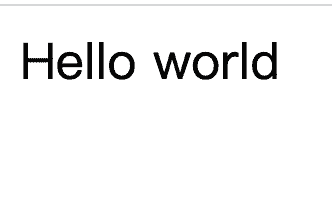
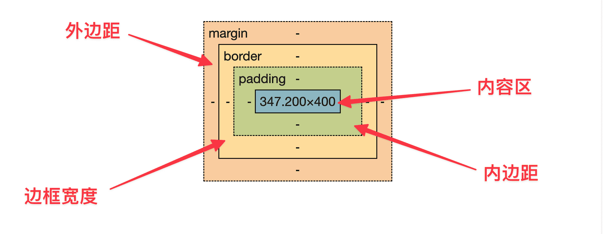

# 配置及其他

## `VS code`

### 安装插件

>   1.   `Live Server`
>   2.   `Auto Rename Tag`

### 设置相关

>   1.   自动格式化, 勾选 `Editor: Format On Save`
>
>        

## [MDN官方文档](https://developer.mozilla.org/zh-CN/plus)

# `HTML`

## `HTML`文件结构

1.   文档结构

     >   `html`的所有标签为树形结构, 例如:
     >
     >   ```html
     >   <!DOCTYPE html>
     >   <html lang="zh-CN">
     >   
     >   <head>
     >       <meta charset="UTF-8">
     >       <meta name="viewport" content="width = device-width, initial-scale = 1.0">
     >       <title>Web应用课</title>
     >   </head>
     >   
     >   <body>
     >       <h1>第一讲</h1>
     >   </body>
     >   
     >   </html>
     >   ```
     >
     >   其树形图如下所示:
     >
     >   

2.   `meta` 标签

     >   常用属性: `description`, `keywords`
     >
     >   +   `description` 作用: 搜索引擎中关于网站的描述
     >
     >       
     >
     >   +   `keywords` 作用: 搜索引擎收录的网站关键字
     >
     >       
     >
     >   用法如下:
     >
     >   ```html
     >   <meta name="keywords" content="算法,计算机,人工智能">
     >   <meta name="description" content="组队刷怪">
     >   ```

3.   `link` 标签

     >   常用属性: `icon`
     >
     >   +   `icon` 作用: 网站的 `logo`
     >
     >       
     >
     >   用法如下:
     >
     >   ```html
     >   <link rel="icon" href="/images/logo.png">
     >   ```

4.   多行注释

     >   用法如下:
     >
     >   ```html
     >   <body>
     >       <!-- 这是第一条注释 -->
     >       <h1>第一讲</h1>
     >   </body>
     >   ```

## 文本标签

1.   绝大部分文本标签可以看成带有 `css` 样式的 `div` 或者 `span` 标签

2.   `div` 标签

     >   定位: 块状标签(默认带回车符 `\n` )
     >
     >   
     >
     >   用法如下:
     >
     >   ```html
     >   <body>
     >       <div>Hello</div>
     >       <div>world</div>
     >   </body>
     >   ```
     >
     >   优点:
     >
     >   +   便于调整 `css` 样式, `div` 可以看做一个整体, 可用于对整体进行样式调整
     >   +   方便 `js` 操作, `js` 可以方便的对于 `div` 进行各种操作

3.   `span` 标签

     >   定位: 行内标签(默认无回车符 `\n`)
     >
     >   
     >
     >   用法如下:
     >
     >   ```html
     >   <body>
     >       <span>Hello</span>
     >       <span>world</span>
     >   </body>
     >   ```

4.   `h1` 标签

     >   定位: 带有 `css` 样式的 `div` 标签
     >
     >   
     >
     >   内置了预先设置好的样式, 其他块状元素或者行内元素同理
     >
     >   用法如下:
     >
     >   ```html
     >   <body>
     >       <h1>Hello world</h1>
     >   </body>
     >   ```

5.   `pre` 标签

     >   作用: 保留原格式中的空格 `space` 和回车 `\n`
     >
     >   
     >
     >   内置了预先设置好的样式, 其他块状元素或者行内元素同理
     >
     >   用法如下:
     >
     >   ```html
     >   <body>
     >       <pre>
     >   #include &lt;iostream&gt;
     >   using namespace std;
     >   int main() {
     >       int a, b;
     >       cin &gt;&gt; a &gt;&gt; b;
     >       cout &lt;&lt; a + b &lt;&lt; endl;
     >       return 0;
     >   }
     >       </pre>
     >   </body>
     >   ```

## 图片标签

>   常用属性: `width`、`height`、`src`、`alt`
>
>   +   `width` 作用: 调整宽度, 默认单位: `px`, 只写宽度不写高度, 会自动将高度等比例缩放
>   +   `height` 作用: 调整高度, 默认单位: `px`, 只写高度不写宽度, 会自动将宽度等比例缩放
>   +   `src` 作用: 图片路径
>   +   `alt` 作用: 当图片加载不出来时, 进行信息的显示
>
>   定位: 行内标签 ``, 当一行放不下的时候, 自动换行
>
>   
>
>   用法如下:
>
>   ```html
>   <body>
>       <h1>Hello World</h1>
>       
>       
>       
>       
>   </body>
>   ```

## 音频

>   1.   第一种方式
>
>        ```html
>        <!-- controls控制音频出现 -->
>        <audio controls src="/audios/bgm1.mp3">Audios</audio>
>        ```
>
>   2.   第二种方式
>
>        ```html
>        <audio controls>
>            <!-- 如果第一个显示不出来, 则显示第二个, 依次类推 -->
>            <source src="/audios/bgm2.mp3" type="audio/mpeg">
>            <source src="/audios/bgm3.mp3" type="audio/mpeg">
>        </audio>
>        ```

## 视频

>   1.   第一种方式
>
>        ```html
>        <!-- 显示控制栏、宽度、地址 -->
>        <video controls width="300" src="/videos/video1.mp4">视频</video>
>        ```
>
>   2.   第二种方式
>
>        ```html
>        <!-- 第一个不能播放, 则播放第二个, 以此类推 -->
>        <video controls width="300">
>            <source src="/videos/video1.mp4" type="video/mp4">
>            <source src="/videos/video2.mp4" type="video/mp4">
>        </video>
>        ```

## 超链接

>   1.   用法
>
>        ```html
>        <!-- 跳转的地址 -->
>        <!-- 新标签页打开 -->
>        <a href="https://www.acwing.com" target="_blank">
>            
>        </a>
>        ```

## 表单

>   1.   用法
>
>        ```html
>        <!DOCTYPE html>
>        <html lang="zh-CN">
>        <head>
>            <meta charset="UTF-8">
>            <meta name="viewport" content="width=device-width, initial-scale=1.0">
>            <meta name="keywords" content="算法,计算机,人工智能">
>            <meta name="description" content="组队刷怪">
>            <link rel="icon" href="/images/logo.png">
>            <title>Web应用课</title>
>        </head>
>        <body>
>            <!-- action表示点击提交按钮之后, 跳转到某个表单 -->
>            <!-- 注意: 参数也会进行传递 -->
>            <form action="/about.html">
>                <!-- label用于绑定input标签 -->
>                <!-- 绑定的是ID -->
>                <label for="username">用户名</label>
>                <!-- type填写的是类型 -->
>                <!-- required表示当前字段必须填写 -->
>                <!-- placeholder提示符 -->
>                <!-- name在url中会做名称, 看下图 -->
>                <input type="text" required placeholder="用户名" maxlength="10" minlength="3" name="username" id="username">
>                <br>
>                <label for="age">年龄</label>
>                <input type="number" placeholder="年龄" name="age" id="age">
>                <br>
>                <label for="email">邮箱</label>
>                <input type="email" placeholder="邮箱" name="email" id="email">
>                <br>
>                <label for="">密码</label>
>                <input type="password" required placeholder="密码" name="password" id="password">
>                <br>
>                <!-- 当类型是选框的时候, 所有name一样的值都必须归为同一组, 即同一组只能选择一个 -->
>                <label for="cpp">c++</label>
>                <input type="radio" name="lang" value="c++" id="cpp">
>                <br>
>                <label for="java">java</label>
>                <input type="radio" name="lang" id="java">
>                <br>
>                <label for="python">python</label>
>                <input type="radio" name="lang" id="python">
>                <br>
>                <!-- 文本域 -->
>                <textarea type="textarea" rows="10" cols="30" name="comment" id="comment"></textarea>
>                <br>
>                <select value="lang">
>                    <!-- 默认选择第一个 -->
>                    <option value="java">java</option>
>                    <option value="python">python</option>
>                    <option value="c++">c++</option>
>                </select>
>                <button type="submit">提交</button>
>            </form>
>        </body>
>        </html>
>        ```
>
>   2.   图片 `1`
>
>        
>
>        图片 `2`
>
>        

## 列表

>   1.   用法
>
>        ```html
>        <!DOCTYPE html>
>        <html lang="zh-CN">
>                                                                                   
>        <head>
>            <meta charset="UTF-8">
>            <meta name="viewport" content="width=device-width, initial-scale=1.0">
>            <meta name="keywords" content="算法,计算机,人工智能">
>            <meta name="description" content="组队刷怪">
>            <link rel="icon" href="/images/logo.png">
>            <title>Web应用课</title>
>        </head>
>                                                                                   
>        <body>
>            <!-- 每个ol或者ul里面都需要有li标签 -->
>            <ol>
>                <li>
>                    chinese
>                    <ul>
>                        <li>Beijing</li>
>                    </ul>
>                    <ul>
>                        <li>Shanghai</li>
>                    </ul>
>                    <ul>
>                        <li>Guangzhou</li>
>                    </ul>
>                </li>
>                <li>
>                    english
>                    <ul>
>                        <li>New York</li>
>                    </ul>
>                    <ul>
>                        <li>London</li>
>                    </ul>
>                    <ul>
>                        <li>Pari</li>
>                    </ul>
>                </li>
>            </ol>
>        </body>
>                                                                                   
>        </html>
>        ```

## 表格

>   1.   用法
>
>        ```html
>        <!DOCTYPE html>
>        <html lang="en">
>        <head>
>            <meta charset="UTF-8">
>            <meta http-equiv="X-UA-Compatible" content="IE=edge">
>            <meta name="viewport" content="width=device-width, initial-scale=1.0">
>            <title>Document</title>
>        </head>
>        <body>
>            <table>
>                <!-- 表格标题 -->
>                <caption>成绩单</caption>
>                <!-- 标题栏 -->
>                <thead>
>                    <!-- 每一行使用tr包裹起来 -->
>                    <tr>
>                        <th>姓名</th>
>                        <th>语文</th>
>                        <th>数学</th>
>                        <th>英语</th>
>                    </tr>
>                </thead>
>                <!-- 正文 -->
>                <tbody>
>                    <tr>
>                        <td>wyp</td>
>                        <td>100</td>
>                        <td>100</td>
>                        <td>100</td>
>                    </tr>
>                    <tr>
>                        <td>sarah</td>
>                        <td>101</td>
>                        <td>101</td>
>                        <td>101</td>
>                    </tr>
>                </tbody>
>            </table>
>        </body>
>        </html>
>        ```

## 语义标签

>   1.   用法
>
>        ```html
>        <!DOCTYPE html>
>        <html lang="en">
>        <head>
>            <meta charset="UTF-8">
>            <meta http-equiv="X-UA-Compatible" content="IE=edge">
>            <meta name="viewport" content="width=device-width, initial-scale=1.0">
>            <title>Document</title>
>        </head>
>        <body>
>            <!-- 头部内容 -->
>            <header>
>                <h3>我的收藏</h3>
>                <!-- 导航栏 -->
>                <nav>
>                    <ul>
>                        <li><a href="">编辑</a></li>
>                        <li><a href="">联系我</a></li>
>                        <li><a href="">关于我</a></li>
>                    </ul>
>                </nav>
>            </header>
>            <hr>
>            <!-- 正文 -->
>            <section>
>                <h4>图片</h4>
>                <!-- 代表一段独立内容 -->
>                <!-- 通常与<figcaption>配合使用 -->
>                <figure>
>                    
>                    <!-- 通常作为figure的标注 -->
>                    <figcaption>logo</figcaption>
>                </figure>
>                <figure>
>                    
>                    <figcaption>mountain</figcaption>
>                </figure>
>            </section>
>            <section>
>                <h4>文章</h4>
>                <article>
>                    <h5>背影</h5>
>                    <p>背影背影背影背影背影背影背影背影背影背影背影背影背影背影背影背影背影背影背影背影背影背影背影</p>
>                    <p>背影背影背影背影背影背影背影背影背影背影背影背影背影背影背影背影背影背影背影背影背影背影背影</p>
>                </article>
>            </section>
>            <hr>
>            <!-- 页脚 -->
>            <footer>
>                &copy;2000-2022 wyp 版权所有
>            </footer>
>        </body>
>        </html>
>        ```

## 特殊符号

>   | HTML源代码 | 显示结果 |          描述          |
>   | :--------: | :------: | :--------------------: |
>   |   `&lt;`   |    <     |   小于号或者显示标记   |
>   |   `&gt;`   |    >     |   大于号或者显示标记   |
>   |  `&amp;`   |    &     | 可用于显示其他特殊字符 |
>   |  `&quot;`  |    “     |          引号          |
>   |  `&reg;`   |    ®     |         已注册         |
>   |  `&copy;`  |    ©     |          版权          |
>   | `&trade;`  |    ™     |          商标          |
>   |  `&nbsp;`  |          |      不断行的空白      |

# `CSS`

## 样式定义方式

### 行内样式表

>   1.   用法:
>
>        ```html
>        <body>
>            <!-- 注意点: 必须带单位, 因为width可能有多个单位, 例如: vh, em等等 -->
>            <div style="width: 100px; height: 100px; background-color: red">侬好</div>
>        </body>
>        ```

### 内部样式表

>   1.   用法
>
>        ```html
>        <!DOCTYPE html>
>        <html lang="en">
>        <head>
>            <meta charset="UTF-8">
>            <meta http-equiv="X-UA-Compatible" content="IE=edge">
>            <meta name="viewport" content="width=device-width, initial-scale=1.0">
>            <title>Document</title>
>            <!-- 定义内部样式表 -->
>            <style type="text/css">
>                /* 修改所有的div类 */
>                div {
>                    width: 50px;
>                    height: 50px;
>                    background-color: lightblue;
>                }
>                                                                    
>                /* 所有所有类名为div_color的 */
>                .div_color {
>                    background-color: lightcoral;
>                }
>                                                                    
>                /* 修饰所有类名为div_size的 */
>                .div_size {
>                    width: 100px;
>                    height: 100px;
>                }
>            </style>
>        </head>
>        <body>
>            <div class="div_size">你好</div>
>            <br>
>            <div>侬好</div>
>            <br>
>            <!-- 可以定义多个类名, 使用空格隔开即可 -->
>            <div class="div_color div_size">Hello</div>
>        </body>
>        </html>
>        ```

### 外部样式表

>   1.   用法
>
>        ```html
>        <!DOCTYPE html>
>        <html lang="en">
>        <head>
>            <meta charset="UTF-8">
>            <meta http-equiv="X-UA-Compatible" content="IE=edge">
>            <meta name="viewport" content="width=device-width, initial-scale=1.0">
>            <!-- 可以链接多个css文件 -->
>            <!-- 后面的css会覆盖掉前面的css, 原因: 按照顺序执行 -->
>            <link rel="stylesheet" href="/static/css/style.css" type="text/css">
>            <title>Document</title>
>        </head>
>        <body>
>            <div class="div_size">你好</div>
>            <br>
>            <div>侬好</div>
>            <br>
>            <!-- 可以定义多个类名, 使用空格隔开即可 -->
>            <div class="div_color div_size">Hello</div>
>        </body>
>        </html>
>        ```

## 选择器

### 标签选择器

>   1.   `html` 小白鼠
>
>        ```html
>        <!DOCTYPE html>
>        <html lang="en">
>        <head>
>            <meta charset="UTF-8">
>            <meta http-equiv="X-UA-Compatible" content="IE=edge">
>            <meta name="viewport" content="width=device-width, initial-scale=1.0">
>            <link rel="stylesheet" href="/static/css/style.css" type="text/css">
>            <title>Document</title>
>        </head>
>        <body>
>            <div>div 1</div>
>            <div>div 2</div>
>            <div>div 3</div>
>            <p>p 1</p>
>            <p>p 2</p>
>            <p>p 3</p>
>        </body>
>        </html>
>        ```
>
>   2.    `css`
>
>        ```css
>        div {
>            width: 100px;
>            height: 100px;
>            margin-bottom: 10px;
>            background-color: lightblue;
>        }
>                                                                    
>        p {
>            width: 100px;
>            height: 100px;
>            background-color: lightcoral;
>        }
>        ```

### `ID` 选择器

>   1.   `html` 小白鼠
>
>        ```html
>        <!DOCTYPE html>
>        <html lang="en">
>        <head>
>            <meta charset="UTF-8">
>            <meta http-equiv="X-UA-Compatible" content="IE=edge">
>            <meta name="viewport" content="width=device-width, initial-scale=1.0">
>            <link rel="stylesheet" href="/static/css/style.css" type="text/css">
>            <title>Document</title>
>        </head>
>        <body>
>            <div>div 1</div>
>            <div>div 2</div>
>            <div id="mydiv">div 3</div>
>            <p>p 1</p>
>            <p id="myp">p 2</p>
>            <p>p 3</p>
>        </body>
>        </html>
>        ```
>
>   2.   `css`
>
>        ```css
>        #mydiv {
>            background-color: brown;
>        }
>                                                                    
>        #myp {
>            background-color: purple;
>        }
>        ```

### 类选择器

>   1.   `html` 小白鼠
>
>        ```html
>        <!DOCTYPE html>
>        <html lang="en">
>        <head>
>            <meta charset="UTF-8">
>            <meta http-equiv="X-UA-Compatible" content="IE=edge">
>            <meta name="viewport" content="width=device-width, initial-scale=1.0">
>            <link rel="stylesheet" href="/static/css/style.css" type="text/css">
>            <title>Document</title>
>        </head>
>        <body>
>            <!-- 具有两个类: 既具有颜色类又具有尺寸类 -->
>            <!-- 
>                注意: 
>                    1. 其有两个执行顺序
>                        -> div标签内嵌的顺序, 即 color_tag ===> size_tag
>                        -> 外部样式表定义的顺序, 即 size_tag ===> color_tag
>                    2. 应该以哪个作为标准??
>                        答: 以外部样式表的顺序作为标准, 即 size_tag的优先级 > color_tag的优先级
>            -->
>            <div class="color_tag size_tag">div 1</div>
>            <div>div 2</div>
>            <div>div 3</div>
>            <!-- 具有颜色类 -->
>            <p class="color_tag">p 1</p>
>            <p>p 2</p>
>            <!-- 具有尺寸类 -->
>            <p class="size_tag">p 3</p>
>        </body>
>        </html>
>        ```
>
>   2.   `css`
>
>        ```css
>        .size_tag {
>            width: 200px;
>            height: 200px;
>        }
>                                                                    
>        .color_tag {
>            background-color: lightblue;
>        }
>        ```

### 伪类选择器

#### 链接伪类选择器

>   1.   `html` 小白鼠
>
>        ```html
>        <!DOCTYPE html>
>        <html lang="en">
>        <head>
>            <meta charset="UTF-8">
>            <meta http-equiv="X-UA-Compatible" content="IE=edge">
>            <meta name="viewport" content="width=device-width, initial-scale=1.0">
>            <link rel="stylesheet" href="/static/css/style.css" type="text/css">
>            <title>Document</title>
>        </head>
>        <body>
>            <a href="/about.html">about</a>
>            <br>
>            <button>按钮</button>
>            <br>
>            <input type="text">
>        </body>
>        </html>
>        ```
>
>   2.   `css`
>
>        ```css
>        div {
>            width: 100px;
>            height: 100px;
>            margin-bottom: 10px;
>            background-color: lightblue;
>        }
>                                                                    
>        p {
>            width: 100px;
>            height: 100px;
>            background-color: lightcoral;
>        }
>                                                                    
>        /* 链接访问前的样式 */
>        a:link {
>            /* 设置字体的颜色 */
>            color: aquamarine;
>        }
>                                                                    
>        /* 链接访问过后的样式 */
>        a:visited {
>            /* 设置字体的颜色 */
>            color: purple;
>        }
>                                                                    
>        /* 鼠标悬停的样式 */
>        a:hover {
>            /* 设置字体的颜色 */
>            color: blue;
>        }
>                                                                    
>        /* 鼠标长按的样式 */
>        a:active {
>            /* 设置字体的颜色 */
>            color: coral;
>        }
>                                                                    
>        /* 鼠标悬停的样式 */
>        button:hover {
>            /* 设置字体的颜色 */
>            color: white;
>            /* 设置背景颜色 */
>            background-color: deepskyblue;
>        }
>                                                                    
>        /* 鼠标悬停的样式 */
>        input:hover {
>            /* 改变宽度 */
>            width: 250px;
>        }
>                                                                    
>        /* 聚焦后的样式 */
>        input:focus {
>            /* 放大1.2倍 */
>            transform: scale(1.2);
>            /* 过渡时间: 200毫秒 */
>            transition: 200ms;
>        }
>        ```

#### 位置伪类选择器

>   1.   `html` 小白鼠
>
>        ```html
>        <!DOCTYPE html>
>        <html lang="en">
>        <head>
>            <meta charset="UTF-8">
>            <meta http-equiv="X-UA-Compatible" content="IE=edge">
>            <meta name="viewport" content="width=device-width, initial-scale=1.0">
>            <link rel="stylesheet" href="/static/css/style.css" type="text/css">
>            <title>Document</title>
>        </head>
>        <body>
>            <div>div 1</div>
>            <p>p 1</p>
>            <p>p 2</p>
>            <p>p 3</p>
>            <p>p 4</p>
>            <p>p 5</p>
>            <p>p 6</p>
>            <p>p 7</p>
>            <p>p 8</p>
>            <p>p 9</p>
>            <p>p 10</p>
>        </body>
>        </html>
>        ```
>
>   2.   `css`
>
>        ```c++
>        div {
>            width: 50px;
>            height: 50px;
>            margin-bottom: 10px;
>        }
>                                                                    
>        /*
>            nth:child()求的是其父标签的第i个孩子是否满足条件
>            如: p:nth-child(even)求的是所有偶数标签
>            第一个标签是div
>            第二个标签是p, 其是父标签body的第二个标签了, 是偶数, 故应用此样式
>            第三个标签是p, 其是父标签body的第三个标签了, 是奇数, 故不应用此样式
>            ...
>            最终, 应用此样式对应的是p中的1, 3, 5, ..., 是奇数, 而不是偶数
>            原因: 不是以p为基准, 而是以其父节点body为标准, 从上往下开始数, 1, 2, ...
>        */
>        p:nth-child(even) {
>            width: 50px;
>            height: 50px;
>            background-color: lightcoral;
>        }
>        ```

#### 目标伪类选择器

>   1.   `html` 小白鼠
>
>        ```html
>        <!DOCTYPE html>
>        <html lang="en">
>        <head>
>            <meta charset="UTF-8">
>            <meta http-equiv="X-UA-Compatible" content="IE=edge">
>            <meta name="viewport" content="width=device-width, initial-scale=1.0">
>            <link rel="stylesheet" href="/static/css/style.css" type="text/css">
>            <title>Document</title>
>        </head>
>        <body>
>            <!-- 链接指向对应的id标签 -->
>            <a href="#btn">链接</a>
>            <div>div 1</div>
>            <div>div 2</div>
>            <div>div 3</div>
>            <div>div 4</div>
>            <div>div 5</div>
>            <div>div 6</div>
>            <div id="btn">div 7</div>
>            <div>div 8</div>
>            <div>div 9</div>
>            <div>div 10</div>
>        </body>
>        </html>
>        ```
>
>   2.   `css`
>
>        ```c++
>        div {
>            width: 150px;
>            height: 150px;
>            margin-bottom: 10px;
>            background-color: lightblue;
>        }
>                                                                    
>        /* 当页面的url指向该元素时, 触发此样式 */
>        /* 页面地址: http://127.0.0.1:5500/index.html#btn */
>        /* 地址含有#btn即为指向该元素, 否则, 没有 */
>        #btn:target {
>            transform: scale(1.5);
>            transition: 2s;
>            background-color: purple;
>        }
>        ```

### 复合选择器

>   1.   `html` 小白鼠
>
>        ```html
>        <!DOCTYPE html>
>        <html lang="en">
>        <head>
>            <meta charset="UTF-8">
>            <meta http-equiv="X-UA-Compatible" content="IE=edge">
>            <meta name="viewport" content="width=device-width, initial-scale=1.0">
>            <link rel="stylesheet" href="/static/css/style.css" type="text/css">
>            <title>Document</title>
>        </head>
>        <body>
>            <div class="big">div 1</div>
>            <div>div 2</div>
>            <div class="big color">div 3</div>
>            <p>p 1</p>
>            <p class="big">p 2</p>
>            <p>p 3</p>
>            <p>p 4</p>
>            <ul>
>                <li>
>                    1
>                    <ul>
>                        <li>1.1</li>
>                        <li>1.2</li>
>                        <li>1.3</li>
>                    </ul>
>                </li>
>                <li>
>                    2
>                </li>
>                <li>
>                    3
>                </li>
>            </ul>
>        </body>
>        </html>
>        ```
>
>   2.   `css`
>
>        ```css
>        /* 同时选中div标签和p标签 */
>        div,
>        p {
>            width: 100px;
>            height: 100px;
>            margin-bottom: 10px;
>            background-color: lightblue;
>        }
>                                                               
>        /* 选中p标签中类名为big的元素 */
>        p.big {
>            width: 200px;
>            height: 200px;
>        }
>                                                               
>        /* 选中div标签中类名同时为big和color的元素 */
>        div.big.color {
>            background-color: purple;
>        }
>                                                               
>        /*  
>            选择紧紧跟着p标签的p标签, 必须是直系父子关系
>            注意: 第一个p标签不会产生效果, 因此, 第一个p标签的父亲并不是p标签
>        */
>        p + p {
>            background-color: red;
>        }
>                                                               
>        /* 选择ul下的所有li标签, 不管是否是直系血亲 */
>        ul li {
>            color: red;
>        }
>                                                               
>        /* 选择li下的ul下的li, 注意: 必须是直系血亲, 即: 只能是父子关系, 不可越辈分 */
>        li > ul > li {
>            color: lightblue;
>        }
>        ```

### 通配符选择器

>   1.   `html` 小白鼠
>
>        ```html
>        <!DOCTYPE html>
>        <html lang="en">
>        <head>
>            <meta charset="UTF-8">
>            <meta http-equiv="X-UA-Compatible" content="IE=edge">
>            <meta name="viewport" content="width=device-width, initial-scale=1.0">
>            <link rel="stylesheet" href="/static/css/style.css">
>            <title>Document</title>
>        </head>
>        <body>
>            <input type="text" id="">
>            <input type="number" name="" id="">
>        </body>
>        </html>
>        ```
>
>   2.   `css`
>
>        ```css
>        /* 给所有标签设置样式 */
>        * {
>            background-color: lightblue;
>        }
>                                                               
>        /* 给具有id属性的input标签设置背景颜色 */
>        input[id] {
>            background-color: blue;
>        }
>                                                               
>        /* 给具有type属性并且type属性值为number的标签设置背景颜色 */
>        input[type=number] {
>            background-color: purple;
>        }
>        ```

### 伪元素选择器

>   1.   `html` 小白鼠
>
>        ```html
>        <!DOCTYPE html>
>        <html lang="en">
>        <head>
>            <meta charset="UTF-8">
>            <meta http-equiv="X-UA-Compatible" content="IE=edge">
>            <meta name="viewport" content="width=device-width, initial-scale=1.0">
>            <link rel="stylesheet" href="/static/css/style.css">
>            <title>Document</title>
>        </head>
>        <body>
>            <h2>悯农</h2>
>            <h2>咏柳</h2>
>            <h2>滕王阁序</h2>
>            <h2>静夜思</h2>
>            <p>锄禾日当午,</p>
>            <p>汗滴禾下土。</p>
>            <p>谁知盘中餐,</p>
>            <p>粒粒皆辛苦。</p>
>        </body>
>        </html>
>        ```
>
>   2.   `css`
>
>        ```css
>        /* 给每一行的第一个字母添加颜色 */
>        p::first-letter {
>            color: red;
>        }
>                                                               
>        /* 给第一行的文字添加颜色 */
>        p::first-line {
>            color: purple;
>        }
>                                                               
>        /* 鼠标框选的时候, 字体颜色为红色, 背景颜色为浅绿色 */
>        p::selection {
>            color: red;
>            background-color: lightblue;
>        }
>                                                               
>        /* 在h2标签的前面添加《 */
>        h2::before {
>            content: "《";
>        }
>                                                               
>        /* 在h2标签的后面添加》 */
>        h2::after {
>            content: "》";
>        }
>        ```

### 样式渲染优先级

>   1.   先来先到
>
>   2.   范围越小, 权值越高, 具体而言:
>
>        `!important` `>` 行内样式 `>` ID选择器 `>` 类与伪类选择器 `>` 标签选择器 `>` 通用选择器

## 颜色

>   1.   `html` 小白鼠
>
>        ```html
>        <!DOCTYPE html>
>        <html lang="en">
>        <head>
>            <meta charset="UTF-8">
>            <meta http-equiv="X-UA-Compatible" content="IE=edge">
>            <meta name="viewport" content="width=device-width, initial-scale=1.0">
>            <link rel="stylesheet" href="/static/css/style.css">
>            <title>Document</title>
>        </head>
>        <body>
>            <p>p 1</p>
>            <p>p 2</p>
>            <p>p 3</p>
>            <p>p 4</p>
>        </body>
>        </html>
>        ```
>
>   2.   `css`
>
>        ```css
>        /* 使用系统预设的颜色 */
>        p:first-child {
>            color: red;
>        }
>                                                               
>        /* 使用十六进制设置颜色 */
>        p:nth-child(2) {
>            /* 第一种方式 */
>            color: #ADD8E6;
>            /* 第二种方式, 其等价于#AABBCC */
>            color: #ABC;
>        }
>                                                               
>        /* 使用rgb方式设置颜色, (red, green, blue) */
>        p:nth-child(3) {
>            color: rgb(173, 216, 230);
>        }
>                                                               
>        /* 使用rgba方式设置颜色, 最后的参数是透明度 */
>        p:nth-child(4) {
>            color: rgba(0, 255, 255, 1);
>        }
>        ```

## 文本

### `text-align`

>   1.   简介
>
>        `text-align` `CSS` 属性定义行内内容（例如文字）如何相对它的块父元素对齐。`text-align` 并不控制块元素自己的对齐，只控制它的行内内容的对齐
>
>   2.   `html` 小白鼠
>
>        ```html
>        <!DOCTYPE html>
>        <html lang="en">
>        <head>
>            <meta charset="UTF-8">
>            <meta http-equiv="X-UA-Compatible" content="IE=edge">
>            <meta name="viewport" content="width=device-width, initial-scale=1.0">
>            <link rel="stylesheet" href="/static/css/style.css">
>            <title>Document</title>
>        </head>
>        <body>
>            <h3>悯农</h3>
>            <div>
>                锄禾日当午，<br>
>                汗滴禾下土。<br>
>                谁知盘中餐，<br>
>                粒粒皆辛苦。
>            </div>
>        </body>
>        </html>
>        ```
>
>   3.   `css`
>
>        ```c++
>        h3 {
>            /* 文字居中 */
>            text-align: center;
>        }
>        
>        div {
>            /* 文字居中 */
>            text-align: center;
>        }
>        ```
>
>   4.   注意事项
>
>        +   如果父节点定义了文字的排版, 子节点会继承格式

### `line-height`

>   1.   简介
>
>        `line-height` `CSS` 属性用于设置多行元素的空间量，如多行文本的间距。对于块级元素，它指定元素行盒（`line boxes`）的最小高度。对于非替代的 `inline` 元素，它用于计算行盒（`line box`）的高度
>
>   2.   知识点补充:长度单位
>
>        | 单位  | 描述                                                     |
>        | ----- | -------------------------------------------------------- |
>        | `px`  | 设备上的像素点                                           |
>        | `%`   | 相对于<font style="color: red">父元素</font>的百分比     |
>        | `em`  | 相对于<font style="color: red">当前元素</font>的字体大小 |
>        | `rem` | 相对于<font style="color: red">根元素</font>的字体大小   |
>        | `vw`  | 相对于<font style="color: red">视窗宽度</font>的百分比   |
>        | `vh`  | 相对于<font style="color: red">视窗高度</font>的百分比   |
>
>   3.   `html` 小白鼠
>
>        ```html
>        <!DOCTYPE html>
>        <html lang="en">
>        <head>
>            <meta charset="UTF-8">
>            <meta http-equiv="X-UA-Compatible" content="IE=edge">
>            <meta name="viewport" content="width=device-width, initial-scale=1.0">
>            <link rel="stylesheet" href="/static/css/style.css">
>            <title>Document</title>
>        </head>
>        <body>
>            <div>
>                锄禾日当午
>            </div>
>        </body>
>        </html>
>        ```
>
>   4.   `css`
>
>        ```css
>        div {
>            text-align: center;
>            /* 窗口宽度的50% */
>            width: 50vw;
>            /* 窗口高度的10% */
>            height: 10vh;
>            /* 设置背景颜色 */
>            background-color: lightblue;
>            /* 行高设置为宽度, 则可以让文字水平居中 */
>            line-height: 10vh;
>        }
>        ```

### `letter-spacing`

>   1.   `html` 小白鼠
>
>        ```html
>        <!DOCTYPE html>
>        <html lang="en">
>        <head>
>            <meta charset="UTF-8">
>            <meta http-equiv="X-UA-Compatible" content="IE=edge">
>            <meta name="viewport" content="width=device-width, initial-scale=1.0">
>            <link rel="stylesheet" href="/static/css/style.css">
>            <title>Document</title>
>        </head>
>        <body>
>            <div>
>                锄禾日当午
>            </div>
>        </body>
>        </html>
>        ```
>
>   2.   `css`
>
>        ```css
>        div {
>            /* 设置字与字之间的距离, 为1.5倍的字符 */
>            letter-spacing: 1.5em;
>        }
>        ```

### `text-indent`

>   1.   `html` 小白鼠
>
>        ```html
>        <!DOCTYPE html>
>        <html lang="en">
>        <head>
>            <meta charset="UTF-8">
>            <meta http-equiv="X-UA-Compatible" content="IE=edge">
>            <meta name="viewport" content="width=device-width, initial-scale=1.0">
>            <link rel="stylesheet" href="/static/css/style.css">
>            <title>Document</title>
>        </head>
>        <body>
>            <div>
>                锄禾日当午
>            </div>
>        </body>
>        </html>
>        ```
>
>   2.   `css`
>
>        ```css
>        div {
>            /* 缩进2个字符 */
>            text-indent: 2em;
>        }
>        ```

### `text-decoration`

>   1.   `html` 小白鼠
>
>        ```html
>        <!DOCTYPE html>
>        <html lang="en">
>        <head>
>            <meta charset="UTF-8">
>            <meta http-equiv="X-UA-Compatible" content="IE=edge">
>            <meta name="viewport" content="width=device-width, initial-scale=1.0">
>            <link rel="stylesheet" href="/static/css/style.css">
>            <title>Document</title>
>        </head>
>        <body>
>            <a href="">联系我们</a>
>        </body>
>        </html>
>        ```
>
>   2.   `css`
>
>        ```css
>        a {
>            /* 取消链接的下划线 */
>            text-decoration: none;
>        }
>        ```

### `text-shadow`

>   1.   `html` 小白鼠
>
>        ```html
>        <!DOCTYPE html>
>        <html lang="en">
>        <head>
>            <meta charset="UTF-8">
>            <meta http-equiv="X-UA-Compatible" content="IE=edge">
>            <meta name="viewport" content="width=device-width, initial-scale=1.0">
>            <link rel="stylesheet" href="/static/css/style.css">
>            <title>Document</title>
>        </head>
>        <body>
>            <div>锄禾日当午</div>
>        </body>
>        </html>
>        ```
>
>   2.   `css`
>
>        ```css
>        div {
>            /* 给文字设置阴影 */
>            /* 参数: x坐标, y坐标, 模糊效果, 颜色 */
>            /* 注意: 阴影可以设置多个, 不一定非要一个 */
>            text-shadow: 
>            5px 5px 2px red,
>            -5px -5px 2px  gray
>            ;
>        }
>        ```

## 字体

>   1.   `html` 小白鼠
>
>        ```html
>        <!DOCTYPE html>
>        <html lang="en">
>        <head>
>            <meta charset="UTF-8">
>            <meta http-equiv="X-UA-Compatible" content="IE=edge">
>            <meta name="viewport" content="width=device-width, initial-scale=1.0">
>            <link rel="stylesheet" href="/static/css/style.css">
>            <title>Document</title>
>        </head>
>        <body>
>            <div>锄禾日当午</div>
>        </body>
>        </html>
>        ```
>
>   2.   `css`
>
>        ```css
>        div {
>            /* 字体大小 */
>            font-size: 24px;
>            /* 字体样式: 斜体 */
>            font-style: italic;
>            /* 字体粗细: 范围(1~1000), 注意: 无单位 */
>            font-weight: 600;
>            /* 设置字体 */
>            font-family: Courier;
>        }
>        ```

## 背景

>   1.   `html` 小白鼠
>
>        ```html
>        <!DOCTYPE html>
>        <html lang="en">
>        <head>
>            <meta charset="UTF-8">
>            <meta http-equiv="X-UA-Compatible" content="IE=edge">
>            <meta name="viewport" content="width=device-width, initial-scale=1.0">
>            <link rel="stylesheet" href="/static/css/style.css">
>            <title>Document</title>
>        </head>
>        <body>
>            <div></div>
>        </body>
>        </html>
>        ```
>
>   2.   `css`
>
>        ```css
>        div {
>            /* 宽度 */
>            width: 200px;
>            /* 高度 */
>            height: 200px;
>            /* 设置背景颜色 */
>            background-color: lightblue;
>            /* 背景图片 */
>            background-image: url('/static/images/mountain.jpeg');
>            /* 是否拉伸 */
>            background-repeat: no-repeat;
>            /* 背景图片大小 */
>            /* cover表示全部覆盖 */
>            background-size: cover;
>            /* 设置背景初始的位置:水平位置, 垂直位置 */
>            background-position: 10px 50px;
>            /* 固定在屏幕的绝对位置 */
>            background-attachment: fixed;
>        }
>        ```

## 边框

>   1.   `html` 小白鼠
>
>        ```html
>        <!DOCTYPE html>
>        <html lang="en">
>        <head>
>            <meta charset="UTF-8">
>            <meta http-equiv="X-UA-Compatible" content="IE=edge">
>            <meta name="viewport" content="width=device-width, initial-scale=1.0">
>            <link rel="stylesheet" href="/static/css/style.css">
>            <title>Document</title>
>        </head>
>        <body>
>            <div></div><br>
>            <div></div><br>
>            <div></div>
>            <table>
>                <tbody>
>                    <tr>
>                        <td></td>
>                        <td></td>
>                        <td></td>
>                    </tr>
>                    <tr>
>                        <td></td>
>                        <td></td>
>                        <td></td>
>                    </tr>
>                    <tr>
>                        <td></td>
>                        <td></td>
>                        <td></td>
>                    </tr>
>                </tbody>
>            </table>
>        </body>
>        </html>
>        ```
>
>   2.   `css`
>
>        ```css
>        div {
>            /* 宽度 */
>            width: 100px;
>            /* 高度 */
>            height: 100px;
>            /* 背景颜色 */
>            background-color: lightblue;
>            /* 边框的样式, 实线 */
>            border-style: solid;
>            /* 边框的宽度 */
>            border-width: 5px;
>            /* 边框的颜色 */
>            border-color: black gray green blue;
>            /* 边框的圆角半径 */
>            border-radius: 50%;
>        }
>                                                
>        td {
>            /* 宽度 */
>            width: 50px;
>            /* 高度 */
>            height: 50px;
>            /* 边框的样式 */
>            border-style: solid;
>        }
>                                                
>        table {
>            /* 单元格之间是否进行合并还是分隔 */
>            border-collapse: collapse;
>        }
>        ```

## 元素展示格式

>   +   `display`
>       +   `block`
>           +   独占一行
>           +   `width`、`height`、`margin`、`padding` 均可控制
>               +   内边距 `padding` 会更改元素的大小
>           +   `width` 默认 `100%`
>       +   `inline`
>           +   可以共占一行
>           +   `width`与`height`无效，水平方向的`margin`与`padding`有效，竖直方向的`margin`与`padding`无效
>           +   `width`默认为本身内容宽度
>       +   `inline-block`
>           +   可以共占一行
>           +   `width`、`height`、`margin`、`padding`均可控制
>           +   `width`默认为本身内容宽度
>   +   `white-space`
>       +   `CSS` 属性是用来设置如何处理元素中的 空白 (`en-US`)
>   +   `text-overflow`
>       +   `CSS` 属性确定如何向用户发出未显示的溢出内容信号。它可以被剪切，显示一个省略号或显示一个自定义字符串
>   +   `overflow`
>       +   `CSS`属性 `overflow` 定义当一个元素的内容太大而无法适应 块级格式化上下文 时候该做什么。它是 `overflow-x` 和 `overflow-y` 的 简写属性
>
>   1.   `html` 小白鼠
>
>        ```html
>        <!DOCTYPE html>
>        <html lang="en">
>        <head>
>            <meta charset="UTF-8">
>            <meta http-equiv="X-UA-Compatible" content="IE=edge">
>            <meta name="viewport" content="width=device-width, initial-scale=1.0">
>            <link rel="stylesheet" href="/static/css/style.css">
>            <title>Document</title>
>        </head>
>        <body>
>            <div>离离原上草</div>
>            <span>一岁一枯荣一岁一枯荣一岁一枯荣一岁一枯荣一岁一枯荣一岁一枯荣一岁一枯荣一岁一枯荣一岁一枯荣一岁一枯荣</span>
>            
>            <div>
>        int main() {
>            int a, b;
>            cin >> a >> b;
>            return 0;
>        }
>            </div>
>        </body>
>        </html>
>        ```
>
>   2.   `css`
>
>        ```css
>        div {
>            /* 宽度 */
>            width: 800px;
>            /* 高度 */
>            height: 500px;
>            /* 外边距 */
>            margin: 10px;
>            /* 内边距 */
>            padding: 20px;
>            /* 背景颜色 */
>            background-color: lightblue;
>            /* 强行修改成行内元素 */
>            display: inline;
>            /* 设置空白 */
>            white-space: pre;
>        }
>                                                
>        span {
>            /* 设置宽度 */
>            width: 50px;
>            /* 设置高度 */
>            height: 100px;
>            /* 设置左外边距 */
>            margin-left: 50px;
>            /* 设置左内边距 */
>            padding-left: 20px;
>            /* 设置背景颜色 */
>            background-color: gray;
>            /* 强行修改成块状元素 */
>            display: block;
>            /* 当元素的内容超出元素的大小 */
>            overflow: hidden;
>            /* 如何处理超出的内容元素 */
>            text-overflow: ellipsis;
>        }
>                                                
>        img {
>            /* 宽度 */
>            width: 50px;
>            /* 高度 */
>            height: 50px;
>            /* 外边距 */
>            margin: 5px;
>            /* 内边距 */
>            padding: 20px;
>        }
>        ```

## 内边距与外边距

### 理论

>   1.   
>
>   2.   `margin` 属性
>
>        `margin` 属性为给定元素设置所有四个（上下左右）方向的外边距属性。
>
>        +   可以接受`1~4`个值（上、右、下、左的顺序）
>        +   可以分别指明四个方向：`margin-top`、`margin-right`、`margin-bottom`、`margin-left`
>        +   可取值
>            +   `length`：固定值
>            +   `percentage`：相对于包含块的宽度，以百分比值为外边距。
>            +   `auto`：让浏览器自己选择一个合适的外边距。有时，在一些特殊情况下，该值可以使元素居中。
>                外边距重叠
>
>        +   块的上外边距(`margin-top`)和下外边距(`margin-bottom`)有时合并(折叠)为单个边距，其大小为单个边距的最大值(或如果它们相等，则仅为其中一个)，这种行为称为边距折叠。
>        +   父元素与后代元素：父元素没有上边框和`padding`时，后代元素的`margin-top`会溢出，溢出后父元素的`margin-top`会与后代元素取最大值。
>
>   3.   `padding`
>
>        `padding` `CSS` 简写属性控制元素所有四条边的内边距区域。
>
>        +   可以接受`1~4`个值（上、右、下、左的顺序）
>        +   可以分别指明四个方向：`padding-top`、``padding-right``、`padding-bottom`、`padding-left`
>        +   可取值
>            +   `length`：固定值
>            +   `percentage`：相对于包含块的宽度，以百分比值为内边距。
>        +   <font style="color: red">**注意点**</font>
>            +   `padding` 会将原本的元素撑大, 具体来说, 块的宽度等于元素的宽度 + 内边距的宽度 + 边框的宽度 + 外边距的宽度

### 疑难杂症

#### 分离父、子元素

>   1.   实际结果
>
>        
>
>   2.   希望结果
>
>        
>
>   3.   解决方案
>
>        +   `html` 代码
>
>            ```html
>            <!DOCTYPE html>
>            <html lang="en">
>            <head>
>                <meta charset="UTF-8">
>                <meta http-equiv="X-UA-Compatible" content="IE=edge">
>                <meta name="viewport" content="width=device-width, initial-scale=1.0">
>                <link rel="stylesheet" href="/static/css/style.css">
>                <title>Document</title>
>            </head>
>            <body style="margin: 0px;">
>                <div class="outer_div">
>                    <div class="inner_div"></div>
>                </div>
>            </body>
>            </html>
>            ```
>
>        +   `css` 代码
>
>            ```css
>            .outer_div {
>                width: 300px;
>                height: 400px;
>                background-color: green;
>                /* 解决的问题: 如何让子元素距离父元素有距离, 而不是子元素带着父元素一起有距离 */
>                /* 第一种方案, 其缺点: 必须设置边框, 其宽度大于等于1px */
>                /* border-top: 1px solid; */
>                /* 第二种方案, 其缺点, 同上 */
>                /* padding-top: 1px; */
>                /* 第三种方案, 其缺点: 当用到overflow属性的时候, 会产生冲突 */
>                /* overflow: hidden; */
>            }
>                                                                  
>            /* 第四种方案, 好!!Great!!, 在父元素的前面添加一个空元素即可 */
>            .outer_div::before {
>                content: "";
>                display: table;
>            }
>                                                                  
>            .inner_div {
>                width: 130px;
>                height: 130px;
>                background-color: black;
>                margin-top: 10px;
>            }
>            ```

#### 边距叠加

>   1.   问题描述
>        +   当上元素拥有下边界 `margin-bottom` 并且上元素拥有上边界 `margin-top` 的时候, 会产生叠加效果, 即取两者的最大值 `max(margin-bottom, margin-top)` 作为其间隔
>   2.   注意: 左边界 `margin-left` 和右边界 `margin-right` 不会出现此情况, 此时, 两者会进行叠加

## 盒子模型

>   **box-sizing**
>
>   ​	`CSS` 中的 `box-sizing` 属性定义了 `user agent` 应该如何计算一个元素的总宽度和总高度。
>
>   +   `content-box`：是默认值，设置 `border` 和 `padding` 均会增加元素的宽高。
>   +   `border-box`：设置 `border` 和 `padding` 不会改变元素的宽高，而是挤占内容区域。

## 位置

>   **`position`**
>
>   ​	`CSS position` 属性用于指定一个元素在文档中的定位方式。
>
>   **定位类型**
>
>   +   定位元素（`positioned element`）是其计算后位置属性为 `relative`, `absolute`, `fixed` 或 `sticky` 的一个元素（换句话说，除`static`以外的任何东西）。
>   +   相对定位元素（`relatively positioned element`）是计算后位置属性为 `relative` 的元素。
>   +   绝对定位元素（`absolutely positioned element`）是计算后位置属性为 `absolute` 或 `fixed` 的元素。
>   +   粘性定位元素（`stickily positioned element`）是计算后位置属性为 `sticky` 的元素。
>
>   **取值：**
>
>   +   `static`：该关键字指定元素使用正常的布局行为，即<font style="color: red">元素在文档常规流中当前的布局位置</font>。此时 `top`, `right`, `bottom`, `left` 和 `z-index` 属性无效。
>   +   `relative`：该关键字下，元素先放置在未添加定位时的位置，再在不改变页面布局的前提下调整元素位置（因此<font style="color: red">会在此元素未添加定位时所在位置留下空白</font>）。`top`, `right`, `bottom`, `left`等调整元素相对于初始位置的偏移量。
>   +   `absolute`：<font style="color: red">元素会被移出正常文档流，并不为元素预留空间</font>，通过指定元素相对于最近的非 `static` 定位祖先元素的偏移，来确定元素位置。绝对定位的元素可以设置外边距（`margins`），且不会与其他边距合并。
>   +   `fixed`：<font style="color: red">元素会被移出正常文档流，并不为元素预留空间</font>，而是通过指定元素相对于屏幕视口（`viewport`）的位置来指定元素位置。元素的位置在屏幕滚动时不会改变。
>   +   `sticky`：元素根据正常文档流进行定位，然后相对它的最近滚动祖先（`nearest scrolling ancestor`）和 `containing block` (最近块级祖先 `nearest block-level ancestor`)，包括`table-related`元素，基于`top`, `right`, `bottom`, 和 `left`的值进行偏移。偏移值不会影响任何其他元素的位置。

## 浮动

>   **`float`**
>
>   ​	`float` `CSS`属性指定一个元素应沿其容器的左侧或右侧放置，允许文本和内联元素环绕它。该元素从网页的正常流动(文档流)中移除，尽管仍然保持部分的流动性（与绝对定位相反）。
>
>   由于`float`意味着使用块布局，它在某些情况下修改`display` 值的计算值：
>
>   +   `display`为`inline`或`inline-block`时，使用`float`后会统一变成`block`。
>
>   **取值：**
>
>   +   `left`：表明元素必须浮动在其所在的块容器左侧的关键字。
>   +   `right`：表明元素必须浮动在其所在的块容器右侧的关键字。
>
>   **`clear`**
>   有时，你可能想要强制元素移至任何浮动元素下方。比如说，你可能希望某个段落与浮动元素保持相邻的位置，但又希望这个段落从头开始强制独占一行。此时可以使用`clear`。
>
>   ​	**取值：**
>
>   +   `left`：清除左侧浮动。
>   +   `right`：清除右侧浮动。
>   +   `both`：清除左右两侧浮动

## `flex` 布局

>   `flex` `CSS`简写属性设置了弹性项目如何增大或缩小以适应其弹性容器中可用的空间。
>
>   **`flex-direction`**
>   	`CSS` `flex-direction` 属性指定了内部元素是如何在 `flex` 容器中布局的，定义了主轴的方向(正方向或反方向)。
>
>   **取值：**
>
>   +   `row`：`flex`容器的主轴被定义为与文本方向相同。 主轴起点和主轴终点与内容方向相同。
>   +   `row-reverse`：表现和`row`相同，但是置换了主轴起点和主轴终点。
>   +   `column`：flex容器的主轴和块轴相同。主轴起点与主轴终点和书写模式的前后点相同
>   +   `column-reverse`：表现和`column`相同，但是置换了主轴起点和主轴终点
>   +   
>
>   **flex-wrap**
>
>   ​	`CSS` 的 `flex-wrap` 属性指定 `flex` 元素单行显示还是多行显示。如果允许换行，这个属性允许你控制行的堆叠方向。
>
>   **取值：**
>
>   +   `nowrap`：默认值。不换行。
>   +   `wrap`：换行，第一行在上方。
>   +   `wrap-reverse`：换行，第一行在下方。
>
>   **flex-flow**
>
>   ​	`CSS` `flex-flow` 属性是 `flex-direction` 和 `flex-wrap` 的简写。默认值为：`row nowrap`。
>
>   **justify-content**
>
>   ​	`CSS` `justify-content` 属性定义了浏览器之间，如何分配顺着弹性容器主轴(或者网格行轴) 的元素之间及其周围的空间。
>
>   **取值：**
>
>   +   `flex-start`：默认值。左对齐。
>   +   `flex-end`：右对齐。
>   +   `space-between`：左右两段对齐。
>   +   `space-around`：在每行上均匀分配弹性元素。相邻元素间距离相同。每行第一个元素到行首的距离和每行最后一个元素到行尾的距离将会是相邻元素之间距离的一半。
>   +   `space-evenly`：`flex`项都沿着主轴均匀分布在指定的对齐容器中。相邻`flex`项之间的间距，主轴起始位置到第一个`flex`项的间距，主轴结束位置到最后一个`flex`项的间距，都完全一样。
>
>   **align-items**
>
>   ​	`CSS` `align-items`属性将所有直接子节点上的`align-self`值设置为一个组。 `align-self`属性设置项目在其包含块中在交叉轴方向上的对齐方式。
>
>   **取值：**
>
>   +   `flex-start`：元素向主轴起点对齐。
>   +   `flex-end`：元素向主轴终点对齐。
>   +   `center`：元素在侧轴居中。
>   +   `stretch`：弹性元素被在侧轴方向被拉伸到与容器相同的高度或宽度。
>
>   **align-content**
>
>   ​	`CSS` 的 `align-content` 属性设置了浏览器如何沿着弹性盒子布局的纵轴和网格布局的主轴在内容项之间和周围分配空间。
>
>   **取值：**
>
>   +   `flex-start`：所有行从垂直轴起点开始填充。第一行的垂直轴起点边和容器的垂直轴起点边对齐。接下来的每一行紧跟前一行。
>   +   `flex-end`：所有行从垂直轴末尾开始填充。最后一行的垂直轴终点和容器的垂直轴终点对齐。同时所有后续行与前一个对齐。
>   +   `center`：所有行朝向容器的中心填充。每行互相紧挨，相对于容器居中对齐。容器的垂直轴起点边和第一行的距离相等于容器的垂直轴终点边和最后一行的距离。
>   +   `stretch`：拉伸所有行来填满剩余空间。剩余空间平均地分配给每一行。
>
>   **order**
>
>   ​	定义`flex`项目的顺序，值越小越靠前。
>
>   **flex-grow**
>
>   ​	`CSS` 属性 `flex-grow` `CSS` 设置 `flex` 项主尺寸 的 `flex` 增长系数。
>
>   ​	负值无效，默认为 `0`。
>
>   **flex-shrink**
>
>   ​	`CSS` `flex-shrink` 属性指定了 `flex` 元素的收缩规则。`flex` 元素仅在默认宽度之和大于容器的时候才会发生收缩，其收缩的大小是依据 `flex-shrink` 的值。
>
>   ​	负值无效，默认为`1`。
>
>   **flex-basis**
>
>   ​	`CSS` 属性 `flex-basis` 指定了 `flex` 元素在主轴方向上的初始大小。
>
>   **取值：**
>   	`width` 值可以是 `<length>`; 该值也可以是一个相对于其父弹性盒容器主轴尺寸的百分数 。负值是不被允许的。默认为 `auto`。
>
>   **flex**
>
>   ​	`flex-grow`、`flow-shrink`、`flex-basis`的缩写。
>
>   **常用取值：**
>
>   +   `auto`：`flex: 1 1 auto`
>   +   `none`：`flex: 0 0 auto`

## 响应式布局

>   **`media`查询**
>
>   ​	当屏幕宽度满足特定条件时应用`css`。
>
>   ​	例如：
>
>   ```css
>   @media(min-width: 768px) {
>       .container {
>           width: 960px;
>           background-color: lightblue;
>       }
>   }
>   ```
>

# `JS`

## `JS`的调用方式与执行顺序

>   **使用方式**
>
>   ​	`HTML`页面中的任意位置加上`<script type="module"></script>`标签即可。
>
>   ​	常见使用方式有以下几种：
>
>   +   直接在`<script type="module"></script>`标签内写`JS`代码。
>
>   +   直接引入文件：`<script type="module" src="/static/js/index.js"></script>`
>
>   +   将所需的代码通过`import`关键字引入到当前作用域。
>       例如：
>
>       `/static/js/index.js`文件中的内容为：
>
>       ```javascript
>       let name = "wangyaping";
>       let age = 18;
>               
>       function func(name, age) {
>           console.log("我的名字是: " + name);
>       }
>               
>       // 将name属性和func函数暴露出来
>       export {
>           name,
>           func
>       }
>       ```
>
>       `<script type="module"></script>中的内容为：`
>
>       ```javascript
>       <!-- 模块化编程 -->
>       <script type="module">
>       	// 将export暴露出来的通过import进行导入
>          	import {name, func} from '/static/js/index.js';
>          	console.log(name);
>         	func(name)
>       </script>
>       ```
>
>   **执行顺序**
>
>   +   类似于`HTML`与`CSS`，按从上到下的顺序执行；
>
>   +   事件驱动执行；
>
>   **`HTML`, `CSS`, `JavaScript`三者之间的关系**
>
>   +   `CSS`控制`HTML`
>   +   `JavaScript`控制`HTML`与`CSS`
>   +   为了方便开发与维护，尽量按照上述顺序写代码。例如：不要在`HTML`中调用`JavaScript`中的函数。

## 变量与运算符

>   **`let`与`const`**
>
>   ​	用来声明变量，作用范围为当前作用域。
>
>   +   `let`用来定义变量；
>
>   +   `const`用来定义常量；
>
>       例如：
>
>       ```javascript
>       <script type="module">
>           let name = "wangyaping", age = 18;
>           let obj = {
>               name: name,
>               age: age,
>           }
>           console.log(name + '\n' + age);
>           console.log(obj);
>       </script>
>       ```
>
>   **变量类型**
>
>   +   `number`：数值变量，例如`1, 2.5`
>   +   `string`：字符串，例如`"wangyaping"`，单引号与双引号均可。字符串中的每个字符为只读类型。
>   +   `boolean`：布尔值，例如`true`, `false`
>   +   `object`：对象，类似于`C++`中的指针，例如`[1, 2, 3]`，`{name: "wyp", age: 18}`，`null`
>   +   `undefined`：未定义的变量
>
>   类似于`Python`，`JavaScript`中的变量类型可以动态变化。
>
>   **运算符**
>
>   ​	与`C++`、`Python`、`Java`类似，不同点：
>
>   +   `**`表示乘方
>   +   等于与不等于用`===`和`!==`

## 输入与输出

>   **输入**
>
>   +   从`HTML`与用户的交互中输入信息，例如通过`input`、`textarea`等标签获取用户的键盘输入，通过`click`、`hover`等事件获取用户的鼠标输入。
>
>       `html` 代码
>
>       ```html
>       <!DOCTYPE html>
>       <html lang="en">
>       <head>
>           <meta charset="UTF-8">
>           <meta http-equiv="X-UA-Compatible" content="IE=edge">
>           <meta name="viewport" content="width=device-width, initial-scale=1.0">
>           <link rel="stylesheet" href="/static/css/index.css">
>           <title>Document</title>
>       </head>
>       <body>
>           <textarea class="first"></textarea>
>           <br>
>           <button>run</button>
>           <br>
>           <br>
>           <textarea class="second"></textarea>
>           <!-- 模块化编程 -->
>           <script type="module">
>               // 将函数func暴露出来
>               import {func} from "/static/js/index.js";
>               // 调用func函数
>               func();
>           </script>
>       </body>
>       </html>
>       ```
>       
>       `css` 代码
>       
>       ```c++
>       .first {
>           /* 宽度 */
>           width: 300px;
>           /* 高度 */
>           height: 100px;
>           /* 背景颜色 */
>           background-color: lightblue;
>       }
>       
>       .second {
>           /* 宽度 */
>           width: 300px;
>           /* 高度 */
>           height: 100px;
>           /* 背景颜色 */
>           background-color: lightcyan;
>       }
>       ```
>       
>       `js` 代码
>       
>       ```javascript
>       // 获取输入的权柄
>       let input = document.querySelector(".first");
>       // 获取运行的权柄
>       let run = document.querySelector("button");
>       // 获取输出的权柄
>       let output = document.querySelector(".second");
>       
>       // 定义函数
>       function func() {
>           // 给run添加一个点击的监听事件
>           run.addEventListener("click", function() {
>               // 获取输入框的值
>               let inputText = input.value;
>               // 将获取的值输出到输出框
>               output.innerHTML = inputText;
>           });
>       }
>       
>       // 将函数暴露出去
>       export {
>           func,
>       }
>       ```
>
>   +   通过`Ajax`与`WebSocket`从服务器端获取输入
>
>   标准输入，参考[AcWing 1. A + B](https://www.acwing.com/solution/content/729/)
>   **输出**
>
>   +   调试用`console.log`，会将信息输出到浏览器控制台
>   +   改变当前页面的`HTML`与`CSS`
>   +   通过`Ajax`与`WebSocket`将结果返回到服务器
>
>   **格式化字符串**
>
>   +   字符串中填入数值：
>
>       ```javascript
>       let name = "wangyaping";
>       let age = 18;
>       console.log(`姓名: ${name}\n年龄: ${age}`);
>       ```
>
>   +   定义多行字符串：
>
>       ```javascript
>       let str = `
>       	name: wyp,
>       	age: 18,
>       `;
>       ```
>       
>   +   保留两位小数如何输出
>
>       ```javascript
>       let num = 3.1415926;
>       console.log(num.toFixed(5));
>       ```

## 判断语句

>   `JavaScript`中的`if-else`语句与`C++`、`Python`、`Java`中类似。
>
>   例如：
>
>   ```javascript
>   let score = 90;
>   if (score >= 85) {
>       console.log("A");
>   }
>   else if (score >= 70) {
>       console.log("B");
>   }
>   else if (score >= 60) {
>       console.log("C");
>   }
>   else {
>       console.log("D");
>   }
>   ```
>
>   `JavaScript`中的逻辑运算符也与`C++`、`Java`中类似：
>
>   +   `&&`表示与
>   +   `||`表示或
>   +   `!`表示非

## 循环语句

>   `JavaScript`中的循环语句与`C++`中类似，也包含`for`、`while`、`do while`循环。
>
>   **`for`循环**
>
>   ```javascript
>   for (let i = 0; i < 10; i ++ ) {
>       console.log(i);
>   }
>   ```
>
>   ​	枚举对象或数组时可以使用：
>
>   +   `for-in`循环，可以枚举数组中的下标，以及对象中的`key`
>   +   `for-of`循环，可以枚举数组中的值，以及对象中的`value`
>
>   **`while`循环**
>
>   ```javascript
>   let i = 0;
>   while (i < 10) {
>       console.log(i);
>       i ++ ;
>   }
>   ```
>
>   **`do while`循环**
>
>   `do while`语句与`while`语句非常相似。唯一的区别是，`do while`语句限制性循环体后检查条件。不管条件的值如何，我们都要至少执行一次循环。
>
>   ```javascript
>   let i = 0;
>   do {
>       console.log(i);
>       i ++ ;
>   } while (i < 10);
>   ```


# `React`

# `Vue`