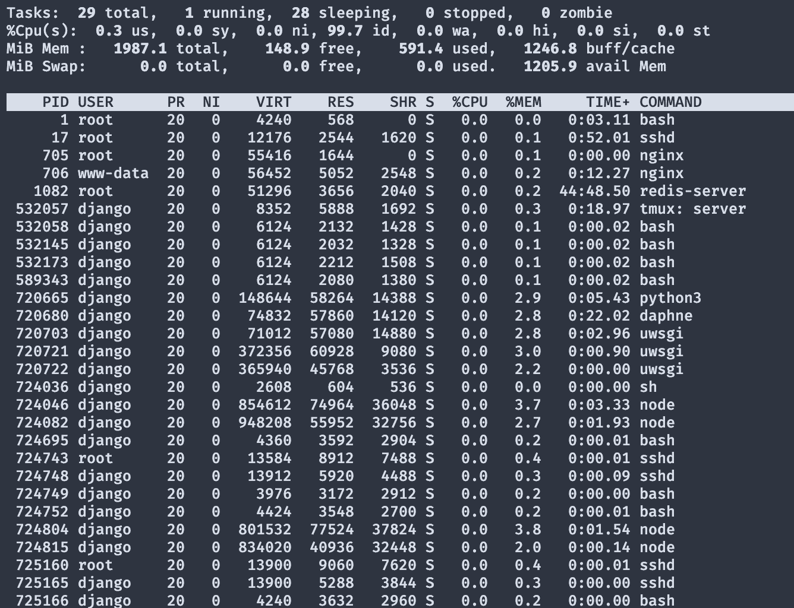

# 服务器相关操作

## 登录服务器

>`ssh ubuntu@ip地址`
>
>注意：腾讯云是`ubuntu`，阿里云是`root`

## 向服务器上传文件夹

> 上传文件夹 `scp -r 文件夹路径 服务器名:路径`
>
> `!!` 注意 `-r` 的位置

## 配置别名和免密登录

> 1. 创建 `~/.ssh/config` 文件
>
> 2. 写入如下内容
>
>    ```markdown
>    Host 别名
>    	HostName ip地址
>    	User ubuntu # 阿里云是root
>    ```
>
> 3. 配置免密登录
>
>    1. 生成密钥 `ssh-keygen`
>    2. 第二步添加公钥到服务器 `ssh-copy-id 别名`

# 用户相关操作

## 添加用户

>   1.   `adduser 用户名`

## 安装 `sudo` 权限

>   1.   `apt-get install sudo`

## 给用户添加 `sudo` 权限

>   1.   `usermod -aG sudo 用户名`

## 登录用户

>   1.   `ssh 用户名@ip地址 -p 端口号`

## 查看所有用户

>   1.   `cat /etc/shadow`

## 查看内存使用情况

>   1.   `free -h`

## 查看硬盘使用情况

>   1.   `df -h`

## 查看当前目录硬盘使用情况

>   1.   `du -sh`

## 删除软件

>   1.   `sudo apt-get remove --purge 名称`

## 下载图片

>   1.   `wget --output-document=图片别名 图片地址 图片存储地址`

## 查看所有运行的进程

>   1.   `top`
>   2.   

## 复制文件

>   1.   `cp A B` 将 `A` 复制到 `B` 下 

## 复制文件夹

>   1.   `cp -r A B` 将 `A` 文件夹复制到 `B` 文件夹下, 记得添加 `-r` 参数

# 配置相关

## 配置 `SSH`

> 1. 进入容器 `docker attach 容器名`
> 2. 执行命令 `apt-get update`
> 3. 执行命令 `apt-get upgrade`
> 4. 安装VIM  `apt-get install vim`
>     + 选择地区 `Asia`
>     + 选择地区 `Shanghai`
> 5. 安装SSH服务器 `apt-get install openssh-server`
> 6. 设置密码 `passwd`
> 7. 修改配置文件
>     + 进入配置文件 `vim /etc/ssh/sshd_config`
>     + 注释此行 `PermitRootLogin prohibit-password`
>     + 添加此行 `PermitRootLogin yes`
>     + 保存退出
> 8. 重启SSH配置文件 `/etc/init.d/ssh restart`
> 9. SSH登录即可 `ssh root@IP地址 -p 端口号`

## 配置 `uwsgi`


## 配置代理

### Parallel虚拟机

>   1.   系统 `Ubuntu22.04`
>   2.   

# 软件相关

## 安装应用商店

>   1.   在命令行输入
>
>        `sudo snap install snap-store`

## 安装火狐浏览器

>   1.   在应用商店搜索 `FireFox` 即可

# 报错汇总

> 1. [ssh 报错 Broken pipe 解决方法](https://blog.csdn.net/whatday/article/details/113750935)
> 1. 不能输入中文
