# 动态规划


## 简单 `DP`

### [LeetCode 221. 最大正方形](https://leetcode-cn.com/problems/maximal-square/)

**题目描述**

> 在一个由 `'0'` 和 `'1'` 组成的二维矩阵内，找到只包含 `'1'` 的最大正方形，并返回其面积。

**示例 1**


> 输入：`matrix = [["1","0","1","0","0"],["1","0","1","1","1"],["1","1","1","1","1"],["1","0","0","1","0"]]`
> 输出：`4`

**示例 2**


> 输入：`matrix = [["0","1"],["1","0"]]`
> 输出：`1`

**示例 3**

> 输入：`matrix = [["0"]]`
> 输出：`0`

**提示**

> `m == matrix.length`
> `n == matrix[i].length`
> `1 <= m, n <= 300`
> `matrix[i][j] 为 '0' 或 '1'`

**法一：动态规划**


**代码一：二维数组**

```c++
class Solution {
public:
    int maximalSquare(vector<vector<char>>& g) {
        int n = g.size(), m = g[0].size();
        vector<vector<int>> f(n + 5, vector<int>(m + 5));
        int res = -1;
        for (int i = 1; i <= n; i ++ )
            for (int j = 1; j <= m; j ++ ) {
                if (g[i - 1][j - 1] == '0') f[i][j] = 0;
                else f[i][j] = min(f[i - 1][j], min(f[i][j - 1], f[i - 1][j - 1])) + 1;
                res = max(res, f[i][j] * f[i][j]);
            }
        return res;
    }
};
```

**代码二：滚动数组优化**

```c++
class Solution {
public:
    int maximalSquare(vector<vector<char>>& g) {
        int n = g.size(), m = g[0].size();
        vector<vector<int>> f(2, vector<int>(m + 5));
        int res = -1;
        for (int i = 1; i <= n; i ++ )
            for (int j = 1; j <= m; j ++ ) {
                if (g[i - 1][j - 1] == '0') f[i & 1][j] = 0;
                else f[i & 1][j] = min(f[i - 1 & 1][j], min(f[i & 1][j - 1], f[i - 1 & 1][j - 1])) + 1;
                res = max(res, f[i & 1][j] * f[i & 1][j]);
            }
        return res;
    }
};
```

**法二：单调栈**


**代码**

```c++
class Solution {
public:
    int maximalSquare(vector<vector<char>>& g) {
        int n = g.size(), m = g[0].size();
        vector<vector<int>> f(n + 5, vector<int>(m + 5));
        for (int i = 0; i < m; i ++ ) f[0][i] = g[0][i] - '0';
        for (int i = 1; i < n; i ++ )
            for (int j = 0; j < m; j ++ )
                if (g[i][j] == '1') f[i][j] = f[i - 1][j] + 1;
        int res = -1;
        for (int i = 0; i < n; i ++ ) {
            stack<int> sk;
            vector<int> left(m + 5), right(m + 5);
            for (int j = 0; j < m; j ++ ) {
                while (sk.size() && f[i][j] <= f[i][sk.top()]) sk.pop();
                if (sk.empty()) left[j] = -1;
                else left[j] = sk.top();
                sk.push(j);
            }
            sk = stack<int>();
            for (int j = m - 1; j >= 0; j -- ) {
                while (sk.size() && f[i][j] <= f[i][sk.top()]) sk.pop();
                if (sk.empty()) right[j] = m;
                else right[j] = sk.top();
                sk.push(j);
            }
            for (int j = 0; j < m; j ++ )
                if (right[j] - left[j] - 1 >= f[i][j])
                    res = max(res, f[i][j] * f[i][j]);
        }
        return res;
    }
};
```

**标签**

`动态规划`

## 数字三角形模型

### [AcWing 898. 数字三角形](https://www.acwing.com/problem/content/900/)

**题目描述**

>   给定一个如下图所示的数字三角形，从顶部出发，在每一结点可以选择移动至其左下方的结点或移动至其右下方的结点，一直走到底层，要求找出一条路径，使路径上的数字的和最大。
>
>   ```c++
>           7
>         3   8
>       8   1   0
>     2   7   4   4
>   4   5   2   6   5
>   ```

**输入格式**

>   第一行包含整数 `n`，表示数字三角形的层数。
>
>   接下来 `n` 行，每行包含若干整数，其中第 `i` 行表示数字三角形第 `i` 层包含的整数。

**输出格式**

>   输出一个整数，表示最大的路径数字和。

**数据范围**

>   +   $1≤n≤500,$
>   +   $−10000≤三角形中的整数≤10000$

**输入样例**

```c++
5
7
3 8
8 1 0 
2 7 4 4
4 5 2 6 5
```

**输出样例**

```c++
30
```

**手写稿**


**代码一:从上往下**

```c++
#include <iostream>
using namespace std;
const int N = 510, INF = 0x3f3f3f3f;
int n;
int g[N][N], f[N][N];
int main() {
    scanf("%d", &n);
    for (int i = 1; i <= n; i ++ )
        for (int j = 1; j <= i; j ++ )
            scanf("%d", &g[i][j]);
    f[1][1] = g[1][1];
    for (int i = 2; i <= n; i ++ )
        for (int j = 1; j <= i; j ++ )
            // 注意: 边界处理
            if (j == 1) f[i][j] = f[i - 1][j] + g[i][j];
            else if (j == i) f[i][j] = f[i - 1][j - 1] + g[i][j];
            else f[i][j] = max(f[i - 1][j], f[i - 1][j - 1]) + g[i][j];
    int res = -INF;
    // 循环一遍, 寻找最大值
    for (int i = 1; i <= n; i ++ ) res = max(res, f[n][i]);
    cout << res << endl;
    return 0;
}
```

**时间复杂度**

$O(n^2)$

**空间复杂度**

$O(n ^ 2)$

**代码二:从下往上**


**时间复杂度**


**空间复杂度**


**标签**


**缝合怪**


### [AcWing 1015. 摘花生](https://www.acwing.com/problem/content/1017/)

**题目描述**

>   `Hello Kitty` 想摘点花生送给她喜欢的米老鼠。
>
>   她来到一片有网格状道路的矩形花生地(如下图)，从西北角进去，东南角出来。
>
>   地里每个道路的交叉点上都有种着一株花生苗，上面有若干颗花生，经过一株花生苗就能摘走该它上面所有的花生。
>
>   `Hello Kitty` 只能向东或向南走，不能向西或向北走。
>
>   问 `Hello Kitty` 最多能够摘到多少颗花生。
>
>   

**输入格式**

>   第一行是一个整数 `T`，代表一共有多少组数据。
>
>   接下来是 `T` 组数据。
>
>   每组数据的第一行是两个整数，分别代表花生苗的行数 `R` 和列数 `C`。
>
>   每组数据的接下来 `R` 行数据，从北向南依次描述每行花生苗的情况。每行数据有 `C` 个整数，按从西向东的顺序描述了该行每株花生苗上的花生数目 `M`。

**输出格式**

>   对每组输入数据，输出一行，内容为 `Hello Kitty` 能摘到得最多的花生颗数。

**数据范围**

>   +   $1 ≤ T ≤ 100,$
>   +   $1 ≤ R, C ≤ 100,$
>   +   $0 ≤ M ≤ 1000$

**输入样例**

```c++
2
2 2
1 1
3 4
2 3
2 3 4
1 6 5
```

**输出样例**

```c++
8
16
```

**手写稿**

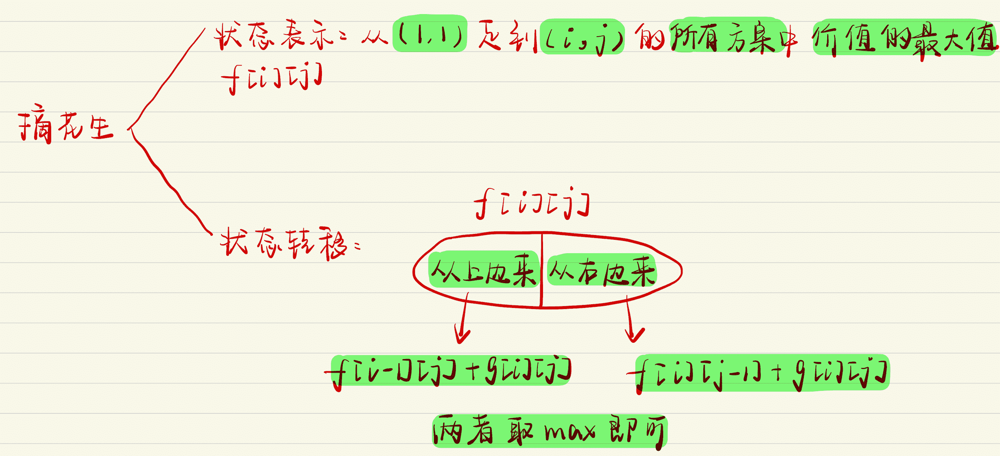

**代码**

```c++
#include <iostream>
#include <cstring>
using namespace std;
const int N = 110;
int n, m, T;
int g[N][N], f[N][N];
int main() {
    scanf("%d", &T);
    while (T -- ) {
        memset(g, 0, sizeof g);
        memset(f, 0, sizeof f);
        scanf("%d%d", &n, &m);
        for (int i = 1; i <= n; i ++ )
            for (int j = 1; j <= m; j ++ )
                scanf("%d", &g[i][j]);
        // DP
        for (int i = 1; i <= n; i ++ )
            for (int j = 1; j <= m; j ++ )
                f[i][j] = max(f[i - 1][j], f[i][j - 1]) + g[i][j];
        cout << f[n][m] << endl;
    }
    return 0;
}
```

**时间复杂度**

$O(nm)$

**空间复杂度**

$O(nm)$

**标签**

`DP`、`动态规划`

**缝合怪**


### [AcWing 1018. 最低通行费](https://www.acwing.com/problem/content/1020/)

**题目描述**

>   一个商人穿过一个 `N × N` 的正方形的网格，去参加一个非常重要的商务活动。
>
>   他要从网格的左上角进，右下角出。
>
>   每穿越中间 `1` 个小方格，都要花费 `1` 个单位时间。
>
>   商人必须在 `(2N − 1)` 个单位时间穿越出去。
>
>   而在经过中间的每个小方格时，都需要缴纳一定的费用。
>
>   这个商人期望在规定时间内用最少费用穿越出去。
>
>   请问至少需要多少费用？
>
>   注意：不能对角穿越各个小方格（即，只能向上下左右四个方向移动且不能离开网格）。

**输入格式**

>   第一行是一个整数，表示正方形的宽度 `N`。
>
>   后面 `N` 行，每行 `N` 个不大于 `100` 的正整数，为网格上每个小方格的费用。

**输出格式**

>   输出一个整数，表示至少需要的费用。

**数据范围**

>   +   $1 ≤ N ≤ 100$

**输入样例**

```c++
5
1  4  6  8  10
2  5  7  15 17
6  8  9  18 20
10 11 12 19 21
20 23 25 29 33
```

**输出样例**

```c++
109
```

**样例解释**

>   样例中，最小值为 `109=1+2+5+7+9+12+19+21+33`。

**手写稿**


**代码**


**时间复杂度**


**空间复杂度**


**标签**


**缝合怪**


### [AcWing 1027. 方格取数](https://www.acwing.com/problem/content/1029/)

**题目描述**

>   设有 `N×N` 的方格图，我们在其中的某些方格中填入正整数，而其它的方格中则放入数字`0`。如下图所示：
>
>   
>
>   某人从图中的左上角 `A` 出发，可以向下行走，也可以向右行走，直到到达右下角的 `B` 点。
>
>   在走过的路上，他可以取走方格中的数（取走后的方格中将变为数字`0`）。
>
>   此人从 `A` 点到 `B` 点共走了两次，试找出两条这样的路径，使得取得的数字和为最大。

**输入格式**

>   第一行为一个整数`N`，表示 `N×N` 的方格图。
>
>   接下来的每行有三个整数，第一个为行号数，第二个为列号数，第三个为在该行、该列上所放的数。
>
>   行和列编号从 `1` 开始。
>
>   一行“`0 0 0`”表示结束。

**输出格式**

>   输出一个整数，表示两条路径上取得的最大的和。

**数据范围**

>   +   $N ≤ 10$

**输入样例**

```c++
8
2 3 13
2 6 6
3 5 7
4 4 14
5 2 21
5 6 4
6 3 15
7 2 14
0 0 0
```

**输出样例**

```c++
67
```

**手写稿**


**代码**


**时间复杂度**


**空间复杂度**


**标签**


**缝合怪**


### [AcWing 275. 传纸条](https://www.acwing.com/problem/content/277/)

**题目描述**

>   小渊和小轩是好朋友也是同班同学，他们在一起总有谈不完的话题。
>
>   一次素质拓展活动中，班上同学安排坐成一个 `m` 行 `n` 列的矩阵，而小渊和小轩被安排在矩阵对角线的两端，因此，他们就无法直接交谈了。
>
>   幸运的是，他们可以通过传纸条来进行交流。
>
>   纸条要经由许多同学传到对方手里，小渊坐在矩阵的左上角，坐标 `(1,1)`，小轩坐在矩阵的右下角，坐标 `(m,n)`。
>
>   从小渊传到小轩的纸条只可以向下或者向右传递，从小轩传给小渊的纸条只可以向上或者向左传递。 
>
>   在活动进行中，小渊希望给小轩传递一张纸条，同时希望小轩给他回复。
>
>   班里每个同学都可以帮他们传递，但只会帮他们一次，也就是说如果此人在小渊递给小轩纸条的时候帮忙，那么在小轩递给小渊的时候就不会再帮忙，反之亦然。 
>
>   还有一件事情需要注意，全班每个同学愿意帮忙的好感度有高有低（注意：小渊和小轩的好心程度没有定义，输入时用 `0` 表示），可以用一个 `0∼100` 的自然数来表示，数越大表示越好心。
>
>   小渊和小轩希望尽可能找好心程度高的同学来帮忙传纸条，即找到来回两条传递路径，使得这两条路径上同学的好心程度之和最大。
>
>   现在，请你帮助小渊和小轩找到这样的两条路径。

**输入格式**

>   第一行有 ``2`` 个用空格隔开的整数 `m` 和 `n`，表示学生矩阵有 `m` 行 `n` 列。
>
>   接下来的 `m` 行是一个 `m×n` 的矩阵，矩阵中第 `i` 行 `j` 列的整数表示坐在第 `i` 行 `j` 列的学生的好心程度，每行的 `n` 个整数之间用空格隔开。

**输出格式**

>   输出一个整数，表示来回两条路上参与传递纸条的学生的好心程度之和的最大值。

**数据范围**

>   +   $1≤n,m≤50$

**输入样例**

```c++
3 3
0 3 9
2 8 5
5 7 0
```

**输出样例**

```c++
34
```

**手写稿**


**代码**


**时间复杂度**


**空间复杂度**


**标签**


**缝合怪**


## 线性 `DP`

### [AcWing 897. 最长公共子序列](https://www.acwing.com/problem/content/899/)

**题目描述**

>   给定两个长度分别为 `N` 和 `M` 的字符串 `A` 和 `B`，求既是 `A` 的子序列又是 `B` 的子序列的字符串长度最长是多少。

**输入格式**

>   第一行包含两个整数 `N` 和 `M`。
>
>   第二行包含一个长度为 `N` 的字符串，表示字符串 `A`。
>
>   第三行包含一个长度为 `M` 的字符串，表示字符串 `B`。
>
>   字符串均由小写字母构成。

**输出格式**

>   输出一个整数，表示最大长度。

**数据范围**

>   +   $1 ≤ N, M ≤ 1000$

**输入样例**

```c++
4 5
acbd
abedc
```

**输出样例**

```c++
3
```

**手写稿**

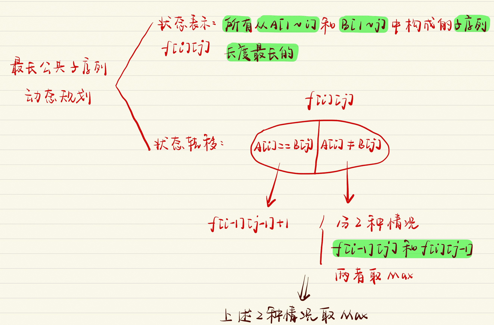

**代码**

```c++
#include <iostream>
using namespace std;
const int N = 1010;
int n, m;
char A[N], B[N];
int f[N][N];
int main() {
    scanf("%d%d%s%s", &n, &m, A + 1, B + 1);
    for (int i = 1; i <= n; i ++ )
        for (int j = 1; j <= m; j ++ )
            if (A[i] == B[j])
                f[i][j] = max(f[i][j], f[i - 1][j - 1] + 1);
            else
                f[i][j] = max(f[i][j], max(f[i - 1][j], f[i][j - 1]));
    cout << f[n][m] << endl;
    return 0;
}
```

**时间复杂度**

$O(nm)$

**空间复杂度**

$O(nm)$

**标签**

`线性DP`

**缝合怪**


## 树形`DP`

### 树的直径经典求法

**前提条件**


**定理**

> 任意寻找树中的某一点，寻找树中距离当前节点最远的点 `u`，再寻找距离 `u` 最远的点 `v`，则树的直径即为 `u` 到 `v` 经过的节点数目

**证明**


### [AcWing 1072. 树的最长路径](https://www.acwing.com/problem/content/1074/)

**题目描述**

> 给定一棵树，树中包含 `n` 个结点（编号`1~n`）和 `n−1` 条无向边，每条边都有一个权值。
>
> 现在请你找到树中的一条最长路径。
>
> 换句话说，要找到一条路径，使得使得路径两端的点的距离最远。
>
> 注意：路径中可以只包含一个点。

**输入格式**

> 第一行包含整数 `n`。
>
> 接下来 `n−1` 行，每行包含三个整数 $a_i,b_i,c_i$，表示点 $a_i$ 和 $b_i$ 之间存在一条权值为 $c_i$ 的边。

**输出格式**

> 输出一个整数，表示树的最长路径的长度。

**数据范围**

> + $1≤n≤10000,$
> + $1≤a_i,b_i≤n,$
> + $−10^5≤c_i≤10^5$

**输入样例**

```c++
6
5 1 6
1 4 5
6 3 9
2 6 8
6 1 7
```

**输出样例**

```c++
22
```

**手写稿**


**代码**

```c++
#include <iostream>
#include <cstring>
using namespace std;
const int N = 10010, M = N << 1;
int n, idx, ans;
int h[N], e[M], w[M], ne[M];
void add(int a, int b, int c) {
    e[idx] = b;
    w[idx] = c;
    ne[idx] = h[a];
    h[a] = idx ++ ;
    return;
}
// 返回以u为根结点的最大权值和
int dfs(int u, int father) {
    // d1表示最大值，d2表示次大值
    int d1 = 0, d2 = 0;
    // 以u为根结点的子树的最大权值和
    int dist = 0;
    for (int i = h[u]; i != -1; i = ne[i]) {
        int j = e[i];
        if (j == father) continue; // 原因在题解中已经解释
        int d = dfs(j, u) + w[i];
        dist = max(dist, d);
        if (d >= d1) d2 = d1, d1 = d;
        else if (d >= d2) d2 = d;
    }
    ans = max(ans, d1 + d2);
    return dist;
}
int main() {
    scanf("%d", &n);
    memset(h, -1, sizeof h);
    for (int i = 0; i < n - 1; i ++ ) {
        int a, b, c;
        scanf("%d%d%d", &a, &b, &c);
        add(a, b, c);
        add(b, a, c);
    }
    dfs(1, -1);
    cout << ans << endl;
    return 0;
}
```

**标签**

`树形DP`

### [AcWing 846. 树的重心](https://www.acwing.com/problem/content/description/848/)

**题目描述**

> 给定一颗树，树中包含 `n` 个结点（编号 `1∼n`）和 `n−1` 条无向边。
>
> 请你找到树的重心，并输出将重心删除后，剩余各个连通块中点数的最大值。
>
> 重心定义：重心是指树中的一个结点，如果将这个点删除后，剩余各个连通块中点数的最大值最小，那么这个节点被称为树的重心。

**输入格式**

> 第一行包含整数 `n`，表示树的结点数。
>
> 接下来 `n−1` 行，每行包含两个整数 `a` 和 `b`，表示点 `a` 和点 `b` 之间存在一条边。

**输出格式**

> 输出一个整数 `m`，表示将重心删除后，剩余各个连通块中点数的最大值。

**数据范围**

> + $1≤n≤10^5$

**输入样例**

```c++
9
1 2
1 7
1 4
2 8
2 5
4 3
3 9
4 6
```

**输出样例**

```c++
4
```

**手写稿**

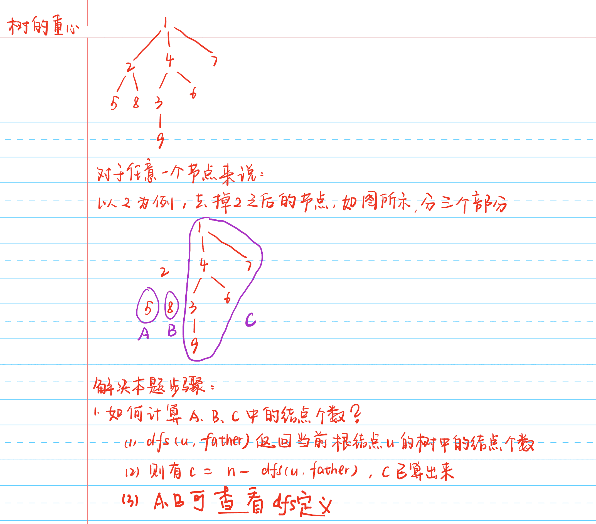

**注意事项**

> 1. 为啥 `dfs(int u, int father)` 要定义一个 `father` 变量，以防止 `圈2` 操作，从而导致无限循环
>
>     

**代码**

```c++
#include <iostream>
#include <cstring>
using namespace std;
const int N = 100010, M = N << 1;
int n, idx, ans = 1e9;
int h[N], e[M], ne[M];
void add(int a, int b) {
    e[idx] = b;
    ne[idx] = h[a];
    h[a] = idx ++;
    return;
}
int dfs(int u, int father) { // 以u为根节点的树中的节点个数
    int res = 0; // 以u为根结点的树中的节点个数的最大值
    int num = 1; // 各个子树的节点的个数，至少包含当前的节点，故初始值为1
    for (int i = h[u]; i != -1; i = ne[i]) {
        int j = e[i];
        // 如果当前遍历的点是其父亲节点，则返回，防止产生死循环，原因已解释
        if (j == father) continue;
        int d = dfs(j, u);
        num += d;
        res = max(res, d);
    }
    ans = min(ans, max(res, n - num));
    return num;
}
int main() {
    scanf("%d", &n);
    memset(h, -1, sizeof h);
    for (int i = 0; i < n - 1; i ++ ) {
        int a, b;
        scanf("%d%d", &a, &b);
        // 无向图
        add(a, b);
        add(b, a);
    }
    dfs(1, -1);
    cout << ans << endl;
    return 0;
}
```

**标签**

`动态规划`、`树形DP`、`深度优先搜索`

### [AcWing 1073. 树的中心](https://www.acwing.com/problem/content/1075/)

**题目描述**

> 给定一棵树，树中包含 `n` 个结点（编号`1~n`）和 `n−1` 条无向边，每条边都有一个权值。
>
> 请你在树中找到一个点，使得该点到树中其他结点的最远距离最近。

**输入格式**

> 第一行包含整数 `n`。
>
> 接下来 `n−1` 行，每行包含三个整数 $a_i,b_i,c_i$，表示点 $a_i$ 和 $b_i$ 之间存在一条权值为 $c_i$ 的边。

**输出格式**

> 输出一个整数，表示所求点到树中其他结点的最远距离。

**数据范围**

> + $1≤n≤10000,$
> + $1≤a_i,b_i≤n,$
> + $1≤c_i≤10^5$

**输入样例**

```c++
5 
2 1 1 
3 2 1 
4 3 1 
5 1 1
```

**输出样例**

```c++
2
```

**手写稿**


**代码**

```c++
#include <iostream>
#include <cstring>
using namespace std;
const int N = 10010, M = N << 1, INF = 0x3f3f3f3f;
int n, idx;
// d1[u]和d2[u]分别表示根为u的最长路径和次长路径
// up[u]表示向u的上方搜索的最长路径
// p1[u]表示u的最大值来自于父节点还是子节点
int h[N], e[M], w[M], ne[M], d1[N], d2[N], up[N], p1[N];
void add(int a, int b, int c) {
    e[idx] = b;
    w[idx] = c;
    ne[idx] = h[a];
    h[a] = idx ++;
    return;
}
// 向下搜索
int dfs_d(int u, int father) { // dfs_d返回节点u的所有【子树】的最大路径和
    // 初始化节点的最大路径和次大路径为负无穷
    d1[u] = d2[u] = -INF;
    for (int i = h[u]; i != -1; i = ne[i]) {
        int j = e[i];
        // 如果当前节点j是u的父亲，则返回，原因在楼上的一道题里面已经描述过
        if (j == father) continue;
        // 记得加上当前权值w[i]
        int d = dfs_d(j, u) + w[i];
        // 更新最大值和次大值，同时要记得更新u的最大值来自的路径，只需要记最大值即可
        if (d >= d1[u]) d2[u] = d1[u], d1[u] = d, p1[u] = j;
        else if (d >= d2[u]) d2[u] = d;
    }
    // 如果d1和d2没有被更新，则说明是叶节点，则将其最大值和次大值都初始化为0即可
    if (d1[u] == -INF) d1[u] = d2[u] = 0;
    // 返回节点u最大值
    return d1[u];
}
// 向上搜索
void dfs_u(int u, int father) {
    for (int i = h[u]; i != -1; i = ne[i]) {
        int j = e[i];
        if (j == father) continue;
        // 注意是up[j]和up[u]的位置
        // 注意w[i]是加在max的外面的
        if (p1[u] == j) up[j] = max(up[u], d2[u]) + w[i];
        else up[j] = max(up[u], d1[u]) + w[i];
        dfs_u(j, u);
    }
    return;
}
int main() {
    scanf("%d", &n);
    memset(h, -1, sizeof h);
    for (int i = 0; i < n - 1; i ++ ) {
        int a, b, c;
        scanf("%d%d%d", &a, &b, &c);
        add(a, b, c);
        add(b, a, c);
    }
    // 树的向下寻找【用子节点更新父节点】
    dfs_d(1, -1);
    // 树的向上寻找【用父节点更新子节点】
    dfs_u(1, -1);
    int res = INF;
    for (int i = 1; i <= n; i ++ ) res = min(res, max(d1[i], up[i]));
    cout << res << endl;
    return 0;
}
```

**标签**

`树形DP`、`换根DP`

### [AcWing 1075. 数字转换](https://www.acwing.com/problem/content/1077/)

**题目描述**

> 如果一个数 `x` 的约数之和 `y`（不包括他本身）比他本身小，那么 `x` 可以变成 `y`，`y` 也可以变成 `x`。
>
> 例如，`4` 可以变为 `3`，`1` 可以变为 `7`。
>
> 限定所有数字变换在不超过 `n` 的正整数范围内进行，求不断进行数字变换且不出现重复数字的最多变换步数。

**输入格式**

> 输入一个正整数 `n`。

**输出格式**

> 输出不断进行数字变换且不出现重复数字的最多变换步数。

**数据范围**

> + $1≤n≤50000$

**输入样例**

```c++
7
```

**输出样例**

```c++
3
```

**样例解释**

> 一种方案为：`4→3→1→74→3→1→7`。

**手写稿**

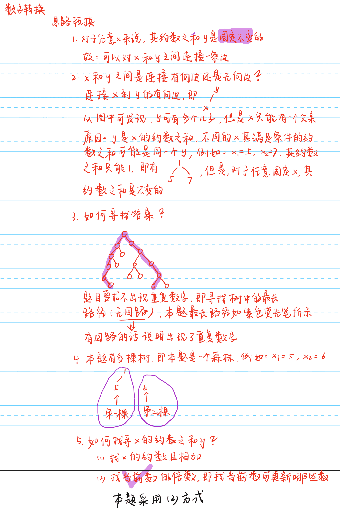

**代码**

```c++
#include <iostream>
#include <cstring>
using namespace std;
const int N = 50010;
int n, idx, ans;
int h[N], e[N], ne[N], st[N], sum[N];
void add(int a, int b) {
    e[idx] = b;
    ne[idx] = h[a];
    h[a] = idx ++;
    return;
}
int dfs(int u) {
    int d1 = 0, d2 = 0;
    for (int i = h[u]; i != -1; i = ne[i]) {
        int j = e[i];
        int d = dfs(j) + 1;
        if (d >= d1) d2 = d1, d1 = d;
        else if (d >= d2) d2 = d;
    }
    ans = max(ans, d1 + d2);
    return d1;
}
int main() {
    scanf("%d", &n);
    memset(h, -1, sizeof h);
    for (int i = 1; i <= n; i ++ )
        // 使用i去更新i*j，其中i就是约数
        for (int j = 2; j <= n / i; j ++ )
            sum[i * j] += i;
    for (int i = 2; i <= n; i ++ )
        // 如果i的约数之和sum[i]符合要求
        if (i > sum[i]) {
            // 注意边的顺序，要求sum[i] -> i，因此，因为add(sum[i], i)而不是add(i, add[i])
            add(sum[i], i);
            // 因为可能会有多棵树，因此，需要记录下树的哪些节点被访问过
            st[i] = true;
        }
    for (int i = 1; i <= n; i ++ )
        // 如果当前节点没有被访问过，则访问，即访问森林中的下一棵树
        if (!st[i]) dfs(i);
    cout << ans << endl;
    return 0;
}
```

**标签**

`树形DP`、`深度优先搜索`

### [AcWing 285. 没有上司的舞会](https://www.acwing.com/problem/content/287/)

**题目描述**

> `Ural` 大学有 `N` 名职员，编号为 `1∼N`。
>
> 他们的关系就像一棵以校长为根的树，父节点就是子节点的直接上司。
>
> 每个职员有一个快乐指数，用整数 $H_i$ 给出，其中 $1≤i≤N$。
>
> 现在要召开一场周年庆宴会，不过，没有职员愿意和直接上司一起参会。
>
> 在满足这个条件的前提下，主办方希望邀请一部分职员参会，使得所有参会职员的快乐指数总和最大，求这个最大值。

**输入格式**

> 第一行一个整数 `N`。
>
> 接下来 `N` 行，第 `i` 行表示 `i` 号职员的快乐指数 $H_i$。
>
> 接下来 `N−1` 行，每行输入一对整数 `L,K`，表示 `K` 是 `L` 的直接上司。

**输出格式**

> 输出最大的快乐指数。

**数据范围**

> + $1≤N≤6000$,
> + $−128≤Hi≤127$

**输入样例**

```c++
7
1
1
1
1
1
1
1
1 3
2 3
6 4
7 4
4 5
3 5
```

**输出样例**

```c++
5
```

**手写稿**


**代码**

```c++
#include <iostream>
#include <cstring>
using namespace std;
const int N = 6010;
int n, idx;
int happy[N], h[N], e[N], ne[N], is_root[N];
int f[N][2];
void add(int a, int b) {
    e[idx] = b;
    ne[idx] = h[a];
    h[a] = idx ++;
    return;
}
void dfs(int u) {
    // 如果确定选择当前节点，则先将当前节点的快乐值➕
    f[u][1] = happy[u];
    for (int i = h[u]; i != -1; i = ne[i]) {
        int j = e[i];
        // 先递归子树
        dfs(j);
        // 如果不选择根节点，则子树既可以选择，也可以不选择
        f[u][0] += max(f[j][0], f[j][1]);
        // 如果选择根节点，则子树只能不选择
        f[u][1] += f[j][0];
    }
    return;
}
int main() {
    scanf("%d", &n);
    memset(h, -1, sizeof h);
    memset(is_root, true, sizeof is_root);
    for (int i = 1; i <= n; i ++ ) scanf("%d", &happy[i]);
    for (int i = 1; i <= n - 1; i ++ ) {
        int u, v;
        scanf("%d%d", &u, &v);
        add(v, u);
        is_root[u] = false;
    }
    // 寻找根节点
    int root = 0;
    for (int i = 1; i <= n; i ++ )
        if (is_root[i]) {
            root = i;
            break;
        }
    dfs(root);
    cout << max(f[root][0], f[root][1]) << endl;
    return 0;
}
```

**标签**

`动态规划`、`树形DP`

### [LeetCode 337. 打家劫舍 III](https://leetcode-cn.com/problems/house-robber-iii/)

**题目描述**

>   小偷又发现了一个新的可行窃的地区。这个地区只有一个入口，我们称之为 `root` 。
>
>   除了 `root` 之外，每栋房子有且只有一个“父“房子与之相连。一番侦察之后，聪明的小偷意识到“这个地方的所有房屋的排列类似于一棵二叉树”。 如果 两个直接相连的房子在同一天晚上被打劫 ，房屋将自动报警。
>
>   给定二叉树的 `root` 。返回 在不触动警报的情况下 ，小偷能够盗取的最高金额 。

**示例 1**


>   输入: `root = [3,2,3,null,3,null,1]`
>   输出: `7` 
>   解释: 小偷一晚能够盗取的最高金额 `3 + 3 + 1 = 7`

**示例 2**


>   输入: `root = [3,4,5,1,3,null,1]`
>   输出: `9`
>   解释: 小偷一晚能够盗取的最高金额 `4 + 5 = 9`

**提示**

>   +   $树的节点数在 [1, 10^4] 范围内$
>   +   $0 <= Node.val <= 10^4$

**手写稿**


**代码**

```c++
/**
 * Definition for a binary tree node.
 * struct TreeNode {
 *     int val;
 *     TreeNode *left;
 *     TreeNode *right;
 *     TreeNode() : val(0), left(nullptr), right(nullptr) {}
 *     TreeNode(int x) : val(x), left(nullptr), right(nullptr) {}
 *     TreeNode(int x, TreeNode *left, TreeNode *right) : val(x), left(left), right(right) {}
 * };
 */
class Solution {
public:
    // dfs的返回值{选u, 不选u}，即对应着f[u][0]和f[u][1]
    vector<int> dfs(TreeNode* u) {
        if (!u) return {0, 0};
        auto l = dfs(u -> left), r = dfs(u -> right);
        // {不选u, 选u}
        return {max(l[0], l[1]) + max(r[0], r[1]), l[0] + r[0] + u -> val};
    }
    int rob(TreeNode* u) {
        vector<int> f = dfs(u);
        return max(f[0], f[1]);
    }
};
```

**标签**

`树形DP`

### [AcWing 310. 最小高度树](https://leetcode-cn.com/problems/minimum-height-trees/)

**题目描述**

> 树是一个无向图，其中任何两个顶点只通过一条路径连接。 换句话说，一个任何没有简单环路的连通图都是一棵树。
>
> 给你一棵包含 `n` 个节点的树，标记为 `0` 到 `n - 1` 。给定数字 `n` 和一个有 `n - 1` 条无向边的 `edges` 列表（每一个边都是一对标签），其中 $edges[i] = [a_i, b_i]$ 表示树中节点 $a_i$ 和 $b_i$ 之间存在一条无向边。
>
> 可选择树中任何一个节点作为根。当选择节点 `x` 作为根节点时，设结果树的高度为 `h` 。在所有可能的树中，具有最小高度的树（即，`min(h)`）被称为 最小高度树 。
>
> 请你找到所有的 最小高度树 并按 任意顺序 返回它们的根节点标签列表。
>
> 树的 高度 是指根节点和叶子节点之间最长向下路径上边的数量。

**示例 1**


> 输入：`n = 4, edges = [[1,0],[1,2],[1,3]]`
> 输出：`[1]`
> 解释：如图所示，当根是标签为 `1` 的节点时，树的高度是 `1` ，这是唯一的最小高度树。

**示例 2**


> 输入：`n = 6, edges = [[3,0],[3,1],[3,2],[3,4],[5,4]]`
> 输出：`[3,4]`

**提示**

> + $1 <= n <= 2 * 10^4$
> + $edges.length == n - 1$
> + $0 <= a_i, b_i < n$
> + $a_i != b_i$
> + $所有 (a_i, b_i) 互不相同$
> + $给定的输入 保证 是一棵树，并且 不会有重复的边$

**解题步骤**

> 1. 对于每一个点 `u` 来说，将其当作根节点，然后计算以 `u` 为根的树的高度，统计出来所有的高度以后，循环求解即可
>
> 2. 计算树的高度，使用树形 `DP` 来计算
>
>     

**代码**

```c++
class Solution {
public:
    vector<vector<int>> g;
    vector<int> d1, d2, up, p;
    // 向下寻找
    int dfs_d(int u, int father) {
        for (auto& j : g[u]) {
            if (j == father) continue;
            int d = dfs_d(j, u) + 1;
            if (d >= d1[u]) d2[u] = d1[u], d1[u] = d, p[u] = j;
            else if (d >= d2[u]) d2[u] = d;
        }
        return d1[u];
    }
    // 向上寻找
    void dfs_u(int u, int father) {
        for (auto& j : g[u]) {
            if (j == father) continue;
            if (p[u] == j) up[j] = max(up[u], d2[u]) + 1;
            else up[j] = max(up[u], d1[u]) + 1;
            dfs_u(j, u);
        }
        return;
    }
    vector<int> findMinHeightTrees(int n, vector<vector<int>>& edges) {
        g.resize(n + 5);
        d1 = d2 = p = up = vector<int>(n + 5);
        // 建图
        for (auto& edge : edges) {
            int a = edge[0], b = edge[1];
            g[a].push_back(b);
            g[b].push_back(a);
        }
        // 向下寻找
        dfs_d(0, -1);
        // 向上寻找
        dfs_u(0, -1);
        // 找最小值
        int Min = 1e9;
        for (int i = 0; i < n; i ++ ) Min = min(Min, max(up[i], d1[i]));
        // 找答案
        vector<int> res;
        for (int i = 0; i < n; i ++ ) 
            if (max(up[i], d1[i]) == Min) res.push_back(i);
        return res;
    }
};
```

**标签**

`树形DP`、`树的深度优先搜索`

### [AcWing 1074. 二叉苹果树](https://www.acwing.com/problem/content/1076/)

**题目描述**

>   有一棵二叉苹果树，如果树枝有分叉，一定是分两叉，即没有只有一个儿子的节点。
>
>   这棵树共 `N` 个节点，编号为 `1` 至 `N`，树根编号一定为 `1`。
>
>   我们用一根树枝两端连接的节点编号描述一根树枝的位置。
>
>   一棵苹果树的树枝太多了，需要剪枝。但是一些树枝上长有苹果，给定需要保留的树枝数量，求最多能留住多少苹果。
>
>   这里的保留是指最终与`1`号点连通。

**输入格式**

>   第一行包含两个整数 `N` 和 `Q`，分别表示树的节点数以及要保留的树枝数量。
>
>   接下来 `N−1` 行描述树枝信息，每行三个整数，前两个是它连接的节点的编号，第三个数是这根树枝上苹果数量。

**输出格式**

>   输出仅一行，表示最多能留住的苹果的数量。

**数据范围**

>   +   $1≤Q<N≤100.$
>   +   $N≠1,$
>   +   $每根树枝上苹果不超过 30000个。$

**输入样例**

```c++
5 2
1 3 1
1 4 10
2 3 20
3 5 20
```

**输出样例**

```c++
21
```

**手写稿**


**代码**

```c++
#include <iostream>
#include <cstring>
using namespace std;
const int N = 110, M = 210;
int n, m, idx;
int h[N], w[M], e[M], ne[M];
int f[N][N];
void add(int a, int b, int c) {
    e[idx] = b;
    w[idx] = c;
    ne[idx] = h[a];
    h[a] = idx ++;
    return;
}
void dfs(int u, int father) {
    for (int i = h[u]; i != -1; i = ne[i]) {
        // 如果已经访问过，直接返回
        if (e[i] == father) continue;
        dfs(e[i], u);
        // 枚举【以u为根】的子树所分得的树枝的数量
        for (int j = m; j >= 0; j -- )
            // 枚举【u的每棵子树】所分得的树枝的数量
            for (int k = 0; k < j; k ++ )
                f[u][j] = max(f[u][j], f[e[i]][k] + f[u][j - k - 1] + w[i]);
    }
    return;
}
int main() {
    scanf("%d%d", &n, &m);
    memset(h, -1, sizeof h);
    for (int i = 0; i < n - 1; i ++ ) {
        int a, b, c;
        scanf("%d%d%d", &a, &b, &c);
        add(a, b, c);
        add(b, a, c);
    }
    dfs(1, -1);
    cout << f[1][m] << endl;
    return 0;
}
```

**标签**

`树形DP`

**缝合怪**

[AcWing 10. 有依赖的背包问题](#AcWing 10. 有依赖的背包问题)

### [AcWing 323. 战略游戏](https://www.acwing.com/problem/content/325/)

**题目描述**

>   鲍勃喜欢玩电脑游戏，特别是战略游戏，但有时他找不到解决问题的方法，这让他很伤心。
>
>   现在他有以下问题。
>
>   他必须保护一座中世纪城市，这条城市的道路构成了一棵树。
>
>   每个节点上的士兵可以观察到所有和这个点相连的边。
>
>   他必须在节点上放置最少数量的士兵，以便他们可以观察到所有的边。
>
>   你能帮助他吗？
>
>   例如，下面的树：
>
>   
>
>   只需要放置 `1` 名士兵（在节点 `1` 处），就可观察到所有的边。

**输入格式**

>   输入包含多组测试数据，每组测试数据用以描述一棵树。
>
>   对于每组测试数据，第一行包含整数 `N`，表示树的节点数目。
>
>   接下来 `N` 行，每行按如下方法描述一个节点。
>
>   节点编号：(子节点数目) 子节点 子节点 …
>
>   节点编号从 `0` 到 `N−1`，每个节点的子节点数量均不超过 `10`，每个边在输入数据中只出现一次。

**输出格式**

>   对于每组测试数据，输出一个占据一行的结果，表示最少需要的士兵数。

**数据范围**

>   +   $0<N≤1500,$
>   +   $一个测试点所有 N 相加之和不超过 300650。$

**输入样例**

```c++
4
0:(1) 1
1:(2) 2 3
2:(0)
3:(0)
5
3:(3) 1 4 2
1:(1) 0
2:(0)
0:(0)
4:(0)
```

**输出样例**

```c++
1
2
```

**手写稿**


**代码**

```c++
#include <iostream>
#include <cstring>
using namespace std;
const int N = 1510;
int n, idx;
int h[N], e[N], ne[N], st[N];
int f[N][2];
void add(int a, int b) {
    e[idx] = b;
    ne[idx] = h[a];
    h[a] = idx ++;
    return;
}
void dfs(int u) {
    // 如果选择根节点，士兵数量为1
    f[u][1] = 1;
    for (int i = h[u]; i != -1; i = ne[i]) {
        int j = e[i];
        dfs(j);
        // 选择根节点
        f[u][0] += f[j][1];
        // 不选根节点
        f[u][1] += min(f[j][0], f[j][1]);
    }
    return;
}
int main() {
    while (scanf("%d", &n) != -1) {
        int id, cnt;
        // 多组输入，故都需要进行初始化
        memset(h, -1, sizeof h);
        memset(f, 0, sizeof f);
        memset(st, 0, sizeof st);
        idx = 0;
        for (int i = 0; i < n; i ++ ) {
            scanf("%d:(%d)", &id, &cnt);
            for (int j = 0, son; j < cnt; j ++ ) {
                scanf("%d", &son);
                st[son] = true;
                add(id, son);
            }
        }
        // 寻找根节点
        int root = 0;
        for (int i = 0; i < n; i ++ )
            if (!st[i]) {
                root = i;
                break;
            }
        dfs(root);
        cout << min(f[root][0], f[root][1]) << endl;
    }
    return 0;
}
```

**时间复杂度**

$O(n)$

**空间复杂度**

$O(n)$

**标签**

`树形DP`、`状态机`

**缝合怪**

[AcWing 285. 没有上司的舞会](#AcWing 285. 没有上司的舞会)

### [AcWing 1077. 皇宫看守](https://www.acwing.com/problem/content/description/1079/)

>   太平王世子事件后，陆小凤成了皇上特聘的御前一品侍卫。
>
>   皇宫各个宫殿的分布，呈一棵树的形状，宫殿可视为树中结点，两个宫殿之间如果存在道路直接相连，则该道路视为树中的一条边。
>
>   已知，在一个宫殿镇守的守卫不仅能够观察到本宫殿的状况，还能观察到与该宫殿直接存在道路相连的其他宫殿的状况。
>
>   大内保卫森严，三步一岗，五步一哨，每个宫殿都要有人全天候看守，在不同的宫殿安排看守所需的费用不同。
>
>   可是陆小凤手上的经费不足，无论如何也没法在每个宫殿都安置留守侍卫。
>
>   帮助陆小凤布置侍卫，在看守全部宫殿的前提下，使得花费的经费最少。

**输入格式**

>   输入中数据描述一棵树，描述如下：
>
>   第一行 `n`，表示树中结点的数目。
>
>   第二行至第 `n+1` 行，每行描述每个宫殿结点信息，依次为：该宫殿结点标号 `i`，在该宫殿安置侍卫所需的经费 `k`，该结点的子结点数 `m`，接下来 `m` 个数，分别是这个结点的 `m` 个子结点的标号 $r_1,r_2,…,r_m$。
>
>   对于一个 `n` 个结点的树，结点标号在 `1` 到 `n` 之间，且标号不重复。

**输出格式**

>   输出一个整数，表示最少的经费。

**数据范围**

>   +   $1≤n≤1500$

**输入样例**

```c++
6
1 30 3 2 3 4
2 16 2 5 6
3 5 0
4 4 0
5 11 0
6 5 0
```

**输出样例**

```c++
25
```

**样例解释**

>   在`2、3、4`结点安排护卫，可以观察到全部宫殿，所需经费最少，为 `16 + 5 + 4 = 25`。

**手写稿**

>   
>
>   本题和 `AcWing 323. 战略游戏` 的区别在于：
>
>   +   战略游戏说的是边，对于边来说，能管住的就只有两头的顶点
>   +   本题说的是点，对于一个点来说，能管住的就只有其本身，父节点和子节点，这就是为啥上一题需要两个状态就可以了，而本题需要三个状态的核心原因所在

**代码**

```c++
#include <iostream>
#include <cstring>
using namespace std;
const int N = 1510;
int n, idx;
int h[N], e[N], w[N], ne[N], st[N];
int f[N][3];
void add(int a, int b) {
    e[idx] = b;
    ne[idx] = h[a];
    h[a] = idx ++;
    return;
}
void dfs(int u) {
    f[u][2] = w[u];
    // 记录min(f[j][1], f[j][2])的总和
    // 便于计算f[u][1]，具体看手写稿
    int sum = 0;
    for (int i = h[u]; i != -1; i = ne[i]) {
        int j = e[i];
        dfs(j);
        f[u][0] += min(f[j][1], f[j][2]);
        f[u][2] += min(f[j][0], min(f[j][1], f[j][2]));
        sum += min(f[j][1], f[j][2]);
    }
    f[u][1] = 1e9;
    // 循环查找
    for (int i = h[u]; i != -1; i = ne[i]) {
        int k = e[i];
        // sum - min(f[k][1], f[k][2])就是除了k之外的所有的数总和
        f[u][1] = min(f[u][1], f[k][2] + sum - min(f[k][1], f[k][2]));
    }
    return;
}
int main() {
    scanf("%d", &n);
    memset(h, -1, sizeof h);
    for (int i = 1; i <= n; i ++ ) {
        int id, cost, m;
        scanf("%d%d%d", &id, &cost, &m);
        w[id] = cost;
        for (int j = 1, k; j <= m; j ++ ) {
            scanf("%d", &k);
            add(id, k);
            st[k] = true;
        }
    }
    // 寻找根节点
    int root = 1;
    while (st[root]) root ++;
    dfs(root);
    cout << min(f[root][1], f[root][2]) << endl;
    return 0;
}
```

**时间复杂度**

$O(n)$

**空间复杂度**

$O(n)$

**标签**

`状态机`、`树形DP`

**缝合怪**


### [PTA L2-038 病毒溯源](https://pintia.cn/problem-sets/994805046380707840/problems/1386335159927652361)

**题目描述**

>   
>
>   病毒容易发生变异。某种病毒可以通过突变产生若干变异的毒株，而这些变异的病毒又可能被诱发突变产生第二代变异，如此继续不断变化。
>
>   现给定一些病毒之间的变异关系，要求你找出其中最长的一条变异链。
>
>   在此假设给出的变异都是由突变引起的，不考虑复杂的基因重组变异问题 —— 即每一种病毒都是由唯一的一种病毒突变而来，并且不存在循环变异的情况。

**输入格式**

>   输入在第一行中给出一个正整数 `N`（$≤ 10^4$），即病毒种类的总数。于是我们将所有病毒从 `0` 到 `N − 1` 进行编号。
>
>   随后 `N` 行，每行按以下格式描述一种病毒的变异情况：
>
>   ```c++
>   k 变异株1 …… 变异株k
>   ```
>
>   其中 `k` 是该病毒产生的变异毒株的种类数，后面跟着每种变异株的编号。第 `i` 行对应编号为 `i` 的病毒（`0 ≤ i < N`）。题目保证病毒源头有且仅有一个。

**输出格式**

>   首先输出从源头开始最长变异链的长度。
>
>   在第二行中输出从源头开始最长的一条变异链，编号间以 `1` 个空格分隔，行首尾不得有多余空格。如果最长链不唯一，则输出最小序列。
>
>   注：我们称序列 ${a_1, ⋯ ,a_n }$ 比序列 ${b_1, ⋯ ,b_n}$ “小”，如果存在 `1 ≤ k ≤ n` 满足 $a_i=b_i$ 对所有 `i < k` 成立，且 $a_k < b_k$。

**输入样例**

```c++
10
3 6 4 8
0
0
0
2 5 9
0
1 7
1 2
0
2 3 1
```

**输出样例**

```c++
4
0 4 9 1
```

**手写稿**

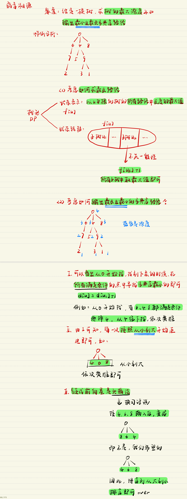

**代码**

```c++
#include <iostream>
#include <cstring>
#include <algorithm>
using namespace std;
const int N = 1e4 + 10;
int n, idx, cnt;
int h[N], e[N], ne[N], st[N], f[N], path[N], g[N];
void add(int a, int b) {
    e[idx] = b;
    ne[idx] = h[a];
    h[a] = idx ++;
    return;
}
int dp(int u) {
    // 每个节点高度都为1
    f[u] = 1;
    for (int i = h[u]; i != -1; i = ne[i]) {
        int j = e[i];
        int d = dp(j);
        // 取最大值
        f[u] = max(f[u], d + 1);
    }
    return f[u];
}
void dfs(int u) {
    path[cnt ++ ] = u;
    for (int i = h[u]; i != -1; i = ne[i]) {
        int j = e[i];
        // 找到条件的话, 遍历结束之后, 直接返回即可
        // 原因: 当前一定就是字典序最小的且最长的
        if (f[j] + 1 == f[u]) {
            dfs(j);
            return;
        }
    }
    return;
}
int main() {
    scanf("%d", &n);
    memset(h, -1, sizeof h);
    for (int i = 0; i < n; i ++ ) {
        int k;
        scanf("%d", &k);
        for (int j = 0, x; j < k; j ++ ) scanf("%d", &g[j]);
        // 从大到小进行排序
        sort(g, g + k, [&](int a, int b) {
            return a > b;
        });
        for (int j = 0; j < k; j ++ ) {
            add(i, g[j]);
            st[g[j]] = true;
        }
    }
    // 寻找根节点
    int rt;
    for (int i = 0; i < n; i ++ )
        if (!st[i]) {
            rt = i;
            break;
        }
    cout << dp(rt) << endl;
    dfs(rt);
    // 注意: 控制格式
    for (int i = 0; i < cnt; i ++ ) {
        if (!i) cout << path[i];
        else cout << " " << path[i];
    }
    return 0;
}
```

**时间复杂度**

$O(nk)$

**空间复杂度**

$O(n)$

**标签**

`树形DP`、`路径输出`

**缝合怪**


## 状态压缩 `DP`

### [Acwing 1064. 小国王](https://www.acwing.com/problem/content/1066/)

**题目描述**

> 在 `n×n` 的棋盘上放 `k` 个国王，国王可攻击相邻的 `8` 个格子，求使它们无法互相攻击的方案总数。

**输入格式**

> 共一行，包含两个整数 `n` 和 `k`。

**输出格式**

> 共一行，表示方案总数，若不能够放置则输出 `0`。

**数据范围**

> $1\;\leq\;n\;\leq\;10$
>
> $0\;\leq\;k\;\leq{n^2}$

**输入样例**

```c++
3 2
```

**输出样例**

```c++
16
```

**手写稿**


**代码**

```c++
#include <iostream>
#include <vector>
using namespace std;
typedef long long LL;
const int N = 15, M = 110, K = 1 << 10;
int n, m;
int cnt[K];
vector<int> state;
vector<int> convert[K];
LL f[N][M][K];
// 判断是否含有连续的 1
bool check(int u) {
    for (int i = 0; i < n; i ++ )
        if (u >> i & 1 && u >> i + 1 & 1) return false;
    return true;
}
// 统计 1 的数量
int count(int u) {
    int res = 0;
    for (int i = 0; i < n; i ++ )
        if (u >> i & 1) res ++;
    return res;
}
int main() {
    scanf("%d%d", &n, &m);
    for (int i = 0; i < 1 << n; i ++ )
        if (check(i)) {
            state.push_back(i);
            cnt[i] = count(i);
        }
    for (int i = 0; i < state.size(); i ++ )
        for (int j = 0; j < state.size(); j ++ ) {
            int a = state[i], b = state[j];
            if ((a & b) == 0 && check(a | b)) convert[i].push_back(j);
        }
    f[0][0][0] = 1;
    for (int i = 1; i <= n + 1; i ++ )
        for (int j = 0; j <= m; j ++ )
            for (int a = 0; a < state.size(); a ++ )
                for (auto& b : convert[a])
                    if (j >= cnt[state[a]]) f[i][j][a] += f[i - 1][j - cnt[state[a]]][b];
    cout << f[n + 1][m][0] << endl;
    return 0;
}
```

**标签**

`动态规划`

### [Acwing 327. 玉米田](https://www.acwing.com/problem/content/329/)

**题目描述**

> 农夫约翰的土地由 `M×N` 个小方格组成，现在他要在土地里种植玉米。
>
> 非常遗憾，部分土地是不育的，无法种植。
>
> 而且，相邻的土地不能同时种植玉米，也就是说种植玉米的所有方格之间都不会有公共边缘。
>
> 现在给定土地的大小，请你求出共有多少种种植方法。
>
> 土地上什么都不种也算一种方法。

**输入格式**

> 第 `1` 行包含两个整数 `M` 和 `N`。
>
> 第 `2..M+1`行：每行包含 `N` 个整数 `0` 或 `1`，用来描述整个土地的状况，`1` 表示该块土地肥沃，`0` 表示该块土地不育。

**输出格式**

> 输出总种植方法对 $10^8$ 取模后的值。

**数据范围**

> $1\;\leq{M},\;N\leq12$

**输入样例**

```c++
2 3
1 1 1
0 1 0
```

**输出样例**

```c++
9
```

**手写稿**


**代码**

```c++
#include <iostream>
#include <vector>
using namespace std;
const int N = 15, M = 1 << 12, mod = 1e8;
int n, m;
int g[N];
int f[N][M];
vector<int> state;
vector<int> convert[M];
bool check(int u) {
    for (int i = 0; i < m; i ++ )
        if (u >> i & 1 && u >> i + 1 & 1) return false;
    return true;
}
int main() {
    scanf("%d%d", &n, &m);
    for (int i = 1; i <= n; i ++ )
        for (int j = 0, s; j < m; j ++ ) {
            scanf("%d", &s);
            // 通常情况下 1 代表有障碍 0 代表无障碍
            g[i] += !s << j;
        }
    for (int i = 0; i < 1 << m; i ++ )
        if (check(i))
            state.push_back(i);
    for (int i = 0; i < state.size(); i ++ )
        for (int j = 0; j < state.size(); j ++ ) {
            int a = state[i], b = state[j];
            if ((a & b) == 0 && check(a))
                convert[i].push_back(j);
        }
    f[0][0] = 1;
    // i 循环到 n + 1 小技巧 不需要额外在计算
    for (int i = 1; i <= n + 1; i ++ )
        for (int j = 0; j < state.size(); j ++ )
            for (auto& k : convert[j]) {
                // 如果同列的相邻两行之间都是 1 则放弃本次循环
                if (g[i] & state[j]) continue;
                f[i][j] = (f[i][j] + f[i - 1][k]) % mod;
            }
    cout << f[n + 1][0] << endl;
    return 0;
}
```

**标签**

`动态规划`

## 状态机

### [LeetCode 213. 打家劫舍 II](https://leetcode-cn.com/problems/house-robber-ii/)

**题目描述**

> 你是一个专业的小偷，计划偷窃沿街的房屋，每间房内都藏有一定的现金。这个地方所有的房屋都 **围成一圈** ，这意味着第一个房屋和最后一个房屋是紧挨着的。同时，相邻的房屋装有相互连通的防盗系统，如果两间相邻的房屋在同一晚上被小偷闯入，系统会自动报警 。
>
> 给定一个代表每个房屋存放金额的非负整数数组，计算你 在不触动警报装置的情况下 ，今晚能够偷窃到的最高金额。 

**示例 1**

> 输入：nums = [2,3,2]
> 输出：3
> 解释：你不能先偷窃 1 号房屋（金额 = 2），然后偷窃 3 号房屋（金额 = 2）, 因为他们是相邻的。

**示例 2**

> 输入：nums = [1,2,3,1]
> 输出：4
> 解释：你可以先偷窃 1 号房屋（金额 = 1），然后偷窃 3 号房屋（金额 = 3），偷窃到的最高金额 = 1 + 3 = 4 。

**示例 3**

> 输入：nums = [0]
> 输出：0

**提示**

> `1 <= nums.length <= 100`
> `0 <= nums[i] <= 1000`

**思路**

> 由于第一家和最后一家是相连的，故此分为两组：
>
> 第一组：`1～n - 1`
>
> 第二组：`2 ～n`
>
> 分别进行动态规划即可

**手写稿**


**代码**

```c++
class Solution {
public:
    int rob(vector<int>& nums) {
        int n = nums.size();
        if (n <= 1) return nums[0];
        int l;
        vector<vector<int>> f(n + 5, vector<int>(2));
        for (int i = 2; i <= n; i ++ ) {
            f[i][0] = max(f[i - 1][0], f[i - 1][1]);
            f[i][1] = f[i - 1][0] + nums[i - 1];
        }
        l = max(f[n][1], f[n][0]);
        f = vector<vector<int>>(n + 5, vector<int>(2));
        for (int i = 1; i <= n - 1; i ++ ) {
            f[i][0] = max(f[i - 1][0], f[i - 1][1]);
            f[i][1] = f[i - 1][0] + nums[i - 1];
        }
        return max(l, max(f[n - 1][0], f[n - 1][1]));
    }
};
```

**标签**

`动态规划`

### [AcWing 1058. 股票买卖 V](https://www.acwing.com/problem/content/1060/)

**题目描述**

> 给定一个长度为 `N` 的数组，数组中的第 `i` 个数字表示一个给定股票在第 `i` 天的价格。
>
> 设计一个算法计算出最大利润。在满足以下约束条件下，你可以尽可能地完成更多的交易（多次买卖一支股票）:
>
> - 你不能同时参与多笔交易（你必须在再次购买前出售掉之前的股票）。
> - 卖出股票后，你无法在第二天买入股票 (即冷冻期为 `1` 天)。

**输入格式**

> 第一行包含整数 `N`，表示数组长度。
>
> 第二行包含 `N` 个不超过 `10000` 的正整数，表示完整的数组。

**输出格式**

> 输出一个整数，表示最大利润。

**数据范围**

> + $1≤N≤10^5$

**输入样例**

```c++
5
1 2 3 0 2
```

**输出样例**

```c++
3
```

**样例解释**

> 对应的交易状态为: [买入, 卖出, 冷冻期, 买入, 卖出]，第一笔交易可得利润 `2-1 = 1`，第二笔交易可得利润 `2-0 = 2`，共得利润 `1+2 = 3`。

**手写稿**


**代码**

```c++
#include <iostream>
using namespace std;
const int N = 100010;
int n;
int w[N];
int f[N][3];
int main() {
    scanf("%d", &n);
    for (int i = 1; i <= n; i ++ ) scanf("%d", &w[i]);
    // 注意初始化
    f[0][0] = f[0][1] = -1e9, f[0][2] = 0;
    for (int i = 1; i <= n; i ++ ) {
        f[i][0] = max(f[i - 1][0], f[i - 1][2] - w[i]);
        f[i][1] = f[i - 1][0] + w[i];
        f[i][2] = max(f[i - 1][2], f[i - 1][1]);
    }
    cout << max(f[n][1], f[n][2]) << endl;
    return 0;
}
```

**标签**

`动态规划`、`状态机`

## `LIS`

### [LeetCode 300. 最长递增子序列](https://leetcode-cn.com/problems/longest-increasing-subsequence/)

**题目描述**

> 给你一个整数数组 `nums` ，找到其中最长严格递增子序列的长度。
>
> 子序列是由数组派生而来的序列，删除（或不删除）数组中的元素而不改变其余元素的顺序。例如，`[3,6,2,7]` 是数组 `[0,3,1,6,2,2,7]` 的子序列。

**示例 1**

> 输入：`nums = [10,9,2,5,3,7,101,18]`
> 输出：`4`
> 解释：最长递增子序列是 `[2,3,7,101]`，因此长度为 `4` 。

**示例 2**

> 输入：`nums = [0,1,0,3,2,3]`
> 输出：`4`

**示例 3**

> 输入：`nums = [7,7,7,7,7,7,7]`
> 输出：`1`

**提示**

> $1 <= nums.length <= 2500$
> $-10^4 <= nums[i] <= 10^4$

**进阶**

> 你可以设计时间复杂度为 $O(n^2)$ 的解决方案吗？
> 你能将算法的时间复杂度降低到 $O(n log(n))$ 吗?

**方法一：动态规划**

**手写稿**


**代码**

```c++
// 时间复杂度 O(n ^ 2)
class Solution {
public:
    int lengthOfLIS(vector<int>& g) {
        int n = g.size();
        vector<int> f(n + 5, 1);
        int res = 0;
        for (int i = 0; i < n; i ++) {
            for (int j = 0; j < i; j ++ )
                if (g[i] > g[j]) f[i] = max(f[i], f[j] + 1);
            res = max(res, f[i]);
        }
        return res;
    }
};
```

**方法二：二分查找**

**思路一：**

**步骤**

> 1. 使用 `vector` 存储长度为 `i` 的递增子序列的最小值，其下标 `i` 表示递增子序列的长度，其值 `q[i]` 表示长度为 `i` 的递增子序列的最小值
> 2. 在 `q` 数组中二分查找小于 `x` 的最大值，则下一个值一定就是大于等于 `x` 的最小值
>     + 注意点：如果当前值比 `q` 中的所有值都小，则将当前值设置为最小值；不过，不进行特判，按照算法步骤，寻找下一个值的话，就会造成下一个值比当前值小
>     + 例子：`4, 10, 4`
> 3. `q` 是一个递增严格子序列

**代码**

```c++
class Solution {
public:
    int lengthOfLIS(vector<int>& nums) {
        vector<int> q;
        for (auto& num : nums) {
            if (q.empty() || num > q.back()) q.push_back(num);
            else {
                // 需要特判，如果 num 比最小值都小，则将最小值设置为 num
                if (q[0] >= num) q[0] = num;
                else {
                    // 二分查找小于当前数的最大值
                    int l = 0, r = q.size() - 1;
                    while (l < r) {
                        int mid = l + r + 1 >> 1;
                        if (q[mid] < num) l = mid;
                        else r = mid - 1;
                    }
                    q[l + 1] = num;
                }
            }
        }
        return q.size();
    }
};
```

**思路二：**

**步骤**

> 1. 同思路一，唯一不同的是，我们这次寻找的是大于等于 `x` 的最小值

**代码**

```c++
class Solution {
public:
    int lengthOfLIS(vector<int>& nums) {
        vector<int> q;
        for (auto& num : nums) {
            if (q.empty() || num > q.back()) q.push_back(num);
            else {
                // 二分查找大于等于当前数的最小值
                int l = 0, r = q.size() - 1;
                while (l < r) {
                    int mid = l + r >> 1;
                    if (nums[mid] >= num) r = mid;
                    else l = mid + 1;
                }
                q[r] = num;
            }
        }
        return q.size();
    }
};
```

**标签**

`LIS`、`二分`、`最长上升子序列`

### [LeetCode 334. 递增的三元子序列](https://leetcode-cn.com/problems/increasing-triplet-subsequence/)

**题目描述**

>   给你一个整数数组 `nums` ，判断这个数组中是否存在长度为 `3` 的递增子序列。
>
>   如果存在这样的三元组下标 `(i, j, k)` 且满足 `i < j < k` ，使得 `nums[i] < nums[j] < nums[k]` ，返回 `true` ；否则，返回 `false` 。

**示例 1**

>   输入：`nums = [1,2,3,4,5]`
>   输出：`true`
>   解释：任何 `i < j < k` 的三元组都满足题意

**示例 2**

>   输入：`nums = [5,4,3,2,1]`
>   输出：`false`
>   解释：不存在满足题意的三元组

**示例 3**

>   输入：`nums = [2,1,5,0,4,6]`
>   输出：`true`
>   解释：三元组 `(3, 4, 5)` 满足题意，因为 `nums[3] == 0 < nums[4] == 4 < nums[5] == 6`

**提示**

>   +   $1 <= nums.length <= 5 * 10^5$
>   +   $-2^{31} <= nums[i] <= 2^{31} - 1$

**进阶**

>   你能实现时间复杂度为 `O(n)` ，空间复杂度为 `O(1)` 的解决方案吗？

**手写稿**

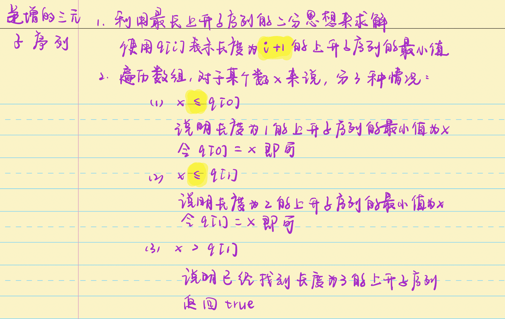

**代码**

```c++
class Solution {
public:
    bool increasingTriplet(vector<int>& nums) {
        vector<int> q(2, INT_MAX);
        for (auto& x : nums) {
            // 对应情况一
            if (x <= q[0]) q[0] = x;
            // 对应情况二
            else if (x <= q[1]) q[1] = x;
            // 对应情况三
            else return true;
        }
        return false;
    }
};
```

**标签**

`LIS`、`最长上升子序列`

### [LeetCode 368. 最大整除子集](https://leetcode-cn.com/problems/largest-divisible-subset/)

**题目描述**

>   给你一个由 无重复 正整数组成的集合 `nums` ，请你找出并返回其中最大的整除子集 `answer` ，子集中每一元素对 `(answer[i], answer[j])` 都应当满足：
>
>   +   `answer[i] % answer[j] == 0` ，或
>   +   `answer[j] % answer[i] == 0`
>       如果存在多个有效解子集，返回其中任何一个均可。

**示例 1**

>   输入：`nums = [1,2,3]`
>   输出：`[1,2]`
>   解释：`[1,3]` 也会被视为正确答案。

**示例 2**

>   输入：`nums = [1,2,4,8]`
>   输出：`[1,2,4,8]`

**提示**

>   +   $1 <= nums.length <= 1000$
>   +   $1 <= nums[i] <= 2 * 10^9$
>   +   $nums 中的所有整数 互不相同$

**手写稿**


**代码**

```c++
class Solution {
public:
    vector<int> largestDivisibleSubset(vector<int>& a) {
        int n = a.size();
        // 长度至少为1【其本身一个数字】
        vector<int> f(n + 5, 1);
        // 排序
        sort(a.begin(), a.end());
        // 记录f最大时的下标
        int k = 1;
        for (int i = 1; i <= n; i ++ ) {
            for (int j = 1; j < i;j ++ )
                if (a[i - 1] % a[j - 1] == 0) f[i] = max(f[i], f[j] + 1);
            // 记录f最大时的下标
            if (f[i] > f[k]) k = i;
        }
        // 倒序查找方案，先把最后一个方案加进去
        vector<int> res(1, a[k - 1]);
        while (f[k] > 1)
            // 判断从哪个方案转移过来
            for (int i = 1; i < k; i ++ )
                if (a[k - 1] % a[i - 1] == 0 && f[k] == f[i] + 1) {
                    k = i;
                    res.push_back(a[k - 1]);
                    break;
                }
        return res;
    }
};
```

**标签**

`LIS`、`排序`

## 背包模型

### `01` 背包

#### [AcWing 12. 背包问题求具体方案](https://www.acwing.com/problem/content/12/)

>   有 `N` 件物品和一个容量是 `V` 的背包。每件物品只能使用一次。
>
>   第 `i` 件物品的体积是 $v_i$，价值是 $w_i$。
>
>   求解将哪些物品装入背包，可使这些物品的总体积不超过背包容量，且总价值最大。
>
>   输出 **字典序最小的方案**。这里的字典序是指：所选物品的编号所构成的序列。物品的编号范围是 `1…N`。

**输入格式**

>   第一行两个整数，`N，V`，用空格隔开，分别表示物品数量和背包容积。
>
>   接下来有 `N` 行，每行两个整数 $v_i,w_i$，用空格隔开，分别表示第 `i` 件物品的体积和价值。

**输出格式**

>   输出一行，包含若干个用空格隔开的整数，表示最优解中所选物品的编号序列，且该编号序列的字典序最小。
>
>   物品编号范围是 `1…N`。

**数据范围**

>   +   $0<N,V≤1000$
>   +   $0<v_i,w_i≤1000$

**输入样例**

```c++
4 5
1 2
2 4
3 4
4 6
```

**输出样例**

```c++
1 4
```

**手写稿**


**代码**

```c++
#include <iostream>
using namespace std;
const int N = 1010;
int n, m;
int v[N], w[N], way[N];
int f[N][N];
int main() {
    scanf("%d%d", &n, &m);
    for (int i = 1; i <= n; i ++ )
        scanf("%d%d", &v[i], &w[i]);
    // 倒序枚举
    for (int i = n; i >= 1; i -- )
        for (int j = 0; j <= m; j ++ ) {
            f[i][j] = f[i + 1][j];
            if (j >= v[i]) f[i][j] = max(f[i][j], f[i + 1][j - v[i]] + w[i]);
        }
    int j = m;
    for (int i = 1; i <= n; i ++ )
        if (j >= v[i] && f[i][j] == f[i + 1][j - v[i]] + w[i]) {
            cout << i << " ";
            j -= v[i];
        }
    return 0;
}
```

**标签**

`01背包`、`01背包输出具体方案`、`逆序01背包`、`字典序`

### 完全背包

#### [AcWing 3. 完全背包问题](https://www.acwing.com/problem/content/3/)

**题目描述**

> 有 `N` 种物品和一个容量是 `V` 的背包，每种物品都有无限件可用。
>
> 第 `i` 种物品的体积是 $v_i$，价值是 $w_i$。
>
> 求解将哪些物品装入背包，可使这些物品的总体积不超过背包容量，且总价值最大。
> 输出最大价值。

**输入格式**

> 第一行两个整数，`N，V`，用空格隔开，分别表示物品种数和背包容积。
>
> 接下来有 `N` 行，每行两个整数 $v_i,w_i$，用空格隔开，分别表示第 `i` 种物品的体积和价值。

**输出格式**

> 输出一个整数，表示最大价值。

**数据范围**

> + $0<N,V≤1000$
> + $0<v_i,w_i≤1000$

**输入样例**

```c++
4 5
1 2
2 4
3 4
4 5
```

**输出样例**

```c++
10
```

**手写稿**


**代码**

**代码一：二维数组**

```c++
#include <iostream>
using namespace std;
const int N = 1010;
int n, m;
int v[N], w[N];
int f[N][N];
int main() {
    scanf("%d%d", &n, &m);
    for (int i = 1; i <= n; i ++ ) scanf("%d%d", &v[i], &w[i]);
    for (int i = 1; i <= n; i ++ )
        for (int j = 0;j <= m; j ++ ) {
            // 不选第i件商品
            f[i][j] = f[i - 1][j];
            if (j >= v[i]) f[i][j] = max(f[i][j], f[i][j - v[i]] + w[i]);
        }
    cout << f[n][m] << endl;
    return 0;
}
```

**代码二：滚动数组**

```c++
#include <iostream>
using namespace std;
const int N = 1010;
int n, m;
int v[N], w[N];
int f[2][N];
int main() {
    scanf("%d%d", &n, &m);
    for (int i = 1; i <= n; i ++ ) scanf("%d%d", &v[i], &w[i]);
    for (int i = 1; i <= n; i ++ )
        for (int j = 0;j <= m; j ++ ) {
            f[i & 1][j] = f[i - 1 & 1][j];
            if (j >= v[i]) f[i & 1][j] = max(f[i & 1][j], f[i & 1][j - v[i]] + w[i]);
        }
    cout << f[n & 1][m] << endl;
    return 0;
}
```

**代码三：一维数组**

```c++
#include <iostream>
using namespace std;
const int N = 1010;
int n, m;
int v[N], w[N], f[N];
int main() {
    scanf("%d%d", &n, &m);
    for (int i = 1; i <= n; i ++ ) scanf("%d%d", &v[i], &w[i]);
    for (int i = 1; i <= n; i ++ )
        for (int j = v[i]; j <= m; j ++ )
            f[j] = max(f[j], f[j - v[i]] + w[i]);
    cout << f[m] << endl;
    return 0;
}
```

**标签**

`完全背包`

#### [AcWing 1021. 货币系统](https://www.acwing.com/problem/content/description/1023/)

**题目描述**

> 给你一个 `n` 种面值的货币系统，求组成面值为 `m` 的货币有多少种方案。

**输入格式**

> 第一行，包含两个整数 `n` 和 `m`。
>
> 接下来 `n` 行，每行包含一个整数，表示一种货币的面值。

**输出格式**

> 共一行，包含一个整数，表示方案数。

**数据范围**

> + $n≤15,m≤3000$

**输入样例**

```c++
3 10
1
2
5
```

**输出样例**

```c++
10
```

**手写稿**


**代码**

**代码一：二维数组**

```c++
#include <iostream>
using namespace std;
typedef long long LL;
const int N = 20, M = 3010;
int n, m;
int v[N];
// 注意方案数目可能爆int
LL f[N][M];
int main() {
    scanf("%d%d", &n, &m);
    for (int i = 1; i <= n; i ++ ) scanf("%d", &v[i]);
    f[0][0] = 1;
    for (int i = 1; i <= n; i ++ )
        for (int j = 0; j <= m; j ++ ) {
            f[i][j] = f[i - 1][j];
            if (j >= v[i]) f[i][j] += f[i][j - v[i]];
        }
    cout << f[n][m] << endl;
    return 0;
}
```

**代码二：滚动数组**

```c++
#include <iostream>
using namespace std;
typedef long long LL;
const int N = 20, M = 3010;
int n, m;
int v[N];
LL f[2][M];
int main() {
    scanf("%d%d", &n, &m);
    for (int i = 1; i <= n; i ++ ) scanf("%d", &v[i]);
    f[0][0] = 1;
    for (int i = 1; i <= n; i ++ )
        for (int j = 0; j <= m; j ++ ) {
            // 注意：不能使用+=，因为f[i & 1][j]可能是别的层的，不一定为0
            f[i & 1][j] = f[i - 1 & 1][j];
            if (j >= v[i]) f[i & 1][j] += f[i & 1][j - v[i]];
        }
    cout << f[n & 1][m] << endl;
    return 0;
}
```

**代码三：一维数组**

```c++
#include <iostream>
using namespace std;
typedef long long LL;
const int N = 20, M = 3010;
int n, m;
int v[N];
LL f[M];
int main() {
    scanf("%d%d", &n, &m);
    for (int i = 1; i <= n; i ++ ) scanf("%d", &v[i]);
    f[0] = 1;
    for (int i = 1; i <= n; i ++ )
        for (int j = v[i]; j <= m; j ++ ) f[j] += f[j - v[i]];
    cout << f[m] << endl;
    return 0;
}
```

**标签**

`完全背包`

#### [LeetCode 322. 零钱兑换](https://leetcode-cn.com/problems/coin-change/)

> 给你一个整数数组 `coins` ，表示不同面额的硬币；以及一个整数 `amount` ，表示总金额。
>
> 计算并返回可以凑成总金额所需的 最少的硬币个数 。如果没有任何一种硬币组合能组成总金额，返回 `-1` 。
>
> 你可以认为每种硬币的数量是无限的。

**示例 1**

> 输入：`coins = [1, 2, 5], amount = 11`
> 输出：`3`
> 解释：`11 = 5 + 5 + 1`

**示例 2**

> 输入：`coins = [2], amount = 3`
> 输出：`-1`

**示例 3**

> 输入：`coins = [1], amount = 0`
> 输出：`0`

**提示**

> + $1 <= coins.length <= 12$
> + $1 <= coins[i] <= 2^{31} - 1$
> + $0 <= amount <= 10^4$

**手写稿**


**代码**

**代码一：二维数组**

```c++
class Solution {
public:
    int coinChange(vector<int>& v, int m) {
        int n = v.size();
        // 初始化为正无穷
        vector<vector<int>> f(n + 5, vector<int>(m + 5, 1e9));
        // 前零张纸币，价值总额恰好为零的【纸币数量】为零张
        f[0][0] = 0;
        for (int i = 1; i <= n; i ++ )
            for (int j = 0; j <= m; j ++ ) {
                f[i][j] = f[i - 1][j];
                if (j >= v[i - 1]) f[i][j] = min(f[i][j], f[i][j - v[i - 1]] + 1);
            }
        // 如果不符合条件，输出-1
        if (f[n][m] == 1e9) f[n][m] = -1;
        return f[n][m];
    }
};
```

**代码二：滚动数组**

```c++
class Solution {
public:
    int coinChange(vector<int>& v, int m) {
        int n = v.size();
        // 初始化为正无穷
        vector<vector<int>> f(2, vector<int>(m + 5, 1e9));
        // 前零张纸币，价值总额恰好为零的【纸币数量】为零张
        f[0][0] = 0;
        for (int i = 1; i <= n; i ++ )
            for (int j = 0; j <= m; j ++ ) {
                f[i & 1][j] = f[i - 1 & 1][j];
                if (j >= v[i - 1]) f[i & 1][j] = min(f[i & 1][j], f[i & 1][j - v[i - 1]] + 1);
            }
        // 如果不符合条件，输出-1
        if (f[n & 1][m] == 1e9) f[n & 1][m] = -1;
        return f[n & 1][m];
    }
};
```

**代码三：一维数组**

```c++
class Solution {
public:
    int coinChange(vector<int>& v, int m) {
        int n = v.size();
        // 初始化为正无穷
        vector<int> f(m + 5, 1e9);
        // 前零张纸币，价值总额恰好为零的【纸币数量】为零张
        f[0] = 0;
        for (int i = 1; i <= n; i ++ )
            for (int j = v[i - 1]; j <= m; j ++ )
                f[j] = min(f[j], f[j - v[i - 1]] + 1);
        // 如果不符合条件，输出-1
        if (f[m] == 1e9) f[m] = -1;
        return f[m];
    }
};
```

**标签**

`完全背包`

#### [LeetCode 377. 组合总和 Ⅳ](https://leetcode-cn.com/problems/combination-sum-iv/)

**题目描述**

>   给你一个由 不同 整数组成的数组 `nums` ，和一个目标整数 `target` 。请你从 `nums` 中找出并返回总和为 `target` 的元素组合的个数。
>
>   题目数据保证答案符合 `32` 位整数范围。

**示例 1**

>   输入：`nums = [1,2,3], target = 4`
>   输出：`7`
>   解释：
>   所有可能的组合为：
>   `(1, 1, 1, 1)`
>   `(1, 1, 2)`
>   `(1, 2, 1)`
>   `(1, 3)`
>   `(2, 1, 1)`
>   `(2, 2)`
>   `(3, 1)`
>   请注意，顺序不同的序列被视作不同的组合。

**示例 2**

>   输入：`nums = [9], target = 3`
>   输出：`0`

**提示**

>   +   $1 <= nums.length <= 200$
>   +   $1 <= nums[i] <= 1000$
>   +   $nums 中的所有元素 互不相同$
>   +   $1 <= target <= 1000$

**进阶**

>   如果给定的数组中含有负数会发生什么？问题会产生何种变化？如果允许负数出现，需要向题目中添加哪些限制条件？

**手写稿**


**代码一：二维数组**

```c++
typedef long long LL;
class Solution {
public:
    int combinationSum4(vector<int>& a, int n) {
        vector<vector<LL>> f(n + 5, vector<LL>(n + 5));
        f[0][0] = 1;
        // 统计答案
        int res = 0;
        // 枚举前i个位置
        for (int i = 1; i <= n; i ++ ) {
            // 枚举前i个位置构成的总和
            for (int j = 0; j <= n; j ++ )
                // 枚举最后一个位置选择的数字
                for (auto& num : a)
                    if (j >= num)
                        // 可能会越界，取模即可，因为，答案位于int范围内
                        // 如果超出int的话，随便余无所谓
                        f[i][j] = (f[i][j] + f[i - 1][j - num]) % INT_MAX;
            // 记录答案，因为
            // 可能前1个位置的和已经是n了
            // 可能前2个位置的和已经是n了
            // 以此类推
            res += f[i][n];
        }
        return res;
    }
};
```

**时间复杂度**

$O(n^3)$

**空间复杂度**

$O(n^2)$

**代码二：一维数组**

```c++
typedef long long LL;
class Solution {
public:
    int combinationSum4(vector<int>& a, int n) {
        vector<LL> f(n + 5);
        f[0] = 1;
        for (int j = 0; j <= n; j ++ )
            // 枚举最后一个位置选择的数字
            for (auto& num : a)
                if (j >= num)
                    // 可能会越界，取模即可，因为，答案位于int范围内
                    // 如果超出int的话，随便余无所谓
                    f[j] = (f[j] + f[j - num]) % INT_MAX;
        return f[n];
    }
};
```

**时间复杂度**

$O(n^2)$

**空间复杂度**

$O(n)$

**标签**

`有顺序的完全背包问题`

**缝合怪**

### 分组背包

#### [AcWing 10. 有依赖的背包问题](https://www.acwing.com/problem/content/description/10/)

> 有 `N` 个物品和一个容量是 `V` 的背包。
>
> 物品之间具有依赖关系，且依赖关系组成一棵树的形状。如果选择一个物品，则必须选择它的父节点。
>
> 如下图所示：
> 
>
> 如果选择物品 `5`，则必须选择物品 `1` 和 `2`。这是因为 `2` 是 `5` 的父节点，`1` 是 `2` 的父节点。
>
> 每件物品的编号是 `i`，体积是 $v_i$，价值是 $w_i$，依赖的父节点编号是 $p_i$。物品的下标范围是 $1…N$。
>
> 求解将哪些物品装入背包，可使物品总体积不超过背包容量，且总价值最大。
>
> 输出最大价值。

**输入格式**

> 第一行有两个整数 `N，V`，用空格隔开，分别表示物品个数和背包容量。
>
> 接下来有 `N` 行数据，每行数据表示一个物品。
> 第 `i` 行有三个整数 $v_i,w_i,p_i$，用空格隔开，分别表示物品的体积、价值和依赖的物品编号。
> 如果 $p_i=−1$，表示根节点。 **数据保证所有物品构成一棵树。**

**输出格式**

> 输出一个整数，表示最大价值。

**数据范围**

> + $1≤N,V≤100$
> + $1≤v_i,w_i≤100$
>
> 父节点编号范围：
>
> - 内部结点：$1≤p_i≤N$;
> - 根节点 $p_i=−1$;

**输入样例**

```c++
5 7
2 3 -1
2 2 1
3 5 1
4 7 2
3 6 2
```

**输出样例**

```c++
11
```

**手写稿**


**代码**

```c++
#include <iostream>
#include <cstring>
using namespace std;
const int N = 110;
int n, m, p, root, idx;
int v[N], w[N], h[N], e[N], ne[N];
int f[N][N];
void add(int a, int b) {
    e[idx] = b;
    ne[idx] = h[a];
    h[a] = idx ++;
    return;
}
void dfs(int u) {
    for (int i = h[u]; i != -1; i = ne[i]) { // 枚举组
        int son = e[i];
        // 递归子树
        dfs(son);
        // 分组背包
        // 逆序的原因，在图解中
        for (int j = m - v[u]; j >= 0; j -- ) // 枚举组所占用的体积
            for (int k = 0; k <= j; k ++ ) // 枚举组内物品所占体积
                f[u][j] = max(f[u][j], f[u][j - k] + f[son][k]);
    }
    // 添加根节点的权值
    for (int i = m; i >= v[u]; i -- ) f[u][i] = f[u][i - v[u]] + w[u];
    // 如果体积连根节点也不能装下，则重置为0
    // 重置的原因，在图解中
    for (int i = 0; i < v[u]; i ++ ) f[u][i] = 0;
    return;
}
int main() {
    scanf("%d%d", &n, &m);
    memset(h, -1, sizeof h);
    for (int i = 1; i <= n; i ++ ) {
        scanf("%d%d%d", &v[i], &w[i] ,&p);
        if (p == -1) root = i;
        else add(p, i);
    }
    dfs(root);
    cout << f[root][m] << endl;
    return 0;
}
```

**标签**

`动态规划`、`分组背包`、`树形DP`

#### [AcWing 9. 分组背包问题](https://www.acwing.com/problem/content/description/9/)

**题目描述**

> 有 `N` 组物品和一个容量是 `V` 的背包。
>
> 每组物品有若干个，同一组内的物品最多只能选一个。
> 每件物品的体积是 $v_{ij}$，价值是 $w_{ij}$，其中 $i$ 是组号，$j$ 是组内编号。
>
> 求解将哪些物品装入背包，可使物品总体积不超过背包容量，且总价值最大。
>
> 输出最大价值。

**输入格式**

> 第一行有两个整数 `N，V`，用空格隔开，分别表示物品组数和背包容量。
>
> 接下来有 `N` 组数据：
>
> - 每组数据第一行有一个整数 $S_i$，表示第 $i$ 个物品组的物品数量；
> - 每组数据接下来有 $S_i$ 行，每行有两个整数 $v_{ij},w_{ij}$，用空格隔开，分别表示第 $i$ 个物品组的第 $j$ 个物品的体积和价值；

**输出格式**

> 输出一个整数，表示最大价值。

**数据范围**

> + $0<N,V≤100$
> + $0<S_i≤100$
> + $0<v_{ij},w_{ij}≤100$

**输入样例**

```c++
3 5
2
1 2
2 4
1
3 4
1
4 5
```

**输出样例**

```c++
8
```

**手写稿**

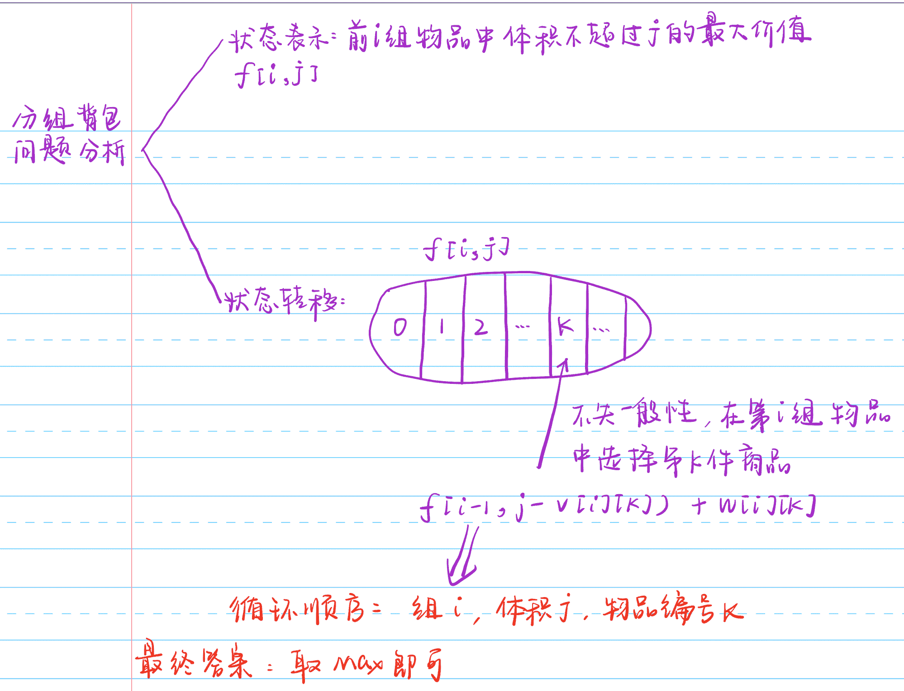

**代码**

**二维数组**

```c++
#include <iostream>
using namespace std;
const int N = 110;
int n, m;
int s[N], v[N][N], w[N][N], f[N][N];
int main() {
    scanf("%d%d", &n, &m);
    for (int i = 1; i <= n; i ++ ) {
        scanf("%d", &s[i]);
        for (int j = 1; j <= s[i]; j ++ ) scanf("%d%d", &v[i][j], &w[i][j]);
    }
    for (int i = 1; i <= n; i ++ ) // 循环前i组
        for (int j = 0; j <= m; j ++ ) { // 循环体积
            f[i][j] = f[i - 1][j]; // 第i组的物品一个都不选
            for (int k = 1; k <= s[i]; k ++) // 枚举第i组的所有物品
                if (j >= v[i][k]) // 注意：体积需要大于等于当前物品体积才可转移
                    // 第i组的物品的某个物品选择1个
                    f[i][j] = max(f[i][j], f[i - 1][j - v[i][k]] + w[i][k]);
        }
    cout << f[n][m] << endl;
    return 0;
}
```

**一维数组优化**

```c++
#include <iostream>
using namespace std;
const int N = 110;
int n, m;
int f[N];
int s[N], v[N][N], w[N][N];
int main() {
    scanf("%d%d", &n, &m);
    for (int i = 1; i <= n; i ++ ) {
        scanf("%d", &s[i]);
        for (int j = 1; j <= s[i]; j ++ ) scanf("%d%d", &v[i][j], &w[i][j]);
    }
    for (int i = 1; i <= n; i ++ ) // 循环前i组
        for (int j = m; j >= 0; j -- ) { // 循环体积
            for (int k = 1; k <= s[i]; k ++)
                if (j >= v[i][k]) // 注意：体积需要大于等于当前物品体积才可转移
                    f[j] = max(f[j], f[j - v[i][k]] + w[i][k]);
        }
    cout << f[m] << endl;
    return 0;
}
```

**标签**

`分组背包`

#### [AcWing 1013. 机器分配](https://www.acwing.com/problem/content/1015/)

>   总公司拥有 `M` 台 **相同** 的高效设备，准备分给下属的 `N` 个分公司。
>
>   各分公司若获得这些设备，可以为国家提供一定的盈利。盈利与分配的设备数量有关。
>
>   问：如何分配这 `M` 台设备才能使国家得到的盈利最大？
>
>   求出最大盈利值。
>
>   分配原则：每个公司有权获得任意数目的设备，但总台数不超过设备数 `M`。

**输入格式**

>   第一行有两个数，第一个数是分公司数 `N`，第二个数是设备台数 `M`；
>
>   接下来是一个 `N * M` 的矩阵，矩阵中的第 `i` 行第 `j` 列的整数表示第 `i` 个公司分配 `j` 台机器时的盈利。

**输出格式**

>   第一行输出最大盈利值；
>
>   接下 `N` 行，每行有 `2` 个数，即分公司编号和该分公司获得设备台数。
>
>   答案不唯一，输出任意合法方案即可。

**数据范围**

>   +   $1≤N≤10,$
>   +   $1≤M≤15$

**输入样例**

```c++
3 3
30 40 50
20 30 50
20 25 30
```

**输出样例**

```c++
70
1 1
2 1
3 1
```

**手写稿**

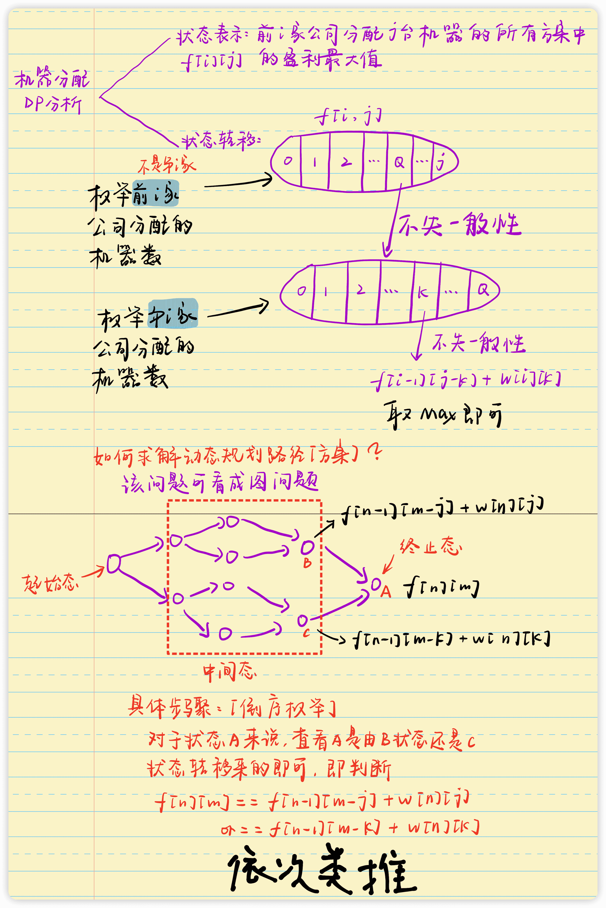

**代码**

```c++
#include <iostream>
using namespace std;
const int N = 15, M = 20;
int n, m;
int way[N];
int w[N][M], f[N][M];
int main() {
    scanf("%d%d", &n, &m);
    for (int i = 1; i <= n; i ++ )
        for (int j = 1; j <= m; j ++ )
            scanf("%d", &w[i][j]);
    for (int i = 1; i <= n; i ++ ) // 枚举物品组i
        for (int j = 1; j <= m; j ++ ) { // 枚举【前i组】分配的机器总数目
            f[i][j] = f[i - 1][j];
            for (int k = 1; k <= j; k ++ ) // 枚举【第i组】分配的机器数目
                f[i][j] = max(f[i][j], f[i - 1][j - k] + w[i][k]);
        }
    cout << f[n][m] << endl;
    for (int i = n; i >= 1; i -- )
        // 枚举分配的机器数目
        for (int j = m; j >= 0; j -- )
            // 状态转移方程逆过来
            if (f[i - 1][m - j] + w[i][j] == f[i][m]) {
                way[i] = j;
                m -= j;
                break;
            }
    for (int i = 1; i <= n; i ++ ) cout << i << " " << way[i] << endl;
    return 0;
}
```

**标签**

`分组背包`、`分组背包求方案数`

### 各种背包之间的区别

#### `01`背包和分组背包

>1.   01背包代码
>
>     ```c++
>     // 枚举前i件物品
>     for (int i = 1; i <= n; i ++ ) {
>         // 枚举体积
>         for (int j = 1; j <= m; j ++ ){
>             f[i][j] = f[i - 1][j];
>             // 枚举第i件物品，选0件或者选1件
>             if (j >= v[i]) f[i][j] = max(f[i][j],f[i - 1][j - v[i]] + w[i]);
>         }
>     }
>     ```
>
>2.   分组背包代码
>
>     ```c++
>     // 枚举前i件物品
>     for (int i = 1; i <= n; i ++ ) {
>         // 枚举体积
>         for (int j = 1; j <= m; j ++ ) {
>             // 枚举第i件物品，选择0件，1件，2件，...，k件
>             f[i][j] = f[i - 1][j]; // 选择0件
>             for (int k = 1; k <= s[i]; k ++ ) // 选择1件到k件
>                 f[i][j] = max(f[i][j], f[i - 1][j - k * v[i]] + k * w[i]);
>         }
>     }
>     ```
>
>3.   疑难解答
>
>     +   为啥 `01` 背包是二维，而分组背包需要写三维？
>         +   `01` 背包对于每个物品只有两种选择，即选择 `0` 件物品和选择 `1` 件物品，可以不枚举即可完成大小的比较
>         +   分组背包对于每个物品而言不仅仅只有两种选择，可能有 `k + 1` 种选择，即选择 `0` 件物品，选择 `1` 件物品，`...`，选择 `k` 件物品，不枚举比较不出来，必须枚举

## 区间 `DP`

### 枚举顺序的解释

>   <font style = "color: red">**`AcWing 282` 石子合并的手写稿中有介绍**</font>

### [AcWing 282. 石子合并](https://www.acwing.com/problem/content/description/284/)

**题目描述**

>   设有 `N` 堆石子排成一排，其编号为 `1，2，3，…，N`。
>
>   每堆石子有一定的质量，可以用一个整数来描述，现在要将这 `N` 堆石子合并成为一堆。
>
>   每次只能合并相邻的两堆，合并的代价为这两堆石子的质量之和，合并后与这两堆石子相邻的石子将和新堆相邻，合并时由于选择的顺序不同，合并的总代价也不相同。
>
>   例如有 `4` 堆石子分别为 `1 3 5 2`， 我们可以先合并 `1、2` 堆，代价为 `4`，得到 `4 5 2`， 又合并 `1，2` 堆，代价为 `9`，得到 `9 2` ，再合并得到 `11`，总代价为 `4+9+11=24`；
>
>   如果第二步是先合并 `2，3` 堆，则代价为 `7`，得到 `4 7`，最后一次合并代价为 `11`，总代价为 `4+7+11=22`。
>
>   问题是：找出一种合理的方法，使总的代价最小，输出最小代价。

**输入格式**

>   第一行一个数 `N` 表示石子的堆数 `N`。
>
>   第二行 `N` 个数，表示每堆石子的质量(均不超过 `1000`)。

**输出格式**

>   输出一个整数，表示最小代价。

**数据范围**

>   +   $1≤N≤300$

**输入样例**

```c++
4
1 3 5 2
```

**输出样例**

```c++
22
```

**手写稿**


**代码**

```c++
#include <iostream>
#include <cstring>
using namespace std;
const int N = 310, inf = 0x3f3f3f3f;
int n;
int g[N], sum[N];
int f[N][N];
int main() {
    scanf("%d", &n);
    for (int i = 1; i <= n; i ++ ) {
        scanf("%d", &g[i]);
        sum[i] = sum[i - 1] + g[i];
    }
    // 枚举长度
    // 长度为1没意义，题目要求至少两堆石子合并才有意义
    for (int len = 2; len <= n; len ++ )
        // 枚举【当前区间】左端点的【下标】
        for (int i = 1; i + len - 1 <= n; i ++ ) {
            // 【当前区间】右端点的【下标】
            // 【下标】等于【len - 1】
            int j = i + len - 1;
            // 初始化为正无穷
            f[i][j] = inf;
            // 枚举分界点
            for (int k = i; k < j; k ++ )
                f[i][j] = min(f[i][j], f[i][k] + f[k + 1][j] + sum[j] - sum[i - 1]);
        }
    cout << f[1][n] << endl;
    return 0;
}
```

**标签**

`区间DP`

### [AcWing 1068. 环形石子合并](https://www.acwing.com/problem/content/1070/)

**题目描述**

>   将 `n` 堆石子绕圆形操场排放，现要将石子有序地合并成一堆。
>
>   规定每次只能选相邻的两堆合并成新的一堆，并将新的一堆的石子数记做该次合并的得分。
>
>   请编写一个程序，读入堆数 `n` 及每堆的石子数，并进行如下计算：
>
>   -   选择一种合并石子的方案，使得做 `n−1` 次合并得分总和最大。
>   -   选择一种合并石子的方案，使得做 `n−1` 次合并得分总和最小。

**输入格式**

>   第一行包含整数 `n`，表示共有 `n` 堆石子。
>
>   第二行包含 `n` 个整数，分别表示每堆石子的数量。

**输出格式**

>   输出共两行：
>
>   第一行为合并得分总和最小值，
>
>   第二行为合并得分总和最大值。

**数据范围**

>   +   $1≤n≤200$

**输入样例**

```c++
4
4 5 9 4
```

**输出样例**

```c++
43
54
```

**手写稿**


**代码**

```c++
#include <iostream>
#include <cstring>
using namespace std;
const int N = 410, INF = 0x3f3f3f3f;
int n;
int h[N], sum[N];
int f[N][N], g[N][N];
int main() {
    scanf("%d", &n);
    for (int i = 1; i <= n; i ++ ) {
        scanf("%d", &h[i]);
        // 复制一遍数组
        h[i + n] = h[i];
    }
    // 求前缀和
    for (int i = 1; i <= n * 2; i ++ )
        sum[i] = sum[i - 1] + h[i];
    // 区间DP
    memset(f, INF, sizeof f);
    memset(g, -INF, sizeof g);
    for (int len = 1; len <= n; len ++ )
        for (int i = 1; i + len - 1 <= n * 2; i ++ ) {
            int j = i + len - 1;
            // 合并石子，说明至少是两堆
            // 如果当前区间只有一个数字，说明只有一堆，不可能进行合并
            // 因此，合并的价值为0
            if (i == j) f[i][j] = g[i][j] = 0;
            for (int k = i; k < j; k ++ ) {
                f[i][j] = min(f[i][j], f[i][k] + f[k + 1][j] + sum[j] - sum[i - 1]);
                g[i][j] = max(g[i][j], g[i][k] + g[k + 1][j] + sum[j] - sum[i - 1]);
            }
        }
    int Minr = INF, Maxr = -INF;
    for (int i = 1; i <= n; i ++ ) {
        // 区间DP是下标
        // 枚举区间起点，寻找最大值和最小值
        // 答案可能位于[1, n]或者[2, n + 1]或，因此，需要进行枚举
        Minr = min(Minr, f[i][i + n - 1]);
        Maxr = max(Maxr, g[i][i + n - 1]);
    }
    cout << Minr << endl << Maxr << endl;
    return 0;
}
```

**标签**

`区间DP`、`环`、`断环成链`

### [AcWing 320. 能量项链](https://www.acwing.com/problem/content/322/)

>   在 `Mars` 星球上，每个 `Mars` 人都随身佩带着一串能量项链，在项链上有 `N` 颗能量珠。
>
>   能量珠是一颗有头标记与尾标记的珠子，这些标记对应着某个正整数。
>
>   并且，对于相邻的两颗珠子，前一颗珠子的尾标记一定等于后一颗珠子的头标记。
>
>   因为只有这样，通过吸盘（吸盘是 `Mars` 人吸收能量的一种器官）的作用，这两颗珠子才能聚合成一颗珠子，同时释放出可以被吸盘吸收的能量。
>
>   如果前一颗能量珠的头标记为 `m`，尾标记为 `r`，后一颗能量珠的头标记为 `r`，尾标记为 `n`，则聚合后释放的能量为 `m×r×n`（`Mars` 单位），新产生的珠子的头标记为 `m`，尾标记为 `n`。
>
>   需要时，`Mars` 人就用吸盘夹住相邻的两颗珠子，通过聚合得到能量，直到项链上只剩下一颗珠子为止。
>
>   显然，不同的聚合顺序得到的总能量是不同的，请你设计一个聚合顺序，使一串项链释放出的总能量最大。
>
>   例如：设 `N=4`，`4` 颗珠子的头标记与尾标记依次为 `(2，3)(3，5)(5，10)(10，2)`。
>
>   我们用记号 `⊕` 表示两颗珠子的聚合操作，`(j⊕k)` 表示第 `j`，`k` 两颗珠子聚合后所释放的能量。则
>
>   第 `4、1` 两颗珠子聚合后释放的能量为：`(4⊕1)=10×2×3=60`。
>
>   这一串项链可以得到最优值的一个聚合顺序所释放的总能量为 `((4⊕1)⊕2)⊕3)=10×2×3+10×3×5+10×5×10=710`。

**输入格式**

>   输入的第一行是一个正整数 `N`，表示项链上珠子的个数。
>
>   第二行是 `N` 个用空格隔开的正整数，所有的数均不超过 `1000`，第 `i` 个数为第 `i` 颗珠子的头标记，当 `i<N` 时，第 `i` 颗珠子的尾标记应该等于第 `i+1` 颗珠子的头标记，第 `N` 颗珠子的尾标记应该等于第 `1` 颗珠子的头标记。
>
>   至于珠子的顺序，你可以这样确定：将项链放到桌面上，不要出现交叉，随意指定第一颗珠子，然后按顺时针方向确定其他珠子的顺序。

**输出格式**

>   输出只有一行，是一个正整数 `E`，为一个最优聚合顺序所释放的总能量。

**数据范围**

>   +   $4≤N≤100,$
>   +   $1≤E≤2.1×10^9$

**输入样例**

```c++
4
2 3 5 10
```

**输出样例**

```c++
710
```

**手写稿**


**代码**

```c++
#include <iostream>
using namespace std;
const int N = 210;
int n;
int g[N];
int f[N][N];
int main() {
    scanf("%d", &n);
    for (int i = 1; i <= n; i ++ ) {
        scanf("%d", &g[i]);
        g[i + n] = g[i];
    }
    // 枚举区间长度
    // 至少需要两个区间，因此，长度最小为3
    for (int len = 3; len <= n + 1; len ++ )
        // 枚举左端点
        // 终点是【n * 2】
        for (int i = 1; i + len - 1 <= n * 2; i ++ ) {
            int j = i + len - 1;
            // 头和尾构成一个数对(x, y)
            // 树对对应的下标是[i, i + 1]不是[i, i]
            for (int k = i + 1; k < j; k ++ )
                f[i][j] = max(f[i][j], f[i][k] + f[k][j] + g[i] * g[k] * g[j]);
        }
    int res = 0;
    // 注意：长度为【n + 1】不是【n】
    // 原因：从1出发最后还是得回到1，共【n + 1】个数
    for (int i = 1; i <= n; i ++ ) res = max(res, f[i][i + n]);
    cout << res << endl;
    return 0;
}
```

**标签**

`区间DP`、`环`、`断环成链`

### [AcWing 1069. 凸多边形的划分](https://www.acwing.com/problem/content/1071/)

**题目描述**

>   给定一个具有 `N` 个顶点的凸多边形，将顶点从 `1` 至 `N` 标号，每个顶点的权值都是一个正整数。
>
>   将这个凸多边形划分成 `N−2` 个互不相交的三角形，对于每个三角形，其三个顶点的权值相乘都可得到一个权值乘积，试求所有三角形的顶点权值乘积之和至少为多少。

**输入格式**

>   第一行包含整数 `N`，表示顶点数量。
>
>   第二行包含 `N` 个整数，依次为顶点 `1` 至顶点 `N` 的权值。

**输出格式**

>   输出仅一行，为所有三角形的顶点权值乘积之和的最小值。

**数据范围**

>   +   $N≤50$,
>   +   $数据保证所有顶点的权值都小于10^9$

**输入样例**

```c++
5
121 122 123 245 231
```

**输出样例**

```c++
12214884
```

**手写稿**

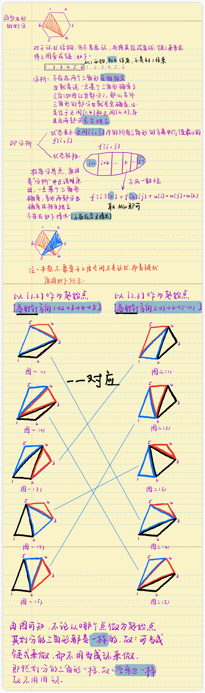

**代码**

```c++
#include <iostream>
#include <vector>
using namespace std;
typedef long long LL;
const int N = 55, INF = 1e9;
int n;
int w[N];
vector<int> f[N][N];
// 高精度乘法
vector<int> mul(vector<int> A, int b) {
    vector<int> C;
    LL t = 0;
    for (int i = 0; i < A.size(); i ++ ) {
        t += (LL)A[i] * b;
        C.push_back(t % 10);
        t /= 10;
    }
    while (t) C.push_back(t % 10), t /= 10;
    while (C.size() > 1 && C.back() == 0) C.pop_back();
    return C;
}
// 高精度加法
vector<int> add(vector<int> A, vector<int> B) {
    vector<int> C;
    int t = 0;
    for (int i = 0, j = 0; i < A.size() || j < B.size(); i ++ , j ++ ) {
        if (i < A.size()) t += A[i];
        if (j < B.size()) t += B[i];
        C.push_back(t % 10);
        t /= 10;
    }
    while (t) C.push_back(t % 10), t /= 10;
    return C;
}
// 比较函数
bool cmp(vector<int>& A, vector<int>& B) {
    if (A.size() != B.size()) return A.size() > B.size();
    for (int i = A.size() - 1; i >= 0; i -- )
        if (A[i] != B[i]) return A[i] > B[i];
    return false;
}
int main() {
    scanf("%d", &n);
    for (int i = 1; i <= n; i ++ ) scanf("%d", &w[i]);
    for (int len = 3; len <= n; len ++ )
        for (int i = 1; i + len - 1 <= n; i ++ ) {
            int j = i + len - 1;
            for (int k = i + 1; k < j; k ++ ) {
                // w[i] * w[k] * w[j];
                auto new_mul = mul(mul({w[i]}, w[k]), w[j]);
                // f[i][k] + f[k][j] + w[i] * w[k] * w[j];
                auto new_add = add(add(f[i][k], f[k][j]), new_mul);
                // f[i][j] = min(f[i][j], f[i][k] + f[k][j] + w[i] * w[k] * w[j]);
                // 只有算过的才更新，没算过的就不需要更新
                if (f[i][j].empty() || cmp(f[i][j], new_add)) // 如果f[i][j] > new_add
                    f[i][j] = new_add;
            }
        }
    auto res = f[1][n];
    for (int i = res.size() - 1; i >= 0; i -- ) cout << res[i];
    return 0;
}
```

**标签**

`区间DP`、`高精度`

**缝合怪**

[高精度](#高精度)

### [AcWing 479. 加分二叉树](https://www.acwing.com/problem/content/481/)

**题目描述**

>   设一个 `n` 个节点的二叉树 `tree` 的中序遍历为`（1,2,3,…,n）`，其中数字 `1,2,3,…,n` 为节点编号。
>
>   每个节点都有一个分数（均为正整数），记第 `i` 个节点的分数为 $d_i$，`tree` 及它的每个子树都有一个加分，任一棵子树 `subtree`（也包含 `tree` 本身）的加分计算方法如下：     
>
>   `subtree` 的左子树的加分 `×` `subtree` 的右子树的加分 `＋` `subtree` 的根的分数 
>
>   若某个子树为空，规定其加分为 `1`。
>
>   叶子的加分就是叶节点本身的分数，不考虑它的空子树。
>
>   试求一棵符合中序遍历为`（1,2,3,…,n）`且加分最高的二叉树 `tree`。
>
>   要求输出： 
>
>   （1）`tree` 的最高加分 
>
>   （2）`tree` 的前序遍历

**输入格式**

>   第 `1` 行：一个整数 `n`，为节点个数。 
>
>   第 `2` 行：`n` 个用空格隔开的整数，为每个节点的分数`（0<分数<100）`。

**输出格式**

>   第 `1` 行：一个整数，为最高加分（结果不会超过`int`范围）。     
>
>   第 `2` 行：`n` 个用空格隔开的整数，为该树的前序遍历。如果存在多种方案，则输出字典序最小的方案。

**数据范围**

>   +   `n < 30`

**输入样例**

```c++
5
5 7 1 2 10
```

**输出样例**

```c++
145
3 1 2 4 5
```

**手写稿**


**代码**

```c++
#include <iostream>
using namespace std;
const int N = 35;
int n;
int w[N];
int f[N][N], g[N][N];
void dfs(int l, int r) {
    if (l > r) return;
    // [l, r]的根节点是g[l][r]
    cout << g[l][r] << " ";
    // 左右子树不包括根节点
    // 左子树的区间[l, g[l][r] - 1]
    dfs(l, g[l][r] - 1);
    // 左子树的区间[g[l][r] + 1, r]
    dfs(g[l][r] + 1, r);
    return;
}
int main() {
    scanf("%d", &n);
    for (int i = 1; i <= n; i ++ ) scanf("%d", &w[i]);
    for (int len = 1; len <= n; len ++ )
        for (int i = 1; i + len - 1 <= n; i ++ ) {
            int j = i + len - 1;
            if (len == 1) { // 叶节点
                // 叶节点的价值为叶节点本身的分数
                f[i][j] = w[i];
                // 叶节点的根节点为其本身
                g[i][j] = i;
            }
            else { // 非叶节点
                for (int k = i; k <= j; k ++ ) {
                    // 说明无左子树，规定其分数为1
                    if (k == i) f[i][k - 1] = 1;
                    // 说明无右子树，规定其分数为1
                    if (k == j) f[k + 1][j] = 1;
                    // 计算以k为根节点的二叉树的分数
                    int score = f[i][k - 1] * f[k + 1][j] + w[k];
                    // 区间[i, j]的分数小于score时，才更新
                    // 区间[i, j]的分数等于score时，由于字典序的限制，不更新
                    // 具体看手写稿分析
                    if (f[i][j] < score) {
                        f[i][j] = score;
                        g[i][j] = k;
                    }
                }
            }
        }
    cout << f[1][n] << endl;
    dfs(1, n);
    return 0;
}
```

**标签**

`区间DP`、`区间DP求具体方案`

### [AcWing 321. 棋盘分割](https://www.acwing.com/problem/content/323/)

**题目描述**

>   将一个 `8×8` 的棋盘进行如下分割：将原棋盘割下一块矩形棋盘并使剩下部分也是矩形，再将剩下的部分继续如此分割，这样割了 `(n−1)` 次后，连同最后剩下的矩形棋盘共有 `n` 块矩形棋盘。(每次切割都只能沿着棋盘格子的边进行)
>
>   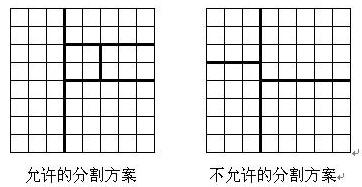
>
>   原棋盘上每一格有一个分值，一块矩形棋盘的总分为其所含各格分值之和。
>
>   现在需要把棋盘按上述规则分割成 `n` 块矩形棋盘，并使各矩形棋盘总分的均方差最小。
>
>   均方差 ，其中平均值 ，$x_i$ 为第 `i` 块矩形棋盘的总分。
>
>   请编程对给出的棋盘及 `n`，求出均方差的最小值。

**输入格式**

>   第 `1` 行为一个整数 `n`。
>
>   第 `2` 行至第 `9` 行每行为 `8` 个小于 `100` 的非负整数，表示棋盘上相应格子的分值。每行相邻两数之间用一个空格分隔。

**输出格式**

>   输出最小均方差值（四舍五入精确到小数点后三位）。

**数据范围**

>   +   $1<n<15$

**输入样例**

```c++
3
1 1 1 1 1 1 1 3
1 1 1 1 1 1 1 1
1 1 1 1 1 1 1 1
1 1 1 1 1 1 1 1
1 1 1 1 1 1 1 1
1 1 1 1 1 1 1 1
1 1 1 1 1 1 1 0
1 1 1 1 1 1 0 3
```

**输出样例**

```c++
1.633
```

**手写稿**


**代码**

```c++
#include <iostream>
#include <cstring>
#include <cmath>
using namespace std;
const int N = 10, M = 15;
int n;
double X;
int g[N][N], sum[N][N];
double f[N][N][N][N][M];
// 计算方差
double get(int x1, int y1, int x2, int y2) {
    double s = sum[x2][y2] - sum[x1 - 1][y2] - sum[x2][y1 - 1] + sum[x1 - 1][y1 - 1] - X;
    return (double)s * s / n;
}
double dfs(int x1, int y1, int x2, int y2, int k) {
    double &v = f[x1][y1][x2][y2][k];
    // 如果已经计算过，则直接返回
    if (v >= 0) return v;
    // 如果只需要1个矩形，直接计算即可
    if (k == 1) return v = get(x1, y1, x2, y2);
    // 初始化为最大值
    v = 1e9;
    // 横着切
    for (int i = x1; i <= x2; i ++ ) {
        v = min(v, dfs(x1, y1, i, y2, k - 1) + get(i + 1, y1, x2, y2));
        v = min(v, dfs(i, y1, x2, y2, k - 1) + get(x1, y1, i - 1, y2));
    }
    // 竖着切
    for (int i = y1; i <= y2; i ++ ) {
        v = min(v, dfs(x1, y1, x2, i, k - 1) + get(x1, i + 1, x2, y2));
        v = min(v, dfs(x1, i, x2, y2, k - 1) + get(x1, y1, x2, i - 1));
    }
    return v;
}
int main() {
    scanf("%d", &n);
    for (int i = 1; i <= 8; i ++ )
        for (int j = 1; j <= 8; j ++ ) {
            scanf("%d", &g[i][j]);
            // 前缀和
            sum[i][j] = g[i][j] + sum[i - 1][j] + sum[i][j - 1] - sum[i - 1][j - 1];
        }
    // X拔
    X = (double)sum[8][8] / n;
    // 浮点型数组初始化-1，其值为NaN
    memset(f, -1, sizeof f);
    printf("%.3lf\n", sqrt(dfs(1, 1, 8, 8, n)));
    return 0;
}
```

**标签**

`区间DP`、`记忆化搜索`、`前缀和`

### [LeetCode 375. 猜数字大小 II](https://leetcode-cn.com/problems/guess-number-higher-or-lower-ii/)

**题目描述**

>   我们正在玩一个猜数游戏，游戏规则如下：
>
>   +   我从 `1` 到 `n` 之间选择一个数字。
>   +   你来猜我选了哪个数字。
>   +   如果你猜到正确的数字，就会 赢得游戏 。
>   +   如果你猜错了，那么我会告诉你，我选的数字比你的 更大或者更小 ，并且你需要继续猜数。
>   +   每当你猜了数字 `x` 并且猜错了的时候，你需要支付金额为 `x` 的现金。如果你花光了钱，就会 输掉游戏 。
>
>   给你一个特定的数字 `n` ，返回能够 确保你获胜 的最小现金数，不管我选择那个数字 。

**示例 1**


>   输入：`n = 10`
>   输出：`16`
>   解释：制胜策略如下：
>
>   - 数字范围是 `[1,10]` 。你先猜测数字为 `7` 。
>       - 如果这是我选中的数字，你的总费用为 `0` 。否则，你需要支付 `7` 。
>       - 如果我的数字更大，则下一步需要猜测的数字范围是 `[8,10]` 。你可以猜测数字为 `9` 。
>           - 如果这是我选中的数字，你的总费用为 `7` 。否则，你需要支付 `9` 。
>           - 如果我的数字更大，那么这个数字一定是 `10` 。你猜测数字为 `10` 并赢得游戏，总费用为 `7 + 9 = 16` 。
>           - 如果我的数字更小，那么这个数字一定是 `8` 。你猜测数字为 `8` 并赢得游戏，总费用为 `7 + 9 = 16` 。
>       - 如果我的数字更小，则下一步需要猜测的数字范围是 `[1,6]` 。你可以猜测数字为 `3` 。
>           - 如果这是我选中的数字，你的总费用为 `7` 。否则，你需要支付 `3` 。
>           - 如果我的数字更大，则下一步需要猜测的数字范围是 `[4,6]` 。你可以猜测数字为 `5` 。
>               - 如果这是我选中的数字，你的总费用为 `7 + 3 = 10` 。否则，你需要支付 `5` 。
>               - 如果我的数字更大，那么这个数字一定是 `6` 。你猜测数字为 `6` 并赢得游戏，总费用为 `7 + 3 + 5 = 15` 。
>               - 如果我的数字更小，那么这个数字一定是 `4` 。你猜测数字为 `4` 并赢得游戏，总费用为 `7 + 3 + 5 = 15` 。
>           - 如果我的数字更小，则下一步需要猜测的数字范围是 `[1,2]` 。你可以猜测数字为 `1` 。
>               - 如果这是我选中的数字，你的总费用为 `7 + 3 = 10` 。否则，你需要支付 `1` 。
>               - 如果我的数字更大，那么这个数字一定是 `2` 。你猜测数字为 `2` 并赢得游戏，总费用为 `7 + 3 + 1 = 11` 。
>
>   在最糟糕的情况下，你需要支付 `16` 。因此，你只需要 `16` 就可以确保自己赢得游戏。

**示例 2**

>   输入：`n = 1`
>   输出：`0`
>   解释：只有一个可能的数字，所以你可以直接猜 `1` 并赢得游戏，无需支付任何费用。

**示例 3**

>   输入：`n = 2`
>   输出：`1`
>   解释：有两个可能的数字 `1` 和 `2` 。
>
>   - 你可以先猜 `1` 。
>       - 如果这是我选中的数字，你的总费用为 `0` 。否则，你需要支付 `1` 。
>       - 如果我的数字更大，那么这个数字一定是 `2` 。你猜测数字为 `2` 并赢得游戏，总费用为 `1` 。
>           最糟糕的情况下，你需要支付 `1` 。

**提示**

>   +   $1 <= n <= 200$

**手写稿**

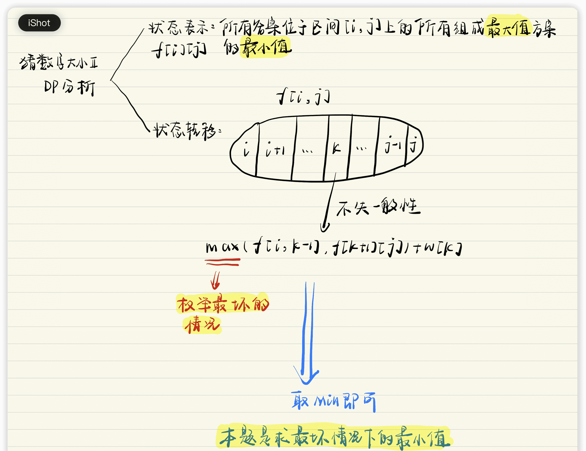

**代码**

```c++
class Solution {
public:
    int getMoneyAmount(int n) {
        vector<vector<int>> f(n + 5, vector<int>(n + 5));
        // 枚举区间长度
        for (int len = 2; len <= n; len ++ )
            // 枚举左端点
            for (int i = 1; i + len - 1 <= n; i ++ ) {
                // 找到右端点
                int j = i + len - 1;
                f[i][j] = 1e9;
                for (int k = i; k <= j; k ++ ) 
                    f[i][j] = min(f[i][j], max(f[i][k - 1], f[k + 1][j]) + k);
            }
        return f[1][n];
    }
};
```

**时间复杂度**

$O(n^3)$

**空间复杂度**

$O(n^2)$

**标签**

`区间DP`

**缝合怪**

# 搜索


## 宽度优先搜索

### 概述

>   1.   宽搜解决的一般是最短、最少等类似问题
>   2.   宽搜相比较于深搜，不会存在爆栈等问题

### `Flood Fill`

#### [AcWing 1097. 池塘计数](https://www.acwing.com/problem/content/1099/)

**题目描述**

>   农夫约翰有一片 `N ∗ M` 的矩形土地。
>
>   最近，由于降雨的原因，部分土地被水淹没了。
>
>   现在用一个字符矩阵来表示他的土地。
>
>   每个单元格内，如果包含雨水，则用”`W`”表示，如果不含雨水，则用”`.`”表示。
>
>   现在，约翰想知道他的土地中形成了多少片池塘。
>
>   每组相连的积水单元格集合可以看作是一片池塘。
>
>   每个单元格视为与其上、下、左、右、左上、右上、左下、右下八个邻近单元格相连。
>
>   请你输出共有多少片池塘，即矩阵中共有多少片相连的”`W`”块。

**输入格式**

>   第一行包含两个整数 `N` 和 `M`。
>
>   接下来 `N` 行，每行包含 `M` 个字符，字符为”`W`”或”`.`”，用以表示矩形土地的积水状况，字符之间没有空格。

**输出格式**

>   输出一个整数，表示池塘数目。

**数据范围**

>   +   `1≤N,M≤1000`

**输入样例**

```c++
10 12
W........WW.
.WWW.....WWW
....WW...WW.
.........WW.
.........W..
..W......W..
.W.W.....WW.
W.W.W.....W.
.W.W......W.
..W.......W.
```

**输出样例**

```c++
3
```

**手写稿**

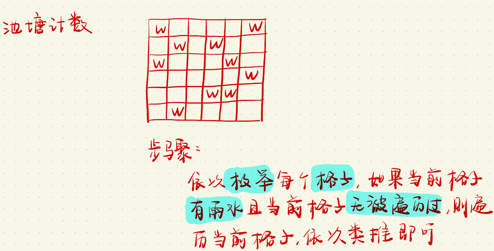

**代码**

```c++
#include <iostream>
#define x first
#define y second
using namespace std;
typedef pair<int, int> PII;
const int N = 1010, M = N * N;
int n, m;
// 存储每一个点
PII q[M];
// 存储x的八个方向
int dx[8] = {-1, -1, -1, 0, 1, 1, 1, 0};
// 存储y的八个方向
int dy[8] = {-1, 0, 1, 1, 1, 0, -1, -1};
char g[N][N];
// st数组保证每个点都只被遍历一次
int st[N][N];
void bfs(int sx, int sy) {
    int hh = 0, tt = -1;
    q[++ tt] = {sx, sy};
    // 一开始当前水洼已经被访问过
    st[sx][sy] = true;
    while (hh <= tt) {
        PII t = q[hh ++ ];
        for (int i = 0; i < 8; i ++ ) {
            int tx = t.x + dx[i];
            int ty = t.y + dy[i];
            // 如果没有越界，并且当前田地是水洼，并且当前田地没有被访问过
            if (tx < 0 || tx >= n || ty < 0 || ty >= m || g[tx][ty] == '.' || st[tx][ty])
                continue;
            // 当前田地已经被访问过
            // 保证每个点都只被遍历一次
            st[tx][ty] = true;
            // 入队
            q[++ tt] = {tx, ty};
        }
    }
    return;
}
int main() {
    scanf("%d%d", &n, &m);
    for (int i = 0; i < n; i ++ ) scanf("%s", g[i]);
    int cnt = 0;
    for (int i = 0; i < n; i ++ )
        for (int j = 0; j < m; j ++ )
            // 如果当前位置为'W'并且当前位置没有被访问过
            if (g[i][j] == 'W' && !st[i][j]) {
                bfs(i, j);
                // 池塘数量++
                cnt ++;
            }
    cout << cnt << endl;
    return 0;
}
```

**时间复杂度**

$O(nm)$

**空间复杂度**

$O(n^2)$

**标签**

`宽搜`、`Flood Fill`

**缝合怪**

#### [AcWing 1098. 城堡问题](https://www.acwing.com/problem/content/1100/)

**题目描述**

>   ```c++
>   1   2   3   4   5   6   7  
>   #############################
>   1 #   |   #   |   #   |   |   #
>   #####---#####---#---#####---#
>   2 #   #   |   #   #   #   #   #
>   #---#####---#####---#####---#
>   3 #   |   |   #   #   #   #   #
>   #---#########---#####---#---#
>   4 #   #   |   |   |   |   #   #
>   #############################
>          (图 1)
>   
>   #  = Wall   
>   |  = No wall
>      -  = No wall
>   
>      方向：上北下南左西右东。
>   ```
>
>   图 `1` 是一个城堡的地形图。
>
>   请你编写一个程序，计算城堡一共有多少房间，最大的房间有多大。
>
>   城堡被分割成 `m ∗ n`个方格区域，每个方格区域可以有 `0 ~ 4` 面墙。
>
>   注意：墙体厚度忽略不计。

**输入格式**

>   第一行包含两个整数 `m` 和 `n`，分别表示城堡南北方向的长度和东西方向的长度。
>
>   接下来 `m` 行，每行包含 `n` 个整数，每个整数都表示平面图对应位置的方块的墙的特征。
>
>   每个方块中墙的特征由数字 `P` 来描述，我们用 `1` 表示西墙，`2` 表示北墙，`4` 表示东墙，`8` 表示南墙，`P` 为该方块包含墙的数字之和。
>
>   例如，如果一个方块的 `P` 为 `3`，则 `3 = 1 + 2`，该方块包含西墙和北墙。
>
>   城堡的内墙被计算两次，方块`(1,1)`的南墙同时也是方块`(2,1)`的北墙。
>
>   输入的数据保证城堡至少有两个房间。

**输出格式**

>   共两行，第一行输出房间总数，第二行输出最大房间的面积（方块数）。

**数据范围**

>   +   $1≤m,n≤50,$
>   +   $0≤P≤15$

**输入样例**

```c++
4 7 
11 6 11 6 3 10 6 
7 9 6 13 5 15 5 
1 10 12 7 13 7 5 
13 11 10 8 10 12 13 
```

**输出样例**

```c++
5
9
```

**手写稿**

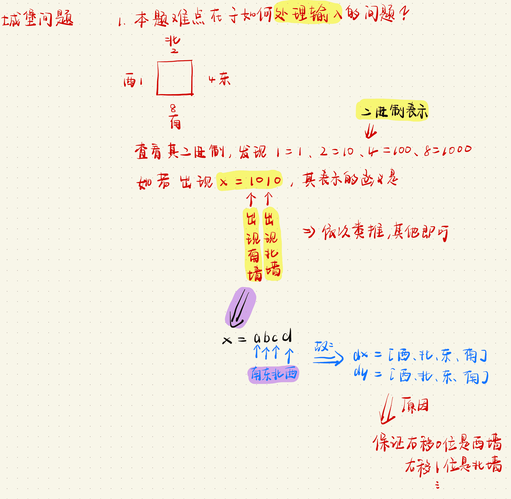

**代码**

```c++
#include <iostream>
#define x first
#define y second
using namespace std;
typedef pair<int, int> PII;
const int N = 55, M = N * N;
int n, m;
// 注意：此处设置的方向要和题目中的一致【手写稿有说明】
int dx[4] = {0, -1, 0, 1};
int dy[4] = {-1, 0, 1, 0};
PII q[M];
int g[N][N], st[N][N];
int bfs(int sx, int sy) {
    // 方块的数量
    int area = 0;
    int hh = 0, tt = -1;
    q[++ tt] = {sx, sy};
    st[sx][sy] = true;
    while (hh <= tt) {
        PII t = q[hh ++];
        area ++;
        // 枚举四个方向
        for (int i = 0; i < 4; i ++ ) {
            int tx = t.x + dx[i];
            int ty = t.y + dy[i];
            // 判断是否越界以及是否已经被访问过
            if (tx < 0 || tx >= n || ty < 0 || ty >= m || st[tx][ty]) continue;
            // 判断是否有墙
            if (g[t.x][t.y] >> i & 1) continue;
            q[++ tt] = {tx, ty};
            // 放置某个点被重复加入
            // 保证每个点只被遍历一次
            st[tx][ty] = true;
        }
    }
    return area;
}
int main() {
    scanf("%d%d", &n, &m);
    for (int i = 0; i < n; i ++ )
        for (int j = 0; j < m; j ++ )
            scanf("%d", &g[i][j]);
    int cnt = 0, area = 0;
    for (int i = 0; i < n; i ++ )
        for (int j = 0; j < m; j ++ )
            if (!st[i][j]) {
                area = max(area, bfs(i, j));
                cnt ++;
            }
    cout << cnt << endl << area << endl;
    return 0;
}
```

**时间复杂度**

$O(nm)$

**空间复杂度**

$O(nm)$

**标签**

`Flood Fill`

**缝合怪**

#### [AcWing 1106. 山峰和山谷](https://www.acwing.com/problem/content/1108/)

**题目描述**

>   `FGD`小朋友特别喜欢爬山，在爬山的时候他就在研究山峰和山谷。
>
>   为了能够对旅程有一个安排，他想知道山峰和山谷的数量。
>
>   给定一个地图，为 `FGD` 想要旅行的区域，地图被分为 `n × n` 的网格，每个格子 `(i,j)` 的高度 `w(i,j)` 是给定的。
>
>   若两个格子有公共顶点，那么它们就是相邻的格子，如与 `(i,j)` 相邻的格子有`(i−1,j−1),(i−1,j),(i−1,j+1),(i,j−1),(i,j+1),(i+1,j−1),(i+1,j),(i+1,j+1)`。
>
>   我们定义一个格子的集合 `S` 为山峰（山谷）当且仅当：
>
>   1.  `S` 的所有格子都有相同的高度。
>   2.  `S` 的所有格子都连通。
>   3.  对于 `s` 属于 `S`，与 `s` 相邻的 `s′` 不属于 `S`，都有 $w_s>w_{s′}$（山峰），或者 $w_s<w_{s′}$（山谷）。
>   4.  如果周围不存在相邻区域，则同时将其视为山峰和山谷。
>
>   你的任务是，对于给定的地图，求出山峰和山谷的数量，如果所有格子都有相同的高度，那么整个地图即是山峰，又是山谷。

**输入格式**

>   第一行包含一个正整数 `n`，表示地图的大小。
>
>   接下来一个 `n × n` 的矩阵，表示地图上每个格子的高度 `w`。

**输出格式**

>   共一行，包含两个整数，表示山峰和山谷的数量。

**数据范围**

>   +   $1≤n≤1000,$
>   +   $0≤w≤10^9$

**输入样例1**

```c++
5
8 8 8 7 7
7 7 8 8 7
7 7 7 7 7
7 8 8 7 8
7 8 8 8 8
```

**输出样例1**

```c++
2 1
```

**输入样例2**

```c++
5
5 7 8 3 1
5 5 7 6 6
6 6 6 2 8
5 7 2 5 8
7 1 0 1 7
```

**输出样例2**

```c++
3 3
```

**样例解释**

>   样例1：
>
>   
>
>   样例2：
>
>   

**手写稿**

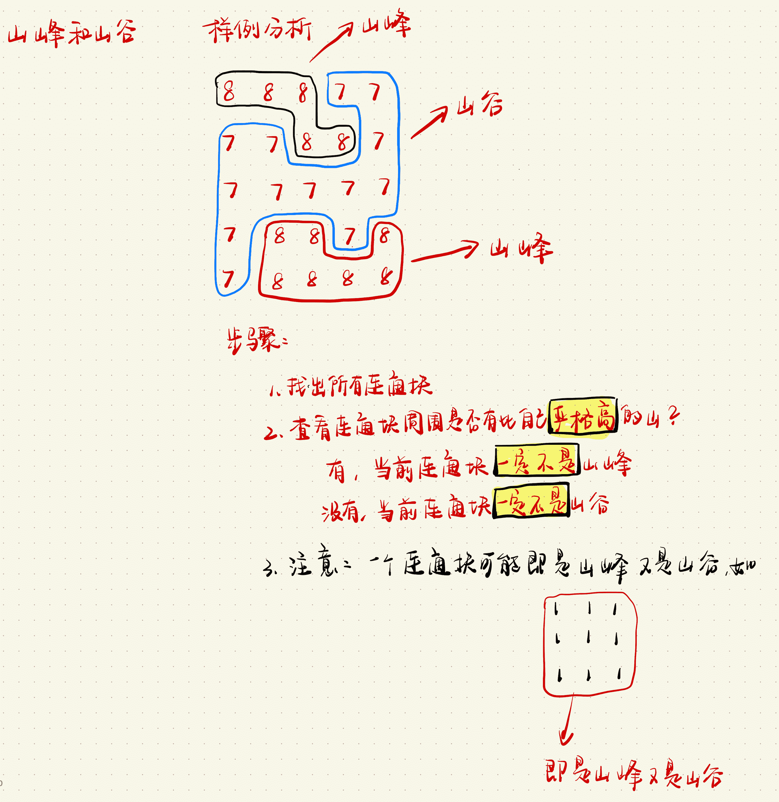

**代码**

```c++
#include <iostream>
#define x first
#define y second
using namespace std;
typedef pair<int, int> PII;
const int N = 1010, M = N * N;
int n;
int dx[8] = {-1, -1, -1, 0, 1, 1, 1, 0};
int dy[8] = {-1, 0, 1, 1, 1, 0, -1, -1};
PII q[M];
int g[N][N], st[N][N];
void bfs(int sx, int sy, bool &is_peak, bool &is_valley) {
    int hh = 0, tt = -1;
    q[++ tt] = {sx, sy};
    st[sx][sy] = true;
    while (hh <= tt) {
        PII t = q[hh ++ ];
        // 遍历8个方向
        for (int i = 0; i < 8; i ++ ) {
            int tx = t.x + dx[i];
            int ty = t.y + dy[i];
            // 注意：这里不能添加此条件st[tx][ty]
            // 原因：需要判断当前点与周围点的高度，用以判断是否是山峰还是山谷
            if (tx < 0 || tx >= n || ty < 0 || ty >= n) continue;
            // 如果当前点和周围点高度不相等
            if (g[t.x][t.y] != g[tx][ty]) {
                // 如果当前点比周围点高，则当前点一定不是山谷
                if (g[t.x][t.y] > g[tx][ty]) is_valley = false;
                // 如果当前点比周围点低，则当前点一定不是山峰
                else is_peak = false;
            }
            // 在此处进行判断st[tx][ty]这个条件
            // 如果当前点没有被访问过，则加入当前点，并标记为已访问过
            else if (!st[tx][ty]) {
                q[++ tt] = {tx, ty};
                st[tx][ty] = true;
            }
        }
    }
    return;
}
int main() {
    scanf("%d", &n);
    for (int i = 0; i < n; i ++ )
        for (int j = 0; j < n; j ++ )
            scanf("%d", &g[i][j]);
    // 定义山峰和山谷的数量
    int peak = 0, valley = 0;
    for (int i = 0; i < n; i ++ )
        for (int j = 0; j < n; j ++ )
            if (!st[i][j]) {
                // 初始假设即是山峰又是山谷
                bool is_peak = true, is_valley = true;
                bfs(i, j, is_peak, is_valley);
                // 如果是山峰
                if (is_peak) peak ++;
                // 如果是山谷
                if (is_valley) valley ++;
            }
    cout << peak << " " << valley << endl;
    return 0;
}
```

**时间复杂度**

$O(n^2)$

**空间复杂度**

$O(n^2)$

**标签**

`Flood Fill`

**缝合怪**


### 最短路模型

#### [AcWing 1076. 迷宫问题](https://www.acwing.com/problem/content/1078/)

**题目描述**

>   给定一个 `n × n` 的二维数组，如下所示：
>
>   ```c++
>   int maze[5][5] = {
>   
>   0, 1, 0, 0, 0,
>   
>   0, 1, 0, 1, 0,
>   
>   0, 0, 0, 0, 0,
>   
>   0, 1, 1, 1, 0,
>   
>   0, 0, 0, 1, 0,
>   
>   };
>   ```
>
>   它表示一个迷宫，其中的`1`表示墙壁，`0`表示可以走的路，只能横着走或竖着走，不能斜着走，要求编程序找出从左上角到右下角的最短路线。
>
>   数据保证至少存在一条从左上角走到右下角的路径。

**输入格式**

>   第一行包含整数 `n`。
>
>   接下来 `n` 行，每行包含 `n` 个整数 `0` 或 `1`，表示迷宫。

**输出格式**

>   输出从左上角到右下角的最短路线，如果答案不唯一，输出任意一条路径均可。
>
>   按顺序，每行输出一个路径中经过的单元格的坐标，左上角坐标为 `(0,0)`，右下角坐标为 `(n−1,n−1)`。

**数据范围**

>   +   $0≤n≤1000$

**输入样例**

```c++
5
0 1 0 0 0
0 1 0 1 0
0 0 0 0 0
0 1 1 1 0
0 0 0 1 0
```

**输出样例**

```c++
0 0
1 0
2 0
2 1
2 2
2 3
2 4
3 4
4 4
```

**手写稿**

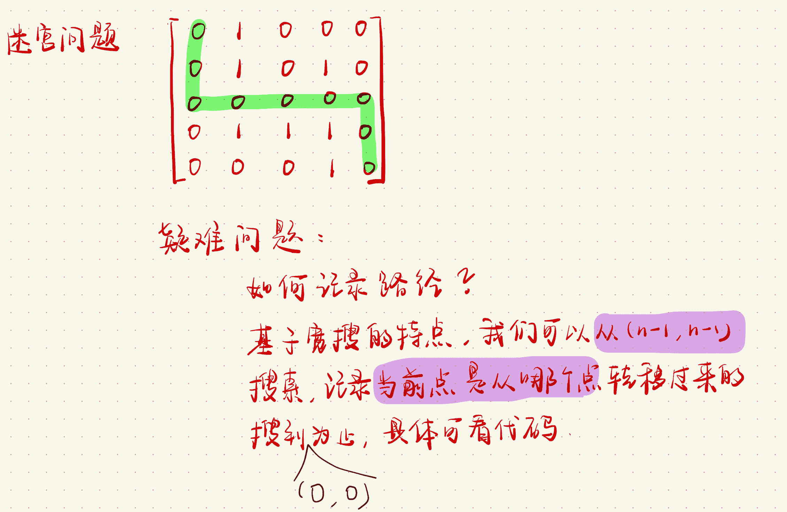

**代码**

```c++
#include <iostream>
#define x first
#define y second
using namespace std;
typedef pair<int, int> PII;
const int N = 1010, M = N * N;
int n;
int dx[4] = {1, -1, 0, 0};
int dy[4] = {0, 0, -1, 1};
PII q[M];
// st判重数组，保证宽搜的时候每个数据只进一次队列
int g[N][N], st[N][N];
// 记录某个点从哪个点转移过来的，使用pair数组记录
PII pre[N][N];
// 宽搜模板
void bfs(int sx, int sy) {
    int hh = 0, tt = -1;
    q[++ tt] = {sx, sy};
    st[sx][sy] = true;
    pre[sx][sy] = {0, 0};
    while (hh <= tt) {
        PII t = q[hh ++ ];
        for (int i = 0; i < 4; i ++ ) {
            int tx = t.x + dx[i];
            int ty = t.y + dy[i];
            if (tx < 0 || tx >= n || ty < 0 || ty >= n || g[tx][ty] || st[tx][ty])
                continue;
            q[++ tt] = {tx, ty};
            st[tx][ty] = true;
            pre[tx][ty] = {t.x, t.y};
        }
    }
    return;
}
int main() {
    scanf("%d", &n);
    for (int i = 0; i < n; i ++ )
        for (int j = 0; j < n; j ++ )
            scanf("%d", &g[i][j]);
    bfs(n - 1, n - 1);
    // 初始值
    PII end(0, 0);
    while (true) {
        cout << end.x << " " << end.y << endl;
        // 如果已经到达终点，则结束
        if (end.x == n - 1 && end.y == n - 1) break;
        // 否则，记录前驱值
        end = pre[end.x][end.y];
    }
    return 0;
}
```

**时间复杂度**

$O(n^2)$

**空间复杂度**

$O(n^2)$

**标签**

`宽度优先搜索`

**缝合怪**

#### [AcWing 188. 武士风度的牛](https://www.acwing.com/problem/content/190/)

**题目描述**

>   农民 `John` 有很多牛，他想交易其中一头被 `Don` 称为 `The Knight` 的牛。
>
>   这头牛有一个独一无二的超能力，在农场里像 `Knight` 一样地跳（就是我们熟悉的象棋中马的走法）。
>
>   虽然这头神奇的牛不能跳到树上和石头上，但是它可以在牧场上随意跳，我们把牧场用一个 `x，y` 的坐标图来表示。
>
>   这头神奇的牛像其它牛一样喜欢吃草，给你一张地图，上面标注了 `The Knight` 的开始位置，树、灌木、石头以及其它障碍的位置，除此之外还有一捆草。
>
>   现在你的任务是，确定 `The Knight` 要想吃到草，至少需要跳多少次。
>
>   `The Knight` 的位置用 `K` 来标记，障碍的位置用 `*` 来标记，草的位置用 `H` 来标记。
>
>   这里有一个地图的例子：
>
>   ```c++
>            11 | . . . . . . . . . .
>            10 | . . . . * . . . . . 
>             9 | . . . . . . . . . . 
>             8 | . . . * . * . . . . 
>             7 | . . . . . . . * . . 
>             6 | . . * . . * . . . H 
>             5 | * . . . . . . . . . 
>             4 | . . . * . . . * . . 
>             3 | . K . . . . . . . . 
>             2 | . . . * . . . . . * 
>             1 | . . * . . . . * . . 
>             0 ----------------------
>                                   1 
>               0 1 2 3 4 5 6 7 8 9 0 
>   ```
>
>   `The Knight` 可以按照下图中的 `A,B,C,D…` 这条路径用 `5` 次跳到草的地方（有可能其它路线的长度也是 `5`）：
>
>   ```c++
>            11 | . . . . . . . . . .
>            10 | . . . . * . . . . .
>             9 | . . . . . . . . . .
>             8 | . . . * . * . . . .
>             7 | . . . . . . . * . .
>             6 | . . * . . * . . . F<
>             5 | * . B . . . . . . .
>             4 | . . . * C . . * E .
>             3 | .>A . . . . D . . .
>             2 | . . . * . . . . . *
>             1 | . . * . . . . * . .
>             0 ----------------------
>                                   1
>               0 1 2 3 4 5 6 7 8 9 0
>   ```
>
>   **注意：** 数据保证一定有解。

**输入格式**

>   第 `1` 行： 两个数，表示农场的列数 `C` 和行数 `R`。
>
>   第 `2..R+1` 行: 每行一个由 `C` 个字符组成的字符串，共同描绘出牧场地图。

**输出格式**

>   一个整数，表示跳跃的最小次数。

**数据范围**

>   +   $1≤R,C≤150$

**输入样例**

```c++
10 11
..........
....*.....
..........
...*.*....
.......*..
..*..*...H
*.........
...*...*..
.K........
...*.....*
..*....*..
```

**输出样例**

```c++
5
```

**手写稿**

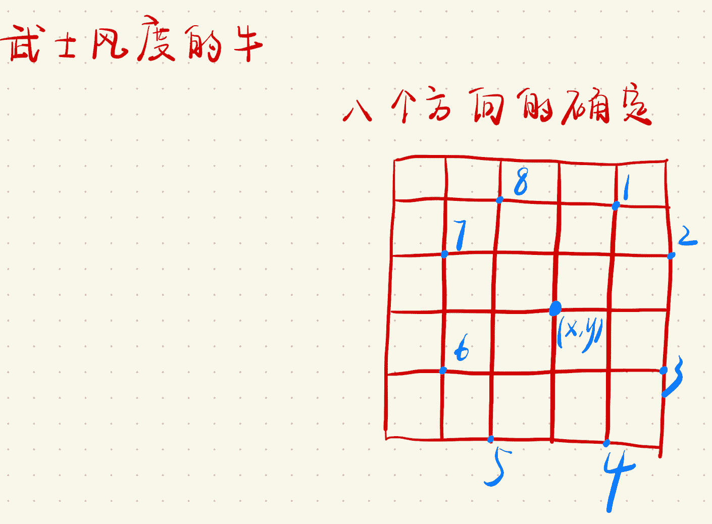

**代码**

```c++
#include <iostream>
#define x first
#define y second
using namespace std;
const int N = 155, M = N * N;
typedef pair<int, int> PII;
int n, m;
int dx[8] = {-2, -1, 1, 2, 2, 1, -1, -2};
int dy[8] = {1, 2, 2, 1, -1, -2, -2, -1};
PII q[M];
int st[N][N], dist[N][N];
char g[N][N];
// bfs模板
int bfs() {
    int sx = -1, sy = -1;
    // 找起始点
    for (int i = 0; i < n; i ++ ) {
        for (int j = 0; j < m; j ++ )
            if (g[i][j] == 'K') {
                sx = i, sy = j;
                break;
            }
        if (sx != -1 && sy != -1) break;
    }
    int hh = 0, tt = -1;
    q[++ tt] = {sx, sy};
    st[sx][sy] = true;
    while (hh <= tt) {
        auto t = q[hh ++ ];
        for (int i = 0; i < 8; i ++ ) {
            int tx = t.x + dx[i];
            int ty = t.y + dy[i];
            if (tx < 0 || tx >= n || ty < 0 || ty >= m || st[tx][ty] || g[tx][ty] == '*')
                continue;
            q[++ tt] = {tx, ty};
            // 将当前点标记为已经被访问过
            st[tx][ty] = true;
            // 距离 ➕ 1 
            dist[tx][ty] = dist[t.x][t.y] + 1;
            // 如果到达终点，则直接返回
            if (g[tx][ty] == 'H') return dist[tx][ty];
        }
    }
    return -1;
}
int main() {
    scanf("%d%d", &m, &n);
    for (int i = 0; i < n; i ++ ) scanf("%s", g[i]);
    cout << bfs() << endl;
    return 0;
}
```

**时间复杂度**

$O(n^2)$

**空间复杂度**

$O(n^2)$

**标签**

`宽度优先搜索`

**缝合怪**

#### [AcWing 1100. 抓住那头牛](https://www.acwing.com/problem/content/1102/)

>   农夫知道一头牛的位置，想要抓住它。
>
>   农夫和牛都位于数轴上，农夫起始位于点 `N`，牛位于点 `K`。
>
>   农夫有两种移动方式：
>
>   1.  从 `X` 移动到 `X−1` 或 `X+1`，每次移动花费一分钟
>   2.  从 `X` 移动到 `2∗X`，每次移动花费一分钟
>
>   假设牛没有意识到农夫的行动，站在原地不动。
>
>   农夫最少要花多少时间才能抓住牛？

**输入格式**

>   共一行，包含两个整数`N`和`K`。

**输出格式**

>   输出一个整数，表示抓到牛所花费的最少时间。

**数据范围**

>   +   $0≤N,K≤10^5$

**输入样例**

```c++
5 17
```

**输出样例**

```c++
4
```

**手写稿**

>   1.   裸的广搜
>   2.   遍历三种走路的方式即可

**代码**

```c++
#include <iostream>
using namespace std;
const int N = 1e5 + 10;
int n, m;
int q[N], st[N], dist[N];
int bfs() {
    int hh = 0, tt = -1;
    q[++ tt] = n;
    st[n] = true;
    while (hh <= tt) {
        int t = q[hh ++ ];
        if (t == m) return dist[t];
        // 遍历三种方式
        if (t - 1 >= 0 && !st[t - 1]) {
            st[t - 1] = true;
            dist[t - 1] = dist[t] + 1;
            q[++ tt] = t - 1;
        }
        // 注意小于等于N
        if (t + 1 <= N && !st[t + 1]) {
            st[t + 1] = true;
            dist[t + 1] = dist[t] + 1;
            q[++ tt ] = t + 1;
        }
        // 注意小于等于N
        if (t * 2 <= N && !st[t * 2]) {
            st[t * 2] = true;
            dist[t * 2] = dist[t] + 1;
            q[++ tt ] = t * 2;
        }
    }
    return -1;
}
int main() {
    scanf("%d%d", &n, &m);
    cout << bfs() << endl;
    return 0;
}
```

**时间复杂度**

$O(n^2)$

**空间复杂度**

$O(n^2)$

**标签**

`宽度优先搜索`

**缝合怪**


### 多源 `BFS` 模型

#### [AcWing 173. 矩阵距离](https://www.acwing.com/problem/content/175/)

>   给定一个 `N` 行 `M` 列的 `01` 矩阵 `A`，`A[i][j]` 与 `A[k][l]` 之间的曼哈顿距离定义为：
>
>   $dist(A[i][j],A[k][l])=|i−k|+|j−l|$
>
>   输出一个 `N` 行 `M` 列的整数矩阵 `B`，其中：
>
>   $B[i][j]=min_{1≤x≤N,1≤y≤M,A[x][y]=1}dist(A[i][j],A[x][y])$

**输入格式**

>   第一行两个整数 `N,M`。
>
>   接下来一个 `N` 行 `M` 列的 `01` 矩阵，数字之间没有空格。

**输出格式**

>   一个 `N` 行 `M` 列的矩阵 `B`，相邻两个整数之间用一个空格隔开。

**数据范围**

>   +   $1≤N,M≤1000$

**输入样例**

```c++
3 4
0001
0011
0110
```

**输出样例**

```c++
3 2 1 0
2 1 0 0
1 0 0 1
```

**手写稿**

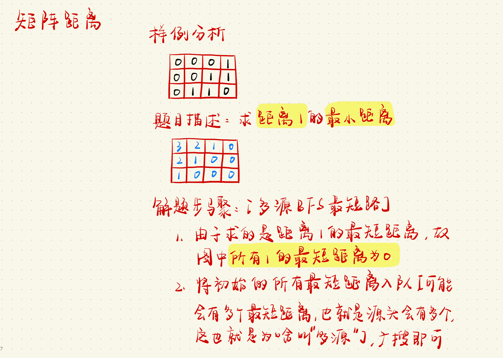

**代码**

```c++
#include <iostream>
#include <cstring>
#define x first
#define y second
using namespace std;
typedef pair<int, int> PII;
const int N = 1010, M = N * N;
int n, m;
int dx[] = {1, -1, 0, 0};
int dy[] = {0, 0, -1, 1};
PII q[M];
char g[N][N];
int dist[N][N];
bool st[N][N];
void bfs() {
    memset(dist, -1, sizeof dist);
    int hh = 0, tt = -1;
    // 找出所有源点，找出所有初始化的最短距离
    for (int i = 0; i < n; i ++ )
        for (int j = 0; j < m; j ++ )
            if (g[i][j] == '1') {
                // 最短距离为0
                dist[i][j] = 0;
                // 状态为true
                st[i][j] = true;
                // 将当前点入队
                q[++ tt] = {i, j};
            }
    while (hh <= tt) {
        auto t = q[hh ++];
        // 枚举四个方向
        for (int i = 0; i < 4; i ++ ) {
            int tx = t.x + dx[i];
            int ty = t.y + dy[i];
            if (tx < 0 || tx >= n || ty < 0 || ty >= m || st[tx][ty]) continue;
            st[tx][ty] = true;
            // 距离 ➕ 1
            dist[tx][ty] = dist[t.x][t.y] + 1;
            q[++ tt] = {tx, ty};
        }
    }
    return;
}
int main() {
    scanf("%d%d", &n, &m);
    for (int i = 0; i < n; i ++ ) scanf("%s", g[i]);
    bfs();
    for (int i = 0; i < n; i ++ ) {
        for (int j = 0; j < m; j ++ ) 
            printf("%d ", dist[i][j]);
        cout << endl;
    }
    return 0;
}
```

**时间复杂度**

$O(n^2)$

**空间复杂度**

$O(n^2)$

**标签**

`多源BFS`

**缝合怪**


### 最小步数模型

#### [AcWing 845. 八数码](https://www.acwing.com/problem/content/847/)

**题目描述**

>   在一个 `3 × 3` 的网格中，`1 ∼ 8` 这 `8` 个数字和一个 `x` 恰好不重不漏地分布在这 `3 × 3` 的网格中。
>
>   例如：
>
>   ```c++
>   1 2 3
>   x 4 6
>   7 5 8
>   ```
>
>   在游戏过程中，可以把 `x` 与其上、下、左、右四个方向之一的数字交换（如果存在）。
>
>   我们的目的是通过交换，使得网格变为如下排列（称为正确排列）：
>
>   ```c++
>   1 2 3
>   4 5 6
>   7 8 x
>   ```
>
>   例如，示例中图形就可以通过让 `x` 先后与右、下、右三个方向的数字交换成功得到正确排列。
>
>   交换过程如下：
>
>   ```c++
>   1 2 3   1 2 3   1 2 3   1 2 3
>   x 4 6   4 x 6   4 5 6   4 5 6
>   7 5 8   7 5 8   7 x 8   7 8 x
>   ```
>
>   现在，给你一个初始网格，请你求出得到正确排列至少需要进行多少次交换。

**输入格式**

>   输入占一行，将 `3 × 3` 的初始网格描绘出来。
>
>   例如，如果初始网格如下所示：
>
>   ```c++
>   1 2 3
>   x 4 6
>   7 5 8
>   ```
>
>   则输入为：`1 2 3 x 4 6 7 5 8`

**输出格式**

>   输出占一行，包含一个整数，表示最少交换次数。
>
>   如果不存在解决方案，则输出 `−1`。

**输入样例**

```c++
2  3  4  1  5  x  7  6  8
```

**输出样例**

```c++
19
```

**手写稿**

> 1. 模板题, 顺着四个方向搜索即可

**代码**

```c++
#include <iostream>
#include <queue>
#include <unordered_map>
using namespace std;
int dx[4] = {-1, 0, 1, 0};
int dy[4] = {0, 1, 0, -1};
queue<string> q;
unordered_map<string, int> dist;
int bfs(string start) {
    string end = "12345678x";
    dist[start] = 0;
    q.push(start);
    while (q.size()) {
        string t = q.front(); q.pop();
        if (t == end) return dist[t];
        // 找到x的位置
        int k = t.find('x');
        // 将x的位置变成坐标形式
        int x = k / 3, y = k % 3;
        // 遍历四个方向
        for (int i = 0; i < 4; i ++ ) {
            string tmp = t;
            int tx = x + dx[i];
            int ty = y + dy[i];
            // 越界
            if (tx < 0 || tx >= 3 || ty < 0 || ty >= 3)
                continue;
            // 交换值
            swap(tmp[k], tmp[tx * 3 + ty]);
            // 如果tmp已经被访问过, 直接返回
            if (dist.count(tmp)) continue;
            // 更新距离
            dist[tmp] = dist[t] + 1;
            // 入队
            q.push(tmp);
        }
    }
    return -1;
}
int main() {
    char c;
    string start;
    while (cin >> c) start += c;
    cout << bfs(start) << endl;
    return 0;
}
```

**时间复杂度**

$O(指数级别)$

**空间复杂度**

$O(指数级别)$

**标签**

`BFS`、`最小步数模型`

**缝合怪**


#### [AcWing 1107. 魔板](https://www.acwing.com/problem/content/1109/)

**题目描述**

>   `Rubik` 先生在发明了风靡全球的魔方之后，又发明了它的二维版本——魔板。
>
>   这是一张有 `8` 个大小相同的格子的魔板：
>
>   ```c++
>   1 2 3 4
>   8 7 6 5
>   ```
>
>   我们知道魔板的每一个方格都有一种颜色。
>
>   这 `8` 种颜色用前 `8` 个正整数来表示。
>
>   可以用颜色的序列来表示一种魔板状态，规定从魔板的左上角开始，沿顺时针方向依次取出整数，构成一个颜色序列。
>
>   对于上图的魔板状态，我们用序列 `(1,2,3,4,5,6,7,8)` 来表示，这是基本状态。
>
>   这里提供三种基本操作，分别用大写字母 `A`，`B`，`C` 来表示（可以通过这些操作改变魔板的状态）：
>
>   `A`：交换上下两行；
>   `B`：将最右边的一列插入到最左边；
>   `C`：魔板中央对的4个数作顺时针旋转。
>
>   下面是对基本状态进行操作的示范：
>
>   `A`：
>
>   ```c++
>   8 7 6 5
>   1 2 3 4
>   ```
>
>   `B`：
>
>   ```c++
>   4 1 2 3
>   5 8 7 6
>   ```
>
>   `C`：
>
>   ```c++
>   1 7 2 4
>   8 6 3 5
>   ```
>
>   对于每种可能的状态，这三种基本操作都可以使用。
>
>   你要编程计算用最少的基本操作完成基本状态到特殊状态的转换，输出基本操作序列。
>
>   **注意**：数据保证一定有解。

**输入格式**

>   输入仅一行，包括 `8` 个整数，用空格分开，表示目标状态。

**输出格式**

>   输出文件的第一行包括一个整数，表示最短操作序列的长度。
>
>   如果操作序列的长度大于`0`，则在第二行输出字典序最小的操作序列。

**数据范围**

>   输入数据中的所有数字均为 `1` 到 `8` 之间的整数。

**输入样例**

```c++
2 6 8 4 5 7 3 1
```

**输出样例**

```c++
7
BCABCCB
```

**手写稿**

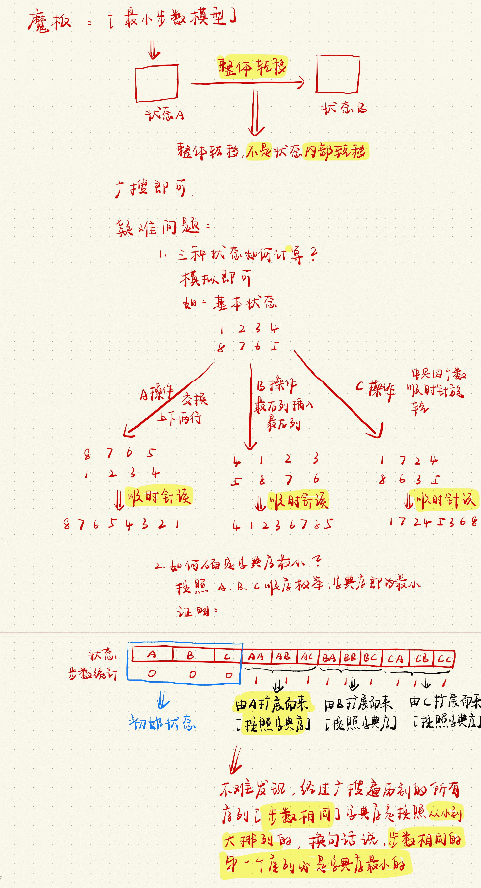

**代码**

```c++
#include <iostream>
#include <unordered_map>
#include <algorithm>
#include <queue>
using namespace std;
char g[2][4];
queue<string> q;
unordered_map<string, int> dist;
unordered_map<string, bool> st;
unordered_map<string, pair<string, char>> pre;
void set(string state) { // 将字符串变成字符矩阵
    for (int i = 0; i < 4; i ++ ) g[0][i] = state[i];
    for (int i = 0; i < 4; i ++ ) g[1][i] = state[7 - i];
    return;
}
string get() { // 将字符矩阵变成字符串
    string res = "";
    for (int i = 0; i < 4; i ++ ) res += g[0][i];
    for (int i = 3; i >= 0; i -- ) res += g[1][i];
    return res;
}
string move0(string state) {
    set(state);
    for (int i = 0; i < 4; i ++ ) swap(g[0][i], g[1][i]);
    return get();
}
string move1(string state) {
    set(state);
    char c0 = g[0][3], c1 = g[1][3];
    for (int j = 2; j >= 0; j -- )
        for (int i = 0; i < 2; i ++ )
            g[i][j + 1] = g[i][j];
    g[0][0] = c0;
    g[1][0] = c1;
    return get();
}
string move2(string state) {
    set(state);
    char t = g[0][1];
    g[0][1] = g[1][1];
    g[1][1] = g[1][2];
    g[1][2] = g[0][2];
    g[0][2] = t;
    return get();
}
void bfs(string start, string end) {
    if (start == end) return;
    q.push(start);
    st[start] = true;
    while (q.size()) {
        auto t = q.front(); q.pop();
        string m0 = move0(t);
        string m1 = move1(t);
        string m2 = move2(t);
        // 三种操作
        for (int i = 0; i < 3; i ++ ) {
            if (i == 0) {
                if (!st.count(m0)) {
                    st[m0] = true;
                    dist[m0] = dist[t] + 1;
                    q.push(m0);
                    // 记录从哪个状态转移过来的，并且记录下是哪个操作
                    pre[m0] = {t, 'A'};
                }
                if (m0 == end) return;
            }
            else if (i == 1) {
                if (!st.count(m1)) {
                    st[m1] = true;
                    dist[m1] = dist[t] + 1;
                    q.push(m1);
                    // 记录从哪个状态转移过来的，并且记录下是哪个操作
                    pre[m1] = {t, 'B'};
                }
                if (m1 == end) return;
            }
            else {
                if (!st.count(m2)) {
                    st[m2] = true;
                    dist[m2] = dist[t] + 1;
                    q.push(m2);
                    // 记录从哪个状态转移过来的，并且记录下是哪个操作
                    pre[m2] = {t, 'C'};
                }
                if (m2 == end) return;
            }
        }
    }
    return;
}
int main() {
    string start, end;
    for (int i = 0, x; i < 8; i ++ ) {
        scanf("%d", &x);
        end += char(x + '0');
    }
    for (int i = 1; i <= 8; i ++ ) start += char(i + '0');
    bfs(start, end);
    // 记录下步数
    // 因为while循环之后，end == start
    int step = dist[end];
    cout << step << endl;
    string res;
    while (end != start) {
        // while(true) 中的 if判断应该位于这里
        // 否则，res就会多执行一次+=，就会出错，原因不明
        res += pre[end].second;
        end = pre[end].first;
    }
    // 反转
    reverse(res.begin(), res.end());
    if (step) cout << res << endl;
    return 0;
}
```

**时间复杂度**

$O(n^2)$

**空间复杂度**

$O(n^2)$

**标签**

`BFS`

**缝合怪**


### 双端队列广搜

#### [AcWing 175. 电路维修](https://www.acwing.com/problem/content/177/)

**题目描述**

>   达达是来自异世界的魔女，她在漫无目的地四处漂流的时候，遇到了善良的少女翰翰，从而被收留在地球上。
>
>   翰翰的家里有一辆飞行车。
>
>   有一天飞行车的电路板突然出现了故障，导致无法启动。
>
>   电路板的整体结构是一个 `R` 行 `C` 列的网格（`R,C≤500`），如下图所示。
>
>   
>
>   每个格点都是电线的接点，每个格子都包含一个电子元件。
>
>   电子元件的主要部分是一个可旋转的、连接一条对角线上的两个接点的短电缆。
>
>   在旋转之后，它就可以连接另一条对角线的两个接点。
>
>   电路板左上角的接点接入直流电源，右下角的接点接入飞行车的发动装置。
>
>   达达发现因为某些元件的方向不小心发生了改变，电路板可能处于断路的状态。
>
>   她准备通过计算，旋转最少数量的元件，使电源与发动装置通过若干条短缆相连。
>
>   不过，电路的规模实在是太大了，达达并不擅长编程，希望你能够帮她解决这个问题。
>
>   **注意**：只能走斜向的线段，水平和竖直线段不能走。

**输入格式**

>   输入文件包含多组测试数据。
>
>   第一行包含一个整数 `T`，表示测试数据的数目。
>
>   对于每组测试数据，第一行包含正整数 `R` 和 `C`，表示电路板的行数和列数。
>
>   之后 `R` 行，每行 `C` 个字符，字符是`"/"`和`"\"`中的一个，表示标准件的方向。

**输出格式**

>   对于每组测试数据，在单独的一行输出一个正整数，表示所需的最小旋转次数。
>
>   如果无论怎样都不能使得电源和发动机之间连通，输出 `NO SOLUTION`。

**数据范围**

>   +   $1≤R,C≤500,$
>   +   $1≤T≤5$

**输入样例**

```c++
1
3 5
\\/\\
\\///
/\\\\
```

**输出样例**

```c++
1
```

**样例解释**

>   样例的输入对应于题目描述中的情况。
>
>   只需要按照下面的方式旋转标准件，就可以使得电源和发动机之间连通。
>
>   

**手写稿**


**代码**

```c++
#include <iostream>
#include <cstring>
#include <deque>
#define x first
#define y second
using namespace std;
typedef pair<int, int> PII;
const int N = 510, M = N * N;
int T, n, m;
int dx[4] = {-1, -1, 1, 1};
int dy[4] = {-1, 1, 1, -1};
int ix[4] = {-1, -1, 0, 0};
int iy[4] = {-1, 0, 0, -1};
// 合法序列的解释【手写稿】
char cs[] = "\\/\\/";
char g[N][N];
int dist[N][N], st[N][N];
int bfs() {
    // 多组数据
    // 每次进行初始化
    memset(dist, 0x3f, sizeof dist);
    memset(st, 0, sizeof st);
    // 双端队列
    deque<PII> q;
    q.push_front({0, 0});
    // 初始化距离
    dist[0][0] = 0;
    while (q.size()) {
        auto t = q.front(); q.pop_front();
        // 若已被访问过
        if (st[t.x][t.y]) continue;
        // 将当前点标记为已被访问
        st[t.x][t.y] = true;
        // 遍历四个方向上的点
        for (int i = 0; i < 4; i ++ ) {
            int tx = t.x + dx[i];
            int ty = t.y + dy[i];
            // 处理越界的问题
            if (tx < 0 || tx > n || ty < 0 || ty > m || st[tx][ty]) continue;
            // 由点的坐标得到线的坐标
            int ga = t.x + ix[i];
            int gb = t.y + iy[i];
            if (g[ga][gb] != cs[i]) {
                // 取min的原因在【手写稿】
                dist[tx][ty] = min(dist[tx][ty], dist[t.x][t.y] + 1);
                q.push_back({tx, ty});
            }
            else {
                dist[tx][ty] = dist[t.x][t.y];
                q.push_front({tx, ty});
            }
            if (tx == n && ty == m) return dist[tx][ty];
        }
    }
    return -1;
}
int main() {
    scanf("%d", &T);
    while (T -- ) {
        scanf("%d%d", &n, &m);
        for (int i = 0; i < n; i ++ ) scanf("%s", g[i]);
        if (n + m & 1) puts("NO SOLUTION");
        else cout << bfs() << endl;
    }
    return 0;
}
```

**时间复杂度**

$O(n^2)$

**空间复杂度**

$O(n^2)$

**标签**

`双端队列广搜`

**缝合怪**

### 双向广搜

#### [AcWing 190. 字串变换](https://www.acwing.com/problem/content/192/)

**题目描述**

>   已知有两个字串 `A`, `B` 及一组字串变换的规则（至多 `6` 个规则）:
>
>   $A_1→B_1$
>
>   $A_2→B_2$
>
>   $…$
>
>   规则的含义为：在 `A` 中的子串 $A_1$ 可以变换为 $B_1$、$A_2$ 可以变换为 $B_2…$。
>
>   例如：`A` `＝` `abcd` `B` `＝` `xyz`
>
>   变换规则为：
>
>   ```c++
>   abc →→ xu ud →→ y y →→ yz
>   ```
>
>   则此时，`A` 可以经过一系列的变换变为 `B`，其变换的过程为：
>
>   ```c++
>   abcd →→ xud →→ xy →→ xyz
>   ```
>
>   共进行了三次变换，使得 `A` 变换为 `B`。

**输入格式**

>   输入格式如下：
>   $$
>   A B \\
>   A_1 B_1 \\
>   A_2 B_2 \\
>   … …
>   $$
>   第一行是两个给定的字符串 `A` 和 `B`。
>
>   接下来若干行，每行描述一组字串变换的规则。
>
>   所有字符串长度的上限为 `20`。

**输出格式**

>   若在 `10` 步（包含 `10` 步）以内能将 `A` 变换为 `B` ，则输出最少的变换步数；否则输出 `NO ANSWER!`。

**输入样例**

```c++
abcd xyz
abc xu
ud y
y yz
```

**输出样例**

```c++
3
```

**手写稿**

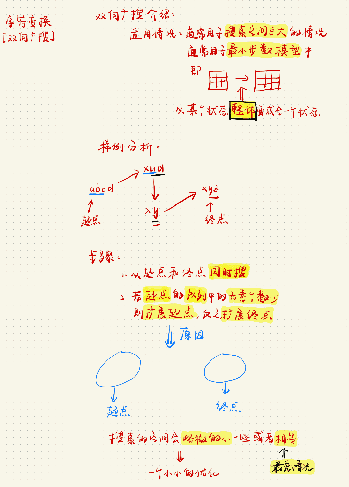

**代码**

```c++
#include <iostream>
#include <unordered_map>
#include <queue>
using namespace std;
const int N = 10;
int n;
string A, B;
string a[N], b[N];
queue<string> qa, qb;
unordered_map<string, int> da, db;
int extend(queue<string>& q, unordered_map<string, int>& da, unordered_map<string, int>& db, string a[], string b[]) {
    string t = q.front(); q.pop();
    // 枚举从哪个字符进行拓展
    for (int i = 0; i < t.size(); i ++ )
        // 枚举规则
        for (int j = 0; j < n; j ++ )
            // 如果当前从i开始拓展，长度为j的单词可以进行拓展
            if (t.substr(i, a[j].size()) == a[j]) {
                // 缝合新单词，注意：看仔细了
                string state = t.substr(0, i) + b[j] + t.substr(i + a[j].size());
                // 如果新单词已经被db拓展过了，直接返回答案即可
                if (db.count(state)) return da[t] + 1 + db[state];
                // 如果新单词已经被da拓展过了，直接进行下一次循环
                if (da.count(state)) continue;
                // 更新新单词的距离
                da[state] = da[t] + 1;
                // 入队
                q.push(state);
            }
    return 11;
}
int bfs(string& A, string& B) {
    // 特判下，如果A == B，返回0
    if (A == B) return 0;
    qa.push(A); da[A] = 0;
    qb.push(B); db[B] = 0;
    while (qa.size() && qb.size()) {
        int t = -1;
        // 每次选择队列个数少的进行拓展
        if (qa.size() <= qb.size()) t = extend(qa, da, db, a, b);
        else t = extend(qb, db, da, b, a);
        if (t <= 10) return t;
    }
    return 11;
}
int main() {
    cin >> A >> B;
    while (cin >> a[n] >> b[n]) n ++;
    int t = bfs(A, B);
    if (t > 10) puts("NO ANSWER!");
    else cout << t << endl;
    return 0;
}
```

**时间复杂度**


**空间复杂度**


**标签**

`双向广搜`

**缝合怪**


### `A*`

#### 原理概述

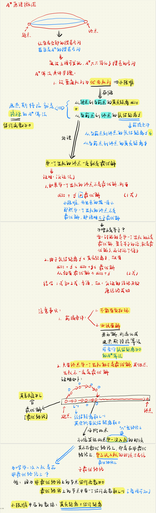


#### [AcWing 179. 八数码](https://www.acwing.com/problem/content/181/)

**题目描述**

>   在一个 `3 × 3` 的网格中，`1∼8` 这 `8` 个数字和一个 `X` 恰好不重不漏地分布在这 `3 × 3` 的网格中。
>
>   例如：
>
>   ```c++
>   1 2 3
>   X 4 6
>   7 5 8
>   ```
>
>   在游戏过程中，可以把 `X` 与其上、下、左、右四个方向之一的数字交换（如果存在）。
>
>   我们的目的是通过交换，使得网格变为如下排列（称为正确排列）：
>
>   ```c++
>   1 2 3
>   4 5 6
>   7 8 X
>   ```
>
>   例如，示例中图形就可以通过让 `X` 先后与右、下、右三个方向的数字交换成功得到正确排列。
>
>   交换过程如下：
>
>   ```c++
>   1 2 3   1 2 3   1 2 3   1 2 3
>   X 4 6   4 X 6   4 5 6   4 5 6
>   7 5 8   7 5 8   7 X 8   7 8 X
>   ```
>
>   把 `X` 与上下左右方向数字交换的行动记录为 `u`、`d`、`l`、`r`。
>
>   现在，给你一个初始网格，请你通过最少的移动次数，得到正确排列。

**输入格式**

>   输入占一行，将 `3 × 3` 的初始网格描绘出来。
>
>   例如，如果初始网格如下所示：
>
>   ```c++
>   1 2 3 
>   x 4 6 
>   7 5 8 
>   ```
>
>   则输入为：`1 2 3 x 4 6 7 5 8`

**输出格式**

>   输出占一行，包含一个字符串，表示得到正确排列的完整行动记录。
>
>   如果答案不唯一，输出任意一种合法方案即可。
>
>   如果不存在解决方案，则输出 `unsolvable`。

**输入样例**

```c++
2  3  4  1  5  x  7  6  8 
```

**输出样例**

```c++
ullddrurdllurdruldr
```

**手写稿**

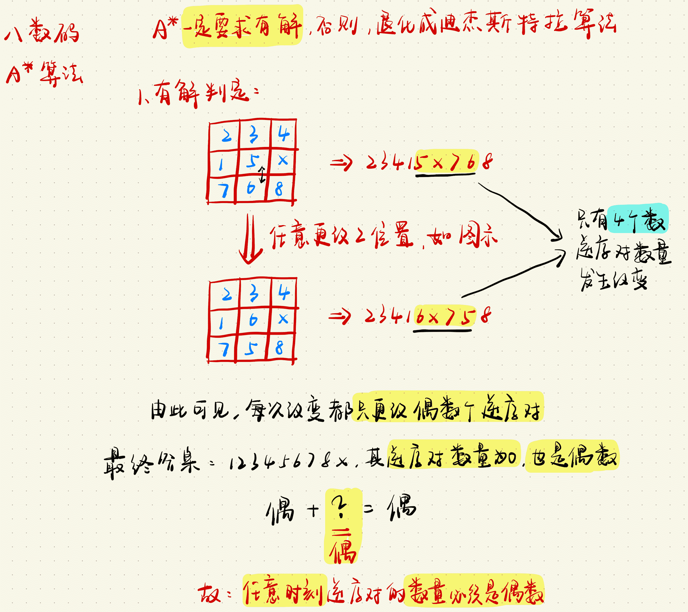

**代码**

```c++
#include <iostream>
#include <queue>
#include <unordered_map>
#include <algorithm>
#define x first
#define y second
using namespace std;
typedef pair<int, string> PIS;
string start;
int dx[4] = {-1, 0, 1, 0};
int dy[4] = {0, 1, 0, -1};
char op[4] = {'u', 'r', 'd', 'l'};
unordered_map<string, int> dist;
unordered_map<string, pair<string, char>> pre;
priority_queue<PIS, vector<PIS>, greater<PIS>> q;
int f(string state) { // 求解曼哈顿距离【手动模拟样例】
    int res = 0;
    for (int i = 0; i < state.size(); i ++ ) {
        // 获取当前字符在答案中的下标位置
        int t = state[i] - '1';
        res += abs(i / 3 - t / 3) + abs(i % 3 - t % 3);
    }
    return res;
}
string Astar() {
    string end = "12345678x";
    // 起点入队
    q.push({f(start), start});
    // 起点距离起点的距离为0
    dist[start] = 0;
    while (q.size()) {
        auto t = q.top(); q.pop();
        string state = t.y;
        // 成功找到，跳出循环
        if (state == end) break;
        // 找到x在矩阵中的位置
        int a = 0, b = 0;
        for (int i = 0; i < 9; i ++ )
            if (state[i] == 'x') {
                a = i / 3;
                b = i % 3;
                break;
            }
        // 遍历四个方向
        string source = state;
        for (int i = 0; i < 4; i ++ ) {
            int tx = a + dx[i];
            int ty = b + dy[i];
            if (tx < 0 || tx >= 3 || ty < 0 || ty >= 3) continue;
            // 交换两个值
            swap(state[a * 3 + b], state[tx * 3 + ty]);
            // 如果当前这个状态没有被访问过
            // 或者到达当前这个状态的距离更长
            if (!dist.count(state) || dist[state] > dist[source] + 1) {
                // 更新距离
                dist[state] = dist[source] + 1;
                // 记录前驱节点
                pre[state] = {source, op[i]};
                // 入队
                q.push({dist[state] + f(state), state});
            }
            // 再交换回来
            swap(state[a * 3 + b], state[tx * 3 + ty]);
        }
    }
    // 输出路径
    string res;
    while (end != start) {
        res += pre[end].y;
        end = pre[end].x;
    }
    // 由于路径是逆序输出的
    // 需要将答案反过来
    reverse(res.begin(), res.end());
    return res;
}
int main() {
    char c;
    while (cin >> c) start += c;
    // 统计逆序对的数量
    int n = 0;
    for (int i = 0; i < start.size(); i ++ ) {
        if (start[i] == 'x') continue;
        for (int j = i + 1; j < start.size(); j ++ ) {
            if (start[j] == 'x') continue;
            if (start[i] > start[j]) n ++;
        }
    }
    // 逆序对数量为奇数，无解【解释在手写稿】
    if (n & 1) puts("unsolvable");
    else cout << Astar() << endl;
    return 0;
}
```

**时间复杂度**

$最坏O(n^2)$

**空间复杂度**

$O(n^2)$

**标签**

`A*`、`BFS`

**缝合怪**


#### [AcWing 178. 第K短路](https://www.acwing.com/problem/content/180/)

**题目描述**

>   给定一张 `N` 个点（编号 `1,2…N`），`M` 条边的有向图，求从起点 `S` 到终点 `T` 的第 `K` 短路的长度，路径允许重复经过点或边。
>
>   **注意：** 每条最短路中至少要包含一条边。

**输入格式**

>   第一行包含两个整数 `N` 和 `M`。
>
>   接下来 `M` 行，每行包含三个整数 `A,B` 和 `L`，表示点 `A` 与点 `B` 之间存在有向边，且边长为 `L`。
>
>   最后一行包含三个整数 `S,T` 和 `K`，分别表示起点 `S`，终点 `T` 和第 `K` 短路。

**输出格式**

>   输出占一行，包含一个整数，表示第 `K` 短路的长度，如果第 `K` 短路不存在，则输出 `−1`。

**数据范围**

>   +   $1≤S,T≤N≤1000,$
>   +   $0≤M≤10^4,$
>   +   $1≤K≤1000,$
>   +   $1≤L≤100$

**输入样例**

```c++
2 2
1 2 5
2 1 4
1 2 2
```

**输出样例**

```c++
14
```

**手写稿**

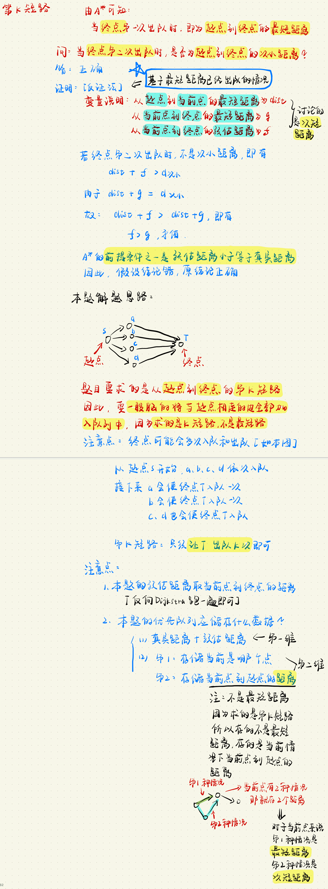

**代码**

```c++
#include <iostream>
#include <cstring>
#include <queue>
#define x first
#define y second
using namespace std;
typedef pair<int, int> PII;
typedef pair<int, PII> PIII;
const int N = 1010, M = 20010, INF = 0x3f3f3f3f;
int n, m, S, T, K, idx;
int h[N], rh[N], e[M], w[M], ne[M], f[N], st[N];
priority_queue<PII, vector<PII>, greater<PII>> q;
priority_queue<PIII, vector<PIII>, greater<PIII>> heap;
void add(int h[], int a, int b, int c) {
    e[idx] = b;
    w[idx] = c;
    ne[idx] = h[a];
    h[a] = idx ++;
    return;
}
void dijkstra() { // 遍历反图，求出每个点到终点的距离，当作预估距离
    memset(f, 0x3f, sizeof f);
    // 将终点到终点的距离为0
    f[T] = 0;
    // 将终点入队
    q.push({0, T});
    // Dijkstra模板
    while (q.size()) {
        auto t = q.top(); q.pop();
        int v = t.y;
        if (st[v]) continue;
        st[v] = true;
        for (int i = rh[v]; i != -1; i = ne[i]) {
            int j = e[i];
            if (!st[j] && f[j] > f[v] + w[i]) {
                f[j] = f[v] + w[i];
                q.push({f[j], j});
            }
        }
    }
    return;
}
int astar() {
    // 存储的数据说明在【手写稿】
    heap.push({f[S], {S, 0}});
    // 如果无法到达终点，说明不存在从起点到达终点的通路，返回-1
    if (f[S] == INF) return -1;
    int cnt = 0;
    while (heap.size()) {
        auto t = heap.top(); heap.pop();
        int v = t.y.x, distance = t.y.y;
        // 记录终点出队的次数
        if (v == T) cnt ++;
        // 终点出队的次数等于K，说明找到第K短路
        if (cnt == K) return t.x;
        // 遍历邻边
        for (int i = h[v]; i != -1; i = ne[i]) {
            int j = e[i];
            // 将所有邻边一股脑放入队列【原因在手写稿】
            heap.push({f[j] + distance + w[i], {j, distance + w[i]}});
        }
    }
    return -1;
}
int main() {
    scanf("%d%d", &n, &m);
    memset(h, -1, sizeof h);
    memset(rh, -1, sizeof rh);
    for (int i = 0; i < m; i ++ ) {
        int u, v, w;
        scanf("%d%d%d", &u, &v, &w);
        // 建立正向边
        add(h, u, v, w);
        // 建立反向边【作为预估距离】
        add(rh, v, u, w);
    }
    scanf("%d%d%d", &S, &T, &K);
    // 如果起点与终点重合，K ++【最少有一条边】
    if (S == T) K ++;
    dijkstra();
    cout << astar() << endl;
    return 0;
}
```

**时间复杂度**

$最坏O(nm)$

**空间复杂度**

$O(nm)$

**标签**

`A*`、`启发式搜索`

**缝合怪**


## 深度优先搜索

### 普通深搜

#### [LeetCode 306. 累加数](https://leetcode-cn.com/problems/additive-number/)

**题目描述**

> 累加数 是一个字符串，组成它的数字可以形成累加序列。
>
> 一个有效的 累加序列 必须 至少 包含 `3` 个数。除了最开始的两个数以外，序列中的每个后续数字必须是它之前两个数字之和。
>
> 给你一个只包含数字 `'0'-'9'` 的字符串，编写一个算法来判断给定输入是否是 累加数 。如果是，返回 `true` ；否则，返回 `false` 。
>
> 说明：累加序列里的数，除数字 `0` 之外，不会 以 `0` 开头，所以不会出现 `1, 2, 03` 或者 `1, 02, 3` 的情况。

**示例 1**

> 输入：`"112358"`
> 输出：`true`
> 解释：累加序列为: `1, 1, 2, 3, 5, 8 。1 + 1 = 2, 1 + 2 = 3, 2 + 3 = 5, 3 + 5 = 8`

**示例 2**

> 输入：`"199100199"`
> 输出：`true`
> 解释：累加序列为: `1, 99, 100, 199。1 + 99 = 100, 99 + 100 = 199`

**提示**

> + $1 <= num.length <= 35$
> + $num 仅由数字（0 - 9）组成$

**进阶**

> 你计划如何处理由过大的整数输入导致的溢出?

**步骤**

> 1. 深度优先搜索，爆搜 `num` 字符串，枚举每个数字字符并且将其记录在 `path` 数组当中 ，查看是否满足答案
> 2. 递归出口
>     + 如果 `path` 的个数大于等于 `3` 个，进行判断 `path[n - 3] + path[n - 2] == path[n - 1]` 是否成立，分以下两种情况
>         + 如果条件成立，则继续向下操作
>         + 如果条件不成立，则直接截去当前分支，即返回 `false`
>     + 如果当前枚举的字符位置 `u` 为最后一个位置，则进行如下判断
>         + 如果 `path` 的个数大于等于 `3` 个，则说明存在一组答案，返回 `true`
>         + 否则，返回 `false`
> 3. 遍历字符串即可

**代码**

```c++
class Solution {
public:
    string add(string& a, string& b) {
        vector<int> A, B, C;
        for (int i = a.size() - 1; i >= 0; i -- ) A.push_back(a[i] - '0');
        for (int i = b.size() - 1; i >= 0; i -- ) B.push_back(b[i] - '0');
        for (int i = 0, t = 0; i < A.size() || i < B.size() || t; i ++ ) {
            if (i < A.size()) t += A[i];
            if (i < B.size()) t += B[i];
            C.push_back(t % 10);
            t /= 10;
        }
        string res;
        for (int i = C.size() - 1; i >= 0; i -- ) res += to_string(C[i]);
        return res;
    }
    bool dfs(string& num, vector<string>& path, int u) {
        int n = path.size();
        // 如果个数大于等于3个
        if (n >= 3) {
            string a = path[n - 3];
            string b = path[n - 2];
            string c = path[n - 1];
            string d = add(a, b);
            // 如果不相等，返回false
            if (d != c) return false;
        }
        // 如果枚举到最后一个字符
        if (u == num.size()) {
            // 如果个数大于等于3个，返回true
            if (path.size() >= 3) return true;
            return false;
        }
        for (int i = u; i < num.size(); i ++ ) {
            // 从u开始截取长度为i - u + 1的字符串
            path.push_back(num.substr(u, i - u + 1));
            // 如果能够搜索到正确答案，则返回true
            if (dfs(num, path, i + 1)) return true;
            // 回溯
            path.pop_back();
            // 如果出现前导0，则返回false
            // 注意，在后面添加此条件，说明当前字符已经被遍历过
            // 即0已经被遍历过，接下来要遍历的是形如01，02之类的数字，必不满足条件，返回即可
            if (num[u] == '0') return false;
        }
        return false;
    }
    bool isAdditiveNumber(string num) {
        vector<string> path;
        return dfs(num, path, 0);
    }
};
```

**标签**

`dfs`、`高精度`

#### [LeetCode 385. 迷你语法分析器](https://leetcode-cn.com/problems/mini-parser/)

**题目描述**

>   给定一个字符串 `s` 表示一个整数嵌套列表，实现一个解析它的语法分析器并返回解析的结果 `NestedInteger` 。
>
>   列表中的每个元素只可能是整数或整数嵌套列表

**示例 1**

>   输入：`s = "324",`
>   输出：`324`
>   解释：你应该返回一个 `NestedInteger` 对象，其中只包含整数值 `324`。

**示例 2**

>   输入：`s = "[123,[456,[789]]]",`
>   输出：`[123,[456,[789]]]`
>   解释：返回一个 `NestedInteger` 对象包含一个有两个元素的嵌套列表：
>
>   1. 一个 `integer` 包含值 `123`
>   2. 一个包含两个元素的嵌套列表：
>       i.  一个 `integer` 包含值 `456`
>       ii. 一个包含一个元素的嵌套列表
>            a. 一个 `integer` 包含值 `789`

**提示**

>   +   $1 <= s.length <= 5 * 10^4$
>   +   $s 由数字、方括号 "[]"、负号 '-' 、逗号 ','组成$
>   +   $用例保证 s 是可解析的 NestedInteger$
>   +   $输入中的所有值的范围是 [-10^6, 10^6]$

**手写稿**

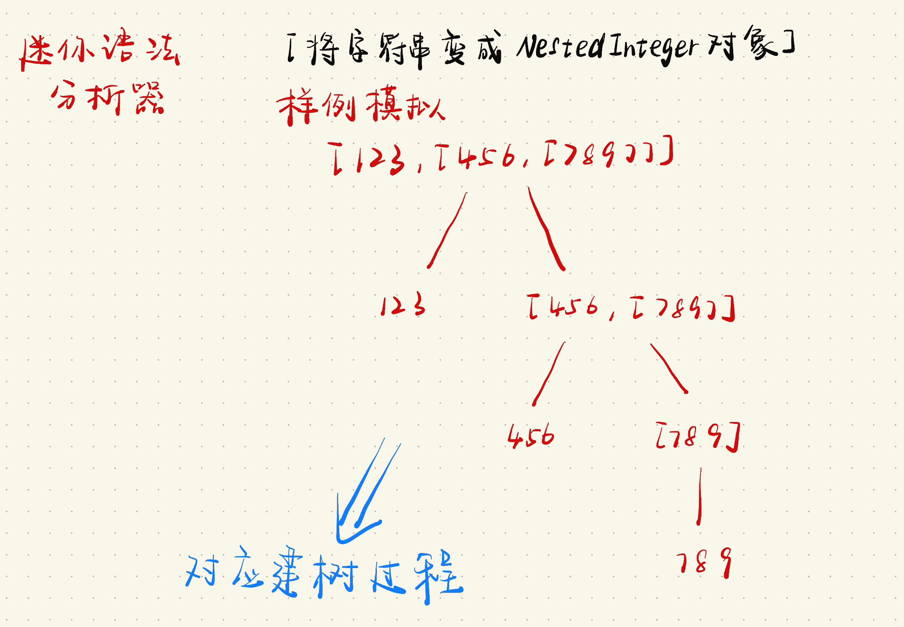

**代码**

```c++
/**
 * // This is the interface that allows for creating nested lists.
 * // You should not implement it, or speculate about its implementation
 * class NestedInteger {
 *   public:
 *     // Constructor initializes an empty nested list.
 *     NestedInteger();
 *
 *     // Constructor initializes a single integer.
 *     NestedInteger(int value);
 *
 *     // Return true if this NestedInteger holds a single integer, rather than a nested list.
 *     bool isInteger() const;
 *
 *     // Return the single integer that this NestedInteger holds, if it holds a single integer
 *     // The result is undefined if this NestedInteger holds a nested list
 *     int getInteger() const;
 *
 *     // Set this NestedInteger to hold a single integer.
 *     void setInteger(int value);
 *
 *     // Set this NestedInteger to hold a nested list and adds a nested integer to it.
 *     void add(const NestedInteger &ni);
 *
 *     // Return the nested list that this NestedInteger holds, if it holds a nested list
 *     // The result is undefined if this NestedInteger holds a single integer
 *     const vector<NestedInteger> &getList() const;
 * };
 */
class Solution {
public:
    NestedInteger dfs(string& s, int& u) {
        NestedInteger res;
        if (s[u] == '[') {
            u ++; // 跳过左括号
            while (s[u] != ']') res.add(dfs(s, u));
            u ++; // 跳过右括号
            if (u < s.size() && s[u] == ',') u ++; // 跳过逗号
        }
        else {
            int k = u;
            // 将数字部分找出来
            // 注意不能使用isdigit()，因为，数字可能是负数，有'-'
            while (k < s.size() && s[k] != ',' && s[k] != ']') k ++;
            // 将数字转化成int类型
            res.setInteger(stoi(s.substr(u, k - u)));
            // 跳过逗号
            if (k < s.size() && s[k] == ',') k ++;
            u = k;
        }
        return res;
    }
    NestedInteger deserialize(string s) {
        int u = 0;
        // 注意这里使用的是引用
        // 其原因是不需要回溯操作，沿着字符串一条路走到黑即可
        return dfs(s, u);
    }
};
```

**时间复杂度**

$O(n)$

**空间复杂度**

$O(n)$

**标签**

`深度优先搜索`

**缝合怪**

[LeetCode 341. 扁平化嵌套列表迭代器](#LeetCode 341. 扁平化嵌套列表迭代器)

#### [LeetCode 386. 字典序排数](https://leetcode-cn.com/problems/lexicographical-numbers/)

**题目描述**

>   给你一个整数 `n` ，按字典序返回范围 `[1, n]` 内所有整数。
>
>   你必须设计一个时间复杂度为 `O(n)` 且使用 `O(1)` 额外空间的算法。

**示例 1**

>   输入：`n = 13`
>   输出：`[1,10,11,12,13,2,3,4,5,6,7,8,9]`

**示例 2**

>   输入：`n = 2`
>   输出：`[1,2]`

**提示**

>   +   $1 <= n <= 5 * 10^4$

**手写稿**

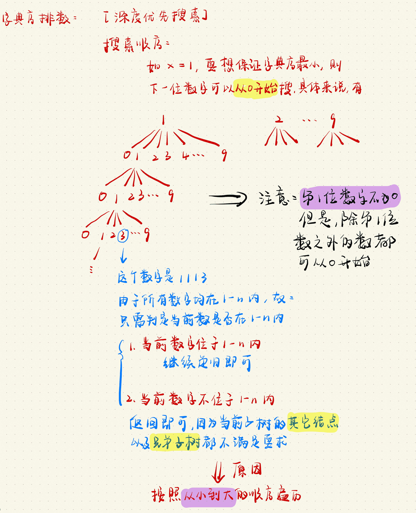

**代码**

```c++
class Solution {
public:
    vector<int> res;
    void dfs(int cur, int n) {
        // 如果当前的数字大于n，则直接返回
        if (cur > n) return;
        // 如果当前的数字小于等于n，说明符合条件，加入答案数组即可
        if (cur <= n) res.push_back(cur);
        // 枚举下一位数字，注意：除第一位数字之外的每一位上的数字可填的范围为[0, 9]
        for (int i = 0; i <= 9; i ++ ) dfs(cur * 10 + i, n);
        return;
    }
    vector<int> lexicalOrder(int n) {
        // 枚举第一位数字
        for (int i = 1; i <= 9; i ++ ) dfs(i, n);
        return res;
    }
};
```

**时间复杂度**

$递归复杂度不好分析$

**空间复杂度**

$O(n)$

**标签**

`深度优先搜索`

**缝合怪**

#### [LeetCode 388. 文件的最长绝对路径](https://leetcode-cn.com/problems/longest-absolute-file-path/)

**题目描述**

>   假设有一个同时存储文件和目录的文件系统。下图展示了文件系统的一个示例：
>
>   
>
>   这里将 `dir` 作为根目录中的唯一目录。`dir` 包含两个子目录 `subdir1` 和 `subdir2` 。`subdir1` 包含文件 `file1.ext` 和子目录 `subsubdir1`；`subdir2` 包含子目录 `subsubdir2`，该子目录下包含文件 `file2.ext` 。
>
>   在文本格式中，如下所示(⟶表示制表符)：
>
>   >   dir
>   >   ⟶ subdir1
>   >   ⟶ ⟶ file1.ext
>   >   ⟶ ⟶ subsubdir1
>   >   ⟶ subdir2
>   >   ⟶ ⟶ subsubdir2
>   >   ⟶ ⟶ ⟶ file2.ext
>
>
>   如果是代码表示，上面的文件系统可以写为 `"dir\n\tsubdir1\n\t\tfile1.ext\n\t\tsubsubdir1\n\tsubdir2\n\t\tsubsubdir2\n\t\t\tfile2.ext"` 。`'\n'` 和 `'\t'` 分别是换行符和制表符。
>
>   文件系统中的每个文件和文件夹都有一个唯一的 绝对路径 ，即必须打开才能到达文件/目录所在位置的目录顺序，所有路径用 `'/'` 连接。上面例子中，指向 `file2.ext` 的 绝对路径 是 `"dir/subdir2/subsubdir2/file2.ext"` 。每个目录名由字母、数字和/或空格组成，每个文件名遵循 `name.extension` 的格式，其中 `name` 和 `extension`由字母、数字和/或空格组成。
>
>   给定一个以上述格式表示文件系统的字符串 `input` ，返回文件系统中 指向 文件 的 最长绝对路径 的长度 。 如果系统中没有文件，返回 `0`。

**示例 1**

>   输入：`input = "dir\n\tsubdir1\n\tsubdir2\n\t\tfile.ext"`
>   输出：`20`
>   解释：只有一个文件，绝对路径为 `"dir/subdir2/file.ext"` ，路径长度 `20`

**示例 2**

>   输入：`input = "dir\n\tsubdir1\n\t\tfile1.ext\n\t\tsubsubdir1\n\tsubdir2\n\t\tsubsubdir2\n\t\t\tfile2.ext"`
>   输出：`32`
>   解释：存在两个文件：
>   `"dir/subdir1/file1.ext"` ，路径长度 `21`
>   `"dir/subdir2/subsubdir2/file2.ext"` ，路径长度 `32`
>   返回 `32` ，因为这是最长的路径

**示例 3**

>   输入：`input = "a"`
>   输出：`0`
>   解释：不存在任何文件

**示例 4**

>   输入：`input = "file1.txt\nfile2.txt\nlongfile.txt"`
>   输出：`12`
>   解释：根目录下有 `3` 个文件。
>   因为根目录中任何东西的绝对路径只是名称本身，所以答案是 `"longfile.txt"` ，路径长度为 `12`

**提示**

>   +   $1 <= input.length <= 10^4$
>   +   $input 可能包含小写或大写的英文字母，一个换行符 '\n'，一个制表符 '\t'，一个点 '.'，一个空格 ' '，和数字。$

**手写稿**

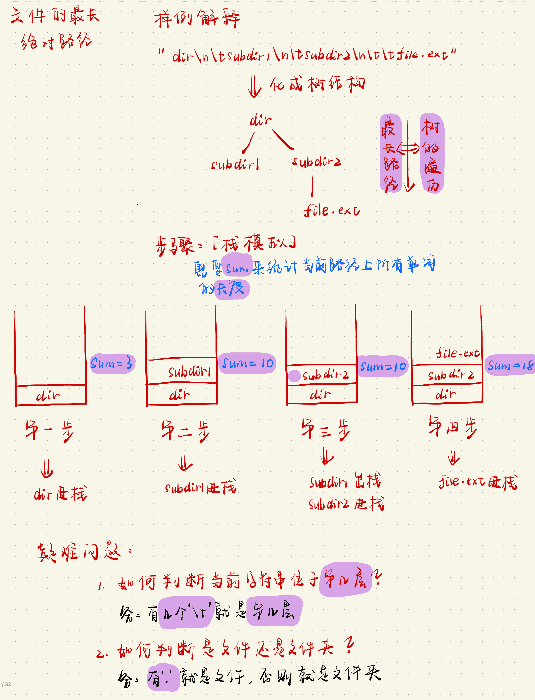

**代码**

```c++
class Solution {
public:
    int lengthLongestPath(string s) {
        int ans = 0;
        stack<string> stk;
        // 【sum始终记录【栈中】保存的单词的【长度】】
        for (int i = 0, sum = 0; i < s.size(); i ++ ) {
            int k = 0;
            // 判断下一个单词位于第几层
            while (i < s.size() && s[i] == '\t') k ++, i ++;
            // 判断当前处于第几层
            // 如果层数不对，需要进行回溯
            // 更新sum的值，注意sum值的含义
            while (stk.size() > k) sum -= stk.top().size(), stk.pop();
            // 找出当前的单词
            int j = i;
            while (j < s.size() && s[j] != '\n') j ++;
            // 将当前的单词扣出来
            string t = s.substr(i, j - i);
            // 将当前【单词的长度】压入栈中
            stk.push(t);
            // 更新sum的值
            sum += t.size();
            if (t.find('.') != -1) // 还需要加'/'，n个单词需要n - 1个/
                ans = max(ans, sum + (int)stk.size() - 1);
            i = j;
        }
        return ans;
    }
};
```

**时间复杂度**

$O(n)$

**空间复杂度**

$O(n)$

**标签**

`模拟`

**缝合怪**

#### [AcWing 92. 递归实现指数型枚举](https://www.acwing.com/problem/content/description/94/)

**题目描述**

>   从 `1 ∼ n` 这 `n` 个整数中随机选取任意多个，输出所有可能的选择方案。

**输入格式**

>   输入一个整数 `n`。

**输出格式**

>   每行输出一种方案。
>
>   同一行内的数必须升序排列，相邻两个数用恰好 `1` 个空格隔开。
>
>   对于没有选任何数的方案，输出空行。
>
>   本题有自定义校验器（`SPJ`），各行（不同方案）之间的顺序任意。

**数据范围**

>   +   $1≤n≤15$

**输入样例**

```c++
3
```

**输出样例**

```c++
3
2
2 3
1
1 3
1 2
1 2 3
```

**手写稿**

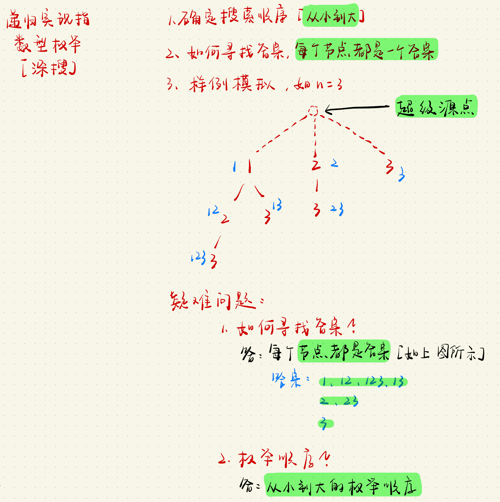

**代码**

```c++
#include <iostream>
#include <vector>
using namespace std;
int n;
vector<int> path;
void dfs(int u, vector<int>& path) {
    // 越界，则返回
    if (u > n) return;
    // 输出答案
    for (auto num : path) cout << num << " ";
    // 输出回车
    // 空行算答案
    cout << endl;
    for (int i = u; i <= n; i ++ ) {
        // 将下一个数字加入答案
        path.push_back(i + 1);
        // 深搜
        dfs(i + 1, path);
        // 外部枚举
        // 回溯现场
        path.pop_back();
    }
}
int main() {
    scanf("%d", &n);
    // 从0开始搜索，将0当作超级源点
    dfs(0, path);
    return 0;
}
```

**时间复杂度**

$O(不讲武德)$

**空间复杂度**

`O(n)`

**标签**

`DFS`、`深度优先搜索`

**缝合怪**

#### [AcWing 93. 递归实现组合型枚举](https://www.acwing.com/problem/content/description/95/)

**题目描述**

>   从 `1 ∼ n` 这 `n` 个整数中随机选出 `m` 个，输出所有可能的选择方案。

**输入格式**

>   两个整数 `n,m` ,在同一行用空格隔开。

**输出格式**

>   按照从小到大的顺序输出所有方案，每行 `1` 个。
>
>   首先，同一行内的数升序排列，相邻两个数用一个空格隔开。
>
>   其次，对于两个不同的行，对应下标的数一一比较，字典序较小的排在前面（例如 `1 3 5 7` 排在 `1 3 6 8` 前面）。

**数据范围**

>   +   $n > 0,$
>   +   $0 ≤ m ≤ n,$
>   +   $n + (n − m) ≤ 25$

**输入样例**

```c++
5 3
```

**输出样例**

```c++
1 2 3 
1 2 4 
1 2 5 
1 3 4 
1 3 5 
1 4 5 
2 3 4 
2 3 5 
2 4 5 
3 4 5 
```

**思考题**

>   如果要求使用非递归方法，该怎么做呢？

**手写稿**

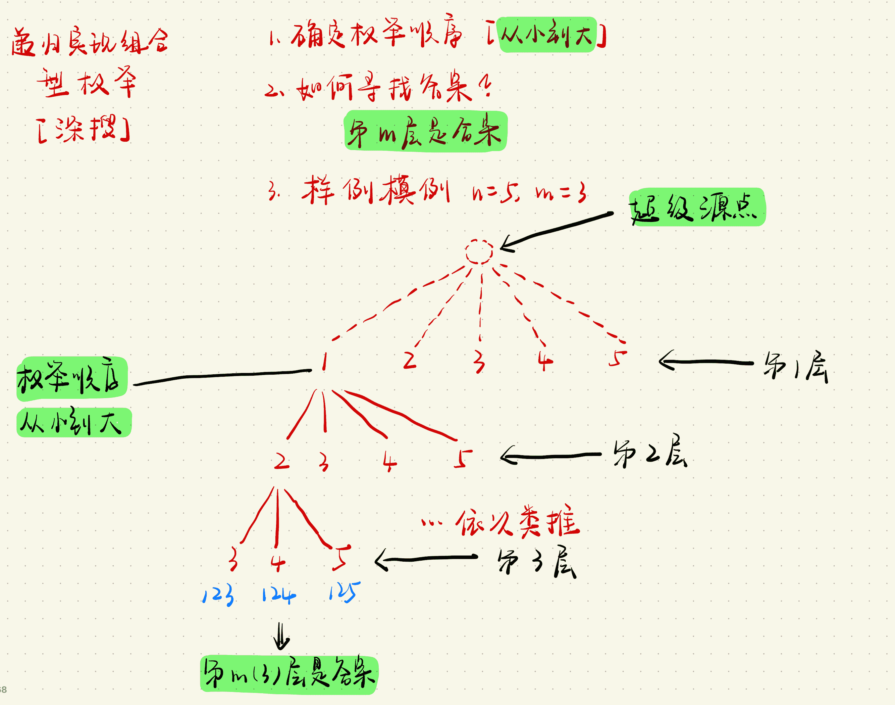

**代码**

```c++
#include <iostream>
#include <vector>
using namespace std;
int n, m;
vector<int> path;
/*
参数说明：
    当前枚举的数字
    当前处于第几层
    答案数组
*/
void dfs(int u, int k, vector<int>& path) {
    // 当前枚举的数字超出最大值，返回
    if (u > n) return;
    // 当前枚举的层数
    if (k > m) {
        for (int i = 0; i < path.size(); i ++ ) cout << path[i] << " ";
        cout << endl;
        return;
    }
    // 从u开始枚举
    for (int i = u; i <= n; i ++ ) {
        // 将数字插入答案
        path.push_back(i + 1);
        // 进入下一层
        dfs(i + 1, k + 1, path);
        // 外部搜索
        // 回溯
        path.pop_back();
    }
    return;
}
int main() {
    scanf("%d%d", &n, &m);
    dfs(0, 1, path);
    return 0;
}
```

**时间复杂度**

$O(不讲武德)$

**空间复杂度**

$O(n)$

**标签**

`DFS`

**缝合怪**

#### [AcWing 94. 递归实现排列型枚举](https://www.acwing.com/problem/content/description/96/)

**题目描述**

>   把 `1 ∼ n` 这 `n` 个整数排成一行后随机打乱顺序，输出所有可能的次序。

**输入格式**

>   一个整数 `n`。

**输出格式**

>   按照从小到大的顺序输出所有方案，每行 `1` 个。
>
>   首先，同一行相邻两个数用一个空格隔开。
>
>   其次，对于两个不同的行，对应下标的数一一比较，字典序较小的排在前面。

**数据范围**

>   +   $1 ≤ n ≤ 9$

**输入样例**

```c++
3
```

**输出样例**

```c++
1 2 3
1 3 2
2 1 3
2 3 1
3 1 2
3 2 1
```

**手写稿**

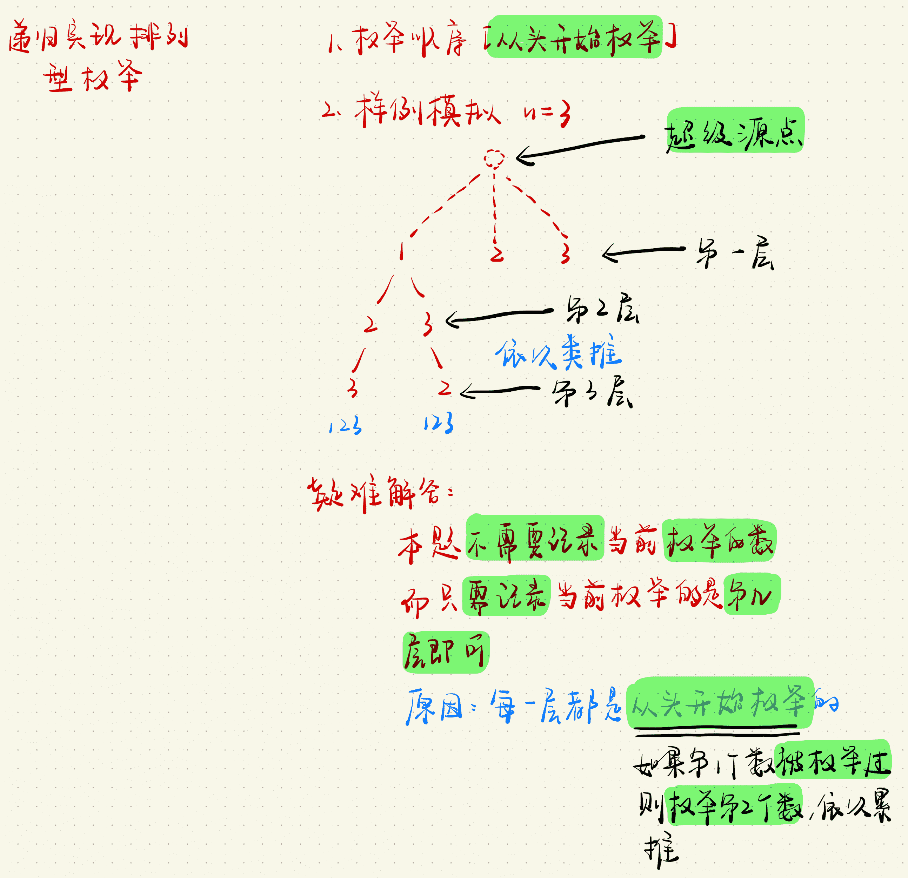

**代码**

```c++
#include <iostream>
#include <vector>
using namespace std;
const int N = 15;
int n;
int st[N];
vector<int> path;
/*
参数说明：
    当前枚举的是第几层
    答案数组
*/
void dfs(int u, vector<int>& path) {
    // 如果当前枚举到第 n + 1 层，则输出答案
    if (u > n) {
        for (int i = 0; i < n; i ++ ) cout << path[i] << " ";
        cout << endl;
        return;
    }
    for (int i = 1; i <= n; i ++ )
        // 如果当前数没有被遍历过，则遍历当前数
        if (!st[i]) {
            st[i] = true;
            path.push_back(i);
            // 递归下一层
            dfs(u + 1, path);
            // 回溯
            path.pop_back();
            st[i] = false;
        }
    return;
}
int main() {
    scanf("%d", &n);
    dfs(1, path);
    return 0;
}
```

**时间复杂度**

$O(不讲武德)$

**空间复杂度**

$O(n)$

**标签**

`DFS`

**缝合怪**

#### [LeetCode 4. 寻找两个正序数组的中位数](https://leetcode-cn.com/problems/median-of-two-sorted-arrays/)

**题目描述**

>   给定两个大小分别为 `m` 和 `n` 的正序（从小到大）数组 `nums1` 和 `nums2`。请你找出并返回这两个正序数组的 中位数 。
>
>   算法的时间复杂度应该为 `O(log (m + n))` 。

**示例 1**

>   输入：`nums1 = [1,3], nums2 = [2]`
>   输出：`2.00000`
>   解释：合并数组 = `[1,2,3]` ，中位数 `2`

**示例 2**

>   输入：`nums1 = [1,2], nums2 = [3,4]`
>   输出：`2.50000`
>   解释：合并数组 = `[1,2,3,4]` ，中位数 `(2 + 3) / 2 = 2.5`

**提示**

>   +   $nums1.length == m$
>   +   $nums2.length == n$
>   +   $0 <= m <= 1000$
>   +   $0 <= n <= 1000$
>   +   $1 <= m + n <= 2000$
>   +   $-10^6 <= nums1[i], nums2[i] <= 10^6$

**手写稿**

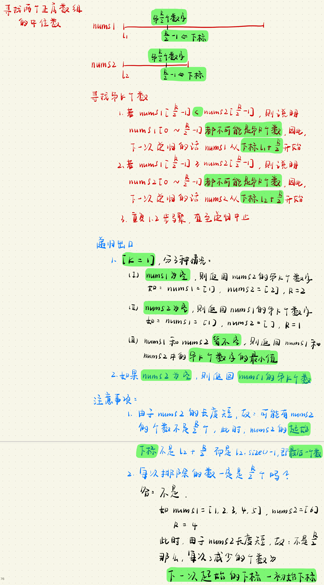

**代码**

```c++
class Solution {
public:
    // 保证nums1的长度大于等于nums2的长度
    int dfs(vector<int>& nums1, int l1, vector<int>& nums2, int l2, int k) {
        // 如果nums1的长度小于nums2的长度，则交换两个数组
        if (nums1.size() < nums2.size()) return dfs(nums2, l2, nums1, l1, k);
        // 如果寻找的是第一个数
        if (k == 1) {
            // 如果nums1为空，返回nums2的第k个数字
            if (l1 == nums1.size()) return nums2[l2 + k - 1];
            // 如果nums2为空，返回nums1的第k个数字
            else if (l2 == nums2.size()) return nums1[l1 + k - 1];
            // 如果nums1和nums2都不空，返回两者的最小值
            return min(nums1[l1 + k - 1], nums2[l2 + k - 1]);
        }
        // 如果nums2的长度已经到达末尾，返回nums1的第k个数字
        if (l2 == nums2.size()) return nums1[l1 + k - 1];
        // nums1的第k / 2个数字
        int t1 = l1 + k / 2 - 1;
        // nums2的第k / 2个数字
        int t2 = l2 + k / 2 - 1;
        // 因为nums2数组长度短，因此，如果nums2的长度可能不够k / 2个
        // 那么，nums2的起始位置为nums2.size() - 1，即起始位置为最后一个数字
        if (t2 >= nums2.size()) t2 = nums2.size() - 1;
        if (nums1[t1] < nums2[t2])
            // 每次排除的数字不一定为k / 2个
            // 每次排除的数字为下一次起始位置 - 初始位置
            return dfs(nums1, t1 + 1, nums2, l2, k - (t1 - l1 + 1));
        return dfs(nums1, l1, nums2, t2 + 1, k - (t2 - l2 + 1));
    }
    double findMedianSortedArrays(vector<int>& nums1, vector<int>& nums2) {
        int n = nums1.size() + nums2.size();
        if (n & 1) return dfs(nums1, 0, nums2, 0, n / 2 + 1);
        return (dfs(nums1, 0, nums2, 0, n / 2) + dfs(nums1, 0, nums2, 0, n / 2 + 1)) / 2.0;
    }
};
```

**时间复杂度**

$O(不讲武德)$

**空间复杂度**

$O(n)$

**标签**

`DFS`、`深度优先搜索`

**缝合怪**


#### [LeetCode 394. 字符串解码](https://leetcode-cn.com/problems/decode-string/)

**题目描述**

>   给定一个经过编码的字符串，返回它解码后的字符串。
>
>   编码规则为: `k[encoded_string]`，表示其中方括号内部的 `encoded_string` 正好重复 `k` 次。注意 `k` 保证为正整数。
>
>   你可以认为输入字符串总是有效的；输入字符串中没有额外的空格，且输入的方括号总是符合格式要求的。
>
>   此外，你可以认为原始数据不包含数字，所有的数字只表示重复的次数 `k` ，例如不会出现像 `3a` 或 `2[4]` 的输入。

**示例 1**

>   输入：`s = "3[a]2[bc]"`
>   输出：`"aaabcbc"`

**示例 2**

>   输入：`s = "3[a2[c]]"`
>   输出：`"accaccacc"`

**示例 3**

>   输入：`s = "2[abc]3[cd]ef"`
>   输出：`"abcabccdcdcdef"`

**示例 4**

>   输入：`s = "abc3[cd]xyz"`
>   输出：`"abccdcdcdxyz"`

**提示**

>   +   $1 <= s.length <= 30$
>   +   $s 由小写英文字母、数字和方括号 '[]' 组成$
>   +   $s 保证是一个 有效 的输入。$
>   +   $s 中所有整数的取值范围为 [1, 300]$

**手写稿**


**代码一: 栈**

```c++
class Solution {
public:
    string decodeString(string s) {
        stack<int> num;
        stack<string> str;
        int multi = 0;
        string res = "";
        for (int i = 0; i < s.size(); i ++ ) {
            if (s[i] >= 'a' && s[i] <= 'z' || s[i] >= 'A' && s[i] <= 'Z') res += s[i];
            else if (s[i] >= '0' && s[i] <= '9') multi = multi * 10 + s[i] - '0';
            else if (s[i] == '[') {
                num.push(multi);
                multi = 0;
                str.push(res);
                res = "";
            }
            else {
                // 取出倍数
                multi = num.top(); num.pop();
                while (multi -- ) str.top() += res;
                // 注意: 此时的multi的值为-1, 需要将其重置为0, 或者直接使用另一个变量k即可
                multi = 0;
                res = str.top();
                str.pop();
            }
        }
        return res;
    }
};
```

**时间复杂度**

$O(nm), n是字符串的长度, m是重复的数量的最大值$

**空间复杂度**

$O(n)$

**标签**

`栈`

**代码二: 递归**

```c++
class Solution {
public:
    string dfs(string &s, int &u) {
        string res = "";
        int multi = 0;
        while (u < s.size()) {
            if (s[u] >= 'a' && s[u] <= 'z' || s[u] >= 'A' && s[u] <= 'Z')
                res += s[u ++ ];
            else if (s[u] >= '0' && s[u] <= '9') multi = multi * 10 + s[u ++ ] - '0';
            else if (s[u] == '[') {
                // 记录上一层的字符串
                string tmp = dfs(s, ++ u);
                // 倍增multi次
                while (multi -- ) res += tmp;
                // 注意: 此时的multi的值为-1
                // 重置multi为0, 开始记录当前层的下一个字符串倍增的次数
                multi = 0;
            }
            else {
                // 跳过']'
                u ++;
                // 返回res
                return res;
            }
        }
        return res;
    }
    string decodeString(string s) {
        int u = 0;
        return dfs(s, u);
    }
};
```

**时间复杂度**

$O(nm), n是字符串的长度, m是重复的数量的最大值$

**空间复杂度**

$O(n)$

**标签**

`DFS`、`深度优先搜索`

**缝合怪**


### DFS之连通性模型

#### [AcWing 1112. 迷宫](https://www.acwing.com/problem/content/1114/)

**题目描述**

>   一天 `Extense` 在森林里探险的时候不小心走入了一个迷宫，迷宫可以看成是由 `n ∗ n` 的格点组成，每个格点只有 `2` 种状态，`.`和`#`，前者表示可以通行后者表示不能通行。
>
>   同时当 `Extense` 处在某个格点时，他只能移动到东南西北(或者说上下左右)四个方向之一的相邻格点上， `Extense` 想要从点 `A` 走到点 `B`，问在不走出迷宫的情况下能不能办到。
>
>   如果起点或者终点有一个不能通行(为 `#` )，则看成无法办到。
>
>   **注意**：`A`、`B`不一定是两个不同的点。

**输入格式**

>   第 `1` 行是测试数据的组数 `k`，后面跟着 `k` 组输入。
>
>   每组测试数据的第 `1` 行是一个正整数 `n`，表示迷宫的规模是 `n ∗ n` 的。
>
>   接下来是一个 `n ∗ n` 的矩阵，矩阵中的元素为`.`或者`#`。
>
>   再接下来一行是 `4` 个整数 $h_a,l_a,h_b,l_b$，描述 `A` 处在第 $h_a$ 行, 第 $l_a$ 列，`B` 处在第 $h_b$ 行, 第 $l_b$ 列。
>
>   注意到 $h_a,l_a,h_b,l_b$ 全部是从 `0` 开始计数的。

**输出格式**

>   `k`行，每行输出对应一个输入。
>
>   能办到则输出“`YES`”，否则输出“`NO`”。

**数据范围**

>   +   $1≤n≤100$

**输入样例**

```c++
2
3
.##
..#
#..
0 0 2 2
5
.....
###.#
..#..
###..
...#.
0 0 4 0
```

**输出样例**

```c++
YES
NO
```

**手写稿**

>   1.   从起点开始搜索，遍历四个方向即可

**代码**

```c++
#include <iostream>
#include <cstring>
using namespace std;
const int N = 110;
int n, x1, y1, x2, y2, T;
int dx[4] = {-1, 0, 1, 0};
int dy[4] = {0, 1, 0, -1};
char g[N][N];
bool st[N][N];
bool dfs(int x, int y) {
    // 如果g[x][y]不能走，返回false
    if (g[x][y] == '#') return false;
    // 如果到达终点，说明存在一条合法路径，返回true
    if (x == x2 && y == y2) return true;
    st[x][y] = true;
    // 遍历四个方向
    for (int i = 0; i < 4; i ++ ) {
        int tx = x + dx[i];
        int ty = y + dy[i];
        if (tx < 0 || tx >= n || ty < 0 || ty >= n || st[tx][ty] || g[tx][ty] == '#')
            continue;
        // 如果从(tx, ty)能搜到答案，返回true
        if (dfs(tx, ty)) return true;
    }
    return false;
}
int main() {
    scanf("%d", &T);
    while (T -- ) {
        scanf("%d", &n);
        for (int i = 0; i < n; i ++ ) scanf("%s", g[i]);
        scanf("%d%d%d%d", &x1, &y1, &x2, &y2);
        // 多组测试数据
        // 记得每次务必要初始化
        memset(st, 0, sizeof st);
        if (dfs(x1, y1)) puts("YES");
        else puts("NO");
    }
    return 0;
}
```

**时间复杂度**


**空间复杂度**


**标签**

`DFS`、`深度优先搜索`

**缝合怪**

#### [AcWing 1113. 红与黑](https://www.acwing.com/problem/content/1115/)

**题目描述**

>   有一间长方形的房子，地上铺了红色、黑色两种颜色的正方形瓷砖。
>
>   你站在其中一块黑色的瓷砖上，只能向相邻（上下左右四个方向）的黑色瓷砖移动。
>
>   请写一个程序，计算你总共能够到达多少块黑色的瓷砖。

**输入格式**

>   输入包括多个数据集合。
>
>   每个数据集合的第一行是两个整数 `W` 和 `H`，分别表示 `x` 方向和 `y` 方向瓷砖的数量。
>
>   在接下来的 `H` 行中，每行包括 `W` 个字符。每个字符表示一块瓷砖的颜色，规则如下
>
>   1）‘`.`’：黑色的瓷砖；
>   2）‘`#`’：红色的瓷砖；
>   3）‘`@`’：黑色的瓷砖，并且你站在这块瓷砖上。该字符在每个数据集合中唯一出现一次。
>
>   当在一行中读入的是两个零时，表示输入结束。

**输出格式**

>   对每个数据集合，分别输出一行，显示你从初始位置出发能到达的瓷砖数(记数时包括初始位置的瓷砖)。

**数据范围**

>   +   $1≤W,H≤20$

**输入样例**

```c++
6 9 
....#. 
.....# 
...... 
...... 
...... 
...... 
...... 
#@...# 
.#..#. 
0 0
```

**输出样例**

```c++
45
```

**手写稿**

>   1.   找到人所站的位置，做一遍 `Flood Fill` 算法即可
>   2.   注意 `dfs` 函数所代表的含义

**代码**

```c++
#include <iostream>
#include <cstring>
using namespace std;
const int N = 25;
int n, m;
int dx[4] = {-1, 0, 1, 0};
int dy[4] = {0, 1, 0, -1};
bool st[N][N];
char g[N][N];
// dfs表示的含义是从当前点(x, y)出发，能到达的瓷砖的数目
int dfs(int x, int y) {
    // 刚开始这个数被选上
    int cnt = 1;
    // 标记下，目的是使得每个数字只会被遍历一次
    st[x][y] = true;
    // 遍历四个方向
    for (int i = 0; i < 4; i ++ ) {
        int tx = x + dx[i];
        int ty = y + dy[i];
        if (tx < 0 || tx >= n || ty < 0 || ty >= m || st[tx][ty] || g[tx][ty] == '#')
            continue;
        cnt += dfs(tx, ty);
    }
    return cnt;
}
int main() {
    while (~scanf("%d%d", &m, &n), n || m) {
        for (int i = 0; i < n; i ++ ) scanf("%s", g[i]);
        int x, y;
        for (int i = 0; i < n; i ++ )
            for (int j = 0; j < m; j ++ )
                if (g[i][j] == '@') {
                    x = i;
                    y = j;
                    break;
                }
        // 多组测试数据
        // 每次都需要初始化
        memset(st, 0, sizeof st);
        cout << dfs(x, y) << endl;
    }
    return 0;
}
```

**时间复杂度**


**空间复杂度**


**标签**

`DFS`、`Flood Fill`

**缝合怪**


### DFS之搜索顺序

#### [AcWing 1116. 马走日](https://www.acwing.com/problem/content/1118/)

**题目描述**

>   马在中国象棋以日字形规则移动。
>
>   请编写一段程序，给定 `n ∗ m` 大小的棋盘，以及马的初始位置 `(x，y)`，要求不能重复经过棋盘上的同一个点，计算马可以有多少途径遍历棋盘上的所有点。

**输入格式**

>   第一行为整数 `T`，表示测试数据组数。
>
>   每一组测试数据包含一行，为四个整数，分别为棋盘的大小以及初始位置坐标 `n,m,x,y`。

**输出格式**

>   每组测试数据包含一行，为一个整数，表示马能遍历棋盘的途径总数，若无法遍历棋盘上的所有点则输出 `0`。

**数据范围**

>   +   $1≤T≤9,$
>   +   $1≤m,n≤9,$
>   +   $0≤x≤n−1,$
>   +   $0≤y≤m−1$

**输入样例**

```c++
1
5 4 0 0
```

**输出样例**

```c++
32
```

**手写稿**

>   1.   遍历 `8` 个方向即可

**代码**

```c++
#include <iostream>
using namespace std;
const int N = 15;
int n, m, ans, T;
int st[N][N];
int dx[8] = {-2, -2, -1, 1, 2, 2, 1, -1};
int dy[8] = {-1, 1, 2, 2, 1, -1, -2, -2};
void dfs(int x, int y, int cnt) {
    // 如果已经遍历了n * m个格子
    if (cnt == n * m) {
        ans ++;
        return;
    }
    st[x][y] = true;
    // 遍历8个方向
    for (int i = 0; i < 8; i ++ ) {
        int tx = x + dx[i];
        int ty = y + dy[i];
        if (tx < 0 || tx >= n || ty < 0 || ty >= m || st[tx][ty])
            continue;
        dfs(tx, ty, cnt + 1);
    }
    st[x][y] = false;
    return;
}
int main() {
    scanf("%d", &T);
    while (T -- ) {
        int x, y;
        scanf("%d%d%d%d", &n, &m, &x, &y);
        ans = 0;
        dfs(x, y, 1);
        cout << ans << endl;
    }
    return 0;
}
```

**时间复杂度**


**空间复杂度**


**标签**

`DFS`

**缝合怪**

#### [AcWing 1117. 单词接龙](https://www.acwing.com/problem/content/1119/)

**题目描述**

>   单词接龙是一个与我们经常玩的成语接龙相类似的游戏。
>
>   现在我们已知一组单词，且给定一个开头的字母，要求出以这个字母开头的最长的“龙”，每个单词最多被使用两次。
>
>   在两个单词相连时，其重合部分合为一部分，例如 `beast` 和 `astonish` ，如果接成一条龙则变为 `beastonish`。
>
>   我们可以任意选择重合部分的长度，但其长度必须大于等于`1`，且严格小于两个串的长度，例如 `at` 和 `atide` 间不能相连。

**输入格式**

>   输入的第一行为一个单独的整数 `n` 表示单词数，以下 `n` 行每行有一个单词（只含有大写或小写字母，长度不超过`20`），输入的最后一行为一个单个字符，表示“龙”开头的字母。
>
>   你可以假定以此字母开头的“龙”一定存在。

**输出格式**

>   只需输出以此字母开头的最长的“龙”的长度。

**数据范围**

>   +   $n≤20$

**输入样例**

```c++
5
at
touch
cheat
choose
tact
a
```

**输出样例**

```c++
23
```

**提示**

>   连成的“龙”为 `atoucheatactactouchoose`。

**手写稿**

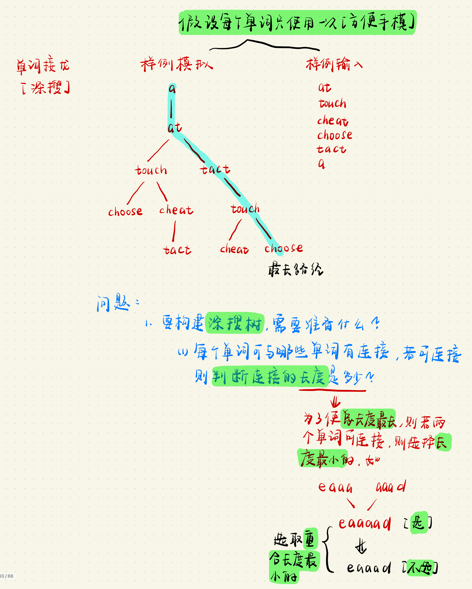

**代码**

```c++
#include <iostream>
using namespace std;
const int N = 25;
int n, ans;
char start;
int g[N][N], used[N];
string word[N];
void dfs(string wd, int last) {
    // 更新答案
    ans = max(ans, (int)wd.size());
    // 标记为当前单词已经被使用一次
    used[last] ++;
    for (int i = 0; i < n; i ++ )
        // 如果上一个单词与当前单词有连接并且当前单词被使用的次数严格小于2
        if (g[last][i] && used[i] < 2)
            // 拼接就完事了
            dfs(wd + word[i].substr(g[last][i]), i);
    // 回溯
    used[last] --;
    return;
}
int main() {
    scanf("%d", &n);
    for (int i = 0; i < n; i ++ ) cin >> word[i];
    scanf(" %c", &start);
    // 预处理每个单词可与哪些单词相连接
    for (int i = 0; i < n; i ++ )
        for (int j = 0; j < n; j ++ ) {
            string a = word[i], b = word[j];
            // 若可以连接，则选择连接最短的长度
            for (int k = 1; k < min(a.size(), b.size()); k ++ )
                if (a.substr(a.size() - k) == b.substr(0, k)) {
                    g[i][j] = k;
                    break;
                }
        }
    for (int i = 0; i < n; i ++ )
        // 确定搜索起点
        if (word[i][0] == start)
            dfs(word[i], i);
    cout << ans << endl;
    return 0;
}
```

**时间复杂度**

$O(不讲武德)$

**空间复杂度**

$O(n^2)$

**标签**

`DFS`、`深度优先搜索`

**缝合怪**

#### [AcWing 1118. 分成互质组](https://www.acwing.com/problem/content/1120/)

**题目描述**

>   给定 `n` 个正整数，将它们分组，使得每组中任意两个数互质。
>
>   至少要分成多少个组？

**输入格式**

>   第一行是一个正整数 `n`。
>
>   第二行是 `n` 个不大于 `10000` 的正整数。

**输出格式**

>   一个正整数，即最少需要的组数。

**数据范围**

>   +   $1≤n≤10$

**输入样例**

```c++
6
14 20 33 117 143 175
```

**输出样例**

```c++
3
```

**手写稿**

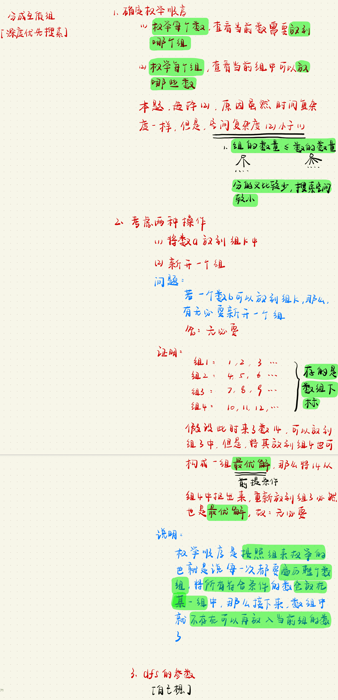

**代码**

```c++
#include <iostream>
using namespace std;
const int N = 15;
int n, ans = N;
int p[N];
bool st[N];
int group[N][N];
int gcd(int a, int b) {
    if (!b) return a;
    return gcd(b, a % b);
}
bool check(int g[], int gc, int k) {
    for (int i = 0; i < gc; i ++ )
        if (gcd(p[g[i]], p[k]) > 1) return false;
    return true;
}
/*
参数解释：
    【当前组】的编号
    【当前组】的个数
    【当前组】最后一个数对应原数组的下标位置
    【所有组】一共枚举的数字个数
*/
// 注意每个变量的含义！！
void dfs(int u, int gc, int gi, int cnt) {
    // 当前已经搜索到的最优解为ans
    // 如果另一条路径搜索到的解大于最优解，说明一定不是最优解，则直接返回
    if (u >= ans) return;
    // 当前已经枚举完【所有的数字】
    if (cnt == n) {
        // 更新答案
        ans = u;
        return;
    }
    int flag = true;
    // 枚举所有数字
    for (int i = gi; i < n; i ++ )
        // 如果当前的数字没有被访问过并且当前数字可以放到当前的组中
        if (!st[i] && check(group[u], gc, i)) {
            // 标记已经被访问过
            st[i] = true;
            // 将当前数放到当前组
            group[u][gc] = i;
            // 递归下一层
            dfs(u, gc + 1, i + 1, cnt + 1);
            // 外部搜索
            // 回溯
            flag = false;
            st[i] = false;
        }
    // 如果当前数不能放置到当前组
    // 新开一个组即可
    if (flag) dfs(u + 1, 0, 0, cnt);
    return;
}
int main() {
    scanf("%d", &n);
    for (int i = 0; i < n; i ++ ) scanf("%d", &p[i]);
    /*
    参数解释：
        【当前组】的编号
        【当前组】的个数
        【当前组】最后一个数对应原数组的下标位置
        【所有组】一共枚举的数字个数
    */
    dfs(1, 0, 0, 0);
    cout << ans << endl;
    return 0;
}
```

**时间复杂度**

$O(不讲武德)$

**空间复杂度**

$O(n^2)$

**标签**

`BFS`

**缝合怪**

### `DFS` 之剪枝与优化

#### 剪枝概论

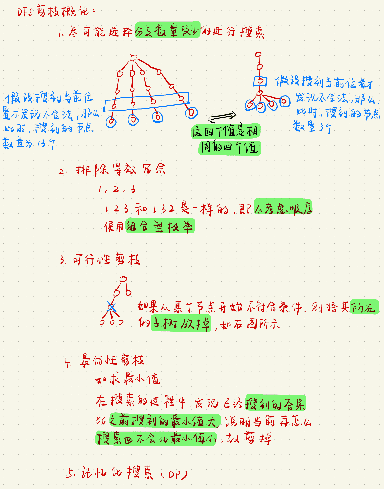

#### [AcWing 165. 小猫爬山](https://www.acwing.com/problem/content/167/)

**题目描述**

>   翰翰和达达饲养了 `N` 只小猫，这天，小猫们要去爬山。
>
>   经历了千辛万苦，小猫们终于爬上了山顶，但是疲倦的它们再也不想徒步走下山了（呜咕>_<）。
>
>   翰翰和达达只好花钱让它们坐索道下山。
>
>   索道上的缆车最大承重量为 `W`，而 `N` 只小猫的重量分别是 $C_1、C_2……C_N$。
>
>   当然，每辆缆车上的小猫的重量之和不能超过 `W`。
>
>   每租用一辆缆车，翰翰和达达就要付 `1` 美元，所以他们想知道，最少需要付多少美元才能把这 `N` 只小猫都运送下山？

**输入格式**

>   第 `1` 行：包含两个用空格隔开的整数，`N` 和 `W`。
>
>   第 `2..N + 1` 行：每行一个整数，其中第 `i + 1` 行的整数表示第 `i` 只小猫的重量 $C_i$。

**输出格式**

>   输出一个整数，表示最少需要多少美元，也就是最少需要多少辆缆车。

**数据范围**

>   +   $1 ≤ N ≤ 18,$
>   +   $1 ≤ C_i ≤ W ≤ 10^8$

**输入样例**

```c++
5 1996
1
2
1994
12
29
```

**输出样例**

```c++
2
```

**手写稿**

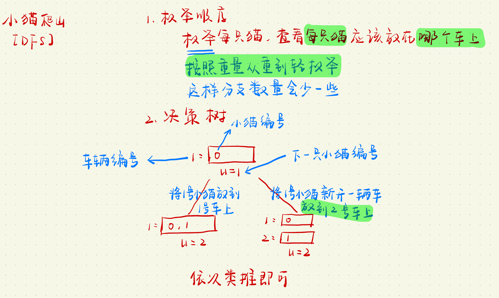

**代码**

```c++
#include <iostream>
#include <algorithm>
using namespace std;
const int N = 20;
int n, m, ans = N;
int w[N], sum[N];
void dfs(int u, int car) {
    // 最优性剪枝
    if (car >= ans) return;
    // 如果将全部小猫都枚举结束
    if (u == n) {
        ans = car;
        return;
    }
    // 枚举每辆车
    for (int i = 0; i < car; i ++ )
        if (sum[i] + w[u] <= m) {
            sum[i] += w[u];
            dfs(u + 1, car);
            sum[i] -= w[u];
        }
    // 新开一辆车
    sum[car] = w[u];
    // 注意：车的数量 + 1【新开一辆车】
    dfs(u + 1, car + 1);
    sum[car] = 0;
    return;
}
int main() {
    scanf("%d%d", &n, &m);
    for (int i = 0; i < n; i ++ ) scanf("%d", &w[i]);
    // 按照体重从重到轻排序
    sort(w, w + n, [&](int a, int b) {
        return a > b;
    });
    // 从第0只小猫开始枚举
    // 当前车的数量为0
    dfs(0, 0);
    cout << ans << endl;
    return 0;
}
```

**时间复杂度**

$O(不讲武德)$

**空间复杂度**

$O(n)$

**标签**

`DFS`、`剪枝`

**缝合怪**

#### [AcWing 166. 数独](https://www.acwing.com/problem/content/168/)

**题目描述**

>   数独是一种传统益智游戏，你需要把一个 `9 × 9` 的数独补充完整，使得图中每行、每列、每个 `3 × 3` 的九宫格内数字 `1 ∼ 9` 均恰好出现一次。
>
>   请编写一个程序填写数独。

**输入格式**

>   输入包含多组测试用例。
>
>   每个测试用例占一行，包含 `81` 个字符，代表数独的 `81` 个格内数据（顺序总体由上到下，同行由左到右）。
>
>   每个字符都是一个数字（`1 − 9`）或一个 `.`（表示尚未填充）。
>
>   您可以假设输入中的每个谜题都只有一个解决方案。
>
>   文件结尾处为包含单词 `end` 的单行，表示输入结束。

**输出格式**

>   每个测试用例，输出一行数据，代表填充完全后的数独。

**输入样例**

```c++
4.....8.5.3..........7......2.....6.....8.4......1.......6.3.7.5..2.....1.4......
......52..8.4......3...9...5.1...6..2..7........3.....6...1..........7.4.......3.
end
```

**输出样例**

```c++
417369825632158947958724316825437169791586432346912758289643571573291684164875293
416837529982465371735129468571298643293746185864351297647913852359682714128574936
```

**手写稿**

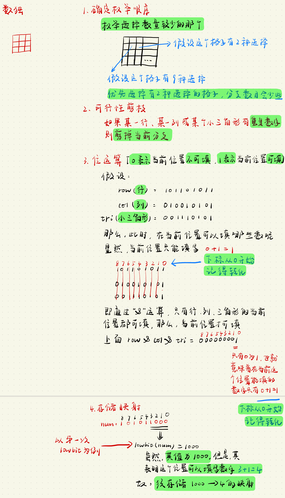

**代码**

```c++
#include <iostream>
using namespace std;
const int N = 9, M = 100;
char g[M];
int row[N], col[N], ones[1 << N], map[1 << N];
int tri[3][3];
// 初始化
void init() {
    for (int i = 0; i < N; i ++ )
        row[i] = col[i] = (1 << N) - 1;
    for (int i = 0; i < 3; i ++ )
        for (int j = 0; j < 3; j ++ )
            tri[i][j] = (1 << N) - 1;
    return;
}
void draw(int x, int y, int t, bool is_set) {
    if (is_set) g[x * N + y] = t + '1';
    else g[x * N + y] = '.';
    int v = 1 << t;
    // 将v取反
    if (!is_set) v = -v;
    // 将v抠掉
    row[x] -= v;
    col[y] -= v;
    tri[x / 3][y / 3] -= v;
    return;
}
int get(int x, int y) {
    return row[x] & col[y] & tri[x / 3][y / 3];
}
int lowbit(int x) {
    return x & -x;
}
bool dfs(int cnt) {
    if (!cnt) return true;
    int x, y, Max = 15;
    for (int i = 0; i < N; i ++ )
        for (int j = 0; j < N; j ++ )
            if (g[i * N + j] == '.') {
                int state = get(i, j);
                // 寻找填写选择最少的
                // 产生的分支较少
                if (ones[state] < Max) {
                    x = i;
                    y = j;
                    Max = ones[state];
                }
            }
    int state = get(x, y);
    for (int i = state; i; i -= lowbit(i)) {
        int t = map[lowbit(i)];
        draw(x, y, t, true);
        if (dfs(cnt - 1)) return true;
        draw(x, y, t, false);
    }
    return false;
}
int main() {
    // 存储映射【手写稿说明】
    for (int i = 0; i < N; i ++ ) map[1 << i] = i;
    // 统计每个数中存在的1个数
    for (int i = 0; i < 1 << N; i ++ )
        for (int j = 0; j < N; j ++ )
            ones[i] += i >> j & 1;
    while (~scanf("%s", g), g[0] != 'e') {
        // 初始化
        init();
        // 统计可以填写的数目
        int cnt = 0;
        for (int i = 0; i < N; i ++ )
            for (int j = 0; j < N; j ++ ) {
                char c = g[i * N + j];
                // 如果已经填写数字
                if (c != '.') {
                    int t = c - '1';
                    // 将此点标记为已经填写过
                    draw(i, j, t, true);
                }
                // 可以填写的数目 ++
                else cnt ++;
            }
        dfs(cnt);
        puts(g);
    }
    return 0;
}
```

**时间复杂度**

$O(不讲武德)$

**空间复杂度**

$O(1 << N)$

**标签**

`DFS`、`剪枝`

**缝合怪**

#### [AcWing 167. 木棒](https://www.acwing.com/problem/content/169/)

**题目描述**

>   乔治拿来一组等长的木棒，将它们随机地砍断，使得每一节木棍的长度都不超过 `50` 个长度单位。
>
>   然后他又想把这些木棍恢复到为裁截前的状态，但忘记了初始时有多少木棒以及木棒的初始长度。
>
>   请你设计一个程序，帮助乔治计算木棒的可能最小长度。
>
>   每一节木棍的长度都用大于零的整数表示。

**输入格式**

>   输入包含多组数据，每组数据包括两行。
>
>   第一行是一个不超过 `64` 的整数，表示砍断之后共有多少节木棍。
>
>   第二行是截断以后，所得到的各节木棍的长度。
>
>   在最后一组数据之后，是一个零。

**输出格式**

>   为每组数据，分别输出原始木棒的可能最小长度，每组数据占一行。

**数据范围**

>   +   $数据保证每一节木棍的长度均不大于 50。$

**输入样例**

```c++
9
5 2 1 5 2 1 5 2 1
4
1 2 3 4
0
```

**输出样例**

```c++
6
5
```

**手写稿**


**代码**

```c++
#include <iostream>
#include <algorithm>
#include <cstring>
using namespace std;
const int N = 70;
int n, sum, length;
int g[N], st[N];
/*
    参数说明：
        大棍的编号
        组成大棍的小棍长度和
        小棍的起始位置
*/
bool dfs(int u, int cur, int start) {
    // 如果所有大棍的长度和等于sum，说明找到一组答案，直接返回
    if (u * length == sum) return true;
    // 如果当前大棍已经被组装完毕，则开始组装下一根大棍
    if (cur == length) return dfs(u + 1, 0, 0);
    // 剪枝 2.I (2)
    // 组合型枚举
    for (int i = start; i < n; i ++ ) {
        if (!st[i] && cur + g[i] <= length) {
            st[i] = true;
            if (dfs(u, cur + g[i], i + 1)) return true;
            st[i] = false;
            // 剪枝 2.III (1)
            int j = i + 1;
            while (j < n && g[j] == g[i]) j ++;
            i = j - 1;
            // 不能使用下标判断是否是第一根和最后一根
            // 原因：自己想
            // 剪枝 2.III (2)
            // 如果当前拼成的大棍长度为0，说明是第一根
            if (!cur) return false;
            // 剪枝 2.III (3)
            // 如果当前拼成的大棍长度➕当前小棍的长度为length，说明是最后一根
            if (cur + g[i] == length) return false;
        }
    }
    return false;
}
int main() {
    while (~scanf("%d", &n), n) {
        // 多组输入
        // 初始化数组
        memset(st, 0, sizeof st);
        sum = 0;
        for (int i = 0; i < n; i ++ ) {
            scanf("%d", &g[i]);
            sum += g[i];
        }
        // 剪枝 2.I (1)
        sort(g, g + n, [&](int a, int b) {
            return a > b;
        });
        length = 1;
        while (true) {
            // 剪枝 2.II
            if (sum % length == 0 && dfs(0, 0, 0)) break;
            length ++ ;
        }
        cout << length << endl;
    }
    return 0;
}
```

**时间复杂度**

$O(不讲武德)$

**空间复杂度**

$O(n)$

**标签**

`BFS`、`剪枝优化`

**缝合怪**


#### [AcWing 168. 生日蛋糕](https://www.acwing.com/problem/content/170/)

**题目描述**

>   `7` 月 `17` 日是 `Mr.W` 的生日，`ACM-THU` 为此要制作一个体积为 `Nπ` 的 `M` 层生日蛋糕，每层都是一个圆柱体。
>
>   设从下往上数第 `i` 层蛋糕是半径为 $R_i$，高度为 $H_i$ 的圆柱。
>
>   当 `i < M` 时，要求 $R_i>R_{i+1}$ 且 $H_i>H_{i+1}$。
>
>   由于要在蛋糕上抹奶油，为尽可能节约经费，我们希望蛋糕外表面（最下一层的下底面除外）的面积 `Q` 最小。
>
>   令 `Q = Sπ` ，请编程对给出的 `N` 和 `M`，找出蛋糕的制作方案（适当的 $R_i$ 和 $H_i$ 的值），使 `S` 最小。
>
>   除 `Q` 外，以上所有数据皆为正整数。

**输入格式**

>   输入包含两行，第一行为整数 `N`，表示待制作的蛋糕的体积为 `Nπ`。
>
>   第二行为整数 `M`，表示蛋糕的层数为 `M`。

**输出格式**

>   输出仅一行，是一个正整数 `S`（若无解则 `S = 0`）。

**数据范围**

>   +   $1 ≤ N ≤ 10000,$
>   +   $1 ≤ M ≤ 20$

**输入样例**

```c++
100
2
```

**输出样例**

```c++
68
```

**手写稿**

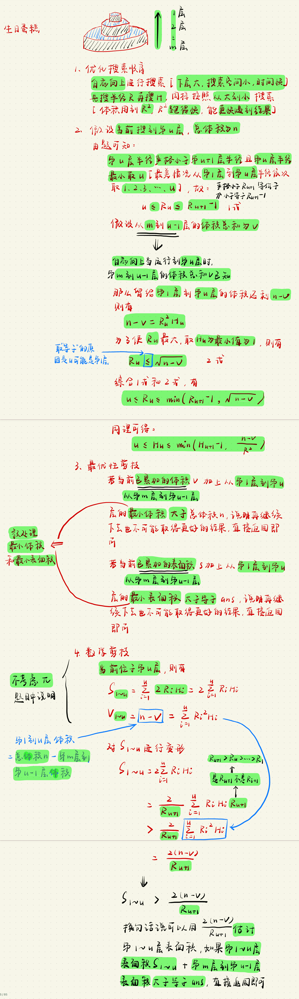

**代码**

```c++
#include <iostream>
#include <cmath>
using namespace std;
const int N = 25, INF = 0x3f3f3f3f;
int n, m, ans = INF;
int Minv[N], Mins[N], R[N], H[N];
void dfs(int u, int v, int s) {
    // 最优性剪枝
    // 如果从m到u - 1层的表面积➕从第1层到第m层的表面积 >= ans,返回即可
    if (s + Mins[u] >= ans) return;
    // 可行性剪枝
    // 如果从m到u - 1层的体积➕从第1层到第m层的体积 > n,[不是等于],返回即可
    if (v + Minv[u] > n) return;
    // 数学剪枝
    if (s + 2 * (n - v) / R[u + 1] >= ans) return;
    // 如果到达第0层
    if (!u) {
        // 如果体积刚好用完,更新答案
        if (v == n) ans = s;
        return;
    }
    // 先枚举半径,从大到小枚举
    for (int r = min(R[u + 1] - 1, (int)sqrt(n - v)); r >= u; r -- )
        // 再枚举高度,从大到小枚举
        for (int h = min(H[u + 1] - 1, (n - v) / r / r); h >= u; h -- ) {
            // 更新半径和高度
            R[u] = r, H[u] = h;
            int t = 0;
            // 如果u == m,加上第m层的面积[手写稿图的蓝色部分]
            if (u == m) t = r * r;
            // 递归下一层
            dfs(u - 1, v + r * r * h, s + 2 * r * h + t);
        }
    return;
}
int main() {
    scanf("%d%d", &n, &m);
    // 预处理最小体积和最小侧面积
    for (int i = 1; i <= m; i ++ ) {
        Minv[i] = i * i * i;
        Mins[i] = 2 * i * i;
    }
    // 管理哨兵,初始化为正无穷
    R[m + 1] = H[m + 1] = INF;
    dfs(m, 0, 0);
    // 无解
    if (ans == INF) cout << 0 << endl;
    else cout << ans << endl;
    return 0;
}
```

**时间复杂度**

$O(不讲武德)$

**空间复杂度**

$O(n)$

**标签**

`DFS`、`剪枝`

**缝合怪**


### 迭代加深

#### 简介

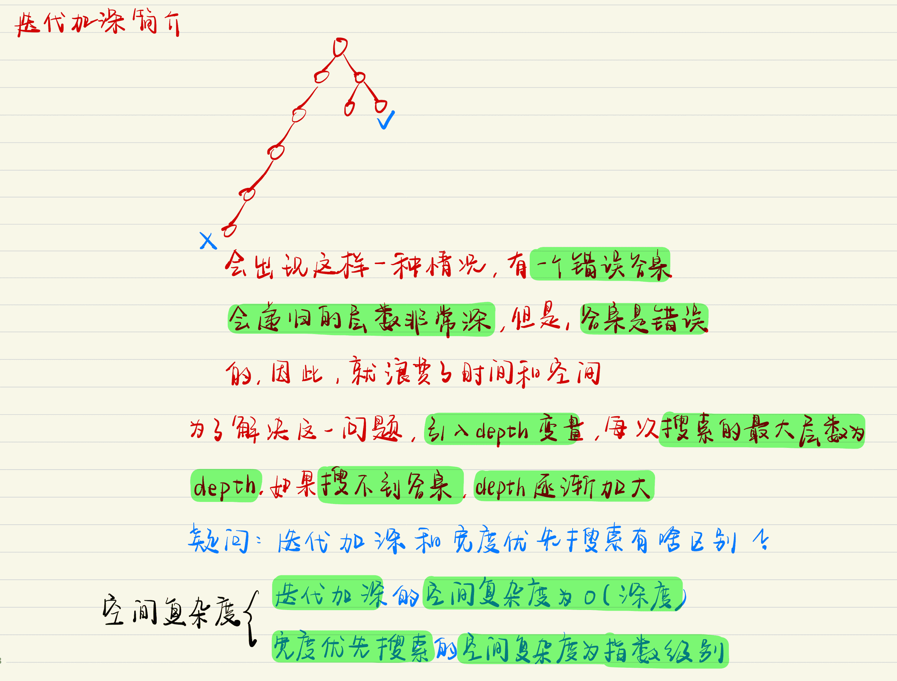

#### [AcWing 170. 加成序列](https://www.acwing.com/problem/content/172/)

**题目描述**

>   满足如下条件的序列 `X`（序列中元素被标号为 `1、 2、 3 … m`）被称为“加成序列”：
>
>   1.  `X[1] = 1`
>   2.  `X[m] = n`
>   3.  `X[1] < X[2] < … < X[m−1] < X[m]`
>   4.  对于每个 `k`（`2 ≤ k ≤ m`）都存在两个整数 `i` 和 `j` （`1 ≤ i, j ≤ k − 1`，`i` 和 `j` 可相等），使得 `X[k] = X[i] + X[j]`。
>
>   你的任务是：给定一个整数 `n`，找出符合上述条件的长度 `m` 最小的“加成序列”。
>
>   如果有多个满足要求的答案，只需要找出任意一个可行解。

**输入格式**

>   输入包含多组测试用例。
>
>   每组测试用例占据一行，包含一个整数 `n`。
>
>   当输入为单行的 `0` 时，表示输入结束。

**输出格式**

>   对于每个测试用例，输出一个满足需求的整数序列，数字之间用空格隔开。
>
>   每个输出占一行。

**数据范围**

>   +   $1 ≤ n ≤ 100$

**输入样例**

```c++
5
7
12
15
77
0
```

**输出样例**

```c++
1 2 4 5
1 2 4 6 7
1 2 4 8 12
1 2 4 5 10 15
1 2 4 8 9 17 34 68 77
```

**手写稿**

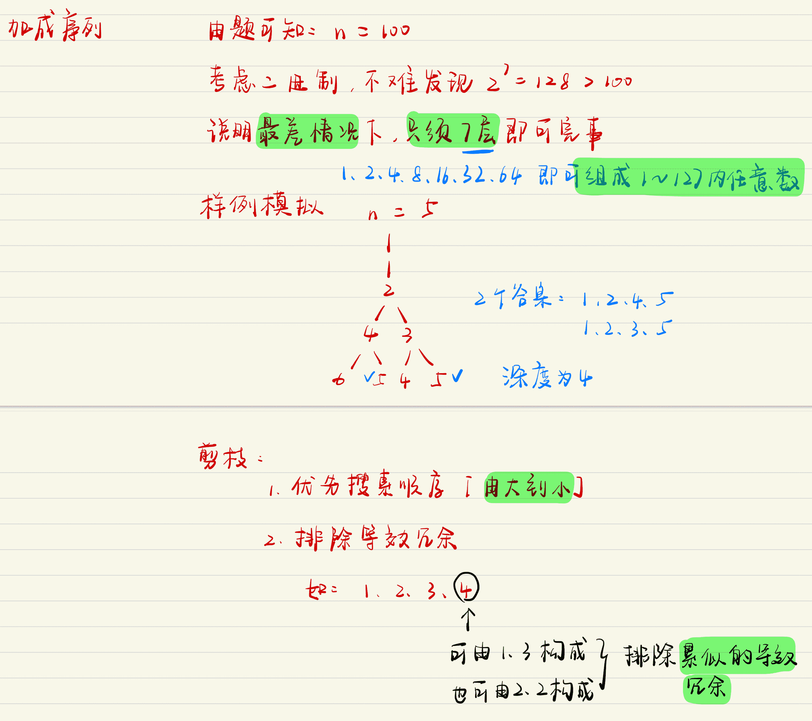

**代码**

```c++
#include <iostream>
using namespace std;
const int N = 110;
int n;
int path[N];
/*
    参数:
        参数1: 枚举的层数
        参数2: 规定的深度
*/
bool dfs(int u, int depth) {
    // 如果当前深度大于规定的深度, 返回
    if (u > depth) return false;
    // 下标从[0, u - 1], 如果最后一个数等于n
    if (path[u - 1] == n) return true;
    // 排除等效冗余
    bool st[N] = {false};
    for (int i = 0; i < u; i ++ )
        for (int j = i; j >= 0; j -- ) {
            int s = path[i] + path[j];
            // 如果当前数字的和小于等于 n
            // 当前总和严格大于上一个数字
            // 当前数字没有被访问过
            if (s <= n && s > path[u - 1] && !st[s]) {
                st[s] = true;
                path[u] = s;
                // 产生连锁反应
                if (dfs(u + 1, depth)) return true;
            }
        }
    return false;
}
int main() {
    path[0] = 1;
    while (~scanf("%d", &n), n) {
        int depth = 1;
        // 确定深度
        while (!dfs(1, depth)) depth ++;
        for (int i = 0; i < depth; i ++ ) cout << path[i] << " ";
        cout << endl;
    }
    return 0;
}
```

**时间复杂度**

$O(不讲武德)$

**空间复杂度**

$O(h), h是深度$

**标签**

`迭代加深`

**缝合怪**


### 双向 `DFS`

#### [AcWing 171. 送礼物](https://www.acwing.com/problem/content/173/)

**题目描述**

>   达达帮翰翰给女生送礼物，翰翰一共准备了 `N` 个礼物，其中第 ii 个礼物的重量是 `G[i]`。
>
>   达达的力气很大，他一次可以搬动重量之和不超过 `W` 的任意多个物品。
>
>   达达希望一次搬掉尽量重的一些物品，请你告诉达达在他的力气范围内一次性能搬动的最大重量是多少。

**输入格式**

>   第一行两个整数，分别代表 `W` 和 `N`。
>
>   以后 `N` 行，每行一个正整数表示 `G[i]`。

**输出格式**

>   仅一个整数，表示达达在他的力气范围内一次性能搬动的最大重量。

**数据范围**

>   +   $1 ≤ N ≤ 46,$
>   +   $1 ≤ W, G[i] ≤ 2^{31} − 1$

**输入样例**

```c++
20 5
7
5
4
18
1
```

**输出样例**

```c++
19
```

**手写稿**

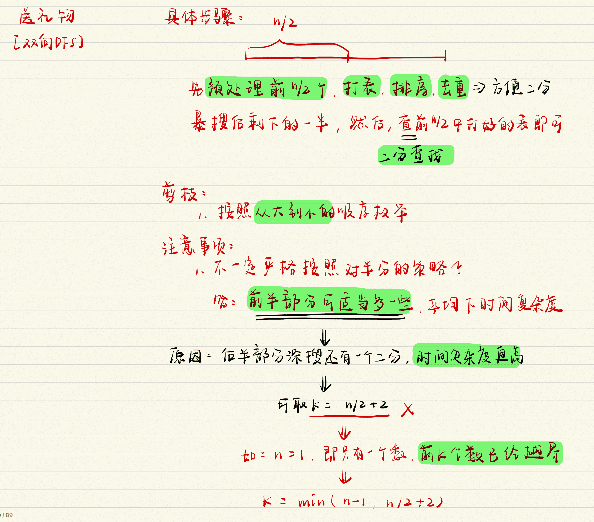

**代码**

```c++
#include <iostream>
#include <algorithm>
using namespace std;
typedef long long LL;
const int N = 50, M = 1 << 26;
int n, m, k, cnt, ans;
// 取M = 1 << 26不是 1 << N 
int w[N], choices[M];
void dfs1(int u, int s) {
    if (u == k) {
        choices[cnt ++ ] = s;
        return;
    }
    // 不选择第u个物品
    dfs1(u + 1, s);
    // 选择第u个物品
    // 数组可能会越界
    if ((LL)s + w[u] <= m) dfs1(u + 1, s + w[u]);
    return;
}
void dfs2(int u, int s) {
    if (u == n) {
        // 二分模板
        int l = 0, r = cnt - 1;
        while (l < r) {
            int mid = l + r + 1 >> 1;
            if ((LL)s + choices[mid] <= m) l = mid;
            else r = mid - 1;
        }
        // 只有当答案合法的时候, 才更新答案
        if ((LL)s + choices[l] <= m) ans = max(ans, s + choices[l]);
        return;
    }
    // 不选择第u个物品
    dfs2(u + 1, s);
    // 选择第u个物品
    // 注意数组越界
    if ((LL)s + w[u] <= m) dfs2(u + 1, s + w[u]);
    return;
}
int main() {
    scanf("%d%d", &m, &n);
    for (int i = 0; i < n; i ++ ) scanf("%d", &w[i]);
    // 从大到小排序, 搜索空间小
    sort(w, w + n, [&] (LL a, LL b) {
        return a > b;
    });
    // 注意: 去最小值, 因为 n / 2 + 2 可能会越界
    // 例如 n = 1
    k = min(n - 1, n / 2 + 2);
    dfs1(0, 0);
    // 排序
    sort(choices, choices + cnt);
    // 去重
    cnt = unique(choices, choices + cnt) - choices;
    dfs2(k, 0);
    cout << ans << endl;
    return 0;
}
```

**时间复杂度**

$O(不讲武德)$

**空间复杂度**

$O(2 ^ {n / 2})$

**标签**

`双向DFS`

**缝合怪**

[实数二分](#实数二分)

### `IDA*`

#### [AcWing 180. 排书](https://www.acwing.com/problem/content/182/)

**题目描述**

>   给定 `n` 本书，编号为 `1 ∼ n`。
>
>   在初始状态下，书是任意排列的。
>
>   在每一次操作中，可以抽取其中连续的一段，再把这段插入到其他某个位置。
>
>   我们的目标状态是把书按照 `1 ∼ n` 的顺序依次排列。
>
>   求最少需要多少次操作。

**输入格式**

>   第一行包含整数 `T`，表示共有 `T` 组测试数据。
>
>   每组数据包含两行，第一行为整数 `n`，表示书的数量。
>
>   第二行为 `n` 个整数，表示 `1 ∼ n` 的一种任意排列。
>
>   同行数之间用空格隔开。

**输出格式**

>   每组数据输出一个最少操作次数。
>
>   如果最少操作次数大于或等于 `5` 次，则输出 `5 or more`。
>
>   每个结果占一行。

**数据范围**

>   +   $1 ≤ n ≤ 15$

**输入样例**

```c++
3
6
1 3 4 6 2 5
5
5 4 3 2 1
10
6 8 5 3 4 7 2 9 1 10
```

**输出样例**

```c++
2
3
5 or more
```

**手写稿**

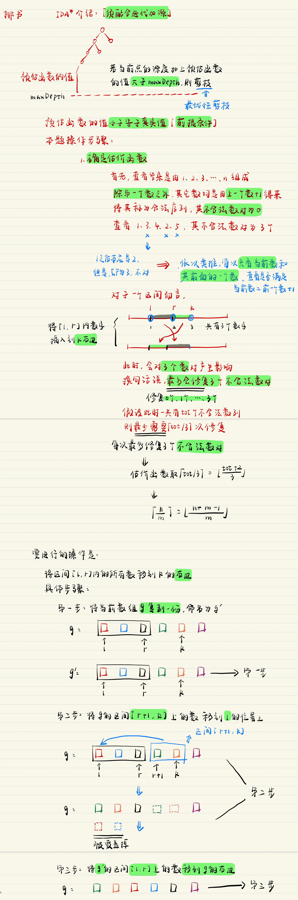

**代码**

```c++
#include <iostream>
#include <cstring>
using namespace std;
const int N = 20;
int n, T;
int g[N];
// 记录每一层的排列
int w[5][N];
// 计算不合法数对的个数
int f() {
    int tot = 0;
    for (int i = 0; i + 1 < n; i ++ )
        if (g[i + 1] != g[i] + 1) tot ++;
    return (tot + 2) / 3;
}
bool dfs(int u, int MaxDepth) {
    // 超过最大深度, 直接返回即可
    if (u + f() > MaxDepth) return false;
    // 不合法数对为0, 说明全部合法, 找到答案
    if (f() == 0) return true;
    // 枚举长度
    // 长度为n, 没有必要枚举
    for (int len = 1; len < n; len ++ )
        // 枚举左端点
        for (int l = 0; l + len - 1 < n; l ++ ) {
            // 计算右端点
            int r = l + len - 1;
            for (int k = r + 1; k < n; k ++ ) {
                // 拷贝当前层的排列顺序
                memcpy(w[u], g, sizeof g);
                // 具体移动步骤, 看手写稿
                int x, y;
                for (x = r + 1, y = l; x <= k; x ++, y ++ ) g[y] = w[u][x];
                for (x = l; x <= r; x ++, y ++ ) g[y] = w[u][x];
                if (dfs(u + 1, MaxDepth)) return true;
                // 恢复现场
                memcpy(g, w[u], sizeof w[u]);
            }
        }
    return false;
}
int main() {
    scanf("%d", &T);
    while (T -- ) {
        scanf("%d", &n);
        for (int i = 0; i < n; i ++ ) scanf("%d", &g[i]);
        int depth = 0;
        while (depth < 5 && !dfs(0, depth)) depth ++;
        if (depth >= 5) puts("5 or more");
        else cout << depth << endl;
    }
    return 0;
}
```

**时间复杂度**

$O(不讲武德)$

**空间复杂度**

$O(n)$

**标签**

`IDA*`、`深度优先搜索`

**缝合怪**


#### [AcWing 181. 回转游戏](https://www.acwing.com/problem/content/183/)

**题目描述**

>   如下图所示，有一个 `#` 形的棋盘，上面有 `1, 2, 3` 三种数字各 `8` 个。
>
>   给定 `8` 种操作，分别为图中的 `A ∼ H`。
>
>   这些操作会按照图中字母和箭头所指明的方向，把一条长为 `7` 的序列循环移动 `1` 个单位。
>
>   例如下图最左边的 `#` 形棋盘执行操作 `A` 后，会变为下图中间的 `#` 形棋盘，再执行操作 `C` 后会变成下图最右边的 `#` 形棋盘。
>
>   给定一个初始状态，请使用最少的操作次数，使 `#` 形棋盘最中间的 `8` 个格子里的数字相同。
>
>   

**输入格式**

>   输入包含多组测试用例。
>
>   每个测试用例占一行，包含 `24` 个数字，表示将初始棋盘中的每一个位置的数字，按整体从上到下，同行从左到右的顺序依次列出。
>
>   输入样例中的第一个测试用例，对应上图最左边棋盘的初始状态。
>
>   当输入只包含一个 `0` 的行时，表示输入终止。

**输出格式**

>   每个测试用例输出占两行。
>
>   第一行包含所有移动步骤，每步移动用大写字母 `A ∼ H` 中的一个表示，字母之间没有空格，如果不需要移动则输出 `No moves needed`。
>
>   第二行包含一个整数，表示移动完成后，中间 `8` 个格子里的数字。
>
>   如果有多种方案，则输出字典序最小的解决方案。

**输入样例**

```c++
1 1 1 1 3 2 3 2 3 1 3 2 2 3 1 2 2 2 3 1 2 1 3 3
1 1 1 1 1 1 1 1 2 2 2 2 2 2 2 2 3 3 3 3 3 3 3 3
0
```

**输出样例**

```c++
AC
2
DDHH
2
```

**手写稿**

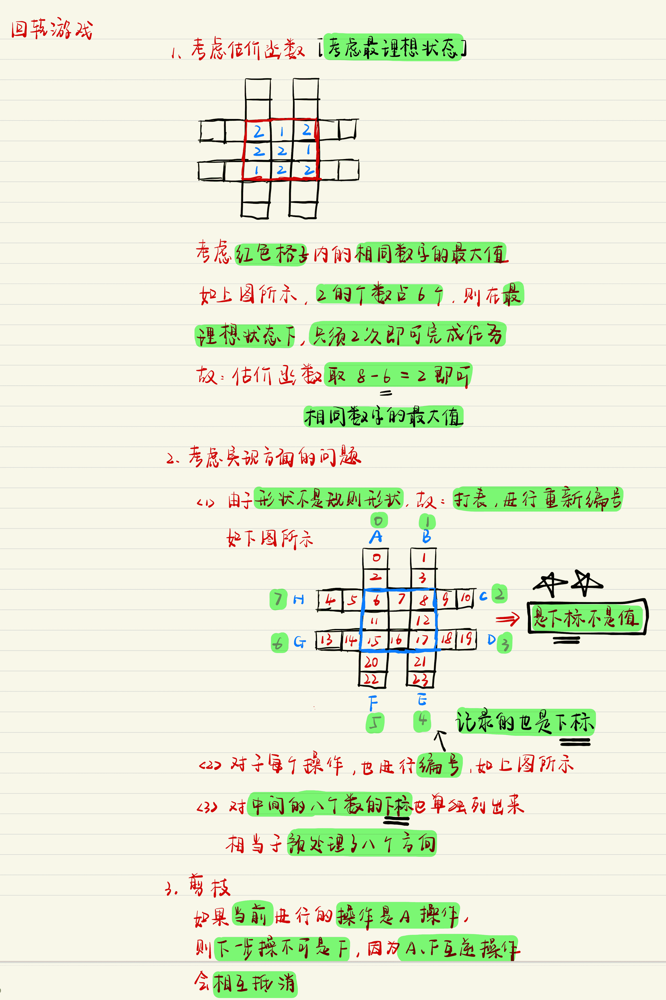

**代码**

```c++
#include <iostream>
using namespace std;
const int N = 24, M = 110;
int q[N], path[M];
int opposite[8] = {5, 4, 7, 6, 1, 0, 3, 2}; // A~H的逆操作的下标!!下标!!
int center[8] = {6, 7, 8, 11, 12, 15, 16, 17}; // 记录中间八个点的下标!!下标!!
char map[8][7] = { // 存的是下标!!下标!!
    {0, 2, 6, 11, 15, 20, 22},
    {1, 3, 8, 12, 17, 21, 23},
    {10, 9, 8, 7, 6, 5, 4},
    {19, 18, 17, 16, 15, 14, 13},
    {23, 21, 17, 12, 8, 3, 1},
    {22, 20, 15, 11, 6, 2, 0},
    {13, 14, 15, 16, 17, 18, 19},
    {4, 5, 6, 7, 8, 9, 10}
};
int f() { // 预估函数
    int sum[4] = {0};
    for (int i = 0; i < 8; i ++ ) // 遍历中间8个点
        sum[q[center[i]]] ++;
    int Max = -1;
    for (int i = 0; i < 4; i ++ ) Max = max(Max, sum[i]);
    return 8 - Max;
}
void operation(int x) { // 进行第x个操作
    int t = q[map[x][0]]; // map存的是下标!!下标!!
    // map存的是下标!!下标!!
    for (int i = 1; i < 7; i ++ ) q[map[x][i - 1]] = q[map[x][i]];
    q[map[x][6]] = t; // map存的是下标!!下标!!
    return;
}
bool dfs(int u, int MaxDepth, int k) {
    if (u + f() > MaxDepth) return false;
    if (f() == 0) return true;
    // 遍历8个操作
    for (int i = 0; i < 8; i ++ ) // 按照字典序枚举, 答案即为字典序
        if (opposite[i] != k) {
            operation(i); // 进行第i个操作
            path[u] = i; // 记录操作的下标
            if (dfs(u + 1, MaxDepth, i)) return true; // 产生连锁反应
            operation(opposite[i]); // 恢复现场
        }
    return false;
}
int main() {
    while (~scanf("%d", &q[0]), q[0]) {
        for (int i = 1; i < N; i ++ ) scanf("%d", &q[i]);
        int MaxDepth = 0;
        while (!dfs(0, MaxDepth, -1)) MaxDepth ++;
        if (!MaxDepth) printf("No moves needed");
        else
            for (int i = 0; i < MaxDepth; i ++ ) cout << char(path[i] + 'A');
        printf("\n%d\n", q[6]);
    }
    return 0;
}
```

**时间复杂度**

$O(不讲武德)$

**空间复杂度**

$O(max(N, M))$

**标签**

`DFS`、`IDA*`

**缝合怪**


## 启发式算法

### 模拟退火

#### 原理概述

>   1.   手写稿
>
>        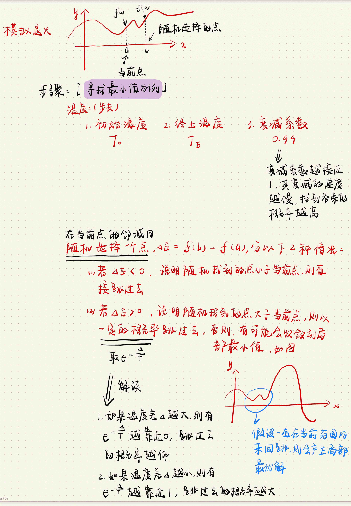
>
>   2.   动画演示
>
>        


#### [AcWing 3167. 星星还是树](https://www.acwing.com/problem/content/3170/)

**题目描述**

>   在二维平面上有 `n` 个点，第 `i` 个点的坐标为 $(x_i,y_i)$。
>
>   请你找出一个点，使得该点到这 `n` 个点的距离之和最小。
>
>   该点可以选择在平面中的任意位置，甚至与这 `n` 个点的位置重合。

**输入格式**

>   第一行包含一个整数 `n`。
>
>   接下来 `n` 行，每行包含两个整数 $x_i,y_i$，表示其中一个点的位置坐标。

**输出格式**

>   输出最小距离和，答案四舍五入取整。

**数据范围**

>   +   $1≤n≤100,$
>   +   $0≤x_i,y_i≤10000$

**输入样例**

```c++
4
0 0
0 10000
10000 10000
10000 0
```

**输出样例**

```c++
28284
```

**手写稿**

>   1.   原理概述

**代码**

```c++
#include <iostream>
#include <cmath>
#define x first
#define y second
using namespace std;
typedef pair<double, double> PDD;
const int N = 110, INF = 0x3f3f3f3f;
int n;
double ans = INF;
PDD q[N];
// 等概率生成区间[l, r]内的一个随机点
double rand(int l, int r) {
    return (double)rand() / RAND_MAX * (r - l) + l;
}
double get_dist(PDD a, PDD b) {
    double dx = a.x - b.x;
    double dy = a.y - b.y;
    return sqrt(dx * dx + dy * dy);
}
double calc(PDD p) {
    double res = 0;
    for (int i = 0; i < n; i ++ )
        res += get_dist(p, q[i]);
    // 更新答案
    ans = min(ans, res);
    return res;
}
void simulate_anneal() {
    // 随机生成当前点
    PDD cur(rand(0, 10000), rand(0, 10000));
    // 遍历温度[步长]
    for (double t = 1e4; t > 1e-4; t *= 0.99) {
        // 随机生成当前点的领域内的点
        PDD np(rand(cur.x - t, cur.x + t), rand(cur.y - t, cur.y + t));
        double dt = calc(np) - calc(cur);
        // 如果dt < 0,则-dt / t > 0, e^{-dt / t} > 1，则一定会通过此条件
        // 如果dt > 0,则-dt / t < 0, 0 < e^{-dt / t} < 1,则有一定概率可以过去
        // 差的越大越不容易过去
        if (exp(-dt / t) > rand(0, 1)) cur = np;
    }
    return;
}
int main() {
    scanf("%d", &n);
    for (int i = 0; i < n; i ++ ) 
        scanf("%lf%lf", &q[i].x, &q[i].y);
    // 迭代一百次
    for (int i = 0; i < 100; i ++ ) 
        simulate_anneal();
    printf("%.0lf\n", ans);
    return 0;
}
```

**时间复杂度**

$O(log_t)$

**空间复杂度**

$O(n)$

**标签**

`启发式算法`、`模拟退火`

**缝合怪**

#### [AcWing 2424. 保龄球](https://www.acwing.com/problem/content/2426/)

**题目描述**

>   `JYY` 很喜欢打保龄球，虽然技术不高，但是还是总想着的高分。
>
>   这里 `JYY` 将向你介绍他所参加的特殊保龄球比赛的规则，然后请你帮他得到尽量多的分数。
>
>   一场保龄球比赛一共有 `N` 个轮次，每一轮都会有 `10` 个木瓶放置在木板道的另一端。
>
>   每一轮中，选手都有两次投球的机会来尝试击倒全部的 `10` 个木瓶。
>
>   对于每一次投球机会，选手投球的得分等于这一次投球所击倒的木瓶数量。
>
>   选手每一轮的得分是他两次机会击倒全部木瓶的数量。
>
>   对于每一个轮次，有如下三种情况：
>
>   1.  “全中”：如果选手第一次尝试就击倒了全部 `10` 个木瓶，那么这一轮就称为“全中”。在一个“全中”轮中，由于所有木瓶在第一次尝试中都已经被击倒，所以选手不需要再进行第二次投球尝试。同时，在计算总分时，选手在下一轮的得分将会被乘 `2` 计入总分。
>   2.  “补中”：如果选手使用两次尝试击倒了 `10` 个木瓶，那么这一轮就称为“补中”。同时，在计算总分时，选手在下一轮中的第一次尝试的得分将会被乘以 `2` 计入总分。
>   3.  “失误”：如果选手未能通过两次尝试击倒全部的木瓶，那么这一轮就被称为“失误”。同时，在计算总分时，选手在下一轮的得分会被计入总分，没有分数被翻倍。
>
>   此外，如果第 `N` 轮是“全中”，那么选手可以进行一次附加轮：也就是，如果第 `N` 轮是“全中”，那么选手将一共进行 `N + 1` 轮比赛。
>
>   显然，在这种情况下，第 `N + 1` 轮的分数一定会被加倍。
>
>   附加轮的规则只执行一次。
>
>   也就是说，即使第 `N + 1` 轮选手又打出了“全中”，也不会进行第 `N + 2` 轮比赛。
>
>   因而，附加轮的成绩不会使得其他轮的分数翻番。
>
>   最后，选手的总得分就是附加轮规则执行过，并且分数按上述规则加倍后的每一轮分数之和。
>
>   `JYY` 刚刚进行了一场 `N` 个轮次的保龄球比赛，但是，`JYY` 非常不满意他的得分。
>
>   `JYY` 想出了一个办法：他可以把记分表上，他所打出的所有轮次的顺序重新排列，这样重新排列之后，由于翻倍规则的存在，`JYY` 就可以得到更高的分数了！
>
>   当然了，`JYY` 不希望做的太假，他希望保证重新排列之后，所需要进行的轮数和重排前所进行的轮数是一致的：
>
>   比如如果重排前 `JYY` 在第 `N` 轮打出了“全中”，那么重排之后，第 `N` 轮还得是“全中”以保证比赛一共进行 `N+1` 轮；同样的，如果 `JYY` 第 `N` 轮没有打出“全中”，那么重排过后第 `N` 轮也不能是全中。
>
>   请你帮助 `JYY` 计算一下，他可以得到的最高的分数。

**输入格式**

>   第一行包含一个整数 `N`，表示保龄球比赛所需要进行的轮数。
>
>   接下来包含 `N` 或者 `N+1` 行，第 `i` 行包含两个非负整数 $X_i$ 和 $Y_i$，表示 `JYY` 在这一轮两次投球尝试所得到的分数，$X_i$ 表示第一次尝试，$Y_i$ 表示第二次尝试。
>
>   我们用 `10 0` 表示一个“全中”轮。
>
>   输入数据保证合法，当且仅当 $X_n=10,Y_n=0$ 时，存在 `N+1` 行 $X_i$ 和 $Y_i$。

**输出格式**

>   输出一行一个整数，表示 `JYY` 最大可能得到的分数。

**数据范围**

>   +   $1≤N≤50$

**输入样例**

```c++
2
5 2
10 0
3 7
```

**输出样例**

```c++
44
```

**样例**

>   按照输入顺序，`JYY` 将得到 $37$ 分。
>
>   最佳方案是将 `3` 个轮次排列成如下顺序：
>
>   ```c++
>   3 7
>   10 0
>   5 2
>   ```

**手写稿**

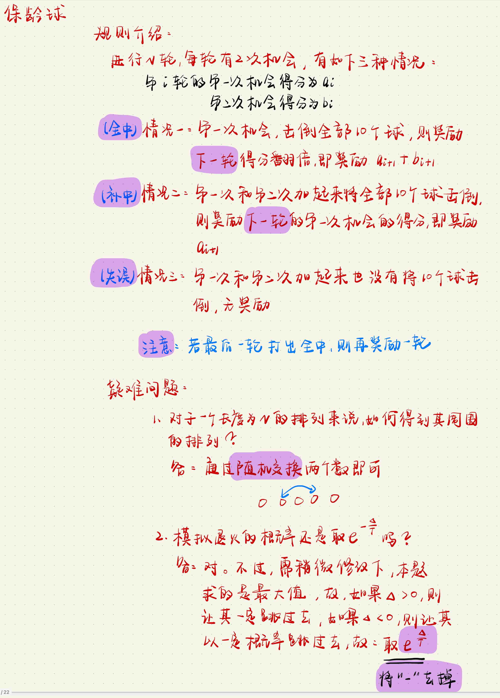

**代码**

```c++
#include <iostream>
#include <cmath>
#define x first
#define y second
using namespace std;
typedef pair<int, int> PII;
const int N = 55;
int n, m, ans;
PII q[N];
int calc() {
    int res = 0;
    for (int i = 0; i < m; i ++ ) {
        res += q[i].x + q[i].y;
        if (q[i].x == 10) res += q[i + 1].x + q[i + 1].y;
        else if (q[i].x + q[i].y == 10) res += q[i + 1].x;
    }
    ans = max(ans, res);
    return res;
}
void simulate_anneal() {
    // 温度
    for (double t = 1e4; t > 1e-6; t *= 0.98) {
        // 生成随机排列
        int x = calc();
        // 随机生成两个下标
        int a = rand() % m, b = rand() % m;
        // 交换
        swap(q[a], q[b]);
        // 如果交换之前和交换之后的轮数一样，则是合法的交换
        if (n + (q[n - 1].x == 10) == m) {
            // 计算交换之后的值
            int y = calc();
            // 计算差值
            int dt = y - x;
            // 如果新的值比当前值小，则以一定概率跳过去
            // 如果以当前的概率跳不过去，则记得恢复现场
            if (exp(dt / t) < (double)rand() / RAND_MAX) swap(q[a], q[b]);
        }
        // 如果当前交换不合法，记得恢复现场
        else swap(q[a], q[b]);
    }
    return;
}
int main() {
    scanf("%d", &n);
    m = n;
    for (int i = 0; i < n; i ++ )
        scanf("%d%d", &q[i].x, &q[i].y);
    if (q[n - 1].x == 10) scanf("%d%d", &q[n].x, &q[n].y), m ++ ;
    // 模拟退火
    for (int i = 0; i < 100; i ++ ) simulate_anneal();
    cout << ans << endl;
    return 0;
}
```

**时间复杂度**

$O(nlog_t)$

**空间复杂度**

$O(n)$

**标签**

`启发式算法`、`模拟退火`

**缝合怪**

#### [AcWing 2680. 均分数据](https://www.acwing.com/problem/content/2682/)

**题目描述**

>   已知 `N` 个正整数：$A_1、A_2、……、A_n$。
>
>   今要将它们分成 `M` 组，使得各组数据的数值和最平均，即各组的均方差最小。
>
>   均方差公式如下：
>   $$
>   \sigma=\sqrt{\frac{\sum\nolimits_{i = 1}^{n}(x_i - \bar x)^2}{n}}, 
>   \bar x = \frac{\sum\nolimits_{i = 1}^{n}x_i}{n}
>   $$
>   其中 `σ` 为均方差，$\bar x$ 为各组数据和的平均值，$x_i$ 为第 `i` 组数据的数值和。

**输入格式**

>   第一行是两个整数，表示 `N,M` 的值（`N` 是整数个数，`M` 是要分成的组数）。
>
>   第二行有 `N` 个整数，表示 $A_1、A_2、……、A_n$。（同一行的整数间用空格分开）

**输出格式**

>   包括一行，这一行只包含一个数，表示最小均方差的值(保留小数点后两位数字)。

**数据范围**

>   +   $M≤N≤20,$
>   +   $2≤M≤6,$
>   +   $1≤A_i≤50$

**输入样例**

```c++
6 3
1 2 3 4 5 6
```

**输出样例**

```c++
0.00
```

**手写稿**

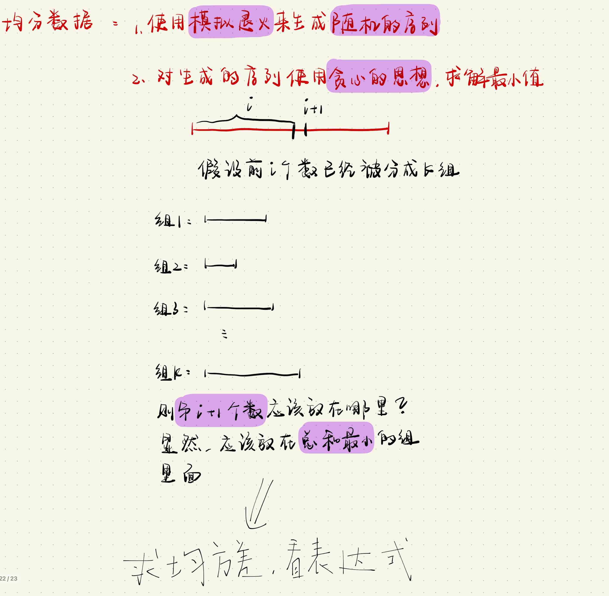

**代码**

```c++
#include <iostream>
#include <algorithm>
#include <cstring>
#include <cmath>
using namespace std;
const int N = 25, INF = 0x3f3f3f3f;
int n, m;
// 注意是double类型
double ans = INF;
int q[N], sum[N];
int calc() {
    // 每次清空总和
    memset(sum, 0, sizeof sum);
    // 贪心的枚举当前数应该放置于哪个组中
    for (int i = 0; i < n; i ++ ) {
        // 默认组k = 0
        int k = 0;
        for (int j = 0; j < m; j ++ )
            // 如果当前组的总和更小，则更新组的编号
            if (sum[j] < sum[k]) k = j;
        // 将当前树插入到组k中
        sum[k] += q[i];
    }
    // 计算平均值
    double avg = 0;
    for (int i = 0; i < m; i ++ ) avg += (double)sum[i] / m;
    double res = 0;
    for (int i = 0; i < m; i ++ )
        // 均方差的公式
        res += (sum[i] - avg) * (sum[i] - avg);
    // 别忘记除m，不是除n，好好理解下题意
    res = sqrt(res / m);
    // 更新答案
    ans = min(ans, res);
    return res;
}
void simulate_anneal() {
    // 随机生成序列
    random_shuffle(q, q + n);
    for (double t = 1e6; t > 1e-6; t *= 0.99) {
        // 随机生成两个下标
        int a = rand() % n, b = rand() % n;
        double x = calc();
        swap(q[a], q[b]);
        double y = calc();
        double dt = y - x;
        if (exp(-dt / t) < (double)rand() / RAND_MAX) swap(q[a], q[b]);
    }
    return;
}
int main() {
    scanf("%d%d", &n, &m);
    for (int i = 0; i < n; i ++ ) scanf("%d", &q[i]);
    // 迭代100次
    for (int i = 0; i < 100; i ++ )
        simulate_anneal();
    printf("%.2lf\n", ans);
    return 0;
}
```

**时间复杂度**

$O(nm)$

**空间复杂度**

$O(n)$

**标签**

`贪心`、`模拟退火`

**缝合怪**


### 爬山法

#### [AcWing 207. 球形空间产生器](https://www.acwing.com/problem/content/209/)

**题目描述**

>   有一个球形空间产生器能够在 `n` 维空间中产生一个坚硬的球体。
>
>   现在，你被困在了这个 `n` 维球体中，你只知道球面上 `n+1` 个点的坐标，你需要以最快的速度确定这个 `n` 维球体的球心坐标，以便于摧毁这个球形空间产生器。
>
>   **注意：** 数据保证有唯一解。

**输入格式**

>   第一行是一个整数 `n`。
>
>   接下来的 `n + 1` 行，每行有 `n` 个实数，表示球面上一点的 `n` 维坐标。
>
>   每一个实数精确到小数点后 `6` 位，且其绝对值都不超过 `20000`。

**输出格式**

>   有且只有一行，依次给出球心的 `n` 维坐标（`n` 个实数），两个实数之间用一个空格隔开。
>
>   每个实数精确到小数点后 `3` 位。

**数据范围**

>   +   $1≤n≤10$

**输入样例**

```c++
2
0.0 0.0
-1.0 1.0
1.0 0.0
```

**输出样例**

```c++
0.500 1.500
```

**手写稿**

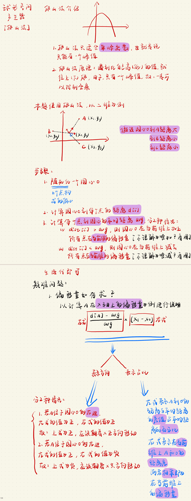

**代码**

```c++
#include <iostream>
#include <cmath>
#include <cstring>
using namespace std;
const int N = 15;
int n;
// dist[N]表示圆心的n维坐标
// delta[N]表示每个点在当前方向上的偏移量
// d[N]表示每个点距离圆心的欧式距离
double dist[N], delta[N], d[N];
double a[N][N];
void calc() {
    double avg = 0;
    memset(d, 0, sizeof d);
    memset(delta, 0, sizeof delta);
    // 枚举每个点
    for (int i = 1; i <= n + 1; i ++ ) {
        // 计算欧式距离
        for (int j = 1; j <= n; j ++ )
            d[i] += (a[i][j] - dist[j]) * (a[i][j] - dist[j]);
        // 距离要开根号
        d[i] = sqrt(d[i]);
        // 计算平均值
        avg += d[i] / (n + 1);
    }
    // 枚举每个点
    for (int i = 1; i <= n + 1; i ++ )
        // 枚举每个点的每一维向量
        for (int j = 1; j <= n; j ++ )
            // 将所有点在当前维的方向上的偏移量累加
            delta[j] += (d[i] - avg) / avg * (a[i][j] - dist[j]);
    return;
}

int main() {
    scanf("%d", &n);
    for (int i = 1; i <= n + 1; i ++ )
        for (int j = 1; j <= n; j ++ ) {
            scanf("%lf", &a[i][j]);
            // n个点的质心
            // 质心距离原点比较近
            dist[j] += a[i][j] / (n + 1);
        }
    for (double t = 1e4; t > 1e-6; t *= 0.99997) {
        calc();
        for (int i = 1; i <= n; i ++ )
            // 乘温度的目的，是让偏移量趋于稳定
            // delta带正负，所以，直接加即可
            dist[i] += t * delta[i];
    }
    for (int i = 1; i <= n; i ++ )
        printf("%.3lf ", dist[i]);
    return 0;
}
```

**时间复杂度**

$O(nlog_t)$

**空间复杂度**

$O(n^2)$

**标签**

`爬山法`

**缝合怪**

# 图论

## `Dijkstra`

### 原理以及与 `SPFA` 的区别

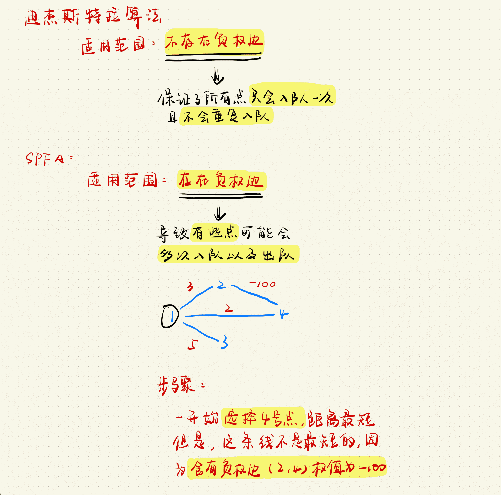

### [AcWing 849. Dijkstra求最短路 I](https://www.acwing.com/problem/content/851/)

**题目描述**

>   给定一个 `n` 个点 `m` 条边的有向图，图中可能存在重边和自环，所有边权均为正值。
>
>   请你求出 `1` 号点到 `n` 号点的最短距离，如果无法从 `1` 号点走到 `n` 号点，则输出 `−1`。

**输入格式**

>   第一行包含整数 `n` 和 `m`。
>
>   接下来 `m` 行每行包含三个整数 `x,y,z`，表示存在一条从点 `x` 到点 `y` 的有向边，边长为 `z`。

**输出格式**

>   输出一个整数，表示 `1` 号点到 `n` 号点的最短距离。
>
>   如果路径不存在，则输出 `−1`。

**数据范围**

>   +   $1≤n≤500,$
>   +   $1≤m≤10^5,$
>   +   $图中涉及边长均不超过10000。$

**输入样例**

```c++
3 3
1 2 2
2 3 1
1 3 4
```

**输出样例**

```c++
3
```

**手写稿**

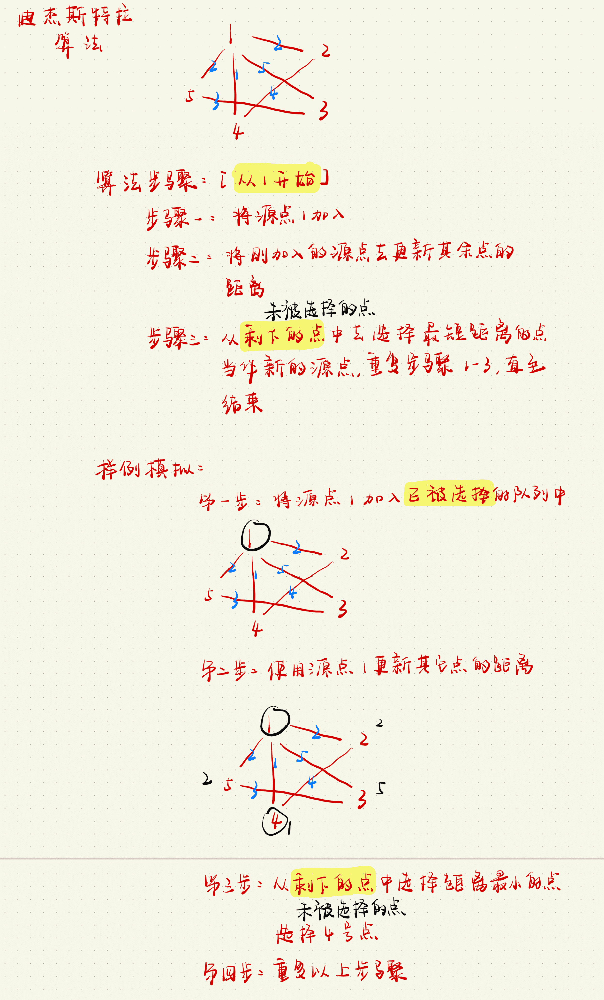

**代码**

```c++
#include <iostream>
#include <cstring>
using namespace std;
const int N = 510, INF = 0x3f3f3f3f;
int n, m;
int st[N], dist[N];
int g[N][N];
int dijkstra() {
    memset(dist, 0x3f, sizeof dist);
    memset(st, 0, sizeof st);
    // 初始化距离
    dist[1] = 0;
    for (int i = 0; i < n; i ++ ) {
        // 找到【未被选择】的最小的点
        int t = -1;
        for (int j = 1; j <= n; j ++ )
            if (!st[j] && (t == -1 || dist[j] < dist[t])) t = j;
        // 标记当前点已经被选择
        st[t] = true;
        // 使用最小点t去更新【未被选择】的点
        for (int j = 1; j <= n; j ++ )
            if (!st[j] && dist[j] > dist[t] + g[t][j])
                dist[j] = dist[t] + g[t][j];
    }
    if (dist[n] == INF) return -1;
    return dist[n];
}
int main() {
    scanf("%d%d", &n, &m);
    // 初始化为正无穷
    memset(g, 0x3f, sizeof g);
    // 初始化对角线的距离
    for (int i = 1; i <= n; i ++ ) g[i][i] = 0;
    for (int i = 0; i < m; i ++ ) {
        int u, v, w;
        scanf("%d%d%d", &u, &v, &w);
        // 注意：有【重边】，取重边的最小值
        g[u][v] = min(g[u][v], w);
    }
    cout << dijkstra() << endl;
    return 0;
}
```

**时间复杂度**

$O(n^2)$

**空间复杂度**

$O(n^2)$

**标签**

`最短路`、`Dijkstra`

**缝合怪**

### [AcWing 850. Dijkstra求最短路 II](https://www.acwing.com/problem/content/852/)

**题目描述**

>   给定一个 `n` 个点 `m` 条边的有向图，图中可能存在重边和自环，所有边权均为非负值。
>
>   请你求出 `1` 号点到 `n` 号点的最短距离，如果无法从 `1` 号点走到 `n` 号点，则输出 `−1`。

**输入格式**

>   第一行包含整数 `n` 和 `m`。
>
>   接下来 `m` 行每行包含三个整数 `x,y,z`，表示存在一条从点 `x` 到点 `y` 的有向边，边长为 `z`。

**输出格式**

>   输出一个整数，表示 `1` 号点到 `n` 号点的最短距离。
>
>   如果路径不存在，则输出 `−1`。

**数据范围**

>   +   $1≤n,m≤1.5×10^5,$
>   +   $图中涉及边长均不小于 0，且不超过 10000。$
>   +   $数据保证：如果最短路存在，则最短路的长度不超过 10^9。$

**输入样例**

```c++
3 3
1 2 2
2 3 1
1 3 4
```

**输出样例**

```c++
3
```

**手写稿**

>   原理
>
>   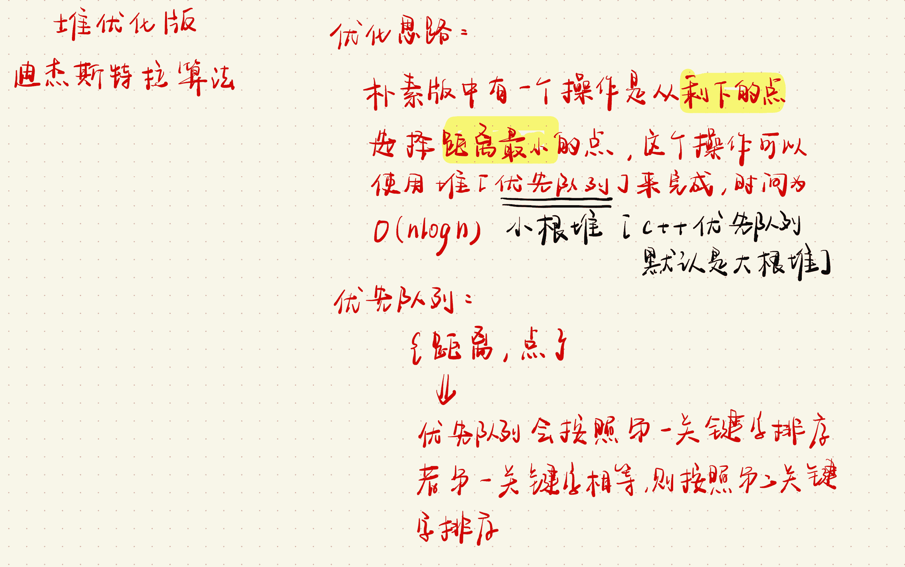
>
>   补充说明
>
>   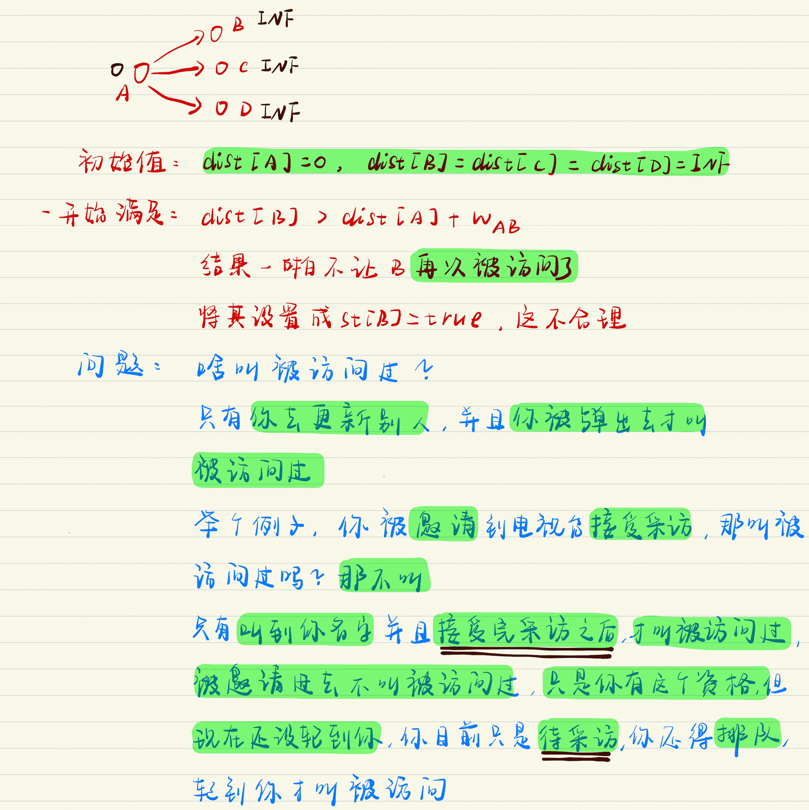

**代码**

```c++
#include <iostream>
#include <cstring>
#include <queue>
#define x first
#define y second
using namespace std;
typedef pair<int, int> PII;
const int N = 1.5e5 + 10, INF = 0x3f3f3f3f;
int n, m, idx;
int h[N], e[N], w[N], ne[N], dist[N], st[N];
priority_queue<PII, vector<PII>, greater<PII>> q;
void add(int a, int b, int c) {
    e[idx] = b;
    w[idx] = c;
    ne[idx] = h[a];
    h[a] = idx ++;
    return;
}
int dijkstra() {
    memset(dist, 0x3f, sizeof dist);
    dist[1] = 0;
    q.push({0, 1});
    while (q.size()) {
        auto t = q.top(); q.pop();
        int v = t.y;
        // 如果v已经被访问过，则直接进行下一次访问【原因在手写稿中已经说明】
        if (st[v]) continue;
        // 如果已经访问到终点
        if (v == n) break;
        // 将当前点标记为已经选择
        st[v] = true;
        // 遍历v的邻接点
        for (int i = h[v]; i != -1; i = ne[i]) {
            int j = e[i];
            // 如果当前点没有被访问过并且当前点有更优的路径
            // 那就干它
            if (!st[j] && dist[j] > dist[v] + w[i]) {
                dist[j] = dist[v] + w[i];
                q.push({dist[j], j});
                // 注意: 这里不能填写st[j] = true[手写稿补充说明]
            }
        }
    }
    if (dist[n] == INF) return -1;
    return dist[n];
}
int main() {
    scanf("%d%d", &n, &m);
    memset(h, -1, sizeof h);
    for (int i = 0; i < m; i ++ ) {
        int u, v, w;
        scanf("%d%d%d", &u, &v, &w);
        // 领接表不需要考虑重边的问题
        add(u, v, w);
    }
    cout << dijkstra() << endl;
    return 0;
}
```

**时间复杂度**

$O(log_n)$

**空间复杂度**

$O(m)$

**标签**

`堆优化版Dijkstra`

**缝合怪**

### [AcWing 4196. 最短路径](https://www.acwing.com/problem/content/4199/)

**题目描述**

>   给定一个 `n` 个点 `m` 条边的的无向图。
>
>   点的编号从 `1` 到 `n`。
>
>   图中可能包含重边和自环。
>
>   请你找到并输出一条从点 `1` 到点 `n` 的最短路径。

**输入格式**

>   第一行包含两个整数 `n,m`。
>
>   接下来 `m` 行，每行包含三个整数 `a,b,w`，表示点 `a` 和点 `b` 之间存在一条无向边，边长为 `w`。

**输出格式**

>   如果最短路径不存在，则输出 `−1`。
>
>   否则，在一行内输出从点 `1` 到点 `n` 的最短路径中依次包含的点的编号，各点编号之间用空格隔开。
>
>   如果答案不唯一，输出任意合理方案均可。

**数据范围**

>   +   $前六个测试点满足 2 ≤ n ≤ 10，1 ≤ m ≤ 10。$
>   +   $所有测试点满足 2 ≤ n ≤ 10^5，1 ≤ m ≤ 10^5，1 ≤ a, b ≤ n，1 ≤ w ≤ 10^6。$
>   +   $本题不卡spfa算法。$

**输入样例**

```c++
5 6
1 2 2
2 5 5
2 3 4
1 4 1
4 3 3
3 5 1
```

**输出样例**

```c++
1 4 3 5
```

**手写稿**

>   1.   `long long` 占 `8` 个字节, 因此, `memset` 初始化为 `0x3f` 的时候, 最大值不是 `0x3f3f3f3f`, 而是 `0x3f3f3f3f3f3f3f3fll` 共 `8` 个 `3f`

**代码**

```c++
#include <iostream>
#include <cstring>
#include <queue>
#define x first
#define y second
using namespace std;
typedef long long LL;
typedef pair<LL, int> PLI;
const int N = 100010, M = 200010;
// LL占8个字节, 因此, INF初始化为8个3f
const LL INF = 0x3f3f3f3f3f3f3f3fll;
int n, m, idx;
int h[N], e[M], w[M], ne[M], st[N], path[N];
LL dist[N];
void add(int a, int b, int c) {
    e[idx] = b;
    w[idx] = c;
    ne[idx] = h[a];
    h[a] = idx ++;
    return;
}
void dijkstra() {
    // 初始化dist, 类型为LL, 占8个字节!!!
    memset(dist, 0x3f, sizeof dist);
    memset(st, false, sizeof st);
    priority_queue<PLI, vector<PLI>, greater<PLI>> heap;
    // 从n到1倒序枚举
    dist[n] = true;
    heap.push({0, n});
    while (heap.size()) {
        auto t = heap.top(); heap.pop();
        int u = t.y;
        LL distance = t.x;
        if (st[u]) continue;
        st[u] = true;
        for (int i = h[u]; i != -1; i = ne[i]) {
            int j = e[i];
            if (dist[j] > distance + w[i]) {
                dist[j] = distance + w[i];
                heap.push({dist[j], j});
                path[j] = u;
            }
        }
    }
    if (dist[1] == INF) cout << -1 << endl;
    else {
        int start = 1;
        while (start != n) {
            cout << start << " ";
            start = path[start];
        }
        // 最后输出n即可
        cout << n << endl;
    }
    return;
}
int main() {
    scanf("%d%d", &n, &m);
    memset(h, -1, sizeof h);
    for (int i = 0; i < m; i ++ ) {
        int a, b, c;
        scanf("%d%d%d", &a, &b, &c);
        add(a, b, c);
        add(b, a, c);
    }
    dijkstra();
    return 0;
}
```

**时间复杂度**

$O(mlog_n)$

**空间复杂度**

$O(m)$

**标签**

`最短路`、`路径输出`

**缝合怪**


## `Bellman-Ford`

### [AcWing 853. 有边数限制的最短路](https://www.acwing.com/problem/content/855/)

**题目描述**

>   给定一个 `n` 个点 `m` 条边的有向图，图中可能存在重边和自环， **边权可能为负数**。
>
>   请你求出从 `1` 号点到 `n` 号点的最多经过 `k` 条边的最短距离，如果无法从 `1` 号点走到 `n` 号点，输出 `impossible`。
>
>   注意：图中可能 **存在负权回路** 。

**输入格式**

>   第一行包含三个整数 `n,m,k`。
>
>   接下来 `m` 行，每行包含三个整数 `x,y,z`，表示存在一条从点 `x` 到点 `y` 的有向边，边长为 `z`。

**输出格式**

>   输出一个整数，表示从 `1` 号点到 `n` 号点的最多经过 `k` 条边的最短距离。
>
>   如果不存在满足条件的路径，则输出 `impossible`。

**数据范围**

>   +   $1≤n,k≤500,$
>   +   $1≤m≤10000,$
>   +   $任意边长的绝对值不超过 10000。$

**输入样例**

```c++
3 3 1
1 2 1
2 3 1
1 3 3
```

**输出样例**

```c++
3
```

**手写稿**

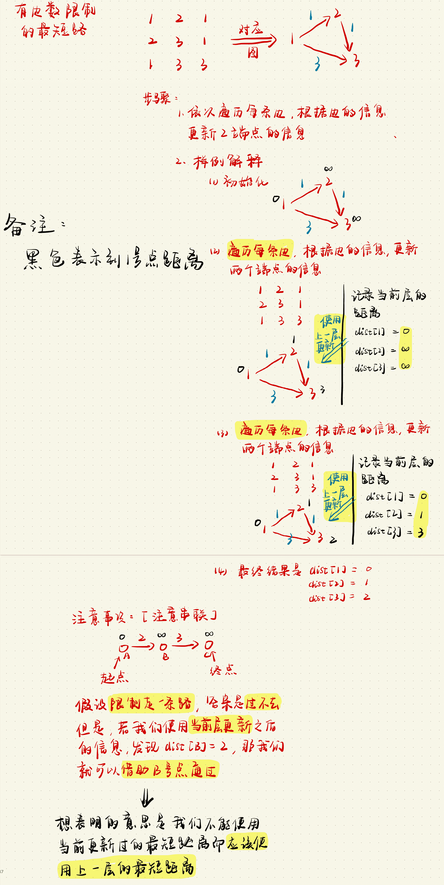

**代码**

```c++
#include <iostream>
#include <cstring>
using namespace std;
const int N = 1e4 + 10, INF = 0x3f3f3f3f;
struct Node {
    int u, v, w;
}edges[N];
int n, m, k;
int backup[N], dist[N];
int Bellman_Ford() {
    // 初始化距离
    memset(dist, 0x3f, sizeof dist);
    // 距离源点的距离为0
    dist[1] = 0;
    for (int i = 0; i < k; i ++ ) { // 限制走k条路
        // 将上一层的数据备份
        memcpy(backup, dist, sizeof dist);
        for (int j = 0; j < m; j ++ ) { // 遍历每条边
            int u = edges[j].u, v = edges[j].v, w = edges[j].w;
            // 记得使用上一层的数据
            dist[v] = min(dist[v], backup[u] + w);
        }
    }
    if (dist[n] > INF / 2) return INF;
    return dist[n];
}
int main() {
    scanf("%d%d%d", &n, &m, &k);
    for (int i = 0; i < m; i ++ ) {
        int u, v, w;
        scanf("%d%d%d", &u, &v, &w);
        edges[i] = {u, v, w};
    }
    int t = Bellman_Ford();
    if (t == INF) puts("impossible");
    else cout << t << endl;
    return 0;
}
```

**时间复杂度**

$O(mk)$

**空间复杂度**

$O(m)$

**标签**

`Bellman_Ford`

**缝合怪**

## `SPFA`【堆优化版 `BF`】

### [AcWing 851. spfa求最短路](https://www.acwing.com/problem/content/853/)

**题目描述**

>   给定一个 `n` 个点 `m` 条边的有向图，图中可能存在重边和自环， **边权可能为负数**。
>
>   请你求出 `1` 号点到 `n` 号点的最短距离，如果无法从 `1` 号点走到 `n` 号点，则输出 `impossible`。
>
>   数据保证不存在负权回路。

**输入格式**

>   第一行包含整数 `n` 和 `m`。
>
>   接下来 `m` 行每行包含三个整数 `x,y,z`，表示存在一条从点 `x` 到点 `y` 的有向边，边长为 `z`。

**输出格式**

>   输出一个整数，表示 `1` 号点到 `n` 号点的最短距离。
>
>   如果路径不存在，则输出 `impossible`。

**数据范围**

>   +   $1≤n,m≤10^5,$
>   +   $图中涉及边长绝对值均不超过 10000。$

**输入样例**

```c++
3 3
1 2 5
2 3 -3
1 3 4
```

**输出样例**

```c++
2
```

**手写稿**

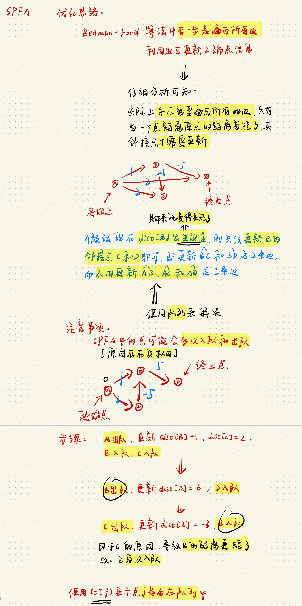

**代码**

```c++
#include <iostream>
#include <cstring>
#include <queue>
using namespace std;
const int N = 1e5 + 10, INF = 0x3f3f3f3f;
int n, m, idx;
queue<int> q;
int h[N], e[N], w[N], ne[N], dist[N], st[N];
void add(int a, int b, int c) {
    e[idx] = b;
    w[idx] = c;
    ne[idx] = h[a];
    h[a] = idx ++;
    return;
}
int spfa() {
    // 初始化距离
    memset(dist, 0x3f, sizeof dist);
    // 源点距离为0
    dist[1] = 0;
    // 将源点入队
    q.push(1);
    // 标记1号点已经在队列中
    st[1] = true;
    while (q.size()) {
        int t = q.front(); q.pop();
        // 标记1号点已经出队列
        st[t] = false;
        for (int i = h[t]; i != -1; i = ne[i]) {
            int j = e[i];
            // 不断更新最小距离
            if (dist[j] > dist[t] + w[i]) {
                dist[j] = dist[t] + w[i];
                // 如果当前点j不在队列中
                // 入队
                // 标记其在队列中
                if (!st[j]) {
                    st[j] = true;
                    q.push(j);
                }
            }
        }
    }
    if (dist[n] > INF / 2) return INF;
    return dist[n];
}
int main() {
    scanf("%d%d", &n, &m);
    memset(h, -1, sizeof h);
    for (int i = 0; i < m; i ++ ) {
        int u, v, w;
        scanf("%d%d%d", &u, &v, &w);
        add(u, v, w);
    }
    int t = spfa();
    if (t == INF) puts("impossible");
    else cout << t << endl;
    return 0;
}
```

**时间复杂度**

$最坏时间复杂度O(n^2)$

**空间复杂度**

$O(n)$

**标签**

`spfa`

**缝合怪**

### [AcWing 852. spfa判断负环](https://www.acwing.com/problem/content/854/)

**题目描述**

>   给定一个 `n` 个点 `m` 条边的有向图，图中可能存在重边和自环， **边权可能为负数**。
>
>   请你判断图中是否存在负权回路。

**输入格式**

>   第一行包含整数 `n` 和 `m`。
>
>   接下来 `m` 行每行包含三个整数 `x,y,z`，表示存在一条从点 `x` 到点 `y` 的有向边，边长为 `z`。

**输出格式**

>   如果图中**存在**负权回路，则输出 `Yes`，否则输出 `No`。

**数据范围**

>   +   $1≤n≤2000,$
>   +   $1≤m≤10000,$
>   +   $图中涉及边长绝对值均不超过 10000。$

**输入样例**

```c++
3 3
1 2 -1
2 3 4
3 1 -4
```

**输出样例**

```c++
Yes
```

**手写稿**

>   1.   如果某个点被更新的次数大于等于 `n`，说明一定存在负环

**代码**

```c++
#include <iostream>
#include <cstring>
#include <queue>
using namespace std;
const int N = 2010, M = 10010;
int n, m, idx;
int h[N], dist[N], cnt[N], st[N], e[M], w[M], ne[M];
queue<int> q;
void add(int a, int b, int c) {
    e[idx] = b;
    w[idx] = c;
    ne[idx] = h[a];
    h[a] = idx ++;
    return;
}
bool spfa() {
    for (int i = 1; i <= n; i ++ ) {
        q.push(i);
        st[i] = true;
    }
    while (q.size()) {
        int t = q.front(); q.pop();
        st[t] = false;
        for (int i = h[t]; i != -1; i = ne[i]) {
            int j = e[i];
            if (dist[j] > dist[t] + w[i]) {
                dist[j] = dist[t] + w[i];
                // 记录每个点被更新的次数
                cnt[j] = cnt[t] + 1;
                // 如果被更新的次数大于等于n，说明存在环
        		if (cnt[j] >= n) return true;
                if (!st[j]) {
                    st[j] = true;
                    q.push(j);
                }
            }
        }
    }
    return false;
}
int main() {
    scanf("%d%d", &n, &m);
    memset(h, -1, sizeof h);
    for (int i = 0; i < m; i ++ ) {
        int u, v, w;
        scanf("%d%d%d", &u, &v, &w);
        add(u, v, w);
    }
    if(spfa()) puts("Yes");
    else puts("No");
    return 0;
}
```

**时间复杂度**

$O(nm)$

**空间复杂度**

$O(m)$

**标签**

`SPFA判负环`

**缝合怪**


## 单源最短路的建图方式

### [AcWing 1129. 热浪](https://www.acwing.com/problem/content/1131/)

**题目描述**

>   德克萨斯纯朴的民众们这个夏天正在遭受巨大的热浪！！！
>
>   他们的德克萨斯长角牛吃起来不错，可是它们并不是很擅长生产富含奶油的乳制品。
>
>   农夫 `John` 此时身先士卒地承担起向德克萨斯运送大量的营养冰凉的牛奶的重任，以减轻德克萨斯人忍受酷暑的痛苦。
>
>   `John` 已经研究过可以把牛奶从威斯康星运送到德克萨斯州的路线。
>
>   这些路线包括起始点和终点一共有 `T` 个城镇，为了方便标号为 `1` 到 `T`。
>
>   除了起点和终点外的每个城镇都由 **双向道路** 连向至少两个其它的城镇。
>
>   每条道路有一个通过费用（包括油费，过路费等等）。
>
>   给定一个地图，包含 ``C`` 条直接连接 `2` 个城镇的道路。
>
>   每条道路由道路的起点 $R_s$，终点 $R_e$ 和花费 $C_i$ 组成。
>
>   求从起始的城镇 $T_s$ 到终点的城镇 $T_e$ 最小的总费用。

**输入格式**

>   第一行: `4` 个由空格隔开的整数: $T,C,T_s,T_e$;
>
>   第 `2` 到第 `C + 1` 行: 第 `i + 1` 行描述第 `i` 条道路，包含 `3` 个由空格隔开的整数: $R_s,R_e,C_i$。

**输出格式**

>   一个单独的整数表示从 $T_s$ 到 $T_e$ 的最小总费用。
>
>   数据保证至少存在一条道路。

**数据范围**

>   +   $1 ≤ T ≤ 2500,$
>   +   $1 ≤ C ≤ 6200,$
>   +   $1 ≤ T_s, T_e, R_s, R_e ≤ T,$
>   +   $1 ≤ C_i ≤ 1000$

**输入样例**

```c++
7 11 5 4
2 4 2
1 4 3
7 2 2
3 4 3
5 7 5
7 3 3
6 1 1
6 3 4
2 4 3
5 6 3
7 2 1
```

**输出样例**

```c++
7
```

**手写稿**

>   1.   缝合怪 ==> `spfa`
>   2.   缝合怪 ==> 循环队列
>
>   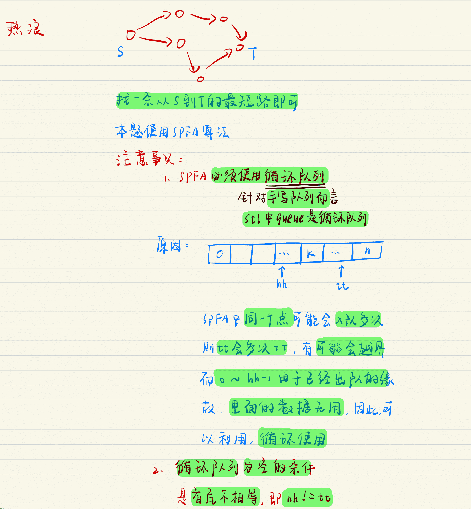

**代码**

```c++
#include <iostream>
#include <cstring>
using namespace std;
const int N = 2510, M = 6200 * 2 + 10;
int n, m, S, T, idx;
int h[N], e[M], w[M], ne[M], st[N], dist[N], q[N];
void add(int a, int b, int c) {
    e[idx] = b;
    w[idx] = c;
    ne[idx] = h[a];
    h[a] = idx ++;
    return;
}
void spfa() {
    memset(dist, 0x3f, sizeof dist);
    memset(st, false, sizeof st);
    // 循环队列队头队尾初始化为0
    int hh = 0, tt = 0;
    dist[S] = 0;
    // 队尾指针永远指向[最后一个位置]的[下一个位置]
    q[tt ++ ] = S;
    st[S] = true;
    // 循环队列判空条件 hh == tt
    // 循环队列判满条件 (tt + 1) % 长度 == hh
    while (hh != tt) {
        int t = q[hh ++ ];
        // 队头越界, 则重置为0
        if (hh >= N) hh = 0;
        st[t] = false;
        for (int i = h[t]; i != -1; i = ne[i]) {
            int j = e[i];
            if (dist[j] > dist[t] + w[i]) {
                dist[j] = dist[t] + w[i];
                if (!st[j]) {
                    st[j] = true;
                    // 队尾越界, 则重置为0
                    if (tt >= N) tt = 0;
                    q[tt ++ ] = j;
                }
            }
        }
    }
    return;
}
int main() {
    scanf("%d%d%d%d", &n, &m, &S, &T);
    memset(h, -1, sizeof h);
    for (int i = 0; i < m; i ++ ) {
        int u, v, w;
        scanf("%d%d%d", &u, &v, &w);
        add(u, v, w);
        add(v, u, w);
    }
    spfa();
    cout << dist[T] << endl;
    return 0;
}
```

**时间复杂度**

$平均时间复杂度O(log_n), 最坏时间复杂度O(nm)$

**空间复杂度**

$O(m)$

**标签**

`最短路`、`SPFA`

**缝合怪**

[AcWing 851. spfa求最短路](#AcWing 851. spfa求最短路)、[LeetCode 622. 设计循环队列](#LeetCode 622. 设计循环队列)

### [AcWing 1128. 信使](https://www.acwing.com/problem/content/1130/)

**题目描述**

>   战争时期，前线有 `n` 个哨所，每个哨所可能会与其他若干个哨所之间有通信联系。
>
>   信使负责在哨所之间传递信息，当然，这是要花费一定时间的（以天为单位）。
>
>   指挥部设在第一个哨所。
>
>   当指挥部下达一个命令后，指挥部就派出若干个信使向与指挥部相连的哨所送信。
>
>   当一个哨所接到信后，这个哨所内的信使们也以同样的方式向其他哨所送信。**信在一个哨所内停留的时间可以忽略不计**。
>
>   直至所有 `n` 个哨所全部接到命令后，送信才算成功。
>
>   因为准备充足，每个哨所内都安排了足够的信使（如果一个哨所与其他 `k` 个哨所有通信联系的话，这个哨所内至少会配备 `k` 个信使）。
>
>   现在总指挥请你编一个程序，计算出完成整个送信过程最短需要多少时间。

**输入格式**

>   第 `1` 行有两个整数 `n` 和 `m`，中间用 `1` 个空格隔开，分别表示有 `n` 个哨所和 `m` 条通信线路。
>
>   第 `2` 至 `m+1` 行：每行三个整数 `i、j、k`，中间用 `1` 个空格隔开，表示第 `i` 个和第 `j` 个哨所之间存在 **双向** 通信线路，且这条线路要花费 `k` 天。

**输出格式**

>   一个整数，表示完成整个送信过程的最短时间。
>
>   如果不是所有的哨所都能收到信，就输出 `-1`。

**数据范围**

>   +   $1 ≤ n ≤ 100,$
>   +   $1 ≤ m ≤ 200,$
>   +   $1 ≤ k ≤ 1000$

**输入样例**

```c++
4 4
1 2 4
2 3 7
2 4 1
3 4 6
```

**输出样例**

```c++
11
```

**手写稿**

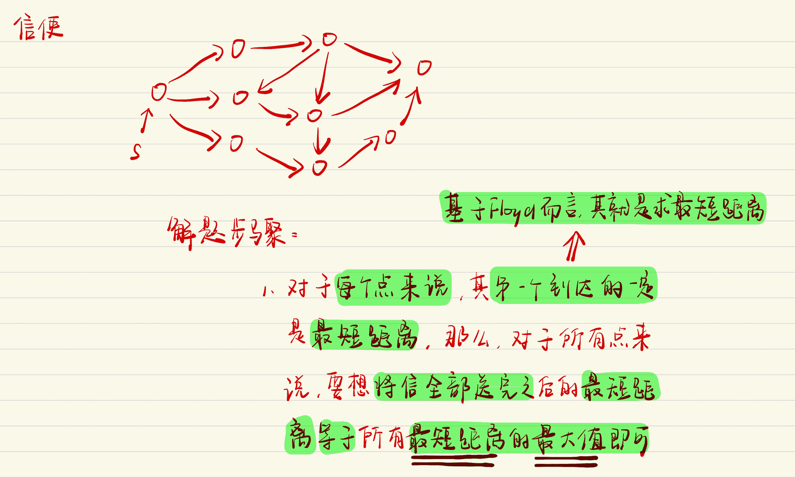

**代码**

```c++
#include <iostream>
#include <cstring>
using namespace std;
const int N = 110, INF = 0x3f3f3f3f;
int n, m;
int g[N][N];
int main() {
    scanf("%d%d", &n, &m);
    memset(g, 0x3f, sizeof g);
    for (int i = 1; i <= n; i ++ ) g[i][i] = 0;
    for (int i = 0; i < m; i ++ ) {
        int u, v, w;
        scanf("%d%d%d", &u, &v, &w);
        // 防止出现重边, 重边取最小值
        g[u][v] = g[v][u] = min(g[u][v], w);
    }
    // Floyd模板
    for (int k = 1; k <= n; k ++ )
        for (int i = 1; i <= n; i ++ )
            for (int j = 1; j <= n; j ++ )
                g[i][j] = min(g[i][j], g[i][k] + g[k][j]);
    // 记录答案
    int res = -1;
    for (int i = 1; i <= n; i ++ )
        // 取所有[最小值]中的[最大值], 即最小最大值
        res = max(res, g[1][i]);
    // 不连通, 输出-1
    if (res == INF) res = -1;
    cout << res << endl;
    return 0;
}
```

**时间复杂度**

$O(n^3)$

**空间复杂度**

$O(n^2)$

**标签**

`最短路`、`Floyd`

**缝合怪**


### [AcWing 1127. 香甜的黄油](https://www.acwing.com/problem/content/1129/)

**题目描述**

>   农夫 `John` 发现了做出全威斯康辛州最甜的黄油的方法：糖。
>
>   把糖放在一片牧场上，他知道 `N` 只奶牛会过来舔它，这样就能做出能卖好价钱的超甜黄油。
>
>   当然，他将付出额外的费用在奶牛上。
>
>   农夫 `John` 很狡猾，就像以前的巴甫洛夫，他知道他可以训练这些奶牛，让它们在听到铃声时去一个特定的牧场。
>
>   他打算将糖放在那里然后下午发出铃声，以至他可以在晚上挤奶。
>
>   农夫 `John` 知道每只奶牛都在各自喜欢的牧场（一个牧场不一定只有一头牛）。
>
>   给出各头牛在的牧场和牧场间的路线，找出使所有牛到达的路程和最短的牧场（他将把糖放在那）。
>
>   **数据保证至少存在一个牧场和所有牛所在的牧场连通**。

**输入格式**

>   第一行: 三个数：奶牛数 `N`，牧场数 `P`，牧场间道路数 `C`。
>
>   第二行到第 `N + 1` 行: `1` 到 `N` 头奶牛所在的牧场号。
>
>   第 `N + 2` 行到第 `N + C + 1` 行：每行有三个数：相连的牧场`A、B`，两牧场间距 `D`，当然，连接是双向的。

**输出格式**

>   共一行，输出奶牛必须行走的最小的距离和。

**数据范围**

>   +   $1 ≤ N ≤ 500,$
>   +   $2 ≤ P ≤ 800,$
>   +   $1 ≤ C ≤ 1450,$
>   +   $1 ≤ D ≤ 255$

**输入样例**

```c++
3 4 5
2
3
4
1 2 1
1 3 5
2 3 7
2 4 3
3 4 5
```

**输出样例**

```c++
8
```

**手写稿**

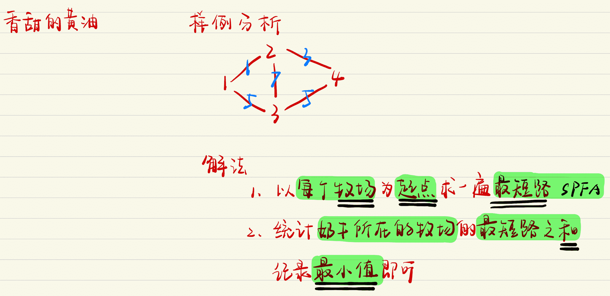

**代码**

```c++
#include <iostream>
#include <cstring>
using namespace std;
const int N = 810, M = 3000, INF = 0x3f3f3f3f;
int n, p, m, idx;
int id[N], h[N], e[M], w[M], ne[M], st[N], dist[N], q[N];
void add(int a, int b, int c) {
    e[idx] = b;
    w[idx] = c;
    ne[idx] = h[a];
    h[a] = idx ++;
    return;
}
int spfa(int start) {
    memset(dist, 0x3f, sizeof dist);
    memset(st, false, sizeof st);
    int hh = 0, tt = 0;
    // 起点到起点的距离为0
    dist[start] = 0;
    // 将起点入队
    q[tt ++ ] = start;
    // 将当前点标记为已经在队列中, 即入队
    st[start] = true;
    while (hh != tt) {
        int t = q[hh ++ ];
        // 越界, 则从0开始
        if (hh == N) hh = 0;
        // 将当前点标记为不在对列中, 即出队
        st[t] = false;
        for (int i = h[t]; i != -1; i = ne[i]) {
            int j = e[i];
            // 更新距离
            if (dist[j] > dist[t] + w[i]) {
                dist[j] = dist[t] + w[i];
                // 如果当前点不在队中
                if (!st[j]) {
                    // 入队
                    q[tt ++ ] = j;
                    // 越界, 则从0开始
                    if (tt == N) tt = 0;
                    // 标记当前点在队列中, 即入队
                    st[j] = true;
                }
            }
        }
    }
    int res = 0;
    for (int i = 1; i <= n; i ++ ) {
        // 获取奶牛所在的牧场号
        int j = id[i];
        // 不可达, 则直接返回
        if (dist[j] == INF) return INF;
        // 加上距离即可
        res += dist[j];
    }
    return res;
}
int main() {
    scanf("%d%d%d", &n, &p, &m);
    memset(h, -1, sizeof h);
    for (int i = 1; i <= n; i ++ )
        scanf("%d", &id[i]);
    for (int i = 0; i < m; i ++ ) {
        int u, v, w;
        scanf("%d%d%d", &u, &v, &w);
        add(u, v, w);
        add(v, u, w);
    }
    int res = INF;
    for (int i = 1; i <= p; i ++ )
        // 取最小距离和
        res = min(res, spfa(i));
    cout << res << endl;
    return 0;
}
```

**时间复杂度**

$O(nm), n是牧场数目, m是边的个数$

**空间复杂度**

$O(m), m是边数$

**标签**

`最短路`、`SPFA`

**缝合怪**

### [AcWing 1126. 最小花费](https://www.acwing.com/problem/content/1128/)

**题目描述**

>   在 `n` 个人中，某些人的银行账号之间可以互相转账。
>
>   这些人之间转账的手续费各不相同。
>
>   给定这些人之间转账时需要从转账金额里扣除百分之几的手续费，请问 `A` 最少需要多少钱使得转账后 `B` 收到 `100` 元。

**输入格式**

>   第一行输入两个正整数 `n,m`，分别表示总人数和可以互相转账的人的对数。
>
>   以下 `m` 行每行输入三个正整数 `x,y,z`，表示标号为 `x` 的人和标号为 `y` 的人之间互相转账需要扣除 `z%` 的手续费 ( `z < 100` )。
>
>   最后一行输入两个正整数 `A, B`。
>
>   数据保证 `A` 与 `B` 之间可以直接或间接地转账。

**输出格式**

>   输出 `A` 使得 `B` 到账 `100` 元最少需要的总费用。
>
>   精确到小数点后 `8` 位。

**数据范围**

>   +   $1 ≤ n ≤ 2000,$
>   +   $m ≤ 10^5$

**输入样例**

```c++
3 3
1 2 1
2 3 2
1 3 3
1 3
```

**输出样例**

```c++
103.07153164
```

**手写稿**

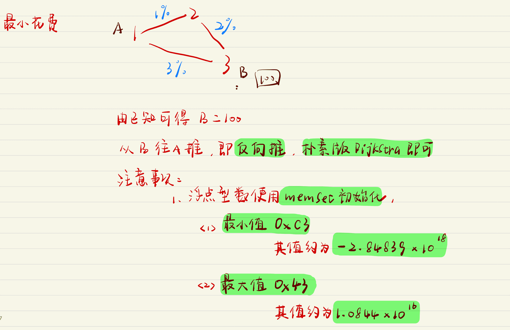

**代码**

```c++
#include <iostream>
#include <cstring>
using namespace std;
const int N = 2010, INF = 0x43434343;
int n, m;
int st[N];
double dist[N];
double g[N][N];
// 朴素版Dijkstra模板
// 注意: 数据类型
void dijkstra(int start, int end) {
    memset(dist, 0x43, sizeof dist);
    dist[start] = 100;
    for (int i = 0; i < n - 1; i ++ ) {
        int t = -1;
        for (int j = 1; j <= n; j ++ )
            if (!st[j] && (t == -1 || dist[t] > dist[j])) t = j;
        if (t == end) return;
        st[t] = true;
        for (int j = 1; j <= n; j ++ ) {
            if (g[t][j] == INF) continue;
            if (!st[j] && dist[j] > dist[t] / g[t][j])
                dist[j] = dist[t] / g[t][j];
        }
    }
    return;
}
int main() {
    scanf("%d%d", &n, &m);
    for (int i = 0; i < m; i ++ ) {
        int u, v, w;
        scanf("%d%d%d", &u, &v, &w);
        g[u][v] = g[v][u] = (100.0 - w) / 100;
    }
    int start, end;
    scanf("%d%d", &end, &start);
    // 反向Dijkstra
    dijkstra(start, end);
    printf("%.8lf\n", dist[end]);
    return 0;
}
```

**时间复杂度**

$O(n^2)$

**空间复杂度**

$O(n^2)$

**标签**

`朴素版Dijkstra`

**缝合怪**


### [AcWing 920. 最优乘车](https://www.acwing.com/problem/content/922/)

**题目描述**

>   `H` 城是一个旅游胜地，每年都有成千上万的人前来观光。
>
>   为方便游客，巴士公司在各个旅游景点及宾馆，饭店等地都设置了巴士站并开通了一些单程巴士线路。
>
>   每条单程巴士线路从某个巴士站出发，依次途经若干个巴士站，最终到达终点巴士站。
>
>   一名旅客最近到 `H` 城旅游，他很想去 `S` 公园游玩，但如果从他所在的饭店没有一路巴士可以直接到达 `S` 公园，则他可能要先乘某一路巴士坐几站，再下来换乘同一站台的另一路巴士，这样换乘几次后到达 `S` 公园。
>
>   现在用整数 `1, 2, … N` 给 `H` 城的所有的巴士站编号，约定这名旅客所在饭店的巴士站编号为 `1`，`S` 公园巴士站的编号为 `N`。
>
>   写一个程序，帮助这名旅客寻找一个最优乘车方案，使他在从饭店乘车到 `S` 公园的过程中换乘的次数最少。

**输入格式**

>   第一行有两个数字 `M` 和 `N`，表示开通了 `M` 条单程巴士线路，总共有 `N` 个车站。
>
>   从第二行到第 `M + 1` 行依次给出了第 `1` 条到第 `M` 条巴士线路的信息，其中第 `i + 1` 行给出的是第 `i` 条巴士线路的信息，从左至右按运行顺序依次给出了该线路上的所有站号，相邻两个站号之间用一个空格隔开。

**输出格式**

>   共一行，如果无法乘巴士从饭店到达 `S` 公园，则输出 `NO`，否则输出最少换乘次数，换乘次数为 `0` 表示不需换车即可到达。

**数据范围**

>   +   $1 ≤ M ≤ 100,$
>   +   $2 ≤ N ≤ 500$

**输入样例**

```c++
3 7
6 7
4 7 3 6
2 1 3 5
```

**输出样例**

```c++
2
```

**手写稿**

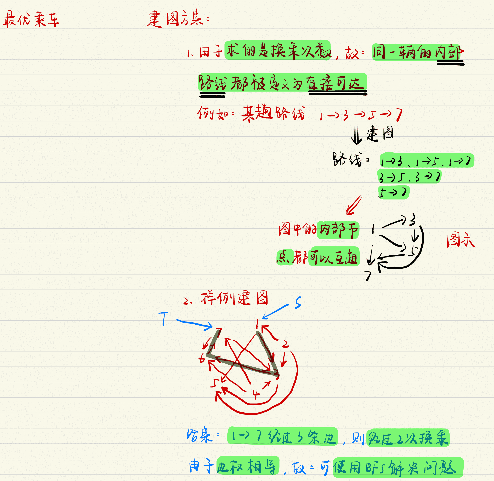

**代码**

```c++
#include <iostream>
#include <cstring>
#include <sstream>
using namespace std;
const int N = 510, INF = 0x3f3f3f3f;
int n, m;
int stop[N], q[N], dist[N], st[N];
bool g[N][N];
// BFS模板
void bfs() {
    memset(dist, 0x3f, sizeof dist);
    int hh = 0, tt = -1;
    q[++ tt ] = 1;
    st[1] = true;
    dist[1] = 0;
    while (hh <= tt) {
        int t = q[hh ++ ];
        if (t == n) return;
        for (int i = 1; i <= n; i ++ )
            if (!st[i] && g[t][i] && dist[i] > dist[t] + 1) {
                dist[i] = dist[t] + 1;
                q[++ tt] = i;
                st[i] = true;
            }
    }
    return;
}
int main() {
    scanf("%d%d", &m, &n);
    string line;
    // 由于不知道要输入多少个数
    // 使用stringstream来处理输入
    getline(cin, line);
    while (m -- ) {
        int cnt = 0, t = 0;
        getline(cin, line);
        stringstream ssin(line);
        while (ssin >> t) stop[cnt ++ ] = t;
        for (int i = 0; i < cnt; i ++ )
            for (int j = i + 1; j < cnt; j ++ )
                // 两个点之间有单向边
                g[stop[i]][stop[j]] = true;
    }
    bfs();
    if (dist[n] == INF) puts("NO");
    else cout << max(dist[n] - 1, 0) << endl;
    return 0;
}
```

**时间复杂度**

$O(mn^2)$

**空间复杂度**

$O(n^2)$

**标签**

`最短路`、`BFS`

**缝合怪**


### [AcWing 903. 昂贵的聘礼](https://www.acwing.com/problem/content/905/)

**题目描述**

>   年轻的探险家来到了一个印第安部落里。
>
>   在那里他和酋长的女儿相爱了，于是便向酋长去求亲。
>
>   酋长要他用 `10000` 个金币作为聘礼才答应把女儿嫁给他。
>
>   探险家拿不出这么多金币，便请求酋长降低要求。
>
>   酋长说：”嗯，如果你能够替我弄到大祭司的皮袄，我可以只要 `8000` 金币。如果你能够弄来他的水晶球，那么只要 `5000` 金币就行了。”
>
>   探险家就跑到大祭司那里，向他要求皮袄或水晶球，大祭司要他用金币来换，或者替他弄来其他的东西，他可以降低价格。
>
>   探险家于是又跑到其他地方，其他人也提出了类似的要求，或者直接用金币换，或者找到其他东西就可以降低价格。
>
>   不过探险家没必要用多样东西去换一样东西，因为不会得到更低的价格。
>
>   探险家现在很需要你的帮忙，让他用最少的金币娶到自己的心上人。
>
>   另外他要告诉你的是，在这个部落里，等级观念十分森严。
>
>   地位差距超过一定限制的两个人之间不会进行任何形式的直接接触，包括交易。
>
>   他是一个外来人，所以可以不受这些限制。
>
>   但是如果他和某个地位较低的人进行了交易，地位较高的的人不会再和他交易，他们认为这样等于是间接接触，反过来也一样。
>
>   因此你需要在考虑所有的情况以后给他提供一个最好的方案。
>
>   为了方便起见，我们把所有的物品从 `1` 开始进行编号，酋长的允诺也看作一个物品，并且编号总是 `1`。
>
>   每个物品都有对应的价格 `P`，主人的地位等级 `L`，以及一系列的替代品 $T_i$ 和该替代品所对应的”优惠” $V_i$。
>
>   如果两人地位等级差距超过了 `M`，就不能”间接交易”。
>
>   你必须根据这些数据来计算出探险家最少需要多少金币才能娶到酋长的女儿。

**输入格式**

>   输入第一行是两个整数 `M，N`，依次表示地位等级差距限制和物品的总数。
>
>   接下来按照编号从小到大依次给出了 `N` 个物品的描述。
>
>   每个物品的描述开头是三个非负整数 `P、L、X`，依次表示该物品的价格、主人的地位等级和替代品总数。
>
>   接下来 `X` 行每行包括两个整数 `T` 和 `V`，分别表示替代品的编号和”优惠价格”。

**输出格式**

>   输出最少需要的金币数。

**数据范围**

>   +   $1 ≤ N ≤ 100,$
>   +   $1 ≤ P ≤ 10000,$
>   +   $1 ≤ L, M ≤ N$
>   +   $0 ≤ X < N$

**输入格式**

```c++
1 4
10000 3 2
2 8000
3 5000
1000 2 1
4 200
3000 2 1
4 200
50 2 0
```

**输出格式**

```c++
5250
```

**手写稿**

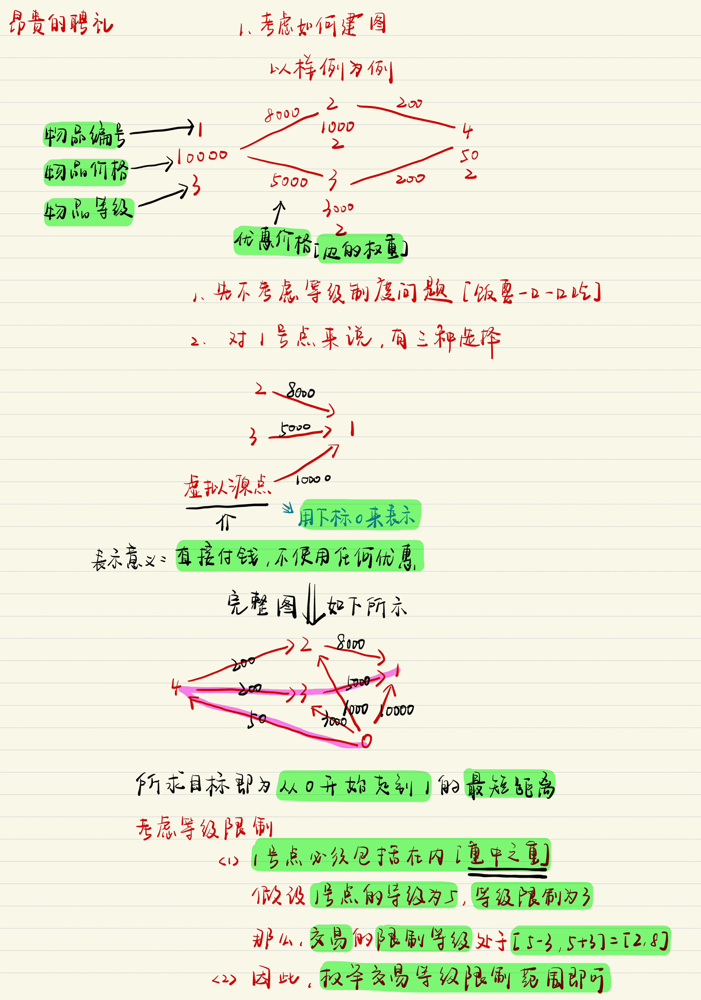

**代码**

```c++
#include <iostream>
#include <cstring>
using namespace std;
const int N = 110, INF = 0x3f3f3f3f;
int n, m;
int pce[N], lev[N], dist[N], st[N];
int g[N][N];
// Dijkstra模板
int dijkstra(int down, int up) {
    memset(dist, 0x3f, sizeof dist);
    memset(st, false, sizeof st);
    dist[0] = 0;
    for (int i = 1; i <= n; i ++ ) {
        int t = -1;
        for (int j = 0; j <= n; j ++ )
            if (!st[j] && (t == -1 || dist[t] > dist[j])) t = j;
        st[t] = true;
        if (t == 1) return dist[1];
        for (int j = 0; j <= n; j ++ )
            // 注意: 判断等级范围
            if (!st[j] && lev[j] >= down && lev[j] <= up && g[t][j] != INF && dist[j] > dist[t] + g[t][j])
                dist[j] = dist[t] + g[t][j];
    }
    return dist[1];
}
int main() {
    scanf("%d%d", &m, &n);
    memset(g, 0x3f, sizeof g);
    for (int i = 0; i <= n; i ++ ) g[i][i] = 0;
    for (int i = 1, cnt; i <= n; i ++ ) {
        scanf("%d%d%d", &pce[i], &lev[i], &cnt);
        // 0号点是超级源点
        // 取最小值, 防止重边
        g[0][i] = min(g[0][i], pce[i]);
        while (cnt -- ) {
            int id, price;
            scanf("%d%d", &id, &price);
            // 取最小值, 防止重边
            g[id][i] = min(g[id][i], price);
        }
    }
    int res = INF;
    // 枚举等级制度范围
    for (int i = lev[1] - m; i <= lev[1]; i ++ )
        res = min(res, dijkstra(i, i + m));
    cout << res << endl;
    return 0;
}
```

**时间复杂度**

$O(n^2m)$

**空间复杂度**

$O(n^2)$

**标签**

`建图`、`Dijkstra`、`最短路`

**缝合怪**


## 单源最短路的综合应用

### [AcWing 1135. 新年好](https://www.acwing.com/problem/content/1137/)

**题目描述**

>   重庆城里有 `n` 个车站，`m` 条 **双向** 公路连接其中的某些车站。
>
>   每两个车站最多用一条公路连接，从任何一个车站出发都可以经过一条或者多条公路到达其他车站，但不同的路径需要花费的时间可能不同。
>
>   在一条路径上花费的时间等于路径上所有公路需要的时间之和。
>
>   佳佳的家在车站 `1`，他有五个亲戚，分别住在车站 `a,b,c,d,e`。
>
>   过年了，他需要从自己的家出发，拜访每个亲戚（顺序任意），给他们送去节日的祝福。
>
>   怎样走，才需要最少的时间？

**输入格式**

>   第一行：包含两个整数 `n,m`，分别表示车站数目和公路数目。
>
>   第二行：包含五个整数 `a,b,c,d,e`，分别表示五个亲戚所在车站编号。
>
>   以下 `m` 行，每行三个整数 `x,y,t`，表示公路连接的两个车站编号和时间。

**输出格式**

>   输出仅一行，包含一个整数 `T`，表示最少的总时间。

**数据范围**

>   +   $1 ≤ n ≤ 50000,$
>   +   $1 ≤ m ≤ 10^5,$
>   +   $1 < a, b, c, d, e ≤ n,$
>   +   $1 ≤ x, y ≤ n,$
>   +   $1 ≤ t ≤ 100$

**输入样例**

```c++
6 6
2 3 4 5 6
1 2 8
2 3 3
3 4 4
4 5 5
5 6 2
1 6 7
```

**输出样例**

```c++
21
```

**手写稿**

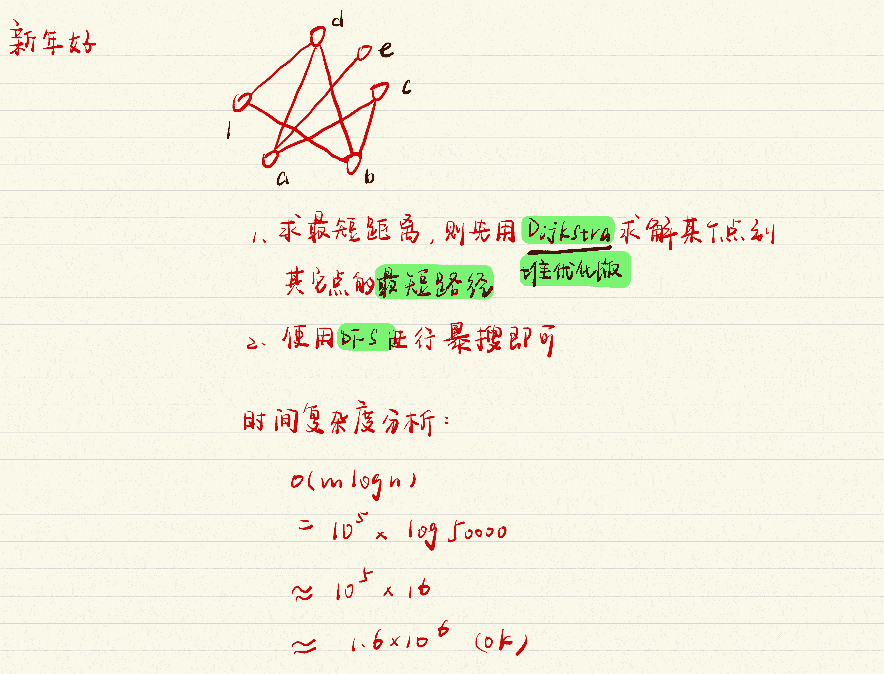

**代码**

```c++
#include <iostream>
#include <cstring>
#include <queue>
#define x first
#define y second
using namespace std;
typedef pair<int, int> PII;
const int N = 50010, M = 200010, INF = 0x3f3f3f3f;
int n, m, idx;
int rel[6], h[N], e[M], w[M], ne[M], st[N];
int dist[6][N];
void add(int a, int b, int c) {
    e[idx] = b;
    w[idx] = c;
    ne[idx] = h[a];
    h[a] = idx ++;
    return;
}
// 数组传的都是指针
void dijkstra(int start, int dist[]) {
    // 注意: 这里的初始化方式有些不同, 使用N * 4, 一个整数占据4个字节
    // 不能使用sizeof dist, 因为, 二维数组的原因
    memset(dist, 0x3f, N * 4);
    memset(st, false, sizeof st);
    priority_queue<PII, vector<PII>, greater<PII>> heap;
    dist[start] = 0;
    heap.push({0, start});
    while (heap.size()) {
        auto t = heap.top(); heap.pop();
        int v = t.y;
        st[v] = true;
        for (int i = h[v]; i != -1; i = ne[i]) {
            int j = e[i];
            if (!st[j] && dist[j] > dist[v] + w[i]) {
                dist[j] = dist[v] + w[i];
                heap.push({dist[j], j});
            }
        }
    }
    return;
}
/*
参数:
    参数1: 当前已经访问过的亲戚数量
    参数2: 当前正在访问的亲戚编号
    参数3: 当前的花费
*/
int dfs(int u, int start, int cost) {
    int res = INF;
    if (u == 5) {
        res = min(res, cost);
        return cost;
    }
    for (int i = 1; i <= 5; i ++ )
        if (!st[i]) {
            st[i] = true;
            int next = rel[i];
            res = min(res, dfs(u + 1, i, cost + dist[start][next]));
            st[i] = false;
        }
    return res;
}
int main() {
    scanf("%d%d", &n, &m);
    memset(h, -1, sizeof h);
    rel[0] = 1;
    // 记录亲戚所处的车站编号
    for (int i = 1; i <= 5; i ++ )
        scanf("%d", &rel[i]);
    for (int i = 0; i < m; i ++ ) {
        int a, b, c;
        scanf("%d%d%d", &a, &b, &c);
        add(a, b, c);
        add(b, a, c);
    }
    // 计算亲戚所在的车站到其他车站的最短路径
    for (int i = 0; i <= 5; i ++ )
        dijkstra(rel[i], dist[i]);
    memset(st, false,sizeof st);
    /*
    参数:
        参数1: 当前已经访问过的亲戚数量
        参数2: 当前正在访问的亲戚编号
        参数3: 当前的花费
    */
    cout << dfs(0, 0, 0) << endl;
    return 0;
}
```

**时间复杂度**

$O(mlog_n)$

**空间复杂度**

$O(m)$

**标签**

`Dijkstra`、`DFS`

**缝合怪**

[AcWing 850. Dijkstra求最短路 II](#AcWing 850. Dijkstra求最短路 II)

### [AcWing 340. 通信线路](https://www.acwing.com/problem/content/342/)

**题目描述**

>   在郊区有 `N` 座通信基站，`P` 条 **双向** 电缆，第 `i` 条电缆连接基站 $A_i$ 和 $B_i$。
>
>   特别地，`1` 号基站是通信公司的总站，`N` 号基站位于一座农场中。
>
>   现在，农场主希望对通信线路进行升级，其中升级第 `i` 条电缆需要花费 $L_i$。
>
>   电话公司正在举行优惠活动。
>
>   农产主可以指定一条从 `1` 号基站到 `N` 号基站的路径，并指定路径上不超过 `K` 条电缆，由电话公司免费提供升级服务。
>
>   农场主只需要支付在该路径上剩余的电缆中，升级价格最贵的那条电缆的花费即可。
>
>   求至少用多少钱可以完成升级。

**输入格式**

>   第 `1` 行：三个整数 `N，P，K`。
>
>   第 `2..P + 1` 行：第 `i + 1` 行包含三个整数 $A_i,B_i,L_i$。

**输出格式**

>   包含一个整数表示最少花费。
>
>   若 `1` 号基站与 `N` 号基站之间不存在路径，则输出 `−1`。

**数据范围**

>   +   $0 ≤ K < N ≤ 1000,$
>   +   $1 ≤ P ≤ 10000,$
>   +   $1 ≤ L_i ≤ 1000000$

**输入样例**

```c++
5 7 1
1 2 5
3 1 4
2 4 8
3 2 3
5 2 9
3 4 7
4 5 6
```

**输出样例**

```c++
4
```

**手写稿**

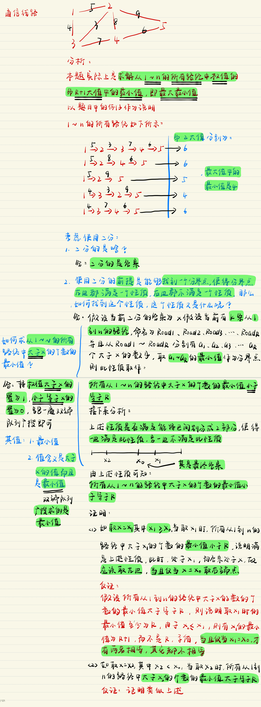

**代码**

```c++
#include <iostream>
#include <cstring>
#include <deque>
using namespace std;
const int N = 1010, M = 20010;
int n, m, k, idx;
int h[N], e[M], w[M], ne[M], st[N], dist[N];
void add(int a, int b, int c) {
    e[idx] = b;
    w[idx] = c;
    ne[idx] = h[a];
    h[a] = idx ++;
    return;
}
// 双端队列模板
bool check(int x) {
    deque<int> q;
    // 初始化
    memset(st, 0, sizeof st);
    memset(dist, 0x3f, sizeof dist);
    dist[1] = 0;
    q.push_back(1);
    st[1] = true;
    while (q.size()) {
        int t = q.front(); q.pop_front();
        for (int i = h[t]; i != -1; i = ne[i]) {
            int j = e[i], v = w[i] > x; // 权值w > x
            if (!st[j] && dist[j] > dist[t] + v) {
                dist[j] = dist[t] + v;
                q.push_back(j);
            }
        }
    }
    return dist[n] <= k; // 性质是最小值小于等于k
}
int main() {
    scanf("%d%d%d", &n, &m, &k);
    memset(h, -1, sizeof h);
    for (int i = 0; i < m; i ++ ) {
        int a, b, c;
        scanf("%d%d%d", &a, &b, &c);
        add(a, b, c);
        add(b, a, c);
    }
    // 二分的是答案
    int l = 0, r = 1e6 + 1;
    while (l < r) {
        int mid = l + r >> 1;
        // 符合条件, 说明是在答案右边, 故, 缩小范围
        // 具体手写稿
        if (check(mid)) r = mid;
        else l = mid + 1;
    }
    if (r == 1e6 + 1) r = -1;
    cout << r << endl;
    return 0;
}
```

**时间复杂度**

$O(plogL)$

**空间复杂度**

$O(m)$

**标签**

`最短路`、`二分`

**缝合怪**


### [AcWing 342. 道路与航线](https://www.acwing.com/problem/content/344/)

**题目描述**

>   农夫约翰正在一个新的销售区域对他的牛奶销售方案进行调查。
>
>   他想把牛奶送到 `T` 个城镇，编号为 `1 ∼ T`。
>
>   这些城镇之间通过 `R` 条道路 (编号为 `1` 到 `R`) 和 `P` 条航线 (编号为 `1` 到 `P`) 连接。
>
>   每条道路 `i` 或者航线 `i` 连接城镇 $A_i$ 到 $B_i$，花费为 $C_i$。
>
>   对于道路，$0 ≤ C_i ≤ 10,000$;然而航线的花费很神奇，花费 $C_i$ 可能是负数$(−10,000 ≤ C_i ≤ 10,000)$。
>
>   道路是双向的，可以从 $A_i$ 到 $B_i$，也可以从 $B_i$ 到 $A_i$，花费都是 $C_i$。
>
>   然而航线与之不同，只可以从 $A_i$ 到 $B_i$。
>
>   事实上，由于最近恐怖主义太嚣张，为了社会和谐，出台了一些政策：保证如果有一条航线可以从 $A_i$ 到 $B_i$，那么保证不可能通过一些道路和航线从 $B_i$ 回到 $A_i$。
>
>   由于约翰的奶牛世界公认十分给力，他需要运送奶牛到每一个城镇。
>
>   他想找到从发送中心城镇 `S` 把奶牛送到每个城镇的最便宜的方案。

**输入格式**

>   第一行包含四个整数 `T,R,P,S`。
>
>   接下来 `R` 行，每行包含三个整数（表示一个道路）$A_i,B_i,C_i$。
>
>   接下来 `P` 行，每行包含三个整数（表示一条航线）$A_i,B_i,C_i$。

**输出格式**

>   第 $1 .. T$ 行：第 `i` 行输出从 `S` 到达城镇 `i` 的最小花费，如果不存在，则输出 `NO PATH`。

**数据范围**

>   +   $1 ≤ T ≤ 25000,$
>   +   $1 ≤ R, P ≤ 50000,$
>   +   $1 ≤ A_i, B_i, S ≤ T$

**输入样例**

```c++
6 3 3 4
1 2 5
3 4 5
5 6 10
3 5 -100
4 6 -100
1 3 -10
```

**输出样例**

```c++
NO PATH
NO PATH
5
0
-95
-100
```

**手写稿**


**代码**

```c++
#include <iostream>
#include <cstring>
#include <queue>
#include <vector>
#define x first
#define y second
using namespace std;
typedef pair<int, int> PII;
const int N = 25010, M = 150010, INF = 0x3f3f3f3f;
int n, mr, mp, S, idx, bcnt, hh, tt;
int h[N], e[M], w[M], ne[M], id[N], st[N], dist[N], q[N], din[N];
vector<int> block[N];
void add(int a, int b, int c) {
    e[idx] = b;
    w[idx] = c;
    ne[idx] = h[a];
    h[a] = idx ++;
    return;
}
void dfs(int u, int bid) {
    id[u] = bid;
    st[u] = true;
    block[bid].push_back(u);
    for (int i = h[u]; i != -1; i = ne[i]) {
        int j = e[i];
        // 如果j没有被访问过并且j没有被分组
        if (!st[j] && !id[j])
            dfs(j, bid);
    }
    st[u] = false;
    return;
}
void dijkstra(int bid) {
    priority_queue<PII, vector<PII>, greater<PII>> heap;
    // 将当前连通块中的城镇全部压入小根堆中
    for (auto t : block[bid])
        heap.push({dist[t], t});
    // 堆优化版dijkstra
    while (heap.size()) {
        auto t = heap.top(); heap.pop();
        int v = t.y;
        if (st[v]) continue;
        st[v] = true;
        // 访问邻接点
        for (int i = h[v]; i != -1; i = ne[i]) {
            int j = e[i];
            // 如果当前点v和其临接点j不属于同一个连通块
            // 说明j所在的连通块id[j]的入度需要➖1
            // 如果减到0, 则加入队列q
            if (id[v] != id[j] && -- din[id[j]] == 0) q[++tt] = id[j];
            // 更新距离
            if (dist[j] > dist[v] + w[i]) {
                dist[j] = dist[v] + w[i];
                // 注意: 这里只有同属一个连通块的时候才加入优先队列
                // 同一个连通块内部都是道路, 道路的权值是非负的
                if (id[j] == id[v]) heap.push({dist[j], j});
            }
        }
    }
    return;
}
void topsort() {
    hh = 0, tt = -1;
    // 初始化为+∞
    memset(dist, 0x3f, sizeof dist);
    // 起点为0
    dist[S] = 0;
    for (int i = 1; i <= bcnt; i ++ )
        // 将所有入度为0的点加入队列q
        if (!din[i]) q[++ tt] = i;
    while (hh <= tt) {
        int t = q[hh ++ ];
        dijkstra(t);
    }
    return;
}
int main() {
    scanf("%d%d%d%d", &n, &mr, &mp, &S);
    memset(h, -1, sizeof h);
    for (int i = 0; i < mr; i ++ ) {
        int a, b, c;
        scanf("%d%d%d", &a, &b, &c);
        add(a, b, c);
        add(b, a, c);
    }
    for (int i = 1; i <= n; i ++ )
        if (!id[i])
            // 连通块编号从1开始
            dfs(i, ++ bcnt);
    for (int i = 0; i < mp; i ++ ) {
        int a, b, c;
        scanf("%d%d%d", &a, &b, &c);
        // b城镇所在的连通块入度➕1
        din[id[b]] ++;
        add(a, b, c);
    }
    topsort();
    for (int i = 1; i <= n; i ++ ) {
        // 因为有负权边, 因此, 判断其大于某个大值即可
        if (dist[i] > INF / 2) puts("NO PATH");
        else cout << dist[i] << endl;
    }
    return 0;
}
```

**时间复杂度**

$O(mlog_n)$

**空间复杂度**

$O(nm), m是连通块的数量$

**标签**

`最短路`、`拓扑排序`

**缝合怪**


### [AcWing 341. 最优贸易](https://www.acwing.com/problem/content/343/)

**题目描述**

>   `C` 国有 `n` 个大城市和 `m` 条道路，每条道路连接这 `n` 个城市中的某两个城市。
>
>   任意两个城市之间最多只有一条道路直接相连。
>
>   这 `m` 条道路中有一部分为单向通行的道路，一部分为双向通行的道路，双向通行的道路在统计条数时也计为 `1` 条。
>
>   `C` 国幅员辽阔，各地的资源分布情况各不相同，这就导致了同一种商品在不同城市的价格不一定相同。
>
>   但是，同一种商品在同一个城市的买入价和卖出价始终是相同的。
>
>   商人阿龙来到 `C` 国旅游。
>
>   当他得知“同一种商品在不同城市的价格可能会不同”这一信息之后，便决定在旅游的同时，利用商品在不同城市中的差价赚一点旅费。
>
>   设 `C` 国 `n` 个城市的标号从` 1 ∼ n`，阿龙决定从 `1` 号城市出发，并最终在 `n` 号城市结束自己的旅行。
>
>   在旅游的过程中，任何城市可以被重复经过多次，但不要求经过所有 `n` 个城市。
>
>   阿龙通过这样的贸易方式赚取旅费：他会选择一个经过的城市买入他最喜欢的商品——水晶球，并在之后经过的另一个城市卖出这个水晶球，用赚取的差价当做旅费。
>
>   因为阿龙主要是来 `C` 国旅游，他决定这个贸易只进行最多一次，当然，在赚不到差价的情况下他就无需进行贸易。
>
>   现在给出 `n` 个城市的水晶球价格，`m` 条道路的信息（每条道路所连接的两个城市的编号以及该条道路的通行情况）。
>
>   请你告诉阿龙，他最多能赚取多少旅费。
>
>   注意：本题数据有加强。

**输入格式**

>   第一行包含 `2` 个正整数 `n` 和 `m`，中间用一个空格隔开，分别表示城市的数目和道路的数目。
>
>   第二行 `n` 个正整数，每两个整数之间用一个空格隔开，按标号顺序分别表示这 ``n`` 个城市的商品价格。
>
>   接下来 `m` 行，每行有 `3` 个正整数，`x，y，z`，每两个整数之间用一个空格隔开。
>
>   如果 `z = 1`，表示这条道路是城市 `x` 到城市 `y` 之间的单向道路；如果 `z = 2`，表示这条道路为城市 `x` 和城市 `y` 之间的双向道路。

**输出格式**

>   一个整数，表示答案。

**数据范围**

>   +   $1 ≤ n ≤ 100000,$
>   +   $1 ≤ m ≤ 500000,$
>   +   $1 ≤ 各城市水晶球价格 ≤ 100$

**输入样例**

```c++
5 5
4 3 5 6 1
1 2 1
1 4 1
2 3 2
3 5 1
4 5 2
```

**输出样例**

```c++
5
```

**手写稿**

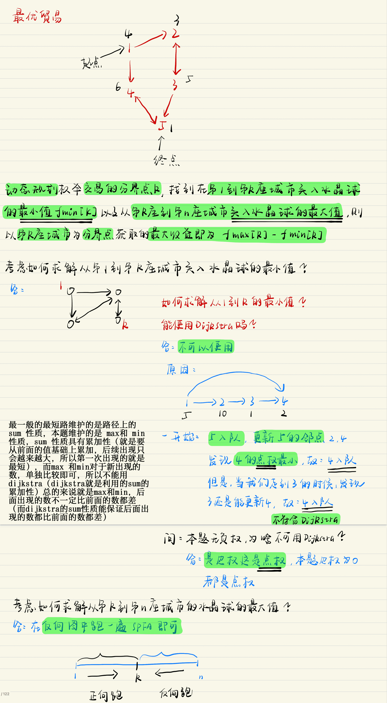

**代码**

```c++
#include <iostream>
#include <cstring>
using namespace std;
const int N = 100010, M = 2000010;
int n, m, idx;
int w[N], h[N], rh[N], e[M], ne[M], fmin[N], fmax[N], q[N], st[N];
void add(int h[], int a, int b) {
    e[idx] = b;
    ne[idx] = h[a];
    h[a] = idx ++;
    return;
}
void spfa(int dist[], int type) {
    memset(st, false, sizeof st);
    int hh = 0, tt = 0;
    if (type == 0) { // 正向遍历, 求最小值
        memset(dist, 0x3f, sizeof fmin);
        dist[1] = w[1];
        q[tt ++ ] = 1;
        st[1] = true;
    }
    else { // 反向遍历, 求最大值
        memset(dist, -0x3f, sizeof fmax);
        dist[n] = w[n];
        q[tt ++ ] = n;
        st[n] = true;
    }
    while (hh != tt) {
        int t = q[hh ++ ];
        if (hh == N) hh = 0;
        st[t] = false;
        if (type == 0) { // 正向遍历, 求最小值
            for (int i = h[t]; i != -1; i = ne[i]) {
                int j = e[i];
                if (dist[j] > min(dist[t], w[j])) {
                    dist[j] = min(dist[t], w[j]);
                    if (!st[j]) { // 如果没有加入队列, 则将其加入队列
                        q[tt ++ ] = j;
                        if (tt == N) tt = 0;
                        st[j] = true;
                    }
                }
            }
        }
        else { // 反向遍历, 求最大值
            for (int i = rh[t]; i != -1; i = ne[i]) {
                int j = e[i];
                if (dist[j] < max(dist[t], w[j])) { // 如果没有加入队列, 则将其加入队列
                    dist[j] = max(dist[t], w[j]);
                    if (!st[j]) {
                        q[tt ++ ] = j;
                        if (tt == N) tt = 0;
                        st[j] = true;
                    }
                }
            }
        }
    }
    return;
}
int main() {
    scanf("%d%d", &n, &m);
    memset(h, -1, sizeof h);
    memset(rh, -1, sizeof rh);
    for (int i = 1; i <= n; i ++ ) scanf("%d", &w[i]);
    for (int i = 0; i < m; i ++ ) {
        int a, b, c;
        scanf("%d%d%d", &a, &b, &c);
        add(h, a, b);
        add(rh, b, a);
        if (c == 2) {
            add(h, b, a);
            add(rh, a, b);
        }
    }
    spfa(fmin, 0);
    spfa(fmax, 1);
    int res = 0;
    for (int i = 1; i <= n; i ++ )
        res = max(res, fmax[i] - fmin[i]);
    cout << res << endl;
    return 0;
}
```

**时间复杂度**

$最坏时间复杂度 O(nm), 一般情况下为O(m)$

**空间复杂度**

$O(m)$

**标签**

`最短路`、`动态规划`、`spfa`

**缝合怪**

## 单源最短路的扩展应用

### [AcWing 1137. 选择最佳线路](https://www.acwing.com/problem/content/1139/)

**题目描述**

>   有一天，琪琪想乘坐公交车去拜访她的一位朋友。
>
>   由于琪琪非常容易晕车，所以她想尽快到达朋友家。
>
>   现在给定你一张城市交通路线图，上面包含城市的公交站台以及公交线路的具体分布。
>
>   已知城市中共包含 `n` 个车站（编号`1 ~ n`）以及 `m` 条公交线路。
>
>   每条公交线路都是 **单向的**，从一个车站出发直接到达另一个车站，两个车站之间可能存在多条公交线路。
>
>   琪琪的朋友住在 `s` 号车站附近。
>
>   琪琪可以在任何车站选择换乘其它公共汽车。
>
>   请找出琪琪到达她的朋友家（附近的公交车站）需要花费的最少时间。

**输入格式**

>   输入包含多组测试数据。
>
>   每组测试数据第一行包含三个整数 `n,m,s`，分别表示车站数量，公交线路数量以及朋友家附近车站的编号。
>
>   接下来 `m` 行，每行包含三个整数 `p,q,t`，表示存在一条线路从车站 `p` 到达车站 `q`，用时为 `t`。
>
>   接下来一行，包含一个整数 `w`，表示琪琪家附近共有 `w` 个车站，她可以在这 `w` 个车站中选择一个车站作为始发站。
>
>   再一行，包含 `w` 个整数，表示琪琪家附近的 `w` 个车站的编号。

**输出格式**

>   每个测试数据输出一个整数作为结果，表示所需花费的最少时间。
>
>   如果无法达到朋友家的车站，则输出 ``-1``。
>
>   每个结果占一行。

**数据范围**

>   +   $n ≤ 1000, m ≤ 20000,$
>   +   $1 ≤ s ≤ n,$
>   +   $0 < w < n,$
>   +   $0 < t ≤ 1000$

**输入样例**

```c++
5 8 5
1 2 2
1 5 3
1 3 4
2 4 7
2 5 6
2 3 5
3 5 1
4 5 1
2
2 3
4 3 4
1 2 3
1 3 4
2 3 2
1
1
```

**输出样例**

```c++
1
-1
```

**手写稿**

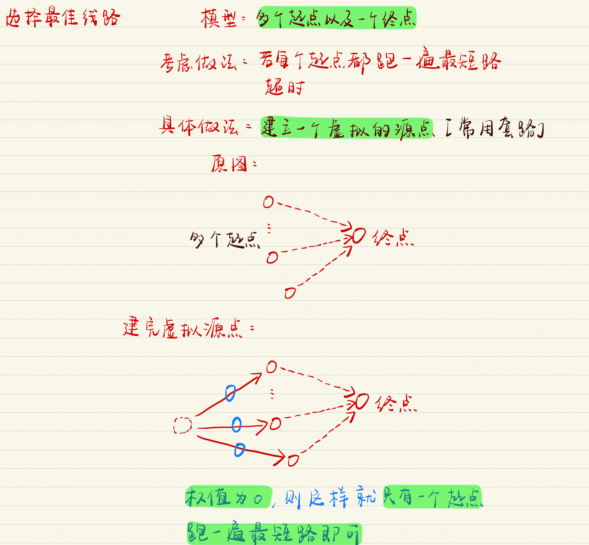

**代码**

```c++
#include <iostream>
#include <cstring>
using namespace std;
const int N = 1010, M = 21010, INF = 0x3f3f3f3f;
int n, m, T, idx;
int h[N], e[M], w[M], ne[M], st[N], dist[N], q[N];
void add(int a, int b, int c) {
    e[idx] = b;
    w[idx] = c;
    ne[idx] = h[a];
    h[a] = idx ++;
    return;
}
// SPFA模板
int spfa() {
    memset(dist, 0x3f, sizeof dist);
    memset(st, 0, sizeof st);
    // 使用循环队列
    int hh = 0, tt = 0;
    dist[0] = 0;
    q[tt ++ ] = 0;
    st[0] = true;
    while (hh != tt) {
        int t = q[hh ++ ];
        if (hh == N) hh = 0;
        st[t] = false;
        for (int i = h[t]; i != -1; i = ne[i]) {
            int j = e[i];
            if (dist[j] > dist[t] + w[i]) {
                dist[j] = dist[t] + w[i];
                if (!st[j]) {
                    q[tt ++ ] = j;
                    if (tt == N) tt = 0;
                    st[j] = true;
                }
            }
        }
    }
    if (dist[T] == INF) return -1;
    return dist[T];
}
int main() {
    while (~scanf("%d%d%d", &n, &m, &T)) {
        memset(h, -1, sizeof h);
        idx = 0;
        for (int i = 0; i < m; i ++ ) {
            int a, b, c;
            scanf("%d%d%d", &a, &b, &c);
            add(a, b, c);
        }
        int k;
        scanf("%d", &k);
        for (int i = 0, station; i < k; i ++ ) {
            scanf("%d", &station);
            // 将起点和虚拟源点之间建立一条边, 权值为0
            add(0, station, 0);
        }
        cout << spfa() << endl;
    }
    return 0;
}
```

**时间复杂度**

$O(m)$

**空间复杂度**

$O(m)$

**标签**

`最短路`、`虚拟源点`

**缝合怪**


### [AcWing 1131. 拯救大兵瑞恩](https://www.acwing.com/problem/content/1133/)

**题目描述**

>   `1944` 年，特种兵麦克接到国防部的命令，要求立即赶赴太平洋上的一个孤岛，营救被敌军俘虏的大兵瑞恩。
>
>   瑞恩被关押在一个迷宫里，迷宫地形复杂，但幸好麦克得到了迷宫的地形图。
>
>   迷宫的外形是一个长方形，其南北方向被划分为 `N` 行，东西方向被划分为 `M` 列， 于是整个迷宫被划分为 `N×M` 个单元。
>
>   每一个单元的位置可用一个有序数对 (单元的行号, 单元的列号) 来表示。
>
>   南北或东西方向相邻的 `2` 个单元之间可能互通，也可能有一扇锁着的门，或者是一堵不可逾越的墙。
>
>   **注意：** 门可以从两个方向穿过，即可以看成一条无向边。
>
>   迷宫中有一些单元存放着钥匙，同一个单元可能存放 **多把钥匙**，并且所有的门被分成 `P` 类，打开同一类的门的钥匙相同，不同类门的钥匙不同。
>
>   大兵瑞恩被关押在迷宫的东南角，即 `(N,M)` 单元里，并已经昏迷。
>
>   迷宫只有一个入口，在西北角。
>
>   也就是说，麦克可以直接进入 `(1,1)` 单元。
>
>   另外，麦克从一个单元移动到另一个相邻单元的时间为 `1`，拿取所在单元的钥匙的时间以及用钥匙开门的时间可忽略不计。
>
>   试设计一个算法，帮助麦克以最快的方式到达瑞恩所在单元，营救大兵瑞恩。

**输入格式**

>   第一行有三个整数,分别表示 `N,M,P` 的值。
>
>   第二行是一个整数 `k`，表示迷宫中门和墙的总数。
>
>   接下来 `k` 行，每行包含五个整数，$X_{i1}, Y_{i1}, X_{i2}, Y_{i2}, G_i$：当 $G_i≥1$ 时，表示 $(X_{i1},Y_{i1})$ 单元与 $(X_{i2},Y_{i2}) $单元之间有一扇第 $G_i$ 类的门，当 $G_i=0$ 时，表示 $(X_{i1},Y_{i1})$ 单元与 $(X_{i2},Y_{i2})$ 单元之间有一面不可逾越的墙。
>
>   接下来一行，包含一个整数 `S`，表示迷宫中存放的钥匙的总数。
>
>   接下来 `S` 行，每行包含三个整数 $X_{i1},Y_{i1},Q_i$，表示 $(X_{i1},Y_{i1})$ 单元里存在一个能开启第 $Q_i$ 类门的钥匙。

**输出格式**

>   输出麦克营救到大兵瑞恩的最短时间。
>
>   如果问题无解，则输出 `-1`。

**数据范围**

>   +   $|X_{i1} − X_{i2}| + |Y_{i1} − Y_{i2}| = 1,$
>   +   $0 ≤ G_i ≤ P,$
>   +   $1 ≤ Q_i ≤ P,$
>   +   $1 ≤ N, M, P ≤ 10,$
>   +   $1 ≤ k ≤ 150$

**输入样例**

```c++
4 4 9
9
1 2 1 3 2
1 2 2 2 0
2 1 2 2 0
2 1 3 1 0 
2 3 3 3 0
2 4 3 4 1
3 2 3 3 0
3 3 4 3 0
4 3 4 4 0
2
2 1 2 
4 2 1
```

**输出样例**

```c++
14
```

**样例解释**

>   迷宫如下所示：
>
>   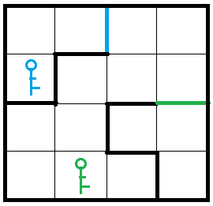

**手写稿**


**代码**

```c++
#include <iostream>
#include <cstring>
#include <set>
#include <deque>
#define x first
#define y second
using namespace std;
typedef pair<int, int> PII;
const int N = 15, M = 400, K = 1 << 10;
int n, m, p, k, idx;
int dx[4] = {-1, 0, 1, 0};
int dy[4] = {0, 1, 0, -1};
// 注意: 队头有N * N个点
int h[N * N], e[M], w[M], ne[M], key[N * N];
int g[N][N], dist[N * N][K];
bool st[N * N][K];
set <PII> edges;
void add(int a, int b, int c) {
    e[idx] = b;
    w[idx] = c;
    ne[idx] = h[a];
    h[a] = idx ++;
    return;
}
void build() {
    // 遍历整张图
    for (int x = 1; x <= n; x ++ )
        for (int y = 1; y <= m; y ++ )
            for (int i = 0; i < 4; i ++ ) { // 遍历四个方向
                int tx = x + dx[i];
                int ty = y + dy[i];
                int a = g[x][y], b = g[tx][ty];
                // 现在二维都已经映射成一维了, 因此, 是点a和点b之间的边, 不是tx和ty的边!!
                if (tx <= 0 || tx > n || ty <= 0 || ty > m || edges.count({a, b}))
                    continue;
                // 遍历到a的时候建a -> b
                // 遍历到b的时候建b -> a
                // 故, 当遍历到a时, 只需建a -> b的单向边即可
                add(a, b, 0);
                // 记录当前边已经建完
                edges.insert({a, b});
            }
    return;
}
int bfs() {
    memset(dist, 0x3f, sizeof dist);
    memset(st, 0, sizeof st);
    deque<PII> q;
    // 第一维: 点
    // 第二维: 从起点到当前点的钥匙的状态, 二进制数
    q.push_back({g[1][1], 0});
    dist[g[1][1]][0] = 0;
    while (q.size()) {
        auto t = q.front(); q.pop_front();
        int u = t.x, state = t.y;
        // 到达结尾, 返回即可
        if (u == g[n][m]) return dist[u][state];
        // 已经被访问过, 则进行下一次的循环
        if (st[u][state]) continue;
        // 标记当前点的状态已经被访问过
        st[u][state] = true;
        if (key[u]) // 如果当前点有钥匙
            // 如果能更新, 则进行更新
            // 注意: 状态转移方程的写法
            if (dist[u][key[u] | state] > dist[u][state]) {
                dist[u][key[u] | state] = dist[u][state];
                // 距离不更新, 更新钥匙的状态, 权值为0, 故, 插入到队头
                q.push_front({u, key[u] | state});
            }
        // 访问邻边
        for (int i = h[u]; i != -1; i = ne[i]) {
            int j = e[i];
            // 如果当前位置有门, 但是, 没有对应的钥匙, 则进行下一次循环
            if (w[i] && !(state >> w[i] - 1 & 1)) continue;
            // 如果能更新, 则进行更新
            // 注意: 状态转移方程
            if (dist[j][state] > dist[u][state] + 1) {
                dist[j][state] = dist[u][state] + 1;
                // 权值为1, 加入队尾
                q.push_back({j, state});
            }
        }
    }
    return -1;
}
int main() {
    scanf("%d%d%d%d", &n, &m, &p, &k);
    // 编号
    for (int i = 1, t = 0; i <= n; i ++ )
        for (int j = 1; j <= m; j ++ )
            g[i][j] = ++ t;
    memset(h, -1, sizeof h);
    for (int i = 0; i < k; i ++ ) {
        int x1, y1, x2, y2, type;
        scanf("%d%d%d%d%d", &x1, &y1, &x2, &y2, &type);
        // 将二维映射成一维
        int a = g[x1][y1], b = g[x2][y2];
        // 记录当前边
        // 即使是墙, 也得记录[虽然不连边]
        // 原因: 需要和空地分开, 所以, 需要记录, 但是不连边
        edges.insert({a, b});
        edges.insert({b, a});
        // 如果不是墙, 无向边
        if (type) {
            add(a, b, type);
            add(b, a, type);
        }
    }
    // 将其他空地, 进行建边
    build();
    int s;
    scanf("%d", &s);
    for (int i = 0; i < s; i ++ ) {
        int x, y, type;
        scanf("%d%d%d", &x, &y, &type);
        int a = g[x][y];
        // 钥匙的存储已经映射为一维了, 点a
        key[a] |= 1 << type - 1;
    }
    cout << bfs() << endl;
    return 0;
}
```

**时间复杂度**

$O(nm)$

**空间复杂度**

$O(n^2k)$

**标签**

`最短路`、`双端队列`、`动态规划`

**缝合怪**


### [AcWing 1134. 最短路计数](https://www.acwing.com/problem/content/1136/)

**题目描述**

>   给出一个 `N` 个顶点 `M` 条边的无向无权图，顶点编号为 `1` 到 `N`。
>
>   问从顶点 `1` 开始，到其他每个点的最短路有几条。

**输入格式**

>   第一行包含 `2` 个正整数 `N,M`，为图的顶点数与边数。
>
>   接下来 `M` 行，每行两个正整数 `x,y`，表示有一条顶点 `x` 连向顶点 `y` 的边，请注意可能有自环与重边。

**输出格式**

>   输出 `N` 行，每行一个非负整数，第 `i` 行输出从顶点 `1` 到顶点 `i` 有多少条不同的最短路，由于答案有可能会很大，你只需要输出对 `100003` 取模后的结果即可。
>
>   如果无法到达顶点 `i` 则输出 `0`。

**数据范围**

>   +   $1 ≤ N ≤ 10^5,$
>   +   $1 ≤ M ≤ 2 × 10^5$

**输入样例**

```c++
5 7
1 2
1 3
2 4
3 4
2 3
4 5
4 5
```

**输出样例**

```c++
1
1
1
2
4
```

**手写稿**

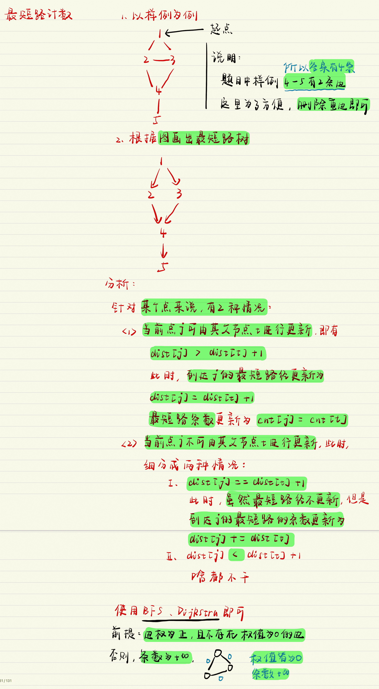

**代码**

```c++
#include <iostream>
#include <cstring>
using namespace std;
const int N = 100010, M = 400010, mod = 100003;
int n, m, idx;
int h[N], e[M], ne[M], q[N], st[N], dist[N], cnt[N];
void add(int a, int b) {
    e[idx] = b;
    ne[idx] = h[a];
    h[a] = idx ++;
    return;
}
void bfs() {
    memset(dist, 0x3f, sizeof dist);
    memset(st, false, sizeof st);
    int hh = 0, tt = -1;
    dist[1] = 0;
    // 起点到起点的最短路径条数为1
    cnt[1] = 1;
    q[++ tt] = 1;
    while (hh <= tt) {
        int t = q[hh ++ ];
        if (st[t]) continue;
        st[t] = true;
        for (int i = h[t]; i != -1; i = ne[i]) {
            int j = e[i];
            if (dist[j] > dist[t] + 1) {
                dist[j] = dist[t] + 1;
                cnt[j] = cnt[t];
                q[++ tt] = j;
            }
            else if (dist[j] == dist[t] + 1)
                cnt[j] = (cnt[j] + cnt[t]) % mod;
        }
    }
    return;
}
int main() {
    scanf("%d%d", &n, &m);
    memset(h, -1, sizeof h);
    for (int i = 0; i < m; i ++ ) {
        int a, b;
        scanf("%d%d", &a, &b);
        add(a, b);
        add(b, a);
    }
    bfs();
    for (int i = 1; i <= n; i ++ ) cout << cnt[i] << endl;
    return 0;
}
```

**时间复杂度**

$O(n)$

**空间复杂度**

$O(m)$

**标签**

`最短路计数`、`BFS`、`DP`

**缝合怪**


### [AcWing 383. 观光](https://www.acwing.com/problem/content/385/)

**题目描述**

>   “您的个人假期”旅行社组织了一次比荷卢经济联盟的巴士之旅。
>
>   比荷卢经济联盟有很多公交线路。
>
>   每天公共汽车都会从一座城市开往另一座城市。
>
>   沿途汽车可能会在一些城市（零或更多）停靠。
>
>   旅行社计划旅途从 `S` 城市出发，到 `F` 城市结束。
>
>   由于不同旅客的景点偏好不同，所以为了迎合更多旅客，旅行社将为客户提供多种不同线路。
>
>   游客可以选择的行进路线有所限制，要么满足所选路线总路程为 `S` 到 `F` 的最小路程，要么满足所选路线总路程仅比最小路程多一个单位长度。
>
>   
>
>   如上图所示，如果 `S = 1，F = 5`，则这里有两条最短路线 `1 → 2 → 5, 1 → 3 → 5`，长度为 `6`；有一条比最短路程多一个单位长度的路线 `1 → 3 → 4 → 5`，长度为 `7`。
>
>   现在给定比荷卢经济联盟的公交路线图以及两个城市 `S` 和 `F`，请你求出旅行社最多可以为旅客提供多少种不同的满足限制条件的线路。

**输入格式**

>   第一行包含整数 `T`，表示共有 `T` 组测试数据。
>
>   每组数据第一行包含两个整数 `N` 和 `M`，分别表示总城市数量和道路数量。
>
>   接下来 `M` 行，每行包含三个整数 `A, B, L`，表示有一条线路从城市 `A` 通往城市 `B`，长度为 `L`。
>
>   需注意，线路是 **单向的**，存在从 `A` 到 `B` 的线路不代表一定存在从 `B` 到 `A` 的线路，另外从城市 `A` 到城市 `B` 可能存在多个不同的线路。
>
>   接下来一行，包含两个整数 `S` 和 `F`，数据保证 `S` 和 `F` 不同，并且 `S、 F` 之间至少存在一条线路。

**输出格式**

>   每组数据输出一个结果，每个结果占一行。
>
>   数据保证结果不超过 $10^9$。

**数据范围**

>   +   $2 ≤ N ≤ 1000,$
>   +   $1 ≤ M ≤ 10000,$
>   +   $1 ≤ L ≤ 1000，$
>   +   $1 ≤ A, B, S, F ≤ N$

**输入样例**

```c++
2
5 8
1 2 3
1 3 2
1 4 5
2 3 1
2 5 3
3 4 2
3 5 4
4 5 3
1 5
5 6
2 3 1
3 2 1
3 1 10
4 5 2
5 2 7
5 2 7
4 1
```

**输出样例**

```c++
3
2
```

**手写稿**

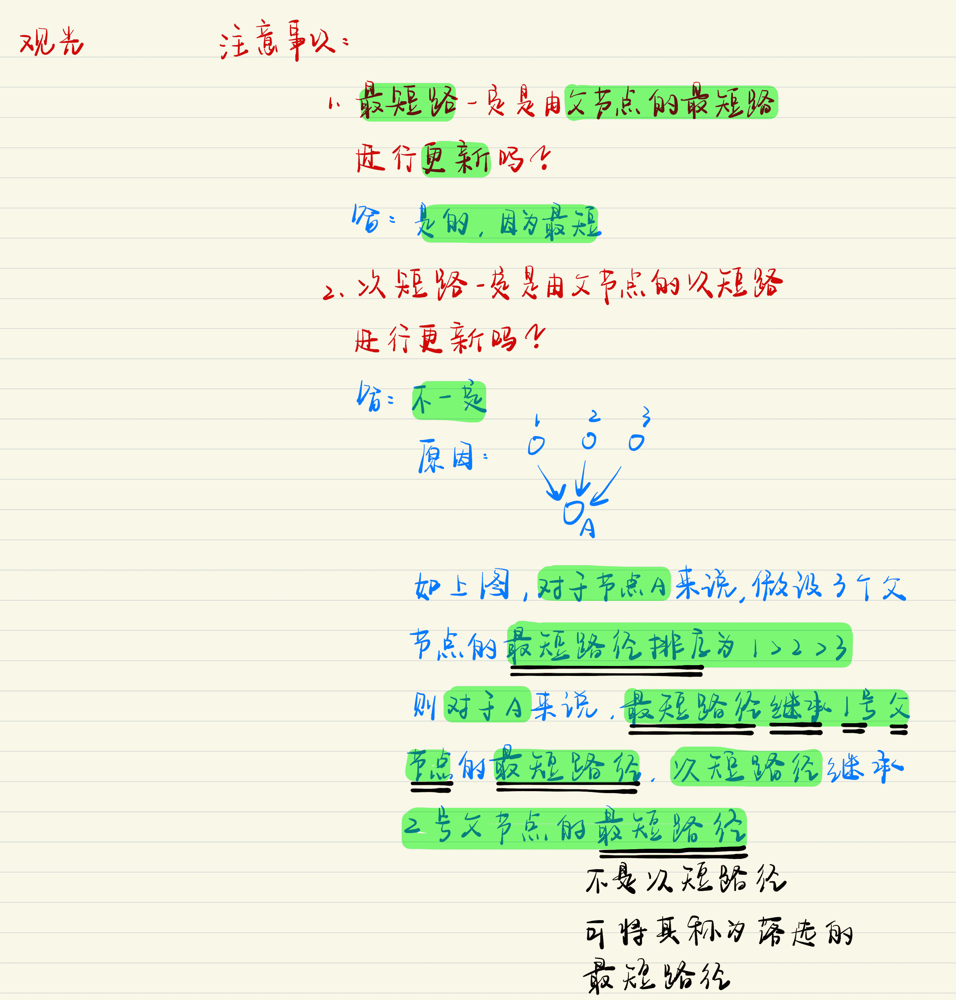

**代码**

```c++
#include <iostream>
#include <cstring>
#include <queue>
using namespace std;
const int N = 1010, M = 10010, K = 5;
int n, m, T, idx;
int h[N], e[M], w[M], ne[M];
int st[N][K], cnt[N][K], dist[N][K];
struct Node {
    int ver, distance, type;
    // 重载大于号
    bool operator > (const Node &W) const {
        return distance > W.distance;
    }
};
void add(int a, int b, int c) {
    e[idx] = b;
    w[idx] = c;
    ne[idx] = h[a];
    h[a] = idx ++;
    return;
}
int dijkstra(int start, int end) {
    // 初始化三个数组
    memset(st, false, sizeof st);
    memset(dist, 0x3f, sizeof dist);
    memset(cnt, 0, sizeof cnt);
    priority_queue<Node, vector<Node>, greater<Node>> heap;
    heap.push({start, 0, 0});
    dist[start][0] = 0;
    cnt[start][0] = 1;
    while (heap.size()) {
        auto t = heap.top(); heap.pop();
        int ver = t.ver, distance = t.distance, type = t.type;
        if (st[ver][type]) continue;
        st[ver][type] = true;
        for (int i = h[ver]; i != -1; i = ne[i]) {
            int j = e[i];
            if (dist[j][0] > distance + w[i]) {
                // 更新次短路路径
                cnt[j][1] = cnt[j][0];
                dist[j][1] = dist[j][0];
                heap.push({j, dist[j][1], 1});
                // 更新最短路径
                // 注意: 这里是cnt[ver][type]不是cnt[ver][0]
                cnt[j][0] = cnt[ver][0];
                dist[j][0] = distance + w[i];
                heap.push({j, dist[j][0], 0});
            }
            else if (dist[j][0] == distance + w[i]) {
                // 注意: 这里是cnt[ver][type]不是cnt[ver][0]
                cnt[j][0] += cnt[ver][0];
            }
            else if (dist[j][1] > distance + w[i]) {
                // 注意: 这里是cnt[ver][type]不是cnt[ver][0]
                // 这里的类型不一定是次短路径, 有可能是落败的最短路径, [手写稿解释]
                cnt[j][1] = cnt[ver][type];
                dist[j][1] = distance + w[i];
                heap.push({j, dist[j][1], 1});
            }
            else if (dist[j][1] == distance + w[i]) {
                // 注意: 这里是cnt[ver][type]不是cnt[ver][0]
                // 这里的类型不一定是次短路径, 有可能是落败的最短路径, [手写稿解释]
                cnt[j][1] += cnt[ver][type];
            }
        }
    }
    int res = cnt[end][0];
    if (dist[end][0] + 1 == dist[end][1]) res += cnt[end][1];
    return res;
}
int main() {
    scanf("%d", &T);
    while (T -- ) {
        // 初始化队头
        memset(h, -1, sizeof h);
        // 初始化指针
        idx = 0;
        scanf("%d%d", &n, &m);
        for (int i = 0; i < m; i ++ ) {
            int a, b, c;
            scanf("%d%d%d", &a, &b, &c);
            // 建立单向边
            add(a, b, c);
        }
        int start, end;
        scanf("%d%d", &start, &end);
        // 起点和终点
        cout << dijkstra(start, end) << endl;
    }
    return 0;
}
```

**时间复杂度**

$O(mlog_n)$

**空间复杂度**

$O(m)$

**标签**

`Dijkstra`、`最短路`、`次短路`

**缝合怪**


## `Floyd` 算法

### 原理介绍

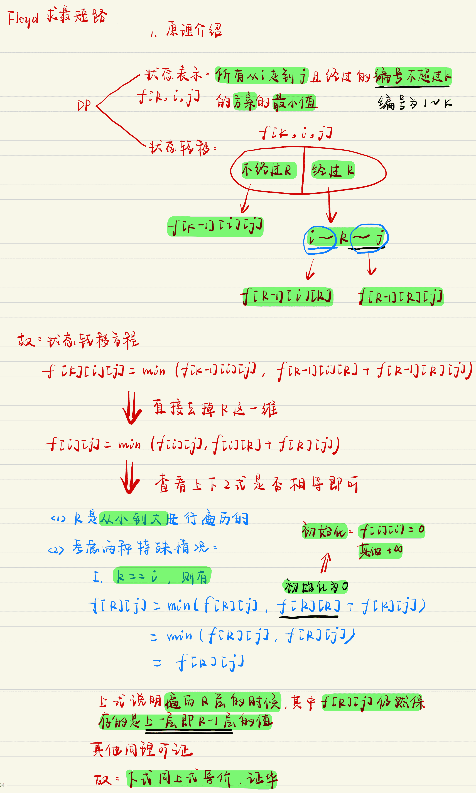

### [AcWing 854. Floyd求最短路](https://www.acwing.com/problem/content/856/)

**题目描述**

>   给定一个 `n` 个点 `m` 条边的有向图，图中可能存在重边和自环，边权可能为负数。
>
>   再给定 `k` 个询问，每个询问包含两个整数 `x` 和 `y`，表示查询从点 `x` 到点 `y` 的最短距离，如果路径不存在，则输出 `impossible`。
>
>   数据保证图中不存在负权回路。

**输入格式**

>   第一行包含三个整数 `n, m, k`。
>
>   接下来 `m` 行，每行包含三个整数 `x, y ,z`，表示存在一条从点 `x` 到点 `y` 的有向边，边长为 `z`。
>
>   接下来 `k` 行，每行包含两个整数 `x, y`，表示询问点 `x` 到点 `y` 的最短距离。

**输出格式**

>   共 `k` 行，每行输出一个整数，表示询问的结果，若询问两点间不存在路径，则输出 `impossible`。

**数据范围**

>   +   $1 ≤ n ≤ 200,$
>   +   $1 ≤ k ≤ n^2$
>   +   $1 ≤ m ≤ 20000,$
>   +   $图中涉及边长绝对值均不超过 10000。$

**输入样例**

```c++
3 3 2
1 2 1
2 3 2
1 3 1
2 1
1 3
```

**输出样例**

```c++
impossible
1
```

**手写稿**

>   1.   模板题, 参见[原理介绍](#原理介绍)
>   2.   注意: 枚举的顺序即可, `k -> i -> j`

**代码**

```c++
#include <iostream>
#include <cstring>
using namespace std;
const int N = 210, INF = 0x3f3f3f3f;
int n, m, k;
int g[N][N];
int main() {
    scanf("%d%d%d", &n, &m, &k);
    memset(g, 0x3f, sizeof g);
    for (int i = 1; i <= n; i ++ ) g[i][i] = 0;
    for (int i = 0; i < m; i ++ ) {
        int u, v, w;
        scanf("%d%d%d", &u, &v, &w);
        // 可能会有重边, 重边的话取最小值即可
        g[u][v] = min(g[u][v], w);
    }
    for (int k = 1; k <= n; k ++ )
        for (int i = 1; i <= n; i ++ )
            for (int j = 1; j <= n; j ++ )
                g[i][j] = min(g[i][j], g[i][k] + g[k][j]);
    while (k -- ) {
        int u, v;
        scanf("%d%d", &u, &v);
        // 可能会有负数, 因此, 如果当其大于 INF / 2 的时候, 则判定其无解
        if (g[u][v] > INF / 2) puts("impossible");
        else cout << g[u][v] << endl;
    }
    return 0;
}
```

**时间复杂度**

$O(n^3)$

**空间复杂度**

$O(n ^ 2)$

**标签**

`Floyd`、`动态规划`

**缝合怪**


### [AcWing 1125. 牛的旅行](https://www.acwing.com/problem/content/1127/)

**题目描述**

>   农民 `John` 的农场里有很多牧区，有的路径连接一些特定的牧区。
>
>   一片所有连通的牧区称为一个牧场。
>
>   但是就目前而言，你能看到至少有两个牧区不连通。
>
>   现在，`John` 想在农场里添加一条路径（注意，恰好一条）。
>
>   一个牧场的直径就是牧场中最远的两个牧区的距离（本题中所提到的所有距离指的都是最短的距离）。
>
>   考虑如下的两个牧场，每一个牧区都有自己的坐标：
>
>   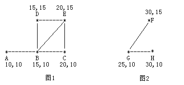
>
>   图 `1` 是有 `5` 个牧区的牧场，牧区用`“*”`表示，路径用直线表示。
>
>   图 `1` 所示的牧场的直径大约是 `12.07106`, 最远的两个牧区是 `A` 和 `E`，它们之间的最短路径是 `A-B-E`。
>
>   图 `2` 是另一个牧场。
>
>   这两个牧场都在 `John` 的农场上。
>
>   `John` 将会在两个牧场中各选一个牧区，然后用一条路径连起来，使得连通后这个新的更大的牧场有最小的直径。
>
>   注意，如果两条路径中途相交，我们不认为它们是连通的。
>
>   只有两条路径在同一个牧区相交，我们才认为它们是连通的。
>
>   现在请你编程找出一条连接两个不同牧场的路径，使得连上这条路径后，所有牧场（生成的新牧场和原有牧场）中直径最大的牧场的直径尽可能小。
>
>   输出这个直径最小可能值。

**输入格式**

>   第 `1` 行：一个整数 `N`, 表示牧区数；
>
>   第 `2` 到 `N + 1` 行：每行两个整数 `X,Y`， 表示 `N` 个牧区的坐标。每个牧区的坐标都是不一样的。
>
>   第 `N + 2` 行到第 `2 * N + 1` 行：每行包括 `N` 个数字 ( `0`或`1` ) 表示一个对称邻接矩阵。
>
>   例如，题目描述中的两个牧场的矩阵描述如下：
>
>   ```c++
>     A B C D E F G H 
>   A 0 1 0 0 0 0 0 0 
>   B 1 0 1 1 1 0 0 0 
>   C 0 1 0 0 1 0 0 0 
>   D 0 1 0 0 1 0 0 0 
>   E 0 1 1 1 0 0 0 0 
>   F 0 0 0 0 0 0 1 0 
>   G 0 0 0 0 0 1 0 1 
>   H 0 0 0 0 0 0 1 0
>   ```
>
>   输入数据中至少包括两个不连通的牧区。

**输出格式**

>   只有一行，包括一个实数，表示所求答案。
>
>   数字保留六位小数。

**数据范围**

>   +   $1 ≤ N ≤ 150,$
>   +   $0 ≤ X, Y ≤ 10^5$

**输入样例**

```c++
8
10 10
15 10
20 10
15 15
20 15
30 15
25 10
30 10
01000000
10111000
01001000
01001000
01110000
00000010
00000101
00000010
```

**输出样例**

```c++
22.071068
```

**手写稿**

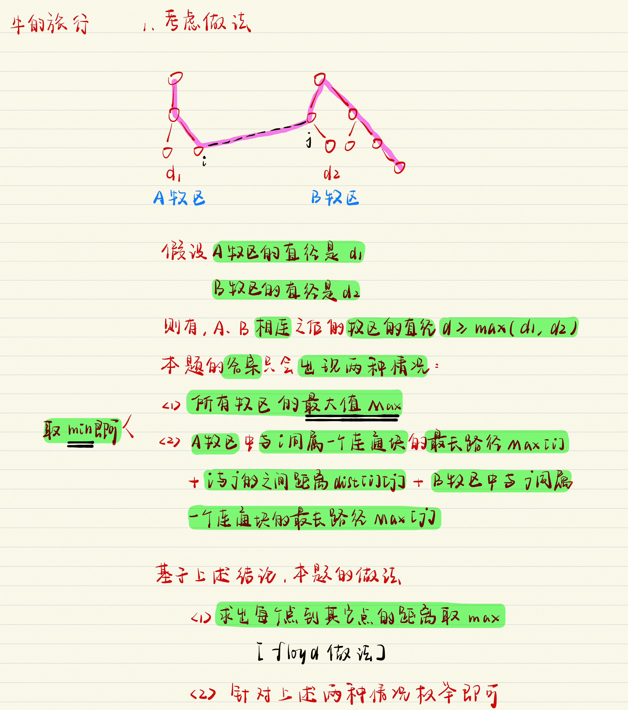

**代码**

```c++
#include <iostream>
#include <cmath>
#define x first
#define y second
using namespace std;
typedef pair<int, int> PII;
const int N = 155;
const double INF = 1e20;
int n;
PII q[N];
double Max[N];
double dist[N][N];
char g[N][N];
// 计算欧式距离
double get_dist(PII a, PII b) {
    int dx = a.x - b.x;
    int dy = a.y - b.y;
    return sqrt(dx * dx + dy * dy);
}
int main() {
    scanf("%d", &n);
    for (int i = 0; i < n; i ++ ) scanf("%d%d", &q[i].x, &q[i].y);
    for (int i = 0; i < n; i ++ ) scanf("%s", g[i]);
    for (int i = 0; i < n; i ++ )
        for (int j = 0; j < n; j ++ )
            // 更新两个点之间的距离
            if (g[i][j] == '1') dist[i][j] = get_dist(q[i], q[j]);
            else if (i == j) dist[i][j] = 0;
            else dist[i][j] = INF;
    // Floyd算法模板
    for (int k = 0; k < n; k ++ )
        for (int i = 0; i < n; i ++ )
            for (int j = 0; j < n; j ++ )
                dist[i][j] = min(dist[i][j], dist[i][k] + dist[k][j]);
    // 计算连通块内部任意两个点之间的最长距离, 即计算第一种情况
    // 初始化为-∞
    double res1 = -INF;
    for (int i = 0; i < n; i ++ ) {
        for (int j = 0; j < n; j ++ )
            if (dist[i][j] < INF / 2)
                Max[i] = max(Max[i], dist[i][j]);
        res1 = max(res1, Max[i]);
    }
    // 计算第二种情况
    // 初始化为+∞
    double res2 = INF;
    for (int i = 0; i < n; i ++ )
        for (int j = 0; j < n; j ++ )
            if (dist[i][j] > INF / 2) // 不连通
                res2 = min(res2, Max[i] + Max[j] + get_dist(q[i], q[j]));
    // 两种情况取max即可
    printf("%lf\n", max(res1, res2));
    return 0;
}
```

**时间复杂度**

$O(n^3)$

**空间复杂度**

`O(n^2)`

**标签**

`Floyd`、`传递闭包`

**缝合怪**


### [PTA L2-010 排座位](https://pintia.cn/problem-sets/994805046380707840/problems/994805066135879680)

**题目描述**

>   布置宴席最微妙的事情，就是给前来参宴的各位宾客安排座位。无论如何，总不能把两个死对头排到同一张宴会桌旁！这个艰巨任务现在就交给你，对任何一对客人，请编写程序告诉主人他们是否能被安排同席。

**输入格式**

>   输入第一行给出3个正整数：`N`（`≤100`），即前来参宴的宾客总人数，则这些人从`1`到`N`编号；`M`为已知两两宾客之间的关系数；`K`为查询的条数。随后`M`行，每行给出一对宾客之间的关系，格式为：`宾客1 宾客2 关系`，其中`关系`为`1`表示是朋友，`-1`表示是死对头。注意两个人不可能既是朋友又是敌人。最后`K`行，每行给出一对需要查询的宾客编号。
>
>   这里假设朋友的朋友也是朋友。但敌人的敌人并不一定就是朋友，朋友的敌人也不一定是敌人。只有单纯直接的敌对关系才是绝对不能同席的。

**输出格式**

>   对每个查询输出一行结果：如果两位宾客之间是朋友，且没有敌对关系，则输出`No problem`；如果他们之间并不是朋友，但也不敌对，则输出`OK`；如果他们之间有敌对，然而也有共同的朋友，则输出`OK but...`；如果他们之间只有敌对关系，则输出`No way`。

**输入样例**

```c++
7 8 4
5 6 1
2 7 -1
1 3 1
3 4 1
6 7 -1
1 2 1
1 4 1
2 3 -1
3 4
5 7
2 3
7 2
```

**输出样例**

```c++
No problem
OK
OK but...
No way
```

**手写稿**


**代码一:传递闭包**

```c++
#include <iostream>
using namespace std;
const int N = 110;
int n, m, k;
int friends[N][N], enemy[N][N];
void floyd() {
    for (int k = 1; k <= n; k ++ )
        for (int i = 1; i <= n; i ++ )
            for (int j = 1; j <= n; j ++ )
                // |= 不是 =
                // 如果i和j已经是朋友, 则不管i和k已经k和j是否是朋友
                // 都不能影响i和j已经是朋友这件事实, 故使用 |= 而不是 =
                friends[i][j] |= friends[i][k] && friends[k][j];
    return;
}
int main() {
    scanf("%d%d%d", &n, &m, &k);
    for (int i = 0; i < m; i ++ ) {
        int a, b, c;
        scanf("%d%d%d", &a, &b, &c);
        // 朋友的朋友还是朋友
        if (c == 1) friends[a][b] = friends[b][a] = 1;
        else enemy[a][b] = enemy[b][a] = 1;
    }
    floyd();
    while (k -- ) {
        int a, b;
        scanf("%d%d", &a, &b);
        if (friends[a][b] && !enemy[a][b]) puts("No problem");
        else if (!friends[a][b] && !enemy[a][b]) puts("OK");
        else if (friends[a][b] && enemy[a][b]) puts("OK but...");
        else if (!friends[a][b] && enemy[a][b]) puts("No way");
    }
    return 0;
}
```

**时间复杂度**

$O(n ^ 3)$

**空间复杂度**

$O(n^2)$

**代码二: 并查集**

```c++
#include <iostream>
using namespace std;
const int N = 110;
int n, m, k;
int f[N];
int enemy[N][N];
int find(int x) {
    if (f[x] == x) return f[x];
    return f[x] = find(f[x]);
}
int main() {
    scanf("%d%d%d", &n, &m, &k);
    for (int i = 1; i <= n; i ++ ) f[i] = i;
    for (int i = 0; i < m; i ++ ) {
        int a, b, c;
        scanf("%d%d%d", &a, &b, &c);
        // 朋友的朋友还是朋友
        if (c == 1) {
            int fa = find(a);
            int fb = find(b);
            if (fa == fb) continue;
            f[fb] = fa;
        }
        else enemy[a][b] = enemy[b][a] = 1;
    }
    while (k -- ) {
        int a, b;
        scanf("%d%d", &a, &b);
        int fa = find(a);
        int fb = find(b);
        if (fa == fb && !enemy[a][b]) puts("No problem");
        else if (fa != fb && !enemy[a][b]) puts("OK");
        else if (fa == fb && enemy[a][b]) puts("OK but...");
        else if (fa != fb && enemy[a][b]) puts("No way");
    }
    return 0;
}
```

**时间复杂度**

$O(n)$

**空间复杂度**

$O(n^2)$

**标签**

`并查集`、`传递闭包`

**缝合怪**


### [AcWing 343. 排序](https://www.acwing.com/problem/content/345/)

**题目描述**

>   给定 `n` 个变量和 `m` 个不等式。其中 `n` 小于等于 `26`，变量分别用前 `n` 的大写英文字母表示。
>
>   不等式之间具有传递性，即若 `A > B` 且 `B > C`，则 `A > C`。
>
>   请从前往后遍历每对关系，每次遍历时判断：
>
>   -   如果能够确定全部关系且无矛盾，则结束循环，输出确定的次序；
>   -   如果发生矛盾，则结束循环，输出有矛盾；
>   -   如果循环结束时没有发生上述两种情况，则输出无定解。

**输入格式**

>   输入包含多组测试数据。
>
>   每组测试数据，第一行包含两个整数 `n` 和 `m`。
>
>   接下来 `m` 行，每行包含一个不等式，不等式全部为小于关系。
>
>   当输入一行 `0 0` 时，表示输入终止。

**输出格式**

>   每组数据输出一个占一行的结果。
>
>   结果可能为下列三种之一：
>
>   1.  如果可以确定两两之间的关系，则输出 `"Sorted sequence determined after t relations: yyy...y."`,其中`'t'`指迭代次数，`'yyy...y'`是指升序排列的所有变量。
>   2.  如果有矛盾，则输出： `"Inconsistency found after t relations."`，其中`'t'`指迭代次数。
>   3.  如果没有矛盾，且不能确定两两之间的关系，则输出 `"Sorted sequence cannot be determined."`。

**数据范围**

>   +   $2 ≤ n ≤ 26，变量只可能为大写字母 A ∼ Z。$

**输入样例1**

```c++
4 6
A<B
A<C
B<C
C<D
B<D
A<B
3 2
A<B
B<A
26 1
A<Z
0 0
```

**输出样例1**

```c++
Sorted sequence determined after 4 relations: ABCD.
Inconsistency found after 2 relations.
Sorted sequence cannot be determined.
```

**输入样例2**

```c++
6 6
A<F
B<D
C<E
F<D
D<E
E<F
0 0
```

**输出样例2**

```c++
Inconsistency found after 6 relations.
```

**输入样例3**

```c++
5 5
A<B
B<C
C<D
D<E
E<A
0 0
```

**输出样例3**

```c++
Sorted sequence determined after 4 relations: ABCDE.
```

**手写稿**

>   1.   原始手写稿
>
>        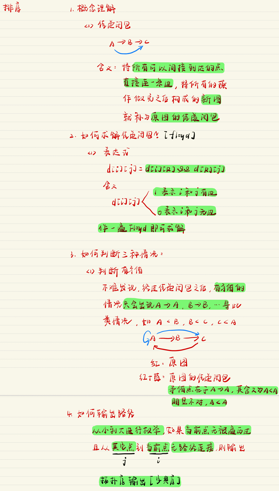
>
>   2.   补充说明
>
>        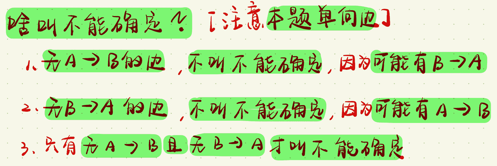

**代码**

```c++
#include <iostream>
#include <cstring>
using namespace std;
const int N = 30;
int n, m;
int st[N];
int g[N][N];
void floyd() {
    for (int k = 0; k < n; k ++ )
        for (int i = 0; i < n; i ++ )
            for (int j = 0; j < n; j ++ )
                g[i][j] |= g[i][k] && g[k][j];
    return;
}
int check() {
    for (int i = 0; i < n; i ++ )
        if (g[i][i]) return 2;
    for (int i = 0; i < n; i ++ )
        for (int j = i + 1; j < n; j ++ )
            // 注意: 手写稿说明
            if (!g[i][j] && !g[j][i]) return 3;
    return 1;
}
int main() {
    while (~scanf("%d%d", &n, &m), n || m) {
        memset(g, 0, sizeof g);
        char str[5];
        int tms, t = 3;
        for (int i = 1; i <= m; i ++ ) {
            scanf("%s", str);
            int a = str[0] - 'A';
            int b = str[2] - 'A';
            // 第三种情况, 也就是不确定的时候, 才继续连边
            // 第一、二种情况, 也就是说已经得出结论了, 则直接跳过, 不需要连边, 也不需要进行判断
            if (t == 3) {
                g[a][b] = 1;
                floyd();
                int k = check();
                t = k;
                tms = i;
            }
        }
        if (t == 1) {
            printf("Sorted sequence determined after %d relations: ", tms);
            memset(st, false, sizeof st);
         	// 找到n个点, 故循环n次
            for (int k = 0; k < n; k ++ )
                // 遍历每一列
                for (int j = 0; j < n; j ++ ) {
                    if (st[j]) continue;
                    int flag = true;
                    // 遍历每一行
                    for (int i = 0; i < n; i ++ ) {
                        if (st[i]) continue;
                        if (g[i][j]) {
                            flag = false;
                            break;
                        }
                    }
                    if (flag) {
                        st[j] = true;
                        printf("%c", j + 'A');
                        break;
                    }
                }
            puts(".");
        }
        else if (t == 2) printf("Inconsistency found after %d relations.\n", tms);
        else printf("Sorted sequence cannot be determined.\n");
    }
    return 0;
}
```

**时间复杂度**

$O(mn^3)$

**空间复杂度**

$O(n^2)$

**标签**

`Floyd`、`闭包`、`传递闭包`

**缝合怪**


### [AcWing 344. 观光之旅](https://www.acwing.com/problem/content/346/)

**题目描述**

>   给定一张无向图，求图中一个至少包含 `3` 个点的环，环上的节点不重复，并且环上的边的长度之和最小。
>
>   该问题称为无向图的最小环问题。
>
>   你需要输出最小环的方案，若最小环不唯一，输出任意一个均可。

**输入格式**

>   第一行包含两个整数 `N` 和 `M`，表示无向图有 `N` 个点，`M` 条边。
>
>   接下来 `M` 行，每行包含三个整数 `u，v，l`，表示点 `u` 和点 `v` 之间有一条边，边长为 `l`。

**输出格式**

>   输出占一行，包含最小环的所有节点（按顺序输出），如果不存在则输出 `No solution.`。

**数据范围**

>   +   $1 ≤ N ≤ 100,$
>   +   $1 ≤ M ≤ 10000,$
>   +   $1 ≤ l < 500$

**输入样例**

```c++
5 7
1 4 1
1 3 300
3 1 10
1 2 16
2 3 100
2 5 15
5 3 20
```

**输出样例**

```c++
1 3 5 2
```

**手写稿**

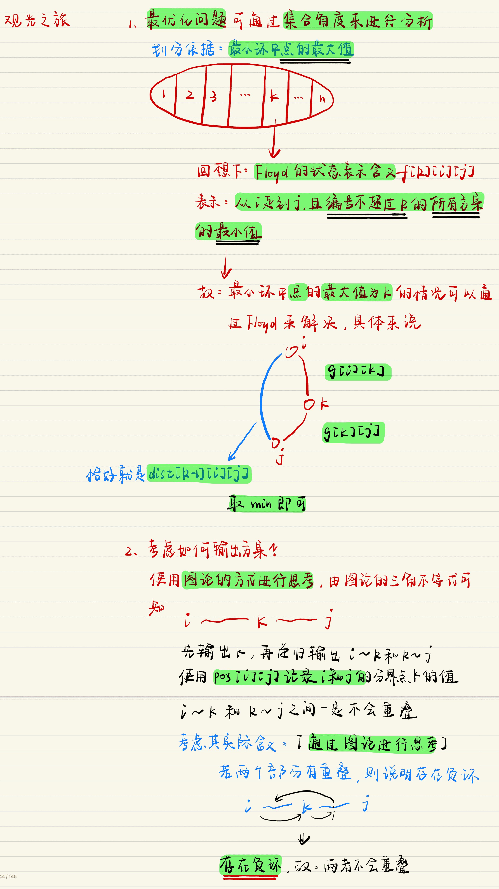

**代码**

```c++
#include <iostream>
#include <cstring>
using namespace std;
const int N = 110, INF = 0x3f3f3f3f;
int n, m, cnt;
int path[N];
int g[N][N], dist[N][N], pos[N][N];
void dfs(int i, int j) {
    if (pos[i][j] == 0) return;
    // 枚举i和j的分界点
    int k = pos[i][j];
    // 递归左半边
    dfs(i, k);
    // 记录中间点
    path[cnt ++ ] = k;
    // 递归右半边
    dfs(k, j);
    return;
}
int main() {
    scanf("%d%d", &n, &m);
    memset(g, 0x3f, sizeof g);
    for (int i = 1; i <= n; i ++ ) g[i][i] = 0;
    for (int i = 0; i < m; i ++ ) {
        int a, b, c;
        scanf("%d%d%d",&a, &b, &c);
        g[a][b] = g[b][a] = min(g[a][b], c);
    }
    memcpy(dist, g, sizeof g);
    int res = INF;
    for (int k = 1; k <= n; k ++ ) {
        for (int i = 1; i < k; i ++ )
            for (int j = i + 1; j < k; j ++ )
                // g[i][k]是i和k之间的权值
                // g[k][j]是k和j之间的权值
                if ((long long)dist[i][j] + g[i][k] + g[k][j] < res) {
                    cnt = 0;
                    res = dist[i][j] + g[i][k] + g[k][j];
                    path[cnt ++ ] = k;
                    path[cnt ++ ] = i;
                    dfs(i, j);
                    path[cnt ++ ] = j;
                }
        for (int i = 1; i <= n; i ++ )
            for (int j = 1; j <= n; j ++ )
                if (dist[i][j] > dist[i][k] + dist[k][j]) {
                    dist[i][j] = dist[i][k] + dist[k][j];
                    // 记录分界点
                    pos[i][j] = k;
                }
    }
    if (res == INF) puts("No solution.");
    else
        for (int i = 0; i < cnt; i ++ ) cout << path[i] << " ";
    return 0;
}
```

**时间复杂度**

$O(n^3)$

**空间复杂度**

$O(n^2)$

**标签**

`最小环`、`Floyd`

**缝合怪**


### [AcWing 345. 牛站](https://www.acwing.com/problem/content/347/)

**题目描述**

>   给定一张由 `T` 条边构成的无向图，点的编号为 `1 ∼ 1000` 之间的整数。
>
>   求从起点 `S` 到终点 `E` 恰好经过 `N` 条边（可以重复经过）的最短路。
>
>   **注意**: 数据保证一定有解。

**输入格式**

>   第 `1` 行：包含四个整数 `N，T，S，E`。
>
>   第 `2..T + 1` 行：每行包含三个整数，描述一条边的边长以及构成边的两个点的编号。

**输出格式**

>   输出一个整数，表示最短路的长度。

**数据范围**

>   +   $2 ≤ T ≤ 100,$
>   +   $2 ≤ N ≤ 10^6$

**输入样例**

```c++
2 6 6 4
11 4 6
4 4 8
8 4 9
6 6 8
2 6 9
3 8 9
```

**输出样例**

```c++
10
```

**手写稿**

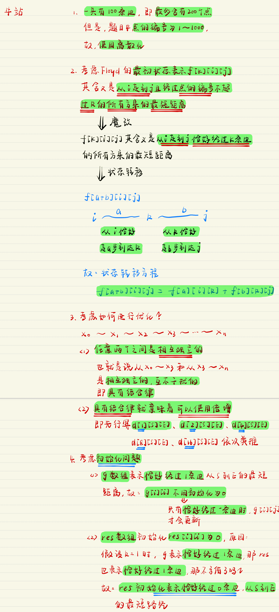

**代码**

```c++
#include <iostream>
#include <cstring>
#include <unordered_map>
using namespace std;
const int N = 210;
int n, m, k, S, E;
int g[N][N], res[N][N];
unordered_map<int, int> id;
void mul(int c[][N], int a[][N], int b[][N]) {
    // 由于c和a或者b相等, 为防止读写冲突
    // 因此, 使用tmp作为新的临时数组
    static int tmp[N][N];
    memset(tmp, 0x3f, sizeof tmp);
    // Floyd模板
    for (int k = 1; k <= n; k ++ )
        for (int i = 1; i <= n; i ++ )
            for (int j = 1; j <= n; j ++ )
                tmp[i][j] = min(tmp[i][j], a[i][k] + b[k][j]);
    memcpy(c, tmp, sizeof tmp);
    return;
}
void qmi() {
    // res表示经过0条边, 从S到E的最短路径
    // 故: res[i][i]初始化为0
    memset(res, 0x3f, sizeof res);
    for (int i = 1; i <= n; i ++ ) res[i][i] = 0;
    while (k) {
        if (k & 1) mul(res, res, g);
        // g倍增一次, 表示经过2条边, 从S走到E的最短距离
        // g倍增两次, 表示经过4条边, 从S走到E的最短距离
        // ... 依次类推
        mul(g, g, g);
        k >>= 1;
    }
    return;
}
int main() {
    // g数组表示经过1条边, 从S走到E的最短距离
    memset(g, 0x3f, sizeof g);
    scanf("%d%d%d%d", &k, &m, &S, &E);
    if (!id.count(S)) id[S] = ++ n;
    if (!id.count(E)) id[E] = ++ n;
    // 离散化
    S = id[S], E = id[E];
    for (int i = 0; i < m; i ++ ) {
        int a, b, c;
        scanf("%d%d%d", &c, &a, &b);
        if (!id.count(a)) id[a] = ++ n;
        if (!id.count(b)) id[b] = ++ n;
        a = id[a], b = id[b];
        // 防止重边
        g[a][b] = g[b][a] = min(g[a][b], c);
    }
    qmi();
    cout << res[S][E] << endl;
    return 0;
}
```

**时间复杂度**

$O(n^3log_k)$

**空间复杂度**

$O(n^2)$

**标签**

`Floyd`、`倍增`

**缝合怪**


## 最小生成树

### 正确性证明

#### `Prim`

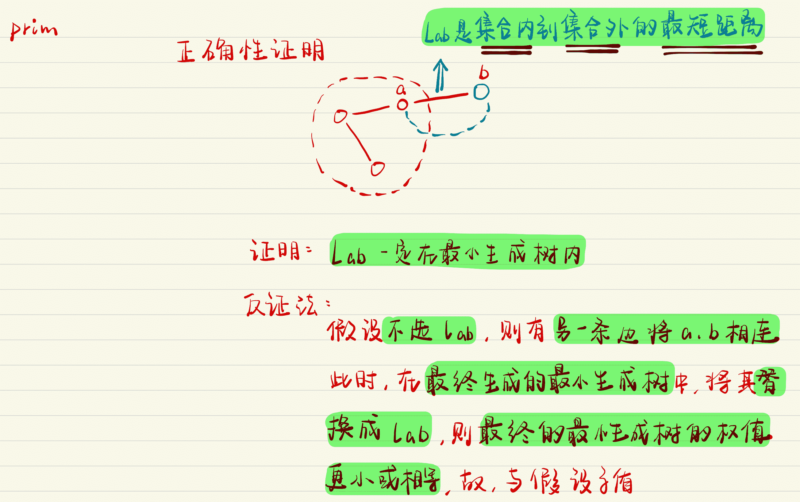

#### `Kruskal`

>   1.   同 `prim` 证明方法

### [AcWing 858. Prim算法求最小生成树](https://www.acwing.com/problem/content/860/)

**题目描述**

>   给定一个 `n` 个点 `m` 条边的无向图，图中可能存在重边和自环，边权可能为负数。
>
>   求最小生成树的树边权重之和，如果最小生成树不存在则输出 `impossible`。
>
>   给定一张边带权的无向图 `G=(V,E)`，其中 `V` 表示图中点的集合，`E` 表示图中边的集合，`n=|V|`，`m=|E|`。
>
>   由 `V` 中的全部 `n` 个顶点和 `E` 中 `n − 1` 条边构成的无向连通子图被称为 `G` 的一棵生成树，其中边的权值之和最小的生成树被称为无向图 `G` 的最小生成树。

**输入格式**

>   第一行包含两个整数 `n` 和 `m`。
>
>   接下来 `m` 行，每行包含三个整数 `u,v,w`，表示点 `u` 和点 `v` 之间存在一条权值为 `w` 的边。

**输出格式**

>   共一行，若存在最小生成树，则输出一个整数，表示最小生成树的树边权重之和，如果最小生成树不存在则输出 `impossible`。

**数据范围**

>   +   $1 ≤ n ≤ 500,$
>   +   $1 ≤ m ≤ 10^5,$
>   +   $图中涉及边的边权的绝对值均不超过 10000。$

**输入样例**

```c++
4 5
1 2 1
1 3 2
1 4 3
2 3 2
3 4 4
```

**输出样例**

```c++
6
```

**手写稿**

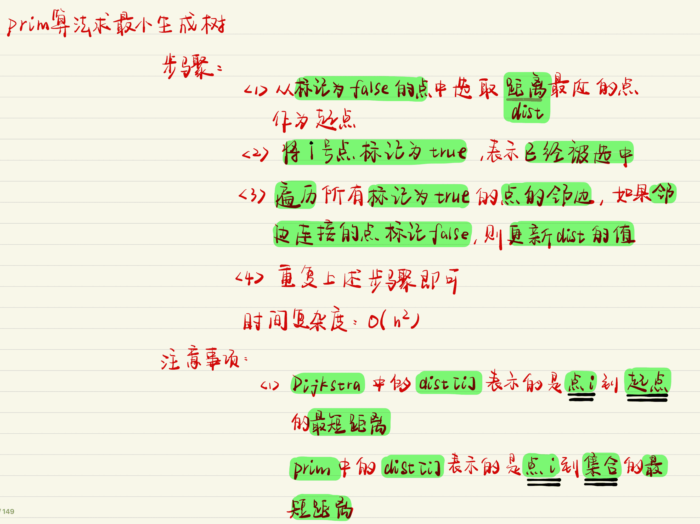

**代码**

```c++
#include <iostream>
#include <cstring>
using namespace std;
const int N = 510, INF = 0x3f3f3f3f;
int n, m;
int dist[N], st[N];
int g[N][N];
int prim() {
    // dist[i]表示点i到[集合]的点的距离
    memset(dist, 0x3f, sizeof dist);
    // st[i]表示点i是否加入到集合中
    memset(st, false, sizeof st);
    int res = 0;
    // 一共取n个点, 故, 循环n次
    for (int i = 0; i < n; i ++ ) {
        int t = -1;
        for (int j = 1; j <= n; j ++ )
            // 寻找距离[集合]的点的最小距离
            if (!st[j] && (t == -1 || dist[t] > dist[j]))
                t = j;
        // 标记当前点已经处于[集合]内
        st[t] = true;
        // 不连通, 返回false
        if (i && dist[t] == INF) return INF;
        if (i) res += dist[t];
        for (int j = 1; j <= n; j ++ )
            // 如果当前点处于[集合]外并且当前点到[集合]内的点的距离更小, 则更新
            if (!st[j] && dist[j] > g[t][j]) dist[j] = g[t][j];
    }
    return res;
}
int main() {
    scanf("%d%d", &n, &m);
    // 最小生成树不含有自环
    // 因此, 将g[i][i]之间的距离也初始化为+∞
    memset(g, 0x3f, sizeof g);
    for (int i = 0; i < m; i ++ ) {
        int a, b, c;
        scanf("%d%d%d", &a, &b, &c);
        // 取重边的最小值即可
        g[a][b] = g[b][a] = min(g[a][b], c);
    }
    int t = prim();
    if (t == INF) puts("impossible");
    else cout << t << endl;
    return 0;
}
```

**时间复杂度**

$O(n^2)$

**空间复杂度**

$O(n^2)$

**标签**

`最小生成树`、`prim`

**缝合怪**


### [AcWing 859. Kruskal算法求最小生成树](https://www.acwing.com/problem/content/861/)

**题目描述**

>   给定一个 `n` 个点 `m` 条边的无向图，图中可能存在重边和自环，边权可能为负数。
>
>   求最小生成树的树边权重之和，如果最小生成树不存在则输出 `impossible`。
>
>   给定一张边带权的无向图 `G=(V,E)`，其中 `V` 表示图中点的集合，`E` 表示图中边的集合，`n=|V|`，`m=|E|`。
>
>   由 `V` 中的全部 `n` 个顶点和 `E` 中 `n − 1` 条边构成的无向连通子图被称为 `G` 的一棵生成树，其中边的权值之和最小的生成树被称为无向图 `G` 的最小生成树。

**输入格式**

>   第一行包含两个整数 `n` 和 `m`。
>
>   接下来 `m` 行，每行包含三个整数 `u,v,w`，表示点 `u` 和点 `v` 之间存在一条权值为 `w` 的边。

**输出格式**

>   共一行，若存在最小生成树，则输出一个整数，表示最小生成树的树边权重之和，如果最小生成树不存在则输出 `impossible`。

**数据范围**

>   +   $1 ≤ n ≤ 10^5,$
>   +   $1 ≤ m ≤ 2 ∗ 10^5,$
>   +   $图中涉及边的边权的绝对值均不超过 1000。$

**输入样例**

```c++
4 5
1 2 1
1 3 2
1 4 3
2 3 2
3 4 4
```

**输出样例**

```c++
6
```

**手写稿**

>   1.   算法流程:
>        +   将所有边按照权值从小到大进行排序
>        +   依次遍历每条边, 如果边两端的点 `a` 和 `b` 不在一个集合`[并查集]`, 则将其加入最小生成树即可
>        +   重复上述步骤, 直到结束

**代码**

````c++
#include <iostream>
#include <algorithm>
using namespace std;
const int N = 100010, M = 200010;
int n, m;
int f[N];
struct Edge {
    int u, v, w;
    bool operator < (const Edge &W) const {
        // 按照权值从小到大进行排序
        return w < W.w;
    }
}edges[M];
int find(int x) {
    if (f[x] == x) return f[x];
    return f[x] = find(f[x]);
}
int main() {
    scanf("%d%d", &n, &m);
    for (int i = 1; i <= n; i ++ ) f[i] = i;
    for (int i = 0; i < m; i ++ ) {
        int a, b, c;
        scanf("%d%d%d", &a, &b, &c);
        edges[i] = {a, b, c};
    }
    sort(edges, edges + m);
    // res是最小生成树的权值
    // cnt是最小生成树的边数
    int res = 0, cnt = 0;
    for (int i = 0; i < m; i ++ ) {
        int a = edges[i].u;
        int b = edges[i].v;
        int c = edges[i].w;
        int fa = find(a);
        int fb = find(b);
        if (fa != fb) { // 如果不处于一个集合当中
            res += c; // 权值相加
            f[fb] = fa; // 强行融合为一个和和睦睦的大家庭
            cnt ++; // 边数 ++
        }
    }
    // 如果最小生成树的边的个数小于 n - 1, 则说明不连通, 输出 "impossible"
    if (cnt < n - 1) puts("impossible");
    else cout << res << endl;
    return 0;
}
````

**时间复杂度**

$O(mlog_m)$

**空间复杂度**

$O(m)$

**标签**

`kruskal`、`最小生成树`

**缝合怪**

[AcWing 837. 连通块中点的数量](#AcWing 837. 连通块中点的数量)

### [AcWing 1140. 最短网络](https://www.acwing.com/problem/content/1142/)

**题目描述**

>   农夫约翰被选为他们镇的镇长！
>
>   他其中一个竞选承诺就是在镇上建立起互联网，并连接到所有的农场。
>
>   约翰已经给他的农场安排了一条高速的网络线路，他想把这条线路共享给其他农场。
>
>   约翰的农场的编号是 `1`，其他农场的编号是 `2 ∼ n`。
>
>   为了使花费最少，他希望用于连接所有的农场的光纤总长度尽可能短。
>
>   你将得到一份各农场之间连接距离的列表，你必须找出能连接所有农场并使所用光纤最短的方案。

**输入格式**

>   第一行包含一个整数 `n`，表示农场个数。
>
>   接下来 `n` 行，每行包含 `n` 个整数，输入一个对角线上全是 `0` 的对称矩阵。
>   其中第 `x + 1` 行 `y` 列的整数表示连接农场 `x` 和农场 `y` 所需要的光纤长度。

**输出格式**

>   输出一个整数，表示所需的最小光纤长度。

**数据范围**

>   +   $3 ≤ n ≤ 100$
>   +   $每两个农场间的距离均是非负整数且不超过100000。$

**输入样例**

```c++
4
0  4  9  21
4  0  8  17
9  8  0  16
21 17 16  0
```

**输出样例**

```c++
28
```

**手写稿**

>   1.   裸的 `prim` 算法

**代码**

```c++
#include <iostream>
#include <cstring>
using namespace std;
const int N = 110;
int n;
int dist[N], st[N];
int g[N][N];
int prim() {
    memset(dist, 0x3f, sizeof dist);
    memset(st, false, sizeof st);
    int res = 0;
    for (int i = 0; i < n; i ++ ) {
        int t = -1;
        for (int j = 1; j <= n; j ++ )
            if (!st[j] && (t == -1 || dist[t] > dist[j]))
                t = j;
        st[t] = true;
        if (i) res += dist[t];
        for (int j = 1; j <= n; j ++ )
            dist[j] = min(dist[j], g[t][j]);
    }
    return res;
}
int main() {
    scanf("%d", &n);
    // 下标从1开始
    for (int i = 1; i <= n; i ++ )
        for (int j = 1; j <= n; j ++ )
            scanf("%d", &g[i][j]);
    cout << prim() << endl;
    return 0;
}
```

**时间复杂度**

$O(n^2)$

**空间复杂度**

$O(n^2)$

**标签**

`prim`、`最小生成树`

**缝合怪**


### [AcWing 1141. 局域网](https://www.acwing.com/problem/content/1143/)

**题目描述**

>   某个局域网内有 `n` 台计算机和 `k` 条 **双向** 网线，计算机的编号是 `1 ∼ n`。由于搭建局域网时工作人员的疏忽，现在局域网内的连接形成了回路，我们知道如果局域网形成回路那么数据将不停的在回路内传输，造成网络卡的现象。
>
>   **注意**：
>
>   -   对于某一个连接，虽然它是双向的，但我们不将其当做回路。本题中所描述的回路至少要包含两条不同的连接。
>   -   两台计算机之间最多只会存在一条连接。
>   -   不存在一条连接，它所连接的两端是同一台计算机。
>
>   因为连接计算机的网线本身不同，所以有一些连线不是很畅通，我们用 `f(i, j)` 表示 `i, j` 之间连接的畅通程度，`f(i, j)` 值越小表示 `i, j`之间连接越通畅。
>
>   现在我们需要解决回路问题，我们将除去一些连线，使得网络中没有回路且不影响连通性（即如果之前某两个点是连通的，去完之后也必须是连通的），并且被除去网线的 `Σf(i, j)` 最大，请求出这个最大值。

**输入格式**

>   第一行两个正整数 `n, k`。
>
>   接下来的 `k` 行每行三个正整数 `i, j, m` 表示 `i, j` 两台计算机之间有网线联通，通畅程度为 `m`。

**输出格式**

>   一个正整数，表示被除去网线的 `Σf(i, j)` 的最大值。

**数据范围**

>   +   $1 ≤ n ≤ 100$
>   +   $0 ≤ k ≤ 200$
>   +   $1 ≤ f(i, j) ≤ 1000$

**输入样例**

```c++
5 5
1 2 8
1 3 1
1 5 3
2 4 5
3 4 2
```

**输出样例**

```c++
8
```

**手写稿**

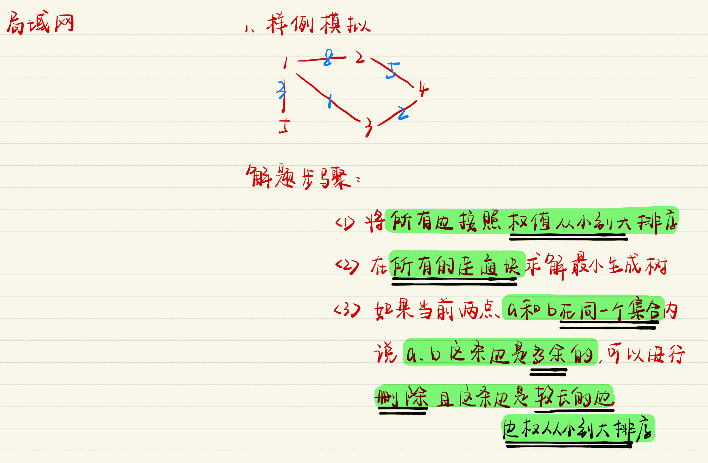

**代码**

```c++
#include <iostream>
#include <algorithm>
using namespace std;
const int N = 110, M = 210;
struct Edge {
    int u, v, w;
    bool operator < (const Edge &W) const {
        // 按照权值从小到大排序
        return w < W.w;
    }
}edges[M];
int n, m;
int f[N];
int find(int x) {
    if (f[x] == x) return f[x];
    return f[x] = find(f[x]);
}
int main() {
    scanf("%d%d", &n, &m);
    for (int i = 1; i <= n; i ++ ) f[i] = i;
    for (int i = 0; i < m; i ++ ) {
        int a, b, c;
        scanf("%d%d%d", &a, &b, &c);
        edges[i] = {a, b, c};
    }
    sort(edges, edges + m);
    int res = 0;
    for (int i = 0; i < m; i ++ ) {
        int a = edges[i].u;
        int b = edges[i].v;
        int c = edges[i].w;
        int fa = find(a); // 找到其祖先
        int fb = find(b); // 找到其祖先
        if (fa != fb) f[fb] = fa;
        // 当其已经处于一个连通块中, 则说明可以将其删除, 同时, 累加其值
        else res += c;
    }
    cout << res << endl;
    return 0;
}
```

**时间复杂度**

$O(mlog_m)$

**空间复杂度**

$O(m)$

**标签**

`最小生成树`、`并查集`

**缝合怪**


### [AcWing 1142. 繁忙的都市](https://www.acwing.com/problem/content/1144/)

**题目描述**

>   城市 `C` 是一个非常繁忙的大都市，城市中的道路十分的拥挤，于是市长决定对其中的道路进行改造。
>
>   城市 `C` 的道路是这样分布的：
>
>   城市中有 `n` 个交叉路口，编号是 `1 ∼ n`，有些交叉路口之间有道路相连，两个交叉路口之间最多有一条道路相连接。
>
>   这些道路是 **双向** 的，且把所有的交叉路口直接或间接的连接起来了。
>
>   每条道路都有一个分值，分值越小表示这个道路越繁忙，越需要进行改造。
>
>   但是市政府的资金有限，市长希望进行改造的道路越少越好，于是他提出下面的要求：
>
>   1．改造的那些道路能够把所有的交叉路口直接或间接的连通起来。
>
>   2．在满足要求 `1` 的情况下，改造的道路尽量少。
>
>   3．在满足要求 `1、2` 的情况下，改造的那些道路中分值最大值尽量小。
>
>   作为市规划局的你，应当作出最佳的决策，选择哪些道路应当被修建。

**输入格式**

>   第一行有两个整数 `n, m` 表示城市有 `n` 个交叉路口，`m` 条道路。
>
>   接下来 `m` 行是对每条道路的描述，每行包含三个整数 `u, v, c` 表示交叉路口 `u` 和 `v` 之间有道路相连，分值为 `c`。

**输出格式**

>   两个整数 `s, max`，表示你选出了几条道路，分值最大的那条道路的分值是多少。

**数据范围**

>   +   $1 ≤ n ≤ 300,$
>   +   $1 ≤ m ≤ 8000,$
>   +   $1 ≤ c ≤ 10000$

**输入样例**

```c++
4 5
1 2 3
1 4 5
2 4 7
2 3 6
3 4 8
```

**输出样例**

```c++
3 6
```

**手写稿**

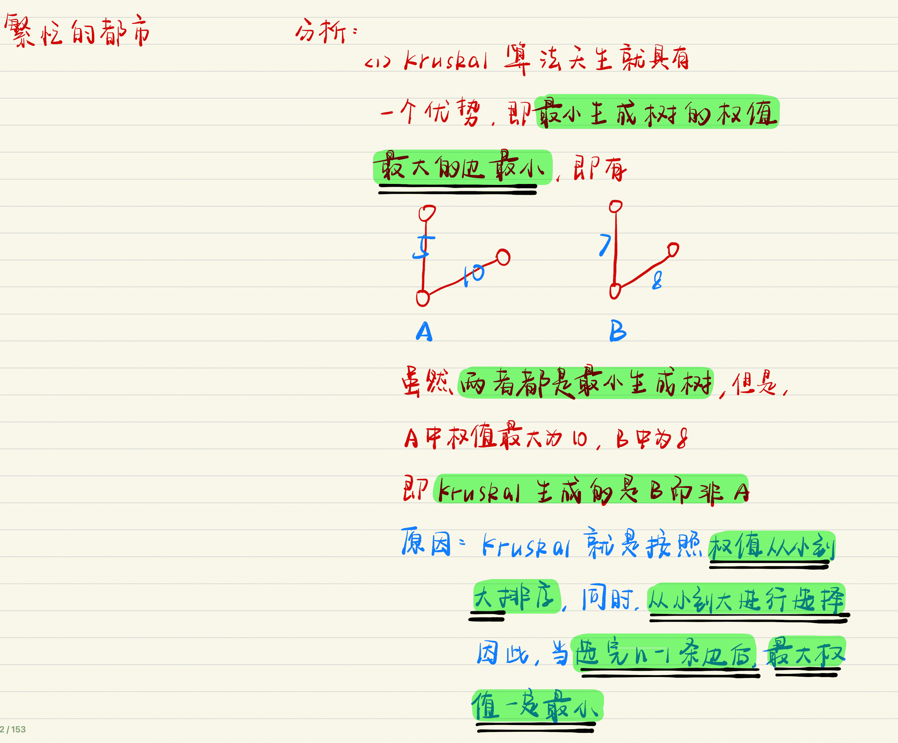

**代码**

```c++
#include <iostream>
#include <algorithm>
using namespace std;
const int N = 310, M = 8010;
struct Edge {
    int u, v, w;
    bool operator < (const Edge &W) const {
        // 按照权值从小到大进行排序
        return w < W.w;
    }
}edges[M];
int n, m;
int f[N];
int find(int x) {
    if (f[x] == x) return f[x];
    return f[x] = find(f[x]);
}
int main() {
    scanf("%d%d", &n, &m);
    for (int i = 1; i <= n; i ++ ) f[i] = i;
    for (int i = 0; i < m; i ++ ) {
        int a, b, c;
        scanf("%d%d%d", &a, &b, &c);
        edges[i] = {a, b, c};
    }
    sort(edges, edges + m);
    int Max = 0;
    for (int i = 0; i < m; i ++ ) {
        int a = edges[i].u;
        int b = edges[i].v;
        int c = edges[i].w;
        int fa = find(a);
        int fb = find(b);
        if (fa != fb) {
            f[fb] = fa;
            Max = c;
        }
    }
    cout << n - 1 << " " << Max << endl;
    return 0;
}
```

**时间复杂度**

$O(mlog_m)$

**空间复杂度**

$O(m)$

**标签**


**缝合怪**


### [AcWing 1143. 联络员](https://www.acwing.com/problem/content/1145/)

**题目描述**

>   `Tyvj` 已经一岁了，网站也由最初的几个用户增加到了上万个用户，随着 `Tyvj` 网站的逐步壮大，管理员的数目也越来越多，现在你身为 `Tyvj` 管理层的联络员，希望你找到一些通信渠道，使得管理员两两都可以联络（直接或者是间接都可以）。本题中所涉及的通信渠道都是 **双向** 的。
>
>   `Tyvj` 是一个公益性的网站，没有过多的利润，所以你要尽可能的使费用少才可以。
>
>   目前你已经知道，`Tyvj` 的通信渠道分为两大类，一类是必选通信渠道，无论价格多少，你都需要把所有的都选择上；还有一类是选择性的通信渠道，你可以从中挑选一些作为最终管理员联络的通信渠道。
>
>   数据保证给出的通信渠道可以让所有的管理员联通。
>
>   **注意：** 对于某两个管理员 `u, v`，他们之间可能存在多条通信渠道，你的程序应该累加所有 `u, v` 之间的必选通行渠道。

**输入格式**

>   第一行两个整数 `n，m` 表示 `Tyvj` 一共有 `n` 个管理员，有 `m` 个通信渠道;
>
>   第二行到 `m + 1` 行，每行四个非负整数，`p, u, v, w` 当 `p = 1` 时，表示这个通信渠道为必选通信渠道；当 `p = 2` 时，表示这个通信渠道为选择性通信渠道；`u, v, w` 表示本条信息描述的是 `u，v` 管理员之间的通信渠道，`u` 可以收到 `v` 的信息，`v` 也可以收到 `u` 的信息，`w` 表示费用。

**输出格式**

>   一个整数，表示最小的通信费用。

**数据范围**

>   +   $1 ≤ n ≤ 2000$
>   +   $1 ≤ m ≤ 10000$

**输入样例**

```c++
5 6
1 1 2 1
1 2 3 1
1 3 4 1
1 4 1 1
2 2 5 10
2 2 5 5
```

**输出样例**

```c++
9
```

**手写稿**

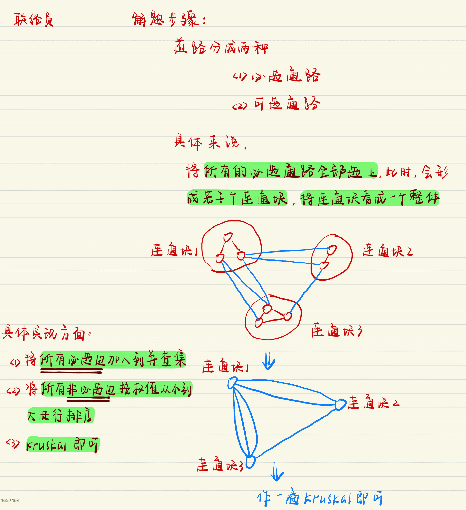

**代码**

```c++
#include <iostream>
#include <algorithm>
using namespace std;
const int N = 2010, M = 10010;
struct Edge {
    int u, v, w;
    bool operator < (const Edge &W) const {
        return w < W.w;
    }
}edges[M];
int n, m;
int f[N];
int find(int x) {
    if (f[x] == x) return f[x];
    return f[x] = find(f[x]);
}
int main() {
    scanf("%d%d", &n, &m);
    for (int i = 1; i <= n; i ++ ) f[i] = i;
    int res = 0, cnt = 0;
    for (int i = 0; i < m; i ++ ) {
        int p, a, b, c;
        scanf("%d%d%d%d", &p, &a, &b, &c);
        // 只要是必选通道, 则必须加上, 不管之前是否处于同一个连通块内
        if (p == 1) {
            int fa = find(a);
            int fb = find(b);
            f[fb] = fa;
            res += c;
        }
        else edges[cnt ++ ] = {a, b, c};
    }
    sort(edges, edges + cnt);
    for (int i = 0; i < cnt; i ++ ) {
        int a = edges[i].u;
        int b = edges[i].v;
        int c = edges[i].w;
        int fa = find(a);
        int fb = find(b);
        // 可选通道, 如果已经处于同一个连通块内, 则不需要在累加权值
        if (fa == fb) continue;
        f[fb] = fa;
        res += c;
    }
    cout << res << endl;
    return 0;
}
```

**时间复杂度**

$O(m)$

**空间复杂度**

$O(m)$

**标签**

`Kruskal`、`并查集`

**缝合怪**


### [AcWing 1144. 连接格点](https://www.acwing.com/problem/content/1146/)

**题目描述**

>   有一个 `m` 行 `n` 列的点阵，相邻两点可以相连。
>
>   一条纵向的连线花费一个单位，一条横向的连线花费两个单位。
>
>   某些点之间已经有连线了，试问至少还需要花费多少个单位才能使所有的点全部连通。

**输入格式**

>   第一行输入两个正整数 `m` 和 `n`。
>
>   以下若干行每行四个正整数 $x_1,y_1,x_2,y_2$，表示第 $x_1$ 行第 $y_1$ 列的点和第 $x_2$ 行第 $y_2$ 列的点已经有连线。
>
>   输入保证$|x_1 − x_2| + |y_1 − y_2| = 1$。

**输出格式**

>   输出使得连通所有点还需要的最小花费。

**数据范围**

>   +   $1 ≤ m, n ≤ 1000$
>   +   $0 ≤ 已经存在的连线数 ≤ 10000$

**输入样例**

```c++
2 2
1 1 2 1
```

**输出样例**

```c++
3
```

**手写稿**

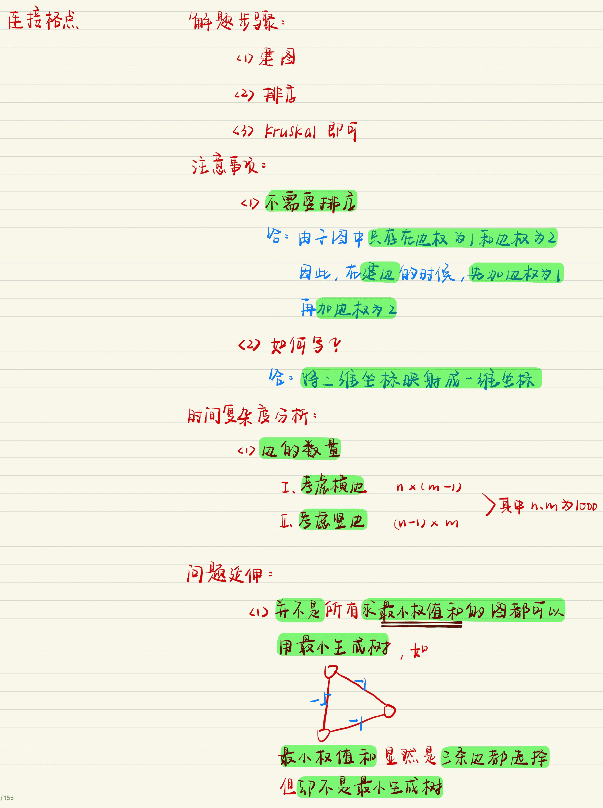

**代码**

```c++
#include <iostream>
using namespace std;
const int N = 1010, M = N * N, K = 2 * N * N;
struct Edge {
    int u, v, w;
}edges[K];
int n, m, k;
int f[M];
int g[N][N];
int find(int x) {
    if (f[x] == x) return f[x];
    return f[x] = find(f[x]);
}
void get_edges() {
    int dx[4] = {-1, 0, 1, 0};
    int dy[4] = {0, 1, 0, -1};
    // 四个方向上的权值
    int dw[4] = {1, 2, 1, 2};
    // 遍历两种情况, 一种是横向, 另一种是纵向
    for (int z = 0; z < 2; z ++ )
        for (int x = 1; x <= n; x ++ )
            for (int y = 1; y <= m; y ++ )
                for (int u = 0; u < 4; u ++ ) {
                    int tx = x + dx[u];
                    int ty = y + dy[u];
                    // 越界, 则返回即可
                    if (tx <= 0 || tx > n || ty <= 0 || ty > m) continue;
                    // 获取二维坐标对应的一维坐标
                    int a = g[x][y];
                    int b = g[tx][ty];
                    // 如果 3 -> 5 有条边相连接, 则 5 -> 3 不需要再进行连边
                    // 如果非要进行连边, 则记得K需要再大打一倍, 4 * N * N
                    if (a > b) continue;
                    // 如果当前的情况等于z, z = 0 代表横向, 1 代表纵向
                    if (u % 2 == z) edges[k ++ ] = {a, b, dw[z]};
                }
    return;
}
int main() {
    scanf("%d%d", &n, &m);
    for (int i = 1; i <= n * m; i ++ ) f[i] = i;
    for (int i = 1, t = 0; i <= n; i ++ )
        for (int j = 1; j <= m; j ++ )
            g[i][j] = ++ t;
    int x1, y1, x2, y2;
    while (~scanf("%d%d%d%d", &x1, &y1, &x2, &y2)) {
        int a = g[x1][y1];
        int b = g[x2][y2];
        int fa = find(a);
        int fb = find(b);
        if (fa == fb) continue;
        f[fb] = fa;
    }
    get_edges();
    int res = 0;
    for (int i = 0; i < k; i ++ ) {
        int a = edges[i].u;
        int b = edges[i].v;
        int c = edges[i].w;
        int fa = find(a);
        int fb = find(b);
        if (fa == fb) continue;
        f[fb] = fa;
        res += c;
    }
    cout << res << endl;
    return 0;
}
```

**时间复杂度**

$O(nm)$

**空间复杂度**

$O(n ^ 2)$

**标签**

`最小生成树`、`Kruskal`、`并查集`

**缝合怪**


## 最小生成树的扩展应用

### [AcWing 1146. 新的开始](https://www.acwing.com/problem/content/1148/)

**题目描述**

>   发展采矿业当然首先得有矿井，小 `F` 花了上次探险获得的千分之一的财富请人在岛上挖了 `n` 口矿井，但他似乎忘记了考虑矿井供电问题。
>
>   为了保证电力的供应，小 `F` 想到了两种办法：
>
>   1.  在矿井 `i` 上建立一个发电站，费用为 $v_i$（发电站的输出功率可以供给任意多个矿井）。
>   2.  将这口矿井 `i` 与另外的已经有电力供应的矿井 `j` 之间建立电网，费用为 $p_{i,j}$。
>
>   小 `F` 希望你帮他想出一个保证所有矿井电力供应的最小花费方案。

**输入格式**

>   第一行包含一个整数 `n`，表示矿井总数。
>
>   接下来 `n` 行，每行一个整数，第 `i` 个数 $v_i$ 表示在第 `i` 口矿井上建立发电站的费用。
>
>   接下来为一个 `n × n` 的矩阵 `P`，其中 $p_{i,j}$ 表示在第 `i` 口矿井和第 `j` 口矿井之间建立电网的费用。
>
>   数据保证 $p_{i,j} = p_{j,i}$，且 $p_{i,i} = 0$。

**输出格式**

>   输出一个整数，表示让所有矿井获得充足电能的最小花费。

**数据范围**

>   +   $1 ≤ n ≤ 300,$
>   +   $0 ≤ v_i, p_{i, j} ≤ 10^5$

**输入样例**

```c++
4
5
4
4
3
0 2 2 2
2 0 3 3
2 3 0 4
2 3 4 0
```

**输出样例**

```c++
9
```

**手写稿**

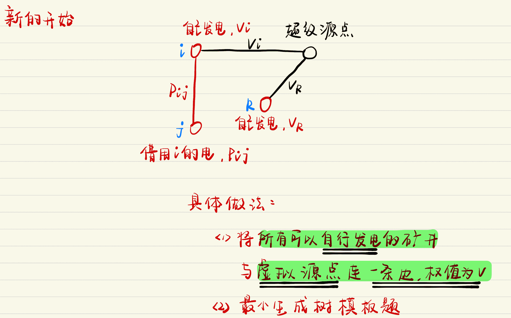

**代码**

```c++
#include <iostream>
#include <cstring>
using namespace std;
const int N = 310;
int n;
int dist[N], st[N];
int g[N][N];
// prim模板
int prim() {
    memset(dist, 0x3f, sizeof dist);
    memset(st, false, sizeof st);
    int res = 0;
    // 注意有 n + 1 个点, 范围0 ~ n
    for (int i = 0; i < n + 1; i ++ ) {
        int t = -1;
        for (int j = 0; j <= n; j ++ )
            if (!st[j] && (t == -1 || dist[t] > dist[j]))
                t = j;
        st[t] = true;
        if (t) res += dist[t];
        for (int j = 0; j <= n; j ++ ) {
            if (st[j]) continue;
            dist[j] = min(dist[j], g[t][j]);
        }
    }
    return res;
}
int main() {
    scanf("%d", &n);
    // 将所有能够自己发电的矿井和虚拟源点连一条边即可
    for (int i = 1; i <= n; i ++ ) {
        scanf("%d", &g[0][i]);
        g[i][0] = g[0][i];
    }
    for (int i = 1; i <= n; i ++ )
        for (int j = 1; j <= n; j ++ ) {
            scanf("%d", &g[i][j]);
            g[j][i] = g[i][j];
        }
    cout << prim() << endl;
    return 0;
}
```

**时间复杂度**

$O(n^2)$

**空间复杂度**

$O(n^2)$

**标签**

`虚拟源点`、`Prim`、`最小生成树`

**缝合怪**


### [AcWing 1145. 北极通讯网络](https://www.acwing.com/problem/content/1147/)

**题目描述**

>   北极的某区域共有 `n` 座村庄，每座村庄的坐标用一对整数 `(x, y)` 表示。
>
>   为了加强联系，决定在村庄之间建立通讯网络，使每两座村庄之间都可以直接或间接通讯。
>
>   通讯工具可以是无线电收发机，也可以是卫星设备。
>
>   无线电收发机有多种不同型号，不同型号的无线电收发机有一个不同的参数 `d`，两座村庄之间的距离如果不超过 `d`，就可以用该型号的无线电收发机直接通讯，`d` 值越大的型号价格越贵。现在要先选择某一种型号的无线电收发机，然后统一给所有村庄配备，**数量不限**，但型号都是 **相同的**。
>
>   配备卫星设备的两座村庄无论相距多远都可以直接通讯，但卫星设备是 **有限的**，只能给一部分村庄配备。
>
>   现在有 `k` 台卫星设备，请你编一个程序，计算出应该如何分配这 `k` 台卫星设备，才能使所配备的无线电收发机的 `d` 值最小。
>
>   例如，对于下面三座村庄：
>
>   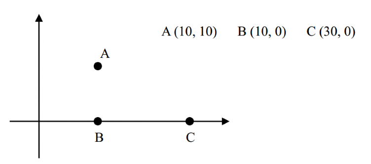
>
>   其中，$|AB| = 10, |BC| = 20, |AC| = 10\sqrt{5} ≈ 22.36$。
>
>   如果没有任何卫星设备或只有 `1` 台卫星设备 (`k = 0` 或 `k = 1`)，则满足条件的最小的 `d = 20`，因为 `A` 和 `B`，`B` 和 `C` 可以用无线电直接通讯；而 `A` 和 `C` 可以用 `B` 中转实现间接通讯 (即消息从 `A` 传到 `B`，再从 `B` 传到 `C`)；
>
>   如果有 `2` 台卫星设备 (`k = 2`)，则可以把这两台设备分别分配给 `B` 和 `C` ，这样最小的 `d` 可取 `10`，因为 `A` 和 `B` 之间可以用无线电直接通讯；`B` 和 `C` 之间可以用卫星直接通讯；`A` 和 `C` 可以用 `B` 中转实现间接通讯。
>
>   如果有 `3` 台卫星设备，则 `A,B,C` 两两之间都可以直接用卫星通讯，最小的 `d` 可取 `0`。

**输入格式**

>   第一行为由空格隔开的两个整数 `n, k`;
>
>   接下来 `n` 行，每行两个整数，第 `i` 行的 $x_i, y_i$ 表示第 `i` 座村庄的坐标 $(x_i, y_i)$。

**输出格式**

>   一个实数，表示最小的 `d` 值，结果保留 `2` 位小数。

**数据范围**

>   +   $1 ≤ n ≤ 500,$
>   +   $0 ≤ x, y ≤ 10^4,$
>   +   $0 ≤ k ≤ 100$

**输入样例**

```c++
3 2
10 10
10 0
30 0
```

**输出样例**

```c++
10.00
```

**手写稿**

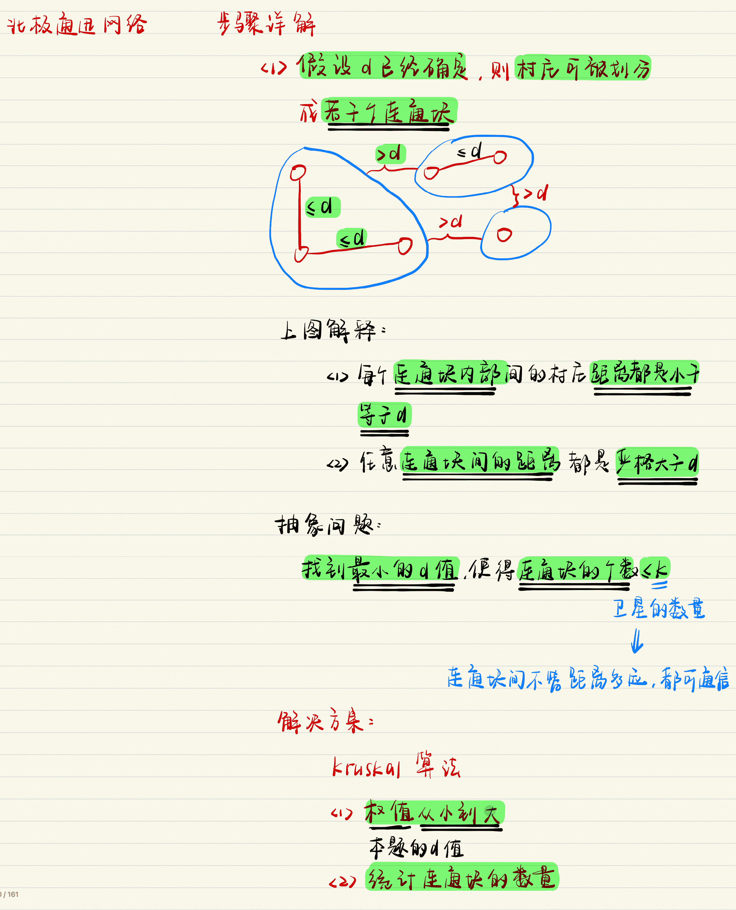

**代码**

```c++
#include <iostream>
#include <algorithm>
#include <cmath>
#define x first
#define y second
using namespace std;
typedef pair<int, int> PII;
const int N = 510, M = N * N / 2;
struct Edge {
    int u, v;
    // 距离是 double 类型
    double w;
    bool operator < (const Edge& W) const {
        return w < W.w;
    }
}edges[M];
int n, m, k;
int f[N];
PII g[N];
double get_dist(PII a, PII b) {
    int dx = a.x - b.x;
    int dy = a.y - b.y;
    return sqrt(dx * dx + dy * dy);
}
int find(int x) {
    if (f[x] == x) return f[x];
    return f[x] = find(f[x]);
}
int main() {
    scanf("%d%d", &n, &k);
    for (int i = 0; i < n; i ++ ) f[i] = i;
    for (int i = 0; i < n; i ++ )
        scanf("%d%d", &g[i].x, &g[i].y);
    for (int i = 0; i < n; i ++ )
        for (int j = 0; j < i; j ++ )
            edges[m ++ ] = {i, j, get_dist(g[i], g[j])};
    sort(edges, edges + m);
    // 一开始所有点各自为政, 故, 连通块的数量为n
    int cnt = n;
    double res = 0;
    for (int i = 0; i < m; i ++ ) {
        if (cnt <= k) break;
        int a = edges[i].u;
        int b = edges[i].v;
        double c = edges[i].w;
        int fa = find(a);
        int fb = find(b);
        if (fa == fb) continue;
        // 每次加入一条边, 说明连通块的数量 --
        f[fb] = fa;
        cnt --;
        res = c;
    }
    printf("%.2lf\n", res);
    return 0;
}
```

**时间复杂度**

$O(m)$

**空间复杂度**

$O(m)$

**标签**

`最小生成树`、`Kruskal`

**缝合怪**


### [AcWing 346. 走廊泼水节](https://www.acwing.com/problem/content/348/)

**题目描述**

>   给定一棵 `N` 个节点的树，要求增加若干条边，把这棵树扩充为完全图，并满足图的唯一最小生成树仍然是这棵树。
>
>   求增加的边的权值总和最小是多少。
>
>   **注意：** 树中的所有边权均为整数，且新加的所有边权也必须为整数。

**输入格式**

>   第一行包含整数 `t`，表示共有 `t` 组测试数据。
>
>   对于每组测试数据，第一行包含整数 `N`。
>
>   接下来 `N − 1` 行，每行三个整数 `X, Y, Z`，表示 `X` 节点与 `Y` 节点之间存在一条边，长度为 `Z`。

**输出格式**

>   每组数据输出一个整数，表示权值总和最小值。
>
>   每个结果占一行。

**数据范围**

>   +   $1 ≤ N ≤ 6000$
>   +   $1 ≤ Z ≤ 100$

**输入样例**

```c++
2
3
1 2 2
1 3 3
4
1 2 3
2 3 4
3 4 5 
```

**输出样例**

```c++
4
17 
```

**手写稿**

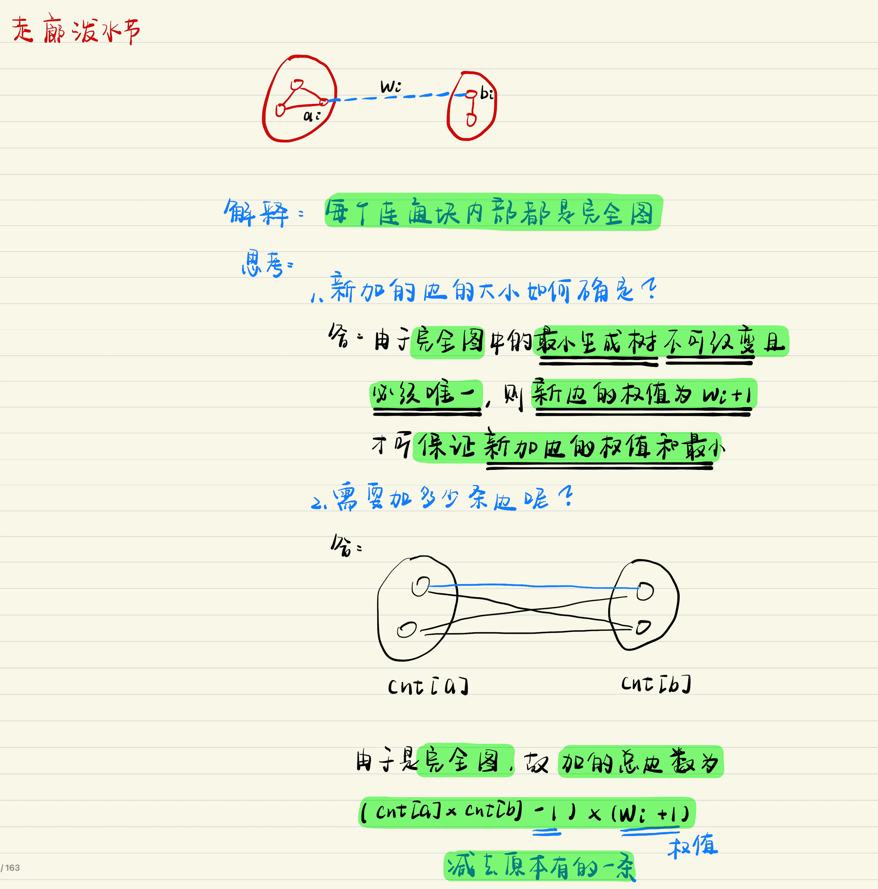

**代码**

```c++
#include <iostream>
#include <algorithm>
using namespace std;
const int N = 6010;
struct Edge {
    int u, v, w;
    bool operator < (const Edge &W) const {
        return w < W.w;
    }
}edges[N];
int n, T;
int f[N], cnt[N];
int find(int x) {
    if (f[x] == x) return f[x];
    return f[x] = find(f[x]);
}
int main() {
    scanf("%d", &T);
    while (T -- ) {
        scanf("%d", &n);
        for (int i = 1; i <= n; i ++ ) f[i] = i, cnt[i] = 1;
        for (int i = 0; i < n - 1; i ++ ) {
            int a, b, c;
            scanf("%d%d%d", &a, &b, &c);
            edges[i] = {a, b, c};
        }
        sort(edges, edges + n - 1);
        int res = 0;
        for (int i = 0; i < n - 1; i ++ ) {
            int a = edges[i].u;
            int b = edges[i].v;
            int c = edges[i].w;
            int fa = find(a);
            int fb = find(b);
            if (fa == fb) continue;
            // 完全图边数
            res += (cnt[fa] * cnt[fb] - 1) * (c + 1);
            f[fb] = fa;
            // 统计个数
            cnt[fa] += cnt[fb];
        }
        cout << res << endl;
    }
    return 0;
}
```

**时间复杂度**

$O(n)$

**空间复杂度**

$O(n)$

**标签**

`最小生成树`

**缝合怪**


### [AcWing 1148. 秘密的牛奶运输](https://www.acwing.com/problem/content/1150/)

**题目描述**

>   农夫约翰要把他的牛奶运输到各个销售点。
>
>   运输过程中，可以先把牛奶运输到一些销售点，再由这些销售点分别运输到其他销售点。
>
>   运输的总距离越小，运输的成本也就越低。
>
>   低成本的运输是农夫约翰所希望的。
>
>   不过，他并不想让他的竞争对手知道他具体的运输方案，所以他希望采用费用第二小的运输方案而不是最小的。
>
>   现在请你帮忙找到该运输方案。
>
>   **注意：**
>
>   -   如果两个方案至少有一条边不同，则我们认为是不同方案；
>   -   费用第二小的方案在数值上一定要严格大于费用最小的方案；
>   -   答案保证一定有解；

**输入格式**

>   第一行是两个整数 `N, M`，表示销售点数和交通线路数；
>
>   接下来 `M` 行每行 `3` 个整数 `x, y, z`，表示销售点 `x` 和销售点 `y` 之间存在线路，长度为 `z`。

**输出格式**

>   输出费用第二小的运输方案的运输总距离。

**数据范围**

>   +   $1 ≤ N ≤ 500,$
>   +   $1 ≤ M ≤ 10^4,$
>   +   $1 ≤ z ≤ 10^9,$
>   +   $数据中可能包含重边。$

**输入样例**

```c++
4 4
1 2 100
2 4 200
2 3 250
3 4 100
```

**输出样例**

```c++
450
```

**手写稿**


**代码**

```c++
#include <iostream>
#include <cstring>
#include <algorithm>
using namespace std;
typedef long long LL;
const int N = 510, M = 10010, K = N * 2;
struct Edge {
    int u, v, w;
    bool flag;
    bool operator < (const Edge &W) const {
        return w < W.w;
    }
}edges[M];
int n, m, idx;
int f[N], h[N], e[K], w[K], ne[K];
int dist1[N][N], dist2[N][N];
int find(int x) {
    if (f[x] == x) return f[x];
    return f[x] = find(f[x]);
}
void add(int a, int b, int c) {
    e[idx] = b;
    w[idx] = c;
    ne[idx] = h[a];
    h[a] = idx ++;
    return;
}
void dfs(int u, int father, int Max1, int Max2, int dist1[], int dist2[]) {
    dist1[u] = Max1, dist2[u] = Max2;
    for (int i = h[u]; i != -1; i = ne[i]) {
        int j = e[i];
        if (j == father) continue;
        // 必须新开变量进行记录, 原因: [手写稿]
        int tMax1 = Max1, tMax2 = Max2;
        if (w[i] > tMax1) {
            tMax2 = tMax1;
            tMax1 = w[i];
        }
        // 最大值必须要严格大于次大值, 因此, 这里必须判断w[i] < tMax1
        // 不加判断的话, 则有可能会出现 w[i] == tMax1的情况
        else if (w[i] < tMax1 && w[i] > tMax2) tMax2 = w[i];
        dfs(j, u, tMax1, tMax2, dist1, dist2);
    }
    return;
}
int main() {
    scanf("%d%d", &n, &m);
    memset(h, -1, sizeof h);
    for (int i = 1; i <= n; i ++ ) f[i] = i;
    for (int i = 0; i < m; i ++ ) {
        int a, b, c;
        scanf("%d%d%d", &a, &b, &c);
        edges[i] = {a, b, c};
    }
    sort(edges, edges + m);
    // long long 类型
    LL sum = 0;
    for (int i = 0; i < m; i ++ ) {
        int a = edges[i].u;
        int b = edges[i].v;
        int c = edges[i].w;
        int fa = find(a);
        int fb = find(b);
        if (fa == fb) continue;
        f[fb] = fa;
        edges[i].flag = true;
        sum += c;
        // 给最小生成树加边
        add(a, b, c);
        add(b, a, c);
    }
    for (int i = 1; i <= n; i ++ ) dfs(i, -1, 0, 0, dist1[i], dist2[i]);
    // long long 类型
    LL res = 1e18;
    for (int i = 0; i < m; i ++ ) {
        // 如果是树边, 则跳过此次循环
        if (edges[i].flag) continue;
        int a = edges[i].u;
        int b = edges[i].v;
        int c = edges[i].w;
        // 最短路径
        if (c > dist1[a][b]) res = min(res, sum - dist1[a][b] + c);
        // 次短路径
        else if (c > dist2[a][b]) res = min(res, sum - dist2[a][b] + c);
    }
    printf("%lld\n", res);
    return 0;
}
```

**时间复杂度**

$O(mlog_m)$

**空间复杂度**

$O(n^2)$

**标签**

`次小生成树`

**缝合怪**


## 负环

### 概述

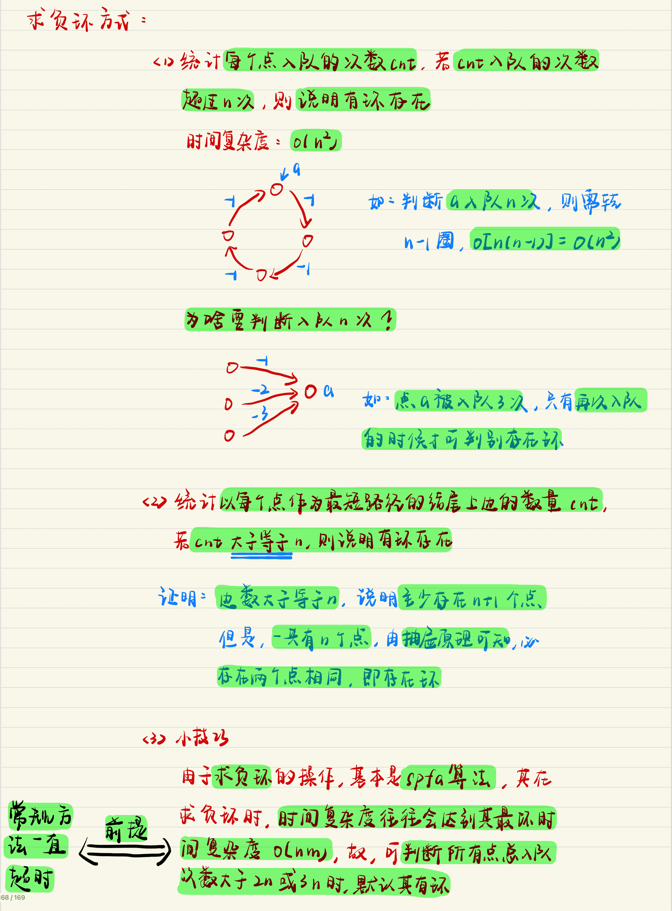

### [AcWing 904. 虫洞](https://www.acwing.com/problem/content/906/)

**题目描述**

>   农夫约翰在巡视他的众多农场时，发现了很多令人惊叹的虫洞。
>
>   虫洞非常奇特，它可以看作是一条 **单向** 路径，通过它可以使你回到过去的某个时刻（相对于你进入虫洞之前）。
>
>   农夫约翰的每个农场中包含 `N` 片田地，`M` 条路径（**双向**）以及 `W` 个虫洞。
>
>   现在农夫约翰希望能够从农场中的某片田地出发，经过一些路径和虫洞回到过去，并在他的出发时刻之前赶到他的出发地。
>
>   他希望能够看到出发之前的自己。
>
>   请你判断一下约翰能否做到这一点。
>
>   下面我们将给你提供约翰拥有的农场数量 `F`，以及每个农场的完整信息。
>
>   已知走过任何一条路径所花费的时间都不超过 `10000` 秒，任何虫洞将他带回的时间都不会超过 `10000` 秒。

**输入格式**

>   第一行包含整数 `F`，表示约翰共有 `F` 个农场。
>
>   对于每个农场，第一行包含三个整数 `N,M,W`。
>
>   接下来 `M` 行，每行包含三个整数 `S,E,T`，表示田地 `S` 和 `E` 之间存在一条路径，经过这条路径所花的时间为 `T`。
>
>   再接下来 `W` 行，每行包含三个整数 `S,E,T`，表示存在一条从田地 `S` 走到田地 `E` 的虫洞，走过这条虫洞，可以回到 `T` 秒之间。

**输出格式**

>   输出共 `F` 行，每行输出一个结果。
>
>   如果约翰能够在出发时刻之前回到出发地，则输出 `YES`，否则输出 `NO`。

**数据范围**

>   +   $1 ≤ F ≤ 5$
>   +   $1 ≤ N ≤ 500,$
>   +   $1 ≤ M ≤ 2500,$
>   +   $1 ≤ W ≤ 200,$
>   +   $1 ≤ T ≤ 10000,$
>   +   $1 ≤ S, E ≤ N$

**输入样例**

```c++
2
3 3 1
1 2 2
1 3 4
2 3 1
3 1 3
3 2 1
1 2 3
2 3 4
3 1 8
```

**输出样例**

```c++
NO
YES
```

**手写稿**

>   1.   模板题, 看本章开头概述

**代码**

```c++
#include <iostream>
#include <cstring>
using namespace std;
const int N = 510, M = 5210;
int n, m1, m2, T, idx;
int h[N], e[M], w[M], ne[M], dist[N], st[N], q[N], cnt[N];
void add(int a, int b, int c) {
    e[idx] = b;
    w[idx] = c;
    ne[idx] = h[a];
    h[a] = idx ++;
    return;
}
bool spfa() {
    memset(dist, 0, sizeof dist);
    memset(st, 0, sizeof st);
    memset(cnt, 0, sizeof cnt);
    int hh = 0, tt = 0;
    // 由于不知道哪个点作为起点, 因此, 将所有点入队, 标记当前点已经在队列中
    for (int i = 1; i <= n; i ++ ) {
        q[tt ++ ] = i;
        st[i] = true;
    }
    while (hh != tt) {
        int t = q[hh ++ ];
        st[t] = false;
        if (hh == N) hh = 0;
        for (int i = h[t]; i != -1; i = ne[i]) {
            int j = e[i];
            if (dist[j] > dist[t] + w[i]) {
                dist[j] = dist[t] + w[i];
                cnt[j] = cnt[t] + 1;
                if (cnt[j] >= n) return true;
                if (!st[j]) {
                    q[tt ++ ] = j;
                    st[j] = true;
                    if (tt == N) tt = 0;
                }
            }
        }
    }
    return false;
}
int main() {
    scanf("%d", &T);
    while (T -- ) {
        memset(h, -1, sizeof h);
        idx = 0;
        scanf("%d%d%d", &n, &m1, &m2);
        for (int i = 0; i < m1; i ++ ) {
            int a, b, c;
            scanf("%d%d%d", &a, &b, &c);
            add(a, b, c);
            add(b, a, c);
        }
        for (int i = 0; i < m2; i ++ ) {
            int a, b, c;
            scanf("%d%d%d", &a, &b, &c);
            add(a, b, -c);
        }
        if (spfa()) puts("YES");
        else puts("NO");
    }
    return 0;
}
```

**时间复杂度**

$spfa求负环, 时间复杂度一般为O(nm)$

**空间复杂度**

$O(n)$

**标签**

`spfa`

**缝合怪**

[AcWing 852. spfa判断负环](#AcWing 852. spfa判断负环)

### [AcWing 361. 观光奶牛](https://www.acwing.com/problem/content/363/)

**题目描述**

>   给定一张 `L` 个点、`P` 条边的有向图，每个点都有一个权值 `f[i]`，每条边都有一个权值 `t[i]`。
>
>   求图中的一个环，使“环上各点的权值之和”除以“环上各边的权值之和”最大。
>
>   输出这个最大值。
>
>   **注意**：数据保证至少存在一个环。

**输入格式**

>   第一行包含两个整数 `L` 和 `P`。
>
>   接下来 `L` 行每行一个整数，表示 `f[i]`。
>
>   再接下来 `P` 行，每行三个整数 `a，b，t[i]`，表示点 `a` 和 `b` 之间存在一条边，边的权值为 `t[i]`。

**输出格式**

>   输出一个数表示结果，保留两位小数。

**数据范围**

>   +   $2 ≤ L ≤ 1000,$
>   +   $2 ≤ P ≤ 5000,$
>   +   $1 ≤ f[i], t[i] ≤ 1000$

**输入样例**

```c++
5 7
30
10
10
5
10
1 2 3
2 3 2
3 4 5
3 5 2
4 5 5
5 1 3
5 2 2
```

**输出样例**

```c++
6.00
```

**手写稿**

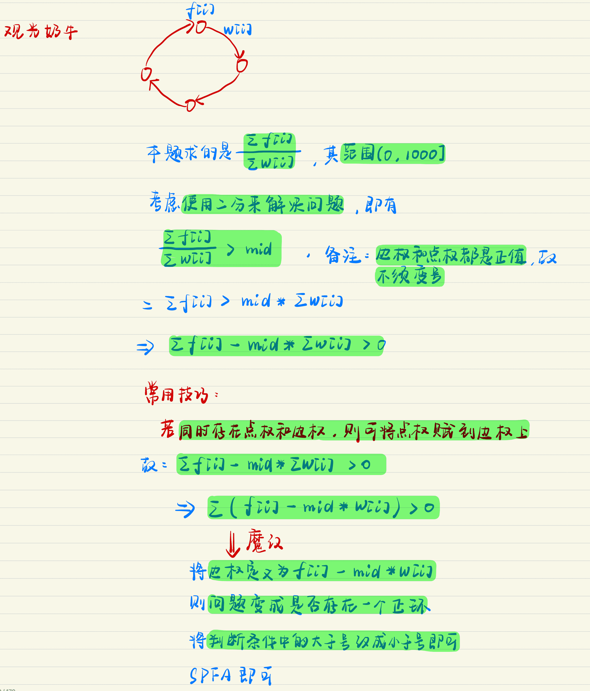

**代码**

```c++
#include <iostream>
#include <cstring>
using namespace std;
const int N = 1010, M = 10010;
int n, m, idx;
int f[N], h[N], e[M], w[M], ne[M], st[N], q[N], cnt[N];
// 注意: double类型
double dist[N];
void add(int a, int b, int c) {
    e[idx] = b;
    w[idx] = c;
    ne[idx] = h[a];
    h[a] = idx ++;
    return;
}
// 注意: double类型
// SPFA求环模板
bool check(double mid) {
    memset(st, 0, sizeof st);
    memset(cnt, 0, sizeof cnt);
    int hh = 0, tt = 0;
    for (int i = 1; i <= n; i ++ ) {
        q[tt ++ ] = i;
        st[i] = true;
    }
    while (hh != tt) {
        int t = q[hh ++ ];
        if (hh == N) hh = 0;
        st[t] = false;
        for (int i = h[t]; i != -1; i = ne[i]) {
            int j = e[i];
            // 求正环, 使用小于号<, 而不是大于号>
            if (dist[j] < dist[t] + f[j] - mid * w[i]) {
                dist[j] = dist[t] + f[j] - mid * w[i];
                cnt[j] = cnt[t] + 1;
                if (cnt[j] >= n) return true;
                if (!st[j]) {
                    q[tt ++ ] = j;
                    if (tt == N) tt = 0;
                    st[j] = true;
                }
            }
        }
    }
    return false;
}
int main() {
    scanf("%d%d", &n, &m);
    memset(h, -1, sizeof h);
    for (int i = 1; i <= n; i ++ ) scanf("%d", &f[i]);
    for (int i = 1; i <= m; i ++ ) {
        int a, b, c;
        scanf("%d%d%d", &a, &b, &c);
        add(a, b, c);
    }
    double l = 0, r = 1010;
    while (r - l > 1e-4) {
        double mid = (l + r) / 2;
        if (check(mid)) l = mid;
        else r = mid;
    }
    printf("%.2lf\n", r);
    return 0;
}
```

**时间复杂度**

$O(nmlog_{1000})$

**空间复杂度**

$O(n)$

**标签**

`01规划问题`、`SPFA`

**缝合怪**


### [AcWing 1165. 单词环](https://www.acwing.com/problem/content/1167/)

**题目描述**

>   我们有 `n` 个字符串，每个字符串都是由 `a∼z` 的小写英文字母组成的。
>
>   如果字符串 `A` 的结尾两个字符刚好与字符串 `B` 的开头两个字符相匹配，那么我们称 `A` 与 `B` 能够相连（注意：`A` 能与 `B` 相连不代表 `B` 能与 `A` 相连）。
>
>   我们希望从给定的字符串中找出一些，使得它们首尾相连形成一个环串（一个串首尾相连也算），我们想要使这个环串的平均长度最大。
>
>   如下例：
>
>   ```c++
>   ababc
>   bckjaca
>   caahoynaab
>   ```
>
>   第一个串能与第二个串相连，第二个串能与第三个串相连，第三个串能与第一个串相连，我们按照此顺序相连，便形成了一个环串，长度为 `5+7+10=22`（重复部分算两次），总共使用了 `3` 个串，所以平均长度是 $\frac{22}{3}≈7.33$。

**输入格式**

>   本题有多组数据。
>
>   每组数据的第一行，一个整数 `n`，表示字符串数量；
>
>   接下来 `n` 行，每行一个长度小于等于 `1000` 的字符串。
>
>   读入以 `n=0` 结束。

**输出格式**

>   若不存在环串，输出`”No solution”`，否则输出最长的环串的平均长度。
>
>   只要答案与标准答案的差不超过 `0.01`，就视为答案正确。

**数据范围**

>   +   $1 ≤ n ≤ 10^5$

**输入样例**

```c++
3
intercommunicational
alkylbenzenesulfonate
tetraiodophenolphthalein
0
```

**输出样例**

```c++
21.66
```

**手写稿**

>   讲解
>
>   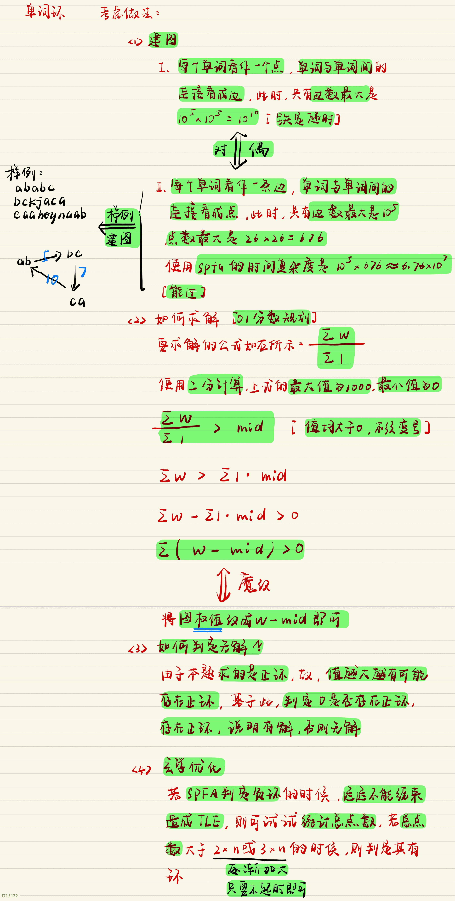
>
>   补充说明
>
>   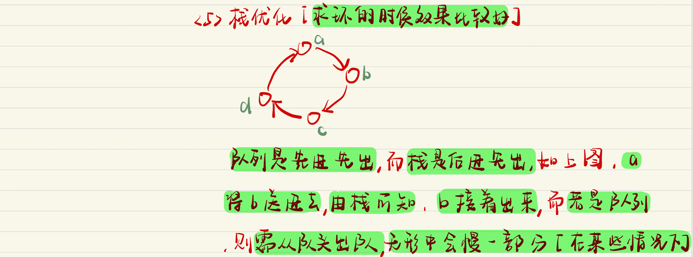


**代码一:玄学优化**

```c++
#include <iostream>
#include <cstring>
using namespace std;
const int N = 700, M = 100010, K = 1010;
// 一共只有676个点, n设置为676
int n = 676, m, idx;
char str[K];
int h[N], e[M], w[M], ne[M], st[N], q[N], cnt[N];
double dist[N];
// 加边的模板[头插法]
void add(int a, int b, int c) {
    e[idx] = b;
    w[idx] = c;
    ne[idx] = h[a];
    h[a] = idx ++;
    return;
}
// SPFA模板
bool check(double mid) {
    memset(st, false, sizeof st);
    memset(cnt, 0, sizeof cnt);
    int hh = 0, tt = 0;
    // 注意: 一共只有676个点
    for (int i = 0; i < n; i ++ ) {
        q[tt ++ ] = i;
        st[i] = true;
    }
    int count = 0;
    while (hh != tt) {
        int t = q[hh ++ ];
        if (hh == N) hh = 0;
        st[t] = false;
        for (int i = h[t]; i != -1; i = ne[i]) {
            int j = e[i];
            // 权值为w[i] - mid
            if (dist[j] < dist[t] + w[i] - mid) {
                dist[j] = dist[t] + w[i] - mid;
                cnt[j] = cnt[t] + 1;
                if (++ count > 5000) return true; // 经验上的trick, 点数的若干倍
                if (cnt[j] >= n) return true;
                if (!st[j]) {
                    q[tt ++ ] = j;
                    if (tt == N) tt = 0;
                    st[j] = true;
                }
            }
        }
    }
    return false;
}
int main() {
    while (scanf("%d", &m), m) {
        memset(h, -1, sizeof h);
        idx = 0;
        for (int i = 0; i < m; i ++ ) {
            scanf("%s", str);
            int len = strlen(str);
            if (len >= 2) {
                int a = (str[0] - 'a') * 26 + (str[1] - 'a');
                int b = (str[len - 2] - 'a') * 26 + (str[len - 1] - 'a');
                add(a, b, len);
            }
        }
        if (!check(0)) puts("No solution");
        else {
            double l = 0, r = 1000;
            while (r - l > 1e-4) {
                double mid = (l + r) / 2;
                if (check(mid)) l = mid;
                else r = mid;
            }
            printf("%lf\n", r);
        }
    }
    return 0;
}
```

**时间复杂度**

$O(不好分析), 玄学优化$

**空间复杂度**

$O(m)$

**代码二:栈优化**

```c++
#include <iostream>
#include <cstring>
using namespace std;
const int N = 700, M = 100010, K = 1010;
// 一共只有676个点, n设置为676
int n = 676, m, idx;
char str[K];
int h[N], e[M], w[M], ne[M], st[N], stk[N], cnt[N];
double dist[N];
// 加边的模板[头插法]
void add(int a, int b, int c) {
    e[idx] = b;
    w[idx] = c;
    ne[idx] = h[a];
    h[a] = idx ++;
    return;
}
// SPFA模板
bool check(double mid) {
    memset(st, false, sizeof st);
    memset(cnt, 0, sizeof cnt);
    int tt = -1;
    // 注意: 一共只有676个点
    for (int i = 0; i < n; i ++ ) {
        stk[++ tt] = i;
        st[i] = true;
    }
    int count = 0;
    // 使用栈不是队列!!
    while (tt != -1) {
        int t = stk[tt -- ];
        st[t] = false;
        for (int i = h[t]; i != -1; i = ne[i]) {
            int j = e[i];
            // 权值为w[i] - mid
            if (dist[j] < dist[t] + w[i] - mid) {
                dist[j] = dist[t] + w[i] - mid;
                cnt[j] = cnt[t] + 1;
                if (cnt[j] >= n) return true;
                if (!st[j]) {
                    stk[++ tt] = j;
                    st[j] = true;
                }
            }
        }
    }
    return false;
}
int main() {
    while (scanf("%d", &m), m) {
        memset(h, -1, sizeof h);
        idx = 0;
        for (int i = 0; i < m; i ++ ) {
            scanf("%s", str);
            int len = strlen(str);
            if (len >= 2) {
                int a = (str[0] - 'a') * 26 + (str[1] - 'a');
                int b = (str[len - 2] - 'a') * 26 + (str[len - 1] - 'a');
                add(a, b, len);
            }
        }
        if (!check(0)) puts("No solution");
        else {
            double l = 0, r = 1000;
            while (r - l > 1e-4) {
                double mid = (l + r) / 2;
                if (check(mid)) l = mid;
                else r = mid;
            }
            printf("%lf\n", r);
        }
    }
    return 0;
}
```

**时间复杂度**

$O(不好计算), 因为有栈存在且剪枝$

**空间复杂度**

$O(m)$

**标签**

`SPFA`、`负环`、`玄学优化`

**缝合怪**

## 差分约束

### 原理


### [AcWing 1169. 糖果](https://www.acwing.com/problem/content/1171/)

**题目描述**

>   幼儿园里有 `N` 个小朋友，老师现在想要给这些小朋友们分配糖果，要求每个小朋友都要分到糖果。
>
>   但是小朋友们也有嫉妒心，总是会提出一些要求，比如小明不希望小红分到的糖果比他的多，于是在分配糖果的时候， 老师需要满足小朋友们的 `K` 个要求。
>
>   幼儿园的糖果总是有限的，老师想知道他至少需要准备多少个糖果，才能使得每个小朋友都能够分到糖果，并且满足小朋友们所有的要求。

**输入格式**

>   输入的第一行是两个整数 `N,K`。
>
>   接下来 `K` 行，表示分配糖果时需要满足的关系，每行 `3` 个数字 `X,A,B`。
>
>   -   如果 `X=1`．表示第 `A` 个小朋友分到的糖果必须和第 `B` 个小朋友分到的糖果一样多。
>   -   如果 `X=2`，表示第 `A` 个小朋友分到的糖果必须少于第 `B` 个小朋友分到的糖果。
>   -   如果 `X=3`，表示第 `A` 个小朋友分到的糖果必须不少于第 `B` 个小朋友分到的糖果。
>   -   如果 `X=4`，表示第 `A` 个小朋友分到的糖果必须多于第 `B` 个小朋友分到的糖果。
>   -   如果 `X=5`，表示第 `A` 个小朋友分到的糖果必须不多于第 `B` 个小朋友分到的糖果。
>
>   小朋友编号从 `1` 到 `N`。

**输出格式**

>   输出一行，表示老师至少需要准备的糖果数，如果不能满足小朋友们的所有要求，就输出 `−1`。

**数据范围**

>   +   $1 ≤ N < 10^5,$
>   +   $1 ≤ K ≤ 10^5,$
>   +   $1 ≤ X ≤ 5,$
>   +   $1 ≤ A, B ≤ N$

**输入样例**

```c++
5 7
1 1 2
2 3 2
4 4 1
3 4 5
5 4 5
2 3 5
4 5 1
```

**输出样例**

```c++
11
```

**手写稿**

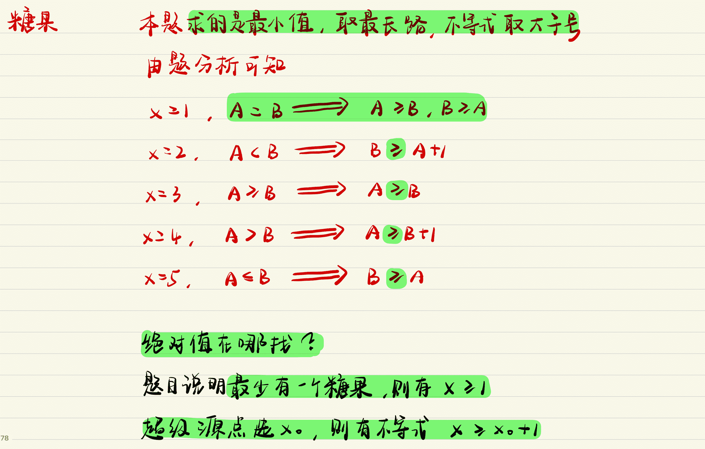

**代码**

```c++
#include <iostream>
#include <cstring>
using namespace std;
typedef long long LL;
const int N = 100010, M = 300010;
int n, m, idx;
int h[N], e[M], w[M], ne[M], stk[N], dist[N], st[N], cnt[N];
void add(int a, int b, int c) {
    e[idx] = b;
    w[idx] = c;
    ne[idx] = h[a];
    h[a] = idx ++;
    return;
}
bool spfa() {
    int tt = -1;
    memset(dist, -0x3f, sizeof dist);
    memset(st, 0, sizeof st);
    memset(cnt, 0, sizeof cnt);
    // 求环的时候, 使用栈的效果比较好[原因:缝合怪链接]
    stk[ ++ tt] = 0;
    st[0] = true;
    dist[0] = 0;
    while (tt != -1) {
        int t = stk[tt -- ];
        st[t] = false;
        for (int i = h[t]; i != -1; i = ne[i]) {
            int j = e[i];
            // 求的是正环!![注意]
            if (dist[j] < dist[t] + w[i]) {
                dist[j] = dist[t] + w[i];
                cnt[j] = cnt[t] + 1;
                if (cnt[j] >= n + 1) return true;
                if (!st[j]) {
                    stk[ ++ tt] = j;
                    st[j] = true;
                }
            }
        }
    }
    return false;
}
int main() {
    scanf("%d%d", &n, &m);
    memset(h, -1, sizeof h);
    for (int i = 0; i < m; i ++ ) {
        int x, a, b;
        scanf("%d%d%d", &x, &a, &b);
        if (x == 1) add(b, a, 0), add(a, b, 0);
        else if (x == 2) add(a, b, 1);
        else if (x == 3) add(b, a, 0);
        else if (x == 4) add(b, a, 1);
        else add(a, b, 0);
    }
    // 将每个点都和超级源点连一条边, 权值为1
    for (int i = 1; i <= n; i ++ ) add(0, i, 1);
    LL res = 0; // 有可能爆int
    // 求的是正环
    if (spfa()) puts("-1");
    else {
        for (int i = 1; i <= n; i ++ ) res += dist[i];
        printf("%lld\n", res);
    }
    return 0;
}
```

**时间复杂度**

$O(nm)$

**空间复杂度**

$O(n)$

**标签**

`差分约束`、`正环`

**缝合怪**

[AcWing 1165. 单词环](#AcWing 1165. 单词环)

### [AcWinng 362. 区间](https://www.acwing.com/problem/content/364/)

**题目描述**

>   给定 `n` 个区间 $[a_i, b_i]$ 和 `n` 个整数 $c_i$。
>
>   你需要构造一个整数集合 `Z`，使得 $∀i∈[1,n]$，`Z` 中满足 $a_i ≤ x ≤ b_i$ 的整数 `x` 不少于 $c_i$ 个。
>
>   求这样的整数集合 `Z` 最少包含多少个数。

**输入格式**

>   第一行包含整数 `n`。
>
>   接下来 `n` 行，每行包含三个    整数 $a_i, b_i, c_i$。

**输出格式**

>   输出一个整数表示结果。

**数据范围**

>   +   $1 ≤ n ≤ 50000,$
>   +   $0 ≤ a_i, b_i ≤ 50000,$
>   +   $1 ≤ c_i ≤ b_i − a_i + 1$

**输入样例**

```c++
5
3 7 3
8 10 3
6 8 1
1 3 1
10 11 1
```

**输出样例**

```c++
6
```

**手写稿**

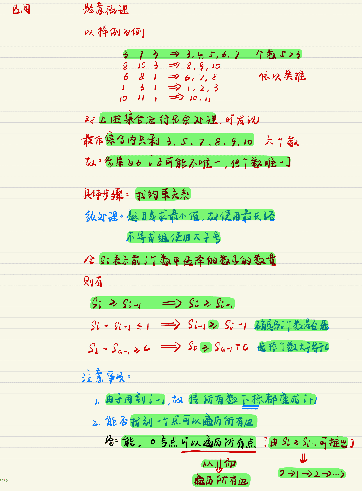

**代码**

```c++
#include <iostream>
#include <cstring>
using namespace std;
const int N = 50010, M = 150010;
int n, idx;
int h[N], e[M], w[M], ne[M], dist[N], st[N], q[N];
void add(int a, int b, int c) {
    e[idx] = b;
    w[idx] = c;
    ne[idx] = h[a];
    h[a] = idx ++;
    return;
}
// spfa模板
void spfa() {
    memset(dist, -0x3f, sizeof dist);
    memset(st, 0, sizeof st);
    int hh = 0, tt = 0;
    dist[0] = 0;
    q[tt ++ ] = 0;
    st[0] = true;
    while (hh != tt) {
        int t = q[hh ++ ];
        if (hh == N) hh = 0;
        st[t] = false;
        for (int i = h[t]; i != -1; i = ne[i]) {
            int j = e[i];
            if (dist[j] < dist[t] + w[i]) {
                dist[j] = dist[t] + w[i];
                if (!st[j]) {
                    q[tt ++ ] = j;
                    if (tt == N) tt = 0;
                    st[j] = true;
                }
            }
        }
    }
    return;
}
int main() {
    scanf("%d", &n);
    memset(h, -1, sizeof h);
    for (int i = 1; i <= 50001; i ++ ) {
        // 第一和第二个条件
        add(i - 1, i, 0);
        add(i, i - 1, -1);
    }
    for (int i = 0; i < n; i ++ ) {
        int a, b, c;
        scanf("%d%d%d", &a, &b, &c);
        // 注意: 下标 + 1
        a ++, b ++;
        add(a - 1, b, c);
    }
    spfa();
    // 输出结果即可
    cout << dist[50001] << endl;
    return 0;
}
```

**时间复杂度**


**空间复杂度**

$O(n)$

**标签**

`差分约束`、`spfa`

**缝合怪**


### [AcWing 1170. 排队布局](https://www.acwing.com/problem/content/1172/)

**题目描述**

>   当排队等候喂食时，奶牛喜欢和它们的朋友站得靠近些。
>
>   农夫约翰有 `N` 头奶牛，编号从 `1` 到 `N`，沿一条直线站着等候喂食。
>
>   奶牛排在队伍中的顺序和它们的编号是相同的。
>
>   因为奶牛相当苗条，所以可能有两头或者更多奶牛站在同一位置上。
>
>   如果我们想象奶牛是站在一条数轴上的话，允许有两头或更多奶牛拥有相同的横坐标。
>
>   一些奶牛相互间存有好感，它们希望两者之间的距离不超过一个给定的数 `L`。
>
>   另一方面，一些奶牛相互间非常反感，它们希望两者间的距离不小于一个给定的数 `D`。
>
>   给出 $M_L$ 条关于两头奶牛间有好感的描述，再给出 $M_D$ 条关于两头奶牛间存有反感的描述。
>
>   你的工作是：如果不存在满足要求的方案，输出`-1`；如果 `1` 号奶牛和 `N` 号奶牛间的距离可以任意大，输出`-2`；否则，计算出在满足所有要求的情况下，`1` 号奶牛和 `N` 号奶牛间可能的最大距离。

**输入格式**

>   第一行包含三个整数 $N,M_L,M_D$。
>
>   接下来 $M_L$ 行，每行包含三个正整数 $A,B,L$，表示奶牛 `A` 和奶牛 `B` 至多相隔 `L` 的距离。
>
>   再接下来 $M_D$ 行，每行包含三个正整数 $A,B,D$，表示奶牛 `A` 和奶牛 `B` 至少相隔 `D` 的距离。

**输出格式**

>   输出一个整数，如果不存在满足要求的方案，输出`-1`；如果 `1` 号奶牛和 `N` 号奶牛间的距离可以任意大，输出`-2`；否则，输出在满足所有要求的情况下，`1` 号奶牛和 `N` 号奶牛间可能的最大距离。

**数据范围**

>   +   $2≤N≤1000,$
>   +   $1 ≤ M_L, M_D ≤ 10 ^ 4,$
>   +   $1≤L,D≤10^6$

**输入样例**

```c++
4 2 1
1 3 10
2 4 20
2 3 3
```

**输出样例**

```c++
27
```

**手写稿**

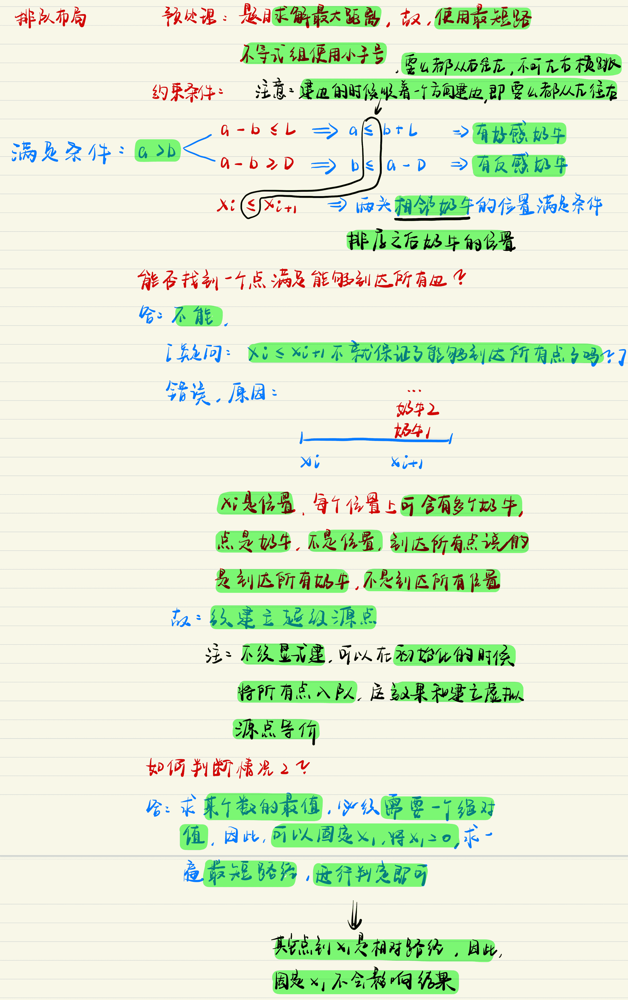

**代码**

```c++
#include <iostream>
#include <cstring>
using namespace std;
const int N = 1010, M = 21010, INF = 0x3f3f3f3f;
int n, m1, m2, idx;
int h[N], e[M], w[M], ne[M], dist[N], cnt[N], st[N], q[N];
void add(int a, int b, int c) {
    e[idx] = b;
    w[idx] = c;
    ne[idx] = h[a];
    h[a] = idx ++;
    return;
}
// spfa模板
bool spfa(int size) {
    memset(dist, 0x3f, sizeof dist);
    memset(cnt, 0, sizeof cnt);
    memset(st, 0, sizeof st);
    int hh = 0, tt = 0;
    for (int i = 1; i <= size; i ++ ) {
        q[tt ++ ] = i;
        st[i] = true;
        dist[i] = 0;
    }
    while (hh != tt) {
        int t = q[hh ++ ];
        if (hh == N) hh = 0;
        st[t] = false;
        for (int i = h[t]; i != -1; i = ne[i]) {
            int j = e[i];
            if (dist[j] > dist[t] + w[i]) {
                dist[j] = dist[t] + w[i];
                cnt[j] = cnt[t] + 1;
                if (cnt[j] >= n) return true;
                if (!st[j]) {
                    q[tt ++ ] = j;
                    if (tt == N) tt = 0;
                    st[j] = true;
                }
            }
        }
    }
    return false;
}
int main() {
    scanf("%d%d%d", &n, &m1, &m2);
    memset(h, -1, sizeof h);
    for (int i = 1; i <= n; i ++ ) add(i + 1, i, 0);
    for (int i = 0; i < m1; i ++ ) {
        int a, b, c;
        scanf("%d%d%d", &a, &b, &c);
        // 注意: a和b的大小不确定
        if (a < b) swap(a, b);
        add(b, a, c);
    }
    for (int i = 0; i < m2; i ++ ) {
        int a, b, c;
        scanf("%d%d%d", &a, &b, &c);
        // 注意: a和b的大小不确定
        if (a < b) swap(a, b);
        add(a, b, -c);
    }
    // 将所有点入队[虚拟源点作用]
    if (spfa(n)) { // 存在环
        puts("-1");
    }
    else {
        // 将第一个点入队
        spfa(1);
        // 无穷大,返回-2
        if (dist[n] == INF) puts("-2");
        // 返回最大距离
        else cout << dist[n] << endl;
    }
    return 0;
}
```

**时间复杂度**


**空间复杂度**

$O(n)$

**标签**

`差分约束`、`spfa`

**缝合怪**


### [AcWing 393. 雇佣收银员](https://www.acwing.com/problem/content/395/)

**题目描述**

>   一家超市要每天 `24` 小时营业，为了满足营业需求，需要雇佣一大批收银员。
>
>   已知不同时间段需要的收银员数量不同，为了能够雇佣尽可能少的人员，从而减少成本，这家超市的经理请你来帮忙出谋划策。
>
>   经理为你提供了一个各个时间段收银员最小需求数量的清单 $R(0),R(1),R(2),…,R(23)$。
>
>   `R(0)` 表示午夜 `00:00` 到凌晨 `01:00` 的最小需求数量，`R(1)` 表示凌晨 `01:00` 到凌晨 `02:00` 的最小需求数量，以此类推。
>
>   一共有 `N` 个合格的申请人申请岗位，第 `i` 个申请人可以从 $t_i$ 时刻开始连续工作 `8` 小时。
>
>   收银员之间不存在替换，一定会完整地工作 `8` 小时，收银台的数量一定足够。
>
>   现在给定你收银员的需求清单，请你计算最少需要雇佣多少名收银员。

**输入格式**

>   第一行包含一个不超过 `20` 的整数，表示测试数据的组数。
>
>   对于每组测试数据，第一行包含 `24` 个整数，分别表示 `R(0),R(1),R(2),…,R(23)`。
>
>   第二行包含整数 `N`。
>
>   接下来 `N` 行，每行包含一个整数 $t_i$。

**输出格式**

>   每组数据输出一个结果，每个结果占一行。
>
>   如果没有满足需求的安排，输出 `No Solution`。

**数据范围**

>   +   $0≤R(0)≤1000,$
>   +   $0≤N≤1000,$
>   +   $0≤t_i≤23$

**输入样例**

```c++
1
1 0 1 0 0 0 1 0 0 0 0 0 0 0 0 0 0 0 0 0 0 0 0 1
5
0
23
22
1
10
```

**输出样例**

```c++
1
```

**手写稿**

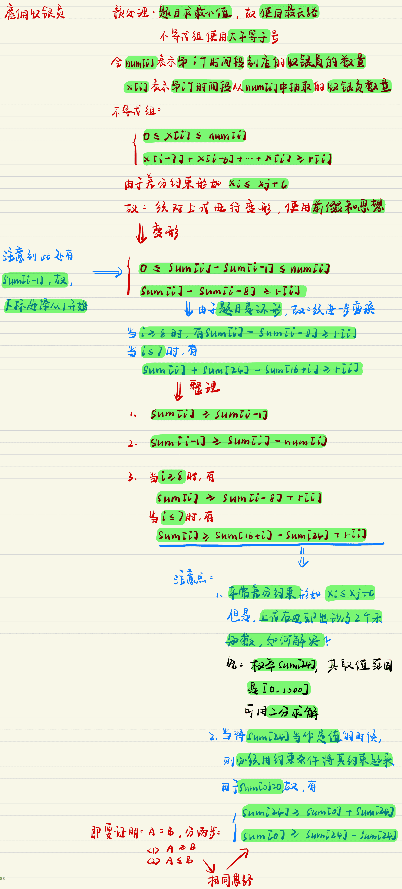

**代码一:差分约束 + 暴力枚举**

```c++
#include <iostream>
#include <cstring>
using namespace std;
const int N = 30, M = 110;
int n, T, idx;
int r[N], num[N], h[N], e[M], w[M], ne[M], cnt[N], st[N], dist[N], q[N];
void add(int a, int b, int c) {
    e[idx] = b;
    w[idx] = c;
    ne[idx] = h[a];
    h[a] = idx ++;
    return;
}
// 差分约束建边[手写稿]
void build(int c) {
    memset(h, -1, sizeof h);
    idx = 0;
    for (int i = 1; i <= 24; i ++ ) {
        add(i - 1, i, 0);
        add(i, i - 1, -num[i]);
    }
    for (int i = 1; i <= 7; i ++ ) add(16 + i, i, -c + r[i]);
    for (int i = 8; i <= 24; i ++ ) add(i - 8, i, r[i]);
    add(0, 24, c);
    add(24, 0, -c);
    return;
}
// spfa模板
bool spfa(int c) {
    build(c);
    memset(dist, -0x3f, sizeof dist);
    memset(st, 0, sizeof st);
    memset(cnt, 0, sizeof cnt);
    int hh = 0, tt = 0;
    q[tt ++ ] = 0;
    st[0] = true;
    dist[0] = 0;
    while (hh != tt) {
        int t = q[hh ++ ];
        if (hh == N) hh = 0;
        st[t] = false;
        for (int i = h[t]; i != -1; i = ne[i]) {
            int j = e[i];
            if (dist[j] < dist[t] + w[i]) {
                dist[j] = dist[t] + w[i];
                cnt[j] = cnt[t] + 1;
                // 注意: 图中的点不是n + 1个, n + 1是申请人的个数
                // 图中点的数量为25个, 0 ~ 24
                if (cnt[j] >= 25) return true;
                if (!st[j]) {
                    q[tt ++ ] = j;
                    if (tt == N) tt = 0;
                    st[j] = true;
                }
            }
        }
    }
    return false;
}
int main() {
    scanf("%d", &T);
    while (T -- ) {
        // 注意: 着重理解r数组的含义
        for (int i = 1; i <= 24; i ++ ) scanf("%d", &r[i]);
        scanf("%d", &n);
        // 注意: 着重理解num数组的含义
        // num[i]数组表示i时刻到店的人数, 本题为方便将所有时刻向后移动一位 ++
        memset(num, 0, sizeof num);
        for (int i = 0; i < n; i ++ ) {
            int t;
            scanf("%d", &t);
            num[t + 1] ++;
        }
        int flag = false;
        // 枚举s[24]的值
        for (int i = 0; i <= n; i ++ )
            // 如果找到答案
            if (!spfa(i)) {
                cout << i << endl;
                flag = true;
                break;
            }
        if (!flag) puts("No Solution");
    }
    return 0;
}
```

**时间复杂度**

$O(Tn2500)$

**空间复杂度**

$O(m)$

**代码二: 差分约束 + 二分**

```c++
#include <iostream>
#include <cstring>
using namespace std;
const int N = 30, M = 110;
int n, T, idx;
int r[N], num[N], h[N], e[M], w[M], ne[M], cnt[N], st[N], dist[N], q[N];
void add(int a, int b, int c) {
    e[idx] = b;
    w[idx] = c;
    ne[idx] = h[a];
    h[a] = idx ++;
    return;
}
// 差分约束建边[手写稿]
void build(int c) {
    memset(h, -1, sizeof h);
    idx = 0;
    for (int i = 1; i <= 24; i ++ ) {
        add(i - 1, i, 0);
        add(i, i - 1, -num[i]);
    }
    for (int i = 1; i <= 7; i ++ ) add(16 + i, i, -c + r[i]);
    for (int i = 8; i <= 24; i ++ ) add(i - 8, i, r[i]);
    add(0, 24, c);
    add(24, 0, -c);
    return;
}
// spfa模板
bool spfa(int c) {
    build(c);
    memset(dist, -0x3f, sizeof dist);
    memset(st, 0, sizeof st);
    memset(cnt, 0, sizeof cnt);
    int hh = 0, tt = 0;
    q[tt ++ ] = 0;
    st[0] = true;
    dist[0] = 0;
    while (hh != tt) {
        int t = q[hh ++ ];
        if (hh == N) hh = 0;
        st[t] = false;
        for (int i = h[t]; i != -1; i = ne[i]) {
            int j = e[i];
            if (dist[j] < dist[t] + w[i]) {
                dist[j] = dist[t] + w[i];
                cnt[j] = cnt[t] + 1;
                // 注意: 图中的点不是n + 1个, n + 1是申请人的个数
                // 图中点的数量为25个, 0 ~ 24
                if (cnt[j] >= 25) return true;
                if (!st[j]) {
                    q[tt ++ ] = j;
                    if (tt == N) tt = 0;
                    st[j] = true;
                }
            }
        }
    }
    return false;
}
int main() {
    scanf("%d", &T);
    while (T -- ) {
        // 注意: 着重理解r数组的含义
        for (int i = 1; i <= 24; i ++ ) scanf("%d", &r[i]);
        scanf("%d", &n);
        // 注意: 着重理解num数组的含义
        // num[i]数组表示i时刻到店的人数, 本题为方便将所有时刻向后移动一位 ++
        memset(num, 0, sizeof num);
        for (int i = 0; i < n; i ++ ) {
            int t;
            scanf("%d", &t);
            num[t + 1] ++;
        }
        int flag = false;
        // 枚举s[24]的值
        // 注意: 二分的范围[0, n]
        int l = 0, r = n;
        while (l < r) {
            int mid = l + r >> 1;
            if (!spfa(mid)) r = mid;
            else l = mid + 1;
        }
        if (spfa(l)) puts("No Solution");
        else cout << l << endl;
    }
    return 0;
}
```

**时间复杂度**

$O(Tlog_n2500)$

**空间复杂度**

$O(m)$

**标签**

`差分约束`、`spfa`、`二分`

**缝合怪**


## 最近公共祖先

### 原理


### [AcWing 1172. 祖孙询问](https://www.acwing.com/problem/content/1174/)

**题目描述**

>   给定一棵包含 `n` 个节点的有根无向树，节点编号互不相同，但不一定是 `1 ∼ n`。
>
>   有 `m` 个询问，每个询问给出了一对节点的编号 `x` 和 `y`，询问 `x` 与 `y` 的祖孙关系。

**输入格式**

>   输入第一行包括一个整数 表示节点个数；
>
>   接下来 `n` 行每行一对整数 `a` 和 `b`，表示 `a` 和 `b` 之间有一条无向边。如果 `b` 是 `−1`，那么 `a` 就是树的根；
>
>   第 `n + 2` 行是一个整数 `m` 表示询问个数；
>
>   接下来 `m` 行，每行两个不同的正整数 `x` 和 `y`，表示一个询问。

**输出格式**

>   对于每一个询问，若 `x` 是 `y` 的祖先则输出 `1`，若 `y` 是 `x` 的祖先则输出 `2`，否则输出 `0`。

**数据范围**

>   +   $1≤n,m≤4×10^4,$
>   +   $1≤每个节点的编号≤4×10^4$

**输入样例**

```c++
10
234 -1
12 234
13 234
14 234
15 234
16 234
17 234
18 234
19 234
233 19
5
234 233
233 12
233 13
233 15
233 19
```

**输出样例**

```c++
1
0
0
0
2
```

**手写稿**

>   1.   模板题,查看最近公共祖先 => 原理 => 算法二

**代码**

```c++
#include <iostream>
#include <cstring>
using namespace std;
const int N = 40010, M = 80010, K = 16;
int n, m, idx;
int h[N], e[M], ne[M], depth[N], st[N], q[N];
int fa[N][K];
void add(int a, int b) {
    e[idx] = b;
    ne[idx] = h[a];
    h[a] = idx ++;
    return;
}
void bfs(int u) {
    memset(depth, 0x3f, sizeof depth);
    memset(st, false, sizeof st);
    int hh = 0, tt = -1;
    depth[u] = 1;
    q[++ tt] = u;
    while (hh <= tt) {
        int t = q[hh ++ ];
        st[t] = true;
        for (int i = h[t]; i != -1; i = ne[i]) {
            int j = e[i];
            if (!st[j]) {
                depth[j] = depth[t] + 1;
                q[++ tt] = j;
                // 从j走1步到达t
                fa[j][0] = t;
                // 递推公式
                for (int k = 1; k <= 15; k ++ ) fa[j][k] = fa[fa[j][k - 1]][k - 1];
            }
        }
    }
    return;
}
int lca(int a, int b) {
    // 设置哨兵
    depth[0] = 0;
    // 为了方便编码,始终保持a的深度depth[a] >= b的深度depth[b]
    // 注意: swap(a, b) 不是 swap(depth[a], depth[b])
    if (depth[a] < depth[b]) swap(a, b);
    // 将a和b跳到同一层
    for (int k = 15; k >= 0; k -- )
        // 哨兵的作用一:
        // 如果跳出界,则fa[a][k] = 0, 此时depth[0] = 0, 此条件一定不会成立
        // 原因:树中的深度至少为1
        if (depth[fa[a][k]] >= depth[b]) a = fa[a][k];
    // 如果a和b已经相等, 则返回即可
    if (a == b) return a;
    for (int k = 15; k >= 0; k -- )
        // 如果a和b相等, 则一直跳
        // 假设a和b此时处于最近公共祖先的下一层, 则不会进行跳跃
        // 哨兵的作用二:
        // 如果跳出界,则fa[a][k]和fa[b][k]都为0, 此时depth[0] = depth[0] = 0
        // 两者相等,此条件也不会成立
        if (fa[a][k] != fa[b][k]) {
            a = fa[a][k];
            b = fa[b][k];
        }
    // 向上走一步,就是最近公共祖先
    return fa[a][0];
}
int main() {
    int root;
    scanf("%d", &n);
    memset(h, -1, sizeof h);
    for (int i = 0; i < n; i ++ ) {
        int a, b;
        scanf("%d%d", &a, &b);
        if (b == -1) root = a;
        else {
            add(a, b);
            add(b, a);
        }
    }
    bfs(root);
    scanf("%d", &m);
    while (m -- ) {
        int a, b;
        scanf("%d%d", &a, &b);
        int rt = lca(a, b);
        if (rt == a) puts("1");
        else if (rt == b) puts("2");
        else puts("0");
    }
    return 0;
}
```

**时间复杂度**

$O(nlog_n + mlog_n)$

**空间复杂度**

$O(nlog_n)$

**标签**

`LCA`、`倍增`

**缝合怪**


### [AcWing 1171. 距离](https://www.acwing.com/problem/content/1173/)

**题目描述**

>   给出 `n` 个点的一棵树，多次询问两点之间的最短距离。
>
>   注意：
>
>   -   边是**无向**的。
>   -   所有节点的编号是 `1, 2, …, n`。

**输入格式**

>   第一行为两个整数 `n` 和 `m`。`n` 表示点数，`m` 表示询问次数；
>
>   下来 `n − 1` 行，每行三个整数 `x, y, k`，表示点 `x` 和点 `y` 之间存在一条边长度为 `k`；
>
>   再接下来 `m` 行，每行两个整数 `x, y`，表示询问点 `x` 到点 `y` 的最短距离。
>
>   树中结点编号从 `1` 到 `n`。

**输出格式**

>   共 `m` 行，对于每次询问，输出一行询问结果。

**数据范围**

>   +   $2≤n≤10^4,$
>   +   $1≤m≤2×10^4,$
>   +   $0<k≤100,$
>   +   $1≤x,y≤n$

**输入样例1**

```c++
2 2 
1 2 100 
1 2 
2 1
```

**输出样例1**

```c++
100
100
```

**输入样例2**

```c++
3 2
1 2 10
3 1 15
1 2
3 2
```

**输出样例2**

```c++
10
25
```

**手写稿**

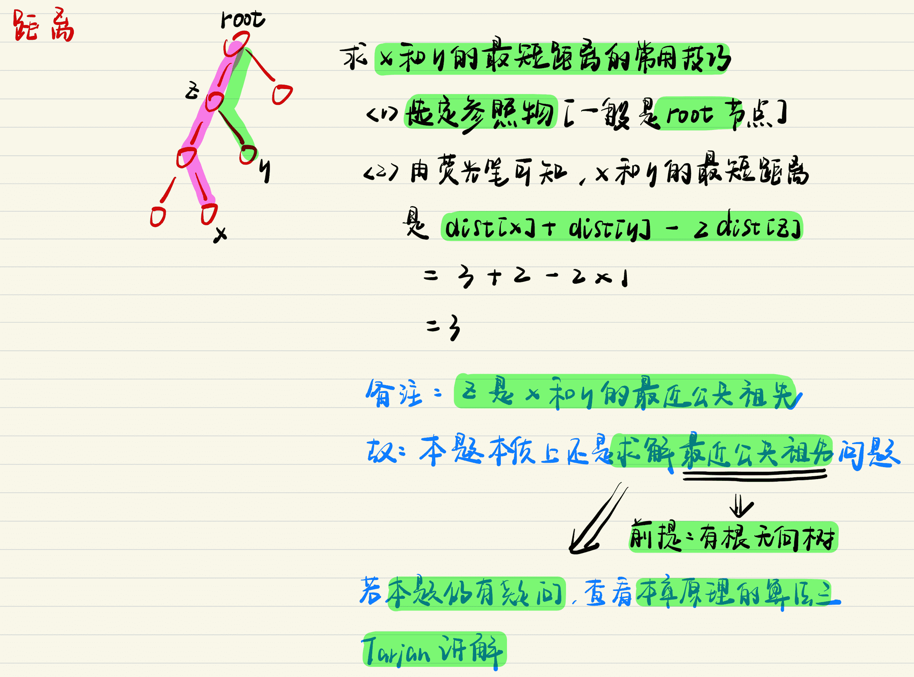

**代码**

```c++
#include <iostream>
#include <cstring>
#include <vector>
using namespace std;
typedef pair<int, int> PII;
const int N = 10010, M = 20010;
int n, m, idx;
int h[N], e[M], w[M], ne[M], dist[N], res[M], st[N], f[N];
vector<PII> query[N];
int find(int x) {
    if (f[x] == x) return f[x];
    return f[x] = find(f[x]);
}
void add(int a, int b, int c) {
    e[idx] = b;
    w[idx] = c;
    ne[idx] = h[a];
    h[a] = idx ++;
    return;
}
// 计算距离
void dfs(int u, int father) {
    for (int i = h[u]; i != -1; i = ne[i]) {
        int j = e[i];
        if (j == father) continue;
        // 计算距离不是计算高度!!!
        dist[j] = dist[u] + w[i];
        dfs(j, u);
    }
    return;
}
void tarjan(int u) {
    // 标记当前正在访问u节点
    st[u] = 1;
    for (int i = h[u]; i != -1; i = ne[i]) {
        int j = e[i];
        // 如果节点j还没有被访问过
        if (!st[j]) {
            tarjan(j);
            // 将j的父亲标为u[手写稿进一步解释]
            f[j] = u;
        }
    }
    // 秋后算账
    // 每遍历完一个子树,都需要进行询问[原因: 手写稿]
    for (auto [b, i] : query[u]) // 遍历所有和u相关的询问
        // 如果b已经被访问过[后续不会再次被访问]
        if (st[b] == 2) {
            // 找到其最近公共祖先
            int anc = find(b);
            // 公式
            res[i] = dist[u] + dist[b] - 2 * dist[anc];
        }
    // 标为u为已经被访问过
    st[u] = 2;
    return;
}
int main() {
    scanf("%d%d", &n, &m);
    memset(h, -1, sizeof h);
    for (int i = 1; i <= n; i ++ ) f[i] = i;
    for (int i = 0; i < n - 1; i ++ ) {
        int a, b, c;
        scanf("%d%d%d", &a, &b, &c);
        add(a, b, c);
        add(b, a, c);
    }
    for (int i = 0; i < m; i ++ ) {
        int a, b;
        scanf("%d%d", &a, &b);
        // 两边查询都要建立[原因: 手写稿]
        // 第一维存节点编号
        // 第二维存查询编号
        query[a].push_back({b, i});
        query[b].push_back({a, i});
    }
    // 任意根结点, 如1
    dfs(1, -1);
    // 从根节点开始遍历
    tarjan(1);
    for (int i = 0; i < m; i ++ ) cout << res[i] << endl;
    return 0;
}
```

**时间复杂度**

$O(n)$

**空间复杂度**

$O(n)$

**标签**

`Tarjan`、`次小生成树`

**缝合怪**


### [AcWing 356. 次小生成树](https://www.acwing.com/problem/content/description/358/)

**题目描述**

>   给定一张 `N` 个点 `M` 条边的无向图，求无向图的严格次小生成树。
>
>   设最小生成树的边权之和为 `sum`，严格次小生成树就是指边权之和大于 `sum` 的生成树中最小的一个。

**输入格式**

>   第一行包含两个整数 `N` 和 `M`。
>
>   接下来 `M` 行，每行包含三个整数 `x，y，z`，表示点 `x` 和点 `y` 之前存在一条边，边的权值为 `z`。

**输出格式**

>   包含一行，仅一个数，表示严格次小生成树的边权和。(数据保证必定存在严格次小生成树)

**数据范围**

>   +   $N≤10^5,M≤3×10^5$

**输入样例**

```c++
5 6
1 2 1
1 3 2
2 4 3
3 5 4
3 4 3
4 5 6
```

**输出样例**

```c++
11
```

**手写稿**

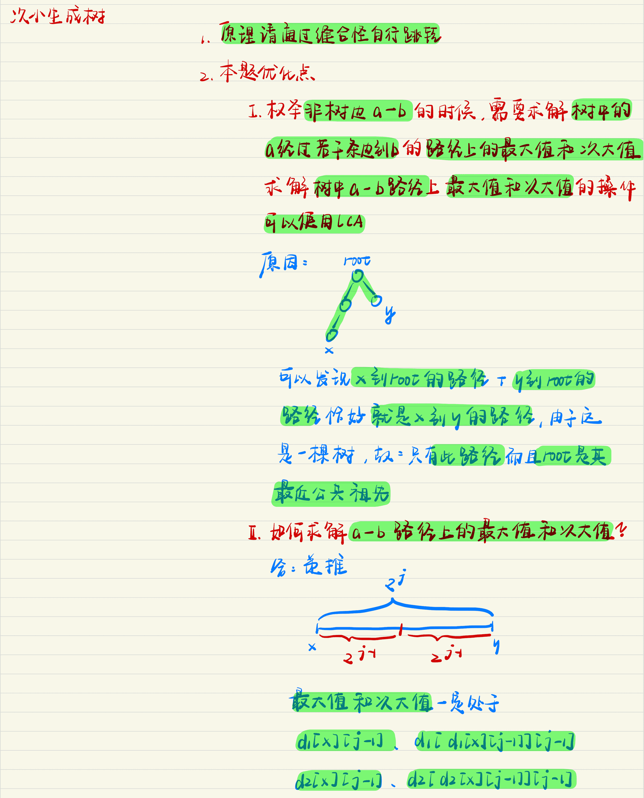

**代码**

```c++
#include <iostream>
#include <cstring>
#include <algorithm>
using namespace std;
typedef long long LL;
const int N = 100010, M = 300010, K = 18, INF = 0x3f3f3f3f;
int n, m, idx;
int p[N], h[N], e[M], w[M], ne[M], depth[N], q[N], st[N];
int fa[N][K], d1[N][K], d2[N][K];
struct Edge {
    int u, v, w;
    bool used;
    bool operator < (const Edge &W) const {
        return w < W.w;
    }
}edges[M];
int find(int x) {
    if (p[x] == x) return p[x];
    return p[x] = find(p[x]);
}
// Kruskal模板
LL kruskal() {
    sort(edges, edges + m);
    LL res = 0, cnt = 0;
    for (int i = 1; i <= n; i ++ ) p[i] = i;
    for (int i = 0; i < m; i ++ ) {
        if (cnt == n - 1) break;
        int a = edges[i].u;
        int b = edges[i].v;
        int c = edges[i].w;
        int fa = find(a);
        int fb = find(b);
        if (fa == fb) continue;
        // 标记当前边是树边
        edges[i].used = true;
        p[fb] = fa;
        res += c;
        cnt ++;
    }
    return res;
}
void add(int a, int b, int c) {
    e[idx] = b;
    w[idx] = c;
    ne[idx] = h[a];
    h[a] = idx ++;
    return;
}
void build() {
    memset(h, -1, sizeof h);
    for (int i = 0; i < m; i ++ )
        if (edges[i].used) {
            int a = edges[i].u;
            int b = edges[i].v;
            int c = edges[i].w;
            // 建立双向边
            add(a, b, c);
            add(b, a, c);
        }
    return;
}
// BFS模板
void bfs() {
    memset(depth, 0x3f, sizeof depth);
    memset(st, false, sizeof st);
    int hh = 0, tt = -1;
    // 0是哨兵, 1是根结点
    depth[0] = 0, depth[1] = 1;
    q[++ tt] = 1;
    st[1] = true;
    while (hh <= tt) {
        int t = q[hh ++ ];
        for (int i = h[t]; i != -1; i = ne[i]) {
            int j = e[i];
            if (!st[j]) {
                st[j] = true;
                // 更新距离
                depth[j] = depth[t] + 1;
                q[++ tt] = j;
                // 从j向上走一步是t
                fa[j][0] = t;
                // 初始化, 一开始最大值是w[i], 由于是严格次小值, 故次小值为-INF
                d1[j][0] = w[i];
                d2[j][0] = -INF;
                for (int k = 1; k < 18; k ++ ) {
                    int anc = fa[j][k - 1];
                    fa[j][k] = fa[anc][k - 1];
                    // 注意: 此处容易出错, 四个值不要写错了
                    int distance[4] = {d1[j][k - 1], d1[anc][k - 1], d2[j][k - 1], d2[anc][k - 1]};
                    d1[j][k] = d2[j][k] = -INF;
                    for (int u = 0; u < 4; u ++ ) {
                        int d = distance[u];
                        if (d > d1[j][k]) {
                            d2[j][k] = d1[j][k];
                            d1[j][k] = d;
                        }
                        // 严格次小值, 故, 需判断d != d1[j][k]
                        else if (d != d1[j][k] && d > d2[j][k]) d2[j][k] = d;
                    }
                }
            }
        }
    }
    return;
}
int lca(int a, int b, int c) {
    // 统计树中a到b路径上的所有的最大值和次大值
    static int distance[M];
    int cnt = 0;
    if (depth[a] < depth[b]) swap(a, b);
    for (int k = 17; k >= 0; k -- )
        if (depth[fa[a][k]] >= depth[b]) {
            distance[cnt ++ ] = d1[a][k];
            distance[cnt ++ ] = d2[a][k];
            a = fa[a][k];
        }
    if (a != b) {
        for (int k = 17; k >= 0; k -- )
            if (fa[a][k] != fa[b][k]) {
                distance[cnt ++ ] = d1[a][k];
                distance[cnt ++ ] = d2[a][k];
                distance[cnt ++ ] = d1[b][k];
                distance[cnt ++ ] = d2[b][k];
                a = fa[a][k];
                b = fa[b][k];
            }
        // 加上最后一步的最大值和次大值
        distance[cnt ++ ] = d1[a][0];
        distance[cnt ++ ] = d2[a][0];
        distance[cnt ++ ] = d1[b][0];
        distance[cnt ++ ] = d2[b][0];
    }
    // 找到全局的最大值和次大值
    int dist1 = -INF, dist2 = -INF;
    for (int i = 0; i < cnt; i ++ ) {
        int d = distance[i];
        if (d > dist1) {
            dist2 = dist1;
            dist1 = d;
        }
        else if (d != dist1 && d > dist2) dist2 = d;
    }
    if (c > dist1) return c - dist1;
    if (c > dist2) return c - dist2;
    return INF;
}
int main() {
    scanf("%d%d", &n, &m);
    for (int i = 0; i < m; i ++ ) {
        int a, b, c;
        scanf("%d%d%d", &a, &b, &c);
        edges[i] = {a, b, c};
    }
    // Kruskal求最小生成树
    LL sum = kruskal();
    // 将最小生成树进行建图, 方便求lca
    build();
    // 求lca所需的depth和fa数组
    bfs();
    LL res = 1e18;
    // 枚举所有非树边
    for (int i = 0; i < m; i ++ ) {
        // 如果是树边, 则跳过
        if (edges[i].used) continue;
        int a = edges[i].u;
        int b = edges[i].v;
        int c = edges[i].w;
        res = min(res, sum + lca(a, b, c));
    }
    printf("%lld\n", res);
    return 0;
}
```

**时间复杂度**

$O(mlog_n)$

**空间复杂度**

$O(n)$

**标签**

`LCA`、`次小生成树`

**缝合怪**

[AcWing 1148. 秘密的牛奶运输](#AcWing 1148. 秘密的牛奶运输)

### [AcWing 352. 闇の連鎖](https://www.acwing.com/problem/content/description/354/)

**题目描述**

>   传说中的暗之连锁被人们称为 `Dark`。
>
>   `Dark` 是人类内心的黑暗的产物，古今中外的勇者们都试图打倒它。
>
>   经过研究，你发现 `Dark` 呈现无向图的结构，图中有 `N` 个节点和两类边，一类边被称为主要边，而另一类被称为附加边。
>
>   `Dark` 有 `N – 1` 条主要边，并且 `Dark` 的任意两个节点之间都存在一条只由主要边构成的路径。
>
>   另外，`Dark` 还有 `M` 条附加边。
>
>   你的任务是把 `Dark` 斩为不连通的两部分。
>
>   一开始 `Dark` 的附加边都处于无敌状态，你只能选择一条主要边切断。
>
>   一旦你切断了一条主要边，`Dark` 就会进入防御模式，主要边会变为无敌的而附加边可以被切断。
>
>   但是你的能力只能再切断 `Dark` 的一条附加边。
>
>   现在你想要知道，一共有多少种方案可以击败 `Dark`。
>
>   注意，就算你第一步切断主要边之后就已经把 `Dark` 斩为两截，你也需要切断一条附加边才算击败了 `Dark`。

**输入格式**

>   第一行包含两个整数 `N` 和 `M`。
>
>   之后 `N – 1` 行，每行包括两个整数 `A` 和 `B`，表示 `A` 和 `B` 之间有一条主要边。
>
>   之后 `M` 行以同样的格式给出附加边。

**输出格式**

>   输出一个整数表示答案。

**数据范围**

>   +   $N≤100000,M≤200000，数据保证答案不超过2^{31}−1$

**输入样例**

```c++
4 1
1 2
2 3
1 4
3 4
```

**输出样例**

```c++
3
```

**手写稿**

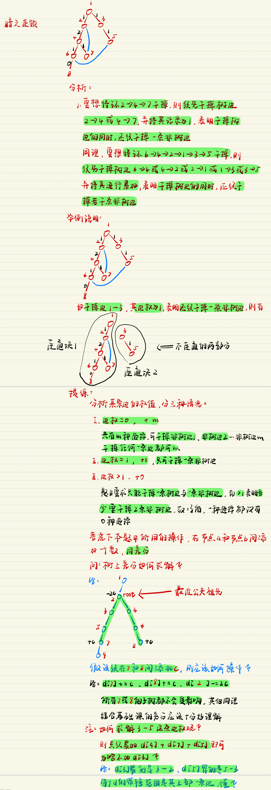

**代码**

```c++
#include <iostream>
#include <cstring>
using namespace std;
const int N = 100010, M = 200010, K = 18;
int n, m, idx, ans;
int h[N], e[M], ne[M], depth[N], st[N], q[N], d[N];
int fa[N][K];
void add(int a, int b) {
    e[idx] = b;
    ne[idx] = h[a];
    h[a] = idx ++;
    return;
}
// 求depth和fa模板
void bfs() {
    memset(depth, 0x3f, sizeof depth);
    memset(st, false, sizeof st);
    int hh = 0, tt = -1;
    q[ ++ tt ] = 1;
    st[1] = true;
    depth[0] = 0, depth[1] = 1;
    while (hh <= tt) {
        int t = q[hh ++ ];
        for (int i = h[t]; i != -1; i = ne[i]) {
            int j = e[i];
            if (!st[j]) {
                depth[j] = depth[t] + 1;
                q[ ++ tt ] = j;
                st[j] = true;
                fa[j][0] = t;
                for (int k = 1; k <= 17; k ++ ) fa[j][k] = fa[fa[j][k - 1]][k - 1];
            }
        }
    }
    return;
}
// lca模板
int lca(int a, int b) {
    if (depth[a] < depth[b]) swap(a, b);
    for (int k = 17; k >= 0; k -- )
        if (depth[fa[a][k]] >= depth[b])
            a = fa[a][k];
    if (a == b) return a;
    for (int k = 17; k >= 0; k -- )
        if (fa[a][k] != fa[b][k]) {
            a = fa[a][k];
            b = fa[b][k];
        }
    return fa[a][0];
}
int dfs(int u, int father) {
    int res = d[u];
    for (int i = h[u]; i != -1; i = ne[i]) {
        int j = e[i];
        if (j == father) continue;
        int s = dfs(j, u);
        // 计算到u到j这条边
        // 只需累加到j即可不需要累加到u[手写稿详细解释]
        if (s == 0) ans += m;
        else if (s == 1) ans ++;
        res += s;
    }
    return res;
}
int main() {
    scanf("%d%d", &n, &m);
    memset(h, -1, sizeof h);
    for (int i = 0; i < n - 1; i ++ ) {
        int a, b;
        scanf("%d%d", &a, &b);
        // 双向边
        add(a, b);
        add(b, a);
    }
    // 求解lca所需要的depth和fa函数
    bfs();
    for (int i = 0; i < m; i ++ ) {
        int a, b, root;
        scanf("%d%d", &a, &b);
        root = lca(a, b);
        // 树上差分
        d[a] ++, d[b] ++, d[root] -= 2;
    }
    // 求解答案
    dfs(1, -1);
    cout << ans << endl;
    return 0;
}
```

**时间复杂度**

$O(mlog_n)$

**空间复杂度**

$O(n)$

**标签**

`lca`、`树上差分`

**缝合怪**


## 有向图的强连通分量

### 原理


### [AcWing 1174. 受欢迎的牛](https://www.acwing.com/problem/content/1176/)

**题目描述**

>   每一头牛的愿望就是变成一头最受欢迎的牛。
>
>   现在有 `N` 头牛，编号从 `1` 到 `N`，给你 `M` 对整数 `(A,B)`，表示牛 `A` 认为牛 `B` 受欢迎。
>
>   这种关系是具有传递性的，如果 `A` 认为 `B` 受欢迎，`B` 认为 `C` 受欢迎，那么牛 `A` 也认为牛 `C` 受欢迎。
>
>   你的任务是求出有多少头牛被除自己之外的所有牛认为是受欢迎的。

**输入格式**

>   第一行两个数 `N,M`；
>
>   接下来 `M` 行，每行两个数 `A,B`，意思是 `A` 认为 `B` 是受欢迎的（给出的信息有可能重复，即有可能出现多个 `A,B`）。

**输出格式**

>   输出被除自己之外的所有牛认为是受欢迎的牛的数量。

**数据范围**

>   +   $1≤N≤10^4,$
>   +   $1≤M≤5×10^4$

**输入样例**

```c++
3 3
1 2
2 1
2 3
```

**输出样例**

```c++
1
```

**样例解释**

>   只有第三头牛被除自己之外的所有牛认为是受欢迎的。

**手写稿**

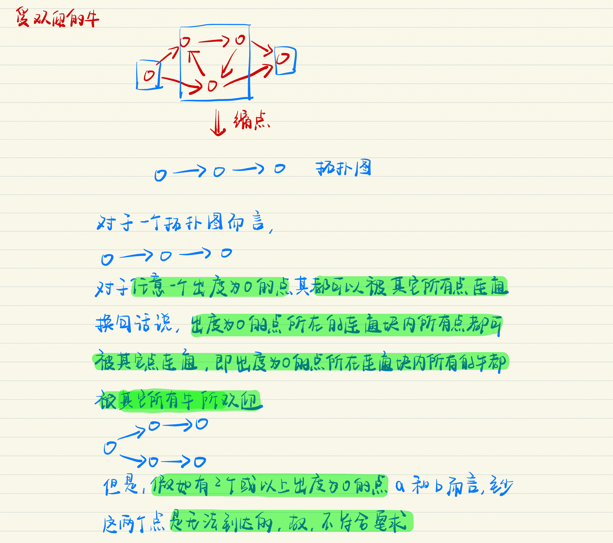

**代码**

```c++
#include <iostream>
#include <cstring>
using namespace std;
const int N = 10010, M = 50010;
int n, m, idx, timestamp, top, scc_cnt;
int h[N], e[M], ne[M], dfn[N], low[N], stk[N], in_stk[N], id[N], sze[N], dout[N];
// 链式前向星
void add(int a, int b) {
    e[idx] = b;
    ne[idx] = h[a];
    h[a] = idx ++;
    return;
}
// 模板
void tarjan(int u) {
    dfn[u] = low[u] = ++ timestamp;
    // 将u进栈并且将u标记为已经处于栈中
    stk[top ++ ] = u, in_stk[u] = true;
    // 遍历u的所有邻接点
    for (int i = h[u]; i != -1; i = ne[i]) {
        int j = e[i];
        // 如果还没有被遍历过
        if (!dfn[j]) {
            // 遍历
            tarjan(j);
            // 取最小值
            low[u] = min(low[u], low[j]);
        }
        // 如果已经处于栈中, 更新low[u]的值
        else if (in_stk[j]) low[u] = min(low[u], dfn[j]);
    }
    // 如果当前的强连通分量内所有点都已经被遍历过
    if (low[u] == dfn[u]) {
        ++ scc_cnt; // 连通分量个数 ++
        int y;
        do {
            y = stk[ -- top]; // 取出栈顶
            in_stk[y] = false; // 标记为false, 表明已经出栈
            id[y] = scc_cnt; // 标记当前点处于哪个连通块
            sze[scc_cnt] ++; // 当前连通块内部点 ++ 
        } while(y != u); // 当两者相等时结束
    }
    return;
}
int main() {
    scanf("%d%d", &n, &m);
    memset(h, -1, sizeof h);
    for (int i = 0; i < m; i ++ ) {
        int a, b;
        scanf("%d%d", &a, &b);
        add(a, b);
    }
    for (int i = 1; i <= n; i ++ )
        // 如果i还没有被遍历过, 则遍历
        if (!dfn[i])
            tarjan(i);
    for (int i = 1; i <= n; i ++ )
        for (int j = h[i]; j != -1; j = ne[j]) {
            int k = e[j];
            // 获取点i所在的连通块编号
            // 获取点k所在的连通块编号
            int a = id[i], b = id[k];
            // 如果点i和点k不在同一个连通块内,则更新a的出度
            if (a != b) dout[a] ++;
        }
    int zero = 0, sum = 0;
    for (int i = 1; i <= scc_cnt; i ++ ) {
        // 如果连通块i的出度不为0, 则进行下一次循环
        if (dout[i]) continue;
        // 出度为0的连通块数量 ++
        zero ++;
        // 点数量 + sze[i]
        sum += sze[i];
        // 如果出度为0的连通块的数量多于1个, 则说明不存在合法条件
        if (zero > 1) {
            sum = 0;
            break;
        }
    }
    cout << sum << endl;
    return 0;
}
```

**时间复杂度**

$O(n)$

**空间复杂度**

$O(n)$

**标签**

`Tarjan`、`强连通分量`

**缝合怪**


### [AcWing 367. 学校网络](https://www.acwing.com/problem/content/369/)

**题目描述**

>   一些学校连接在一个计算机网络上，学校之间存在软件支援协议，每个学校都有它应支援的学校名单（学校 `A` 支援学校 `B`，并不表示学校 `B` 一定要支援学校 `A`）。
>
>   当某校获得一个新软件时，无论是直接获得还是通过网络获得，该校都应立即将这个软件通过网络传送给它应支援的学校。
>
>   因此，一个新软件若想让所有学校都能使用，只需将其提供给一些学校即可。
>
>   现在请问最少需要将一个新软件直接提供给多少个学校，才能使软件能够通过网络被传送到所有学校？
>
>   最少需要添加几条新的支援关系，使得将一个新软件提供给任何一个学校，其他所有学校就都可以通过网络获得该软件？

**输入格式**

>   第 `1` 行包含整数 `N`，表示学校数量。
>
>   第 `2..N+1` 行，每行包含一个或多个整数，第 `i+1` 行表示学校 `i` 应该支援的学校名单，每行最后都有一个 `0` 表示名单结束（只有一个 `0` 即表示该学校没有需要支援的学校）。

**输出格式**

>   输出两个问题的结果，每个结果占一行。

**数据范围**

>   +   $2≤N≤100$

**输入样例**

```c++
5
2 4 3 0
4 5 0
0
0
1 0
```

**输出样例**

```c++
1
2 
```

**手写稿**

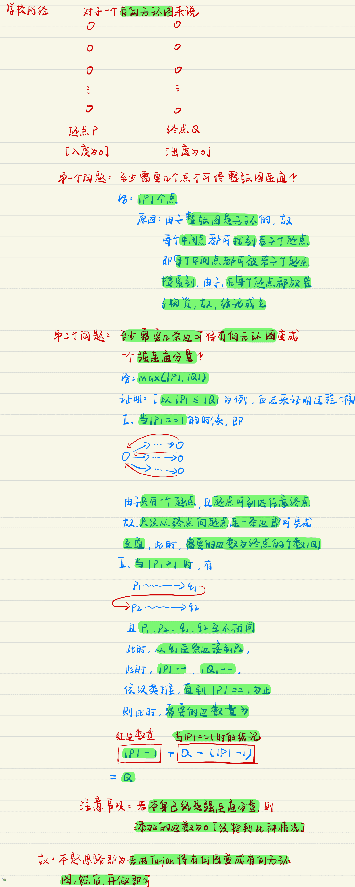

**代码**

```c++
#include <iostream>
#include <cstring>
using namespace std;
const int N = 110, M = 10010;
int n, idx, top, timestamp, scc_cnt;
int h[N], e[M], ne[M], dfn[N], low[N], stk[N], in_stk[N], id[N], din[N], dout[N];
void add(int a, int b) {
    e[idx] = b;
    ne[idx] = h[a];
    h[a] = idx ++;
    return;
}
// tarjan模板
void tarjan(int u) {
    dfn[u] = low[u] = ++ timestamp;
    stk[ ++ top ] = u, in_stk[u] = true;
    for (int i = h[u]; i != -1; i = ne[i]) {
        int j = e[i];
        if (!dfn[j]) {
            tarjan(j);
            low[u] = min(low[u], low[j]);
        }
        else if (in_stk[j]) low[u] = min(low[u], dfn[j]);
    }
    if (low[u] == dfn[u]) {
        // 连通块下标从1开始
        ++ scc_cnt;
        int y;
        do {
            y = stk[top -- ];
            in_stk[y] = false;
            id[y] = scc_cnt;
        } while (y != u);
    }
    return;
}

int main() {
    scanf("%d", &n);
    memset(h, -1, sizeof h);
    for (int i = 1, a; i <= n; i ++ )
        while (~scanf("%d", &a), a)
            add(i, a);
    for (int i = 1; i <= n; i ++ )
        // 如果当前点还没有被遍历过, 则遍历此点
        if (!dfn[i])
            tarjan(i);
    for (int i = 1; i <= n; i ++ )
        for (int j = h[i]; j != -1; j = ne[j]) {
            int k = e[j];
            int a = id[i], b = id[k];
            if (a == b) continue;
            dout[a] ++;
            din[b] ++;
        }
    int a = 0, b = 0;
    // 遍历所有的连通块, 下标从1开始
    for (int i = 1; i <= scc_cnt; i ++ ) {
        if (!dout[i]) a ++;
        if (!din[i]) b ++;
    }
    cout << b << endl;
    if (scc_cnt == 1) puts("0");
    else cout << max(a, b) << endl;
    return 0;
}
```

**时间复杂度**

$O(n)$

**空间复杂度**

$O(n)$

**标签**

`Tarjan`、`强连通分量`

**缝合怪**


### [AcWing 1175. 最大半连通子图](https://www.acwing.com/problem/content/1177/)

**题目描述**

>   一个**有向**图 `G=(V,E)` 称为半连通的 `(Semi-Connected)`，如果满足：`∀u,v∈V`，满足 `u→v` 或 `v→u`，即对于图中任意两点 `u,v`，存在一条 `u` 到 `v` 的有向路径或者从 `v` 到 `u` 的有向路径。
>
>   若 `G′=(V′,E′)` 满足，`E′` 是 `E` 中所有和 `V′` 有关的边，则称 `G′` 是 `G` 的一个导出子图。
>
>   若 `G′` 是 `G` 的导出子图，且 `G′` 半连通，则称 `G′` 为 `G` 的半连通子图。
>
>   若 `G′` 是 `G` 所有半连通子图中包含节点数最多的，则称 `G′` 是 `G` 的最大半连通子图。
>
>   给定一个有向图 `G`，请求出 `G` 的最大半连通子图拥有的节点数 `K`，以及不同的最大半连通子图的数目 `C`。
>
>   由于 `C` 可能比较大，仅要求输出 `C` 对 `X` 的余数。

**输入格式**

>   第一行包含三个整数 `N,M,X`。`N,M` 分别表示图 `G` 的点数与边数，`X` 的意义如上文所述；
>
>   接下来 `M` 行，每行两个正整数 `a,b`，表示一条有向边 `(a,b)`。
>
>   图中的每个点将编号为 `1` 到 `N`，保证输入中同一个 `(a,b)` 不会出现两次。

**输出格式**

>   应包含两行。
>
>   第一行包含一个整数 `K`，第二行包含整数 `C mod X`。

**数据范围**

>   +   $1≤N≤10^5,$
>   +   $1≤M≤10^6,$
>   +   $1≤X≤10^8$

**输入样例**

```c++
6 6 20070603
1 2
2 1
1 3
2 4
5 6
6 4
```

**输出样例**

```c++
3
3
```

**手写稿**

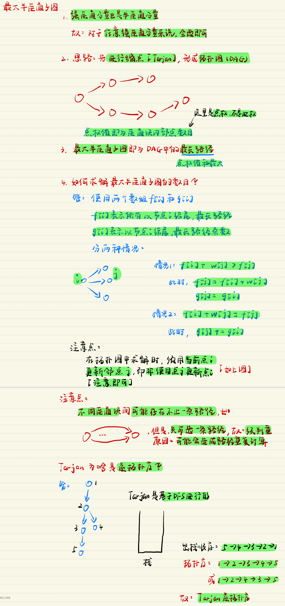

**代码**

```c++
#include <iostream>
#include <cstring>
#include <unordered_set>
using namespace std;
typedef long long LL;
const int N = 100010, M = 2000010;
int n, m, mod, idx, timestamp, top, scc_cnt;
int h[N], hs[N], e[M], ne[M], dfn[N], low[N], stk[N], in_stk[N], id[N], scc_size[N], f[N], g[N];
unordered_set<LL> hx;
// 加边模板
void add(int h[], int a, int b) {
    e[idx] = b;
    ne[idx] = h[a];
    h[a] = idx ++;
    return;
}
// Tarjan模板
void tarjan(int u) {
    // 时间戳
    dfn[u] = low[u] = ++ timestamp;
    // 入栈并标记其已在栈中
    stk[ ++ top] = u, in_stk[u] = true;
    // 遍历u的所有邻边
    for (int i = h[u]; i != -1; i = ne[i]) {
        int j = e[i];
        // 如果j还没有被遍历过
        if (!dfn[j]) {
            // 遍历j
            tarjan(j);
            // 更新u能走到的最旧的时间戳
            low[u] = min(low[u], low[j]);
        }
        // 如果j已在栈中, 则直接更新u能走到的最旧的时间戳
        else if (in_stk[j]) low[u] = min(low[u], dfn[j]);
    }
    // 如果一个连通块已被遍历完
    if (dfn[u] == low[u]) {
        int y;
        // ++ 连通块编号
        ++ scc_cnt;
        do {
            // 取出栈顶
            y = stk[top -- ];
            // 标记为不在栈中
            in_stk[y] = false;
            // 标记当前点的连通块的编号
            id[y] = scc_cnt;
            // 当前连通块的数量 ++
            scc_size[scc_cnt] ++;
        } while (y != u);
    }
    return;
}
int main() {
    scanf("%d%d%d", &n, &m, &mod);
    memset(h, -1, sizeof h);
    memset(hs, -1, sizeof hs);
    for (int i = 0; i < m; i ++ ) {
        int a, b;
        scanf("%d%d", &a, &b);
        add(h, a, b);
    }
    for (int i = 1; i <= n; i ++ )
        if (!dfn[i])
            tarjan(i);
    for (int i = 1; i <= n; i ++ )
        for (int j = h[i]; j != -1; j = ne[j]) {
            int k = e[j];
            // 获取点i的连通块编号
            // 获取点k的连通块编号
            int a = id[i], b = id[k];
            // 哈希
            LL t = a * 1000000ll + b;
            if (a != b && !hx.count(t)) {
                add(hs, a, b);
                hx.insert(t);
            }
        }
    // 倒序一定就是拓扑序[手写稿解释]
    for (int i = scc_cnt; i; i -- ) {
        // 如果连通块i没有被更新, 则更新
        if (!f[i]) {
            // 更新最长路径
            f[i] = scc_size[i];
            // 更新个数
            g[i] = 1;
        }
        // 遍历连通块i的所有邻边
        for (int j = hs[i]; j != -1; j = ne[j]) {
            int k = e[j];
            // 更新看[手写稿]
            if (f[i] + scc_size[k] > f[k]) {
                f[k] = f[i] + scc_size[k];
                g[k] = g[i];
            }
            else if (f[i] + scc_size[k] == f[k])
                g[k] = (g[k] + g[i]) % mod;
        }
    }
    int maxf = -1, sum = 0;
    for (int i = 1; i <= scc_cnt; i ++ )
        if (f[i] > maxf) {
            maxf = f[i];
            sum = g[i];
        }
        else if (f[i] == maxf) sum = (sum + g[i]) % mod;
    printf("%d\n%d\n", maxf, sum);
    return 0;
}
```

**时间复杂度**

$O(m)$

**空间复杂度**

$O(n)$

**标签**

`Tarjan`、`拓扑排序`

**缝合怪**


### [AcWing 368. 银河](https://www.acwing.com/problem/content/370/)

**题目描述**

>   银河中的恒星浩如烟海，但是我们只关注那些最亮的恒星。
>
>   我们用一个正整数来表示恒星的亮度，数值越大则恒星就越亮，恒星的亮度最暗是 `1`。
>
>   现在对于 `N` 颗我们关注的恒星，有 `M` 对亮度之间的相对关系已经判明。
>
>   你的任务就是求出这 `N` 颗恒星的亮度值总和至少有多大。

**输入格式**

>   第一行给出两个整数 `N` 和 `M`。
>
>   之后 `M` 行，每行三个整数 `T,A,B`，表示一对恒星 `(A,B)` 之间的亮度关系。恒星的编号从 `1` 开始。
>
>   如果 `T=1`，说明 `A` 和 `B` 亮度相等。
>   如果 `T=2`，说明 `A` 的亮度小于 `B` 的亮度。
>   如果 `T=3`，说明 `A` 的亮度不小于 `B` 的亮度。
>   如果 `T=4`，说明 `A` 的亮度大于 `B` 的亮度。
>   如果 `T=5`，说明 `A` 的亮度不大于 `B` 的亮度。

**输出格式**

>   输出一个整数表示结果。
>
>   若无解，则输出 `−1`。

**数据范围**

>   +   $N≤100000,M≤100000$

**输入样例**

```c++
5 7 
1 1 2 
2 3 2 
4 4 1 
3 4 5 
5 4 5 
2 3 5 
4 5 1 
```

**输出样例**

```c++
11
```

**手写稿**

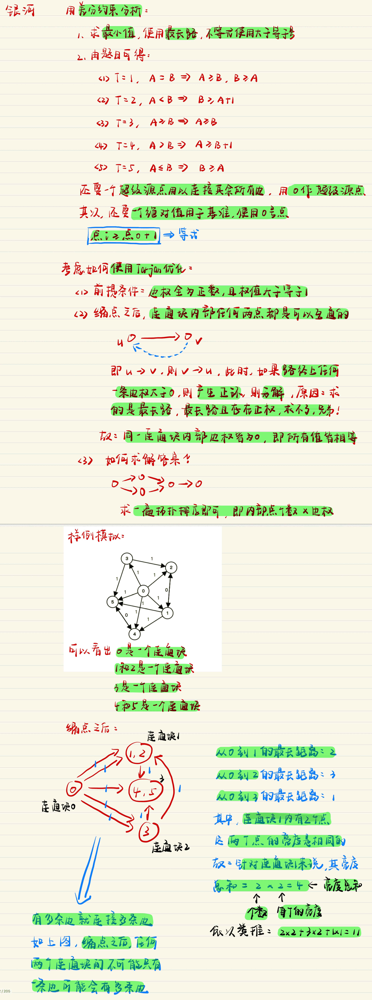

**代码**

```c++
#include <iostream>
#include <algorithm>
#include <cstring>
using namespace std;
typedef long long LL;
const int N = 100010, M = 600010;
int n, m, idx, top, timestamp, scc_cnt;
int h[N], hs[N], e[M], w[M], ne[M], dfn[N], low[N], stk[N], in_stk[N], id[N], sz[N], dist[N];
// 加边函数
void add(int h[], int a, int b, int c) {
    e[idx] = b;
    w[idx] = c;
    ne[idx] = h[a];
    h[a] = idx ++;
    return;
}
// Tarjan模板
void tarjan(int u) {
    dfn[u] = low[u] = ++ timestamp;
    stk[ ++ top ] = u, in_stk[u] = true;
    for (int i = h[u]; i != -1; i = ne[i]) {
        int j = e[i];
        if (!dfn[j]) {
            tarjan(j);
            low[u] = min(low[u], low[j]);
        }
        else if (in_stk[j]) low[u] = min(low[u], dfn[j]);
    }
    if (low[u] == dfn[u]) {
        ++ scc_cnt;
        int y;
        do {
            y = stk[top -- ];
            in_stk[y] = false;
            id[y] = scc_cnt;
            sz[scc_cnt] ++;
        } while (y != u);
    }
    return;
}
int main() {
    scanf("%d%d", &n, &m);
    memset(h, -1, sizeof h);
    memset(hs, -1, sizeof hs);
    // 建立超级源点
    for (int i = 1; i <= n; i ++ ) add(h, 0, i, 1);
    // 约束条件
    for (int i = 0; i < m; i ++ ) {
        int t, a, b;
        scanf("%d%d%d", &t, &a, &b);
        if (t == 1) add(h, b, a, 0), add(h, a, b, 0);
        else if (t == 2) add(h, a, b, 1);
        else if (t == 3) add(h, b, a, 0);
        else if (t == 4) add(h, b, a, 1);
        else add(h, a, b, 0);
    }
    // 求强连通分量
    tarjan(0);
    int flag = true;
    // 遍历所有点, 从0开始
    for (int i = 0; i <= n; i ++ ) {
        // 遍历所有邻边
        for (int j = h[i]; j != -1; j = ne[j]) {
            int k = e[j];
            // 获取点i的连通块编号
            // 获取点k的连通块编号
            int a = id[i], b = id[k];
            // 如果在同一个连通块内部且权值大于0, 则无解[手写稿]
            if (a == b && w[j] > 0) {
                flag = false;
                break;
            }
            // 两个连通块之间可能会有多条边进行连接, 每条边都需要添加[手写稿]
            if (a != b) add(hs, a, b, w[j]);
        }
        if (!flag) break;
    }
    if (!flag) puts("-1");
    else {
        // 倒序遍历每个连通块[即为拓扑顺序]
        for (int i = scc_cnt; i; i -- )
            // 遍历连通块的每个邻连通块
            for (int j = hs[i]; j != -1; j = ne[j]) {
                int k = e[j];
                // 更新距离
                dist[k] = max(dist[k], dist[i] + w[j]);
            }
        LL res = 0;
        // 公式[手写稿]
        for (int i = 1; i <= scc_cnt; i ++ ) res += (LL)dist[i] * sz[i];
        printf("%lld\n", res);
    }
    return 0;
}
```

**时间复杂度**

$O(m)$

**空间复杂度**

$O(m)$

**标签**

`Tarjan`、`差分约束`、`强连通分量`

**缝合怪**


## 无向图的双连通分量

### 原理

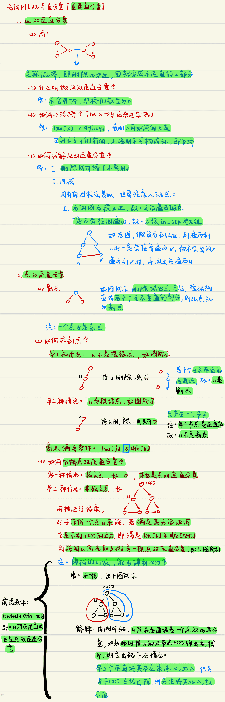

### [AcWing 395. 冗余路径](https://www.acwing.com/problem/content/397/)

**题目描述**

>   为了从 `F` 个草场中的一个走到另一个，奶牛们有时不得不路过一些她们讨厌的可怕的树。
>
>   奶牛们已经厌倦了被迫走某一条路，所以她们想建一些新路，使每一对草场之间都会至少有两条相互分离的路径，这样她们就有多一些选择。
>
>   每对草场之间已经有至少一条路径。
>
>   给出所有 `R` 条双向路的描述，每条路连接了两个不同的草场，请计算最少的新建道路的数量，路径由若干道路首尾相连而成。
>
>   两条路径相互分离，是指两条路径没有一条重合的道路。
>
>   但是，两条分离的路径上可以有一些相同的草场。
>
>   对于同一对草场之间，可能已经有两条不同的道路，你也可以在它们之间再建一条道路，作为另一条不同的道路。

**输入格式**

>   第 `1` 行输入 `F` 和 `R`。
>
>   接下来 `R` 行，每行输入两个整数，表示两个草场，它们之间有一条道路。

**输出格式**

>   输出一个整数，表示最少的需要新建的道路数。

**数据范围**

>   +   $1≤F≤5000,$
>   +   $F−1≤R≤10000$

**输入样例**

```c++
7 7
1 2
2 3
3 4
2 5
4 5
5 6
5 7
```

**输出样例**

```c++
2
```

**手写稿**

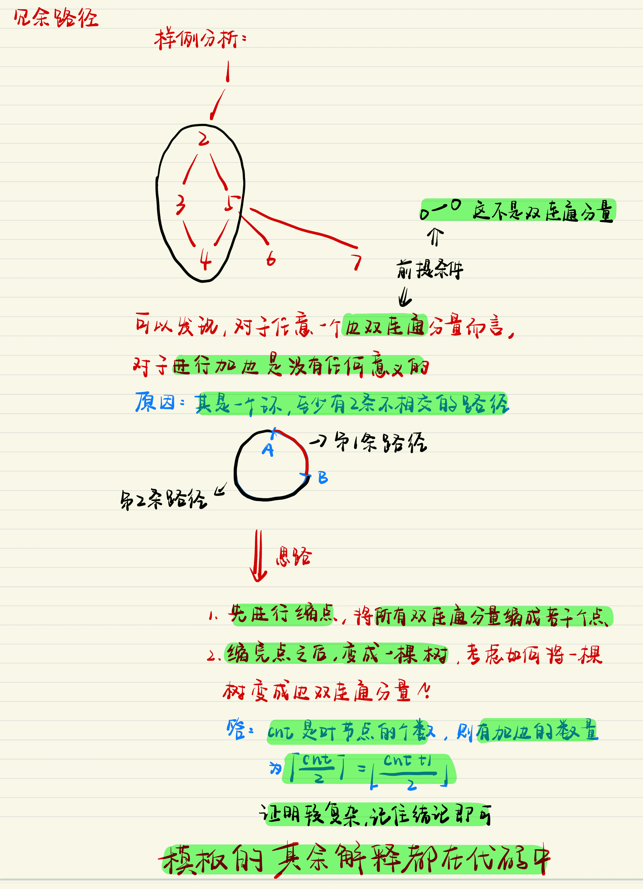

**代码**

```c++
#include <iostream>
#include <cstring>
using namespace std;
const int N = 5010, M = 20010;
int n, m, idx, timestamp, top, dcc_cnt;
int h[N], e[M], ne[M], dfn[N], low[N], stk[N], is_bridge[M], id[N], d[N];
// 加边函数
void add(int a, int b) {
    e[idx] = b;
    ne[idx] = h[a];
    h[a] = idx ++;
    return;
}
// from记录的是边, 不是点
void tarjan(int u, int from) {
    // 时间戳
    dfn[u] = low[u] = ++ timestamp;
    // 入栈
    stk[++ top] = u;
    // 遍历u的所有邻边
    for (int i = h[u]; i != -1; i = ne[i]) {
        int j = e[i];
        // 如果点j没有被遍历过
        if (!dfn[j]) {
            // 注意: 这里的from不是u, 不是父节点father
            // 而是, 这里的from记录的是边
            tarjan(j, i);
            // 更新low值
            low[u] = min(low[u], low[j]);
            // 如果点j无论如何也走不到u之前, 则说明其是桥
            if (low[j] > dfn[u])
                // 注意: 这里的边是成对出现的
                // 即: 0 -> 1, 其下标为0, 1 -> 0, 其下标为1, 奇偶交替
                // 故: 标记桥的话, 两条边都要进行标记
                is_bridge[i] = is_bridge[i ^ 1] = true;
        }
        // 交替
        // 奇数 ^ 1 == 奇数 - 1 ==> 1 ^ 1 == 0, 1的反向边正好为0
        // 偶数 ^ 1 == 偶数 + 1 ==> 0 ^ 1 == 1, 0的反向边正好为1
        // 完美符合条件
        // 更新low的值
        // 每条边只能走一次, 要么走正向边要么走反向边
        // 否则, 0-1也是边双连通分量了, 但是, 显示不是
        // 人家就一条边, 你非当成两条边来用, 明显不合理
        else if (i != (from ^ 1)) low[u] = min(low[u], dfn[j]);
    }
    // 只能走到自己, 说明是桥
    if (dfn[u] == low[u]) {
        // 双连通分量的个数 ++
        ++ dcc_cnt;
        int y;
        do {
            // 取出栈顶
            y = stk[top -- ];
            // 标记当前元素所在的连通块编号为dcc_cnt
            id[y] = dcc_cnt;
        } while(y != u);
    }
    return;
}
int main() {
    scanf("%d%d", &n, &m);
    memset(h, -1, sizeof h);
    for (int i = 0; i < m; i ++ ) {
        int a, b;
        scanf("%d%d", &a, &b);
        add(a, b);
        add(b, a);
    }
    tarjan(1, -1);
    // 遍历所有边, 包括正向边和反向边
    // 例如: a - b, 则有, a的度数为1, b的度数也为1, 无向图只有度数, 没有入度和出度之说
    // a -> b说明b的度数++
    // b -> a说明a的度数++
    // 完美符合条件
    for (int i = 0; i < idx; i ++ )
        // 如果是桥, 则统计度数
        if (is_bridge[i])
            d[id[e[i]]] ++;
    int cnt = 0;
    for (int i = 1; i <= dcc_cnt; i ++ )
        // 统计所有度为1的节点, 也就是叶子节点
        if (d[i] == 1) cnt ++;
    // 结论
    cout << ++ cnt / 2 << endl;
    return 0;
}
```

**时间复杂度**

$O(m)$

**空间复杂度**

$O(m)$

**标签**

`Tarjan`、`边双连通分量`

**缝合怪**


### [AcWing 1183. 电力](https://www.acwing.com/problem/content/1185/)

**题目描述**

>   给定一个由 `n` 个点 `m` 条边构成的**无向**图，请你求出该图删除一个点之后，连通块最多有多少。

**输入格式**

>   输入包含多组数据。
>
>   每组数据第一行包含两个整数 `n,m`。
>
>   接下来 `m` 行，每行包含两个整数 `a,b`，表示 `a,b` 两点之间有边连接。
>
>   数据保证无重边。
>
>   点的编号从 `0` 到 `n−1`。
>
>   读入以一行 `0 0` 结束。

**输出格式**

>   每组数据输出一个结果，占一行，表示连通块的最大数量。

**数据范围**

>   +   $1≤n≤10000,$
>   +   $0≤m≤15000,$
>   +   $0≤a,b<n$

**输入样例**

```c++
3 3
0 1
0 2
2 1
4 2
0 1
2 3
3 1
1 0
0 0
```

**输出样例**

```c++
1
2
2
```

**手写稿**

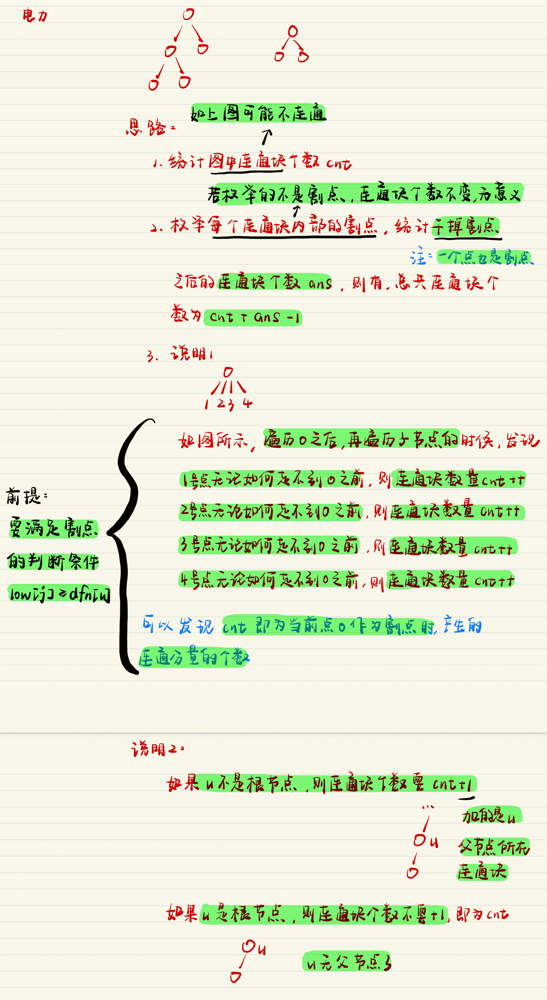

**代码**

```c++
#include <iostream>
#include <cstring>
using namespace std;
const int N = 10010, M = 30010;
int n, m, idx, timestamp, ans, root;
int h[N], e[M], ne[M], dfn[N], low[N];
void add(int a, int b) {
    e[idx] = b;
    ne[idx] = h[a];
    h[a] = idx ++;
    return;
}
void tarjan(int u) {
    dfn[u] = low[u] = ++ timestamp;
    int cnt = 0;
    for (int i = h[u]; i != -1; i = ne[i]) {
        int j = e[i];
        if (!dfn[j]) {
            tarjan(j);
            low[u] = min(low[u], low[j]);
            // 满足割点的条件
            // 每产生一个被堵在u之前的节点, 则连通块数量 ++
            // 说明u是割点, 原因: j被堵在u之前, 过不来
            // 手写稿说明
            if (low[j] >= dfn[u]) cnt ++;
        }
        else low[u] = min(low[u], dfn[j]);
    }
    // 手写稿说明
    if (u != root && cnt) cnt ++;
    ans = max(ans, cnt);
    return;
}
int main() {
    while (scanf("%d%d", &n, &m), n || m) {
        memset(h, -1, sizeof h);
        memset(dfn, 0, sizeof dfn);
        memset(low, 0, sizeof low);
        idx = timestamp = 0;
        for (int i = 0; i < m; i ++) {
            int a, b;
            scanf("%d%d", &a, &b);
            add(a, b);
            add(b, a);
        }
        // 统计所有连通块数量, 因为, 图可能不连通
        int cnt = 0;
        // 重置变量
        ans = 0;
        for (root = 0; root < n; root ++ )
            if (!dfn[root]) {
                // 连通块数量 ++
                cnt ++;
                tarjan(root);
            }
        printf("%d\n", cnt + ans - 1);
    }
    return 0;
}
```

**时间复杂度**

$O(n)$

**空间复杂度**

$O(n)$

**标签**

`Tarjan`、`割点`

**缝合怪**


### [AcWing 396. 矿场搭建](https://www.acwing.com/problem/content/398/)

**题目描述**

>   煤矿工地可以看成是由隧道连接挖煤点组成的无向图。
>
>   为安全起见，希望在工地发生事故时所有挖煤点的工人都能有一条出路逃到救援出口处。
>
>   于是矿主决定在某些挖煤点设立救援出口，使得无论哪一个挖煤点坍塌之后，其他挖煤点的工人都有一条道路通向救援出口。
>
>   请写一个程序，用来计算至少需要设置几个救援出口，以及不同最少救援出口的设置方案总数。

**输入格式**

>   输入文件有若干组数据，每组数据的第一行是一个正整数 `N`，表示工地的隧道数。
>
>   接下来的 `N` 行每行是用空格隔开的两个整数 `S` 和 `T`，表示挖煤点 `S` 与挖煤点 `T` 由隧道直接连接。
>
>   注意，每组数据的挖煤点的编号为 `1∼Max`，其中 `Max` 表示由隧道连接的挖煤点中，编号最大的挖煤点的编号，可能存在没有被隧道连接的挖煤点。
>
>   输入数据以 `0` 结尾。

**输出格式**

>   每组数据输出结果占一行。
>
>   其中第 `i` 行以 `Case i:` 开始（注意大小写，`Case` 与 `i` 之间有空格，`i` 与 `:` 之间无空格，`:` 之后有空格）。
>
>   其后是用空格隔开的两个正整数，第一个正整数表示对于第 `i` 组输入数据至少需要设置几个救援出口，第二个正整数表示对于第 `i` 组输入数据不同最少救援出口的设置方案总数。
>
>   输入数据保证答案小于 $2^{64}$，输出格式参照以下输入输出样例。

**数据范围**

>   +   $1≤N≤500，$
>   +   $1≤Max≤1000$

**输入样例**

```c++
9
1  3
4  1
3  5
1  2
2  6
1  5
6  3
1  6
3  2
6
1  2
1  3
2  4
2  5
3  6
3  7
0
```

**输出样例**

```c++
Case 1: 2 4
Case 2: 4 1
```

**手写稿**

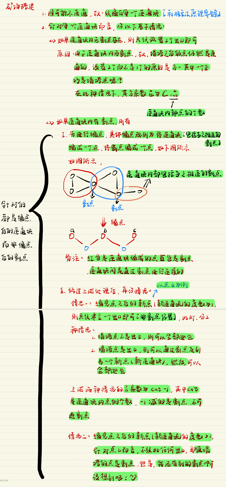

**代码**

```c++
#include <iostream>
#include <cstring>
#include <algorithm>
#include <vector>
using namespace std;
typedef unsigned long long ULL;
const int N = 1010, M = 2010;
int T, n, m, idx, timestamp, top, dcc_cnt, root;
int h[N], e[M], ne[M], dfn[N], low[N], stk[N], cut[N];
vector<int> dcc[N];
void add(int a, int b) {
    e[idx] = b;
    ne[idx] = h[a];
    h[a] = idx ++;
    return;
}
void tarjan(int u) {
    dfn[u] = low[u] = ++ timestamp;
    stk[ ++ top] = u;
    if (u == root && h[u] == -1) { // 孤立点, 单个点也是点双连通分量
        // 连通块编号 ➕ 1  
        dcc_cnt ++;
        // 将当前点添加到当前连通块内部
        dcc[dcc_cnt].push_back(u);
        // 返回即可
        return;
    }
    int cnt = 0; // 统计干掉割点后的连通块个数
    // 遍历所有邻边
    for (int i = h[u]; i != -1; i = ne[i]) {
        // 获取点
        int j = e[i];
        // 如果点j没有被访问过
        if (!dfn[j]) {
            // 搞它
            tarjan(j);
            // 更新u的low值
            low[u] = min(low[u], low[j]);
            // 如果点j无论如何也走不到u的上部
            // 则说明点j所在的连通块是u的新🍠(新分支)
            if (low[j] >= dfn[u]) {
                // 连通块数量 ++ 
                cnt ++;
                // 如果u不是根结点或者u的分支数量 > 1, 则说明是割点
                if (u != root || cnt > 1) cut[u] = true;
                // 缩点之后的连通块数量 ++ 
                ++ dcc_cnt;
                int y;
                do {
                    // 取出栈顶
                    y = stk[top -- ];
                    // 将y插入到当前的连通块dcc_cnt内部
                    dcc[dcc_cnt].push_back(y);
                } while (y != j);
                // 将割点也加入当前连通块, 但是不要将其弹出栈[手写稿原因]
                dcc[dcc_cnt].push_back(u);
            }
        }
        // 更新u的low值
        else low[u] = min(low[u], dfn[j]);
    }
    return;
}
int main() {
    while (scanf("%d", &m), m) {
        // 清空连通块内部点
        for (int i = 1; i <= dcc_cnt; i ++ ) dcc[i].clear();
        // 清空相关变量
        n = idx = timestamp = top = dcc_cnt = 0;
        memset(h, -1, sizeof h);
        memset(dfn, 0, sizeof dfn);
        memset(low, 0, sizeof low);
        memset(stk, 0, sizeof stk);
        memset(cut, 0, sizeof cut);
        for (int i = 0; i < m; i ++ ) {
            int a, b;
            scanf("%d%d", &a, &b);
            // 寻找最大编号
            n = max(n, max(a, b));
            add(a, b);
            add(b, a);
        }
        // Tarjan缩点
        for (root = 1; root <= n; root ++ )
            // 如果root还没有被搞过
            if (!dfn[root])
                // 搞它
                tarjan(root);
        int res = 0;
        ULL num = 1;
        // 遍历每个连通块
        for (int i = 1; i <= dcc_cnt; i ++ ) {
            int cnt = 0, len = dcc[i].size();
            for (int j = 0; j < len; j ++ )
                // 如果当前点是割点, 则统计数量
                if (cut[dcc[i][j]]) cnt ++;
            // 如果割点数量为0
            if (cnt == 0) {
                // 特判, 如果不是孤立点, 上公式[手写稿]
                if (len > 1) res += 2, num *= len * (len - 1) / 2;
                // 特判, 如果是孤立点, 则只需要添加一个出口即可
                else res ++;
            }
            // 如果割点数量位1, 上公式[手写稿]
            else if (cnt == 1) res ++, num *= len - 1;
        }
        printf("Case %d: %d %llu\n", ++ T, res, num);
    }
    return 0;
}
```

**时间复杂度**

$O(m)$

**空间复杂度**

$O(m)$

**标签**

`Tarjan`、`点双连通分量`

**缝合怪**


## 二分图

### 染色法

#### [AcWing 860. 染色法判定二分图](https://www.acwing.com/problem/content/862/)

**题目描述**

>   给定一个 `n` 个点 `m` 条边的无向图，图中可能存在重边和自环。
>
>   请你判断这个图是否是二分图。

**输入格式**

>   第一行包含两个整数 `n` 和 `m`。
>
>   接下来 `m` 行，每行包含两个整数 `u` 和 `v`，表示点 `u` 和点 `v` 之间存在一条边。

**输出格式**

>   如果给定图是二分图，则输出 `Yes`，否则输出 `No`。

**数据范围**

>   +   $1 ≤ n, m ≤ 10^5$

**输入样例**

```c++
4 4
1 3
1 4
2 3
2 4
```

**输出样例**

```c++
Yes
```

**手写稿**

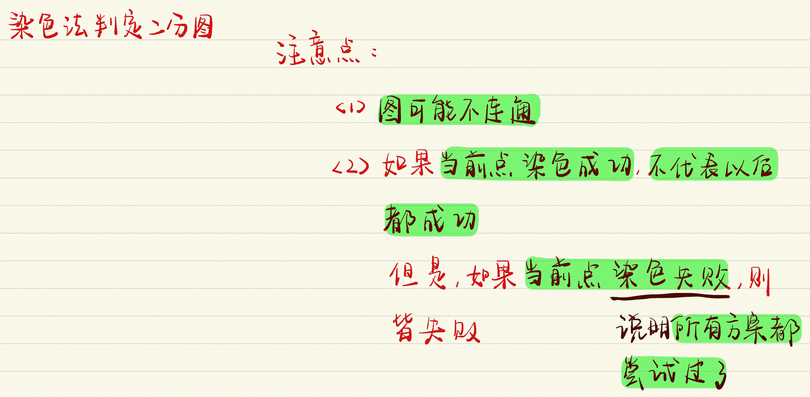

**代码**

```c++
#include <iostream>
#include <cstring>
using namespace std;
const int N = 100010, M = 200010;
int n, m, idx;
int h[N], e[M], ne[M], color[N];
void add(int a, int b) {
    e[idx] = b;
    ne[idx] = h[a];
    h[a] = idx ++;
    return;
}
bool dfs(int u, int c) {
    color[u] = c;
    for (int i = h[u]; i != -1; i = ne[i]) {
        int j = e[i];
        if (!color[j]) { // 如果当前点没染颜色, 则将其染色
            // 如果当前点j染色失败, 则产生连锁反应, 都失败
            if (!dfs(j, 3 - c)) return false;
        }
        else {
            // 如果当前点j染的颜色和u染的颜色不一样, 返回false
            if (color[j] == c) return false;
        }
    }
    return true;
}
int main() {
    memset(h, -1, sizeof h);
    scanf("%d%d", &n, &m);
    for (int i = 0; i < m; i ++ ) {
        int a, b;
        scanf("%d%d", &a, &b);
        add(a, b);
        add(b, a);
    }
    int flag = true;
    // 注意: 图可能不是连通
    for (int i = 1; i <= n; i ++ )
        if (!color[i])
            if (!dfs(i, 1)) {
                flag = false;
                break;
            }
    if (flag) puts("Yes");
    else puts("No");
    return 0;
}
```

**时间复杂度**

$O(n + m), n是点数, m是边数$

**空间复杂度**

$O(m)$

**标签**

`二分图`、`染色法`

**缝合怪**


#### [AcWing 257. 关押罪犯](https://www.acwing.com/problem/content/259/)

**题目描述**

>   `S` 城现有两座监狱，一共关押着 `N` 名罪犯，编号分别为 `1∼N`。
>
>   他们之间的关系自然也极不和谐。
>
>   很多罪犯之间甚至积怨已久，如果客观条件具备则随时可能爆发冲突。
>
>   我们用“怨气值”（一个正整数值）来表示某两名罪犯之间的仇恨程度，怨气值越大，则这两名罪犯之间的积怨越多。
>
>   如果两名怨气值为 `c` 的罪犯被关押在同一监狱，他们俩之间会发生摩擦，并造成影响力为 `c` 的冲突事件。
>
>   每年年末，警察局会将本年内监狱中的所有冲突事件按影响力从大到小排成一个列表，然后上报到 `S` 城 `Z` 市长那里。
>
>   公务繁忙的 `Z` 市长只会去看列表中的第一个事件的影响力，如果影响很坏，他就会考虑撤换警察局长。
>
>   在详细考察了 `N` 名罪犯间的矛盾关系后，警察局长觉得压力巨大。
>
>   他准备将罪犯们在两座监狱内重新分配，以求产生的冲突事件影响力都较小，从而保住自己的乌纱帽。
>
>   假设只要处于同一监狱内的某两个罪犯间有仇恨，那么他们一定会在每年的某个时候发生摩擦。
>
>   那么，应如何分配罪犯，才能使 `Z` 市长看到的那个冲突事件的影响力最小？这个最小值是多少？

**输入格式**

>   第一行为两个正整数 `N` 和 `M`，分别表示罪犯的数目以及存在仇恨的罪犯对数。
>
>   接下来的 `M` 行每行为三个正整数 $a_j，b_j，c_j$，表示 $a_j$ 号和 $b_j$ 号罪犯之间存在仇恨，其怨气值为 $c_j$。
>
>   数据保证 $1≤a_j<b_j<N,0<c_j≤10^9$ 且每对罪犯组合只出现一次。

**输出格式**

>   输出共 `1` 行，为 `Z` 市长看到的那个冲突事件的影响力。
>
>   如果本年内监狱中未发生任何冲突事件，请输出 `0`。

**数据范围**

>   +   $N≤20000,M≤100000$

**输入样例**

```c++
4 6
1 4 2534
2 3 3512
1 2 28351
1 3 6618
2 4 1805
3 4 12884
```

**输出样例**

```c++
3512
```

**手写稿**

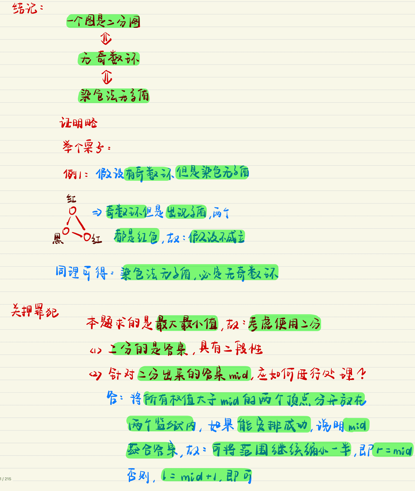

**代码**

```c++
#include <iostream>
#include <cstring>
using namespace std;
const int N = 20010, M = 200010;
int n, m, idx;
int h[N], e[M], w[M], ne[M], color[N];
void add(int a, int b, int c) {
    e[idx] = b;
    w[idx] = c;
    ne[idx] = h[a];
    h[a] = idx ++;
    return;
}
bool dfs(int u, int c, int mid) {
    color[u] = c;
    for (int i = h[u]; i != -1; i = ne[i]) {
        int j = e[i];
        // 如果当前点小于等于mid, 则返回
        if (w[i] <= mid) continue;
        // 当前点没有被染色并且给当前点染色产生矛盾, 则返回false
        if (!color[j] && !dfs(j, 3 - c, mid)) return false;
        // 如果已经染色并且颜色相同, 返回false
        else if (c == color[j]) return false;
    }
    return true;
}
bool check(int mid) {
    // 记得每一次都需要进行初始化
    memset(color, 0, sizeof color);
    // 遍历每个点
    for (int i = 1; i <= n; i ++ )
        // 如果当前点没有被染色并且给当前点进行染色不可能成功, 则返回false
        if (!color[i] && !dfs(i, 1, mid)) return false;
    return true;
}
int main() {
    scanf("%d%d", &n, &m);
    memset(h, -1, sizeof h);
    for (int i = 0; i < m; i ++ ) {
        int a, b, c;
        scanf("%d%d%d", &a, &b, &c);
        add(a, b, c);
        add(b, a, c);
    }
    int l = 0, r = 1e9;
    while (l < r) {
        int mid = l + r >> 1;
        if (check(mid)) r = mid;
        else l = mid + 1;
    }
    cout << r << endl;
    return 0;
}
```

**时间复杂度**

$O(log(1e9)*(n + m))$

**空间复杂度**

$O(m)$

**标签**

`染色法判断二分图`、`二分`

**缝合怪**


### 匈牙利算法

#### 原理

>   1.   步骤和原理在 [AcWing 861. 二分图的最大匹配](#AcWing 861. 二分图的最大匹配) 的手写稿

#### [AcWing 861. 二分图的最大匹配](https://www.acwing.com/problem/content/863/)

**题目描述**

>   给定一个二分图，其中左半部包含 $n_1$ 个点（编号 $1 ∼ n_1$），右半部包含 $n_2$ 个点（编号 $1 ∼ n_2$），二分图共包含 `m` 条边。
>
>   数据保证任意一条边的两个端点都不可能在同一部分中。
>
>   请你求出二分图的最大匹配数。
>
>   >   二分图的匹配：给定一个二分图 `G`，在 `G` 的一个子图 `M` 中，`M` 的边集 `{E}` 中的任意两条边都不依附于同一个顶点，则称 `M` 是一个匹配。
>   >
>   >   二分图的最大匹配：所有匹配中包含边数最多的一组匹配被称为二分图的最大匹配，其边数即为最大匹配数。

**输入格式**

>   第一行包含三个整数 $n_1、 n_2$ 和 `m`。
>
>   接下来 `m` 行，每行包含两个整数 `u` 和 `v`，表示左半部点集中的点 `u` 和右半部点集中的点 `v` 之间存在一条边。

**输出格式**

>   输出一个整数，表示二分图的最大匹配数。

**数据范围**

>   +   $1 ≤ n_1, n_2 ≤ 500,$
>   +   $1 ≤ u ≤ n_1,$
>   +   $1 ≤ v ≤ n_2,$
>   +   $1 ≤ m ≤ 10^5$

**输入样例**

```c++
2 2 4
1 1
1 2
2 1
2 2
```

**输出样例**

```c++
2
```

**手写稿**

>   1.   题解
>
>        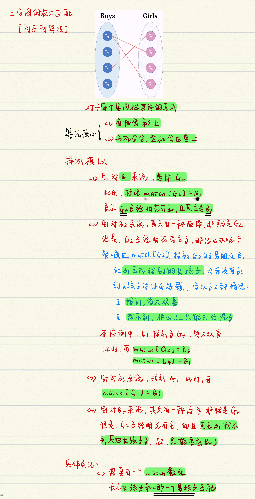
>
>   2.   补充
>
>        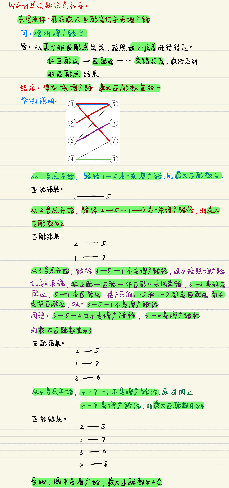
>

**代码**

```c++
#include <iostream>
#include <cstring>
using namespace std;
const int N = 510, M = 100010;
int n1, n2, m, idx;
int h[N], e[M], ne[M], match[N], st[N];
void add(int a, int b) {
    e[idx] = b;
    ne[idx] = h[a];
    h[a] = idx ++;
    return;
}
// st数组保证在每局的匹配中每个姑娘只会被遍历一次
bool dfs(int u) {
    for (int i = h[u]; i != -1; i = ne[i]) {
        int j = e[i];
        // 如果当前姑娘在本局当中还没有被访问过, 则访问
        if (!st[j]) {
            // 标记为已经访问过
            st[j] = true;
            // 如果没有匹配或者当前姑娘的男朋友可以找到其他的女孩子, 则皆大欢喜
            if (!match[j] || dfs(match[j])) {
                match[j] = u;
                return true;
            }
        }
    }
    return false;
}
int main() {
    memset(h, -1, sizeof h);
    scanf("%d%d%d", &n1, &n2, &m);
    for (int i = 0; i < m; i ++ ) {
        int a, b;
        scanf("%d%d", &a, &b);
        add(a, b);
    }
    int res = 0;
    for (int i = 1; i <= n1; i ++ ) {
        // st数组保证在每局的匹配中每个姑娘只会被遍历一次
        // 每次新开一局都需要重新初始化
        // 原因: 假设当前男孩A和女孩G不合适, 那你能确定下一个男孩和女孩G不合适??
        // 凭啥男孩A访问过女孩G之后, 就不让下一个男孩访问了???
        // 还有王法吗???还有法律吗???
        memset(st, false, sizeof st);
        if (dfs(i)) res ++;
    }
    cout << res << endl;
    return 0;
}
```

**时间复杂度**

$O(n_1m)$

**空间复杂度**

$O(m)$

**标签**

`匈牙利算法`、`二分图匹配`

**缝合怪**


#### [AcWing 372. 棋盘覆盖](https://www.acwing.com/problem/content/374/)

**题目描述**

>   给定一个 `N` 行 `N` 列的棋盘，已知某些格子禁止放置。
>
>   求最多能往棋盘上放多少块的长度为 `2`、宽度为 `1` 的骨牌，骨牌的边界与格线重合（骨牌占用两个格子），并且任意两张骨牌都不重叠。

**输入格式**

>   第一行包含两个整数 `N` 和 `t`，其中 `t` 为禁止放置的格子的数量。
>
>   接下来 `t` 行每行包含两个整数 `x` 和 `y`，表示位于第 `x` 行第 `y` 列的格子禁止放置，行列数从 `1` 开始。

**输出格式**

>   输出一个整数，表示结果。

**数据范围**

>   +   $1≤N≤100,$
>   +   $0≤t≤100$

**输入样例**

```c++
8 0
```

**输出样例**

```c++
32
```

**手写稿**

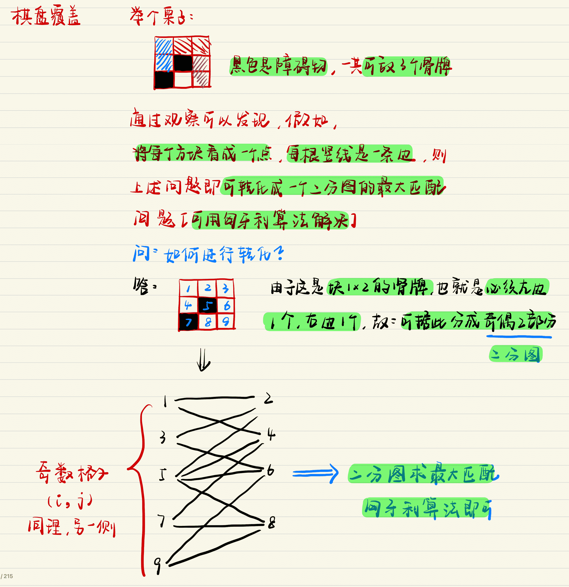

**代码**

```c++
#include <iostream>
#include <cstring>
#define x first
#define y second
using namespace std;
typedef pair<int, int> PII;
const int N = 110;
int n, m;
int dx[4] = {1, 0, -1, 0}, dy[4] = {0, 1, 0, -1};
int g[N][N], st[N][N];
PII match[N][N];
bool dfs(int x, int y) {
    for (int i = 0; i < 4; i ++ ) {
        int tx = x + dx[i];
        int ty = y + dy[i];
        // 越界或者当前格子有障碍物或者当前格子被访问过, 则直接进行下一次循环
        if (tx < 1 || tx > n || ty < 1 || ty > n || g[tx][ty] || st[tx][ty])
            continue;
        // 标记当前格子已经被访问过
        st[tx][ty] = true;
        PII t = match[tx][ty];
        // 如果当前格子没有被匹配或者当前妹子能找到别的帅哥, 则干就完了
        if (t.x == -1 || dfs(t.x, t.y)) {
            match[tx][ty] = {x, y};
            return true; // 匹配成功
        }
    }
    return false;
}
int main() {
    scanf("%d%d", &n, &m);
    for (int i = 0; i < m; i ++ ) {
        int x, y;
        scanf("%d%d", &x, &y);
        g[x][y] = true;
    }
    // 初始化为-1, 表示没有进行匹配
    memset(match, -1, sizeof match);
    int res = 0;
    // 枚举每一个点(i, j), 其横坐标和纵坐标加起来为奇数的格子
    for (int i = 1; i <= n; i ++ )
        for (int j = 1; j <= n; j ++ )
            if ((i + j) & 1 && !g[i][j]) {
                // 每次匹配记得初始化
                memset(st, 0, sizeof st);
                if (dfs(i, j)) res ++;
            }
    cout << res << endl;
    return 0;
}
```

**时间复杂度**

$O(n ^ 2)$

**空间复杂度**

$O(n^2)$

**标签**

`匈牙利算法`、`二分图求最大匹配`

**缝合怪**


#### [AcWing 376. 机器任务](https://www.acwing.com/problem/content/378/)

**题目描述**

>   有两台机器 `A，B` 以及 `K` 个任务。
>
>   机器 `A` 有 `N` 种不同的模式（模式 `0∼N−1`），机器 `B` 有 `M` 种不同的模式（模式 `0∼M−1`）。
>
>   **两台机器最开始都处于模式 0。**
>
>   每个任务既可以在 `A` 上执行，也可以在 `B` 上执行。
>
>   对于每个任务 `i`，给定两个整数 `a[i]` 和 `b[i]`，表示如果该任务在 `A` 上执行，需要设置模式为 `a[i]`，如果在 `B` 上执行，需要模式为 `b[i]`。
>
>   任务可以以任意顺序被执行，但每台机器转换一次模式就要重启一次。
>
>   求怎样分配任务并合理安排顺序，能使机器重启次数最少。

**输入格式**

>   输入包含多组测试数据。
>
>   每组数据第一行包含三个整数 `N,M,K`。
>
>   接下来 `K` 行，每行三个整数 `i,a[i]` 和 `b[i]`，`i` 为任务编号，从 `0` 开始。
>
>   当输入一行为 `0` 时，表示输入终止。

**输出格式**

>   每组数据输出一个整数，表示所需的机器最少重启次数，每个结果占一行。

**数据范围**

>   +   $N,M<100,K<1000$
>   +   $0≤a[i]<N$
>   +   $0≤b[i]<M$

**输入样例**

```c++
5 5 10
0 1 1
1 1 2
2 1 3
3 1 4
4 2 1
5 2 2
6 2 3
7 2 4
8 3 3
9 4 3
0
```

**输出样例**

```c++
3
```

**手写稿**


**代码**

```c++
#include <iostream>
#include <cstring>
using namespace std;
const int N = 110;
int n, m, k;
int st[N], match[N];
int g[N][N];
bool dfs(int u) {
    for (int i = 1; i < m; i ++ )
        // 如果当前点i没有被访问过并且从u到i有一条边
        if (!st[i] && g[u][i]) {
            st[i] = true;
            if (!match[i] || dfs(match[i])) {
                match[i] = u;
                return true;
            }
        }
    return false;
}
int main() {
    while (scanf("%d%d%d", &n, &m, &k), n) {
        memset(match, 0, sizeof match);
        memset(g, 0, sizeof g);
        for (int i = 0; i < k; i ++ ) {
            int c, a, b;
            scanf("%d%d%d", &c, &a, &b);
            // 如果处于模式0, 则直接返回, 不需要任何代价
            if (!a || !b) continue;
            // 标记边
            g[a][b] = true;
        }
        int res = 0;
        for (int i = 1; i < n; i ++ ) {
            // 每次都初始化数组
            memset(st, 0, sizeof st);
            // 如果当前点i可以匹配到对象, 则匹配数量 ++
            if (dfs(i)) res ++;
        }
        cout << res << endl;
    }
    return 0;
}
```

**时间复杂度**

$O(nVE)$

**空间复杂度**

$O(n^2)$

**标签**

`最小点覆盖`、`匈牙利算法`、`最大匹配数`

**缝合怪**


#### [AcWing 378. 骑士放置](https://www.acwing.com/problem/content/380/)

**题目描述**

>   给定一个 `N×M` 的棋盘，有一些格子禁止放棋子。
>
>   问棋盘上最多能放多少个不能互相攻击的骑士（国际象棋的“骑士”，类似于中国象棋的“马”，按照“日”字攻击，但没有中国象棋“别马腿”的规则）。

**输入格式**

>   第一行包含三个整数 `N,M,T`，其中 `T` 表示禁止放置的格子的数量。
>
>   接下来 `T` 行每行包含两个整数 `x` 和 `y`，表示位于第 `x` 行第 `y` 列的格子禁止放置，行列数从 `1` 开始。

**输出格式**

>   输出一个整数表示结果。

**数据范围**

>   +   $1≤N,M≤100$

**输入样例**

```c++
2 3 0
```

**输出样例**

```c++
4
```

**手写稿**

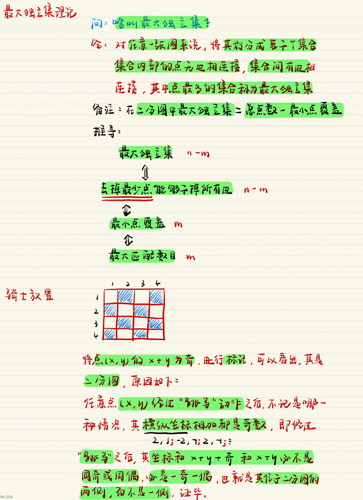

**代码**

```c++
#include <iostream>
#include <cstring>
#define x first
#define y second
using namespace std;
typedef pair<int, int> PII;
const int N = 110;
int n, m, k;
int dx[] = {-2, -1, 1, 2, 2, 1, -1, -2};
int dy[] = {1, 2, 2, 1, -1, -2, -2, -1};
PII match[N][N];
int g[N][N], st[N][N];
bool dfs(int x, int y) {
    // 遍历8个方向
    for (int i = 0; i < 8; i ++ ) {
        int tx = x + dx[i];
        int ty = y + dy[i];
        // 如果越界或者当前格子是坏格子或者当前格子已被访问过, 则continue;
        if (tx < 1 || tx > n || ty < 1 || ty > m || g[tx][ty] || st[tx][ty]) continue;
        // 标记当前格子已被访问过
        st[tx][ty] = true;
        PII t = match[tx][ty];
        // 如果点(tx, ty)没被访问过或者其被访问过但是其能够找到备胎
        if (t.x == 0 || dfs(t.x, t.y)) {
            // 标记
            match[tx][ty] = {x, y};
            return true;
        }
    }
    return false;
}
int main() {
    scanf("%d%d%d", &n, &m, &k);
    for (int i = 0; i < k; i ++ ) {
        int a, b;
        scanf("%d%d", &a, &b);
        // 标记坏格子
        g[a][b] = 1;
    }
    int res = 0;
    // 枚举所有坐标和x + y为偶数的格子
    for (int i = 1; i <= n; i ++ ) {
        for (int j = 1; j <= m; j ++ ) {
            // 如果坐标和为奇数或者当前格子是坏格子, 则continue;
            if ((i + j) & 1 || g[i][j]) continue;
            // 初始化st数组
            memset(st, 0, sizeof st);
            // 如果点(i, j)可以成功找到对象, 则匹配数 ++
            if (dfs(i, j)) res ++;
        }
    }
    // 总点数 - 坏点 - 最小点覆盖数
    cout << n * m - k - res << endl;
    return 0;
}
```

**时间复杂度**

$O(n^2VE)$

**空间复杂度**

$O(n^2)$

**标签**

`最大独立集`、`二分图`、`匈牙利算法`

**缝合怪**


#### [AcWing 379. 捉迷藏](https://www.acwing.com/problem/content/381/)

**题目描述**

>   `Vani` 和 `cl2` 在一片树林里捉迷藏。
>
>   这片树林里有 `N` 座房子，`M` 条有向道路，组成了一张有向无环图。
>
>   树林里的树非常茂密，足以遮挡视线，但是沿着道路望去，却是视野开阔。
>
>   如果从房子 `A` 沿着路走下去能够到达 `B`，那么在 `A` 和 `B` 里的人是能够相互望见的。
>
>   现在 `cl2` 要在这 `N` 座房子里选择 `K` 座作为藏身点，同时 `Vani` 也专挑 `cl2` 作为藏身点的房子进去寻找，为了避免被 `Vani` 看见，`cl2` 要求这 `K` 个藏身点的任意两个之间都没有路径相连。
>
>   为了让 `Vani` 更难找到自己，`cl2` 想知道最多能选出多少个藏身点。

**输入格式**

>   输入数据的第一行是两个整数 `N` 和 `M`。
>
>   接下来 `M` 行，每行两个整数 `x,y`，表示一条从 `x` 到 `y` 的有向道路。

**输出格式**

>   输出一个整数，表示最多能选取的藏身点个数。

**数据范围**

>   +   $N≤200,M≤30000$

**输入样例**

```c++
7 5
1 2
3 2
2 4
4 5
4 6
```

**输出样例**

```c++
3
```

**手写稿**


**代码**


**时间复杂度**


**空间复杂度**


**标签**


**缝合怪**


## 拓扑排序

### [U107394. 拓扑排序模板](https://www.luogu.com.cn/problem/U107394)

**题目描述**

>   有向无环图上有 `n` 个点，`m` 条边。求这张图字典序最小的拓扑排序的结果。字典序最小指希望排好序的结果中，比较靠前的数字尽可能小。

**输入格式**

>   第一行是用空格隔开的两个整数 `n` 和 `m`，表示 `n` 个点和 `m` 条边。
>
>   接下来是 `m` 行，每行用空格隔开的两个数 `u` 和 `v`，表示有一条从 `u` 到 `v` 的边。

**输出格式**

>   输出一行，拓扑排序的结果，数字之间用空格隔开

**输入样例**

```c++
5 3
1 2
2 4
4 3
```

**输出样例**

```c++
1 2 4 3 5
```

**说明/提示**

>   +   $1 \leq n,m \leq 10^5$
>
>   +   $注意：图上可能有重边$

**手写稿**


**代码**


**时间复杂度**


**空间复杂度**


**标签**


**缝合怪**


### [LeetCode 207. 课程表](https://leetcode-cn.com/problems/course-schedule/)

**题目描述**

>   你这个学期必须选修 `numCourses` 门课程，记为 `0` 到 `numCourses - 1` 。
>
>   在选修某些课程之前需要一些先修课程。 先修课程按数组 `prerequisites` 给出，其中 $prerequisites[i] = [a_i, b_i]$ ，表示如果要学习课程 $a_i$ 则 必须 先学习课程  $b_i$ 。
>
>   例如，先修课程对 `[0, 1]` 表示：想要学习课程 `0` ，你需要先完成课程 `1` 。
>   请你判断是否可能完成所有课程的学习？如果可以，返回 `true` ；否则，返回 `false` 。

**示例 1**

>   输入：`numCourses = 2, prerequisites = [[1,0]]`
>   输出：`true`
>   解释：总共有 `2` 门课程。学习课程 `1` 之前，你需要完成课程 `0` 。这是可能的。

**示例 2**

>   输入：`numCourses = 2, prerequisites = [[1,0],[0,1]]`
>   输出：`false`
>   解释：总共有 `2` 门课程。学习课程 `1` 之前，你需要先完成课程 `0` ；并且学习课程 `0` 之前，你还应先完成课程 `1` 。这是不可能的。

**提示**

>   +   $1 <= numCourses <= 10^5$
>   +   $0 <= prerequisites.length <= 5000$
>   +   $prerequisites[i].length == 2$
>   +   $0 <= a_i, b_i < numCourses$
>   +   $prerequisites[i] 中的所有课程对 互不相同$

**手写稿**

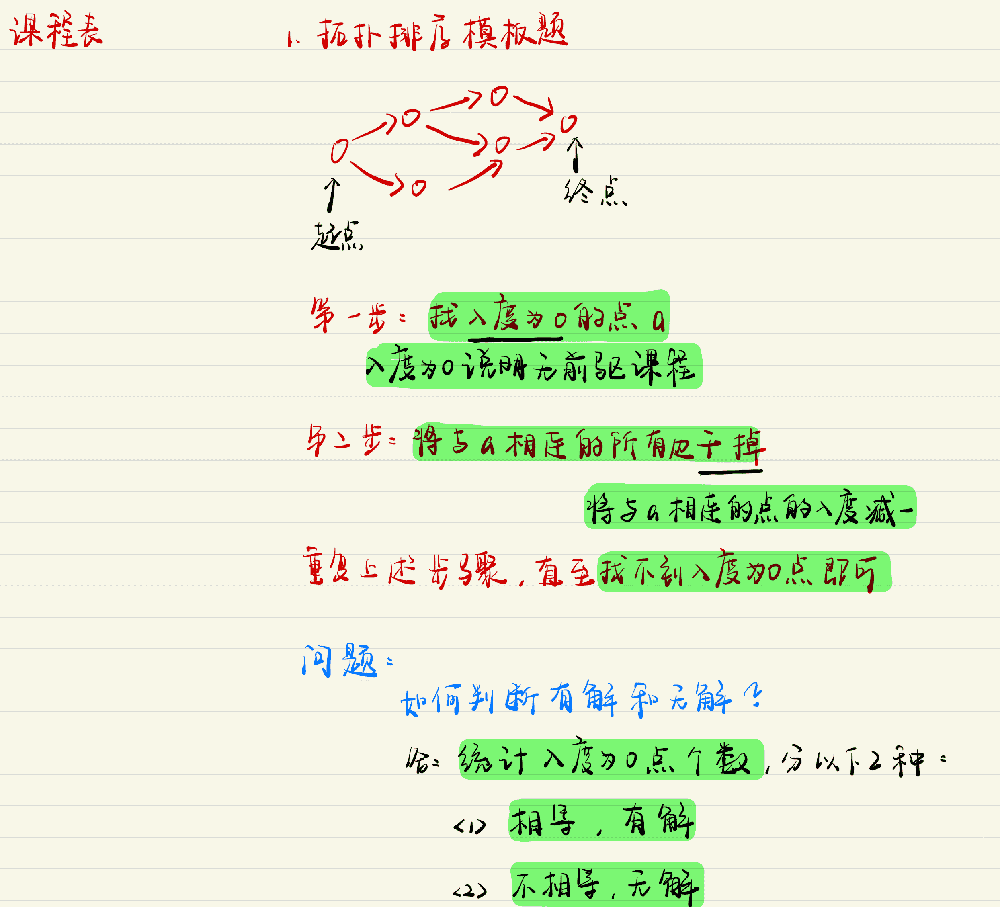

**代码**

```c++
class Solution {
public:
    bool canFinish(int n, vector<vector<int>>& gc) {
        queue<int> q;
        vector<int> d(n + 5);
        vector<vector<int>> g(n + 5);
        for (int i = 0; i < gc.size(); i ++ ) {
            int a = gc[i][0], b = gc[i][1];
            // 将b插入a中
            g[b].push_back(a);
            // a的入度++
            d[a] ++;
        }
        for (int i = 0; i < n; i ++ )
            // 统计所有入度为0的节点
            if (!d[i]) q.push(i);
        while (q.size()) {
            int t = q.front(); q.pop();
            for (int i = 0; i < g[t].size(); i ++ ) {
                // 入度为0, 继续下一次循环
                if (!d[g[t][i]]) continue;
                // 入度 --
                d[g[t][i]] --;
                // 如果度为0, 则加入队列
                if (!d[g[t][i]]) q.push(g[t][i]);
            }
        }
        // 统计所有度为0的节点
        int res = 0;
        for (int i = 0; i < n; i ++ ) res += (d[i] == 0);
        return res == n;
    }
};
```

**时间复杂度**


**空间复杂度**


**标签**


**缝合怪**


### [LeetCode 210. 课程表 II](https://leetcode-cn.com/problems/course-schedule-ii/)

**题目描述**

>   现在你总共有 `numCourses` 门课需要选，记为 `0` 到 `numCourses - 1`。给你一个数组 `prerequisites `，其中 $prerequisites[i] = [a_i, b_i]$ ，表示在选修课程 $a_i$ 前 必须 先选修 $b_i$ 。
>
>   例如，想要学习课程 `0` ，你需要先完成课程 `1` ，我们用一个匹配来表示：`[0,1]` 。
>   返回你为了学完所有课程所安排的学习顺序。可能会有多个正确的顺序，你只要返回 任意一种 就可以了。如果不可能完成所有课程，返回 一个空数组 。

**示例 1**

>   输入：`numCourses = 2, prerequisites = [[1,0]]`
>   输出：`[0,1]`
>   解释：总共有 `2` 门课程。要学习课程 `1`，你需要先完成课程 `0`。因此，正确的课程顺序为 `[0,1]` 。

**示例 2**

>   输入：`numCourses = 4, prerequisites = [[1,0],[2,0],[3,1],[3,2]]`
>   输出：`[0,2,1,3]`
>   解释：总共有 `4` 门课程。要学习课程 `3`，你应该先完成课程 `1` 和课程 `2`。并且课程 `1` 和课程 `2` 都应该排在课程 `0` 之后。
>   因此，一个正确的课程顺序是 `[0,1,2,3]` 。另一个正确的排序是 `[0,2,1,3]` 。

**示例 3**

>   输入：`numCourses = 1, prerequisites = []`
>   输出：`[0]`

**提示**

>   +   $1 <= numCourses <= 2000$
>   +   $0 <= prerequisites.length <= numCourses * (numCourses - 1)$
>   +   $prerequisites[i].length == 2$
>   +   $0 <= a_i, b_i < numCourses$
>   +   $a_i != b_i$
>   +   $所有[a_i, b_i] 互不相同$

**手写稿**

>   1.   详细手写稿, 请看上一题
>   2.   记录答案即可

**代码**

```c++
class Solution {
public:
    vector<int> findOrder(int n, vector<vector<int>>& g) {
        queue<int> q;
        vector<int> d(n + 5);
        vector<vector<int>> course(n + 5);
        for (int i = 0; i < g.size(); i ++ ) {
            int a = g[i][0], b = g[i][1];
            course[b].push_back(a);
            d[a] ++;
        }
        vector<int> res;
        for (int i = 0; i < n; i ++ )
            // 将所有入度为0的点全部加入答案
            if (!d[i]) {
                q.push(i);
                res.push_back(i);
            }
        while (q.size()) {
            int t = q.front(); q.pop();
            // 注意: 长度为course[t].size()而不是n
            for (int i = 0; i < course[t].size(); i ++ ) {
                if (!d[course[t][i]]) continue;
                d[course[t][i]] -- ;
                // 入度为0, 加入队列, 加入答案
                if (!d[course[t][i]]) {
                    q.push(course[t][i]);
                    res.push_back(course[t][i]);
                }
            }
        }
        // 答案个数不满n, 则清空答案数组
        if (res.size() != n) res = {};
        return res;
    }
};
```

**时间复杂度**

$O(n + m), n是点数, m是边数$

**空间复杂度**

$O(n + m), n是点数, m是边数$

**标签**

`拓扑排序`

**缝合怪**


# 树专题

## 字典树

### [LeetCode 212. 单词搜索 II](https://leetcode-cn.com/problems/word-search-ii/)

**题目描述**

> 给定一个 `m x n` 二维字符网格 `board` 和一个单词（字符串）列表 `words`，找出所有同时在二维网格和字典中出现的单词。
>
> 单词必须按照字母顺序，通过 相邻的单元格 内的字母构成，其中“相邻”单元格是那些水平相邻或垂直相邻的单元格。同一个单元格内的字母在一个单词中不允许被重复使用。

**示例 1**

> 输入：`board = [["o","a","a","n"],["e","t","a","e"],["i","h","k","r"],["i","f","l","v"]], words = ["oath","pea","eat","rain"]`
> 输出：`["eat","oath"]`

**示例 2**

> 输入：`board = [["a","b"],["c","d"]], words = ["abcb"]`
> 输出：`[]`

**提示**

> + $m == board.length$
> + $n == board[i].length$
> + $1 <= m, n <= 12$
> + $board[i][j] 是一个小写英文字母$
> + $1 <= words.length <= 3 * 10^4$
> + $1 <= words[i].length <= 10$
> + `words[i]` 由小写英文字母组成
> + `words` 中的所有字符串互不相同

**题解**

> 1. 使用字典树存储每个单词
> 2. 从每一个起点，深度优先搜索每个单词即可

**代码**

```c++
class Solution {
public:
    // 定义字典树结构体
    struct Node {
        int id;
        Node* son[26];
        Node() {
            id = -1;
            for (int i = 0; i < 26; i ++ ) son[i] = NULL;
        }
    }*root;
    int n, m;
    int dx[4] = {1, -1, 0, 0};
    int dy[4] = {0, 0, -1, 1};
    unordered_set<int> ids;
    void insert(string word, int id) {
        auto p = root;
        for (int i = 0; i < word.size(); i ++ ) {
            int u = word[i] - 'a';
            if (!p -> son[u]) p -> son[u] = new Node();
            p = p -> son[u];
        }
        p -> id = id;
        return;
    }
    void dfs(vector<vector<char>>& g, int x, int y, Node* p) {
        if (p -> id != -1) ids.insert(p -> id);
        char t = g[x][y];
        g[x][y] = '.';
        for (int i = 0; i < 4; i ++ ) {
            int tx = x + dx[i];
            int ty = y + dy[i];
            if (tx < 0 || tx >= n || ty < 0 || ty >= m || g[tx][ty] == '.') continue;
            int u = g[tx][ty] - 'a';
            if (p -> son[u]) dfs(g, tx, ty, p -> son[u]);
        }
        g[x][y] = t;
        return;
    }
    vector<string> findWords(vector<vector<char>>& g, vector<string>& words) {
        n = g.size(), m = g[0].size();
        root = new Node();
        for (int i = 0; i < words.size(); i ++ ) insert(words[i], i);
        vector<string> res;
        for (int i = 0; i < n; i ++ )
            for (int j = 0; j < m; j ++ ) {
                int u = g[i][j] - 'a';
                if (root -> son[u]) dfs(g, i, j, root -> son[u]);
            }
        for (auto& id : ids) res.push_back(words[id]);
        return res;
    }
};
```

**标签**

`dfs`、`字典树`

## 线段树

### 原理

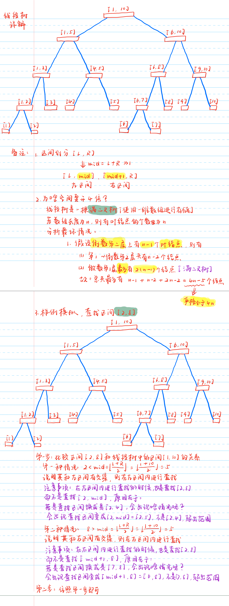

### [AcWing 1275. 最大数](https://www.acwing.com/problem/content/1277/)

**题目描述**

> 给定一个正整数数列 $a_1,a_2,…,a_n$，每一个数都在 $0∼p−1$ 之间。
>
> 可以对这列数进行两种操作：
>
> 1. 添加操作：向序列后添加一个数，序列长度变成 `n+1`；
> 2. 询问操作：询问这个序列中最后 `L` 个数中最大的数是多少。
>
> 程序运行的最开始，整数序列为空。
>
> 一共要对整数序列进行 `m` 次操作。
>
> 写一个程序，读入操作的序列，并输出询问操作的答案。

**输入格式**

> 第一行有两个正整数 `m,p`，意义如题目描述；
>
> 接下来 `m` 行，每一行表示一个操作。
>
> 如果该行的内容是 `Q L`，则表示这个操作是询问序列中最后 `L` 个数的最大数是多少；
>
> 如果是 `A t`，则表示向序列后面加一个数，加入的数是 `(t+a) mod p`。其中，`t` 是输入的参数，`a` 是在这个添加操作之前最后一个询问操作的答案（如果之前没有询问操作，则 `a=0`）。
>
> 第一个操作一定是添加操作。对于询问操作，`L>0` 且不超过当前序列的长度。

**输出格式**

> 对于每一个询问操作，输出一行。该行只有一个数，即序列中最后 `L` 个数的最大数。

**数据范围**

> + $1≤m≤2×10^5$,
> + $1≤p≤2×10^9$,
> + $0≤t<p$

**输入样例**

```c++
10 100
A 97
Q 1
Q 1
A 17
Q 2
A 63
Q 1
Q 1
Q 3
A 99
```

**输出样例**

```c++
97
97
97
60
60
97
```

**样例解释**

> 最后的序列是 `97,14,60,96`。

**备注**

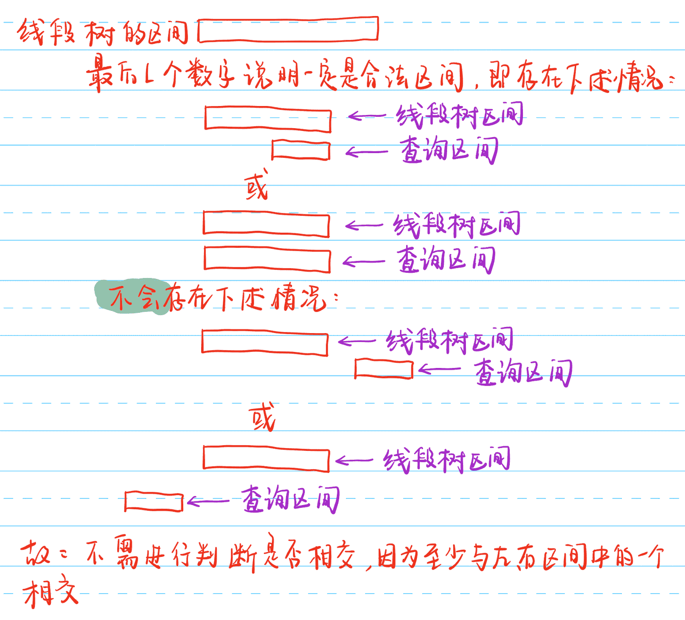

**代码**

```c++
#include <iostream>
using namespace std;
const int N = 200010;
int n, m, p;
struct Node {
    int l, r, Max; // Max是区间[l, r]的最大值
}tr[N * 4];
void build(int u, int l, int r) { // u当前节点的下标，[l, r]是区间左右端点
    tr[u] = {l, r};
    // 区间只有一个数字
    if (l == r) return;
    int mid = l + r >> 1;
    // 左子树
    build(u << 1, l, mid);
    // 右子树
    build(u << 1 | 1, mid + 1, r);
    return;
}
int query(int u, int l, int r) {
    // 如果线段树的区间完全包含在所查询区间的内部，则直接返回最大值即可
    if (tr[u].l >= l && tr[u].r <= r) return tr[u].Max;
    int mid = tr[u].l + tr[u].r >> 1;
    int Max = 0;
    /**
    	问题：为啥不判断两个区间不相交的情况？
    	回答：查看备注
    */
    // 如果左边区间有重合，则查询左边
    // 至于为啥不能写成query(u << 1, l, mid)，查看原理的样例模拟即可知晓
    if (l <= mid) Max = query(u << 1, l, r);
    // 如果右边区间有重合，则查询右边
    // 至于为啥不能写成query(u << 1, l, mid)，查看原理的样例模拟即可知晓
    if (r > mid) Max = max(Max, query(u << 1 | 1, l, r));
    return Max;
}
// 由子节点更新父节点
void pushup(int u) {
    tr[u].Max = max(tr[u << 1].Max, tr[u << 1 | 1].Max);
    return;
}
void modify(int u, int x, int c) {
    // 如果到达叶子结点即区间左右端点都是x，则修改值即可
    // 由于只有一个值，因此，区间最大值即为当前值本身
    if (tr[u].l == x && tr[u].r == x) tr[u].Max = c;
    else {
        int mid = tr[u].l + tr[u].r >> 1;
        // 和左边有交集
        if (x <= mid) modify(u << 1, x, c);
        // 和右边有交集
        if (x > mid) modify(u << 1 | 1, x, c);
        // 由子节点更新父节点
        pushup(u);
    }
    return;
}
int main() {
    scanf("%d%d", &m, &p);
    // 最多有m个操作，因此，区间右端点为m
    build(1, 1, m);
    int x, last = 0;
    char op[2];
    while (m -- ) {
        scanf("%s%d", op, &x);
        if (op[0] == 'Q') {
            // 查询最后x个数字的最大值，其区间为[n - x + 1, n]
            last = query(1, n - x + 1, n);
            cout << last << endl;
        }
        else {
            // 修改第n + 1个值
            modify(1, n + 1, (x + 0LL + last) % p);
            n ++;
        }
    }
    return 0;
}
```

**标签**

`线段树`

### [AcWing 245. 你能回答这些问题吗](https://www.acwing.com/problem/content/246/)

**题目描述**

> 给定长度为 `N` 的数列 `A`，以及 `M` 条指令，每条指令可能是以下两种之一：
>
> 1. `1 x y`，查询区间 `[x,y]` 中的最大连续子段和，即 $max_{x≤l≤r≤y}\{∑\limits_{i=l}^rA[i]\}$。
> 2. `2 x y`，把 `A[x]` 改成 `y`。
>
> 对于每个查询指令，输出一个整数表示答案。

**输入格式**

> 第一行两个整数 `N,M`。
>
> 第二行 `N` 个整数 `A[i]`。
>
> 接下来 `M` 行每行 `3` 个整数 `k,x,y`，`k=1` 表示查询（此时如果 `x>y`，请交换 `x,y`），`k=2` 表示修改。

**输出格式**

> 对于每个查询指令输出一个整数表示答案。
>
> 每个答案占一行。

**数据范围**

> + $N≤500000,M≤100000$,
> + $−1000≤A[i]≤1000$

**输入样例**

```c++
5 3
1 2 -3 4 5
1 2 3
2 2 -1
1 3 2
```

**输出样例**

```c++
2
-1
```

**手写稿**

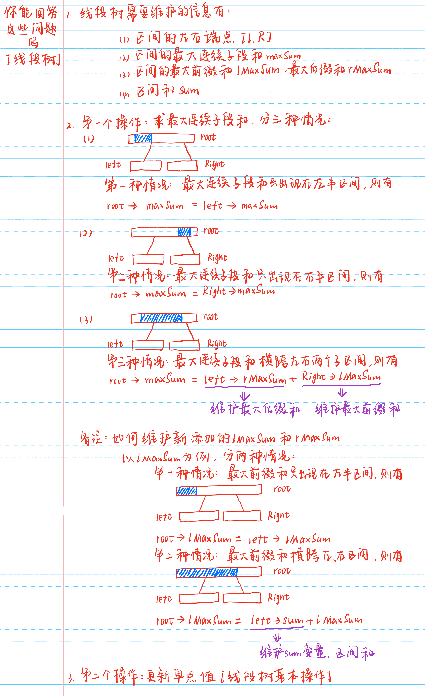

**代码**

```c++
#include <iostream>
using namespace std;
const int N = 500010;
struct Node {
    int l, r; // 区间左右端点
    int maxSum; // 最大连续子区间和
    int lMaxSum, rMaxSum; // 最大前缀和和最大后缀和
    int sum; // 区间和
}tr[N * 4];
int n, m;
int g[N];
void pushup(Node& u, Node& l, Node& r) {
    u.maxSum = max(max(l.maxSum, r.maxSum), l.rMaxSum + r.lMaxSum);
    u.lMaxSum = max(l.lMaxSum, l.sum + r.lMaxSum);
    u.rMaxSum = max(r.rMaxSum, r.sum + l.rMaxSum);
    u.sum = l.sum + r.sum;
    return;
}
// 由父节点更新子节点
void pushup(int u) {
    pushup(tr[u], tr[u << 1], tr[u << 1 | 1]);
    return;
}
void build(int u, int l, int r) {
    // 到达叶子节点[l, r]是下标，记录所有属性值
    if (l == r) tr[u] = {l, r, g[l], g[l], g[l], g[l]};
    else {
        // 如果没有到达叶子结点，则只记录区间端点即可，别的值暂时无法得出
        tr[u] = {l, r};
        int mid = l + r >> 1;
        build(u << 1, l, mid);
        build(u << 1 | 1, mid + 1, r);
        // 更新【父节点】中除了区间端点之外的其余属性值即可
        pushup(u);
    }
    return;
}
// 由于树状数组的节点是结构体，因此，返回值是节点【结构体】
Node query(int u, int l, int r) {
    if (tr[u].l >= l && tr[u].r <= r) return tr[u];
    else {
        int mid = tr[u].l + tr[u].r >> 1;
        // 区间查询区间可能不存在
        // 如果查询的区间在线段树区间的左边
        if (r <= mid) return query(u << 1, l, r);
        // 如果查询的区间在线段树区间的右边
        else if (l > mid) return query(u << 1 | 1, l, r);
        else {
            // 如果查询的区间和左右端点有交集
            auto left = query(u << 1, l, r);
            auto right = query(u << 1 | 1, l, r);
            // 使用结构体节点
            Node res;
            pushup(res, left, right);
            return res;
        }
    }
}
void modify(int u, int x, int c) {
    // 找到叶子节点
    if (tr[u].l == x && tr[u].r == x) tr[u] = {x, x, c, c, c, c};
    else {
        // 根据题目描述修改的区间一定是合法区间，一定会有相交
        int mid = tr[u].l + tr[u].r >> 1;
        // 如果和左区间有交集
        if (x <= mid) modify(u << 1, x, c);
        // 如果和右区间有交集
        else modify(u << 1 | 1, x, c);
        // 修改完记得更新父节点
        pushup(u);
    }
    return;
}
int main() {
    scanf("%d%d", &n, &m);
    for (int i = 1; i <= n; i ++ ) scanf("%d", &g[i]);
    build(1, 1, n);
    int k, x, y;
    while (m -- ) {
        scanf("%d%d%d", &k, &x, &y);
        if (k == 1) {
            // 如果左端点大于右端点，则交换端点即可
            if (x > y) swap(x, y);
            cout << query(1, x, y).maxSum << endl;
        }
        else modify(1, x, y);
    }
    return 0;
}
```

**标签**

`线段树`

### [AcWing 246. 区间最大公约数](https://www.acwing.com/problem/content/247/)

**题目描述**

> 给定一个长度为 `N` 的数列 `A`，以及 `M` 条指令，每条指令可能是以下两种之一：
>
> 1. `C l r d`，表示把 `A[l],A[l+1],…,A[r]` 都加上 `d`。
> 2. `Q l r`，表示询问 `A[l],A[l+1],…,A[r]` 的最大公约数(`GCD`)。
>
> 对于每个询问，输出一个整数表示答案。

**输入格式**

> 第一行两个整数 `N,M`。
>
> 第二行 `N` 个整数 `A[i]`。
>
> 接下来 `M` 行表示 `M` 条指令，每条指令的格式如题目描述所示。

**输出格式**

> 对于每个询问，输出一个整数表示答案。
>
> 每个答案占一行。

**数据范围**

> + $N≤500000,M≤100000$,
> + $1≤A[i]≤10^{18}$,
> + $|d|≤10^{18}$

**输入样例**

```c++
5 5
1 3 5 7 9
Q 1 5
C 1 5 1
Q 1 5
C 3 3 6
Q 2 4
```

**输出样例**

```c++
1
2
4
```

**手写稿**

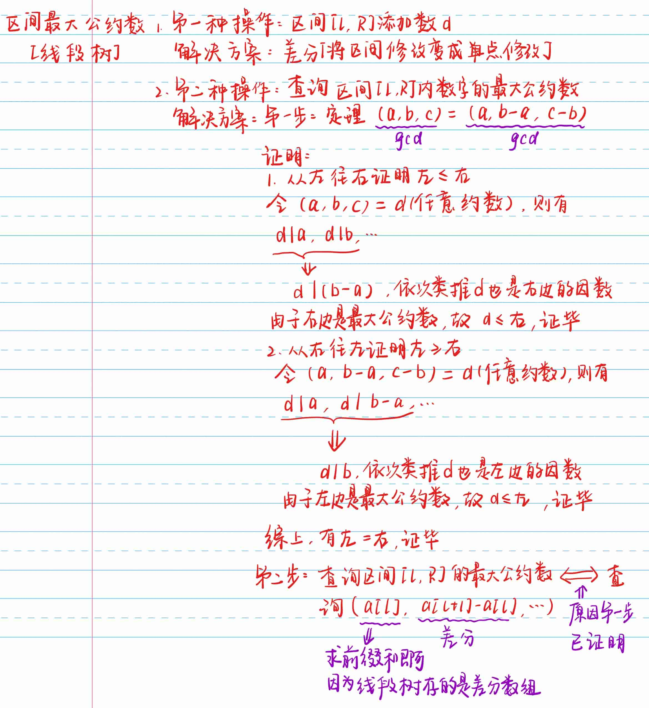

**代码**

```c++
#include <iostream>
using namespace std;
typedef long long LL;
const int N = 500010;
struct Node {
    int l, r; // 区间左右端点
    LL sum, d; // 区间和和区间的最大公约数
}tr[N * 4];
int n, m;
LL g[N];
// 注意类型LL
LL gcd(LL a, LL b) {
    if (!b) return a;
    return gcd(b, a % b);
}
void pushup(Node& u, Node& l, Node& r) {
    u.sum = l.sum + r.sum;
    u.d = gcd(l.d, r.d);
    return;
}
void pushup(int u) {
    pushup(tr[u], tr[u << 1], tr[u << 1 | 1]);
    return;
}
void build(int u, int l, int r) {
    if (l == r) {
        // 注意类型LL
        LL a = g[r] - g[r - 1];
        tr[u] = {l, r, a, a};
    }
    else {
        tr[u] = {l, r};
        int mid = l + r >> 1;
        build(u << 1, l, mid);
        build(u << 1 | 1, mid + 1, r);
        // 注意更新下父节点u
        pushup(u);
    }
    return;
}
Node query(int u, int l, int r) {
    // 如果线段树中的区间包含在所查询区间的内部，则直接返回
    if (tr[u].l >= l && tr[u].r <= r) return tr[u];
    else {
        int mid = tr[u].l + tr[u].r >> 1;
        // 如果查询区间出现在线段树区间的左边
        if (r <= mid) return query(u << 1, l, r);
        // 如果查询区间出现在线段树区间的右边
        else if (l > mid) return query(u << 1 | 1, l, r);
        else {
            // 如果查询区间处于线段树区间的两边
            auto left = query(u << 1, l, r);
            auto right = query(u << 1 | 1, l, r);
            Node res;
            pushup(res, left, right);
            return res;
        }
    }
}
void modify(int u, int x, LL c) {
    if (tr[u].l == x && tr[u].r == x) {
        // 注意类型LL
        LL a = tr[u].sum + c;
        tr[u] = {x, x, a, a};
    }
    else {
        int mid = tr[u].l + tr[u].r >> 1;
        // 如果数x位于左区间
        if (x <= mid) modify(u << 1, x, c);
        // 如果数x位于右区间
        else modify(u << 1 | 1, x, c);
        // 更新父节点u
        pushup(u);
    }
    return;
}
int main() {
    scanf("%d%d", &n, &m);
    for (int i = 1; i <= n; i ++ ) scanf("%lld", &g[i]);
    build(1, 1, n);
    char op[2];
    int l, r;
    LL d;
    while (m -- ) {
        scanf("%s", op);
        if (op[0] == 'Q') {
            scanf("%d%d", &l, &r);
            // 注意最大公约数可能是负数，记得取绝对值
            cout << abs(gcd(query(1, 1, l).sum, query(1, l + 1, r).d)) << endl; 
        }
        else {
            scanf("%d%d%lld", &l, &r, &d);
            modify(1, l, d);
            // 记得判断是否越界
            if (r + 1 <= n) modify(1, r + 1, -d);
        }
    }
    return 0;
}
```

**标签**

`差分`、`树状数组`

### [AcWing 243. 一个简单的整数问题2](https://www.acwing.com/problem/content/244/)

**题目描述**

> 给定一个长度为 `N` 的数列 `A`，以及 `M` 条指令，每条指令可能是以下两种之一：
>
> 1. `C l r d`，表示把 `A[l],A[l+1],…,A[r]` 都加上 `d`。
> 2. `Q l r`，表示询问数列中第 `l∼r` 个数的和。
>
> 对于每个询问，输出一个整数表示答案。

**输入格式**

> 第一行两个整数 `N,M`。
>
> 第二行 `N` 个整数 `A[i]`。
>
> 接下来 `M` 行表示 `M` 条指令，每条指令的格式如题目描述所示。

**输出格式**

> 对于每个询问，输出一个整数表示答案。
>
> 每个答案占一行。

**数据范围**

> + $1≤N,M≤10^5$,
> + $|d|≤10000$,
> + $|A[i]|≤10^9$

**输入样例**

```c++
10 5
1 2 3 4 5 6 7 8 9 10
Q 4 4
Q 1 10
Q 2 4
C 3 6 3
Q 2 4
```

**输出样例**

```c++
4
55
9
15
```

**步骤**

> 1. `pushdown` 操作（懒标记）
>     + 用途
>         + 将当前区间中的每一个数字都添加上 `d`
>     + 步骤
>         + 第一步：查看当前根节点 `u` 所在区间是否属于查询的区间
>         + 第二步：更新相对应的信息
>         + 第三步：将懒标记 `add` 设置为 `0`，表示已经下放完毕
> 2. 注意 `pushdown` 和 `pushup` 的位置

**代码**

```c++
#include <iostream>
using namespace std;
typedef long long LL;
const int N = 100010;
struct Node {
    int l, r;
    LL sum; // 区间和
    int add; // 懒标记
}tr[N * 4];
int n, m;
int g[N];
void pushup(int u) {
    // 懒标记【不包含】当前节点
    tr[u].sum = tr[u << 1].sum + tr[u << 1 | 1].sum;
    return;
}
void pushdown(int u) {
    auto &root = tr[u], &left = tr[u << 1], &right = tr[u << 1 | 1];
    // 如果有懒标记，则将懒标记进行下放
    if (root.add) {
        // 左孩子的懒标记进行累加，同时，区间和也需要累加
        left.add += root.add, left.sum += (LL)(left.r - left.l + 1) * root.add;
        // 右孩子的懒标记进行累加，同时，区间和也需要累加
        right.add += root.add, right.sum += (LL)(right.r - right.l + 1) * root.add;
        // 懒标记置为0
        root.add = 0;
    }
    return;
}
void build(int u, int l, int r) {
    // 如果到达叶子结点，则更新相对应的信息
    if (l == r) tr[u] = {l, r, g[l], 0};
    else {
        // 更新区间的左右端点信息
        tr[u] = {l, r};
        int mid = tr[u].l + tr[u].r >> 1;
        // 如果和左区间有交集，建立树状数组
        build(u << 1, l, mid);
        // 如果和右区间有交集，建立树状数组
        build(u << 1 |1, mid + 1, r);
        // 由子节点更新父节点
        pushup(u);
    }
    return;
}
void modify(int u, int l, int r, int d) {
    // 如果树状数组区间的左右端点包含在要查询的区间内部，则直接更新相对应的信息
    if (tr[u].l >= l && tr[u].r <= r) {
        tr[u].sum += (LL)(tr[u].r - tr[u].l + 1) * d;
        tr[u].add += d;
    }
    else { // 必须要进行分裂
        // 分裂之前必须要进行pushdown操作，即下放懒标记操作
        pushdown(u);
        int mid = tr[u].l + tr[u].r >> 1;
        // 如果和左区间有交集
        if (l <= mid) modify(u << 1, l, r, d);
        // 如果和右区间有交集
        if (r > mid) modify(u << 1 | 1, l, r, d);
        // 由子节点信息更新父节点信息
        pushup(u);
    }
    return;
}
LL query(int u, int l, int r) {
    // 如果树状数组区间的左右端点包含在要查询的区间内部，则直接更新相对应的信息
    if (tr[u].l >= l && tr[u].r <= r) return tr[u].sum;
    // 要进行分裂
    pushdown(u);
    int mid = tr[u].l + tr[u].r >> 1;
    LL sum = 0;
    // 如果和左边区间有交集
    if (l <= mid) sum += query(u << 1, l, r);
    // 如果和右边区间有交集
    if (r > mid) sum += query(u << 1 | 1, l, r);
    return sum;
}
int main() {
    scanf("%d%d", &n, &m);
    for (int i = 1; i <= n; i ++ ) scanf("%d", &g[i]);
    build(1, 1, n);
    while (m -- ) {
        char op[2];
        int l, r, d;
        scanf("%s", op);
        if (op[0] == 'C') {
            scanf("%d%d%d", &l, &r, &d);
            modify(1, l, r, d);
        }
        else {
            scanf("%d%d", &l, &r);
            cout << query(1, l, r) << endl;
        }
    }
    return 0;
}
```

**标签**

`树状数组`、`懒标记`

### [AcWing 247. 亚特兰蒂斯](https://www.acwing.com/problem/content/249/)

**题目描述**

> 有几个古希腊书籍中包含了对传说中的亚特兰蒂斯岛的描述。
>
> 其中一些甚至包括岛屿部分地图。
>
> 但不幸的是，这些地图描述了亚特兰蒂斯的不同区域。
>
> 您的朋友 `Bill` 必须知道地图的总面积。
>
> 你自告奋勇写了一个计算这个总面积的程序。

**输入格式**

> 输入包含多组测试用例。
>
> 对于每组测试用例，第一行包含整数 `n`，表示总的地图数量。
>
> 接下来 `n` 行，描绘了每张地图，每行包含四个数字 $x_1,y_1,x_2,y_2$（不一定是整数），$(x_1,y_1)$ 和 $(x_2,y_2)$ 分别是地图的左上角位置和右下角位置。
>
> 注意，坐标轴 `x` 轴从上向下延伸，`y` 轴从左向右延伸。
>
> 当输入用例 `n=0` 时，表示输入终止，该用例无需处理。

**输出格式**

> 每组测试用例输出两行。
>
> 第一行输出 `Test case #k`，其中 `k` 是测试用例的编号，从 `1` 开始。
>
> 第二行输出 `Total explored area: a`，其中 `a` 是总地图面积（即此测试用例中所有矩形的面积并，注意如果一片区域被多个地图包含，则在计算总面积时只计算一次），精确到小数点后两位数。
>
> 在每个测试用例后输出一个空行。

**数据范围**

> + $1≤n≤10000$,
> + $0≤x1<x2≤100000$,
> + $0≤y1<y2≤100000$
> + 注意，本题 $n$ 的范围上限加强至 $10000$。

**输入样例**

```c++
2
10 10 20 20
15 15 25 25.5
0
```

**输出样例**

```c++
Test ccase #1
Total explored area: 180.00 
```

**样例解释**

> 样例所示地图覆盖区域如下图所示，两个矩形区域所覆盖的总面积，即为样例的解。


**手写稿**

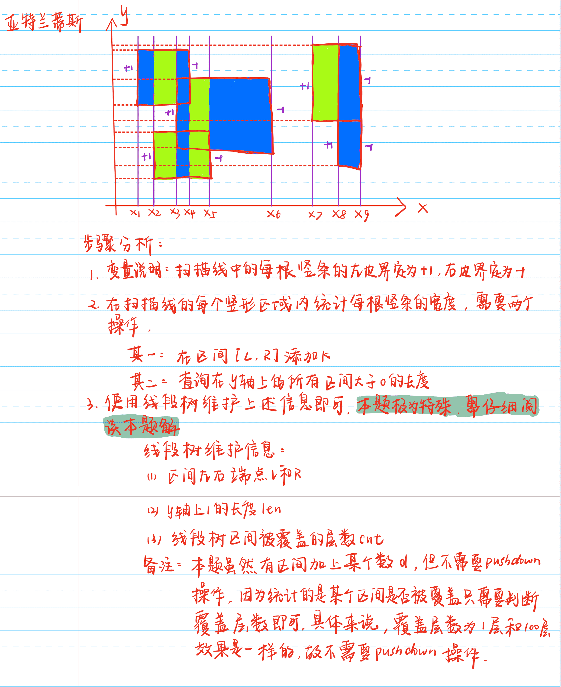

**疑点详解**

> 1. 线段树中存储的节点是线段不是点，注意两者之间的对应关系
>
>     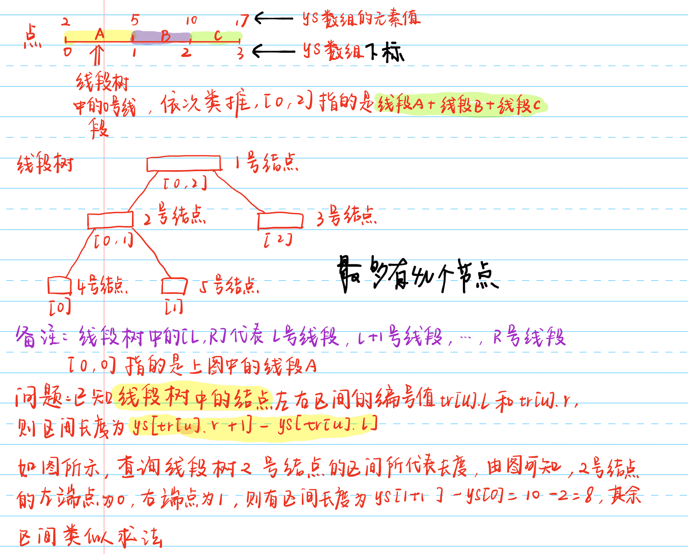
>
> 1. 离散化的原因
>
>     + 注意树状数组中的值就是下标，并且`y` 轴上的端点不一定是整数，有可能是小数，因此，为了防止出现小数的情况，故使用离散化处理
>
>     + 举例说明 `g = [1, 1.5, 2, 5]`
>         + 如果不使用离散化，则不能计算 `g[1 ~ 1.5]` 的和
>         + 如果使用离散化，则 `1，1.5，2，2.5` 所对应的下标为 `0，1，2，3` 都是整数，则可以计算
>
> 1. 树状数组中的节点的属性值 cnt 分类讨论的原因
>
>     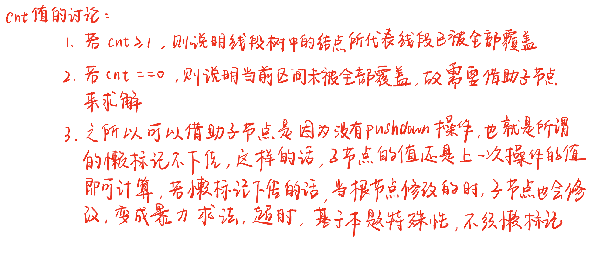

**代码**

```c++
#include <iostream>
#include <vector>
#include <algorithm>
using namespace std;
const int N = 10010;
struct Segment {
    double x, y1, y2;
    // 表明当前线段是左边界还是右边界，左边界的权值为1，右边界的权值为-1
    int k;
    bool operator < (Segment &T) { // 按照横坐标x进行排序
        return x < T.x;
    }
}segs[N * 2]; // 1个矩形对应2个横坐标，因此，N个矩形对应2 * N个横坐标
struct Node {
    int l, r;
    int cnt; // 当前区间被覆盖的层数
    double len; // 当前y轴上大于1的区间长度，注意变量的类型
}tr[N * 8]; // 左边界横坐标对应4N空间，右边界横坐标对应4N空间，共8N空间
int n;
vector<double> ys; // 存储y轴上所有的无重复的点，用来做离散化，注意变量类型
// 查找大于等于y的数据的下标所在位置
int find(double y) {
    return lower_bound(ys.begin(), ys.end(), y) - ys.begin();
}
void pushup(int u) {
    // 如果当前线段树区间被覆盖，则当前区间的长度即为线段树的长度len
    if (tr[u].cnt) tr[u].len = ys[tr[u].r + 1] - ys[tr[u].l];
    else if (tr[u].l != tr[u].r) // 如果不是叶节点
        tr[u].len = tr[u << 1].len + tr[u << 1 | 1].len;
    else tr[u].len = 0; // 如果是叶节点记得初始化长度为0
    return;
}
void build(int u, int l, int r) {
    // 初始化树状数组，不用管tr的区间问题，即使l != r也要进行初始化
    tr[u] = {l, r, 0, 0};
    if (l != r) {
        int mid = l + r >> 1;
        build(u << 1, l, mid);
        build(u << 1 | 1, mid + 1, r);
    }
    return;
}
void modify(int u, int l, int r, int k) {
    if (tr[u].l >= l && tr[u].r <= r) {
        tr[u].cnt += k;
        // 计算长度，因为k不一定为正数，如果cnt == 0，则需要通过当前根节点的子节点进行计算
        pushup(u);
    }
    else {
        int mid = tr[u].l + tr[u].r >> 1;
        if (l <= mid) modify(u << 1, l, r, k);
        if (r > mid) modify(u << 1 | 1, l, r, k);
        // 计算长度，因为k不一定为正数，如果cnt == 0，则需要通过当前根节点的子节点进行计算
        pushup(u);
    }
    return;
}
int main() {
    int T = 0;
    while (scanf("%d", &n), n) {
        ys.clear(); // 多组输入，注意每次清空ys里面的数据
        for (int i = 0, j = 0; i < n; i ++ ) {
            double x1, y1, x2, y2;
            scanf("%lf%lf%lf%lf", &x1, &y1, &x2, &y2);
            segs[j ++ ] = {x1, y1, y2, 1};
            segs[j ++ ] = {x2, y1, y2, -1};
            ys.push_back(y1);
            ys.push_back(y2);
        }
        // 对于y轴上的点进行排序，方便去重处理
        sort(ys.begin(), ys.end());
        // 去重的前提是有序序列，因此，事先要排序，原因在于此
        ys.erase(unique(ys.begin(), ys.end()), ys.end());
        // 建立线段树，区间的个数等于点的个数减一，点的范围[0, n - 1],换算区间的话，再减一，区间的范围为[0, n - 2]
        build(1, 0, ys.size() - 2);
        // 对于segs进行排序
        sort(segs, segs + n * 2);
        // 计算总面积
        double res = 0;
        for (int i = 0; i < n * 2; i ++ ) {
            if (i > 0) res += tr[1].len * (segs[i].x - segs[i - 1].x);
            modify(1, find(segs[i].y1), find(segs[i].y2) - 1, segs[i].k);
        }
        printf("Test case #%d\nTotal explored area: %.2lf\n\n", ++T, res);
    }
    return 0;
}
```

**标签**

`树状数组`、`扫描线`

### [AcWing 1277. 维护序列](https://www.acwing.com/problem/content/1279/)

**题目描述**

> 老师交给小可可一个维护数列的任务，现在小可可希望你来帮他完成。
>
> 有长为 `N` 的数列，不妨设为 $a_1,a_2,…,a_N$。
>
> 有如下三种操作形式：
>
> 1. 把数列中的一段数全部乘一个值；
> 2. 把数列中的一段数全部加一个值；
> 3. 询问数列中的一段数的和，由于答案可能很大，你只需输出这个数模 `P` 的值。

**输入格式**

> 第一行两个整数 `N` 和 `P`；
>
> 第二行含有 `N` 个非负整数，从左到右依次为 $a_1,a_2,…,a_N$；
>
> 第三行有一个整数 `M`，表示操作总数；
>
> 从第四行开始每行描述一个操作，输入的操作有以下三种形式：
>
> - 操作 `1`：`1 t g c`，表示把所有满足 $t≤i≤g$ 的 $a_i$ 改为 $a_i×c$；
> - 操作 `2`：`2 t g c`，表示把所有满足 $t≤i≤g$ 的 $a_i$ 改为 $a_i+c$；
> - 操作 `3`：`3 t g`，询问所有满足 $t≤i≤g$ 的 $a_i$ 的和模 `P` 的值。
>
> 同一行相邻两数之间用一个空格隔开，每行开头和末尾没有多余空格。

**输出格式**

对每个操作 `3`，按照它在输入中出现的顺序，依次输出一行一个整数表示询问结果。

**数据范围**

> + $1≤N,M≤10^5$,
> + $1≤t≤g≤N$,
> + $0≤c,a_i≤10^9$,
> + $1≤P≤10^9$

**输入样例**

```c++
7 43
1 2 3 4 5 6 7
5
1 2 5 5
3 2 4
2 3 7 9
3 1 3
3 4 7
```

**输出样例**

```c++
2
35
8
```

**样例解释**

> 初始时数列为 `{1,2,3,4,5,6,7}`；
>
> 经过第 `1` 次操作后，数列为 `{1,10,15,20,25,6,7}`；
>
> 对第 `2` 次操作，和为 `10+15+20=45`，模 `43` 的结果是 `2`；
>
> 经过第 `3` 次操作后，数列为 `{1,10,24,29,34,15,16}`；
>
> 对第 `4` 次操作，和为 `1+10+24=35`，模 `43` 的结果是 `35`；
>
> 对第 `5` 次操作，和为 `29+34+15+16=94`，模 `43` 的结果是 `8`。

**解题步骤**

> 1. 线段树中维护五个信息
>
>     + 区间左右端点 `[l, r]`
>     + 区间和 `sum`
>     + 懒标记 `add` 和 `mul`，表示区间内的每个数字添加 `add` 和 乘以 `mul`
>
> 2. 当线段树中的节点同时含有懒标记 `add` 和 `mul` 的时候，如何确定顺序，以方便好维护信息？
>
>     + 分两种情况：先 `add` 在 `mul` 和先 `mul` 再 `add`
>
>         + 第一种情况：先 `add` 再 `mul`
>
>             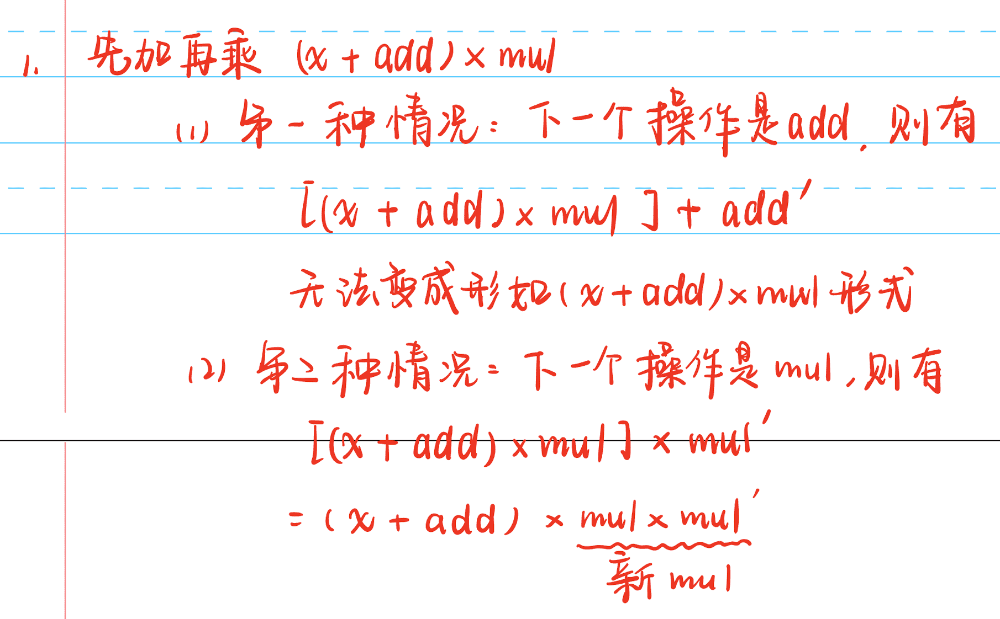
>
>         + 第二种情况：先 `mul` 再 `add`
>
>             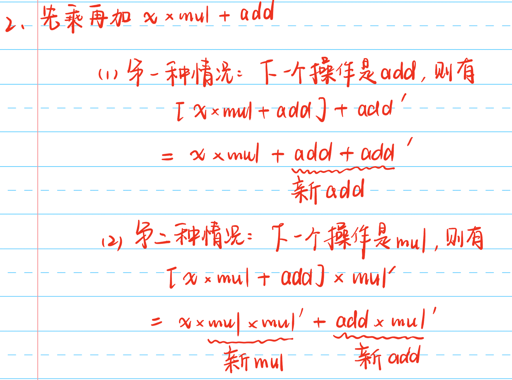
>
>         + 综上所述，顺序应该为先 `mul` 再 `add` 即可
>
>     + 确定完顺序之后，按照顺序先 `mul` 再 `add` 的操作，进行分析，查看值的变化
>
>         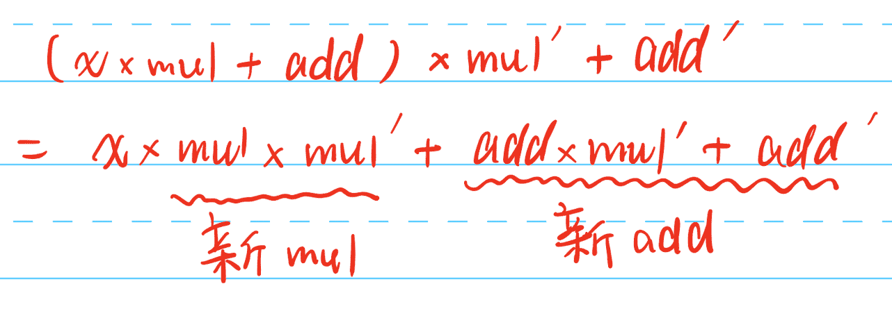
>
>         + 备注
>             + `x ✖️ mul + add` 是原来的数，也就是区间和 `sum`
>             + 按照顺序先 `mul` 再 `add`，以方便区分变量，故使用 `mul'` 和 `add'` 来表示即可
>
> 3. 使用先 `mul` 再 `add` 的顺序简化区间加和区间乘操作
>
>     + 区间加
>         + 令 `mul = 1，add = d` 即可
>     + 区间乘
>         + 令 `mul = d，add = 0` 即可

**代码**

```c++
#include <iostream>
using namespace std;
typedef long long LL;
const int N = 100010;
struct Node {
    int l, r; // 左右区间
    LL sum; // 区间和
    int mul, add; // 区间乘懒标记mul和区间加懒标记add
}tr[N * 4];
int n, m, p;
int g[N];
void eval(Node& root, int mul, int add) {
    // 原理查看解析
    root.sum = (root.sum * mul + (LL)(root.r - root.l + 1) * add) % p;
    root.mul = (LL)root.mul * mul % p;
    root.add = ((LL)root.add * mul + add) % p;
    return;
}
void pushup(int u) {
    // 记得取模
    tr[u].sum = (tr[u << 1].sum + tr[u << 1 | 1].sum) % p;
    return;
}
void pushdown(int u) {
    eval(tr[u << 1], tr[u].mul, tr[u].add);
    eval(tr[u << 1 | 1], tr[u].mul, tr[u].add);
    // 记得将懒标记清空
    tr[u].mul = 1, tr[u].add = 0;
    return;
}
void build(int u, int l, int r) {
    if (l == r) tr[u] = {l, r, g[l], 1, 0};
    else {
        // sum先随便设置一个值
        tr[u] = {l, r, 0, 1, 0};
        int mid = tr[u].l + tr[u].r >> 1;
        build(u << 1, l, mid);
        build(u << 1 | 1, mid + 1, r);
        pushup(u);
    }
    return;
}
void modify(int u, int l, int r, int mul, int add) {
    if (tr[u].l >= l && tr[u].r <= r) eval(tr[u], mul, add);
    else { // 区间要进行分裂
        // 懒标记下传
        pushdown(u);
        int mid = tr[u].l + tr[u].r >> 1;
        // 左边有交集
        if (l <= mid) modify(u << 1, l, r, mul, add);
        // 右边有交集
        if (r > mid) modify(u << 1 | 1, l, r, mul, add);
        // 由子节点更新父节点
        pushup(u);
    }
    return;
}
int query(int u, int l, int r) {
    if (tr[u].l >= l && tr[u].r <= r) return tr[u].sum;
    // 查询的时候需要将懒标记下传
    pushdown(u);
    int sum = 0;
    int mid = tr[u].l + tr[u].r >> 1;
    // 左边有交集
    if (l <= mid) sum += query(u << 1, l, r);
    // 右边有交集，记得取模
    if (r > mid) sum = (sum + query(u << 1 | 1, l, r)) % p;
    return sum;
}
int main() {
    scanf("%d%d", &n, &p);
    for (int i = 1; i <= n; i ++ ) scanf("%d", &g[i]);
    // 建立线段树
    build(1, 1, n);
    scanf("%d", &m);
    while (m -- ) {
        int num, l, r, k;
        scanf("%d", &num);
        // 区间乘
        if (num == 1) {
            scanf("%d%d%d", &l, &r, &k);
            modify(1, l, r, k, 0);
        }
        // 区间加
        else if (num == 2) {
            scanf("%d%d%d", &l, &r, &k);
            modify(1, l, r, 1, k);
        }
        // 区间查询
        else {
            scanf("%d%d", &l, &r);
            cout << query(1, l, r) << endl;
        }
    }
    return 0;
}
```

**标签**

`线段树`

## 树状数组

### 原理

**手写稿**

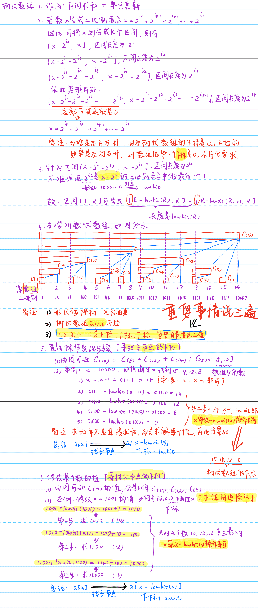

### 注意事项

> 1. <font style="color: red">**先搞明白树状数组存的值的意义，此点至关重要！！！**</font>

### [P3374 【模板】树状数组 1](https://www.luogu.com.cn/problem/P3374)

**题目描述**

> 如题，已知一个数列，你需要进行下面两种操作：
>
> - 将某一个数加上 `x`
> - 求出某区间每一个数的和

**输入格式**

> 第一行包含两个正整数 `n,m`，分别表示该数列数字的个数和操作的总个数。
>
> 第二行包含 `n` 个用空格分隔的整数，其中第 `i` 个数字表示数列第 `i` 项的初始值。
>
> 接下来 `m` 行每行包含 `3` 个整数，表示一个操作，具体如下：
>
> - `1 x k` 含义：将第 `x` 个数加上 `k`
> - `2 x y` 含义：输出区间 `[x,y]` 内每个数的和

**输出格式**

> 输出包含若干行整数，即为所有操作 `2` 的结果。

**输入 #1**

```c++
5 5
1 5 4 2 3
1 1 3
2 2 5
1 3 -1
1 4 2
2 1 4
```

**输出 #1**

```c++
14
16
```

**数据范围**

> 对于 `30%` 的数据，$1≤n≤8$，$1≤m≤10$；
> 对于 `70%` 的数据，$1≤n,m≤10^4$；
> 对于 `100%` 的数据，$1≤n,m≤5×10^5$。

**样例说明**

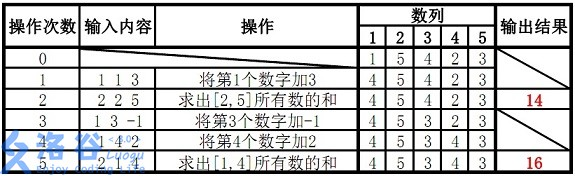

故输出结果`14、16`

**代码**

```c++
#include <iostream>
using namespace std;
typedef long long LL;
const int N = 500010;
int n, m;
LL tr[N];
int lowbit(int x) {
    return x & -x;
}
void add(int x, int c) {
    for (int i = x; i <= n; i += lowbit(i)) tr[i] += c;
    return;
}
int sum(int x) {
    LL res = 0;
    for (int i = x; i; i -= lowbit(i)) res += tr[i];
    return res;
}
int main() {
    scanf("%d%d", &n, &m);
    for (int i = 1, t; i <= n; i ++ ) {
        scanf("%d", &t);
        // 一开始在树状数组的下标为i的位置上添加t
        add(i, t);
        // 注意必须使用add函数，因为add函数当中包含对其他下标的值的更新
    }
    while (m -- ) {
        int op, x, y;
        scanf("%d%d%d", &op, &x, &y);
        if (op == 1) add(x, y);
        else cout << sum(y) - sum(x - 1) << endl;
    }
    return 0;
}
```

**标签**

`树状数组`

### [AcWing 241. 楼兰图腾](https://www.acwing.com/problem/content/243/)

**题目描述**

> 在完成了分配任务之后，西部 `314` 来到了楼兰古城的西部。
>
> 相传很久以前这片土地上(比楼兰古城还早)生活着两个部落，一个部落崇拜尖刀(`V`)，一个部落崇拜铁锹(`∧`)，他们分别用 `V` 和 `∧` 的形状来代表各自部落的图腾。
>
> 西部 `314` 在楼兰古城的下面发现了一幅巨大的壁画，壁画上被标记出了 `n` 个点，经测量发现这 `n` 个点的水平位置和竖直位置是两两不同的。
>
> 西部 `314` 认为这幅壁画所包含的信息与这 `n` 个点的相对位置有关，因此不妨设坐标分别为 $(1,y_1),(2,y_2),…,(n,y_n)，$其中 $y_1∼y_n$ 是 `1` 到 `n` 的一个排列。
>
> 西部 `314` 打算研究这幅壁画中包含着多少个图腾。
>
> 如果三个点 $(i,y_i),(j,y_j),(k,y_k)$ 满足 `1≤i<j<k≤n` 且 $y_i>y_j,y_j<y_k$，则称这三个点构成 `V` 图腾;
>
> 如果三个点 $(i,y_i),(j,y_j),(k,y_k)$ 满足 `1≤i<j<k≤n` 且 $y_i<y_j,y_j>y_k$，则称这三个点构成 `∧` 图腾;
>
> 西部 `314` 想知道，这 `n` 个点中两个部落图腾的数目。
>
> 因此，你需要编写一个程序来求出 `V` 的个数和 `∧` 的个数。

**输入格式**

> 第一行一个数 `n`。
>
> 第二行是 `n` 个数，分别代表 `y1，y2,…,yn`。

**输出格式**

> 两个数，中间用空格隔开，依次为 `V` 的个数和 `∧` 的个数。

**数据范围**

> 对于所有数据，`n≤200000`，且输出答案不会超过 `int64`。
> $y_1∼y_n$ 是 `1` 到 `n` 的一个排列。

**输入样例**

```c++
5
1 5 3 2 4
```

**输出样例**

```c++
3 4
```

**手写稿**

> 1. 使用 `g[i]` 表示原数组；`tr[i]` 表示在树状数组中<font style="color: red">下标为 `i` </font>的位置上有一个数字，使用 `1` 做标记；如果下标为 `i` 的位置上没有数字，使用 `0` 做标记，由于数组初始化为 `0`，因此，不需要再额外做标记 ；`great[i]` 表示 `g` 数组中比 `g[i]` 大的数字的个数；`lesser[i]` 表示 `g` 数组中比 `g[i]` 小的数字的个数
> 2. 以 `g` 数组的每一个下标 `i` 为索引，寻找 `i` 左边比 `g[i]` 大的数字的个数和 `i` 右边比 `g[i]` 大的数字的个数，根据乘法原理，两者即可求得 $\vee$ 的个数；同理，求得 $\wedge$ 的个数
> 3. 两次遍历【<font style="color: red">极易混淆需重点阅读</font>】
>     + 第一次遍历【<font style="color: red">从前往后</font>】
>         + 在当前情况（从前往后）下，`great[i]` 表示 `g` 数组中所有下标在 `i` <font style="color: red">之前</font>的所有数字当中比 `g[i]` <font style="color: red">大</font> 的数字的个数；`less[i]` 表示 `g` 数组中所有下标在 `i` <font style="color: red">之前</font>的所有数字当中比 `g[i]` <font style="color: red">小 </font>的数字的个数
>     + 第二次遍历【<font style="color: red">从后往前</font>】
>         + 在当前情况（从后往前）下，`great[i]` 表示 `g` 数组中所有下标在 `i` <font style="color: red">之后</font>的所有数字当中比 `g[i]` <font style="color: red">大</font> 的数字的个数；`less[i]` 表示 `g` 数组中所有下标在 `i` <font style="color: red">之后</font>的所有数字当中比 `g[i]` <font style="color: red">小</font> 的数字的个数

**代码**

```c++
#include <iostream>
#include <cstring>
using namespace std;
typedef long long LL;
const int N = 200010;
int n;
int g[N], tr[N], great[N], lesser[N];
int lowbit(int x) {
    return x & -x;
}
void add(int x, int c) {
    for (int i = x; i <= n; i += lowbit(i) ) tr[i] += c;
    return;
}
int sum(int x) {
    int res = 0; 
    for (int i = x; i; i -= lowbit(i)) res += tr[i];
    return res;
}
int main() {
    scanf("%d", &n);
    for (int i = 1; i <= n; i ++ ) scanf("%d", &g[i]);
    // 【从前往后】遍历数组
    for (int i = 1; i <= n; i ++ ) {
        int y = g[i];
        // great[i]表示在【下标】i【之前】的所有数字当中比y【大】的数字的个数
        great[i] = sum(n) - sum(y);
        // lesser[i]表示在【下标】i【之前】的所有数字当中比y【小】的数字的个数
        lesser[i] = sum(y - 1);
        // 在下标为y的位置上添加1，表示在下标为y的位置上有一个数字
        add(y, 1);
    }
    // 初始化数组
    memset(tr, 0, sizeof tr);
    LL res1 = 0, res2 = 0;
    // 【从后往前】遍历数组
    for (int i = n; i; i -- ) {
        int y = g[i];
        // sum(n) - sum(y) 表示在【下标】为i【之后】的所有数字当中比y【大】的数字的个数
        res1 += great[i] * (LL)(sum(n) - sum(y));
        // sum(y - 1) 表示在【下标】为i【之后】的所有数字当中比y【小】的数字的个数
        res2 += lesser[i] * (LL)sum(y - 1);
        // 在下标为y的位置上添加1，表示在下标为y的位置上有一个数字
        add(y, 1);
    }
    printf("%lld %lld\n", res1, res2);
    return 0;
}
```

**标签**

`树状数组`

### [AcWing 242. 一个简单的整数问题](https://www.acwing.com/problem/content/description/248/)

**题目描述**

> 给定长度为 `N` 的数列 `A`，然后输入 `M` 行操作指令。
>
> 第一类指令形如 `C l r d`，表示把数列中第 `l∼r` 个数都加 `d`。
>
> 第二类指令形如 `Q x`，表示询问数列中第 `x` 个数的值。
>
> 对于每个询问，输出一个整数表示答案。

**输入格式**

> 第一行包含两个整数 `N` 和 `M`。
>
> 第二行包含 `N` 个整数 `A[i]`。
>
> 接下来 `M` 行表示 `M` 条指令，每条指令的格式如题目描述所示。

**输出格式**

> 对于每个询问，输出一个整数表示答案。
>
> 每个答案占一行。

**数据范围**

> + $1≤N,M≤10^5$,
> + $|d|≤10000$,
> + $|A[i]|≤10^9$

**输入样例**

```c++
10 5
1 2 3 4 5 6 7 8 9 10
Q 4
Q 1
Q 2
C 1 6 3
Q 2
```

**输出样例**

```c++
4
1
2
5
```

**步骤**

> 1. 树状数组可以解决的问题：
>     + 区间求和
>     + 单点更新
>
> 2. 本题的要求有两个操作
>
>     + 将原数组变成树状数组（差分数组）
>
>     + 将题目中的两个操作变成树状数组的经典操作
>
>         + 第一个操作是数列中的第 `l ～ r` 个数字都加上 `d`，分若干个步骤将其转化为树状数组的经典操作之一即单点更新
>             + 第 `l ～ r` 个数字添加 `d`，由差分数组 `tr` 可知，`tr[l] += d，tr[r + 1] -= d` 即可完成操作，对应树状数组经典操作的单点更新
>
>         + 第二个操作是查询数列中的第 `x` 个数字，分若干个步骤将其转化为树状数组的经典操作之一即区间求和
>             + 修改第 `x` 个数字，由差分数组 `tr` 可知，`sum[1 ~ x]` 即为第 `x` 个数字的值，对应树状数组的区间求和操作

**代码**

```c++
#include <iostream>
using namespace std;
typedef long long LL;
const int N = 100010;
int n, m;
int g[N], tr[N];
int lowbit(int x) {
    return x & -x;
}
void add(int x, int c) {
    for (int i = x; i <= n; i += lowbit(i)) tr[i] += c;
    return;
}
int sum(int x) {
    int res = 0;
    for (int i = x; i; i -= lowbit(i)) res += tr[i];
    return res;
}
int main() {
    scanf("%d%d",&n, &m);
    for (int i = 1; i <= n; i ++ ) {
        scanf("%d", &g[i]);
        // 构建差分树状数组
        add(i, g[i] - g[i - 1]);
    }
    char op[2];
    while (m -- ) {
        scanf("%s", op);
        if (op[0] == 'C') {
            int l, r, d;
            scanf("%d%d%d", &l, &r, &d);
            // tr[l] += d;
            add(l, d);
            // tr[r + 1] -= d;
            add(r + 1, -d);
        }
        else {
            int x;
            scanf("%d", &x);
            // 求和
            cout << sum(x) << endl;
        }
    }
    return 0;
}
```

### [AcWing 243. 一个简单的整数问题2](https://www.acwing.com/problem/content/244/)

**题目描述**

> 给定一个长度为 `N` 的数列 `A`，以及 `M` 条指令，每条指令可能是以下两种之一：
>
> 1. `C l r d`，表示把 `A[l],A[l+1],…,A[r]` 都加上 `d`。
> 2. `Q l r`，表示询问数列中第 `l∼r` 个数的和。
>
> 对于每个询问，输出一个整数表示答案。

**输入格式**

> 第一行两个整数 `N,M`。
>
> 第二行 `N` 个整数 `A[i]`。
>
> 接下来 `M` 行表示 `M` 条指令，每条指令的格式如题目描述所示。

**输出格式**

> 对于每个询问，输出一个整数表示答案。
>
> 每个答案占一行。

**数据范围**

> + $1≤N,M≤10^5,$
> + $|d|≤10000,$
> + $|A[i]|≤10^9$

**输入样例**

```c++
10 5
1 2 3 4 5 6 7 8 9 10
Q 4 4
Q 1 10
Q 2 4
C 3 6 3
Q 2 4
```

**输出样例**

```c++
4
55
9
15
```

**手写稿**

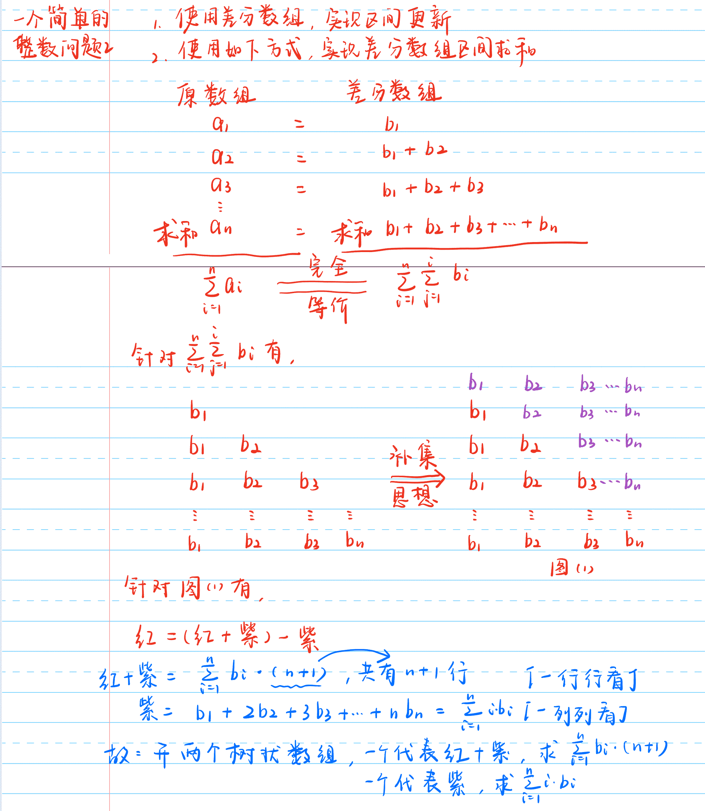

**代码**

```c++
#include <iostream>
using namespace std;
typedef long long LL;
const int N = 100010;
int n, m;
int g[N];
LL tr1[N], tr2[N];
int lowbit(int x) {
    return x & -x;
}
void add(LL tr[], int x, LL c) {
    for (int i = x; i <= n; i += lowbit(i)) tr[i] += c;
    return;
}
LL sum(LL tr[], LL x) {
    LL res = 0;
    for (int i = x; i; i -= lowbit(i)) res += tr[i];
    return res;
}
LL prefix_sum(int x) {
    return sum(tr1, x) * (x + 1) - sum(tr2, x);
}
int main() {
    scanf("%d%d", &n, &m);
    for (int i = 1; i <= n; i ++ ) scanf("%d", &g[i]);
    for (int i = 1; i <= n; i ++ ) {
        int b = g[i] - g[i - 1];
        // 第一个数组tr1存的是红+紫
        add(tr1, i, b);
        // 第二个数组tr2存的是紫
        add(tr2, i, (LL)i * b);
    }
    while (m -- ) {
        char op[2];
        scanf("%s", op);
        if (op[0] == 'C') {
            int l, r, d;
            scanf("%d%d%d", &l, &r, &d);
            add(tr1, l, d), add(tr2, l, l * d);
            add(tr1, r + 1, -d), add(tr2, r + 1, (r + 1) * -d);
        }
        else {
            int l, r;
            scanf("%d%d", &l, &r);
            cout << prefix_sum(r) - prefix_sum(l - 1) << endl;
        }
    }
    return 0;
}
```

**标签**

`树状数组`

### [AcWing 244. 谜一样的牛](https://www.acwing.com/problem/content/245/)

**题目描述**

> 有 `n` 头奶牛，已知它们的身高为 `1∼n` 且各不相同，但不知道每头奶牛的具体身高。
>
> 现在这 `n` 头奶牛站成一列，已知第 `i` 头牛前面有 $A_i$ 头牛比它低，求每头奶牛的身高。

**输入格式**

> 第 `1` 行：输入整数 `n`。
>
> 第 `2..n` 行：每行输入一个整数 $A_i$，第 `i` 行表示第 `i` 头牛前面有 $A_i$ 头牛比它低。
> （注意：因为第 `1` 头牛前面没有牛，所以并没有将它列出）

**输出格式**

> 输出包含 `n` 行，每行输出一个整数表示牛的身高。
>
> 第 `i` 行输出第 `i` 头牛的身高。

**数据范围**

> + $1≤n≤10^5$

**输入样例**

```c++
5
1
2
1
0
```

**输出样例**

```c++
2
4
5
3
1
```

**手写稿**

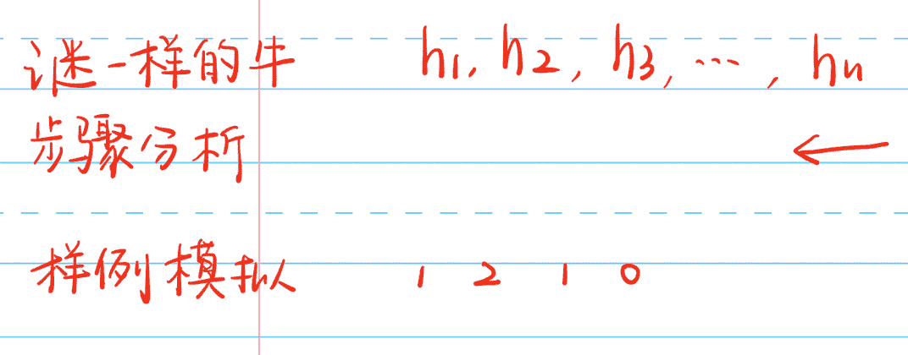

**步骤**

> 1. `h[i]` 代表在第 `i` 头牛之前有 `h[i]` 头牛比当前第 `i` 头牛矮
> 2. 从后往前遍历，在剩下的数字（包括当前数字）当中寻找第 `h[i] + 1` 小的数字即可
> 3. 样例模拟（从后往前）
>     + 初始化：牛的高度可选择范围 `1，2，3，4，5`（不一定有序）
>     + 第一步：倒数第一个数字是 `0`，代表在牛的高度可选择范围`[1, 2, 3, 4, 5]`内有 `0` 头牛比自己矮，即在牛的高度可选择范围`[1, 2, 3, 4, 5]`内寻找第 `1(h[i] + 1)` 小的高度的牛，即为 `1`，此时，剩下的牛的高度选择可为 `2，3，4，5`
>     + 第二步：倒数第二个数字是 `1`，代表在牛的高度可选择范围`[2, 3, 4, 5]`内有 `1` 头牛比自己矮，即在牛的高度可选择范围`[2, 3, 4, 5]`内寻找第 `2(h[i] + 1)` 小的高度的牛，即为 `3`，此时，剩下的牛的高度选择可为 `2，4，5`
>     + 第三步：倒数第三个数字是 `2`，代表在牛的高度可选择范围`[2, 4, 5]`内有 `2` 头牛比自己矮，即在牛的高度可选择范围`[2, 4, 5]`内寻找第 `3(h[i] + 1)` 小的高度的牛，即为 `5`，此时，剩下的牛的高度选择可为 `2，4`
>     + 第四步：倒数第四个数字是 `1`，代表在牛的高度可选择范围`[2, 4]`内有 `1` 头牛比自己矮，即在牛的高度可选择范围`[2, 4]`内寻找第 `2(h[i] + 1)` 小的高度的牛，即为 `4`，此时，剩下的牛的高度可选择为 `2`
>     + 第五步：剩下的牛的高度为 `2`，故答案为 `[2, 4, 5, 3, 1]`
> 4. 实现方式：树状数组 + 二分
>     + 树状数组 `tr[i]` 表示高度为 `i` 是否可以使用，`1` 代表可使用，否则，不可使用
>         + 树状数组初始化为 `1`，表明一开始，每个数字都可以使用
>     + 树状数组 `sum[i]` 前缀和是单调的，故可以使用二分
> 5. 注意事项
>     + 二分的是【<font style = "color: red">**牛的高度**</font>】
>     + 树状数组 `tr[i]` 表示高度为 `i` 的牛是否可以使用，`1` 代表可以使用，否则，不可使用

**代码**

```c++
#include <iostream>
using namespace std;
const int N = 100010;
int n;
int h[N], tr[N], ans[N];
int lowbit(int x) {
    return x & -x;
}
void add(int x, int c) {
    for (int i = x; i <= n; i += lowbit(i)) tr[i] += c;
    return;
}
int sum(int x) {
    int res = 0;
    for (int i = x; i; i -= lowbit(i)) res += tr[i];
    return res;
}
int main() {
    scanf("%d", &n);
    // 下标从2开始，因为第一头牛前面没有比它矮的，默认为0，题目中已经标注
    for (int i = 2; i <= n; i ++ ) scanf("%d", &h[i]);
    // 每头牛初始化为1，表明当前这头牛的高度i可以被使用【未被剔除】
    for (int i = 1; i <= n; i ++ ) add(i, 1);
    for (int i = n; i; i --) {
        // 寻找i前面的第h[i]小的数，算上当前值，故寻找第h[i] + 1个数字
        int k = h[i] + 1;
        // 二分的是牛的高度，即查看当前牛的高度是否满足答案
        int l = 1, r = n;
        while (l < r) {
            int mid = l + r >> 1;
            // mid代表牛的高度
            if (sum(mid) >= k) r = mid;
            else l = mid + 1;
        }
        // 将结果加入答案
        ans[i] = r;
        // 将已经加入答案的数字进行排除
        add(r, -1);
    }
    for (int i = 1; i <= n; i ++ ) cout << ans[i] << endl;
    return 0;
}
```

**标签**

`树状数组`

### [LeetCode 307. 区域和检索 - 数组可修改](https://leetcode-cn.com/problems/range-sum-query-mutable/)

**题目描述**

> 给你一个数组 `nums` ，请你完成两类查询。
>
> 其中一类查询要求 更新 数组 `nums` 下标对应的值
> 另一类查询要求返回数组 `nums` 中索引 `left` 和索引 `right` 之间（ 包含 ）的 `nums` 元素的 和 ，其中 `left <= right`
> 实现 `NumArray` 类：
>
> + `NumArray(int[] nums)` 用整数数组 `nums` 初始化对象
> + `void update(int index, int val)` 将 `nums[index]` 的值 更新 为 `val`
> + `int sumRange(int left, int right)` 返回数组 `nums` 中索引 `left` 和索引 `right` 之间（ 包含 ）的 `nums` 元素的 和 `（即，nums[left] + nums[left + 1], ..., nums[right]）`

**示例 1**

> 输入：
> `["NumArray", "sumRange", "update", "sumRange"]
> [[[1, 3, 5]], [0, 2], [1, 2], [0, 2]]`
> 输出：
> `[null, 9, null, 8]`
>
> 解释：
> `NumArray numArray = new NumArray([1, 3, 5]);
> numArray.sumRange(0, 2); // 返回 1 + 3 + 5 = 9
> numArray.update(1, 2);   // nums = [1,2,5]
> numArray.sumRange(0, 2); // 返回 1 + 2 + 5 = 8`

**提示**

> + $1 <= nums.length <= 3 * 10^4$
> + $-100 <= nums[i] <= 100$
> + $0 <= index < nums.length$
> + $-100 <= val <= 100$
> + $0 <= left <= right < nums.length$
> + $调用 pdate 和 sumRange 方法次数不大于 3 * 10^4 $

**解题步骤**

> 1. 树状数组解决的基本问题
>
>     + 单点更新
>     + 区间求和
>
> 2. 本题单点更新略有特殊，本题的单点更新不是将某个值 `tr[i] += val` ，而是 `tr[i] = val` ，因此，本题的 `val` 应该为 `val = val - nums[i]` ，这样，`tr[i] += val` 变成 `tr[i] = tr[i] + val - nums[i] = val` ，同时，将 `nums[i] = val` 才符合题意
>
> 3. 必须更新的原因
>
>     + 模拟样例
>
>         + 输入
>
>             > `["NumArray","update","sumRange","update","sumRange"]`
>             > `[[[7]],[0,2],[0,0],[0,9],[0,0]]`
>
>         + 输出
>
>             > `[null,null,2,null,9]`

**代码**

```c++
class NumArray {
public:
    int n;
    vector<int> tr, nums;
    int lowbit(int x) {
        return x & -x;
    }
    void add(int x, int c) {
        for (int i = x; i <= n; i += lowbit(i)) tr[i] += c;
        return;
    }
    int sum(int x) {
        int res = 0;
        for (int i = x; i; i -= lowbit(i)) res += tr[i];
        return res;
    }
    NumArray(vector<int>& _nums) {
        nums = _nums;
        n = nums.size();
        nums.resize(n + 1);
        tr = vector<int>(n + 5);
        // 构建树状数组
        for (int i = 0; i < n; i ++ ) add(i + 1, nums[i]);
    }
    
    void update(int index, int val) {
        // 树状数组下标从1开始
        add(index + 1, val - nums[index]);
        // 更新原数组
        // 更新缘由在解题步骤中
        nums[index] = val;
        return;
    }
    
    int sumRange(int left, int right) {
        left ++, right ++;
        return sum(right) - sum(left - 1);
    }
};

/**
 * Your NumArray object will be instantiated and called as such:
 * NumArray* obj = new NumArray(nums);
 * obj->update(index,val);
 * int param_2 = obj->sumRange(left,right);
 */
```

**标签**

`树状数组`

## 二叉树

### 二叉树

#### [LeetCode 297. 二叉树的序列化与反序列化](https://leetcode-cn.com/problems/serialize-and-deserialize-binary-tree/)

**题目描述**

> 序列化是将一个数据结构或者对象转换为连续的比特位的操作，进而可以将转换后的数据存储在一个文件或者内存中，同时也可以通过网络传输到另一个计算机环境，采取相反方式重构得到原数据。
>
> 请设计一个算法来实现二叉树的序列化与反序列化。这里不限定你的序列 / 反序列化算法执行逻辑，你只需要保证一个二叉树可以被序列化为一个字符串并且将这个字符串反序列化为原始的树结构。
>
> 提示: 输入输出格式与 `LeetCode` 目前使用的方式一致，详情请参阅 `LeetCode` 序列化二叉树的格式。你并非必须采取这种方式，你也可以采用其他的方法解决这个问题。

**示例 1**


> 输入：`root = [1,2,3,null,null,4,5]`
> 输出：`[1,2,3,null,null,4,5]`

**示例 2**

> 输入：`root = []`
> 输出：`[]`

**示例 3**

> 输入：`root = [1]`
> 输出：`[1]`

**示例 4**

> 输入：`root = [1,2]`
> 输出：`[1,2]`

**提示**

> + $树中结点数在范围 [0, 10^4] 内$
> + $-1000 <= Node.val <= 1000$

**手写稿**

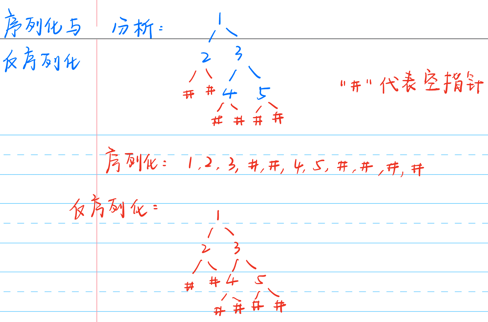

**代码**

```c++
/**
 * Definition for a binary tree node.
 * struct TreeNode {
 *     int val;
 *     TreeNode *left;
 *     TreeNode *right;
 *     TreeNode(int x) : val(x), left(NULL), right(NULL) {}
 * };
 */
class Codec {
public:
    string str;
    void dfs_s(TreeNode* root) {
        if (!root) {
            str += "#,";
            return;
        }
        str += to_string(root -> val) + ",";
        dfs_s(root -> left);
        dfs_s(root -> right);
        return;
    }
    // Encodes a tree to a single string.
    string serialize(TreeNode* root) {
        // 深搜
        dfs_s(root);
        return str;
    }
    TreeNode* dfs_d(string& data, int &u) {
        if (data[u] == '#') {
            // 跳过#和后面的,
            u += 2;
            return NULL;
        }
        int k = u;
        while (data[u] != ',') u ++;
        auto root = new TreeNode(stoi(data.substr(k, u - k)));
        // 跳过,
        u ++;
        root -> left = dfs_d(data, u);
        root -> right = dfs_d(data, u);
        return root;
    }
    // Decodes your encoded data to tree.
    TreeNode* deserialize(string data) {
        int u = 0;
        return dfs_d(data, u);
    }
};

// Your Codec object will be instantiated and called as such:
// Codec ser, deser;
// TreeNode* ans = deser.deserialize(ser.serialize(root));
```

**标签**

`dfs`、`数据结构`

#### [LeetCode 331. 验证二叉树的前序序列化](https://leetcode-cn.com/problems/verify-preorder-serialization-of-a-binary-tree/)

**题目描述**

>   序列化二叉树的一种方法是使用前序遍历。当我们遇到一个非空节点时，我们可以记录下这个节点的值。如果它是一个空节点，我们可以使用一个标记值记录，例如 `#`。
>
>   ```c++
>   	_9_
>    /   \
>   3     2
>   / \   / \
>   4   1  #  6
>   / \ / \   / \
>   # # # #   # #
>   ```
>
>   例如，上面的二叉树可以被序列化为字符串 `"9,3,4,#,#,1,#,#,2,#,6,#,#"`，其中 `#` 代表一个空节点。
>
>   给定一串以逗号分隔的序列，验证它是否是正确的二叉树的前序序列化。编写一个在不重构树的条件下的可行算法。
>
>   每个以逗号分隔的字符或为一个整数或为一个表示 `null` 指针的 `'#'` 。
>
>   你可以认为输入格式总是有效的，例如它永远不会包含两个连续的逗号，比如 `"1,,3"` 。

**示例 1**

>   输入: `"9,3,4,#,#,1,#,#,2,#,6,#,#"`
>   输出: `true`

**示例 2**

>   输入: `"1,#"`
>   输出: `false`

**示例 3**

>   输入: `"9,#,#,1"`
>   输出: `false`

**手写稿**

>   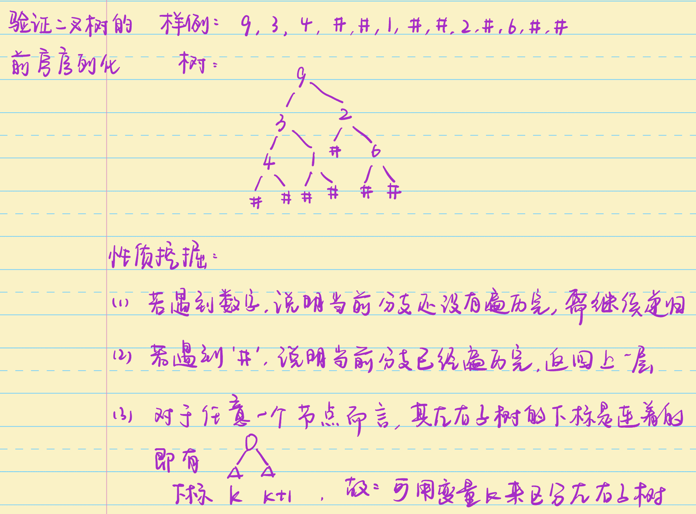
>
>   若代码不理解，建议模拟样例

**代码**

```c++
class Solution {
public:
    int k = 0;
    bool isValidSerialization(string s) {
        // 以逗号,结尾
        s += ',';
        if (!dfs(s)) return false;
        // 如果还没有计算到结尾，说明不符合条件，样例：3,#,#,1
        return k == s.size();
    }
    bool dfs(string& s) {
        // 如果已经到达元素结尾，返回false
        if (k == s.size()) return false;
        // 跳过#和,
        if (s[k] == '#') return k += 2, true;
        // 跳过数字
        while (isdigit(s[k])) k ++ ;
        // 跳过逗号
        k ++ ;
        // 遍历左子树和右子树
        return dfs(s) && dfs(s);
    }
};
```

**标签**

`二叉树`、`dfs`

### 二叉搜索树

#### [LeetCode 501. 二叉搜索树中的众数](https://leetcode.cn/problems/find-mode-in-binary-search-tree/)

**题目描述**

>   给你一个含重复值的二叉搜索树`（BST）`的根节点 `root` ，找出并返回 `BST` 中的所有 **众数**（即，出现频率最高的元素）。
>
>   如果树中有不止一个众数，可以按 任意顺序 返回。
>
>   假定 `BST` 满足如下定义：
>
>   结点左子树中所含节点的值 **小于等于** 当前节点的值
>   结点右子树中所含节点的值 **大于等于** 当前节点的值
>   左子树和右子树都是二叉搜索树

**示例 1**

>   输入：`root = [1,null,2,2]`
>   输出：`[2]`

**示例 2**

>   输入：`root = [0]`
>   输出：`[0]`

**提示**

>   +   $树中节点的数目在范围 [1, 10^4] 内$
>   +   $-10^5 <= Node.val <= 10^5$

**进阶**

>   你可以不使用额外的空间吗？（假设由递归产生的隐式调用栈的开销不被计算在内）

**手写稿**

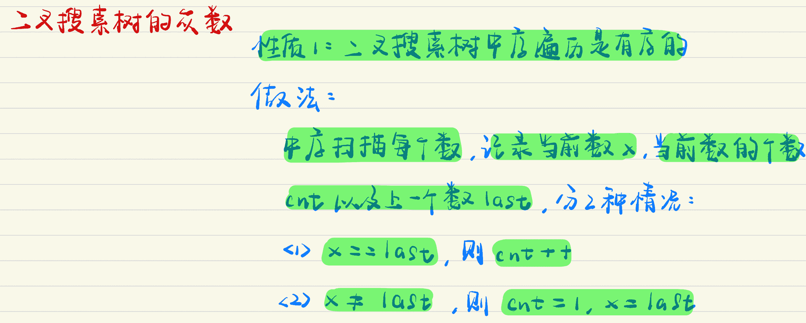

**代码**

```c++
/**
 * Definition for a binary tree node.
 * struct TreeNode {
 *     int val;
 *     TreeNode *left;
 *     TreeNode *right;
 *     TreeNode() : val(0), left(nullptr), right(nullptr) {}
 *     TreeNode(int x) : val(x), left(nullptr), right(nullptr) {}
 *     TreeNode(int x, TreeNode *left, TreeNode *right) : val(x), left(left), right(right) {}
 * };
 */
class Solution {
public:
    vector<int> ans;
    int Mxcnt = 0, cnt = 0, last;
    void dfs(TreeNode* root) {
        // 空子树直接返回
        if (!root) return;
        // 遍历左子树
        dfs(root -> left);
        // 如果和上一个数相等, 则 cnt ++
        if (root -> val == last) cnt ++;
        else {
            // 更新上一个数
            last = root -> val;
            // 更新个数
            cnt = 1;
        }
        // 如果当前数的个数大于全局最大数, 则更新
        if (cnt > Mxcnt) {
            // 更新最大数
            Mxcnt = cnt;
            // 更新答案数组
            ans = {last};
        }
        // 答案多一个数
        else if (cnt == Mxcnt) ans.push_back(last);
        // 遍历右子树
        dfs(root -> right);
        return;
    }
    vector<int> findMode(TreeNode* root) {
        dfs(root);
        return ans;
    }
};
```

**时间复杂度**

$O(n)$

**空间复杂度**

$O(n)$

**标签**

`二叉搜索树`

**缝合怪**


#### [LeetCode 530. 二叉搜索树的最小绝对差](https://leetcode.cn/problems/minimum-absolute-difference-in-bst/)

**题目描述**

>   给你一个二叉搜索树的根节点 `root` ，返回 树中任意两不同节点值之间的最小差值 。
>
>   差值是一个正数，其数值等于两值之差的绝对值。

**示例 1**

>   输入：`root = [4,2,6,1,3]`
>   输出：`1`

**示例 2**

>   输入：`root = [1,0,48,null,null,12,49]`
>   输出：`1`

**提示**

>   +   $树中节点的数目范围是 [2, 10^4]$
>   +   $0 <= Node.val <= 10^5$

注意

>   本题与 [LeetCode 783.](https://leetcode-cn.com/problems/minimum-distance-between-bst-nodes/) 相同

**手写稿**

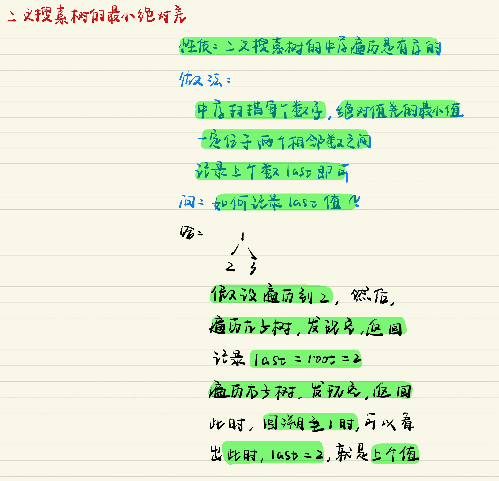

**代码**

```c++
/**
 * Definition for a binary tree node.
 * struct TreeNode {
 *     int val;
 *     TreeNode *left;
 *     TreeNode *right;
 *     TreeNode() : val(0), left(nullptr), right(nullptr) {}
 *     TreeNode(int x) : val(x), left(nullptr), right(nullptr) {}
 *     TreeNode(int x, TreeNode *left, TreeNode *right) : val(x), left(left), right(right) {}
 * };
 */
class Solution {
public:
    int ans = 1e9, last, is_first = true;
    void dfs(TreeNode* root) {
        // 空树返回
        if (!root) return;
        // 遍历左子树
        dfs(root -> left);
        // 如果是第一个数, 则标记
        if (is_first) is_first = false;
        // 如果不是第一个数, 则更新最小差值
        else ans = min(ans, abs(root -> val - last));
        // 更新上一个数
        last = root -> val;
        // 遍历右子树
        dfs(root -> right);
        return;
    }
    int getMinimumDifference(TreeNode* root) {
        dfs(root);
        return ans;
    }
};
```

**时间复杂度**

$O(n)$

**空间复杂度**

$O(n)$

**标签**

`二叉搜索树`

**缝合怪**


# 并查集

## [AcWing 836. 合并集合](https://www.acwing.com/problem/content/838/)

**题目描述**

>   一共有 `n` 个数，编号是 `1 ∼ n`，最开始每个数各自在一个集合中。
>
>   现在要进行 `m` 个操作，操作共有两种：
>
>   1.  `M a b`，将编号为 `a` 和 `b` 的两个数所在的集合合并，如果两个数已经在同一个集合中，则忽略这个操作；
>   2.  `Q a b`，询问编号为 `a` 和 `b` 的两个数是否在同一个集合中；

**输入格式**

>   第一行输入整数 `n` 和 `m`。
>
>   接下来 `m` 行，每行包含一个操作指令，指令为 `M a b` 或 `Q a b` 中的一种。

**输出格式**

>   对于每个询问指令 `Q a b`，都要输出一个结果，如果 `a` 和 `b` 在同一集合内，则输出 `Yes`，否则输出 `No`。
>
>   每个结果占一行。

**数据范围**

>   +   $1 ≤ n, m ≤ 10^5$

**输入样例**

```c++
4 5
M 1 2
M 3 4
Q 1 2
Q 1 3
Q 3 4
```

**输出样例**

```c++
Yes
No
Yes
```

**手写稿**

>   1.   开始时每个集合都是一个独立的集合,并且都是等于自己本身下标的数
>   2.   例 `1`:
>        `p[5] = 5, p[3] = 3;`
>        如果是 `M` 操作的话那么就将集合进行合并,合并的操作是:
>        `p[3] = p[5] = 5;`
>        所以 `3` 的祖宗节点便成为了 `5`
>        此时以 `5` 为祖宗节点的集合为 `{5，3}`
>        如果要将 `p[9] = 9` 插入到 `p[3]` 当中,应该找到 `3` 的祖宗节点,
>        然后再把 `p[9] = 9` 插入其中,所以`p[9] = find(3);`(`find()`函数用于查找祖宗节点)
>        也可以是`p[find(9)] = find(3)`,因为 `9` 的节点本身就是 `9`
>        此时以 `5` 为祖宗节点的集合为 `{5, 3, 9};`
>        如果碰到多个数的集合插入另一个集合当中其原理是相同的
>   3.   例 `2`:
>        上述中以 `5` 为祖宗节点的是`p[5], p[3], p[9];`(即`p[5] = 5, p[3] = 5, p[9] = 5`)
>        再构造一个以 `6` 为祖宗节点的集合为 `{6, 4, 7, 10}`
>        如果要将以 `6` 为祖宗节点的集合插入到以 `5` 为祖宗节点的集合,则该操作可以是
>        `p[6] = find(3)`（或者`find(9), find(5)`）
>        此时`p[6] = 5`
>        当然如果是以 `6` 为祖宗节点集合中的`4, 7, 10`则可以这样
>        `p[find(4)] = find(3)`
>        或者`p[find(7)] = find(3)`均可以
>        此时以 `6` 为祖宗节点的集合的祖宗节点都成为了 `5`

**代码**

```c++
#include <iostream>
using namespace std;
const int N = 100010;
int n, m;
int f[N];
int find(int x) {
    // 如果已经走到最顶部, 则返回
    if (f[x] == x) return f[x];
    // 让x的父亲指向家族中的老不死
    return f[x] = find(f[x]);
}
int main() {
    scanf("%d%d", &n, &m);
    // 将每个孩子的父亲都是本身
    for (int i = 1; i <= n; i ++ ) f[i] = i;
    for (int i = 0; i < m; i ++ ) {
        int a, b;
        char op[2];
        scanf("%s%d%d", op, &a, &b);
        // 找a的父亲, 找b的父亲
        int fa = find(a), fb = find(b);
        if (op[0] == 'M') {
            // 如果都属于同一个家族, 则跳过本次循环
            if (fa == fb) continue;
            // 让fa成为fb的父亲
            f[fb] = fa;
        }
        else {
            // 如果同属于一个家族, 则返回Yes
            if (fa == fb) puts("Yes");
            // 否则, 返回No
            else puts("No");
        }
    }
    return 0;
}
```

**时间复杂度**

$O(n)$

**空间复杂度**

$O(n)$

**标签**

`并查集`

**缝合怪**


## [AcWing 837. 连通块中点的数量](https://www.acwing.com/problem/content/839/)

**题目描述**

>   给定一个包含 `n` 个点（编号为 `1 ∼ n`）的无向图，初始时图中没有边。
>
>   现在要进行 `m` 个操作，操作共有三种：
>
>   1.  `C a b`，在点 `a` 和点 `b` 之间连一条边，`a` 和 `b` 可能相等；
>   2.  `Q1 a b`，询问点 `a` 和点 `b` 是否在同一个连通块中，`a` 和 `b` 可能相等；
>   3.  `Q2 a`，询问点 `a` 所在连通块中点的数量；

**输入格式**

>   第一行输入整数 `n` 和 `m`。
>
>   接下来 `m` 行，每行包含一个操作指令，指令为 `C a b`，`Q1 a b` 或 `Q2 a` 中的一种。

**输出格式**

>   对于每个询问指令 `Q1 a b`，如果 `a` 和 `b` 在同一个连通块中，则输出 `Yes`，否则输出 `No`。
>
>   对于每个询问指令 `Q2 a`，输出一个整数表示点 `a` 所在连通块中点的数量
>
>   每个结果占一行。

**数据范围**

>   +   $1 ≤ n, m ≤ 10^5$

**输入样例**

```c++
5 5
C 1 2
Q1 1 2
Q2 1
C 2 5
Q2 5
```

**输出样例**

```c++
Yes
2
3
```

**手写稿**

>   1.   并查集模板

**代码**

```c++
#include <iostream>
#include <cstring>
using namespace std;
const int N = 100010;
int n, m;
int f[N], g[N];
int find(int x) {
    if (f[x] == x) return f[x];
    return f[x] = find(f[x]);
}
int main() {
    scanf("%d%d", &n, &m);
    // 初始自己为自己的父亲, 初始集合内数字个数为1
    for (int i = 1; i <= n; i ++ ) f[i] = i, g[i] = 1;
    for (int i = 0; i < m; i ++ ) {
        int a, b;
        char op[2];
        scanf("%s", op);
        if (!strcmp(op, "C")) {
            scanf("%d%d", &a, &b);
            // 找到其祖先
            int fa = find(a), fb = find(b);
            // 相等, 则返回
            if (fa == fb) continue;
            // 将fb的父亲换成fa
            f[fb] = fa;
            // 集合内的数字个数进行累加
            g[fa] += g[fb];
        }
        else if (!strcmp(op, "Q1")) {
            scanf("%d%d", &a, &b);
            // 找到其祖先
            int fa = find(a), fb = find(b);
            // 相等, 说明是一个大家族, 返回Yes, 否则返回No
            if (fa == fb) puts("Yes");
            else puts("No");
        }
        else {
            scanf("%d", &a);
            // 找到其祖先, 返回大家族内的人数
            int fa = find(a);
            cout << g[fa] << endl;
        }
    }
    return 0;
}
```

**时间复杂度**

$O(m)$

**空间复杂度**

$O(m)$

**标签**

`并查集`

**缝合怪**


## [AcWing 240. 食物链](https://www.acwing.com/problem/content/242/)

**题目描述**

>   动物王国中有三类动物 `A,B,C`，这三类动物的食物链构成了有趣的环形。
>
>   `A` 吃 `B`，`B` 吃 `C`，`C` 吃 `A`。
>
>   现有 `N` 个动物，以 `1 ∼ N` 编号。
>
>   每个动物都是 `A,B,C` 中的一种，但是我们并不知道它到底是哪一种。
>
>   有人用两种说法对这 `N` 个动物所构成的食物链关系进行描述：
>
>   第一种说法是 `1 X Y`，表示 `X` 和 `Y` 是同类。
>
>   第二种说法是 `2 X Y`，表示 `X` 吃 `Y`。
>
>   此人对 `N` 个动物，用上述两种说法，一句接一句地说出 `K` 句话，这 `K` 句话有的是真的，有的是假的。
>
>   当一句话满足下列三条之一时，这句话就是假话，否则就是真话。
>
>   1.  当前的话与前面的某些真的话冲突，就是假话；
>   2.  当前的话中 `X` 或 `Y` 比 `N` 大，就是假话；
>   3.  当前的话表示 `X` 吃 `X`，就是假话。
>
>   你的任务是根据给定的 `N` 和 `K` 句话，输出假话的总数。

**输入格式**

>   第一行是两个整数 `N` 和 `K`，以一个空格分隔。
>
>   以下 `K` 行每行是三个正整数 `D，X，Y`，两数之间用一个空格隔开，其中 `D` 表示说法的种类。
>
>   若 `D=1`，则表示 `X` 和 `Y` 是同类。
>
>   若 `D=2`，则表示 `X` 吃 `Y`。

**输出格式**

>   只有一个整数，表示假话的数目。

**数据范围**

>   +   $1 ≤ N ≤ 50000,$
>   +   $0 ≤ K ≤ 100000$

**输入样例**

```c++
100 7
1 101 1
2 1 2
2 2 3
2 3 3
1 1 3
2 3 1
1 5 5
```

**输出样例**

```c++
3
```

**手写稿**

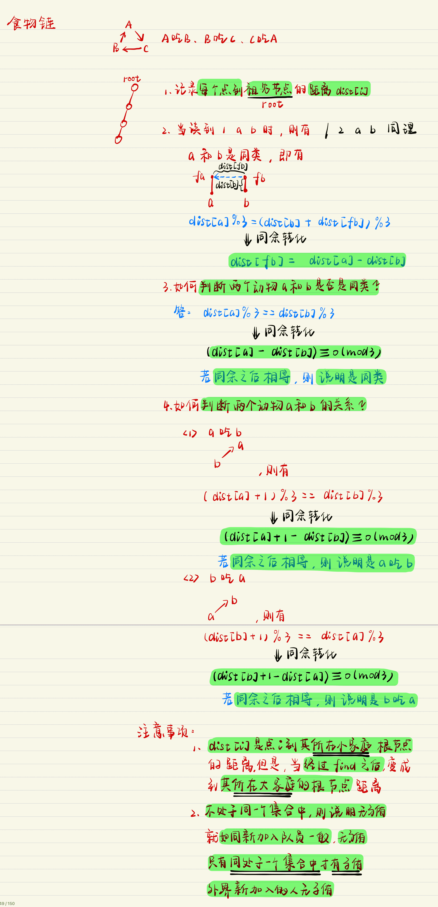

**代码**

```c++
#include <iostream>
using namespace std;
const int N = 50010;
int n, k;
int f[N], dist[N];
int find(int x) {
    if (f[x] == x) return f[x];
    int p = find(f[x]);
    dist[x] += dist[f[x]];
    return f[x] = p;
}
int main() {
    scanf("%d%d", &n, &k);
    for (int i = 1; i <= n; i ++ ) f[i] = i;
    int res = 0;
    for (int i = 0; i < k; i ++ ) {
        int c, a, b;
        scanf("%d%d%d", &c, &a, &b);
        if (a > n || b > n) {
            res ++ ;
            continue;
        }
        int fa = find(a), fb = find(b);
        if (c == 1) {
            if (fa != fb) { // 不在一个集合内, 说明无矛盾!!
                f[fb] = fa; // 更新父节点
                dist[fb] = dist[a] - dist[b]; // 更新距离[距离含义看手写稿]
            }
            else if (fa == fb && (dist[a] - dist[b]) % 3) res ++;
        }
        else {
            if (fa != fb) { // 不在一个集合内, 说明无矛盾!!
                f[fb] = fa; // 更新父节点
                dist[fb] = dist[a] + 1 - dist[b]; // 更新距离[距离含义看手写稿]
            }
            else if(fa == fb && (dist[a] + 1 - dist[b]) % 3) res ++;
        }
    }
    cout << res << endl;
    return 0;
}
```

**时间复杂度**

$O(k)$

**空间复杂度**

$(n)$

**标签**

`带权并查集`、`并查集`

**缝合怪**


# 字符串专题

## KMP

### [Leetode 214. 最短回文串](https://leetcode-cn.com/problems/shortest-palindrome/)

**题目描述**

> 给定一个字符串 s，你可以通过在字符串前面添加字符将其转换为回文串。找到并返回可以用这种方式转换的最短回文串。

**示例 1**

> 输入：`s = "aacecaaa"`
> 输出：`"aaacecaaa"`

**示例 2**

> 输入：`s = "abcd"`
> 输出：`"dcbabcd"`

**提示**

> + $0 <= s.length <= 5 * 10^4$
> + $s$ 仅由小写英文字母组成

**手写稿**

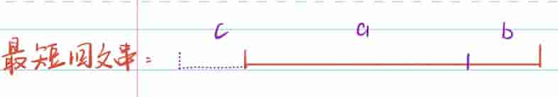

**思路**

> 1. 要想让 `c + a + b` 最短，则只要 `c` 和 `b` 最短即可，换句话说，让 `a` 最长即可
>
> 2. 通过上述分析，问题转化为在原串`（a + b）`中寻找最长回文子串即可解决问题
>
> 3. 通过以下步骤，寻找最长回文子串即可
>
>     + 将原串逆序复制一遍，用 `#` 连接，放在原串的后面
>
>         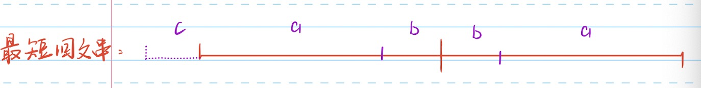
>
>     + 寻找新串 `a + b + b + a` 的最长回文前缀即可，即 `KMP` 的 `next` 数组的含义
>
> 4. 找出 `a` 之后，将 `a` 之后的部分，即 `b` 截取出来，逆序放到最前方

**代码**

```c++
class Solution {
public:
    string shortestPalindrome(string s) {
        string t = s;
        t = ' ' + t + '#' + string(t.rbegin(), t.rend());
        int n = t.size();
        vector<int> ne(n + 5);
        for (int i = 2, j = 0; i < n; i ++ ) {
            while (j && t[i] != t[j + 1]) j = ne[j];
            if (t[i] == t[j + 1]) j ++;
            ne[i] = j;
        }
        t = s.substr(ne[n - 1]);
        return string(t.rbegin(), t.rend()) + s;
    }
};
```

**标签**

`字符串`、`回文串`、`KMP`

# 模拟题专题

## 模拟

### [LeetCode 299. 猜数字游戏](https://leetcode-cn.com/problems/bulls-and-cows/)

**题目描述**

> 你在和朋友一起玩 猜数字`（Bulls and Cows）`游戏，该游戏规则如下：
>
> 写出一个秘密数字，并请朋友猜这个数字是多少。朋友每猜测一次，你就会给他一个包含下述信息的提示：
>
> 猜测数字中有多少位属于数字和确切位置都猜对了（称为 "`Bulls`"，公牛），
> 有多少位属于数字猜对了但是位置不对（称为 "`Cows`"，奶牛）。也就是说，这次猜测中有多少位非公牛数字可以通过重新排列转换成公牛数字。
> 给你一个秘密数字 `secret` 和朋友猜测的数字 `guess` ，请你返回对朋友这次猜测的提示。
>
> 提示的格式为 "`xAyB`" ，`x` 是公牛个数， `y` 是奶牛个数，`A` 表示公牛，`B` 表示奶牛。
>
> 请注意秘密数字和朋友猜测的数字都可能含有重复数字。

**示例 1**

> 输入：`secret = "1807", guess = "7810"`
> 输出：`"1A3B"`
> 解释：数字和位置都对（公牛）用 `'|'` 连接，数字猜对位置不对（奶牛）的采用斜体加粗标识。
> `"1807"
> |
> "7810"`

**示例 2**

> 输入：`secret = "1123", guess = "0111"`
> 输出：`"1A1B"`
> 解释：数字和位置都对（公牛）用 `'|'` 连接，数字猜对位置不对（奶牛）的采用斜体加粗标识。
> `"1123"        "1123"
> |      or     |
> "0111"        "0111"`
> 注意，两个不匹配的 `1` 中，只有一个会算作奶牛（数字猜对位置不对）。通过重新排列非公牛数字，其中仅有一个 `1` 可以成为公牛数字。

**示例 3**

> 输入：`secret = "1", guess = "0"`
> 输出：`"0A0B"`

**示例 4**

> 输入：`secret = "1", guess = "1"`
> 输出：`"1A0B"`

**提示**

> + $1 <= secret.length, guess.length <= 1000$
> + $secret.length == guess.length$
> + `secret` 和 `guess` 仅由数字组成

**题解**

> 1. 两次遍历；
> 2. 第一次遍历数组并且统计公牛的次数，同时将不满足公牛的字符使用多重集合记录下来
> 3. 第二次遍历数组并且利用多重集合统计奶牛的次数，注意一个数字只能对应一个数字，因此，如果比对成功需要将成功的字符从多重集合里面删除

**代码**

```c++
class Solution {
public:
    string getHint(string s, string t) {
        int a = 0, b = 0;
        multiset<char> hash;
        for (int i = 0; i < s.size(); i ++ ) {
            if (s[i] == t[i]) a ++;
            else hash.insert(s[i]);
        }
        for (int i = 0; i < s.size(); i ++ ) {
            if (s[i] == t[i]) continue;
            if (hash.count(t[i])) {
                b ++;
                hash.erase(hash.find(t[i]));
            }
        }
        return to_string(a) + "A" + to_string(b) + "B";
    }
};
```

**标签**

`模拟`

### [LeetCode 273. 整数转换英文表示](https://leetcode-cn.com/problems/integer-to-english-words/)

**题目描述**

> 将非负整数 num 转换为其对应的英文表示。

**示例 1**

> 输入：`num = 123`
> 输出：`"One Hundred Twenty Three"`

**示例 2**

> 输入：`num = 12345`
> 输出：`"Twelve Thousand Three Hundred Forty Five"`

**示例 3**

> 输入：`num = 1234567`
> 输出：`"One Million Two Hundred Thirty Four Thousand Five Hundred Sixty Seven"`

**示例 4**

> 输入：`num = 1234567891`
> 输出：`"One Billion Two Hundred Thirty Four Million Five Hundred Sixty Seven Thousand Eight Hundred Ninety One"`

**提示**

> + $0 <= num <= 2^{31} - 1$

**手写稿**

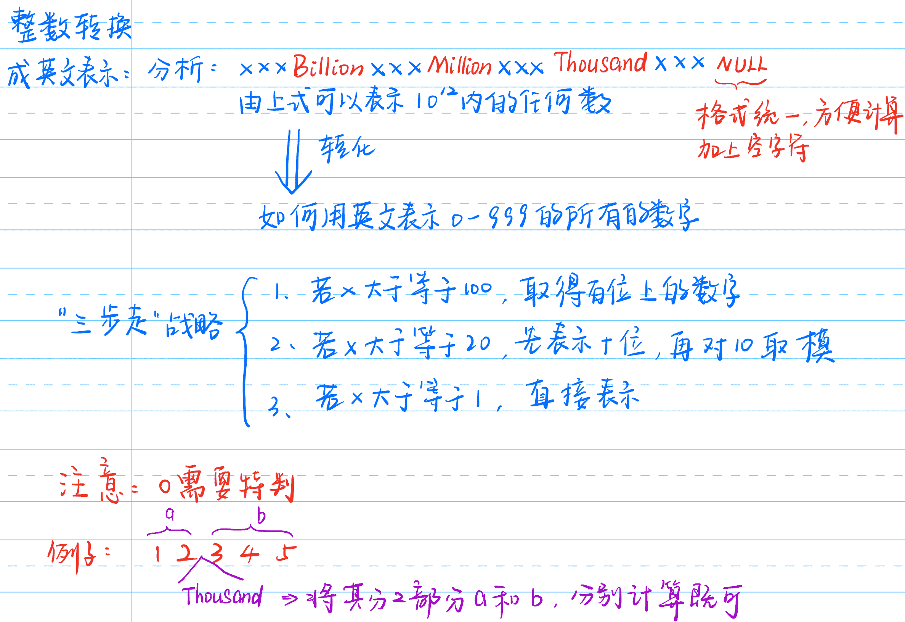

**代码**

```c++
class Solution {
public:
    // 预处理数据
    string nums0_19[20] = {
        "Zero", "One", "Two", "Three", "Four", 
        "Five", "Six", "Seven", "Eight", "Nine",
        "Ten", "Eleven", "Twelve", "Thirteen",
        "Fourteen", "Fifteen", "Sixteen", "Seventeen",
        "Eighteen", "Nineteen"
    };
    string nums20_90[8] = {
        "Twenty", "Thirty", "Forty", "Fifty",
        "Sixty", "Seventy", "Eighty", "Ninety"
    };
    string nums1000_1e9[4] = {
        "Billion ", "Million ", "Thousand ", ""
    };
    string get(int x) {
        if (x == 0) return "Zero";
        string res;
        if (x >= 100) {
            res += nums0_19[x / 100] + " Hundred ";
            x %= 100;
        }
        if (x >= 20) {
            res += nums20_90[x / 10 - 2] + " ";
            x %= 10;
        }
        if (x) res += nums0_19[x] + " ";
        return res;
    }
    string numberToWords(int num) {
        if (num == 0) return "Zero";
        string res;
        for (int i = 1e9, j = 0; i >= 1; i /= 1000, j ++ )
            if (num >= i) {
                res += get(num / i) + nums1000_1e9[j];
                num %= i;
            }
        // 注意空格问题
        res.pop_back();
        return res;
    }
};
```

**标签**

`模拟`、`数字转换`、`中英文`

### [AcWing 1473. A + B 格式](https://www.acwing.com/problem/content/1475/)

**题目描述**

>   计算 `a + b` 并以标准格式输出总和----也就是说，从最低位开始每隔三位数加进一个逗号（千位分隔符），如果结果少于四位则不需添加。

**输入格式**

>   共一行，包含两个整数 `a` 和 `b`。

**输出格式**

>   共一行，以标准格式输出 `a + b` 的和。

**数据范围**

>   +   $−10^6≤a,b≤10^6$

**输入样例**

```c++
-1000000 9
```

**输出样例**

```c++
-999,991
```

**手写稿**

>   1.   对 `a + b` 形成的字符串 `s`，进行遍历，使用 `t` 作为答案，分以下情况：
>        +   如果当前遍历的字符数量 `k` 已经达到 `3` 个，则判断是否还有下一个字符并且下一个字符是否是 `'-'`
>            +   如果条件成立，`t += ,` 并且，将 `k` 置 `0`
>            +   如果条件不成立，退出循环
>        +   反转 `t`，如果字符串 `s` 的第一个字符是 `'-'`，将其加入到答案即可

**代码**

```c++
#include <iostream>
#include <algorithm>
using namespace std;
int a, b;
int main() {
    cin >> a >> b;
    string s = to_string(a + b);
    string t;
    for (int i = s.size() - 1, k = 0; i >= 0 && s[i] != '-'; i -- ) {
        t += s[i];
        k ++;
        // 如果数量已经达到3个，并且，还有下一个字符或者下一个字符不是'-'
        // 将其加入到答案，将k置0
        if (k == 3 && i - 1 >= 0 && s[i - 1] != '-') t += ',', k = 0; 
    }
    // 反转t
    reverse(t.begin(), t.end());
    // 如果s的第一个字符是'-'，将其加入到答案
    if (s[0] == '-') t = '-' + t;
    cout << t << endl;
    return 0;
}
```

**时间复杂度**

$O(n)$

**空间复杂度**

$O(1)$

**标签**

`模拟`

**缝合怪**

### [L1-049 天梯赛座位分配](https://pintia.cn/problem-sets/994805046380707840/problems/994805081289900032)

**题目描述**

> 天梯赛每年有大量参赛队员，要保证同一所学校的所有队员都不能相邻，分配座位就成为一件比较麻烦的事情。为此我们制定如下策略：假设某赛场有 `N` 所学校参赛，第 `i` 所学校有 `M[i]` 支队伍，每队 `10` 位参赛选手。令每校选手排成一列纵队，第 `i + 1` 队的选手排在第 `i` 队选手之后。从第 `1` 所学校开始，各校的第 `1` 位队员顺次入座，然后是各校的第 `2` 位队员…… 以此类推。如果最后只剩下 `1` 所学校的队伍还没有分配座位，则需要安排他们的队员隔位就坐。本题就要求你编写程序，自动为各校生成队员的座位号，从 `1` 开始编号。

**输入格式**

> 输入在一行中给出参赛的高校数 `N` （不超过`100`的正整数）；第二行给出 `N` 个不超过``10``的正整数，其中第 `i` 个数对应第 `i` 所高校的参赛队伍数，数字间以空格分隔。

**输出格式**

> 从第 `1` 所高校的第 `1` 支队伍开始，顺次输出队员的座位号。每队占一行，座位号间以 `1` 个空格分隔，行首尾不得有多余空格。另外，每所高校的第一行按“`#X`”输出该校的编号`X`，从 `1` 开始。

**输入样例**

```c++
3
3 4 2
```

**输出样例**

```c++
#1
1 4 7 10 13 16 19 22 25 28
31 34 37 40 43 46 49 52 55 58
61 63 65 67 69 71 73 75 77 79
#2
2 5 8 11 14 17 20 23 26 29
32 35 38 41 44 47 50 53 56 59
62 64 66 68 70 72 74 76 78 80
82 84 86 88 90 92 94 96 98 100
#3
3 6 9 12 15 18 21 24 27 30
33 36 39 42 45 48 51 54 57 60
```

**手写稿**

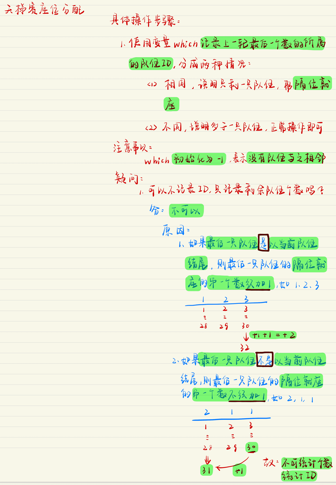

**代码**

```c++
#include <iostream>
using namespace std;
const int N = 110;
int n, m;
int q[N];
int g[N][N];
int main() {
    scanf("%d", &m);
    for (int i = 0; i < m; i ++ ) {
        scanf("%d", &q[i]);
        n = max(n, q[i] * 10);
    }
    int num = 0;
    int which = -1; // 记录上一个轮的最后一个报数的队伍的ID
    for (int i = 0; i < n; i ++ )
        for (int j = 0; j < m; j ++ ) {
            if (i >= q[j] * 10) continue;
            // 如果上一轮最后一个报数的队伍的ID和当前的队伍是同一个队伍
            // 说明只剩下一个队伍, 需要隔位就做, ++ num
            if (j == which) ++ num;
            g[i][j] = ++ num;
            which = j;
        }
    for (int i = 0; i < m; i ++ ) {
        printf("#%d\n", i + 1);
        for (int j = 0; j < q[i]; j ++ ) {
            for (int k = 0; k < 10; k ++ ) {
                cout << g[j * 10 + k][i];
                if (k + 1 < 10) cout << ' ';
            }
            cout << endl;
        }
    }
    return 0;
}
```

**时间复杂度**

$O(nm)$

**空间复杂度**

$O(n^2)$

**标签**

`模拟题`

**缝合怪**


### [LeetCode 38. 外观数列](https://leetcode-cn.com/problems/count-and-say/)

**题目描述**

> 给定一个正整数 `n` ，输出外观数列的第 `n` 项。
>
> 「外观数列」是一个整数序列，从数字 `1` 开始，序列中的每一项都是对前一项的描述。
>
> 你可以将其视作是由递归公式定义的数字字符串序列：
>
> + `countAndSay(1) = "1"`
> + `countAndSay(n)` 是对 `countAndSay(n - 1)` 的描述，然后转换成另一个数字字符串。
>
> 前五项如下:
>
> > 1.     `1`
> > 2.     `11`
> > 3.     `21`
> > 4.     ``1211``
> > 5.     `111221`
> >
> > 第一项是数字 `1` 
> > 描述前一项，这个数是 `1` 即 “ 一 个 `1` ”，记作 "`11`"
> > 描述前一项，这个数是 `11` 即 “ 二 个 `1` ” ，记作 "`21`"
> > 描述前一项，这个数是 `21` 即 “ 一 个 `2` + 一 个 `1` ” ，记作 "`1211`"
> > 描述前一项，这个数是 `1211` 即 “ 一 个 ``1`` + 一 个 `2` + 二 个 `1` ” ，记作 "`111221`"
>
>
> 要 描述 一个数字字符串，首先要将字符串分割为 最小 数量的组，每个组都由连续的最多 相同字符 组成。然后对于每个组，先描述字符的数量，然后描述字符，形成一个描述组。要将描述转换为数字字符串，先将每组中的字符数量用数字替换，再将所有描述组连接起来。
>
> 例如，数字字符串 "`3322251`" 的描述如下图：
>
> 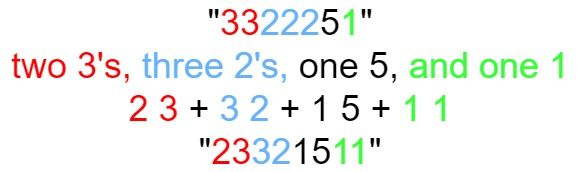

**示例 1**

> 输入：`n = 1`
> 输出：`"1"`
> 解释：这是一个基本样例。

**示例 2**

> 输入：`n = 4`
> 输出：`"1211"`
> 解释：
> `countAndSay(1) = "1"`
> `countAndSay(2) = 读 "1" = 一 个 1 = "11"`
> `countAndSay(3) = 读 "11" = 二 个 1 = "21"`
> `countAndSay(4) = 读 "21" = 一 个 2 + 一 个 1 = "12" + "11" = "1211"`

**提示**

> + $1 <= n <= 30$

**手写稿**

>   1.   模拟即可
>   2.   注意事项: 看代码

**代码**

```c++
class Solution {
public:
    string countAndSay(int n) {
        string str = "1";
        for (int i = 2; i <= n; i ++ ) {
            string tmp;
            for (int j = 0; j < str.size(); j ++ ) {
                int k = j;
                // 判断字符str[j]的个数
                while (k < str.size() && str[k] == str[j]) k ++;
                // (k - j)个字符str[j]
                tmp += to_string(k - j) + str[j];
                j = k - 1;
            }
            str = tmp;
        }
        return str;
    }
};
```

**时间复杂度**

$O(nm), n是给定的正整数, m是生成字符串的长度$

**空间复杂度**

$O(m), m是生成字符串的最大长度$

**标签**

`模拟`

**缝合怪**


### [LeetCode 68. 文本左右对齐](https://leetcode-cn.com/problems/text-justification/)

**题目描述**

>   给定一个单词数组 `words` 和一个长度 `maxWidth` ，重新排版单词，使其成为每行恰好有 `maxWidth` 个字符，且左右两端对齐的文本。
>
>   你应该使用 “贪心算法” 来放置给定的单词；也就是说，尽可能多地往每行中放置单词。必要时可用空格 ' ' 填充，使得每行恰好有 `maxWidth` 个字符。
>
>   要求尽可能均匀分配单词间的空格数量。如果某一行单词间的空格不能均匀分配，则左侧放置的空格数要多于右侧的空格数。
>
>   文本的最后一行应为左对齐，且单词之间不插入额外的空格。
>
>   注意:
>
>   单词是指由非空格字符组成的字符序列。
>   每个单词的长度大于 `0`，小于等于 `maxWidth`。
>   输入单词数组 `words` 至少包含一个单词。

**示例 1**

>   输入: `words = ["This", "is", "an", "example", "of", "text", "justification."], maxWidth = 16`
>   输出:
>   `[
>     "This    is    an",
>     "example  of text",
>     "justification.  "
>   ]`

**示例 2**

>   输入:`words = ["What","must","be","acknowledgment","shall","be"], maxWidth = 16`
>   输出:
>   `[
>    "What   must   be",
>    "acknowledgment  ",
>    "shall be        "
>   ]`
>   解释: 注意最后一行的格式应为 `"shall be    "` 而不是 `"shall     be"`,
>       因为最后一行应为左对齐，而不是左右两端对齐。       
>       第二行同样为左对齐，这是因为这行只包含一个单词。

**示例 3**

>   输入:`words = ["Science","is","what","we","understand","well","enough","to","explain","to","a","computer.","Art","is","everything","else","we","do"]，maxWidth = 20`
>   输出:
>   `[
>    "Science  is  what we",
>    "understand      well",
>    "enough to explain to",
>    "a  computer.  Art is",
>    "everything  else  we",
>    "do                  "
>   ]`

**提示**

>   +   $1 <= words.length <= 300$
>   +   $1 <= words[i].length <= 20$
>   +   $words[i] 由小写英文字母和符号组成$
>   +   $1 <= maxWidth <= 100$
>   +   $words[i].length <= maxWidth$

**手写稿**

>   1.   模拟, 分两步进行
>        +   左对齐
>        +   两端对齐
>   2.   `++ usednum <= leftnum` 解释
>        +   `usednum` 表示的含义是在多出来的空格中已经使用的个数
>        +   `leftnum` 表示多出来空格的总个数
>        +   假设 `leftnum = 0`
>        +   `usednum` 初始值为 `0`, 表示一个数字都没有被使用过
>        +   上式含义是用过一个数字之后如果小于等于总个数, 说明合法, 返回 `true(1)`, 否则, 返回 `false(0)`

**代码**

```c++
class Solution {
public:
    vector<string> fullJustify(vector<string>& g, int Max) {
        int n = g.size();
        vector<string> res;
        for (int i = 0; i < n; i ++ ) {
            // spe含义为空格的数量
            int j = i, len = 0, spe = 0;
            string line;
            while (j < n && len + spe + g[j].size() <= Max) {
                len = len + spe + g[j].size();
                spe = 1, j ++ ;
            }
            int wdnum = j - i; // 单词的数量
            if (j == n || wdnum == 1) { // 到达最后一行活着本行只有一个单词, 左对齐
                // 先输入一个单词
                line = g[i];
                for (int k = i + 1; k < j; k ++ ) line += ' ' + g[k];
                // 将剩余的空格补齐
                line += string(Max - line.size(), ' ');
            }
            else { // 两端对齐
                // 空格的平均数量
                int spenum = (Max - len + wdnum - 1) / (wdnum - 1);
               	// 剩余空格的数量
                int leftnum = (Max - len + wdnum - 1) % (wdnum - 1);
                int usednum = 0; // 已经用过的空格的数量
                line = g[i ++]; // 先输入一个单词
                // 严格小于
                // ++ usednum <= leftnum[手写稿解释原因]
                while (line.size() < Max)
                    line += string(spenum + (++ usednum <= leftnum), ' ') + g[i ++ ];
            }
            i = j - 1;
            res.push_back(line);
        }
        return res;
    }
};
```

**时间复杂度**

$O(n), n表示单词的数量$

**空间复杂度**

$O(n), n表示单词的总长度$

**标签**

`模拟`、`字符串`

**缝合怪**


## 阅读理解题

### [LeetCode 275. H 指数 II](https://leetcode-cn.com/problems/h-index-ii/)

**题目描述**

> 给你一个整数数组 `citations` ，其中 `citations[i]` 表示研究者的第 `i` 篇论文被引用的次数，`citations` 已经按照 升序排列 。计算并返回该研究者的 `h` 指数。
>
> `h` 指数的定义：`h` 代表“高引用次数”（`high citations`），一名科研人员的 `h` 指数是指他（她）的 （`n` 篇论文中）总共有 `h` 篇论文分别被引用了至少 `h` 次。且其余的 `n - h` 篇论文每篇被引用次数 不超过 `h` 次。
>
> 提示：如果 `h` 有多种可能的值，h 指数 是其中最大的那个。
>
> 请你设计并实现对数时间复杂度的算法解决此问题。

**示例 1**

> 输入：`citations = [0,1,3,5,6]`
> 输出：`3`
> 解释：给定数组表示研究者总共有 `5` 篇论文，每篇论文相应的被引用了 `0, 1, 3, 5, 6` 次。
> 由于研究者有 `3` 篇论文每篇 至少 被引用了 `3` 次，其余两篇论文每篇被引用 不多于 `3` 次，所以她的 `h` 指数是 `3` 。

**示例 2**

> 输入：`citations = [1,2,100]`
> 输出：`2`

**提示**

> + $n == citations.length$
> + $1 <= n <= 10^5$
> + $0 <= citations[i] <= 1000$
> + $citations 按 升序排列$

**分析**

> 1. 将数组从大到小排序，然后从前往后一次枚举每一个数字，如果当前数字 `g[i] >= n - i`，则找到答案
> 2. 本题中由于按照从小到大排序的，所以做的时候需要进行坐标变换 `g[n - mid]` 表示的是从大到小的第 `mid` 个数字
> 3. 本题中二分的是答案也就是 `H` 的值，最小是 `0`，最大是 `n`

**代码**

```c++
class Solution {
public:
    int hIndex(vector<int>& g) {
        int n = g.size(), l = 0, r = n;
        while (l < r) {
            int mid = l + r + 1 >> 1;
            if (g[n - mid] >= mid) l = mid;
            else r = mid - 1;
        }
        return l;
    }
};
```

**标签**

`阅读理解`

### [LeetCode 393. UTF-8 编码验证](https://leetcode-cn.com/problems/utf-8-validation/)

**题目描述**

>   给定一个表示数据的整数数组 `data` ，返回它是否为有效的 `UTF-8` 编码。
>
>   `UTF-8` 中的一个字符可能的长度为 `1` 到 `4` 字节，遵循以下的规则：
>
>   +   对于 `1` 字节 的字符，字节的第一位设为 `0` ，后面 `7` 位为这个符号的 `unicode` 码。
>   +   对于 `n` 字节 的字符 (`n > 1`)，第一个字节的前 `n` 位都设为`1`，第 `n + 1` 位设为 `0` ，后面字节的前两位一律设为 `10` 。剩下的没有提及的二进制位，全部为这个符号的 `unicode` 码。
>
>   这是 `UTF-8` 编码的工作方式：
>
>   ```c++
>      Char. number range  |        UTF-8 octet sequence
>         (hexadecimal)    |              (binary)
>      --------------------+---------------------------------------------
>      0000 0000-0000 007F | 0xxxxxxx
>      0000 0080-0000 07FF | 110xxxxx 10xxxxxx
>      0000 0800-0000 FFFF | 1110xxxx 10xxxxxx 10xxxxxx
>      0001 0000-0010 FFFF | 11110xxx 10xxxxxx 10xxxxxx 10xxxxxx
>   ```
>
>
>   注意：输入是整数数组。只有每个整数的 最低 `8` 个有效位 用来存储数据。这意味着每个整数只表示 `1` 字节的数据。

**示例 1**

>   输入：`data = [197,130,1]`
>   输出：`true`
>   解释：数据表示字节序列:`11000101 10000010 00000001`。
>   这是有效的 `utf-8` 编码，为一个 `2` 字节字符，跟着一个 `1` 字节字符。

**示例 2**

>   输入：`data = [235,140,4]`
>   输出：`false`
>   解释：数据表示 `8` 位的序列: `11101011 10001100 00000100`.
>   前 `3` 位都是 `1` ，第 `4` 位为 `0` 表示它是一个 `3` 字节字符。
>   下一个字节是开头为 `10` 的延续字节，这是正确的。
>   但第二个延续字节不以 `10` 开头，所以是不符合规则的。

**提示**

>   +   $1 <= data.length <= 2 * 10^4$
>   +   $0 <= data[i] <= 255$

**手写稿**

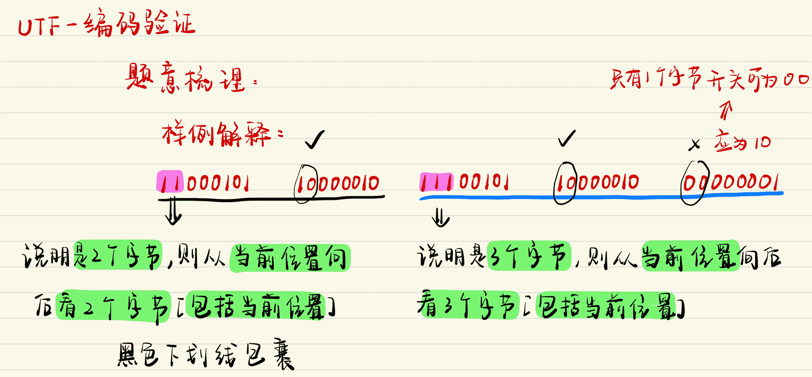

**代码**

```c++
class Solution {
public:
    int get(int x, int k) {
        return x >> k & 1;
    }
    bool validUtf8(vector<int>& data) {
        for (int i = 0; i < data.size(); i ++ ) {
            // 如果是一个字节, 则跳过
            if (!get(data[i], 7)) continue;
            int k = 0;
            // 查看当前字符占据的字节数
            while (k <= 4 && get(data[i], 7 - k)) k ++ ;
            if (k < 2 || k > 4) return false;
           	// 查看之后的k个字节[包括当前位置]
            for (int j = 1; j < k; j ++ )
                // 不能越界
                if (i + j < data.size() && get(data[i + j], 7) && !get(data[i + j], 6))
                    continue;
                else return false;
            i += k - 1;
        }
        return true;
    }
};
```

**时间复杂度**

$O(n)$

**空间复杂度**

$O(1)$

**标签**

`阅读理解题`

**缝合怪**


## 表达式求值

### [LeetCode 224. 基本计算器](https://leetcode-cn.com/problems/basic-calculator/)

**题目描述**

> 给你一个字符串表达式 s ，请你实现一个基本计算器来计算并返回它的值。

**示例 1**

> 输入：`s = "1 + 1"`
> 输出：`2`

**示例 2**

> 输入：`s = " 2-1 + 2 "`
> 输出：`3`

**示例 3**

> 输入：`s = "(1+(4+5+2)-3)+(6+8)"`
> 输出：`23`

**提示**

> + $1 <= s.length <= 3 * 10^5$
> + `s` 由数字`、'+'、'-'、'('、')'、`和 `' '` 组成
> + `s` 表示一个有效的表达式

**题解**

> 1. 使用两个栈，一个是数字栈 `num` ，另一个是字符串栈 `oper`
> 2. 遍历每一个字符，分以下五种情况：
>     + 如果遇到空格，直接 `continue`
>     + 如果遇到`(`，直接入栈 `oper`
>     + 如果遇到 `)` ，计算答案，直到 `oper` 栈顶为 `(` 的时候停止
>     + 如果遇到数字，则计算数字的大小，入栈 `num`<font style="color:red">**（注意数字不一定是一位数）**</font>
>     + 如果遇到 `+`，`-`，则继续进行如下判断：
>         + 如果当前值是第一位，例如 `+2`，则为了方便计算，在前面补一个 `0` 即可
>         + 如果当前位不是第一位并且前一位是括号，例如 `(+2)`，则为了方便，补一个 `0` 即可
>         + 除上述情况外，正常计算，直到栈为空或者遇到 `(` 的时候停止
> 3. 如果栈中还有运算符，则继续计算，直到栈为空，答案就是栈顶元素

**代码**

```c++
class Solution {
public:
    stack<int> num;
    stack<char> oper;
    void eval() {
        int b = num.top(); num.pop();
        int a = num.top(); num.pop();
        char op = oper.top(); oper.pop();
        if (op == '+') num.push(a + b);
        else num.push(a - b);
        return;
    }
    int calculate(string s) {
        for (int i = 0; i < s.size(); i ++ ) {
            if (s[i] == ' ') continue;
            else if (s[i] == '(') oper.push(s[i]);
            else if (s[i] == ')') {
                while (oper.top() != '(') eval();
                // 弹出左括号
                oper.pop();
            }
            else if (isdigit(s[i])) {
                int sum = 0;
                while (i < s.size() && isdigit(s[i]))
                    sum = sum * 10 + (s[i ++ ] - '0');
                num.push(sum);
                i --;
            }
            else {
                // 处理特殊情况，如 +2 + a 或者 (-2 + a) 等类似情况
                if (!i || s[i - 1] == '(') num.push(0);
                while (oper.size() && oper.top() != '(') eval();
                // 将当前括号入栈
                oper.push(s[i]);
            }
        }
        while (oper.size()) eval();
        return num.top();
    }
};
```

**标签**

`栈`、`表达式求值`

### [LeetCode 282. 给表达式添加运算符](https://leetcode-cn.com/problems/expression-add-operators/)

**题目描述**

> 给定一个仅包含数字 `0-9` 的字符串 `num` 和一个目标值整数 `target` ，在 `num` 的数字之间添加 二元 运算符（不是一元）`+`、`-` 或 `*` ，返回所有能够得到目标值的表达式。

**示例 1**

> 输入: `num = "123", target = 6`
> 输出: `["1+2+3", "1*2*3"] `

**示例 2**

> 输入: `num = "232", target = 8`
> 输出: `["2*3+2", "2+3*2"]`

**示例 3**

> 输入: `num = "105", target = 5`
> 输出: `["1*0+5","10-5"]`

**示例 4**

> 输入: `num = "00", target = 0`
> 输出: `["0+0", "0-0", "0*0"]`

**示例 5**

> 输入: `num = "3456237490", target = 9191`
> 输出: `[]`

**提示**

> + $1 <= num.length <= 10$
> + $num 仅含数字$
> + $-2^{31} <= target <= 2^{31} - 1$

**手写稿**

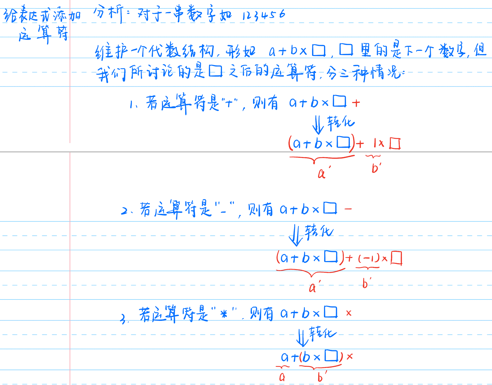

**代码**

```c++
class Solution {
public:
    typedef long long LL;
    string path;
    vector<string> res;
    // 保证答案不越界，但是不保证中间过程不越界
    void dfs(string& num, int u, int len, LL a, LL b, LL target) {
        if (u == num.size())
            if (a == target) {
                res.push_back(path.substr(0, len - 1));
                return;
            }
        LL c = 0;
        for (int i = u; i < num.size(); i ++ ) {
            c = c * 10 + (num[i] - '0');
            path[len ++ ] = num[i];
            // 枚举第len位填写的运算符
            // +
            path[len] = '+';
            dfs(num, i + 1, len + 1, a + b * c, 1, target);
            if (i + 1 < num.size()) {
                // -
                path[len] = '-';
                dfs(num, i + 1, len + 1, a + b * c, -1, target);
                // *
                path[len] = '*';
                dfs(num, i + 1, len + 1, a, b * c, target);
            }
            // 不能有前导0
            if (num[u] == '0') return;
        }
        return;
    }
    vector<string> addOperators(string num, int target) {
        // 扩容
        path.resize(100);
        /*
        	参数1: num字符串
        	参数2: 当前枚举的是num中的哪位字符
        	参数3: 答案字符串的长度
        	参数4: a的值
        	参数5: b的值
        	参数6: 目标值
        */
        dfs(num, 0, 0, 0, 1, target);
        return res;
    }
};
```

**标签**

`dfs`、`表达式求值`

## 高精度

### 注意事项【必看】

>   1.   分析如下代码【以高精度加法为例】
>
>        ```c++
>        vector<int> add(vector<int>& A, vector<int>& B) {
>            vector<int> C;
>            // 进位
>            int t = 0;
>            for (int i = 0, j = 0; i < A.size() || j < B.size(); i ++, j ++ ) {
>                if (i < A.size()) t += A[i];
>                if (j < B.size()) t += B[i];
>                C.push_back(t % 10);
>                t /= 10;
>            }
>            // 如果产生位数的变化，即类似于99 + 1，故还需处理进位
>            while (t) {
>                C.push_back(t % 10);
>                t /= 10;
>            }
>            // 逆序返回
>            return vector<int>(C.rbegin(), C.rend());
>        }
>        ```
>
>        +   问题如下
>
>            +   产生进位的时候，为啥要使用 `while(t)` 而不是 `if(t)` ?
>
>                >   1.   明确目标：`C` 中的<font style = "color: red">**每一个元素**</font>只能是<font style = "color: red">**一位数**</font>
>                >
>                >        +   为啥 `C` 中的每一个元素必须只能是一位数？
>                >
>                >            >   假设`A` 和 `B` 中的每一个元素有可能不是一位数，例如，`A = {2e9}, B = {2e9}`，调用 `add(A, B)`，此时，答案应为 ` 4e9`，由于，`C` 中的每一个元素都是 `int` 类型，此时就越界了，无法计算出正确答案，因此，`C` 中的每一个元素必须只能是一位数，这样就不会产生越界的问题，`long long` 和 `double` 等其他类型，都是会产生相似的问题

### [AcWing 791. 高精度加法](https://www.acwing.com/problem/content/793/)

**题目描述**

>   给定两个正整数（不含前导 `0`），计算它们的和。

**输入格式**

>   共两行，每行包含一个整数。

**输出格式**

>   共一行，包含所求的和。

**数据范围**

>   +   $1≤整数长度≤100000$

**输入样例**

```c++
12
23
```

**输出样例**

```c++
35
```

**手写稿**

>   1.   模拟手算即可
>
>   2.   注意事项：
>
>        +   数字需要<font style = "color: red">**倒着存储**</font>，原因如下
>
>            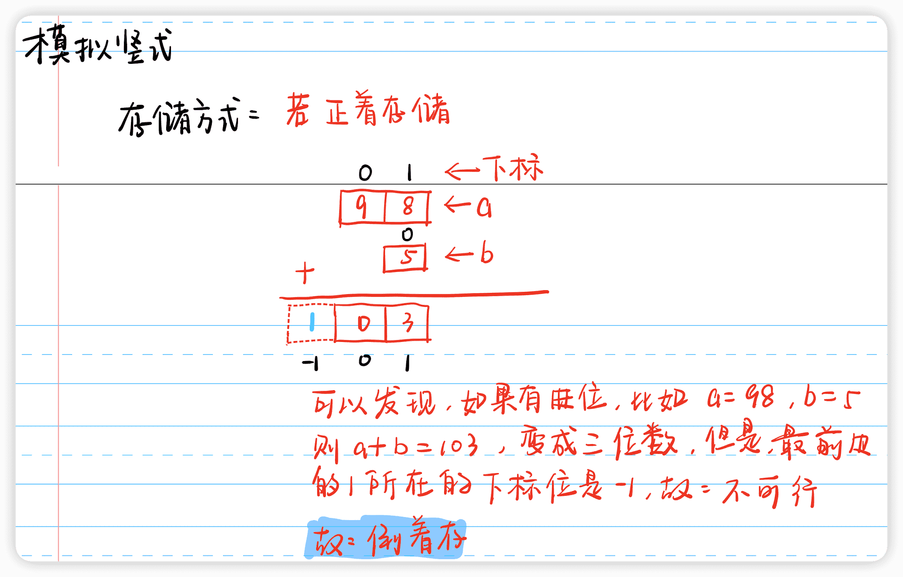

**代码一：`vector` 存储**

```c++
#include <iostream>
#include <vector>
using namespace std;
string a, b;
vector<int> A, B;
vector<int> add(vector<int>& A, vector<int>& B) {
    vector<int> C;
    // 进位
    int t = 0;
    for (int i = 0, j = 0; i < A.size() || j < B.size(); i ++, j ++ ) {
        if (i < A.size()) t += A[i];
        if (j < B.size()) t += B[i];
        C.push_back(t % 10);
        t /= 10;
    }
    // 如果产生位数的变化，即类似于99 + 1，故还需处理进位
    while (t) {
        C.push_back(t % 10);
        t /= 10;
    }
    // 逆序返回
    return vector<int>(C.rbegin(), C.rend());
}
int main() {
    cin >> a >> b;
    for (int i = a.size() - 1; i >= 0; i -- ) A.push_back(a[i] - '0');
    for (int i = b.size() - 1; i >= 0; i -- ) B.push_back(b[i] - '0');
    vector<int> C = add(A, B);
    for (int i = 0; i < C.size(); i ++ ) cout << C[i];
    return 0;
}
```

**代码二：数组存储**

```c++
#include <iostream>
using namespace std;
const int N = 100005;
string a, b;
// 记录A数组长度，B数组长度和C数组长度
int n, m, idx;
int A[N], B[N], C[N];
void add(int A[], int B[]) {
    // 进位
    int t = 0;
    for (int i = 0, j = 0; i < n || j < m; i ++, j ++ ) {
        if (i < n) t += A[i];
        if (j < m) t += B[i];
        C[idx ++ ] = t % 10; 
        t /= 10;
    }
    // 如果产生位数的变化，即类似于99 + 1，故还需处理进位
    while (t) {
        C[idx ++ ] = t % 10;
        t /= 10;
    }
    // 逆序
    for (int i = 0; i < idx / 2; i ++ ) swap(C[i], C[idx - 1 - i]);
    return;
}
int main() {
    cin >> a >> b;
    n = a.size(), m = b.size();
    for (int i = n - 1; i >= 0; i -- ) A[n - 1 - i] = a[i] - '0';
    for (int i = m - 1; i >= 0; i -- ) B[m - 1 - i] = b[i] - '0';
    add(A, B);
    for (int i = 0; i < idx; i ++ ) cout << C[i];
    return 0;
}
```

**标签**

`高精度`、`高精度加法`

### [AcWing 792. 高精度减法](https://www.acwing.com/problem/content/794/)

**题目描述**

>   给定两个正整数（不含前导 `0`），计算它们的差，计算结果可能为负数。

**输入格式**

>   共两行，每行包含一个整数。

**输出格式**

>   共一行，包含所求的差。

**数据范围**

>   +   $1≤整数长度≤10^5$

**输入样例**

```c++
32
11
```

**输出样例**

```c++
21
```

**手写稿**

>   <font style = "color: red">**注意事项：**</font>
>
>   +   为了使得高精度模板统一，故<font style="color: red">**倒着存储**</font>
>   +   计算 `A - B` 的时候，为了写代码方便，规定 `A >= B`（手写写个判断函数 `cmp` ）
>   +   其余细节部分体现在代码中

**代码**

```c++
#include <iostream>
#include <vector>
using namespace std;
string a, b;
vector<int> A, B;
bool cmp(string &a, string &b) {
    if (a.size() != b.size()) return a.size() >= b.size();
    return a >= b;
}
vector<int> sub(vector<int>& A, vector<int>& B) {
    vector<int> C;
    int t = 0;
    // 因为A >= B，因此，A的长度一定大于等于B的长度
    for (int i = 0; i < A.size(); i ++ ) {
        t = A[i] - t;
        // 如果当前没有到达B的结尾
        if (i < B.size()) t -= B[i];
        C.push_back((t + 10) % 10);
        if (t >= 0) t = 0;
        else t = 1;
    }
    while (t) C.push_back(t % 10), t /= 10;
    // 去掉前导0
    while (C.size() > 1 && C.back() == 0) C.pop_back();
    return vector<int>(C.rbegin(), C.rend());
}
int main() {
    cin >> a >> b;
    for (int i = a.size() - 1; i >= 0; i -- ) A.push_back(a[i] - '0');
    for (int i = b.size() - 1; i >= 0; i -- ) B.push_back(b[i] - '0');
    vector<int> C;
    if (cmp(a, b)) // 如果 A >= B
        C = sub(A, B);
    else { // 如果 A < B
        cout << "-";
        C = sub(B, A);
    }
    for (int i = 0; i < C.size(); i ++ ) cout << C[i];
    return 0;
}
```

**标签**

`高精度`、`高精度减法`

### [AcWing 793. 高精度乘法](https://www.acwing.com/problem/content/795/)

**题目描述**

>   给定两个非负整数（不含前导 `0`） `A` 和 `B`，请你计算 `A×B` 的值。

**输入格式**

>   共两行，第一行包含整数 `A`，第二行包含整数 `B`。

**输出格式**

>   共一行，包含 `A×B` 的值。

**数据范围**

>   +   $1≤A的长度≤100000,$
>   +   $0≤B≤10000$

**输入样例**

```c++
2
3
```

**输出样例**

```c++
6
```

**手写稿**

>   1.   为了写代码方便以及格式统一<font style = "color: red">**倒着存储**</font>

**代码**

```c++
#include <iostream>
#include <vector>
using namespace std;
string a;
int b;
vector<int> A;
vector<int> mul(vector<int>& A, int b) {
    vector<int> C;
    int t = 0;
    for (int i = 0; i < A.size(); i ++ ) {
        t += A[i] * b;
        C.push_back(t % 10);
        t /= 10;
    }
    while (t) C.push_back(t % 10),t /= 10;
    // 处理类似 1000 * 0 的情况
    // 如果答案是0，则只保留一个
    while (C.size() > 1 && C.back() == 0) C.pop_back();
    return vector<int>(C.rbegin(), C.rend());
}
int main() {
    cin >> a >> b;
    for (int i = a.size() - 1;i >= 0; i -- ) A.push_back(a[i] - '0');
    vector<int> C = mul(A, b);
    for (int i = 0; i < C.size(); i ++ ) cout << C[i];
    return 0;
}
```

**标签**

`高精度`、`高精度乘法`

### [AcWing 794. 高精度除法](https://www.acwing.com/problem/content/796/)

**题目描述**

>   给定两个非负整数（不含前导 `0`） `A，B`，请你计算 `A/B` 的商和余数。

**输入格式**

>   共两行，第一行包含整数 `A`，第二行包含整数 `B`。

**输出格式**

>   共两行，第一行输出所求的商，第二行输出所求余数。

**数据范围**

>   +   $1≤A的长度≤100000,$
>   +   $1≤B≤10000,$
>   +   $B 一定不为 0$

**输入样例**

```c++
7
2
```

**输出样例**

```c++
3
1
```

**手写稿**

>   1.   <font style = "color: red">**注意事项：**</font>
>        +   除法是<font style = "color: red">正着存储</font>，因为除法是从<font style = "color: red">最高位</font>开始计算，而加减乘都是从<font style = "color: red">最低位</font>开始计算
>        +   其余细节在代码中

**代码**

```c++
#include <iostream>
#include <vector>
using namespace std;
string a;
int b, re;
vector<int> A;
vector<int> divide(vector<int>& A, int b) {
    vector<int> C;
    int t = 0;
    for (int i = 0; i < A.size(); i ++ ) {
        t = t * 10 + A[i];
        // /b和%b不是/10和%10
        C.push_back(t / b);
        t %= b;
    }
    re = t;
    // 反转方便除去千岛0
    C = vector<int>(C.rbegin(), C.rend());
    while (C.size() > 1 && C.back() == 0) C.pop_back();
    // 再次反转
    return vector<int>(C.rbegin(), C.rend());
}
int main() {
    cin >> a >> b;
    // 正着存储
    for (int i = 0; i < a.size(); i ++ ) A.push_back(a[i] - '0');
    vector<int> C = divide(A, b);
    for (int i = 0; i < C.size(); i ++ ) cout << C[i];
    cout << endl << re << endl;
    return 0;
}
```

**标签**

`高精度`、`高精度除法`

# 数学

##  普通数学

### [LeetCode 223. 矩形面积](https://leetcode-cn.com/problems/rectangle-area/)

**题目描述**

> 给你 **二维** 平面上两个 **由直线构成且边与坐标轴平行/垂直** 的矩形，请你计算并返回两个矩形覆盖的总面积。
>
> 每个矩形由其 **左下** 顶点和 **右上** 顶点坐标表示：
>
> 第一个矩形由其左下顶点 `(ax1, ay1)` 和右上顶点 `(ax2, ay2)` 定义。
> 第二个矩形由其左下顶点 `(bx1, by1)` 和右上顶点 `(bx2, by2)` 定义。

**示例 1**


> 输入：`ax1 = -3, ay1 = 0, ax2 = 3, ay2 = 4, bx1 = 0, by1 = -1, bx2 = 9, by2 = 2`
> 输出：`45`

**示例 2**

> 输入：`ax1 = -2, ay1 = -2, ax2 = 2, ay2 = 2, bx1 = -2, by1 = -2, bx2 = 2, by2 = 2`
> 输出：`16`

**提示**

> $-10^4\;<=\;ax1,\;ay1,\;ax2,\;ay2,\;bx1,\;by1,\;bx2,\;by2\;<=\;10^4$

**手写稿**


**代码**

```c++
class Solution {
public:
    int computeArea(int ax1, int ay1, int ax2, int ay2, int bx1, int by1, int bx2, int by2) {
        int X = max(0, min(ax2, bx2) - max(ax1, bx1));
        int Y = max(0, min(ay2, by2) - max(ay1, by1));
        return (ax2 - ax1) * (ay2 - ay1) + (bx2 - bx1) * (by2 - by1) - X * Y;
    }
};
```

**标签**

`几何`、`数学`

### [LeetCode 264. 丑数 II](https://leetcode-cn.com/problems/ugly-number-ii/)

**题目描述**

> 给你一个整数 `n` ，请你找出并返回第 `n` 个丑数 。
>
> 丑数 就是只包含质因数 `2、3` 和/或 `5` 的正整数。

**示例 1**

> 输入：`n = 10`
> 输出：`12`
> 解释：`[1, 2, 3, 4, 5, 6, 8, 9, 10, 12]` 是由前 `10` 个丑数组成的序列。

**示例 2**

> 输入：`n = 1`
> 输出：`1`
> 解释：`1` 通常被视为丑数。

**提示**

> $1\;\leq\;n\;\leq\;1690$

**题解**

> 1. 若 `a` 是<font style ="color: red">**丑数**</font>，则 `a * 2` 也是丑数
>
>     + $$
>         若a是丑数，则a可以表示成 \\
>         a = p_1^{n}\;*\;p_2^{m}\;*\;p_3^{k}，\;其中p_1为2，p_2为3，p_3为5 \\
>         现在来看\;a\;*\;p = p_1^{n}\;*\;p_2^{m}\;*\;p_3^{k}\;*\;p，其中p为2，3，或5 \\
>         证毕
>         $$
>
> 2. 三指针做法

**手写稿**

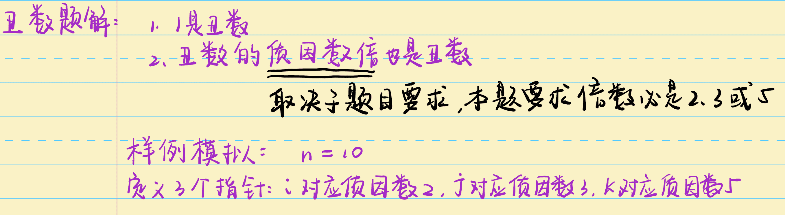

**解题步骤**

> 1. 初始丑树数组等于 `q = [1]`，定义三个指针，`i，j，k` 分别对应质因数 `2` 的集合，`3` 的集合，`5` 的集合，初始值为 `i = j = k = 0`
>     + 第一步
>         + `t = min(q[i] * 2, q[j] * 3, q[k] * 5) = min(1 * 2, 1 * 3, 1 * 5) = min(2,  3, 5) = 2`
>         + `t` 取值为 `2`，对应的是 `i` 指针，因此，`i ++`
>         + 此时，`q = [1, 2], i = 1, j = k = 0`
>     + 第二步
>         + `t = min(q[i] * 2, q[j] * 3, q[k] * 5) = min(4, 3, 5) = 3`
>         + `t` 取值为 `3`，对应的是 `j` 指针，因此，`j ++`
>         + 此时，`q = [1, 2, 3], i = 1, j = 1, k = 0`
>     + 第三步
>         + `t = min(q[i] * 2, q[j] * 3, q[k] * 5) = min(4, 6, 5) = 4`
>         + `t` 取值为 `4`，对应的是 `i` 指针，因此，`i ++`
>         + 此时，`q = [1, 2, 3, 4], i = 2, j = 1, k = 0`
>     + 第四步
>         + `t = min(q[i] * 2, q[j] * 3, q[k] * 5) = min(6, 6, 5) = 5`
>         + `t` 取值为 `5`，对应的是 `k` 指针，因此，`k ++`
>         + 此时，`q = [1, 2, 3, 4, 5], i = 2, j = 1, k = 1`
>     + 第五步
>         + `t = min(q[i] * 2, q[j] * 3, q[k] * 5) = min(6, 6, 10) = 6`
>         + `t` 取值为 `6`，对应的是 `i` 和 `j` 指针，因此，`i ++, j ++`
>             + 注意：如果有相等的，指针都需要进行移动，而不能只移动一个指针
>         + 此时，`q = [1, 2, 3, 4, 5, 6], i = 3, j = 2, k = 1`
>     + 依次类推

**代码**

```c++
class Solution {
public:
    int nthUglyNumber(int n) {
        vector<int> q(1, 1);
        for (int i = 0, j = 0, k = 0; q.size() < n; ) {
            int t = min(q[i] * 2, min(q[j] * 3, q[k] * 5));
            q.push_back(t);
            // 不能使用 if else 因为会有相同值
            if (q[i] * 2 == t) i ++;
            if (q[j] * 3 == t) j ++;
            if (q[k] * 5 == t) k ++;
        }
        return q.back();
    }
};
```

**标签**

`三路归并`、`归并排序`

### [AcWing 313. 超级丑数](https://leetcode-cn.com/problems/super-ugly-number/)

**题目描述**

> 超级丑数 是一个正整数，并满足其所有质因数都出现在质数数组 `primes` 中。
>
> 给你一个整数 `n` 和一个整数数组 `primes` ，返回第 `n` 个 超级丑数 。
>
> 题目数据保证第 `n` 个 超级丑数 在 `32-bit` 带符号整数范围内。

**示例 1**

> 输入：`n = 12, primes = [2,7,13,19]`
> 输出：`32`
> 解释：给定长度为 `4` 的质数数组 `primes = [2,7,13,19]`，前 `12` 个超级丑数序列为：`[1,2,4,7,8,13,14,16,19,26,28,32]` 。

**示例 2**

> 输入：`n = 1, primes = [2,3,5]`
> 输出：`1`
> 解释：`1` 不含质因数，因此它的所有质因数都在质数数组 `primes = [2,3,5]` 中。

**提示**

> + $1 <= n <= 10^6$
> + $1 <= primes.length <= 100$
> + $2 <= primes[i] <= 1000$
> + $题目数据 保证 primes[i] 是一个质数$
> + $primes 中的所有值都 互不相同 ，且按 递增顺序 排列$

**解题步骤**

> 1. 同 `LeetCode 264 丑树 II`
>
> 2. 唯一不同的是由 `3` 指针变成 `k` 指针
>
> 3. 具体实现的细节
>
>     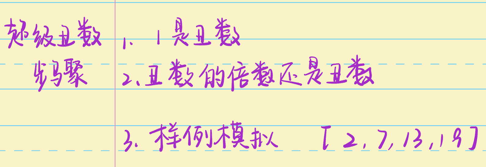
>
>     > 1. 三指针有一个寻找最小值的操作 `min(q[i] * 2, min(q[j] * 3, q[k] * 5))`，在本题中，将寻找 `k` 个指针的最小值操作，换成堆（优先队列来实现）
>     > 2. 优先队列中维护两个变量，分别为 `k` 个指针对应的值以及下标
>     > 3. 考虑一个问题，如何确定某个数 `x` 是由哪个质数迭代而来的
>     >     + 对于丑树 $S_p$ 来说，其下一个数为 $k = S_p * p$ ，因此，当前质数 $p = k / S_p$
>     > 4. 如果还是有些许模糊，手动模拟样例即可

**代码**

```c++
class Solution {
public:
    typedef long long LL;
    typedef pair<LL, LL> PLL;
    int nthSuperUglyNumber(int n, vector<int>& primes) {
        // 定义小根堆
        priority_queue<PLL, vector<PLL>, greater<PLL>> heap;
        // 含义在图示手写稿
        for (auto& x : primes) heap.push({x, 1});
        vector<int> q(n + 5);
        q[1] = 1;
        for (int i = 2; i <= n;) {
            auto tp = heap.top(); heap.pop();
            if (tp.first != q[i - 1]) q[i ++ ] = tp.first;
            int idx = tp.second, p = tp.first / q[idx];
            heap.push({(LL)p * q[idx + 1], idx + 1});
        }
        return q[n];
    }
};
```

**标签**

`优先队列`、`K路归并`

### [LeetCode 279. 完全平方数](https://leetcode-cn.com/problems/perfect-squares/)

**题目描述**

> 给定正整数 n，找到若干个完全平方数（比如 1, 4, 9, 16, ...）使得它们的和等于 n。你需要让组成和的完全平方数的个数最少。
>
> 给你一个整数 n ，返回和为 n 的完全平方数的 最少数量 。
>
> 完全平方数 是一个整数，其值等于另一个整数的平方；换句话说，其值等于一个整数自乘的积。例如，1、4、9 和 16 都是完全平方数，而 3 和 11 不是。

 **示例 1**

> 输入：`n = 12`
> 输出：`3` 
> 解释：`12 = 4 + 4 + 4`

**示例 2**

> 输入：`n = 13`
> 输出：`2`
> 解释：`13 = 4 + 9`

**提示**

> $1 <= n <= 10^4$

**法一:动态规划**

**手写稿**


**代码**

```c++
class Solution {
public:
    int numSquares(int n) {
        vector<int> f(n + 5, 1e9);
        f[0] = 0;
        for (int i = 1; i <= n; i ++ )
            for (int j = 1; j <= i / j; j ++ )
                f[i] = min(f[i], f[i - j * j] + 1);
        return f[n];
    }
};
```

**方法二:数学**

**步骤**

> 1. [四平方和定理](https://baike.baidu.com/item/%E5%9B%9B%E5%B9%B3%E6%96%B9%E5%92%8C%E5%AE%9A%E7%90%86):每个正整数均可表示为4个整数的平方和,定义此题的上限,答案只能为 `1, 2, 3, 4`
> 2. [勒让德三平方和定理](https://en.wikipedia.org/wiki/Legendre%27s_three-square_theorem):当 $n=4^a(8b+7)$时，`n` 不能写成 `3` 个数的平方和
> 3. 枚举答案是否为 `2`

**代码**

```c++
class Solution {
public:
    bool check(int n) {
        int r = sqrt(n);
        return r * r == n;
    }
    int numSquares(int n) {
        // 判断是否是一个数字
        if (check(n)) return 1;
        // 判断是否是两个数字
        for (int i = 1; i <= n / i; i ++ )
            if (check(n - i * i)) return 2;
        // 判断是否是四个数字
        while (n % 4 == 0) n /= 4;
        if (n % 8 == 7) return 4;
        return 3;
    }
};
```

**标签**

`动态规划`、`数学`

### [LeetCode 233. 数字 1 的个数](https://leetcode-cn.com/problems/number-of-digit-one/)

**题目描述**

> 给定一个整数 `n`，计算所有小于等于 `n` 的非负整数中数字 `1` 出现的个数。

**示例 1**

> 输入：`n = 13`
> 输出：`6`

**示例 2**

> 输入：`n = 0`
> 输出：`0`

**提示**

> + $0 <= n <= 10^9$

**题解**

> 1. 将数字分解成每个数字，存放到 vector 里面，注意顺序问题
> 2. 从前往后依次遍历每个数字，判断当前位置上 1 的个数累加即可

**手写稿**

.png)

**代码**

```c++
class Solution {
public:
    int countDigitOne(int n) {
        vector<int> num;
        while (n) {
            num.push_back(n % 10);
            n /= 10;
        }
        // 注意顺序问题
        reverse(num.begin(), num.end());
        int res = 0;
        for (int i = 0; i < num.size(); i ++ ) {
            int left = 0, right = 0, p = 1;
            for (int j = 0; j < i; j ++ ) left = left * 10 + num[j];
            for (int j = i + 1; j < num.size(); j ++ )
                right = right * 10 + num[j], p *= 10;
            if (num[i] == 0) res += left * p;
            else if (num[i] == 1) res += left * p + right + 1;
            else res += (left + 1) * p;
        }
        return res;
    }
};
```

**标签**

`数学`

### [LeetCode 231. 2 的幂](https://leetcode-cn.com/problems/power-of-two/)

**题目描述**

> 给你一个整数 `n`，请你判断该整数是否是 `2` 的幂次方。如果是，返回 `true` ；否则，返回 `false` 。
>
> 如果存在一个整数 `x`  使得 `n == 2x` ，则认为 `n` 是 `2` 的幂次方。

**示例 1**

> 输入：`n = 1`
> 输出：`true`
> 解释：$2^0 = 1$

**示例 2**

> 输入：`n = 16`
> 输出：`true`
> 解释：$2^4 = 16$

**示例 3**

> 输入：`n = 3`
> 输出：`false`

**示例 4**

> 输入：`n = 4`
> 输出：`true`

**示例 5**

> 输入：`n = 5`
> 输出：`false`

**提示**

> + $-2^{31} <= n <= 2^{31} - 1$

**进阶**

> 你能够不使用循环/递归解决此问题吗？

**方法一：对数**

**代码**

```c++
class Solution {
public:
    bool isPowerOfTwo(int n) {
        if (n <= 0) return false;
        return (log2(n) - int(log2(n))) == 0;
    }
};
```

**方法二：位运算**

**解析**

> 1. 一个数字 `x` 如果是 `2` 的幂，则说明 `x` 的二进制表示为 `000001000000`
> 2. `lowbit` 计算最后一位 `1` 的大小，判断是否和 `x` 相等即可

**代码**

```c++
class Solution {
public:
    bool isPowerOfTwo(int n) {
        if (n <= 0) return false;
        return (n & -n) == n;
    }
};
```

**方法三：取巧的位运算**

**解析**

> 1. 由<a href="https://baike.baidu.com/item/%E7%AE%97%E6%9C%AF%E5%9F%BA%E6%9C%AC%E5%AE%9A%E7%90%86/10920095">算术基本定理</a>可知，任意自然数都可以唯一分解为若干个质数的乘积，数 `x` 若是 `2` 的幂，则 `x` 的质因数只有 `2`，除此之外，不存在其他的质因数
>     + 反证法
>         + 如果 `x` 的质因数除了 `2` 之外，还有质因数 `p`，则 `p` 一定不能被分解，因为 `p` 也是质数
> 2. 找出最大的只含有 `2` 的质因子的数 `x`，不难发现，所有满足质因子只有 `2` 的数均是 `x` 的因子

**代码**

```c++
class Solution {
public:
    bool isPowerOfTwo(int n) {
        if (n <= 0) return false;
        return (1 << 30) % n == 0;
    }
};
```

**标签**

`对数`、`位运算`

### [LeetCode 326. 3 的幂](https://leetcode-cn.com/problems/power-of-three/)

**题目描述**

> 给定一个整数，写一个函数来判断它是否是 `3` 的幂次方。如果是，返回 `true` ；否则，返回 `false` 。
>
> 整数 `n` 是 `3` 的幂次方需满足：存在整数 `x` 使得 `n == 3x`

**示例 1**

> 输入：`n = 27`
> 输出：`true`

**示例 2**

> 输入：`n = 0`
> 输出：`false`

**示例 3**

> 输入：`n = 9`
> 输出：`true`

**示例 4**

> 输入：`n = 45`
> 输出：`false`

**提示**

> + $-2^{31} <= n <= 2^{31} - 1$

**方法一：对数函数**

**公式推导**

> 由于 c++ 没有以任意自然数为底的对数函数，因此，需要使用换底公式进行推导计算，证明如下：
> $$
> 换底公式：log_ab = \frac{log_cb}{log_ca}，其中c为任意自然数 \\
> 当c=10时，有log_ab = \frac{loga}{logb}
> $$

**代码**

```c++
class Solution {
public:
    bool isPowerOfThree(int n) {
        // 不能是负数
        if (n <= 0) return false;
        double x = log10(n) / log10(3);
        return x == int(x);
    }
};
```

**方法二：打表**

**步骤**

> 1. 对于任意一个数 `x` 来说，$3^x$ 可能的取值为 $3^0, 3^1, 3^2, 3^3,..., 3^n,..., 3^{+\infty}$
> 2. 取最大值 $3^n = 3 * 3 ^ {n - 1}$ ，可以看出所有比最大值小的数同时又是 `3` 的幂的数都是最大值的因子，因此，可以找出最大值，然后判断是否是最大值的因子即可
> 3. <font style="color: red">**注意：x必须得是质数，原因：<a href="https://baike.baidu.com/item/%E7%AE%97%E6%9C%AF%E5%9F%BA%E6%9C%AC%E5%AE%9A%E7%90%86/10920095">算术基本定理</a>**</font>，详细解释如下
>     + 由算术基本定理可知，任意<font style="color: red">**自然数**</font>都可以<font style="color: red">**唯一**</font>分解为若干个<font style="color: red">**质数**</font>相乘
>     + 反证法
>         + 如果数 `x` 分解之后的质数除了 `3` 之外，还有别的质数 `p`，则 `x` 一定不是 `3` 的幂，因为 `p` 也是质数，且不能再次分解
>         + 因此，如果数 `x` 是 `3` 的幂，则其质因子有且只有 `3` 才可
> 4. 找出最大的满足质因子只有 `3` 的数 `x`，不难发现，所有满足质因子只有 `3` 的数均是 `x` 的因子

**代码**

```c++
class Solution {
public:
    bool isPowerOfThree(int n) {
        if (n <= 0) return false;
        return 1162261467 % n == 0;
    }
};
```

**标签**

`对数`、`算术基本定理`、`数论`

### [LeetCode 342. 4的幂](https://leetcode-cn.com/problems/power-of-four/)

**题目描述**

> 给定一个整数，写一个函数来判断它是否是 `4` 的幂次方。如果是，返回 `true` ；否则，返回 `false` 。
>
> 整数 `n` 是 `4` 的幂次方需满足：存在整数 `x` 使得 `n == 4x`

**示例 1**

> 输入：`n = 16`
> 输出：`true`

**示例 2**

> 输入：`n = 5`
> 输出：`false`

**示例 3**

> 输入：`n = 1`
> 输出：`true`

**提示**

> + $-2^{31} <= n <= 2{31} - 1$

**进阶**

> 你能不使用循环或者递归来完成本题吗？

**方法一：对数**

**代码**

```c++
class Solution {
public:
    bool isPowerOfFour(int n) {
        if (n <= 0) return false;
        double x = log10(n) / log10(4);
        return x == int(x);
    }
};
```

**方法二：位运算**

**解析**

> 1. 如果数 `x` 是 `4` 的幂，则 `x` 也一定是 `2` 的幂，即有 $4 ^ x = (2 ^ 2)^x = (2 ^ x) ^ 2$
>     + 先对 `x` 进行开方得到 `r`，判断 $r^2$ 是否等于 `x`
>         + 不等于，返回❌
>         + 等于，判断 `r` 是否是 `2` 的幂即可

**代码**

```c++
class Solution {
public:
    bool isPowerOfFour(int n) {
        if (n <= 0) return false;
        int r = sqrt(n);
        if (r * r != n) return false;
        return (1 << 30) % n == 0;
    }
};
```

**标签**

`对数`、`位运算`

### [LeetCode 343. 整数拆分](https://leetcode-cn.com/problems/integer-break/)

**题目描述**

>   给定一个正整数 `n` ，将其拆分为 `k` 个 正整数 的和（ `k >= 2` ），并使这些整数的乘积最大化。
>
>   返回 你可以获得的最大乘积 。

**示例 1**

>   输入: `n = 2`
>   输出: `1`
>   解释: `2 = 1 + 1, 1 × 1 = 1`。

**示例 2**

>   输入: `n = 10`
>   输出: `36`
>   解释: `10 = 3 + 3 + 4, 3 × 3 × 4 = 36`。

**提示**

>   +   $2 <= n <= 58$

**手写稿**

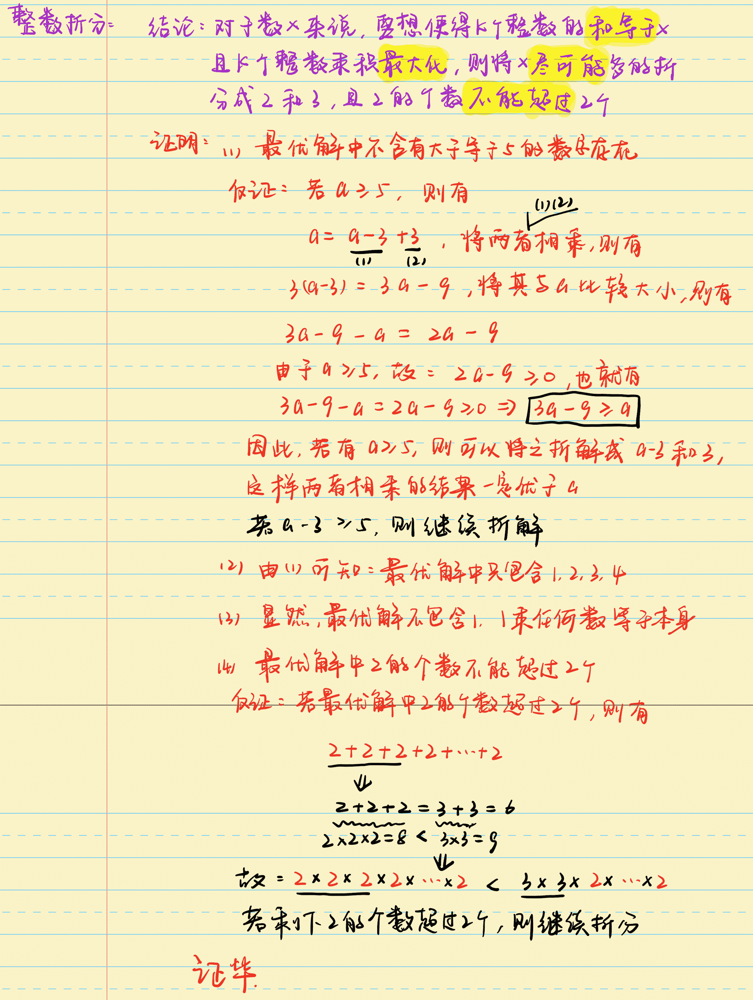

**代码**

```c++
class Solution {
public:
    int integerBreak(int n) {
        if (n <= 3) return 1 * (n - 1);
        int res = 1;
        while (n >= 5) n -= 3, res *= 3;
        return res * n;
    }
};
```

**标签**

`数学`

### [LeetCode 357. 计算各个位数不同的数字个数](https://leetcode-cn.com/problems/count-numbers-with-unique-digits/)

**题目描述**

>   给定一个非负整数 `n`，计算各位数字都不同的数字 `x` 的个数，其中 $0 ≤ x < 10^n$ 。

**示例**

>   输入: `2`
>   输出: `91`
>   解释: 答案应为除去 `11,22,33,44,55,66,77,88,99` 外，在 `[0,100)` 区间内的所有数字。

**手写稿**

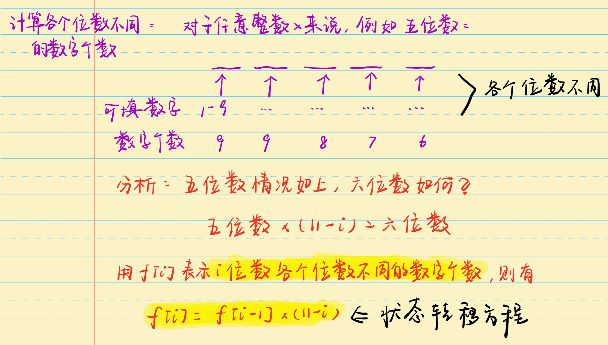

**代码**

```c++
class Solution {
public:
    int countNumbersWithUniqueDigits(int n) {
        // 0 ～ 9 共10个数字，n > 10 无意义
        n = min(n, 10);
        vector<int> f(n + 1);
        // 0 特判
        if (n == 0) return 1;
        f[1] = 9;
        for (int i = 2; i <= n; i ++ ) f[i] = f[i - 1] * (11 - i);
        int res = 0;
        for (int i = 1; i <= n; i ++ ) res += f[i];
        // 加上 0 这个数字
        return res + 1;
    }
};
```

**标签**

`排列组合`、`数学`、`动态规划`

## 数论相关

### [AcWing 319. 灯泡开关](https://leetcode-cn.com/problems/bulb-switcher/)

**题目描述**

> 初始时有 `n` 个灯泡处于关闭状态。第一轮，你将会打开所有灯泡。接下来的第二轮，你将会每两个灯泡关闭第二个。
>
> 第三轮，你每三个灯泡就切换第三个灯泡的开关（即，打开变关闭，关闭变打开）。第 `i` 轮，你每 `i` 个灯泡就切换第 `i` 个灯泡的开关。直到第 `n` 轮，你只需要切换最后一个灯泡的开关。
>
> 找出并返回 `n` 轮后有多少个亮着的灯泡。 

**示例 1**


> 输入：`n = 3`
> 输出：`1 `
> 解释：
> 初始时, 灯泡状态 [关闭, 关闭, 关闭].
> 第一轮后, 灯泡状态 [开启, 开启, 开启].
> 第二轮后, 灯泡状态 [开启, 关闭, 开启].
> 第三轮后, 灯泡状态 [开启, 关闭, 关闭]. 
>
> 你应该返回 `1`，因为只有一个灯泡还亮着。

**示例 2**

> 输入：`n = 0`
> 输出：`0`

**示例 3**

> 输入：`n = 1`
> 输出：`1`

**提示**

> + $0 <= n <= 10^9$

**手写稿**

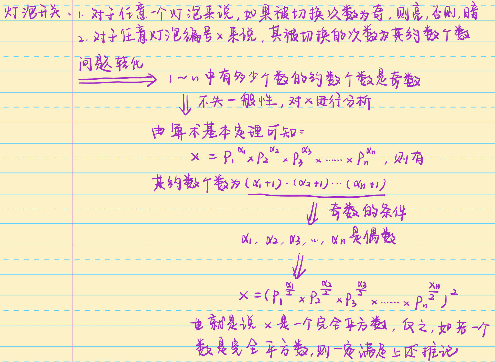

**代码**

```c++
class Solution {
public:
    int bulbSwitch(int n) {
        // 寻找1～n中完全平方数的个数
        return sqrt(n);
    }
};
```

**标签**

`完全平方数`、`脑筋急转弯`、`数论`

### [LeetCode 365. 水壶问题](https://leetcode-cn.com/problems/water-and-jug-problem/)

>   有两个水壶，容量分别为 `jug1Capacity` 和 `jug2Capacity` 升。水的供应是无限的。确定是否有可能使用这两个壶准确得到 `targetCapacity` 升。
>
>   如果可以得到 `targetCapacity` 升水，最后请用以上水壶中的一或两个来盛放取得的 `targetCapacity` 升水。
>
>   你可以：
>
>   装满任意一个水壶
>   清空任意一个水壶
>   从一个水壶向另外一个水壶倒水，直到装满或者倒空

**示例 1**

>   输入: `jug1Capacity = 3, jug2Capacity = 5, targetCapacity = 4`
>   输出: `true`
>   解释：来自著名的 ["Die Hard"](https://www.youtube.com/watch?v=BVtQNK_ZUJg)

**示例 2**

>   输入: `jug1Capacity = 2, jug2Capacity = 6, targetCapacity = 5`
>   输出: `false`

**示例 3**

>   输入: `jug1Capacity = 1, jug2Capacity = 2, targetCapacity = 3`
>   输出: `true`

**提示**

>   +   $1 <= jug1Capacity, jug2Capacity, targetCapacity <= 10^6$

**手写稿**

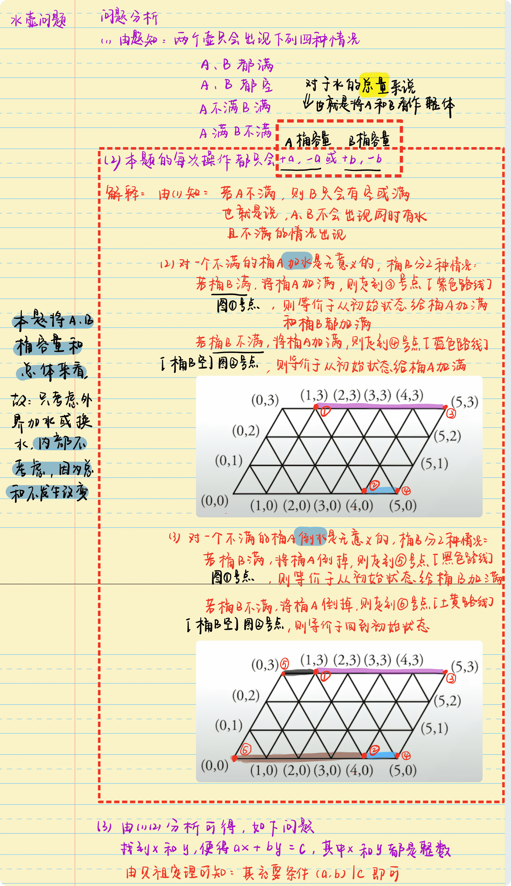

**代码**

```c++
class Solution {
public:
    int gcd(int a, int b) {
        if (!b) return a;
        return gcd(b, a % b);
    }
    bool canMeasureWater(int a, int b, int c) {
        if (a + b < c) return false;
        return c % gcd(a, b) == 0; 
    }
};
```

**标签**

`贝祖定理`、`数论`、`欧几里得算法`

### [AcWing 4199. 公约数](https://www.acwing.com/problem/content/4202/)

**题目描述**

>   给定两个正整数 `a` 和 `b`。
>
>   你需要回答 `q` 个询问。
>
>   每个询问给定两个整数 `l,r`，你需要找到**最大**的整数 `x`，满足：
>
>   1.  `x` 是 `a` 和 `b` 的公约数。
>   2.  `l ≤ x ≤ r`。

**输入格式**

>   第一行包含两个整数 `a,b`。
>
>   第二行包含一个整数 `q`。
>
>   接下来 `q` 行，每行包含两个整数 `l,r`。

**输出格式**

>   每个询问输出一行答案，即满足条件的最大的 `x`，如果询问无解，则输出 `−1`。

**数据范围**

>   +   $前六个测试点满足 1 ≤ a, b ≤ 100，1 ≤ q ≤ 20。$
>   +   $所有测试点满足 1 ≤ a, b ≤ 10^9，1 ≤ q ≤ 10^4，1 ≤ l ≤ r ≤ 10^9。$

**输入样例**

```c++
9 27
3
1 5
10 11
9 11
```

**输出样例**

```c++
3
-1
9
```

**手写稿**

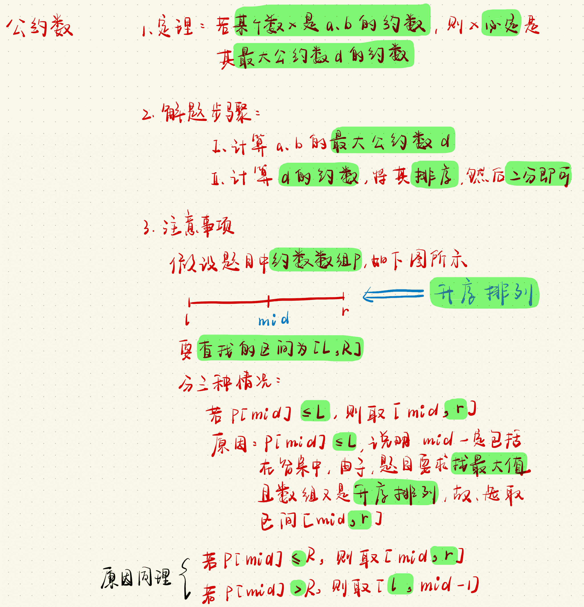

**代码**

```c++
#include <iostream>
#include <algorithm>
using namespace std;
const int N = 10010;
int n, m, q, idx;
int p[N];
// 最大公约数模板
int gcd(int a, int b) {
    if (!b) return a;
    return gcd(b, a % b);
}
void get_primes(int d) {
    for (int i = 1; i <= d / i; i ++ )
        if (d % i == 0) {
            p[idx ++ ] = i;
            // 防止出现重复元素
            if (i != d / i) p[idx ++ ] = d / i;
        }
    return;
}
bool check(int mid, int l, int r) {
    // 手写稿具体解释
    if (p[mid] <= l) return true;
    else if (p[mid] <= r) return true;
    return false;
}
int main() {
    scanf("%d%d%d", &n, &m, &q);
    int d = gcd(n, m);
    get_primes(d);
    // 二分的前提：数组有序，故应该先排序
    sort(p, p + idx);
    while (q -- ) {
        int L, R;
        scanf("%d%d", &L, &R);
        int l = 0, r = idx - 1;
        while (l < r) {
            int mid = l + r + 1 >> 1;
            // check函数手写稿具体解释
            if (check(mid, L, R)) l = mid;
            else r = mid - 1;
        }
        // 二分一定是有答案的
        // 判断如果答案位于L和R之间，说明答案合法，否则，不合法
        if (p[l] >= L && p[l] <= R) cout << p[l] << endl;
        else cout << -1 << endl;
    }
    return 0;
}
```

**时间复杂度**

$O(qlog_n)$

**空间复杂度**

$O(n)，n指的是约数的个数$

**标签**

`欧几里得算法`、`试除法求约数个数`

**缝合怪**


## 高斯消元

### [AcWing 883. 高斯消元解线性方程组](https://www.acwing.com/problem/content/885/)

**题目描述**

>   输入一个包含 `n` 个方程 `n` 个未知数的线性方程组。
>
>   方程组中的系数为实数。
>
>   求解这个方程组。
>
>   下图为一个包含 `m` 个方程 `n` 个未知数的线性方程组示例：
>
>   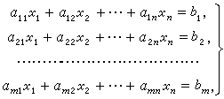

**输入格式**

>   第一行包含整数 `n`。
>
>   接下来 `n` 行，每行包含 `n + 1` 个实数，表示一个方程的 `n` 个系数以及等号右侧的常数。

**输出格式**

>   如果给定线性方程组存在唯一解，则输出共 `n` 行，其中第 `i` 行输出第 `i` 个未知数的解，结果保留两位小数。
>
>   如果给定线性方程组存在无数解，则输出 `Infinite group solutions`。
>
>   如果给定线性方程组无解，则输出 `No solution`。

**数据范围**

>   +   $1≤n≤100,$
>   +   $所有输入系数以及常数均保留两位小数，绝对值均不超过 100。$

**输入样例**

```c++
3
1.00 2.00 -1.00 -6.00
2.00 1.00 -3.00 -9.00
-1.00 -1.00 2.00 7.00
```

**输出样例**

```c++
1.00
-2.00
3.00
```

**手写稿**

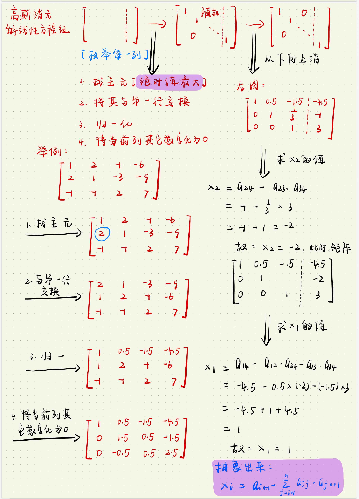

**代码**

```c++
#include <iostream>
#include <cmath>
using namespace std;
const int N = 110;
const double eps = 1e-6;
int n;
double a[N][N];
int guass() {
    // 化成上三角矩阵
    int r, c;
    // 枚举每一列
    for (r = 1, c = 1; c <= n; c ++ ) {
        // 1. 找主元
        int t = r;
        for (int i = r; i <= n; i ++ )
            if (fabs(a[i][c]) > fabs(a[t][c])) t = i;
        // 如果当前列的最大值已经是0，则不需要再进行2，3，4步骤
        if (fabs(a[t][c]) < eps) continue;
        // 2. 交换两行
        if (t != r) // 如果当前列的最大值所在的行不是本行，则交换两行
            for (int i = c; i <= n + 1; i ++ ) swap(a[r][i], a[t][i]);
        // 3. 归一化
        // 倒序枚举
        for (int i = n + 1; i >= c; i -- ) a[r][i] /= a[r][c];
        // 4. 将当前列的其他值消成0
        for (int i = r + 1; i <= n; i ++ )
            for (int j = n + 1; j >= c; j -- ) {
                // 如果已经是0，则不需要再进行
                if (fabs(a[i][c]) < eps) continue;
                a[i][j] -= a[r][j] * a[i][c];
            }
        r ++;
    }
    if (r <= n)
        for (int i = r; i <= n; i ++ ) {
            if (fabs(a[i][n + 1])) return -1;
        return 0;
    }
    // 化成对角矩阵
    for (int i = n - 1; i >= 1; i -- )
        for (int j = i + 1; j <= n; j ++ )
            a[i][n + 1] -= a[i][j] * a[j][n + 1];
    return 1;
}
int main() {
    scanf("%d", &n);
    for (int i = 1; i <= n; i ++ )
        for (int j = 1; j <= n + 1; j ++ )
            scanf("%lf", &a[i][j]);
    int t = guass();
    if (t == -1) printf("No solution");
    else if (t == 0) printf("Infinite group solutions");
    else
        for (int i = 1; i <= n; i ++ ) {
            if (fabs(a[i][n + 1]) < eps) cout << "0.00" << endl;
            else printf("%.2lf\n", a[i][n + 1]);
        }
    return 0;
}
```

**时间复杂度**

$O(n^3)$

**空间复杂度**

$O(n^2)$

**标签**

`高斯消元`

**缝合怪**

### [AcWing 884. 高斯消元解异或线性方程组](https://www.acwing.com/problem/content/886/)

**题目描述**

>   输入一个包含 `n` 个方程 `n` 个未知数的异或线性方程组。
>
>   方程组中的系数和常数为 `0` 或 `1`，每个未知数的取值也为 `0` 或 `1`。
>
>   求解这个方程组。
>
>   异或线性方程组示例如下：
>
>   ```c++
>   M[1][1]x[1] ^ M[1][2]x[2] ^ … ^ M[1][n]x[n] = B[1]
>   M[2][1]x[1] ^ M[2][2]x[2] ^ … ^ M[2][n]x[n] = B[2]
>   …
>   M[n][1]x[1] ^ M[n][2]x[2] ^ … ^ M[n][n]x[n] = B[n]
>   ```
>
>   其中 `^` 表示异或`(XOR)`，`M[i][j]` 表示第 `i` 个式子中 `x[j]` 的系数，`B[i]` 是第 `i` 个方程右端的常数，取值均为 `0` 或 `1`。

**输入格式**

>   第一行包含整数 `n`。
>
>   接下来 `n` 行，每行包含 `n + 1` 个整数 `0` 或 `1`，表示一个方程的 `n` 个系数以及等号右侧的常数。

**输出格式**

>   如果给定线性方程组存在唯一解，则输出共 `n` 行，其中第 `i` 行输出第 `i` 个未知数的解。
>
>   如果给定线性方程组存在多组解，则输出 `Multiple sets of solutions`。
>
>   如果给定线性方程组无解，则输出 `No solution`。

**数据范围**

>   +   $1≤n≤100$

**输入样例**

```c++
3
1 1 0 1
0 1 1 0
1 0 0 1
```

**输出样例**

```c++
1
0
0
```

**手写稿**

>   1.   同 `AcWing 883. 高斯消元解线性方程组`

**代码**

```c++
#include <iostream>
using namespace std;
const int N = 110;
int n;
int a[N][N];
int guass() {
    int r, c;
    // 转化成上三角矩阵
    for (r = 1, c = 1; c <= n; c ++ ) {
        // 找到当前列绝对值最大的行
        int t = r;
        for (int i = r; i <= n; i ++ )
            if (a[i][c]) {
                t = i;
                break;
            }
        // 如果当前最大值是0，则此行不需要再进行额外的处理
        if (!a[t][c]) continue;
        // 如果当前行不是最大值所在的行，则交换两行
        if (t != r) 
            for (int i = c; i <= n + 1; i ++ ) swap(a[t][i], a[r][i]);
        // 使用当前行去消其它行
        for (int i = r + 1; i <= n; i ++ )
            for (int j = n + 1; j >= c; j -- ) {
                if (a[i][c] == 0) break;
                a[i][j] ^= a[r][j] & a[i][c];
            }
        r ++;
    }
    if (r <= n) {
        for (int i = r; i <= n; i ++ )
            if (a[i][n + 1]) return -1;
        return 0;
    }
    for (int i = n - 1; i >= 1; i -- )
        for (int j = i + 1; j <= n; j ++ ) 
            a[i][n + 1] ^= a[i][j] & a[j][n + 1];
    return 1;
}
int main() {
    scanf("%d", &n);
    for (int i = 1; i <= n; i ++ )
        for (int j = 1; j <= n + 1; j ++ )
            scanf("%d", &a[i][j]);
    int t = guass();
    if (t == -1) puts("No solution");
    else if (t == 0) puts("Multiple sets of solutions");
    else 
        for (int i = 1; i <= n; i ++ ) cout << a[i][n + 1] << endl;
    return 0;
}
```

**时间复杂度**

$O(n^3)$

**空间复杂度**

$O(n^2)$

**标签**

`高斯消元`

**缝合怪**

### [AcWing 207. 球形空间产生器](https://www.acwing.com/problem/content/209/)

**问题描述**

>   有一个球形空间产生器能够在 `n` 维空间中产生一个坚硬的球体。
>
>   现在，你被困在了这个 `n` 维球体中，你只知道球面上 `n + 1` 个点的坐标，你需要以最快的速度确定这个 `n` 维球体的球心坐标，以便于摧毁这个球形空间产生器。
>
>   **注意：** 数据保证有唯一解。

**输入格式**

>   第一行是一个整数 `n`。
>
>   接下来的 `n + 1` 行，每行有 `n` 个实数，表示球面上一点的 `n` 维坐标。
>
>   每一个实数精确到小数点后 `6` 位，且其绝对值都不超过 `20000`。

**输出格式**

>   有且只有一行，依次给出球心的 `n` 维坐标（`n` 个实数），两个实数之间用一个空格隔开。
>
>   每个实数精确到小数点后 `3` 位。

**数据范围**

>   +   $1≤n≤10$

**输入样例**

```c++
2
0.0 0.0
-1.0 1.0
1.0 0.0
```

**输出样例**

```c++
0.500 1.500
```

**手写稿**

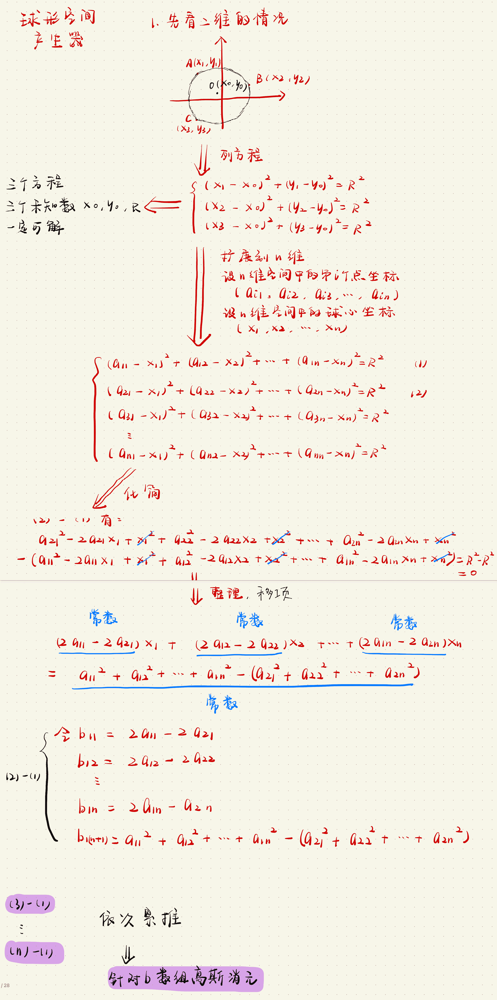

**代码**

```c++
#include <iostream>
#include <cmath>
using namespace std;
const int N = 15;
const double eps = 1e-6;
int n;
double a[N][N], b[N][N];
// 高斯消元模板
void guass() {
    int r, c;
    for (r = 1, c = 1; c <= n; c ++ ) {
        int t = r;
        for (int i = r; i <= n; i ++ )
            if (fabs(b[i][c]) > fabs(b[t][c])) t = i;
        if (fabs(b[t][c]) < eps) continue;
        if (t != r)
            for (int i = c; i <= n + 1; i ++ ) swap(b[t][i], b[r][i]);
        for (int i = n + 1; i >= c; i -- )
            b[r][i] /= b[r][c];
        for (int i = r + 1; i <= n; i ++ )
            for (int j = n + 1; j >= c; j -- ) {
                if (fabs(b[i][c]) < eps) break;
                b[i][j] -= b[r][j] * b[i][c];
            }
        r ++;
    }
    for (int i = n - 1; i >= 1; i -- )
        for (int j = i + 1; j <= n; j ++ )
            b[i][n + 1] -= b[i][j] * b[j][n + 1];
    return;
}
int main() {
    scanf("%d", &n);
    for (int i = 1; i <= n + 1; i ++ )
        for (int j = 1; j <= n; j ++ )
            scanf("%lf", &a[i][j]);
    // 构造b数组
    for (int i = 2; i <= n + 1; i ++ )
        for (int j = 1; j <= n; j ++ ) {
            b[i - 1][j] = 2 * (a[1][j] - a[i][j]);
            b[i - 1][n + 1] += (a[1][j] * a[1][j]) - a[i][j] * a[i][j];
        }
    guass();
    for (int i = 1; i <= n; i ++ )
        printf("%.3lf ", b[i][n + 1]);
    return 0;

```

**时间复杂度**

$O(n^3)$

**空间复杂度**

$O(n^2)$

**标签**

`解方程`、`高斯消元`

**缝合怪**

[AcWing 883. 高斯消元解线性方程组](#AcWing 883. 高斯消元解线性方程组)

## 约瑟夫环

### 原理介绍


### [PTA 7-28 猴子选大王](https://pintia.cn/problem-sets/14/problems/808)

**题目描述**

>   一群猴子要选新猴王。新猴王的选择方法是：让 `N `只候选猴子围成一圈，从某位置起顺序编号为 `1~N` 号。从第 `1` 号开始报数，每轮从 `1` 报到 `3`，凡报到 `3` 的猴子即退出圈子，接着又从紧邻的下一只猴子开始同样的报数。如此不断循环，最后剩下的一只猴子就选为猴王。请问是原来第几号猴子当选猴王？

**输入格式**

>   输入在一行中给一个正整数`N（≤1000）`。

**输出格式**

>   在一行中输出当选猴王的编号。

**输入样例**

```c++
11
```

**输出样例**

```c++
7
```

**手写稿**

>   原理已经说明

**代码**

```c++
#include <iostream>
using namespace std;
const int N = 1010;
int n, k = 3;
int f[N][5];
int main() {
    scanf("%d", &n);
    f[1][k] = 0;
    for (int i = 2; i <= n; i ++ )
        f[i][k] = (f[i - 1][k] + k) % i;
    // 计算的是下标，故答案【编号】需要再+1
    cout << f[n][k] + 1 << endl;
    return 0;
}
```

**时间复杂度**

$O(n)$

**空间复杂度**

$O(n)$

**标签**

`约瑟夫环`

**缝合怪**


### [LeetCode 390. 消除游戏](https://leetcode-cn.com/problems/elimination-game/)

**题目描述**

>   列表 `arr` 由在范围 `[1, n]` 中的所有整数组成，并按严格递增排序。请你对 `arr` 应用下述算法：
>
>   从左到右，删除第一个数字，然后每隔一个数字删除一个，直到到达列表末尾。
>   重复上面的步骤，但这次是从右到左。也就是，删除最右侧的数字，然后剩下的数字每隔一个删除一个。
>   不断重复这两步，从左到右和从右到左交替进行，直到只剩下一个数字。
>   给你整数 `n` ，返回 `arr` 最后剩下的数字。

**示例 1**

>   输入：`n = 9`
>   输出：`6`
>   解释：
>   `arr = [1, 2, 3, 4, 5, 6, 7, 8, 9]`
>   `arr = [2, 4, 6, 8]`
>   `arr = [2, 6]`
>   `arr = [6]`

**示例 2**

>   输入：`n = 1`
>   输出：`1`

**提示**

>   +   $1 <= n <= 10^9$

**手写稿**

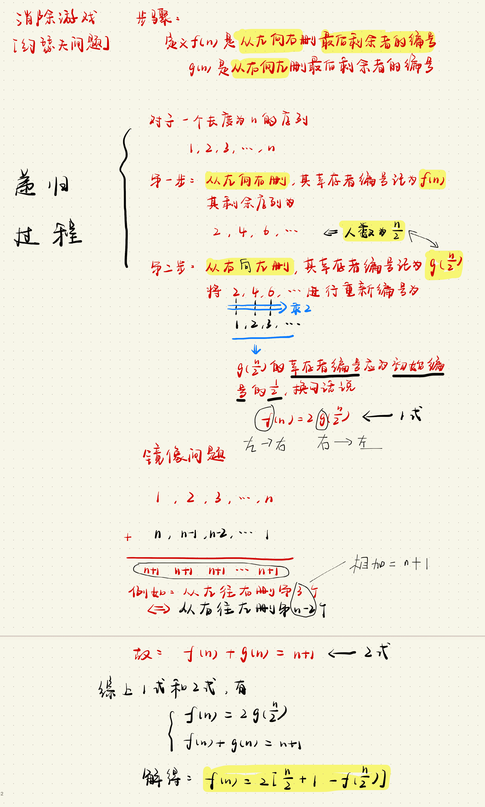

**代码**

```c++
class Solution {
public:
    int lastRemaining(int n) {
        if (n == 1) return 1;
        return 2 * (n / 2 + 1 - lastRemaining(n / 2));
    }
};
```

**时间复杂度**

$O(log_n)$

**空间复杂度**

$O(1)$

**标签**

`约瑟夫环`

**缝合怪**


## 计算几何

### 基础知识

#### 前置知识

##### 三角函数

>   1. $\pi = acos(-1);$
>
>       
>
>   2. 余弦定理 $c^2 = a^2 + b^2 - 2abcos(t)$
>
>       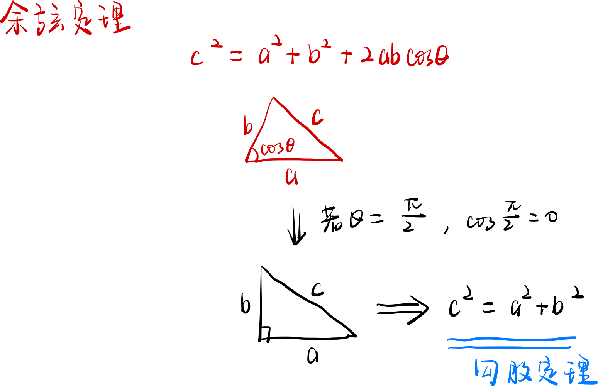

##### 浮点数

>   1.   浮点数的比较
>
>        ```c++
>        // 极小数
>        const double eps = 1e-8;
>        int sign(double x) { // 符号函数
>            // 取绝对值
>            if (fabs(x) < eps) return 0;
>            if (x < 0) return -1;
>            return 1;
>        }
>        ```
>
>        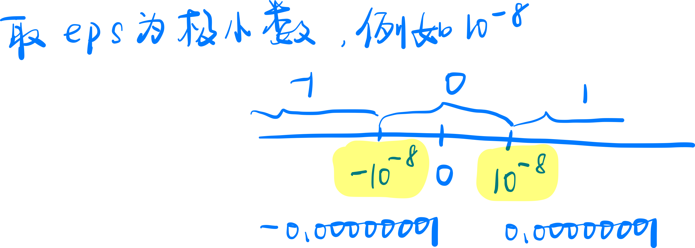
>
>   2.   浮点数的比较
>
>        ```c++
>        // 极小数
>        const double eps = 1e-8;
>        int cmp(double x, double y) { // 比较函数
>            // 取绝对值
>            if (fabs(x - y) < eps) return 0;
>            if (x < y) return -1;
>            return 1;
>        }
>        ```
>
>        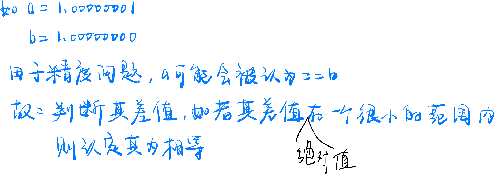

##### 向量

###### 内积（点积）

>   1.   定义：`A·B = |A||B|cos(C)`
>
>   2.   几何意义
>
>        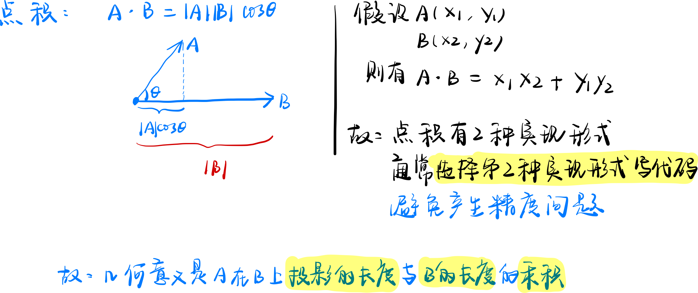
>
>   3.   代码实现
>
>        ```c++
>        double dot(Point a, Point b) {
>        	return a.x * b.x + a.y * b.y;
>        }
>        ```

###### 外积（叉积）

>   1.   定义：`AxB = |A||B|sin(C)`
>
>   2.   几何意义
>
>   
>
>   3.   代码实现

```markdown
        
    3.3 外积（叉积） 
        (1) 几何意义：向量A与B张成的平行四边形的有向面积。B在A的逆时针方向为正。
        (2) 代码实现
        double cross(Point a, Point b)
        {
            return a.x * b.y - b.x * a.y;
        }
    3.4 常用函数
        3.4.1 取模
        double get_length(Point a)
        {
            return sqrt(dot(a, a));
        }
        3.4.2 计算向量夹角
        double get_angle(Point a, Point b)
        {
            return acos(dot(a, b) / get_length(a) / get_length(b));
        }
        3.4.3 计算两个向量构成的平行四边形有向面积
        double area(Point a, Point b, Point c)
        {
            return cross(b - a, c - a);
        }
        3.4.5 向量A顺时针旋转C的角度：
        Point rotate(Point a, double angle)
        {
            return Point(a.x * cos(angle) + a.y * sin(angle), -a.x * sin(angle) + a.y * cos(angle));
        }
4. 点与线
    4.1 直线定理
        (1) 一般式 ax + by + c = 0
        (2) 点向式 p0 + vt
        (3) 斜截式 y = kx + b
    4.2 常用操作
        (1) 判断点在直线上 A x B = 0
        (2) 两直线相交
        // cross(v, w) == 0则两直线平行或者重合
        Point get_line_intersection(Point p, Vector v, Point q, vector w)
        {
            vector u = p - q;
            double t = cross(w, u) / cross(v, w);
            return p + v * t;
        }
        (3) 点到直线的距离
        double distance_to_line(Point p, Point a, Point b)
        {
            vector v1 = b - a, v2 = p - a;
            return fabs(cross(v1, v2) / get_length(v1));
        }
        (4) 点到线段的距离
        double distance_to_segment(Point p, Point a, Point b)
        {
            if (a == b) return get_length(p - a);
            Vector v1 = b - a, v2 = p - a, v3 = p - b;
            if (sign(dot(v1, v2)) < 0) return get_length(v2);
            if (sign(dot(v1, v3)) > 0) return get_length(v3);
            return distance_to_line(p, a, b);
        }
        (5) 点在直线上的投影
        double get_line_projection(Point p, Point a, Point b)
        {
            Vector v = b - a;
            return a + v * (dot(v, p - a) / dot(v, v));
        }
        (6) 点是否在线段上
        bool on_segment(Point p, Point a, Point b)
        {
            return sign(cross(p - a, p - b)) == 0 && sign(dot(p - a, p - b)) <= 0;
        }
        (7) 判断两线段是否相交
        bool segment_intersection(Point a1, Point a2, Point b1, Point b2)
        {
            double c1 = cross(a2 - a1, b1 - a1), c2 = cross(a2 - a1, b2 - a1);
            double c3 = cross(b2 - b1, a2 - b1), c4 = cross(b2 - b1, a1 - b1);
            return sign(c1) * sign(c2) <= 0 && sign(c3) * sign(c4) <= 0;
        }
5. 多边形
    5.1 三角形
    5.1.1 面积
        (1) 叉积
        (2) 海伦公式
            p = (a + b + c) / 2;
            S = sqrt(p(p - a) * (p - b) * (p - c));
    5.1.2 三角形四心
        (1) 外心，外接圆圆心
            三边中垂线交点。到三角形三个顶点的距离相等
        (2) 内心，内切圆圆心
            角平分线交点，到三边距离相等
        (3) 垂心
            三条垂线交点
        (4) 重心
            三条中线交点（到三角形三顶点距离的平方和最小的点，三角形内到三边距离之积最大的点）
    5.2 普通多边形
        通常按逆时针存储所有点
        5.2.1 定义
        (1) 多边形
            由在同一平面且不再同一直线上的多条线段首尾顺次连接且不相交所组成的图形叫多边形
        (2) 简单多边形
            简单多边形是除相邻边外其它边不相交的多边形
        (3) 凸多边形
            过多边形的任意一边做一条直线，如果其他各个顶点都在这条直线的同侧，则把这个多边形叫做凸多边形
            任意凸多边形外角和均为360°
            任意凸多边形内角和为(n−2)180°
        5.2.2 常用函数
        (1) 求多边形面积（不一定是凸多边形）
        我们可以从第一个顶点除法把凸多边形分成n − 2个三角形，然后把面积加起来。
        double polygon_area(Point p[], int n)
        {
            double s = 0;
            for (int i = 1; i + 1 < n; i ++ )
                s += cross(p[i] - p[0], p[i + 1] - p[i]);
            return s / 2;
        }
        (2) 判断点是否在多边形内（不一定是凸多边形）
        a. 射线法，从该点任意做一条和所有边都不平行的射线。交点个数为偶数，则在多边形外，为奇数，则在多边形内。
        b. 转角法
        (3) 判断点是否在凸多边形内
        只需判断点是否在所有边的左边（逆时针存储多边形）。
    5.3 皮克定理
        皮克定理是指一个计算点阵中顶点在格点上的多边形面积公式该公式可以表示为:
            S = a + b/2 - 1
        其中a表示多边形内部的点数，b表示多边形边界上的点数，S表示多边形的面积。
6. 圆
    (1) 圆与直线交点
    (2) 两圆交点
    (3) 点到圆的切线
    (4) 两圆公切线
    (5) 两圆相交面积
```

#### [AcWing 2983. 玩具](https://www.acwing.com/problem/content/2986/)

**题目描述**

>   计算玩具收纳盒中，每个分区内的玩具数量。
>
>   约翰的父母有一个烦恼----约翰每次玩完玩具以后总会将玩具乱扔。
>
>   他们为约翰准备了一个长方形的玩具收纳盒，用来放他的玩具。
>
>   但是约翰非常调皮，每次都非常随意的将玩具扔进盒子中，使得所有玩具都随意混在一起，这让约翰难以找到他喜欢的玩具。
>
>   对此，约翰的父母想出了一个对策，用若干个纸板将收纳盒分隔成若干个分区，这样至少扔到不同分区的玩具之间还是能分开的。
>
>   下面是一个收纳盒的俯视图示例。
>
>   
>
>   你的任务是，每当约翰将玩具扔进收纳盒中时，确定每个分区中有多少个玩具。

**输入格式**

>   本题包含多组测试数据。
>
>   对于每组数据，第一行包含 `6` 个整数 $n,m,x_1,y_1,x_2,y_2$，表示共有 `n` 个纸板，`m` 个玩具，收纳盒的左上角坐标为 `(x1,y1)`，右下角坐标为 `(x2,y2)`。
>
>   接下来 `n` 行，每行包含两个整数 $U_i,L_i$，表示第 `i` 个纸板的两端点坐标分别为 $(U_i,y_1)$ 和 $(L_i,y_2)$。数据保证纸板之间不相交，且按照从左至右顺序依次给出。
>
>   接下来 `m` 行，每行包含两个整数 $X_j,Y_j$，表示第 `j` 个玩具的位置坐标。玩具的给出顺序是随机的。数据保证玩具不会恰好落在纸板上，也不会落在盒子外。
>
>   输入由包含单个 `0` 的一行结束。

**输出格式**

>   对于每组数据，输出 `n+1` 行。
>
>   `n` 个纸板将收纳盒划分为了 `n+1` 个分区，从左到右编号为 `0∼n`。
>
>   按照分区编号从小到大的顺序，每行输出一行信息 `i: j`，其中 `i` 表示分区编号，`j` 表示分区内玩具数量。
>
>   每组数据之间，**用空行隔开**。

**数据范围**

>   +   $每个测试点最多包含 10 组数据。$
>   +   $1≤n,m≤5000,$
>   +   $所有坐标取值范围 [−10^5,10^5]。$

**输入样例**

```c++
5 6 0 10 60 0
3 1
4 3
6 8
10 10
15 30
1 5
2 1
2 8
5 5
40 10
7 9
4 10 0 10 100 0
20 20
40 40
60 60
80 80
 5 10
15 10
25 10
35 10
45 10
55 10
65 10
75 10
85 10
95 10
0
```

**输出样例**

```c++
0: 2
1: 1
2: 1
3: 1
4: 0
5: 1

0: 2
1: 2
2: 2
3: 2
4: 2
```

**注意**

>   如示例所示，落在盒子边缘的玩具也算在盒子内。

**手写稿**


**代码**


**时间复杂度**


**空间复杂度**


**标签**


**缝合怪**


### 扫描线问题

#### [AcWing 3068. 扫描线](https://www.acwing.com/problem/content/3071/)

**题目描述**

>   在二维平面中给定 `n` 个**两条边分别与 x 轴和 y 轴平行**的矩形，请你求出它们的面积并。

**输入格式**

>   第一行包含整数 `n`。
>
>   接下来 `n` 行，每行包含四个整数 `x1,y1,x2,y2`，表示其中一个矩形的左下角坐标 `(x1,y1)` 和右上角坐标 `(x2,y2)`。
>
>   注意，坐标轴 `x` 轴从左向右延伸，`y` 轴从下向上延伸。
>
>   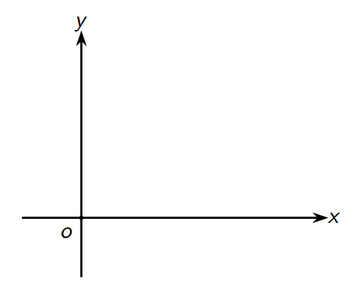

**输出格式**

>   一个整数，表示矩形的面积并。

**数据范围**

>   +   $1≤n≤1000,$
>   +   $−10^9≤x1<x2≤10^9,$
>   +   $−10^9≤y1<y2≤10^9$

**输入样例**

```c++
2
10 10 20 20
15 15 25 25
```

**输出样例**

```c++
175
```

**手写稿**

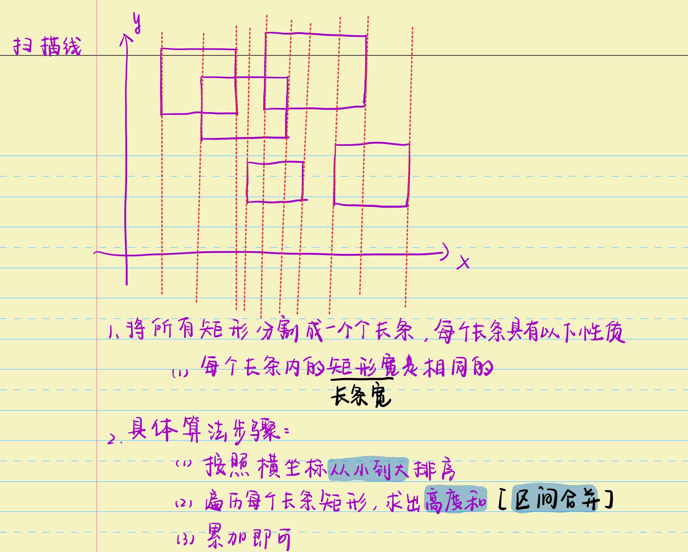

**代码**

```c++
#include <iostream>
#include <vector>
#include <algorithm>
#define x first
#define y second
using namespace std;
typedef long long LL;
typedef pair<int, int> PII;
const int N = 1010, INF = 0x3f3f3f3f;
int n;
PII l[N], r[N];
vector<int> points;
LL merge_segs(int a, int b) {
    vector<PII> segs;
    // 遍历每个矩形
    for (int i = 1; i <= n; i ++ )
        // 如果当前矩形将分割成的长条完全包裹在内
        if (l[i].x <= a && r[i].x >= b)
            // 记录此区间【y轴方向】
            segs.push_back({l[i].y, r[i].y});
    // 区间合并模板
    // 排序
    sort(segs.begin(), segs.end());
    LL height = 0;
    int L = -INF, R = -INF;
    for (auto& [l, r] : segs)
        if (R < l) {
            height += ((LL)R - L);
            L = l, R = r;
        }
        else R = max(R, r);
    // 记得将最后一段的长度添加上
    height += (R - L);
    // 计算答案即可
    return height * (b - a);
}
int main() {
    scanf("%d", &n);
    for (int i = 1; i <= n; i ++ ) {
        // 记录矩形左边的x坐标和y坐标
        // 记录矩形右边的x坐标和y坐标
        scanf("%d%d%d%d", &l[i].x, &l[i].y, &r[i].x, &r[i].y);
        // 统计所有的横坐标
        points.push_back(l[i].x);
        points.push_back(r[i].x);
    }
    // 排序
    sort(points.begin(), points.end());
    // 去重
    points.erase(unique(points.begin(), points.end()), points.end());
    // 可能会越界，使用LL
    LL res = 0;
    // 遍历每个区间
    for (int i = 1; i < points.size(); i ++ )
        // 统计总和
        res += merge_segs(points[i - 1], points[i]);
    cout << res << endl;
    return 0;
}
```

**时间复杂度**

$O(n)$

**空间复杂度**

$O(n)$

**标签**

`扫描线`

**缝合怪**

[AcWing 803. 区间合并](#AcWing 803. 区间合并)

#### [AcWing 2801. 三角形面积并](https://www.acwing.com/problem/content/2803/)

>   给出 `n` 个三角形，求它们并的面积。

**输入格式**

>   第一行为 `n`，即三角形的个数。
>
>   以下 `n` 行，每行 `6` 个实数 $x_1,y_1,x_2,y_2,x_3,y_3$，代表三角形的顶点坐标。
>
>   坐标均为不超过 $10^6$ 的实数，输入数据保留 `1` 位小数。

**输出格式**

>   输出并的面积 `u`，保留两位小数。

**数据范围**

>   +   $1≤n≤100$

**输入样例**

```c++
2
0.0 0.0 2.0 0.0 1.0 1.0
1.0 0.0 3.0 0.0 2.0 1.0
```

**输出样例**

```c++
1.75
```

**手写稿**


**代码**


**时间复杂度**


**空间复杂度**


**标签**


**缝合怪**


#### [LeetCode 218. 天际线问题](https://leetcode-cn.com/problems/the-skyline-problem/)

**问题描述**

> 城市的天际线是从远处观看该城市中所有建筑物形成的轮廓的外部轮廓。给你所有建筑物的位置和高度，请返回由这些建筑物形成的 天际线 。
>
> 每个建筑物的几何信息由数组 `buildings` 表示，其中三元组 `buildings[i] = [lefti, righti, heighti]` 表示：
>
> + `lefti` 是第 `i` 座建筑物左边缘的 `x` 坐标。
> + `righti` 是第 `i` 座建筑物右边缘的 `x` 坐标。
> + `heighti` 是第 `i` 座建筑物的高度。
>
> 天际线 应该表示为由 “关键点” 组成的列表，格式 `[[x1,y1],[x2,y2],...]` ，并按 `x` 坐标 进行 排序 。关键点是水平线段的左端点。列表中最后一个点是最右侧建筑物的终点，`y` 坐标始终为 `0` ，仅用于标记天际线的终点。此外，任何两个相邻建筑物之间的地面都应被视为天际线轮廓的一部分。
>
> 注意：输出天际线中不得有连续的相同高度的水平线。例如 `[...[2 3], [4 5], [7 5], [11 5], [12 7]...]` 是不正确的答案；三条高度为 `5` 的线应该在最终输出中合并为一个：`[...[2 3], [4 5], [12 7], ...]`

**示例 1**

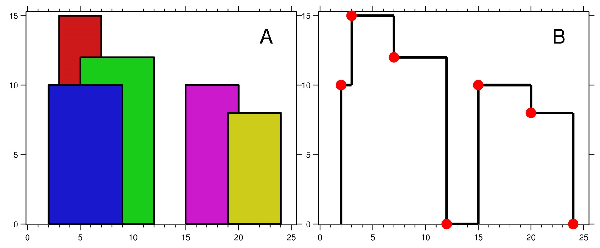

> 输入：`buildings = [[2,9,10],[3,7,15],[5,12,12],[15,20,10],[19,24,8]]`
> 输出：`[[2,10],[3,15],[7,12],[12,0],[15,10],[20,8],[24,0]]`
> 解释：
> 图 `A` 显示输入的所有建筑物的位置和高度，
> 图 `B` 显示由这些建筑物形成的天际线。图 `B` 中的红点表示输出列表中的关键点。

**示例 2**

> 输入：`buildings = [[0,2,3],[2,5,3]]`
> 输出：`[[0,3],[5,0]]`

**提示**

> + $1 <= buildings.length <= 10^4$
> + $0 <= left_i < right_i <= 2^{31} - 1$
> + $1 <= height_i <= 2^{31} - 1$
> + $buildings 按 left_i 非递减排序$

**题解**

> 1. 将横坐标按照从小到大排序，如果横坐标相同，则分下列三种情况：
>
>     + 如果是左端点，则按照从大到小排序
>
>         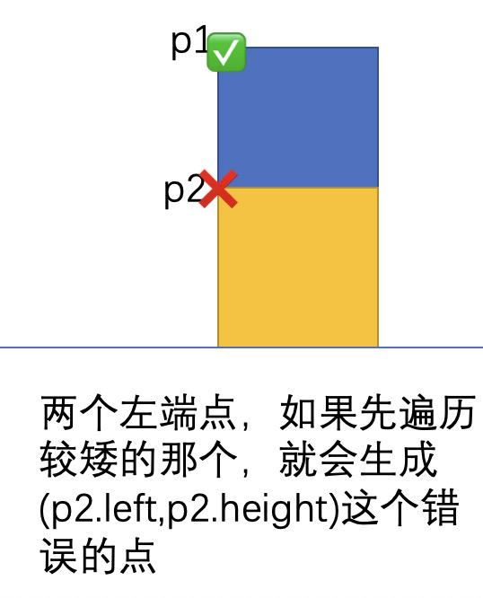
>
>     + 如果是右端点，则按照从小到大排序
>
>         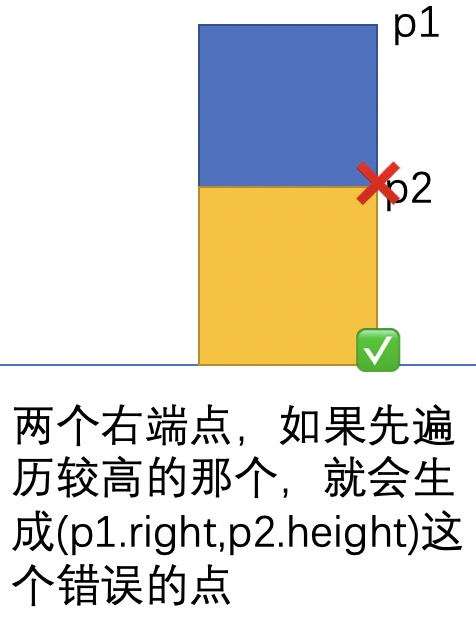
>
>     + 如果是左右端点重合，则按照先处理左端点，再处理右端点
>
>         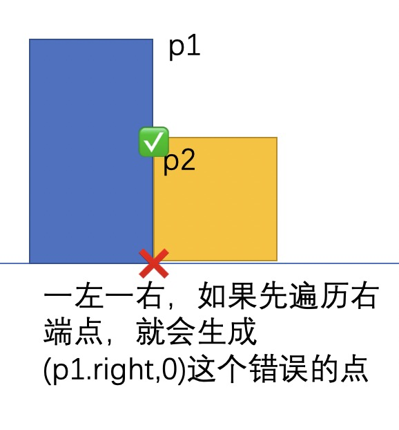
>
> 2. 使用 `pair` （默认升序）数组 `point` 来存储每一个点，排序，由于第三种情况的存在，所以，将左端点的值存储为负数，作用有二：
>
>     + 当左右端点重合的时候，可以保证的是先处理左端点，再处理右端点、
>     + 可以根据正负号，判断当前处理的是左端点还是右端点
>
> 3. 遍历 `point` 数组，使用 `multiset` 存储高度，分为两种情况：
>
>     + 如果当前遍历的点是左端点并且当前点大于 `multiset` 中的最大值，说明高度升高，一定产生关键点，记录答案，并将当前点插入 `multiset` 中
>     + 如果当前遍历的点是右端点 `h` ，先将右端点 `h` 删除，查看最大值，若 `h` 大于 `multiset` 的最大值，则说明 `h` 就是最大值，那么高度也会发生变化，即高度变低，记录答案即可
>
> 4. 问题解答
>
>     + 为啥要分左端点和右端点处理，题目不是说水平线段的左端点？
>
>         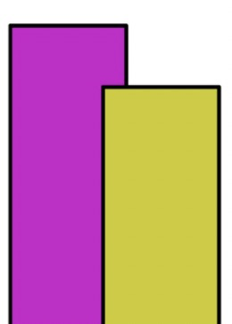
>
>         + 如图，答案并不都是在左端点，其中一个答案在红色矩形的右端点

**代码**

```c++
class Solution {
public:
    vector<vector<int>> getSkyline(vector<vector<int>>& g) {
        vector<vector<int>> res;
        vector<pair<int, int>> point;
        multiset<int> height;
        for (auto& item : g) {
            point.push_back({item[0], -item[2]});
            point.push_back({item[1], item[2]});
        }
        // 先将x轴加入答案
        height.insert(0);
        sort(point.begin(), point.end());
        for (auto& p : point) {
            int x = p.first, h = abs(p.second);
            if (p.second < 0) { // 左端点
                if (h > *height.rbegin()) res.push_back({x, h});
                height.insert(h);
            }
            else { // 右端点
                height.erase(height.find(h));
                if (h > *height.rbegin()) res.push_back({x, *height.rbegin()});
            }
        }
        return res;
    }
};
```

**标签**

`扫描线`


# 贪心


## 普通贪心

### [LeetCode 376. 摆动序列](https://leetcode-cn.com/problems/wiggle-subsequence/)

**题目描述**

>   如果连续数字之间的差严格地在正数和负数之间交替，则数字序列称为 摆动序列 。第一个差（如果存在的话）可能是正数或负数。仅有一个元素或者含两个不等元素的序列也视作摆动序列。
>
>   例如， `[1, 7, 4, 9, 2, 5]` 是一个 摆动序列 ，因为差值 `(6, -3, 5, -7, 3)` 是正负交替出现的。
>
>   相反，`[1, 4, 7, 2, 5]` 和 `[1, 7, 4, 5, 5]` 不是摆动序列，第一个序列是因为它的前两个差值都是正数，第二个序列是因为它的最后一个差值为零。
>   子序列 可以通过从原始序列中删除一些（也可以不删除）元素来获得，剩下的元素保持其原始顺序。
>
>   给你一个整数数组 `nums` ，返回 `nums` 中作为 摆动序列 的 最长子序列的长度 。

**示例 1**

>   输入：`nums = [1,7,4,9,2,5]`
>   输出：`6`
>   解释：整个序列均为摆动序列，各元素之间的差值为 `(6, -3, 5, -7, 3)` 。

**示例 2**

>   输入：`nums = [1,17,5,10,13,15,10,5,16,8]`
>   输出：`7`
>   解释：这个序列包含几个长度为 `7` 摆动序列。
>   其中一个是 `[1, 17, 10, 13, 10, 16, 8]` ，各元素之间的差值为 `(16, -7, 3, -3, 6, -8)` 。

**示例 3**

>   输入：`nums = [1,2,3,4,5,6,7,8,9]`
>   输出：`2`

**提示**

>   +   $1 <= nums.length <= 1000$
>   +   $0 <= nums[i] <= 1000$

**进阶**

>   你能否用 $O(n)$ 时间复杂度完成此题?

**手写稿**


**代码**

```c++
class Solution {
public:
    int wiggleMaxLength(vector<int>& nums) {
        // 删除【连续重复】元素
        nums.erase(unique(nums.begin(), nums.end()), nums.end());
        if (nums.size() <= 2) return nums.size();
        // 将首尾元素添加
        int res = 2;
        for (int i = 1; i + 1 < nums.size(); i ++ ) {
            // 如果当前元素是局部最大值或者局部最小值
            // 序列的长度++
            if (nums[i - 1] < nums[i] && nums[i + 1] < nums[i] || nums[i - 1] > nums[i] && nums[i + 1] > nums[i])
                res ++;
        }
        return res;
    }
};
```

**时间复杂度**

$O(n)$

**空间复杂度**

$O(1)$

**标签**

`贪心`

**缝合怪**


## 字符串贪心

### [LeetCode 316. 去除重复字母](https://leetcode-cn.com/problems/remove-duplicate-letters/)

**问题描述**

> 给你一个字符串 `s` ，请你去除字符串中重复的字母，使得每个字母只出现一次。需保证 返回结果的字典序最小（要求不能打乱其他字符的相对位置）。

**示例 1**

> 输入：`s = "bcabc"`
> 输出：`"abc"`

**示例 2**

> 输入：`s = "cbacdcbc"`
> 输出：`"acdb"`

**提示**

> + $1 <= s.length <= 10^4$
> + $s$ 由小写英文字母组成
> + 注意：该题与 [`1081`](https://leetcode-cn.com/problems/smallest-subsequence-of-distinct-characters) 相同

**手写稿**

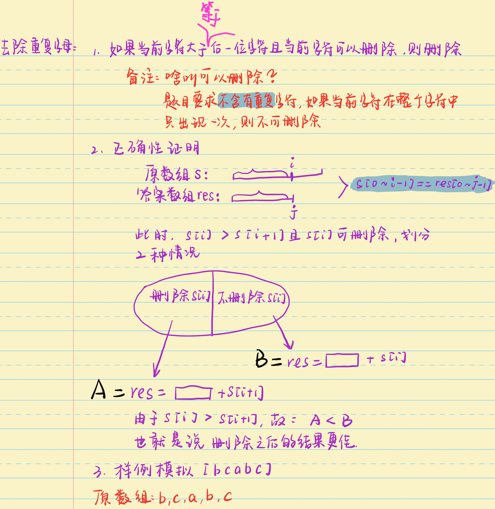

**代码**

```c++
class Solution {
public:
    string removeDuplicateLetters(string s) {
        string res;
        unordered_map<char, int> idxs;
        unordered_map<char, bool> is_appear;
        // 记录每个字符的下标所在的最后一位的位置
        for (int i = 0; i < s.size(); i ++ ) idxs[s[i]] = i;
        for (int i = 0; i < s.size(); i ++ ) {
            // 如果当前字符出现过，则直接进行下一次循环
            if (is_appear[s[i]]) continue;
            // 判断是否可以删除当前字符
            while (res.size() && res.back() > s[i] && idxs[res.back()] > i) {
                is_appear[res.back()] = false;
                res.pop_back();
            }
            res += s[i];
            is_appear[s[i]] = true;
        }
        return res;
    }
};
```

**标签**

`贪心`

## 区间合并

### [AcWing 803. 区间合并](https://www.acwing.com/problem/content/805/)

**题目描述**

>   给定 `n` 个区间 $[l_i,r_i]$，要求合并所有有交集的区间。
>
>   注意如果在端点处相交，也算有交集。
>
>   输出合并完成后的区间个数。
>
>   例如：`[1,3]` 和 `[2,6]` 可以合并为一个区间 `[1,6]`。

**输入格式**

>   第一行包含整数 `n`。
>
>   接下来 `n` 行，每行包含两个整数 `l` 和 `r`。

**输出格式**

>   共一行，包含一个整数，表示合并区间完成后的区间个数。

**数据范围**

>   +   $1≤n≤100000,$
>   +   $−10^9≤l_i≤r_i≤10^9$

**输入样例**

```c++
5
1 2
2 4
5 6
7 8
7 9
```

**输出样例**

```c++
3
```

**手写稿**

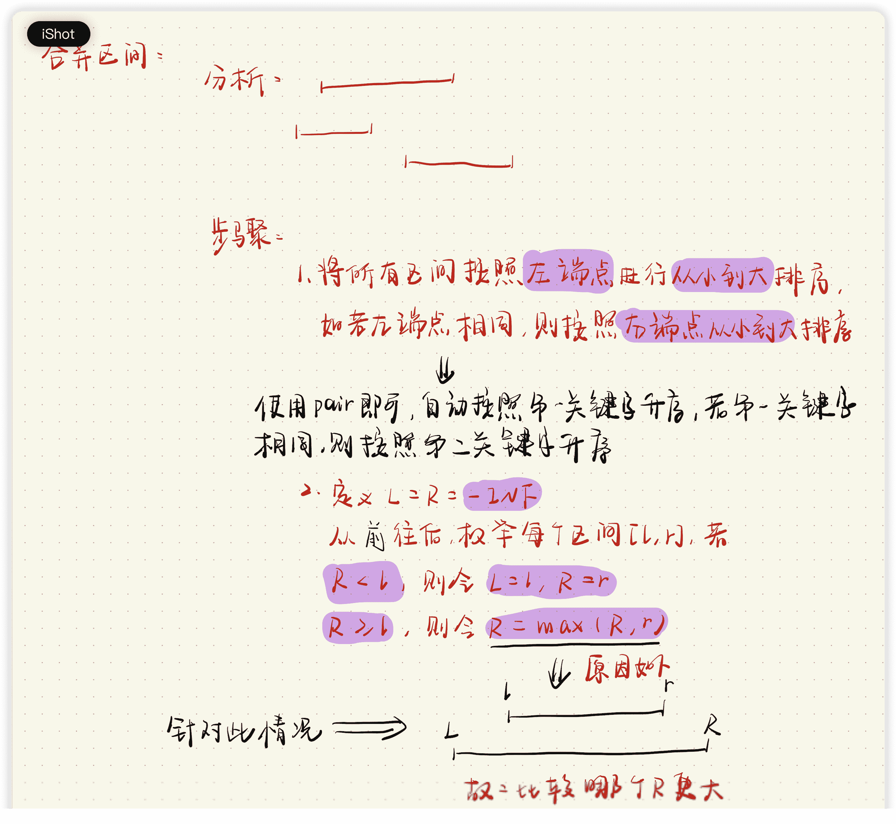

**代码**

```c++
#include <iostream>
#include <algorithm>
using namespace std;
typedef pair<int, int> PII;
const int INF = 0x3f3f3f3f;
vector<PII> segs;
int n;
int main() {
    scanf("%d", &n);
    for (int i = 0; i < n; i ++ ) {
        int l, r;
        scanf("%d%d", &l, &r);
        segs.push_back({l, r});
    }
    sort(segs.begin(), segs.end());
    int res = 0;
    int L = -INF, R = -INF;
    for (auto& [l, r] : segs)
        if (R < l) {
            res ++;
            L = l, R = r;
        }
        else R = max(R, r);
    cout << res << endl;
    return 0;
}
```

**时间复杂度**

$O(n)$

**空间复杂度**

$O(n)$

**标签**

`贪心`、`排序`

**缝合怪**


# 二分

## 整数二分

### 模板

>   ```c++
>   bool check(int x) {/* ... */} // 检查x是否满足某种性质
>   
>   // 注意！！【区间的划分】！！
>   // 区间[l, r]被划分成[l, mid]和[mid + 1, r]时使用：
>   int bsearch_1(int l, int r) {
>    while (l < r) {
>        int mid = l + r >> 1;
>        if (check(mid)) r = mid;    // check()判断mid是否满足性质
>        else l = mid + 1;
>    }
>    return l;
>   }
>   
>   // 区间[l, r]被划分成[l, mid - 1]和[mid, r]时使用：
>   int bsearch_2(int l, int r) {
>    while (l < r) {
>        int mid = l + r + 1 >> 1;
>        if (check(mid)) l = mid;
>        else r = mid - 1;
>    }
>    return l;
>   }
>   ```

### [AcWing 789. 数的范围](https://www.acwing.com/problem/content/791/)

**题目描述**

>   给定一个按照升序排列的长度为 `n` 的整数数组，以及 `q` 个查询。
>
>   对于每个查询，返回一个元素 `k` 的起始位置和终止位置（位置从 `0` 开始计数）。
>
>   如果数组中不存在该元素，则返回 `-1 -1`。

**输入格式**

>   第一行包含整数 `n` 和 `q`，表示数组长度和询问个数。
>
>   第二行包含 `n` 个整数（均在 `1∼10000` 范围内），表示完整数组。
>
>   接下来 `q` 行，每行包含一个整数 `k`，表示一个询问元素。

**输出格式**

>   共 `q` 行，每行包含两个整数，表示所求元素的起始位置和终止位置。
>
>   如果数组中不存在该元素，则返回 `-1 -1`。

**数据范围**

>   +   $1≤n≤100000$
>   +   $1≤q≤10000$
>   +   $1≤k≤10000$

**输入样例**

```c++
6 3
1 2 2 3 3 4
3
4
5
```

**输出样例**

```c++
3 4
5 5
-1 -1
```

**手写稿**


**代码**

```c++
#include <iostream>
using namespace std;
const int N = 100010;
int n, m;
int g[N];
int main(){
    scanf("%d%d", &n, &m);
    for (int i = 0; i < n; i ++ ) scanf("%d", &g[i]);
    while (m -- ) {
        int x;
        scanf("%d", &x);
        // 寻找左端点
        int l = 0, r = n - 1;
        int L, R;
        while (l < r) {
            int mid = l + r >> 1;
            // 寻找大于等于x的最小值
            if (g[mid] >= x) r = mid;
            else l = mid + 1;
        }
        if (g[l] != x) cout << -1 << " " << -1 << endl;
        else {
            // 寻找右端点
            L = l;
            l = 0, r = n - 1;
            while (l < r) {
                int mid = l + r + 1 >> 1;
                // 寻找小于等于x的最大值
                if (g[mid] <= x) l = mid;
                else r = mid - 1;
            }
            R = r;
            cout << L << " " << R << endl;
        }
    }
    return 0;
}
```

**时间复杂度**

$O(n)$

**空间复杂度**

$O(n)$

**标签**

`二分`、`整数二分`

**缝合怪**


### [LeetCode 378. 有序矩阵中第 K 小的元素](https://leetcode-cn.com/problems/kth-smallest-element-in-a-sorted-matrix/)

**题目描述**

>   给你一个 `n x n` 矩阵 `matrix` ，其中每行和每列元素均按升序排序，找到矩阵中第 `k` 小的元素。
>   请注意，它是 排序后 的第 `k` 小元素，而不是第 `k` 个 不同 的元素。
>
>   你必须找到一个内存复杂度优于 $O(n^2)$ 的解决方案。

**示例 1**

>   输入：`matrix = [[1,5,9],[10,11,13],[12,13,15]], k = 8`
>   输出：`13`
>   解释：矩阵中的元素为 `[1,5,9,10,11,12,13,13,15]`，第 `8` 小元素是 `13`

**示例 2**

>   输入：`matrix = [[-5]], k = 1`
>   输出：`-5`

**提示**

>   +   $n == matrix.length$
>   +   $n == matrix[i].length$
>   +   $1 <= n <= 300$
>   +   $-10^9 <= matrix[i][j] <= 10^9$
>   +   $题目数据 保证 matrix 中的所有行和列都按 非递减顺序 排列$
>   +   $1 <= k <= n^2$

**进阶**

>   你能否用一个恒定的内存(即 `O(1)` 内存复杂度)来解决这个问题?
>   你能在 `O(n)` 的时间复杂度下解决这个问题吗?这个方法对于面试来说可能太超前了，但是你会发现阅读这篇文章（ [this paper](http://www.cse.yorku.ca/~andy/pubs/X+Y.pdf) ）很有趣。

**手写稿**

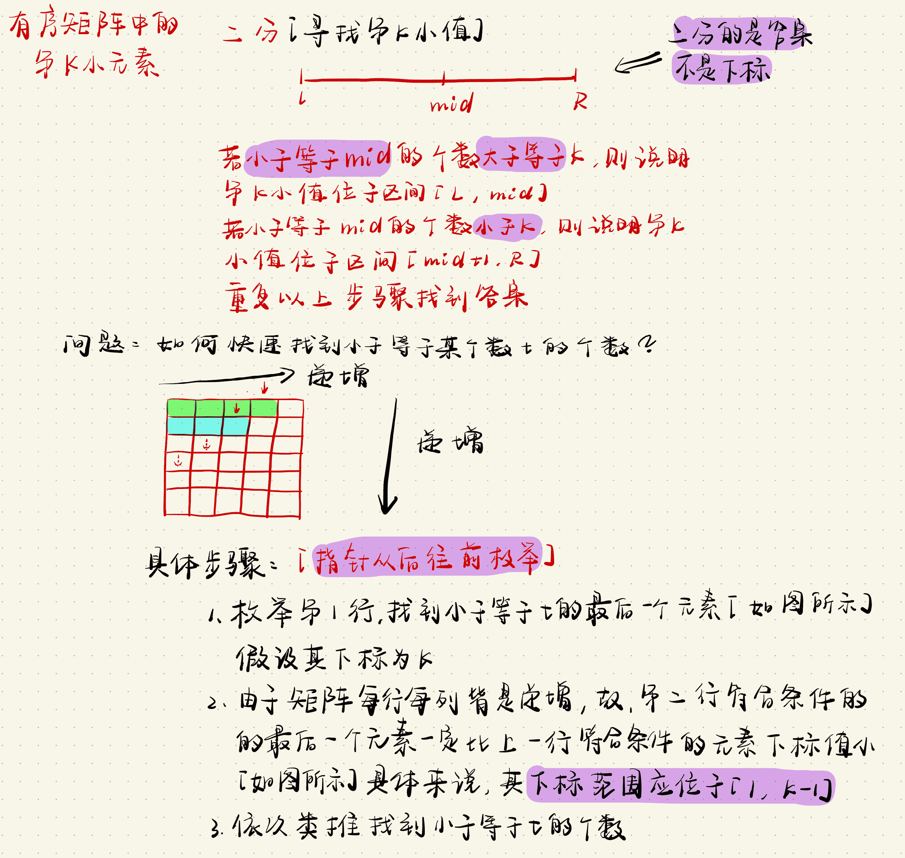

**代码**

```c++
typedef long long LL;
class Solution {
public:
    int kthSmallest(vector<vector<int>>& g, int k) {
        // 二分的不是下标，而是答案
        int l = INT_MIN, r = INT_MAX;
        while (l < r) {
            int mid = (LL)l + r >> 1;
            // j从最后一个数开始枚举
            // cnt表示小于等于mid的个数
            int j = g[0].size() - 1, cnt = 0;
            // 枚举每一行
            for (int i = 0; i < g.size(); i ++ ) {
                // 如果当前值大于mid，则j--
                while (j >= 0 && g[i][j] > mid) j --;
                // 小于等于mid的个数为j + 1个
                cnt += j + 1;
            }
            if (cnt >= k) r = mid;
            else l = mid + 1;
        }
        return l;
    }
};
```

**时间复杂度**

$O(nlog_n)$

**空间复杂度**

$O(1)$

**标签**

`二分`

**缝合怪**


## 实数二分

### 模板

>   ```c++
>   bool check(double x) {/* ... */} // 检查x是否满足某种性质
>   
>   double bsearch_3(double l, double r) {
>    const double eps = 1e-6;   // eps 表示精度，取决于题目对精度的要求
>    while (r - l > eps) {
>        double mid = (l + r) / 2;
>        if (check(mid)) r = mid;
>        else l = mid;
>    }
>    return l;
>   }
>   ```

### [AcWing 790. 数的三次方根](https://www.acwing.com/problem/content/792/)

**题目描述**

>   给定一个浮点数 `n`，求它的三次方根。

**输入格式**

>   共一行，包含一个浮点数 `n`。

**输出格式**

>   共一行，包含一个浮点数，表示问题的解。
>
>   注意，结果保留 `6` 位小数。

**数据范围**

>   +   $−10000≤n≤10000$

**输入样例**

```c++
1000.00
```

**输出样例**

```c++
10.000000
```

**手写稿**

>   1.   [实数二分](#实数二分)

**代码**

```c++
#include <iostream>
#include <cmath>
using namespace std;
const double eps = 1e-8;
double n;
int main() {
    scanf("%lf", &n);
    // 注意：不能写成l = 0, r = n
    // 如果设置成l = 0, r = n，则无论如何也找不到其三次方根
    // 原因：0.001，其三次方根0.1是比本身大的
    double l = -100, r = 100;
    while (fabs(l - r) > eps) {
        double mid = (l + r) / 2;
        if (mid * mid * mid >= n) r = mid;
        else l = mid;
    }
    printf("%.6lf\n", l);
    return 0;
}
```

**时间复杂度**

$O(log_n)$

**空间复杂度**

$O(1)$

**标签**

`实数二分`

**缝合怪**


# 分治

## [LeetCode 372. 超级次方](https://leetcode-cn.com/problems/super-pow/)

**题目描述**

>   你的任务是计算 $a^b$ 对 `1337` 取模，`a` 是一个正整数，`b` 是一个非常大的正整数且会以数组形式给出。

**示例 1**

>   输入：`a = 2, b = [3]`
>   输出：`8`

**示例 2**

>   输入：`a = 2, b = [1,0]`
>   输出：`1024`

**示例 3**

>   输入：`a = 1, b = [4,3,3,8,5,2]`
>   输出：`1`

**示例 4**

>   输入：`a = 2147483647, b = [2,0,0]`
>   输出：`1198`

**提示**

>   +   $1 <= a <= 2^{31} - 1$
>   +   $1 <= b.length <= 2000$
>   +   $0 <= b[i] <= 9$
>   +   $b 不含前导 0$

**手写稿**

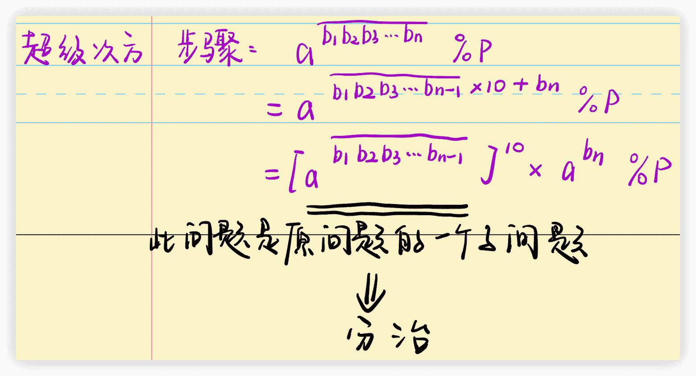

**代码**

```c++
const int p = 1337;
class Solution {
public:
    int qmi(int a, int b) {
        // a先模p，如果不先模p，第10行a * a会越界
        // 记住先模p【模板！！！】
        a %= p;
        int res = 1;
        while (b) {
            if (b & 1) res = res * a % p;
            a = a * a % p;
            b >>= 1;
        }
        return res;
    }
    int superPow(int a, vector<int>& b) {
        if (b.empty()) return 1;
        // 把最后一个数剔除，化归为分治的子问题
        int t = b.back(); b.pop_back();
        return qmi(superPow(a, b), 10) * qmi(a, t) % p;
    }
};
```

**标签**

`快速幂`、`分治`

# 排序专题

## 快排

### [AcWing 786. 第k个数](https://www.acwing.com/problem/content/description/788/)

**题目描述**

> 给定一个长度为 `n` 的整数数列，以及一个整数 `k`，请用快速选择算法求出数列从小到大排序后的第 `k` 个数。

**输入格式**

> 第一行包含两个整数 `n` 和 `k`。
>
> 第二行包含 `n` 个整数（所有整数均在 $1∼10^9$ 范围内），表示整数数列。

**输出格式**

> 输出一个整数，表示数列的第 `k` 小数。

**数据范围**

> + $1≤n≤100000$,
> + $1≤k≤n$

**输入样例**

```c++
5 3
2 4 1 5 3
```

**输出样例**

```c++
3
```

**手写稿**

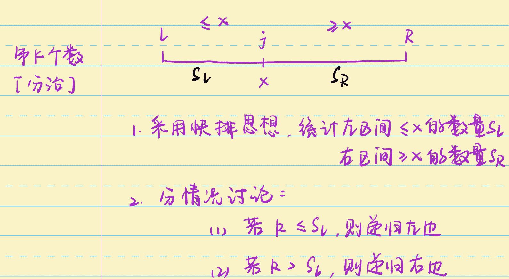

**代码**

```c++
#include <iostream>
using namespace std;
const int N = 100010;
int n, k;
int g[N];
int quick_sort(int g[], int l, int r, int k) {
    if (l == r) return g[l];
    int x = g[l];
    int i = l - 1, j = r + 1;
    while (i < j) {
        // 为啥不能写等号，如果全部都是相同值会越界
        do i ++ ; while(g[i] < x);
        do j -- ; while(g[j] > x);
        if (i < j) swap(g[i], g[j]);
    }
    // 统计左边小于等于x的数目
    int sl = j - l + 1;
    // 递归左区间
    if (k <= sl) return quick_sort(g, l, j, k);
    // 递归右区间
    return quick_sort(g, j + 1, r, k - sl);
}
int main() {
    scanf("%d%d", &n, &k);
    for (int i = 1; i <= n; i ++ ) scanf("%d", &g[i]);
    cout << quick_sort(g, 1, n, k) << endl;
    return 0;
}
```

**标签**

`快速排序`、`快速选择算法`

### [LeetCode 324. 摆动排序 II](https://leetcode-cn.com/problems/wiggle-sort-ii/)

**题目描述**

> 给你一个整数数组 `nums`，将它重新排列成 `nums[0] < nums[1] > nums[2] < nums[3]...` 的顺序。
>
> 你可以假设所有输入数组都可以得到满足题目要求的结果。

**示例 1**

> 输入：`nums = [1,5,1,1,6,4]`
> 输出：`[1,6,1,5,1,4]`
> 解释：`[1,4,1,5,1,6]` 同样是符合题目要求的结果，可以被判题程序接受。

**示例 2**

> 输入：`nums = [1,3,2,2,3,1]`
> 输出：`[2,3,1,3,1,2]`

**提示**

> + $1 <= nums.length <= 5 * 10^4$
> + $0 <= nums[i] <= 5000$
> + $题目数据保证，对于给定的输入 nums ，总能产生满足题目要求的结果$

**进阶**

> 你能用 `O(n)` 时间复杂度和 / 或原地 `O(1)` 额外空间来实现吗？

**手写稿**

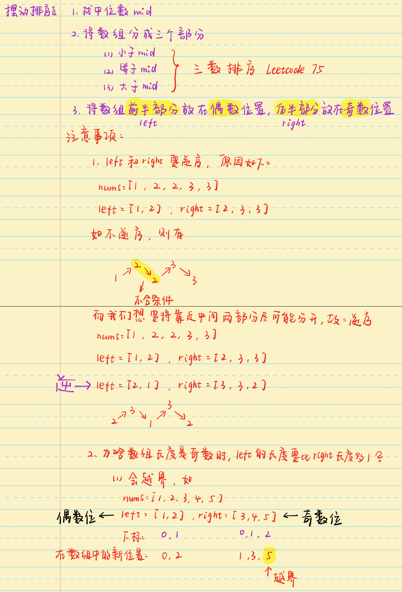

**代码**

```c++
class Solution {
public:
    void wiggleSort(vector<int>& nums) {
        int n = nums.size();
        // 找到中位数的迭代器
        auto midptr = nums.begin() + n / 2;
        nth_element(nums.begin(), midptr, nums.end());
        int mid = *midptr;
        // 三数排序，同LeetCode75题
        for (int i = 0, j = 0, k = n - 1; i <= k; ) {
            if (nums[i] < mid) swap(nums[i ++ ], nums[j ++ ]);
            else if (nums[i] == mid) i ++;
            else swap(nums[i], nums[k --]);
        }
        if (n & 1) ++ midptr;
        auto left = vector<int>(nums.begin(), midptr);
        // 逆序
        reverse(left.begin(), left.end());
        auto right = vector<int>(midptr, nums.end());
        // 逆序
        reverse(right.begin(), right.end());
        // 将前半部分放置在偶数位置
        for (int i = 0; i < left.size(); i ++ ) nums[i * 2] = left[i];
        // 将后半部分放置在奇数位置
        for (int i = 0; i < right.size(); i ++ ) nums[i * 2 + 1] = right[i];
        return;
    }
};
```

**标签**

`快速选择排序`

## 计数排序

### 原理

**简介**

>   计数排序不是基于比较的排序算法，其核心在于将输入的数据值转化为键存储在额外开辟的数组空间中。 作为一种线性时间复杂度的排序，计数排序要求输入的数据必须是有确定范围的整数。

**动图演示**


### [LeetCode 347. 前 K 个高频元素](https://leetcode-cn.com/problems/top-k-frequent-elements/)

**题目描述**

>   给你一个整数数组 `nums` 和一个整数 `k` ，请你返回其中出现频率前 `k` 高的元素。你可以按 任意顺序 返回答案。

**示例 1**

>   输入: `nums = [1,1,1,2,2,3], k = 2`
>   输出: `[1,2]`

**示例 2**

>   输入: `nums = [1], k = 1`
>   输出: `[1]`

**提示**

>   +   $1 <= nums.length <= 10^5$
>   +   $k 的取值范围是 [1, 数组中不相同的元素的个数]$
>   +   $题目数据保证答案唯一，换句话说，数组中前 k 个高频元素的集合是唯一的$

**进阶**

>   你所设计算法的时间复杂度 必须 优于 `O(n log n)` ，其中 `n` 是数组大小。

**手写稿**

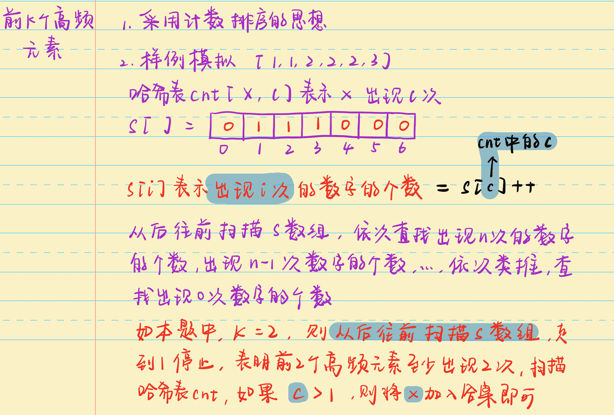

**代码**

```c++
class Solution {
public:
    vector<int> topKFrequent(vector<int>& nums, int k) {
        unordered_map<int, int> cnt;
        int n = nums.size();
        // 统计每个数字出现的次数
        for (auto& num : nums) cnt[num] ++;
        vector<int> s(n + 1);
        for (auto [x, c] : cnt) s[c] ++;
        int i = n, t = 0;
        while (t < k) t += s[i --];
        vector<int> res;
        for (auto [x, c] : cnt)
            if (c > i) res.push_back(x);
        return res;
    }
};
```

**标签**

`计数排序`

## 归并排序

### 多路归并

#### [LeetCode 355. 设计推特](https://leetcode-cn.com/problems/design-twitter/)

**题目描述**

>   设计一个简化版的推特`(Twitter)`，可以让用户实现发送推文，关注/取消关注其他用户，能够看见关注人（包括自己）的最近 `10` 条推文。
>
>   实现 `Twitter` 类：
>
>   +   `Twitter()` 初始化简易版推特对象
>   +   `void postTweet(int userId, int tweetId)` 根据给定的 `tweetId` 和 `userId` 创建一条新推文。每次调用此函数都会使用一个不同的 `tweetId` 。
>   +   `List<Integer> getNewsFeed(int userId)` 检索当前用户新闻推送中最近  `10` 条推文的 `ID` 。新闻推送中的每一项都必须是由用户关注的人或者是用户自己发布的推文。推文必须 按照时间顺序由最近到最远排序 。
>   +   `void follow(int followerId, int followeeId)` `ID` 为 `followerId` 的用户开始关注 `ID` 为 `followeeId` 的用户。
>   +   `void unfollow(int followerId, int followeeId)` `ID` 为 `followerId` 的用户不再关注 `ID` 为 `followeeId` 的用户。

**示例**

>   输入
>   `["Twitter", "postTweet", "getNewsFeed", "follow", "postTweet", "getNewsFeed", "unfollow", "getNewsFeed"]
>   [[], [1, 5], [1], [1, 2], [2, 6], [1], [1, 2], [1]]`
>   输出
>   `[null, null, [5], null, null, [6, 5], null, [5]]`
>
>   解释
>   `Twitter twitter = new Twitter();`
>   `twitter.postTweet(1, 5);` // 用户 `1` 发送了一条新推文 (用户 `id = 1`, 推文 `id = 5`)
>   `twitter.getNewsFeed(1);`  // 用户 `1` 的获取推文应当返回一个列表，其中包含一个 `id` 为 `5` 的推文
>   `twitter.follow(1, 2);`    // 用户 `1` 关注了用户 `2`
>   `twitter.postTweet(2, 6);` // 用户 `2` 发送了一个新推文 (推文 `id = 6`)
>   `twitter.getNewsFeed(1);`  // 用户 `1` 的获取推文应当返回一个列表，其中包含两个推文，`id` 分别为 `-> [6, 5] `。推文 `id 6` 应当在推文 `id 5` 之前，因为它是在 `5` 之后发送的
>   `twitter.unfollow(1, 2);`  // 用户 `1` 取消关注了用户 `2`
>   `twitter.getNewsFeed(1);`  // 用户 `1` 获取推文应当返回一个列表，其中包含一个 `id` 为 `5` 的推文。因为用户 `1` 已经不再关注用户 `2`

**提示**

>   +   $1 <= userId, followerId, followeeId <= 500$
>   +   $0 <= tweetId <= 10^4$
>   +   $所有推特的 ID 都互不相同$
>   +   $postTweet、getNewsFeed、follow 和 unfollow 方法最多调用 3 * 10^4 次$

**手写稿**

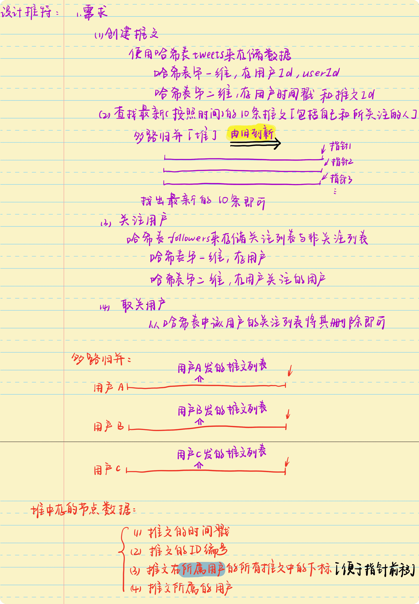

**代码**

```c++
typedef pair<int, int> PII;
#define x first
#define y second
class Twitter {
public:
    // 存储发布推文信息
    unordered_map<int, vector<PII>> tweets;
    // 存储用户的关注列表
    unordered_map<int, unordered_set<int>> followers;
    // 时间戳
    int ts;
    Twitter() {
        ts = 0;
    }
    
    void postTweet(int userId, int tweetId) {
        tweets[userId].push_back({ts ++ , tweetId});
        return;
    }
    
    vector<int> getNewsFeed(int u) {
        // 多路归并
        priority_queue<vector<int>> heap;
        followers[u].insert(u);
        // 遍历u的所有关注者【包括自己】，其原因是因为自己的推文也算在最新的10条推文内
        for (auto user : followers[u]) {
            // 获取当前用户所有推文
            auto& ts = tweets[user];
            // 如果当前用户还有剩余的推文
            if (ts.size()) {
                // 找到当前用户的【最新发布】的推文的位置【数组的最后一个元素的下标】
                int i = ts.size() - 1;
                // 【推文发布的时间，推文编号，推文的位置，所属用户】
                heap.push({ts[i].x, ts[i].y, i, user});
            }
        }
        vector<int> res;
        for (int i = 0; i < 10 && heap.size(); i ++ ) { // 最近的10条推文
            auto t = heap.top(); heap.pop();
            // 获取推文的编号
            res.push_back(t[1]);
            // 获取当前推文所属的下标位置
            int j = t[2];
            // 如果还有推文
            if (j) {
                // 多路归并的指针前移
                j -- ;
                // 获取当前推文所属的用户
                auto& user = t[3];
                // 获取用户的所有推文
                auto& ts = tweets[user];
                // 保存当前指针对应的推文的信息
                // 【推文发布的时间，推文编号，推文的位置，所属用户】
                heap.push({ts[j].x, ts[j].y, j, user});
            }
        }
        return res;
    }
    
    void follow(int followerId, int followeeId) {
        followers[followerId].insert(followeeId);
        return;
    }
    
    void unfollow(int followerId, int followeeId) {
        followers[followerId].erase(followeeId);
        return;
    }
};

/**
 * Your Twitter object will be instantiated and called as such:
 * Twitter* obj = new Twitter();
 * obj->postTweet(userId,tweetId);
 * vector<int> param_2 = obj->getNewsFeed(userId);
 * obj->follow(followerId,followeeId);
 * obj->unfollow(followerId,followeeId);
 */
```

**标签**

`多路归并`

#### [LeetCode 373. 查找和最小的 K 对数字](https://leetcode-cn.com/problems/find-k-pairs-with-smallest-sums/)

**题目描述**

>   给定两个以 升序排列 的整数数组 `nums1` 和 `nums2` , 以及一个整数 `k` 。
>
>   定义一对值 `(u,v)`，其中第一个元素来自 `nums1`，第二个元素来自 `nums2` 。
>
>   请找到和最小的 `k` 个数对 $(u_1,v_1),  (u_2,v_2)  ...  (u_k,v_k)$ 。

**示例 1**

>   输入: `nums1 = [1,7,11], nums2 = [2,4,6], k = 3`
>   输出: `[1,2],[1,4],[1,6]`
>   解释: 返回序列中的前 `3` 对数：
>     `[1,2],[1,4],[1,6],[7,2],[7,4],[11,2],[7,6],[11,4],[11,6]`

**示例 2**

>   输入: `nums1 = [1,1,2], nums2 = [1,2,3], k = 2`
>   输出: `[1,1],[1,1]`
>   解释: 返回序列中的前 `2` 对数：
>     `[1,1],[1,1],[1,2],[2,1],[1,2],[2,2],[1,3],[1,3],[2,3]`

**示例 3**

>   输入: `nums1 = [1,2], nums2 = [3], k = 3`
>   输出: `[1,3],[2,3]`
>   解释: 也可能序列中所有的数对都被返回:`[1,3],[2,3]`

**提示**

>   +   $1 <= nums1.length, nums2.length <= 10^5$
>   +   $-10^9 <= nums1[i], nums2[i] <= 10^9$
>   +   $nums1 和 nums2 均为升序排列$
>   +   $1 <= k <= 1000$

**手写稿**

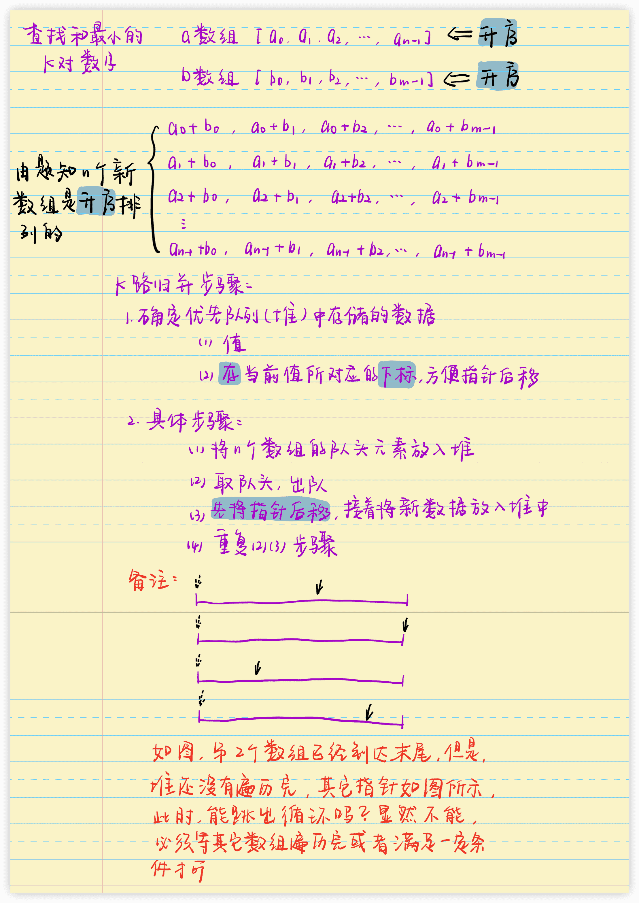

**代码**

```c++
class Solution {
public:
    vector<vector<int>> kSmallestPairs(vector<int>& a, vector<int>& b, int k) {
        if (a.empty() || b.empty()) return {};
        priority_queue<vector<int>, vector<vector<int>>, greater<vector<int>>> heap;
        int n = a.size(), m = b.size();
        for (int i = 0; i < n; i ++ ) heap.push({a[i] + b[0], i, 0});
        vector<vector<int>> res;
        // k路归并
        while (k -- && heap.size()) {
            auto t = heap.top(); heap.pop();
            res.push_back({a[t[1]], b[t[2]]});
            // 如果其中的某个数组已经到达末尾，则【该数组】不需要继续后移
            // 但是，可不能【退出】，原因在【手写稿】中
            if (t[2] + 1 < m)
                heap.push({a[t[1]] + b[t[2] + 1], t[1], t[2] + 1});
        }
        return res;
    }
};
```

**标签**

`优先队列`、`K路归并`

## 桶排序

### [LeetCode 164. 最大间距](https://leetcode-cn.com/problems/maximum-gap/)

**题目描述**

>   给定一个无序的数组 `nums`，返回 数组在排序之后，相邻元素之间最大的差值 。如果数组元素个数小于 `2`，则返回 `0` 。
>
>   您必须编写一个在「线性时间」内运行并使用「线性额外空间」的算法。

**示例 1**

>   输入: `nums = [3,6,9,1]`
>   输出: `3`
>   解释: 排序后的数组是 `[1,3,6,9]`, 其中相邻元素 `(3,6)` 和 `(6,9)` 之间都存在最大差值 `3`。

**示例 2**

>   输入: `nums = [10]`
>   输出: `0`
>   解释: 数组元素个数小于 `2`，因此返回 `0`。

**提示**

>   +   $1 <= nums.length <= 10^5$
>   +   $0 <= nums[i] <= 10^9$

**手写稿**

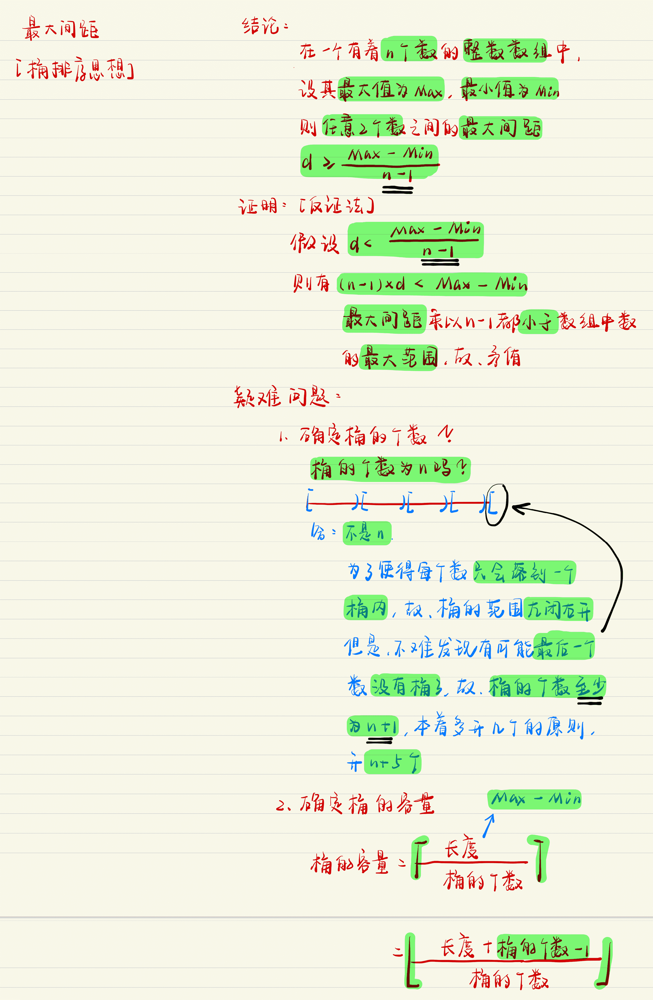

**代码**

```c++
#define x first
#define y second
class Solution {
public:
    typedef pair<int, int> PII;
    int maximumGap(vector<int>& nums) {
        int n = nums.size();
        if (n < 2) return 0;
        int Max = INT_MIN, Min = INT_MAX;
        for (int i = 0; i < n; i ++ ) {
            Max = max(Max, nums[i]);
            Min = min(Min, nums[i]);
        }
        // 数组的值都相同
        if (Max == Min) return 0;
        // 桶的个数[手写稿]
        int bk_num = n + 5;
        vector<PII> buckets(bk_num, {INT_MAX, INT_MIN});
        // 桶的容量[手写稿]
        int bk_size = (Max - Min + bk_num - 1) / bk_num;
        // 枚举每个数应该放在哪个桶
        for (int i = 0; i < n; i ++ ) {
            // 查看当前数字应该放哪个桶
            int k = (nums[i] - Min) / bk_size;
            buckets[k].x = min(buckets[k].x, nums[i]);
            buckets[k].y = max(buckets[k].y, nums[i]);
        }
        int res = -1;
        // 枚举每个桶
        for (int i = 0, last = -1; i <= bk_num; i ++ ) {
            // 如果当前桶没有被用过, 则直接跳过即可
            if (buckets[i] == PII{INT_MAX, INT_MIN})
                continue;
           	// 记录上一个桶的位置
            if (last != -1)
                res = max(res, buckets[i].x - buckets[last].y);
            last = i;
        }
        return res;
    }
};
```

**时间复杂度**

$O(n)$

**空间复杂度**

$O(n)$

**标签**

`🪣排序`、`桶排序`

**缝合怪**


# 栈和队列

## 栈

### 普通栈

#### [LeetCode 232. 用栈实现队列](https://leetcode-cn.com/problems/implement-queue-using-stacks/)

**题目描述**

>   请你仅使用两个栈实现先入先出队列。队列应当支持一般队列支持的所有操作（`push`、`pop`、`peek`、`empty`）：
>
>   实现 `MyQueue` 类：
>
>   +   `void push(int x)` 将元素 `x` 推到队列的末尾
>   +   `int pop()` 从队列的开头移除并返回元素
>   +   `int peek()` 返回队列开头的元素
>   +   `boolean empty()` 如果队列为空，返回 `true` ；否则，返回 `false`
>
>   说明：
>
>   +   你 只能 使用标准的栈操作 —— 也就是只有 `push to top`, `peek/pop from top`, `size`, 和 `is empty` 操作是合法的。
>   +   你所使用的语言也许不支持栈。你可以使用 `list` 或者 `deque`（双端队列）来模拟一个栈，只要是标准的栈操作即可。

**示例 1**

>   输入：
>   `["MyQueue", "push", "push", "peek", "pop", "empty"]`
>   `[[], [1], [2], [], [], []]`
>   输出：
>   `[null, null, null, 1, 1, false]`
>
>   解释：
>   `MyQueue myQueue = new MyQueue();`
>   `myQueue.push(1); // queue is: [1]`
>   `myQueue.push(2); // queue is: [1, 2] (leftmost is front of the queue)`
>   `myQueue.peek(); // return 1`
>   `myQueue.pop(); // return 1, queue is [2]`
>   `myQueue.empty(); // return false`

**提示**

>   +   $1 <= x <= 9$
>   +   $最多调用 100 次 push、pop、peek 和 empty$
>   +   $假设所有操作都是有效的 （例如，一个空的队列不会调用 pop 或者 peek 操作）$

**进阶**

>   你能否实现每个操作均摊时间复杂度为 `O(1)` 的队列？换句话说，执行 `n` 个操作的总时间复杂度为 `O(n) `，即使其中一个操作可能花费较长时间。

**手写稿**


**代码**

```c++
class MyQueue {
public:
    stack<int> sk1, sk2;
    MyQueue() {}
    
    void push(int x) {
        sk1.push(x);
        return;
    }
    
    int pop() {
        // 留下最后一个数
        while (sk1.size() > 1) {
            sk2.push(sk1.top());
            sk1.pop();
        }
        // 记录最后一个数
        int t = sk1.top();
        // 将最后一个数弹出
        sk1.pop();
        while (sk2.size()) {
            sk1.push(sk2.top());
            sk2.pop();
        }
        return t;
    }
    
    int peek() {
        // 留下最后一个数
        while (sk1.size() > 1) {
            sk2.push(sk1.top());
            sk1.pop();
        }
        // 记录最后一个数
        int t = sk1.top();
        while (sk2.size()) {
            sk1.push(sk2.top());
            sk2.pop();
        }
        return t;
    }
    
    bool empty() {
        return sk1.empty();
    }
};

/**
 * Your MyQueue object will be instantiated and called as such:
 * MyQueue* obj = new MyQueue();
 * obj->push(x);
 * int param_2 = obj->pop();
 * int param_3 = obj->peek();
 * bool param_4 = obj->empty();
 */
```

**时间复杂度**

$O(n)$

**空间复杂度**

$O(n)$

**标签**

`栈`

**缝合怪**


### 单调栈

#### [LeetCode 42. 接雨水](https://leetcode-cn.com/problems/trapping-rain-water/)

**题目描述**

>   给定 `n` 个非负整数表示每个宽度为 `1` 的柱子的高度图，计算按此排列的柱子，下雨之后能接多少雨水。 

**示例 1**


>   输入：`height = [0,1,0,2,1,0,1,3,2,1,2,1]`
>   输出：`6`
>   解释：上面是由数组 `[0,1,0,2,1,0,1,3,2,1,2,1]` 表示的高度图，在这种情况下，可以接 `6` 个单位的雨水（蓝色部分表示雨水）。 

**示例 2**

>   输入：`height = [4,2,0,3,2,5]`
>   输出：`9`

**提示**

>   +   $n == height.length$
>   +   $1 <= n <= 2 * 10^4$
>   +   $0 <= height[i] <= 10^5$

**手写稿**

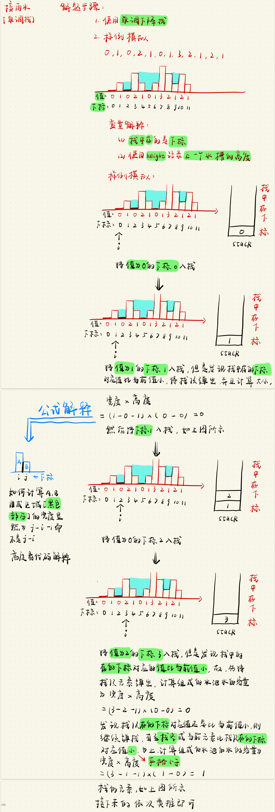

**代码**

```c++
class Solution {
public:
    int trap(vector<int>& h) {
        // 维护一个单调下降栈
        stack<int> stk;
        int res = 0;
        for (int i = 0; i < h.size(); i ++ ) {
            // 初始化上一个水池的高度
            int height = 0;
            while (stk.size() && h[stk.top()] <= h[i]) {
                // 栈中存储的是下标
                res += (i - stk.top() - 1) * (h[stk.top()] - height);
                // 更新高度
                height = h[stk.top()];
                stk.pop();
            }
            // 如果栈不空，则计算【最后一个水池】的水
            // 手模即可
            if (stk.size()) res += (i - stk.top() - 1) * (h[i] - height);
            stk.push(i);
        }
        return res;
    }
};
```

**时间复杂度**

$O(n)$

**空间复杂度**

$O(n)$

**标签**

`单调栈`

**缝合怪**

#### [LeetCode 84. 柱状图中最大的矩形](https://leetcode-cn.com/problems/largest-rectangle-in-histogram/)

**题目描述**

>   给定 `n` 个非负整数，用来表示柱状图中各个柱子的高度。每个柱子彼此相邻，且宽度为 `1` 。
>
>   求在该柱状图中，能够勾勒出来的矩形的最大面积。

**示例 1**


>   输入：`heights = [2,1,5,6,2,3]`
>   输出：`10`
>   解释：最大的矩形为图中红色区域，面积为 `10`

**示例 2**


>   输入： `heights = [2,4]`
>   输出： `4`

**提示**

>   +   $1 <= heights.length <=10^5$
>   +   $0 <= heights[i] <= 10^4$

**手写稿**

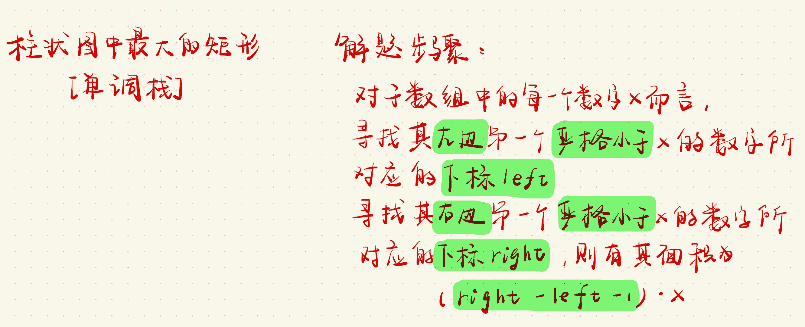

**代码**

```c++
class Solution {
public:
    int largestRectangleArea(vector<int>& h) {
        int n = h.size();
        vector<int> left(n + 5), right(n + 5);
        stack<int> stk;
        // 对于当前数而言，寻找左边第一个比当前数【严格小】的值的【下标】
        for (int i = 0; i < n; i ++ ) {
            while (stk.size() && h[stk.top()] >= h[i]) stk.pop();
            if (stk.empty()) left[i] = -1;
            else left[i] = stk.top();
            stk.push(i);
        }
        stk = stack<int>();
        // 对于当前数而言，寻找右边第一个比当前数【严格大】的值的【下标】
        for (int i = n - 1; i >= 0; i -- ) {
            while (stk.size() && h[stk.top()] >= h[i]) stk.pop();
            if (stk.empty()) right[i] = n;
            else right[i] = stk.top();
            stk.push(i);
        }
        int res = 0;
        // 算就完了
        for (int i = 0; i < n; i ++ )
            res = max(res, h[i] * (right[i] - left[i] - 1));
        return res;
    }
};
```

**时间复杂度**

$O(n)$

**空间复杂度**

$O(n)$

**标签**

`单调栈`

**缝合怪**


## 队列

### 循环队列

#### [LeetCode 622. 设计循环队列](https://leetcode-cn.com/problems/design-circular-queue/)

**题目描述**

>   设计你的循环队列实现。 循环队列是一种线性数据结构，其操作表现基于 `FIFO`（先进先出）原则并且队尾被连接在队首之后以形成一个循环。它也被称为“环形缓冲器”。
>
>   循环队列的一个好处是我们可以利用这个队列之前用过的空间。在一个普通队列里，一旦一个队列满了，我们就不能插入下一个元素，即使在队列前面仍有空间。但是使用循环队列，我们能使用这些空间去存储新的值。
>
>   你的实现应该支持如下操作：
>
>   +   `MyCircularQueue(k):` 构造器，设置队列长度为 `k` 。
>   +   `Front:` 从队首获取元素。如果队列为空，返回 `-1` 。
>   +   `Rear:` 获取队尾元素。如果队列为空，返回 `-1` 。
>   +   `enQueue(value):` 向循环队列插入一个元素。如果成功插入则返回真。
>   +   `deQueue():` 从循环队列中删除一个元素。如果成功删除则返回真。
>   +   `isEmpty():` 检查循环队列是否为空。
>   +   `isFull():` 检查循环队列是否已满。

**示例**

>   `MyCircularQueue circularQueue = new MyCircularQueue(3);` // 设置长度为 `3`
>   `circularQueue.enQueue(1);`  // 返回 `true`
>   `circularQueue.enQueue(2);`  // 返回 `true`
>   `circularQueue.enQueue(3);`  // 返回 `true`
>   `circularQueue.enQueue(4);`  // 返回 `false`，队列已满
>   `circularQueue.Rear();`  // 返回 `3`
>   `circularQueue.isFull();`  // 返回 `true`
>   `circularQueue.deQueue();`  // 返回 `true`
>   `circularQueue.enQueue(4);`  // 返回 `true`
>   `circularQueue.Rear();`  // 返回 `4`

**提示**

>   +   所有的值都在 `0` 至 `1000` 的范围内；
>   +   操作数将在 `1` 至 `1000` 的范围内；
>   +   请不要使用内置的队列库。

**手写稿**

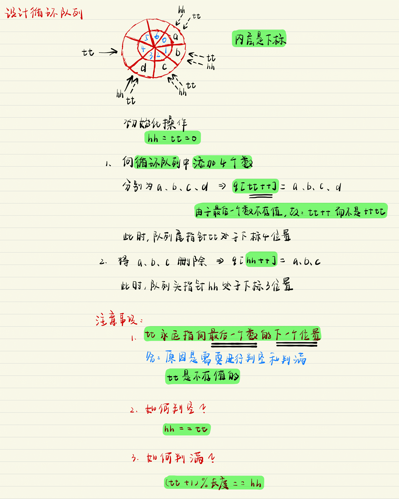

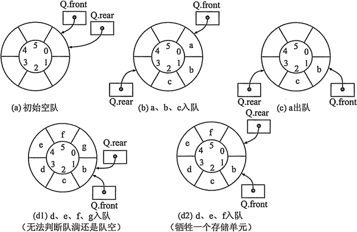

**代码**

```c++
class MyCircularQueue {
public:
    int hh = 0, tt = 0;
    vector<int> q;
    MyCircularQueue(int k) {
        // 因为tt所在的位置, 不存储数字, 故长度为n, 则需要开长度为n + 1的数组
        q.resize(k + 1);
    }
    
    bool enQueue(int value) {
        if (isFull()) return false;
        // 注意: 这里使用tt ++, 原因: tt所指的位置为空, 不填写任何数
        q[tt ++ ] = value;
        // 越界, 则从头开始
        if (tt >= q.size()) tt = 0;
        return true;
    }
    
    bool deQueue() {
        if (isEmpty()) return false;
        hh ++;
        // 越界, 则从头开始
        if (hh >= q.size()) hh = 0;
        return true; 
    }
    
    int Front() {
        if (isEmpty()) return -1;
        return q[hh];
    }
    
    int Rear() {
        if (isEmpty()) return -1;
        // 注意: tt - 1可能小于0, 故, 需要先➕q.size(), 再%q.size()
        return q[(tt - 1 + q.size()) % q.size()];
    }
    
    bool isEmpty() {
        return hh == tt;
    }
    
    bool isFull() {
        return (tt + 1) % q.size() == hh;
    }
};

/**
 * Your MyCircularQueue object will be instantiated and called as such:
 * MyCircularQueue* obj = new MyCircularQueue(k);
 * bool param_1 = obj->enQueue(value);
 * bool param_2 = obj->deQueue();
 * int param_3 = obj->Front();
 * int param_4 = obj->Rear();
 * bool param_5 = obj->isEmpty();
 * bool param_6 = obj->isFull();
 */
```

**时间复杂度**

$O(n)$

**空间复杂度**

$O(n)$

**标签**

`循环队列`

**缝合怪**


### 滑动窗口【双端队列】

#### [LeetCode 5977. 最少交换次数来组合所有的 1 II](https://leetcode-cn.com/problems/minimum-swaps-to-group-all-1s-together-ii/)

**题目描述**

> 交换 定义为选中一个数组中的两个 互不相同 的位置并交换二者的值。
>
> 环形 数组是一个数组，可以认为 第一个 元素和 最后一个 元素 相邻 。
>
> 给你一个 二进制环形 数组 `nums` ，返回在 任意位置 将数组中的所有 `1` 聚集在一起需要的最少交换次数。

**示例 1**

> 输入：`nums = [0,1,0,1,1,0,0]`
> 输出：`1`
> 解释：这里列出一些能够将所有 1 聚集在一起的方案：
> `[0,0,1,1,1,0,0]` 交换 `1` 次。
> `[0,1,1,1,0,0,0]` 交换 `1` 次。
> `[1,1,0,0,0,0,1]` 交换 `2` 次（利用数组的环形特性）。
> 无法在交换 `0` 次的情况下将数组中的所有 `1` 聚集在一起。
> 因此，需要的最少交换次数为 `1` 。

**示例 2**

> 输入：`nums = [0,1,1,1,0,0,1,1,0]`
> 输出：`2`
> 解释：这里列出一些能够将所有 `1` 聚集在一起的方案：
> `[1,1,1,0,0,0,0,1,1]` 交换 `2` 次（利用数组的环形特性）。
> `[1,1,1,1,1,0,0,0,0]` 交换 `2` 次。
> 无法在交换 `0` 次或 `1` 次的情况下将数组中的所有 `1` 聚集在一起。
> 因此，需要的最少交换次数为 `2` 。

**示例 3**

> 输入：`nums = [1,1,0,0,1]`
> 输出：`0`
> 解释：得益于数组的环形特性，所有的 `1` 已经聚集在一起。
> 因此，需要的最少交换次数为 `0` 。

**提示**

> $1\;\leq\;nums.length\;\leq\;10^5$
> `nums[i]` 为 `0` 或者 `1`

**题解**

> 1. 统计出 `1` 的个数，作为滑动窗口的大小
> 2. 将数组复制一遍，目的是断环成链
> 3. 答案即为窗口内 `0` 的最小个数

**代码**

```c++
class Solution {
public:
    int minSwaps(vector<int>& nums) {
        // 滑动窗口
        // 第一步：统计 1 的个数 作为窗口的大小
        int cnt = 0;
        for (auto& num : nums) cnt += num;
        // 第二步：断环成链
        nums.insert(nums.begin(), nums.begin(), nums.end());
        int res = INT_MAX, tmp = 0;
        for (int i = 0, j = 0; i < nums.size(); i ++ ) {
            if (i + 1 > cnt) tmp -= nums[j ++];
            // tmp 统计的是窗口内 1 的个数
            tmp += nums[i];
            res = min(res, cnt - tmp);
        }
        return res;
    }
};
```

 **标签**

`滑动窗口`、`双端队列`、`环`

#### [LeetCode 239. 滑动窗口最大值](https://leetcode-cn.com/problems/sliding-window-maximum/)

**题目描述**

> 给你一个整数数组 `nums`，有一个大小为 `k` 的滑动窗口从数组的最左侧移动到数组的最右侧。你只可以看到在滑动窗口内的 `k` 个数字。滑动窗口每次只向右移动一位。
>
> 返回滑动窗口中的最大值。

**示例 1**

> 输入：`nums = [1,3,-1,-3,5,3,6,7], k = 3`
> 输出：`[3,3,5,5,6,7]`
> 解释：
> 滑动窗口的位置                            最大值
>
> ---------------               -----
>
> `[1  3  -1] -3  5  3  6  7       3
> 1 [3  -1  -3] 5  3  6  7       3
> 1  3 [-1  -3  5] 3  6  7       5
> 1  3  -1 [-3  5  3] 6  7       5
> 1  3  -1  -3 [5  3  6] 7       6
> 1  3  -1  -3  5 [3  6  7]      7`

**示例 2**

> 输入：`nums = [1], k = 1`
> 输出：`[1]`

**示例 3**

> 输入：`nums = [1,-1], k = 1`
> 输出：`[1,-1]`

**示例 4**

> 输入：`nums = [9,11], k = 2`
> 输出：`[11]`

**示例 5**

> 输入：`nums = [4,-2], k = 2`
> 输出：`[4]`

**提示**

> + $1 <= nums.length <= 10^5$
> + $-10^4 <= nums[i] <= 10^4$
> + $1 <= k <= nums.length$

**题解**

> 1. <font style="color: red">**记住，单调队列是双端队列即可**</font>

**代码**

```c++
class Solution {
public:
    vector<int> maxSlidingWindow(vector<int>& g, int k) {
        deque<int> dq;
        vector<int> res;
        for (int i = 0; i < g.size(); i ++ ) {
            if (dq.size() && i - dq.front() + 1 > k) dq.pop_front();
            while (dq.size() && g[i] >= g[dq.back()]) dq.pop_back();
            dq.push_back(i);
            if (i >= k - 1) res.push_back(g[dq.front()]);
        }
        return res;
    }
};
```

**标签**

`滑动窗口`

## end

# 前缀和

## 一维前缀和

### [AcWing 795. 前缀和](https://www.acwing.com/problem/content/797/)

>   输入一个长度为 `n` 的整数序列。
>
>   接下来再输入 `m` 个询问，每个询问输入一对 `l,r`。
>
>   对于每个询问，输出原序列中从第 `l` 个数到第 `r` 个数的和。

**输入格式**

>   第一行包含两个整数 `n` 和 `m`。
>
>   第二行包含 `n` 个整数，表示整数数列。
>
>   接下来 `m` 行，每行包含两个整数 `l` 和 `r`，表示一个询问的区间范围。

**输出格式**

>   共 `m` 行，每行输出一个询问的结果。

**数据范围**

>   +   $1≤l≤r≤n,$
>   +   $1≤n,m≤100000,$
>   +   $−1000≤数列中元素的值≤1000$

**输入样例**

```c++
5 3
2 1 3 6 4
1 2
1 3
2 4
```

**输出样例**

```c++
3
6
10
```

**手写稿**

>   1.   `sum[i]` 表示区间 `[1, i]` 的和
>   2.   如果要计算区间 `[l, r]` 的和，首先需要明确
>        +   $sum[r] = a_1 + a_2 + ... + a_{r - 1} + a_r$
>        +   $sum[l] = a_1 + a_2 + ... + a_{l - 1} + a_l$
>        +   两者相减即可

**代码**

```c++
#include <iostream>
using namespace std;
const int N = 100010;
int n, m;
int sum[N];
int main() {
    scanf("%d%d", &n, &m);
    for (int i = 1, x; i <= n; i ++ ) {
        scanf("%d", &x);
        sum[i] = x + sum[i - 1];
    }
    while (m -- ) {
        int l, r;
        scanf("%d%d", &l, &r);
        printf("%d\n", sum[r] - sum[l - 1]);
    }
    return 0;
}
```

**标签**

`前缀和`

## 二维前缀和

### [AcWing 796. 子矩阵的和](https://www.acwing.com/problem/content/798/)

>   输入一个 `n` 行 `m` 列的整数矩阵，再输入 `q` 个询问，每个询问包含四个整数 `x1,y1,x2,y2`，表示一个子矩阵的左上角坐标和右下角坐标。
>
>   对于每个询问输出子矩阵中所有数的和。

**输入格式**

>   第一行包含三个整数 `n，m，q`。
>
>   接下来 `n` 行，每行包含 `m` 个整数，表示整数矩阵。
>
>   接下来 `q` 行，每行包含四个整数 `x1,y1,x2,y2`，表示一组询问。

**输出格式**

>   共 `q` 行，每行输出一个询问的结果。

**数据范围**

>   +   $1≤n,m≤1000,$
>   +   $1≤q≤200000,$
>   +   $1≤x1≤x2≤n,$
>   +   $1≤y1≤y2≤m,$
>   +   $−1000≤矩阵内元素的值≤1000$

**输入样例**

```c++
3 4 3
1 7 2 4
3 6 2 8
2 1 2 3
1 1 2 2
2 1 3 4
1 3 3 4
```

**输出样例**

```c++
17
27
21
```

**手写稿**

>   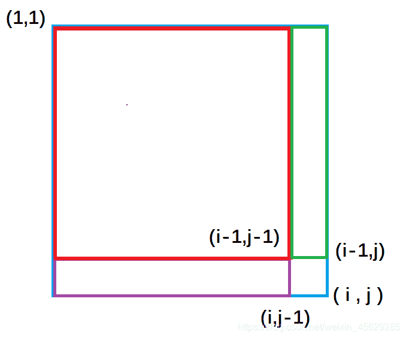
>
>   紫色面积是指 `(1,1)` 左上角到 `(i,j-1)` 右下角的矩形面积, 绿色面积是指 `(1,1)` 左上角到 `(i-1, j )` 右下角的矩形面积。每一个颜色的矩形面积都代表了它所包围元素的和。
>
>   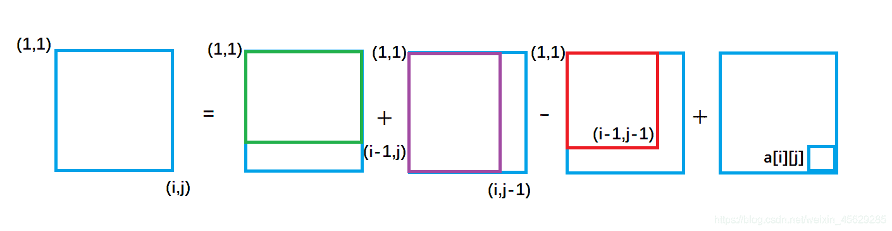
>
>   从图中我们很容易看出，整个外围蓝色矩形面积`s[i][j]` = 绿色面积`s[i-1][j]` + 紫色面积`s[i][j-1]` - 重复加的红色的面积`s[i-1][j-1]` `+`小方块的面积`a[i][j]`;
>
>   因此得出二维前缀和预处理公式
>
>   `s[i] [j] = s[i-1][j] + s[i][j-1 ] + a[i] [j] - s[i-1][ j-1]`
>
>   接下来回归问题去求以 `(x1,y1)` 为左上角和以 `(x2,y2)` 为右下角的矩阵的元素的和。
>
>   同样的道理【<font style= "color: red">**你这题目一次一次换了多少个，改过不啦，换汤不换药啊**</font>】

**代码**

```c++
#include <iostream>
using namespace std;
const int N = 1010;
int n, m, q;
int g[N][N], sum[N][N];
int main() {
    scanf("%d%d%d", &n, &m, &q);
    for (int i = 1; i <= n; i ++ )
        for (int j = 1; j <= m; j ++ ) {
            scanf("%d", &g[i][j]);
            sum[i][j] = g[i][j] + sum[i - 1][j] + sum[i][j - 1] - sum[i - 1][j - 1];
        }
    while (q -- ) {
        int x1, y1, x2, y2;
        scanf("%d%d%d%d", &x1, &y1, &x2, &y2);
        cout << sum[x2][y2] - sum[x2][y1 - 1] - sum[x1 - 1][y2] + sum[x1 - 1][y1 - 1] << endl;
    }
    return 0;
}
```

**标签**

`前缀和`、`二维前缀和`

# 差分

## 一维差分

### [AcWing 797. 差分](https://www.acwing.com/problem/content/799/)

>   输入一个长度为 `n` 的整数序列。
>
>   接下来输入 `m` 个操作，每个操作包含三个整数 `l,r,c`，表示将序列中 `[l,r]` 之间的每个数加上 `c`。
>
>   请你输出进行完所有操作后的序列。

**输入格式**

>   第一行包含两个整数 `n` 和 `m`。
>
>   第二行包含 `n` 个整数，表示整数序列。
>
>   接下来 `m` 行，每行包含三个整数 `l，r，c`，表示一个操作。

**输出格式**

>   共一行，包含 `n` 个整数，表示最终序列。

**数据范围**

>   +   $1≤n,m≤100000,$
>   +   $1≤l≤r≤n,$
>   +   $−1000≤c≤1000,$
>   +   $−1000≤整数序列中元素的值≤1000$

**输入样例**

```c++
6 3
1 2 2 1 2 1
1 3 1
3 5 1
1 6 1
```

**输出样例**

```c++
3 4 5 3 4 2
```

**手写稿**

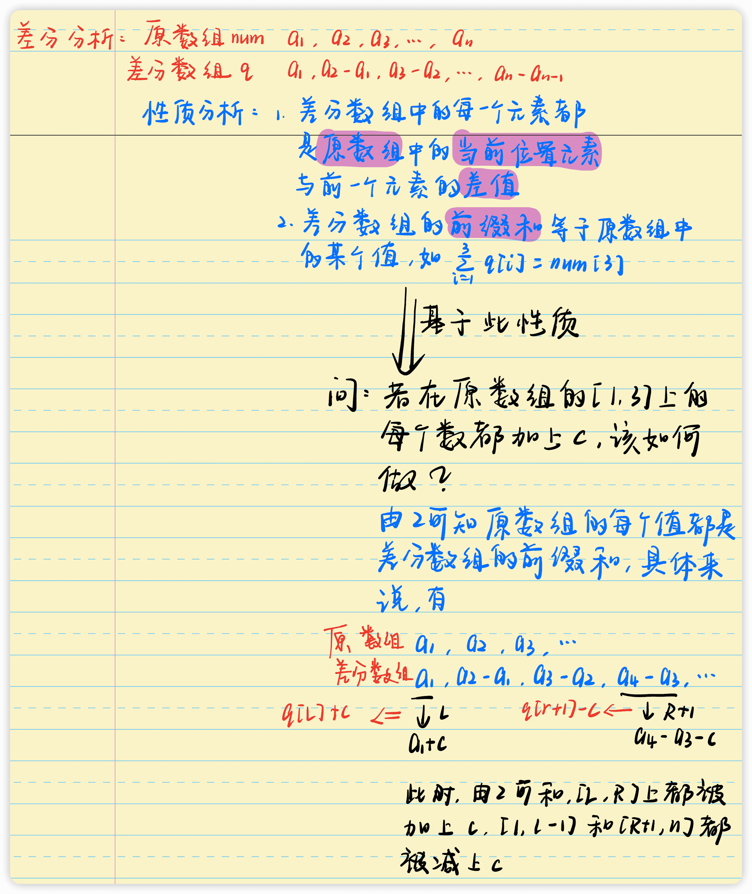

**代码**

```c++
#include <iostream>
using namespace std;
const int N = 100010;
int n, m;
int g[N];
int main() {
    scanf("%d%d", &n, &m);
    for (int i = 1, a = 0, b = 0; i <= n; i ++ ) {
        scanf("%d", &a);
        g[i] = a - b;
        b = a;
    }
    while (m -- ) {
        int l, r, c;
        scanf("%d%d%d", &l, &r, &c);
        g[l] += c;
        g[r + 1] -= c;
    }
    for (int i = 1, x; i <= n; i ++ ) {
        x += g[i];
        cout << x << " ";
    }
    return 0;
}
```

**标签**

`差分`、`一维差分`

### [AcWing 4195. 线段覆盖](https://www.acwing.com/problem/content/4198/)

>   在一个坐标轴上有 `n` 条线段。
>
>   每条线段的每个端点的坐标都为整数。
>
>   可能存在退化成点的线段。
>
>   线段之间可以相互交叉、嵌套甚至重合。
>
>   请你计算，对于每个 `k∈{1,2,…,n}`，坐标轴中共有多少个**整数坐标**的点满足恰好被 `k` 条线段覆盖。
>
>   注意，左右端点分别为 $l_i,r_i$ 的线段覆盖点 `x` 当且仅当 $l_i≤x≤r_i$。

**输入格式**

>   第一行包含整数 `n`。
>
>   接下来 `n` 行，每行包含两个整数 $l_i,r_i$，表示一条线段的左右端点。

**输出格式**

>   一行 `n` 个整数，其中第 `i` 个整数表示坐标轴中满足恰好被 `i` 条线段覆盖的**整数坐标**的点的数量。

**数据范围**

>   +   $前三个测试点满足 1≤n≤3。$
>   +   $所有测试点满足 1≤n≤2×10^5，0≤li≤ri≤10^{18}。$

**输入样例1**

```c++
3
0 3
1 3
3 8
```

**输出样例1**

```c++
6 2 1
```

**输入样例2**

```c++
3
1 3
2 4
5 7
```

**输出样例2**

```c++
5 2 0
```

**手写稿**

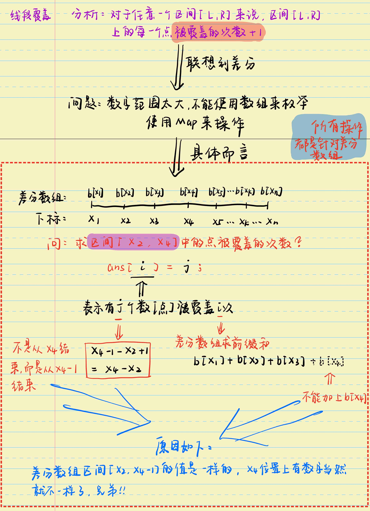

**代码**

```c++
#include <iostream>
#include <map>
using namespace std;
typedef long long LL;
const int N = 200010;
int n;
LL ans[N];
// 差分数组
map<LL, LL> q;
int main() {
    scanf("%d", &n);
    for (int i = 1; i <= n; i ++ ) {
        LL l, r;
        scanf("%lld%lld", &l, &r);
        q[l] += 1;
        q[r + 1] -= 1;
    }
    // last表示上一个位置，sum表示前缀和
    LL last = -1, sum = 0;
    for (auto& [x, c] : q) {
        ans[sum] += x - last;
        last = x;
        sum += c;
    }
    for (int i = 1; i <= n; i ++ ) cout << ans[i] << " ";
    return 0;
}
```

**标签**

`离散化`、`差分`

## 二维差分

### [AcWing 798. 差分矩阵](https://www.acwing.com/problem/content/800/)

>   输入一个 `n` 行 `m` 列的整数矩阵，再输入 `q` 个操作，每个操作包含五个整数 `x1,y1,x2,y2,c`，其中 `(x1,y1)` 和 `(x2,y2)` 表示一个子矩阵的左上角坐标和右下角坐标。
>
>   每个操作都要将选中的子矩阵中的每个元素的值加上 `c`。
>
>   请你将进行完所有操作后的矩阵输出。

**输入格式**

>   第一行包含整数 `n,m,q`。
>
>   接下来 `n` 行，每行包含 `m` 个整数，表示整数矩阵。
>
>   接下来 `q` 行，每行包含 `5` 个整数 `x1,y1,x2,y2,c`，表示一个操作。

**输出格式**

>   共 `n` 行，每行 `m` 个整数，表示所有操作进行完毕后的最终矩阵。

**数据范围**

>   +   $1≤n,m≤1000,$
>   +   $1≤q≤100000,$
>   +   $1≤x1≤x2≤n,$
>   +   $1≤y1≤y2≤m,$
>   +   $−1000≤c≤1000,$
>   +   $−1000≤矩阵内元素的值≤1000$

**输入样例**

```c++
3 4 3
1 2 2 1
3 2 2 1
1 1 1 1
1 1 2 2 1
1 3 2 3 2
3 1 3 4 1
```

**输出样例**

```c++
2 3 4 1
4 3 4 1
2 2 2 2
```

**手写稿**

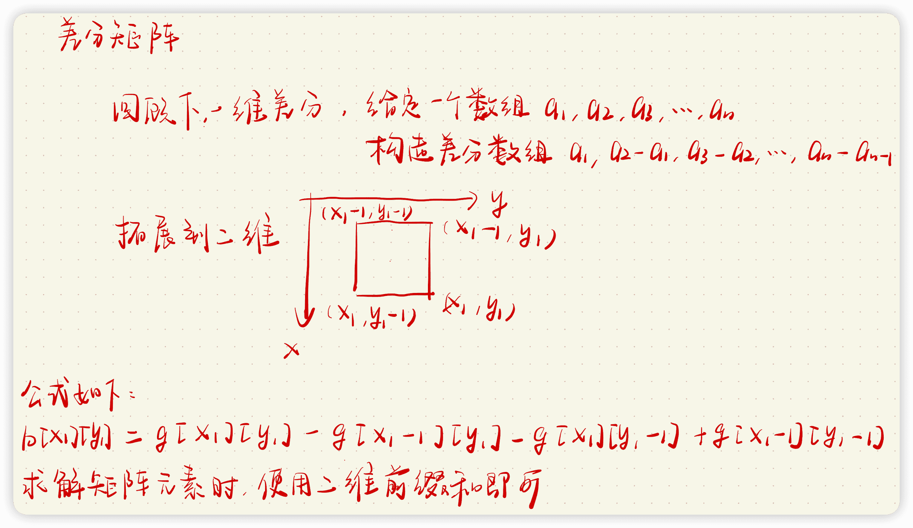

**代码**

```c++
#include <iostream>
using namespace std;
const int N = 1010;
int n, m, q;
int g[N][N], b[N][N];
int main() {
    scanf("%d%d%d",&n, &m, &q);
    for (int i = 1; i <= n; i ++ )
        for (int j = 1; j <= m; j ++ ) {
            scanf("%d", &g[i][j]);
            // 构建差分矩阵
            b[i][j] = g[i][j] - g[i - 1][j] - g[i][j - 1] + g[i - 1][j - 1];
            
        }
    while (q -- ) {
        int x1, y1, x2, y2, c;
        scanf("%d%d%d%d%d", &x1, &y1, &x2, &y2, &c);
        // 差分矩阵公式
        b[x1][y1] += c;
        b[x2 + 1][y1] -= c;
        b[x1][y2 + 1] -= c;
        b[x2 + 1][y2 + 1] += c;
    }
    for (int i = 1; i <= n; i ++ ) {
        for (int j = 1; j <= m; j ++ ) {
            // 求前缀和
            b[i][j] = b[i][j] + b[i - 1][j] + b[i][j - 1] - b[i - 1][j - 1];
            cout << b[i][j] << " ";
        }
        cout << endl;
    }
    return 0;
}
```

**标签**

`差分`、`二维差分`

# 多指针专题

## 双指针

### 快慢指针

#### [LeetCode 141. 环形链表](https://leetcode-cn.com/problems/linked-list-cycle/)

**题目描述**

> 给你一个链表的头节点 `head` ，判断链表中是否有环。
>
> 如果链表中有某个节点，可以通过连续跟踪 `next` 指针再次到达，则链表中存在环。 为了表示给定链表中的环，评测系统内部使用整数 `pos` 来表示链表尾连接到链表中的位置（索引从 `0` 开始）。如果 `pos` 是 `-1`，则在该链表中没有环。注意：`pos` 不作为参数进行传递，仅仅是为了标识链表的实际情况。
>
> 如果链表中存在环，则返回 `true` 。 否则，返回 `false` 。 

**示例 1**


> 输入：`head = [3,2,0,-4], pos = 1`
> 输出：`true`
> 解释：链表中有一个环，其尾部连接到第二个节点。

**示例 2**


> 输入：`head = [1,2], pos = 0`
> 输出：`true`
> 解释：链表中有一个环，其尾部连接到第一个节点。

**示例 3**


> 输入：`head = [1], pos = -1`
> 输出：`false`
> 解释：链表中没有环。

**提示**

> 链表中节点的数目范围是 $[0, 10^4]$
> $-10^5 <= Node.val <= 10^5$
> `pos` 为 `-1` 或者链表中的一个 有效索引 。
>
>
> 进阶：你能用 O(1)（即，常量）内存解决此问题吗？

**题解**

> 1. 设置 `fast` 和 `slow` 两个指针
> 2. `fast` 一次走两步，`slow` 一次走一步，分两种情况：
>     + `fast` 走到空指针，说明无环
>     + `fast` 和 `slow` 相等，说明有环

**代码**

```c++
class Solution {
public:
    bool hasCycle(ListNode *head) {
        if (!head) return false;
        auto fast = head, slow = head;
        do {
            fast = fast -> next;
            slow = slow -> next;
            if (fast) fast = fast -> next;
            else return false;
            if (fast == slow) return true;
        } while (fast);
        return false;
    }
};
```

**标签**

`双指针`、`快慢指针`、`环`

#### [LeetCode 142. 环形链表 II](https://leetcode-cn.com/problems/linked-list-cycle-ii/)

**题目描述**

> 给定一个链表，返回链表开始入环的第一个节点。 如果链表无环，则返回 `null`。
>
> 如果链表中有某个节点，可以通过连续跟踪 `next` 指针再次到达，则链表中存在环。 为了表示给定链表中的环，评测系统内部使用整数 `pos` 来表示链表尾连接到链表中的位置（索引从 `0` 开始）。如果 `pos` 是 `-1`，则在该链表中没有环。注意：`pos` 不作为参数进行传递，仅仅是为了标识链表的实际情况。
>
> 不允许修改 链表。

**示例 1**


> 输入：`head = [3,2,0,-4], pos = 1`
> 输出：返回索引为 `1` 的链表节点
> 解释：链表中有一个环，其尾部连接到第二个节点。

**示例 2**


> 输入：`head = [1,2], pos = 0`
> 输出：返回索引为 `0` 的链表节点
> 解释：链表中有一个环，其尾部连接到第一个节点。

**示例 3**


> 输入：`head = [1], pos = -1`
> 输出：返回 `null`
> 解释：链表中没有环。

**提示**

> + 链表中节点的数目范围在范围 $[0, 10^4]$ 内
> + $-10^5 <= Node.val <= 10^5$
> + `pos` 的值为 `-1` 或者链表中的一个有效索引

**进阶**

> 你是否可以使用 `O(1)` 空间解决此题？

**题解**

> 1. 设置 `fast` 和 `slow` 指针
> 2. `fast` 指针一次走两步，`slow` 指针一次走一步，分两种情况讨论
>     + 如果 `fast` 指针为空，说明无环
>     + 如果 `fast == slow`，则让 `fast == head`，然后让 `fast` 和 `slow` 指针同时走，当两者相遇时，即为环的入口

**正确性证明**

> 
>
> 证明如下
> $$
> 当fast指针和slow指针两者相遇的时候，满足l_{fast}\;=\;2\;*\;l_{slow}\;\;(1) \\
> l_{fast}\;=\;l_{ab}\;+\;n\;*\;l_{圆}\;+\;l_{bc}\;\;(2) \\
> l_{slow}\;=\;l_{ab}\;+\;l_{bc}\;\;(3)，结合(1)(2)(3)式，有 \\
> \begin{align*}
> l_{ab}\;+\;l_{bc}&=\;n\;*\;l_{圆} \\
> &= (n\;-\;1)\;*\;l_{圆}\;+\;l_{bc}\;+\;l_{cb}，从而有
> \end{align*}
> \\
> l_{ab} = (n\;-\;1)\;*\;l_{圆}\;+\;l_{cb}
> $$

**代码**

 ```c++
class Solution {
public:
    ListNode *detectCycle(ListNode *head) {
        if (!head) return NULL;
        auto fast = head, slow = head;
        do {
            fast = fast -> next;
            slow = slow -> next;
            if (fast) fast = fast -> next;
            if (!fast) return NULL;
        } while (fast != slow);
        fast = head;
        while (fast != slow) {
            fast = fast -> next;
            slow = slow -> next;
        }
        return fast;
    }
};
 ```

**标签**

`双指针`、`快慢指针`、`环`

#### [LeetCode 287. 寻找重复数](https://leetcode-cn.com/problems/find-the-duplicate-number/)

**题目描述**

> 给定一个包含 `n + 1` 个整数的数组 `nums` ，其数字都在 `1` 到 `n` 之间（包括 `1` 和 `n`），可知至少存在一个重复的整数。
>
> 假设 `nums` 只有 一个重复的整数 ，找出 这个重复的数 。
>
> 你设计的解决方案必须不修改数组 `nums` 且只用常量级 `O(1)` 的额外空间。

**示例 1**

> 输入：`nums = [1,3,4,2,2]`
> 输出：`2`

**示例 2**

> 输入：`nums = [3,1,3,4,2]`
> 输出：`3`

**示例 3**

> 输入：`nums = [1,1]`
> 输出：`1`

**示例 4**

> 输入：`nums = [1,1,2]`
> 输出：`1`

**提示**

> + $1 <= n <= 10^5$
> + $nums.length == n + 1$
> + $1 <= nums[i] <= n$
> + `nums` 中 只有一个整数 出现 两次或多次 ，其余整数均只出现 一次

**进阶**

> 如何证明 `nums` 中至少存在一个重复的数字?
> 你可以设计一个线性级时间复杂度 `O(n)` 的解决方案吗？

**题解**

> 1. `n + 1` 个整数，且数字都在 `1 ～ n` 之间，因此，一定有一个数字被指向两次，以下标和下标对应的数字连接一条有向边的话，则问题转化为寻找环的入口的问题，快慢指针做即可

**代码**

```c++
class Solution {
public:
    int findDuplicate(vector<int>& nums) {
        int fast = 0, slow = 0;
        do {
            fast = nums[nums[fast]];
            slow = nums[slow];
        } while (fast != slow);
        fast = 0;
        while (fast != slow) {
            fast = nums[fast];
            slow = nums[slow];
        }
        return fast;
    }
};
```

**标签**

`双指针`、`快慢指针`、`环`

## 三指针

### [LeetCode 75. 颜色分类](https://leetcode-cn.com/problems/sort-colors/)

**题目描述**

> 给定一个包含红色、白色和蓝色、共 `n` 个元素的数组 `nums` ，原地对它们进行排序，使得相同颜色的元素相邻，并按照红色、白色、蓝色顺序排列。
>
> 我们使用整数 `0、 1` 和 `2` 分别表示红色、白色和蓝色。
>
> 必须在不使用库的 `sort` 函数的情况下解决这个问题。

**示例 1**

> 输入：`nums = [2,0,2,1,1,0]`
> 输出：`[0,0,1,1,2,2]`

**示例 2**

> 输入：`nums = [2,0,1]`
> 输出：`[0,1,2]`

**提示**

> + $n == nums.length$
> + $1 <= n <= 300$
> + $nums[i] 为 0、1 或 2$

**进阶**

> 你可以不使用代码库中的排序函数来解决这道题吗？
> 你能想出一个仅使用常数空间的一趟扫描算法吗？

**手写稿**

> 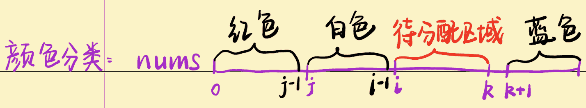
>
> 1. `0 ~ j - 1` 是红色，`j ~ i - 1` 是白色，`k +1 ~ n` 是蓝色，`i ~ k` 是待分配区域
> 2. 针对 `nums[i]` 的取值分三种情况：
>     + `nums[i]`  取值为 `0`，则交换 `nums[i ++]` 和 `nums[j ++]` 的值
>     + `nums[i]` 取值为 `1`，则直接 `i ++`
>     + `nums[i]`  取值为 `2`，则交换 `nums[i]` 和 `nums[k -- ]` 的值
>         + 为啥不是 `i ++` ，因为 `i` 到 `k` 都是待分配区域，无法判别 `nums[i]` 是 `0，1` 或者 `2`，所以，不能 `++`

**代码**

```c++
class Solution {
public:
    void sortColors(vector<int>& nums) {
        for (int i = 0, j = 0, k = nums.size() - 1; i <= k;) {
            if (nums[i] == 0) swap(nums[j ++], nums[i ++]);
            else if (nums[i] == 1) i ++;
            else swap(nums[i], nums[k --]);
        }
        return;
    }
};
```

**标签**

`三指针`、`荷兰国旗`

## end

# 位运算

## 普通位运算

### [LeetCode 260. 只出现一次的数字 III](https://leetcode-cn.com/problems/single-number-iii/)

**题目描述**

> 给定一个整数数组 `nums`，其中恰好有两个元素只出现一次，其余所有元素均出现两次。 找出只出现一次的那两个元素。你可以按 任意顺序 返回答案。
>
> 进阶：你的算法应该具有线性时间复杂度。你能否仅使用常数空间复杂度来实现？

**示例 1**

> 输入：`nums = [1,2,1,3,2,5]`
> 输出：`[3,5]`
> 解释：`[5, 3]` 也是有效的答案。

**示例 2**

> 输入：`nums = [-1,0]`
> 输出：`[-1,0]`

**示例 3**

> 输入：`nums = [0,1]`
> 输出：`[1,0]`

**提示**

> + $2\;\leq\;nums.length\;\leq\;3\;*\;10^4$
> + $-2^{31}\;\leq\;nums[i]\;\leq\;2^{31}\;-\;1$
> + 除两个只出现一次的整数外，nums 中的其他数字都出现两次

**题解**

> 1. 将所有数字进行异或之后得到的值 `ab` 即为只出现一次的那两个元素 `a` 和 `b` 的异或值
> 2. 由异或的性质可知 `ab` 的二进制表示中某一位 `k`上的值为 `1` ，说明元素 `a` 和 元素 `b` 在 `k` 上的二进制是不同的。因此，可以根据第 `k` 位进行划分，将整个数组划分成为两部分，一部分表示第 `k` 位的值为 `1` ，另一部分表示第 `k` 位的值为 `0`，此时问题变成在一个数组中，只有一个数出现一次，其他数出现两次，可解

**代码**

```c++
class Solution {
public:
    int get(vector<int>& nums, int k, int u) {
        int res = 0;
        for (auto& num : nums)
            if ((num >> k & 1) == u) res ^= num;
        return res;
    }
    vector<int> singleNumber(vector<int>& nums) {
        int ab = 0;
        for (auto& num : nums) ab ^= num;
        int k = 0;
        while ((ab >> k & 1) == 0) k ++;
        return {get(nums, k, 1), get(nums, k, 0)};
    }
};
```

**标签**

`位运算`

### [LeetCode 338. 比特位计数](https://leetcode-cn.com/problems/counting-bits/)

**题目描述**

> 给你一个整数 `n` ，对于 `0 <= i <= n` 中的每个 `i` ，计算其二进制表示中 `1` 的个数 ，返回一个长度为 `n + 1` 的数组 `ans` 作为答案。

**示例 1**

> 输入：`n = 2`
> 输出：`[0,1,1]`
> 解释：
> `0 --> 0`
> `1 --> 1`
> `2 --> 10`

**示例 2**

> 输入：`n = 5`
> 输出：`[0,1,1,2,1,2]`
> 解释：
> `0 --> 0`
> `1 --> 1`
> `2 --> 10`
> `3 --> 11`
> `4 --> 100`
> `5 --> 101`

**提示**

> + $0 <= n <= 10^5$

**进阶**

> 很容易就能实现时间复杂度为 `O(n log n)` 的解决方案，你可以在线性时间复杂度 `O(n)` 内用一趟扫描解决此问题吗？
> 你能不使用任何内置函数解决此问题吗？（如，`C++` 中的 `__builtin_popcount` ）

**方法一：枚举 + 位运算**

**步骤**

> 1. 遍历每一个数字，检查每一个数字的二进制位中含有的 `1` 的个数即可
> 2. 使用 `lowbit` 函数进行检查 `1` 的数量
>     + `lowbit` 函数 `x & -x` 可以取得 `x` 的最后一位 `1`

**代码**

```c++
class Solution {
public:
    int get(int x) {
        int res = 0;
        while (x) {
            x -= x & -x;
            res ++;
        }
        return res;
    }
    vector<int> countBits(int n) {
        vector<int> res;
        for (int i = 0; i <= n; i ++ ) res.push_back(get(i));
        return res;
    }
};
```

**方法二：动态规划 + 位运算**

**手写稿**

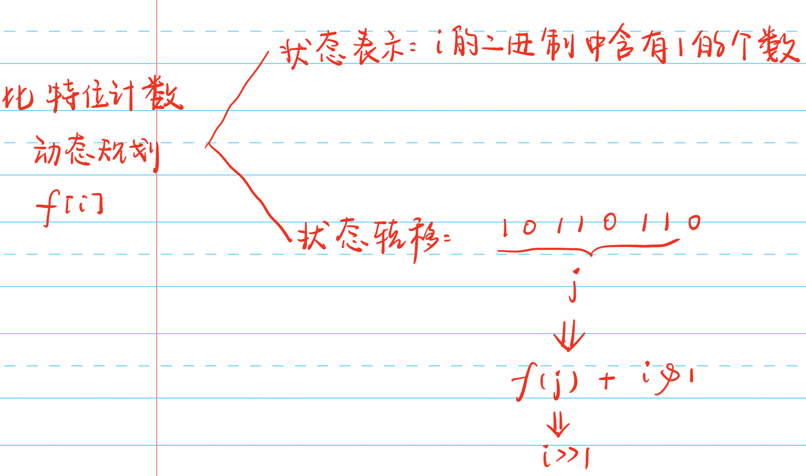

**代码**

```c++
class Solution {
public:
    vector<int> countBits(int n) {
        vector<int> f(n + 1);
        for (int i = 0; i <= n; i ++ ) f[i] = f[i >> 1] + (i & 1);
        return f;
    }
};
```

**标签**

` 动态规划`、`位运算`

### [AcWing 318. 最大单词长度乘积](https://leetcode-cn.com/problems/maximum-product-of-word-lengths/)

**题目描述**

> 给你一个字符串数组 `words` ，找出并返回 `length(words[i]) * length(words[j])` 的最大值，并且这两个单词不含有公共字母。如果不存在这样的两个单词，返回 `0` 。

**示例 1**

> 输入：`words = ["abcw","baz","foo","bar","xtfn","abcdef"]`
> 输出：`16`
> 解释：这两个单词为 `"abcw", "xtfn"`。

**示例 2**

> 输入：`words = ["a","ab","abc","d","cd","bcd","abcd"]`
> 输出：`4` 
> 解释：这两个单词为 `"ab", "cd"`。

**示例 3**

> 输入：`words = ["a","aa","aaa","aaaa"]`
> 输出：`0`
> 解释：不存在这样的两个单词。

**提示**

> + $2 <= words.length <= 1000$
> + $1 <= words[i].length <= 1000$
> + $words[i]$ 仅包含小写字母

**手写稿**

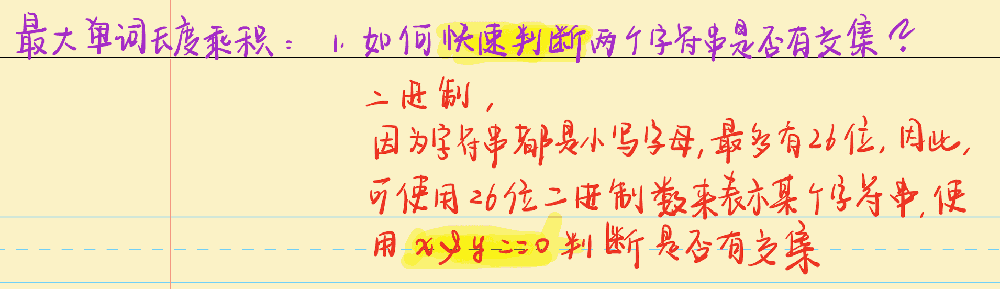

**代码**

```c++
class Solution {
public:
    int maxProduct(vector<string>& words) {
        vector<int> state;
        for (auto& word : words) {
            int s = 0;
            // 26位二进制，也就是说a, aa, aaa实际上映射的都是同一个数字
            // 注意体会
            for (auto& c : word) s |= 1 << (c - 'a');
            state.push_back(s);
        }
        int res = 0;
        for (int i = 0; i < words.size(); i ++ )
            for (int j = i + 1; j < words.size(); j ++ )
                if (!(state[i] & state[j]))
                    res = max(res, (int)(words[i].size() * words[j].size()));
        return res;
    }
};
```

**标签**

`位运算`

### [LeetCode 371. 两整数之和](https://leetcode-cn.com/problems/sum-of-two-integers/)

**题目描述**

>   给你两个整数 `a` 和 `b` ，不使用 运算符 `+` 和 `-` ，计算并返回两整数之和。

**示例 1**

>   输入：`a = 1, b = 2`
>   输出：`3`

**示例 2**

>   输入：`a = 2, b = 3`
>   输出：`5`

**提示**

>   +   $-1000 <= a, b <= 1000$

**手写稿**

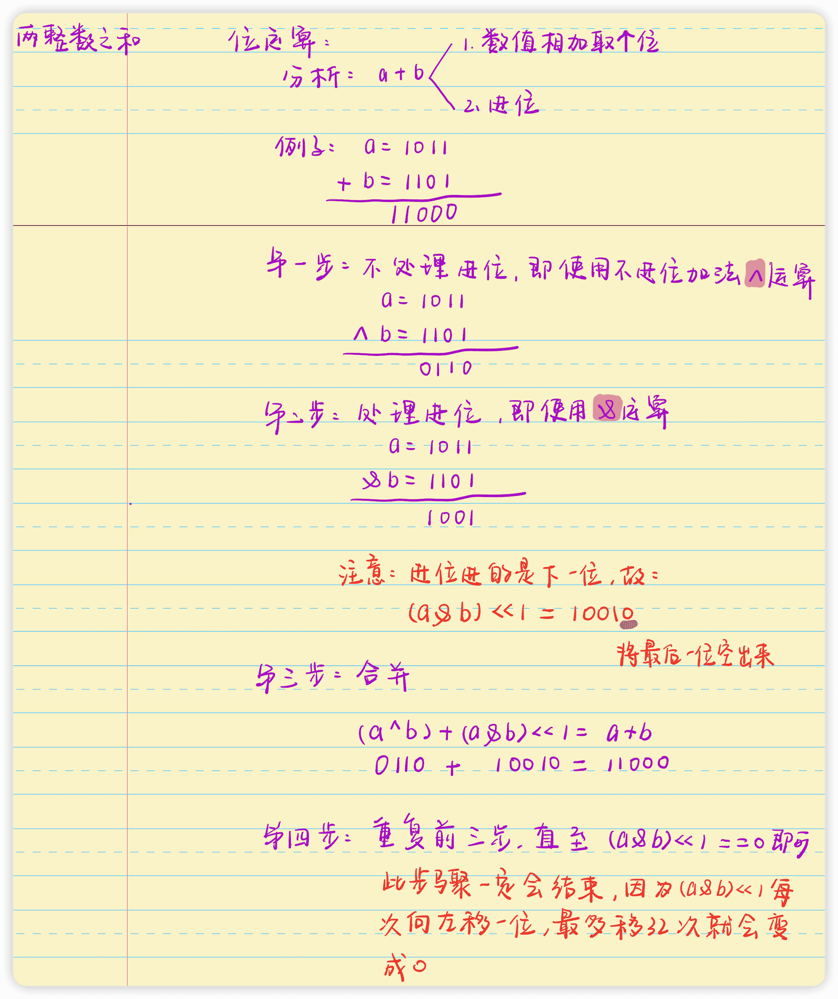

**代码**

```c++
class Solution {
public:
    int getSum(int a, int b) {
        if (!b) return a;
        int sum = a ^ b, carry = (unsigned)(a & b) << 1;
        return getSum(sum, carry);
    }
};
```

**标签**

`位运算`

### [LeetCode 29. 两数相除](https://leetcode-cn.com/problems/divide-two-integers/)

**题目描述**

>   给定两个整数，被除数 `dividend` 和除数 `divisor`。将两数相除，要求不使用乘法、除法和 `mod` 运算符。
>
>   返回被除数 `dividend` 除以除数 `divisor` 得到的商。
>
>   整数除法的结果应当截去（`truncate`）其小数部分，例如：`truncate(8.345) = 8` 以及 `truncate(-2.7335) = -2`

**示例 1**

>   输入: `dividend = 10, divisor = 3`
>   输出: `3`
>   解释: `10/3 = truncate(3.33333..) = truncate(3) = 3`

**示例 2**

>   输入: `dividend = 7, divisor = -3`
>   输出: `-2`
>   解释: `7/-3 = truncate(-2.33333..) = -2`

**提示**

>   被除数和除数均为 `32` 位有符号整数。
>   除数不为 `0`。
>   假设我们的环境只能存储 `32` 位有符号整数，其数值范围是 $[−2^{31},  2^{31} − 1]$。本题中，如果除法结果溢出，则返回 $2^{31} − 1$。

**手写稿**

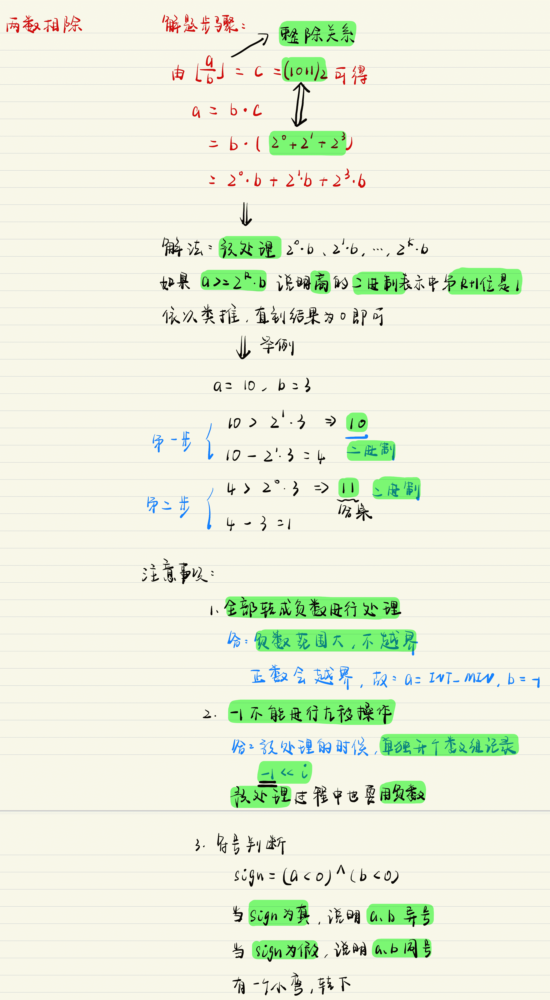

**代码**

```c++
#define x first
#define y second
typedef pair<int, int> PII;
class Solution {
public:
    int divide(int a, int b) {
        int sign = (a < 0) ^ (b < 0);
        if (a > 0) a = 0 - a;
        if (b > 0) b = 0 - b;
        vector<PII> nums; // 第二维记录-1 << i
        for (int i = 0, bia = b, t = -1; i < 32; i ++ ) {
            nums.push_back({bia, t});
            // 越界, 则直接返回即可
            if (bia < a / 2) break;
            bia += bia;
            t += t;
        }
        int res = 0;
        for (int i = nums.size() - 1; i >= 0; i -- )
            if (a <= nums[i].x) {
                res += nums[i].y;
                a -= nums[i].x;
            }
        // 如果同号
        if (!sign) {
            // 如果等于最小值, 则取反之后一定会越界, 故, 返回最大值即可
            if (res == INT_MIN) res = INT_MAX;
            // 否则, 取反即可
            else res = 0 - res;
        }
        return res;
    }
};
```

**时间复杂度**

$O(log_n)$

**空间复杂度**

$O(log_n)$

**标签**

`位运算`

**缝合怪**


## 快速幂

### 整数快速幂

#### [AcWing 875. 快速幂](https://www.acwing.com/problem/content/877/)

**题目描述**

>   给定 `n` 组 $a_i, b_i, p_i$，对于每组数据，求出 $a_i^{b_i} mod p_i$ 的值。

**输入格式**

>   第一行包含整数 `n`。
>
>   接下来 `n` 行，每行包含三个整数 $a_i, b_i, p_i$。

**输出格式**

>   对于每组数据，输出一个结果，表示 $a_i^{b_i} mod p_i$ 的值。
>
>   每个结果占一行。

**数据范围**

>   +   $1 ≤ n ≤ 100000,$
>   +   $1 ≤ a_i, b_i, p_i ≤ 2 × 10^9$

**输入样例**

```c++
2
3 2 5
4 3 9
```

**输出样例**

```c++
4
1
```

**手写稿**

>   1.   模板题

**代码**

```c++
#include <iostream>
using namespace std;
typedef long long LL;
int n;
int qmi(int a, int b, int p) {
    int res = 1;
    while (b) {
        // 转成long long类型, 乘积可能会爆int类型
        if (b & 1) res = (LL)res * a % p;
        // 转成long long类型, 乘积可能会爆int类型
        a = (LL)a * a % p;
        b >>= 1;
    }
    return res;
}
int main() {
    scanf("%d", &n);
    for (int i = 0; i < n; i ++ ) {
        int a, b, p;
        scanf("%d%d%d", &a, &b, &p);
        cout << qmi(a, b, p) << endl;
    }
    return 0;
}
```

**时间复杂度**

$O(nlog_b)$

**空间复杂度**

$O(1)$

**标签**

`快速幂`

**缝合怪**


### 矩阵快速幂

#### [T103763 【模板】矩阵乘法](https://www.luogu.com.cn/problem/T103763)

**题目描述**

>   给定两个矩阵`a、b`，求矩阵`c = a * b`。

**输入格式**

>   $x_1, y_1, x_2, y_2$分别为矩阵 `1` 和矩阵 `2` 的列数和行数。
>
>   第 `1` 行：$x_1 y_1 x_2 y_2$
>
>   第 $2 \sim 2 + y_1$ 行：矩阵`1`
>
>   第 $3 + y_1 \sim 3 + y_1 + y_2$ 行：矩阵`2`
>
>   （数据保证$x_1 = y_2$）

**输出格式**

>   共 $x_1$ 行，每行输出矩阵 `c` 在该行的每个值

**输入样例1**

```c++
2 2 2 2
2 2
2 2
2 2
2 2
```

**输出样例1**

```c++
8 8
8 8
```

**输入样例2**

```c++
2 2 2 2
1 2
3 1
2 5
1 7
```

**输出样例2**

```c++
4 19
7 22
```

**说明/提示**

>   $对于 100\% 的数据，1 <= x_1, y_1, x_2, y_2 <= 100，1 <= 矩阵a, b中的每个值 <= 100$

**手写稿**

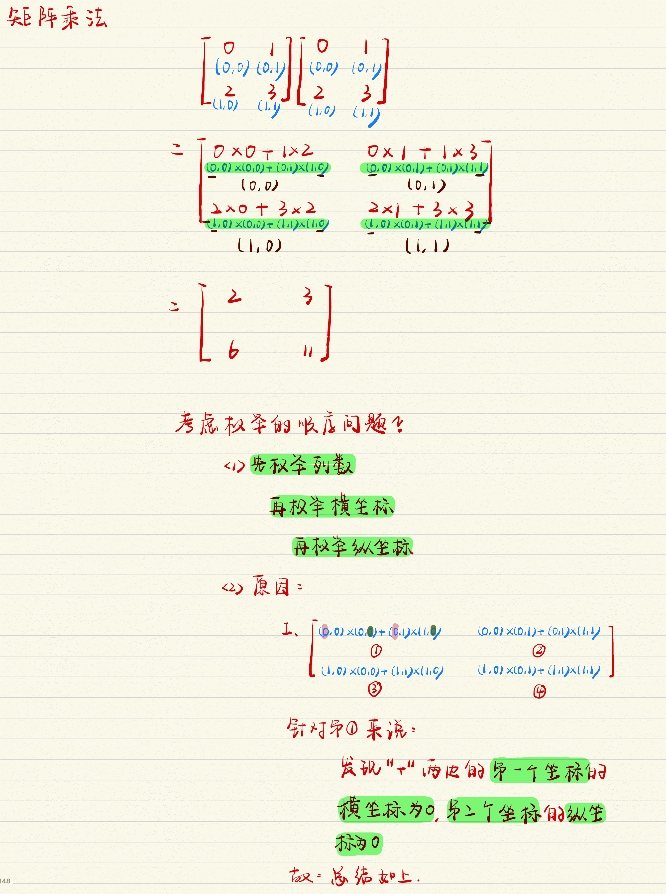

**代码**

```c++
#include <iostream>
using namespace std;
const int N = 110;
int x1, y1, x2, y2;
int a[N][N], b[N][N], res[N][N];
int main() {
    // 小小的注意点: 先输入列数, 再输入行数
    scanf("%d%d%d%d", &y1, &x1, &y2, &x2);
    for (int i = 0; i < x1; i ++ )
        for (int j = 0; j < y1; j ++ )
            scanf("%d", &a[i][j]);
    for (int i = 0; i < x2; i ++ )
        for (int j = 0; j < y2; j ++ )
            scanf("%d", &b[i][j]);
    // 枚举列
    for (int k = 0; k < x2; k ++ )
        // 枚举横坐标
        for (int i = 0; i < x1; i ++ )
            // 枚举纵坐标
            for (int j = 0; j < y2; j ++ )
                res[i][j] += a[i][k] * b[k][j];
    for (int i = 0; i < x1; i ++ ) {
        for (int j = 0; j < y2; j ++ )
            cout << res[i][j] << " ";
        cout << endl;
    }
    return 0;
}
```

**时间复杂度**

$O(x_1x_2y_2)$

**空间复杂度**

$O(max(x_1 * y_1, x_2 * y_ 2))$

**标签**

`矩阵乘法`

**缝合怪**


#### [P3390 【模板】矩阵快速幂](https://www.luogu.com.cn/problem/P3390)

**题目描述**

>   给定 $n\times n$ 的矩阵 `A`，求 $A^k$。

**输入格式**

>   第一行两个整数 `n, k` 接下来 `n` 行，每行 `n` 个整数，第 `i` 行的第 `j` 的数表示 $A_{i,j}$。

**输出格式**

>   输出$ A^k$
>
>   共 `n` 行，每行 `n` 个数，第 `i` 行第 `j` 个数表示 $(A^k)_{i,j}$，每个元素对 $10^9 + 7$ 取模。

**输入样例**

```c++
2 1
1 1
1 1
```

**输出样例**

```c++
1 1
1 1
```

**说明/提示**

>   【数据范围】
>   对于 $100\%$ 的数据：$1\le n \le 100，0 \le k \le 10^{12}, |A_{i,j}| \le 1000$

**手写稿**

>   1.   矩阵中的单位 `“1”` 被称作单位矩阵
>
>   2.   `4` 阶单位矩阵, 主对角线为 `1`, 其他为 `0`
>        $$
>        A=\begin{bmatrix}
>        1 & 0 & 0 & 0 \\
>        0 & 1 & 0 & 0 \\
>        0 & 0 & 1 & 0 \\
>        0 & 0 & 0 & 1 \\
>        \end{bmatrix}_{4 \times 4}
>        $$

**代码**

```c++
#include <iostream>
#include <cstring>
using namespace std;
typedef long long LL;
const int N = 100, mod = 1e9 + 7;
LL n, k;
LL g[N][N], res[N][N];
void mul(LL c[][N], LL a[][N], LL b[][N]) {
    static LL tmp[N][N];
    // 初始化为0
    memset(tmp, 0, sizeof tmp);
    for (int k = 0; k < n; k ++ )
        for (int i = 0; i < n; i ++ )
            for (int j = 0; j < n; j ++ )
                // 不可写成 +=
                tmp[i][j] = (tmp[i][j] + (a[i][k] * b[k][j] % mod)) % mod;
    memcpy(c, tmp, sizeof tmp);
    return;
}
void qmi() {
    // 初始化为单位矩阵
    for (int i = 0; i < n; i ++ ) res[i][i] = 1;
    while (k) {
        if (k & 1) mul(res, res, g);
        mul(g, g, g);
        k >>= 1;
    }
    return;
}
int main() {
    // 注意: 使用long long类型
    scanf("%lld%lld", &n, &k);
    for (int i = 0; i < n; i ++ )
        for (int j = 0; j < n; j ++ )
            scanf("%lld", &g[i][j]);
    qmi();
    for (int i = 0; i < n; i ++ ) {
        for (int j = 0; j < n; j ++ )
            cout << res[i][j] << " ";
        cout << endl;
    }
    return 0;
}
```

**时间复杂度**

$O(n^2logk)$

**空间复杂度**

$O(n^2)$

**标签**

`矩阵快速幂`

**缝合怪**


## end

# 堆专题

## 手写堆

### [AcWing 839. 模拟堆](https://www.acwing.com/problem/content/841/)

**题目描述**

> 维护一个集合，初始时集合为空，支持如下几种操作：
>
> 1. `I x`，插入一个数 `x`；
> 2. `PM`，输出当前集合中的最小值；
> 3. `DM`，删除当前集合中的最小值（数据保证此时的最小值唯一）；
> 4. `D k`，删除第 `k` 个插入的数；
> 5. `C k x`，修改第 `k` 个插入的数，将其变为 `x`；
>
> 现在要进行 `N` 次操作，对于所有第 `2` 个操作，输出当前集合的最小值。

**输入格式**

> 第一行包含整数 `N`。
>
> 接下来 `N` 行，每行包含一个操作指令，操作指令为 `I x`，`PM`，`DM`，`D k` 或 `C k x` 中的一种。

**输出格式**

> 对于每个输出指令 `PM`，输出一个结果，表示当前集合中的最小值。
>
> 每个结果占一行。

**数据范围**

> + $1 ≤ N ≤ 10^5$
> + $−10^9 ≤ x ≤ 10^9$
> + $数据保证合法。$

**输入样例**

```c++
8
I -10
PM
I -10
D 1
C 2 8
I 6
PM
DM
```

**输出样例**

```c++
-10
6
```

**手写稿**

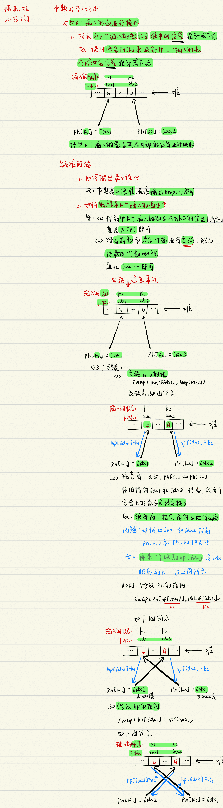

**代码**

```c++
#include <iostream>
#include <cstring>
using namespace std;
const int N = 100010;
int n, idx, num;
char op[2];
int ph[N], hp[N], heap[N];
void heap_swap(int a, int b) {
    // 手写稿说明
    swap(heap[a], heap[b]);
    swap(ph[hp[a]], ph[hp[b]]);
    swap(hp[a], hp[b]);
    return;
}
// 模板
void up(int u) {
    if (u / 2 && heap[u] < heap[u / 2]) {
        heap_swap(u, u / 2);
        up(u / 2);
    }
    return;
}
// 模板
void down(int u) {
    int t = u;
    if (u * 2 <= idx && heap[t] > heap[u * 2]) t = u * 2;
    if (u * 2 + 1 <= idx && heap[t] > heap[u * 2 + 1]) t = u * 2 + 1;
    if (t != u) {
        heap_swap(t, u);
        down(t);
    }
    return;
}
int main() {
    scanf("%d", &n);
    for (int i = 0; i < n; i ++ ) {
        scanf("%s", op);
        int k, x;
        if (!strcmp(op, "I")) {
            scanf("%d", &x);
            // 堆排序下标从1开始
            ph[++ num] = ++idx;
            hp[idx] = num;
            heap[idx] = x;
            up(idx);
        }
        else if (!strcmp(op, "PM")) cout << heap[1] << endl;
        else if (!strcmp(op, "DM")) {
            heap_swap(1, idx --);
            down(1);
        }
        else if (!strcmp(op, "D")) {
            scanf("%d", &k);
            // 获取第k个输入的数字在堆中的下标[指针]
            k = ph[k];
            // 删除第k个数字
            // 分两步[手写稿]
            heap_swap(k, idx --);
            // 由于不确定新换来的数是大是小, 因此, up一遍down一遍
            up(k);
            down(k);
        }
        else {
            scanf("%d%d", &k, &x);
            // 获取第k个输入的数字在堆中的下标[指针]
            k = ph[k];
            // 修改第k个数字
            heap[k] = x;
            // 由于不确定新换来的数是大是小, 因此, up一遍down一遍
            up(k);
            down(k);
        }
    }
    return 0;
}
```

**时间复杂度**

$O(nlog_n)$

**空间复杂度**

$O(n)$

**标签**

`堆`、`手写堆`

**缝合怪**


## 对顶堆

### [LeetCode 295. 数据流的中位数](https://leetcode-cn.com/problems/find-median-from-data-stream/)

**题目描述**

> 中位数是有序列表中间的数。如果列表长度是偶数，中位数则是中间两个数的平均值。
>
> 例如，
>
> `[2,3,4]` 的中位数是 `3`
>
> `[2,3]` 的中位数是 `(2 + 3) / 2 = 2.5`
>
> 设计一个支持以下两种操作的数据结构：
>
> `void addNum(int num)` - 从数据流中添加一个整数到数据结构中。
> `double findMedian()` - 返回目前所有元素的中位数。

**示例**

> `addNum(1)`
> `addNum(2)`
> `findMedian() -> 1.5`
> `addNum(3) `
> `findMedian() -> 2`

**进阶**

> 如果数据流中所有整数都在 `0` 到 `100` 范围内，你将如何优化你的算法？
> 如果数据流中 `99%` 的整数都在 `0` 到 `100` 范围内，你将如何优化你的算法？

**手写稿**

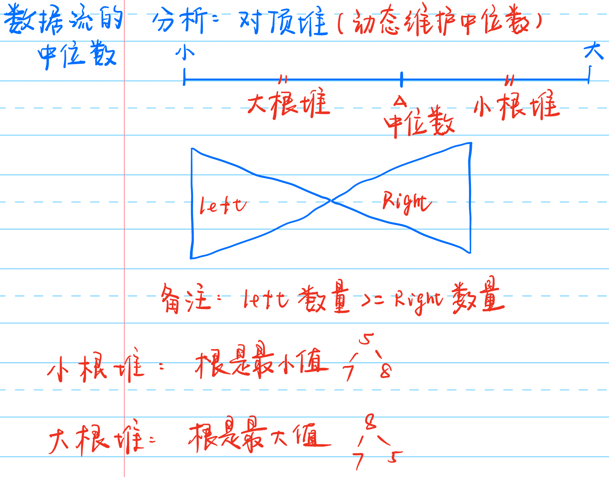

**记忆技巧**

> **大根堆**
>
> > 1. 记忆技巧：大根堆即为把<font style="color:red">**小于等于(`less`)**</font>当前数的数字往下按
> > 2. 定义：`priority_queue<int, vector<int>> q;`
>
> **小根堆**
>
> > 1. 记忆技巧：小根堆即为把<font style="color:red">**大于等于(`greater`)**</font>当前数的数字往下按
> > 2. 定义：`priority_queue<int, vector<int>, greater<int>> q;`

**代码**

```c++
class MedianFinder {
public:
    // 大根堆
    priority_queue<int, vector<int>> left;
    // 小根堆
    priority_queue<int, vector<int>, greater<int>> right;
    MedianFinder() {}
    
    void addNum(int num) {
        if (left.empty() || num <= left.top()) {
            left.push(num);
            // 左边添加完数据之后，如果出现左边元素的个数大于右边元素的个数 + 1
            // 因为保证左边元素的数量等于右边元素的数量或者等于右边元素的数量 + 1
            // 则说明需要进行调整，调整即可
            if (left.size() > right.size() + 1) right.push(left.top()), left.pop();
        }
        else {
            right.push(num);
            // 同理
            if (right.size() > left.size()) left.push(right.top()), right.pop();
        }
        return;
    }
    
    double findMedian() {
        if (left.size() + right.size() & 1) return left.top();
        return (left.top() + right.top()) / 2.0;
    }
};

/**
 * Your MedianFinder object will be instantiated and called as such:
 * MedianFinder* obj = new MedianFinder();
 * obj->addNum(num);
 * double param_2 = obj->findMedian();
 */
```

**标签**

`优先队列`、`对顶堆`

## 二叉堆

### [AcWing 148. 合并果子](https://www.acwing.com/problem/content/150/)

**题目描述**

>   在一个果园里，达达已经将所有的果子打了下来，而且按果子的不同种类分成了不同的堆。
>
>   达达决定把所有的果子合成一堆。
>
>   每一次合并，达达可以把两堆果子合并到一起，消耗的体力等于两堆果子的重量之和。
>
>   可以看出，所有的果子经过 `n−1` 次合并之后，就只剩下一堆了。
>
>   达达在合并果子时总共消耗的体力等于每次合并所耗体力之和。
>
>   因为还要花大力气把这些果子搬回家，所以达达在合并果子时要尽可能地节省体力。
>
>   假定每个果子重量都为 `1`，并且已知果子的种类数和每种果子的数目，你的任务是设计出合并的次序方案，使达达耗费的体力最少，并输出这个最小的体力耗费值。
>
>   例如有 `3` 种果子，数目依次为 `1，2，9`。
>
>   可以先将 `1、2` 堆合并，新堆数目为 `3`，耗费体力为 `3`。
>
>   接着，将新堆与原先的第三堆合并，又得到新的堆，数目为 `12`，耗费体力为 `12`。
>
>   所以达达总共耗费体力`=3+12=15`。
>
>   可以证明 `15` 为最小的体力耗费值。

**输入格式**

>   输入包括两行，第一行是一个整数 `n`，表示果子的种类数。
>
>   第二行包含 `n` 个整数，用空格分隔，第 `i` 个整数 $a_i$ 是第 `i` 种果子的数目。

**输出格式**

>   输出包括一行，这一行只包含一个整数，也就是最小的体力耗费值。
>
>   输入数据保证这个值小于 $2^{31}$。

**数据范围**

>   +   $1≤n≤10000$,
>   +   $1≤a_i≤20000$

**输入样例**

```c++
3 
1 2 9 
```

**输出样例**

```c++
15
```

**手写稿**

>   1.   每次选择耗费体力最小的两个果子进行合并即可，使用 `res` 计算总的耗费体力之和
>        +   选择耗费体力最小的两个果子使用堆（优先队列）即可
>        +   每次将合并完的果子再次放进堆里即可

**代码**

```c++
#include <iostream>
#include <queue>
using namespace std;
int n;
priority_queue<int, vector<int>, greater<int>> heap;
int main() {
    scanf("%d", &n);
    for (int i = 0, x; i < n; i ++ ) {
        scanf("%d", &x);
        heap.push(x);
    }
    int res = 0;
    while (heap.size() > 1) {
        // 选择耗费体力最小的两个果子a和b
        int a = heap.top(); heap.pop();
        int b = heap.top(); heap.pop();
        // 将新的果子放进堆里面
        heap.push(a + b);
        res += a + b;
    }
    cout << res << endl;
    return 0;
}
```

**标签**

`二叉堆`、`哈夫曼树`、`优先队列`

## `n` 叉堆

### [AcWing 149. 荷马史诗](https://www.acwing.com/problem/content/description/151/)

>   追逐影子的人，自己就是影子。 ——荷马
>
>   达达最近迷上了文学。
>
>   她喜欢在一个慵懒的午后，细细地品上一杯卡布奇诺，静静地阅读她爱不释手的《荷马史诗》。
>
>   但是由《奥德赛》和《伊利亚特》组成的鸿篇巨制《荷马史诗》实在是太长了，达达想通过一种编码方式使得它变得短一些。
>
>   一部《荷马史诗》中有 `n` 种不同的单词，从 `1` 到 `n` 进行编号。其中第 `i` 种单词出现的总次数为 $w_i$。
>
>   达达想要用 `k` 进制串 $s_i$ 来替换第 `i` 种单词，使得其满足如下要求:
>
>   对于任意的 $1≤i,j≤n，i≠j$，都有：$s_i$ 不是 $s_j$ 的前缀。
>
>   现在达达想要知道，如何选择 $s_i$，才能使替换以后得到的新的《荷马史诗》长度最小。
>
>   在确保总长度最小的情况下，达达还想知道最长的 $s_i$ 的最短长度是多少？
>
>   一个字符串被称为 `k` 进制字符串，当且仅当它的每个字符是 `0` 到 `k−1` 之间（包括 `0` 和 `k−1`）的整数。
>
>   字符串 `Str1` 被称为字符串 `Str2` 的前缀，当且仅当：存在 `1≤t≤m`，使得 `Str1=Str2[1..t]`。
>
>   其中，`m` 是字符串 `Str2` 的长度，`Str2[1..t]` 表示 `Str2` 的前 `t` 个字符组成的字符串。
>
>   **注意**:请使用 `64` 位整数进行输入输出、储存和计算。

**输入格式**

>   输入文件的第 `1` 行包含 `2` 个正整数 `n,k`，中间用单个空格隔开，表示共有 `n` 种单词，需要使用 `k` 进制字符串进行替换。
>
>   第 `2∼n+1` 行：第 `i+1` 行包含 `1` 个非负整数 $w_i$，表示第 $i$ 种单词的出现次数。

**输出格式**

>   输出文件包括 `2` 行。
>
>   第 `1` 行输出 `1` 个整数，为《荷马史诗》经过重新编码以后的最短长度。
>
>   第 `2` 行输出 `1` 个整数，为保证最短总长度的情况下，最长字符串 $s_i$ 的最短长度。

**数据范围**

>   +   $2≤n≤100000,$
>   +   $2≤k≤9$
>   +   $1≤wi≤10^{12}$

**输入样例**

```c++
4 2
1
1
2
2
```

**输出样例**

```c++
12
2
```

**手写稿**

>   1.   优先级队列的元素类型是复合类型，如 `pair`
>
>        默认情况下，排序规则是先按照 `pair` 的 `first` 的属性降序排列，如果 `first` 相等，则按照 `second`属性降序排序
>
>        同理，传入`std::greator` 后，排序规则是先按照 `pair` 的 `first` 的属性升序排列，如果 `first` 相等，则按照 `second` 属性升序排列
>
>   2.   哈夫曼编码前置知识
>
>        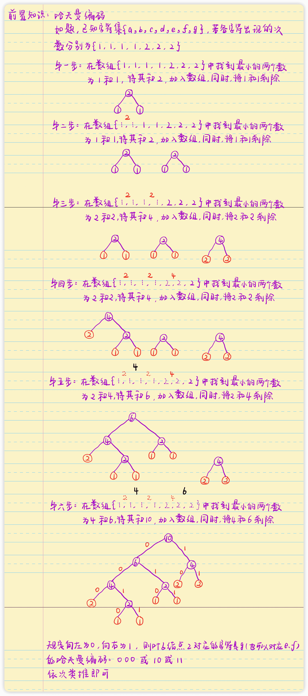
>
>   3.   本题步骤分析
>
>        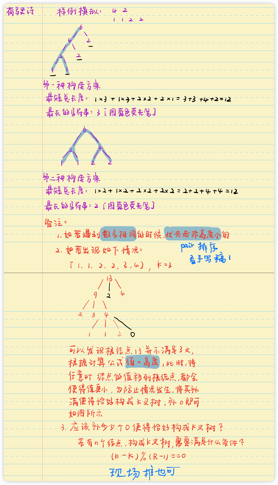

**代码**

```c++
#include <iostream>
#include <queue>
using namespace std;
typedef long long LL;
typedef pair<LL, int> PLI;
const int N = 100010;
int n, k;
// 小根堆
priority_queue<PLI, vector<PLI>, greater<PLI>> heap;
int main() {
    scanf("%d%d", &n, &k);
    for (int i = 0; i < n; i ++ ) {
        LL x;
        scanf("%lld", &x);
        // 第一个参数存值
        // 第二个参数存高度【深度】
        heap.push({x, 0});
    }
    // 如果不满足n叉树，则将其补满n叉树
    while ((n - k) % (k - 1)) heap.push({0, 0}), n ++;
    // 记录答案
    LL res = 0;
    while (heap.size() > 1) {
        // 记录k叉树合并之后的和
        LL sum = 0;
        // 记录最大深度
        int depth = 0;
        for (int i = 0; i < k; i ++ ) {
            auto t = heap.top(); heap.pop();
            sum += t.first;
            // 记录最大深度
            depth = max(depth, t.second);
        }
        // 加上答案
        res += sum;
        // 深度+1，因为父节点深度等于子节点深度+1
        heap.push({sum, depth + 1});
    }
    cout << res << endl << heap.top().second << endl;
    return 0;
}
```

**标签**

`n叉堆`、`小根堆`、`哈夫曼树`、`哈夫曼编码`

# 链表专题

## [AcWing 826. 单链表](https://www.acwing.com/problem/content/828/)

**题目描述**

>   实现一个单链表，链表初始为空，支持三种操作：
>
>   1.  向链表头插入一个数；
>   2.  删除第 `k` 个插入的数后面的数；
>   3.  在第 `k` 个插入的数后插入一个数。
>
>   现在要对该链表进行 `M` 次操作，进行完所有操作后，从头到尾输出整个链表。
>
>   **注意**:题目中第 `k` 个插入的数并不是指当前链表的第 `k` 个数。例如操作过程中一共插入了 `n` 个数，则按照插入的时间顺序，这 `n` 个数依次为：第 `1` 个插入的数，第 `2` 个插入的数，…第 `n` 个插入的数。

**输入格式**

>   第一行包含整数 `M`，表示操作次数。
>
>   接下来 `M` 行，每行包含一个操作命令，操作命令可能为以下几种：
>
>   1.  `H x`，表示向链表头插入一个数 `x`。
>   2.  `D k`，表示删除第 `k` 个插入的数后面的数（当 `k` 为 `0` 时，表示删除头结点）。
>   3.  `I k x`，表示在第 `k` 个插入的数后面插入一个数 `x`（此操作中 `k` 均大于 `0`）。

**输出格式**

>   共一行，将整个链表从头到尾输出。

**数据范围**

>   +   $1 ≤ M ≤ 100000$
>   +   $所有操作保证合法。$

**输入样例**

```c++
10
H 9
I 1 1
D 1
D 0
H 6
I 3 6
I 4 5
I 4 5
I 3 4
D 6
```

**输出样例**

```c++
6 4 6 5
```

**手写稿**


**代码**


**时间复杂度**


**空间复杂度**


**标签**


**缝合怪**


## [AcWing 827. 双链表](https://www.acwing.com/problem/content/829/)

**题目描述**

> 实现一个双链表，双链表初始为空，支持 `5` 种操作：
>
> 1. 在最左侧插入一个数；
> 2. 在最右侧插入一个数；
> 3. 将第 `k` 个插入的数删除；
> 4. 在第 `k` 个插入的数左侧插入一个数；
> 5. 在第 `k` 个插入的数右侧插入一个数
>
> 现在要对该链表进行 `M` 次操作，进行完所有操作后，从左到右输出整个链表。
>
> **注意**:题目中第 `k` 个插入的数并不是指当前链表的第 `k` 个数。例如操作过程中一共插入了 `n` 个数，则按照插入的时间顺序，这 `n` 个数依次为：第 `1` 个插入的数，第 `2` 个插入的数，…第 `n` 个插入的数。

**输入格式**

> 第一行包含整数 `M`，表示操作次数。
>
> 接下来 `M` 行，每行包含一个操作命令，操作命令可能为以下几种：
>
> 1. `L x`，表示在链表的最左端插入数 `x`。
> 2. `R x`，表示在链表的最右端插入数 `x`。
> 3. `D k`，表示将第 `k` 个插入的数删除。
> 4. `IL k x`，表示在第 `k` 个插入的数左侧插入一个数。
> 5. `IR k x`，表示在第 `k` 个插入的数右侧插入一个数。

**输出格式**

> 共一行，将整个链表从左到右输出。

**数据范围**

> + $1≤M≤100000$
> + $所有操作保证合法。$

**输入样例**

```c++
10
R 7
D 1
L 3
IL 2 10
D 3
IL 2 7
L 8
R 9
IL 4 7
IR 2 2
```

**输出样例**

```c++
8 7 7 3 2 9
```

**手写稿**

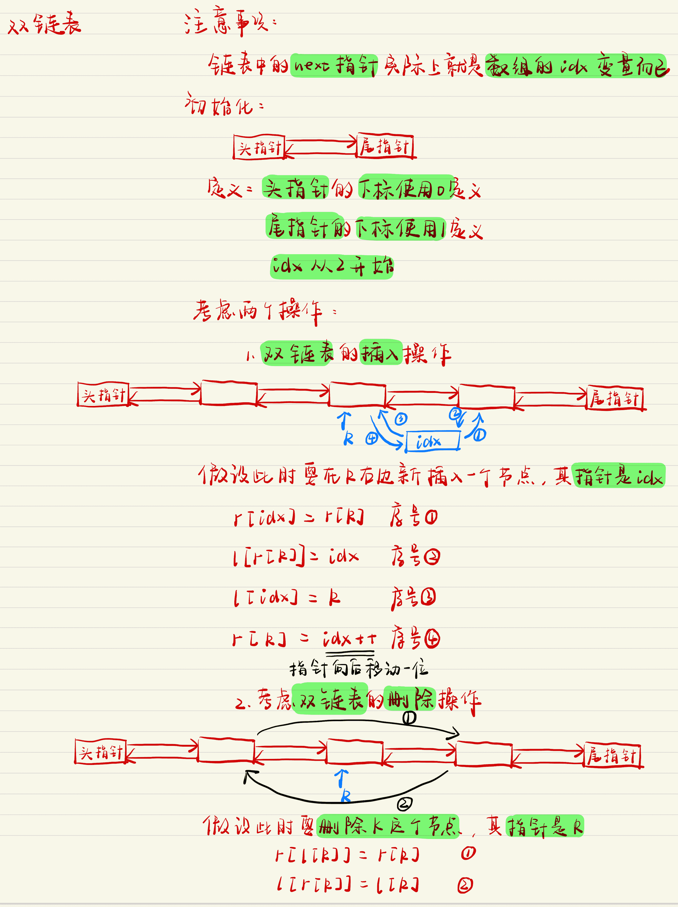

**代码**

```c++
#include <iostream>
#include <cstring>
using namespace std;
const int N = 100010;
int n, idx;
char op[2];
int l[N], r[N], e[N];
// 手写稿说明
void init() {
    r[0] = 1, l[1] = 0;
    idx = 2;
    return;
}
// 手写稿说明
void insert(int k, int x) {
    e[idx] = x;
    r[idx] = r[k];
    l[r[k]] = idx;
    l[idx] = k;
    r[k] = idx ++;
    return;
}
// 手写稿说明
void remove(int k) {
    r[l[k]] = r[k];
    l[r[k]] = l[k];
    return;
}
int main() {
    scanf("%d", &n);
    // 初始化
    init();
    while (n -- ) {
        scanf("%s", op);
        int k, x;
        if (!strcmp(op, "L")) {
            scanf("%d", &x);
            insert(0, x);
        }
        else if (!strcmp(op, "R")) {
            scanf("%d", &x);
            insert(l[1], x);
        }
        else if (!strcmp(op, "D")) {
            scanf("%d", &k);
            // 注意: 下标从2开始, 因此, 第k个数的指针[下标]为k + 1
            remove(k + 1);
        }
        else if (!strcmp(op, "IL")) {
            scanf("%d%d", &k, &x);
            // 注意: 下标从2开始, 因此, 第k个数的指针[下标]为k + 1
            insert(l[k + 1], x);
        }
        else {
            scanf("%d%d", &k, &x);
            // 注意: 下标从2开始, 因此, 第k个数的指针[下标]为k + 1
            insert(k + 1, x);
        }
    }
    for (int i = r[0]; i != 1; i = r[i]) cout << e[i] << " ";
    return 0;
}
```

**时间复杂度**

$O(m)$

**空间复杂度**

$O(m)$

**标签**

`数组模拟双链表`

**缝合怪**

## [SDUT 2054. 双向链表](https://acm.sdut.edu.cn/onlinejudge3/problems/2054)

**问题描述**

> 学会了单向链表，我们又多了一种解决问题的能力，单链表利用一个指针就能在内存中找到下一个位置，这是一个不会轻易断裂的链。但单链表有一个弱点——不能回指。比如在链表中有两个节点A,B，他们的关系是B是A的后继，A指向了B，便能轻易经A找到B,但从B却不能找到A。一个简单的想法便能轻易解决这个问题——建立双向链表。在双向链表中，A有一个指针指向了节点B，同时，B又有一个指向A的指针。这样不仅能从链表头节点的位置遍历整个链表所有节点，也能从链表尾节点开始遍历所有节点。对于给定的一列数据，按照给定的顺序建立双向链表，按照关键字找到相应节点，输出此节点的前驱节点关键字及后继节点关键字。

**输入格式**

> 第一行两个正整数n（代表节点个数），m（代表要找的关键字的个数）。第二行是n个数（n个数没有重复），利用这n个数建立双向链表。接下来有m个关键字，每个占一行。

**输出格式**

> 对给定的每个关键字，输出此关键字前驱节点关键字和后继节点关键字。如果给定的关键字没有前驱或者后继，则不输出。
> 注意：每个给定关键字的输出占一行。一行输出的数据之间有一个空格，行首、行末无空格。

**输入样例**

```c++
10 3
1 2 3 4 5 6 7 8 9 0
3
5
0
```

**输出样例**

```c++
2 4
4 6
9
```

**手写稿**

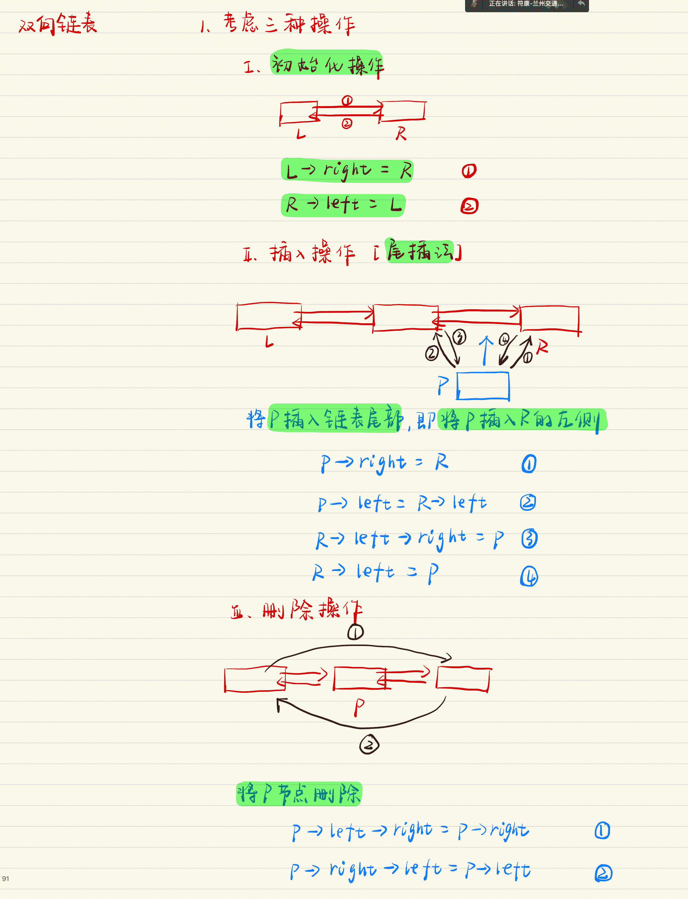

**代码**

```c++
#include <iostream>
using namespace std;
// 定义结构体
struct DNode {
    int val;
    DNode *left, *right;
    DNode (int _val) : val(_val), left(NULL), right(NULL){}
}*L, *R;
int n, m;
// 手写稿
void init() {
    L = new DNode(-1);
    R = new DNode(-1);
    L -> right = R;
    R -> left = L;
    return;
}
// 手写稿
void insert(int x) {
    DNode *p = new DNode(x);
    p -> right = R;
    p -> left = R -> left;
    R -> left -> right = p;
    R -> left = p;
    return;
}
int main() {
    scanf("%d%d",&n, &m);
    init();
    for (int i = 0, x; i < n; i ++ ) {
        scanf("%d", &x);
        insert(x);
    }
    while (m -- ) {
        int x;
        scanf("%d", &x);
        for (DNode *p = L -> right; p != R; p = p -> right)
            if (p -> val == x) {
                if (p -> left != L) cout << p -> left -> val;
                if (p -> right != R) {
                  	// 注意格式[两种特殊情况]:
                  	// 1. 只有前缀
                  	// 2. 只有后缀
                    if (p -> left != L)
                        cout << " ";
                    cout << p -> right -> val;
                }
                cout << endl;
                break;
            }
    }
    return 0;
}
```

**时间复杂度**

$O(m)$

**空间复杂度**

$O(m)$

**标签**

`双向链表`

**缝合怪**


## [LeetCode 328. 奇偶链表](https://leetcode-cn.com/problems/odd-even-linked-list/)

**题目描述**

> 给定单链表的头节点 `head` ，将所有索引为奇数的节点和索引为偶数的节点分别组合在一起，然后返回重新排序的列表。
>
> 第一个节点的索引被认为是 奇数 ， 第二个节点的索引为 偶数 ，以此类推。
>
> 请注意，偶数组和奇数组内部的相对顺序应该与输入时保持一致。
>
> 你必须在 `O(1)` 的额外空间复杂度和 `O(n)` 的时间复杂度下解决这个问题。

**示例 1**

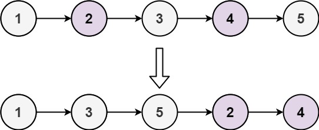

> 输入: `head = [1,2,3,4,5]`
> 输出: `[1,3,5,2,4]`

**示例 2**


> 输入: `head = [2,1,3,5,6,4,7]`
> 输出: `[2,3,6,7,1,5,4]`

**提示**

> + $n ==  链表中的节点数$
> + $0 <= n <= 10^4$
> + $-10^6 <= Node.val <= 10^6$

**手写稿**

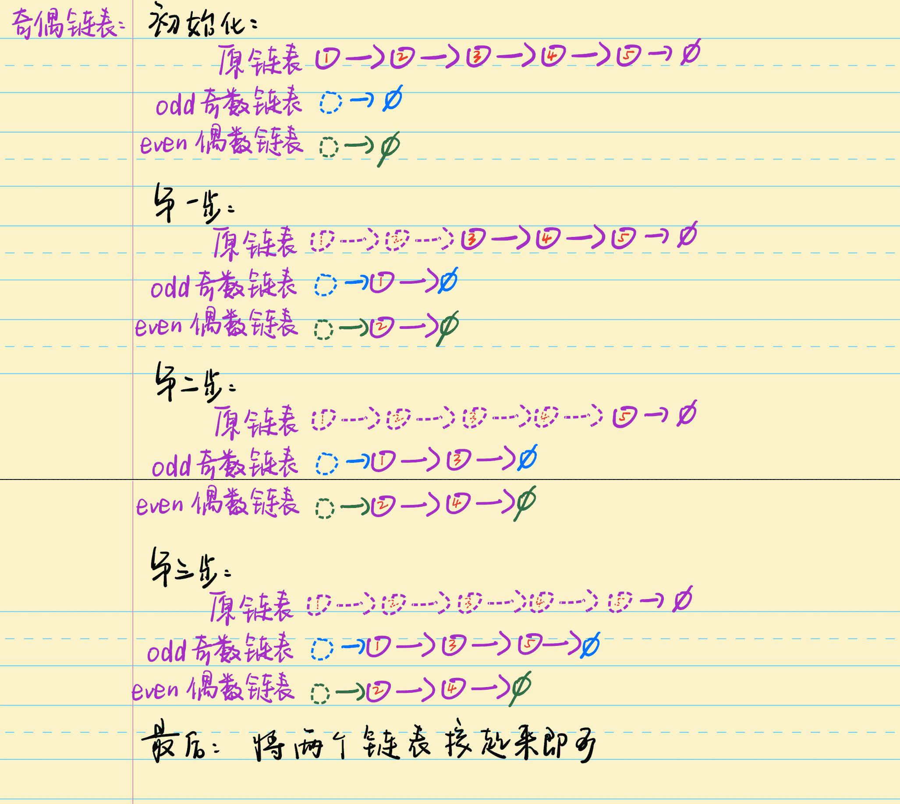

**代码**

```c++
/**
 * Definition for singly-linked list.
 * struct ListNode {
 *     int val;
 *     ListNode *next;
 *     ListNode() : val(0), next(nullptr) {}
 *     ListNode(int x) : val(x), next(nullptr) {}
 *     ListNode(int x, ListNode *next) : val(x), next(next) {}
 * };
 */
class Solution {
public:
    ListNode* oddEvenList(ListNode* p) {
        // odd是奇数链表，even是偶数链表
        auto odd = new ListNode(-1), even = new ListNode(-1);
        ListNode *a = odd, *b = even;
        while (p) {
            auto q = p -> next;
            p -> next = a -> next;
            a = a -> next = p;
            if (!q) break;
            auto r = q -> next;
            q -> next = b -> next;
            b = b -> next = q;
            p = r;
        }
        a -> next = even -> next;
        return odd -> next;
    }
};
```

**标签**

`链表`

# 设计类专题

## [LeetCode 341. 扁平化嵌套列表迭代器](https://leetcode-cn.com/problems/flatten-nested-list-iterator/)

**题目描述**

>   给你一个嵌套的整数列表 `nestedList` 。每个元素要么是一个整数，要么是一个列表；该列表的元素也可能是整数或者是其他列表。请你实现一个迭代器将其扁平化，使之能够遍历这个列表中的所有整数。
>
>   实现扁平迭代器类 `NestedIterator` ：
>
>   +   `NestedIterator(List<NestedInteger> nestedList)` 用嵌套列表 `nestedList` 初始化迭代器。
>   +   `int next()` 返回嵌套列表的下一个整数。
>   +   `boolean hasNext()` 如果仍然存在待迭代的整数，返回 `true` ；否则，返回 `false` 。
>       你的代码将会用下述伪代码检测：
>
>   ```c++
>   initialize iterator with nestedList
>   res = []
>   while iterator.hasNext()
>       append iterator.next() to the end of res
>   return res
>   ```
>
>
>   如果 `res` 与预期的扁平化列表匹配，那么你的代码将会被判为正确。

**示例 1**

>   输入：`nestedList = [[1,1],2,[1,1]]`
>   输出：`[1,1,2,1,1]`
>   解释：通过重复调用 `next` 直到 `hasNext` 返回 `false`，`next` 返回的元素的顺序应该是: `[1,1,2,1,1]`。

**示例 2**

>   输入：`nestedList = [1,[4,[6]]]`
>   输出：`[1,4,6]`
>   解释：通过重复调用 `next` 直到 `hasNext` 返回 `false`，`next` 返回的元素的顺序应该是: `[1,4,6]`。

**提示**

>   +   $1 <= nestedList.length <= 500$
>   +   $嵌套列表中的整数值在范围 [-106, 106] 内$

**手写稿**

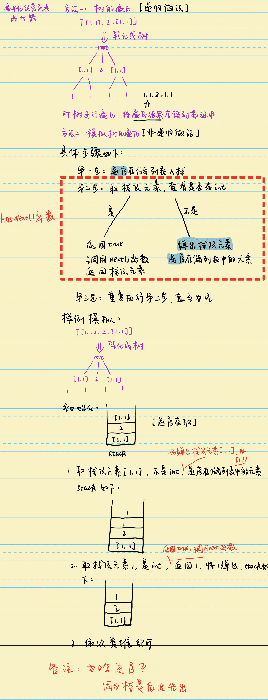

**代码一：树的遍历【递归写法】**

```c++
/**
 * // This is the interface that allows for creating nested lists.
 * // You should not implement it, or speculate about its implementation
 * class NestedInteger {
 *   public:
 *     // Return true if this NestedInteger holds a single integer, rather than a nested list.
 *     bool isInteger() const;
 *
 *     // Return the single integer that this NestedInteger holds, if it holds a single integer
 *     // The result is undefined if this NestedInteger holds a nested list
 *     int getInteger() const;
 *
 *     // Return the nested list that this NestedInteger holds, if it holds a nested list
 *     // The result is undefined if this NestedInteger holds a single integer
 *     const vector<NestedInteger> &getList() const;
 * };
 */

class NestedIterator {
public:
    vector<int> q;
    int k;
    void dfs(NestedInteger& u) {
        // 如果是叶子结点
        if (u.isInteger()) q.push_back(u.getInteger());
        // 遍历根节点的孩子节点
        else for (auto& u1 : u.getList()) dfs(u1);
        return;
    }
    NestedIterator(vector<NestedInteger> &nestedList) {
        k = 0;
        for (auto& u : nestedList) dfs(u);
    }
    
    int next() {
        return q[k ++];
    }
    
    bool hasNext() {
        return k < q.size();
    }
};

/**
 * Your NestedIterator object will be instantiated and called as such:
 * NestedIterator i(nestedList);
 * while (i.hasNext()) cout << i.next();
 */
```

**代码二：迭代**

```c++
/**
 * // This is the interface that allows for creating nested lists.
 * // You should not implement it, or speculate about its implementation
 * class NestedInteger {
 *   public:
 *     // Return true if this NestedInteger holds a single integer, rather than a nested list.
 *     bool isInteger() const;
 *
 *     // Return the single integer that this NestedInteger holds, if it holds a single integer
 *     // The result is undefined if this NestedInteger holds a nested list
 *     int getInteger() const;
 *
 *     // Return the nested list that this NestedInteger holds, if it holds a nested list
 *     // The result is undefined if this NestedInteger holds a single integer
 *     const vector<NestedInteger> &getList() const;
 * };
 */

class NestedIterator {
public:
    stack<NestedInteger> stk;
    NestedIterator(vector<NestedInteger> &nestedList) {
        for (int i = nestedList.size() - 1; i >= 0; i -- ) 
            stk.push(nestedList[i]);
    }
    
    int next() {
        int k = stk.top().getInteger(); stk.pop();
        return k;
    }
    
    bool hasNext() {
        while (stk.size()) {
            auto cur = stk.top();
            if (cur.isInteger()) return true;
            stk.pop();
            for (int i = cur.getList().size() - 1; i >= 0; i -- ) stk.push(cur.getList()[i]);
        }
        return false;
    }
};

/**
 * Your NestedIterator object will be instantiated and called as such:
 * NestedIterator i(nestedList);
 * while (i.hasNext()) cout << i.next();
 */
```

**标签**

`设计数据结构`、`递归`、`迭代器`

**缝合怪**

[LeetCode 385. 迷你语法分析器](#LeetCode 385. 迷你语法分析器)

## [LeetCode 380. O(1) 时间插入、删除和获取随机元素](https://leetcode-cn.com/problems/insert-delete-getrandom-o1/)

**题目描述**

>   实现 `RandomizedSet` 类：
>
>   +   `RandomizedSet()` 初始化 `RandomizedSet` 对象
>   +   `bool insert(int val)` 当元素 `val` 不存在时，向集合中插入该项，并返回 `true` ；否则，返回 `false` 。
>   +   `bool remove(int val)` 当元素 `val` 存在时，从集合中移除该项，并返回 `true` ；否则，返回 `false` 。
>   +   `int getRandom()` 随机返回现有集合中的一项（测试用例保证调用此方法时集合中至少存在一个元素）。每个元素应该有 相同的概率 被返回。
>
>   你必须实现类的所有函数，并满足每个函数的 平均 时间复杂度为 `O(1)` 。

**示例**

>   输入
>   `["RandomizedSet", "insert", "remove", "insert", "getRandom", "remove", "insert", "getRandom"]
>   [[], [1], [2], [2], [], [1], [2], []]`
>   输出
>   `[null, true, false, true, 2, true, false, 2]`
>
>   解释
>   `RandomizedSet randomizedSet = new RandomizedSet();`
>   `randomizedSet.insert(1);` // 向集合中插入 `1` 。返回 `true` 表示 `1` 被成功地插入。
>   `randomizedSet.remove(2);` // 返回 `false` ，表示集合中不存在 `2` 。
>   `randomizedSet.insert(2);` // 向集合中插入 `2` 。返回 `true` 。集合现在包含 `[1,2]` 。
>   `randomizedSet.getRandom();` // `getRandom` 应随机返回 `1` 或 `2` 。
>   `randomizedSet.remove(1);` // 从集合中移除 `1` ，返回 `true` 。集合现在包含 `[2]` 。
>   `randomizedSet.insert(2);` // `2` 已在集合中，所以返回 `false` 。
>   `randomizedSet.getRandom();` // 由于 `2` 是集合中唯一的数字，`getRandom` 总是返回 `2` 。

**提示**

>   +   $-2^{31} <= val <= 2^{31} - 1$
>   +   $最多调用 insert、remove 和 getRandom 函数 2 * 10^5 次$
>   +   $在调用 getRandom 方法时，数据结构中 至少存在一个 元素。$

**手写稿**

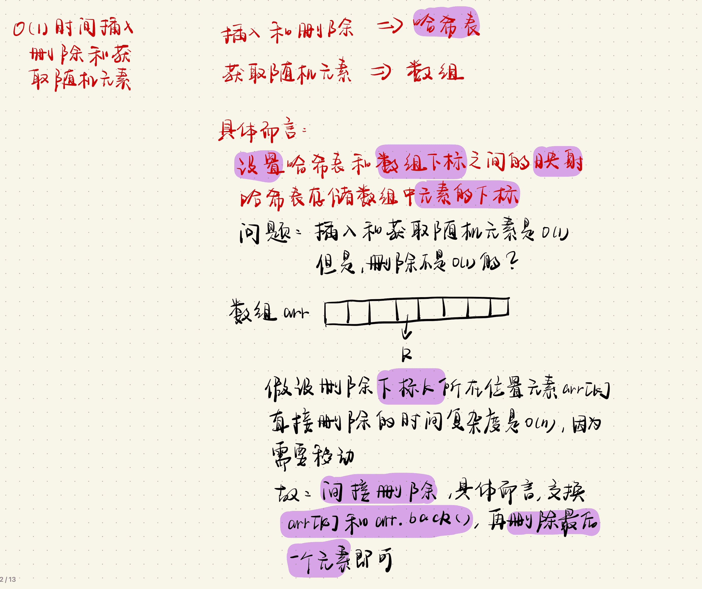

**代码**

```c++
class RandomizedSet {
public:
    vector<int> g;
    unordered_map<int, int> hash;
    RandomizedSet() {}
    
    bool insert(int x) {
        if (hash.count(x) == 0) {
            hash[x] = g.size();
            g.push_back(x);
            return true;
        }
        return false;
    }
    
    bool remove(int x) {
        if (hash.count(x)) {
            // 获取当前元素x的下标
            int idx = hash[x];
            // 在哈希表中交换数组中当前元素的下标和最后一个元素的下标
            swap(hash[x], hash[g.back()]);
            // 在数组中交换当前元素和最后一个元素
            swap(g[idx], g.back());
            // 在数组中将最后一个元素删除
            g.pop_back();
            // 在哈希表中将最后一个元素对应的下标删除
            hash.erase(x);
            return true;
        }
        return false;
    }
    
    int getRandom() {
        // 返回随机值即可
        return g[rand() % g.size()];
    }
};

/**
 * Your RandomizedSet object will be instantiated and called as such:
 * RandomizedSet* obj = new RandomizedSet();
 * bool param_1 = obj->insert(val);
 * bool param_2 = obj->remove(val);
 * int param_3 = obj->getRandom();
 */
```

**时间复杂度**

$O(1)$

**空间复杂度**

$O(n)$

**标签**

`哈希表`

**缝合怪**

## [LeetCode 382. 链表随机节点](https://leetcode-cn.com/problems/linked-list-random-node/)

**题目描述**

>   给你一个单链表，随机选择链表的一个节点，并返回相应的节点值。每个节点 被选中的概率一样 。
>
>   实现 `Solution` 类：
>
>   +   `Solution(ListNode head)` 使用整数数组初始化对象。
>   +   `int getRandom()` 从链表中随机选择一个节点并返回该节点的值。链表中所有节点被选中的概率相等。

**示例**

>   输入
>   `["Solution", "getRandom", "getRandom", "getRandom", "getRandom", "getRandom"]
>   [[[1, 2, 3]], [], [], [], [], []]`
>   输出
>   `[null, 1, 3, 2, 2, 3]`
>
>   解释
>   `Solution solution = new Solution([1, 2, 3]);`
>   `solution.getRandom();` // 返回 `1`
>   `solution.getRandom();` // 返回 `3`
>   `solution.getRandom();` // 返回 `2`
>   `solution.getRandom();` // 返回 `2`
>   `solution.getRandom();` // 返回 `3`
>   // `getRandom()` 方法应随机返回 `1`、`2`、`3`中的一个，每个元素被返回的概率相等。

**提示**

>   +   $链表中的节点数在范围 [1, 10^4] 内$
>   +   $-10^4 <= Node.val <= 10^4$
>   +   $至多调用 getRandom 方法 10^4 次$

**进阶**

>   如果链表非常大且长度未知，该怎么处理？
>   你能否在不使用额外空间的情况下解决此问题？

**手写稿**

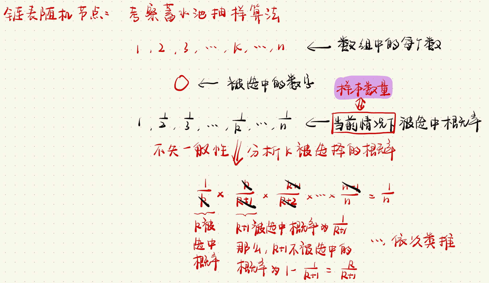

**代码**

```c++
/**
 * Definition for singly-linked list.
 * struct ListNode {
 *     int val;
 *     ListNode *next;
 *     ListNode() : val(0), next(nullptr) {}
 *     ListNode(int x) : val(x), next(nullptr) {}
 *     ListNode(int x, ListNode *next) : val(x), next(next) {}
 * };
 */
class Solution {
public:
    ListNode* h;
    Solution(ListNode* head) {
        h = head;
    }
    
    int getRandom() {
        int c = -1, n = 0;
        for (auto p = h; p; p = p -> next) {
            // 元素的个数
            n ++;
            // 随机选择某个元素1/n
            if (rand() % n == 0) c = p -> val;
        }
        return c;
    }
};

/**
 * Your Solution object will be instantiated and called as such:
 * Solution* obj = new Solution(head);
 * int param_1 = obj->getRandom();
 */
```

**时间复杂度**

$O(n)$

**空间复杂度**

$O(1)$

**标签**

`蓄水池抽样算法`

**缝合怪**

## [LeetCode 384. 打乱数组](https://leetcode-cn.com/problems/shuffle-an-array/)

**题目描述**

>   给你一个整数数组 `nums` ，设计算法来打乱一个没有重复元素的数组。打乱后，数组的所有排列应该是 等可能 的。
>
>   实现 `Solution class`:
>
>   +   `Solution(int[] nums)` 使用整数数组 `nums` 初始化对象
>   +   `int[] reset()` 重设数组到它的初始状态并返回
>   +   `int[] shuffle()` 返回数组随机打乱后的结果

**示例 1**

>   输入
>   `["Solution", "shuffle", "reset", "shuffle"]
>   [[[1, 2, 3]], [], [], []]`
>   输出
>   `[null, [3, 1, 2], [1, 2, 3], [1, 3, 2]]`
>
>   解释
>   `Solution solution = new Solution([1, 2, 3]);`
>   `solution.shuffle();`    // 打乱数组 `[1,2,3]` 并返回结果。任何 `[1,2,3]`的排列返回的概率应该相同。例如，返回 `[3, 1, 2]`
>   `solution.reset();`      // 重设数组到它的初始状态 `[1, 2, 3]` 。返回 `[1, 2, 3]`
>   `solution.shuffle();`    // 随机返回数组 `[1, 2, 3]` 打乱后的结果。例如，返回 `[1, 3, 2]`

**提示**

>   +   $1 <= nums.length <= 200$
>   +   $-10^6 <= nums[i] <= 10^6$
>   +   $nums 中的所有元素都是 唯一的$
>   +   $最多可以调用 5 * 10^4 次 reset 和 shuffle$

**手写稿**

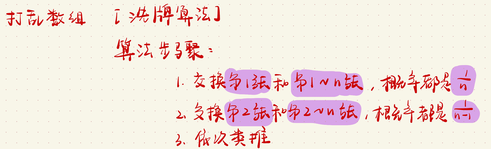

**代码**

```c++
class Solution {
public:
    vector<int> a, b;
    Solution(vector<int>& nums) {
        a = nums;
    }
    
    vector<int> reset() {
        return a;
    }
    
    vector<int> shuffle() {
        b = a;
        int n = a.size();
        for (int i = 0; i < n; i ++ )
            // 交换第i张和第i~n张
            swap(b[i], b[i + rand() % (n - i)]);
        return b;
    }
};

/**
 * Your Solution object will be instantiated and called as such:
 * Solution* obj = new Solution(nums);
 * vector<int> param_1 = obj->reset();
 * vector<int> param_2 = obj->shuffle();
 */
```

**时间复杂度**

$O(n)$

**空间复杂度**

$O(n)$

**标签**

`洗牌算法`

**缝合怪**

## [LeetCode 146. LRU 缓存](https://leetcode-cn.com/problems/lru-cache/)

**题目描述**

>   请你设计并实现一个满足  `LRU` (最近最少使用) 缓存 约束的数据结构。
>   实现 `LRUCache` 类：
>
>   +   `LRUCache(int capacity)` 以 正整数 作为容量 `capacity` 初始化 `LRU` 缓存
>   +   `int get(int key)` 如果关键字 `key` 存在于缓存中，则返回关键字的值，否则返回 `-1` 。
>   +   `void put(int key, int value)` 如果关键字 key 已经存在，则变更其数据值 `value` ；如果不存在，则向缓存中插入该组 `key-value` 。如果插入操作导致关键字数量超过 `capacity` ，则应该 逐出 最久未使用的关键字。
>
>   函数 `get` 和 `put` 必须以 `O(1)` 的平均时间复杂度运行。

**示例**

>   输入
>   `["LRUCache", "put", "put", "get", "put", "get", "put", "get", "get", "get"]
>   [[2], [1, 1], [2, 2], [1], [3, 3], [2], [4, 4], [1], [3], [4]]`
>   输出
>   `[null, null, null, 1, null, -1, null, -1, 3, 4]`
>
>   解释
>   `LRUCache lRUCache = new LRUCache(2);`
>   `lRUCache.put(1, 1);` // 缓存是 `{1=1}`
>   `lRUCache.put(2, 2);` // 缓存是 `{1=1, 2=2}`
>   `lRUCache.get(1);`    // 返回 `1`
>   `lRUCache.put(3, 3);` // 该操作会使得关键字 `2` 作废，缓存是 `{1=1, 3=3}`
>   `lRUCache.get(2);`    // 返回 `-1` (未找到)
>   `lRUCache.put(4, 4);` // 该操作会使得关键字 `1` 作废，缓存是 `{4=4, 3=3}`
>   `lRUCache.get(1);`    // 返回 `-1` (未找到)
>   `lRUCache.get(3);`    // 返回 `3`
>   `lRUCache.get(4);`    // 返回 `4`

**提示**

>   +   $1 <= capacity <= 3000$
>   +   $0 <= key <= 10000$
>   +   $0 <= value <= 10^5$
>   +   $最多调用 2 * 10^5 次 get 和 put$

**手写稿**

> 1. 手写稿在双链表

**代码**

```c++
class LRUCache {
public:
    struct DNode {
        int key, val;
        DNode *left, *right;
        DNode(int _key, int _val) : key(_key), val(_val), left(NULL), right(NULL){}
    }*L, *R;
    int capacity;
    unordered_map<int, DNode*> hash; // key -> pointer
    // 初始化
    void init() {
        L = new DNode({-1, -1});
        R = new DNode({-1, -1});
        L -> right = R;
        R -> left = L;
        return;
    }
    // 在p节点之后插入pointer节点
    void insert(DNode* p, DNode* pointer) {
        pointer -> right = p -> right;
        pointer -> left = p;
        p -> right -> left = pointer;
        p -> right = pointer;
        return;
    }
    // 将pointer节点删除
    void remove(DNode* pointer) {
        pointer -> left -> right = pointer -> right;
        pointer -> right -> left = pointer -> left;
        return;
    }
    LRUCache(int _capacity) {
      	// 双向链表尾部插入
      	// 头部删除
        capacity = _capacity;
        init();
    }
    
    int get(int key) {
        if (hash.count(key)) {
            // 获取key所指向的指针
            auto pointer = hash[key];
            // 将pointer指向的节点删除
            remove(pointer);
            // 插入到尾部
            insert(R -> left, pointer);
            // 返回值
            return pointer -> val;
        }
        return -1;
    }
    
    void put(int key, int value) {
        // 如果key存在
        if (hash.count(key)) {
            auto pointer = hash[key];
            pointer -> val = value;
            // 删除
            remove(pointer);
            // 插入尾部
            insert(R -> left, pointer);
        }
        else {
            if (hash.size() >= capacity) { // 删除头节点
                // 获取值
                int key = L -> right -> key;
                // 删除首元节点
                remove(L -> right);
                // 将key从哈希表中删除
                hash.erase(hash.find(key));
            }
            // 新建节点
            hash[key] = new DNode({key, value});
            // 插入尾部
            insert(R -> left, hash[key]);
        }
        return;
    }
};

/**
 * Your LRUCache object will be instantiated and called as such:
 * LRUCache* obj = new LRUCache(capacity);
 * int param_1 = obj->get(key);
 * obj->put(key,value);
 */
```

**时间复杂度**

$O(1)$

**空间复杂度**

$O(n), n是节点的个数$

**标签**

`双向链表`

**缝合怪**

[SDUT 2054. 双向链表](#SDUT 2054. 双向链表)

## end

# 附录


## 常用变量

### 次数

>   `tms`

### 检查

>   `check()`

### 行

>   `row`

### 列

>   `col`

## 常见错误

### 变量名冲突

>   1.   `friend` 不能在全局使用, 局部使用可以
>   2.   

## 运算符优先级

### `C++` 运算符优先级

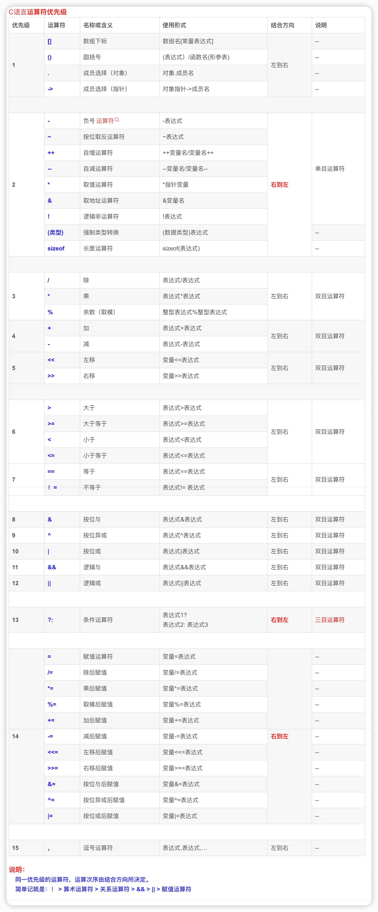

### End