# 基础算法


## æ’åº

### å¿«æ’

#### [AcWing 786. 第k个数](https://www.acwing.com/problem/content/description/788/)

**题目æè¿°**

> 给定一个长度为 `n` 的整数数列，以åŠä¸€ä¸ªæ•´æ•° `k`，请用快速选择算法求出数列ä»å°åˆ°å¤§æ’åºå的第 `k` 个数。

**输入格å¼**

> 第一行包å«ä¸¤ä¸ªæ•´æ•° `n` å’Œ `k`。
>
> ç¬¬äºŒè¡ŒåŒ…å« `n` 个整数（所有整数å‡åœ¨ $1∼10^9$ 范围内），表示整数数列。

**输出格å¼**

> 输出一个整数，表示数列的第 `k` å°æ•°ã€‚

**æ•°æ®èŒƒå›´**

> + $1≤n≤100000$,
> + $1≤k≤n$

**输入样例**

```c++
5 3
2 4 1 5 3
```

**输出样例**

```c++
3
```

**手写稿**


**代ç **

```c++
#include <iostream>
using namespace std;
const int N = 100010;
int n, k;
int g[N];
int quick_sort(int g[], int l, int r, int k) {
    if (l == r) return g[l];
    int x = g[l];
    int i = l - 1, j = r + 1;
    while (i < j) {
        // 为啥ä¸èƒ½å†™ç­‰å·ï¼Œå¦‚æœå…¨éƒ¨éƒ½æ˜¯ç›¸åŒå€¼ä¼šè¶Šç•Œ
        do i ++ ; while(g[i] < x);
        do j -- ; while(g[j] > x);
        if (i < j) swap(g[i], g[j]);
    }
    // 统计左边å°äºç­‰äºxçš„æ•°ç›®
    int sl = j - l + 1;
    // 递归左区间
    if (k <= sl) return quick_sort(g, l, j, k);
    // 递归å³åŒºé—´
    return quick_sort(g, j + 1, r, k - sl);
}
int main() {
    scanf("%d%d", &n, &k);
    for (int i = 1; i <= n; i ++ ) scanf("%d", &g[i]);
    cout << quick_sort(g, 1, n, k) << endl;
    return 0;
}
```

**标签**

`快速æ’åº`ã€`快速选择算法`

#### [LeetCode 324. 摆动æ’åº II](https://leetcode-cn.com/problems/wiggle-sort-ii/)

**题目æè¿°**

> 给你一个整数数组 `nums`，将它é‡æ–°æ’åˆ—æˆ `nums[0] < nums[1] > nums[2] < nums[3]...` 的顺åºã€‚
>
> ä½ å¯ä»¥å‡è®¾æ‰€æœ‰è¾“入数组都å¯ä»¥å¾—到满足题目è¦æ±‚的结æœã€‚

**示例 1**

> 输入：`nums = [1,5,1,1,6,4]`
> 输出：`[1,6,1,5,1,4]`
> 解释：`[1,4,1,5,1,6]` åŒæ ·æ˜¯ç¬¦åˆé¢˜ç›®è¦æ±‚的结æœï¼Œå¯ä»¥è¢«åˆ¤é¢˜ç¨‹åºæ¥å—。

**示例 2**

> 输入：`nums = [1,3,2,2,3,1]`
> 输出：`[2,3,1,3,1,2]`

**æ示**

> + $1 <= nums.length <= 5 * 10^4$
> + $0 <= nums[i] <= 5000$
> + $题目数æ®ä¿è¯ï¼Œå¯¹äºç»™å®šçš„输入 nums ，总能产生满足题目è¦æ±‚的结æœ$

**进阶**

> 你能用 `O(n)` 时间å¤æ‚度和 / 或åŸåœ° `O(1)` é¢å¤–空间æ¥å®ç°å—？

**手写稿**

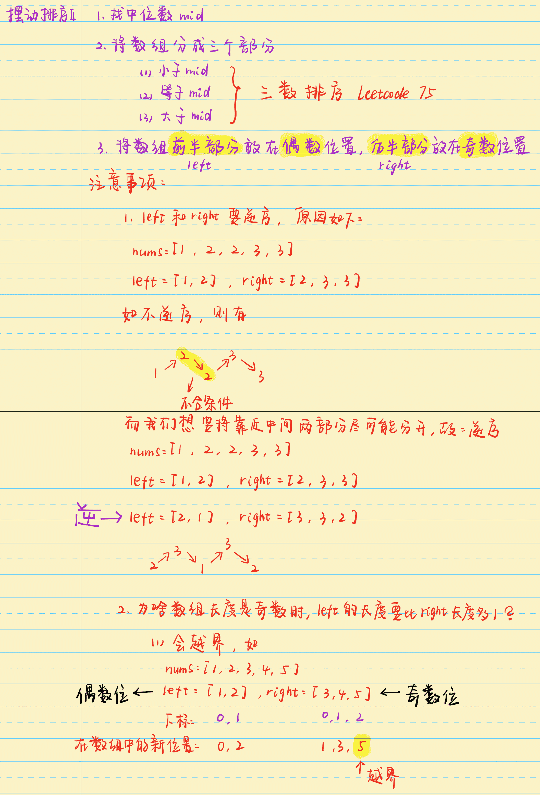

**代ç **

```c++
class Solution {
public:
    void wiggleSort(vector<int>& nums) {
        int n = nums.size();
        // 找到中ä½æ•°çš„迭代器
        auto midptr = nums.begin() + n / 2;
        nth_element(nums.begin(), midptr, nums.end());
        int mid = *midptr;
        // 三数æ’åºï¼ŒåŒLeetCode75题
        for (int i = 0, j = 0, k = n - 1; i <= k; ) {
            if (nums[i] < mid) swap(nums[i ++ ], nums[j ++ ]);
            else if (nums[i] == mid) i ++;
            else swap(nums[i], nums[k --]);
        }
        if (n & 1) ++ midptr;
        auto left = vector<int>(nums.begin(), midptr);
        // 逆åº
        reverse(left.begin(), left.end());
        auto right = vector<int>(midptr, nums.end());
        // 逆åº
        reverse(right.begin(), right.end());
        // å°†å‰åŠéƒ¨åˆ†æ”¾ç½®åœ¨å¶æ•°ä½ç½®
        for (int i = 0; i < left.size(); i ++ ) nums[i * 2] = left[i];
        // å°†ååŠéƒ¨åˆ†æ”¾ç½®åœ¨å¥‡æ•°ä½ç½®
        for (int i = 0; i < right.size(); i ++ ) nums[i * 2 + 1] = right[i];
        return;
    }
};
```

**标签**

`快速选择æ’åº`

### 计数æ’åº

#### åŸç†

**简介**

>   计数æ’åºä¸æ˜¯åŸºäºæ¯”较的æ’åºç®—法，其核心在äºå°†è¾“入的数æ®å€¼è½¬åŒ–为键存储在é¢å¤–开辟的数组空间中。 作为一ç§çº¿æ€§æ—¶é—´å¤æ‚度的æ’åºï¼Œè®¡æ•°æ’åºè¦æ±‚输入的数æ®å¿…须是有确定范围的整数。

**动图演示**


#### [LeetCode 347. å‰ K 个高频元素](https://leetcode-cn.com/problems/top-k-frequent-elements/)

**题目æè¿°**

>   给你一个整数数组 `nums` 和一个整数 `k` ，请你返å›å…¶ä¸­å‡ºç°é¢‘ç‡å‰ `k` 高的元素。你å¯ä»¥æŒ‰ ä»»æ„é¡ºåº è¿”å›ç­”案。

**示例 1**

>   输入: `nums = [1,1,1,2,2,3], k = 2`
>   输出: `[1,2]`

**示例 2**

>   输入: `nums = [1], k = 1`
>   输出: `[1]`

**æ示**

>   +   $1 <= nums.length <= 10^5$
>   +   $k çš„å–值范围是 [1, 数组中ä¸ç›¸åŒçš„元素的个数]$
>   +   $题目数æ®ä¿è¯ç­”案唯一，æ¢å¥è¯è¯´ï¼Œæ•°ç»„ä¸­å‰ k 个高频元素的集åˆæ˜¯å”¯ä¸€çš„$

**进阶**

>   你所设计算法的时间å¤æ‚度 å¿…é¡» ä¼˜äº `O(n log n)` ，其中 `n` 是数组大å°ã€‚

**手写稿**


**代ç **

```c++
class Solution {
public:
    vector<int> topKFrequent(vector<int>& nums, int k) {
        unordered_map<int, int> cnt;
        int n = nums.size();
        // 统计æ¯ä¸ªæ•°å­—出ç°çš„次数
        for (auto& num : nums) cnt[num] ++;
        vector<int> s(n + 1);
        for (auto [x, c] : cnt) s[c] ++;
        int i = n, t = 0;
        while (t < k) t += s[i --];
        vector<int> res;
        for (auto [x, c] : cnt)
            if (c > i) res.push_back(x);
        return res;
    }
};
```

**标签**

`计数æ’åº`

### 归并æ’åº

#### 多路归并

##### [LeetCode 355. 设计æ¨ç‰¹](https://leetcode-cn.com/problems/design-twitter/)

**题目æè¿°**

>   设计一个简化版的æ¨ç‰¹`(Twitter)`，å¯ä»¥è®©ç”¨æˆ·å®ç°å‘é€æ¨æ–‡ï¼Œå…³æ³¨/å–消关注其他用户，能够看è§å…³æ³¨äººï¼ˆåŒ…括自己）的最近 `10` æ¡æ¨æ–‡ã€‚
>
>   å®ç° `Twitter` 类：
>
>   +   `Twitter()` åˆå§‹åŒ–简易版æ¨ç‰¹å¯¹è±¡
>   +   `void postTweet(int userId, int tweetId)` æ ¹æ®ç»™å®šçš„ `tweetId` å’Œ `userId` 创建一æ¡æ–°æ¨æ–‡ã€‚æ¯æ¬¡è°ƒç”¨æ­¤å‡½æ•°éƒ½ä¼šä½¿ç”¨ä¸€ä¸ªä¸åŒçš„ `tweetId` 。
>   +   `List<Integer> getNewsFeed(int userId)` 检索当å‰ç”¨æˆ·æ–°é—»æ¨é€ä¸­æœ€è¿‘  `10` æ¡æ¨æ–‡çš„ `ID` 。新闻æ¨é€ä¸­çš„æ¯ä¸€é¡¹éƒ½å¿…须是由用户关注的人或者是用户自己å‘布的æ¨æ–‡ã€‚æ¨æ–‡å¿…é¡» 按照时间顺åºç”±æœ€è¿‘到最远æ’åº ã€‚
>   +   `void follow(int followerId, int followeeId)` `ID` 为 `followerId` 的用户开始关注 `ID` 为 `followeeId` 的用户。
>   +   `void unfollow(int followerId, int followeeId)` `ID` 为 `followerId` 的用户ä¸å†å…³æ³¨ `ID` 为 `followeeId` 的用户。

**示例**

>   输入
>   `["Twitter", "postTweet", "getNewsFeed", "follow", "postTweet", "getNewsFeed", "unfollow", "getNewsFeed"]
>   [[], [1, 5], [1], [1, 2], [2, 6], [1], [1, 2], [1]]`
>   输出
>   `[null, null, [5], null, null, [6, 5], null, [5]]`
>
>   解释
>   `Twitter twitter = new Twitter();`
>   `twitter.postTweet(1, 5);` // 用户 `1` å‘é€äº†ä¸€æ¡æ–°æ¨æ–‡ (用户 `id = 1`, æ¨æ–‡ `id = 5`)
>   `twitter.getNewsFeed(1);`  // 用户 `1` çš„è·å–æ¨æ–‡åº”当返å›ä¸€ä¸ªåˆ—表，其中包å«ä¸€ä¸ª `id` 为 `5` çš„æ¨æ–‡
>   `twitter.follow(1, 2);`    // 用户 `1` 关注了用户 `2`
>   `twitter.postTweet(2, 6);` // 用户 `2` å‘é€äº†ä¸€ä¸ªæ–°æ¨æ–‡ (æ¨æ–‡ `id = 6`)
>   `twitter.getNewsFeed(1);`  // 用户 `1` çš„è·å–æ¨æ–‡åº”当返å›ä¸€ä¸ªåˆ—表，其中包å«ä¸¤ä¸ªæ¨æ–‡ï¼Œ`id` 分别为 `-> [6, 5] `。æ¨æ–‡ `id 6` 应当在æ¨æ–‡ `id 5` 之å‰ï¼Œå› ä¸ºå®ƒæ˜¯åœ¨ `5` 之åå‘é€çš„
>   `twitter.unfollow(1, 2);`  // 用户 `1` å–消关注了用户 `2`
>   `twitter.getNewsFeed(1);`  // 用户 `1` è·å–æ¨æ–‡åº”当返å›ä¸€ä¸ªåˆ—表，其中包å«ä¸€ä¸ª `id` 为 `5` çš„æ¨æ–‡ã€‚因为用户 `1` å·²ç»ä¸å†å…³æ³¨ç”¨æˆ· `2`

**æ示**

>   +   $1 <= userId, followerId, followeeId <= 500$
>   +   $0 <= tweetId <= 10^4$
>   +   $所有æ¨ç‰¹çš„ ID 都互ä¸ç›¸åŒ$
>   +   $postTweetã€getNewsFeedã€follow å’Œ unfollow 方法最多调用 3 * 10^4 次$

**手写稿**


**代ç **

```c++
typedef pair<int, int> PII;
#define x first
#define y second
class Twitter {
public:
    // 存储å‘布æ¨æ–‡ä¿¡æ¯
    unordered_map<int, vector<PII>> tweets;
    // 存储用户的关注列表
    unordered_map<int, unordered_set<int>> followers;
    // 时间戳
    int ts;
    Twitter() {
        ts = 0;
    }
    
    void postTweet(int userId, int tweetId) {
        tweets[userId].push_back({ts ++ , tweetId});
        return;
    }
    
    vector<int> getNewsFeed(int u) {
        // 多路归并
        priority_queue<vector<int>> heap;
        followers[u].insert(u);
        // éå†u的所有关注者ã€åŒ…括自己】，其åŸå› æ˜¯å› ä¸ºè‡ªå·±çš„æ¨æ–‡ä¹Ÿç®—在最新的10æ¡æ¨æ–‡å†…
        for (auto user : followers[u]) {
            // è·å–当å‰ç”¨æˆ·æ‰€æœ‰æ¨æ–‡
            auto& ts = tweets[user];
            // 如æœå½“å‰ç”¨æˆ·è¿˜æœ‰å‰©ä½™çš„æ¨æ–‡
            if (ts.size()) {
                // 找到当å‰ç”¨æˆ·çš„ã€æœ€æ–°å‘布】的æ¨æ–‡çš„ä½ç½®ã€æ•°ç»„的最å一个元素的下标】
                int i = ts.size() - 1;
                // ã€æ¨æ–‡å‘布的时间，æ¨æ–‡ç¼–å·ï¼Œæ¨æ–‡çš„ä½ç½®ï¼Œæ‰€å±ç”¨æˆ·ã€‘
                heap.push({ts[i].x, ts[i].y, i, user});
            }
        }
        vector<int> res;
        for (int i = 0; i < 10 && heap.size(); i ++ ) { // 最近的10æ¡æ¨æ–‡
            auto t = heap.top(); heap.pop();
            // è·å–æ¨æ–‡çš„ç¼–å·
            res.push_back(t[1]);
            // è·å–当å‰æ¨æ–‡æ‰€å±çš„下标ä½ç½®
            int j = t[2];
            // 如æœè¿˜æœ‰æ¨æ–‡
            if (j) {
                // 多路归并的指针å‰ç§»
                j -- ;
                // è·å–当å‰æ¨æ–‡æ‰€å±çš„用户
                auto& user = t[3];
                // è·å–用户的所有æ¨æ–‡
                auto& ts = tweets[user];
                // ä¿å­˜å½“å‰æŒ‡é’ˆå¯¹åº”çš„æ¨æ–‡çš„ä¿¡æ¯
                // ã€æ¨æ–‡å‘布的时间，æ¨æ–‡ç¼–å·ï¼Œæ¨æ–‡çš„ä½ç½®ï¼Œæ‰€å±ç”¨æˆ·ã€‘
                heap.push({ts[j].x, ts[j].y, j, user});
            }
        }
        return res;
    }
    
    void follow(int followerId, int followeeId) {
        followers[followerId].insert(followeeId);
        return;
    }
    
    void unfollow(int followerId, int followeeId) {
        followers[followerId].erase(followeeId);
        return;
    }
};

/**
 * Your Twitter object will be instantiated and called as such:
 * Twitter* obj = new Twitter();
 * obj->postTweet(userId,tweetId);
 * vector<int> param_2 = obj->getNewsFeed(userId);
 * obj->follow(followerId,followeeId);
 * obj->unfollow(followerId,followeeId);
 */
```

**标签**

`多路归并`

##### [LeetCode 373. 查找和最å°çš„ K 对数字](https://leetcode-cn.com/problems/find-k-pairs-with-smallest-sums/)

**题目æè¿°**

>   给定两个以 å‡åºæ’列 的整数数组 `nums1` å’Œ `nums2` , 以åŠä¸€ä¸ªæ•´æ•° `k` 。
>
>   定义一对值 `(u,v)`，其中第一个元素æ¥è‡ª `nums1`，第二个元素æ¥è‡ª `nums2` 。
>
>   请找到和最å°çš„ `k` 个数对 $(u_1,v_1),  (u_2,v_2)  ...  (u_k,v_k)$ 。

**示例 1**

>   输入: `nums1 = [1,7,11], nums2 = [2,4,6], k = 3`
>   输出: `[1,2],[1,4],[1,6]`
>   解释: è¿”å›åºåˆ—ä¸­çš„å‰ `3` 对数：
>    `[1,2],[1,4],[1,6],[7,2],[7,4],[11,2],[7,6],[11,4],[11,6]`

**示例 2**

>   输入: `nums1 = [1,1,2], nums2 = [1,2,3], k = 2`
>   输出: `[1,1],[1,1]`
>   解释: è¿”å›åºåˆ—ä¸­çš„å‰ `2` 对数：
>    `[1,1],[1,1],[1,2],[2,1],[1,2],[2,2],[1,3],[1,3],[2,3]`

**示例 3**

>   输入: `nums1 = [1,2], nums2 = [3], k = 3`
>   输出: `[1,3],[2,3]`
>   解释: 也å¯èƒ½åºåˆ—中所有的数对都被返å›:`[1,3],[2,3]`

**æ示**

>   +   $1 <= nums1.length, nums2.length <= 10^5$
>   +   $-10^9 <= nums1[i], nums2[i] <= 10^9$
>   +   $nums1 å’Œ nums2 å‡ä¸ºå‡åºæ’列$
>   +   $1 <= k <= 1000$

**手写稿**

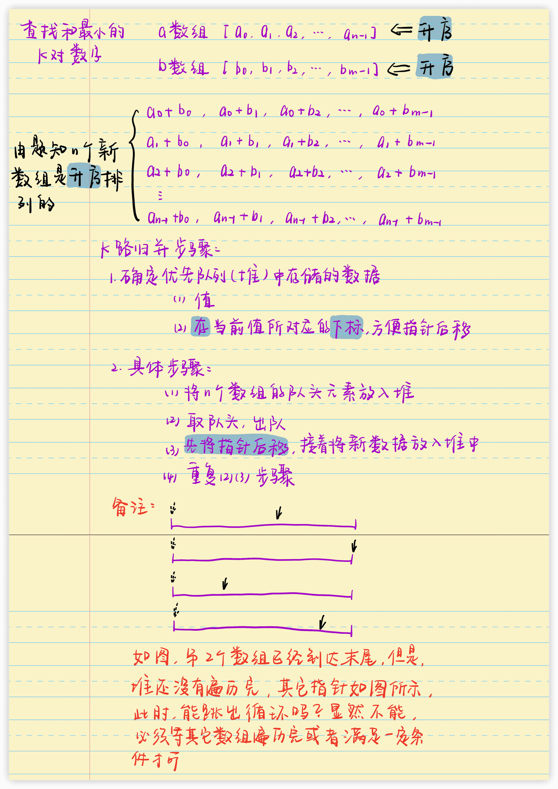

**代ç **

```c++
class Solution {
public:
    vector<vector<int>> kSmallestPairs(vector<int>& a, vector<int>& b, int k) {
        if (a.empty() || b.empty()) return {};
        priority_queue<vector<int>, vector<vector<int>>, greater<vector<int>>> heap;
        int n = a.size(), m = b.size();
        for (int i = 0; i < n; i ++ ) heap.push({a[i] + b[0], i, 0});
        vector<vector<int>> res;
        // k路归并
        while (k -- && heap.size()) {
            auto t = heap.top(); heap.pop();
            res.push_back({a[t[1]], b[t[2]]});
            // 如æœå…¶ä¸­çš„æŸä¸ªæ•°ç»„å·²ç»åˆ°è¾¾æœ«å°¾ï¼Œåˆ™ã€è¯¥æ•°ç»„】ä¸éœ€è¦ç»§ç»­å移
            // 但是，å¯ä¸èƒ½ã€é€€å‡ºã€‘，åŸå› åœ¨ã€æ‰‹å†™ç¨¿ã€‘中
            if (t[2] + 1 < m)
                heap.push({a[t[1]] + b[t[2] + 1], t[1], t[2] + 1});
        }
        return res;
    }
};
```

**标签**

`优先队列`ã€`K路归并`

### 桶æ’åº

#### [LeetCode 164. 最大间è·](https://leetcode-cn.com/problems/maximum-gap/)

**题目æè¿°**

>   给定一个无åºçš„数组 `nums`ï¼Œè¿”å› æ•°ç»„åœ¨æ’åºä¹‹å，相邻元素之间最大的差值 。如æœæ•°ç»„元素个数å°äº `2`ï¼Œåˆ™è¿”å› `0` 。
>
>   您必须编写一个在「线性时间ã€å†…è¿è¡Œå¹¶ä½¿ç”¨ã€Œçº¿æ€§é¢å¤–空间ã€çš„算法。

**示例 1**

>   输入: `nums = [3,6,9,1]`
>   输出: `3`
>   解释: æ’åºå的数组是 `[1,3,6,9]`, 其中相邻元素 `(3,6)` å’Œ `(6,9)` 之间都存在最大差值 `3`。

**示例 2**

>   输入: `nums = [10]`
>   输出: `0`
>   解释: 数组元素个数å°äº `2`ï¼Œå› æ­¤è¿”å› `0`。

**æ示**

>   +   $1 <= nums.length <= 10^5$
>   +   $0 <= nums[i] <= 10^9$

**手写稿**


**代ç **

```c++
#define x first
#define y second
class Solution {
public:
    typedef pair<int, int> PII;
    int maximumGap(vector<int>& nums) {
        int n = nums.size();
        if (n < 2) return 0;
        int Max = INT_MIN, Min = INT_MAX;
        for (int i = 0; i < n; i ++ ) {
            Max = max(Max, nums[i]);
            Min = min(Min, nums[i]);
        }
        // 数组的值都相åŒ
        if (Max == Min) return 0;
        // 桶的个数[手写稿]
        int bk_num = n + 5;
        vector<PII> buckets(bk_num, {INT_MAX, INT_MIN});
        // 桶的容é‡[手写稿]
        int bk_size = (Max - Min + bk_num - 1) / bk_num;
        // æšä¸¾æ¯ä¸ªæ•°åº”该放在哪个桶
        for (int i = 0; i < n; i ++ ) {
            // 查看当å‰æ•°å­—应该放哪个桶
            int k = (nums[i] - Min) / bk_size;
            buckets[k].x = min(buckets[k].x, nums[i]);
            buckets[k].y = max(buckets[k].y, nums[i]);
        }
        int res = -1;
        // æšä¸¾æ¯ä¸ªæ¡¶
        for (int i = 0, last = -1; i <= bk_num; i ++ ) {
            // 如æœå½“å‰æ¡¶æ²¡æœ‰è¢«ç”¨è¿‡, 则直æ¥è·³è¿‡å³å¯
            if (buckets[i] == PII{INT_MAX, INT_MIN})
                continue;
           	// 记录上一个桶的ä½ç½®
            if (last != -1)
                res = max(res, buckets[i].x - buckets[last].y);
            last = i;
        }
        return res;
    }
};
```

**时间å¤æ‚度**

$O(n)$

**空间å¤æ‚度**

$O(n)$

**标签**

`🪣æ’åº`ã€`桶æ’åº`

**ç¼åˆæ€ª**


## 二分

### 整数二分

#### 模æ¿

>   ```c++
>   bool check(int x) {/* ... */} // 检查x是å¦æ»¡è¶³æŸç§æ€§è´¨
>   
>   // 注æ„ï¼ï¼ã€åŒºé—´çš„划分】ï¼ï¼
>   // 区间[l, r]被划分æˆ[l, mid]å’Œ[mid + 1, r]时使用：
>   int bsearch_1(int l, int r) {
>   while (l < r) {
>       int mid = l + r >> 1;
>       if (check(mid)) r = mid;    // check()判断mid是å¦æ»¡è¶³æ€§è´¨
>       else l = mid + 1;
>   }
>   return l;
>   }
>   
>   // 区间[l, r]被划分æˆ[l, mid - 1]å’Œ[mid, r]时使用：
>   int bsearch_2(int l, int r) {
>   while (l < r) {
>       int mid = l + r + 1 >> 1;
>       if (check(mid)) l = mid;
>       else r = mid - 1;
>   }
>   return l;
>   }
>   ```

#### [AcWing 789. 数的范围](https://www.acwing.com/problem/content/791/)

**题目æè¿°**

>   给定一个按照å‡åºæ’列的长度为 `n` çš„æ•´æ•°æ•°ç»„ï¼Œä»¥åŠ `q` 个查询。
>
>   对äºæ¯ä¸ªæŸ¥è¯¢ï¼Œè¿”å›ä¸€ä¸ªå…ƒç´  `k` 的起始ä½ç½®å’Œç»ˆæ­¢ä½ç½®ï¼ˆä½ç½®ä» `0` 开始计数）。
>
>   如æœæ•°ç»„中ä¸å­˜åœ¨è¯¥å…ƒç´ ï¼Œåˆ™è¿”å› `-1 -1`。

**输入格å¼**

>   第一行包å«æ•´æ•° `n` å’Œ `q`，表示数组长度和询问个数。
>
>   ç¬¬äºŒè¡ŒåŒ…å« `n` 个整数（å‡åœ¨ `1∼10000` 范围内），表示完整数组。
>
>   æ¥ä¸‹æ¥ `q` 行，æ¯è¡ŒåŒ…å«ä¸€ä¸ªæ•´æ•° `k`，表示一个询问元素。

**输出格å¼**

>   å…± `q` 行，æ¯è¡ŒåŒ…å«ä¸¤ä¸ªæ•´æ•°ï¼Œè¡¨ç¤ºæ‰€æ±‚元素的起始ä½ç½®å’Œç»ˆæ­¢ä½ç½®ã€‚
>
>   如æœæ•°ç»„中ä¸å­˜åœ¨è¯¥å…ƒç´ ï¼Œåˆ™è¿”å› `-1 -1`。

**æ•°æ®èŒƒå›´**

>   +   $1≤n≤100000$
>   +   $1≤q≤10000$
>   +   $1≤k≤10000$

**输入样例**

```c++
6 3
1 2 2 3 3 4
3
4
5
```

**输出样例**

```c++
3 4
5 5
-1 -1
```

**手写稿**

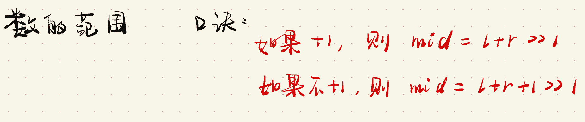

**代ç **

```c++
#include <iostream>
using namespace std;
const int N = 100010;
int n, m;
int g[N];
int main(){
    scanf("%d%d", &n, &m);
    for (int i = 0; i < n; i ++ ) scanf("%d", &g[i]);
    while (m -- ) {
        int x;
        scanf("%d", &x);
        // 寻找左端点
        int l = 0, r = n - 1;
        int L, R;
        while (l < r) {
            int mid = l + r >> 1;
            // 寻找大äºç­‰äºx的最å°å€¼
            if (g[mid] >= x) r = mid;
            else l = mid + 1;
        }
        if (g[l] != x) cout << -1 << " " << -1 << endl;
        else {
            // 寻找å³ç«¯ç‚¹
            L = l;
            l = 0, r = n - 1;
            while (l < r) {
                int mid = l + r + 1 >> 1;
                // 寻找å°äºç­‰äºx的最大值
                if (g[mid] <= x) l = mid;
                else r = mid - 1;
            }
            R = r;
            cout << L << " " << R << endl;
        }
    }
    return 0;
}
```

**时间å¤æ‚度**

$O(n)$

**空间å¤æ‚度**

$O(n)$

**标签**

`二分`ã€`整数二分`

**ç¼åˆæ€ª**


#### [LeetCode 378. 有åºçŸ©é˜µä¸­ç¬¬ K å°çš„元素](https://leetcode-cn.com/problems/kth-smallest-element-in-a-sorted-matrix/)

**题目æè¿°**

>   给你一个 `n x n` 矩阵 `matrix` ，其中æ¯è¡Œå’Œæ¯åˆ—元素å‡æŒ‰å‡åºæ’åºï¼Œæ‰¾åˆ°çŸ©é˜µä¸­ç¬¬ `k` å°çš„元素。
>   请注æ„，它是 æ’åºå 的第 `k` å°å…ƒç´ ï¼Œè€Œä¸æ˜¯ç¬¬ `k` 个 ä¸åŒ 的元素。
>
>   你必须找到一个内存å¤æ‚åº¦ä¼˜äº $O(n^2)$ 的解决方案。

**示例 1**

>   输入：`matrix = [[1,5,9],[10,11,13],[12,13,15]], k = 8`
>   输出：`13`
>   解释：矩阵中的元素为 `[1,5,9,10,11,12,13,13,15]`，第 `8` å°å…ƒç´ æ˜¯ `13`

**示例 2**

>   输入：`matrix = [[-5]], k = 1`
>   输出：`-5`

**æ示**

>   +   $n == matrix.length$
>   +   $n == matrix[i].length$
>   +   $1 <= n <= 300$
>   +   $-10^9 <= matrix[i][j] <= 10^9$
>   +   $é¢˜ç›®æ•°æ® ä¿è¯ matrix 中的所有行和列都按 é递å‡é¡ºåº æ’列$
>   +   $1 <= k <= n^2$

**进阶**

>   你能å¦ç”¨ä¸€ä¸ªæ’定的内存(å³ `O(1)` 内存å¤æ‚度)æ¥è§£å†³è¿™ä¸ªé—®é¢˜?
>   你能在 `O(n)` 的时间å¤æ‚度下解决这个问题å—?这个方法对äºé¢è¯•æ¥è¯´å¯èƒ½å¤ªè¶…å‰äº†ï¼Œä½†æ˜¯ä½ ä¼šå‘ç°é˜…读这篇文章（ [this paper](http://www.cse.yorku.ca/~andy/pubs/X+Y.pdf) ）很有趣。

**手写稿**


**代ç **

```c++
typedef long long LL;
class Solution {
public:
    int kthSmallest(vector<vector<int>>& g, int k) {
        // 二分的ä¸æ˜¯ä¸‹æ ‡ï¼Œè€Œæ˜¯ç­”案
        int l = INT_MIN, r = INT_MAX;
        while (l < r) {
            int mid = (LL)l + r >> 1;
            // jä»æœ€å一个数开始æšä¸¾
            // cnt表示å°äºç­‰äºmid的个数
            int j = g[0].size() - 1, cnt = 0;
            // æšä¸¾æ¯ä¸€è¡Œ
            for (int i = 0; i < g.size(); i ++ ) {
                // 如æœå½“å‰å€¼å¤§äºmid，则j--
                while (j >= 0 && g[i][j] > mid) j --;
                // å°äºç­‰äºmid的个数为j + 1个
                cnt += j + 1;
            }
            if (cnt >= k) r = mid;
            else l = mid + 1;
        }
        return l;
    }
};
```

**时间å¤æ‚度**

$O(nlog_n)$

**空间å¤æ‚度**

$O(1)$

**标签**

`二分`

**ç¼åˆæ€ª**


### å®æ•°äºŒåˆ†

#### 模æ¿

>   ```c++
>   bool check(double x) {/* ... */} // 检查x是å¦æ»¡è¶³æŸç§æ€§è´¨
>   
>   double bsearch_3(double l, double r) {
>   const double eps = 1e-6;   // eps 表示精度，å–决äºé¢˜ç›®å¯¹ç²¾åº¦çš„è¦æ±‚
>   while (r - l > eps) {
>       double mid = (l + r) / 2;
>       if (check(mid)) r = mid;
>       else l = mid;
>   }
>   return l;
>   }
>   ```

#### [AcWing 790. 数的三次方根](https://www.acwing.com/problem/content/792/)

**题目æè¿°**

>   给定一个浮点数 `n`，求它的三次方根。

**输入格å¼**

>   共一行，包å«ä¸€ä¸ªæµ®ç‚¹æ•° `n`。

**输出格å¼**

>   共一行，包å«ä¸€ä¸ªæµ®ç‚¹æ•°ï¼Œè¡¨ç¤ºé—®é¢˜çš„解。
>
>   注æ„，结æœä¿ç•™ `6` ä½å°æ•°ã€‚

**æ•°æ®èŒƒå›´**

>   +   $−10000≤n≤10000$

**输入样例**

```c++
1000.00
```

**输出样例**

```c++
10.000000
```

**手写稿**

>   1.   [å®æ•°äºŒåˆ†](#å®æ•°äºŒåˆ†)

**代ç **

```c++
#include <iostream>
#include <cmath>
using namespace std;
const double eps = 1e-8;
double n;
int main() {
    scanf("%lf", &n);
    // 注æ„：ä¸èƒ½å†™æˆl = 0, r = n
    // 如æœè®¾ç½®æˆl = 0, r = n，则无论如何也找ä¸åˆ°å…¶ä¸‰æ¬¡æ–¹æ ¹
    // åŸå› ï¼š0.001，其三次方根0.1是比本身大的
    double l = -100, r = 100;
    while (fabs(l - r) > eps) {
        double mid = (l + r) / 2;
        if (mid * mid * mid >= n) r = mid;
        else l = mid;
    }
    printf("%.6lf\n", l);
    return 0;
}
```

**时间å¤æ‚度**

$O(log_n)$

**空间å¤æ‚度**

$O(1)$

**标签**

`å®æ•°äºŒåˆ†`

**ç¼åˆæ€ª**


## å‰ç¼€å’Œ

### 一维å‰ç¼€å’Œ

#### [AcWing 795. å‰ç¼€å’Œ](https://www.acwing.com/problem/content/797/)

>   输入一个长度为 `n` çš„æ•´æ•°åºåˆ—。
>
>   æ¥ä¸‹æ¥å†è¾“å…¥ `m` 个询问，æ¯ä¸ªè¯¢é—®è¾“入一对 `l,r`。
>
>   对äºæ¯ä¸ªè¯¢é—®ï¼Œè¾“出åŸåºåˆ—中ä»ç¬¬ `l` 个数到第 `r` 个数的和。

**输入格å¼**

>   第一行包å«ä¸¤ä¸ªæ•´æ•° `n` å’Œ `m`。
>
>   ç¬¬äºŒè¡ŒåŒ…å« `n` 个整数，表示整数数列。
>
>   æ¥ä¸‹æ¥ `m` 行，æ¯è¡ŒåŒ…å«ä¸¤ä¸ªæ•´æ•° `l` å’Œ `r`，表示一个询问的区间范围。

**输出格å¼**

>   å…± `m` 行，æ¯è¡Œè¾“出一个询问的结æœã€‚

**æ•°æ®èŒƒå›´**

>   +   $1≤l≤r≤n,$
>   +   $1≤n,m≤100000,$
>   +   $−1000≤数列中元素的值≤1000$

**输入样例**

```c++
5 3
2 1 3 6 4
1 2
1 3
2 4
```

**输出样例**

```c++
3
6
10
```

**手写稿**

>   1.   `sum[i]` 表示区间 `[1, i]` 的和
>   2.   如æœè¦è®¡ç®—区间 `[l, r]` 的和，首先需è¦æ˜ç¡®
>        +   $sum[r] = a_1 + a_2 + ... + a_{r - 1} + a_r$
>        +   $sum[l] = a_1 + a_2 + ... + a_{l - 1} + a_l$
>        +   两者相å‡å³å¯

**代ç **

```c++
#include <iostream>
using namespace std;
const int N = 100010;
int n, m;
int sum[N];
int main() {
    scanf("%d%d", &n, &m);
    for (int i = 1, x; i <= n; i ++ ) {
        scanf("%d", &x);
        sum[i] = x + sum[i - 1];
    }
    while (m -- ) {
        int l, r;
        scanf("%d%d", &l, &r);
        printf("%d\n", sum[r] - sum[l - 1]);
    }
    return 0;
}
```

**标签**

`å‰ç¼€å’Œ`

### 二维å‰ç¼€å’Œ

#### [AcWing 796. å­çŸ©é˜µçš„å’Œ](https://www.acwing.com/problem/content/798/)

>   输入一个 `n` è¡Œ `m` 列的整数矩阵，å†è¾“å…¥ `q` 个询问，æ¯ä¸ªè¯¢é—®åŒ…å«å››ä¸ªæ•´æ•° `x1,y1,x2,y2`，表示一个å­çŸ©é˜µçš„左上角å标和å³ä¸‹è§’å标。
>
>   对äºæ¯ä¸ªè¯¢é—®è¾“出å­çŸ©é˜µä¸­æ‰€æœ‰æ•°çš„和。

**输入格å¼**

>   第一行包å«ä¸‰ä¸ªæ•´æ•° `n，m，q`。
>
>   æ¥ä¸‹æ¥ `n` 行，æ¯è¡ŒåŒ…å« `m` 个整数，表示整数矩阵。
>
>   æ¥ä¸‹æ¥ `q` 行，æ¯è¡ŒåŒ…å«å››ä¸ªæ•´æ•° `x1,y1,x2,y2`，表示一组询问。

**输出格å¼**

>   å…± `q` 行，æ¯è¡Œè¾“出一个询问的结æœã€‚

**æ•°æ®èŒƒå›´**

>   +   $1≤n,m≤1000,$
>   +   $1≤q≤200000,$
>   +   $1≤x1≤x2≤n,$
>   +   $1≤y1≤y2≤m,$
>   +   $−1000≤矩阵内元素的值≤1000$

**输入样例**

```c++
3 4 3
1 7 2 4
3 6 2 8
2 1 2 3
1 1 2 2
2 1 3 4
1 3 3 4
```

**输出样例**

```c++
17
27
21
```

**手写稿**

>   
>
>   紫色é¢ç§¯æ˜¯æŒ‡ `(1,1)` 左上角到 `(i,j-1)` å³ä¸‹è§’的矩形é¢ç§¯, 绿色é¢ç§¯æ˜¯æŒ‡ `(1,1)` 左上角到 `(i-1, j )` å³ä¸‹è§’的矩形é¢ç§¯ã€‚æ¯ä¸€ä¸ªé¢œè‰²çš„矩形é¢ç§¯éƒ½ä»£è¡¨äº†å®ƒæ‰€åŒ…围元素的和。
>
>   
>
>   ä»å›¾ä¸­æˆ‘们很容易看出，整个外围è“色矩形é¢ç§¯`s[i][j]` = 绿色é¢ç§¯`s[i-1][j]` + 紫色é¢ç§¯`s[i][j-1]` - é‡å¤åŠ çš„红色的é¢ç§¯`s[i-1][j-1]` `+`å°æ–¹å—çš„é¢ç§¯`a[i][j]`;
>
>   因此得出二维å‰ç¼€å’Œé¢„处ç†å…¬å¼
>
>   `s[i] [j] = s[i-1][j] + s[i][j-1 ] + a[i] [j] - s[i-1][ j-1]`
>
>   æ¥ä¸‹æ¥å›å½’问题å»æ±‚以 `(x1,y1)` 为左上角和以 `(x2,y2)` 为å³ä¸‹è§’的矩阵的元素的和。
>
>   åŒæ ·çš„é“ç†ã€<font style= "color: red">**你这题目一次一次æ¢äº†å¤šå°‘个，改过ä¸å•¦ï¼Œæ¢æ±¤ä¸æ¢è¯å•Š**</font>】

**代ç **

```c++
#include <iostream>
using namespace std;
const int N = 1010;
int n, m, q;
int g[N][N], sum[N][N];
int main() {
    scanf("%d%d%d", &n, &m, &q);
    for (int i = 1; i <= n; i ++ )
        for (int j = 1; j <= m; j ++ ) {
            scanf("%d", &g[i][j]);
            sum[i][j] = g[i][j] + sum[i - 1][j] + sum[i][j - 1] - sum[i - 1][j - 1];
        }
    while (q -- ) {
        int x1, y1, x2, y2;
        scanf("%d%d%d%d", &x1, &y1, &x2, &y2);
        cout << sum[x2][y2] - sum[x2][y1 - 1] - sum[x1 - 1][y2] + sum[x1 - 1][y1 - 1] << endl;
    }
    return 0;
}
```

**标签**

`å‰ç¼€å’Œ`ã€`二维å‰ç¼€å’Œ`

## 差分

### 一维差分

#### [AcWing 797. 差分](https://www.acwing.com/problem/content/799/)

>   输入一个长度为 `n` çš„æ•´æ•°åºåˆ—。
>
>   æ¥ä¸‹æ¥è¾“å…¥ `m` 个æ“作，æ¯ä¸ªæ“作包å«ä¸‰ä¸ªæ•´æ•° `l,r,c`，表示将åºåˆ—中 `[l,r]` 之间的æ¯ä¸ªæ•°åŠ ä¸Š `c`。
>
>   请你输出进行完所有æ“作åçš„åºåˆ—。

**输入格å¼**

>   第一行包å«ä¸¤ä¸ªæ•´æ•° `n` å’Œ `m`。
>
>   ç¬¬äºŒè¡ŒåŒ…å« `n` 个整数，表示整数åºåˆ—。
>
>   æ¥ä¸‹æ¥ `m` 行，æ¯è¡ŒåŒ…å«ä¸‰ä¸ªæ•´æ•° `l，r，c`，表示一个æ“作。

**输出格å¼**

>   å…±ä¸€è¡Œï¼ŒåŒ…å« `n` 个整数，表示最终åºåˆ—。

**æ•°æ®èŒƒå›´**

>   +   $1≤n,m≤100000,$
>   +   $1≤l≤r≤n,$
>   +   $−1000≤c≤1000,$
>   +   $−1000≤整数åºåˆ—中元素的值≤1000$

**输入样例**

```c++
6 3
1 2 2 1 2 1
1 3 1
3 5 1
1 6 1
```

**输出样例**

```c++
3 4 5 3 4 2
```

**手写稿**


**代ç **

```c++
#include <iostream>
using namespace std;
const int N = 100010;
int n, m;
int g[N];
int main() {
    scanf("%d%d", &n, &m);
    for (int i = 1, a = 0, b = 0; i <= n; i ++ ) {
        scanf("%d", &a);
        g[i] = a - b;
        b = a;
    }
    while (m -- ) {
        int l, r, c;
        scanf("%d%d%d", &l, &r, &c);
        g[l] += c;
        g[r + 1] -= c;
    }
    for (int i = 1, x; i <= n; i ++ ) {
        x += g[i];
        cout << x << " ";
    }
    return 0;
}
```

**标签**

`差分`ã€`一维差分`

#### [AcWing 4195. 线段覆盖](https://www.acwing.com/problem/content/4198/)

>   在一个å标轴上有 `n` æ¡çº¿æ®µã€‚
>
>   æ¯æ¡çº¿æ®µçš„æ¯ä¸ªç«¯ç‚¹çš„å标都为整数。
>
>   å¯èƒ½å­˜åœ¨é€€åŒ–æˆç‚¹çš„线段。
>
>   线段之间å¯ä»¥ç›¸äº’交å‰ã€åµŒå¥—甚至é‡åˆã€‚
>
>   请你计算，对äºæ¯ä¸ª `k∈{1,2,…,n}`，å标轴中共有多少个**æ•´æ•°åæ ‡**的点满足æ°å¥½è¢« `k` æ¡çº¿æ®µè¦†ç›–。
>
>   注æ„，左å³ç«¯ç‚¹åˆ†åˆ«ä¸º $l_i,r_i$ 的线段覆盖点 `x` 当且仅当 $l_i≤x≤r_i$。

**输入格å¼**

>   第一行包å«æ•´æ•° `n`。
>
>   æ¥ä¸‹æ¥ `n` 行，æ¯è¡ŒåŒ…å«ä¸¤ä¸ªæ•´æ•° $l_i,r_i$，表示一æ¡çº¿æ®µçš„å·¦å³ç«¯ç‚¹ã€‚

**输出格å¼**

>   一行 `n` 个整数，其中第 `i` 个整数表示å标轴中满足æ°å¥½è¢« `i` æ¡çº¿æ®µè¦†ç›–çš„**æ•´æ•°åæ ‡**的点的数é‡ã€‚

**æ•°æ®èŒƒå›´**

>   +   $å‰ä¸‰ä¸ªæµ‹è¯•ç‚¹æ»¡è¶³ 1≤n≤3。$
>   +   $所有测试点满足 1≤n≤2×10^5，0≤li≤ri≤10^{18}。$

**输入样例1**

```c++
3
0 3
1 3
3 8
```

**输出样例1**

```c++
6 2 1
```

**输入样例2**

```c++
3
1 3
2 4
5 7
```

**输出样例2**

```c++
5 2 0
```

**手写稿**


**代ç **

```c++
#include <iostream>
#include <map>
using namespace std;
typedef long long LL;
const int N = 200010;
int n;
LL ans[N];
// 差分数组
map<LL, LL> q;
int main() {
    scanf("%d", &n);
    for (int i = 1; i <= n; i ++ ) {
        LL l, r;
        scanf("%lld%lld", &l, &r);
        q[l] += 1;
        q[r + 1] -= 1;
    }
    // last表示上一个ä½ç½®ï¼Œsum表示å‰ç¼€å’Œ
    LL last = -1, sum = 0;
    for (auto& [x, c] : q) {
        ans[sum] += x - last;
        last = x;
        sum += c;
    }
    for (int i = 1; i <= n; i ++ ) cout << ans[i] << " ";
    return 0;
}
```

**标签**

`离散化`ã€`差分`

### 二维差分

#### [AcWing 798. 差分矩阵](https://www.acwing.com/problem/content/800/)

>   输入一个 `n` è¡Œ `m` 列的整数矩阵，å†è¾“å…¥ `q` 个æ“作，æ¯ä¸ªæ“作包å«äº”个整数 `x1,y1,x2,y2,c`，其中 `(x1,y1)` å’Œ `(x2,y2)` 表示一个å­çŸ©é˜µçš„左上角å标和å³ä¸‹è§’å标。
>
>   æ¯ä¸ªæ“作都è¦å°†é€‰ä¸­çš„å­çŸ©é˜µä¸­çš„æ¯ä¸ªå…ƒç´ çš„值加上 `c`。
>
>   请你将进行完所有æ“作å的矩阵输出。

**输入格å¼**

>   第一行包å«æ•´æ•° `n,m,q`。
>
>   æ¥ä¸‹æ¥ `n` 行，æ¯è¡ŒåŒ…å« `m` 个整数，表示整数矩阵。
>
>   æ¥ä¸‹æ¥ `q` 行，æ¯è¡ŒåŒ…å« `5` 个整数 `x1,y1,x2,y2,c`，表示一个æ“作。

**输出格å¼**

>   å…± `n` 行，æ¯è¡Œ `m` 个整数，表示所有æ“作进行完毕å的最终矩阵。

**æ•°æ®èŒƒå›´**

>   +   $1≤n,m≤1000,$
>   +   $1≤q≤100000,$
>   +   $1≤x1≤x2≤n,$
>   +   $1≤y1≤y2≤m,$
>   +   $−1000≤c≤1000,$
>   +   $−1000≤矩阵内元素的值≤1000$

**输入样例**

```c++
3 4 3
1 2 2 1
3 2 2 1
1 1 1 1
1 1 2 2 1
1 3 2 3 2
3 1 3 4 1
```

**输出样例**

```c++
2 3 4 1
4 3 4 1
2 2 2 2
```

**手写稿**


**代ç **

```c++
#include <iostream>
using namespace std;
const int N = 1010;
int n, m, q;
int g[N][N], b[N][N];
int main() {
    scanf("%d%d%d",&n, &m, &q);
    for (int i = 1; i <= n; i ++ )
        for (int j = 1; j <= m; j ++ ) {
            scanf("%d", &g[i][j]);
            // æ„建差分矩阵
            b[i][j] = g[i][j] - g[i - 1][j] - g[i][j - 1] + g[i - 1][j - 1];
            
        }
    while (q -- ) {
        int x1, y1, x2, y2, c;
        scanf("%d%d%d%d%d", &x1, &y1, &x2, &y2, &c);
        // 差分矩阵公å¼
        b[x1][y1] += c;
        b[x2 + 1][y1] -= c;
        b[x1][y2 + 1] -= c;
        b[x2 + 1][y2 + 1] += c;
    }
    for (int i = 1; i <= n; i ++ ) {
        for (int j = 1; j <= m; j ++ ) {
            // 求å‰ç¼€å’Œ
            b[i][j] = b[i][j] + b[i - 1][j] + b[i][j - 1] - b[i - 1][j - 1];
            cout << b[i][j] << " ";
        }
        cout << endl;
    }
    return 0;
}
```

**标签**

`差分`ã€`二维差分`

## 多指针专题

### åŒæŒ‡é’ˆ

#### 快慢指针

##### [LeetCode 141. ç¯å½¢é“¾è¡¨](https://leetcode-cn.com/problems/linked-list-cycle/)

**题目æè¿°**

> 给你一个链表的头节点 `head` ，判断链表中是å¦æœ‰ç¯ã€‚
>
> 如æœé“¾è¡¨ä¸­æœ‰æŸä¸ªèŠ‚点，å¯ä»¥é€šè¿‡è¿ç»­è·Ÿè¸ª `next` 指针å†æ¬¡åˆ°è¾¾ï¼Œåˆ™é“¾è¡¨ä¸­å­˜åœ¨ç¯ã€‚ 为了表示给定链表中的ç¯ï¼Œè¯„测系统内部使用整数 `pos` æ¥è¡¨ç¤ºé“¾è¡¨å°¾è¿æ¥åˆ°é“¾è¡¨ä¸­çš„ä½ç½®ï¼ˆç´¢å¼•ä» `0` å¼€å§‹ï¼‰ã€‚å¦‚æœ `pos` 是 `-1`，则在该链表中没有ç¯ã€‚注æ„：`pos` ä¸ä½œä¸ºå‚数进行传递，仅仅是为了标识链表的å®é™…情况。
>
> 如æœé“¾è¡¨ä¸­å­˜åœ¨ç¯ï¼Œåˆ™è¿”å› `true` 。 å¦åˆ™ï¼Œè¿”å› `false` 。 

**示例 1**


> 输入：`head = [3,2,0,-4], pos = 1`
> 输出：`true`
> 解释：链表中有一个ç¯ï¼Œå…¶å°¾éƒ¨è¿æ¥åˆ°ç¬¬äºŒä¸ªèŠ‚点。

**示例 2**


> 输入：`head = [1,2], pos = 0`
> 输出：`true`
> 解释：链表中有一个ç¯ï¼Œå…¶å°¾éƒ¨è¿æ¥åˆ°ç¬¬ä¸€ä¸ªèŠ‚点。

**示例 3**


> 输入：`head = [1], pos = -1`
> 输出：`false`
> 解释：链表中没有ç¯ã€‚

**æ示**

> 链表中节点的数目范围是 $[0, 10^4]$
> $-10^5 <= Node.val <= 10^5$
> `pos` 为 `-1` 或者链表中的一个 有效索引 。
>
>
> 进阶：你能用 O(1)（å³ï¼Œå¸¸é‡ï¼‰å†…存解决此问题å—？

**题解**

> 1. 设置 `fast` 和 `slow` 两个指针
> 2. `fast` 一次走两步，`slow` 一次走一步，分两ç§æƒ…况：
>     + `fast` 走到空指针，说æ˜æ— ç¯
>     + `fast` å’Œ `slow` 相等，说æ˜æœ‰ç¯

**代ç **

```c++
class Solution {
public:
    bool hasCycle(ListNode *head) {
        if (!head) return false;
        auto fast = head, slow = head;
        do {
            fast = fast -> next;
            slow = slow -> next;
            if (fast) fast = fast -> next;
            else return false;
            if (fast == slow) return true;
        } while (fast);
        return false;
    }
};
```

**标签**

`åŒæŒ‡é’ˆ`ã€`快慢指针`ã€`ç¯`

##### [LeetCode 142. ç¯å½¢é“¾è¡¨ II](https://leetcode-cn.com/problems/linked-list-cycle-ii/)

**题目æè¿°**

> 给定一个链表，返å›é“¾è¡¨å¼€å§‹å…¥ç¯çš„第一个节点。 如æœé“¾è¡¨æ— ç¯ï¼Œåˆ™è¿”å› `null`。
>
> 如æœé“¾è¡¨ä¸­æœ‰æŸä¸ªèŠ‚点，å¯ä»¥é€šè¿‡è¿ç»­è·Ÿè¸ª `next` 指针å†æ¬¡åˆ°è¾¾ï¼Œåˆ™é“¾è¡¨ä¸­å­˜åœ¨ç¯ã€‚ 为了表示给定链表中的ç¯ï¼Œè¯„测系统内部使用整数 `pos` æ¥è¡¨ç¤ºé“¾è¡¨å°¾è¿æ¥åˆ°é“¾è¡¨ä¸­çš„ä½ç½®ï¼ˆç´¢å¼•ä» `0` å¼€å§‹ï¼‰ã€‚å¦‚æœ `pos` 是 `-1`，则在该链表中没有ç¯ã€‚注æ„：`pos` ä¸ä½œä¸ºå‚数进行传递，仅仅是为了标识链表的å®é™…情况。
>
> ä¸å…许修改 链表。

**示例 1**


> 输入：`head = [3,2,0,-4], pos = 1`
> 输出：返å›ç´¢å¼•ä¸º `1` 的链表节点
> 解释：链表中有一个ç¯ï¼Œå…¶å°¾éƒ¨è¿æ¥åˆ°ç¬¬äºŒä¸ªèŠ‚点。

**示例 2**


> 输入：`head = [1,2], pos = 0`
> 输出：返å›ç´¢å¼•ä¸º `0` 的链表节点
> 解释：链表中有一个ç¯ï¼Œå…¶å°¾éƒ¨è¿æ¥åˆ°ç¬¬ä¸€ä¸ªèŠ‚点。

**示例 3**


> 输入：`head = [1], pos = -1`
> è¾“å‡ºï¼šè¿”å› `null`
> 解释：链表中没有ç¯ã€‚

**æ示**

> + 链表中节点的数目范围在范围 $[0, 10^4]$ 内
> + $-10^5 <= Node.val <= 10^5$
> + `pos` 的值为 `-1` 或者链表中的一个有效索引

**进阶**

> 你是å¦å¯ä»¥ä½¿ç”¨ `O(1)` 空间解决此题？

**题解**

> 1. 设置 `fast` 和 `slow` 指针
> 2. `fast` 指针一次走两步，`slow` 指针一次走一步，分两ç§æƒ…况讨论
>     + å¦‚æœ `fast` 指针为空，说æ˜æ— ç¯
>     + å¦‚æœ `fast == slow`，则让 `fast == head`，然å让 `fast` å’Œ `slow` 指针åŒæ—¶èµ°ï¼Œå½“两者相é‡æ—¶ï¼Œå³ä¸ºç¯çš„å…¥å£

**正确性è¯æ˜**

> 
>
> è¯æ˜å¦‚下
> $$
> 当fast指针和slow指针两者相é‡çš„时候，满足l_{fast}\;=\;2\;*\;l_{slow}\;\;(1) \\
> l_{fast}\;=\;l_{ab}\;+\;n\;*\;l_{圆}\;+\;l_{bc}\;\;(2) \\
> l_{slow}\;=\;l_{ab}\;+\;l_{bc}\;\;(3)，结åˆ(1)(2)(3)å¼ï¼Œæœ‰ \\
> \begin{align*}
> l_{ab}\;+\;l_{bc}&=\;n\;*\;l_{圆} \\
> &= (n\;-\;1)\;*\;l_{圆}\;+\;l_{bc}\;+\;l_{cb}，ä»è€Œæœ‰
> \end{align*}
> \\
> l_{ab} = (n\;-\;1)\;*\;l_{圆}\;+\;l_{cb}
> $$

**代ç **

 ```c++
class Solution {
public:
    ListNode *detectCycle(ListNode *head) {
        if (!head) return NULL;
        auto fast = head, slow = head;
        do {
            fast = fast -> next;
            slow = slow -> next;
            if (fast) fast = fast -> next;
            if (!fast) return NULL;
        } while (fast != slow);
        fast = head;
        while (fast != slow) {
            fast = fast -> next;
            slow = slow -> next;
        }
        return fast;
    }
};
 ```

**标签**

`åŒæŒ‡é’ˆ`ã€`快慢指针`ã€`ç¯`

##### [LeetCode 287. 寻找é‡å¤æ•°](https://leetcode-cn.com/problems/find-the-duplicate-number/)

**题目æè¿°**

> ç»™å®šä¸€ä¸ªåŒ…å« `n + 1` 个整数的数组 `nums` ，其数字都在 `1` 到 `n` 之间（包括 `1` å’Œ `n`），å¯çŸ¥è‡³å°‘存在一个é‡å¤çš„整数。
>
> å‡è®¾ `nums` åªæœ‰ 一个é‡å¤çš„æ•´æ•° ，找出 这个é‡å¤çš„æ•° 。
>
> 你设计的解决方案必须ä¸ä¿®æ”¹æ•°ç»„ `nums` 且åªç”¨å¸¸é‡çº§ `O(1)` çš„é¢å¤–空间。

**示例 1**

> 输入：`nums = [1,3,4,2,2]`
> 输出：`2`

**示例 2**

> 输入：`nums = [3,1,3,4,2]`
> 输出：`3`

**示例 3**

> 输入：`nums = [1,1]`
> 输出：`1`

**示例 4**

> 输入：`nums = [1,1,2]`
> 输出：`1`

**æ示**

> + $1 <= n <= 10^5$
> + $nums.length == n + 1$
> + $1 <= nums[i] <= n$
> + `nums` 中 åªæœ‰ä¸€ä¸ªæ•´æ•° å‡ºç° ä¸¤æ¬¡æˆ–å¤šæ¬¡ ，其余整数å‡åªå‡ºç° 一次

**进阶**

> 如何è¯æ˜ `nums` 中至少存在一个é‡å¤çš„æ•°å­—?
> ä½ å¯ä»¥è®¾è®¡ä¸€ä¸ªçº¿æ€§çº§æ—¶é—´å¤æ‚度 `O(n)` 的解决方案å—？

**题解**

> 1. `n + 1` 个整数，且数字都在 `1 ï½ n` 之间，因此，一定有一个数字被指å‘两次，以下标和下标对应的数字è¿æ¥ä¸€æ¡æœ‰å‘边的è¯ï¼Œåˆ™é—®é¢˜è½¬åŒ–为寻找ç¯çš„å…¥å£çš„问题，快慢指针åšå³å¯

**代ç **

```c++
class Solution {
public:
    int findDuplicate(vector<int>& nums) {
        int fast = 0, slow = 0;
        do {
            fast = nums[nums[fast]];
            slow = nums[slow];
        } while (fast != slow);
        fast = 0;
        while (fast != slow) {
            fast = nums[fast];
            slow = nums[slow];
        }
        return fast;
    }
};
```

**标签**

`åŒæŒ‡é’ˆ`ã€`快慢指针`ã€`ç¯`

### 三指针

#### [LeetCode 75. 颜色分类](https://leetcode-cn.com/problems/sort-colors/)

**题目æè¿°**

> 给定一个包å«çº¢è‰²ã€ç™½è‰²å’Œè“色ã€å…± `n` 个元素的数组 `nums` ，åŸåœ°å¯¹å®ƒä»¬è¿›è¡Œæ’åºï¼Œä½¿å¾—相åŒé¢œè‰²çš„元素相邻，并按照红色ã€ç™½è‰²ã€è“色顺åºæ’列。
>
> 我们使用整数 `0〠1` å’Œ `2` 分别表示红色ã€ç™½è‰²å’Œè“色。
>
> 必须在ä¸ä½¿ç”¨åº“çš„ `sort` 函数的情况下解决这个问题。

**示例 1**

> 输入：`nums = [2,0,2,1,1,0]`
> 输出：`[0,0,1,1,2,2]`

**示例 2**

> 输入：`nums = [2,0,1]`
> 输出：`[0,1,2]`

**æ示**

> + $n == nums.length$
> + $1 <= n <= 300$
> + $nums[i] 为 0ã€1 或 2$

**进阶**

> ä½ å¯ä»¥ä¸ä½¿ç”¨ä»£ç åº“中的æ’åºå‡½æ•°æ¥è§£å†³è¿™é“题å—？
> 你能想出一个仅使用常数空间的一趟扫æ算法å—？

**手写稿**

> 
>
> 1. `0 ~ j - 1` 是红色，`j ~ i - 1` 是白色，`k +1 ~ n` 是è“色，`i ~ k` 是待分é…区域
> 2. 针对 `nums[i]` çš„å–值分三ç§æƒ…况：
>     + `nums[i]`  å–值为 `0`ï¼Œåˆ™äº¤æ¢ `nums[i ++]` å’Œ `nums[j ++]` 的值
>     + `nums[i]` å–值为 `1`ï¼Œåˆ™ç›´æ¥ `i ++`
>     + `nums[i]`  å–值为 `2`ï¼Œåˆ™äº¤æ¢ `nums[i]` å’Œ `nums[k -- ]` 的值
>         + 为啥ä¸æ˜¯ `i ++` ，因为 `i` 到 `k` 都是待分é…区域，无法判别 `nums[i]` 是 `0，1` 或者 `2`，所以，ä¸èƒ½ `++`

**代ç **

```c++
class Solution {
public:
    void sortColors(vector<int>& nums) {
        for (int i = 0, j = 0, k = nums.size() - 1; i <= k;) {
            if (nums[i] == 0) swap(nums[j ++], nums[i ++]);
            else if (nums[i] == 1) i ++;
            else swap(nums[i], nums[k --]);
        }
        return;
    }
};
```

**标签**

`三指针`ã€`è·å…°å›½æ——`

## ä½è¿ç®—

### 普通ä½è¿ç®—

#### [LeetCode 260. åªå‡ºç°ä¸€æ¬¡çš„æ•°å­— III](https://leetcode-cn.com/problems/single-number-iii/)

**题目æè¿°**

> 给定一个整数数组 `nums`，其中æ°å¥½æœ‰ä¸¤ä¸ªå…ƒç´ åªå‡ºç°ä¸€æ¬¡ï¼Œå…¶ä½™æ‰€æœ‰å…ƒç´ å‡å‡ºç°ä¸¤æ¬¡ã€‚ 找出åªå‡ºç°ä¸€æ¬¡çš„那两个元素。你å¯ä»¥æŒ‰ ä»»æ„é¡ºåº è¿”å›ç­”案。
>
> 进阶：你的算法应该具有线性时间å¤æ‚度。你能å¦ä»…使用常数空间å¤æ‚度æ¥å®ç°ï¼Ÿ

**示例 1**

> 输入：`nums = [1,2,1,3,2,5]`
> 输出：`[3,5]`
> 解释：`[5, 3]` 也是有效的答案。

**示例 2**

> 输入：`nums = [-1,0]`
> 输出：`[-1,0]`

**示例 3**

> 输入：`nums = [0,1]`
> 输出：`[1,0]`

**æ示**

> + $2\;\leq\;nums.length\;\leq\;3\;*\;10^4$
> + $-2^{31}\;\leq\;nums[i]\;\leq\;2^{31}\;-\;1$
> + 除两个åªå‡ºç°ä¸€æ¬¡çš„整数外，nums 中的其他数字都出ç°ä¸¤æ¬¡

**题解**

> 1. 将所有数字进行异或之å得到的值 `ab` å³ä¸ºåªå‡ºç°ä¸€æ¬¡çš„那两个元素 `a` å’Œ `b` 的异或值
> 2. 由异或的性质å¯çŸ¥ `ab` 的二进制表示中æŸä¸€ä½ `k`上的值为 `1` ，说æ˜å…ƒç´  `a` å’Œ 元素 `b` 在 `k` 上的二进制是ä¸åŒçš„。因此，å¯ä»¥æ ¹æ®ç¬¬ `k` ä½è¿›è¡Œåˆ’分，将整个数组划分æˆä¸ºä¸¤éƒ¨åˆ†ï¼Œä¸€éƒ¨åˆ†è¡¨ç¤ºç¬¬ `k` ä½çš„值为 `1` ，å¦ä¸€éƒ¨åˆ†è¡¨ç¤ºç¬¬ `k` ä½çš„值为 `0`，此时问题å˜æˆåœ¨ä¸€ä¸ªæ•°ç»„中，åªæœ‰ä¸€ä¸ªæ•°å‡ºç°ä¸€æ¬¡ï¼Œå…¶ä»–数出ç°ä¸¤æ¬¡ï¼Œå¯è§£

**代ç **

```c++
class Solution {
public:
    int get(vector<int>& nums, int k, int u) {
        int res = 0;
        for (auto& num : nums)
            if ((num >> k & 1) == u) res ^= num;
        return res;
    }
    vector<int> singleNumber(vector<int>& nums) {
        int ab = 0;
        for (auto& num : nums) ab ^= num;
        int k = 0;
        while ((ab >> k & 1) == 0) k ++;
        return {get(nums, k, 1), get(nums, k, 0)};
    }
};
```

**标签**

`ä½è¿ç®—`

#### [LeetCode 338. 比特ä½è®¡æ•°](https://leetcode-cn.com/problems/counting-bits/)

**题目æè¿°**

> 给你一个整数 `n` ï¼Œå¯¹äº `0 <= i <= n` 中的æ¯ä¸ª `i` ，计算其二进制表示中 `1` 的个数 ，返å›ä¸€ä¸ªé•¿åº¦ä¸º `n + 1` 的数组 `ans` 作为答案。

**示例 1**

> 输入：`n = 2`
> 输出：`[0,1,1]`
> 解释：
> `0 --> 0`
> `1 --> 1`
> `2 --> 10`

**示例 2**

> 输入：`n = 5`
> 输出：`[0,1,1,2,1,2]`
> 解释：
> `0 --> 0`
> `1 --> 1`
> `2 --> 10`
> `3 --> 11`
> `4 --> 100`
> `5 --> 101`

**æ示**

> + $0 <= n <= 10^5$

**进阶**

> 很容易就能å®ç°æ—¶é—´å¤æ‚度为 `O(n log n)` 的解决方案，你å¯ä»¥åœ¨çº¿æ€§æ—¶é—´å¤æ‚度 `O(n)` 内用一趟扫æ解决此问题å—？
> 你能ä¸ä½¿ç”¨ä»»ä½•å†…置函数解决此问题å—？（如，`C++` 中的 `__builtin_popcount` ）

**方法一：æšä¸¾ + ä½è¿ç®—**

**步骤**

> 1. éå†æ¯ä¸€ä¸ªæ•°å­—，检查æ¯ä¸€ä¸ªæ•°å­—的二进制ä½ä¸­å«æœ‰çš„ `1` 的个数å³å¯
> 2. 使用 `lowbit` 函数进行检查 `1` çš„æ•°é‡
>     + `lowbit` 函数 `x & -x` å¯ä»¥å–å¾— `x` 的最åä¸€ä½ `1`

**代ç **

```c++
class Solution {
public:
    int get(int x) {
        int res = 0;
        while (x) {
            x -= x & -x;
            res ++;
        }
        return res;
    }
    vector<int> countBits(int n) {
        vector<int> res;
        for (int i = 0; i <= n; i ++ ) res.push_back(get(i));
        return res;
    }
};
```

**方法二：动æ€è§„划 + ä½è¿ç®—**

**手写稿**

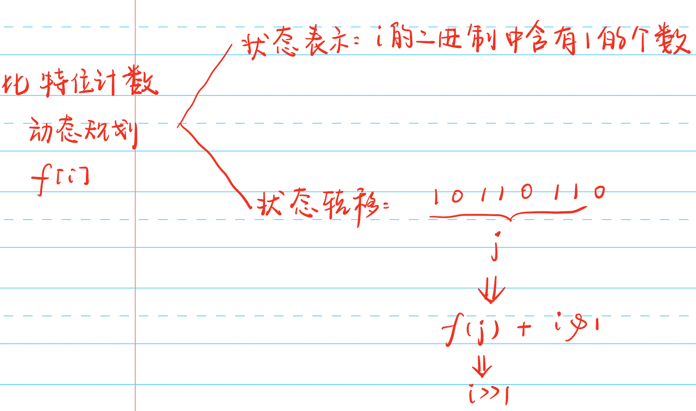

**代ç **

```c++
class Solution {
public:
    vector<int> countBits(int n) {
        vector<int> f(n + 1);
        for (int i = 0; i <= n; i ++ ) f[i] = f[i >> 1] + (i & 1);
        return f;
    }
};
```

**标签**

` 动æ€è§„划`ã€`ä½è¿ç®—`

#### [AcWing 318. 最大å•è¯é•¿åº¦ä¹˜ç§¯](https://leetcode-cn.com/problems/maximum-product-of-word-lengths/)

**题目æè¿°**

> 给你一个字符串数组 `words` ï¼Œæ‰¾å‡ºå¹¶è¿”å› `length(words[i]) * length(words[j])` 的最大值，并且这两个å•è¯ä¸å«æœ‰å…¬å…±å­—æ¯ã€‚如æœä¸å­˜åœ¨è¿™æ ·çš„两个å•è¯ï¼Œè¿”å› `0` 。

**示例 1**

> 输入：`words = ["abcw","baz","foo","bar","xtfn","abcdef"]`
> 输出：`16`
> 解释：这两个å•è¯ä¸º `"abcw", "xtfn"`。

**示例 2**

> 输入：`words = ["a","ab","abc","d","cd","bcd","abcd"]`
> 输出：`4` 
> 解释：这两个å•è¯ä¸º `"ab", "cd"`。

**示例 3**

> 输入：`words = ["a","aa","aaa","aaaa"]`
> 输出：`0`
> 解释：ä¸å­˜åœ¨è¿™æ ·çš„两个å•è¯ã€‚

**æ示**

> + $2 <= words.length <= 1000$
> + $1 <= words[i].length <= 1000$
> + $words[i]$ 仅包å«å°å†™å­—æ¯

**手写稿**


**代ç **

```c++
class Solution {
public:
    int maxProduct(vector<string>& words) {
        vector<int> state;
        for (auto& word : words) {
            int s = 0;
            // 26ä½äºŒè¿›åˆ¶ï¼Œä¹Ÿå°±æ˜¯è¯´a, aa, aaaå®é™…上映射的都是åŒä¸€ä¸ªæ•°å­—
            // 注æ„体会
            for (auto& c : word) s |= 1 << (c - 'a');
            state.push_back(s);
        }
        int res = 0;
        for (int i = 0; i < words.size(); i ++ )
            for (int j = i + 1; j < words.size(); j ++ )
                if (!(state[i] & state[j]))
                    res = max(res, (int)(words[i].size() * words[j].size()));
        return res;
    }
};
```

**标签**

`ä½è¿ç®—`

#### [LeetCode 371. 两整数之和](https://leetcode-cn.com/problems/sum-of-two-integers/)

**题目æè¿°**

>   给你两个整数 `a` å’Œ `b` ，ä¸ä½¿ç”¨ è¿ç®—符 `+` å’Œ `-` ，计算并返å›ä¸¤æ•´æ•°ä¹‹å’Œã€‚

**示例 1**

>   输入：`a = 1, b = 2`
>   输出：`3`

**示例 2**

>   输入：`a = 2, b = 3`
>   输出：`5`

**æ示**

>   +   $-1000 <= a, b <= 1000$

**手写稿**


**代ç **

```c++
class Solution {
public:
    int getSum(int a, int b) {
        if (!b) return a;
        int sum = a ^ b, carry = (unsigned)(a & b) << 1;
        return getSum(sum, carry);
    }
};
```

**标签**

`ä½è¿ç®—`

#### [LeetCode 29. 两数相除](https://leetcode-cn.com/problems/divide-two-integers/)

**题目æè¿°**

>   给定两个整数，被除数 `dividend` 和除数 `divisor`。将两数相除，è¦æ±‚ä¸ä½¿ç”¨ä¹˜æ³•ã€é™¤æ³•å’Œ `mod` è¿ç®—符。
>
>   è¿”å›è¢«é™¤æ•° `dividend` 除以除数 `divisor` 得到的商。
>
>   整数除法的结æœåº”当截å»ï¼ˆ`truncate`）其å°æ•°éƒ¨åˆ†ï¼Œä¾‹å¦‚：`truncate(8.345) = 8` ä»¥åŠ `truncate(-2.7335) = -2`

**示例 1**

>   输入: `dividend = 10, divisor = 3`
>   输出: `3`
>   解释: `10/3 = truncate(3.33333..) = truncate(3) = 3`

**示例 2**

>   输入: `dividend = 7, divisor = -3`
>   输出: `-2`
>   解释: `7/-3 = truncate(-2.33333..) = -2`

**æ示**

>   被除数和除数å‡ä¸º `32` ä½æœ‰ç¬¦å·æ•´æ•°ã€‚
>   除数ä¸ä¸º `0`。
>   å‡è®¾æˆ‘们的ç¯å¢ƒåªèƒ½å­˜å‚¨ `32` ä½æœ‰ç¬¦å·æ•´æ•°ï¼Œå…¶æ•°å€¼èŒƒå›´æ˜¯ $[−2^{31},  2^{31} − 1]$。本题中，如æœé™¤æ³•ç»“æœæº¢å‡ºï¼Œåˆ™è¿”å› $2^{31} − 1$。

**手写稿**


**代ç **

```c++
#define x first
#define y second
typedef pair<int, int> PII;
class Solution {
public:
    int divide(int a, int b) {
        int sign = (a < 0) ^ (b < 0);
        if (a > 0) a = 0 - a;
        if (b > 0) b = 0 - b;
        vector<PII> nums; // 第二维记录-1 << i
        for (int i = 0, bia = b, t = -1; i < 32; i ++ ) {
            nums.push_back({bia, t});
            // 越界, 则直æ¥è¿”å›å³å¯
            if (bia < a / 2) break;
            bia += bia;
            t += t;
        }
        int res = 0;
        for (int i = nums.size() - 1; i >= 0; i -- )
            if (a <= nums[i].x) {
                res += nums[i].y;
                a -= nums[i].x;
            }
        // 如æœåŒå·
        if (!sign) {
            // 如æœç­‰äºæœ€å°å€¼, 则å–å之å一定会越界, æ•…, è¿”å›æœ€å¤§å€¼å³å¯
            if (res == INT_MIN) res = INT_MAX;
            // å¦åˆ™, å–åå³å¯
            else res = 0 - res;
        }
        return res;
    }
};
```

**时间å¤æ‚度**

$O(log_n)$

**空间å¤æ‚度**

$O(log_n)$

**标签**

`ä½è¿ç®—`

**ç¼åˆæ€ª**


### 快速幂

#### 整数快速幂

##### [AcWing 875. 快速幂](https://www.acwing.com/problem/content/877/)

**题目æè¿°**

>   给定 `n` 组 $a_i, b_i, p_i$，对äºæ¯ç»„æ•°æ®ï¼Œæ±‚出 $a_i^{b_i} mod p_i$ 的值。

**输入格å¼**

>   第一行包å«æ•´æ•° `n`。
>
>   æ¥ä¸‹æ¥ `n` 行，æ¯è¡ŒåŒ…å«ä¸‰ä¸ªæ•´æ•° $a_i, b_i, p_i$。

**输出格å¼**

>   对äºæ¯ç»„æ•°æ®ï¼Œè¾“出一个结æœï¼Œè¡¨ç¤º $a_i^{b_i} mod p_i$ 的值。
>
>   æ¯ä¸ªç»“æœå ä¸€è¡Œã€‚

**æ•°æ®èŒƒå›´**

>   +   $1 ≤ n ≤ 100000,$
>   +   $1 ≤ a_i, b_i, p_i ≤ 2 × 10^9$

**输入样例**

```c++
2
3 2 5
4 3 9
```

**输出样例**

```c++
4
1
```

**手写稿**

>   1.   模æ¿é¢˜

**代ç **

```c++
#include <iostream>
using namespace std;
typedef long long LL;
int n;
int qmi(int a, int b, int p) {
    int res = 1;
    while (b) {
        // 转æˆlong longç±»å‹, 乘积å¯èƒ½ä¼šçˆ†intç±»å‹
        if (b & 1) res = (LL)res * a % p;
        // 转æˆlong longç±»å‹, 乘积å¯èƒ½ä¼šçˆ†intç±»å‹
        a = (LL)a * a % p;
        b >>= 1;
    }
    return res;
}
int main() {
    scanf("%d", &n);
    for (int i = 0; i < n; i ++ ) {
        int a, b, p;
        scanf("%d%d%d", &a, &b, &p);
        cout << qmi(a, b, p) << endl;
    }
    return 0;
}
```

**时间å¤æ‚度**

$O(nlog_b)$

**空间å¤æ‚度**

$O(1)$

**标签**

`快速幂`

**ç¼åˆæ€ª**


#### 矩阵快速幂

#### [T103763 ã€æ¨¡æ¿ã€‘矩阵乘法](https://www.luogu.com.cn/problem/T103763)

**题目æè¿°**

>   给定两个矩阵`aã€b`，求矩阵`c = a * b`。

**输入格å¼**

>   $x_1, y_1, x_2, y_2$分别为矩阵 `1` 和矩阵 `2` 的列数和行数。
>
>   第 `1` 行：$x_1 y_1 x_2 y_2$
>
>   第 $2 \sim 2 + y_1$ 行：矩阵`1`
>
>   第 $3 + y_1 \sim 3 + y_1 + y_2$ 行：矩阵`2`
>
>   （数æ®ä¿è¯$x_1 = y_2$）

**输出格å¼**

>   å…± $x_1$ 行，æ¯è¡Œè¾“出矩阵 `c` 在该行的æ¯ä¸ªå€¼

**输入样例1**

```c++
2 2 2 2
2 2
2 2
2 2
2 2
```

**输出样例1**

```c++
8 8
8 8
```

**输入样例2**

```c++
2 2 2 2
1 2
3 1
2 5
1 7
```

**输出样例2**

```c++
4 19
7 22
```

**说æ˜/æ示**

>   $å¯¹äº 100\% çš„æ•°æ®ï¼Œ1 <= x_1, y_1, x_2, y_2 <= 100，1 <= 矩阵a, b中的æ¯ä¸ªå€¼ <= 100$

**手写稿**


**代ç **

```c++
#include <iostream>
using namespace std;
const int N = 110;
int x1, y1, x2, y2;
int a[N][N], b[N][N], res[N][N];
int main() {
    // å°å°çš„注æ„点: 先输入列数, å†è¾“入行数
    scanf("%d%d%d%d", &y1, &x1, &y2, &x2);
    for (int i = 0; i < x1; i ++ )
        for (int j = 0; j < y1; j ++ )
            scanf("%d", &a[i][j]);
    for (int i = 0; i < x2; i ++ )
        for (int j = 0; j < y2; j ++ )
            scanf("%d", &b[i][j]);
    // æšä¸¾åˆ—
    for (int k = 0; k < x2; k ++ )
        // æšä¸¾æ¨ªåæ ‡
        for (int i = 0; i < x1; i ++ )
            // æšä¸¾çºµåæ ‡
            for (int j = 0; j < y2; j ++ )
                res[i][j] += a[i][k] * b[k][j];
    for (int i = 0; i < x1; i ++ ) {
        for (int j = 0; j < y2; j ++ )
            cout << res[i][j] << " ";
        cout << endl;
    }
    return 0;
}
```

**时间å¤æ‚度**

$O(x_1x_2y_2)$

**空间å¤æ‚度**

$O(max(x_1 * y_1, x_2 * y_ 2))$

**标签**

`矩阵乘法`

**ç¼åˆæ€ª**


##### [P3390 ã€æ¨¡æ¿ã€‘矩阵快速幂](https://www.luogu.com.cn/problem/P3390)

**题目æè¿°**

>   给定 $n\times n$ 的矩阵 `A`，求 $A^k$。

**输入格å¼**

>   第一行两个整数 `n, k` æ¥ä¸‹æ¥ `n` 行，æ¯è¡Œ `n` 个整数，第 `i` 行的第 `j` 的数表示 $A_{i,j}$。

**输出格å¼**

>   输出$ A^k$
>
>   å…± `n` 行，æ¯è¡Œ `n` 个数，第 `i` 行第 `j` 个数表示 $(A^k)_{i,j}$，æ¯ä¸ªå…ƒç´ å¯¹ $10^9 + 7$ å–模。

**输入样例**

```c++
2 1
1 1
1 1
```

**输出样例**

```c++
1 1
1 1
```

**说æ˜/æ示**

>   ã€æ•°æ®èŒƒå›´ã€‘
>   å¯¹äº $100\%$ çš„æ•°æ®ï¼š$1\le n \le 100，0 \le k \le 10^{12}, |A_{i,j}| \le 1000$

**手写稿**

>   1.   矩阵中的å•ä½ `“1â€` 被称作å•ä½çŸ©é˜µ
>
>   2.   `4` 阶å•ä½çŸ©é˜µ, 主对角线为 `1`, 其他为 `0`
>        $$
>        A=\begin{bmatrix}
>        1 & 0 & 0 & 0 \\
>        0 & 1 & 0 & 0 \\
>        0 & 0 & 1 & 0 \\
>        0 & 0 & 0 & 1 \\
>        \end{bmatrix}_{4 \times 4}
>        $$

**代ç **

```c++
#include <iostream>
#include <cstring>
using namespace std;
typedef long long LL;
const int N = 100, mod = 1e9 + 7;
LL n, k;
LL g[N][N], res[N][N];
void mul(LL c[][N], LL a[][N], LL b[][N]) {
    static LL tmp[N][N];
    // åˆå§‹åŒ–为0
    memset(tmp, 0, sizeof tmp);
    for (int k = 0; k < n; k ++ )
        for (int i = 0; i < n; i ++ )
            for (int j = 0; j < n; j ++ )
                // ä¸å¯å†™æˆ +=
                tmp[i][j] = (tmp[i][j] + (a[i][k] * b[k][j] % mod)) % mod;
    memcpy(c, tmp, sizeof tmp);
    return;
}
void qmi() {
    // åˆå§‹åŒ–为å•ä½çŸ©é˜µ
    for (int i = 0; i < n; i ++ ) res[i][i] = 1;
    while (k) {
        if (k & 1) mul(res, res, g);
        mul(g, g, g);
        k >>= 1;
    }
    return;
}
int main() {
    // 注æ„: 使用long longç±»å‹
    scanf("%lld%lld", &n, &k);
    for (int i = 0; i < n; i ++ )
        for (int j = 0; j < n; j ++ )
            scanf("%lld", &g[i][j]);
    qmi();
    for (int i = 0; i < n; i ++ ) {
        for (int j = 0; j < n; j ++ )
            cout << res[i][j] << " ";
        cout << endl;
    }
    return 0;
}
```

**时间å¤æ‚度**

$O(n^2logk)$

**空间å¤æ‚度**

$O(n^2)$

**标签**

`矩阵快速幂`

**ç¼åˆæ€ª**


## 离散化

### [AcWing 802. 区间和](https://www.acwing.com/problem/content/804/)

**题目æè¿°**

>   å‡å®šæœ‰ä¸€ä¸ªæ— é™é•¿çš„数轴，数轴上æ¯ä¸ªå标上的数都是 `0`。
>
>   ç°åœ¨ï¼Œæˆ‘们首先进行 `n` 次æ“作，æ¯æ¬¡æ“作将æŸä¸€ä½ç½® `x` 上的数加 `c`。
>
>   æ¥ä¸‹æ¥ï¼Œè¿›è¡Œ `m` 次询问，æ¯ä¸ªè¯¢é—®åŒ…å«ä¸¤ä¸ªæ•´æ•° `l` å’Œ `r`，你需è¦æ±‚出在区间 `[l,r]` 之间的所有数的和。

**输入格å¼**

>   第一行包å«ä¸¤ä¸ªæ•´æ•° `n` å’Œ `m`。
>
>   æ¥ä¸‹æ¥ `n` 行，æ¯è¡ŒåŒ…å«ä¸¤ä¸ªæ•´æ•° `x` å’Œ `c`。
>
>   å†æ¥ä¸‹æ¥ `m` 行，æ¯è¡ŒåŒ…å«ä¸¤ä¸ªæ•´æ•° `l` å’Œ `r`。

**输出格å¼**

>   å…± `m` 行，æ¯è¡Œè¾“出一个询问中所求的区间内数字和。

**æ•°æ®èŒƒå›´**

>   +   $−10^9≤x≤10^9,$
>   +   $1≤n,m≤10^5,$
>   +   $−10^9≤l≤r≤10^9,$
>   +   $−10000≤c≤10000$

**输入样例**

```c++
3 3
1 2
3 6
7 5
1 3
4 6
7 8
```

**输出样例**

```c++
8
0
5
```

**手写稿**

>   1.   注æ„点: 开三å€ç©ºé—´

**代ç **

```c++
#include <iostream>
#include <vector>
#include <algorithm>
using namespace std;
typedef pair<int, int> PII;
// 注æ„: å¯èƒ½æ‰€æœ‰è¾¹(x, l, r)都ä¸ç›¸ç­‰, æ•…, 需è¦å¼€ä¸‰å€ç©ºé—´
const int N = 300010;
int n, m;
int sum[N], g[N];
vector<int> points;
vector<PII> oper, query;
int get(int x) {
    int l = 0, r = points.size() - 1;
    while (l < r) {
        int mid = l + r >> 1;
        if (points[mid] >= x) r = mid;
        else l = mid + 1;
    }
    // 下标ä»1开始
    return l + 1;
}
int main() {
    scanf("%d%d", &n, &m);
    for (int i = 0; i < n; i ++ ) {
        int x, c;
        scanf("%d%d", &x, &c);
        // 统计所有点
        points.push_back(x);
        // ä¿å­˜æ¯ä¸ªæ·»åŠ æ“作
        oper.push_back({x, c});
    }
    for (int i = 0; i < m; i ++ ) {
        int l, r;
        scanf("%d%d", &l, &r);
        // ä¿å­˜æ¯ä¸ªæŸ¥è¯¢
        query.push_back({l, r});
        // 统计所有点
        points.push_back(l);
        // 统计æ¯ä¸ªç‚¹
        points.push_back(r);
    }
    // æ’åº
    sort(points.begin(), points.end());
    // å»æ‰é‡å¤å…ƒç´ 
    points.erase(unique(points.begin(), points.end()), points.end());
    // 离散化之å进行添加数æ“作
    for (auto [x, c] : oper) g[get(x)] += c;
    // 求å‰ç¼€å’Œ
    for (int i = 1; i <= points.size(); i ++ ) sum[i] = g[i] + sum[i - 1];
    // 求区间和
    for (auto [l, r] : query) cout << sum[get(r)] - sum[get(l) - 1] << endl;
    return 0;
}
```

**时间å¤æ‚度**

$O(nlog_n)$

**空间å¤æ‚度**

$O(n)$

**标签**

`离散化`

**ç¼åˆæ€ª**


# 动æ€è§„划


## ç®€å• `DP`

### [LeetCode 221. 最大正方形](https://leetcode-cn.com/problems/maximal-square/)

**题目æè¿°**

> 在一个由 `'0'` å’Œ `'1'` 组æˆçš„二维矩阵内，找到åªåŒ…å« `'1'` 的最大正方形，并返å›å…¶é¢ç§¯ã€‚

**示例 1**


> 输入：`matrix = [["1","0","1","0","0"],["1","0","1","1","1"],["1","1","1","1","1"],["1","0","0","1","0"]]`
> 输出：`4`

**示例 2**


> 输入：`matrix = [["0","1"],["1","0"]]`
> 输出：`1`

**示例 3**

> 输入：`matrix = [["0"]]`
> 输出：`0`

**æ示**

> `m == matrix.length`
> `n == matrix[i].length`
> `1 <= m, n <= 300`
> `matrix[i][j] 为 '0' 或 '1'`

**法一：动æ€è§„划**


**代ç ä¸€ï¼šäºŒç»´æ•°ç»„**

```c++
class Solution {
public:
    int maximalSquare(vector<vector<char>>& g) {
        int n = g.size(), m = g[0].size();
        vector<vector<int>> f(n + 5, vector<int>(m + 5));
        int res = -1;
        for (int i = 1; i <= n; i ++ )
            for (int j = 1; j <= m; j ++ ) {
                if (g[i - 1][j - 1] == '0') f[i][j] = 0;
                else f[i][j] = min(f[i - 1][j], min(f[i][j - 1], f[i - 1][j - 1])) + 1;
                res = max(res, f[i][j] * f[i][j]);
            }
        return res;
    }
};
```

**代ç äºŒï¼šæ»šåŠ¨æ•°ç»„优化**

```c++
class Solution {
public:
    int maximalSquare(vector<vector<char>>& g) {
        int n = g.size(), m = g[0].size();
        vector<vector<int>> f(2, vector<int>(m + 5));
        int res = -1;
        for (int i = 1; i <= n; i ++ )
            for (int j = 1; j <= m; j ++ ) {
                if (g[i - 1][j - 1] == '0') f[i & 1][j] = 0;
                else f[i & 1][j] = min(f[i - 1 & 1][j], min(f[i & 1][j - 1], f[i - 1 & 1][j - 1])) + 1;
                res = max(res, f[i & 1][j] * f[i & 1][j]);
            }
        return res;
    }
};
```

**法二：å•è°ƒæ ˆ**


**代ç **

```c++
class Solution {
public:
    int maximalSquare(vector<vector<char>>& g) {
        int n = g.size(), m = g[0].size();
        vector<vector<int>> f(n + 5, vector<int>(m + 5));
        for (int i = 0; i < m; i ++ ) f[0][i] = g[0][i] - '0';
        for (int i = 1; i < n; i ++ )
            for (int j = 0; j < m; j ++ )
                if (g[i][j] == '1') f[i][j] = f[i - 1][j] + 1;
        int res = -1;
        for (int i = 0; i < n; i ++ ) {
            stack<int> sk;
            vector<int> left(m + 5), right(m + 5);
            for (int j = 0; j < m; j ++ ) {
                while (sk.size() && f[i][j] <= f[i][sk.top()]) sk.pop();
                if (sk.empty()) left[j] = -1;
                else left[j] = sk.top();
                sk.push(j);
            }
            sk = stack<int>();
            for (int j = m - 1; j >= 0; j -- ) {
                while (sk.size() && f[i][j] <= f[i][sk.top()]) sk.pop();
                if (sk.empty()) right[j] = m;
                else right[j] = sk.top();
                sk.push(j);
            }
            for (int j = 0; j < m; j ++ )
                if (right[j] - left[j] - 1 >= f[i][j])
                    res = max(res, f[i][j] * f[i][j]);
        }
        return res;
    }
};
```

**标签**

`动æ€è§„划`

## 数字三角形模å‹

### [AcWing 898. 数字三角形](https://www.acwing.com/problem/content/900/)

**题目æè¿°**

>   给定一个如下图所示的数字三角形，ä»é¡¶éƒ¨å‡ºå‘，在æ¯ä¸€ç»“点å¯ä»¥é€‰æ‹©ç§»åŠ¨è‡³å…¶å·¦ä¸‹æ–¹çš„结点或移动至其å³ä¸‹æ–¹çš„结点，一直走到底层，è¦æ±‚找出一æ¡è·¯å¾„，使路径上的数字的和最大。
>
>   ```c++
>           7
>         3   8
>       8   1   0
>     2   7   4   4
>   4   5   2   6   5
>   ```

**输入格å¼**

>   第一行包å«æ•´æ•° `n`，表示数字三角形的层数。
>
>   æ¥ä¸‹æ¥ `n` 行，æ¯è¡ŒåŒ…å«è‹¥å¹²æ•´æ•°ï¼Œå…¶ä¸­ç¬¬ `i` 行表示数字三角形第 `i` 层包å«çš„整数。

**输出格å¼**

>   输出一个整数，表示最大的路径数字和。

**æ•°æ®èŒƒå›´**

>   +   $1≤n≤500,$
>   +   $−10000≤三角形中的整数≤10000$

**输入样例**

```c++
5
7
3 8
8 1 0 
2 7 4 4
4 5 2 6 5
```

**输出样例**

```c++
30
```

**手写稿**


**代ç ä¸€:ä»ä¸Šå¾€ä¸‹**

```c++
#include <iostream>
using namespace std;
const int N = 510, INF = 0x3f3f3f3f;
int n;
int g[N][N], f[N][N];
int main() {
    scanf("%d", &n);
    for (int i = 1; i <= n; i ++ )
        for (int j = 1; j <= i; j ++ )
            scanf("%d", &g[i][j]);
    f[1][1] = g[1][1];
    for (int i = 2; i <= n; i ++ )
        for (int j = 1; j <= i; j ++ )
            // 注æ„: 边界处ç†
            if (j == 1) f[i][j] = f[i - 1][j] + g[i][j];
            else if (j == i) f[i][j] = f[i - 1][j - 1] + g[i][j];
            else f[i][j] = max(f[i - 1][j], f[i - 1][j - 1]) + g[i][j];
    int res = -INF;
    // 循ç¯ä¸€é, 寻找最大值
    for (int i = 1; i <= n; i ++ ) res = max(res, f[n][i]);
    cout << res << endl;
    return 0;
}
```

**时间å¤æ‚度**

$O(n^2)$

**空间å¤æ‚度**

$O(n ^ 2)$

**代ç äºŒ:ä»ä¸‹å¾€ä¸Š**


**时间å¤æ‚度**


**空间å¤æ‚度**


**标签**


**ç¼åˆæ€ª**


### [AcWing 1015. 摘花生](https://www.acwing.com/problem/content/1017/)

**题目æè¿°**

>   `Hello Kitty` 想摘点花生é€ç»™å¥¹å–œæ¬¢çš„ç±³è€é¼ ã€‚
>
>   她æ¥åˆ°ä¸€ç‰‡æœ‰ç½‘格状é“路的矩形花生地(如下图)，ä»è¥¿åŒ—角进å»ï¼Œä¸œå—角出æ¥ã€‚
>
>   地里æ¯ä¸ªé“路的交å‰ç‚¹ä¸Šéƒ½æœ‰ç§ç€ä¸€æ ªèŠ±ç”Ÿè‹—，上é¢æœ‰è‹¥å¹²é¢—花生，ç»è¿‡ä¸€æ ªèŠ±ç”Ÿè‹—就能摘走该它上é¢æ‰€æœ‰çš„花生。
>
>   `Hello Kitty` åªèƒ½å‘东或å‘å—走，ä¸èƒ½å‘西或å‘北走。
>
>   问 `Hello Kitty` 最多能够摘到多少颗花生。
>
>   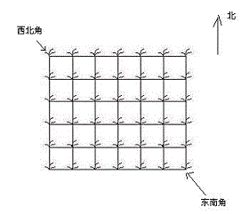

**输入格å¼**

>   第一行是一个整数 `T`，代表一共有多少组数æ®ã€‚
>
>   æ¥ä¸‹æ¥æ˜¯ `T` 组数æ®ã€‚
>
>   æ¯ç»„æ•°æ®çš„第一行是两个整数，分别代表花生苗的行数 `R` 和列数 `C`。
>
>   æ¯ç»„æ•°æ®çš„æ¥ä¸‹æ¥ `R` 行数æ®ï¼Œä»åŒ—å‘å—ä¾æ¬¡æè¿°æ¯è¡ŒèŠ±ç”Ÿè‹—的情况。æ¯è¡Œæ•°æ®æœ‰ `C` 个整数，按ä»è¥¿å‘东的顺åºæ述了该行æ¯æ ªèŠ±ç”Ÿè‹—上的花生数目 `M`。

**输出格å¼**

>   对æ¯ç»„输入数æ®ï¼Œè¾“出一行，内容为 `Hello Kitty` 能摘到得最多的花生颗数。

**æ•°æ®èŒƒå›´**

>   +   $1 ≤ T ≤ 100,$
>   +   $1 ≤ R, C ≤ 100,$
>   +   $0 ≤ M ≤ 1000$

**输入样例**

```c++
2
2 2
1 1
3 4
2 3
2 3 4
1 6 5
```

**输出样例**

```c++
8
16
```

**手写稿**


**代ç **

```c++
#include <iostream>
#include <cstring>
using namespace std;
const int N = 110;
int n, m, T;
int g[N][N], f[N][N];
int main() {
    scanf("%d", &T);
    while (T -- ) {
        memset(g, 0, sizeof g);
        memset(f, 0, sizeof f);
        scanf("%d%d", &n, &m);
        for (int i = 1; i <= n; i ++ )
            for (int j = 1; j <= m; j ++ )
                scanf("%d", &g[i][j]);
        // DP
        for (int i = 1; i <= n; i ++ )
            for (int j = 1; j <= m; j ++ )
                f[i][j] = max(f[i - 1][j], f[i][j - 1]) + g[i][j];
        cout << f[n][m] << endl;
    }
    return 0;
}
```

**时间å¤æ‚度**

$O(nm)$

**空间å¤æ‚度**

$O(nm)$

**标签**

`DP`ã€`动æ€è§„划`

**ç¼åˆæ€ª**


### [AcWing 1018. 最ä½é€šè¡Œè´¹](https://www.acwing.com/problem/content/1020/)

**题目æè¿°**

>   一个商人穿过一个 `N × N` 的正方形的网格，å»å‚加一个é常é‡è¦çš„商务活动。
>
>   ä»–è¦ä»ç½‘格的左上角进，å³ä¸‹è§’出。
>
>   æ¯ç©¿è¶Šä¸­é—´ `1` 个å°æ–¹æ ¼ï¼Œéƒ½è¦èŠ±è´¹ `1` 个å•ä½æ—¶é—´ã€‚
>
>   商人必须在 `(2N − 1)` 个å•ä½æ—¶é—´ç©¿è¶Šå‡ºå»ã€‚
>
>   而在ç»è¿‡ä¸­é—´çš„æ¯ä¸ªå°æ–¹æ ¼æ—¶ï¼Œéƒ½éœ€è¦ç¼´çº³ä¸€å®šçš„费用。
>
>   这个商人期望在规定时间内用最少费用穿越出å»ã€‚
>
>   请问至少需è¦å¤šå°‘费用？
>
>   注æ„：ä¸èƒ½å¯¹è§’穿越å„个å°æ–¹æ ¼ï¼ˆå³ï¼Œåªèƒ½å‘上下左å³å››ä¸ªæ–¹å‘移动且ä¸èƒ½ç¦»å¼€ç½‘格）。

**输入格å¼**

>   第一行是一个整数，表示正方形的宽度 `N`。
>
>   åé¢ `N` 行，æ¯è¡Œ `N` 个ä¸å¤§äº `100` 的正整数，为网格上æ¯ä¸ªå°æ–¹æ ¼çš„费用。

**输出格å¼**

>   输出一个整数，表示至少需è¦çš„费用。

**æ•°æ®èŒƒå›´**

>   +   $1 ≤ N ≤ 100$

**输入样例**

```c++
5
1  4  6  8  10
2  5  7  15 17
6  8  9  18 20
10 11 12 19 21
20 23 25 29 33
```

**输出样例**

```c++
109
```

**样例解释**

>   样例中，最å°å€¼ä¸º `109=1+2+5+7+9+12+19+21+33`。

**手写稿**


**代ç **


**时间å¤æ‚度**


**空间å¤æ‚度**


**标签**


**ç¼åˆæ€ª**


### [AcWing 1027. 方格å–æ•°](https://www.acwing.com/problem/content/1029/)

**题目æè¿°**

>   设有 `N×N` 的方格图，我们在其中的æŸäº›æ–¹æ ¼ä¸­å¡«å…¥æ­£æ•´æ•°ï¼Œè€Œå…¶å®ƒçš„方格中则放入数字`0`。如下图所示：
>
>   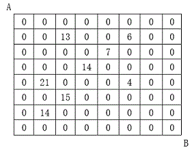
>
>   æŸäººä»å›¾ä¸­çš„左上角 `A` 出å‘，å¯ä»¥å‘下行走，也å¯ä»¥å‘å³è¡Œèµ°ï¼Œç›´åˆ°åˆ°è¾¾å³ä¸‹è§’çš„ `B` 点。
>
>   在走过的路上，他å¯ä»¥å–走方格中的数（å–èµ°å的方格中将å˜ä¸ºæ•°å­—`0`）。
>
>   æ­¤äººä» `A` 点到 `B` 点共走了两次，试找出两æ¡è¿™æ ·çš„路径，使得å–得的数字和为最大。

**输入格å¼**

>   第一行为一个整数`N`，表示 `N×N` 的方格图。
>
>   æ¥ä¸‹æ¥çš„æ¯è¡Œæœ‰ä¸‰ä¸ªæ•´æ•°ï¼Œç¬¬ä¸€ä¸ªä¸ºè¡Œå·æ•°ï¼Œç¬¬äºŒä¸ªä¸ºåˆ—å·æ•°ï¼Œç¬¬ä¸‰ä¸ªä¸ºåœ¨è¯¥è¡Œã€è¯¥åˆ—上所放的数。
>
>   行和列编å·ä» `1` 开始。
>
>   一行“`0 0 0`â€è¡¨ç¤ºç»“æŸã€‚

**输出格å¼**

>   输出一个整数，表示两æ¡è·¯å¾„上å–得的最大的和。

**æ•°æ®èŒƒå›´**

>   +   $N ≤ 10$

**输入样例**

```c++
8
2 3 13
2 6 6
3 5 7
4 4 14
5 2 21
5 6 4
6 3 15
7 2 14
0 0 0
```

**输出样例**

```c++
67
```

**手写稿**


**代ç **


**时间å¤æ‚度**


**空间å¤æ‚度**


**标签**


**ç¼åˆæ€ª**


### [AcWing 275. 传纸æ¡](https://www.acwing.com/problem/content/277/)

**题目æè¿°**

>   å°æ¸Šå’Œå°è½©æ˜¯å¥½æœ‹å‹ä¹Ÿæ˜¯åŒç­åŒå­¦ï¼Œä»–们在一起总有谈ä¸å®Œçš„è¯é¢˜ã€‚
>
>   一次素质拓展活动中，ç­ä¸ŠåŒå­¦å®‰æ’åæˆä¸€ä¸ª `m` è¡Œ `n` 列的矩阵，而å°æ¸Šå’Œå°è½©è¢«å®‰æ’在矩阵对角线的两端，因此，他们就无法直æ¥äº¤è°ˆäº†ã€‚
>
>   幸è¿çš„是，他们å¯ä»¥é€šè¿‡ä¼ çº¸æ¡æ¥è¿›è¡Œäº¤æµã€‚
>
>   纸æ¡è¦ç»ç”±è®¸å¤šåŒå­¦ä¼ åˆ°å¯¹æ–¹æ‰‹é‡Œï¼Œå°æ¸Šå在矩阵的左上角，åæ ‡ `(1,1)`，å°è½©å在矩阵的å³ä¸‹è§’，åæ ‡ `(m,n)`。
>
>   ä»å°æ¸Šä¼ åˆ°å°è½©çš„纸æ¡åªå¯ä»¥å‘下或者å‘å³ä¼ é€’，ä»å°è½©ä¼ ç»™å°æ¸Šçš„纸æ¡åªå¯ä»¥å‘上或者å‘左传递。 
>
>   在活动进行中，å°æ¸Šå¸Œæœ›ç»™å°è½©ä¼ é€’一张纸æ¡ï¼ŒåŒæ—¶å¸Œæœ›å°è½©ç»™ä»–å›å¤ã€‚
>
>   ç­é‡Œæ¯ä¸ªåŒå­¦éƒ½å¯ä»¥å¸®ä»–们传递，但åªä¼šå¸®ä»–们一次，也就是说如æœæ­¤äººåœ¨å°æ¸Šé€’ç»™å°è½©çº¸æ¡çš„时候帮忙，那么在å°è½©é€’ç»™å°æ¸Šçš„时候就ä¸ä¼šå†å¸®å¿™ï¼Œå之亦然。 
>
>   还有一件事情需è¦æ³¨æ„，全ç­æ¯ä¸ªåŒå­¦æ„¿æ„帮忙的好感度有高有ä½ï¼ˆæ³¨æ„：å°æ¸Šå’Œå°è½©çš„好心程度没有定义，输入时用 `0` 表示），å¯ä»¥ç”¨ä¸€ä¸ª `0∼100` 的自然数æ¥è¡¨ç¤ºï¼Œæ•°è¶Šå¤§è¡¨ç¤ºè¶Šå¥½å¿ƒã€‚
>
>   å°æ¸Šå’Œå°è½©å¸Œæœ›å°½å¯èƒ½æ‰¾å¥½å¿ƒç¨‹åº¦é«˜çš„åŒå­¦æ¥å¸®å¿™ä¼ çº¸æ¡ï¼Œå³æ‰¾åˆ°æ¥å›ä¸¤æ¡ä¼ é€’路径，使得这两æ¡è·¯å¾„上åŒå­¦çš„好心程度之和最大。
>
>   ç°åœ¨ï¼Œè¯·ä½ å¸®åŠ©å°æ¸Šå’Œå°è½©æ‰¾åˆ°è¿™æ ·çš„两æ¡è·¯å¾„。

**输入格å¼**

>   第一行有 ``2`` 个用空格隔开的整数 `m` 和 `n`，表示学生矩阵有 `m` 行 `n` 列。
>
>   æ¥ä¸‹æ¥çš„ `m` 行是一个 `m×n` 的矩阵，矩阵中第 `i` è¡Œ `j` 列的整数表示å在第 `i` è¡Œ `j` 列的学生的好心程度，æ¯è¡Œçš„ `n` 个整数之间用空格隔开。

**输出格å¼**

>   输出一个整数，表示æ¥å›ä¸¤æ¡è·¯ä¸Šå‚ä¸ä¼ é€’纸æ¡çš„学生的好心程度之和的最大值。

**æ•°æ®èŒƒå›´**

>   +   $1≤n,m≤50$

**输入样例**

```c++
3 3
0 3 9
2 8 5
5 7 0
```

**输出样例**

```c++
34
```

**手写稿**


**代ç **


**时间å¤æ‚度**


**空间å¤æ‚度**


**标签**


**ç¼åˆæ€ª**


## 线性 `DP`

### [AcWing 897. 最长公共å­åºåˆ—](https://www.acwing.com/problem/content/899/)

**题目æè¿°**

>   给定两个长度分别为 `N` å’Œ `M` 的字符串 `A` å’Œ `B`，求既是 `A` çš„å­åºåˆ—åˆæ˜¯ `B` çš„å­åºåˆ—的字符串长度最长是多少。

**输入格å¼**

>   第一行包å«ä¸¤ä¸ªæ•´æ•° `N` å’Œ `M`。
>
>   第二行包å«ä¸€ä¸ªé•¿åº¦ä¸º `N` 的字符串，表示字符串 `A`。
>
>   第三行包å«ä¸€ä¸ªé•¿åº¦ä¸º `M` 的字符串，表示字符串 `B`。
>
>   字符串å‡ç”±å°å†™å­—æ¯æ„æˆã€‚

**输出格å¼**

>   输出一个整数，表示最大长度。

**æ•°æ®èŒƒå›´**

>   +   $1 ≤ N, M ≤ 1000$

**输入样例**

```c++
4 5
acbd
abedc
```

**输出样例**

```c++
3
```

**手写稿**


**代ç **

```c++
#include <iostream>
using namespace std;
const int N = 1010;
int n, m;
char A[N], B[N];
int f[N][N];
int main() {
    scanf("%d%d%s%s", &n, &m, A + 1, B + 1);
    for (int i = 1; i <= n; i ++ )
        for (int j = 1; j <= m; j ++ )
            if (A[i] == B[j])
                f[i][j] = max(f[i][j], f[i - 1][j - 1] + 1);
            else
                f[i][j] = max(f[i][j], max(f[i - 1][j], f[i][j - 1]));
    cout << f[n][m] << endl;
    return 0;
}
```

**时间å¤æ‚度**

$O(nm)$

**空间å¤æ‚度**

$O(nm)$

**标签**

`线性DP`

**ç¼åˆæ€ª**


## æ ‘å½¢`DP`

### 树的直径ç»å…¸æ±‚法

**å‰ææ¡ä»¶**


**定ç†**

> ä»»æ„寻找树中的æŸä¸€ç‚¹ï¼Œå¯»æ‰¾æ ‘中è·ç¦»å½“å‰èŠ‚点最远的点 `u`，å†å¯»æ‰¾è·ç¦» `u` 最远的点 `v`，则树的直径å³ä¸º `u` 到 `v` ç»è¿‡çš„节点数目

**è¯æ˜**


### [AcWing 1072. 树的最长路径](https://www.acwing.com/problem/content/1074/)

**题目æè¿°**

> ç»™å®šä¸€æ£µæ ‘ï¼Œæ ‘ä¸­åŒ…å« `n` 个结点（编å·`1~n`）和 `n−1` æ¡æ— å‘边，æ¯æ¡è¾¹éƒ½æœ‰ä¸€ä¸ªæƒå€¼ã€‚
>
> ç°åœ¨è¯·ä½ æ‰¾åˆ°æ ‘中的一æ¡æœ€é•¿è·¯å¾„。
>
> æ¢å¥è¯è¯´ï¼Œè¦æ‰¾åˆ°ä¸€æ¡è·¯å¾„，使得使得路径两端的点的è·ç¦»æœ€è¿œã€‚
>
> 注æ„：路径中å¯ä»¥åªåŒ…å«ä¸€ä¸ªç‚¹ã€‚

**输入格å¼**

> 第一行包å«æ•´æ•° `n`。
>
> æ¥ä¸‹æ¥ `n−1` 行，æ¯è¡ŒåŒ…å«ä¸‰ä¸ªæ•´æ•° $a_i,b_i,c_i$，表示点 $a_i$ å’Œ $b_i$ 之间存在一æ¡æƒå€¼ä¸º $c_i$ 的边。

**输出格å¼**

> 输出一个整数，表示树的最长路径的长度。

**æ•°æ®èŒƒå›´**

> + $1≤n≤10000,$
> + $1≤a_i,b_i≤n,$
> + $−10^5≤c_i≤10^5$

**输入样例**

```c++
6
5 1 6
1 4 5
6 3 9
2 6 8
6 1 7
```

**输出样例**

```c++
22
```

**手写稿**


**代ç **

```c++
#include <iostream>
#include <cstring>
using namespace std;
const int N = 10010, M = N << 1;
int n, idx, ans;
int h[N], e[M], w[M], ne[M];
void add(int a, int b, int c) {
    e[idx] = b;
    w[idx] = c;
    ne[idx] = h[a];
    h[a] = idx ++ ;
    return;
}
// è¿”å›ä»¥u为根结点的最大æƒå€¼å’Œ
int dfs(int u, int father) {
    // d1表示最大值，d2表示次大值
    int d1 = 0, d2 = 0;
    // 以u为根结点的å­æ ‘的最大æƒå€¼å’Œ
    int dist = 0;
    for (int i = h[u]; i != -1; i = ne[i]) {
        int j = e[i];
        if (j == father) continue; // åŸå› åœ¨é¢˜è§£ä¸­å·²ç»è§£é‡Š
        int d = dfs(j, u) + w[i];
        dist = max(dist, d);
        if (d >= d1) d2 = d1, d1 = d;
        else if (d >= d2) d2 = d;
    }
    ans = max(ans, d1 + d2);
    return dist;
}
int main() {
    scanf("%d", &n);
    memset(h, -1, sizeof h);
    for (int i = 0; i < n - 1; i ++ ) {
        int a, b, c;
        scanf("%d%d%d", &a, &b, &c);
        add(a, b, c);
        add(b, a, c);
    }
    dfs(1, -1);
    cout << ans << endl;
    return 0;
}
```

**标签**

`æ ‘å½¢DP`

### [AcWing 846. æ ‘çš„é‡å¿ƒ](https://www.acwing.com/problem/content/description/848/)

**题目æè¿°**

> ç»™å®šä¸€é¢—æ ‘ï¼Œæ ‘ä¸­åŒ…å« `n` ä¸ªç»“ç‚¹ï¼ˆç¼–å· `1∼n`）和 `n−1` æ¡æ— å‘边。
>
> 请你找到树的é‡å¿ƒï¼Œå¹¶è¾“出将é‡å¿ƒåˆ é™¤å，剩余å„个è¿é€šå—中点数的最大值。
>
> é‡å¿ƒå®šä¹‰ï¼šé‡å¿ƒæ˜¯æŒ‡æ ‘中的一个结点，如æœå°†è¿™ä¸ªç‚¹åˆ é™¤å，剩余å„个è¿é€šå—中点数的最大值最å°ï¼Œé‚£ä¹ˆè¿™ä¸ªèŠ‚点被称为树的é‡å¿ƒã€‚

**输入格å¼**

> 第一行包å«æ•´æ•° `n`，表示树的结点数。
>
> æ¥ä¸‹æ¥ `n−1` 行，æ¯è¡ŒåŒ…å«ä¸¤ä¸ªæ•´æ•° `a` å’Œ `b`，表示点 `a` 和点 `b` 之间存在一æ¡è¾¹ã€‚

**输出格å¼**

> 输出一个整数 `m`，表示将é‡å¿ƒåˆ é™¤å，剩余å„个è¿é€šå—中点数的最大值。

**æ•°æ®èŒƒå›´**

> + $1≤n≤10^5$

**输入样例**

```c++
9
1 2
1 7
1 4
2 8
2 5
4 3
3 9
4 6
```

**输出样例**

```c++
4
```

**手写稿**


**注æ„事项**

> 1. 为啥 `dfs(int u, int father)` è¦å®šä¹‰ä¸€ä¸ª `father` å˜é‡ï¼Œä»¥é˜²æ­¢ `圈2` æ“作，ä»è€Œå¯¼è‡´æ— é™å¾ªç¯
>
>     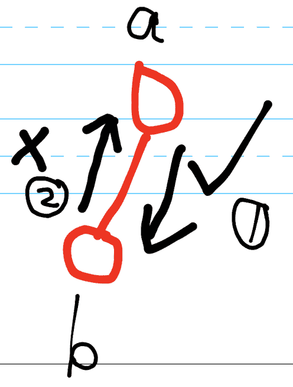

**代ç **

```c++
#include <iostream>
#include <cstring>
using namespace std;
const int N = 100010, M = N << 1;
int n, idx, ans = 1e9;
int h[N], e[M], ne[M];
void add(int a, int b) {
    e[idx] = b;
    ne[idx] = h[a];
    h[a] = idx ++;
    return;
}
int dfs(int u, int father) { // 以u为根节点的树中的节点个数
    int res = 0; // 以u为根结点的树中的节点个数的最大值
    int num = 1; // å„个å­æ ‘的节点的个数，至少包å«å½“å‰çš„节点，故åˆå§‹å€¼ä¸º1
    for (int i = h[u]; i != -1; i = ne[i]) {
        int j = e[i];
        // 如æœå½“å‰éå†çš„点是其父亲节点，则返å›ï¼Œé˜²æ­¢äº§ç”Ÿæ­»å¾ªç¯ï¼ŒåŸå› å·²è§£é‡Š
        if (j == father) continue;
        int d = dfs(j, u);
        num += d;
        res = max(res, d);
    }
    ans = min(ans, max(res, n - num));
    return num;
}
int main() {
    scanf("%d", &n);
    memset(h, -1, sizeof h);
    for (int i = 0; i < n - 1; i ++ ) {
        int a, b;
        scanf("%d%d", &a, &b);
        // æ— å‘图
        add(a, b);
        add(b, a);
    }
    dfs(1, -1);
    cout << ans << endl;
    return 0;
}
```

**标签**

`动æ€è§„划`ã€`æ ‘å½¢DP`ã€`深度优先æœç´¢`

### [AcWing 1073. 树的中心](https://www.acwing.com/problem/content/1075/)

**题目æè¿°**

> ç»™å®šä¸€æ£µæ ‘ï¼Œæ ‘ä¸­åŒ…å« `n` 个结点（编å·`1~n`）和 `n−1` æ¡æ— å‘边，æ¯æ¡è¾¹éƒ½æœ‰ä¸€ä¸ªæƒå€¼ã€‚
>
> 请你在树中找到一个点，使得该点到树中其他结点的最远è·ç¦»æœ€è¿‘。

**输入格å¼**

> 第一行包å«æ•´æ•° `n`。
>
> æ¥ä¸‹æ¥ `n−1` 行，æ¯è¡ŒåŒ…å«ä¸‰ä¸ªæ•´æ•° $a_i,b_i,c_i$，表示点 $a_i$ å’Œ $b_i$ 之间存在一æ¡æƒå€¼ä¸º $c_i$ 的边。

**输出格å¼**

> 输出一个整数，表示所求点到树中其他结点的最远è·ç¦»ã€‚

**æ•°æ®èŒƒå›´**

> + $1≤n≤10000,$
> + $1≤a_i,b_i≤n,$
> + $1≤c_i≤10^5$

**输入样例**

```c++
5 
2 1 1 
3 2 1 
4 3 1 
5 1 1
```

**输出样例**

```c++
2
```

**手写稿**

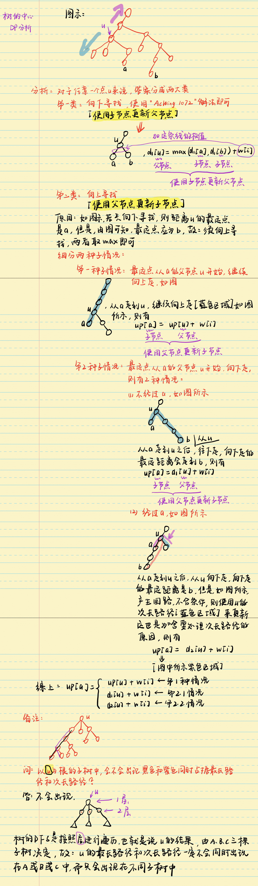

**代ç **

```c++
#include <iostream>
#include <cstring>
using namespace std;
const int N = 10010, M = N << 1, INF = 0x3f3f3f3f;
int n, idx;
// d1[u]和d2[u]分别表示根为u的最长路径和次长路径
// up[u]表示å‘u的上方æœç´¢çš„最长路径
// p1[u]表示u的最大值æ¥è‡ªäºçˆ¶èŠ‚点还是å­èŠ‚点
int h[N], e[M], w[M], ne[M], d1[N], d2[N], up[N], p1[N];
void add(int a, int b, int c) {
    e[idx] = b;
    w[idx] = c;
    ne[idx] = h[a];
    h[a] = idx ++;
    return;
}
// å‘下æœç´¢
int dfs_d(int u, int father) { // dfs_dè¿”å›èŠ‚点u的所有ã€å­æ ‘】的最大路径和
    // åˆå§‹åŒ–节点的最大路径和次大路径为负无穷
    d1[u] = d2[u] = -INF;
    for (int i = h[u]; i != -1; i = ne[i]) {
        int j = e[i];
        // 如æœå½“å‰èŠ‚点j是u的父亲，则返å›ï¼ŒåŸå› åœ¨æ¥¼ä¸Šçš„一é“题里é¢å·²ç»æ述过
        if (j == father) continue;
        // 记得加上当å‰æƒå€¼w[i]
        int d = dfs_d(j, u) + w[i];
        // 更新最大值和次大值，åŒæ—¶è¦è®°å¾—æ›´æ–°u的最大值æ¥è‡ªçš„路径，åªéœ€è¦è®°æœ€å¤§å€¼å³å¯
        if (d >= d1[u]) d2[u] = d1[u], d1[u] = d, p1[u] = j;
        else if (d >= d2[u]) d2[u] = d;
    }
    // 如æœd1å’Œd2没有被更新，则说æ˜æ˜¯å¶èŠ‚点，则将其最大值和次大值都åˆå§‹åŒ–为0å³å¯
    if (d1[u] == -INF) d1[u] = d2[u] = 0;
    // è¿”å›èŠ‚点u最大值
    return d1[u];
}
// å‘上æœç´¢
void dfs_u(int u, int father) {
    for (int i = h[u]; i != -1; i = ne[i]) {
        int j = e[i];
        if (j == father) continue;
        // 注æ„是up[j]å’Œup[u]çš„ä½ç½®
        // 注æ„w[i]是加在max的外é¢çš„
        if (p1[u] == j) up[j] = max(up[u], d2[u]) + w[i];
        else up[j] = max(up[u], d1[u]) + w[i];
        dfs_u(j, u);
    }
    return;
}
int main() {
    scanf("%d", &n);
    memset(h, -1, sizeof h);
    for (int i = 0; i < n - 1; i ++ ) {
        int a, b, c;
        scanf("%d%d%d", &a, &b, &c);
        add(a, b, c);
        add(b, a, c);
    }
    // æ ‘çš„å‘下寻找ã€ç”¨å­èŠ‚点更新父节点】
    dfs_d(1, -1);
    // æ ‘çš„å‘上寻找ã€ç”¨çˆ¶èŠ‚点更新å­èŠ‚点】
    dfs_u(1, -1);
    int res = INF;
    for (int i = 1; i <= n; i ++ ) res = min(res, max(d1[i], up[i]));
    cout << res << endl;
    return 0;
}
```

**标签**

`æ ‘å½¢DP`ã€`æ¢æ ¹DP`

### [AcWing 1075. 数字转æ¢](https://www.acwing.com/problem/content/1077/)

**题目æè¿°**

> 如æœä¸€ä¸ªæ•° `x` 的约数之和 `y`（ä¸åŒ…括他本身）比他本身å°ï¼Œé‚£ä¹ˆ `x` å¯ä»¥å˜æˆ `y`，`y` 也å¯ä»¥å˜æˆ `x`。
>
> 例如，`4` å¯ä»¥å˜ä¸º `3`，`1` å¯ä»¥å˜ä¸º `7`。
>
> é™å®šæ‰€æœ‰æ•°å­—å˜æ¢åœ¨ä¸è¶…过 `n` 的正整数范围内进行，求ä¸æ–­è¿›è¡Œæ•°å­—å˜æ¢ä¸”ä¸å‡ºç°é‡å¤æ•°å­—的最多å˜æ¢æ­¥æ•°ã€‚

**输入格å¼**

> 输入一个正整数 `n`。

**输出格å¼**

> 输出ä¸æ–­è¿›è¡Œæ•°å­—å˜æ¢ä¸”ä¸å‡ºç°é‡å¤æ•°å­—的最多å˜æ¢æ­¥æ•°ã€‚

**æ•°æ®èŒƒå›´**

> + $1≤n≤50000$

**输入样例**

```c++
7
```

**输出样例**

```c++
3
```

**样例解释**

> 一ç§æ–¹æ¡ˆä¸ºï¼š`4→3→1→74→3→1→7`。

**手写稿**


**代ç **

```c++
#include <iostream>
#include <cstring>
using namespace std;
const int N = 50010;
int n, idx, ans;
int h[N], e[N], ne[N], st[N], sum[N];
void add(int a, int b) {
    e[idx] = b;
    ne[idx] = h[a];
    h[a] = idx ++;
    return;
}
int dfs(int u) {
    int d1 = 0, d2 = 0;
    for (int i = h[u]; i != -1; i = ne[i]) {
        int j = e[i];
        int d = dfs(j) + 1;
        if (d >= d1) d2 = d1, d1 = d;
        else if (d >= d2) d2 = d;
    }
    ans = max(ans, d1 + d2);
    return d1;
}
int main() {
    scanf("%d", &n);
    memset(h, -1, sizeof h);
    for (int i = 1; i <= n; i ++ )
        // 使用iå»æ›´æ–°i*j，其中i就是约数
        for (int j = 2; j <= n / i; j ++ )
            sum[i * j] += i;
    for (int i = 2; i <= n; i ++ )
        // 如æœi的约数之和sum[i]符åˆè¦æ±‚
        if (i > sum[i]) {
            // 注æ„边的顺åºï¼Œè¦æ±‚sum[i] -> i，因此，因为add(sum[i], i)而ä¸æ˜¯add(i, add[i])
            add(sum[i], i);
            // 因为å¯èƒ½ä¼šæœ‰å¤šæ£µæ ‘，因此，需è¦è®°å½•ä¸‹æ ‘的哪些节点被访问过
            st[i] = true;
        }
    for (int i = 1; i <= n; i ++ )
        // 如æœå½“å‰èŠ‚点没有被访问过，则访问，å³è®¿é—®æ£®æ—中的下一棵树
        if (!st[i]) dfs(i);
    cout << ans << endl;
    return 0;
}
```

**标签**

`æ ‘å½¢DP`ã€`深度优先æœç´¢`

### [AcWing 285. 没有上å¸çš„èˆä¼š](https://www.acwing.com/problem/content/287/)

**题目æè¿°**

> `Ural` 大学有 `N` åèŒå‘˜ï¼Œç¼–å·ä¸º `1∼N`。
>
> 他们的关系就åƒä¸€æ£µä»¥æ ¡é•¿ä¸ºæ ¹çš„树，父节点就是å­èŠ‚点的直æ¥ä¸Šå¸ã€‚
>
> æ¯ä¸ªèŒå‘˜æœ‰ä¸€ä¸ªå¿«ä¹æŒ‡æ•°ï¼Œç”¨æ•´æ•° $H_i$ 给出，其中 $1≤i≤N$。
>
> ç°åœ¨è¦å¬å¼€ä¸€åœºå‘¨å¹´åº†å®´ä¼šï¼Œä¸è¿‡ï¼Œæ²¡æœ‰èŒå‘˜æ„¿æ„和直æ¥ä¸Šå¸ä¸€èµ·å‚会。
>
> 在满足这个æ¡ä»¶çš„å‰æ下，主åŠæ–¹å¸Œæœ›é‚€è¯·ä¸€éƒ¨åˆ†èŒå‘˜å‚会，使得所有å‚会èŒå‘˜çš„å¿«ä¹æŒ‡æ•°æ€»å’Œæœ€å¤§ï¼Œæ±‚这个最大值。

**输入格å¼**

> 第一行一个整数 `N`。
>
> æ¥ä¸‹æ¥ `N` 行，第 `i` 行表示 `i` å·èŒå‘˜çš„å¿«ä¹æŒ‡æ•° $H_i$。
>
> æ¥ä¸‹æ¥ `N−1` 行，æ¯è¡Œè¾“入一对整数 `L,K`，表示 `K` 是 `L` çš„ç›´æ¥ä¸Šå¸ã€‚

**输出格å¼**

> 输出最大的快ä¹æŒ‡æ•°ã€‚

**æ•°æ®èŒƒå›´**

> + $1≤N≤6000$,
> + $−128≤Hi≤127$

**输入样例**

```c++
7
1
1
1
1
1
1
1
1 3
2 3
6 4
7 4
4 5
3 5
```

**输出样例**

```c++
5
```

**手写稿**


**代ç **

```c++
#include <iostream>
#include <cstring>
using namespace std;
const int N = 6010;
int n, idx;
int happy[N], h[N], e[N], ne[N], is_root[N];
int f[N][2];
void add(int a, int b) {
    e[idx] = b;
    ne[idx] = h[a];
    h[a] = idx ++;
    return;
}
void dfs(int u) {
    // 如æœç¡®å®šé€‰æ‹©å½“å‰èŠ‚点，则先将当å‰èŠ‚点的快ä¹å€¼â•
    f[u][1] = happy[u];
    for (int i = h[u]; i != -1; i = ne[i]) {
        int j = e[i];
        // 先递归å­æ ‘
        dfs(j);
        // 如æœä¸é€‰æ‹©æ ¹èŠ‚点，则å­æ ‘æ—¢å¯ä»¥é€‰æ‹©ï¼Œä¹Ÿå¯ä»¥ä¸é€‰æ‹©
        f[u][0] += max(f[j][0], f[j][1]);
        // 如æœé€‰æ‹©æ ¹èŠ‚点，则å­æ ‘åªèƒ½ä¸é€‰æ‹©
        f[u][1] += f[j][0];
    }
    return;
}
int main() {
    scanf("%d", &n);
    memset(h, -1, sizeof h);
    memset(is_root, true, sizeof is_root);
    for (int i = 1; i <= n; i ++ ) scanf("%d", &happy[i]);
    for (int i = 1; i <= n - 1; i ++ ) {
        int u, v;
        scanf("%d%d", &u, &v);
        add(v, u);
        is_root[u] = false;
    }
    // 寻找根节点
    int root = 0;
    for (int i = 1; i <= n; i ++ )
        if (is_root[i]) {
            root = i;
            break;
        }
    dfs(root);
    cout << max(f[root][0], f[root][1]) << endl;
    return 0;
}
```

**标签**

`动æ€è§„划`ã€`æ ‘å½¢DP`

### [LeetCode 337. æ‰“å®¶åŠ«èˆ III](https://leetcode-cn.com/problems/house-robber-iii/)

**题目æè¿°**

>   å°å·åˆå‘ç°äº†ä¸€ä¸ªæ–°çš„å¯è¡Œçªƒçš„地区。这个地区åªæœ‰ä¸€ä¸ªå…¥å£ï¼Œæˆ‘们称之为 `root` 。
>
>   除了 `root` 之外，æ¯æ ‹æˆ¿å­æœ‰ä¸”åªæœ‰ä¸€ä¸ªâ€œçˆ¶â€œæˆ¿å­ä¸ä¹‹ç›¸è¿ã€‚一番侦察之å，èªæ˜çš„å°å·æ„识到“这个地方的所有房屋的æ’列类似äºä¸€æ£µäºŒå‰æ ‘â€ã€‚ å¦‚æœ ä¸¤ä¸ªç›´æ¥ç›¸è¿çš„房å­åœ¨åŒä¸€å¤©æ™šä¸Šè¢«æ‰“劫 ，房屋将自动报警。
>
>   给定二å‰æ ‘çš„ `root` ã€‚è¿”å› åœ¨ä¸è§¦åŠ¨è­¦æŠ¥çš„情况下 ，å°å·èƒ½å¤Ÿç›—å–çš„æœ€é«˜é‡‘é¢ ã€‚

**示例 1**


>   输入: `root = [3,2,3,null,3,null,1]`
>   输出: `7` 
>   解释: å°å·ä¸€æ™šèƒ½å¤Ÿç›—å–çš„æœ€é«˜é‡‘é¢ `3 + 3 + 1 = 7`

**示例 2**


>   输入: `root = [3,4,5,1,3,null,1]`
>   输出: `9`
>   解释: å°å·ä¸€æ™šèƒ½å¤Ÿç›—å–çš„æœ€é«˜é‡‘é¢ `4 + 5 = 9`

**æ示**

>   +   $树的节点数在 [1, 10^4] 范围内$
>   +   $0 <= Node.val <= 10^4$

**手写稿**

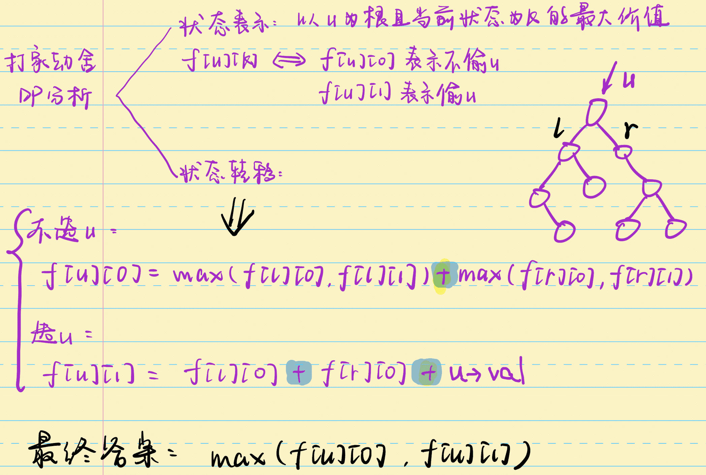

**代ç **

```c++
/**
 * Definition for a binary tree node.
 * struct TreeNode {
 *     int val;
 *     TreeNode *left;
 *     TreeNode *right;
 *     TreeNode() : val(0), left(nullptr), right(nullptr) {}
 *     TreeNode(int x) : val(x), left(nullptr), right(nullptr) {}
 *     TreeNode(int x, TreeNode *left, TreeNode *right) : val(x), left(left), right(right) {}
 * };
 */
class Solution {
public:
    // dfsçš„è¿”å›å€¼{选u, ä¸é€‰u}，å³å¯¹åº”ç€f[u][0]å’Œf[u][1]
    vector<int> dfs(TreeNode* u) {
        if (!u) return {0, 0};
        auto l = dfs(u -> left), r = dfs(u -> right);
        // {ä¸é€‰u, 选u}
        return {max(l[0], l[1]) + max(r[0], r[1]), l[0] + r[0] + u -> val};
    }
    int rob(TreeNode* u) {
        vector<int> f = dfs(u);
        return max(f[0], f[1]);
    }
};
```

**标签**

`æ ‘å½¢DP`

### [AcWing 310. 最å°é«˜åº¦æ ‘](https://leetcode-cn.com/problems/minimum-height-trees/)

**题目æè¿°**

> 树是一个无å‘图，其中任何两个顶点åªé€šè¿‡ä¸€æ¡è·¯å¾„è¿æ¥ã€‚ æ¢å¥è¯è¯´ï¼Œä¸€ä¸ªä»»ä½•æ²¡æœ‰ç®€å•ç¯è·¯çš„è¿é€šå›¾éƒ½æ˜¯ä¸€æ£µæ ‘。
>
> ç»™ä½ ä¸€æ£µåŒ…å« `n` 个节点的树，标记为 `0` 到 `n - 1` 。给定数字 `n` 和一个有 `n - 1` æ¡æ— å‘边的 `edges` 列表（æ¯ä¸€ä¸ªè¾¹éƒ½æ˜¯ä¸€å¯¹æ ‡ç­¾ï¼‰ï¼Œå…¶ä¸­ $edges[i] = [a_i, b_i]$ 表示树中节点 $a_i$ å’Œ $b_i$ 之间存在一æ¡æ— å‘边。
>
> å¯é€‰æ‹©æ ‘中任何一个节点作为根。当选择节点 `x` 作为根节点时，设结æœæ ‘的高度为 `h` 。在所有å¯èƒ½çš„树中，具有最å°é«˜åº¦çš„树（å³ï¼Œ`min(h)`）被称为 最å°é«˜åº¦æ ‘ 。
>
> 请你找到所有的 最å°é«˜åº¦æ ‘ 并按 ä»»æ„é¡ºåº è¿”å›å®ƒä»¬çš„根节点标签列表。
>
> æ ‘çš„ 高度 是指根节点和å¶å­èŠ‚点之间最长å‘下路径上边的数é‡ã€‚

**示例 1**


> 输入：`n = 4, edges = [[1,0],[1,2],[1,3]]`
> 输出：`[1]`
> 解释：如图所示，当根是标签为 `1` 的节点时，树的高度是 `1` ，这是唯一的最å°é«˜åº¦æ ‘。

**示例 2**


> 输入：`n = 6, edges = [[3,0],[3,1],[3,2],[3,4],[5,4]]`
> 输出：`[3,4]`

**æ示**

> + $1 <= n <= 2 * 10^4$
> + $edges.length == n - 1$
> + $0 <= a_i, b_i < n$
> + $a_i != b_i$
> + $所有 (a_i, b_i) 互ä¸ç›¸åŒ$
> + $给定的输入 ä¿è¯ 是一棵树，并且 ä¸ä¼šæœ‰é‡å¤çš„è¾¹$

**解题步骤**

> 1. 对äºæ¯ä¸€ä¸ªç‚¹ `u` æ¥è¯´ï¼Œå°†å…¶å½“作根节点，然å计算以 `u` 为根的树的高度，统计出æ¥æ‰€æœ‰çš„高度以å，循ç¯æ±‚解å³å¯
>
> 2. 计算树的高度，使用树形 `DP` æ¥è®¡ç®—
>
>     

**代ç **

```c++
class Solution {
public:
    vector<vector<int>> g;
    vector<int> d1, d2, up, p;
    // å‘下寻找
    int dfs_d(int u, int father) {
        for (auto& j : g[u]) {
            if (j == father) continue;
            int d = dfs_d(j, u) + 1;
            if (d >= d1[u]) d2[u] = d1[u], d1[u] = d, p[u] = j;
            else if (d >= d2[u]) d2[u] = d;
        }
        return d1[u];
    }
    // å‘上寻找
    void dfs_u(int u, int father) {
        for (auto& j : g[u]) {
            if (j == father) continue;
            if (p[u] == j) up[j] = max(up[u], d2[u]) + 1;
            else up[j] = max(up[u], d1[u]) + 1;
            dfs_u(j, u);
        }
        return;
    }
    vector<int> findMinHeightTrees(int n, vector<vector<int>>& edges) {
        g.resize(n + 5);
        d1 = d2 = p = up = vector<int>(n + 5);
        // 建图
        for (auto& edge : edges) {
            int a = edge[0], b = edge[1];
            g[a].push_back(b);
            g[b].push_back(a);
        }
        // å‘下寻找
        dfs_d(0, -1);
        // å‘上寻找
        dfs_u(0, -1);
        // 找最å°å€¼
        int Min = 1e9;
        for (int i = 0; i < n; i ++ ) Min = min(Min, max(up[i], d1[i]));
        // 找答案
        vector<int> res;
        for (int i = 0; i < n; i ++ ) 
            if (max(up[i], d1[i]) == Min) res.push_back(i);
        return res;
    }
};
```

**标签**

`æ ‘å½¢DP`ã€`树的深度优先æœç´¢`

### [AcWing 1074. 二å‰è‹¹æœæ ‘](https://www.acwing.com/problem/content/1076/)

**题目æè¿°**

>   有一棵二å‰è‹¹æœæ ‘，如æœæ ‘æ有分å‰ï¼Œä¸€å®šæ˜¯åˆ†ä¸¤å‰ï¼Œå³æ²¡æœ‰åªæœ‰ä¸€ä¸ªå„¿å­çš„节点。
>
>   这棵树共 `N` 个节点，编å·ä¸º `1` 至 `N`，树根编å·ä¸€å®šä¸º `1`。
>
>   我们用一根树æ两端è¿æ¥çš„节点编å·æ述一根树æçš„ä½ç½®ã€‚
>
>   一棵苹æœæ ‘çš„æ ‘æ太多了，需è¦å‰ªæ。但是一些树æ上长有苹æœï¼Œç»™å®šéœ€è¦ä¿ç•™çš„æ ‘ææ•°é‡ï¼Œæ±‚最多能留ä½å¤šå°‘苹æœã€‚
>
>   这里的ä¿ç•™æ˜¯æŒ‡æœ€ç»ˆä¸`1`å·ç‚¹è¿é€šã€‚

**输入格å¼**

>   第一行包å«ä¸¤ä¸ªæ•´æ•° `N` å’Œ `Q`，分别表示树的节点数以åŠè¦ä¿ç•™çš„æ ‘ææ•°é‡ã€‚
>
>   æ¥ä¸‹æ¥ `N−1` è¡Œæè¿°æ ‘æä¿¡æ¯ï¼Œæ¯è¡Œä¸‰ä¸ªæ•´æ•°ï¼Œå‰ä¸¤ä¸ªæ˜¯å®ƒè¿æ¥çš„节点的编å·ï¼Œç¬¬ä¸‰ä¸ªæ•°æ˜¯è¿™æ ¹æ ‘æ上苹æœæ•°é‡ã€‚

**输出格å¼**

>   输出仅一行，表示最多能留ä½çš„苹æœçš„æ•°é‡ã€‚

**æ•°æ®èŒƒå›´**

>   +   $1≤Q<N≤100.$
>   +   $N≠1,$
>   +   $æ¯æ ¹æ ‘æ上苹æœä¸è¶…过 30000个。$

**输入样例**

```c++
5 2
1 3 1
1 4 10
2 3 20
3 5 20
```

**输出样例**

```c++
21
```

**手写稿**

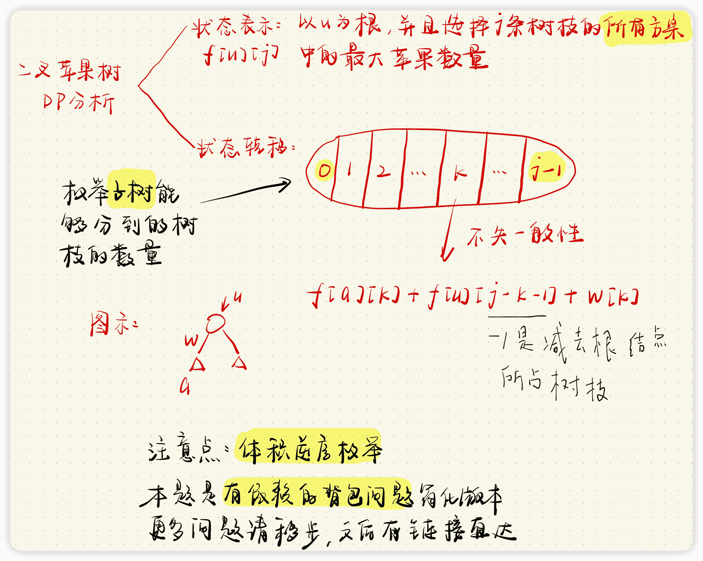

**代ç **

```c++
#include <iostream>
#include <cstring>
using namespace std;
const int N = 110, M = 210;
int n, m, idx;
int h[N], w[M], e[M], ne[M];
int f[N][N];
void add(int a, int b, int c) {
    e[idx] = b;
    w[idx] = c;
    ne[idx] = h[a];
    h[a] = idx ++;
    return;
}
void dfs(int u, int father) {
    for (int i = h[u]; i != -1; i = ne[i]) {
        // 如æœå·²ç»è®¿é—®è¿‡ï¼Œç›´æ¥è¿”å›
        if (e[i] == father) continue;
        dfs(e[i], u);
        // æšä¸¾ã€ä»¥u为根】的å­æ ‘所分得的树æçš„æ•°é‡
        for (int j = m; j >= 0; j -- )
            // æšä¸¾ã€uçš„æ¯æ£µå­æ ‘】所分得的树æçš„æ•°é‡
            for (int k = 0; k < j; k ++ )
                f[u][j] = max(f[u][j], f[e[i]][k] + f[u][j - k - 1] + w[i]);
    }
    return;
}
int main() {
    scanf("%d%d", &n, &m);
    memset(h, -1, sizeof h);
    for (int i = 0; i < n - 1; i ++ ) {
        int a, b, c;
        scanf("%d%d%d", &a, &b, &c);
        add(a, b, c);
        add(b, a, c);
    }
    dfs(1, -1);
    cout << f[1][m] << endl;
    return 0;
}
```

**标签**

`æ ‘å½¢DP`

**ç¼åˆæ€ª**

[AcWing 10. 有ä¾èµ–的背包问题](#AcWing 10. 有ä¾èµ–的背包问题)

### [AcWing 323. 战略游æˆ](https://www.acwing.com/problem/content/325/)

**题目æè¿°**

>   é²å‹ƒå–œæ¬¢ç©ç”µè„‘游æˆï¼Œç‰¹åˆ«æ˜¯æˆ˜ç•¥æ¸¸æˆï¼Œä½†æœ‰æ—¶ä»–找ä¸åˆ°è§£å†³é—®é¢˜çš„方法，这让他很伤心。
>
>   ç°åœ¨ä»–有以下问题。
>
>   ä»–å¿…é¡»ä¿æŠ¤ä¸€åº§ä¸­ä¸–纪åŸå¸‚，这æ¡åŸå¸‚çš„é“è·¯æ„æˆäº†ä¸€æ£µæ ‘。
>
>   æ¯ä¸ªèŠ‚点上的士兵å¯ä»¥è§‚察到所有和这个点相è¿çš„边。
>
>   他必须在节点上放置最少数é‡çš„士兵，以便他们å¯ä»¥è§‚察到所有的边。
>
>   你能帮助他å—？
>
>   例如，下é¢çš„树：
>
>   
>
>   åªéœ€è¦æ”¾ç½® `1` å士兵（在节点 `1` 处），就å¯è§‚察到所有的边。

**输入格å¼**

>   输入包å«å¤šç»„测试数æ®ï¼Œæ¯ç»„测试数æ®ç”¨ä»¥æ述一棵树。
>
>   对äºæ¯ç»„测试数æ®ï¼Œç¬¬ä¸€è¡ŒåŒ…å«æ•´æ•° `N`，表示树的节点数目。
>
>   æ¥ä¸‹æ¥ `N` 行，æ¯è¡ŒæŒ‰å¦‚下方法æ述一个节点。
>
>   节点编å·ï¼š(å­èŠ‚点数目) å­èŠ‚点 å­èŠ‚点 …
>
>   节点编å·ä» `0` 到 `N−1`，æ¯ä¸ªèŠ‚点的å­èŠ‚点数é‡å‡ä¸è¶…过 `10`，æ¯ä¸ªè¾¹åœ¨è¾“入数æ®ä¸­åªå‡ºç°ä¸€æ¬¡ã€‚

**输出格å¼**

>   对äºæ¯ç»„测试数æ®ï¼Œè¾“出一个å æ®ä¸€è¡Œçš„结æœï¼Œè¡¨ç¤ºæœ€å°‘需è¦çš„士兵数。

**æ•°æ®èŒƒå›´**

>   +   $0<N≤1500,$
>   +   $一个测试点所有 N 相加之和ä¸è¶…过 300650。$

**输入样例**

```c++
4
0:(1) 1
1:(2) 2 3
2:(0)
3:(0)
5
3:(3) 1 4 2
1:(1) 0
2:(0)
0:(0)
4:(0)
```

**输出样例**

```c++
1
2
```

**手写稿**


**代ç **

```c++
#include <iostream>
#include <cstring>
using namespace std;
const int N = 1510;
int n, idx;
int h[N], e[N], ne[N], st[N];
int f[N][2];
void add(int a, int b) {
    e[idx] = b;
    ne[idx] = h[a];
    h[a] = idx ++;
    return;
}
void dfs(int u) {
    // 如æœé€‰æ‹©æ ¹èŠ‚点，士兵数é‡ä¸º1
    f[u][1] = 1;
    for (int i = h[u]; i != -1; i = ne[i]) {
        int j = e[i];
        dfs(j);
        // 选择根节点
        f[u][0] += f[j][1];
        // ä¸é€‰æ ¹èŠ‚点
        f[u][1] += min(f[j][0], f[j][1]);
    }
    return;
}
int main() {
    while (scanf("%d", &n) != -1) {
        int id, cnt;
        // 多组输入，故都需è¦è¿›è¡Œåˆå§‹åŒ–
        memset(h, -1, sizeof h);
        memset(f, 0, sizeof f);
        memset(st, 0, sizeof st);
        idx = 0;
        for (int i = 0; i < n; i ++ ) {
            scanf("%d:(%d)", &id, &cnt);
            for (int j = 0, son; j < cnt; j ++ ) {
                scanf("%d", &son);
                st[son] = true;
                add(id, son);
            }
        }
        // 寻找根节点
        int root = 0;
        for (int i = 0; i < n; i ++ )
            if (!st[i]) {
                root = i;
                break;
            }
        dfs(root);
        cout << min(f[root][0], f[root][1]) << endl;
    }
    return 0;
}
```

**时间å¤æ‚度**

$O(n)$

**空间å¤æ‚度**

$O(n)$

**标签**

`æ ‘å½¢DP`ã€`状æ€æœº`

**ç¼åˆæ€ª**

[AcWing 285. 没有上å¸çš„èˆä¼š](#AcWing 285. 没有上å¸çš„èˆä¼š)

### [AcWing 1077. 皇宫看守](https://www.acwing.com/problem/content/description/1079/)

>   太平ç‹ä¸–å­äº‹ä»¶å，陆å°å‡¤æˆäº†çš‡ä¸Šç‰¹è˜çš„御å‰ä¸€å“ä¾å«ã€‚
>
>   皇宫å„个宫殿的分布，呈一棵树的形状，宫殿å¯è§†ä¸ºæ ‘中结点，两个宫殿之间如æœå­˜åœ¨é“路直æ¥ç›¸è¿ï¼Œåˆ™è¯¥é“路视为树中的一æ¡è¾¹ã€‚
>
>   已知，在一个宫殿镇守的守å«ä¸ä»…能够观察到本宫殿的状况，还能观察到ä¸è¯¥å®«æ®¿ç›´æ¥å­˜åœ¨é“路相è¿çš„其他宫殿的状况。
>
>   大内ä¿å«æ£®ä¸¥ï¼Œä¸‰æ­¥ä¸€å²—，五步一哨，æ¯ä¸ªå®«æ®¿éƒ½è¦æœ‰äººå…¨å¤©å€™çœ‹å®ˆï¼Œåœ¨ä¸åŒçš„宫殿安æ’看守所需的费用ä¸åŒã€‚
>
>   å¯æ˜¯é™†å°å‡¤æ‰‹ä¸Šçš„ç»è´¹ä¸è¶³ï¼Œæ— è®ºå¦‚何也没法在æ¯ä¸ªå®«æ®¿éƒ½å®‰ç½®ç•™å®ˆä¾å«ã€‚
>
>   帮助陆å°å‡¤å¸ƒç½®ä¾å«ï¼Œåœ¨çœ‹å®ˆå…¨éƒ¨å®«æ®¿çš„å‰æ下，使得花费的ç»è´¹æœ€å°‘。

**输入格å¼**

>   输入中数æ®æ述一棵树，æ述如下：
>
>   第一行 `n`，表示树中结点的数目。
>
>   第二行至第 `n+1` 行，æ¯è¡Œæè¿°æ¯ä¸ªå®«æ®¿ç»“点信æ¯ï¼Œä¾æ¬¡ä¸ºï¼šè¯¥å®«æ®¿ç»“ç‚¹æ ‡å· `i`，在该宫殿安置ä¾å«æ‰€éœ€çš„ç»è´¹ `k`，该结点的å­ç»“点数 `m`，æ¥ä¸‹æ¥ `m` 个数，分别是这个结点的 `m` 个å­ç»“ç‚¹çš„æ ‡å· $r_1,r_2,…,r_m$。
>
>   对äºä¸€ä¸ª `n` 个结点的树，结点标å·åœ¨ `1` 到 `n` 之间，且标å·ä¸é‡å¤ã€‚

**输出格å¼**

>   输出一个整数，表示最少的ç»è´¹ã€‚

**æ•°æ®èŒƒå›´**

>   +   $1≤n≤1500$

**输入样例**

```c++
6
1 30 3 2 3 4
2 16 2 5 6
3 5 0
4 4 0
5 11 0
6 5 0
```

**输出样例**

```c++
25
```

**样例解释**

>   在`2ã€3ã€4`结点安æ’护å«ï¼Œå¯ä»¥è§‚察到全部宫殿，所需ç»è´¹æœ€å°‘，为 `16 + 5 + 4 = 25`。

**手写稿**

>   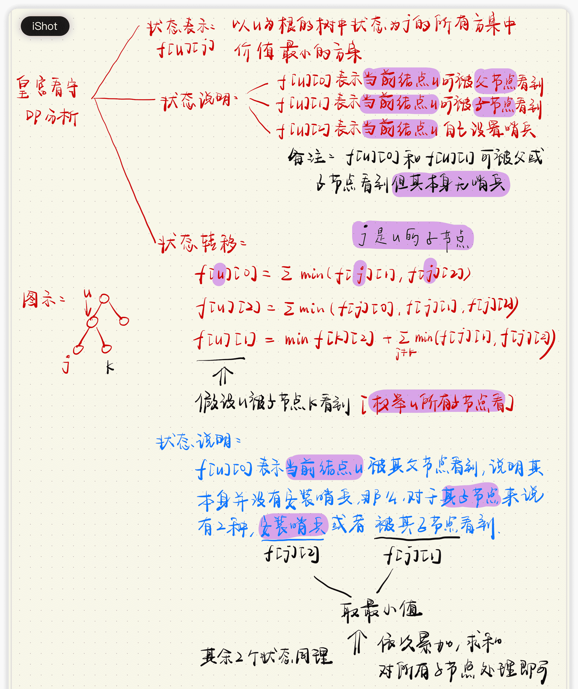
>
>   本题和 `AcWing 323. 战略游æˆ` 的区别在äºï¼š
>
>   +   战略游æˆè¯´çš„是边，对äºè¾¹æ¥è¯´ï¼Œèƒ½ç®¡ä½çš„å°±åªæœ‰ä¸¤å¤´çš„顶点
>   +   本题说的是点，对äºä¸€ä¸ªç‚¹æ¥è¯´ï¼Œèƒ½ç®¡ä½çš„å°±åªæœ‰å…¶æœ¬èº«ï¼Œçˆ¶èŠ‚点和å­èŠ‚点，这就是为啥上一题需è¦ä¸¤ä¸ªçŠ¶æ€å°±å¯ä»¥äº†ï¼Œè€Œæœ¬é¢˜éœ€è¦ä¸‰ä¸ªçŠ¶æ€çš„核心åŸå› æ‰€åœ¨

**代ç **

```c++
#include <iostream>
#include <cstring>
using namespace std;
const int N = 1510;
int n, idx;
int h[N], e[N], w[N], ne[N], st[N];
int f[N][3];
void add(int a, int b) {
    e[idx] = b;
    ne[idx] = h[a];
    h[a] = idx ++;
    return;
}
void dfs(int u) {
    f[u][2] = w[u];
    // 记录min(f[j][1], f[j][2])的总和
    // 便äºè®¡ç®—f[u][1]，具体看手写稿
    int sum = 0;
    for (int i = h[u]; i != -1; i = ne[i]) {
        int j = e[i];
        dfs(j);
        f[u][0] += min(f[j][1], f[j][2]);
        f[u][2] += min(f[j][0], min(f[j][1], f[j][2]));
        sum += min(f[j][1], f[j][2]);
    }
    f[u][1] = 1e9;
    // 循ç¯æŸ¥æ‰¾
    for (int i = h[u]; i != -1; i = ne[i]) {
        int k = e[i];
        // sum - min(f[k][1], f[k][2])就是除了k之外的所有的数总和
        f[u][1] = min(f[u][1], f[k][2] + sum - min(f[k][1], f[k][2]));
    }
    return;
}
int main() {
    scanf("%d", &n);
    memset(h, -1, sizeof h);
    for (int i = 1; i <= n; i ++ ) {
        int id, cost, m;
        scanf("%d%d%d", &id, &cost, &m);
        w[id] = cost;
        for (int j = 1, k; j <= m; j ++ ) {
            scanf("%d", &k);
            add(id, k);
            st[k] = true;
        }
    }
    // 寻找根节点
    int root = 1;
    while (st[root]) root ++;
    dfs(root);
    cout << min(f[root][1], f[root][2]) << endl;
    return 0;
}
```

**时间å¤æ‚度**

$O(n)$

**空间å¤æ‚度**

$O(n)$

**标签**

`状æ€æœº`ã€`æ ‘å½¢DP`

**ç¼åˆæ€ª**


### [PTA L2-038 病毒溯æº](https://pintia.cn/problem-sets/994805046380707840/problems/1386335159927652361)

**题目æè¿°**

>   
>
>   病毒容易å‘生å˜å¼‚。æŸç§ç—…毒å¯ä»¥é€šè¿‡çªå˜äº§ç”Ÿè‹¥å¹²å˜å¼‚的毒株，而这些å˜å¼‚的病毒åˆå¯èƒ½è¢«è¯±å‘çªå˜äº§ç”Ÿç¬¬äºŒä»£å˜å¼‚，如此继续ä¸æ–­å˜åŒ–。
>
>   ç°ç»™å®šä¸€äº›ç—…毒之间的å˜å¼‚关系，è¦æ±‚你找出其中最长的一æ¡å˜å¼‚链。
>
>   在此å‡è®¾ç»™å‡ºçš„å˜å¼‚都是由çªå˜å¼•èµ·çš„，ä¸è€ƒè™‘å¤æ‚的基因é‡ç»„å˜å¼‚问题 —— å³æ¯ä¸€ç§ç—…毒都是由唯一的一ç§ç—…毒çªå˜è€Œæ¥ï¼Œå¹¶ä¸”ä¸å­˜åœ¨å¾ªç¯å˜å¼‚的情况。

**输入格å¼**

>   输入在第一行中给出一个正整数 `N`（$≤ 10^4$），å³ç—…毒ç§ç±»çš„总数。äºæ˜¯æˆ‘ä»¬å°†æ‰€æœ‰ç—…æ¯’ä» `0` 到 `N − 1` 进行编å·ã€‚
>
>   éšå `N` 行，æ¯è¡ŒæŒ‰ä»¥ä¸‹æ ¼å¼æ述一ç§ç—…毒的å˜å¼‚情况：
>
>   ```c++
>   k å˜å¼‚æ ª1 …… å˜å¼‚æ ªk
>   ```
>
>   其中 `k` 是该病毒产生的å˜å¼‚毒株的ç§ç±»æ•°ï¼Œåé¢è·Ÿç€æ¯ç§å˜å¼‚株的编å·ã€‚第 `i` 行对应编å·ä¸º `i` 的病毒（`0 ≤ i < N`）。题目ä¿è¯ç—…毒æºå¤´æœ‰ä¸”仅有一个。

**输出格å¼**

>   首先输出ä»æºå¤´å¼€å§‹æœ€é•¿å˜å¼‚链的长度。
>
>   在第二行中输出ä»æºå¤´å¼€å§‹æœ€é•¿çš„一æ¡å˜å¼‚链，编å·é—´ä»¥ `1` 个空格分隔，行首尾ä¸å¾—有多余空格。如æœæœ€é•¿é“¾ä¸å”¯ä¸€ï¼Œåˆ™è¾“出最å°åºåˆ—。
>
>   注：我们称åºåˆ— ${a_1, ⋯ ,a_n }$ 比åºåˆ— ${b_1, ⋯ ,b_n}$ “å°â€ï¼Œå¦‚æœå­˜åœ¨ `1 ≤ k ≤ n` 满足 $a_i=b_i$ 对所有 `i < k` æˆç«‹ï¼Œä¸” $a_k < b_k$。

**输入样例**

```c++
10
3 6 4 8
0
0
0
2 5 9
0
1 7
1 2
0
2 3 1
```

**输出样例**

```c++
4
0 4 9 1
```

**手写稿**


**代ç **

```c++
#include <iostream>
#include <cstring>
#include <algorithm>
using namespace std;
const int N = 1e4 + 10;
int n, idx, cnt;
int h[N], e[N], ne[N], st[N], f[N], path[N], g[N];
void add(int a, int b) {
    e[idx] = b;
    ne[idx] = h[a];
    h[a] = idx ++;
    return;
}
int dp(int u) {
    // æ¯ä¸ªèŠ‚点高度都为1
    f[u] = 1;
    for (int i = h[u]; i != -1; i = ne[i]) {
        int j = e[i];
        int d = dp(j);
        // å–最大值
        f[u] = max(f[u], d + 1);
    }
    return f[u];
}
void dfs(int u) {
    path[cnt ++ ] = u;
    for (int i = h[u]; i != -1; i = ne[i]) {
        int j = e[i];
        // 找到æ¡ä»¶çš„è¯, éå†ç»“æŸä¹‹å, ç›´æ¥è¿”å›å³å¯
        // åŸå› : 当å‰ä¸€å®šå°±æ˜¯å­—å…¸åºæœ€å°çš„且最长的
        if (f[j] + 1 == f[u]) {
            dfs(j);
            return;
        }
    }
    return;
}
int main() {
    scanf("%d", &n);
    memset(h, -1, sizeof h);
    for (int i = 0; i < n; i ++ ) {
        int k;
        scanf("%d", &k);
        for (int j = 0, x; j < k; j ++ ) scanf("%d", &g[j]);
        // ä»å¤§åˆ°å°è¿›è¡Œæ’åº
        sort(g, g + k, [&](int a, int b) {
            return a > b;
        });
        for (int j = 0; j < k; j ++ ) {
            add(i, g[j]);
            st[g[j]] = true;
        }
    }
    // 寻找根节点
    int rt;
    for (int i = 0; i < n; i ++ )
        if (!st[i]) {
            rt = i;
            break;
        }
    cout << dp(rt) << endl;
    dfs(rt);
    // 注æ„: æ§åˆ¶æ ¼å¼
    for (int i = 0; i < cnt; i ++ ) {
        if (!i) cout << path[i];
        else cout << " " << path[i];
    }
    return 0;
}
```

**时间å¤æ‚度**

$O(nk)$

**空间å¤æ‚度**

$O(n)$

**标签**

`æ ‘å½¢DP`ã€`路径输出`

**ç¼åˆæ€ª**


## 状æ€å‹ç¼© `DP`

### [Acwing 1064. å°å›½ç‹](https://www.acwing.com/problem/content/1066/)

**题目æè¿°**

> 在 `n×n` 的棋盘上放 `k` 个国ç‹ï¼Œå›½ç‹å¯æ”»å‡»ç›¸é‚»çš„ `8` 个格å­ï¼Œæ±‚使它们无法互相攻击的方案总数。

**输入格å¼**

> 共一行，包å«ä¸¤ä¸ªæ•´æ•° `n` å’Œ `k`。

**输出格å¼**

> 共一行，表示方案总数，若ä¸èƒ½å¤Ÿæ”¾ç½®åˆ™è¾“出 `0`。

**æ•°æ®èŒƒå›´**

> $1\;\leq\;n\;\leq\;10$
>
> $0\;\leq\;k\;\leq{n^2}$

**输入样例**

```c++
3 2
```

**输出样例**

```c++
16
```

**手写稿**


**代ç **

```c++
#include <iostream>
#include <vector>
using namespace std;
typedef long long LL;
const int N = 15, M = 110, K = 1 << 10;
int n, m;
int cnt[K];
vector<int> state;
vector<int> convert[K];
LL f[N][M][K];
// 判断是å¦å«æœ‰è¿ç»­çš„ 1
bool check(int u) {
    for (int i = 0; i < n; i ++ )
        if (u >> i & 1 && u >> i + 1 & 1) return false;
    return true;
}
// 统计 1 çš„æ•°é‡
int count(int u) {
    int res = 0;
    for (int i = 0; i < n; i ++ )
        if (u >> i & 1) res ++;
    return res;
}
int main() {
    scanf("%d%d", &n, &m);
    for (int i = 0; i < 1 << n; i ++ )
        if (check(i)) {
            state.push_back(i);
            cnt[i] = count(i);
        }
    for (int i = 0; i < state.size(); i ++ )
        for (int j = 0; j < state.size(); j ++ ) {
            int a = state[i], b = state[j];
            if ((a & b) == 0 && check(a | b)) convert[i].push_back(j);
        }
    f[0][0][0] = 1;
    for (int i = 1; i <= n + 1; i ++ )
        for (int j = 0; j <= m; j ++ )
            for (int a = 0; a < state.size(); a ++ )
                for (auto& b : convert[a])
                    if (j >= cnt[state[a]]) f[i][j][a] += f[i - 1][j - cnt[state[a]]][b];
    cout << f[n + 1][m][0] << endl;
    return 0;
}
```

**标签**

`动æ€è§„划`

### [Acwing 327. ç‰ç±³ç”°](https://www.acwing.com/problem/content/329/)

**题目æè¿°**

> 农夫约翰的土地由 `M×N` 个å°æ–¹æ ¼ç»„æˆï¼Œç°åœ¨ä»–è¦åœ¨åœŸåœ°é‡Œç§æ¤ç‰ç±³ã€‚
>
> é常é—憾，部分土地是ä¸è‚²çš„，无法ç§æ¤ã€‚
>
> 而且，相邻的土地ä¸èƒ½åŒæ—¶ç§æ¤ç‰ç±³ï¼Œä¹Ÿå°±æ˜¯è¯´ç§æ¤ç‰ç±³çš„所有方格之间都ä¸ä¼šæœ‰å…¬å…±è¾¹ç¼˜ã€‚
>
> ç°åœ¨ç»™å®šåœŸåœ°çš„大å°ï¼Œè¯·ä½ æ±‚出共有多少ç§ç§æ¤æ–¹æ³•ã€‚
>
> 土地上什么都ä¸ç§ä¹Ÿç®—一ç§æ–¹æ³•ã€‚

**输入格å¼**

> 第 `1` 行包å«ä¸¤ä¸ªæ•´æ•° `M` å’Œ `N`。
>
> 第 `2..M+1`行：æ¯è¡ŒåŒ…å« `N` 个整数 `0` 或 `1`，用æ¥æ述整个土地的状况，`1` 表示该å—土地肥沃，`0` 表示该å—土地ä¸è‚²ã€‚

**输出格å¼**

> 输出总ç§æ¤æ–¹æ³•å¯¹ $10^8$ å–模å的值。

**æ•°æ®èŒƒå›´**

> $1\;\leq{M},\;N\leq12$

**输入样例**

```c++
2 3
1 1 1
0 1 0
```

**输出样例**

```c++
9
```

**手写稿**


**代ç **

```c++
#include <iostream>
#include <vector>
using namespace std;
const int N = 15, M = 1 << 12, mod = 1e8;
int n, m;
int g[N];
int f[N][M];
vector<int> state;
vector<int> convert[M];
bool check(int u) {
    for (int i = 0; i < m; i ++ )
        if (u >> i & 1 && u >> i + 1 & 1) return false;
    return true;
}
int main() {
    scanf("%d%d", &n, &m);
    for (int i = 1; i <= n; i ++ )
        for (int j = 0, s; j < m; j ++ ) {
            scanf("%d", &s);
            // 通常情况下 1 ä»£è¡¨æœ‰éšœç¢ 0 代表无障ç¢
            g[i] += !s << j;
        }
    for (int i = 0; i < 1 << m; i ++ )
        if (check(i))
            state.push_back(i);
    for (int i = 0; i < state.size(); i ++ )
        for (int j = 0; j < state.size(); j ++ ) {
            int a = state[i], b = state[j];
            if ((a & b) == 0 && check(a))
                convert[i].push_back(j);
        }
    f[0][0] = 1;
    // i 循ç¯åˆ° n + 1 å°æŠ€å·§ ä¸éœ€è¦é¢å¤–在计算
    for (int i = 1; i <= n + 1; i ++ )
        for (int j = 0; j < state.size(); j ++ )
            for (auto& k : convert[j]) {
                // 如æœåŒåˆ—的相邻两行之间都是 1 则放弃本次循ç¯
                if (g[i] & state[j]) continue;
                f[i][j] = (f[i][j] + f[i - 1][k]) % mod;
            }
    cout << f[n + 1][0] << endl;
    return 0;
}
```

**标签**

`动æ€è§„划`

## 状æ€æœº

### [LeetCode 213. æ‰“å®¶åŠ«èˆ II](https://leetcode-cn.com/problems/house-robber-ii/)

**题目æè¿°**

> 你是一个专业的å°å·ï¼Œè®¡åˆ’å·çªƒæ²¿è¡—的房屋，æ¯é—´æˆ¿å†…都è—有一定的ç°é‡‘。这个地方所有的房屋都 **å›´æˆä¸€åœˆ** ，这æ„味ç€ç¬¬ä¸€ä¸ªæˆ¿å±‹å’Œæœ€å一个房屋是紧挨ç€çš„。åŒæ—¶ï¼Œç›¸é‚»çš„房屋装有相互è¿é€šçš„防盗系统，如æœä¸¤é—´ç›¸é‚»çš„房屋在åŒä¸€æ™šä¸Šè¢«å°å·é—¯å…¥ï¼Œç³»ç»Ÿä¼šè‡ªåŠ¨æŠ¥è­¦ 。
>
> 给定一个代表æ¯ä¸ªæˆ¿å±‹å­˜æ”¾é‡‘é¢çš„é负整数数组，计算你 在ä¸è§¦åŠ¨è­¦æŠ¥è£…置的情况下 ，今晚能够å·çªƒåˆ°çš„最高金é¢ã€‚ 

**示例 1**

> 输入：nums = [2,3,2]
> 输出：3
> 解释：你ä¸èƒ½å…ˆå·çªƒ 1 å·æˆ¿å±‹ï¼ˆé‡‘é¢ = 2），然åå·çªƒ 3 å·æˆ¿å±‹ï¼ˆé‡‘é¢ = 2）, 因为他们是相邻的。

**示例 2**

> 输入：nums = [1,2,3,1]
> 输出：4
> 解释：你å¯ä»¥å…ˆå·çªƒ 1 å·æˆ¿å±‹ï¼ˆé‡‘é¢ = 1），然åå·çªƒ 3 å·æˆ¿å±‹ï¼ˆé‡‘é¢ = 3），å·çªƒåˆ°çš„æœ€é«˜é‡‘é¢ = 1 + 3 = 4 。

**示例 3**

> 输入：nums = [0]
> 输出：0

**æ示**

> `1 <= nums.length <= 100`
> `0 <= nums[i] <= 1000`

**æ€è·¯**

> ç”±äºç¬¬ä¸€å®¶å’Œæœ€å一家是相è¿çš„，故此分为两组：
>
> 第一组：`1ï½n - 1`
>
> 第二组：`2 ï½n`
>
> 分别进行动æ€è§„划å³å¯

**手写稿**


**代ç **

```c++
class Solution {
public:
    int rob(vector<int>& nums) {
        int n = nums.size();
        if (n <= 1) return nums[0];
        int l;
        vector<vector<int>> f(n + 5, vector<int>(2));
        for (int i = 2; i <= n; i ++ ) {
            f[i][0] = max(f[i - 1][0], f[i - 1][1]);
            f[i][1] = f[i - 1][0] + nums[i - 1];
        }
        l = max(f[n][1], f[n][0]);
        f = vector<vector<int>>(n + 5, vector<int>(2));
        for (int i = 1; i <= n - 1; i ++ ) {
            f[i][0] = max(f[i - 1][0], f[i - 1][1]);
            f[i][1] = f[i - 1][0] + nums[i - 1];
        }
        return max(l, max(f[n - 1][0], f[n - 1][1]));
    }
};
```

**标签**

`动æ€è§„划`

### [AcWing 1058. è‚¡ç¥¨ä¹°å– V](https://www.acwing.com/problem/content/1060/)

**题目æè¿°**

> 给定一个长度为 `N` 的数组，数组中的第 `i` 个数字表示一个给定股票在第 `i` 天的价格。
>
> 设计一个算法计算出最大利润。在满足以下约æŸæ¡ä»¶ä¸‹ï¼Œä½ å¯ä»¥å°½å¯èƒ½åœ°å®Œæˆæ›´å¤šçš„交易（多次买å–一支股票）:
>
> - ä½ ä¸èƒ½åŒæ—¶å‚ä¸å¤šç¬”交易（你必须在å†æ¬¡è´­ä¹°å‰å‡ºå”®æ‰ä¹‹å‰çš„股票）。
> - å–出股票å，你无法在第二天买入股票 (å³å†·å†»æœŸä¸º `1` 天)。

**输入格å¼**

> 第一行包å«æ•´æ•° `N`，表示数组长度。
>
> ç¬¬äºŒè¡ŒåŒ…å« `N` 个ä¸è¶…过 `10000` 的正整数，表示完整的数组。

**输出格å¼**

> 输出一个整数，表示最大利润。

**æ•°æ®èŒƒå›´**

> + $1≤N≤10^5$

**输入样例**

```c++
5
1 2 3 0 2
```

**输出样例**

```c++
3
```

**样例解释**

> 对应的交易状æ€ä¸º: [ä¹°å…¥, å–出, 冷冻期, ä¹°å…¥, å–出]，第一笔交易å¯å¾—利润 `2-1 = 1`，第二笔交易å¯å¾—利润 `2-0 = 2`，共得利润 `1+2 = 3`。

**手写稿**


**代ç **

```c++
#include <iostream>
using namespace std;
const int N = 100010;
int n;
int w[N];
int f[N][3];
int main() {
    scanf("%d", &n);
    for (int i = 1; i <= n; i ++ ) scanf("%d", &w[i]);
    // 注æ„åˆå§‹åŒ–
    f[0][0] = f[0][1] = -1e9, f[0][2] = 0;
    for (int i = 1; i <= n; i ++ ) {
        f[i][0] = max(f[i - 1][0], f[i - 1][2] - w[i]);
        f[i][1] = f[i - 1][0] + w[i];
        f[i][2] = max(f[i - 1][2], f[i - 1][1]);
    }
    cout << max(f[n][1], f[n][2]) << endl;
    return 0;
}
```

**标签**

`动æ€è§„划`ã€`状æ€æœº`

## `LIS`

### [LeetCode 300. 最长递å¢å­åºåˆ—](https://leetcode-cn.com/problems/longest-increasing-subsequence/)

**题目æè¿°**

> 给你一个整数数组 `nums` ，找到其中最长严格递å¢å­åºåˆ—的长度。
>
> å­åºåˆ—是由数组派生而æ¥çš„åºåˆ—，删除（或ä¸åˆ é™¤ï¼‰æ•°ç»„中的元素而ä¸æ”¹å˜å…¶ä½™å…ƒç´ çš„顺åºã€‚例如，`[3,6,2,7]` 是数组 `[0,3,1,6,2,2,7]` çš„å­åºåˆ—。

**示例 1**

> 输入：`nums = [10,9,2,5,3,7,101,18]`
> 输出：`4`
> 解释：最长递å¢å­åºåˆ—是 `[2,3,7,101]`，因此长度为 `4` 。

**示例 2**

> 输入：`nums = [0,1,0,3,2,3]`
> 输出：`4`

**示例 3**

> 输入：`nums = [7,7,7,7,7,7,7]`
> 输出：`1`

**æ示**

> $1 <= nums.length <= 2500$
> $-10^4 <= nums[i] <= 10^4$

**进阶**

> ä½ å¯ä»¥è®¾è®¡æ—¶é—´å¤æ‚度为 $O(n^2)$ 的解决方案å—？
> 你能将算法的时间å¤æ‚度é™ä½åˆ° $O(n log(n))$ å—?

**方法一：动æ€è§„划**

**手写稿**


**代ç **

```c++
// 时间å¤æ‚度 O(n ^ 2)
class Solution {
public:
    int lengthOfLIS(vector<int>& g) {
        int n = g.size();
        vector<int> f(n + 5, 1);
        int res = 0;
        for (int i = 0; i < n; i ++) {
            for (int j = 0; j < i; j ++ )
                if (g[i] > g[j]) f[i] = max(f[i], f[j] + 1);
            res = max(res, f[i]);
        }
        return res;
    }
};
```

**方法二：二分查找**

**æ€è·¯ä¸€ï¼š**

**步骤**

> 1. 使用 `vector` 存储长度为 `i` 的递å¢å­åºåˆ—的最å°å€¼ï¼Œå…¶ä¸‹æ ‡ `i` 表示递å¢å­åºåˆ—的长度，其值 `q[i]` 表示长度为 `i` 的递å¢å­åºåˆ—的最å°å€¼
> 2. 在 `q` 数组中二分查找å°äº `x` 的最大值，则下一个值一定就是大äºç­‰äº `x` 的最å°å€¼
>     + 注æ„点：如æœå½“å‰å€¼æ¯” `q` 中的所有值都å°ï¼Œåˆ™å°†å½“å‰å€¼è®¾ç½®ä¸ºæœ€å°å€¼ï¼›ä¸è¿‡ï¼Œä¸è¿›è¡Œç‰¹åˆ¤ï¼ŒæŒ‰ç…§ç®—法步骤，寻找下一个值的è¯ï¼Œå°±ä¼šé€ æˆä¸‹ä¸€ä¸ªå€¼æ¯”当å‰å€¼å°
>     + 例å­ï¼š`4, 10, 4`
> 3. `q` 是一个递å¢ä¸¥æ ¼å­åºåˆ—

**代ç **

```c++
class Solution {
public:
    int lengthOfLIS(vector<int>& nums) {
        vector<int> q;
        for (auto& num : nums) {
            if (q.empty() || num > q.back()) q.push_back(num);
            else {
                // 需è¦ç‰¹åˆ¤ï¼Œå¦‚æœ num 比最å°å€¼éƒ½å°ï¼Œåˆ™å°†æœ€å°å€¼è®¾ç½®ä¸º num
                if (q[0] >= num) q[0] = num;
                else {
                    // 二分查找å°äºå½“å‰æ•°çš„最大值
                    int l = 0, r = q.size() - 1;
                    while (l < r) {
                        int mid = l + r + 1 >> 1;
                        if (q[mid] < num) l = mid;
                        else r = mid - 1;
                    }
                    q[l + 1] = num;
                }
            }
        }
        return q.size();
    }
};
```

**æ€è·¯äºŒï¼š**

**步骤**

> 1. åŒæ€è·¯ä¸€ï¼Œå”¯ä¸€ä¸åŒçš„是，我们这次寻找的是大äºç­‰äº `x` 的最å°å€¼

**代ç **

```c++
class Solution {
public:
    int lengthOfLIS(vector<int>& nums) {
        vector<int> q;
        for (auto& num : nums) {
            if (q.empty() || num > q.back()) q.push_back(num);
            else {
                // 二分查找大äºç­‰äºå½“å‰æ•°çš„最å°å€¼
                int l = 0, r = q.size() - 1;
                while (l < r) {
                    int mid = l + r >> 1;
                    if (nums[mid] >= num) r = mid;
                    else l = mid + 1;
                }
                q[r] = num;
            }
        }
        return q.size();
    }
};
```

**标签**

`LIS`ã€`二分`ã€`最长上å‡å­åºåˆ—`

### [LeetCode 334. 递å¢çš„三元å­åºåˆ—](https://leetcode-cn.com/problems/increasing-triplet-subsequence/)

**题目æè¿°**

>   给你一个整数数组 `nums` ，判断这个数组中是å¦å­˜åœ¨é•¿åº¦ä¸º `3` 的递å¢å­åºåˆ—。
>
>   如æœå­˜åœ¨è¿™æ ·çš„三元组下标 `(i, j, k)` 且满足 `i < j < k` ，使得 `nums[i] < nums[j] < nums[k]` ï¼Œè¿”å› `true` ï¼›å¦åˆ™ï¼Œè¿”å› `false` 。

**示例 1**

>   输入：`nums = [1,2,3,4,5]`
>   输出：`true`
>   解释：任何 `i < j < k` 的三元组都满足题æ„

**示例 2**

>   输入：`nums = [5,4,3,2,1]`
>   输出：`false`
>   解释：ä¸å­˜åœ¨æ»¡è¶³é¢˜æ„的三元组

**示例 3**

>   输入：`nums = [2,1,5,0,4,6]`
>   输出：`true`
>   解释：三元组 `(3, 4, 5)` 满足题æ„，因为 `nums[3] == 0 < nums[4] == 4 < nums[5] == 6`

**æ示**

>   +   $1 <= nums.length <= 5 * 10^5$
>   +   $-2^{31} <= nums[i] <= 2^{31} - 1$

**进阶**

>   你能å®ç°æ—¶é—´å¤æ‚度为 `O(n)` ，空间å¤æ‚度为 `O(1)` 的解决方案å—？

**手写稿**


**代ç **

```c++
class Solution {
public:
    bool increasingTriplet(vector<int>& nums) {
        vector<int> q(2, INT_MAX);
        for (auto& x : nums) {
            // 对应情况一
            if (x <= q[0]) q[0] = x;
            // 对应情况二
            else if (x <= q[1]) q[1] = x;
            // 对应情况三
            else return true;
        }
        return false;
    }
};
```

**标签**

`LIS`ã€`最长上å‡å­åºåˆ—`

### [LeetCode 368. 最大整除å­é›†](https://leetcode-cn.com/problems/largest-divisible-subset/)

**题目æè¿°**

>   给你一个由 æ— é‡å¤ 正整数组æˆçš„é›†åˆ `nums` ，请你找出并返å›å…¶ä¸­æœ€å¤§çš„整除å­é›† `answer` ，å­é›†ä¸­æ¯ä¸€å…ƒç´ å¯¹ `(answer[i], answer[j])` 都应当满足：
>
>   +   `answer[i] % answer[j] == 0` ，或
>   +   `answer[j] % answer[i] == 0`
>       如æœå­˜åœ¨å¤šä¸ªæœ‰æ•ˆè§£å­é›†ï¼Œè¿”å›å…¶ä¸­ä»»ä½•ä¸€ä¸ªå‡å¯ã€‚

**示例 1**

>   输入：`nums = [1,2,3]`
>   输出：`[1,2]`
>   解释：`[1,3]` 也会被视为正确答案。

**示例 2**

>   输入：`nums = [1,2,4,8]`
>   输出：`[1,2,4,8]`

**æ示**

>   +   $1 <= nums.length <= 1000$
>   +   $1 <= nums[i] <= 2 * 10^9$
>   +   $nums 中的所有整数 互ä¸ç›¸åŒ$

**手写稿**

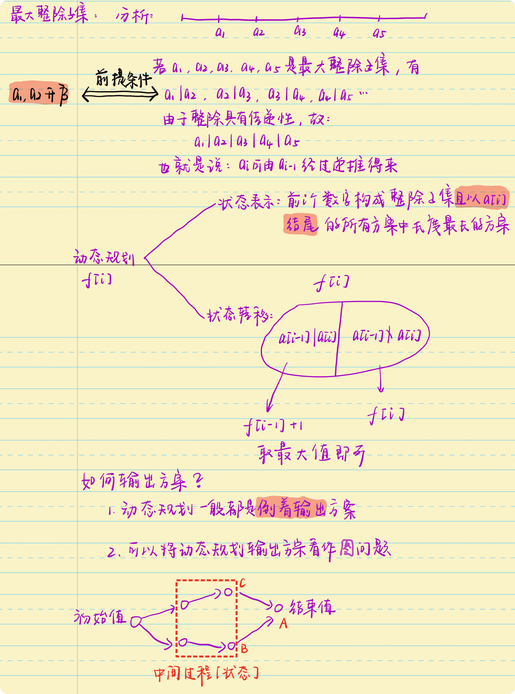

**代ç **

```c++
class Solution {
public:
    vector<int> largestDivisibleSubset(vector<int>& a) {
        int n = a.size();
        // 长度至少为1ã€å…¶æœ¬èº«ä¸€ä¸ªæ•°å­—】
        vector<int> f(n + 5, 1);
        // æ’åº
        sort(a.begin(), a.end());
        // 记录f最大时的下标
        int k = 1;
        for (int i = 1; i <= n; i ++ ) {
            for (int j = 1; j < i;j ++ )
                if (a[i - 1] % a[j - 1] == 0) f[i] = max(f[i], f[j] + 1);
            // 记录f最大时的下标
            if (f[i] > f[k]) k = i;
        }
        // 倒åºæŸ¥æ‰¾æ–¹æ¡ˆï¼Œå…ˆæŠŠæœ€å一个方案加进å»
        vector<int> res(1, a[k - 1]);
        while (f[k] > 1)
            // 判断ä»å“ªä¸ªæ–¹æ¡ˆè½¬ç§»è¿‡æ¥
            for (int i = 1; i < k; i ++ )
                if (a[k - 1] % a[i - 1] == 0 && f[k] == f[i] + 1) {
                    k = i;
                    res.push_back(a[k - 1]);
                    break;
                }
        return res;
    }
};
```

**标签**

`LIS`ã€`æ’åº`

## 背包模å‹

### `01` 背包

#### [AcWing 12. 背包问题求具体方案](https://www.acwing.com/problem/content/12/)

>   有 `N` 件物å“和一个容é‡æ˜¯ `V` 的背包。æ¯ä»¶ç‰©å“åªèƒ½ä½¿ç”¨ä¸€æ¬¡ã€‚
>
>   第 `i` 件物å“的体积是 $v_i$，价值是 $w_i$。
>
>   求解将哪些物å“装入背包，å¯ä½¿è¿™äº›ç‰©å“的总体积ä¸è¶…过背包容é‡ï¼Œä¸”总价值最大。
>
>   输出 **å­—å…¸åºæœ€å°çš„方案**。这里的字典åºæ˜¯æŒ‡ï¼šæ‰€é€‰ç‰©å“çš„ç¼–å·æ‰€æ„æˆçš„åºåˆ—。物å“çš„ç¼–å·èŒƒå›´æ˜¯ `1…N`。

**输入格å¼**

>   第一行两个整数，`N，V`，用空格隔开，分别表示物å“æ•°é‡å’ŒèƒŒåŒ…容积。
>
>   æ¥ä¸‹æ¥æœ‰ `N` 行，æ¯è¡Œä¸¤ä¸ªæ•´æ•° $v_i,w_i$，用空格隔开，分别表示第 `i` 件物å“的体积和价值。

**输出格å¼**

>   输出一行，包å«è‹¥å¹²ä¸ªç”¨ç©ºæ ¼éš”开的整数，表示最优解中所选物å“çš„ç¼–å·åºåˆ—，且该编å·åºåˆ—çš„å­—å…¸åºæœ€å°ã€‚
>
>   物å“ç¼–å·èŒƒå›´æ˜¯ `1…N`。

**æ•°æ®èŒƒå›´**

>   +   $0<N,V≤1000$
>   +   $0<v_i,w_i≤1000$

**输入样例**

```c++
4 5
1 2
2 4
3 4
4 6
```

**输出样例**

```c++
1 4
```

**手写稿**

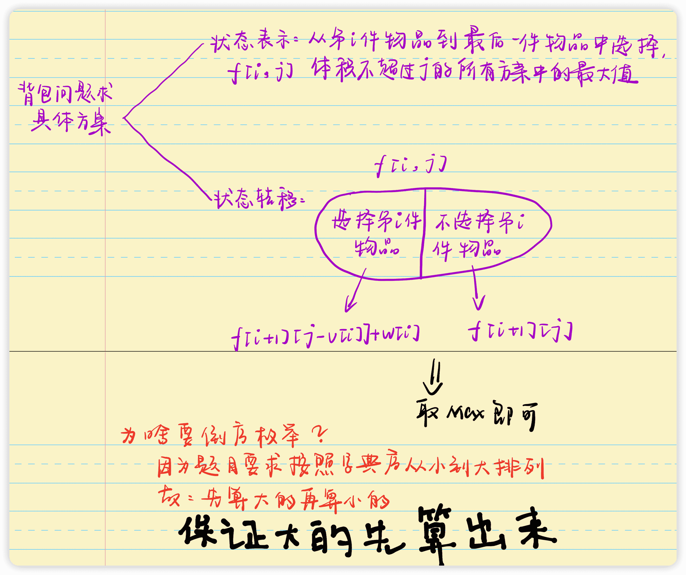

**代ç **

```c++
#include <iostream>
using namespace std;
const int N = 1010;
int n, m;
int v[N], w[N], way[N];
int f[N][N];
int main() {
    scanf("%d%d", &n, &m);
    for (int i = 1; i <= n; i ++ )
        scanf("%d%d", &v[i], &w[i]);
    // 倒åºæšä¸¾
    for (int i = n; i >= 1; i -- )
        for (int j = 0; j <= m; j ++ ) {
            f[i][j] = f[i + 1][j];
            if (j >= v[i]) f[i][j] = max(f[i][j], f[i + 1][j - v[i]] + w[i]);
        }
    int j = m;
    for (int i = 1; i <= n; i ++ )
        if (j >= v[i] && f[i][j] == f[i + 1][j - v[i]] + w[i]) {
            cout << i << " ";
            j -= v[i];
        }
    return 0;
}
```

**标签**

`01背包`ã€`01背包输出具体方案`ã€`逆åº01背包`ã€`å­—å…¸åº`

### 完全背包

#### [AcWing 3. 完全背包问题](https://www.acwing.com/problem/content/3/)

**题目æè¿°**

> 有 `N` ç§ç‰©å“和一个容é‡æ˜¯ `V` 的背包，æ¯ç§ç‰©å“都有无é™ä»¶å¯ç”¨ã€‚
>
> 第 `i` ç§ç‰©å“的体积是 $v_i$，价值是 $w_i$。
>
> 求解将哪些物å“装入背包，å¯ä½¿è¿™äº›ç‰©å“的总体积ä¸è¶…过背包容é‡ï¼Œä¸”总价值最大。
> 输出最大价值。

**输入格å¼**

> 第一行两个整数，`N，V`，用空格隔开，分别表示物å“ç§æ•°å’ŒèƒŒåŒ…容积。
>
> æ¥ä¸‹æ¥æœ‰ `N` 行，æ¯è¡Œä¸¤ä¸ªæ•´æ•° $v_i,w_i$，用空格隔开，分别表示第 `i` ç§ç‰©å“的体积和价值。

**输出格å¼**

> 输出一个整数，表示最大价值。

**æ•°æ®èŒƒå›´**

> + $0<N,V≤1000$
> + $0<v_i,w_i≤1000$

**输入样例**

```c++
4 5
1 2
2 4
3 4
4 5
```

**输出样例**

```c++
10
```

**手写稿**

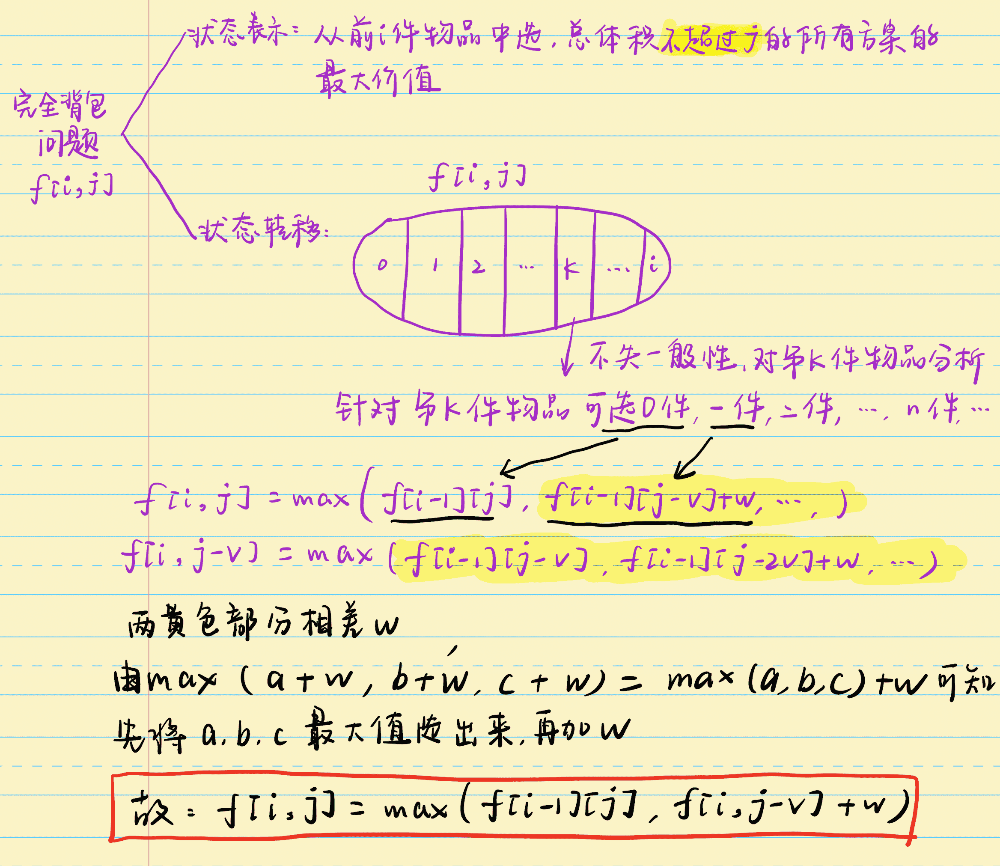

**代ç **

**代ç ä¸€ï¼šäºŒç»´æ•°ç»„**

```c++
#include <iostream>
using namespace std;
const int N = 1010;
int n, m;
int v[N], w[N];
int f[N][N];
int main() {
    scanf("%d%d", &n, &m);
    for (int i = 1; i <= n; i ++ ) scanf("%d%d", &v[i], &w[i]);
    for (int i = 1; i <= n; i ++ )
        for (int j = 0;j <= m; j ++ ) {
            // ä¸é€‰ç¬¬i件商å“
            f[i][j] = f[i - 1][j];
            if (j >= v[i]) f[i][j] = max(f[i][j], f[i][j - v[i]] + w[i]);
        }
    cout << f[n][m] << endl;
    return 0;
}
```

**代ç äºŒï¼šæ»šåŠ¨æ•°ç»„**

```c++
#include <iostream>
using namespace std;
const int N = 1010;
int n, m;
int v[N], w[N];
int f[2][N];
int main() {
    scanf("%d%d", &n, &m);
    for (int i = 1; i <= n; i ++ ) scanf("%d%d", &v[i], &w[i]);
    for (int i = 1; i <= n; i ++ )
        for (int j = 0;j <= m; j ++ ) {
            f[i & 1][j] = f[i - 1 & 1][j];
            if (j >= v[i]) f[i & 1][j] = max(f[i & 1][j], f[i & 1][j - v[i]] + w[i]);
        }
    cout << f[n & 1][m] << endl;
    return 0;
}
```

**代ç ä¸‰ï¼šä¸€ç»´æ•°ç»„**

```c++
#include <iostream>
using namespace std;
const int N = 1010;
int n, m;
int v[N], w[N], f[N];
int main() {
    scanf("%d%d", &n, &m);
    for (int i = 1; i <= n; i ++ ) scanf("%d%d", &v[i], &w[i]);
    for (int i = 1; i <= n; i ++ )
        for (int j = v[i]; j <= m; j ++ )
            f[j] = max(f[j], f[j - v[i]] + w[i]);
    cout << f[m] << endl;
    return 0;
}
```

**标签**

`完全背包`

#### [AcWing 1021. è´§å¸ç³»ç»Ÿ](https://www.acwing.com/problem/content/description/1023/)

**题目æè¿°**

> 给你一个 `n` ç§é¢å€¼çš„è´§å¸ç³»ç»Ÿï¼Œæ±‚组æˆé¢å€¼ä¸º `m` çš„è´§å¸æœ‰å¤šå°‘ç§æ–¹æ¡ˆã€‚

**输入格å¼**

> 第一行，包å«ä¸¤ä¸ªæ•´æ•° `n` å’Œ `m`。
>
> æ¥ä¸‹æ¥ `n` 行，æ¯è¡ŒåŒ…å«ä¸€ä¸ªæ•´æ•°ï¼Œè¡¨ç¤ºä¸€ç§è´§å¸çš„é¢å€¼ã€‚

**输出格å¼**

> 共一行，包å«ä¸€ä¸ªæ•´æ•°ï¼Œè¡¨ç¤ºæ–¹æ¡ˆæ•°ã€‚

**æ•°æ®èŒƒå›´**

> + $n≤15,m≤3000$

**输入样例**

```c++
3 10
1
2
5
```

**输出样例**

```c++
10
```

**手写稿**

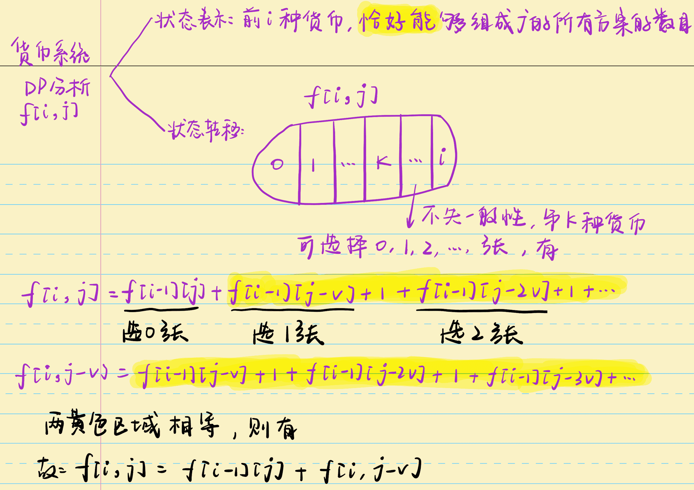

**代ç **

**代ç ä¸€ï¼šäºŒç»´æ•°ç»„**

```c++
#include <iostream>
using namespace std;
typedef long long LL;
const int N = 20, M = 3010;
int n, m;
int v[N];
// 注æ„方案数目å¯èƒ½çˆ†int
LL f[N][M];
int main() {
    scanf("%d%d", &n, &m);
    for (int i = 1; i <= n; i ++ ) scanf("%d", &v[i]);
    f[0][0] = 1;
    for (int i = 1; i <= n; i ++ )
        for (int j = 0; j <= m; j ++ ) {
            f[i][j] = f[i - 1][j];
            if (j >= v[i]) f[i][j] += f[i][j - v[i]];
        }
    cout << f[n][m] << endl;
    return 0;
}
```

**代ç äºŒï¼šæ»šåŠ¨æ•°ç»„**

```c++
#include <iostream>
using namespace std;
typedef long long LL;
const int N = 20, M = 3010;
int n, m;
int v[N];
LL f[2][M];
int main() {
    scanf("%d%d", &n, &m);
    for (int i = 1; i <= n; i ++ ) scanf("%d", &v[i]);
    f[0][0] = 1;
    for (int i = 1; i <= n; i ++ )
        for (int j = 0; j <= m; j ++ ) {
            // 注æ„：ä¸èƒ½ä½¿ç”¨+=，因为f[i & 1][j]å¯èƒ½æ˜¯åˆ«çš„层的，ä¸ä¸€å®šä¸º0
            f[i & 1][j] = f[i - 1 & 1][j];
            if (j >= v[i]) f[i & 1][j] += f[i & 1][j - v[i]];
        }
    cout << f[n & 1][m] << endl;
    return 0;
}
```

**代ç ä¸‰ï¼šä¸€ç»´æ•°ç»„**

```c++
#include <iostream>
using namespace std;
typedef long long LL;
const int N = 20, M = 3010;
int n, m;
int v[N];
LL f[M];
int main() {
    scanf("%d%d", &n, &m);
    for (int i = 1; i <= n; i ++ ) scanf("%d", &v[i]);
    f[0] = 1;
    for (int i = 1; i <= n; i ++ )
        for (int j = v[i]; j <= m; j ++ ) f[j] += f[j - v[i]];
    cout << f[m] << endl;
    return 0;
}
```

**标签**

`完全背包`

#### [LeetCode 322. 零钱兑æ¢](https://leetcode-cn.com/problems/coin-change/)

> 给你一个整数数组 `coins` ，表示ä¸åŒé¢é¢çš„硬å¸ï¼›ä»¥åŠä¸€ä¸ªæ•´æ•° `amount` ，表示总金é¢ã€‚
>
> 计算并返å›å¯ä»¥å‡‘æˆæ€»é‡‘é¢æ‰€éœ€çš„ 最少的硬å¸ä¸ªæ•° 。如æœæ²¡æœ‰ä»»ä½•ä¸€ç§ç¡¬å¸ç»„åˆèƒ½ç»„æˆæ€»é‡‘é¢ï¼Œè¿”å› `-1` 。
>
> ä½ å¯ä»¥è®¤ä¸ºæ¯ç§ç¡¬å¸çš„æ•°é‡æ˜¯æ— é™çš„。

**示例 1**

> 输入：`coins = [1, 2, 5], amount = 11`
> 输出：`3`
> 解释：`11 = 5 + 5 + 1`

**示例 2**

> 输入：`coins = [2], amount = 3`
> 输出：`-1`

**示例 3**

> 输入：`coins = [1], amount = 0`
> 输出：`0`

**æ示**

> + $1 <= coins.length <= 12$
> + $1 <= coins[i] <= 2^{31} - 1$
> + $0 <= amount <= 10^4$

**手写稿**


**代ç **

**代ç ä¸€ï¼šäºŒç»´æ•°ç»„**

```c++
class Solution {
public:
    int coinChange(vector<int>& v, int m) {
        int n = v.size();
        // åˆå§‹åŒ–为正无穷
        vector<vector<int>> f(n + 5, vector<int>(m + 5, 1e9));
        // å‰é›¶å¼ çº¸å¸ï¼Œä»·å€¼æ€»é¢æ°å¥½ä¸ºé›¶çš„ã€çº¸å¸æ•°é‡ã€‘为零张
        f[0][0] = 0;
        for (int i = 1; i <= n; i ++ )
            for (int j = 0; j <= m; j ++ ) {
                f[i][j] = f[i - 1][j];
                if (j >= v[i - 1]) f[i][j] = min(f[i][j], f[i][j - v[i - 1]] + 1);
            }
        // 如æœä¸ç¬¦åˆæ¡ä»¶ï¼Œè¾“出-1
        if (f[n][m] == 1e9) f[n][m] = -1;
        return f[n][m];
    }
};
```

**代ç äºŒï¼šæ»šåŠ¨æ•°ç»„**

```c++
class Solution {
public:
    int coinChange(vector<int>& v, int m) {
        int n = v.size();
        // åˆå§‹åŒ–为正无穷
        vector<vector<int>> f(2, vector<int>(m + 5, 1e9));
        // å‰é›¶å¼ çº¸å¸ï¼Œä»·å€¼æ€»é¢æ°å¥½ä¸ºé›¶çš„ã€çº¸å¸æ•°é‡ã€‘为零张
        f[0][0] = 0;
        for (int i = 1; i <= n; i ++ )
            for (int j = 0; j <= m; j ++ ) {
                f[i & 1][j] = f[i - 1 & 1][j];
                if (j >= v[i - 1]) f[i & 1][j] = min(f[i & 1][j], f[i & 1][j - v[i - 1]] + 1);
            }
        // 如æœä¸ç¬¦åˆæ¡ä»¶ï¼Œè¾“出-1
        if (f[n & 1][m] == 1e9) f[n & 1][m] = -1;
        return f[n & 1][m];
    }
};
```

**代ç ä¸‰ï¼šä¸€ç»´æ•°ç»„**

```c++
class Solution {
public:
    int coinChange(vector<int>& v, int m) {
        int n = v.size();
        // åˆå§‹åŒ–为正无穷
        vector<int> f(m + 5, 1e9);
        // å‰é›¶å¼ çº¸å¸ï¼Œä»·å€¼æ€»é¢æ°å¥½ä¸ºé›¶çš„ã€çº¸å¸æ•°é‡ã€‘为零张
        f[0] = 0;
        for (int i = 1; i <= n; i ++ )
            for (int j = v[i - 1]; j <= m; j ++ )
                f[j] = min(f[j], f[j - v[i - 1]] + 1);
        // 如æœä¸ç¬¦åˆæ¡ä»¶ï¼Œè¾“出-1
        if (f[m] == 1e9) f[m] = -1;
        return f[m];
    }
};
```

**标签**

`完全背包`

#### [LeetCode 377. 组åˆæ€»å’Œ â…£](https://leetcode-cn.com/problems/combination-sum-iv/)

**题目æè¿°**

>   给你一个由 ä¸åŒ 整数组æˆçš„数组 `nums` ，和一个目标整数 `target` ã€‚è¯·ä½ ä» `nums` 中找出并返å›æ€»å’Œä¸º `target` 的元素组åˆçš„个数。
>
>   题目数æ®ä¿è¯ç­”æ¡ˆç¬¦åˆ `32` ä½æ•´æ•°èŒƒå›´ã€‚

**示例 1**

>   输入：`nums = [1,2,3], target = 4`
>   输出：`7`
>   解释：
>   所有å¯èƒ½çš„组åˆä¸ºï¼š
>   `(1, 1, 1, 1)`
>   `(1, 1, 2)`
>   `(1, 2, 1)`
>   `(1, 3)`
>   `(2, 1, 1)`
>   `(2, 2)`
>   `(3, 1)`
>   请注æ„，顺åºä¸åŒçš„åºåˆ—被视作ä¸åŒçš„组åˆã€‚

**示例 2**

>   输入：`nums = [9], target = 3`
>   输出：`0`

**æ示**

>   +   $1 <= nums.length <= 200$
>   +   $1 <= nums[i] <= 1000$
>   +   $nums 中的所有元素 互ä¸ç›¸åŒ$
>   +   $1 <= target <= 1000$

**进阶**

>   如æœç»™å®šçš„数组中å«æœ‰è´Ÿæ•°ä¼šå‘生什么？问题会产生何ç§å˜åŒ–？如æœå…许负数出ç°ï¼Œéœ€è¦å‘题目中添加哪些é™åˆ¶æ¡ä»¶ï¼Ÿ

**手写稿**


**代ç ä¸€ï¼šäºŒç»´æ•°ç»„**

```c++
typedef long long LL;
class Solution {
public:
    int combinationSum4(vector<int>& a, int n) {
        vector<vector<LL>> f(n + 5, vector<LL>(n + 5));
        f[0][0] = 1;
        // 统计答案
        int res = 0;
        // æšä¸¾å‰i个ä½ç½®
        for (int i = 1; i <= n; i ++ ) {
            // æšä¸¾å‰i个ä½ç½®æ„æˆçš„总和
            for (int j = 0; j <= n; j ++ )
                // æšä¸¾æœ€å一个ä½ç½®é€‰æ‹©çš„æ•°å­—
                for (auto& num : a)
                    if (j >= num)
                        // å¯èƒ½ä¼šè¶Šç•Œï¼Œå–模å³å¯ï¼Œå› ä¸ºï¼Œç­”案ä½äºint范围内
                        // 如æœè¶…出intçš„è¯ï¼Œéšä¾¿ä½™æ— æ‰€è°“
                        f[i][j] = (f[i][j] + f[i - 1][j - num]) % INT_MAX;
            // 记录答案，因为
            // å¯èƒ½å‰1个ä½ç½®çš„和已ç»æ˜¯n了
            // å¯èƒ½å‰2个ä½ç½®çš„和已ç»æ˜¯n了
            // 以此类æ¨
            res += f[i][n];
        }
        return res;
    }
};
```

**时间å¤æ‚度**

$O(n^3)$

**空间å¤æ‚度**

$O(n^2)$

**代ç äºŒï¼šä¸€ç»´æ•°ç»„**

```c++
typedef long long LL;
class Solution {
public:
    int combinationSum4(vector<int>& a, int n) {
        vector<LL> f(n + 5);
        f[0] = 1;
        for (int j = 0; j <= n; j ++ )
            // æšä¸¾æœ€å一个ä½ç½®é€‰æ‹©çš„æ•°å­—
            for (auto& num : a)
                if (j >= num)
                    // å¯èƒ½ä¼šè¶Šç•Œï¼Œå–模å³å¯ï¼Œå› ä¸ºï¼Œç­”案ä½äºint范围内
                    // 如æœè¶…出intçš„è¯ï¼Œéšä¾¿ä½™æ— æ‰€è°“
                    f[j] = (f[j] + f[j - num]) % INT_MAX;
        return f[n];
    }
};
```

**时间å¤æ‚度**

$O(n^2)$

**空间å¤æ‚度**

$O(n)$

**标签**

`有顺åºçš„完全背包问题`

**ç¼åˆæ€ª**

### 分组背包

#### [AcWing 10. 有ä¾èµ–的背包问题](https://www.acwing.com/problem/content/description/10/)

> 有 `N` 个物å“和一个容é‡æ˜¯ `V` 的背包。
>
> 物å“之间具有ä¾èµ–关系，且ä¾èµ–关系组æˆä¸€æ£µæ ‘的形状。如æœé€‰æ‹©ä¸€ä¸ªç‰©å“，则必须选择它的父节点。
>
> 如下图所示：
> 
>
> 如æœé€‰æ‹©ç‰©å“ `5`ï¼Œåˆ™å¿…é¡»é€‰æ‹©ç‰©å“ `1` å’Œ `2`。这是因为 `2` 是 `5` 的父节点，`1` 是 `2` 的父节点。
>
> æ¯ä»¶ç‰©å“çš„ç¼–å·æ˜¯ `i`，体积是 $v_i$，价值是 $w_i$，ä¾èµ–的父节点编å·æ˜¯ $p_i$。物å“的下标范围是 $1…N$。
>
> 求解将哪些物å“装入背包，å¯ä½¿ç‰©å“总体积ä¸è¶…过背包容é‡ï¼Œä¸”总价值最大。
>
> 输出最大价值。

**输入格å¼**

> 第一行有两个整数 `N，V`，用空格隔开，分别表示物å“个数和背包容é‡ã€‚
>
> æ¥ä¸‹æ¥æœ‰ `N` 行数æ®ï¼Œæ¯è¡Œæ•°æ®è¡¨ç¤ºä¸€ä¸ªç‰©å“。
> 第 `i` 行有三个整数 $v_i,w_i,p_i$，用空格隔开，分别表示物å“的体积ã€ä»·å€¼å’Œä¾èµ–的物å“ç¼–å·ã€‚
> å¦‚æœ $p_i=−1$，表示根节点。 **æ•°æ®ä¿è¯æ‰€æœ‰ç‰©å“æ„æˆä¸€æ£µæ ‘。**

**输出格å¼**

> 输出一个整数，表示最大价值。

**æ•°æ®èŒƒå›´**

> + $1≤N,V≤100$
> + $1≤v_i,w_i≤100$
>
> 父节点编å·èŒƒå›´ï¼š
>
> - 内部结点：$1≤p_i≤N$;
> - 根节点 $p_i=−1$;

**输入样例**

```c++
5 7
2 3 -1
2 2 1
3 5 1
4 7 2
3 6 2
```

**输出样例**

```c++
11
```

**手写稿**


**代ç **

```c++
#include <iostream>
#include <cstring>
using namespace std;
const int N = 110;
int n, m, p, root, idx;
int v[N], w[N], h[N], e[N], ne[N];
int f[N][N];
void add(int a, int b) {
    e[idx] = b;
    ne[idx] = h[a];
    h[a] = idx ++;
    return;
}
void dfs(int u) {
    for (int i = h[u]; i != -1; i = ne[i]) { // æšä¸¾ç»„
        int son = e[i];
        // 递归å­æ ‘
        dfs(son);
        // 分组背包
        // 逆åºçš„åŸå› ï¼Œåœ¨å›¾è§£ä¸­
        for (int j = m - v[u]; j >= 0; j -- ) // æšä¸¾ç»„所å ç”¨çš„体积
            for (int k = 0; k <= j; k ++ ) // æšä¸¾ç»„内物å“所å ä½“积
                f[u][j] = max(f[u][j], f[u][j - k] + f[son][k]);
    }
    // 添加根节点的æƒå€¼
    for (int i = m; i >= v[u]; i -- ) f[u][i] = f[u][i - v[u]] + w[u];
    // 如æœä½“积è¿æ ¹èŠ‚点也ä¸èƒ½è£…下，则é‡ç½®ä¸º0
    // é‡ç½®çš„åŸå› ï¼Œåœ¨å›¾è§£ä¸­
    for (int i = 0; i < v[u]; i ++ ) f[u][i] = 0;
    return;
}
int main() {
    scanf("%d%d", &n, &m);
    memset(h, -1, sizeof h);
    for (int i = 1; i <= n; i ++ ) {
        scanf("%d%d%d", &v[i], &w[i] ,&p);
        if (p == -1) root = i;
        else add(p, i);
    }
    dfs(root);
    cout << f[root][m] << endl;
    return 0;
}
```

**标签**

`动æ€è§„划`ã€`分组背包`ã€`æ ‘å½¢DP`

#### [AcWing 9. 分组背包问题](https://www.acwing.com/problem/content/description/9/)

**题目æè¿°**

> 有 `N` 组物å“和一个容é‡æ˜¯ `V` 的背包。
>
> æ¯ç»„物å“有若干个，åŒä¸€ç»„内的物å“最多åªèƒ½é€‰ä¸€ä¸ªã€‚
> æ¯ä»¶ç‰©å“的体积是 $v_{ij}$，价值是 $w_{ij}$，其中 $i$ 是组å·ï¼Œ$j$ 是组内编å·ã€‚
>
> 求解将哪些物å“装入背包，å¯ä½¿ç‰©å“总体积ä¸è¶…过背包容é‡ï¼Œä¸”总价值最大。
>
> 输出最大价值。

**输入格å¼**

> 第一行有两个整数 `N，V`，用空格隔开，分别表示物å“组数和背包容é‡ã€‚
>
> æ¥ä¸‹æ¥æœ‰ `N` 组数æ®ï¼š
>
> - æ¯ç»„æ•°æ®ç¬¬ä¸€è¡Œæœ‰ä¸€ä¸ªæ•´æ•° $S_i$，表示第 $i$ 个物å“组的物å“æ•°é‡ï¼›
> - æ¯ç»„æ•°æ®æ¥ä¸‹æ¥æœ‰ $S_i$ 行，æ¯è¡Œæœ‰ä¸¤ä¸ªæ•´æ•° $v_{ij},w_{ij}$，用空格隔开，分别表示第 $i$ 个物å“组的第 $j$ 个物å“的体积和价值；

**输出格å¼**

> 输出一个整数，表示最大价值。

**æ•°æ®èŒƒå›´**

> + $0<N,V≤100$
> + $0<S_i≤100$
> + $0<v_{ij},w_{ij}≤100$

**输入样例**

```c++
3 5
2
1 2
2 4
1
3 4
1
4 5
```

**输出样例**

```c++
8
```

**手写稿**


**代ç **

**二维数组**

```c++
#include <iostream>
using namespace std;
const int N = 110;
int n, m;
int s[N], v[N][N], w[N][N], f[N][N];
int main() {
    scanf("%d%d", &n, &m);
    for (int i = 1; i <= n; i ++ ) {
        scanf("%d", &s[i]);
        for (int j = 1; j <= s[i]; j ++ ) scanf("%d%d", &v[i][j], &w[i][j]);
    }
    for (int i = 1; i <= n; i ++ ) // 循ç¯å‰i组
        for (int j = 0; j <= m; j ++ ) { // 循ç¯ä½“积
            f[i][j] = f[i - 1][j]; // 第i组的物å“一个都ä¸é€‰
            for (int k = 1; k <= s[i]; k ++) // æšä¸¾ç¬¬i组的所有物å“
                if (j >= v[i][k]) // 注æ„：体积需è¦å¤§äºç­‰äºå½“å‰ç‰©å“体积æ‰å¯è½¬ç§»
                    // 第i组的物å“çš„æŸä¸ªç‰©å“选择1个
                    f[i][j] = max(f[i][j], f[i - 1][j - v[i][k]] + w[i][k]);
        }
    cout << f[n][m] << endl;
    return 0;
}
```

**一维数组优化**

```c++
#include <iostream>
using namespace std;
const int N = 110;
int n, m;
int f[N];
int s[N], v[N][N], w[N][N];
int main() {
    scanf("%d%d", &n, &m);
    for (int i = 1; i <= n; i ++ ) {
        scanf("%d", &s[i]);
        for (int j = 1; j <= s[i]; j ++ ) scanf("%d%d", &v[i][j], &w[i][j]);
    }
    for (int i = 1; i <= n; i ++ ) // 循ç¯å‰i组
        for (int j = m; j >= 0; j -- ) { // 循ç¯ä½“积
            for (int k = 1; k <= s[i]; k ++)
                if (j >= v[i][k]) // 注æ„：体积需è¦å¤§äºç­‰äºå½“å‰ç‰©å“体积æ‰å¯è½¬ç§»
                    f[j] = max(f[j], f[j - v[i][k]] + w[i][k]);
        }
    cout << f[m] << endl;
    return 0;
}
```

**标签**

`分组背包`

#### [AcWing 1013. 机器分é…](https://www.acwing.com/problem/content/1015/)

>   总公å¸æ‹¥æœ‰ `M` å° **相åŒ** 的高效设备，准备分给下å±çš„ `N` 个分公å¸ã€‚
>
>   å„分公å¸è‹¥è·å¾—这些设备，å¯ä»¥ä¸ºå›½å®¶æ供一定的盈利。盈利ä¸åˆ†é…的设备数é‡æœ‰å…³ã€‚
>
>   问：如何分é…è¿™ `M` å°è®¾å¤‡æ‰èƒ½ä½¿å›½å®¶å¾—到的盈利最大？
>
>   求出最大盈利值。
>
>   分é…åŸåˆ™ï¼šæ¯ä¸ªå…¬å¸æœ‰æƒè·å¾—ä»»æ„数目的设备，但总å°æ•°ä¸è¶…过设备数 `M`。

**输入格å¼**

>   第一行有两个数，第一个数是分公å¸æ•° `N`，第二个数是设备å°æ•° `M`ï¼›
>
>   æ¥ä¸‹æ¥æ˜¯ä¸€ä¸ª `N * M` 的矩阵，矩阵中的第 `i` 行第 `j` 列的整数表示第 `i` 个公å¸åˆ†é… `j` å°æœºå™¨æ—¶çš„盈利。

**输出格å¼**

>   第一行输出最大盈利值；
>
>   æ¥ä¸‹ `N` 行，æ¯è¡Œæœ‰ `2` 个数，å³åˆ†å…¬å¸ç¼–å·å’Œè¯¥åˆ†å…¬å¸è·å¾—设备å°æ•°ã€‚
>
>   答案ä¸å”¯ä¸€ï¼Œè¾“出任æ„åˆæ³•æ–¹æ¡ˆå³å¯ã€‚

**æ•°æ®èŒƒå›´**

>   +   $1≤N≤10,$
>   +   $1≤M≤15$

**输入样例**

```c++
3 3
30 40 50
20 30 50
20 25 30
```

**输出样例**

```c++
70
1 1
2 1
3 1
```

**手写稿**


**代ç **

```c++
#include <iostream>
using namespace std;
const int N = 15, M = 20;
int n, m;
int way[N];
int w[N][M], f[N][M];
int main() {
    scanf("%d%d", &n, &m);
    for (int i = 1; i <= n; i ++ )
        for (int j = 1; j <= m; j ++ )
            scanf("%d", &w[i][j]);
    for (int i = 1; i <= n; i ++ ) // æšä¸¾ç‰©å“组i
        for (int j = 1; j <= m; j ++ ) { // æšä¸¾ã€å‰i组】分é…的机器总数目
            f[i][j] = f[i - 1][j];
            for (int k = 1; k <= j; k ++ ) // æšä¸¾ã€ç¬¬i组】分é…的机器数目
                f[i][j] = max(f[i][j], f[i - 1][j - k] + w[i][k]);
        }
    cout << f[n][m] << endl;
    for (int i = n; i >= 1; i -- )
        // æšä¸¾åˆ†é…的机器数目
        for (int j = m; j >= 0; j -- )
            // 状æ€è½¬ç§»æ–¹ç¨‹é€†è¿‡æ¥
            if (f[i - 1][m - j] + w[i][j] == f[i][m]) {
                way[i] = j;
                m -= j;
                break;
            }
    for (int i = 1; i <= n; i ++ ) cout << i << " " << way[i] << endl;
    return 0;
}
```

**标签**

`分组背包`ã€`分组背包求方案数`

### å„ç§èƒŒåŒ…之间的区别

#### `01`背包和分组背包

>1.   01背包代ç 
>
>     ```c++
>     // æšä¸¾å‰i件物å“
>     for (int i = 1; i <= n; i ++ ) {
>         // æšä¸¾ä½“积
>         for (int j = 1; j <= m; j ++ ){
>             f[i][j] = f[i - 1][j];
>             // æšä¸¾ç¬¬i件物å“，选0件或者选1件
>             if (j >= v[i]) f[i][j] = max(f[i][j],f[i - 1][j - v[i]] + w[i]);
>         }
>     }
>     ```
>
>2.   分组背包代ç 
>
>     ```c++
>     // æšä¸¾å‰i件物å“
>     for (int i = 1; i <= n; i ++ ) {
>         // æšä¸¾ä½“积
>         for (int j = 1; j <= m; j ++ ) {
>             // æšä¸¾ç¬¬i件物å“，选择0件，1件，2件，...，k件
>             f[i][j] = f[i - 1][j]; // 选择0件
>             for (int k = 1; k <= s[i]; k ++ ) // 选择1件到k件
>                 f[i][j] = max(f[i][j], f[i - 1][j - k * v[i]] + k * w[i]);
>         }
>     }
>     ```
>
>3.   疑难解答
>
>     +   为啥 `01` 背包是二维，而分组背包需è¦å†™ä¸‰ç»´ï¼Ÿ
>         +   `01` 背包对äºæ¯ä¸ªç‰©å“åªæœ‰ä¸¤ç§é€‰æ‹©ï¼Œå³é€‰æ‹© `0` 件物å“和选择 `1` 件物å“，å¯ä»¥ä¸æšä¸¾å³å¯å®Œæˆå¤§å°çš„比较
>         +   分组背包对äºæ¯ä¸ªç‰©å“而言ä¸ä»…ä»…åªæœ‰ä¸¤ç§é€‰æ‹©ï¼Œå¯èƒ½æœ‰ `k + 1` ç§é€‰æ‹©ï¼Œå³é€‰æ‹© `0` 件物å“，选择 `1` 件物å“，`...`，选择 `k` 件物å“，ä¸æšä¸¾æ¯”较ä¸å‡ºæ¥ï¼Œå¿…é¡»æšä¸¾

## 区间 `DP`

### æšä¸¾é¡ºåºçš„解释

>   <font style = "color: red">**`AcWing 282` 石å­åˆå¹¶çš„手写稿中有介ç»**</font>

### [AcWing 282. 石å­åˆå¹¶](https://www.acwing.com/problem/content/description/284/)

**题目æè¿°**

>   设有 `N` 堆石å­æ’æˆä¸€æ’，其编å·ä¸º `1，2，3，…，N`。
>
>   æ¯å †çŸ³å­æœ‰ä¸€å®šçš„è´¨é‡ï¼Œå¯ä»¥ç”¨ä¸€ä¸ªæ•´æ•°æ¥æ述，ç°åœ¨è¦å°†è¿™ `N` 堆石å­åˆå¹¶æˆä¸ºä¸€å †ã€‚
>
>   æ¯æ¬¡åªèƒ½åˆå¹¶ç›¸é‚»çš„两堆，åˆå¹¶çš„代价为这两堆石å­çš„è´¨é‡ä¹‹å’Œï¼Œåˆå¹¶åä¸è¿™ä¸¤å †çŸ³å­ç›¸é‚»çš„石å­å°†å’Œæ–°å †ç›¸é‚»ï¼Œåˆå¹¶æ—¶ç”±äºé€‰æ‹©çš„顺åºä¸åŒï¼Œåˆå¹¶çš„总代价也ä¸ç›¸åŒã€‚
>
>   例如有 `4` 堆石å­åˆ†åˆ«ä¸º `1 3 5 2`， 我们å¯ä»¥å…ˆåˆå¹¶ `1ã€2` 堆，代价为 `4`，得到 `4 5 2`， åˆåˆå¹¶ `1，2` 堆，代价为 `9`，得到 `9 2` ，å†åˆå¹¶å¾—到 `11`，总代价为 `4+9+11=24`ï¼›
>
>   如æœç¬¬äºŒæ­¥æ˜¯å…ˆåˆå¹¶ `2，3` 堆，则代价为 `7`，得到 `4 7`，最å一次åˆå¹¶ä»£ä»·ä¸º `11`，总代价为 `4+7+11=22`。
>
>   问题是：找出一ç§åˆç†çš„方法，使总的代价最å°ï¼Œè¾“出最å°ä»£ä»·ã€‚

**输入格å¼**

>   第一行一个数 `N` 表示石å­çš„堆数 `N`。
>
>   第二行 `N` 个数，表示æ¯å †çŸ³å­çš„è´¨é‡(å‡ä¸è¶…过 `1000`)。

**输出格å¼**

>   输出一个整数，表示最å°ä»£ä»·ã€‚

**æ•°æ®èŒƒå›´**

>   +   $1≤N≤300$

**输入样例**

```c++
4
1 3 5 2
```

**输出样例**

```c++
22
```

**手写稿**


**代ç **

```c++
#include <iostream>
#include <cstring>
using namespace std;
const int N = 310, inf = 0x3f3f3f3f;
int n;
int g[N], sum[N];
int f[N][N];
int main() {
    scanf("%d", &n);
    for (int i = 1; i <= n; i ++ ) {
        scanf("%d", &g[i]);
        sum[i] = sum[i - 1] + g[i];
    }
    // æšä¸¾é•¿åº¦
    // 长度为1没æ„义，题目è¦æ±‚至少两堆石å­åˆå¹¶æ‰æœ‰æ„义
    for (int len = 2; len <= n; len ++ )
        // æšä¸¾ã€å½“å‰åŒºé—´ã€‘左端点的ã€ä¸‹æ ‡ã€‘
        for (int i = 1; i + len - 1 <= n; i ++ ) {
            // ã€å½“å‰åŒºé—´ã€‘å³ç«¯ç‚¹çš„ã€ä¸‹æ ‡ã€‘
            // ã€ä¸‹æ ‡ã€‘ç­‰äºã€len - 1】
            int j = i + len - 1;
            // åˆå§‹åŒ–为正无穷
            f[i][j] = inf;
            // æšä¸¾åˆ†ç•Œç‚¹
            for (int k = i; k < j; k ++ )
                f[i][j] = min(f[i][j], f[i][k] + f[k + 1][j] + sum[j] - sum[i - 1]);
        }
    cout << f[1][n] << endl;
    return 0;
}
```

**标签**

`区间DP`

### [AcWing 1068. ç¯å½¢çŸ³å­åˆå¹¶](https://www.acwing.com/problem/content/1070/)

**题目æè¿°**

>   å°† `n` 堆石å­ç»•åœ†å½¢æ“场æ’放，ç°è¦å°†çŸ³å­æœ‰åºåœ°åˆå¹¶æˆä¸€å †ã€‚
>
>   规定æ¯æ¬¡åªèƒ½é€‰ç›¸é‚»çš„两堆åˆå¹¶æˆæ–°çš„一堆，并将新的一堆的石å­æ•°è®°åšè¯¥æ¬¡åˆå¹¶çš„得分。
>
>   请编写一个程åºï¼Œè¯»å…¥å †æ•° `n` åŠæ¯å †çš„石å­æ•°ï¼Œå¹¶è¿›è¡Œå¦‚下计算：
>
>   -   选择一ç§åˆå¹¶çŸ³å­çš„æ–¹æ¡ˆï¼Œä½¿å¾—åš `n−1` 次åˆå¹¶å¾—分总和最大。
>   -   选择一ç§åˆå¹¶çŸ³å­çš„æ–¹æ¡ˆï¼Œä½¿å¾—åš `n−1` 次åˆå¹¶å¾—分总和最å°ã€‚

**输入格å¼**

>   第一行包å«æ•´æ•° `n`，表示共有 `n` 堆石å­ã€‚
>
>   ç¬¬äºŒè¡ŒåŒ…å« `n` 个整数，分别表示æ¯å †çŸ³å­çš„æ•°é‡ã€‚

**输出格å¼**

>   输出共两行：
>
>   第一行为åˆå¹¶å¾—分总和最å°å€¼ï¼Œ
>
>   第二行为åˆå¹¶å¾—分总和最大值。

**æ•°æ®èŒƒå›´**

>   +   $1≤n≤200$

**输入样例**

```c++
4
4 5 9 4
```

**输出样例**

```c++
43
54
```

**手写稿**


**代ç **

```c++
#include <iostream>
#include <cstring>
using namespace std;
const int N = 410, INF = 0x3f3f3f3f;
int n;
int h[N], sum[N];
int f[N][N], g[N][N];
int main() {
    scanf("%d", &n);
    for (int i = 1; i <= n; i ++ ) {
        scanf("%d", &h[i]);
        // å¤åˆ¶ä¸€é数组
        h[i + n] = h[i];
    }
    // 求å‰ç¼€å’Œ
    for (int i = 1; i <= n * 2; i ++ )
        sum[i] = sum[i - 1] + h[i];
    // 区间DP
    memset(f, INF, sizeof f);
    memset(g, -INF, sizeof g);
    for (int len = 1; len <= n; len ++ )
        for (int i = 1; i + len - 1 <= n * 2; i ++ ) {
            int j = i + len - 1;
            // åˆå¹¶çŸ³å­ï¼Œè¯´æ˜è‡³å°‘是两堆
            // 如æœå½“å‰åŒºé—´åªæœ‰ä¸€ä¸ªæ•°å­—，说æ˜åªæœ‰ä¸€å †ï¼Œä¸å¯èƒ½è¿›è¡Œåˆå¹¶
            // 因此，åˆå¹¶çš„价值为0
            if (i == j) f[i][j] = g[i][j] = 0;
            for (int k = i; k < j; k ++ ) {
                f[i][j] = min(f[i][j], f[i][k] + f[k + 1][j] + sum[j] - sum[i - 1]);
                g[i][j] = max(g[i][j], g[i][k] + g[k + 1][j] + sum[j] - sum[i - 1]);
            }
        }
    int Minr = INF, Maxr = -INF;
    for (int i = 1; i <= n; i ++ ) {
        // 区间DP是下标
        // æšä¸¾åŒºé—´èµ·ç‚¹ï¼Œå¯»æ‰¾æœ€å¤§å€¼å’Œæœ€å°å€¼
        // 答案å¯èƒ½ä½äº[1, n]或者[2, n + 1]或，因此，需è¦è¿›è¡Œæšä¸¾
        Minr = min(Minr, f[i][i + n - 1]);
        Maxr = max(Maxr, g[i][i + n - 1]);
    }
    cout << Minr << endl << Maxr << endl;
    return 0;
}
```

**标签**

`区间DP`ã€`ç¯`ã€`æ–­ç¯æˆé“¾`

### [AcWing 320. 能é‡é¡¹é“¾](https://www.acwing.com/problem/content/322/)

>   在 `Mars` 星çƒä¸Šï¼Œæ¯ä¸ª `Mars` 人都éšèº«ä½©å¸¦ç€ä¸€ä¸²èƒ½é‡é¡¹é“¾ï¼Œåœ¨é¡¹é“¾ä¸Šæœ‰ `N` 颗能é‡ç ã€‚
>
>   能é‡ç æ˜¯ä¸€é¢—有头标记ä¸å°¾æ ‡è®°çš„ç å­ï¼Œè¿™äº›æ ‡è®°å¯¹åº”ç€æŸä¸ªæ­£æ•´æ•°ã€‚
>
>   并且，对äºç›¸é‚»çš„两颗ç å­ï¼Œå‰ä¸€é¢—ç å­çš„尾标记一定等äºå一颗ç å­çš„头标记。
>
>   因为åªæœ‰è¿™æ ·ï¼Œé€šè¿‡å¸ç›˜ï¼ˆå¸ç›˜æ˜¯ `Mars` 人å¸æ”¶èƒ½é‡çš„一ç§å™¨å®˜ï¼‰çš„作用，这两颗ç å­æ‰èƒ½èšåˆæˆä¸€é¢—ç å­ï¼ŒåŒæ—¶é‡Šæ”¾å‡ºå¯ä»¥è¢«å¸ç›˜å¸æ”¶çš„能é‡ã€‚
>
>   如æœå‰ä¸€é¢—能é‡ç çš„头标记为 `m`，尾标记为 `r`，å一颗能é‡ç çš„头标记为 `r`，尾标记为 `n`，则èšåˆå释放的能é‡ä¸º `m×r×n`（`Mars` å•ä½ï¼‰ï¼Œæ–°äº§ç”Ÿçš„ç å­çš„头标记为 `m`，尾标记为 `n`。
>
>   需è¦æ—¶ï¼Œ`Mars` 人就用å¸ç›˜å¤¹ä½ç›¸é‚»çš„两颗ç å­ï¼Œé€šè¿‡èšåˆå¾—到能é‡ï¼Œç›´åˆ°é¡¹é“¾ä¸Šåªå‰©ä¸‹ä¸€é¢—ç å­ä¸ºæ­¢ã€‚
>
>   显然，ä¸åŒçš„èšåˆé¡ºåºå¾—到的总能é‡æ˜¯ä¸åŒçš„，请你设计一个èšåˆé¡ºåºï¼Œä½¿ä¸€ä¸²é¡¹é“¾é‡Šæ”¾å‡ºçš„总能é‡æœ€å¤§ã€‚
>
>   例如：设 `N=4`，`4` 颗ç å­çš„头标记ä¸å°¾æ ‡è®°ä¾æ¬¡ä¸º `(2，3)(3，5)(5，10)(10，2)`。
>
>   æˆ‘ä»¬ç”¨è®°å· `⊕` 表示两颗ç å­çš„èšåˆæ“作，`(j⊕k)` 表示第 `j`，`k` 两颗ç å­èšåˆå所释放的能é‡ã€‚则
>
>   第 `4ã€1` 两颗ç å­èšåˆå释放的能é‡ä¸ºï¼š`(4⊕1)=10×2×3=60`。
>
>   这一串项链å¯ä»¥å¾—到最优值的一个èšåˆé¡ºåºæ‰€é‡Šæ”¾çš„总能é‡ä¸º `((4⊕1)⊕2)⊕3)=10×2×3+10×3×5+10×5×10=710`。

**输入格å¼**

>   输入的第一行是一个正整数 `N`，表示项链上ç å­çš„个数。
>
>   第二行是 `N` 个用空格隔开的正整数，所有的数å‡ä¸è¶…过 `1000`，第 `i` 个数为第 `i` 颗ç å­çš„头标记，当 `i<N` 时，第 `i` 颗ç å­çš„尾标记应该等äºç¬¬ `i+1` 颗ç å­çš„头标记，第 `N` 颗ç å­çš„尾标记应该等äºç¬¬ `1` 颗ç å­çš„头标记。
>
>   至äºç å­çš„顺åºï¼Œä½ å¯ä»¥è¿™æ ·ç¡®å®šï¼šå°†é¡¹é“¾æ”¾åˆ°æ¡Œé¢ä¸Šï¼Œä¸è¦å‡ºç°äº¤å‰ï¼Œéšæ„指定第一颗ç å­ï¼Œç„¶å按顺时针方å‘确定其他ç å­çš„顺åºã€‚

**输出格å¼**

>   输出åªæœ‰ä¸€è¡Œï¼Œæ˜¯ä¸€ä¸ªæ­£æ•´æ•° `E`，为一个最优èšåˆé¡ºåºæ‰€é‡Šæ”¾çš„总能é‡ã€‚

**æ•°æ®èŒƒå›´**

>   +   $4≤N≤100,$
>   +   $1≤E≤2.1×10^9$

**输入样例**

```c++
4
2 3 5 10
```

**输出样例**

```c++
710
```

**手写稿**

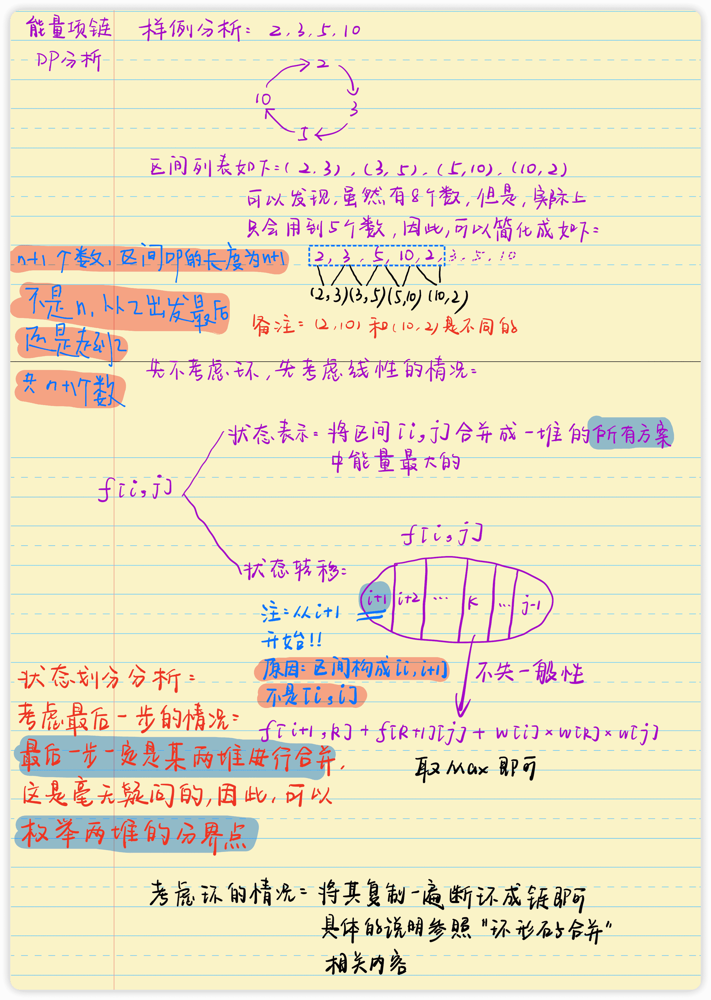

**代ç **

```c++
#include <iostream>
using namespace std;
const int N = 210;
int n;
int g[N];
int f[N][N];
int main() {
    scanf("%d", &n);
    for (int i = 1; i <= n; i ++ ) {
        scanf("%d", &g[i]);
        g[i + n] = g[i];
    }
    // æšä¸¾åŒºé—´é•¿åº¦
    // 至少需è¦ä¸¤ä¸ªåŒºé—´ï¼Œå› æ­¤ï¼Œé•¿åº¦æœ€å°ä¸º3
    for (int len = 3; len <= n + 1; len ++ )
        // æšä¸¾å·¦ç«¯ç‚¹
        // 终点是ã€n * 2】
        for (int i = 1; i + len - 1 <= n * 2; i ++ ) {
            int j = i + len - 1;
            // 头和尾æ„æˆä¸€ä¸ªæ•°å¯¹(x, y)
            // 树对对应的下标是[i, i + 1]ä¸æ˜¯[i, i]
            for (int k = i + 1; k < j; k ++ )
                f[i][j] = max(f[i][j], f[i][k] + f[k][j] + g[i] * g[k] * g[j]);
        }
    int res = 0;
    // 注æ„：长度为ã€n + 1】ä¸æ˜¯ã€n】
    // åŸå› ï¼šä»1出å‘最å还是得å›åˆ°1，共ã€n + 1】个数
    for (int i = 1; i <= n; i ++ ) res = max(res, f[i][i + n]);
    cout << res << endl;
    return 0;
}
```

**标签**

`区间DP`ã€`ç¯`ã€`æ–­ç¯æˆé“¾`

### [AcWing 1069. 凸多边形的划分](https://www.acwing.com/problem/content/1071/)

**题目æè¿°**

>   给定一个具有 `N` ä¸ªé¡¶ç‚¹çš„å‡¸å¤šè¾¹å½¢ï¼Œå°†é¡¶ç‚¹ä» `1` 至 `N` æ ‡å·ï¼Œæ¯ä¸ªé¡¶ç‚¹çš„æƒå€¼éƒ½æ˜¯ä¸€ä¸ªæ­£æ•´æ•°ã€‚
>
>   å°†è¿™ä¸ªå‡¸å¤šè¾¹å½¢åˆ’åˆ†æˆ `N−2` 个互ä¸ç›¸äº¤çš„三角形，对äºæ¯ä¸ªä¸‰è§’形，其三个顶点的æƒå€¼ç›¸ä¹˜éƒ½å¯å¾—到一个æƒå€¼ä¹˜ç§¯ï¼Œè¯•æ±‚所有三角形的顶点æƒå€¼ä¹˜ç§¯ä¹‹å’Œè‡³å°‘为多少。

**输入格å¼**

>   第一行包å«æ•´æ•° `N`，表示顶点数é‡ã€‚
>
>   ç¬¬äºŒè¡ŒåŒ…å« `N` 个整数，ä¾æ¬¡ä¸ºé¡¶ç‚¹ `1` 至顶点 `N` çš„æƒå€¼ã€‚

**输出格å¼**

>   输出仅一行，为所有三角形的顶点æƒå€¼ä¹˜ç§¯ä¹‹å’Œçš„最å°å€¼ã€‚

**æ•°æ®èŒƒå›´**

>   +   $N≤50$,
>   +   $æ•°æ®ä¿è¯æ‰€æœ‰é¡¶ç‚¹çš„æƒå€¼éƒ½å°äº10^9$

**输入样例**

```c++
5
121 122 123 245 231
```

**输出样例**

```c++
12214884
```

**手写稿**


**代ç **

```c++
#include <iostream>
#include <vector>
using namespace std;
typedef long long LL;
const int N = 55, INF = 1e9;
int n;
int w[N];
vector<int> f[N][N];
// 高精度乘法
vector<int> mul(vector<int> A, int b) {
    vector<int> C;
    LL t = 0;
    for (int i = 0; i < A.size(); i ++ ) {
        t += (LL)A[i] * b;
        C.push_back(t % 10);
        t /= 10;
    }
    while (t) C.push_back(t % 10), t /= 10;
    while (C.size() > 1 && C.back() == 0) C.pop_back();
    return C;
}
// 高精度加法
vector<int> add(vector<int> A, vector<int> B) {
    vector<int> C;
    int t = 0;
    for (int i = 0, j = 0; i < A.size() || j < B.size(); i ++ , j ++ ) {
        if (i < A.size()) t += A[i];
        if (j < B.size()) t += B[i];
        C.push_back(t % 10);
        t /= 10;
    }
    while (t) C.push_back(t % 10), t /= 10;
    return C;
}
// 比较函数
bool cmp(vector<int>& A, vector<int>& B) {
    if (A.size() != B.size()) return A.size() > B.size();
    for (int i = A.size() - 1; i >= 0; i -- )
        if (A[i] != B[i]) return A[i] > B[i];
    return false;
}
int main() {
    scanf("%d", &n);
    for (int i = 1; i <= n; i ++ ) scanf("%d", &w[i]);
    for (int len = 3; len <= n; len ++ )
        for (int i = 1; i + len - 1 <= n; i ++ ) {
            int j = i + len - 1;
            for (int k = i + 1; k < j; k ++ ) {
                // w[i] * w[k] * w[j];
                auto new_mul = mul(mul({w[i]}, w[k]), w[j]);
                // f[i][k] + f[k][j] + w[i] * w[k] * w[j];
                auto new_add = add(add(f[i][k], f[k][j]), new_mul);
                // f[i][j] = min(f[i][j], f[i][k] + f[k][j] + w[i] * w[k] * w[j]);
                // åªæœ‰ç®—过的æ‰æ›´æ–°ï¼Œæ²¡ç®—过的就ä¸éœ€è¦æ›´æ–°
                if (f[i][j].empty() || cmp(f[i][j], new_add)) // 如æœf[i][j] > new_add
                    f[i][j] = new_add;
            }
        }
    auto res = f[1][n];
    for (int i = res.size() - 1; i >= 0; i -- ) cout << res[i];
    return 0;
}
```

**标签**

`区间DP`ã€`高精度`

**ç¼åˆæ€ª**

[高精度](#高精度)

### [AcWing 479. 加分二å‰æ ‘](https://www.acwing.com/problem/content/481/)

**题目æè¿°**

>   设一个 `n` 个节点的二å‰æ ‘ `tree` 的中åºéå†ä¸º`（1,2,3,…,n）`，其中数字 `1,2,3,…,n` 为节点编å·ã€‚
>
>   æ¯ä¸ªèŠ‚点都有一个分数（å‡ä¸ºæ­£æ•´æ•°ï¼‰ï¼Œè®°ç¬¬ `i` 个节点的分数为 $d_i$，`tree` åŠå®ƒçš„æ¯ä¸ªå­æ ‘都有一个加分，任一棵å­æ ‘ `subtree`ï¼ˆä¹ŸåŒ…å« `tree` 本身）的加分计算方法如下：     
>
>   `subtree` çš„å·¦å­æ ‘的加分 `×` `subtree` çš„å³å­æ ‘的加分 `＋` `subtree` 的根的分数 
>
>   è‹¥æŸä¸ªå­æ ‘为空，规定其加分为 `1`。
>
>   å¶å­çš„加分就是å¶èŠ‚点本身的分数，ä¸è€ƒè™‘它的空å­æ ‘。
>
>   试求一棵符åˆä¸­åºéå†ä¸º`（1,2,3,…,n）`且加分最高的二å‰æ ‘ `tree`。
>
>   è¦æ±‚输出： 
>
>   （1）`tree` 的最高加分 
>
>   （2）`tree` çš„å‰åºéå†

**输入格å¼**

>   第 `1` 行：一个整数 `n`，为节点个数。 
>
>   第 `2` 行：`n` 个用空格隔开的整数，为æ¯ä¸ªèŠ‚点的分数`（0<分数<100）`。

**输出格å¼**

>   第 `1` 行：一个整数，为最高加分（结æœä¸ä¼šè¶…过`int`范围）。     
>
>   第 `2` 行：`n` 个用空格隔开的整数，为该树的å‰åºéå†ã€‚如æœå­˜åœ¨å¤šç§æ–¹æ¡ˆï¼Œåˆ™è¾“出字典åºæœ€å°çš„方案。

**æ•°æ®èŒƒå›´**

>   +   `n < 30`

**输入样例**

```c++
5
5 7 1 2 10
```

**输出样例**

```c++
145
3 1 2 4 5
```

**手写稿**


**代ç **

```c++
#include <iostream>
using namespace std;
const int N = 35;
int n;
int w[N];
int f[N][N], g[N][N];
void dfs(int l, int r) {
    if (l > r) return;
    // [l, r]的根节点是g[l][r]
    cout << g[l][r] << " ";
    // å·¦å³å­æ ‘ä¸åŒ…括根节点
    // å·¦å­æ ‘的区间[l, g[l][r] - 1]
    dfs(l, g[l][r] - 1);
    // å·¦å­æ ‘的区间[g[l][r] + 1, r]
    dfs(g[l][r] + 1, r);
    return;
}
int main() {
    scanf("%d", &n);
    for (int i = 1; i <= n; i ++ ) scanf("%d", &w[i]);
    for (int len = 1; len <= n; len ++ )
        for (int i = 1; i + len - 1 <= n; i ++ ) {
            int j = i + len - 1;
            if (len == 1) { // å¶èŠ‚点
                // å¶èŠ‚点的价值为å¶èŠ‚点本身的分数
                f[i][j] = w[i];
                // å¶èŠ‚点的根节点为其本身
                g[i][j] = i;
            }
            else { // éå¶èŠ‚点
                for (int k = i; k <= j; k ++ ) {
                    // 说æ˜æ— å·¦å­æ ‘，规定其分数为1
                    if (k == i) f[i][k - 1] = 1;
                    // 说æ˜æ— å³å­æ ‘，规定其分数为1
                    if (k == j) f[k + 1][j] = 1;
                    // 计算以k为根节点的二å‰æ ‘的分数
                    int score = f[i][k - 1] * f[k + 1][j] + w[k];
                    // 区间[i, j]的分数å°äºscore时，æ‰æ›´æ–°
                    // 区间[i, j]的分数等äºscore时，由äºå­—å…¸åºçš„é™åˆ¶ï¼Œä¸æ›´æ–°
                    // 具体看手写稿分æ
                    if (f[i][j] < score) {
                        f[i][j] = score;
                        g[i][j] = k;
                    }
                }
            }
        }
    cout << f[1][n] << endl;
    dfs(1, n);
    return 0;
}
```

**标签**

`区间DP`ã€`区间DP求具体方案`

### [AcWing 321. 棋盘分割](https://www.acwing.com/problem/content/323/)

**题目æè¿°**

>   将一个 `8×8` 的棋盘进行如下分割：将åŸæ£‹ç›˜å‰²ä¸‹ä¸€å—矩形棋盘并使剩下部分也是矩形，å†å°†å‰©ä¸‹çš„部分继续如此分割，这样割了 `(n−1)` 次å，è¿åŒæœ€å剩下的矩形棋盘共有 `n` å—矩形棋盘。(æ¯æ¬¡åˆ‡å‰²éƒ½åªèƒ½æ²¿ç€æ£‹ç›˜æ ¼å­çš„边进行)
>
>   
>
>   åŸæ£‹ç›˜ä¸Šæ¯ä¸€æ ¼æœ‰ä¸€ä¸ªåˆ†å€¼ï¼Œä¸€å—矩形棋盘的总分为其所å«å„格分值之和。
>
>   ç°åœ¨éœ€è¦æŠŠæ£‹ç›˜æŒ‰ä¸Šè¿°è§„åˆ™åˆ†å‰²æˆ `n` å—矩形棋盘，并使å„矩形棋盘总分的å‡æ–¹å·®æœ€å°ã€‚
>
>   å‡æ–¹å·® ，其中平å‡å€¼ ，$x_i$ 为第 `i` å—矩形棋盘的总分。
>
>   è¯·ç¼–ç¨‹å¯¹ç»™å‡ºçš„æ£‹ç›˜åŠ `n`，求出å‡æ–¹å·®çš„最å°å€¼ã€‚

**输入格å¼**

>   第 `1` 行为一个整数 `n`。
>
>   第 `2` 行至第 `9` è¡Œæ¯è¡Œä¸º `8` 个å°äº `100` çš„é负整数，表示棋盘上相应格å­çš„分值。æ¯è¡Œç›¸é‚»ä¸¤æ•°ä¹‹é—´ç”¨ä¸€ä¸ªç©ºæ ¼åˆ†éš”。

**输出格å¼**

>   输出最å°å‡æ–¹å·®å€¼ï¼ˆå››èˆäº”入精确到å°æ•°ç‚¹å三ä½ï¼‰ã€‚

**æ•°æ®èŒƒå›´**

>   +   $1<n<15$

**输入样例**

```c++
3
1 1 1 1 1 1 1 3
1 1 1 1 1 1 1 1
1 1 1 1 1 1 1 1
1 1 1 1 1 1 1 1
1 1 1 1 1 1 1 1
1 1 1 1 1 1 1 1
1 1 1 1 1 1 1 0
1 1 1 1 1 1 0 3
```

**输出样例**

```c++
1.633
```

**手写稿**


**代ç **

```c++
#include <iostream>
#include <cstring>
#include <cmath>
using namespace std;
const int N = 10, M = 15;
int n;
double X;
int g[N][N], sum[N][N];
double f[N][N][N][N][M];
// 计算方差
double get(int x1, int y1, int x2, int y2) {
    double s = sum[x2][y2] - sum[x1 - 1][y2] - sum[x2][y1 - 1] + sum[x1 - 1][y1 - 1] - X;
    return (double)s * s / n;
}
double dfs(int x1, int y1, int x2, int y2, int k) {
    double &v = f[x1][y1][x2][y2][k];
    // 如æœå·²ç»è®¡ç®—过，则直æ¥è¿”å›
    if (v >= 0) return v;
    // 如æœåªéœ€è¦1个矩形，直æ¥è®¡ç®—å³å¯
    if (k == 1) return v = get(x1, y1, x2, y2);
    // åˆå§‹åŒ–为最大值
    v = 1e9;
    // 横ç€åˆ‡
    for (int i = x1; i <= x2; i ++ ) {
        v = min(v, dfs(x1, y1, i, y2, k - 1) + get(i + 1, y1, x2, y2));
        v = min(v, dfs(i, y1, x2, y2, k - 1) + get(x1, y1, i - 1, y2));
    }
    // ç«–ç€åˆ‡
    for (int i = y1; i <= y2; i ++ ) {
        v = min(v, dfs(x1, y1, x2, i, k - 1) + get(x1, i + 1, x2, y2));
        v = min(v, dfs(x1, i, x2, y2, k - 1) + get(x1, y1, x2, i - 1));
    }
    return v;
}
int main() {
    scanf("%d", &n);
    for (int i = 1; i <= 8; i ++ )
        for (int j = 1; j <= 8; j ++ ) {
            scanf("%d", &g[i][j]);
            // å‰ç¼€å’Œ
            sum[i][j] = g[i][j] + sum[i - 1][j] + sum[i][j - 1] - sum[i - 1][j - 1];
        }
    // Xæ‹”
    X = (double)sum[8][8] / n;
    // 浮点å‹æ•°ç»„åˆå§‹åŒ–-1，其值为NaN
    memset(f, -1, sizeof f);
    printf("%.3lf\n", sqrt(dfs(1, 1, 8, 8, n)));
    return 0;
}
```

**标签**

`区间DP`ã€`记忆化æœç´¢`ã€`å‰ç¼€å’Œ`

### [LeetCode 375. çŒœæ•°å­—å¤§å° II](https://leetcode-cn.com/problems/guess-number-higher-or-lower-ii/)

**题目æè¿°**

>   我们正在ç©ä¸€ä¸ªçŒœæ•°æ¸¸æˆï¼Œæ¸¸æˆè§„则如下：
>
>   +   æˆ‘ä» `1` 到 `n` 之间选择一个数字。
>   +   ä½ æ¥çŒœæˆ‘选了哪个数字。
>   +   如æœä½ çŒœåˆ°æ­£ç¡®çš„数字，就会 èµ¢å¾—æ¸¸æˆ ã€‚
>   +   如æœä½ çŒœé”™äº†ï¼Œé‚£ä¹ˆæˆ‘会告诉你，我选的数字比你的 æ›´å¤§æˆ–è€…æ›´å° ï¼Œå¹¶ä¸”ä½ éœ€è¦ç»§ç»­çŒœæ•°ã€‚
>   +   æ¯å½“你猜了数字 `x` 并且猜错了的时候，你需è¦æ”¯ä»˜é‡‘é¢ä¸º `x` çš„ç°é‡‘。如æœä½ èŠ±å…‰äº†é’±ï¼Œå°±ä¼š 输æ‰æ¸¸æˆ 。
>
>   给你一个特定的数字 `n` ，返å›èƒ½å¤Ÿ ç¡®ä¿ä½ è·èƒœ 的最å°ç°é‡‘数，ä¸ç®¡æˆ‘选择那个数字 。

**示例 1**


>   输入：`n = 10`
>   输出：`16`
>   解释：制胜策略如下：
>
>   - 数字范围是 `[1,10]` 。你先猜测数字为 `7` 。
>       - 如æœè¿™æ˜¯æˆ‘选中的数字，你的总费用为 `0` 。å¦åˆ™ï¼Œä½ éœ€è¦æ”¯ä»˜ `7` 。
>       - 如æœæˆ‘的数字更大，则下一步需è¦çŒœæµ‹çš„数字范围是 `[8,10]` 。你å¯ä»¥çŒœæµ‹æ•°å­—为 `9` 。
>           - 如æœè¿™æ˜¯æˆ‘选中的数字，你的总费用为 `7` 。å¦åˆ™ï¼Œä½ éœ€è¦æ”¯ä»˜ `9` 。
>           - 如æœæˆ‘的数字更大，那么这个数字一定是 `10` 。你猜测数字为 `10` 并赢得游æˆï¼Œæ€»è´¹ç”¨ä¸º `7 + 9 = 16` 。
>           - 如æœæˆ‘çš„æ•°å­—æ›´å°ï¼Œé‚£ä¹ˆè¿™ä¸ªæ•°å­—一定是 `8` 。你猜测数字为 `8` 并赢得游æˆï¼Œæ€»è´¹ç”¨ä¸º `7 + 9 = 16` 。
>       - 如æœæˆ‘çš„æ•°å­—æ›´å°ï¼Œåˆ™ä¸‹ä¸€æ­¥éœ€è¦çŒœæµ‹çš„数字范围是 `[1,6]` 。你å¯ä»¥çŒœæµ‹æ•°å­—为 `3` 。
>           - 如æœè¿™æ˜¯æˆ‘选中的数字，你的总费用为 `7` 。å¦åˆ™ï¼Œä½ éœ€è¦æ”¯ä»˜ `3` 。
>           - 如æœæˆ‘的数字更大，则下一步需è¦çŒœæµ‹çš„数字范围是 `[4,6]` 。你å¯ä»¥çŒœæµ‹æ•°å­—为 `5` 。
>               - 如æœè¿™æ˜¯æˆ‘选中的数字，你的总费用为 `7 + 3 = 10` 。å¦åˆ™ï¼Œä½ éœ€è¦æ”¯ä»˜ `5` 。
>               - 如æœæˆ‘的数字更大，那么这个数字一定是 `6` 。你猜测数字为 `6` 并赢得游æˆï¼Œæ€»è´¹ç”¨ä¸º `7 + 3 + 5 = 15` 。
>               - 如æœæˆ‘çš„æ•°å­—æ›´å°ï¼Œé‚£ä¹ˆè¿™ä¸ªæ•°å­—一定是 `4` 。你猜测数字为 `4` 并赢得游æˆï¼Œæ€»è´¹ç”¨ä¸º `7 + 3 + 5 = 15` 。
>           - 如æœæˆ‘çš„æ•°å­—æ›´å°ï¼Œåˆ™ä¸‹ä¸€æ­¥éœ€è¦çŒœæµ‹çš„数字范围是 `[1,2]` 。你å¯ä»¥çŒœæµ‹æ•°å­—为 `1` 。
>               - 如æœè¿™æ˜¯æˆ‘选中的数字，你的总费用为 `7 + 3 = 10` 。å¦åˆ™ï¼Œä½ éœ€è¦æ”¯ä»˜ `1` 。
>               - 如æœæˆ‘的数字更大，那么这个数字一定是 `2` 。你猜测数字为 `2` 并赢得游æˆï¼Œæ€»è´¹ç”¨ä¸º `7 + 3 + 1 = 11` 。
>
>   在最糟糕的情况下，你需è¦æ”¯ä»˜ `16` 。因此，你åªéœ€è¦ `16` å°±å¯ä»¥ç¡®ä¿è‡ªå·±èµ¢å¾—游æˆã€‚

**示例 2**

>   输入：`n = 1`
>   输出：`0`
>   解释：åªæœ‰ä¸€ä¸ªå¯èƒ½çš„数字，所以你å¯ä»¥ç›´æ¥çŒœ `1` 并赢得游æˆï¼Œæ— éœ€æ”¯ä»˜ä»»ä½•è´¹ç”¨ã€‚

**示例 3**

>   输入：`n = 2`
>   输出：`1`
>   解释：有两个å¯èƒ½çš„æ•°å­— `1` å’Œ `2` 。
>
>   - ä½ å¯ä»¥å…ˆçŒœ `1` 。
>       - 如æœè¿™æ˜¯æˆ‘选中的数字，你的总费用为 `0` 。å¦åˆ™ï¼Œä½ éœ€è¦æ”¯ä»˜ `1` 。
>       - 如æœæˆ‘的数字更大，那么这个数字一定是 `2` 。你猜测数字为 `2` 并赢得游æˆï¼Œæ€»è´¹ç”¨ä¸º `1` 。
>           最糟糕的情况下，你需è¦æ”¯ä»˜ `1` 。

**æ示**

>   +   $1 <= n <= 200$

**手写稿**


**代ç **

```c++
class Solution {
public:
    int getMoneyAmount(int n) {
        vector<vector<int>> f(n + 5, vector<int>(n + 5));
        // æšä¸¾åŒºé—´é•¿åº¦
        for (int len = 2; len <= n; len ++ )
            // æšä¸¾å·¦ç«¯ç‚¹
            for (int i = 1; i + len - 1 <= n; i ++ ) {
                // 找到å³ç«¯ç‚¹
                int j = i + len - 1;
                f[i][j] = 1e9;
                for (int k = i; k <= j; k ++ ) 
                    f[i][j] = min(f[i][j], max(f[i][k - 1], f[k + 1][j]) + k);
            }
        return f[1][n];
    }
};
```

**时间å¤æ‚度**

$O(n^3)$

**空间å¤æ‚度**

$O(n^2)$

**标签**

`区间DP`

**ç¼åˆæ€ª**

# æœç´¢


## 宽度优先æœç´¢

### 概述

>   1.   宽æœè§£å†³çš„一般是最短ã€æœ€å°‘等类似问题
>   2.   宽æœç›¸æ¯”较äºæ·±æœï¼Œä¸ä¼šå­˜åœ¨çˆ†æ ˆç­‰é—®é¢˜

### `Flood Fill`

#### [AcWing 1097. 池塘计数](https://www.acwing.com/problem/content/1099/)

**题目æè¿°**

>   农夫约翰有一片 `N ∗ M` 的矩形土地。
>
>   最近，由äºé™é›¨çš„åŸå› ï¼Œéƒ¨åˆ†åœŸåœ°è¢«æ°´æ·¹æ²¡äº†ã€‚
>
>   ç°åœ¨ç”¨ä¸€ä¸ªå­—符矩阵æ¥è¡¨ç¤ºä»–的土地。
>
>   æ¯ä¸ªå•å…ƒæ ¼å†…，如æœåŒ…å«é›¨æ°´ï¼Œåˆ™ç”¨â€`W`â€è¡¨ç¤ºï¼Œå¦‚æœä¸å«é›¨æ°´ï¼Œåˆ™ç”¨â€`.`â€è¡¨ç¤ºã€‚
>
>   ç°åœ¨ï¼Œçº¦ç¿°æƒ³çŸ¥é“他的土地中形æˆäº†å¤šå°‘片池塘。
>
>   æ¯ç»„相è¿çš„积水å•å…ƒæ ¼é›†åˆå¯ä»¥çœ‹ä½œæ˜¯ä¸€ç‰‡æ± å¡˜ã€‚
>
>   æ¯ä¸ªå•å…ƒæ ¼è§†ä¸ºä¸å…¶ä¸Šã€ä¸‹ã€å·¦ã€å³ã€å·¦ä¸Šã€å³ä¸Šã€å·¦ä¸‹ã€å³ä¸‹å…«ä¸ªé‚»è¿‘å•å…ƒæ ¼ç›¸è¿ã€‚
>
>   请你输出共有多少片池塘，å³çŸ©é˜µä¸­å…±æœ‰å¤šå°‘片相è¿çš„â€`W`â€å—。

**输入格å¼**

>   第一行包å«ä¸¤ä¸ªæ•´æ•° `N` å’Œ `M`。
>
>   æ¥ä¸‹æ¥ `N` 行，æ¯è¡ŒåŒ…å« `M` 个字符，字符为â€`W`â€æˆ–â€`.`â€ï¼Œç”¨ä»¥è¡¨ç¤ºçŸ©å½¢åœŸåœ°çš„积水状况，字符之间没有空格。

**输出格å¼**

>   输出一个整数，表示池塘数目。

**æ•°æ®èŒƒå›´**

>   +   `1≤N,M≤1000`

**输入样例**

```c++
10 12
W........WW.
.WWW.....WWW
....WW...WW.
.........WW.
.........W..
..W......W..
.W.W.....WW.
W.W.W.....W.
.W.W......W.
..W.......W.
```

**输出样例**

```c++
3
```

**手写稿**

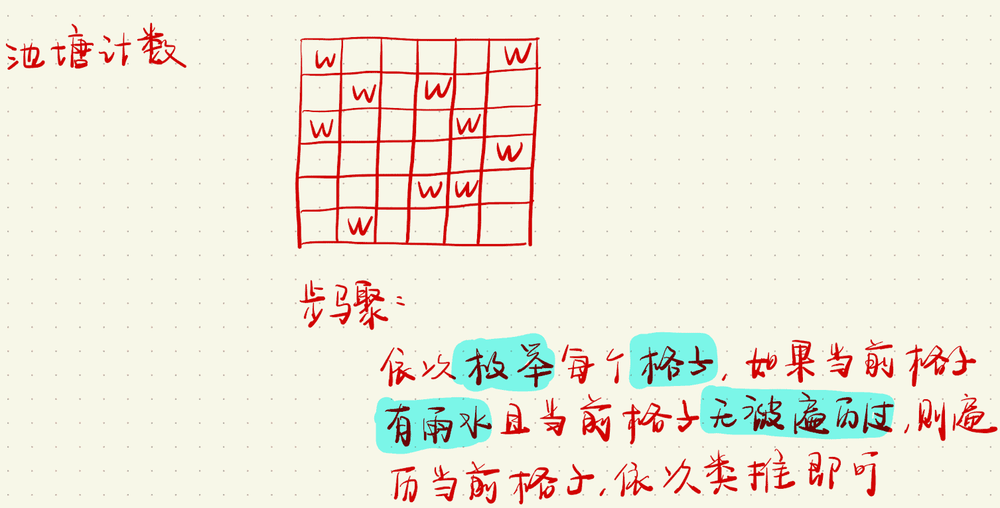

**代ç **

```c++
#include <iostream>
#define x first
#define y second
using namespace std;
typedef pair<int, int> PII;
const int N = 1010, M = N * N;
int n, m;
// 存储æ¯ä¸€ä¸ªç‚¹
PII q[M];
// 存储x的八个方å‘
int dx[8] = {-1, -1, -1, 0, 1, 1, 1, 0};
// 存储y的八个方å‘
int dy[8] = {-1, 0, 1, 1, 1, 0, -1, -1};
char g[N][N];
// st数组ä¿è¯æ¯ä¸ªç‚¹éƒ½åªè¢«éå†ä¸€æ¬¡
int st[N][N];
void bfs(int sx, int sy) {
    int hh = 0, tt = -1;
    q[++ tt] = {sx, sy};
    // 一开始当å‰æ°´æ´¼å·²ç»è¢«è®¿é—®è¿‡
    st[sx][sy] = true;
    while (hh <= tt) {
        PII t = q[hh ++ ];
        for (int i = 0; i < 8; i ++ ) {
            int tx = t.x + dx[i];
            int ty = t.y + dy[i];
            // 如æœæ²¡æœ‰è¶Šç•Œï¼Œå¹¶ä¸”当å‰ç”°åœ°æ˜¯æ°´æ´¼ï¼Œå¹¶ä¸”当å‰ç”°åœ°æ²¡æœ‰è¢«è®¿é—®è¿‡
            if (tx < 0 || tx >= n || ty < 0 || ty >= m || g[tx][ty] == '.' || st[tx][ty])
                continue;
            // 当å‰ç”°åœ°å·²ç»è¢«è®¿é—®è¿‡
            // ä¿è¯æ¯ä¸ªç‚¹éƒ½åªè¢«éå†ä¸€æ¬¡
            st[tx][ty] = true;
            // 入队
            q[++ tt] = {tx, ty};
        }
    }
    return;
}
int main() {
    scanf("%d%d", &n, &m);
    for (int i = 0; i < n; i ++ ) scanf("%s", g[i]);
    int cnt = 0;
    for (int i = 0; i < n; i ++ )
        for (int j = 0; j < m; j ++ )
            // 如æœå½“å‰ä½ç½®ä¸º'W'并且当å‰ä½ç½®æ²¡æœ‰è¢«è®¿é—®è¿‡
            if (g[i][j] == 'W' && !st[i][j]) {
                bfs(i, j);
                // 池塘数é‡++
                cnt ++;
            }
    cout << cnt << endl;
    return 0;
}
```

**时间å¤æ‚度**

$O(nm)$

**空间å¤æ‚度**

$O(n^2)$

**标签**

`宽æœ`ã€`Flood Fill`

**ç¼åˆæ€ª**

#### [AcWing 1098. åŸå ¡é—®é¢˜](https://www.acwing.com/problem/content/1100/)

**题目æè¿°**

>   ```c++
>   1   2   3   4   5   6   7  
>   #############################
>   1 #   |   #   |   #   |   |   #
>   #####---#####---#---#####---#
>   2 #   #   |   #   #   #   #   #
>   #---#####---#####---#####---#
>   3 #   |   |   #   #   #   #   #
>   #---#########---#####---#---#
>   4 #   #   |   |   |   |   #   #
>   #############################
>          (图 1)
>   
>   #  = Wall   
>   |  = No wall
>      -  = No wall
>   
>      æ–¹å‘：上北下å—左西å³ä¸œã€‚
>   ```
>
>   图 `1` 是一个åŸå ¡çš„地形图。
>
>   请你编写一个程åºï¼Œè®¡ç®—åŸå ¡ä¸€å…±æœ‰å¤šå°‘房间，最大的房间有多大。
>
>   åŸå ¡è¢«åˆ†å‰²æˆ `m ∗ n`个方格区域，æ¯ä¸ªæ–¹æ ¼åŒºåŸŸå¯ä»¥æœ‰ `0 ~ 4` é¢å¢™ã€‚
>
>   注æ„：墙体åšåº¦å¿½ç•¥ä¸è®¡ã€‚

**输入格å¼**

>   第一行包å«ä¸¤ä¸ªæ•´æ•° `m` å’Œ `n`，分别表示åŸå ¡å—北方å‘的长度和东西方å‘的长度。
>
>   æ¥ä¸‹æ¥ `m` 行，æ¯è¡ŒåŒ…å« `n` 个整数，æ¯ä¸ªæ•´æ•°éƒ½è¡¨ç¤ºå¹³é¢å›¾å¯¹åº”ä½ç½®çš„æ–¹å—的墙的特å¾ã€‚
>
>   æ¯ä¸ªæ–¹å—中墙的特å¾ç”±æ•°å­— `P` æ¥æ述，我们用 `1` 表示西墙，`2` 表示北墙，`4` 表示东墙，`8` 表示å—墙，`P` 为该方å—包å«å¢™çš„数字之和。
>
>   例如，如æœä¸€ä¸ªæ–¹å—çš„ `P` 为 `3`，则 `3 = 1 + 2`，该方å—包å«è¥¿å¢™å’ŒåŒ—墙。
>
>   åŸå ¡çš„内墙被计算两次，方å—`(1,1)`çš„å—墙åŒæ—¶ä¹Ÿæ˜¯æ–¹å—`(2,1)`的北墙。
>
>   输入的数æ®ä¿è¯åŸå ¡è‡³å°‘有两个房间。

**输出格å¼**

>   共两行，第一行输出房间总数，第二行输出最大房间的é¢ç§¯ï¼ˆæ–¹å—数）。

**æ•°æ®èŒƒå›´**

>   +   $1≤m,n≤50,$
>   +   $0≤P≤15$

**输入样例**

```c++
4 7 
11 6 11 6 3 10 6 
7 9 6 13 5 15 5 
1 10 12 7 13 7 5 
13 11 10 8 10 12 13 
```

**输出样例**

```c++
5
9
```

**手写稿**


**代ç **

```c++
#include <iostream>
#define x first
#define y second
using namespace std;
typedef pair<int, int> PII;
const int N = 55, M = N * N;
int n, m;
// 注æ„：此处设置的方å‘è¦å’Œé¢˜ç›®ä¸­çš„一致ã€æ‰‹å†™ç¨¿æœ‰è¯´æ˜ã€‘
int dx[4] = {0, -1, 0, 1};
int dy[4] = {-1, 0, 1, 0};
PII q[M];
int g[N][N], st[N][N];
int bfs(int sx, int sy) {
    // æ–¹å—çš„æ•°é‡
    int area = 0;
    int hh = 0, tt = -1;
    q[++ tt] = {sx, sy};
    st[sx][sy] = true;
    while (hh <= tt) {
        PII t = q[hh ++];
        area ++;
        // æšä¸¾å››ä¸ªæ–¹å‘
        for (int i = 0; i < 4; i ++ ) {
            int tx = t.x + dx[i];
            int ty = t.y + dy[i];
            // 判断是å¦è¶Šç•Œä»¥åŠæ˜¯å¦å·²ç»è¢«è®¿é—®è¿‡
            if (tx < 0 || tx >= n || ty < 0 || ty >= m || st[tx][ty]) continue;
            // 判断是å¦æœ‰å¢™
            if (g[t.x][t.y] >> i & 1) continue;
            q[++ tt] = {tx, ty};
            // 放置æŸä¸ªç‚¹è¢«é‡å¤åŠ å…¥
            // ä¿è¯æ¯ä¸ªç‚¹åªè¢«éå†ä¸€æ¬¡
            st[tx][ty] = true;
        }
    }
    return area;
}
int main() {
    scanf("%d%d", &n, &m);
    for (int i = 0; i < n; i ++ )
        for (int j = 0; j < m; j ++ )
            scanf("%d", &g[i][j]);
    int cnt = 0, area = 0;
    for (int i = 0; i < n; i ++ )
        for (int j = 0; j < m; j ++ )
            if (!st[i][j]) {
                area = max(area, bfs(i, j));
                cnt ++;
            }
    cout << cnt << endl << area << endl;
    return 0;
}
```

**时间å¤æ‚度**

$O(nm)$

**空间å¤æ‚度**

$O(nm)$

**标签**

`Flood Fill`

**ç¼åˆæ€ª**

#### [AcWing 1106. 山峰和山谷](https://www.acwing.com/problem/content/1108/)

**题目æè¿°**

>   `FGD`å°æœ‹å‹ç‰¹åˆ«å–œæ¬¢çˆ¬å±±ï¼Œåœ¨çˆ¬å±±çš„时候他就在研究山峰和山谷。
>
>   为了能够对旅程有一个安æ’，他想知é“山峰和山谷的数é‡ã€‚
>
>   给定一个地图，为 `FGD` 想è¦æ—…行的区域，地图被分为 `n × n` 的网格，æ¯ä¸ªæ ¼å­ `(i,j)` 的高度 `w(i,j)` 是给定的。
>
>   若两个格å­æœ‰å…¬å…±é¡¶ç‚¹ï¼Œé‚£ä¹ˆå®ƒä»¬å°±æ˜¯ç›¸é‚»çš„æ ¼å­ï¼Œå¦‚ä¸ `(i,j)` 相邻的格å­æœ‰`(i−1,j−1),(i−1,j),(i−1,j+1),(i,j−1),(i,j+1),(i+1,j−1),(i+1,j),(i+1,j+1)`。
>
>   我们定义一个格å­çš„é›†åˆ `S` 为山峰（山谷）当且仅当：
>
>   1.  `S` 的所有格å­éƒ½æœ‰ç›¸åŒçš„高度。
>   2.  `S` 的所有格å­éƒ½è¿é€šã€‚
>   3.  å¯¹äº `s` å±äº `S`ï¼Œä¸ `s` 相邻的 `s′` ä¸å±äº `S`，都有 $w_s>w_{s′}$（山峰），或者 $w_s<w_{s′}$（山谷）。
>   4.  如æœå‘¨å›´ä¸å­˜åœ¨ç›¸é‚»åŒºåŸŸï¼Œåˆ™åŒæ—¶å°†å…¶è§†ä¸ºå±±å³°å’Œå±±è°·ã€‚
>
>   你的任务是，对äºç»™å®šçš„地图，求出山峰和山谷的数é‡ï¼Œå¦‚æœæ‰€æœ‰æ ¼å­éƒ½æœ‰ç›¸åŒçš„高度，那么整个地图å³æ˜¯å±±å³°ï¼Œåˆæ˜¯å±±è°·ã€‚

**输入格å¼**

>   第一行包å«ä¸€ä¸ªæ­£æ•´æ•° `n`，表示地图的大å°ã€‚
>
>   æ¥ä¸‹æ¥ä¸€ä¸ª `n × n` 的矩阵，表示地图上æ¯ä¸ªæ ¼å­çš„高度 `w`。

**输出格å¼**

>   共一行，包å«ä¸¤ä¸ªæ•´æ•°ï¼Œè¡¨ç¤ºå±±å³°å’Œå±±è°·çš„æ•°é‡ã€‚

**æ•°æ®èŒƒå›´**

>   +   $1≤n≤1000,$
>   +   $0≤w≤10^9$

**输入样例1**

```c++
5
8 8 8 7 7
7 7 8 8 7
7 7 7 7 7
7 8 8 7 8
7 8 8 8 8
```

**输出样例1**

```c++
2 1
```

**输入样例2**

```c++
5
5 7 8 3 1
5 5 7 6 6
6 6 6 2 8
5 7 2 5 8
7 1 0 1 7
```

**输出样例2**

```c++
3 3
```

**样例解释**

>   样例1：
>
>   
>
>   样例2：
>
>   

**手写稿**


**代ç **

```c++
#include <iostream>
#define x first
#define y second
using namespace std;
typedef pair<int, int> PII;
const int N = 1010, M = N * N;
int n;
int dx[8] = {-1, -1, -1, 0, 1, 1, 1, 0};
int dy[8] = {-1, 0, 1, 1, 1, 0, -1, -1};
PII q[M];
int g[N][N], st[N][N];
void bfs(int sx, int sy, bool &is_peak, bool &is_valley) {
    int hh = 0, tt = -1;
    q[++ tt] = {sx, sy};
    st[sx][sy] = true;
    while (hh <= tt) {
        PII t = q[hh ++ ];
        // éå†8个方å‘
        for (int i = 0; i < 8; i ++ ) {
            int tx = t.x + dx[i];
            int ty = t.y + dy[i];
            // 注æ„：这里ä¸èƒ½æ·»åŠ æ­¤æ¡ä»¶st[tx][ty]
            // åŸå› ï¼šéœ€è¦åˆ¤æ–­å½“å‰ç‚¹ä¸å‘¨å›´ç‚¹çš„高度，用以判断是å¦æ˜¯å±±å³°è¿˜æ˜¯å±±è°·
            if (tx < 0 || tx >= n || ty < 0 || ty >= n) continue;
            // 如æœå½“å‰ç‚¹å’Œå‘¨å›´ç‚¹é«˜åº¦ä¸ç›¸ç­‰
            if (g[t.x][t.y] != g[tx][ty]) {
                // 如æœå½“å‰ç‚¹æ¯”周围点高，则当å‰ç‚¹ä¸€å®šä¸æ˜¯å±±è°·
                if (g[t.x][t.y] > g[tx][ty]) is_valley = false;
                // 如æœå½“å‰ç‚¹æ¯”周围点ä½ï¼Œåˆ™å½“å‰ç‚¹ä¸€å®šä¸æ˜¯å±±å³°
                else is_peak = false;
            }
            // 在此处进行判断st[tx][ty]这个æ¡ä»¶
            // 如æœå½“å‰ç‚¹æ²¡æœ‰è¢«è®¿é—®è¿‡ï¼Œåˆ™åŠ å…¥å½“å‰ç‚¹ï¼Œå¹¶æ ‡è®°ä¸ºå·²è®¿é—®è¿‡
            else if (!st[tx][ty]) {
                q[++ tt] = {tx, ty};
                st[tx][ty] = true;
            }
        }
    }
    return;
}
int main() {
    scanf("%d", &n);
    for (int i = 0; i < n; i ++ )
        for (int j = 0; j < n; j ++ )
            scanf("%d", &g[i][j]);
    // 定义山峰和山谷的数é‡
    int peak = 0, valley = 0;
    for (int i = 0; i < n; i ++ )
        for (int j = 0; j < n; j ++ )
            if (!st[i][j]) {
                // åˆå§‹å‡è®¾å³æ˜¯å±±å³°åˆæ˜¯å±±è°·
                bool is_peak = true, is_valley = true;
                bfs(i, j, is_peak, is_valley);
                // 如æœæ˜¯å±±å³°
                if (is_peak) peak ++;
                // 如æœæ˜¯å±±è°·
                if (is_valley) valley ++;
            }
    cout << peak << " " << valley << endl;
    return 0;
}
```

**时间å¤æ‚度**

$O(n^2)$

**空间å¤æ‚度**

$O(n^2)$

**标签**

`Flood Fill`

**ç¼åˆæ€ª**


### 最短路模å‹

#### [AcWing 1076. 迷宫问题](https://www.acwing.com/problem/content/1078/)

**题目æè¿°**

>   给定一个 `n × n` 的二维数组，如下所示：
>
>   ```c++
>   int maze[5][5] = {
>   
>   0, 1, 0, 0, 0,
>   
>   0, 1, 0, 1, 0,
>   
>   0, 0, 0, 0, 0,
>   
>   0, 1, 1, 1, 0,
>   
>   0, 0, 0, 1, 0,
>   
>   };
>   ```
>
>   它表示一个迷宫，其中的`1`表示墙å£ï¼Œ`0`表示å¯ä»¥èµ°çš„路，åªèƒ½æ¨ªç€èµ°æˆ–ç«–ç€èµ°ï¼Œä¸èƒ½æ–œç€èµ°ï¼Œè¦æ±‚编程åºæ‰¾å‡ºä»å·¦ä¸Šè§’到å³ä¸‹è§’的最短路线。
>
>   æ•°æ®ä¿è¯è‡³å°‘存在一æ¡ä»å·¦ä¸Šè§’走到å³ä¸‹è§’的路径。

**输入格å¼**

>   第一行包å«æ•´æ•° `n`。
>
>   æ¥ä¸‹æ¥ `n` 行，æ¯è¡ŒåŒ…å« `n` 个整数 `0` 或 `1`，表示迷宫。

**输出格å¼**

>   输出ä»å·¦ä¸Šè§’到å³ä¸‹è§’的最短路线，如æœç­”案ä¸å”¯ä¸€ï¼Œè¾“出任æ„一æ¡è·¯å¾„å‡å¯ã€‚
>
>   按顺åºï¼Œæ¯è¡Œè¾“出一个路径中ç»è¿‡çš„å•å…ƒæ ¼çš„å标，左上角å标为 `(0,0)`，å³ä¸‹è§’å标为 `(n−1,n−1)`。

**æ•°æ®èŒƒå›´**

>   +   $0≤n≤1000$

**输入样例**

```c++
5
0 1 0 0 0
0 1 0 1 0
0 0 0 0 0
0 1 1 1 0
0 0 0 1 0
```

**输出样例**

```c++
0 0
1 0
2 0
2 1
2 2
2 3
2 4
3 4
4 4
```

**手写稿**


**代ç **

```c++
#include <iostream>
#define x first
#define y second
using namespace std;
typedef pair<int, int> PII;
const int N = 1010, M = N * N;
int n;
int dx[4] = {1, -1, 0, 0};
int dy[4] = {0, 0, -1, 1};
PII q[M];
// st判é‡æ•°ç»„，ä¿è¯å®½æœçš„时候æ¯ä¸ªæ•°æ®åªè¿›ä¸€æ¬¡é˜Ÿåˆ—
int g[N][N], st[N][N];
// 记录æŸä¸ªç‚¹ä»å“ªä¸ªç‚¹è½¬ç§»è¿‡æ¥çš„，使用pair数组记录
PII pre[N][N];
// 宽æœæ¨¡æ¿
void bfs(int sx, int sy) {
    int hh = 0, tt = -1;
    q[++ tt] = {sx, sy};
    st[sx][sy] = true;
    pre[sx][sy] = {0, 0};
    while (hh <= tt) {
        PII t = q[hh ++ ];
        for (int i = 0; i < 4; i ++ ) {
            int tx = t.x + dx[i];
            int ty = t.y + dy[i];
            if (tx < 0 || tx >= n || ty < 0 || ty >= n || g[tx][ty] || st[tx][ty])
                continue;
            q[++ tt] = {tx, ty};
            st[tx][ty] = true;
            pre[tx][ty] = {t.x, t.y};
        }
    }
    return;
}
int main() {
    scanf("%d", &n);
    for (int i = 0; i < n; i ++ )
        for (int j = 0; j < n; j ++ )
            scanf("%d", &g[i][j]);
    bfs(n - 1, n - 1);
    // åˆå§‹å€¼
    PII end(0, 0);
    while (true) {
        cout << end.x << " " << end.y << endl;
        // 如æœå·²ç»åˆ°è¾¾ç»ˆç‚¹ï¼Œåˆ™ç»“æŸ
        if (end.x == n - 1 && end.y == n - 1) break;
        // å¦åˆ™ï¼Œè®°å½•å‰é©±å€¼
        end = pre[end.x][end.y];
    }
    return 0;
}
```

**时间å¤æ‚度**

$O(n^2)$

**空间å¤æ‚度**

$O(n^2)$

**标签**

`宽度优先æœç´¢`

**ç¼åˆæ€ª**

#### [AcWing 188. 武士é£åº¦çš„牛](https://www.acwing.com/problem/content/190/)

**题目æè¿°**

>   农民 `John` 有很多牛，他想交易其中一头被 `Don` 称为 `The Knight` 的牛。
>
>   è¿™å¤´ç‰›æœ‰ä¸€ä¸ªç‹¬ä¸€æ— äºŒçš„è¶…èƒ½åŠ›ï¼Œåœ¨å†œåœºé‡Œåƒ `Knight` 一样地跳（就是我们熟悉的象棋中马的走法）。
>
>   虽然这头ç¥å¥‡çš„牛ä¸èƒ½è·³åˆ°æ ‘上和石头上，但是它å¯ä»¥åœ¨ç‰§åœºä¸Šéšæ„跳，我们把牧场用一个 `x，y` çš„å标图æ¥è¡¨ç¤ºã€‚
>
>   这头ç¥å¥‡çš„牛åƒå…¶å®ƒç‰›ä¸€æ ·å–œæ¬¢åƒè‰ï¼Œç»™ä½ ä¸€å¼ åœ°å›¾ï¼Œä¸Šé¢æ ‡æ³¨äº† `The Knight` 的开始ä½ç½®ï¼Œæ ‘ã€çŒæœ¨ã€çŸ³å¤´ä»¥åŠå…¶å®ƒéšœç¢çš„ä½ç½®ï¼Œé™¤æ­¤ä¹‹å¤–还有一æ†è‰ã€‚
>
>   ç°åœ¨ä½ çš„任务是，确定 `The Knight` è¦æƒ³åƒåˆ°è‰ï¼Œè‡³å°‘需è¦è·³å¤šå°‘次。
>
>   `The Knight` çš„ä½ç½®ç”¨ `K` æ¥æ ‡è®°ï¼Œéšœç¢çš„ä½ç½®ç”¨ `*` æ¥æ ‡è®°ï¼Œè‰çš„ä½ç½®ç”¨ `H` æ¥æ ‡è®°ã€‚
>
>   这里有一个地图的例å­ï¼š
>
>   ```c++
>            11 | . . . . . . . . . .
>            10 | . . . . * . . . . . 
>             9 | . . . . . . . . . . 
>             8 | . . . * . * . . . . 
>             7 | . . . . . . . * . . 
>             6 | . . * . . * . . . H 
>             5 | * . . . . . . . . . 
>             4 | . . . * . . . * . . 
>             3 | . K . . . . . . . . 
>             2 | . . . * . . . . . * 
>             1 | . . * . . . . * . . 
>             0 ----------------------
>                                   1 
>               0 1 2 3 4 5 6 7 8 9 0 
>   ```
>
>   `The Knight` å¯ä»¥æŒ‰ç…§ä¸‹å›¾ä¸­çš„ `A,B,C,D…` è¿™æ¡è·¯å¾„用 `5` 次跳到è‰çš„地方（有å¯èƒ½å…¶å®ƒè·¯çº¿çš„长度也是 `5`）：
>
>   ```c++
>            11 | . . . . . . . . . .
>            10 | . . . . * . . . . .
>             9 | . . . . . . . . . .
>             8 | . . . * . * . . . .
>             7 | . . . . . . . * . .
>             6 | . . * . . * . . . F<
>             5 | * . B . . . . . . .
>             4 | . . . * C . . * E .
>             3 | .>A . . . . D . . .
>             2 | . . . * . . . . . *
>             1 | . . * . . . . * . .
>             0 ----------------------
>                                   1
>               0 1 2 3 4 5 6 7 8 9 0
>   ```
>
>   **注æ„：** æ•°æ®ä¿è¯ä¸€å®šæœ‰è§£ã€‚

**输入格å¼**

>   第 `1` 行： 两个数，表示农场的列数 `C` 和行数 `R`。
>
>   第 `2..R+1` è¡Œ: æ¯è¡Œä¸€ä¸ªç”± `C` 个字符组æˆçš„字符串，共åŒæ绘出牧场地图。

**输出格å¼**

>   一个整数，表示跳跃的最å°æ¬¡æ•°ã€‚

**æ•°æ®èŒƒå›´**

>   +   $1≤R,C≤150$

**输入样例**

```c++
10 11
..........
....*.....
..........
...*.*....
.......*..
..*..*...H
*.........
...*...*..
.K........
...*.....*
..*....*..
```

**输出样例**

```c++
5
```

**手写稿**

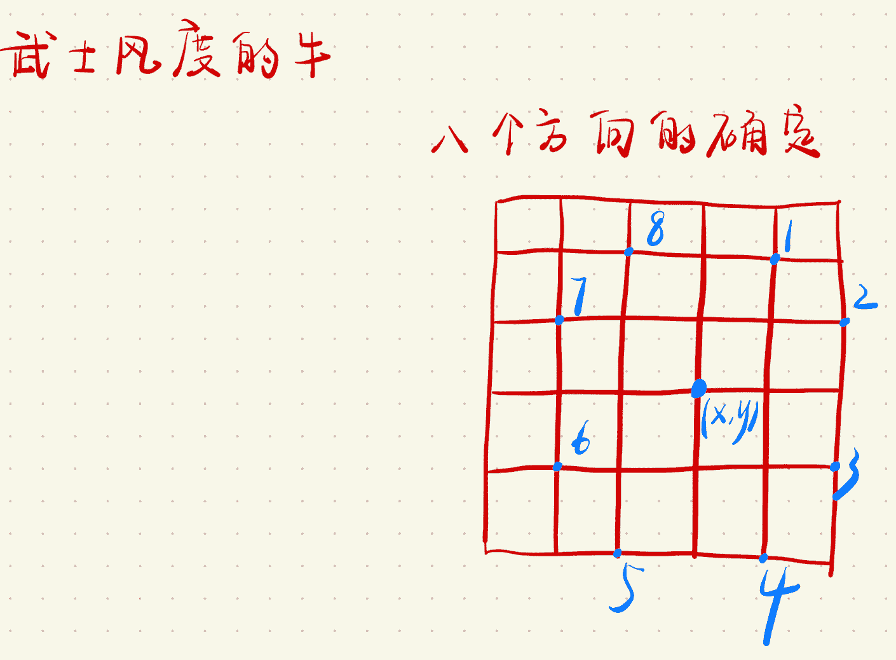

**代ç **

```c++
#include <iostream>
#define x first
#define y second
using namespace std;
const int N = 155, M = N * N;
typedef pair<int, int> PII;
int n, m;
int dx[8] = {-2, -1, 1, 2, 2, 1, -1, -2};
int dy[8] = {1, 2, 2, 1, -1, -2, -2, -1};
PII q[M];
int st[N][N], dist[N][N];
char g[N][N];
// bfs模æ¿
int bfs() {
    int sx = -1, sy = -1;
    // 找起始点
    for (int i = 0; i < n; i ++ ) {
        for (int j = 0; j < m; j ++ )
            if (g[i][j] == 'K') {
                sx = i, sy = j;
                break;
            }
        if (sx != -1 && sy != -1) break;
    }
    int hh = 0, tt = -1;
    q[++ tt] = {sx, sy};
    st[sx][sy] = true;
    while (hh <= tt) {
        auto t = q[hh ++ ];
        for (int i = 0; i < 8; i ++ ) {
            int tx = t.x + dx[i];
            int ty = t.y + dy[i];
            if (tx < 0 || tx >= n || ty < 0 || ty >= m || st[tx][ty] || g[tx][ty] == '*')
                continue;
            q[++ tt] = {tx, ty};
            // 将当å‰ç‚¹æ ‡è®°ä¸ºå·²ç»è¢«è®¿é—®è¿‡
            st[tx][ty] = true;
            // è·ç¦» â• 1 
            dist[tx][ty] = dist[t.x][t.y] + 1;
            // 如æœåˆ°è¾¾ç»ˆç‚¹ï¼Œåˆ™ç›´æ¥è¿”å›
            if (g[tx][ty] == 'H') return dist[tx][ty];
        }
    }
    return -1;
}
int main() {
    scanf("%d%d", &m, &n);
    for (int i = 0; i < n; i ++ ) scanf("%s", g[i]);
    cout << bfs() << endl;
    return 0;
}
```

**时间å¤æ‚度**

$O(n^2)$

**空间å¤æ‚度**

$O(n^2)$

**标签**

`宽度优先æœç´¢`

**ç¼åˆæ€ª**

#### [AcWing 1100. 抓ä½é‚£å¤´ç‰›](https://www.acwing.com/problem/content/1102/)

>   农夫知é“一头牛的ä½ç½®ï¼Œæƒ³è¦æŠ“ä½å®ƒã€‚
>
>   农夫和牛都ä½äºæ•°è½´ä¸Šï¼Œå†œå¤«èµ·å§‹ä½äºç‚¹ `N`，牛ä½äºç‚¹ `K`。
>
>   农夫有两ç§ç§»åŠ¨æ–¹å¼ï¼š
>
>   1.  ä» `X` 移动到 `X−1` 或 `X+1`，æ¯æ¬¡ç§»åŠ¨èŠ±è´¹ä¸€åˆ†é’Ÿ
>   2.  ä» `X` 移动到 `2∗X`，æ¯æ¬¡ç§»åŠ¨èŠ±è´¹ä¸€åˆ†é’Ÿ
>
>   å‡è®¾ç‰›æ²¡æœ‰æ„识到农夫的行动，站在åŸåœ°ä¸åŠ¨ã€‚
>
>   农夫最少è¦èŠ±å¤šå°‘时间æ‰èƒ½æŠ“ä½ç‰›ï¼Ÿ

**输入格å¼**

>   共一行，包å«ä¸¤ä¸ªæ•´æ•°`N`å’Œ`K`。

**输出格å¼**

>   输出一个整数，表示抓到牛所花费的最少时间。

**æ•°æ®èŒƒå›´**

>   +   $0≤N,K≤10^5$

**输入样例**

```c++
5 17
```

**输出样例**

```c++
4
```

**手写稿**

>   1.   裸的广æœ
>   2.   éå†ä¸‰ç§èµ°è·¯çš„æ–¹å¼å³å¯

**代ç **

```c++
#include <iostream>
using namespace std;
const int N = 1e5 + 10;
int n, m;
int q[N], st[N], dist[N];
int bfs() {
    int hh = 0, tt = -1;
    q[++ tt] = n;
    st[n] = true;
    while (hh <= tt) {
        int t = q[hh ++ ];
        if (t == m) return dist[t];
        // éå†ä¸‰ç§æ–¹å¼
        if (t - 1 >= 0 && !st[t - 1]) {
            st[t - 1] = true;
            dist[t - 1] = dist[t] + 1;
            q[++ tt] = t - 1;
        }
        // 注æ„å°äºç­‰äºN
        if (t + 1 <= N && !st[t + 1]) {
            st[t + 1] = true;
            dist[t + 1] = dist[t] + 1;
            q[++ tt ] = t + 1;
        }
        // 注æ„å°äºç­‰äºN
        if (t * 2 <= N && !st[t * 2]) {
            st[t * 2] = true;
            dist[t * 2] = dist[t] + 1;
            q[++ tt ] = t * 2;
        }
    }
    return -1;
}
int main() {
    scanf("%d%d", &n, &m);
    cout << bfs() << endl;
    return 0;
}
```

**时间å¤æ‚度**

$O(n^2)$

**空间å¤æ‚度**

$O(n^2)$

**标签**

`宽度优先æœç´¢`

**ç¼åˆæ€ª**


### å¤šæº `BFS` 模å‹

#### [AcWing 173. 矩阵è·ç¦»](https://www.acwing.com/problem/content/175/)

>   给定一个 `N` è¡Œ `M` 列的 `01` 矩阵 `A`，`A[i][j]` ä¸ `A[k][l]` 之间的曼哈顿è·ç¦»å®šä¹‰ä¸ºï¼š
>
>   $dist(A[i][j],A[k][l])=|i−k|+|j−l|$
>
>   输出一个 `N` 行 `M` 列的整数矩阵 `B`，其中：
>
>   $B[i][j]=min_{1≤x≤N,1≤y≤M,A[x][y]=1}dist(A[i][j],A[x][y])$

**输入格å¼**

>   第一行两个整数 `N,M`。
>
>   æ¥ä¸‹æ¥ä¸€ä¸ª `N` è¡Œ `M` 列的 `01` 矩阵，数字之间没有空格。

**输出格å¼**

>   一个 `N` 行 `M` 列的矩阵 `B`，相邻两个整数之间用一个空格隔开。

**æ•°æ®èŒƒå›´**

>   +   $1≤N,M≤1000$

**输入样例**

```c++
3 4
0001
0011
0110
```

**输出样例**

```c++
3 2 1 0
2 1 0 0
1 0 0 1
```

**手写稿**


**代ç **

```c++
#include <iostream>
#include <cstring>
#define x first
#define y second
using namespace std;
typedef pair<int, int> PII;
const int N = 1010, M = N * N;
int n, m;
int dx[] = {1, -1, 0, 0};
int dy[] = {0, 0, -1, 1};
PII q[M];
char g[N][N];
int dist[N][N];
bool st[N][N];
void bfs() {
    memset(dist, -1, sizeof dist);
    int hh = 0, tt = -1;
    // 找出所有æºç‚¹ï¼Œæ‰¾å‡ºæ‰€æœ‰åˆå§‹åŒ–的最短è·ç¦»
    for (int i = 0; i < n; i ++ )
        for (int j = 0; j < m; j ++ )
            if (g[i][j] == '1') {
                // 最短è·ç¦»ä¸º0
                dist[i][j] = 0;
                // 状æ€ä¸ºtrue
                st[i][j] = true;
                // 将当å‰ç‚¹å…¥é˜Ÿ
                q[++ tt] = {i, j};
            }
    while (hh <= tt) {
        auto t = q[hh ++];
        // æšä¸¾å››ä¸ªæ–¹å‘
        for (int i = 0; i < 4; i ++ ) {
            int tx = t.x + dx[i];
            int ty = t.y + dy[i];
            if (tx < 0 || tx >= n || ty < 0 || ty >= m || st[tx][ty]) continue;
            st[tx][ty] = true;
            // è·ç¦» â• 1
            dist[tx][ty] = dist[t.x][t.y] + 1;
            q[++ tt] = {tx, ty};
        }
    }
    return;
}
int main() {
    scanf("%d%d", &n, &m);
    for (int i = 0; i < n; i ++ ) scanf("%s", g[i]);
    bfs();
    for (int i = 0; i < n; i ++ ) {
        for (int j = 0; j < m; j ++ ) 
            printf("%d ", dist[i][j]);
        cout << endl;
    }
    return 0;
}
```

**时间å¤æ‚度**

$O(n^2)$

**空间å¤æ‚度**

$O(n^2)$

**标签**

`多æºBFS`

**ç¼åˆæ€ª**


### 最å°æ­¥æ•°æ¨¡å‹

#### [AcWing 845. å…«æ•°ç ](https://www.acwing.com/problem/content/847/)

**题目æè¿°**

>   在一个 `3 × 3` 的网格中，`1 ∼ 8` è¿™ `8` 个数字和一个 `x` æ°å¥½ä¸é‡ä¸æ¼åœ°åˆ†å¸ƒåœ¨è¿™ `3 × 3` 的网格中。
>
>   例如：
>
>   ```c++
>   1 2 3
>   x 4 6
>   7 5 8
>   ```
>
>   在游æˆè¿‡ç¨‹ä¸­ï¼Œå¯ä»¥æŠŠ `x` ä¸å…¶ä¸Šã€ä¸‹ã€å·¦ã€å³å››ä¸ªæ–¹å‘之一的数字交æ¢ï¼ˆå¦‚æœå­˜åœ¨ï¼‰ã€‚
>
>   我们的目的是通过交æ¢ï¼Œä½¿å¾—网格å˜ä¸ºå¦‚下æ’列（称为正确æ’列）：
>
>   ```c++
>   1 2 3
>   4 5 6
>   7 8 x
>   ```
>
>   例如，示例中图形就å¯ä»¥é€šè¿‡è®© `x` å…ˆåä¸å³ã€ä¸‹ã€å³ä¸‰ä¸ªæ–¹å‘的数字交æ¢æˆåŠŸå¾—到正确æ’列。
>
>   交æ¢è¿‡ç¨‹å¦‚下：
>
>   ```c++
>   1 2 3   1 2 3   1 2 3   1 2 3
>   x 4 6   4 x 6   4 5 6   4 5 6
>   7 5 8   7 5 8   7 x 8   7 8 x
>   ```
>
>   ç°åœ¨ï¼Œç»™ä½ ä¸€ä¸ªåˆå§‹ç½‘格，请你求出得到正确æ’列至少需è¦è¿›è¡Œå¤šå°‘次交æ¢ã€‚

**输入格å¼**

>   输入å ä¸€è¡Œï¼Œå°† `3 × 3` çš„åˆå§‹ç½‘æ ¼æ绘出æ¥ã€‚
>
>   例如，如æœåˆå§‹ç½‘格如下所示：
>
>   ```c++
>   1 2 3
>   x 4 6
>   7 5 8
>   ```
>
>   则输入为：`1 2 3 x 4 6 7 5 8`

**输出格å¼**

>   输出å ä¸€è¡Œï¼ŒåŒ…å«ä¸€ä¸ªæ•´æ•°ï¼Œè¡¨ç¤ºæœ€å°‘交æ¢æ¬¡æ•°ã€‚
>
>   如æœä¸å­˜åœ¨è§£å†³æ–¹æ¡ˆï¼Œåˆ™è¾“出 `−1`。

**输入样例**

```c++
2  3  4  1  5  x  7  6  8
```

**输出样例**

```c++
19
```

**手写稿**

> 1. 模æ¿é¢˜, 顺ç€å››ä¸ªæ–¹å‘æœç´¢å³å¯

**代ç **

```c++
#include <iostream>
#include <queue>
#include <unordered_map>
using namespace std;
int dx[4] = {-1, 0, 1, 0};
int dy[4] = {0, 1, 0, -1};
queue<string> q;
unordered_map<string, int> dist;
int bfs(string start) {
    string end = "12345678x";
    dist[start] = 0;
    q.push(start);
    while (q.size()) {
        string t = q.front(); q.pop();
        if (t == end) return dist[t];
        // 找到xçš„ä½ç½®
        int k = t.find('x');
        // å°†xçš„ä½ç½®å˜æˆå标形å¼
        int x = k / 3, y = k % 3;
        // éå†å››ä¸ªæ–¹å‘
        for (int i = 0; i < 4; i ++ ) {
            string tmp = t;
            int tx = x + dx[i];
            int ty = y + dy[i];
            // 越界
            if (tx < 0 || tx >= 3 || ty < 0 || ty >= 3)
                continue;
            // 交æ¢å€¼
            swap(tmp[k], tmp[tx * 3 + ty]);
            // 如æœtmpå·²ç»è¢«è®¿é—®è¿‡, ç›´æ¥è¿”å›
            if (dist.count(tmp)) continue;
            // æ›´æ–°è·ç¦»
            dist[tmp] = dist[t] + 1;
            // 入队
            q.push(tmp);
        }
    }
    return -1;
}
int main() {
    char c;
    string start;
    while (cin >> c) start += c;
    cout << bfs(start) << endl;
    return 0;
}
```

**时间å¤æ‚度**

$O(指数级别)$

**空间å¤æ‚度**

$O(指数级别)$

**标签**

`BFS`ã€`最å°æ­¥æ•°æ¨¡å‹`

**ç¼åˆæ€ª**


#### [AcWing 1107. é­”æ¿](https://www.acwing.com/problem/content/1109/)

**题目æè¿°**

>   `Rubik` 先生在å‘æ˜äº†é£é¡å…¨çƒçš„魔方之å，åˆå‘æ˜äº†å®ƒçš„二维版本——魔æ¿ã€‚
>
>   这是一张有 `8` 个大å°ç›¸åŒçš„æ ¼å­çš„é­”æ¿ï¼š
>
>   ```c++
>   1 2 3 4
>   8 7 6 5
>   ```
>
>   我们知é“é­”æ¿çš„æ¯ä¸€ä¸ªæ–¹æ ¼éƒ½æœ‰ä¸€ç§é¢œè‰²ã€‚
>
>   è¿™ `8` ç§é¢œè‰²ç”¨å‰ `8` 个正整数æ¥è¡¨ç¤ºã€‚
>
>   å¯ä»¥ç”¨é¢œè‰²çš„åºåˆ—æ¥è¡¨ç¤ºä¸€ç§é­”æ¿çŠ¶æ€ï¼Œè§„定ä»é­”æ¿çš„左上角开始，沿顺时针方å‘ä¾æ¬¡å–出整数，æ„æˆä¸€ä¸ªé¢œè‰²åºåˆ—。
>
>   对äºä¸Šå›¾çš„é­”æ¿çŠ¶æ€ï¼Œæˆ‘们用åºåˆ— `(1,2,3,4,5,6,7,8)` æ¥è¡¨ç¤ºï¼Œè¿™æ˜¯åŸºæœ¬çŠ¶æ€ã€‚
>
>   这里æ供三ç§åŸºæœ¬æ“ä½œï¼Œåˆ†åˆ«ç”¨å¤§å†™å­—æ¯ `A`，`B`，`C` æ¥è¡¨ç¤ºï¼ˆå¯ä»¥é€šè¿‡è¿™äº›æ“作改å˜é­”æ¿çš„状æ€ï¼‰ï¼š
>
>   `A`：交æ¢ä¸Šä¸‹ä¸¤è¡Œï¼›
>   `B`：将最å³è¾¹çš„一列æ’入到最左边；
>   `C`：魔æ¿ä¸­å¤®å¯¹çš„4个数作顺时针旋转。
>
>   下é¢æ˜¯å¯¹åŸºæœ¬çŠ¶æ€è¿›è¡Œæ“作的示范：
>
>   `A`：
>
>   ```c++
>   8 7 6 5
>   1 2 3 4
>   ```
>
>   `B`：
>
>   ```c++
>   4 1 2 3
>   5 8 7 6
>   ```
>
>   `C`：
>
>   ```c++
>   1 7 2 4
>   8 6 3 5
>   ```
>
>   对äºæ¯ç§å¯èƒ½çš„状æ€ï¼Œè¿™ä¸‰ç§åŸºæœ¬æ“作都å¯ä»¥ä½¿ç”¨ã€‚
>
>   ä½ è¦ç¼–程计算用最少的基本æ“作完æˆåŸºæœ¬çŠ¶æ€åˆ°ç‰¹æ®ŠçŠ¶æ€çš„转æ¢ï¼Œè¾“出基本æ“作åºåˆ—。
>
>   **注æ„**：数æ®ä¿è¯ä¸€å®šæœ‰è§£ã€‚

**输入格å¼**

>   输入仅一行，包括 `8` 个整数，用空格分开，表示目标状æ€ã€‚

**输出格å¼**

>   输出文件的第一行包括一个整数，表示最短æ“作åºåˆ—的长度。
>
>   如æœæ“作åºåˆ—的长度大äº`0`，则在第二行输出字典åºæœ€å°çš„æ“作åºåˆ—。

**æ•°æ®èŒƒå›´**

>   输入数æ®ä¸­çš„所有数字å‡ä¸º `1` 到 `8` 之间的整数。

**输入样例**

```c++
2 6 8 4 5 7 3 1
```

**输出样例**

```c++
7
BCABCCB
```

**手写稿**


**代ç **

```c++
#include <iostream>
#include <unordered_map>
#include <algorithm>
#include <queue>
using namespace std;
char g[2][4];
queue<string> q;
unordered_map<string, int> dist;
unordered_map<string, bool> st;
unordered_map<string, pair<string, char>> pre;
void set(string state) { // 将字符串å˜æˆå­—符矩阵
    for (int i = 0; i < 4; i ++ ) g[0][i] = state[i];
    for (int i = 0; i < 4; i ++ ) g[1][i] = state[7 - i];
    return;
}
string get() { // 将字符矩阵å˜æˆå­—符串
    string res = "";
    for (int i = 0; i < 4; i ++ ) res += g[0][i];
    for (int i = 3; i >= 0; i -- ) res += g[1][i];
    return res;
}
string move0(string state) {
    set(state);
    for (int i = 0; i < 4; i ++ ) swap(g[0][i], g[1][i]);
    return get();
}
string move1(string state) {
    set(state);
    char c0 = g[0][3], c1 = g[1][3];
    for (int j = 2; j >= 0; j -- )
        for (int i = 0; i < 2; i ++ )
            g[i][j + 1] = g[i][j];
    g[0][0] = c0;
    g[1][0] = c1;
    return get();
}
string move2(string state) {
    set(state);
    char t = g[0][1];
    g[0][1] = g[1][1];
    g[1][1] = g[1][2];
    g[1][2] = g[0][2];
    g[0][2] = t;
    return get();
}
void bfs(string start, string end) {
    if (start == end) return;
    q.push(start);
    st[start] = true;
    while (q.size()) {
        auto t = q.front(); q.pop();
        string m0 = move0(t);
        string m1 = move1(t);
        string m2 = move2(t);
        // 三ç§æ“作
        for (int i = 0; i < 3; i ++ ) {
            if (i == 0) {
                if (!st.count(m0)) {
                    st[m0] = true;
                    dist[m0] = dist[t] + 1;
                    q.push(m0);
                    // 记录ä»å“ªä¸ªçŠ¶æ€è½¬ç§»è¿‡æ¥çš„，并且记录下是哪个æ“作
                    pre[m0] = {t, 'A'};
                }
                if (m0 == end) return;
            }
            else if (i == 1) {
                if (!st.count(m1)) {
                    st[m1] = true;
                    dist[m1] = dist[t] + 1;
                    q.push(m1);
                    // 记录ä»å“ªä¸ªçŠ¶æ€è½¬ç§»è¿‡æ¥çš„，并且记录下是哪个æ“作
                    pre[m1] = {t, 'B'};
                }
                if (m1 == end) return;
            }
            else {
                if (!st.count(m2)) {
                    st[m2] = true;
                    dist[m2] = dist[t] + 1;
                    q.push(m2);
                    // 记录ä»å“ªä¸ªçŠ¶æ€è½¬ç§»è¿‡æ¥çš„，并且记录下是哪个æ“作
                    pre[m2] = {t, 'C'};
                }
                if (m2 == end) return;
            }
        }
    }
    return;
}
int main() {
    string start, end;
    for (int i = 0, x; i < 8; i ++ ) {
        scanf("%d", &x);
        end += char(x + '0');
    }
    for (int i = 1; i <= 8; i ++ ) start += char(i + '0');
    bfs(start, end);
    // 记录下步数
    // 因为while循ç¯ä¹‹å，end == start
    int step = dist[end];
    cout << step << endl;
    string res;
    while (end != start) {
        // while(true) 中的 if判断应该ä½äºè¿™é‡Œ
        // å¦åˆ™ï¼Œres就会多执行一次+=，就会出错，åŸå› ä¸æ˜
        res += pre[end].second;
        end = pre[end].first;
    }
    // å转
    reverse(res.begin(), res.end());
    if (step) cout << res << endl;
    return 0;
}
```

**时间å¤æ‚度**

$O(n^2)$

**空间å¤æ‚度**

$O(n^2)$

**标签**

`BFS`

**ç¼åˆæ€ª**


### åŒç«¯é˜Ÿåˆ—广æœ

#### [AcWing 175. 电路维修](https://www.acwing.com/problem/content/177/)

**题目æè¿°**

>   达达是æ¥è‡ªå¼‚世界的魔女，她在漫无目的地四处漂æµçš„时候，é‡åˆ°äº†å–„良的少女翰翰，ä»è€Œè¢«æ”¶ç•™åœ¨åœ°çƒä¸Šã€‚
>
>   翰翰的家里有一辆é£è¡Œè½¦ã€‚
>
>   有一天é£è¡Œè½¦çš„电路æ¿çªç„¶å‡ºç°äº†æ•…障，导致无法å¯åŠ¨ã€‚
>
>   电路æ¿çš„整体结æ„是一个 `R` è¡Œ `C` 列的网格（`R,C≤500`），如下图所示。
>
>   
>
>   æ¯ä¸ªæ ¼ç‚¹éƒ½æ˜¯ç”µçº¿çš„æ¥ç‚¹ï¼Œæ¯ä¸ªæ ¼å­éƒ½åŒ…å«ä¸€ä¸ªç”µå­å…ƒä»¶ã€‚
>
>   电å­å…ƒä»¶çš„主è¦éƒ¨åˆ†æ˜¯ä¸€ä¸ªå¯æ—‹è½¬çš„ã€è¿æ¥ä¸€æ¡å¯¹è§’线上的两个æ¥ç‚¹çš„短电缆。
>
>   在旋转之å，它就å¯ä»¥è¿æ¥å¦ä¸€æ¡å¯¹è§’线的两个æ¥ç‚¹ã€‚
>
>   电路æ¿å·¦ä¸Šè§’çš„æ¥ç‚¹æ¥å…¥ç›´æµç”µæºï¼Œå³ä¸‹è§’çš„æ¥ç‚¹æ¥å…¥é£è¡Œè½¦çš„å‘动装置。
>
>   达达å‘ç°å› ä¸ºæŸäº›å…ƒä»¶çš„æ–¹å‘ä¸å°å¿ƒå‘生了改å˜ï¼Œç”µè·¯æ¿å¯èƒ½å¤„äºæ–­è·¯çš„状æ€ã€‚
>
>   她准备通过计算，旋转最少数é‡çš„元件，使电æºä¸å‘动装置通过若干æ¡çŸ­ç¼†ç›¸è¿ã€‚
>
>   ä¸è¿‡ï¼Œç”µè·¯çš„规模å®åœ¨æ˜¯å¤ªå¤§äº†ï¼Œè¾¾è¾¾å¹¶ä¸æ“…长编程，希望你能够帮她解决这个问题。
>
>   **注æ„**：åªèƒ½èµ°æ–œå‘的线段，水平和竖直线段ä¸èƒ½èµ°ã€‚

**输入格å¼**

>   输入文件包å«å¤šç»„测试数æ®ã€‚
>
>   第一行包å«ä¸€ä¸ªæ•´æ•° `T`，表示测试数æ®çš„数目。
>
>   对äºæ¯ç»„测试数æ®ï¼Œç¬¬ä¸€è¡ŒåŒ…å«æ­£æ•´æ•° `R` å’Œ `C`，表示电路æ¿çš„行数和列数。
>
>   之å `R` 行，æ¯è¡Œ `C` 个字符，字符是`"/"`å’Œ`"\"`中的一个，表示标准件的方å‘。

**输出格å¼**

>   对äºæ¯ç»„测试数æ®ï¼Œåœ¨å•ç‹¬çš„一行输出一个正整数，表示所需的最å°æ—‹è½¬æ¬¡æ•°ã€‚
>
>   如æœæ— è®ºæ€æ ·éƒ½ä¸èƒ½ä½¿å¾—电æºå’Œå‘动机之间è¿é€šï¼Œè¾“出 `NO SOLUTION`。

**æ•°æ®èŒƒå›´**

>   +   $1≤R,C≤500,$
>   +   $1≤T≤5$

**输入样例**

```c++
1
3 5
\\/\\
\\///
/\\\\
```

**输出样例**

```c++
1
```

**样例解释**

>   样例的输入对应äºé¢˜ç›®æ述中的情况。
>
>   åªéœ€è¦æŒ‰ç…§ä¸‹é¢çš„æ–¹å¼æ—‹è½¬æ ‡å‡†ä»¶ï¼Œå°±å¯ä»¥ä½¿å¾—电æºå’Œå‘动机之间è¿é€šã€‚
>
>   

**手写稿**


**代ç **

```c++
#include <iostream>
#include <cstring>
#include <deque>
#define x first
#define y second
using namespace std;
typedef pair<int, int> PII;
const int N = 510, M = N * N;
int T, n, m;
int dx[4] = {-1, -1, 1, 1};
int dy[4] = {-1, 1, 1, -1};
int ix[4] = {-1, -1, 0, 0};
int iy[4] = {-1, 0, 0, -1};
// åˆæ³•åºåˆ—的解释ã€æ‰‹å†™ç¨¿ã€‘
char cs[] = "\\/\\/";
char g[N][N];
int dist[N][N], st[N][N];
int bfs() {
    // 多组数æ®
    // æ¯æ¬¡è¿›è¡Œåˆå§‹åŒ–
    memset(dist, 0x3f, sizeof dist);
    memset(st, 0, sizeof st);
    // åŒç«¯é˜Ÿåˆ—
    deque<PII> q;
    q.push_front({0, 0});
    // åˆå§‹åŒ–è·ç¦»
    dist[0][0] = 0;
    while (q.size()) {
        auto t = q.front(); q.pop_front();
        // 若已被访问过
        if (st[t.x][t.y]) continue;
        // 将当å‰ç‚¹æ ‡è®°ä¸ºå·²è¢«è®¿é—®
        st[t.x][t.y] = true;
        // éå†å››ä¸ªæ–¹å‘上的点
        for (int i = 0; i < 4; i ++ ) {
            int tx = t.x + dx[i];
            int ty = t.y + dy[i];
            // 处ç†è¶Šç•Œçš„问题
            if (tx < 0 || tx > n || ty < 0 || ty > m || st[tx][ty]) continue;
            // 由点的å标得到线的åæ ‡
            int ga = t.x + ix[i];
            int gb = t.y + iy[i];
            if (g[ga][gb] != cs[i]) {
                // å–minçš„åŸå› åœ¨ã€æ‰‹å†™ç¨¿ã€‘
                dist[tx][ty] = min(dist[tx][ty], dist[t.x][t.y] + 1);
                q.push_back({tx, ty});
            }
            else {
                dist[tx][ty] = dist[t.x][t.y];
                q.push_front({tx, ty});
            }
            if (tx == n && ty == m) return dist[tx][ty];
        }
    }
    return -1;
}
int main() {
    scanf("%d", &T);
    while (T -- ) {
        scanf("%d%d", &n, &m);
        for (int i = 0; i < n; i ++ ) scanf("%s", g[i]);
        if (n + m & 1) puts("NO SOLUTION");
        else cout << bfs() << endl;
    }
    return 0;
}
```

**时间å¤æ‚度**

$O(n^2)$

**空间å¤æ‚度**

$O(n^2)$

**标签**

`åŒç«¯é˜Ÿåˆ—广æœ`

**ç¼åˆæ€ª**

### åŒå‘广æœ

#### [AcWing 190. 字串å˜æ¢](https://www.acwing.com/problem/content/192/)

**题目æè¿°**

>   已知有两个字串 `A`, `B` åŠä¸€ç»„字串å˜æ¢çš„规则（至多 `6` 个规则）:
>
>   $A_1→B_1$
>
>   $A_2→B_2$
>
>   $…$
>
>   规则的å«ä¹‰ä¸ºï¼šåœ¨ `A` 中的å­ä¸² $A_1$ å¯ä»¥å˜æ¢ä¸º $B_1$ã€$A_2$ å¯ä»¥å˜æ¢ä¸º $B_2…$。
>
>   例如：`A` `ï¼` `abcd` `B` `ï¼` `xyz`
>
>   å˜æ¢è§„则为：
>
>   ```c++
>   abc →→ xu ud →→ y y →→ yz
>   ```
>
>   则此时，`A` å¯ä»¥ç»è¿‡ä¸€ç³»åˆ—çš„å˜æ¢å˜ä¸º `B`，其å˜æ¢çš„过程为：
>
>   ```c++
>   abcd →→ xud →→ xy →→ xyz
>   ```
>
>   共进行了三次å˜æ¢ï¼Œä½¿å¾— `A` å˜æ¢ä¸º `B`。

**输入格å¼**

>   输入格å¼å¦‚下：
>   $$
>   A B \\
>   A_1 B_1 \\
>   A_2 B_2 \\
>   … …
>   $$
>   第一行是两个给定的字符串 `A` 和 `B`。
>
>   æ¥ä¸‹æ¥è‹¥å¹²è¡Œï¼Œæ¯è¡Œæ述一组字串å˜æ¢çš„规则。
>
>   所有字符串长度的上é™ä¸º `20`。

**输出格å¼**

>   若在 `10` æ­¥ï¼ˆåŒ…å« `10` 步）以内能将 `A` å˜æ¢ä¸º `B` ，则输出最少的å˜æ¢æ­¥æ•°ï¼›å¦åˆ™è¾“出 `NO ANSWER!`。

**输入样例**

```c++
abcd xyz
abc xu
ud y
y yz
```

**输出样例**

```c++
3
```

**手写稿**


**代ç **

```c++
#include <iostream>
#include <unordered_map>
#include <queue>
using namespace std;
const int N = 10;
int n;
string A, B;
string a[N], b[N];
queue<string> qa, qb;
unordered_map<string, int> da, db;
int extend(queue<string>& q, unordered_map<string, int>& da, unordered_map<string, int>& db, string a[], string b[]) {
    string t = q.front(); q.pop();
    // æšä¸¾ä»å“ªä¸ªå­—符进行拓展
    for (int i = 0; i < t.size(); i ++ )
        // æšä¸¾è§„则
        for (int j = 0; j < n; j ++ )
            // 如æœå½“å‰ä»i开始拓展，长度为jçš„å•è¯å¯ä»¥è¿›è¡Œæ‹“展
            if (t.substr(i, a[j].size()) == a[j]) {
                // ç¼åˆæ–°å•è¯ï¼Œæ³¨æ„：看仔细了
                string state = t.substr(0, i) + b[j] + t.substr(i + a[j].size());
                // 如æœæ–°å•è¯å·²ç»è¢«db拓展过了，直æ¥è¿”å›ç­”案å³å¯
                if (db.count(state)) return da[t] + 1 + db[state];
                // 如æœæ–°å•è¯å·²ç»è¢«da拓展过了，直æ¥è¿›è¡Œä¸‹ä¸€æ¬¡å¾ªç¯
                if (da.count(state)) continue;
                // æ›´æ–°æ–°å•è¯çš„è·ç¦»
                da[state] = da[t] + 1;
                // 入队
                q.push(state);
            }
    return 11;
}
int bfs(string& A, string& B) {
    // 特判下，如æœA == B，返å›0
    if (A == B) return 0;
    qa.push(A); da[A] = 0;
    qb.push(B); db[B] = 0;
    while (qa.size() && qb.size()) {
        int t = -1;
        // æ¯æ¬¡é€‰æ‹©é˜Ÿåˆ—个数少的进行拓展
        if (qa.size() <= qb.size()) t = extend(qa, da, db, a, b);
        else t = extend(qb, db, da, b, a);
        if (t <= 10) return t;
    }
    return 11;
}
int main() {
    cin >> A >> B;
    while (cin >> a[n] >> b[n]) n ++;
    int t = bfs(A, B);
    if (t > 10) puts("NO ANSWER!");
    else cout << t << endl;
    return 0;
}
```

**时间å¤æ‚度**


**空间å¤æ‚度**


**标签**

`åŒå‘广æœ`

**ç¼åˆæ€ª**


### `A*`

#### åŸç†æ¦‚è¿°

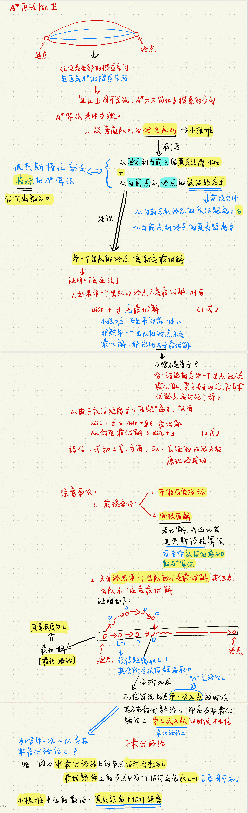


#### [AcWing 179. å…«æ•°ç ](https://www.acwing.com/problem/content/181/)

**题目æè¿°**

>   在一个 `3 × 3` 的网格中，`1∼8` è¿™ `8` 个数字和一个 `X` æ°å¥½ä¸é‡ä¸æ¼åœ°åˆ†å¸ƒåœ¨è¿™ `3 × 3` 的网格中。
>
>   例如：
>
>   ```c++
>   1 2 3
>   X 4 6
>   7 5 8
>   ```
>
>   在游æˆè¿‡ç¨‹ä¸­ï¼Œå¯ä»¥æŠŠ `X` ä¸å…¶ä¸Šã€ä¸‹ã€å·¦ã€å³å››ä¸ªæ–¹å‘之一的数字交æ¢ï¼ˆå¦‚æœå­˜åœ¨ï¼‰ã€‚
>
>   我们的目的是通过交æ¢ï¼Œä½¿å¾—网格å˜ä¸ºå¦‚下æ’列（称为正确æ’列）：
>
>   ```c++
>   1 2 3
>   4 5 6
>   7 8 X
>   ```
>
>   例如，示例中图形就å¯ä»¥é€šè¿‡è®© `X` å…ˆåä¸å³ã€ä¸‹ã€å³ä¸‰ä¸ªæ–¹å‘的数字交æ¢æˆåŠŸå¾—到正确æ’列。
>
>   交æ¢è¿‡ç¨‹å¦‚下：
>
>   ```c++
>   1 2 3   1 2 3   1 2 3   1 2 3
>   X 4 6   4 X 6   4 5 6   4 5 6
>   7 5 8   7 5 8   7 X 8   7 8 X
>   ```
>
>   把 `X` ä¸ä¸Šä¸‹å·¦å³æ–¹å‘数字交æ¢çš„行动记录为 `u`ã€`d`ã€`l`ã€`r`。
>
>   ç°åœ¨ï¼Œç»™ä½ ä¸€ä¸ªåˆå§‹ç½‘格，请你通过最少的移动次数，得到正确æ’列。

**输入格å¼**

>   输入å ä¸€è¡Œï¼Œå°† `3 × 3` çš„åˆå§‹ç½‘æ ¼æ绘出æ¥ã€‚
>
>   例如，如æœåˆå§‹ç½‘格如下所示：
>
>   ```c++
>   1 2 3 
>   x 4 6 
>   7 5 8 
>   ```
>
>   则输入为：`1 2 3 x 4 6 7 5 8`

**输出格å¼**

>   输出å ä¸€è¡Œï¼ŒåŒ…å«ä¸€ä¸ªå­—符串，表示得到正确æ’列的完整行动记录。
>
>   如æœç­”案ä¸å”¯ä¸€ï¼Œè¾“出任æ„一ç§åˆæ³•æ–¹æ¡ˆå³å¯ã€‚
>
>   如æœä¸å­˜åœ¨è§£å†³æ–¹æ¡ˆï¼Œåˆ™è¾“出 `unsolvable`。

**输入样例**

```c++
2  3  4  1  5  x  7  6  8 
```

**输出样例**

```c++
ullddrurdllurdruldr
```

**手写稿**

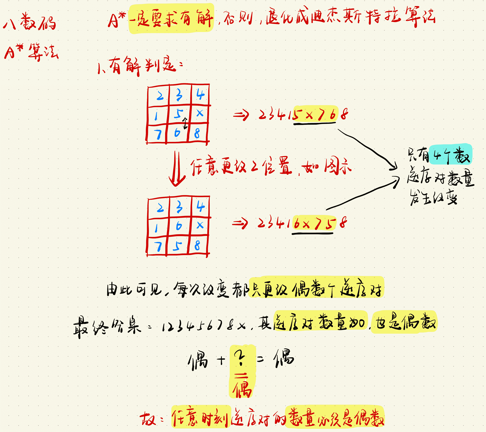

**代ç **

```c++
#include <iostream>
#include <queue>
#include <unordered_map>
#include <algorithm>
#define x first
#define y second
using namespace std;
typedef pair<int, string> PIS;
string start;
int dx[4] = {-1, 0, 1, 0};
int dy[4] = {0, 1, 0, -1};
char op[4] = {'u', 'r', 'd', 'l'};
unordered_map<string, int> dist;
unordered_map<string, pair<string, char>> pre;
priority_queue<PIS, vector<PIS>, greater<PIS>> q;
int f(string state) { // 求解曼哈顿è·ç¦»ã€æ‰‹åŠ¨æ¨¡æ‹Ÿæ ·ä¾‹ã€‘
    int res = 0;
    for (int i = 0; i < state.size(); i ++ ) {
        // è·å–当å‰å­—符在答案中的下标ä½ç½®
        int t = state[i] - '1';
        res += abs(i / 3 - t / 3) + abs(i % 3 - t % 3);
    }
    return res;
}
string Astar() {
    string end = "12345678x";
    // 起点入队
    q.push({f(start), start});
    // 起点è·ç¦»èµ·ç‚¹çš„è·ç¦»ä¸º0
    dist[start] = 0;
    while (q.size()) {
        auto t = q.top(); q.pop();
        string state = t.y;
        // æˆåŠŸæ‰¾åˆ°ï¼Œè·³å‡ºå¾ªç¯
        if (state == end) break;
        // 找到x在矩阵中的ä½ç½®
        int a = 0, b = 0;
        for (int i = 0; i < 9; i ++ )
            if (state[i] == 'x') {
                a = i / 3;
                b = i % 3;
                break;
            }
        // éå†å››ä¸ªæ–¹å‘
        string source = state;
        for (int i = 0; i < 4; i ++ ) {
            int tx = a + dx[i];
            int ty = b + dy[i];
            if (tx < 0 || tx >= 3 || ty < 0 || ty >= 3) continue;
            // 交æ¢ä¸¤ä¸ªå€¼
            swap(state[a * 3 + b], state[tx * 3 + ty]);
            // 如æœå½“å‰è¿™ä¸ªçŠ¶æ€æ²¡æœ‰è¢«è®¿é—®è¿‡
            // 或者到达当å‰è¿™ä¸ªçŠ¶æ€çš„è·ç¦»æ›´é•¿
            if (!dist.count(state) || dist[state] > dist[source] + 1) {
                // æ›´æ–°è·ç¦»
                dist[state] = dist[source] + 1;
                // 记录å‰é©±èŠ‚点
                pre[state] = {source, op[i]};
                // 入队
                q.push({dist[state] + f(state), state});
            }
            // å†äº¤æ¢å›æ¥
            swap(state[a * 3 + b], state[tx * 3 + ty]);
        }
    }
    // 输出路径
    string res;
    while (end != start) {
        res += pre[end].y;
        end = pre[end].x;
    }
    // ç”±äºè·¯å¾„是逆åºè¾“出的
    // 需è¦å°†ç­”案å过æ¥
    reverse(res.begin(), res.end());
    return res;
}
int main() {
    char c;
    while (cin >> c) start += c;
    // 统计逆åºå¯¹çš„æ•°é‡
    int n = 0;
    for (int i = 0; i < start.size(); i ++ ) {
        if (start[i] == 'x') continue;
        for (int j = i + 1; j < start.size(); j ++ ) {
            if (start[j] == 'x') continue;
            if (start[i] > start[j]) n ++;
        }
    }
    // 逆åºå¯¹æ•°é‡ä¸ºå¥‡æ•°ï¼Œæ— è§£ã€è§£é‡Šåœ¨æ‰‹å†™ç¨¿ã€‘
    if (n & 1) puts("unsolvable");
    else cout << Astar() << endl;
    return 0;
}
```

**时间å¤æ‚度**

$最åO(n^2)$

**空间å¤æ‚度**

$O(n^2)$

**标签**

`A*`ã€`BFS`

**ç¼åˆæ€ª**


#### [AcWing 178. 第K短路](https://www.acwing.com/problem/content/180/)

**题目æè¿°**

>   给定一张 `N` ä¸ªç‚¹ï¼ˆç¼–å· `1,2…N`），`M` æ¡è¾¹çš„有å‘图，求ä»èµ·ç‚¹ `S` 到终点 `T` 的第 `K` 短路的长度，路径å…许é‡å¤ç»è¿‡ç‚¹æˆ–边。
>
>   **注æ„：** æ¯æ¡æœ€çŸ­è·¯ä¸­è‡³å°‘è¦åŒ…å«ä¸€æ¡è¾¹ã€‚

**输入格å¼**

>   第一行包å«ä¸¤ä¸ªæ•´æ•° `N` å’Œ `M`。
>
>   æ¥ä¸‹æ¥ `M` 行，æ¯è¡ŒåŒ…å«ä¸‰ä¸ªæ•´æ•° `A,B` å’Œ `L`，表示点 `A` ä¸ç‚¹ `B` 之间存在有å‘边，且边长为 `L`。
>
>   最å一行包å«ä¸‰ä¸ªæ•´æ•° `S,T` å’Œ `K`，分别表示起点 `S`，终点 `T` 和第 `K` 短路。

**输出格å¼**

>   输出å ä¸€è¡Œï¼ŒåŒ…å«ä¸€ä¸ªæ•´æ•°ï¼Œè¡¨ç¤ºç¬¬ `K` 短路的长度，如æœç¬¬ `K` 短路ä¸å­˜åœ¨ï¼Œåˆ™è¾“出 `−1`。

**æ•°æ®èŒƒå›´**

>   +   $1≤S,T≤N≤1000,$
>   +   $0≤M≤10^4,$
>   +   $1≤K≤1000,$
>   +   $1≤L≤100$

**输入样例**

```c++
2 2
1 2 5
2 1 4
1 2 2
```

**输出样例**

```c++
14
```

**手写稿**


**代ç **

```c++
#include <iostream>
#include <cstring>
#include <queue>
#define x first
#define y second
using namespace std;
typedef pair<int, int> PII;
typedef pair<int, PII> PIII;
const int N = 1010, M = 20010, INF = 0x3f3f3f3f;
int n, m, S, T, K, idx;
int h[N], rh[N], e[M], w[M], ne[M], f[N], st[N];
priority_queue<PII, vector<PII>, greater<PII>> q;
priority_queue<PIII, vector<PIII>, greater<PIII>> heap;
void add(int h[], int a, int b, int c) {
    e[idx] = b;
    w[idx] = c;
    ne[idx] = h[a];
    h[a] = idx ++;
    return;
}
void dijkstra() { // éå†å图，求出æ¯ä¸ªç‚¹åˆ°ç»ˆç‚¹çš„è·ç¦»ï¼Œå½“作预估è·ç¦»
    memset(f, 0x3f, sizeof f);
    // 将终点到终点的è·ç¦»ä¸º0
    f[T] = 0;
    // 将终点入队
    q.push({0, T});
    // Dijkstra模æ¿
    while (q.size()) {
        auto t = q.top(); q.pop();
        int v = t.y;
        if (st[v]) continue;
        st[v] = true;
        for (int i = rh[v]; i != -1; i = ne[i]) {
            int j = e[i];
            if (!st[j] && f[j] > f[v] + w[i]) {
                f[j] = f[v] + w[i];
                q.push({f[j], j});
            }
        }
    }
    return;
}
int astar() {
    // 存储的数æ®è¯´æ˜åœ¨ã€æ‰‹å†™ç¨¿ã€‘
    heap.push({f[S], {S, 0}});
    // 如æœæ— æ³•åˆ°è¾¾ç»ˆç‚¹ï¼Œè¯´æ˜ä¸å­˜åœ¨ä»èµ·ç‚¹åˆ°è¾¾ç»ˆç‚¹çš„通路，返å›-1
    if (f[S] == INF) return -1;
    int cnt = 0;
    while (heap.size()) {
        auto t = heap.top(); heap.pop();
        int v = t.y.x, distance = t.y.y;
        // 记录终点出队的次数
        if (v == T) cnt ++;
        // 终点出队的次数等äºK，说æ˜æ‰¾åˆ°ç¬¬K短路
        if (cnt == K) return t.x;
        // éå†é‚»è¾¹
        for (int i = h[v]; i != -1; i = ne[i]) {
            int j = e[i];
            // 将所有邻边一股脑放入队列ã€åŸå› åœ¨æ‰‹å†™ç¨¿ã€‘
            heap.push({f[j] + distance + w[i], {j, distance + w[i]}});
        }
    }
    return -1;
}
int main() {
    scanf("%d%d", &n, &m);
    memset(h, -1, sizeof h);
    memset(rh, -1, sizeof rh);
    for (int i = 0; i < m; i ++ ) {
        int u, v, w;
        scanf("%d%d%d", &u, &v, &w);
        // 建立正å‘è¾¹
        add(h, u, v, w);
        // 建立åå‘è¾¹ã€ä½œä¸ºé¢„ä¼°è·ç¦»ã€‘
        add(rh, v, u, w);
    }
    scanf("%d%d%d", &S, &T, &K);
    // 如æœèµ·ç‚¹ä¸ç»ˆç‚¹é‡åˆï¼ŒK ++ã€æœ€å°‘有一æ¡è¾¹ã€‘
    if (S == T) K ++;
    dijkstra();
    cout << astar() << endl;
    return 0;
}
```

**时间å¤æ‚度**

$最åO(nm)$

**空间å¤æ‚度**

$O(nm)$

**标签**

`A*`ã€`å¯å‘å¼æœç´¢`

**ç¼åˆæ€ª**


## 深度优先æœç´¢

### 普通深æœ

#### [LeetCode 306. 累加数](https://leetcode-cn.com/problems/additive-number/)

**题目æè¿°**

> 累加数 是一个字符串，组æˆå®ƒçš„æ•°å­—å¯ä»¥å½¢æˆç´¯åŠ åºåˆ—。
>
> 一个有效的 累加åºåˆ— å¿…é¡» 至少 åŒ…å« `3` 个数。除了最开始的两个数以外，åºåˆ—中的æ¯ä¸ªå续数字必须是它之å‰ä¸¤ä¸ªæ•°å­—之和。
>
> 给你一个åªåŒ…å«æ•°å­— `'0'-'9'` 的字符串，编写一个算法æ¥åˆ¤æ–­ç»™å®šè¾“入是å¦æ˜¯ 累加数 。如æœæ˜¯ï¼Œè¿”å› `true` ï¼›å¦åˆ™ï¼Œè¿”å› `false` 。
>
> 说æ˜ï¼šç´¯åŠ åºåˆ—里的数，除数字 `0` 之外，ä¸ä¼š 以 `0` 开头，所以ä¸ä¼šå‡ºç° `1, 2, 03` 或者 `1, 02, 3` 的情况。

**示例 1**

> 输入：`"112358"`
> 输出：`true`
> 解释：累加åºåˆ—为: `1, 1, 2, 3, 5, 8 。1 + 1 = 2, 1 + 2 = 3, 2 + 3 = 5, 3 + 5 = 8`

**示例 2**

> 输入：`"199100199"`
> 输出：`true`
> 解释：累加åºåˆ—为: `1, 99, 100, 199。1 + 99 = 100, 99 + 100 = 199`

**æ示**

> + $1 <= num.length <= 35$
> + $num 仅由数字（0 - 9）组æˆ$

**进阶**

> 你计划如何处ç†ç”±è¿‡å¤§çš„整数输入导致的溢出?

**步骤**

> 1. 深度优先æœç´¢ï¼Œçˆ†æœ `num` 字符串，æšä¸¾æ¯ä¸ªæ•°å­—字符并且将其记录在 `path` 数组当中 ，查看是å¦æ»¡è¶³ç­”案
> 2. 递归出å£
>     + å¦‚æœ `path` 的个数大äºç­‰äº `3` 个，进行判断 `path[n - 3] + path[n - 2] == path[n - 1]` 是å¦æˆç«‹ï¼Œåˆ†ä»¥ä¸‹ä¸¤ç§æƒ…况
>         + 如æœæ¡ä»¶æˆç«‹ï¼Œåˆ™ç»§ç»­å‘下æ“作
>         + 如æœæ¡ä»¶ä¸æˆç«‹ï¼Œåˆ™ç›´æ¥æˆªå»å½“å‰åˆ†æ”¯ï¼Œå³è¿”å› `false`
>     + 如æœå½“å‰æšä¸¾çš„字符ä½ç½® `u` 为最å一个ä½ç½®ï¼Œåˆ™è¿›è¡Œå¦‚下判断
>         + å¦‚æœ `path` 的个数大äºç­‰äº `3` 个，则说æ˜å­˜åœ¨ä¸€ç»„ç­”æ¡ˆï¼Œè¿”å› `true`
>         + å¦åˆ™ï¼Œè¿”å› `false`
> 3. éå†å­—符串å³å¯

**代ç **

```c++
class Solution {
public:
    string add(string& a, string& b) {
        vector<int> A, B, C;
        for (int i = a.size() - 1; i >= 0; i -- ) A.push_back(a[i] - '0');
        for (int i = b.size() - 1; i >= 0; i -- ) B.push_back(b[i] - '0');
        for (int i = 0, t = 0; i < A.size() || i < B.size() || t; i ++ ) {
            if (i < A.size()) t += A[i];
            if (i < B.size()) t += B[i];
            C.push_back(t % 10);
            t /= 10;
        }
        string res;
        for (int i = C.size() - 1; i >= 0; i -- ) res += to_string(C[i]);
        return res;
    }
    bool dfs(string& num, vector<string>& path, int u) {
        int n = path.size();
        // 如æœä¸ªæ•°å¤§äºç­‰äº3个
        if (n >= 3) {
            string a = path[n - 3];
            string b = path[n - 2];
            string c = path[n - 1];
            string d = add(a, b);
            // 如æœä¸ç›¸ç­‰ï¼Œè¿”å›false
            if (d != c) return false;
        }
        // 如æœæšä¸¾åˆ°æœ€å一个字符
        if (u == num.size()) {
            // 如æœä¸ªæ•°å¤§äºç­‰äº3个，返å›true
            if (path.size() >= 3) return true;
            return false;
        }
        for (int i = u; i < num.size(); i ++ ) {
            // ä»u开始截å–长度为i - u + 1的字符串
            path.push_back(num.substr(u, i - u + 1));
            // 如æœèƒ½å¤Ÿæœç´¢åˆ°æ­£ç¡®ç­”案，则返å›true
            if (dfs(num, path, i + 1)) return true;
            // å›æº¯
            path.pop_back();
            // 如æœå‡ºç°å‰å¯¼0，则返å›false
            // 注æ„，在åé¢æ·»åŠ æ­¤æ¡ä»¶ï¼Œè¯´æ˜å½“å‰å­—符已ç»è¢«éå†è¿‡
            // å³0å·²ç»è¢«éå†è¿‡ï¼Œæ¥ä¸‹æ¥è¦éå†çš„是形如01，02之类的数字，必ä¸æ»¡è¶³æ¡ä»¶ï¼Œè¿”å›å³å¯
            if (num[u] == '0') return false;
        }
        return false;
    }
    bool isAdditiveNumber(string num) {
        vector<string> path;
        return dfs(num, path, 0);
    }
};
```

**标签**

`dfs`ã€`高精度`

#### [LeetCode 385. 迷你语法分æ器](https://leetcode-cn.com/problems/mini-parser/)

**题目æè¿°**

>   给定一个字符串 `s` 表示一个整数嵌套列表，å®ç°ä¸€ä¸ªè§£æ它的语法分æ器并返å›è§£æçš„ç»“æœ `NestedInteger` 。
>
>   列表中的æ¯ä¸ªå…ƒç´ åªå¯èƒ½æ˜¯æ•´æ•°æˆ–整数嵌套列表

**示例 1**

>   输入：`s = "324",`
>   输出：`324`
>   解释：你应该返å›ä¸€ä¸ª `NestedInteger` 对象，其中åªåŒ…å«æ•´æ•°å€¼ `324`。

**示例 2**

>   输入：`s = "[123,[456,[789]]]",`
>   输出：`[123,[456,[789]]]`
>   解释：返å›ä¸€ä¸ª `NestedInteger` 对象包å«ä¸€ä¸ªæœ‰ä¸¤ä¸ªå…ƒç´ çš„嵌套列表：
>
>   1. 一个 `integer` 包å«å€¼ `123`
>   2. 一个包å«ä¸¤ä¸ªå…ƒç´ çš„嵌套列表：
>       i.  一个 `integer` 包å«å€¼ `456`
>       ii. 一个包å«ä¸€ä¸ªå…ƒç´ çš„嵌套列表
>            a. 一个 `integer` 包å«å€¼ `789`

**æ示**

>   +   $1 <= s.length <= 5 * 10^4$
>   +   $s 由数字ã€æ–¹æ‹¬å· "[]"ã€è´Ÿå· '-' ã€é€—å· ','组æˆ$
>   +   $用例ä¿è¯ s 是å¯è§£æçš„ NestedInteger$
>   +   $输入中的所有值的范围是 [-10^6, 10^6]$

**手写稿**


**代ç **

```c++
/**
 * // This is the interface that allows for creating nested lists.
 * // You should not implement it, or speculate about its implementation
 * class NestedInteger {
 *   public:
 *     // Constructor initializes an empty nested list.
 *     NestedInteger();
 *
 *     // Constructor initializes a single integer.
 *     NestedInteger(int value);
 *
 *     // Return true if this NestedInteger holds a single integer, rather than a nested list.
 *     bool isInteger() const;
 *
 *     // Return the single integer that this NestedInteger holds, if it holds a single integer
 *     // The result is undefined if this NestedInteger holds a nested list
 *     int getInteger() const;
 *
 *     // Set this NestedInteger to hold a single integer.
 *     void setInteger(int value);
 *
 *     // Set this NestedInteger to hold a nested list and adds a nested integer to it.
 *     void add(const NestedInteger &ni);
 *
 *     // Return the nested list that this NestedInteger holds, if it holds a nested list
 *     // The result is undefined if this NestedInteger holds a single integer
 *     const vector<NestedInteger> &getList() const;
 * };
 */
class Solution {
public:
    NestedInteger dfs(string& s, int& u) {
        NestedInteger res;
        if (s[u] == '[') {
            u ++; // 跳过左括å·
            while (s[u] != ']') res.add(dfs(s, u));
            u ++; // 跳过å³æ‹¬å·
            if (u < s.size() && s[u] == ',') u ++; // 跳过逗å·
        }
        else {
            int k = u;
            // 将数字部分找出æ¥
            // 注æ„ä¸èƒ½ä½¿ç”¨isdigit()，因为，数字å¯èƒ½æ˜¯è´Ÿæ•°ï¼Œæœ‰'-'
            while (k < s.size() && s[k] != ',' && s[k] != ']') k ++;
            // 将数字转化æˆintç±»å‹
            res.setInteger(stoi(s.substr(u, k - u)));
            // 跳过逗å·
            if (k < s.size() && s[k] == ',') k ++;
            u = k;
        }
        return res;
    }
    NestedInteger deserialize(string s) {
        int u = 0;
        // 注æ„这里使用的是引用
        // å…¶åŸå› æ˜¯ä¸éœ€è¦å›æº¯æ“作，沿ç€å­—符串一æ¡è·¯èµ°åˆ°é»‘å³å¯
        return dfs(s, u);
    }
};
```

**时间å¤æ‚度**

$O(n)$

**空间å¤æ‚度**

$O(n)$

**标签**

`深度优先æœç´¢`

**ç¼åˆæ€ª**

[LeetCode 341. æ‰å¹³åŒ–嵌套列表迭代器](#LeetCode 341. æ‰å¹³åŒ–嵌套列表迭代器)

#### [LeetCode 386. å­—å…¸åºæ’æ•°](https://leetcode-cn.com/problems/lexicographical-numbers/)

**题目æè¿°**

>   给你一个整数 `n` ，按字典åºè¿”å›èŒƒå›´ `[1, n]` 内所有整数。
>
>   你必须设计一个时间å¤æ‚度为 `O(n)` 且使用 `O(1)` é¢å¤–空间的算法。

**示例 1**

>   输入：`n = 13`
>   输出：`[1,10,11,12,13,2,3,4,5,6,7,8,9]`

**示例 2**

>   输入：`n = 2`
>   输出：`[1,2]`

**æ示**

>   +   $1 <= n <= 5 * 10^4$

**手写稿**


**代ç **

```c++
class Solution {
public:
    vector<int> res;
    void dfs(int cur, int n) {
        // 如æœå½“å‰çš„数字大äºn，则直æ¥è¿”å›
        if (cur > n) return;
        // 如æœå½“å‰çš„æ•°å­—å°äºç­‰äºn，说æ˜ç¬¦åˆæ¡ä»¶ï¼ŒåŠ å…¥ç­”案数组å³å¯
        if (cur <= n) res.push_back(cur);
        // æšä¸¾ä¸‹ä¸€ä½æ•°å­—，注æ„：除第一ä½æ•°å­—之外的æ¯ä¸€ä½ä¸Šçš„æ•°å­—å¯å¡«çš„范围为[0, 9]
        for (int i = 0; i <= 9; i ++ ) dfs(cur * 10 + i, n);
        return;
    }
    vector<int> lexicalOrder(int n) {
        // æšä¸¾ç¬¬ä¸€ä½æ•°å­—
        for (int i = 1; i <= 9; i ++ ) dfs(i, n);
        return res;
    }
};
```

**时间å¤æ‚度**

$递归å¤æ‚度ä¸å¥½åˆ†æ$

**空间å¤æ‚度**

$O(n)$

**标签**

`深度优先æœç´¢`

**ç¼åˆæ€ª**

#### [LeetCode 388. 文件的最长ç»å¯¹è·¯å¾„](https://leetcode-cn.com/problems/longest-absolute-file-path/)

**题目æè¿°**

>   å‡è®¾æœ‰ä¸€ä¸ªåŒæ—¶å­˜å‚¨æ–‡ä»¶å’Œç›®å½•çš„文件系统。下图展示了文件系统的一个示例：
>
>   
>
>   这里将 `dir` 作为根目录中的唯一目录。`dir` 包å«ä¸¤ä¸ªå­ç›®å½• `subdir1` å’Œ `subdir2` 。`subdir1` 包å«æ–‡ä»¶ `file1.ext` å’Œå­ç›®å½• `subsubdir1`ï¼›`subdir2` 包å«å­ç›®å½• `subsubdir2`，该å­ç›®å½•ä¸‹åŒ…å«æ–‡ä»¶ `file2.ext` 。
>
>   在文本格å¼ä¸­ï¼Œå¦‚下所示(⟶表示制表符)：
>
>   >   dir
>   >   ⟶ subdir1
>   >   ⟶ ⟶ file1.ext
>   >   ⟶ ⟶ subsubdir1
>   >   ⟶ subdir2
>   >   ⟶ ⟶ subsubdir2
>   >   ⟶ ⟶ ⟶ file2.ext
>
>
>   如æœæ˜¯ä»£ç è¡¨ç¤ºï¼Œä¸Šé¢çš„文件系统å¯ä»¥å†™ä¸º `"dir\n\tsubdir1\n\t\tfile1.ext\n\t\tsubsubdir1\n\tsubdir2\n\t\tsubsubdir2\n\t\t\tfile2.ext"` 。`'\n'` å’Œ `'\t'` 分别是æ¢è¡Œç¬¦å’Œåˆ¶è¡¨ç¬¦ã€‚
>
>   文件系统中的æ¯ä¸ªæ–‡ä»¶å’Œæ–‡ä»¶å¤¹éƒ½æœ‰ä¸€ä¸ªå”¯ä¸€çš„ ç»å¯¹è·¯å¾„ ，å³å¿…须打开æ‰èƒ½åˆ°è¾¾æ–‡ä»¶/目录所在ä½ç½®çš„目录顺åºï¼Œæ‰€æœ‰è·¯å¾„用 `'/'` è¿æ¥ã€‚上é¢ä¾‹å­ä¸­ï¼ŒæŒ‡å‘ `file2.ext` çš„ ç»å¯¹è·¯å¾„ 是 `"dir/subdir2/subsubdir2/file2.ext"` 。æ¯ä¸ªç›®å½•å由字æ¯ã€æ•°å­—å’Œ/或空格组æˆï¼Œæ¯ä¸ªæ–‡ä»¶åéµå¾ª `name.extension` çš„æ ¼å¼ï¼Œå…¶ä¸­ `name` å’Œ `extension`由字æ¯ã€æ•°å­—å’Œ/或空格组æˆã€‚
>
>   给定一个以上述格å¼è¡¨ç¤ºæ–‡ä»¶ç³»ç»Ÿçš„字符串 `input` ，返å›æ–‡ä»¶ç³»ç»Ÿä¸­ æŒ‡å‘ æ–‡ä»¶ çš„ 最长ç»å¯¹è·¯å¾„ 的长度 。 如æœç³»ç»Ÿä¸­æ²¡æœ‰æ–‡ä»¶ï¼Œè¿”å› `0`。

**示例 1**

>   输入：`input = "dir\n\tsubdir1\n\tsubdir2\n\t\tfile.ext"`
>   输出：`20`
>   解释：åªæœ‰ä¸€ä¸ªæ–‡ä»¶ï¼Œç»å¯¹è·¯å¾„为 `"dir/subdir2/file.ext"` ，路径长度 `20`

**示例 2**

>   输入：`input = "dir\n\tsubdir1\n\t\tfile1.ext\n\t\tsubsubdir1\n\tsubdir2\n\t\tsubsubdir2\n\t\t\tfile2.ext"`
>   输出：`32`
>   解释：存在两个文件：
>   `"dir/subdir1/file1.ext"` ，路径长度 `21`
>   `"dir/subdir2/subsubdir2/file2.ext"` ，路径长度 `32`
>   è¿”å› `32` ，因为这是最长的路径

**示例 3**

>   输入：`input = "a"`
>   输出：`0`
>   解释：ä¸å­˜åœ¨ä»»ä½•æ–‡ä»¶

**示例 4**

>   输入：`input = "file1.txt\nfile2.txt\nlongfile.txt"`
>   输出：`12`
>   解释：根目录下有 `3` 个文件。
>   因为根目录中任何东西的ç»å¯¹è·¯å¾„åªæ˜¯å称本身，所以答案是 `"longfile.txt"` ，路径长度为 `12`

**æ示**

>   +   $1 <= input.length <= 10^4$
>   +   $input å¯èƒ½åŒ…å«å°å†™æˆ–大写的英文字æ¯ï¼Œä¸€ä¸ªæ¢è¡Œç¬¦ '\n'，一个制表符 '\t'，一个点 '.'，一个空格 ' '，和数字。$

**手写稿**


**代ç **

```c++
class Solution {
public:
    int lengthLongestPath(string s) {
        int ans = 0;
        stack<string> stk;
        // ã€sum始终记录ã€æ ˆä¸­ã€‘ä¿å­˜çš„å•è¯çš„ã€é•¿åº¦ã€‘】
        for (int i = 0, sum = 0; i < s.size(); i ++ ) {
            int k = 0;
            // 判断下一个å•è¯ä½äºç¬¬å‡ å±‚
            while (i < s.size() && s[i] == '\t') k ++, i ++;
            // 判断当å‰å¤„äºç¬¬å‡ å±‚
            // 如æœå±‚æ•°ä¸å¯¹ï¼Œéœ€è¦è¿›è¡Œå›æº¯
            // æ›´æ–°sum的值，注æ„sum值的å«ä¹‰
            while (stk.size() > k) sum -= stk.top().size(), stk.pop();
            // 找出当å‰çš„å•è¯
            int j = i;
            while (j < s.size() && s[j] != '\n') j ++;
            // 将当å‰çš„å•è¯æ‰£å‡ºæ¥
            string t = s.substr(i, j - i);
            // 将当å‰ã€å•è¯çš„长度】å‹å…¥æ ˆä¸­
            stk.push(t);
            // 更新sum的值
            sum += t.size();
            if (t.find('.') != -1) // 还需è¦åŠ '/'，n个å•è¯éœ€è¦n - 1个/
                ans = max(ans, sum + (int)stk.size() - 1);
            i = j;
        }
        return ans;
    }
};
```

**时间å¤æ‚度**

$O(n)$

**空间å¤æ‚度**

$O(n)$

**标签**

`模拟`

**ç¼åˆæ€ª**

#### [AcWing 92. 递归å®ç°æŒ‡æ•°å‹æšä¸¾](https://www.acwing.com/problem/content/description/94/)

**题目æè¿°**

>   ä» `1 ∼ n` è¿™ `n` 个整数中éšæœºé€‰å–ä»»æ„多个，输出所有å¯èƒ½çš„选择方案。

**输入格å¼**

>   输入一个整数 `n`。

**输出格å¼**

>   æ¯è¡Œè¾“出一ç§æ–¹æ¡ˆã€‚
>
>   åŒä¸€è¡Œå†…çš„æ•°å¿…é¡»å‡åºæ’列，相邻两个数用æ°å¥½ `1` 个空格隔开。
>
>   对äºæ²¡æœ‰é€‰ä»»ä½•æ•°çš„方案，输出空行。
>
>   本题有自定义校验器（`SPJ`），å„行（ä¸åŒæ–¹æ¡ˆï¼‰ä¹‹é—´çš„顺åºä»»æ„。

**æ•°æ®èŒƒå›´**

>   +   $1≤n≤15$

**输入样例**

```c++
3
```

**输出样例**

```c++
3
2
2 3
1
1 3
1 2
1 2 3
```

**手写稿**

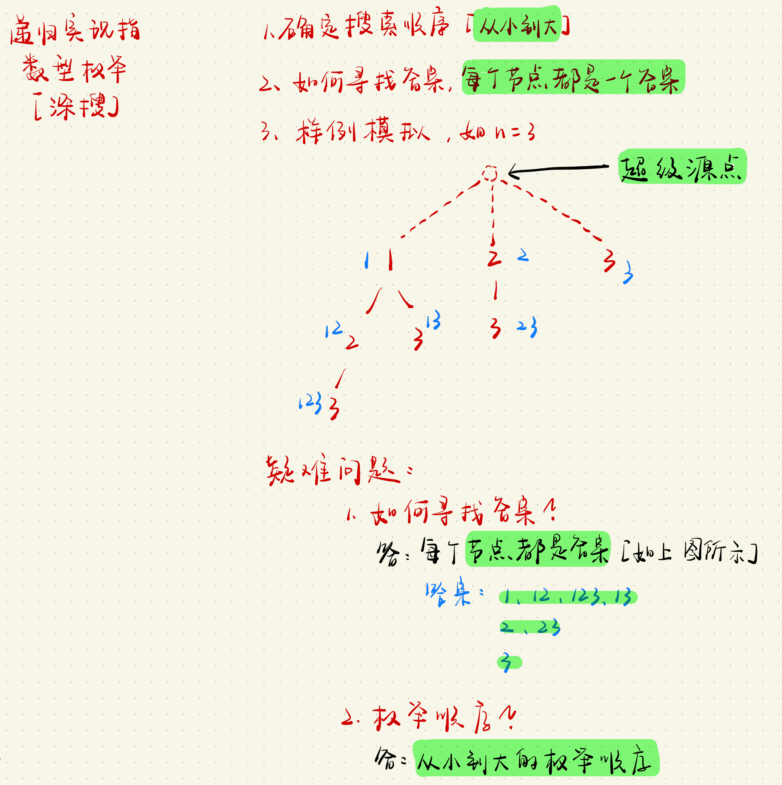

**代ç **

```c++
#include <iostream>
#include <vector>
using namespace std;
int n;
vector<int> path;
void dfs(int u, vector<int>& path) {
    // 越界，则返å›
    if (u > n) return;
    // 输出答案
    for (auto num : path) cout << num << " ";
    // 输出å›è½¦
    // 空行算答案
    cout << endl;
    for (int i = u; i <= n; i ++ ) {
        // 将下一个数字加入答案
        path.push_back(i + 1);
        // æ·±æœ
        dfs(i + 1, path);
        // 外部æšä¸¾
        // å›æº¯ç°åœº
        path.pop_back();
    }
}
int main() {
    scanf("%d", &n);
    // ä»0开始æœç´¢ï¼Œå°†0当作超级æºç‚¹
    dfs(0, path);
    return 0;
}
```

**时间å¤æ‚度**

$O(ä¸è®²æ­¦å¾·)$

**空间å¤æ‚度**

`O(n)`

**标签**

`DFS`ã€`深度优先æœç´¢`

**ç¼åˆæ€ª**

#### [AcWing 93. 递归å®ç°ç»„åˆå‹æšä¸¾](https://www.acwing.com/problem/content/description/95/)

**题目æè¿°**

>   ä» `1 ∼ n` è¿™ `n` 个整数中éšæœºé€‰å‡º `m` 个，输出所有å¯èƒ½çš„选择方案。

**输入格å¼**

>   两个整数 `n,m` ,在åŒä¸€è¡Œç”¨ç©ºæ ¼éš”开。

**输出格å¼**

>   按照ä»å°åˆ°å¤§çš„顺åºè¾“出所有方案，æ¯è¡Œ `1` 个。
>
>   首先，åŒä¸€è¡Œå†…çš„æ•°å‡åºæ’列，相邻两个数用一个空格隔开。
>
>   其次，对äºä¸¤ä¸ªä¸åŒçš„行，对应下标的数一一比较，字典åºè¾ƒå°çš„æ’在å‰é¢ï¼ˆä¾‹å¦‚ `1 3 5 7` æ’在 `1 3 6 8` å‰é¢ï¼‰ã€‚

**æ•°æ®èŒƒå›´**

>   +   $n > 0,$
>   +   $0 ≤ m ≤ n,$
>   +   $n + (n − m) ≤ 25$

**输入样例**

```c++
5 3
```

**输出样例**

```c++
1 2 3 
1 2 4 
1 2 5 
1 3 4 
1 3 5 
1 4 5 
2 3 4 
2 3 5 
2 4 5 
3 4 5 
```

**æ€è€ƒé¢˜**

>   如æœè¦æ±‚使用é递归方法，该æ€ä¹ˆåšå‘¢ï¼Ÿ

**手写稿**


**代ç **

```c++
#include <iostream>
#include <vector>
using namespace std;
int n, m;
vector<int> path;
/*
å‚数说æ˜ï¼š
    当å‰æšä¸¾çš„æ•°å­—
    当å‰å¤„äºç¬¬å‡ å±‚
    答案数组
*/
void dfs(int u, int k, vector<int>& path) {
    // 当å‰æšä¸¾çš„数字超出最大值，返å›
    if (u > n) return;
    // 当å‰æšä¸¾çš„层数
    if (k > m) {
        for (int i = 0; i < path.size(); i ++ ) cout << path[i] << " ";
        cout << endl;
        return;
    }
    // ä»u开始æšä¸¾
    for (int i = u; i <= n; i ++ ) {
        // 将数字æ’入答案
        path.push_back(i + 1);
        // 进入下一层
        dfs(i + 1, k + 1, path);
        // 外部æœç´¢
        // å›æº¯
        path.pop_back();
    }
    return;
}
int main() {
    scanf("%d%d", &n, &m);
    dfs(0, 1, path);
    return 0;
}
```

**时间å¤æ‚度**

$O(ä¸è®²æ­¦å¾·)$

**空间å¤æ‚度**

$O(n)$

**标签**

`DFS`

**ç¼åˆæ€ª**

#### [AcWing 94. 递归å®ç°æ’列å‹æšä¸¾](https://www.acwing.com/problem/content/description/96/)

**题目æè¿°**

>   把 `1 ∼ n` è¿™ `n` 个整数æ’æˆä¸€è¡Œåéšæœºæ‰“乱顺åºï¼Œè¾“出所有å¯èƒ½çš„次åºã€‚

**输入格å¼**

>   一个整数 `n`。

**输出格å¼**

>   按照ä»å°åˆ°å¤§çš„顺åºè¾“出所有方案，æ¯è¡Œ `1` 个。
>
>   首先，åŒä¸€è¡Œç›¸é‚»ä¸¤ä¸ªæ•°ç”¨ä¸€ä¸ªç©ºæ ¼éš”开。
>
>   其次，对äºä¸¤ä¸ªä¸åŒçš„行，对应下标的数一一比较，字典åºè¾ƒå°çš„æ’在å‰é¢ã€‚

**æ•°æ®èŒƒå›´**

>   +   $1 ≤ n ≤ 9$

**输入样例**

```c++
3
```

**输出样例**

```c++
1 2 3
1 3 2
2 1 3
2 3 1
3 1 2
3 2 1
```

**手写稿**


**代ç **

```c++
#include <iostream>
#include <vector>
using namespace std;
const int N = 15;
int n;
int st[N];
vector<int> path;
/*
å‚数说æ˜ï¼š
    当å‰æšä¸¾çš„是第几层
    答案数组
*/
void dfs(int u, vector<int>& path) {
    // 如æœå½“å‰æšä¸¾åˆ°ç¬¬ n + 1 层，则输出答案
    if (u > n) {
        for (int i = 0; i < n; i ++ ) cout << path[i] << " ";
        cout << endl;
        return;
    }
    for (int i = 1; i <= n; i ++ )
        // 如æœå½“å‰æ•°æ²¡æœ‰è¢«éå†è¿‡ï¼Œåˆ™éå†å½“å‰æ•°
        if (!st[i]) {
            st[i] = true;
            path.push_back(i);
            // 递归下一层
            dfs(u + 1, path);
            // å›æº¯
            path.pop_back();
            st[i] = false;
        }
    return;
}
int main() {
    scanf("%d", &n);
    dfs(1, path);
    return 0;
}
```

**时间å¤æ‚度**

$O(ä¸è®²æ­¦å¾·)$

**空间å¤æ‚度**

$O(n)$

**标签**

`DFS`

**ç¼åˆæ€ª**

#### [LeetCode 4. 寻找两个正åºæ•°ç»„的中ä½æ•°](https://leetcode-cn.com/problems/median-of-two-sorted-arrays/)

**题目æè¿°**

>   给定两个大å°åˆ†åˆ«ä¸º `m` å’Œ `n` çš„æ­£åºï¼ˆä»å°åˆ°å¤§ï¼‰æ•°ç»„ `nums1` å’Œ `nums2`。请你找出并返å›è¿™ä¸¤ä¸ªæ­£åºæ•°ç»„çš„ 中ä½æ•° 。
>
>   算法的时间å¤æ‚度应该为 `O(log (m + n))` 。

**示例 1**

>   输入：`nums1 = [1,3], nums2 = [2]`
>   输出：`2.00000`
>   解释：åˆå¹¶æ•°ç»„ = `[1,2,3]` ，中ä½æ•° `2`

**示例 2**

>   输入：`nums1 = [1,2], nums2 = [3,4]`
>   输出：`2.50000`
>   解释：åˆå¹¶æ•°ç»„ = `[1,2,3,4]` ，中ä½æ•° `(2 + 3) / 2 = 2.5`

**æ示**

>   +   $nums1.length == m$
>   +   $nums2.length == n$
>   +   $0 <= m <= 1000$
>   +   $0 <= n <= 1000$
>   +   $1 <= m + n <= 2000$
>   +   $-10^6 <= nums1[i], nums2[i] <= 10^6$

**手写稿**


**代ç **

```c++
class Solution {
public:
    // ä¿è¯nums1的长度大äºç­‰äºnums2的长度
    int dfs(vector<int>& nums1, int l1, vector<int>& nums2, int l2, int k) {
        // 如æœnums1的长度å°äºnums2的长度，则交æ¢ä¸¤ä¸ªæ•°ç»„
        if (nums1.size() < nums2.size()) return dfs(nums2, l2, nums1, l1, k);
        // 如æœå¯»æ‰¾çš„是第一个数
        if (k == 1) {
            // 如æœnums1为空，返å›nums2的第k个数字
            if (l1 == nums1.size()) return nums2[l2 + k - 1];
            // 如æœnums2为空，返å›nums1的第k个数字
            else if (l2 == nums2.size()) return nums1[l1 + k - 1];
            // 如æœnums1å’Œnums2都ä¸ç©ºï¼Œè¿”å›ä¸¤è€…的最å°å€¼
            return min(nums1[l1 + k - 1], nums2[l2 + k - 1]);
        }
        // 如æœnums2的长度已ç»åˆ°è¾¾æœ«å°¾ï¼Œè¿”å›nums1的第k个数字
        if (l2 == nums2.size()) return nums1[l1 + k - 1];
        // nums1的第k / 2个数字
        int t1 = l1 + k / 2 - 1;
        // nums2的第k / 2个数字
        int t2 = l2 + k / 2 - 1;
        // 因为nums2数组长度短，因此，如æœnums2的长度å¯èƒ½ä¸å¤Ÿk / 2个
        // 那么，nums2的起始ä½ç½®ä¸ºnums2.size() - 1，å³èµ·å§‹ä½ç½®ä¸ºæœ€å一个数字
        if (t2 >= nums2.size()) t2 = nums2.size() - 1;
        if (nums1[t1] < nums2[t2])
            // æ¯æ¬¡æ’除的数字ä¸ä¸€å®šä¸ºk / 2个
            // æ¯æ¬¡æ’除的数字为下一次起始ä½ç½® - åˆå§‹ä½ç½®
            return dfs(nums1, t1 + 1, nums2, l2, k - (t1 - l1 + 1));
        return dfs(nums1, l1, nums2, t2 + 1, k - (t2 - l2 + 1));
    }
    double findMedianSortedArrays(vector<int>& nums1, vector<int>& nums2) {
        int n = nums1.size() + nums2.size();
        if (n & 1) return dfs(nums1, 0, nums2, 0, n / 2 + 1);
        return (dfs(nums1, 0, nums2, 0, n / 2) + dfs(nums1, 0, nums2, 0, n / 2 + 1)) / 2.0;
    }
};
```

**时间å¤æ‚度**

$O(ä¸è®²æ­¦å¾·)$

**空间å¤æ‚度**

$O(n)$

**标签**

`DFS`ã€`深度优先æœç´¢`

**ç¼åˆæ€ª**


#### [LeetCode 394. 字符串解ç ](https://leetcode-cn.com/problems/decode-string/)

**题目æè¿°**

>   给定一个ç»è¿‡ç¼–ç çš„字符串，返å›å®ƒè§£ç å的字符串。
>
>   ç¼–ç è§„则为: `k[encoded_string]`，表示其中方括å·å†…部的 `encoded_string` 正好é‡å¤ `k` æ¬¡ã€‚æ³¨æ„ `k` ä¿è¯ä¸ºæ­£æ•´æ•°ã€‚
>
>   ä½ å¯ä»¥è®¤ä¸ºè¾“入字符串总是有效的；输入字符串中没有é¢å¤–的空格，且输入的方括å·æ€»æ˜¯ç¬¦åˆæ ¼å¼è¦æ±‚的。
>
>   此外，你å¯ä»¥è®¤ä¸ºåŸå§‹æ•°æ®ä¸åŒ…å«æ•°å­—，所有的数字åªè¡¨ç¤ºé‡å¤çš„次数 `k` ，例如ä¸ä¼šå‡ºç°åƒ `3a` 或 `2[4]` 的输入。

**示例 1**

>   输入：`s = "3[a]2[bc]"`
>   输出：`"aaabcbc"`

**示例 2**

>   输入：`s = "3[a2[c]]"`
>   输出：`"accaccacc"`

**示例 3**

>   输入：`s = "2[abc]3[cd]ef"`
>   输出：`"abcabccdcdcdef"`

**示例 4**

>   输入：`s = "abc3[cd]xyz"`
>   输出：`"abccdcdcdxyz"`

**æ示**

>   +   $1 <= s.length <= 30$
>   +   $s ç”±å°å†™è‹±æ–‡å­—æ¯ã€æ•°å­—å’Œæ–¹æ‹¬å· '[]' 组æˆ$
>   +   $s ä¿è¯æ˜¯ä¸€ä¸ª 有效 的输入。$
>   +   $s 中所有整数的å–值范围为 [1, 300]$

**手写稿**


**代ç ä¸€: æ ˆ**

```c++
class Solution {
public:
    string decodeString(string s) {
        stack<int> num;
        stack<string> str;
        int multi = 0;
        string res = "";
        for (int i = 0; i < s.size(); i ++ ) {
            if (s[i] >= 'a' && s[i] <= 'z' || s[i] >= 'A' && s[i] <= 'Z') res += s[i];
            else if (s[i] >= '0' && s[i] <= '9') multi = multi * 10 + s[i] - '0';
            else if (s[i] == '[') {
                num.push(multi);
                multi = 0;
                str.push(res);
                res = "";
            }
            else {
                // å–出å€æ•°
                multi = num.top(); num.pop();
                while (multi -- ) str.top() += res;
                // 注æ„: 此时的multi的值为-1, 需è¦å°†å…¶é‡ç½®ä¸º0, 或者直æ¥ä½¿ç”¨å¦ä¸€ä¸ªå˜é‡kå³å¯
                multi = 0;
                res = str.top();
                str.pop();
            }
        }
        return res;
    }
};
```

**时间å¤æ‚度**

$O(nm), n是字符串的长度, m是é‡å¤çš„æ•°é‡çš„最大值$

**空间å¤æ‚度**

$O(n)$

**标签**

`æ ˆ`

**代ç äºŒ: 递归**

```c++
class Solution {
public:
    string dfs(string &s, int &u) {
        string res = "";
        int multi = 0;
        while (u < s.size()) {
            if (s[u] >= 'a' && s[u] <= 'z' || s[u] >= 'A' && s[u] <= 'Z')
                res += s[u ++ ];
            else if (s[u] >= '0' && s[u] <= '9') multi = multi * 10 + s[u ++ ] - '0';
            else if (s[u] == '[') {
                // 记录上一层的字符串
                string tmp = dfs(s, ++ u);
                // å€å¢multi次
                while (multi -- ) res += tmp;
                // 注æ„: 此时的multi的值为-1
                // é‡ç½®multi为0, 开始记录当å‰å±‚的下一个字符串å€å¢çš„次数
                multi = 0;
            }
            else {
                // 跳过']'
                u ++;
                // è¿”å›res
                return res;
            }
        }
        return res;
    }
    string decodeString(string s) {
        int u = 0;
        return dfs(s, u);
    }
};
```

**时间å¤æ‚度**

$O(nm), n是字符串的长度, m是é‡å¤çš„æ•°é‡çš„最大值$

**空间å¤æ‚度**

$O(n)$

**标签**

`DFS`ã€`深度优先æœç´¢`

**ç¼åˆæ€ª**


### DFS之è¿é€šæ€§æ¨¡å‹

#### [AcWing 1112. 迷宫](https://www.acwing.com/problem/content/1114/)

**题目æè¿°**

>   一天 `Extense` 在森æ—里æ¢é™©çš„时候ä¸å°å¿ƒèµ°å…¥äº†ä¸€ä¸ªè¿·å®«ï¼Œè¿·å®«å¯ä»¥çœ‹æˆæ˜¯ç”± `n ∗ n` 的格点组æˆï¼Œæ¯ä¸ªæ ¼ç‚¹åªæœ‰ `2` ç§çŠ¶æ€ï¼Œ`.`å’Œ`#`，å‰è€…表示å¯ä»¥é€šè¡Œå者表示ä¸èƒ½é€šè¡Œã€‚
>
>   åŒæ—¶å½“ `Extense` 处在æŸä¸ªæ ¼ç‚¹æ—¶ï¼Œä»–åªèƒ½ç§»åŠ¨åˆ°ä¸œå—西北(或者说上下左å³)四个方å‘之一的相邻格点上， `Extense` 想è¦ä»ç‚¹ `A` 走到点 `B`，问在ä¸èµ°å‡ºè¿·å®«çš„情况下能ä¸èƒ½åŠåˆ°ã€‚
>
>   如æœèµ·ç‚¹æˆ–者终点有一个ä¸èƒ½é€šè¡Œ(为 `#` )，则看æˆæ— æ³•åŠåˆ°ã€‚
>
>   **注æ„**：`A`ã€`B`ä¸ä¸€å®šæ˜¯ä¸¤ä¸ªä¸åŒçš„点。

**输入格å¼**

>   第 `1` 行是测试数æ®çš„组数 `k`，åé¢è·Ÿç€ `k` 组输入。
>
>   æ¯ç»„测试数æ®çš„第 `1` 行是一个正整数 `n`，表示迷宫的规模是 `n ∗ n` 的。
>
>   æ¥ä¸‹æ¥æ˜¯ä¸€ä¸ª `n ∗ n` 的矩阵，矩阵中的元素为`.`或者`#`。
>
>   å†æ¥ä¸‹æ¥ä¸€è¡Œæ˜¯ `4` 个整数 $h_a,l_a,h_b,l_b$，æè¿° `A` 处在第 $h_a$ è¡Œ, 第 $l_a$ 列，`B` 处在第 $h_b$ è¡Œ, 第 $l_b$ 列。
>
>   注æ„到 $h_a,l_a,h_b,l_b$ å…¨éƒ¨æ˜¯ä» `0` 开始计数的。

**输出格å¼**

>   `k`行，æ¯è¡Œè¾“出对应一个输入。
>
>   能åŠåˆ°åˆ™è¾“出“`YES`â€ï¼Œå¦åˆ™è¾“出“`NO`â€ã€‚

**æ•°æ®èŒƒå›´**

>   +   $1≤n≤100$

**输入样例**

```c++
2
3
.##
..#
#..
0 0 2 2
5
.....
###.#
..#..
###..
...#.
0 0 4 0
```

**输出样例**

```c++
YES
NO
```

**手写稿**

>   1.   ä»èµ·ç‚¹å¼€å§‹æœç´¢ï¼Œéå†å››ä¸ªæ–¹å‘å³å¯

**代ç **

```c++
#include <iostream>
#include <cstring>
using namespace std;
const int N = 110;
int n, x1, y1, x2, y2, T;
int dx[4] = {-1, 0, 1, 0};
int dy[4] = {0, 1, 0, -1};
char g[N][N];
bool st[N][N];
bool dfs(int x, int y) {
    // 如æœg[x][y]ä¸èƒ½èµ°ï¼Œè¿”å›false
    if (g[x][y] == '#') return false;
    // 如æœåˆ°è¾¾ç»ˆç‚¹ï¼Œè¯´æ˜å­˜åœ¨ä¸€æ¡åˆæ³•è·¯å¾„，返å›true
    if (x == x2 && y == y2) return true;
    st[x][y] = true;
    // éå†å››ä¸ªæ–¹å‘
    for (int i = 0; i < 4; i ++ ) {
        int tx = x + dx[i];
        int ty = y + dy[i];
        if (tx < 0 || tx >= n || ty < 0 || ty >= n || st[tx][ty] || g[tx][ty] == '#')
            continue;
        // 如æœä»(tx, ty)能æœåˆ°ç­”案，返å›true
        if (dfs(tx, ty)) return true;
    }
    return false;
}
int main() {
    scanf("%d", &T);
    while (T -- ) {
        scanf("%d", &n);
        for (int i = 0; i < n; i ++ ) scanf("%s", g[i]);
        scanf("%d%d%d%d", &x1, &y1, &x2, &y2);
        // 多组测试数æ®
        // è®°å¾—æ¯æ¬¡åŠ¡å¿…è¦åˆå§‹åŒ–
        memset(st, 0, sizeof st);
        if (dfs(x1, y1)) puts("YES");
        else puts("NO");
    }
    return 0;
}
```

**时间å¤æ‚度**


**空间å¤æ‚度**


**标签**

`DFS`ã€`深度优先æœç´¢`

**ç¼åˆæ€ª**

#### [AcWing 1113. 红ä¸é»‘](https://www.acwing.com/problem/content/1115/)

**题目æè¿°**

>   有一间长方形的房å­ï¼Œåœ°ä¸Šé“ºäº†çº¢è‰²ã€é»‘色两ç§é¢œè‰²çš„正方形瓷砖。
>
>   你站在其中一å—黑色的瓷砖上，åªèƒ½å‘相邻（上下左å³å››ä¸ªæ–¹å‘）的黑色瓷砖移动。
>
>   请写一个程åºï¼Œè®¡ç®—你总共能够到达多少å—黑色的瓷砖。

**输入格å¼**

>   输入包括多个数æ®é›†åˆã€‚
>
>   æ¯ä¸ªæ•°æ®é›†åˆçš„第一行是两个整数 `W` å’Œ `H`，分别表示 `x` æ–¹å‘å’Œ `y` æ–¹å‘ç“·ç –çš„æ•°é‡ã€‚
>
>   在æ¥ä¸‹æ¥çš„ `H` 行中，æ¯è¡ŒåŒ…括 `W` 个字符。æ¯ä¸ªå­—符表示一å—瓷砖的颜色，规则如下
>
>   1）‘`.`’：黑色的瓷砖；
>   2）‘`#`’：红色的瓷砖；
>   3）‘`@`’：黑色的瓷砖，并且你站在这å—瓷砖上。该字符在æ¯ä¸ªæ•°æ®é›†åˆä¸­å”¯ä¸€å‡ºç°ä¸€æ¬¡ã€‚
>
>   当在一行中读入的是两个零时，表示输入结æŸã€‚

**输出格å¼**

>   对æ¯ä¸ªæ•°æ®é›†åˆï¼Œåˆ†åˆ«è¾“出一行，显示你ä»åˆå§‹ä½ç½®å‡ºå‘能到达的瓷砖数(记数时包括åˆå§‹ä½ç½®çš„ç“·ç –)。

**æ•°æ®èŒƒå›´**

>   +   $1≤W,H≤20$

**输入样例**

```c++
6 9 
....#. 
.....# 
...... 
...... 
...... 
...... 
...... 
#@...# 
.#..#. 
0 0
```

**输出样例**

```c++
45
```

**手写稿**

>   1.   找到人所站的ä½ç½®ï¼Œåšä¸€é `Flood Fill` 算法å³å¯
>   2.   æ³¨æ„ `dfs` 函数所代表的å«ä¹‰

**代ç **

```c++
#include <iostream>
#include <cstring>
using namespace std;
const int N = 25;
int n, m;
int dx[4] = {-1, 0, 1, 0};
int dy[4] = {0, 1, 0, -1};
bool st[N][N];
char g[N][N];
// dfs表示的å«ä¹‰æ˜¯ä»å½“å‰ç‚¹(x, y)出å‘，能到达的瓷砖的数目
int dfs(int x, int y) {
    // 刚开始这个数被选上
    int cnt = 1;
    // 标记下，目的是使得æ¯ä¸ªæ•°å­—åªä¼šè¢«éå†ä¸€æ¬¡
    st[x][y] = true;
    // éå†å››ä¸ªæ–¹å‘
    for (int i = 0; i < 4; i ++ ) {
        int tx = x + dx[i];
        int ty = y + dy[i];
        if (tx < 0 || tx >= n || ty < 0 || ty >= m || st[tx][ty] || g[tx][ty] == '#')
            continue;
        cnt += dfs(tx, ty);
    }
    return cnt;
}
int main() {
    while (~scanf("%d%d", &m, &n), n || m) {
        for (int i = 0; i < n; i ++ ) scanf("%s", g[i]);
        int x, y;
        for (int i = 0; i < n; i ++ )
            for (int j = 0; j < m; j ++ )
                if (g[i][j] == '@') {
                    x = i;
                    y = j;
                    break;
                }
        // 多组测试数æ®
        // æ¯æ¬¡éƒ½éœ€è¦åˆå§‹åŒ–
        memset(st, 0, sizeof st);
        cout << dfs(x, y) << endl;
    }
    return 0;
}
```

**时间å¤æ‚度**


**空间å¤æ‚度**


**标签**

`DFS`ã€`Flood Fill`

**ç¼åˆæ€ª**


### DFS之æœç´¢é¡ºåº

#### [AcWing 1116. 马走日](https://www.acwing.com/problem/content/1118/)

**题目æè¿°**

>   马在中国象棋以日字形规则移动。
>
>   请编写一段程åºï¼Œç»™å®š `n ∗ m` 大å°çš„棋盘，以åŠé©¬çš„åˆå§‹ä½ç½® `(x，y)`，è¦æ±‚ä¸èƒ½é‡å¤ç»è¿‡æ£‹ç›˜ä¸Šçš„åŒä¸€ä¸ªç‚¹ï¼Œè®¡ç®—马å¯ä»¥æœ‰å¤šå°‘途径éå†æ£‹ç›˜ä¸Šçš„所有点。

**输入格å¼**

>   第一行为整数 `T`，表示测试数æ®ç»„数。
>
>   æ¯ä¸€ç»„测试数æ®åŒ…å«ä¸€è¡Œï¼Œä¸ºå››ä¸ªæ•´æ•°ï¼Œåˆ†åˆ«ä¸ºæ£‹ç›˜çš„大å°ä»¥åŠåˆå§‹ä½ç½®åæ ‡ `n,m,x,y`。

**输出格å¼**

>   æ¯ç»„测试数æ®åŒ…å«ä¸€è¡Œï¼Œä¸ºä¸€ä¸ªæ•´æ•°ï¼Œè¡¨ç¤ºé©¬èƒ½éå†æ£‹ç›˜çš„途径总数，若无法éå†æ£‹ç›˜ä¸Šçš„所有点则输出 `0`。

**æ•°æ®èŒƒå›´**

>   +   $1≤T≤9,$
>   +   $1≤m,n≤9,$
>   +   $0≤x≤n−1,$
>   +   $0≤y≤m−1$

**输入样例**

```c++
1
5 4 0 0
```

**输出样例**

```c++
32
```

**手写稿**

>   1.   éå† `8` 个方å‘å³å¯

**代ç **

```c++
#include <iostream>
using namespace std;
const int N = 15;
int n, m, ans, T;
int st[N][N];
int dx[8] = {-2, -2, -1, 1, 2, 2, 1, -1};
int dy[8] = {-1, 1, 2, 2, 1, -1, -2, -2};
void dfs(int x, int y, int cnt) {
    // 如æœå·²ç»éå†äº†n * m个格å­
    if (cnt == n * m) {
        ans ++;
        return;
    }
    st[x][y] = true;
    // éå†8个方å‘
    for (int i = 0; i < 8; i ++ ) {
        int tx = x + dx[i];
        int ty = y + dy[i];
        if (tx < 0 || tx >= n || ty < 0 || ty >= m || st[tx][ty])
            continue;
        dfs(tx, ty, cnt + 1);
    }
    st[x][y] = false;
    return;
}
int main() {
    scanf("%d", &T);
    while (T -- ) {
        int x, y;
        scanf("%d%d%d%d", &n, &m, &x, &y);
        ans = 0;
        dfs(x, y, 1);
        cout << ans << endl;
    }
    return 0;
}
```

**时间å¤æ‚度**


**空间å¤æ‚度**


**标签**

`DFS`

**ç¼åˆæ€ª**

#### [AcWing 1117. å•è¯æ¥é¾™](https://www.acwing.com/problem/content/1119/)

**题目æè¿°**

>   å•è¯æ¥é¾™æ˜¯ä¸€ä¸ªä¸æˆ‘们ç»å¸¸ç©çš„æˆè¯­æ¥é¾™ç›¸ç±»ä¼¼çš„游æˆã€‚
>
>   ç°åœ¨æˆ‘们已知一组å•è¯ï¼Œä¸”给定一个开头的字æ¯ï¼Œè¦æ±‚出以这个字æ¯å¼€å¤´çš„最长的“龙â€ï¼Œæ¯ä¸ªå•è¯æœ€å¤šè¢«ä½¿ç”¨ä¸¤æ¬¡ã€‚
>
>   在两个å•è¯ç›¸è¿æ—¶ï¼Œå…¶é‡åˆéƒ¨åˆ†åˆä¸ºä¸€éƒ¨åˆ†ï¼Œä¾‹å¦‚ `beast` å’Œ `astonish` ，如æœæ¥æˆä¸€æ¡é¾™åˆ™å˜ä¸º `beastonish`。
>
>   我们å¯ä»¥ä»»æ„选择é‡åˆéƒ¨åˆ†çš„长度，但其长度必须大äºç­‰äº`1`，且严格å°äºä¸¤ä¸ªä¸²çš„长度，例如 `at` å’Œ `atide` é—´ä¸èƒ½ç›¸è¿ã€‚

**输入格å¼**

>   输入的第一行为一个å•ç‹¬çš„æ•´æ•° `n` 表示å•è¯æ•°ï¼Œä»¥ä¸‹ `n` è¡Œæ¯è¡Œæœ‰ä¸€ä¸ªå•è¯ï¼ˆåªå«æœ‰å¤§å†™æˆ–å°å†™å­—æ¯ï¼Œé•¿åº¦ä¸è¶…过`20`），输入的最å一行为一个å•ä¸ªå­—符，表示“龙â€å¼€å¤´çš„å­—æ¯ã€‚
>
>   ä½ å¯ä»¥å‡å®šä»¥æ­¤å­—æ¯å¼€å¤´çš„“龙â€ä¸€å®šå­˜åœ¨ã€‚

**输出格å¼**

>   åªéœ€è¾“出以此字æ¯å¼€å¤´çš„最长的“龙â€çš„长度。

**æ•°æ®èŒƒå›´**

>   +   $n≤20$

**输入样例**

```c++
5
at
touch
cheat
choose
tact
a
```

**输出样例**

```c++
23
```

**æ示**

>   è¿æˆçš„“龙â€ä¸º `atoucheatactactouchoose`。

**手写稿**


**代ç **

```c++
#include <iostream>
using namespace std;
const int N = 25;
int n, ans;
char start;
int g[N][N], used[N];
string word[N];
void dfs(string wd, int last) {
    // 更新答案
    ans = max(ans, (int)wd.size());
    // 标记为当å‰å•è¯å·²ç»è¢«ä½¿ç”¨ä¸€æ¬¡
    used[last] ++;
    for (int i = 0; i < n; i ++ )
        // 如æœä¸Šä¸€ä¸ªå•è¯ä¸å½“å‰å•è¯æœ‰è¿æ¥å¹¶ä¸”当å‰å•è¯è¢«ä½¿ç”¨çš„次数严格å°äº2
        if (g[last][i] && used[i] < 2)
            // 拼æ¥å°±å®Œäº‹äº†
            dfs(wd + word[i].substr(g[last][i]), i);
    // å›æº¯
    used[last] --;
    return;
}
int main() {
    scanf("%d", &n);
    for (int i = 0; i < n; i ++ ) cin >> word[i];
    scanf(" %c", &start);
    // 预处ç†æ¯ä¸ªå•è¯å¯ä¸å“ªäº›å•è¯ç›¸è¿æ¥
    for (int i = 0; i < n; i ++ )
        for (int j = 0; j < n; j ++ ) {
            string a = word[i], b = word[j];
            // è‹¥å¯ä»¥è¿æ¥ï¼Œåˆ™é€‰æ‹©è¿æ¥æœ€çŸ­çš„长度
            for (int k = 1; k < min(a.size(), b.size()); k ++ )
                if (a.substr(a.size() - k) == b.substr(0, k)) {
                    g[i][j] = k;
                    break;
                }
        }
    for (int i = 0; i < n; i ++ )
        // 确定æœç´¢èµ·ç‚¹
        if (word[i][0] == start)
            dfs(word[i], i);
    cout << ans << endl;
    return 0;
}
```

**时间å¤æ‚度**

$O(ä¸è®²æ­¦å¾·)$

**空间å¤æ‚度**

$O(n^2)$

**标签**

`DFS`ã€`深度优先æœç´¢`

**ç¼åˆæ€ª**

#### [AcWing 1118. 分æˆäº’质组](https://www.acwing.com/problem/content/1120/)

**题目æè¿°**

>   给定 `n` 个正整数，将它们分组，使得æ¯ç»„中任æ„两个数互质。
>
>   至少è¦åˆ†æˆå¤šå°‘个组？

**输入格å¼**

>   第一行是一个正整数 `n`。
>
>   第二行是 `n` 个ä¸å¤§äº `10000` 的正整数。

**输出格å¼**

>   一个正整数，å³æœ€å°‘需è¦çš„组数。

**æ•°æ®èŒƒå›´**

>   +   $1≤n≤10$

**输入样例**

```c++
6
14 20 33 117 143 175
```

**输出样例**

```c++
3
```

**手写稿**

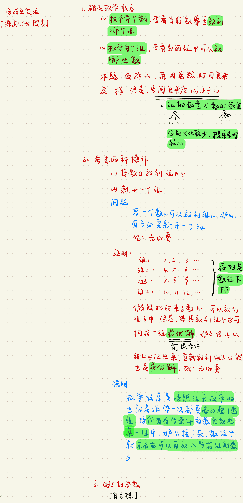

**代ç **

```c++
#include <iostream>
using namespace std;
const int N = 15;
int n, ans = N;
int p[N];
bool st[N];
int group[N][N];
int gcd(int a, int b) {
    if (!b) return a;
    return gcd(b, a % b);
}
bool check(int g[], int gc, int k) {
    for (int i = 0; i < gc; i ++ )
        if (gcd(p[g[i]], p[k]) > 1) return false;
    return true;
}
/*
å‚数解释：
    ã€å½“å‰ç»„】的编å·
    ã€å½“å‰ç»„】的个数
    ã€å½“å‰ç»„】最å一个数对应åŸæ•°ç»„的下标ä½ç½®
    ã€æ‰€æœ‰ç»„】一共æšä¸¾çš„数字个数
*/
// 注æ„æ¯ä¸ªå˜é‡çš„å«ä¹‰ï¼ï¼
void dfs(int u, int gc, int gi, int cnt) {
    // 当å‰å·²ç»æœç´¢åˆ°çš„最优解为ans
    // 如æœå¦ä¸€æ¡è·¯å¾„æœç´¢åˆ°çš„解大äºæœ€ä¼˜è§£ï¼Œè¯´æ˜ä¸€å®šä¸æ˜¯æœ€ä¼˜è§£ï¼Œåˆ™ç›´æ¥è¿”å›
    if (u >= ans) return;
    // 当å‰å·²ç»æšä¸¾å®Œã€æ‰€æœ‰çš„数字】
    if (cnt == n) {
        // 更新答案
        ans = u;
        return;
    }
    int flag = true;
    // æšä¸¾æ‰€æœ‰æ•°å­—
    for (int i = gi; i < n; i ++ )
        // 如æœå½“å‰çš„数字没有被访问过并且当å‰æ•°å­—å¯ä»¥æ”¾åˆ°å½“å‰çš„组中
        if (!st[i] && check(group[u], gc, i)) {
            // 标记已ç»è¢«è®¿é—®è¿‡
            st[i] = true;
            // 将当å‰æ•°æ”¾åˆ°å½“å‰ç»„
            group[u][gc] = i;
            // 递归下一层
            dfs(u, gc + 1, i + 1, cnt + 1);
            // 外部æœç´¢
            // å›æº¯
            flag = false;
            st[i] = false;
        }
    // 如æœå½“å‰æ•°ä¸èƒ½æ”¾ç½®åˆ°å½“å‰ç»„
    // 新开一个组å³å¯
    if (flag) dfs(u + 1, 0, 0, cnt);
    return;
}
int main() {
    scanf("%d", &n);
    for (int i = 0; i < n; i ++ ) scanf("%d", &p[i]);
    /*
    å‚数解释：
        ã€å½“å‰ç»„】的编å·
        ã€å½“å‰ç»„】的个数
        ã€å½“å‰ç»„】最å一个数对应åŸæ•°ç»„的下标ä½ç½®
        ã€æ‰€æœ‰ç»„】一共æšä¸¾çš„数字个数
    */
    dfs(1, 0, 0, 0);
    cout << ans << endl;
    return 0;
}
```

**时间å¤æ‚度**

$O(ä¸è®²æ­¦å¾·)$

**空间å¤æ‚度**

$O(n^2)$

**标签**

`BFS`

**ç¼åˆæ€ª**

### `DFS` 之剪æä¸ä¼˜åŒ–

#### 剪æ概论


#### [AcWing 165. å°çŒ«çˆ¬å±±](https://www.acwing.com/problem/content/167/)

**题目æè¿°**

>   翰翰和达达饲养了 `N` åªå°çŒ«ï¼Œè¿™å¤©ï¼Œå°çŒ«ä»¬è¦å»çˆ¬å±±ã€‚
>
>   ç»å†äº†åƒè¾›ä¸‡è‹¦ï¼Œå°çŒ«ä»¬ç»ˆäºçˆ¬ä¸Šäº†å±±é¡¶ï¼Œä½†æ˜¯ç–²å€¦çš„它们å†ä¹Ÿä¸æƒ³å¾’步走下山了（呜咕>_<）。
>
>   翰翰和达达åªå¥½èŠ±é’±è®©å®ƒä»¬åç´¢é“下山。
>
>   ç´¢é“上的缆车最大承é‡é‡ä¸º `W`，而 `N` åªå°çŒ«çš„é‡é‡åˆ†åˆ«æ˜¯ $C_1ã€C_2……C_N$。
>
>   当然，æ¯è¾†ç¼†è½¦ä¸Šçš„å°çŒ«çš„é‡é‡ä¹‹å’Œä¸èƒ½è¶…过 `W`。
>
>   æ¯ç§Ÿç”¨ä¸€è¾†ç¼†è½¦ï¼Œç¿°ç¿°å’Œè¾¾è¾¾å°±è¦ä»˜ `1` ç¾å…ƒï¼Œæ‰€ä»¥ä»–们想知é“，最少需è¦ä»˜å¤šå°‘ç¾å…ƒæ‰èƒ½æŠŠè¿™ `N` åªå°çŒ«éƒ½è¿é€ä¸‹å±±ï¼Ÿ

**输入格å¼**

>   第 `1` 行：包å«ä¸¤ä¸ªç”¨ç©ºæ ¼éš”开的整数，`N` å’Œ `W`。
>
>   第 `2..N + 1` 行：æ¯è¡Œä¸€ä¸ªæ•´æ•°ï¼Œå…¶ä¸­ç¬¬ `i + 1` 行的整数表示第 `i` åªå°çŒ«çš„é‡é‡ $C_i$。

**输出格å¼**

>   输出一个整数，表示最少需è¦å¤šå°‘ç¾å…ƒï¼Œä¹Ÿå°±æ˜¯æœ€å°‘需è¦å¤šå°‘辆缆车。

**æ•°æ®èŒƒå›´**

>   +   $1 ≤ N ≤ 18,$
>   +   $1 ≤ C_i ≤ W ≤ 10^8$

**输入样例**

```c++
5 1996
1
2
1994
12
29
```

**输出样例**

```c++
2
```

**手写稿**

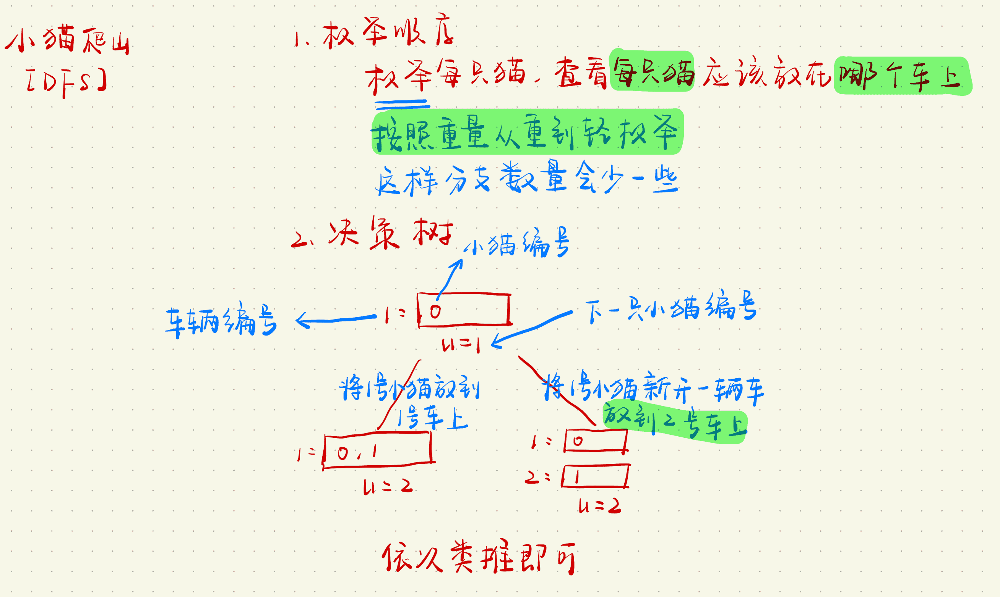

**代ç **

```c++
#include <iostream>
#include <algorithm>
using namespace std;
const int N = 20;
int n, m, ans = N;
int w[N], sum[N];
void dfs(int u, int car) {
    // 最优性剪æ
    if (car >= ans) return;
    // 如æœå°†å…¨éƒ¨å°çŒ«éƒ½æšä¸¾ç»“æŸ
    if (u == n) {
        ans = car;
        return;
    }
    // æšä¸¾æ¯è¾†è½¦
    for (int i = 0; i < car; i ++ )
        if (sum[i] + w[u] <= m) {
            sum[i] += w[u];
            dfs(u + 1, car);
            sum[i] -= w[u];
        }
    // 新开一辆车
    sum[car] = w[u];
    // 注æ„ï¼šè½¦çš„æ•°é‡ + 1ã€æ–°å¼€ä¸€è¾†è½¦ã€‘
    dfs(u + 1, car + 1);
    sum[car] = 0;
    return;
}
int main() {
    scanf("%d%d", &n, &m);
    for (int i = 0; i < n; i ++ ) scanf("%d", &w[i]);
    // 按照体é‡ä»é‡åˆ°è½»æ’åº
    sort(w, w + n, [&](int a, int b) {
        return a > b;
    });
    // ä»ç¬¬0åªå°çŒ«å¼€å§‹æšä¸¾
    // 当å‰è½¦çš„æ•°é‡ä¸º0
    dfs(0, 0);
    cout << ans << endl;
    return 0;
}
```

**时间å¤æ‚度**

$O(ä¸è®²æ­¦å¾·)$

**空间å¤æ‚度**

$O(n)$

**标签**

`DFS`ã€`剪æ`

**ç¼åˆæ€ª**

#### [AcWing 166. 数独](https://www.acwing.com/problem/content/168/)

**题目æè¿°**

>   数独是一ç§ä¼ ç»Ÿç›Šæ™ºæ¸¸æˆï¼Œä½ éœ€è¦æŠŠä¸€ä¸ª `9 × 9` 的数独补充完整，使得图中æ¯è¡Œã€æ¯åˆ—ã€æ¯ä¸ª `3 × 3` çš„ä¹å®«æ ¼å†…æ•°å­— `1 ∼ 9` å‡æ°å¥½å‡ºç°ä¸€æ¬¡ã€‚
>
>   请编写一个程åºå¡«å†™æ•°ç‹¬ã€‚

**输入格å¼**

>   输入包å«å¤šç»„测试用例。
>
>   æ¯ä¸ªæµ‹è¯•ç”¨ä¾‹å ä¸€è¡Œï¼ŒåŒ…å« `81` 个字符，代表数独的 `81` 个格内数æ®ï¼ˆé¡ºåºæ€»ä½“由上到下，åŒè¡Œç”±å·¦åˆ°å³ï¼‰ã€‚
>
>   æ¯ä¸ªå­—符都是一个数字（`1 − 9`）或一个 `.`（表示尚未填充）。
>
>   您å¯ä»¥å‡è®¾è¾“入中的æ¯ä¸ªè°œé¢˜éƒ½åªæœ‰ä¸€ä¸ªè§£å†³æ–¹æ¡ˆã€‚
>
>   文件结尾处为包å«å•è¯ `end` çš„å•è¡Œï¼Œè¡¨ç¤ºè¾“入结æŸã€‚

**输出格å¼**

>   æ¯ä¸ªæµ‹è¯•ç”¨ä¾‹ï¼Œè¾“出一行数æ®ï¼Œä»£è¡¨å¡«å……完全å的数独。

**输入样例**

```c++
4.....8.5.3..........7......2.....6.....8.4......1.......6.3.7.5..2.....1.4......
......52..8.4......3...9...5.1...6..2..7........3.....6...1..........7.4.......3.
end
```

**输出样例**

```c++
417369825632158947958724316825437169791586432346912758289643571573291684164875293
416837529982465371735129468571298643293746185864351297647913852359682714128574936
```

**手写稿**


**代ç **

```c++
#include <iostream>
using namespace std;
const int N = 9, M = 100;
char g[M];
int row[N], col[N], ones[1 << N], map[1 << N];
int tri[3][3];
// åˆå§‹åŒ–
void init() {
    for (int i = 0; i < N; i ++ )
        row[i] = col[i] = (1 << N) - 1;
    for (int i = 0; i < 3; i ++ )
        for (int j = 0; j < 3; j ++ )
            tri[i][j] = (1 << N) - 1;
    return;
}
void draw(int x, int y, int t, bool is_set) {
    if (is_set) g[x * N + y] = t + '1';
    else g[x * N + y] = '.';
    int v = 1 << t;
    // å°†vå–å
    if (!is_set) v = -v;
    // å°†v抠æ‰
    row[x] -= v;
    col[y] -= v;
    tri[x / 3][y / 3] -= v;
    return;
}
int get(int x, int y) {
    return row[x] & col[y] & tri[x / 3][y / 3];
}
int lowbit(int x) {
    return x & -x;
}
bool dfs(int cnt) {
    if (!cnt) return true;
    int x, y, Max = 15;
    for (int i = 0; i < N; i ++ )
        for (int j = 0; j < N; j ++ )
            if (g[i * N + j] == '.') {
                int state = get(i, j);
                // 寻找填写选择最少的
                // 产生的分支较少
                if (ones[state] < Max) {
                    x = i;
                    y = j;
                    Max = ones[state];
                }
            }
    int state = get(x, y);
    for (int i = state; i; i -= lowbit(i)) {
        int t = map[lowbit(i)];
        draw(x, y, t, true);
        if (dfs(cnt - 1)) return true;
        draw(x, y, t, false);
    }
    return false;
}
int main() {
    // 存储映射ã€æ‰‹å†™ç¨¿è¯´æ˜ã€‘
    for (int i = 0; i < N; i ++ ) map[1 << i] = i;
    // 统计æ¯ä¸ªæ•°ä¸­å­˜åœ¨çš„1个数
    for (int i = 0; i < 1 << N; i ++ )
        for (int j = 0; j < N; j ++ )
            ones[i] += i >> j & 1;
    while (~scanf("%s", g), g[0] != 'e') {
        // åˆå§‹åŒ–
        init();
        // 统计å¯ä»¥å¡«å†™çš„æ•°ç›®
        int cnt = 0;
        for (int i = 0; i < N; i ++ )
            for (int j = 0; j < N; j ++ ) {
                char c = g[i * N + j];
                // 如æœå·²ç»å¡«å†™æ•°å­—
                if (c != '.') {
                    int t = c - '1';
                    // 将此点标记为已ç»å¡«å†™è¿‡
                    draw(i, j, t, true);
                }
                // å¯ä»¥å¡«å†™çš„æ•°ç›® ++
                else cnt ++;
            }
        dfs(cnt);
        puts(g);
    }
    return 0;
}
```

**时间å¤æ‚度**

$O(ä¸è®²æ­¦å¾·)$

**空间å¤æ‚度**

$O(1 << N)$

**标签**

`DFS`ã€`剪æ`

**ç¼åˆæ€ª**

#### [AcWing 167. 木棒](https://www.acwing.com/problem/content/169/)

**题目æè¿°**

>   乔治拿æ¥ä¸€ç»„等长的木棒，将它们éšæœºåœ°ç æ–­ï¼Œä½¿å¾—æ¯ä¸€èŠ‚木æ£çš„长度都ä¸è¶…过 `50` 个长度å•ä½ã€‚
>
>   然åä»–åˆæƒ³æŠŠè¿™äº›æœ¨æ£æ¢å¤åˆ°ä¸ºè£æˆªå‰çš„状æ€ï¼Œä½†å¿˜è®°äº†åˆå§‹æ—¶æœ‰å¤šå°‘木棒以åŠæœ¨æ£’çš„åˆå§‹é•¿åº¦ã€‚
>
>   请你设计一个程åºï¼Œå¸®åŠ©ä¹”治计算木棒的å¯èƒ½æœ€å°é•¿åº¦ã€‚
>
>   æ¯ä¸€èŠ‚木æ£çš„长度都用大äºé›¶çš„整数表示。

**输入格å¼**

>   输入包å«å¤šç»„æ•°æ®ï¼Œæ¯ç»„æ•°æ®åŒ…括两行。
>
>   第一行是一个ä¸è¶…过 `64` 的整数，表示ç æ–­ä¹‹å共有多少节木æ£ã€‚
>
>   第二行是截断以å，所得到的å„节木æ£çš„长度。
>
>   在最å一组数æ®ä¹‹å，是一个零。

**输出格å¼**

>   为æ¯ç»„æ•°æ®ï¼Œåˆ†åˆ«è¾“出åŸå§‹æœ¨æ£’çš„å¯èƒ½æœ€å°é•¿åº¦ï¼Œæ¯ç»„æ•°æ®å ä¸€è¡Œã€‚

**æ•°æ®èŒƒå›´**

>   +   $æ•°æ®ä¿è¯æ¯ä¸€èŠ‚木æ£çš„长度å‡ä¸å¤§äº 50。$

**输入样例**

```c++
9
5 2 1 5 2 1 5 2 1
4
1 2 3 4
0
```

**输出样例**

```c++
6
5
```

**手写稿**


**代ç **

```c++
#include <iostream>
#include <algorithm>
#include <cstring>
using namespace std;
const int N = 70;
int n, sum, length;
int g[N], st[N];
/*
    å‚数说æ˜ï¼š
        大æ£çš„ç¼–å·
        组æˆå¤§æ£çš„å°æ£é•¿åº¦å’Œ
        å°æ£çš„起始ä½ç½®
*/
bool dfs(int u, int cur, int start) {
    // 如æœæ‰€æœ‰å¤§æ£çš„长度和等äºsum，说æ˜æ‰¾åˆ°ä¸€ç»„答案，直æ¥è¿”å›
    if (u * length == sum) return true;
    // 如æœå½“å‰å¤§æ£å·²ç»è¢«ç»„装完毕，则开始组装下一根大æ£
    if (cur == length) return dfs(u + 1, 0, 0);
    // 剪æ 2.I (2)
    // 组åˆå‹æšä¸¾
    for (int i = start; i < n; i ++ ) {
        if (!st[i] && cur + g[i] <= length) {
            st[i] = true;
            if (dfs(u, cur + g[i], i + 1)) return true;
            st[i] = false;
            // 剪æ 2.III (1)
            int j = i + 1;
            while (j < n && g[j] == g[i]) j ++;
            i = j - 1;
            // ä¸èƒ½ä½¿ç”¨ä¸‹æ ‡åˆ¤æ–­æ˜¯å¦æ˜¯ç¬¬ä¸€æ ¹å’Œæœ€å一根
            // åŸå› ï¼šè‡ªå·±æƒ³
            // 剪æ 2.III (2)
            // 如æœå½“å‰æ‹¼æˆçš„大æ£é•¿åº¦ä¸º0，说æ˜æ˜¯ç¬¬ä¸€æ ¹
            if (!cur) return false;
            // 剪æ 2.III (3)
            // 如æœå½“å‰æ‹¼æˆçš„大æ£é•¿åº¦â•å½“å‰å°æ£çš„长度为length，说æ˜æ˜¯æœ€å一根
            if (cur + g[i] == length) return false;
        }
    }
    return false;
}
int main() {
    while (~scanf("%d", &n), n) {
        // 多组输入
        // åˆå§‹åŒ–数组
        memset(st, 0, sizeof st);
        sum = 0;
        for (int i = 0; i < n; i ++ ) {
            scanf("%d", &g[i]);
            sum += g[i];
        }
        // 剪æ 2.I (1)
        sort(g, g + n, [&](int a, int b) {
            return a > b;
        });
        length = 1;
        while (true) {
            // 剪æ 2.II
            if (sum % length == 0 && dfs(0, 0, 0)) break;
            length ++ ;
        }
        cout << length << endl;
    }
    return 0;
}
```

**时间å¤æ‚度**

$O(ä¸è®²æ­¦å¾·)$

**空间å¤æ‚度**

$O(n)$

**标签**

`BFS`ã€`剪æ优化`

**ç¼åˆæ€ª**


#### [AcWing 168. 生日蛋糕](https://www.acwing.com/problem/content/170/)

**题目æè¿°**

>   `7` 月 `17` 日是 `Mr.W` 的生日，`ACM-THU` 为此è¦åˆ¶ä½œä¸€ä¸ªä½“积为 `NÏ€` çš„ `M` 层生日蛋糕，æ¯å±‚都是一个圆柱体。
>
>   设ä»ä¸‹å¾€ä¸Šæ•°ç¬¬ `i` 层蛋糕是åŠå¾„为 $R_i$，高度为 $H_i$ 的圆柱。
>
>   当 `i < M` 时，è¦æ±‚ $R_i>R_{i+1}$ 且 $H_i>H_{i+1}$。
>
>   ç”±äºè¦åœ¨è›‹ç³•ä¸ŠæŠ¹å¥¶æ²¹ï¼Œä¸ºå°½å¯èƒ½èŠ‚约ç»è´¹ï¼Œæˆ‘们希望蛋糕外表é¢ï¼ˆæœ€ä¸‹ä¸€å±‚的下底é¢é™¤å¤–）的é¢ç§¯ `Q` 最å°ã€‚
>
>   令 `Q = SÏ€` ，请编程对给出的 `N` å’Œ `M`，找出蛋糕的制作方案（适当的 $R_i$ å’Œ $H_i$ 的值），使 `S` 最å°ã€‚
>
>   除 `Q` 外，以上所有数æ®çš†ä¸ºæ­£æ•´æ•°ã€‚

**输入格å¼**

>   输入包å«ä¸¤è¡Œï¼Œç¬¬ä¸€è¡Œä¸ºæ•´æ•° `N`，表示待制作的蛋糕的体积为 `NÏ€`。
>
>   第二行为整数 `M`，表示蛋糕的层数为 `M`。

**输出格å¼**

>   输出仅一行，是一个正整数 `S`（若无解则 `S = 0`）。

**æ•°æ®èŒƒå›´**

>   +   $1 ≤ N ≤ 10000,$
>   +   $1 ≤ M ≤ 20$

**输入样例**

```c++
100
2
```

**输出样例**

```c++
68
```

**手写稿**

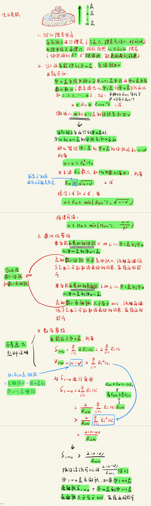

**代ç **

```c++
#include <iostream>
#include <cmath>
using namespace std;
const int N = 25, INF = 0x3f3f3f3f;
int n, m, ans = INF;
int Minv[N], Mins[N], R[N], H[N];
void dfs(int u, int v, int s) {
    // 最优性剪æ
    // 如æœä»m到u - 1层的表é¢ç§¯â•ä»ç¬¬1层到第m层的表é¢ç§¯ >= ans,è¿”å›å³å¯
    if (s + Mins[u] >= ans) return;
    // å¯è¡Œæ€§å‰ªæ
    // 如æœä»m到u - 1层的体积â•ä»ç¬¬1层到第m层的体积 > n,[ä¸æ˜¯ç­‰äº],è¿”å›å³å¯
    if (v + Minv[u] > n) return;
    // 数学剪æ
    if (s + 2 * (n - v) / R[u + 1] >= ans) return;
    // 如æœåˆ°è¾¾ç¬¬0层
    if (!u) {
        // 如æœä½“积刚好用完,更新答案
        if (v == n) ans = s;
        return;
    }
    // å…ˆæšä¸¾åŠå¾„,ä»å¤§åˆ°å°æšä¸¾
    for (int r = min(R[u + 1] - 1, (int)sqrt(n - v)); r >= u; r -- )
        // å†æšä¸¾é«˜åº¦,ä»å¤§åˆ°å°æšä¸¾
        for (int h = min(H[u + 1] - 1, (n - v) / r / r); h >= u; h -- ) {
            // æ›´æ–°åŠå¾„和高度
            R[u] = r, H[u] = h;
            int t = 0;
            // 如æœu == m,加上第m层的é¢ç§¯[手写稿图的è“色部分]
            if (u == m) t = r * r;
            // 递归下一层
            dfs(u - 1, v + r * r * h, s + 2 * r * h + t);
        }
    return;
}
int main() {
    scanf("%d%d", &n, &m);
    // 预处ç†æœ€å°ä½“积和最å°ä¾§é¢ç§¯
    for (int i = 1; i <= m; i ++ ) {
        Minv[i] = i * i * i;
        Mins[i] = 2 * i * i;
    }
    // 管ç†å“¨å…µ,åˆå§‹åŒ–为正无穷
    R[m + 1] = H[m + 1] = INF;
    dfs(m, 0, 0);
    // 无解
    if (ans == INF) cout << 0 << endl;
    else cout << ans << endl;
    return 0;
}
```

**时间å¤æ‚度**

$O(ä¸è®²æ­¦å¾·)$

**空间å¤æ‚度**

$O(n)$

**标签**

`DFS`ã€`剪æ`

**ç¼åˆæ€ª**


### 迭代加深

#### 简介


#### [AcWing 170. 加æˆåºåˆ—](https://www.acwing.com/problem/content/172/)

**题目æè¿°**

>   满足如下æ¡ä»¶çš„åºåˆ— `X`（åºåˆ—中元素被标å·ä¸º `1〠2〠3 … m`）被称为“加æˆåºåˆ—â€ï¼š
>
>   1.  `X[1] = 1`
>   2.  `X[m] = n`
>   3.  `X[1] < X[2] < … < X[m−1] < X[m]`
>   4.  对äºæ¯ä¸ª `k`（`2 ≤ k ≤ m`）都存在两个整数 `i` å’Œ `j` （`1 ≤ i, j ≤ k − 1`，`i` å’Œ `j` å¯ç›¸ç­‰ï¼‰ï¼Œä½¿å¾— `X[k] = X[i] + X[j]`。
>
>   你的任务是：给定一个整数 `n`，找出符åˆä¸Šè¿°æ¡ä»¶çš„长度 `m` 最å°çš„“加æˆåºåˆ—â€ã€‚
>
>   如æœæœ‰å¤šä¸ªæ»¡è¶³è¦æ±‚的答案，åªéœ€è¦æ‰¾å‡ºä»»æ„一个å¯è¡Œè§£ã€‚

**输入格å¼**

>   输入包å«å¤šç»„测试用例。
>
>   æ¯ç»„测试用例å æ®ä¸€è¡Œï¼ŒåŒ…å«ä¸€ä¸ªæ•´æ•° `n`。
>
>   当输入为å•è¡Œçš„ `0` 时，表示输入结æŸã€‚

**输出格å¼**

>   对äºæ¯ä¸ªæµ‹è¯•ç”¨ä¾‹ï¼Œè¾“出一个满足需求的整数åºåˆ—，数字之间用空格隔开。
>
>   æ¯ä¸ªè¾“出å ä¸€è¡Œã€‚

**æ•°æ®èŒƒå›´**

>   +   $1 ≤ n ≤ 100$

**输入样例**

```c++
5
7
12
15
77
0
```

**输出样例**

```c++
1 2 4 5
1 2 4 6 7
1 2 4 8 12
1 2 4 5 10 15
1 2 4 8 9 17 34 68 77
```

**手写稿**


**代ç **

```c++
#include <iostream>
using namespace std;
const int N = 110;
int n;
int path[N];
/*
    å‚æ•°:
        å‚æ•°1: æšä¸¾çš„层数
        å‚æ•°2: 规定的深度
*/
bool dfs(int u, int depth) {
    // 如æœå½“å‰æ·±åº¦å¤§äºè§„定的深度, è¿”å›
    if (u > depth) return false;
    // 下标ä»[0, u - 1], 如æœæœ€å一个数等äºn
    if (path[u - 1] == n) return true;
    // æ’除等效冗余
    bool st[N] = {false};
    for (int i = 0; i < u; i ++ )
        for (int j = i; j >= 0; j -- ) {
            int s = path[i] + path[j];
            // 如æœå½“å‰æ•°å­—çš„å’Œå°äºç­‰äº n
            // 当å‰æ€»å’Œä¸¥æ ¼å¤§äºä¸Šä¸€ä¸ªæ•°å­—
            // 当å‰æ•°å­—没有被访问过
            if (s <= n && s > path[u - 1] && !st[s]) {
                st[s] = true;
                path[u] = s;
                // 产生è¿é”å应
                if (dfs(u + 1, depth)) return true;
            }
        }
    return false;
}
int main() {
    path[0] = 1;
    while (~scanf("%d", &n), n) {
        int depth = 1;
        // 确定深度
        while (!dfs(1, depth)) depth ++;
        for (int i = 0; i < depth; i ++ ) cout << path[i] << " ";
        cout << endl;
    }
    return 0;
}
```

**时间å¤æ‚度**

$O(ä¸è®²æ­¦å¾·)$

**空间å¤æ‚度**

$O(h), h是深度$

**标签**

`迭代加深`

**ç¼åˆæ€ª**


### åŒå‘ `DFS`

#### [AcWing 171. é€ç¤¼ç‰©](https://www.acwing.com/problem/content/173/)

**题目æè¿°**

>   达达帮翰翰给女生é€ç¤¼ç‰©ï¼Œç¿°ç¿°ä¸€å…±å‡†å¤‡äº† `N` 个礼物，其中第 ii 个礼物的é‡é‡æ˜¯ `G[i]`。
>
>   达达的力气很大，他一次å¯ä»¥æ¬åŠ¨é‡é‡ä¹‹å’Œä¸è¶…过 `W` çš„ä»»æ„多个物å“。
>
>   达达希望一次æ¬æ‰å°½é‡é‡çš„一些物å“，请你告诉达达在他的力气范围内一次性能æ¬åŠ¨çš„最大é‡é‡æ˜¯å¤šå°‘。

**输入格å¼**

>   第一行两个整数，分别代表 `W` 和 `N`。
>
>   以å `N` 行，æ¯è¡Œä¸€ä¸ªæ­£æ•´æ•°è¡¨ç¤º `G[i]`。

**输出格å¼**

>   仅一个整数，表示达达在他的力气范围内一次性能æ¬åŠ¨çš„最大é‡é‡ã€‚

**æ•°æ®èŒƒå›´**

>   +   $1 ≤ N ≤ 46,$
>   +   $1 ≤ W, G[i] ≤ 2^{31} − 1$

**输入样例**

```c++
20 5
7
5
4
18
1
```

**输出样例**

```c++
19
```

**手写稿**


**代ç **

```c++
#include <iostream>
#include <algorithm>
using namespace std;
typedef long long LL;
const int N = 50, M = 1 << 26;
int n, m, k, cnt, ans;
// å–M = 1 << 26ä¸æ˜¯ 1 << N 
int w[N], choices[M];
void dfs1(int u, int s) {
    if (u == k) {
        choices[cnt ++ ] = s;
        return;
    }
    // ä¸é€‰æ‹©ç¬¬u个物å“
    dfs1(u + 1, s);
    // 选择第u个物å“
    // 数组å¯èƒ½ä¼šè¶Šç•Œ
    if ((LL)s + w[u] <= m) dfs1(u + 1, s + w[u]);
    return;
}
void dfs2(int u, int s) {
    if (u == n) {
        // 二分模æ¿
        int l = 0, r = cnt - 1;
        while (l < r) {
            int mid = l + r + 1 >> 1;
            if ((LL)s + choices[mid] <= m) l = mid;
            else r = mid - 1;
        }
        // åªæœ‰å½“答案åˆæ³•çš„时候, æ‰æ›´æ–°ç­”案
        if ((LL)s + choices[l] <= m) ans = max(ans, s + choices[l]);
        return;
    }
    // ä¸é€‰æ‹©ç¬¬u个物å“
    dfs2(u + 1, s);
    // 选择第u个物å“
    // 注æ„数组越界
    if ((LL)s + w[u] <= m) dfs2(u + 1, s + w[u]);
    return;
}
int main() {
    scanf("%d%d", &m, &n);
    for (int i = 0; i < n; i ++ ) scanf("%d", &w[i]);
    // ä»å¤§åˆ°å°æ’åº, æœç´¢ç©ºé—´å°
    sort(w, w + n, [&] (LL a, LL b) {
        return a > b;
    });
    // 注æ„: å»æœ€å°å€¼, 因为 n / 2 + 2 å¯èƒ½ä¼šè¶Šç•Œ
    // 例如 n = 1
    k = min(n - 1, n / 2 + 2);
    dfs1(0, 0);
    // æ’åº
    sort(choices, choices + cnt);
    // å»é‡
    cnt = unique(choices, choices + cnt) - choices;
    dfs2(k, 0);
    cout << ans << endl;
    return 0;
}
```

**时间å¤æ‚度**

$O(ä¸è®²æ­¦å¾·)$

**空间å¤æ‚度**

$O(2 ^ {n / 2})$

**标签**

`åŒå‘DFS`

**ç¼åˆæ€ª**

[å®æ•°äºŒåˆ†](#å®æ•°äºŒåˆ†)

### `IDA*`

#### [AcWing 180. æ’书](https://www.acwing.com/problem/content/182/)

**题目æè¿°**

>   给定 `n` 本书，编å·ä¸º `1 ∼ n`。
>
>   在åˆå§‹çŠ¶æ€ä¸‹ï¼Œä¹¦æ˜¯ä»»æ„æ’列的。
>
>   在æ¯ä¸€æ¬¡æ“作中，å¯ä»¥æŠ½å–其中è¿ç»­çš„一段，å†æŠŠè¿™æ®µæ’入到其他æŸä¸ªä½ç½®ã€‚
>
>   我们的目标状æ€æ˜¯æŠŠä¹¦æŒ‰ç…§ `1 ∼ n` 的顺åºä¾æ¬¡æ’列。
>
>   求最少需è¦å¤šå°‘次æ“作。

**输入格å¼**

>   第一行包å«æ•´æ•° `T`，表示共有 `T` 组测试数æ®ã€‚
>
>   æ¯ç»„æ•°æ®åŒ…å«ä¸¤è¡Œï¼Œç¬¬ä¸€è¡Œä¸ºæ•´æ•° `n`，表示书的数é‡ã€‚
>
>   第二行为 `n` 个整数，表示 `1 ∼ n` 的一ç§ä»»æ„æ’列。
>
>   åŒè¡Œæ•°ä¹‹é—´ç”¨ç©ºæ ¼éš”开。

**输出格å¼**

>   æ¯ç»„æ•°æ®è¾“出一个最少æ“作次数。
>
>   如æœæœ€å°‘æ“作次数大äºæˆ–ç­‰äº `5` 次，则输出 `5 or more`。
>
>   æ¯ä¸ªç»“æœå ä¸€è¡Œã€‚

**æ•°æ®èŒƒå›´**

>   +   $1 ≤ n ≤ 15$

**输入样例**

```c++
3
6
1 3 4 6 2 5
5
5 4 3 2 1
10
6 8 5 3 4 7 2 9 1 10
```

**输出样例**

```c++
2
3
5 or more
```

**手写稿**


**代ç **

```c++
#include <iostream>
#include <cstring>
using namespace std;
const int N = 20;
int n, T;
int g[N];
// 记录æ¯ä¸€å±‚çš„æ’列
int w[5][N];
// 计算ä¸åˆæ³•æ•°å¯¹çš„个数
int f() {
    int tot = 0;
    for (int i = 0; i + 1 < n; i ++ )
        if (g[i + 1] != g[i] + 1) tot ++;
    return (tot + 2) / 3;
}
bool dfs(int u, int MaxDepth) {
    // 超过最大深度, ç›´æ¥è¿”å›å³å¯
    if (u + f() > MaxDepth) return false;
    // ä¸åˆæ³•æ•°å¯¹ä¸º0, 说æ˜å…¨éƒ¨åˆæ³•, 找到答案
    if (f() == 0) return true;
    // æšä¸¾é•¿åº¦
    // 长度为n, 没有必è¦æšä¸¾
    for (int len = 1; len < n; len ++ )
        // æšä¸¾å·¦ç«¯ç‚¹
        for (int l = 0; l + len - 1 < n; l ++ ) {
            // 计算å³ç«¯ç‚¹
            int r = l + len - 1;
            for (int k = r + 1; k < n; k ++ ) {
                // æ‹·è´å½“å‰å±‚çš„æ’列顺åº
                memcpy(w[u], g, sizeof g);
                // 具体移动步骤, 看手写稿
                int x, y;
                for (x = r + 1, y = l; x <= k; x ++, y ++ ) g[y] = w[u][x];
                for (x = l; x <= r; x ++, y ++ ) g[y] = w[u][x];
                if (dfs(u + 1, MaxDepth)) return true;
                // æ¢å¤ç°åœº
                memcpy(g, w[u], sizeof w[u]);
            }
        }
    return false;
}
int main() {
    scanf("%d", &T);
    while (T -- ) {
        scanf("%d", &n);
        for (int i = 0; i < n; i ++ ) scanf("%d", &g[i]);
        int depth = 0;
        while (depth < 5 && !dfs(0, depth)) depth ++;
        if (depth >= 5) puts("5 or more");
        else cout << depth << endl;
    }
    return 0;
}
```

**时间å¤æ‚度**

$O(ä¸è®²æ­¦å¾·)$

**空间å¤æ‚度**

$O(n)$

**标签**

`IDA*`ã€`深度优先æœç´¢`

**ç¼åˆæ€ª**


#### [AcWing 181. å›è½¬æ¸¸æˆ](https://www.acwing.com/problem/content/183/)

**题目æè¿°**

>   如下图所示，有一个 `#` 形的棋盘，上é¢æœ‰ `1, 2, 3` 三ç§æ•°å­—å„ `8` 个。
>
>   给定 `8` ç§æ“作，分别为图中的 `A ∼ H`。
>
>   这些æ“作会按照图中字æ¯å’Œç®­å¤´æ‰€æŒ‡æ˜çš„æ–¹å‘，把一æ¡é•¿ä¸º `7` çš„åºåˆ—循ç¯ç§»åŠ¨ `1` 个å•ä½ã€‚
>
>   例如下图最左边的 `#` 形棋盘执行æ“作 `A` å，会å˜ä¸ºä¸‹å›¾ä¸­é—´çš„ `#` 形棋盘，å†æ‰§è¡Œæ“作 `C` å会å˜æˆä¸‹å›¾æœ€å³è¾¹çš„ `#` 形棋盘。
>
>   给定一个åˆå§‹çŠ¶æ€ï¼Œè¯·ä½¿ç”¨æœ€å°‘çš„æ“作次数，使 `#` 形棋盘最中间的 `8` 个格å­é‡Œçš„数字相åŒã€‚
>
>   

**输入格å¼**

>   输入包å«å¤šç»„测试用例。
>
>   æ¯ä¸ªæµ‹è¯•ç”¨ä¾‹å ä¸€è¡Œï¼ŒåŒ…å« `24` 个数字，表示将åˆå§‹æ£‹ç›˜ä¸­çš„æ¯ä¸€ä¸ªä½ç½®çš„数字，按整体ä»ä¸Šåˆ°ä¸‹ï¼ŒåŒè¡Œä»å·¦åˆ°å³çš„顺åºä¾æ¬¡åˆ—出。
>
>   输入样例中的第一个测试用例，对应上图最左边棋盘的åˆå§‹çŠ¶æ€ã€‚
>
>   当输入åªåŒ…å«ä¸€ä¸ª `0` 的行时，表示输入终止。

**输出格å¼**

>   æ¯ä¸ªæµ‹è¯•ç”¨ä¾‹è¾“出å ä¸¤è¡Œã€‚
>
>   第一行包å«æ‰€æœ‰ç§»åŠ¨æ­¥éª¤ï¼Œæ¯æ­¥ç§»åŠ¨ç”¨å¤§å†™å­—æ¯ `A ∼ H` 中的一个表示，字æ¯ä¹‹é—´æ²¡æœ‰ç©ºæ ¼ï¼Œå¦‚æœä¸éœ€è¦ç§»åŠ¨åˆ™è¾“出 `No moves needed`。
>
>   第二行包å«ä¸€ä¸ªæ•´æ•°ï¼Œè¡¨ç¤ºç§»åŠ¨å®Œæˆå，中间 `8` 个格å­é‡Œçš„数字。
>
>   如æœæœ‰å¤šç§æ–¹æ¡ˆï¼Œåˆ™è¾“出字典åºæœ€å°çš„解决方案。

**输入样例**

```c++
1 1 1 1 3 2 3 2 3 1 3 2 2 3 1 2 2 2 3 1 2 1 3 3
1 1 1 1 1 1 1 1 2 2 2 2 2 2 2 2 3 3 3 3 3 3 3 3
0
```

**输出样例**

```c++
AC
2
DDHH
2
```

**手写稿**


**代ç **

```c++
#include <iostream>
using namespace std;
const int N = 24, M = 110;
int q[N], path[M];
int opposite[8] = {5, 4, 7, 6, 1, 0, 3, 2}; // A~H的逆æ“作的下标!!下标!!
int center[8] = {6, 7, 8, 11, 12, 15, 16, 17}; // 记录中间八个点的下标!!下标!!
char map[8][7] = { // 存的是下标!!下标!!
    {0, 2, 6, 11, 15, 20, 22},
    {1, 3, 8, 12, 17, 21, 23},
    {10, 9, 8, 7, 6, 5, 4},
    {19, 18, 17, 16, 15, 14, 13},
    {23, 21, 17, 12, 8, 3, 1},
    {22, 20, 15, 11, 6, 2, 0},
    {13, 14, 15, 16, 17, 18, 19},
    {4, 5, 6, 7, 8, 9, 10}
};
int f() { // 预估函数
    int sum[4] = {0};
    for (int i = 0; i < 8; i ++ ) // éå†ä¸­é—´8个点
        sum[q[center[i]]] ++;
    int Max = -1;
    for (int i = 0; i < 4; i ++ ) Max = max(Max, sum[i]);
    return 8 - Max;
}
void operation(int x) { // 进行第x个æ“作
    int t = q[map[x][0]]; // map存的是下标!!下标!!
    // map存的是下标!!下标!!
    for (int i = 1; i < 7; i ++ ) q[map[x][i - 1]] = q[map[x][i]];
    q[map[x][6]] = t; // map存的是下标!!下标!!
    return;
}
bool dfs(int u, int MaxDepth, int k) {
    if (u + f() > MaxDepth) return false;
    if (f() == 0) return true;
    // éå†8个æ“作
    for (int i = 0; i < 8; i ++ ) // 按照字典åºæšä¸¾, 答案å³ä¸ºå­—å…¸åº
        if (opposite[i] != k) {
            operation(i); // 进行第i个æ“作
            path[u] = i; // 记录æ“作的下标
            if (dfs(u + 1, MaxDepth, i)) return true; // 产生è¿é”å应
            operation(opposite[i]); // æ¢å¤ç°åœº
        }
    return false;
}
int main() {
    while (~scanf("%d", &q[0]), q[0]) {
        for (int i = 1; i < N; i ++ ) scanf("%d", &q[i]);
        int MaxDepth = 0;
        while (!dfs(0, MaxDepth, -1)) MaxDepth ++;
        if (!MaxDepth) printf("No moves needed");
        else
            for (int i = 0; i < MaxDepth; i ++ ) cout << char(path[i] + 'A');
        printf("\n%d\n", q[6]);
    }
    return 0;
}
```

**时间å¤æ‚度**

$O(ä¸è®²æ­¦å¾·)$

**空间å¤æ‚度**

$O(max(N, M))$

**标签**

`DFS`ã€`IDA*`

**ç¼åˆæ€ª**


## å¯å‘å¼ç®—法

### 模拟退ç«

#### åŸç†æ¦‚è¿°

>   1.   手写稿
>
>        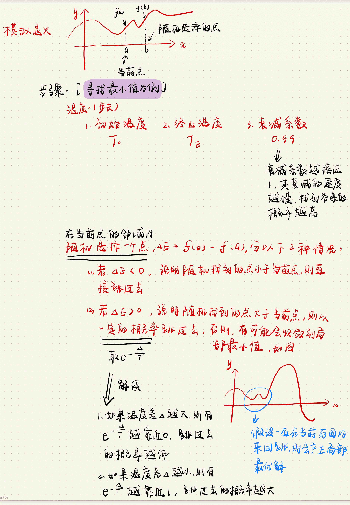
>
>   2.   动画演示
>
>        


#### [AcWing 3167. 星星还是树](https://www.acwing.com/problem/content/3170/)

**题目æè¿°**

>   在二维平é¢ä¸Šæœ‰ `n` 个点，第 `i` 个点的å标为 $(x_i,y_i)$。
>
>   请你找出一个点，使得该点到这 `n` 个点的è·ç¦»ä¹‹å’Œæœ€å°ã€‚
>
>   该点å¯ä»¥é€‰æ‹©åœ¨å¹³é¢ä¸­çš„ä»»æ„ä½ç½®ï¼Œç”šè‡³ä¸è¿™ `n` 个点的ä½ç½®é‡åˆã€‚

**输入格å¼**

>   第一行包å«ä¸€ä¸ªæ•´æ•° `n`。
>
>   æ¥ä¸‹æ¥ `n` 行，æ¯è¡ŒåŒ…å«ä¸¤ä¸ªæ•´æ•° $x_i,y_i$，表示其中一个点的ä½ç½®å标。

**输出格å¼**

>   输出最å°è·ç¦»å’Œï¼Œç­”案四èˆäº”å…¥å–整。

**æ•°æ®èŒƒå›´**

>   +   $1≤n≤100,$
>   +   $0≤x_i,y_i≤10000$

**输入样例**

```c++
4
0 0
0 10000
10000 10000
10000 0
```

**输出样例**

```c++
28284
```

**手写稿**

>   1.   åŸç†æ¦‚è¿°

**代ç **

```c++
#include <iostream>
#include <cmath>
#define x first
#define y second
using namespace std;
typedef pair<double, double> PDD;
const int N = 110, INF = 0x3f3f3f3f;
int n;
double ans = INF;
PDD q[N];
// 等概ç‡ç”ŸæˆåŒºé—´[l, r]内的一个éšæœºç‚¹
double rand(int l, int r) {
    return (double)rand() / RAND_MAX * (r - l) + l;
}
double get_dist(PDD a, PDD b) {
    double dx = a.x - b.x;
    double dy = a.y - b.y;
    return sqrt(dx * dx + dy * dy);
}
double calc(PDD p) {
    double res = 0;
    for (int i = 0; i < n; i ++ )
        res += get_dist(p, q[i]);
    // 更新答案
    ans = min(ans, res);
    return res;
}
void simulate_anneal() {
    // éšæœºç”Ÿæˆå½“å‰ç‚¹
    PDD cur(rand(0, 10000), rand(0, 10000));
    // éå†æ¸©åº¦[步长]
    for (double t = 1e4; t > 1e-4; t *= 0.99) {
        // éšæœºç”Ÿæˆå½“å‰ç‚¹çš„领域内的点
        PDD np(rand(cur.x - t, cur.x + t), rand(cur.y - t, cur.y + t));
        double dt = calc(np) - calc(cur);
        // 如æœdt < 0,则-dt / t > 0, e^{-dt / t} > 1，则一定会通过此æ¡ä»¶
        // 如æœdt > 0,则-dt / t < 0, 0 < e^{-dt / t} < 1,则有一定概ç‡å¯ä»¥è¿‡å»
        // 差的越大越ä¸å®¹æ˜“过å»
        if (exp(-dt / t) > rand(0, 1)) cur = np;
    }
    return;
}
int main() {
    scanf("%d", &n);
    for (int i = 0; i < n; i ++ ) 
        scanf("%lf%lf", &q[i].x, &q[i].y);
    // 迭代一百次
    for (int i = 0; i < 100; i ++ ) 
        simulate_anneal();
    printf("%.0lf\n", ans);
    return 0;
}
```

**时间å¤æ‚度**

$O(log_t)$

**空间å¤æ‚度**

$O(n)$

**标签**

`å¯å‘å¼ç®—法`ã€`模拟退ç«`

**ç¼åˆæ€ª**

#### [AcWing 2424. ä¿é¾„çƒ](https://www.acwing.com/problem/content/2426/)

**题目æè¿°**

>   `JYY` 很喜欢打ä¿é¾„çƒï¼Œè™½ç„¶æŠ€æœ¯ä¸é«˜ï¼Œä½†æ˜¯è¿˜æ˜¯æ€»æƒ³ç€çš„高分。
>
>   这里 `JYY` å°†å‘你介ç»ä»–所å‚加的特殊ä¿é¾„çƒæ¯”赛的规则，然å请你帮他得到尽é‡å¤šçš„分数。
>
>   一场ä¿é¾„çƒæ¯”赛一共有 `N` 个轮次，æ¯ä¸€è½®éƒ½ä¼šæœ‰ `10` 个木瓶放置在木æ¿é“çš„å¦ä¸€ç«¯ã€‚
>
>   æ¯ä¸€è½®ä¸­ï¼Œé€‰æ‰‹éƒ½æœ‰ä¸¤æ¬¡æŠ•çƒçš„机会æ¥å°è¯•å‡»å€’全部的 `10` 个木瓶。
>
>   对äºæ¯ä¸€æ¬¡æŠ•çƒæœºä¼šï¼Œé€‰æ‰‹æŠ•çƒçš„得分等äºè¿™ä¸€æ¬¡æŠ•çƒæ‰€å‡»å€’的木瓶数é‡ã€‚
>
>   选手æ¯ä¸€è½®çš„得分是他两次机会击倒全部木瓶的数é‡ã€‚
>
>   对äºæ¯ä¸€ä¸ªè½®æ¬¡ï¼Œæœ‰å¦‚下三ç§æƒ…况：
>
>   1.  “全中â€ï¼šå¦‚æœé€‰æ‰‹ç¬¬ä¸€æ¬¡å°è¯•å°±å‡»å€’了全部 `10` 个木瓶，那么这一轮就称为“全中â€ã€‚在一个“全中â€è½®ä¸­ï¼Œç”±äºæ‰€æœ‰æœ¨ç“¶åœ¨ç¬¬ä¸€æ¬¡å°è¯•ä¸­éƒ½å·²ç»è¢«å‡»å€’，所以选手ä¸éœ€è¦å†è¿›è¡Œç¬¬äºŒæ¬¡æŠ•çƒå°è¯•ã€‚åŒæ—¶ï¼Œåœ¨è®¡ç®—总分时，选手在下一轮的得分将会被乘 `2` 计入总分。
>   2.  “补中â€ï¼šå¦‚æœé€‰æ‰‹ä½¿ç”¨ä¸¤æ¬¡å°è¯•å‡»å€’了 `10` 个木瓶，那么这一轮就称为“补中â€ã€‚åŒæ—¶ï¼Œåœ¨è®¡ç®—总分时，选手在下一轮中的第一次å°è¯•çš„得分将会被乘以 `2` 计入总分。
>   3.  “失误â€ï¼šå¦‚æœé€‰æ‰‹æœªèƒ½é€šè¿‡ä¸¤æ¬¡å°è¯•å‡»å€’全部的木瓶，那么这一轮就被称为“失误â€ã€‚åŒæ—¶ï¼Œåœ¨è®¡ç®—总分时，选手在下一轮的得分会被计入总分，没有分数被翻å€ã€‚
>
>   此外，如æœç¬¬ `N` 轮是“全中â€ï¼Œé‚£ä¹ˆé€‰æ‰‹å¯ä»¥è¿›è¡Œä¸€æ¬¡é™„加轮：也就是，如æœç¬¬ `N` 轮是“全中â€ï¼Œé‚£ä¹ˆé€‰æ‰‹å°†ä¸€å…±è¿›è¡Œ `N + 1` 轮比赛。
>
>   显然，在这ç§æƒ…况下，第 `N + 1` 轮的分数一定会被加å€ã€‚
>
>   附加轮的规则åªæ‰§è¡Œä¸€æ¬¡ã€‚
>
>   也就是说，å³ä½¿ç¬¬ `N + 1` 轮选手åˆæ‰“出了“全中â€ï¼Œä¹Ÿä¸ä¼šè¿›è¡Œç¬¬ `N + 2` 轮比赛。
>
>   因而，附加轮的æˆç»©ä¸ä¼šä½¿å¾—其他轮的分数翻番。
>
>   最å，选手的总得分就是附加轮规则执行过，并且分数按上述规则加å€åçš„æ¯ä¸€è½®åˆ†æ•°ä¹‹å’Œã€‚
>
>   `JYY` 刚刚进行了一场 `N` 个轮次的ä¿é¾„çƒæ¯”赛，但是，`JYY` é常ä¸æ»¡æ„他的得分。
>
>   `JYY` 想出了一个åŠæ³•ï¼šä»–å¯ä»¥æŠŠè®°åˆ†è¡¨ä¸Šï¼Œä»–所打出的所有轮次的顺åºé‡æ–°æ’列，这样é‡æ–°æ’列之å，由äºç¿»å€è§„则的存在，`JYY` å°±å¯ä»¥å¾—到更高的分数了ï¼
>
>   当然了，`JYY` ä¸å¸Œæœ›åšçš„太å‡ï¼Œä»–希望ä¿è¯é‡æ–°æ’列之å，所需è¦è¿›è¡Œçš„轮数和é‡æ’å‰æ‰€è¿›è¡Œçš„轮数是一致的：
>
>   比如如æœé‡æ’å‰ `JYY` 在第 `N` 轮打出了“全中â€ï¼Œé‚£ä¹ˆé‡æ’之å，第 `N` 轮还得是“全中â€ä»¥ä¿è¯æ¯”赛一共进行 `N+1` 轮；åŒæ ·çš„ï¼Œå¦‚æœ `JYY` 第 `N` 轮没有打出“全中â€ï¼Œé‚£ä¹ˆé‡æ’过å第 `N` 轮也ä¸èƒ½æ˜¯å…¨ä¸­ã€‚
>
>   请你帮助 `JYY` 计算一下，他å¯ä»¥å¾—到的最高的分数。

**输入格å¼**

>   第一行包å«ä¸€ä¸ªæ•´æ•° `N`，表示ä¿é¾„çƒæ¯”赛所需è¦è¿›è¡Œçš„轮数。
>
>   æ¥ä¸‹æ¥åŒ…å« `N` 或者 `N+1` 行，第 `i` 行包å«ä¸¤ä¸ªéè´Ÿæ•´æ•° $X_i$ å’Œ $Y_i$，表示 `JYY` 在这一轮两次投çƒå°è¯•æ‰€å¾—到的分数，$X_i$ 表示第一次å°è¯•ï¼Œ$Y_i$ 表示第二次å°è¯•ã€‚
>
>   我们用 `10 0` 表示一个“全中â€è½®ã€‚
>
>   输入数æ®ä¿è¯åˆæ³•ï¼Œå½“且仅当 $X_n=10,Y_n=0$ 时，存在 `N+1` è¡Œ $X_i$ å’Œ $Y_i$。

**输出格å¼**

>   输出一行一个整数，表示 `JYY` 最大å¯èƒ½å¾—到的分数。

**æ•°æ®èŒƒå›´**

>   +   $1≤N≤50$

**输入样例**

```c++
2
5 2
10 0
3 7
```

**输出样例**

```c++
44
```

**样例**

>   按照输入顺åºï¼Œ`JYY` 将得到 $37$ 分。
>
>   最佳方案是将 `3` 个轮次æ’列æˆå¦‚下顺åºï¼š
>
>   ```c++
>   3 7
>   10 0
>   5 2
>   ```

**手写稿**


**代ç **

```c++
#include <iostream>
#include <cmath>
#define x first
#define y second
using namespace std;
typedef pair<int, int> PII;
const int N = 55;
int n, m, ans;
PII q[N];
int calc() {
    int res = 0;
    for (int i = 0; i < m; i ++ ) {
        res += q[i].x + q[i].y;
        if (q[i].x == 10) res += q[i + 1].x + q[i + 1].y;
        else if (q[i].x + q[i].y == 10) res += q[i + 1].x;
    }
    ans = max(ans, res);
    return res;
}
void simulate_anneal() {
    // 温度
    for (double t = 1e4; t > 1e-6; t *= 0.98) {
        // 生æˆéšæœºæ’列
        int x = calc();
        // éšæœºç”Ÿæˆä¸¤ä¸ªä¸‹æ ‡
        int a = rand() % m, b = rand() % m;
        // 交æ¢
        swap(q[a], q[b]);
        // 如æœäº¤æ¢ä¹‹å‰å’Œäº¤æ¢ä¹‹å的轮数一样，则是åˆæ³•çš„交æ¢
        if (n + (q[n - 1].x == 10) == m) {
            // 计算交æ¢ä¹‹å的值
            int y = calc();
            // 计算差值
            int dt = y - x;
            // 如æœæ–°çš„值比当å‰å€¼å°ï¼Œåˆ™ä»¥ä¸€å®šæ¦‚ç‡è·³è¿‡å»
            // 如æœä»¥å½“å‰çš„概ç‡è·³ä¸è¿‡å»ï¼Œåˆ™è®°å¾—æ¢å¤ç°åœº
            if (exp(dt / t) < (double)rand() / RAND_MAX) swap(q[a], q[b]);
        }
        // 如æœå½“å‰äº¤æ¢ä¸åˆæ³•ï¼Œè®°å¾—æ¢å¤ç°åœº
        else swap(q[a], q[b]);
    }
    return;
}
int main() {
    scanf("%d", &n);
    m = n;
    for (int i = 0; i < n; i ++ )
        scanf("%d%d", &q[i].x, &q[i].y);
    if (q[n - 1].x == 10) scanf("%d%d", &q[n].x, &q[n].y), m ++ ;
    // 模拟退ç«
    for (int i = 0; i < 100; i ++ ) simulate_anneal();
    cout << ans << endl;
    return 0;
}
```

**时间å¤æ‚度**

$O(nlog_t)$

**空间å¤æ‚度**

$O(n)$

**标签**

`å¯å‘å¼ç®—法`ã€`模拟退ç«`

**ç¼åˆæ€ª**

#### [AcWing 2680. å‡åˆ†æ•°æ®](https://www.acwing.com/problem/content/2682/)

**题目æè¿°**

>   已知 `N` 个正整数：$A_1ã€A_2ã€â€¦â€¦ã€A_n$。
>
>   今è¦å°†å®ƒä»¬åˆ†æˆ `M` 组，使得å„组数æ®çš„数值和最平å‡ï¼Œå³å„组的å‡æ–¹å·®æœ€å°ã€‚
>
>   å‡æ–¹å·®å…¬å¼å¦‚下：
>   $$
>   \sigma=\sqrt{\frac{\sum\nolimits_{i = 1}^{n}(x_i - \bar x)^2}{n}}, 
>   \bar x = \frac{\sum\nolimits_{i = 1}^{n}x_i}{n}
>   $$
>   其中 `σ` 为å‡æ–¹å·®ï¼Œ$\bar x$ 为å„组数æ®å’Œçš„å¹³å‡å€¼ï¼Œ$x_i$ 为第 `i` 组数æ®çš„数值和。

**输入格å¼**

>   第一行是两个整数，表示 `N,M` 的值（`N` 是整数个数，`M` 是è¦åˆ†æˆçš„组数）。
>
>   第二行有 `N` 个整数，表示 $A_1ã€A_2ã€â€¦â€¦ã€A_n$。（åŒä¸€è¡Œçš„整数间用空格分开）

**输出格å¼**

>   包括一行，这一行åªåŒ…å«ä¸€ä¸ªæ•°ï¼Œè¡¨ç¤ºæœ€å°å‡æ–¹å·®çš„值(ä¿ç•™å°æ•°ç‚¹å两ä½æ•°å­—)。

**æ•°æ®èŒƒå›´**

>   +   $M≤N≤20,$
>   +   $2≤M≤6,$
>   +   $1≤A_i≤50$

**输入样例**

```c++
6 3
1 2 3 4 5 6
```

**输出样例**

```c++
0.00
```

**手写稿**

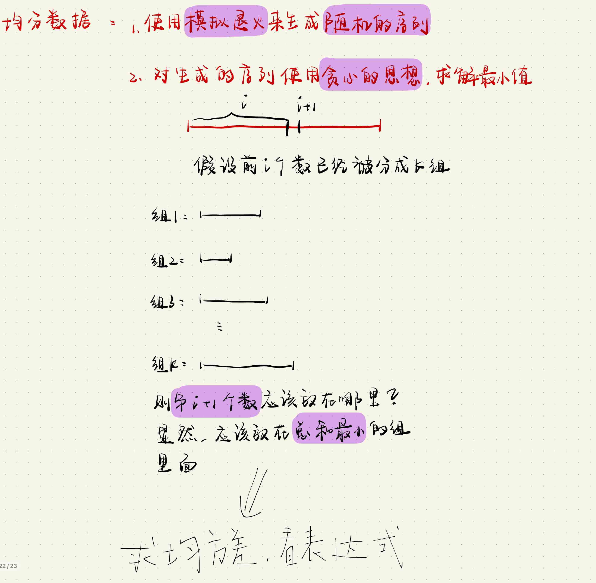

**代ç **

```c++
#include <iostream>
#include <algorithm>
#include <cstring>
#include <cmath>
using namespace std;
const int N = 25, INF = 0x3f3f3f3f;
int n, m;
// 注æ„是doubleç±»å‹
double ans = INF;
int q[N], sum[N];
int calc() {
    // æ¯æ¬¡æ¸…空总和
    memset(sum, 0, sizeof sum);
    // 贪心的æšä¸¾å½“å‰æ•°åº”该放置äºå“ªä¸ªç»„中
    for (int i = 0; i < n; i ++ ) {
        // 默认组k = 0
        int k = 0;
        for (int j = 0; j < m; j ++ )
            // 如æœå½“å‰ç»„的总和更å°ï¼Œåˆ™æ›´æ–°ç»„çš„ç¼–å·
            if (sum[j] < sum[k]) k = j;
        // 将当å‰æ ‘æ’入到组k中
        sum[k] += q[i];
    }
    // 计算平å‡å€¼
    double avg = 0;
    for (int i = 0; i < m; i ++ ) avg += (double)sum[i] / m;
    double res = 0;
    for (int i = 0; i < m; i ++ )
        // å‡æ–¹å·®çš„å…¬å¼
        res += (sum[i] - avg) * (sum[i] - avg);
    // 别忘记除m，ä¸æ˜¯é™¤n，好好ç†è§£ä¸‹é¢˜æ„
    res = sqrt(res / m);
    // 更新答案
    ans = min(ans, res);
    return res;
}
void simulate_anneal() {
    // éšæœºç”Ÿæˆåºåˆ—
    random_shuffle(q, q + n);
    for (double t = 1e6; t > 1e-6; t *= 0.99) {
        // éšæœºç”Ÿæˆä¸¤ä¸ªä¸‹æ ‡
        int a = rand() % n, b = rand() % n;
        double x = calc();
        swap(q[a], q[b]);
        double y = calc();
        double dt = y - x;
        if (exp(-dt / t) < (double)rand() / RAND_MAX) swap(q[a], q[b]);
    }
    return;
}
int main() {
    scanf("%d%d", &n, &m);
    for (int i = 0; i < n; i ++ ) scanf("%d", &q[i]);
    // 迭代100次
    for (int i = 0; i < 100; i ++ )
        simulate_anneal();
    printf("%.2lf\n", ans);
    return 0;
}
```

**时间å¤æ‚度**

$O(nm)$

**空间å¤æ‚度**

$O(n)$

**标签**

`贪心`ã€`模拟退ç«`

**ç¼åˆæ€ª**


### 爬山法

#### [AcWing 207. çƒå½¢ç©ºé—´äº§ç”Ÿå™¨](https://www.acwing.com/problem/content/209/)

**题目æè¿°**

>   有一个çƒå½¢ç©ºé—´äº§ç”Ÿå™¨èƒ½å¤Ÿåœ¨ `n` 维空间中产生一个åšç¡¬çš„çƒä½“。
>
>   ç°åœ¨ï¼Œä½ è¢«å›°åœ¨äº†è¿™ä¸ª `n` ç»´çƒä½“中，你åªçŸ¥é“çƒé¢ä¸Š `n+1` 个点的å标，你需è¦ä»¥æœ€å¿«çš„速度确定这个 `n` ç»´çƒä½“çš„çƒå¿ƒå标，以便äºæ‘§æ¯è¿™ä¸ªçƒå½¢ç©ºé—´äº§ç”Ÿå™¨ã€‚
>
>   **注æ„：** æ•°æ®ä¿è¯æœ‰å”¯ä¸€è§£ã€‚

**输入格å¼**

>   第一行是一个整数 `n`。
>
>   æ¥ä¸‹æ¥çš„ `n + 1` 行，æ¯è¡Œæœ‰ `n` 个å®æ•°ï¼Œè¡¨ç¤ºçƒé¢ä¸Šä¸€ç‚¹çš„ `n` ç»´å标。
>
>   æ¯ä¸€ä¸ªå®æ•°ç²¾ç¡®åˆ°å°æ•°ç‚¹å `6` ä½ï¼Œä¸”å…¶ç»å¯¹å€¼éƒ½ä¸è¶…过 `20000`。

**输出格å¼**

>   有且åªæœ‰ä¸€è¡Œï¼Œä¾æ¬¡ç»™å‡ºçƒå¿ƒçš„ `n` ç»´å标（`n` 个å®æ•°ï¼‰ï¼Œä¸¤ä¸ªå®æ•°ä¹‹é—´ç”¨ä¸€ä¸ªç©ºæ ¼éš”开。
>
>   æ¯ä¸ªå®æ•°ç²¾ç¡®åˆ°å°æ•°ç‚¹å `3` ä½ã€‚

**æ•°æ®èŒƒå›´**

>   +   $1≤n≤10$

**输入样例**

```c++
2
0.0 0.0
-1.0 1.0
1.0 0.0
```

**输出样例**

```c++
0.500 1.500
```

**手写稿**


**代ç **

```c++
#include <iostream>
#include <cmath>
#include <cstring>
using namespace std;
const int N = 15;
int n;
// dist[N]表示圆心的nç»´åæ ‡
// delta[N]表示æ¯ä¸ªç‚¹åœ¨å½“å‰æ–¹å‘上的å移é‡
// d[N]表示æ¯ä¸ªç‚¹è·ç¦»åœ†å¿ƒçš„欧å¼è·ç¦»
double dist[N], delta[N], d[N];
double a[N][N];
void calc() {
    double avg = 0;
    memset(d, 0, sizeof d);
    memset(delta, 0, sizeof delta);
    // æšä¸¾æ¯ä¸ªç‚¹
    for (int i = 1; i <= n + 1; i ++ ) {
        // 计算欧å¼è·ç¦»
        for (int j = 1; j <= n; j ++ )
            d[i] += (a[i][j] - dist[j]) * (a[i][j] - dist[j]);
        // è·ç¦»è¦å¼€æ ¹å·
        d[i] = sqrt(d[i]);
        // 计算平å‡å€¼
        avg += d[i] / (n + 1);
    }
    // æšä¸¾æ¯ä¸ªç‚¹
    for (int i = 1; i <= n + 1; i ++ )
        // æšä¸¾æ¯ä¸ªç‚¹çš„æ¯ä¸€ç»´å‘é‡
        for (int j = 1; j <= n; j ++ )
            // 将所有点在当å‰ç»´çš„æ–¹å‘上的å移é‡ç´¯åŠ 
            delta[j] += (d[i] - avg) / avg * (a[i][j] - dist[j]);
    return;
}

int main() {
    scanf("%d", &n);
    for (int i = 1; i <= n + 1; i ++ )
        for (int j = 1; j <= n; j ++ ) {
            scanf("%lf", &a[i][j]);
            // n个点的质心
            // 质心è·ç¦»åŸç‚¹æ¯”较近
            dist[j] += a[i][j] / (n + 1);
        }
    for (double t = 1e4; t > 1e-6; t *= 0.99997) {
        calc();
        for (int i = 1; i <= n; i ++ )
            // 乘温度的目的，是让å移é‡è¶‹äºç¨³å®š
            // delta带正负，所以，直æ¥åŠ å³å¯
            dist[i] += t * delta[i];
    }
    for (int i = 1; i <= n; i ++ )
        printf("%.3lf ", dist[i]);
    return 0;
}
```

**时间å¤æ‚度**

$O(nlog_t)$

**空间å¤æ‚度**

$O(n^2)$

**标签**

`爬山法`

**ç¼åˆæ€ª**

# 图论

## `Dijkstra`

### åŸç†ä»¥åŠä¸ `SPFA` 的区别


### [AcWing 849. Dijkstra求最短路 I](https://www.acwing.com/problem/content/851/)

**题目æè¿°**

>   给定一个 `n` 个点 `m` æ¡è¾¹çš„有å‘图，图中å¯èƒ½å­˜åœ¨é‡è¾¹å’Œè‡ªç¯ï¼Œæ‰€æœ‰è¾¹æƒå‡ä¸ºæ­£å€¼ã€‚
>
>   请你求出 `1` å·ç‚¹åˆ° `n` å·ç‚¹çš„最短è·ç¦»ï¼Œå¦‚æœæ— æ³•ä» `1` å·ç‚¹èµ°åˆ° `n` å·ç‚¹ï¼Œåˆ™è¾“出 `−1`。

**输入格å¼**

>   第一行包å«æ•´æ•° `n` å’Œ `m`。
>
>   æ¥ä¸‹æ¥ `m` è¡Œæ¯è¡ŒåŒ…å«ä¸‰ä¸ªæ•´æ•° `x,y,z`，表示存在一æ¡ä»ç‚¹ `x` 到点 `y` 的有å‘边，边长为 `z`。

**输出格å¼**

>   输出一个整数，表示 `1` å·ç‚¹åˆ° `n` å·ç‚¹çš„最短è·ç¦»ã€‚
>
>   如æœè·¯å¾„ä¸å­˜åœ¨ï¼Œåˆ™è¾“出 `−1`。

**æ•°æ®èŒƒå›´**

>   +   $1≤n≤500,$
>   +   $1≤m≤10^5,$
>   +   $图中涉åŠè¾¹é•¿å‡ä¸è¶…过10000。$

**输入样例**

```c++
3 3
1 2 2
2 3 1
1 3 4
```

**输出样例**

```c++
3
```

**手写稿**


**代ç **

```c++
#include <iostream>
#include <cstring>
using namespace std;
const int N = 510, INF = 0x3f3f3f3f;
int n, m;
int st[N], dist[N];
int g[N][N];
int dijkstra() {
    memset(dist, 0x3f, sizeof dist);
    memset(st, 0, sizeof st);
    // åˆå§‹åŒ–è·ç¦»
    dist[1] = 0;
    for (int i = 0; i < n; i ++ ) {
        // 找到ã€æœªè¢«é€‰æ‹©ã€‘的最å°çš„点
        int t = -1;
        for (int j = 1; j <= n; j ++ )
            if (!st[j] && (t == -1 || dist[j] < dist[t])) t = j;
        // 标记当å‰ç‚¹å·²ç»è¢«é€‰æ‹©
        st[t] = true;
        // 使用最å°ç‚¹tå»æ›´æ–°ã€æœªè¢«é€‰æ‹©ã€‘的点
        for (int j = 1; j <= n; j ++ )
            if (!st[j] && dist[j] > dist[t] + g[t][j])
                dist[j] = dist[t] + g[t][j];
    }
    if (dist[n] == INF) return -1;
    return dist[n];
}
int main() {
    scanf("%d%d", &n, &m);
    // åˆå§‹åŒ–为正无穷
    memset(g, 0x3f, sizeof g);
    // åˆå§‹åŒ–对角线的è·ç¦»
    for (int i = 1; i <= n; i ++ ) g[i][i] = 0;
    for (int i = 0; i < m; i ++ ) {
        int u, v, w;
        scanf("%d%d%d", &u, &v, &w);
        // 注æ„：有ã€é‡è¾¹ã€‘，å–é‡è¾¹çš„最å°å€¼
        g[u][v] = min(g[u][v], w);
    }
    cout << dijkstra() << endl;
    return 0;
}
```

**时间å¤æ‚度**

$O(n^2)$

**空间å¤æ‚度**

$O(n^2)$

**标签**

`最短路`ã€`Dijkstra`

**ç¼åˆæ€ª**

### [AcWing 850. Dijkstra求最短路 II](https://www.acwing.com/problem/content/852/)

**题目æè¿°**

>   给定一个 `n` 个点 `m` æ¡è¾¹çš„有å‘图，图中å¯èƒ½å­˜åœ¨é‡è¾¹å’Œè‡ªç¯ï¼Œæ‰€æœ‰è¾¹æƒå‡ä¸ºé负值。
>
>   请你求出 `1` å·ç‚¹åˆ° `n` å·ç‚¹çš„最短è·ç¦»ï¼Œå¦‚æœæ— æ³•ä» `1` å·ç‚¹èµ°åˆ° `n` å·ç‚¹ï¼Œåˆ™è¾“出 `−1`。

**输入格å¼**

>   第一行包å«æ•´æ•° `n` å’Œ `m`。
>
>   æ¥ä¸‹æ¥ `m` è¡Œæ¯è¡ŒåŒ…å«ä¸‰ä¸ªæ•´æ•° `x,y,z`，表示存在一æ¡ä»ç‚¹ `x` 到点 `y` 的有å‘边，边长为 `z`。

**输出格å¼**

>   输出一个整数，表示 `1` å·ç‚¹åˆ° `n` å·ç‚¹çš„最短è·ç¦»ã€‚
>
>   如æœè·¯å¾„ä¸å­˜åœ¨ï¼Œåˆ™è¾“出 `−1`。

**æ•°æ®èŒƒå›´**

>   +   $1≤n,m≤1.5×10^5,$
>   +   $图中涉åŠè¾¹é•¿å‡ä¸å°äº 0，且ä¸è¶…过 10000。$
>   +   $æ•°æ®ä¿è¯ï¼šå¦‚æœæœ€çŸ­è·¯å­˜åœ¨ï¼Œåˆ™æœ€çŸ­è·¯çš„长度ä¸è¶…过 10^9。$

**输入样例**

```c++
3 3
1 2 2
2 3 1
1 3 4
```

**输出样例**

```c++
3
```

**手写稿**

>   åŸç†
>
>   
>
>   补充说æ˜
>
>   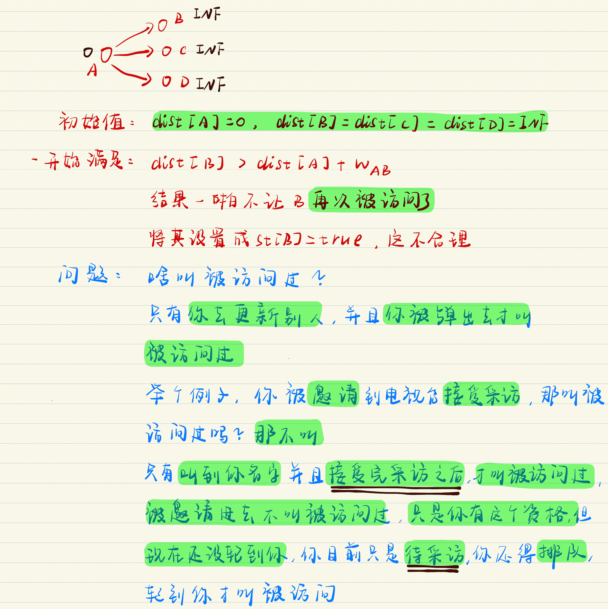

**代ç **

```c++
#include <iostream>
#include <cstring>
#include <queue>
#define x first
#define y second
using namespace std;
typedef pair<int, int> PII;
const int N = 1.5e5 + 10, INF = 0x3f3f3f3f;
int n, m, idx;
int h[N], e[N], w[N], ne[N], dist[N], st[N];
priority_queue<PII, vector<PII>, greater<PII>> q;
void add(int a, int b, int c) {
    e[idx] = b;
    w[idx] = c;
    ne[idx] = h[a];
    h[a] = idx ++;
    return;
}
int dijkstra() {
    memset(dist, 0x3f, sizeof dist);
    dist[1] = 0;
    q.push({0, 1});
    while (q.size()) {
        auto t = q.top(); q.pop();
        int v = t.y;
        // 如æœvå·²ç»è¢«è®¿é—®è¿‡ï¼Œåˆ™ç›´æ¥è¿›è¡Œä¸‹ä¸€æ¬¡è®¿é—®ã€åŸå› åœ¨æ‰‹å†™ç¨¿ä¸­å·²ç»è¯´æ˜ã€‘
        if (st[v]) continue;
        // 如æœå·²ç»è®¿é—®åˆ°ç»ˆç‚¹
        if (v == n) break;
        // 将当å‰ç‚¹æ ‡è®°ä¸ºå·²ç»é€‰æ‹©
        st[v] = true;
        // éå†vçš„é‚»æ¥ç‚¹
        for (int i = h[v]; i != -1; i = ne[i]) {
            int j = e[i];
            // 如æœå½“å‰ç‚¹æ²¡æœ‰è¢«è®¿é—®è¿‡å¹¶ä¸”当å‰ç‚¹æœ‰æ›´ä¼˜çš„路径
            // 那就干它
            if (!st[j] && dist[j] > dist[v] + w[i]) {
                dist[j] = dist[v] + w[i];
                q.push({dist[j], j});
                // 注æ„: 这里ä¸èƒ½å¡«å†™st[j] = true[手写稿补充说æ˜]
            }
        }
    }
    if (dist[n] == INF) return -1;
    return dist[n];
}
int main() {
    scanf("%d%d", &n, &m);
    memset(h, -1, sizeof h);
    for (int i = 0; i < m; i ++ ) {
        int u, v, w;
        scanf("%d%d%d", &u, &v, &w);
        // 领æ¥è¡¨ä¸éœ€è¦è€ƒè™‘é‡è¾¹çš„问题
        add(u, v, w);
    }
    cout << dijkstra() << endl;
    return 0;
}
```

**时间å¤æ‚度**

$O(log_n)$

**空间å¤æ‚度**

$O(m)$

**标签**

`堆优化版Dijkstra`

**ç¼åˆæ€ª**

### [AcWing 4196. 最短路径](https://www.acwing.com/problem/content/4199/)

**题目æè¿°**

>   给定一个 `n` 个点 `m` æ¡è¾¹çš„çš„æ— å‘图。
>
>   点的编å·ä» `1` 到 `n`。
>
>   图中å¯èƒ½åŒ…å«é‡è¾¹å’Œè‡ªç¯ã€‚
>
>   请你找到并输出一æ¡ä»ç‚¹ `1` 到点 `n` 的最短路径。

**输入格å¼**

>   第一行包å«ä¸¤ä¸ªæ•´æ•° `n,m`。
>
>   æ¥ä¸‹æ¥ `m` 行，æ¯è¡ŒåŒ…å«ä¸‰ä¸ªæ•´æ•° `a,b,w`，表示点 `a` 和点 `b` 之间存在一æ¡æ— å‘边，边长为 `w`。

**输出格å¼**

>   如æœæœ€çŸ­è·¯å¾„ä¸å­˜åœ¨ï¼Œåˆ™è¾“出 `−1`。
>
>   å¦åˆ™ï¼Œåœ¨ä¸€è¡Œå†…输出ä»ç‚¹ `1` 到点 `n` 的最短路径中ä¾æ¬¡åŒ…å«çš„点的编å·ï¼Œå„点编å·ä¹‹é—´ç”¨ç©ºæ ¼éš”开。
>
>   如æœç­”案ä¸å”¯ä¸€ï¼Œè¾“出任æ„åˆç†æ–¹æ¡ˆå‡å¯ã€‚

**æ•°æ®èŒƒå›´**

>   +   $å‰å…­ä¸ªæµ‹è¯•ç‚¹æ»¡è¶³ 2 ≤ n ≤ 10，1 ≤ m ≤ 10。$
>   +   $所有测试点满足 2 ≤ n ≤ 10^5，1 ≤ m ≤ 10^5，1 ≤ a, b ≤ n，1 ≤ w ≤ 10^6。$
>   +   $本题ä¸å¡spfa算法。$

**输入样例**

```c++
5 6
1 2 2
2 5 5
2 3 4
1 4 1
4 3 3
3 5 1
```

**输出样例**

```c++
1 4 3 5
```

**手写稿**

>   1.   `long long` å  `8` 个字节, å› æ­¤, `memset` åˆå§‹åŒ–为 `0x3f` 的时候, 最大值ä¸æ˜¯ `0x3f3f3f3f`, 而是 `0x3f3f3f3f3f3f3f3fll` å…± `8` 个 `3f`

**代ç **

```c++
#include <iostream>
#include <cstring>
#include <queue>
#define x first
#define y second
using namespace std;
typedef long long LL;
typedef pair<LL, int> PLI;
const int N = 100010, M = 200010;
// LLå 8个字节, å› æ­¤, INFåˆå§‹åŒ–为8个3f
const LL INF = 0x3f3f3f3f3f3f3f3fll;
int n, m, idx;
int h[N], e[M], w[M], ne[M], st[N], path[N];
LL dist[N];
void add(int a, int b, int c) {
    e[idx] = b;
    w[idx] = c;
    ne[idx] = h[a];
    h[a] = idx ++;
    return;
}
void dijkstra() {
    // åˆå§‹åŒ–dist, ç±»å‹ä¸ºLL, å 8个字节!!!
    memset(dist, 0x3f, sizeof dist);
    memset(st, false, sizeof st);
    priority_queue<PLI, vector<PLI>, greater<PLI>> heap;
    // ä»n到1倒åºæšä¸¾
    dist[n] = true;
    heap.push({0, n});
    while (heap.size()) {
        auto t = heap.top(); heap.pop();
        int u = t.y;
        LL distance = t.x;
        if (st[u]) continue;
        st[u] = true;
        for (int i = h[u]; i != -1; i = ne[i]) {
            int j = e[i];
            if (dist[j] > distance + w[i]) {
                dist[j] = distance + w[i];
                heap.push({dist[j], j});
                path[j] = u;
            }
        }
    }
    if (dist[1] == INF) cout << -1 << endl;
    else {
        int start = 1;
        while (start != n) {
            cout << start << " ";
            start = path[start];
        }
        // 最å输出nå³å¯
        cout << n << endl;
    }
    return;
}
int main() {
    scanf("%d%d", &n, &m);
    memset(h, -1, sizeof h);
    for (int i = 0; i < m; i ++ ) {
        int a, b, c;
        scanf("%d%d%d", &a, &b, &c);
        add(a, b, c);
        add(b, a, c);
    }
    dijkstra();
    return 0;
}
```

**时间å¤æ‚度**

$O(mlog_n)$

**空间å¤æ‚度**

$O(m)$

**标签**

`最短路`ã€`路径输出`

**ç¼åˆæ€ª**


## `Bellman-Ford`

### [AcWing 853. 有边数é™åˆ¶çš„最短路](https://www.acwing.com/problem/content/855/)

**题目æè¿°**

>   给定一个 `n` 个点 `m` æ¡è¾¹çš„有å‘图，图中å¯èƒ½å­˜åœ¨é‡è¾¹å’Œè‡ªç¯ï¼Œ **è¾¹æƒå¯èƒ½ä¸ºè´Ÿæ•°**。
>
>   è¯·ä½ æ±‚å‡ºä» `1` å·ç‚¹åˆ° `n` å·ç‚¹çš„最多ç»è¿‡ `k` æ¡è¾¹çš„最短è·ç¦»ï¼Œå¦‚æœæ— æ³•ä» `1` å·ç‚¹èµ°åˆ° `n` å·ç‚¹ï¼Œè¾“出 `impossible`。
>
>   注æ„：图中å¯èƒ½ **存在负æƒå›è·¯** 。

**输入格å¼**

>   第一行包å«ä¸‰ä¸ªæ•´æ•° `n,m,k`。
>
>   æ¥ä¸‹æ¥ `m` 行，æ¯è¡ŒåŒ…å«ä¸‰ä¸ªæ•´æ•° `x,y,z`，表示存在一æ¡ä»ç‚¹ `x` 到点 `y` 的有å‘边，边长为 `z`。

**输出格å¼**

>   è¾“å‡ºä¸€ä¸ªæ•´æ•°ï¼Œè¡¨ç¤ºä» `1` å·ç‚¹åˆ° `n` å·ç‚¹çš„最多ç»è¿‡ `k` æ¡è¾¹çš„最短è·ç¦»ã€‚
>
>   如æœä¸å­˜åœ¨æ»¡è¶³æ¡ä»¶çš„路径，则输出 `impossible`。

**æ•°æ®èŒƒå›´**

>   +   $1≤n,k≤500,$
>   +   $1≤m≤10000,$
>   +   $ä»»æ„边长的ç»å¯¹å€¼ä¸è¶…过 10000。$

**输入样例**

```c++
3 3 1
1 2 1
2 3 1
1 3 3
```

**输出样例**

```c++
3
```

**手写稿**


**代ç **

```c++
#include <iostream>
#include <cstring>
using namespace std;
const int N = 1e4 + 10, INF = 0x3f3f3f3f;
struct Node {
    int u, v, w;
}edges[N];
int n, m, k;
int backup[N], dist[N];
int Bellman_Ford() {
    // åˆå§‹åŒ–è·ç¦»
    memset(dist, 0x3f, sizeof dist);
    // è·ç¦»æºç‚¹çš„è·ç¦»ä¸º0
    dist[1] = 0;
    for (int i = 0; i < k; i ++ ) { // é™åˆ¶èµ°kæ¡è·¯
        // 将上一层的数æ®å¤‡ä»½
        memcpy(backup, dist, sizeof dist);
        for (int j = 0; j < m; j ++ ) { // éå†æ¯æ¡è¾¹
            int u = edges[j].u, v = edges[j].v, w = edges[j].w;
            // 记得使用上一层的数æ®
            dist[v] = min(dist[v], backup[u] + w);
        }
    }
    if (dist[n] > INF / 2) return INF;
    return dist[n];
}
int main() {
    scanf("%d%d%d", &n, &m, &k);
    for (int i = 0; i < m; i ++ ) {
        int u, v, w;
        scanf("%d%d%d", &u, &v, &w);
        edges[i] = {u, v, w};
    }
    int t = Bellman_Ford();
    if (t == INF) puts("impossible");
    else cout << t << endl;
    return 0;
}
```

**时间å¤æ‚度**

$O(mk)$

**空间å¤æ‚度**

$O(m)$

**标签**

`Bellman_Ford`

**ç¼åˆæ€ª**

## `SPFA`ã€å †ä¼˜åŒ–版 `BF`】

### [AcWing 851. spfa求最短路](https://www.acwing.com/problem/content/853/)

**题目æè¿°**

>   给定一个 `n` 个点 `m` æ¡è¾¹çš„有å‘图，图中å¯èƒ½å­˜åœ¨é‡è¾¹å’Œè‡ªç¯ï¼Œ **è¾¹æƒå¯èƒ½ä¸ºè´Ÿæ•°**。
>
>   请你求出 `1` å·ç‚¹åˆ° `n` å·ç‚¹çš„最短è·ç¦»ï¼Œå¦‚æœæ— æ³•ä» `1` å·ç‚¹èµ°åˆ° `n` å·ç‚¹ï¼Œåˆ™è¾“出 `impossible`。
>
>   æ•°æ®ä¿è¯ä¸å­˜åœ¨è´Ÿæƒå›è·¯ã€‚

**输入格å¼**

>   第一行包å«æ•´æ•° `n` å’Œ `m`。
>
>   æ¥ä¸‹æ¥ `m` è¡Œæ¯è¡ŒåŒ…å«ä¸‰ä¸ªæ•´æ•° `x,y,z`，表示存在一æ¡ä»ç‚¹ `x` 到点 `y` 的有å‘边，边长为 `z`。

**输出格å¼**

>   输出一个整数，表示 `1` å·ç‚¹åˆ° `n` å·ç‚¹çš„最短è·ç¦»ã€‚
>
>   如æœè·¯å¾„ä¸å­˜åœ¨ï¼Œåˆ™è¾“出 `impossible`。

**æ•°æ®èŒƒå›´**

>   +   $1≤n,m≤10^5,$
>   +   $图中涉åŠè¾¹é•¿ç»å¯¹å€¼å‡ä¸è¶…过 10000。$

**输入样例**

```c++
3 3
1 2 5
2 3 -3
1 3 4
```

**输出样例**

```c++
2
```

**手写稿**


**代ç **

```c++
#include <iostream>
#include <cstring>
#include <queue>
using namespace std;
const int N = 1e5 + 10, INF = 0x3f3f3f3f;
int n, m, idx;
queue<int> q;
int h[N], e[N], w[N], ne[N], dist[N], st[N];
void add(int a, int b, int c) {
    e[idx] = b;
    w[idx] = c;
    ne[idx] = h[a];
    h[a] = idx ++;
    return;
}
int spfa() {
    // åˆå§‹åŒ–è·ç¦»
    memset(dist, 0x3f, sizeof dist);
    // æºç‚¹è·ç¦»ä¸º0
    dist[1] = 0;
    // å°†æºç‚¹å…¥é˜Ÿ
    q.push(1);
    // 标记1å·ç‚¹å·²ç»åœ¨é˜Ÿåˆ—中
    st[1] = true;
    while (q.size()) {
        int t = q.front(); q.pop();
        // 标记1å·ç‚¹å·²ç»å‡ºé˜Ÿåˆ—
        st[t] = false;
        for (int i = h[t]; i != -1; i = ne[i]) {
            int j = e[i];
            // ä¸æ–­æ›´æ–°æœ€å°è·ç¦»
            if (dist[j] > dist[t] + w[i]) {
                dist[j] = dist[t] + w[i];
                // 如æœå½“å‰ç‚¹jä¸åœ¨é˜Ÿåˆ—中
                // 入队
                // 标记其在队列中
                if (!st[j]) {
                    st[j] = true;
                    q.push(j);
                }
            }
        }
    }
    if (dist[n] > INF / 2) return INF;
    return dist[n];
}
int main() {
    scanf("%d%d", &n, &m);
    memset(h, -1, sizeof h);
    for (int i = 0; i < m; i ++ ) {
        int u, v, w;
        scanf("%d%d%d", &u, &v, &w);
        add(u, v, w);
    }
    int t = spfa();
    if (t == INF) puts("impossible");
    else cout << t << endl;
    return 0;
}
```

**时间å¤æ‚度**

$最å时间å¤æ‚度O(n^2)$

**空间å¤æ‚度**

$O(n)$

**标签**

`spfa`

**ç¼åˆæ€ª**

### [AcWing 852. spfa判断负ç¯](https://www.acwing.com/problem/content/854/)

**题目æè¿°**

>   给定一个 `n` 个点 `m` æ¡è¾¹çš„有å‘图，图中å¯èƒ½å­˜åœ¨é‡è¾¹å’Œè‡ªç¯ï¼Œ **è¾¹æƒå¯èƒ½ä¸ºè´Ÿæ•°**。
>
>   请你判断图中是å¦å­˜åœ¨è´Ÿæƒå›è·¯ã€‚

**输入格å¼**

>   第一行包å«æ•´æ•° `n` å’Œ `m`。
>
>   æ¥ä¸‹æ¥ `m` è¡Œæ¯è¡ŒåŒ…å«ä¸‰ä¸ªæ•´æ•° `x,y,z`，表示存在一æ¡ä»ç‚¹ `x` 到点 `y` 的有å‘边，边长为 `z`。

**输出格å¼**

>   如æœå›¾ä¸­**存在**è´Ÿæƒå›è·¯ï¼Œåˆ™è¾“出 `Yes`，å¦åˆ™è¾“出 `No`。

**æ•°æ®èŒƒå›´**

>   +   $1≤n≤2000,$
>   +   $1≤m≤10000,$
>   +   $图中涉åŠè¾¹é•¿ç»å¯¹å€¼å‡ä¸è¶…过 10000。$

**输入样例**

```c++
3 3
1 2 -1
2 3 4
3 1 -4
```

**输出样例**

```c++
Yes
```

**手写稿**

>   1.   如æœæŸä¸ªç‚¹è¢«æ›´æ–°çš„次数大äºç­‰äº `n`，说æ˜ä¸€å®šå­˜åœ¨è´Ÿç¯

**代ç **

```c++
#include <iostream>
#include <cstring>
#include <queue>
using namespace std;
const int N = 2010, M = 10010;
int n, m, idx;
int h[N], dist[N], cnt[N], st[N], e[M], w[M], ne[M];
queue<int> q;
void add(int a, int b, int c) {
    e[idx] = b;
    w[idx] = c;
    ne[idx] = h[a];
    h[a] = idx ++;
    return;
}
bool spfa() {
    for (int i = 1; i <= n; i ++ ) {
        q.push(i);
        st[i] = true;
    }
    while (q.size()) {
        int t = q.front(); q.pop();
        st[t] = false;
        for (int i = h[t]; i != -1; i = ne[i]) {
            int j = e[i];
            if (dist[j] > dist[t] + w[i]) {
                dist[j] = dist[t] + w[i];
                // 记录æ¯ä¸ªç‚¹è¢«æ›´æ–°çš„次数
                cnt[j] = cnt[t] + 1;
                // 如æœè¢«æ›´æ–°çš„次数大äºç­‰äºn，说æ˜å­˜åœ¨ç¯
        		if (cnt[j] >= n) return true;
                if (!st[j]) {
                    st[j] = true;
                    q.push(j);
                }
            }
        }
    }
    return false;
}
int main() {
    scanf("%d%d", &n, &m);
    memset(h, -1, sizeof h);
    for (int i = 0; i < m; i ++ ) {
        int u, v, w;
        scanf("%d%d%d", &u, &v, &w);
        add(u, v, w);
    }
    if(spfa()) puts("Yes");
    else puts("No");
    return 0;
}
```

**时间å¤æ‚度**

$O(nm)$

**空间å¤æ‚度**

$O(m)$

**标签**

`SPFA判负ç¯`

**ç¼åˆæ€ª**


## å•æºæœ€çŸ­è·¯çš„建图方å¼

### [AcWing 1129. 热浪](https://www.acwing.com/problem/content/1131/)

**题目æè¿°**

>   å¾·å…‹è¨æ–¯çº¯æœ´çš„民众们这个å¤å¤©æ­£åœ¨é­å—巨大的热浪ï¼ï¼ï¼
>
>   他们的德克è¨æ–¯é•¿è§’牛åƒèµ·æ¥ä¸é”™ï¼Œå¯æ˜¯å®ƒä»¬å¹¶ä¸æ˜¯å¾ˆæ“…长生产富å«å¥¶æ²¹çš„乳制å“。
>
>   农夫 `John` 此时身先士å’地承担起å‘å¾·å…‹è¨æ–¯è¿é€å¤§é‡çš„è¥å…»å†°å‡‰çš„牛奶的é‡ä»»ï¼Œä»¥å‡è½»å¾·å…‹è¨æ–¯äººå¿å—酷暑的痛苦。
>
>   `John` å·²ç»ç ”究过å¯ä»¥æŠŠç‰›å¥¶ä»å¨æ–¯åº·æ˜Ÿè¿é€åˆ°å¾·å…‹è¨æ–¯å·çš„路线。
>
>   这些路线包括起始点和终点一共有 `T` 个åŸé•‡ï¼Œä¸ºäº†æ–¹ä¾¿æ ‡å·ä¸º `1` 到 `T`。
>
>   除了起点和终点外的æ¯ä¸ªåŸé•‡éƒ½ç”± **åŒå‘é“è·¯** è¿å‘至少两个其它的åŸé•‡ã€‚
>
>   æ¯æ¡é“路有一个通过费用（包括油费，过路费等等）。
>
>   ç»™å®šä¸€ä¸ªåœ°å›¾ï¼ŒåŒ…å« ``C`` æ¡ç›´æ¥è¿æ¥ `2` 个åŸé•‡çš„é“路。
>
>   æ¯æ¡é“路由é“路的起点 $R_s$，终点 $R_e$ 和花费 $C_i$ 组æˆã€‚
>
>   求ä»èµ·å§‹çš„åŸé•‡ $T_s$ 到终点的åŸé•‡ $T_e$ 最å°çš„总费用。

**输入格å¼**

>   第一行: `4` 个由空格隔开的整数: $T,C,T_s,T_e$;
>
>   第 `2` 到第 `C + 1` è¡Œ: 第 `i + 1` è¡Œæ述第 `i` æ¡é“è·¯ï¼ŒåŒ…å« `3` 个由空格隔开的整数: $R_s,R_e,C_i$。

**输出格å¼**

>   一个å•ç‹¬çš„æ•´æ•°è¡¨ç¤ºä» $T_s$ 到 $T_e$ 的最å°æ€»è´¹ç”¨ã€‚
>
>   æ•°æ®ä¿è¯è‡³å°‘存在一æ¡é“路。

**æ•°æ®èŒƒå›´**

>   +   $1 ≤ T ≤ 2500,$
>   +   $1 ≤ C ≤ 6200,$
>   +   $1 ≤ T_s, T_e, R_s, R_e ≤ T,$
>   +   $1 ≤ C_i ≤ 1000$

**输入样例**

```c++
7 11 5 4
2 4 2
1 4 3
7 2 2
3 4 3
5 7 5
7 3 3
6 1 1
6 3 4
2 4 3
5 6 3
7 2 1
```

**输出样例**

```c++
7
```

**手写稿**

>   1.   ç¼åˆæ€ª ==> `spfa`
>   2.   ç¼åˆæ€ª ==> 循ç¯é˜Ÿåˆ—
>
>   

**代ç **

```c++
#include <iostream>
#include <cstring>
using namespace std;
const int N = 2510, M = 6200 * 2 + 10;
int n, m, S, T, idx;
int h[N], e[M], w[M], ne[M], st[N], dist[N], q[N];
void add(int a, int b, int c) {
    e[idx] = b;
    w[idx] = c;
    ne[idx] = h[a];
    h[a] = idx ++;
    return;
}
void spfa() {
    memset(dist, 0x3f, sizeof dist);
    memset(st, false, sizeof st);
    // 循ç¯é˜Ÿåˆ—队头队尾åˆå§‹åŒ–为0
    int hh = 0, tt = 0;
    dist[S] = 0;
    // 队尾指针永远指å‘[最å一个ä½ç½®]çš„[下一个ä½ç½®]
    q[tt ++ ] = S;
    st[S] = true;
    // 循ç¯é˜Ÿåˆ—判空æ¡ä»¶ hh == tt
    // 循ç¯é˜Ÿåˆ—判满æ¡ä»¶ (tt + 1) % 长度 == hh
    while (hh != tt) {
        int t = q[hh ++ ];
        // 队头越界, 则é‡ç½®ä¸º0
        if (hh >= N) hh = 0;
        st[t] = false;
        for (int i = h[t]; i != -1; i = ne[i]) {
            int j = e[i];
            if (dist[j] > dist[t] + w[i]) {
                dist[j] = dist[t] + w[i];
                if (!st[j]) {
                    st[j] = true;
                    // 队尾越界, 则é‡ç½®ä¸º0
                    if (tt >= N) tt = 0;
                    q[tt ++ ] = j;
                }
            }
        }
    }
    return;
}
int main() {
    scanf("%d%d%d%d", &n, &m, &S, &T);
    memset(h, -1, sizeof h);
    for (int i = 0; i < m; i ++ ) {
        int u, v, w;
        scanf("%d%d%d", &u, &v, &w);
        add(u, v, w);
        add(v, u, w);
    }
    spfa();
    cout << dist[T] << endl;
    return 0;
}
```

**时间å¤æ‚度**

$å¹³å‡æ—¶é—´å¤æ‚度O(log_n), 最å时间å¤æ‚度O(nm)$

**空间å¤æ‚度**

$O(m)$

**标签**

`最短路`ã€`SPFA`

**ç¼åˆæ€ª**

[AcWing 851. spfa求最短路](#AcWing 851. spfa求最短路)ã€[LeetCode 622. 设计循ç¯é˜Ÿåˆ—](#LeetCode 622. 设计循ç¯é˜Ÿåˆ—)

### [AcWing 1128. 信使](https://www.acwing.com/problem/content/1130/)

**题目æè¿°**

>   战争时期，å‰çº¿æœ‰ `n` 个哨所，æ¯ä¸ªå“¨æ‰€å¯èƒ½ä¼šä¸å…¶ä»–若干个哨所之间有通信è”系。
>
>   信使负责在哨所之间传递信æ¯ï¼Œå½“然，这是è¦èŠ±è´¹ä¸€å®šæ—¶é—´çš„（以天为å•ä½ï¼‰ã€‚
>
>   指挥部设在第一个哨所。
>
>   当指挥部下达一个命令å，指挥部就派出若干个信使å‘ä¸æŒ‡æŒ¥éƒ¨ç›¸è¿çš„哨所é€ä¿¡ã€‚
>
>   当一个哨所æ¥åˆ°ä¿¡å，这个哨所内的信使们也以åŒæ ·çš„æ–¹å¼å‘其他哨所é€ä¿¡ã€‚**信在一个哨所内åœç•™çš„时间å¯ä»¥å¿½ç•¥ä¸è®¡**。
>
>   直至所有 `n` 个哨所全部æ¥åˆ°å‘½ä»¤å，é€ä¿¡æ‰ç®—æˆåŠŸã€‚
>
>   因为准备充足，æ¯ä¸ªå“¨æ‰€å†…都安æ’了足够的信使（如æœä¸€ä¸ªå“¨æ‰€ä¸å…¶ä»– `k` 个哨所有通信è”系的è¯ï¼Œè¿™ä¸ªå“¨æ‰€å†…至少会é…备 `k` 个信使）。
>
>   ç°åœ¨æ€»æŒ‡æŒ¥è¯·ä½ ç¼–一个程åºï¼Œè®¡ç®—出完æˆæ•´ä¸ªé€ä¿¡è¿‡ç¨‹æœ€çŸ­éœ€è¦å¤šå°‘时间。

**输入格å¼**

>   第 `1` 行有两个整数 `n` å’Œ `m`，中间用 `1` 个空格隔开，分别表示有 `n` 个哨所和 `m` æ¡é€šä¿¡çº¿è·¯ã€‚
>
>   第 `2` 至 `m+1` 行：æ¯è¡Œä¸‰ä¸ªæ•´æ•° `iã€jã€k`，中间用 `1` 个空格隔开，表示第 `i` 个和第 `j` 个哨所之间存在 **åŒå‘** 通信线路，且这æ¡çº¿è·¯è¦èŠ±è´¹ `k` 天。

**输出格å¼**

>   一个整数，表示完æˆæ•´ä¸ªé€ä¿¡è¿‡ç¨‹çš„最短时间。
>
>   如æœä¸æ˜¯æ‰€æœ‰çš„哨所都能收到信，就输出 `-1`。

**æ•°æ®èŒƒå›´**

>   +   $1 ≤ n ≤ 100,$
>   +   $1 ≤ m ≤ 200,$
>   +   $1 ≤ k ≤ 1000$

**输入样例**

```c++
4 4
1 2 4
2 3 7
2 4 1
3 4 6
```

**输出样例**

```c++
11
```

**手写稿**


**代ç **

```c++
#include <iostream>
#include <cstring>
using namespace std;
const int N = 110, INF = 0x3f3f3f3f;
int n, m;
int g[N][N];
int main() {
    scanf("%d%d", &n, &m);
    memset(g, 0x3f, sizeof g);
    for (int i = 1; i <= n; i ++ ) g[i][i] = 0;
    for (int i = 0; i < m; i ++ ) {
        int u, v, w;
        scanf("%d%d%d", &u, &v, &w);
        // 防止出ç°é‡è¾¹, é‡è¾¹å–最å°å€¼
        g[u][v] = g[v][u] = min(g[u][v], w);
    }
    // Floyd模æ¿
    for (int k = 1; k <= n; k ++ )
        for (int i = 1; i <= n; i ++ )
            for (int j = 1; j <= n; j ++ )
                g[i][j] = min(g[i][j], g[i][k] + g[k][j]);
    // 记录答案
    int res = -1;
    for (int i = 1; i <= n; i ++ )
        // å–所有[最å°å€¼]中的[最大值], å³æœ€å°æœ€å¤§å€¼
        res = max(res, g[1][i]);
    // ä¸è¿é€š, 输出-1
    if (res == INF) res = -1;
    cout << res << endl;
    return 0;
}
```

**时间å¤æ‚度**

$O(n^3)$

**空间å¤æ‚度**

$O(n^2)$

**标签**

`最短路`ã€`Floyd`

**ç¼åˆæ€ª**


### [AcWing 1127. 香甜的黄油](https://www.acwing.com/problem/content/1129/)

**题目æè¿°**

>   农夫 `John` å‘ç°äº†åšå‡ºå…¨å¨æ–¯åº·è¾›å·æœ€ç”œçš„黄油的方法：糖。
>
>   æŠŠç³–æ”¾åœ¨ä¸€ç‰‡ç‰§åœºä¸Šï¼Œä»–çŸ¥é“ `N` åªå¥¶ç‰›ä¼šè¿‡æ¥èˆ”它，这样就能åšå‡ºèƒ½å–好价钱的超甜黄油。
>
>   当然，他将付出é¢å¤–的费用在奶牛上。
>
>   农夫 `John` 很狡猾，就åƒä»¥å‰çš„巴甫洛夫，他知é“ä»–å¯ä»¥è®­ç»ƒè¿™äº›å¥¶ç‰›ï¼Œè®©å®ƒä»¬åœ¨å¬åˆ°é“ƒå£°æ—¶å»ä¸€ä¸ªç‰¹å®šçš„牧场。
>
>   他打算将糖放在那里然å下åˆå‘出铃声，以至他å¯ä»¥åœ¨æ™šä¸ŠæŒ¤å¥¶ã€‚
>
>   农夫 `John` 知é“æ¯åªå¥¶ç‰›éƒ½åœ¨å„自喜欢的牧场（一个牧场ä¸ä¸€å®šåªæœ‰ä¸€å¤´ç‰›ï¼‰ã€‚
>
>   给出å„头牛在的牧场和牧场间的路线，找出使所有牛到达的路程和最短的牧场（他将把糖放在那）。
>
>   **æ•°æ®ä¿è¯è‡³å°‘存在一个牧场和所有牛所在的牧场è¿é€š**。

**输入格å¼**

>   第一行: 三个数：奶牛数 `N`，牧场数 `P`，牧场间é“路数 `C`。
>
>   第二行到第 `N + 1` è¡Œ: `1` 到 `N` 头奶牛所在的牧场å·ã€‚
>
>   第 `N + 2` 行到第 `N + C + 1` 行：æ¯è¡Œæœ‰ä¸‰ä¸ªæ•°ï¼šç›¸è¿çš„牧场`Aã€B`ï¼Œä¸¤ç‰§åœºé—´è· `D`，当然，è¿æ¥æ˜¯åŒå‘的。

**输出格å¼**

>   共一行，输出奶牛必须行走的最å°çš„è·ç¦»å’Œã€‚

**æ•°æ®èŒƒå›´**

>   +   $1 ≤ N ≤ 500,$
>   +   $2 ≤ P ≤ 800,$
>   +   $1 ≤ C ≤ 1450,$
>   +   $1 ≤ D ≤ 255$

**输入样例**

```c++
3 4 5
2
3
4
1 2 1
1 3 5
2 3 7
2 4 3
3 4 5
```

**输出样例**

```c++
8
```

**手写稿**


**代ç **

```c++
#include <iostream>
#include <cstring>
using namespace std;
const int N = 810, M = 3000, INF = 0x3f3f3f3f;
int n, p, m, idx;
int id[N], h[N], e[M], w[M], ne[M], st[N], dist[N], q[N];
void add(int a, int b, int c) {
    e[idx] = b;
    w[idx] = c;
    ne[idx] = h[a];
    h[a] = idx ++;
    return;
}
int spfa(int start) {
    memset(dist, 0x3f, sizeof dist);
    memset(st, false, sizeof st);
    int hh = 0, tt = 0;
    // 起点到起点的è·ç¦»ä¸º0
    dist[start] = 0;
    // 将起点入队
    q[tt ++ ] = start;
    // 将当å‰ç‚¹æ ‡è®°ä¸ºå·²ç»åœ¨é˜Ÿåˆ—中, å³å…¥é˜Ÿ
    st[start] = true;
    while (hh != tt) {
        int t = q[hh ++ ];
        // 越界, 则ä»0开始
        if (hh == N) hh = 0;
        // 将当å‰ç‚¹æ ‡è®°ä¸ºä¸åœ¨å¯¹åˆ—中, å³å‡ºé˜Ÿ
        st[t] = false;
        for (int i = h[t]; i != -1; i = ne[i]) {
            int j = e[i];
            // æ›´æ–°è·ç¦»
            if (dist[j] > dist[t] + w[i]) {
                dist[j] = dist[t] + w[i];
                // 如æœå½“å‰ç‚¹ä¸åœ¨é˜Ÿä¸­
                if (!st[j]) {
                    // 入队
                    q[tt ++ ] = j;
                    // 越界, 则ä»0开始
                    if (tt == N) tt = 0;
                    // 标记当å‰ç‚¹åœ¨é˜Ÿåˆ—中, å³å…¥é˜Ÿ
                    st[j] = true;
                }
            }
        }
    }
    int res = 0;
    for (int i = 1; i <= n; i ++ ) {
        // è·å–奶牛所在的牧场å·
        int j = id[i];
        // ä¸å¯è¾¾, 则直æ¥è¿”å›
        if (dist[j] == INF) return INF;
        // 加上è·ç¦»å³å¯
        res += dist[j];
    }
    return res;
}
int main() {
    scanf("%d%d%d", &n, &p, &m);
    memset(h, -1, sizeof h);
    for (int i = 1; i <= n; i ++ )
        scanf("%d", &id[i]);
    for (int i = 0; i < m; i ++ ) {
        int u, v, w;
        scanf("%d%d%d", &u, &v, &w);
        add(u, v, w);
        add(v, u, w);
    }
    int res = INF;
    for (int i = 1; i <= p; i ++ )
        // å–最å°è·ç¦»å’Œ
        res = min(res, spfa(i));
    cout << res << endl;
    return 0;
}
```

**时间å¤æ‚度**

$O(nm), n是牧场数目, m是边的个数$

**空间å¤æ‚度**

$O(m), m是边数$

**标签**

`最短路`ã€`SPFA`

**ç¼åˆæ€ª**

### [AcWing 1126. 最å°èŠ±è´¹](https://www.acwing.com/problem/content/1128/)

**题目æè¿°**

>   在 `n` 个人中，æŸäº›äººçš„银行账å·ä¹‹é—´å¯ä»¥äº’相转账。
>
>   这些人之间转账的手续费å„ä¸ç›¸åŒã€‚
>
>   给定这些人之间转账时需è¦ä»è½¬è´¦é‡‘é¢é‡Œæ‰£é™¤ç™¾åˆ†ä¹‹å‡ çš„手续费，请问 `A` 最少需è¦å¤šå°‘钱使得转账å `B` 收到 `100` 元。

**输入格å¼**

>   第一行输入两个正整数 `n,m`，分别表示总人数和å¯ä»¥äº’相转账的人的对数。
>
>   以下 `m` è¡Œæ¯è¡Œè¾“入三个正整数 `x,y,z`，表示标å·ä¸º `x` 的人和标å·ä¸º `y` 的人之间互相转账需è¦æ‰£é™¤ `z%` 的手续费 ( `z < 100` )。
>
>   最å一行输入两个正整数 `A, B`。
>
>   æ•°æ®ä¿è¯ `A` ä¸ `B` 之间å¯ä»¥ç›´æ¥æˆ–é—´æ¥åœ°è½¬è´¦ã€‚

**输出格å¼**

>   输出 `A` 使得 `B` 到账 `100` 元最少需è¦çš„总费用。
>
>   精确到å°æ•°ç‚¹å `8` ä½ã€‚

**æ•°æ®èŒƒå›´**

>   +   $1 ≤ n ≤ 2000,$
>   +   $m ≤ 10^5$

**输入样例**

```c++
3 3
1 2 1
2 3 2
1 3 3
1 3
```

**输出样例**

```c++
103.07153164
```

**手写稿**


**代ç **

```c++
#include <iostream>
#include <cstring>
using namespace std;
const int N = 2010, INF = 0x43434343;
int n, m;
int st[N];
double dist[N];
double g[N][N];
// 朴素版Dijkstra模æ¿
// 注æ„: æ•°æ®ç±»å‹
void dijkstra(int start, int end) {
    memset(dist, 0x43, sizeof dist);
    dist[start] = 100;
    for (int i = 0; i < n - 1; i ++ ) {
        int t = -1;
        for (int j = 1; j <= n; j ++ )
            if (!st[j] && (t == -1 || dist[t] > dist[j])) t = j;
        if (t == end) return;
        st[t] = true;
        for (int j = 1; j <= n; j ++ ) {
            if (g[t][j] == INF) continue;
            if (!st[j] && dist[j] > dist[t] / g[t][j])
                dist[j] = dist[t] / g[t][j];
        }
    }
    return;
}
int main() {
    scanf("%d%d", &n, &m);
    for (int i = 0; i < m; i ++ ) {
        int u, v, w;
        scanf("%d%d%d", &u, &v, &w);
        g[u][v] = g[v][u] = (100.0 - w) / 100;
    }
    int start, end;
    scanf("%d%d", &end, &start);
    // åå‘Dijkstra
    dijkstra(start, end);
    printf("%.8lf\n", dist[end]);
    return 0;
}
```

**时间å¤æ‚度**

$O(n^2)$

**空间å¤æ‚度**

$O(n^2)$

**标签**

`朴素版Dijkstra`

**ç¼åˆæ€ª**


### [AcWing 920. 最优乘车](https://www.acwing.com/problem/content/922/)

**题目æè¿°**

>   `H` åŸæ˜¯ä¸€ä¸ªæ—…游胜地，æ¯å¹´éƒ½æœ‰æˆåƒä¸Šä¸‡çš„人å‰æ¥è§‚光。
>
>   为方便游客，巴士公å¸åœ¨å„个旅游景点åŠå®¾é¦†ï¼Œé¥­åº—等地都设置了巴士站并开通了一些å•ç¨‹å·´å£«çº¿è·¯ã€‚
>
>   æ¯æ¡å•ç¨‹å·´å£«çº¿è·¯ä»æŸä¸ªå·´å£«ç«™å‡ºå‘，ä¾æ¬¡é€”ç»è‹¥å¹²ä¸ªå·´å£«ç«™ï¼Œæœ€ç»ˆåˆ°è¾¾ç»ˆç‚¹å·´å£«ç«™ã€‚
>
>   一å旅客最近到 `H` åŸæ—…æ¸¸ï¼Œä»–å¾ˆæƒ³å» `S` 公园游ç©ï¼Œä½†å¦‚æœä»ä»–所在的饭店没有一路巴士å¯ä»¥ç›´æ¥åˆ°è¾¾ `S` 公园，则他å¯èƒ½è¦å…ˆä¹˜æŸä¸€è·¯å·´å£«å几站，å†ä¸‹æ¥æ¢ä¹˜åŒä¸€ç«™å°çš„å¦ä¸€è·¯å·´å£«ï¼Œè¿™æ ·æ¢ä¹˜å‡ æ¬¡å到达 `S` 公园。
>
>   ç°åœ¨ç”¨æ•´æ•° `1, 2, … N` ç»™ `H` åŸçš„所有的巴士站编å·ï¼Œçº¦å®šè¿™å旅客所在饭店的巴士站编å·ä¸º `1`，`S` 公园巴士站的编å·ä¸º `N`。
>
>   写一个程åºï¼Œå¸®åŠ©è¿™å旅客寻找一个最优乘车方案，使他在ä»é¥­åº—乘车到 `S` 公园的过程中æ¢ä¹˜çš„次数最少。

**输入格å¼**

>   第一行有两个数字 `M` å’Œ `N`，表示开通了 `M` æ¡å•ç¨‹å·´å£«çº¿è·¯ï¼Œæ€»å…±æœ‰ `N` 个车站。
>
>   ä»ç¬¬äºŒè¡Œåˆ°ç¬¬ `M + 1` è¡Œä¾æ¬¡ç»™å‡ºäº†ç¬¬ `1` æ¡åˆ°ç¬¬ `M` æ¡å·´å£«çº¿è·¯çš„ä¿¡æ¯ï¼Œå…¶ä¸­ç¬¬ `i + 1` 行给出的是第 `i` æ¡å·´å£«çº¿è·¯çš„ä¿¡æ¯ï¼Œä»å·¦è‡³å³æŒ‰è¿è¡Œé¡ºåºä¾æ¬¡ç»™å‡ºäº†è¯¥çº¿è·¯ä¸Šçš„所有站å·ï¼Œç›¸é‚»ä¸¤ä¸ªç«™å·ä¹‹é—´ç”¨ä¸€ä¸ªç©ºæ ¼éš”开。

**输出格å¼**

>   共一行，如æœæ— æ³•ä¹˜å·´å£«ä»é¥­åº—到达 `S` 公园，则输出 `NO`，å¦åˆ™è¾“出最少æ¢ä¹˜æ¬¡æ•°ï¼Œæ¢ä¹˜æ¬¡æ•°ä¸º `0` 表示ä¸éœ€æ¢è½¦å³å¯åˆ°è¾¾ã€‚

**æ•°æ®èŒƒå›´**

>   +   $1 ≤ M ≤ 100,$
>   +   $2 ≤ N ≤ 500$

**输入样例**

```c++
3 7
6 7
4 7 3 6
2 1 3 5
```

**输出样例**

```c++
2
```

**手写稿**

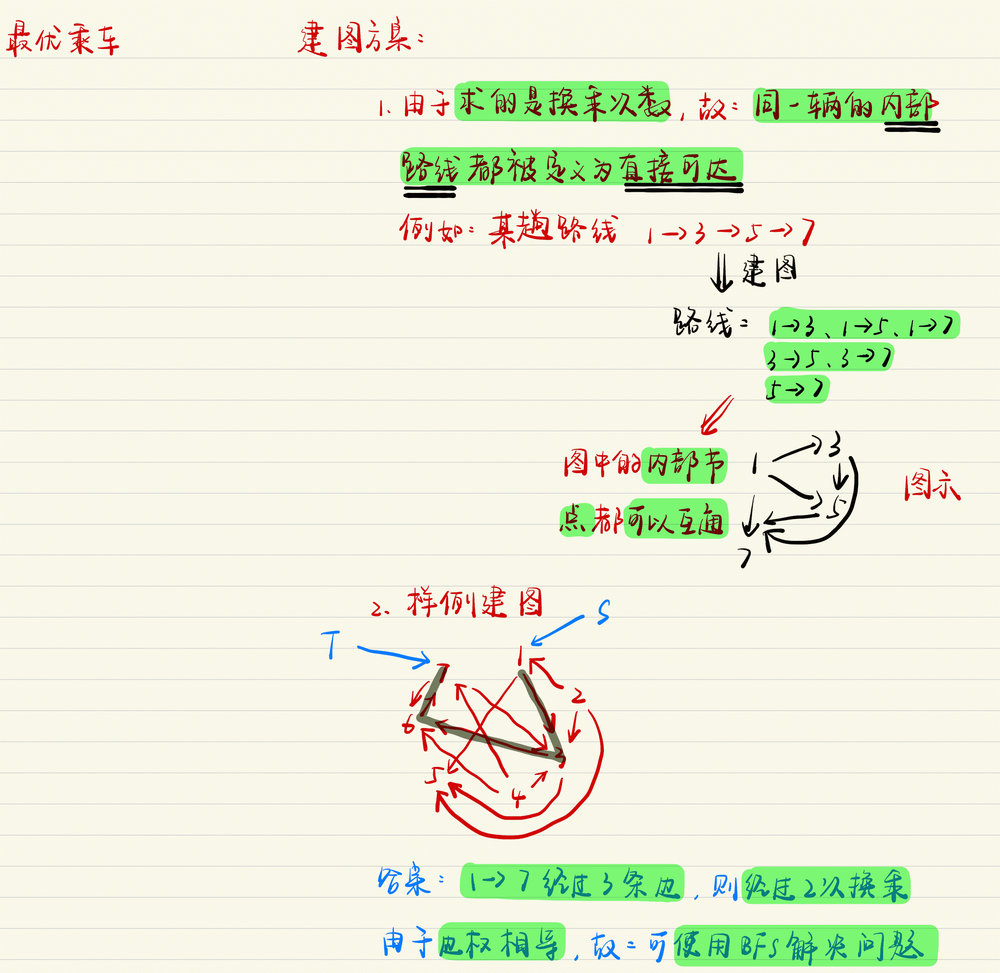

**代ç **

```c++
#include <iostream>
#include <cstring>
#include <sstream>
using namespace std;
const int N = 510, INF = 0x3f3f3f3f;
int n, m;
int stop[N], q[N], dist[N], st[N];
bool g[N][N];
// BFS模æ¿
void bfs() {
    memset(dist, 0x3f, sizeof dist);
    int hh = 0, tt = -1;
    q[++ tt ] = 1;
    st[1] = true;
    dist[1] = 0;
    while (hh <= tt) {
        int t = q[hh ++ ];
        if (t == n) return;
        for (int i = 1; i <= n; i ++ )
            if (!st[i] && g[t][i] && dist[i] > dist[t] + 1) {
                dist[i] = dist[t] + 1;
                q[++ tt] = i;
                st[i] = true;
            }
    }
    return;
}
int main() {
    scanf("%d%d", &m, &n);
    string line;
    // ç”±äºä¸çŸ¥é“è¦è¾“入多少个数
    // 使用stringstreamæ¥å¤„ç†è¾“å…¥
    getline(cin, line);
    while (m -- ) {
        int cnt = 0, t = 0;
        getline(cin, line);
        stringstream ssin(line);
        while (ssin >> t) stop[cnt ++ ] = t;
        for (int i = 0; i < cnt; i ++ )
            for (int j = i + 1; j < cnt; j ++ )
                // 两个点之间有å•å‘è¾¹
                g[stop[i]][stop[j]] = true;
    }
    bfs();
    if (dist[n] == INF) puts("NO");
    else cout << max(dist[n] - 1, 0) << endl;
    return 0;
}
```

**时间å¤æ‚度**

$O(mn^2)$

**空间å¤æ‚度**

$O(n^2)$

**标签**

`最短路`ã€`BFS`

**ç¼åˆæ€ª**


### [AcWing 903. 昂贵的è˜ç¤¼](https://www.acwing.com/problem/content/905/)

**题目æè¿°**

>   年轻的æ¢é™©å®¶æ¥åˆ°äº†ä¸€ä¸ªå°ç¬¬å®‰éƒ¨è½é‡Œã€‚
>
>   在那里他和酋长的女儿相爱了，äºæ˜¯ä¾¿å‘é…‹é•¿å»æ±‚亲。
>
>   é…‹é•¿è¦ä»–用 `10000` 个金å¸ä½œä¸ºè˜ç¤¼æ‰ç­”应把女儿å«ç»™ä»–。
>
>   æ¢é™©å®¶æ‹¿ä¸å‡ºè¿™ä¹ˆå¤šé‡‘å¸ï¼Œä¾¿è¯·æ±‚é…‹é•¿é™ä½è¦æ±‚。
>
>   酋长说：â€å—¯ï¼Œå¦‚æœä½ èƒ½å¤Ÿæ›¿æˆ‘弄到大祭å¸çš„皮袄，我å¯ä»¥åªè¦ `8000` 金å¸ã€‚如æœä½ èƒ½å¤Ÿå¼„æ¥ä»–的水晶çƒï¼Œé‚£ä¹ˆåªè¦ `5000` 金å¸å°±è¡Œäº†ã€‚â€
>
>   æ¢é™©å®¶å°±è·‘到大祭å¸é‚£é‡Œï¼Œå‘ä»–è¦æ±‚皮袄或水晶çƒï¼Œå¤§ç¥­å¸è¦ä»–用金å¸æ¥æ¢ï¼Œæˆ–者替他弄æ¥å…¶ä»–的东西，他å¯ä»¥é™ä½ä»·æ ¼ã€‚
>
>   æ¢é™©å®¶äºæ˜¯åˆè·‘到其他地方，其他人也æ出了类似的è¦æ±‚，或者直æ¥ç”¨é‡‘å¸æ¢ï¼Œæˆ–者找到其他东西就å¯ä»¥é™ä½ä»·æ ¼ã€‚
>
>   ä¸è¿‡æ¢é™©å®¶æ²¡å¿…è¦ç”¨å¤šæ ·ä¸œè¥¿å»æ¢ä¸€æ ·ä¸œè¥¿ï¼Œå› ä¸ºä¸ä¼šå¾—到更ä½çš„价格。
>
>   æ¢é™©å®¶ç°åœ¨å¾ˆéœ€è¦ä½ çš„帮忙，让他用最少的金å¸å¨¶åˆ°è‡ªå·±çš„心上人。
>
>   å¦å¤–ä»–è¦å‘Šè¯‰ä½ çš„是，在这个部è½é‡Œï¼Œç­‰çº§è§‚念å分森严。
>
>   地ä½å·®è·è¶…过一定é™åˆ¶çš„两个人之间ä¸ä¼šè¿›è¡Œä»»ä½•å½¢å¼çš„ç›´æ¥æ¥è§¦ï¼ŒåŒ…括交易。
>
>   他是一个外æ¥äººï¼Œæ‰€ä»¥å¯ä»¥ä¸å—这些é™åˆ¶ã€‚
>
>   但是如æœä»–å’ŒæŸä¸ªåœ°ä½è¾ƒä½çš„人进行了交易，地ä½è¾ƒé«˜çš„的人ä¸ä¼šå†å’Œä»–交易，他们认为这样等äºæ˜¯é—´æ¥æ¥è§¦ï¼Œå过æ¥ä¹Ÿä¸€æ ·ã€‚
>
>   因此你需è¦åœ¨è€ƒè™‘所有的情况以å给他æ供一个最好的方案。
>
>   为了方便起è§ï¼Œæˆ‘们把所有的物å“ä» `1` 开始进行编å·ï¼Œé…‹é•¿çš„å…诺也看作一个物å“，并且编å·æ€»æ˜¯ `1`。
>
>   æ¯ä¸ªç‰©å“都有对应的价格 `P`，主人的地ä½ç­‰çº§ `L`，以åŠä¸€ç³»åˆ—çš„æ›¿ä»£å“ $T_i$ 和该替代å“所对应的â€ä¼˜æƒ â€ $V_i$。
>
>   如æœä¸¤äººåœ°ä½ç­‰çº§å·®è·è¶…过了 `M`，就ä¸èƒ½â€é—´æ¥äº¤æ˜“â€ã€‚
>
>   你必须根æ®è¿™äº›æ•°æ®æ¥è®¡ç®—出æ¢é™©å®¶æœ€å°‘需è¦å¤šå°‘金å¸æ‰èƒ½å¨¶åˆ°é…‹é•¿çš„女儿。

**输入格å¼**

>   输入第一行是两个整数 `M，N`，ä¾æ¬¡è¡¨ç¤ºåœ°ä½ç­‰çº§å·®è·é™åˆ¶å’Œç‰©å“的总数。
>
>   æ¥ä¸‹æ¥æŒ‰ç…§ç¼–å·ä»å°åˆ°å¤§ä¾æ¬¡ç»™å‡ºäº† `N` 个物å“çš„æ述。
>
>   æ¯ä¸ªç‰©å“çš„æ述开头是三个éè´Ÿæ•´æ•° `Pã€Lã€X`，ä¾æ¬¡è¡¨ç¤ºè¯¥ç‰©å“çš„ä»·æ ¼ã€ä¸»äººçš„地ä½ç­‰çº§å’Œæ›¿ä»£å“总数。
>
>   æ¥ä¸‹æ¥ `X` è¡Œæ¯è¡ŒåŒ…括两个整数 `T` å’Œ `V`，分别表示替代å“çš„ç¼–å·å’Œâ€ä¼˜æƒ ä»·æ ¼â€ã€‚

**输出格å¼**

>   输出最少需è¦çš„金å¸æ•°ã€‚

**æ•°æ®èŒƒå›´**

>   +   $1 ≤ N ≤ 100,$
>   +   $1 ≤ P ≤ 10000,$
>   +   $1 ≤ L, M ≤ N$
>   +   $0 ≤ X < N$

**输入格å¼**

```c++
1 4
10000 3 2
2 8000
3 5000
1000 2 1
4 200
3000 2 1
4 200
50 2 0
```

**输出格å¼**

```c++
5250
```

**手写稿**


**代ç **

```c++
#include <iostream>
#include <cstring>
using namespace std;
const int N = 110, INF = 0x3f3f3f3f;
int n, m;
int pce[N], lev[N], dist[N], st[N];
int g[N][N];
// Dijkstra模æ¿
int dijkstra(int down, int up) {
    memset(dist, 0x3f, sizeof dist);
    memset(st, false, sizeof st);
    dist[0] = 0;
    for (int i = 1; i <= n; i ++ ) {
        int t = -1;
        for (int j = 0; j <= n; j ++ )
            if (!st[j] && (t == -1 || dist[t] > dist[j])) t = j;
        st[t] = true;
        if (t == 1) return dist[1];
        for (int j = 0; j <= n; j ++ )
            // 注æ„: 判断等级范围
            if (!st[j] && lev[j] >= down && lev[j] <= up && g[t][j] != INF && dist[j] > dist[t] + g[t][j])
                dist[j] = dist[t] + g[t][j];
    }
    return dist[1];
}
int main() {
    scanf("%d%d", &m, &n);
    memset(g, 0x3f, sizeof g);
    for (int i = 0; i <= n; i ++ ) g[i][i] = 0;
    for (int i = 1, cnt; i <= n; i ++ ) {
        scanf("%d%d%d", &pce[i], &lev[i], &cnt);
        // 0å·ç‚¹æ˜¯è¶…级æºç‚¹
        // å–最å°å€¼, 防止é‡è¾¹
        g[0][i] = min(g[0][i], pce[i]);
        while (cnt -- ) {
            int id, price;
            scanf("%d%d", &id, &price);
            // å–最å°å€¼, 防止é‡è¾¹
            g[id][i] = min(g[id][i], price);
        }
    }
    int res = INF;
    // æšä¸¾ç­‰çº§åˆ¶åº¦èŒƒå›´
    for (int i = lev[1] - m; i <= lev[1]; i ++ )
        res = min(res, dijkstra(i, i + m));
    cout << res << endl;
    return 0;
}
```

**时间å¤æ‚度**

$O(n^2m)$

**空间å¤æ‚度**

$O(n^2)$

**标签**

`建图`ã€`Dijkstra`ã€`最短路`

**ç¼åˆæ€ª**


## å•æºæœ€çŸ­è·¯çš„综åˆåº”用

### [AcWing 1135. 新年好](https://www.acwing.com/problem/content/1137/)

**题目æè¿°**

>   é‡åº†åŸé‡Œæœ‰ `n` 个车站，`m` æ¡ **åŒå‘** 公路è¿æ¥å…¶ä¸­çš„æŸäº›è½¦ç«™ã€‚
>
>   æ¯ä¸¤ä¸ªè½¦ç«™æœ€å¤šç”¨ä¸€æ¡å…¬è·¯è¿æ¥ï¼Œä»ä»»ä½•ä¸€ä¸ªè½¦ç«™å‡ºå‘都å¯ä»¥ç»è¿‡ä¸€æ¡æˆ–者多æ¡å…¬è·¯åˆ°è¾¾å…¶ä»–车站，但ä¸åŒçš„路径需è¦èŠ±è´¹çš„时间å¯èƒ½ä¸åŒã€‚
>
>   在一æ¡è·¯å¾„上花费的时间等äºè·¯å¾„上所有公路需è¦çš„时间之和。
>
>   佳佳的家在车站 `1`，他有五个亲戚，分别ä½åœ¨è½¦ç«™ `a,b,c,d,e`。
>
>   过年了，他需è¦ä»è‡ªå·±çš„家出å‘，拜访æ¯ä¸ªäº²æˆšï¼ˆé¡ºåºä»»æ„），给他们é€å»èŠ‚日的ç¥ç¦ã€‚
>
>   æ€æ ·èµ°ï¼Œæ‰éœ€è¦æœ€å°‘的时间？

**输入格å¼**

>   第一行：包å«ä¸¤ä¸ªæ•´æ•° `n,m`，分别表示车站数目和公路数目。
>
>   第二行：包å«äº”个整数 `a,b,c,d,e`，分别表示五个亲戚所在车站编å·ã€‚
>
>   以下 `m` 行，æ¯è¡Œä¸‰ä¸ªæ•´æ•° `x,y,t`，表示公路è¿æ¥çš„两个车站编å·å’Œæ—¶é—´ã€‚

**输出格å¼**

>   输出仅一行，包å«ä¸€ä¸ªæ•´æ•° `T`，表示最少的总时间。

**æ•°æ®èŒƒå›´**

>   +   $1 ≤ n ≤ 50000,$
>   +   $1 ≤ m ≤ 10^5,$
>   +   $1 < a, b, c, d, e ≤ n,$
>   +   $1 ≤ x, y ≤ n,$
>   +   $1 ≤ t ≤ 100$

**输入样例**

```c++
6 6
2 3 4 5 6
1 2 8
2 3 3
3 4 4
4 5 5
5 6 2
1 6 7
```

**输出样例**

```c++
21
```

**手写稿**


**代ç **

```c++
#include <iostream>
#include <cstring>
#include <queue>
#define x first
#define y second
using namespace std;
typedef pair<int, int> PII;
const int N = 50010, M = 200010, INF = 0x3f3f3f3f;
int n, m, idx;
int rel[6], h[N], e[M], w[M], ne[M], st[N];
int dist[6][N];
void add(int a, int b, int c) {
    e[idx] = b;
    w[idx] = c;
    ne[idx] = h[a];
    h[a] = idx ++;
    return;
}
// 数组传的都是指针
void dijkstra(int start, int dist[]) {
    // 注æ„: 这里的åˆå§‹åŒ–æ–¹å¼æœ‰äº›ä¸åŒ, 使用N * 4, 一个整数å æ®4个字节
    // ä¸èƒ½ä½¿ç”¨sizeof dist, 因为, 二维数组的åŸå› 
    memset(dist, 0x3f, N * 4);
    memset(st, false, sizeof st);
    priority_queue<PII, vector<PII>, greater<PII>> heap;
    dist[start] = 0;
    heap.push({0, start});
    while (heap.size()) {
        auto t = heap.top(); heap.pop();
        int v = t.y;
        st[v] = true;
        for (int i = h[v]; i != -1; i = ne[i]) {
            int j = e[i];
            if (!st[j] && dist[j] > dist[v] + w[i]) {
                dist[j] = dist[v] + w[i];
                heap.push({dist[j], j});
            }
        }
    }
    return;
}
/*
å‚æ•°:
    å‚æ•°1: 当å‰å·²ç»è®¿é—®è¿‡çš„亲戚数é‡
    å‚æ•°2: 当å‰æ­£åœ¨è®¿é—®çš„亲戚编å·
    å‚æ•°3: 当å‰çš„花费
*/
int dfs(int u, int start, int cost) {
    int res = INF;
    if (u == 5) {
        res = min(res, cost);
        return cost;
    }
    for (int i = 1; i <= 5; i ++ )
        if (!st[i]) {
            st[i] = true;
            int next = rel[i];
            res = min(res, dfs(u + 1, i, cost + dist[start][next]));
            st[i] = false;
        }
    return res;
}
int main() {
    scanf("%d%d", &n, &m);
    memset(h, -1, sizeof h);
    rel[0] = 1;
    // 记录亲戚所处的车站编å·
    for (int i = 1; i <= 5; i ++ )
        scanf("%d", &rel[i]);
    for (int i = 0; i < m; i ++ ) {
        int a, b, c;
        scanf("%d%d%d", &a, &b, &c);
        add(a, b, c);
        add(b, a, c);
    }
    // 计算亲戚所在的车站到其他车站的最短路径
    for (int i = 0; i <= 5; i ++ )
        dijkstra(rel[i], dist[i]);
    memset(st, false,sizeof st);
    /*
    å‚æ•°:
        å‚æ•°1: 当å‰å·²ç»è®¿é—®è¿‡çš„亲戚数é‡
        å‚æ•°2: 当å‰æ­£åœ¨è®¿é—®çš„亲戚编å·
        å‚æ•°3: 当å‰çš„花费
    */
    cout << dfs(0, 0, 0) << endl;
    return 0;
}
```

**时间å¤æ‚度**

$O(mlog_n)$

**空间å¤æ‚度**

$O(m)$

**标签**

`Dijkstra`ã€`DFS`

**ç¼åˆæ€ª**

[AcWing 850. Dijkstra求最短路 II](#AcWing 850. Dijkstra求最短路 II)

### [AcWing 340. 通信线路](https://www.acwing.com/problem/content/342/)

**题目æè¿°**

>   在郊区有 `N` 座通信基站，`P` æ¡ **åŒå‘** 电缆，第 `i` æ¡ç”µç¼†è¿æ¥åŸºç«™ $A_i$ å’Œ $B_i$。
>
>   特别地，`1` å·åŸºç«™æ˜¯é€šä¿¡å…¬å¸çš„总站，`N` å·åŸºç«™ä½äºä¸€åº§å†œåœºä¸­ã€‚
>
>   ç°åœ¨ï¼Œå†œåœºä¸»å¸Œæœ›å¯¹é€šä¿¡çº¿è·¯è¿›è¡Œå‡çº§ï¼Œå…¶ä¸­å‡çº§ç¬¬ `i` æ¡ç”µç¼†éœ€è¦èŠ±è´¹ $L_i$。
>
>   电è¯å…¬å¸æ­£åœ¨ä¸¾è¡Œä¼˜æƒ æ´»åŠ¨ã€‚
>
>   农产主å¯ä»¥æŒ‡å®šä¸€æ¡ä» `1` å·åŸºç«™åˆ° `N` å·åŸºç«™çš„路径，并指定路径上ä¸è¶…过 `K` æ¡ç”µç¼†ï¼Œç”±ç”µè¯å…¬å¸å…è´¹æä¾›å‡çº§æœåŠ¡ã€‚
>
>   农场主åªéœ€è¦æ”¯ä»˜åœ¨è¯¥è·¯å¾„上剩余的电缆中，å‡çº§ä»·æ ¼æœ€è´µçš„é‚£æ¡ç”µç¼†çš„花费å³å¯ã€‚
>
>   求至少用多少钱å¯ä»¥å®Œæˆå‡çº§ã€‚

**输入格å¼**

>   第 `1` 行：三个整数 `N，P，K`。
>
>   第 `2..P + 1` 行：第 `i + 1` 行包å«ä¸‰ä¸ªæ•´æ•° $A_i,B_i,L_i$。

**输出格å¼**

>   包å«ä¸€ä¸ªæ•´æ•°è¡¨ç¤ºæœ€å°‘花费。
>
>   è‹¥ `1` å·åŸºç«™ä¸ `N` å·åŸºç«™ä¹‹é—´ä¸å­˜åœ¨è·¯å¾„，则输出 `−1`。

**æ•°æ®èŒƒå›´**

>   +   $0 ≤ K < N ≤ 1000,$
>   +   $1 ≤ P ≤ 10000,$
>   +   $1 ≤ L_i ≤ 1000000$

**输入样例**

```c++
5 7 1
1 2 5
3 1 4
2 4 8
3 2 3
5 2 9
3 4 7
4 5 6
```

**输出样例**

```c++
4
```

**手写稿**

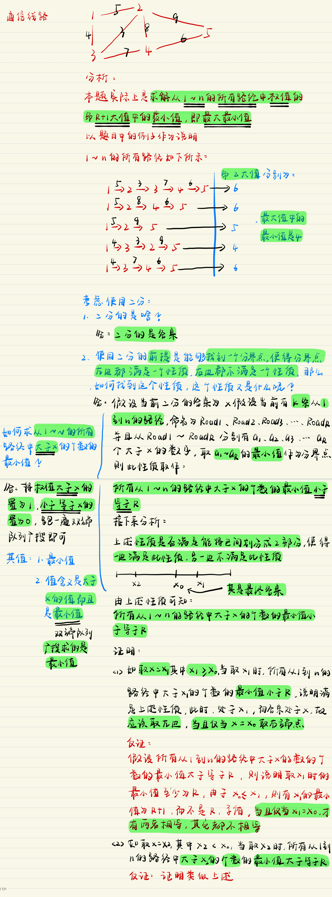

**代ç **

```c++
#include <iostream>
#include <cstring>
#include <deque>
using namespace std;
const int N = 1010, M = 20010;
int n, m, k, idx;
int h[N], e[M], w[M], ne[M], st[N], dist[N];
void add(int a, int b, int c) {
    e[idx] = b;
    w[idx] = c;
    ne[idx] = h[a];
    h[a] = idx ++;
    return;
}
// åŒç«¯é˜Ÿåˆ—模æ¿
bool check(int x) {
    deque<int> q;
    // åˆå§‹åŒ–
    memset(st, 0, sizeof st);
    memset(dist, 0x3f, sizeof dist);
    dist[1] = 0;
    q.push_back(1);
    st[1] = true;
    while (q.size()) {
        int t = q.front(); q.pop_front();
        for (int i = h[t]; i != -1; i = ne[i]) {
            int j = e[i], v = w[i] > x; // æƒå€¼w > x
            if (!st[j] && dist[j] > dist[t] + v) {
                dist[j] = dist[t] + v;
                q.push_back(j);
            }
        }
    }
    return dist[n] <= k; // 性质是最å°å€¼å°äºç­‰äºk
}
int main() {
    scanf("%d%d%d", &n, &m, &k);
    memset(h, -1, sizeof h);
    for (int i = 0; i < m; i ++ ) {
        int a, b, c;
        scanf("%d%d%d", &a, &b, &c);
        add(a, b, c);
        add(b, a, c);
    }
    // 二分的是答案
    int l = 0, r = 1e6 + 1;
    while (l < r) {
        int mid = l + r >> 1;
        // 符åˆæ¡ä»¶, 说æ˜æ˜¯åœ¨ç­”案å³è¾¹, æ•…, 缩å°èŒƒå›´
        // 具体手写稿
        if (check(mid)) r = mid;
        else l = mid + 1;
    }
    if (r == 1e6 + 1) r = -1;
    cout << r << endl;
    return 0;
}
```

**时间å¤æ‚度**

$O(plogL)$

**空间å¤æ‚度**

$O(m)$

**标签**

`最短路`ã€`二分`

**ç¼åˆæ€ª**


### [AcWing 342. é“è·¯ä¸èˆªçº¿](https://www.acwing.com/problem/content/344/)

**题目æè¿°**

>   农夫约翰正在一个新的销售区域对他的牛奶销售方案进行调查。
>
>   他想把牛奶é€åˆ° `T` 个åŸé•‡ï¼Œç¼–å·ä¸º `1 ∼ T`。
>
>   这些åŸé•‡ä¹‹é—´é€šè¿‡ `R` æ¡é“è·¯ (ç¼–å·ä¸º `1` 到 `R`) å’Œ `P` æ¡èˆªçº¿ (ç¼–å·ä¸º `1` 到 `P`) è¿æ¥ã€‚
>
>   æ¯æ¡é“è·¯ `i` 或者航线 `i` è¿æ¥åŸé•‡ $A_i$ 到 $B_i$，花费为 $C_i$。
>
>   对äºé“路，$0 ≤ C_i ≤ 10,000$;然而航线的花费很ç¥å¥‡ï¼ŒèŠ±è´¹ $C_i$ å¯èƒ½æ˜¯è´Ÿæ•°$(−10,000 ≤ C_i ≤ 10,000)$。
>
>   é“路是åŒå‘的，å¯ä»¥ä» $A_i$ 到 $B_i$，也å¯ä»¥ä» $B_i$ 到 $A_i$，花费都是 $C_i$。
>
>   然而航线ä¸ä¹‹ä¸åŒï¼Œåªå¯ä»¥ä» $A_i$ 到 $B_i$。
>
>   事å®ä¸Šï¼Œç”±äºæœ€è¿‘æ怖主义太嚣张，为了社会和è°ï¼Œå‡ºå°äº†ä¸€äº›æ”¿ç­–：ä¿è¯å¦‚æœæœ‰ä¸€æ¡èˆªçº¿å¯ä»¥ä» $A_i$ 到 $B_i$，那么ä¿è¯ä¸å¯èƒ½é€šè¿‡ä¸€äº›é“è·¯å’Œèˆªçº¿ä» $B_i$ å›åˆ° $A_i$。
>
>   ç”±äºçº¦ç¿°çš„奶牛世界公认å分给力，他需è¦è¿é€å¥¶ç‰›åˆ°æ¯ä¸€ä¸ªåŸé•‡ã€‚
>
>   他想找到ä»å‘é€ä¸­å¿ƒåŸé•‡ `S` 把奶牛é€åˆ°æ¯ä¸ªåŸé•‡çš„最便宜的方案。

**输入格å¼**

>   第一行包å«å››ä¸ªæ•´æ•° `T,R,P,S`。
>
>   æ¥ä¸‹æ¥ `R` 行，æ¯è¡ŒåŒ…å«ä¸‰ä¸ªæ•´æ•°ï¼ˆè¡¨ç¤ºä¸€ä¸ªé“路）$A_i,B_i,C_i$。
>
>   æ¥ä¸‹æ¥ `P` 行，æ¯è¡ŒåŒ…å«ä¸‰ä¸ªæ•´æ•°ï¼ˆè¡¨ç¤ºä¸€æ¡èˆªçº¿ï¼‰$A_i,B_i,C_i$。

**输出格å¼**

>   第 $1 .. T$ 行：第 `i` è¡Œè¾“å‡ºä» `S` 到达åŸé•‡ `i` 的最å°èŠ±è´¹ï¼Œå¦‚æœä¸å­˜åœ¨ï¼Œåˆ™è¾“出 `NO PATH`。

**æ•°æ®èŒƒå›´**

>   +   $1 ≤ T ≤ 25000,$
>   +   $1 ≤ R, P ≤ 50000,$
>   +   $1 ≤ A_i, B_i, S ≤ T$

**输入样例**

```c++
6 3 3 4
1 2 5
3 4 5
5 6 10
3 5 -100
4 6 -100
1 3 -10
```

**输出样例**

```c++
NO PATH
NO PATH
5
0
-95
-100
```

**手写稿**

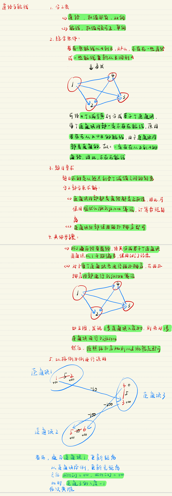

**代ç **

```c++
#include <iostream>
#include <cstring>
#include <queue>
#include <vector>
#define x first
#define y second
using namespace std;
typedef pair<int, int> PII;
const int N = 25010, M = 150010, INF = 0x3f3f3f3f;
int n, mr, mp, S, idx, bcnt, hh, tt;
int h[N], e[M], w[M], ne[M], id[N], st[N], dist[N], q[N], din[N];
vector<int> block[N];
void add(int a, int b, int c) {
    e[idx] = b;
    w[idx] = c;
    ne[idx] = h[a];
    h[a] = idx ++;
    return;
}
void dfs(int u, int bid) {
    id[u] = bid;
    st[u] = true;
    block[bid].push_back(u);
    for (int i = h[u]; i != -1; i = ne[i]) {
        int j = e[i];
        // 如æœj没有被访问过并且j没有被分组
        if (!st[j] && !id[j])
            dfs(j, bid);
    }
    st[u] = false;
    return;
}
void dijkstra(int bid) {
    priority_queue<PII, vector<PII>, greater<PII>> heap;
    // 将当å‰è¿é€šå—中的åŸé•‡å…¨éƒ¨å‹å…¥å°æ ¹å †ä¸­
    for (auto t : block[bid])
        heap.push({dist[t], t});
    // 堆优化版dijkstra
    while (heap.size()) {
        auto t = heap.top(); heap.pop();
        int v = t.y;
        if (st[v]) continue;
        st[v] = true;
        // 访问邻æ¥ç‚¹
        for (int i = h[v]; i != -1; i = ne[i]) {
            int j = e[i];
            // 如æœå½“å‰ç‚¹v和其临æ¥ç‚¹jä¸å±äºåŒä¸€ä¸ªè¿é€šå—
            // 说æ˜j所在的è¿é€šå—id[j]的入度需è¦â–1
            // 如æœå‡åˆ°0, 则加入队列q
            if (id[v] != id[j] && -- din[id[j]] == 0) q[++tt] = id[j];
            // æ›´æ–°è·ç¦»
            if (dist[j] > dist[v] + w[i]) {
                dist[j] = dist[v] + w[i];
                // 注æ„: 这里åªæœ‰åŒå±ä¸€ä¸ªè¿é€šå—的时候æ‰åŠ å…¥ä¼˜å…ˆé˜Ÿåˆ—
                // åŒä¸€ä¸ªè¿é€šå—内部都是é“è·¯, é“路的æƒå€¼æ˜¯éè´Ÿçš„
                if (id[j] == id[v]) heap.push({dist[j], j});
            }
        }
    }
    return;
}
void topsort() {
    hh = 0, tt = -1;
    // åˆå§‹åŒ–为+âˆ
    memset(dist, 0x3f, sizeof dist);
    // 起点为0
    dist[S] = 0;
    for (int i = 1; i <= bcnt; i ++ )
        // 将所有入度为0的点加入队列q
        if (!din[i]) q[++ tt] = i;
    while (hh <= tt) {
        int t = q[hh ++ ];
        dijkstra(t);
    }
    return;
}
int main() {
    scanf("%d%d%d%d", &n, &mr, &mp, &S);
    memset(h, -1, sizeof h);
    for (int i = 0; i < mr; i ++ ) {
        int a, b, c;
        scanf("%d%d%d", &a, &b, &c);
        add(a, b, c);
        add(b, a, c);
    }
    for (int i = 1; i <= n; i ++ )
        if (!id[i])
            // è¿é€šå—ç¼–å·ä»1开始
            dfs(i, ++ bcnt);
    for (int i = 0; i < mp; i ++ ) {
        int a, b, c;
        scanf("%d%d%d", &a, &b, &c);
        // båŸé•‡æ‰€åœ¨çš„è¿é€šå—入度â•1
        din[id[b]] ++;
        add(a, b, c);
    }
    topsort();
    for (int i = 1; i <= n; i ++ ) {
        // 因为有负æƒè¾¹, å› æ­¤, 判断其大äºæŸä¸ªå¤§å€¼å³å¯
        if (dist[i] > INF / 2) puts("NO PATH");
        else cout << dist[i] << endl;
    }
    return 0;
}
```

**时间å¤æ‚度**

$O(mlog_n)$

**空间å¤æ‚度**

$O(nm), m是è¿é€šå—çš„æ•°é‡$

**标签**

`最短路`ã€`拓扑æ’åº`

**ç¼åˆæ€ª**


### [AcWing 341. 最优贸易](https://www.acwing.com/problem/content/343/)

**题目æè¿°**

>   `C` 国有 `n` 个大åŸå¸‚å’Œ `m` æ¡é“路，æ¯æ¡é“è·¯è¿æ¥è¿™ `n` 个åŸå¸‚中的æŸä¸¤ä¸ªåŸå¸‚。
>
>   ä»»æ„两个åŸå¸‚之间最多åªæœ‰ä¸€æ¡é“路直æ¥ç›¸è¿ã€‚
>
>   è¿™ `m` æ¡é“路中有一部分为å•å‘通行的é“路，一部分为åŒå‘通行的é“路，åŒå‘通行的é“路在统计æ¡æ•°æ—¶ä¹Ÿè®¡ä¸º `1` æ¡ã€‚
>
>   `C` 国幅员辽阔，å„地的资æºåˆ†å¸ƒæƒ…况å„ä¸ç›¸åŒï¼Œè¿™å°±å¯¼è‡´äº†åŒä¸€ç§å•†å“在ä¸åŒåŸå¸‚çš„ä»·æ ¼ä¸ä¸€å®šç›¸åŒã€‚
>
>   但是，åŒä¸€ç§å•†å“在åŒä¸€ä¸ªåŸå¸‚的买入价和å–出价始终是相åŒçš„。
>
>   商人阿龙æ¥åˆ° `C` 国旅游。
>
>   当他得知“åŒä¸€ç§å•†å“在ä¸åŒåŸå¸‚çš„ä»·æ ¼å¯èƒ½ä¼šä¸åŒâ€è¿™ä¸€ä¿¡æ¯ä¹‹å，便决定在旅游的åŒæ—¶ï¼Œåˆ©ç”¨å•†å“在ä¸åŒåŸå¸‚中的差价赚一点旅费。
>
>   设 `C` 国 `n` 个åŸå¸‚çš„æ ‡å·ä»` 1 ∼ n`ï¼Œé˜¿é¾™å†³å®šä» `1` å·åŸå¸‚出å‘，并最终在 `n` å·åŸå¸‚结æŸè‡ªå·±çš„旅行。
>
>   在旅游的过程中，任何åŸå¸‚å¯ä»¥è¢«é‡å¤ç»è¿‡å¤šæ¬¡ï¼Œä½†ä¸è¦æ±‚ç»è¿‡æ‰€æœ‰ `n` 个åŸå¸‚。
>
>   阿龙通过这样的贸易方å¼èµšå–旅费：他会选择一个ç»è¿‡çš„åŸå¸‚买入他最喜欢的商å“——水晶çƒï¼Œå¹¶åœ¨ä¹‹åç»è¿‡çš„å¦ä¸€ä¸ªåŸå¸‚å–出这个水晶çƒï¼Œç”¨èµšå–的差价当åšæ—…费。
>
>   因为阿龙主è¦æ˜¯æ¥ `C` 国旅游，他决定这个贸易åªè¿›è¡Œæœ€å¤šä¸€æ¬¡ï¼Œå½“然，在赚ä¸åˆ°å·®ä»·çš„情况下他就无需进行贸易。
>
>   ç°åœ¨ç»™å‡º `n` 个åŸå¸‚的水晶çƒä»·æ ¼ï¼Œ`m` æ¡é“路的信æ¯ï¼ˆæ¯æ¡é“路所è¿æ¥çš„两个åŸå¸‚çš„ç¼–å·ä»¥åŠè¯¥æ¡é“路的通行情况）。
>
>   请你告诉阿龙，他最多能赚å–多少旅费。
>
>   注æ„：本题数æ®æœ‰åŠ å¼ºã€‚

**输入格å¼**

>   ç¬¬ä¸€è¡ŒåŒ…å« `2` 个正整数 `n` å’Œ `m`，中间用一个空格隔开，分别表示åŸå¸‚的数目和é“路的数目。
>
>   第二行 `n` 个正整数，æ¯ä¸¤ä¸ªæ•´æ•°ä¹‹é—´ç”¨ä¸€ä¸ªç©ºæ ¼éš”开，按标å·é¡ºåºåˆ†åˆ«è¡¨ç¤ºè¿™ ``n`` 个åŸå¸‚的商å“价格。
>
>   æ¥ä¸‹æ¥ `m` 行，æ¯è¡Œæœ‰ `3` 个正整数，`x，y，z`，æ¯ä¸¤ä¸ªæ•´æ•°ä¹‹é—´ç”¨ä¸€ä¸ªç©ºæ ¼éš”开。
>
>   å¦‚æœ `z = 1`，表示这æ¡é“路是åŸå¸‚ `x` 到åŸå¸‚ `y` 之间的å•å‘é“è·¯ï¼›å¦‚æœ `z = 2`，表示这æ¡é“路为åŸå¸‚ `x` å’ŒåŸå¸‚ `y` 之间的åŒå‘é“路。

**输出格å¼**

>   一个整数，表示答案。

**æ•°æ®èŒƒå›´**

>   +   $1 ≤ n ≤ 100000,$
>   +   $1 ≤ m ≤ 500000,$
>   +   $1 ≤ å„åŸå¸‚水晶çƒä»·æ ¼ ≤ 100$

**输入样例**

```c++
5 5
4 3 5 6 1
1 2 1
1 4 1
2 3 2
3 5 1
4 5 2
```

**输出样例**

```c++
5
```

**手写稿**


**代ç **

```c++
#include <iostream>
#include <cstring>
using namespace std;
const int N = 100010, M = 2000010;
int n, m, idx;
int w[N], h[N], rh[N], e[M], ne[M], fmin[N], fmax[N], q[N], st[N];
void add(int h[], int a, int b) {
    e[idx] = b;
    ne[idx] = h[a];
    h[a] = idx ++;
    return;
}
void spfa(int dist[], int type) {
    memset(st, false, sizeof st);
    int hh = 0, tt = 0;
    if (type == 0) { // æ­£å‘éå†, 求最å°å€¼
        memset(dist, 0x3f, sizeof fmin);
        dist[1] = w[1];
        q[tt ++ ] = 1;
        st[1] = true;
    }
    else { // åå‘éå†, 求最大值
        memset(dist, -0x3f, sizeof fmax);
        dist[n] = w[n];
        q[tt ++ ] = n;
        st[n] = true;
    }
    while (hh != tt) {
        int t = q[hh ++ ];
        if (hh == N) hh = 0;
        st[t] = false;
        if (type == 0) { // æ­£å‘éå†, 求最å°å€¼
            for (int i = h[t]; i != -1; i = ne[i]) {
                int j = e[i];
                if (dist[j] > min(dist[t], w[j])) {
                    dist[j] = min(dist[t], w[j]);
                    if (!st[j]) { // 如æœæ²¡æœ‰åŠ å…¥é˜Ÿåˆ—, 则将其加入队列
                        q[tt ++ ] = j;
                        if (tt == N) tt = 0;
                        st[j] = true;
                    }
                }
            }
        }
        else { // åå‘éå†, 求最大值
            for (int i = rh[t]; i != -1; i = ne[i]) {
                int j = e[i];
                if (dist[j] < max(dist[t], w[j])) { // 如æœæ²¡æœ‰åŠ å…¥é˜Ÿåˆ—, 则将其加入队列
                    dist[j] = max(dist[t], w[j]);
                    if (!st[j]) {
                        q[tt ++ ] = j;
                        if (tt == N) tt = 0;
                        st[j] = true;
                    }
                }
            }
        }
    }
    return;
}
int main() {
    scanf("%d%d", &n, &m);
    memset(h, -1, sizeof h);
    memset(rh, -1, sizeof rh);
    for (int i = 1; i <= n; i ++ ) scanf("%d", &w[i]);
    for (int i = 0; i < m; i ++ ) {
        int a, b, c;
        scanf("%d%d%d", &a, &b, &c);
        add(h, a, b);
        add(rh, b, a);
        if (c == 2) {
            add(h, b, a);
            add(rh, a, b);
        }
    }
    spfa(fmin, 0);
    spfa(fmax, 1);
    int res = 0;
    for (int i = 1; i <= n; i ++ )
        res = max(res, fmax[i] - fmin[i]);
    cout << res << endl;
    return 0;
}
```

**时间å¤æ‚度**

$最å时间å¤æ‚度 O(nm), 一般情况下为O(m)$

**空间å¤æ‚度**

$O(m)$

**标签**

`最短路`ã€`动æ€è§„划`ã€`spfa`

**ç¼åˆæ€ª**

## å•æºæœ€çŸ­è·¯çš„扩展应用

### [AcWing 1137. 选择最佳线路](https://www.acwing.com/problem/content/1139/)

**题目æè¿°**

>   有一天，çªçªæƒ³ä¹˜å公交车å»æ‹œè®¿å¥¹çš„一ä½æœ‹å‹ã€‚
>
>   ç”±äºçªçªé常容易晕车，所以她想尽快到达朋å‹å®¶ã€‚
>
>   ç°åœ¨ç»™å®šä½ ä¸€å¼ åŸå¸‚交通路线图，上é¢åŒ…å«åŸå¸‚的公交站å°ä»¥åŠå…¬äº¤çº¿è·¯çš„具体分布。
>
>   已知åŸå¸‚ä¸­å…±åŒ…å« `n` 个车站（编å·`1 ~ n`ï¼‰ä»¥åŠ `m` æ¡å…¬äº¤çº¿è·¯ã€‚
>
>   æ¯æ¡å…¬äº¤çº¿è·¯éƒ½æ˜¯ **å•å‘çš„**，ä»ä¸€ä¸ªè½¦ç«™å‡ºå‘ç›´æ¥åˆ°è¾¾å¦ä¸€ä¸ªè½¦ç«™ï¼Œä¸¤ä¸ªè½¦ç«™ä¹‹é—´å¯èƒ½å­˜åœ¨å¤šæ¡å…¬äº¤çº¿è·¯ã€‚
>
>   çªçªçš„朋å‹ä½åœ¨ `s` å·è½¦ç«™é™„近。
>
>   çªçªå¯ä»¥åœ¨ä»»ä½•è½¦ç«™é€‰æ‹©æ¢ä¹˜å…¶å®ƒå…¬å…±æ±½è½¦ã€‚
>
>   请找出çªçªåˆ°è¾¾å¥¹çš„朋å‹å®¶ï¼ˆé™„近的公交车站）需è¦èŠ±è´¹çš„最少时间。

**输入格å¼**

>   输入包å«å¤šç»„测试数æ®ã€‚
>
>   æ¯ç»„测试数æ®ç¬¬ä¸€è¡ŒåŒ…å«ä¸‰ä¸ªæ•´æ•° `n,m,s`，分别表示车站数é‡ï¼Œå…¬äº¤çº¿è·¯æ•°é‡ä»¥åŠæœ‹å‹å®¶é™„近车站的编å·ã€‚
>
>   æ¥ä¸‹æ¥ `m` 行，æ¯è¡ŒåŒ…å«ä¸‰ä¸ªæ•´æ•° `p,q,t`，表示存在一æ¡çº¿è·¯ä»è½¦ç«™ `p` 到达车站 `q`，用时为 `t`。
>
>   æ¥ä¸‹æ¥ä¸€è¡Œï¼ŒåŒ…å«ä¸€ä¸ªæ•´æ•° `w`，表示çªçªå®¶é™„近共有 `w` 个车站，她å¯ä»¥åœ¨è¿™ `w` 个车站中选择一个车站作为始å‘站。
>
>   å†ä¸€è¡Œï¼ŒåŒ…å« `w` 个整数，表示çªçªå®¶é™„è¿‘çš„ `w` 个车站的编å·ã€‚

**输出格å¼**

>   æ¯ä¸ªæµ‹è¯•æ•°æ®è¾“出一个整数作为结æœï¼Œè¡¨ç¤ºæ‰€éœ€èŠ±è´¹çš„最少时间。
>
>   如æœæ— æ³•è¾¾åˆ°æœ‹å‹å®¶çš„车站，则输出 ``-1``。
>
>   æ¯ä¸ªç»“æœå ä¸€è¡Œã€‚

**æ•°æ®èŒƒå›´**

>   +   $n ≤ 1000, m ≤ 20000,$
>   +   $1 ≤ s ≤ n,$
>   +   $0 < w < n,$
>   +   $0 < t ≤ 1000$

**输入样例**

```c++
5 8 5
1 2 2
1 5 3
1 3 4
2 4 7
2 5 6
2 3 5
3 5 1
4 5 1
2
2 3
4 3 4
1 2 3
1 3 4
2 3 2
1
1
```

**输出样例**

```c++
1
-1
```

**手写稿**


**代ç **

```c++
#include <iostream>
#include <cstring>
using namespace std;
const int N = 1010, M = 21010, INF = 0x3f3f3f3f;
int n, m, T, idx;
int h[N], e[M], w[M], ne[M], st[N], dist[N], q[N];
void add(int a, int b, int c) {
    e[idx] = b;
    w[idx] = c;
    ne[idx] = h[a];
    h[a] = idx ++;
    return;
}
// SPFA模æ¿
int spfa() {
    memset(dist, 0x3f, sizeof dist);
    memset(st, 0, sizeof st);
    // 使用循ç¯é˜Ÿåˆ—
    int hh = 0, tt = 0;
    dist[0] = 0;
    q[tt ++ ] = 0;
    st[0] = true;
    while (hh != tt) {
        int t = q[hh ++ ];
        if (hh == N) hh = 0;
        st[t] = false;
        for (int i = h[t]; i != -1; i = ne[i]) {
            int j = e[i];
            if (dist[j] > dist[t] + w[i]) {
                dist[j] = dist[t] + w[i];
                if (!st[j]) {
                    q[tt ++ ] = j;
                    if (tt == N) tt = 0;
                    st[j] = true;
                }
            }
        }
    }
    if (dist[T] == INF) return -1;
    return dist[T];
}
int main() {
    while (~scanf("%d%d%d", &n, &m, &T)) {
        memset(h, -1, sizeof h);
        idx = 0;
        for (int i = 0; i < m; i ++ ) {
            int a, b, c;
            scanf("%d%d%d", &a, &b, &c);
            add(a, b, c);
        }
        int k;
        scanf("%d", &k);
        for (int i = 0, station; i < k; i ++ ) {
            scanf("%d", &station);
            // 将起点和虚拟æºç‚¹ä¹‹é—´å»ºç«‹ä¸€æ¡è¾¹, æƒå€¼ä¸º0
            add(0, station, 0);
        }
        cout << spfa() << endl;
    }
    return 0;
}
```

**时间å¤æ‚度**

$O(m)$

**空间å¤æ‚度**

$O(m)$

**标签**

`最短路`ã€`虚拟æºç‚¹`

**ç¼åˆæ€ª**


### [AcWing 1131. 拯救大兵ç‘æ©](https://www.acwing.com/problem/content/1133/)

**题目æè¿°**

>   `1944` 年，特ç§å…µéº¦å…‹æ¥åˆ°å›½é˜²éƒ¨çš„命令，è¦æ±‚ç«‹å³èµ¶èµ´å¤ªå¹³æ´‹ä¸Šçš„一个孤岛，è¥æ•‘被敌军俘è™çš„大兵ç‘æ©ã€‚
>
>   ç‘æ©è¢«å…³æŠ¼åœ¨ä¸€ä¸ªè¿·å®«é‡Œï¼Œè¿·å®«åœ°å½¢å¤æ‚，但幸好麦克得到了迷宫的地形图。
>
>   迷宫的外形是一个长方形，其å—北方å‘被划分为 `N` 行，东西方å‘被划分为 `M` 列， äºæ˜¯æ•´ä¸ªè¿·å®«è¢«åˆ’分为 `N×M` 个å•å…ƒã€‚
>
>   æ¯ä¸€ä¸ªå•å…ƒçš„ä½ç½®å¯ç”¨ä¸€ä¸ªæœ‰åºæ•°å¯¹ (å•å…ƒçš„è¡Œå·, å•å…ƒçš„列å·) æ¥è¡¨ç¤ºã€‚
>
>   å—北或东西方å‘相邻的 `2` 个å•å…ƒä¹‹é—´å¯èƒ½äº’通，也å¯èƒ½æœ‰ä¸€æ‰‡é”ç€çš„门，或者是一堵ä¸å¯é€¾è¶Šçš„墙。
>
>   **注æ„：** é—¨å¯ä»¥ä»ä¸¤ä¸ªæ–¹å‘穿过，å³å¯ä»¥çœ‹æˆä¸€æ¡æ— å‘边。
>
>   迷宫中有一些å•å…ƒå­˜æ”¾ç€é’¥åŒ™ï¼ŒåŒä¸€ä¸ªå•å…ƒå¯èƒ½å­˜æ”¾ **多把钥匙**ï¼Œå¹¶ä¸”æ‰€æœ‰çš„é—¨è¢«åˆ†æˆ `P` 类，打开åŒä¸€ç±»çš„门的钥匙相åŒï¼Œä¸åŒç±»é—¨çš„钥匙ä¸åŒã€‚
>
>   大兵ç‘æ©è¢«å…³æŠ¼åœ¨è¿·å®«çš„东å—è§’ï¼Œå³ `(N,M)` å•å…ƒé‡Œï¼Œå¹¶å·²ç»æ˜è¿·ã€‚
>
>   迷宫åªæœ‰ä¸€ä¸ªå…¥å£ï¼Œåœ¨è¥¿åŒ—角。
>
>   也就是说，麦克å¯ä»¥ç›´æ¥è¿›å…¥ `(1,1)` å•å…ƒã€‚
>
>   å¦å¤–，麦克ä»ä¸€ä¸ªå•å…ƒç§»åŠ¨åˆ°å¦ä¸€ä¸ªç›¸é‚»å•å…ƒçš„时间为 `1`，拿å–所在å•å…ƒçš„钥匙的时间以åŠç”¨é’¥åŒ™å¼€é—¨çš„时间å¯å¿½ç•¥ä¸è®¡ã€‚
>
>   试设计一个算法，帮助麦克以最快的方å¼åˆ°è¾¾ç‘æ©æ‰€åœ¨å•å…ƒï¼Œè¥æ•‘大兵ç‘æ©ã€‚

**输入格å¼**

>   第一行有三个整数,分别表示 `N,M,P` 的值。
>
>   第二行是一个整数 `k`，表示迷宫中门和墙的总数。
>
>   æ¥ä¸‹æ¥ `k` 行，æ¯è¡ŒåŒ…å«äº”个整数，$X_{i1}, Y_{i1}, X_{i2}, Y_{i2}, G_i$：当 $G_i≥1$ 时，表示 $(X_{i1},Y_{i1})$ å•å…ƒä¸ $(X_{i2},Y_{i2}) $å•å…ƒä¹‹é—´æœ‰ä¸€æ‰‡ç¬¬ $G_i$ 类的门，当 $G_i=0$ 时，表示 $(X_{i1},Y_{i1})$ å•å…ƒä¸ $(X_{i2},Y_{i2})$ å•å…ƒä¹‹é—´æœ‰ä¸€é¢ä¸å¯é€¾è¶Šçš„墙。
>
>   æ¥ä¸‹æ¥ä¸€è¡Œï¼ŒåŒ…å«ä¸€ä¸ªæ•´æ•° `S`，表示迷宫中存放的钥匙的总数。
>
>   æ¥ä¸‹æ¥ `S` 行，æ¯è¡ŒåŒ…å«ä¸‰ä¸ªæ•´æ•° $X_{i1},Y_{i1},Q_i$，表示 $(X_{i1},Y_{i1})$ å•å…ƒé‡Œå­˜åœ¨ä¸€ä¸ªèƒ½å¼€å¯ç¬¬ $Q_i$ 类门的钥匙。

**输出格å¼**

>   输出麦克è¥æ•‘到大兵ç‘æ©çš„最短时间。
>
>   如æœé—®é¢˜æ— è§£ï¼Œåˆ™è¾“出 `-1`。

**æ•°æ®èŒƒå›´**

>   +   $|X_{i1} − X_{i2}| + |Y_{i1} − Y_{i2}| = 1,$
>   +   $0 ≤ G_i ≤ P,$
>   +   $1 ≤ Q_i ≤ P,$
>   +   $1 ≤ N, M, P ≤ 10,$
>   +   $1 ≤ k ≤ 150$

**输入样例**

```c++
4 4 9
9
1 2 1 3 2
1 2 2 2 0
2 1 2 2 0
2 1 3 1 0 
2 3 3 3 0
2 4 3 4 1
3 2 3 3 0
3 3 4 3 0
4 3 4 4 0
2
2 1 2 
4 2 1
```

**输出样例**

```c++
14
```

**样例解释**

>   迷宫如下所示：
>
>   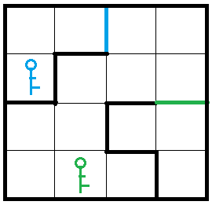

**手写稿**


**代ç **

```c++
#include <iostream>
#include <cstring>
#include <set>
#include <deque>
#define x first
#define y second
using namespace std;
typedef pair<int, int> PII;
const int N = 15, M = 400, K = 1 << 10;
int n, m, p, k, idx;
int dx[4] = {-1, 0, 1, 0};
int dy[4] = {0, 1, 0, -1};
// 注æ„: 队头有N * N个点
int h[N * N], e[M], w[M], ne[M], key[N * N];
int g[N][N], dist[N * N][K];
bool st[N * N][K];
set <PII> edges;
void add(int a, int b, int c) {
    e[idx] = b;
    w[idx] = c;
    ne[idx] = h[a];
    h[a] = idx ++;
    return;
}
void build() {
    // éå†æ•´å¼ å›¾
    for (int x = 1; x <= n; x ++ )
        for (int y = 1; y <= m; y ++ )
            for (int i = 0; i < 4; i ++ ) { // éå†å››ä¸ªæ–¹å‘
                int tx = x + dx[i];
                int ty = y + dy[i];
                int a = g[x][y], b = g[tx][ty];
                // ç°åœ¨äºŒç»´éƒ½å·²ç»æ˜ å°„æˆä¸€ç»´äº†, å› æ­¤, 是点a和点b之间的边, ä¸æ˜¯txå’Œtyçš„è¾¹!!
                if (tx <= 0 || tx > n || ty <= 0 || ty > m || edges.count({a, b}))
                    continue;
                // éå†åˆ°a的时候建a -> b
                // éå†åˆ°b的时候建b -> a
                // æ•…, 当éå†åˆ°aæ—¶, åªéœ€å»ºa -> bçš„å•å‘è¾¹å³å¯
                add(a, b, 0);
                // 记录当å‰è¾¹å·²ç»å»ºå®Œ
                edges.insert({a, b});
            }
    return;
}
int bfs() {
    memset(dist, 0x3f, sizeof dist);
    memset(st, 0, sizeof st);
    deque<PII> q;
    // 第一维: 点
    // 第二维: ä»èµ·ç‚¹åˆ°å½“å‰ç‚¹çš„钥匙的状æ€, 二进制数
    q.push_back({g[1][1], 0});
    dist[g[1][1]][0] = 0;
    while (q.size()) {
        auto t = q.front(); q.pop_front();
        int u = t.x, state = t.y;
        // 到达结尾, è¿”å›å³å¯
        if (u == g[n][m]) return dist[u][state];
        // å·²ç»è¢«è®¿é—®è¿‡, 则进行下一次的循ç¯
        if (st[u][state]) continue;
        // 标记当å‰ç‚¹çš„状æ€å·²ç»è¢«è®¿é—®è¿‡
        st[u][state] = true;
        if (key[u]) // 如æœå½“å‰ç‚¹æœ‰é’¥åŒ™
            // 如æœèƒ½æ›´æ–°, 则进行更新
            // 注æ„: 状æ€è½¬ç§»æ–¹ç¨‹çš„写法
            if (dist[u][key[u] | state] > dist[u][state]) {
                dist[u][key[u] | state] = dist[u][state];
                // è·ç¦»ä¸æ›´æ–°, 更新钥匙的状æ€, æƒå€¼ä¸º0, æ•…, æ’入到队头
                q.push_front({u, key[u] | state});
            }
        // 访问邻边
        for (int i = h[u]; i != -1; i = ne[i]) {
            int j = e[i];
            // 如æœå½“å‰ä½ç½®æœ‰é—¨, 但是, 没有对应的钥匙, 则进行下一次循ç¯
            if (w[i] && !(state >> w[i] - 1 & 1)) continue;
            // 如æœèƒ½æ›´æ–°, 则进行更新
            // 注æ„: 状æ€è½¬ç§»æ–¹ç¨‹
            if (dist[j][state] > dist[u][state] + 1) {
                dist[j][state] = dist[u][state] + 1;
                // æƒå€¼ä¸º1, 加入队尾
                q.push_back({j, state});
            }
        }
    }
    return -1;
}
int main() {
    scanf("%d%d%d%d", &n, &m, &p, &k);
    // ç¼–å·
    for (int i = 1, t = 0; i <= n; i ++ )
        for (int j = 1; j <= m; j ++ )
            g[i][j] = ++ t;
    memset(h, -1, sizeof h);
    for (int i = 0; i < k; i ++ ) {
        int x1, y1, x2, y2, type;
        scanf("%d%d%d%d%d", &x1, &y1, &x2, &y2, &type);
        // 将二维映射æˆä¸€ç»´
        int a = g[x1][y1], b = g[x2][y2];
        // 记录当å‰è¾¹
        // å³ä½¿æ˜¯å¢™, 也得记录[虽然ä¸è¿è¾¹]
        // åŸå› : 需è¦å’Œç©ºåœ°åˆ†å¼€, 所以, 需è¦è®°å½•, 但是ä¸è¿è¾¹
        edges.insert({a, b});
        edges.insert({b, a});
        // 如æœä¸æ˜¯å¢™, æ— å‘è¾¹
        if (type) {
            add(a, b, type);
            add(b, a, type);
        }
    }
    // 将其他空地, 进行建边
    build();
    int s;
    scanf("%d", &s);
    for (int i = 0; i < s; i ++ ) {
        int x, y, type;
        scanf("%d%d%d", &x, &y, &type);
        int a = g[x][y];
        // 钥匙的存储已ç»æ˜ å°„为一维了, 点a
        key[a] |= 1 << type - 1;
    }
    cout << bfs() << endl;
    return 0;
}
```

**时间å¤æ‚度**

$O(nm)$

**空间å¤æ‚度**

$O(n^2k)$

**标签**

`最短路`ã€`åŒç«¯é˜Ÿåˆ—`ã€`动æ€è§„划`

**ç¼åˆæ€ª**


### [AcWing 1134. 最短路计数](https://www.acwing.com/problem/content/1136/)

**题目æè¿°**

>   给出一个 `N` 个顶点 `M` æ¡è¾¹çš„æ— å‘æ— æƒå›¾ï¼Œé¡¶ç‚¹ç¼–å·ä¸º `1` 到 `N`。
>
>   é—®ä»é¡¶ç‚¹ `1` 开始，到其他æ¯ä¸ªç‚¹çš„最短路有几æ¡ã€‚

**输入格å¼**

>   ç¬¬ä¸€è¡ŒåŒ…å« `2` 个正整数 `N,M`，为图的顶点数ä¸è¾¹æ•°ã€‚
>
>   æ¥ä¸‹æ¥ `M` 行，æ¯è¡Œä¸¤ä¸ªæ­£æ•´æ•° `x,y`，表示有一æ¡é¡¶ç‚¹ `x` è¿å‘顶点 `y` 的边，请注æ„å¯èƒ½æœ‰è‡ªç¯ä¸é‡è¾¹ã€‚

**输出格å¼**

>   输出 `N` 行，æ¯è¡Œä¸€ä¸ªé负整数，第 `i` 行输出ä»é¡¶ç‚¹ `1` 到顶点 `i` 有多少æ¡ä¸åŒçš„最短路，由äºç­”案有å¯èƒ½ä¼šå¾ˆå¤§ï¼Œä½ åªéœ€è¦è¾“出对 `100003` å–模å的结æœå³å¯ã€‚
>
>   如æœæ— æ³•åˆ°è¾¾é¡¶ç‚¹ `i` 则输出 `0`。

**æ•°æ®èŒƒå›´**

>   +   $1 ≤ N ≤ 10^5,$
>   +   $1 ≤ M ≤ 2 × 10^5$

**输入样例**

```c++
5 7
1 2
1 3
2 4
3 4
2 3
4 5
4 5
```

**输出样例**

```c++
1
1
1
2
4
```

**手写稿**


**代ç **

```c++
#include <iostream>
#include <cstring>
using namespace std;
const int N = 100010, M = 400010, mod = 100003;
int n, m, idx;
int h[N], e[M], ne[M], q[N], st[N], dist[N], cnt[N];
void add(int a, int b) {
    e[idx] = b;
    ne[idx] = h[a];
    h[a] = idx ++;
    return;
}
void bfs() {
    memset(dist, 0x3f, sizeof dist);
    memset(st, false, sizeof st);
    int hh = 0, tt = -1;
    dist[1] = 0;
    // 起点到起点的最短路径æ¡æ•°ä¸º1
    cnt[1] = 1;
    q[++ tt] = 1;
    while (hh <= tt) {
        int t = q[hh ++ ];
        if (st[t]) continue;
        st[t] = true;
        for (int i = h[t]; i != -1; i = ne[i]) {
            int j = e[i];
            if (dist[j] > dist[t] + 1) {
                dist[j] = dist[t] + 1;
                cnt[j] = cnt[t];
                q[++ tt] = j;
            }
            else if (dist[j] == dist[t] + 1)
                cnt[j] = (cnt[j] + cnt[t]) % mod;
        }
    }
    return;
}
int main() {
    scanf("%d%d", &n, &m);
    memset(h, -1, sizeof h);
    for (int i = 0; i < m; i ++ ) {
        int a, b;
        scanf("%d%d", &a, &b);
        add(a, b);
        add(b, a);
    }
    bfs();
    for (int i = 1; i <= n; i ++ ) cout << cnt[i] << endl;
    return 0;
}
```

**时间å¤æ‚度**

$O(n)$

**空间å¤æ‚度**

$O(m)$

**标签**

`最短路计数`ã€`BFS`ã€`DP`

**ç¼åˆæ€ª**


### [AcWing 383. 观光](https://www.acwing.com/problem/content/385/)

**题目æè¿°**

>   “您的个人å‡æœŸâ€æ—…行社组织了一次比è·å¢ç»æµè”盟的巴士之旅。
>
>   比è·å¢ç»æµè”盟有很多公交线路。
>
>   æ¯å¤©å…¬å…±æ±½è½¦éƒ½ä¼šä»ä¸€åº§åŸå¸‚开往å¦ä¸€åº§åŸå¸‚。
>
>   沿途汽车å¯èƒ½ä¼šåœ¨ä¸€äº›åŸå¸‚（零或更多）åœé ã€‚
>
>   æ—…è¡Œç¤¾è®¡åˆ’æ—…é€”ä» `S` åŸå¸‚出å‘，到 `F` åŸå¸‚结æŸã€‚
>
>   ç”±äºä¸åŒæ—…客的景点å好ä¸åŒï¼Œæ‰€ä»¥ä¸ºäº†è¿åˆæ›´å¤šæ—…客，旅行社将为客户æ供多ç§ä¸åŒçº¿è·¯ã€‚
>
>   游客å¯ä»¥é€‰æ‹©çš„行进路线有所é™åˆ¶ï¼Œè¦ä¹ˆæ»¡è¶³æ‰€é€‰è·¯çº¿æ€»è·¯ç¨‹ä¸º `S` 到 `F` 的最å°è·¯ç¨‹ï¼Œè¦ä¹ˆæ»¡è¶³æ‰€é€‰è·¯çº¿æ€»è·¯ç¨‹ä»…比最å°è·¯ç¨‹å¤šä¸€ä¸ªå•ä½é•¿åº¦ã€‚
>
>   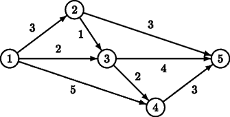
>
>   å¦‚ä¸Šå›¾æ‰€ç¤ºï¼Œå¦‚æœ `S = 1，F = 5`，则这里有两æ¡æœ€çŸ­è·¯çº¿ `1 → 2 → 5, 1 → 3 → 5`，长度为 `6`；有一æ¡æ¯”最短路程多一个å•ä½é•¿åº¦çš„路线 `1 → 3 → 4 → 5`，长度为 `7`。
>
>   ç°åœ¨ç»™å®šæ¯”è·å¢ç»æµè”盟的公交路线图以åŠä¸¤ä¸ªåŸå¸‚ `S` å’Œ `F`，请你求出旅行社最多å¯ä»¥ä¸ºæ—…客æ供多少ç§ä¸åŒçš„满足é™åˆ¶æ¡ä»¶çš„线路。

**输入格å¼**

>   第一行包å«æ•´æ•° `T`，表示共有 `T` 组测试数æ®ã€‚
>
>   æ¯ç»„æ•°æ®ç¬¬ä¸€è¡ŒåŒ…å«ä¸¤ä¸ªæ•´æ•° `N` å’Œ `M`，分别表示总åŸå¸‚æ•°é‡å’Œé“路数é‡ã€‚
>
>   æ¥ä¸‹æ¥ `M` 行，æ¯è¡ŒåŒ…å«ä¸‰ä¸ªæ•´æ•° `A, B, L`，表示有一æ¡çº¿è·¯ä»åŸå¸‚ `A` 通往åŸå¸‚ `B`，长度为 `L`。
>
>   需注æ„，线路是 **å•å‘çš„**ï¼Œå­˜åœ¨ä» `A` 到 `B` 的线路ä¸ä»£è¡¨ä¸€å®šå­˜åœ¨ä» `B` 到 `A` 的线路，å¦å¤–ä»åŸå¸‚ `A` 到åŸå¸‚ `B` å¯èƒ½å­˜åœ¨å¤šä¸ªä¸åŒçš„线路。
>
>   æ¥ä¸‹æ¥ä¸€è¡Œï¼ŒåŒ…å«ä¸¤ä¸ªæ•´æ•° `S` å’Œ `F`，数æ®ä¿è¯ `S` å’Œ `F` ä¸åŒï¼Œå¹¶ä¸” `S〠F` 之间至少存在一æ¡çº¿è·¯ã€‚

**输出格å¼**

>   æ¯ç»„æ•°æ®è¾“出一个结æœï¼Œæ¯ä¸ªç»“æœå ä¸€è¡Œã€‚
>
>   æ•°æ®ä¿è¯ç»“æœä¸è¶…过 $10^9$。

**æ•°æ®èŒƒå›´**

>   +   $2 ≤ N ≤ 1000,$
>   +   $1 ≤ M ≤ 10000,$
>   +   $1 ≤ L ≤ 1000，$
>   +   $1 ≤ A, B, S, F ≤ N$

**输入样例**

```c++
2
5 8
1 2 3
1 3 2
1 4 5
2 3 1
2 5 3
3 4 2
3 5 4
4 5 3
1 5
5 6
2 3 1
3 2 1
3 1 10
4 5 2
5 2 7
5 2 7
4 1
```

**输出样例**

```c++
3
2
```

**手写稿**

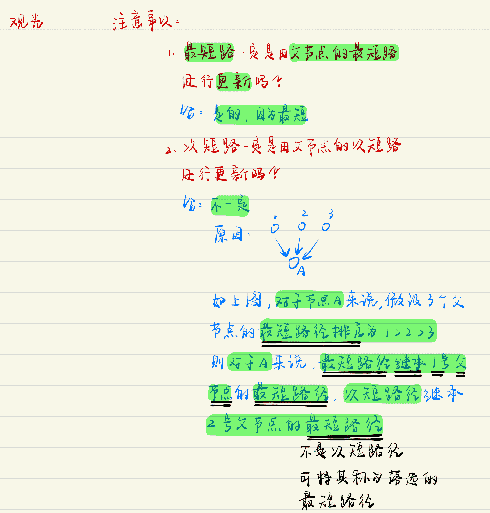

**代ç **

```c++
#include <iostream>
#include <cstring>
#include <queue>
using namespace std;
const int N = 1010, M = 10010, K = 5;
int n, m, T, idx;
int h[N], e[M], w[M], ne[M];
int st[N][K], cnt[N][K], dist[N][K];
struct Node {
    int ver, distance, type;
    // é‡è½½å¤§äºå·
    bool operator > (const Node &W) const {
        return distance > W.distance;
    }
};
void add(int a, int b, int c) {
    e[idx] = b;
    w[idx] = c;
    ne[idx] = h[a];
    h[a] = idx ++;
    return;
}
int dijkstra(int start, int end) {
    // åˆå§‹åŒ–三个数组
    memset(st, false, sizeof st);
    memset(dist, 0x3f, sizeof dist);
    memset(cnt, 0, sizeof cnt);
    priority_queue<Node, vector<Node>, greater<Node>> heap;
    heap.push({start, 0, 0});
    dist[start][0] = 0;
    cnt[start][0] = 1;
    while (heap.size()) {
        auto t = heap.top(); heap.pop();
        int ver = t.ver, distance = t.distance, type = t.type;
        if (st[ver][type]) continue;
        st[ver][type] = true;
        for (int i = h[ver]; i != -1; i = ne[i]) {
            int j = e[i];
            if (dist[j][0] > distance + w[i]) {
                // 更新次短路路径
                cnt[j][1] = cnt[j][0];
                dist[j][1] = dist[j][0];
                heap.push({j, dist[j][1], 1});
                // 更新最短路径
                // 注æ„: 这里是cnt[ver][type]ä¸æ˜¯cnt[ver][0]
                cnt[j][0] = cnt[ver][0];
                dist[j][0] = distance + w[i];
                heap.push({j, dist[j][0], 0});
            }
            else if (dist[j][0] == distance + w[i]) {
                // 注æ„: 这里是cnt[ver][type]ä¸æ˜¯cnt[ver][0]
                cnt[j][0] += cnt[ver][0];
            }
            else if (dist[j][1] > distance + w[i]) {
                // 注æ„: 这里是cnt[ver][type]ä¸æ˜¯cnt[ver][0]
                // 这里的类å‹ä¸ä¸€å®šæ˜¯æ¬¡çŸ­è·¯å¾„, 有å¯èƒ½æ˜¯è½è´¥çš„最短路径, [手写稿解释]
                cnt[j][1] = cnt[ver][type];
                dist[j][1] = distance + w[i];
                heap.push({j, dist[j][1], 1});
            }
            else if (dist[j][1] == distance + w[i]) {
                // 注æ„: 这里是cnt[ver][type]ä¸æ˜¯cnt[ver][0]
                // 这里的类å‹ä¸ä¸€å®šæ˜¯æ¬¡çŸ­è·¯å¾„, 有å¯èƒ½æ˜¯è½è´¥çš„最短路径, [手写稿解释]
                cnt[j][1] += cnt[ver][type];
            }
        }
    }
    int res = cnt[end][0];
    if (dist[end][0] + 1 == dist[end][1]) res += cnt[end][1];
    return res;
}
int main() {
    scanf("%d", &T);
    while (T -- ) {
        // åˆå§‹åŒ–队头
        memset(h, -1, sizeof h);
        // åˆå§‹åŒ–指针
        idx = 0;
        scanf("%d%d", &n, &m);
        for (int i = 0; i < m; i ++ ) {
            int a, b, c;
            scanf("%d%d%d", &a, &b, &c);
            // 建立å•å‘è¾¹
            add(a, b, c);
        }
        int start, end;
        scanf("%d%d", &start, &end);
        // 起点和终点
        cout << dijkstra(start, end) << endl;
    }
    return 0;
}
```

**时间å¤æ‚度**

$O(mlog_n)$

**空间å¤æ‚度**

$O(m)$

**标签**

`Dijkstra`ã€`最短路`ã€`次短路`

**ç¼åˆæ€ª**


## `Floyd` 算法

### åŸç†ä»‹ç»


### [AcWing 854. Floyd求最短路](https://www.acwing.com/problem/content/856/)

**题目æè¿°**

>   给定一个 `n` 个点 `m` æ¡è¾¹çš„有å‘图，图中å¯èƒ½å­˜åœ¨é‡è¾¹å’Œè‡ªç¯ï¼Œè¾¹æƒå¯èƒ½ä¸ºè´Ÿæ•°ã€‚
>
>   å†ç»™å®š `k` 个询问，æ¯ä¸ªè¯¢é—®åŒ…å«ä¸¤ä¸ªæ•´æ•° `x` å’Œ `y`，表示查询ä»ç‚¹ `x` 到点 `y` 的最短è·ç¦»ï¼Œå¦‚æœè·¯å¾„ä¸å­˜åœ¨ï¼Œåˆ™è¾“出 `impossible`。
>
>   æ•°æ®ä¿è¯å›¾ä¸­ä¸å­˜åœ¨è´Ÿæƒå›è·¯ã€‚

**输入格å¼**

>   第一行包å«ä¸‰ä¸ªæ•´æ•° `n, m, k`。
>
>   æ¥ä¸‹æ¥ `m` 行，æ¯è¡ŒåŒ…å«ä¸‰ä¸ªæ•´æ•° `x, y ,z`，表示存在一æ¡ä»ç‚¹ `x` 到点 `y` 的有å‘边，边长为 `z`。
>
>   æ¥ä¸‹æ¥ `k` 行，æ¯è¡ŒåŒ…å«ä¸¤ä¸ªæ•´æ•° `x, y`，表示询问点 `x` 到点 `y` 的最短è·ç¦»ã€‚

**输出格å¼**

>   å…± `k` 行，æ¯è¡Œè¾“出一个整数，表示询问的结æœï¼Œè‹¥è¯¢é—®ä¸¤ç‚¹é—´ä¸å­˜åœ¨è·¯å¾„，则输出 `impossible`。

**æ•°æ®èŒƒå›´**

>   +   $1 ≤ n ≤ 200,$
>   +   $1 ≤ k ≤ n^2$
>   +   $1 ≤ m ≤ 20000,$
>   +   $图中涉åŠè¾¹é•¿ç»å¯¹å€¼å‡ä¸è¶…过 10000。$

**输入样例**

```c++
3 3 2
1 2 1
2 3 2
1 3 1
2 1
1 3
```

**输出样例**

```c++
impossible
1
```

**手写稿**

>   1.   模æ¿é¢˜, å‚è§[åŸç†ä»‹ç»](#åŸç†ä»‹ç»)
>   2.   注æ„: æšä¸¾çš„顺åºå³å¯, `k -> i -> j`

**代ç **

```c++
#include <iostream>
#include <cstring>
using namespace std;
const int N = 210, INF = 0x3f3f3f3f;
int n, m, k;
int g[N][N];
int main() {
    scanf("%d%d%d", &n, &m, &k);
    memset(g, 0x3f, sizeof g);
    for (int i = 1; i <= n; i ++ ) g[i][i] = 0;
    for (int i = 0; i < m; i ++ ) {
        int u, v, w;
        scanf("%d%d%d", &u, &v, &w);
        // å¯èƒ½ä¼šæœ‰é‡è¾¹, é‡è¾¹çš„è¯å–最å°å€¼å³å¯
        g[u][v] = min(g[u][v], w);
    }
    for (int k = 1; k <= n; k ++ )
        for (int i = 1; i <= n; i ++ )
            for (int j = 1; j <= n; j ++ )
                g[i][j] = min(g[i][j], g[i][k] + g[k][j]);
    while (k -- ) {
        int u, v;
        scanf("%d%d", &u, &v);
        // å¯èƒ½ä¼šæœ‰è´Ÿæ•°, å› æ­¤, 如æœå½“å…¶å¤§äº INF / 2 的时候, 则判定其无解
        if (g[u][v] > INF / 2) puts("impossible");
        else cout << g[u][v] << endl;
    }
    return 0;
}
```

**时间å¤æ‚度**

$O(n^3)$

**空间å¤æ‚度**

$O(n ^ 2)$

**标签**

`Floyd`ã€`动æ€è§„划`

**ç¼åˆæ€ª**


### [AcWing 1125. 牛的旅行](https://www.acwing.com/problem/content/1127/)

**题目æè¿°**

>   农民 `John` 的农场里有很多牧区，有的路径è¿æ¥ä¸€äº›ç‰¹å®šçš„牧区。
>
>   一片所有è¿é€šçš„牧区称为一个牧场。
>
>   但是就目å‰è€Œè¨€ï¼Œä½ èƒ½çœ‹åˆ°è‡³å°‘有两个牧区ä¸è¿é€šã€‚
>
>   ç°åœ¨ï¼Œ`John` 想在农场里添加一æ¡è·¯å¾„（注æ„，æ°å¥½ä¸€æ¡ï¼‰ã€‚
>
>   一个牧场的直径就是牧场中最远的两个牧区的è·ç¦»ï¼ˆæœ¬é¢˜ä¸­æ‰€æ到的所有è·ç¦»æŒ‡çš„都是最短的è·ç¦»ï¼‰ã€‚
>
>   考虑如下的两个牧场，æ¯ä¸€ä¸ªç‰§åŒºéƒ½æœ‰è‡ªå·±çš„å标：
>
>   
>
>   图 `1` 是有 `5` 个牧区的牧场，牧区用`“*â€`表示，路径用直线表示。
>
>   图 `1` 所示的牧场的直径大约是 `12.07106`, 最远的两个牧区是 `A` 和 `E`，它们之间的最短路径是 `A-B-E`。
>
>   图 `2` 是å¦ä¸€ä¸ªç‰§åœºã€‚
>
>   这两个牧场都在 `John` 的农场上。
>
>   `John` 将会在两个牧场中å„选一个牧区，然å用一æ¡è·¯å¾„è¿èµ·æ¥ï¼Œä½¿å¾—è¿é€šå这个新的更大的牧场有最å°çš„直径。
>
>   注æ„，如æœä¸¤æ¡è·¯å¾„中途相交，我们ä¸è®¤ä¸ºå®ƒä»¬æ˜¯è¿é€šçš„。
>
>   åªæœ‰ä¸¤æ¡è·¯å¾„在åŒä¸€ä¸ªç‰§åŒºç›¸äº¤ï¼Œæˆ‘们æ‰è®¤ä¸ºå®ƒä»¬æ˜¯è¿é€šçš„。
>
>   ç°åœ¨è¯·ä½ ç¼–程找出一æ¡è¿æ¥ä¸¤ä¸ªä¸åŒç‰§åœºçš„路径，使得è¿ä¸Šè¿™æ¡è·¯å¾„å，所有牧场（生æˆçš„新牧场和åŸæœ‰ç‰§åœºï¼‰ä¸­ç›´å¾„最大的牧场的直径尽å¯èƒ½å°ã€‚
>
>   输出这个直径最å°å¯èƒ½å€¼ã€‚

**输入格å¼**

>   第 `1` 行：一个整数 `N`, 表示牧区数；
>
>   第 `2` 到 `N + 1` 行：æ¯è¡Œä¸¤ä¸ªæ•´æ•° `X,Y`， 表示 `N` 个牧区的å标。æ¯ä¸ªç‰§åŒºçš„å标都是ä¸ä¸€æ ·çš„。
>
>   第 `N + 2` 行到第 `2 * N + 1` 行：æ¯è¡ŒåŒ…括 `N` 个数字 ( `0`或`1` ) 表示一个对称邻æ¥çŸ©é˜µã€‚
>
>   例如，题目æ述中的两个牧场的矩阵æ述如下：
>
>   ```c++
>     A B C D E F G H 
>   A 0 1 0 0 0 0 0 0 
>   B 1 0 1 1 1 0 0 0 
>   C 0 1 0 0 1 0 0 0 
>   D 0 1 0 0 1 0 0 0 
>   E 0 1 1 1 0 0 0 0 
>   F 0 0 0 0 0 0 1 0 
>   G 0 0 0 0 0 1 0 1 
>   H 0 0 0 0 0 0 1 0
>   ```
>
>   输入数æ®ä¸­è‡³å°‘包括两个ä¸è¿é€šçš„牧区。

**输出格å¼**

>   åªæœ‰ä¸€è¡Œï¼ŒåŒ…括一个å®æ•°ï¼Œè¡¨ç¤ºæ‰€æ±‚答案。
>
>   æ•°å­—ä¿ç•™å…­ä½å°æ•°ã€‚

**æ•°æ®èŒƒå›´**

>   +   $1 ≤ N ≤ 150,$
>   +   $0 ≤ X, Y ≤ 10^5$

**输入样例**

```c++
8
10 10
15 10
20 10
15 15
20 15
30 15
25 10
30 10
01000000
10111000
01001000
01001000
01110000
00000010
00000101
00000010
```

**输出样例**

```c++
22.071068
```

**手写稿**

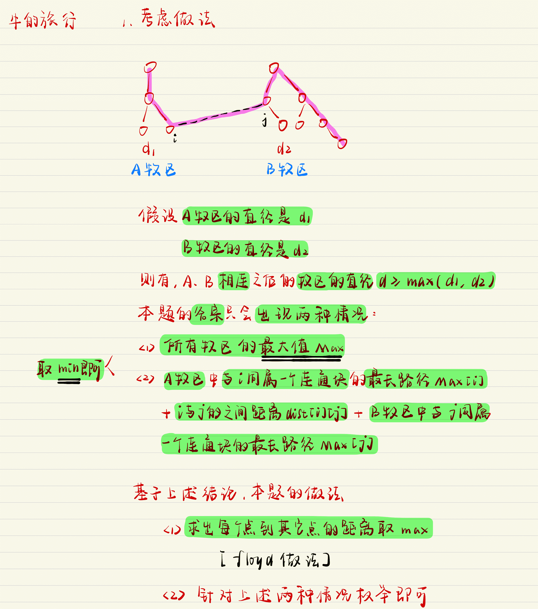

**代ç **

```c++
#include <iostream>
#include <cmath>
#define x first
#define y second
using namespace std;
typedef pair<int, int> PII;
const int N = 155;
const double INF = 1e20;
int n;
PII q[N];
double Max[N];
double dist[N][N];
char g[N][N];
// 计算欧å¼è·ç¦»
double get_dist(PII a, PII b) {
    int dx = a.x - b.x;
    int dy = a.y - b.y;
    return sqrt(dx * dx + dy * dy);
}
int main() {
    scanf("%d", &n);
    for (int i = 0; i < n; i ++ ) scanf("%d%d", &q[i].x, &q[i].y);
    for (int i = 0; i < n; i ++ ) scanf("%s", g[i]);
    for (int i = 0; i < n; i ++ )
        for (int j = 0; j < n; j ++ )
            // 更新两个点之间的è·ç¦»
            if (g[i][j] == '1') dist[i][j] = get_dist(q[i], q[j]);
            else if (i == j) dist[i][j] = 0;
            else dist[i][j] = INF;
    // Floyd算法模æ¿
    for (int k = 0; k < n; k ++ )
        for (int i = 0; i < n; i ++ )
            for (int j = 0; j < n; j ++ )
                dist[i][j] = min(dist[i][j], dist[i][k] + dist[k][j]);
    // 计算è¿é€šå—内部任æ„两个点之间的最长è·ç¦», å³è®¡ç®—第一ç§æƒ…况
    // åˆå§‹åŒ–为-âˆ
    double res1 = -INF;
    for (int i = 0; i < n; i ++ ) {
        for (int j = 0; j < n; j ++ )
            if (dist[i][j] < INF / 2)
                Max[i] = max(Max[i], dist[i][j]);
        res1 = max(res1, Max[i]);
    }
    // 计算第二ç§æƒ…况
    // åˆå§‹åŒ–为+âˆ
    double res2 = INF;
    for (int i = 0; i < n; i ++ )
        for (int j = 0; j < n; j ++ )
            if (dist[i][j] > INF / 2) // ä¸è¿é€š
                res2 = min(res2, Max[i] + Max[j] + get_dist(q[i], q[j]));
    // 两ç§æƒ…况å–maxå³å¯
    printf("%lf\n", max(res1, res2));
    return 0;
}
```

**时间å¤æ‚度**

$O(n^3)$

**空间å¤æ‚度**

`O(n^2)`

**标签**

`Floyd`ã€`传递闭包`

**ç¼åˆæ€ª**


### [PTA L2-010 æ’座ä½](https://pintia.cn/problem-sets/994805046380707840/problems/994805066135879680)

**题目æè¿°**

>   布置宴席最微妙的事情，就是给å‰æ¥å‚å®´çš„å„ä½å®¾å®¢å®‰æ’座ä½ã€‚无论如何，总ä¸èƒ½æŠŠä¸¤ä¸ªæ­»å¯¹å¤´æ’到åŒä¸€å¼ å®´ä¼šæ¡Œæ—ï¼è¿™ä¸ªè‰°å·¨ä»»åŠ¡ç°åœ¨å°±äº¤ç»™ä½ ï¼Œå¯¹ä»»ä½•ä¸€å¯¹å®¢äººï¼Œè¯·ç¼–写程åºå‘Šè¯‰ä¸»äººä»–们是å¦èƒ½è¢«å®‰æ’åŒå¸­ã€‚

**输入格å¼**

>   输入第一行给出3个正整数：`N`（`≤100`），å³å‰æ¥å‚宴的宾客总人数，则这些人ä»`1`到`N`ç¼–å·ï¼›`M`为已知两两宾客之间的关系数；`K`为查询的æ¡æ•°ã€‚éšå`M`行，æ¯è¡Œç»™å‡ºä¸€å¯¹å®¾å®¢ä¹‹é—´çš„关系，格å¼ä¸ºï¼š`宾客1 宾客2 关系`，其中`关系`为`1`表示是朋å‹ï¼Œ`-1`表示是死对头。注æ„两个人ä¸å¯èƒ½æ—¢æ˜¯æœ‹å‹åˆæ˜¯æ•Œäººã€‚最å`K`行，æ¯è¡Œç»™å‡ºä¸€å¯¹éœ€è¦æŸ¥è¯¢çš„宾客编å·ã€‚
>
>   这里å‡è®¾æœ‹å‹çš„朋å‹ä¹Ÿæ˜¯æœ‹å‹ã€‚但敌人的敌人并ä¸ä¸€å®šå°±æ˜¯æœ‹å‹ï¼Œæœ‹å‹çš„敌人也ä¸ä¸€å®šæ˜¯æ•Œäººã€‚åªæœ‰å•çº¯ç›´æ¥çš„敌对关系æ‰æ˜¯ç»å¯¹ä¸èƒ½åŒå¸­çš„。

**输出格å¼**

>   对æ¯ä¸ªæŸ¥è¯¢è¾“出一行结æœï¼šå¦‚æœä¸¤ä½å®¾å®¢ä¹‹é—´æ˜¯æœ‹å‹ï¼Œä¸”没有敌对关系，则输出`No problem`；如æœä»–们之间并ä¸æ˜¯æœ‹å‹ï¼Œä½†ä¹Ÿä¸æ•Œå¯¹ï¼Œåˆ™è¾“出`OK`；如æœä»–们之间有敌对，然而也有共åŒçš„朋å‹ï¼Œåˆ™è¾“出`OK but...`；如æœä»–们之间åªæœ‰æ•Œå¯¹å…³ç³»ï¼Œåˆ™è¾“出`No way`。

**输入样例**

```c++
7 8 4
5 6 1
2 7 -1
1 3 1
3 4 1
6 7 -1
1 2 1
1 4 1
2 3 -1
3 4
5 7
2 3
7 2
```

**输出样例**

```c++
No problem
OK
OK but...
No way
```

**手写稿**

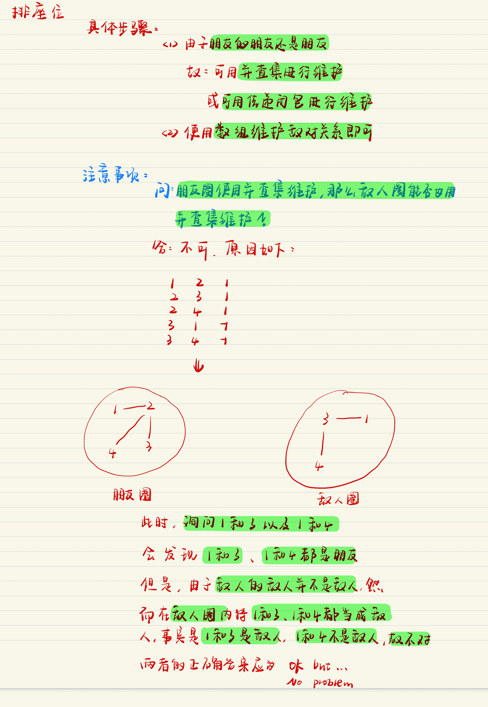

**代ç ä¸€:传递闭包**

```c++
#include <iostream>
using namespace std;
const int N = 110;
int n, m, k;
int friends[N][N], enemy[N][N];
void floyd() {
    for (int k = 1; k <= n; k ++ )
        for (int i = 1; i <= n; i ++ )
            for (int j = 1; j <= n; j ++ )
                // |= ä¸æ˜¯ =
                // 如æœiå’Œjå·²ç»æ˜¯æœ‹å‹, 则ä¸ç®¡iå’Œkå·²ç»kå’Œj是å¦æ˜¯æœ‹å‹
                // 都ä¸èƒ½å½±å“iå’Œjå·²ç»æ˜¯æœ‹å‹è¿™ä»¶äº‹å®, 故使用 |= 而ä¸æ˜¯ =
                friends[i][j] |= friends[i][k] && friends[k][j];
    return;
}
int main() {
    scanf("%d%d%d", &n, &m, &k);
    for (int i = 0; i < m; i ++ ) {
        int a, b, c;
        scanf("%d%d%d", &a, &b, &c);
        // 朋å‹çš„朋å‹è¿˜æ˜¯æœ‹å‹
        if (c == 1) friends[a][b] = friends[b][a] = 1;
        else enemy[a][b] = enemy[b][a] = 1;
    }
    floyd();
    while (k -- ) {
        int a, b;
        scanf("%d%d", &a, &b);
        if (friends[a][b] && !enemy[a][b]) puts("No problem");
        else if (!friends[a][b] && !enemy[a][b]) puts("OK");
        else if (friends[a][b] && enemy[a][b]) puts("OK but...");
        else if (!friends[a][b] && enemy[a][b]) puts("No way");
    }
    return 0;
}
```

**时间å¤æ‚度**

$O(n ^ 3)$

**空间å¤æ‚度**

$O(n^2)$

**代ç äºŒ: 并查集**

```c++
#include <iostream>
using namespace std;
const int N = 110;
int n, m, k;
int f[N];
int enemy[N][N];
int find(int x) {
    if (f[x] == x) return f[x];
    return f[x] = find(f[x]);
}
int main() {
    scanf("%d%d%d", &n, &m, &k);
    for (int i = 1; i <= n; i ++ ) f[i] = i;
    for (int i = 0; i < m; i ++ ) {
        int a, b, c;
        scanf("%d%d%d", &a, &b, &c);
        // 朋å‹çš„朋å‹è¿˜æ˜¯æœ‹å‹
        if (c == 1) {
            int fa = find(a);
            int fb = find(b);
            if (fa == fb) continue;
            f[fb] = fa;
        }
        else enemy[a][b] = enemy[b][a] = 1;
    }
    while (k -- ) {
        int a, b;
        scanf("%d%d", &a, &b);
        int fa = find(a);
        int fb = find(b);
        if (fa == fb && !enemy[a][b]) puts("No problem");
        else if (fa != fb && !enemy[a][b]) puts("OK");
        else if (fa == fb && enemy[a][b]) puts("OK but...");
        else if (fa != fb && enemy[a][b]) puts("No way");
    }
    return 0;
}
```

**时间å¤æ‚度**

$O(n)$

**空间å¤æ‚度**

$O(n^2)$

**标签**

`并查集`ã€`传递闭包`

**ç¼åˆæ€ª**


### [AcWing 343. æ’åº](https://www.acwing.com/problem/content/345/)

**题目æè¿°**

>   给定 `n` 个å˜é‡å’Œ `m` 个ä¸ç­‰å¼ã€‚其中 `n` å°äºç­‰äº `26`，å˜é‡åˆ†åˆ«ç”¨å‰ `n` 的大写英文字æ¯è¡¨ç¤ºã€‚
>
>   ä¸ç­‰å¼ä¹‹é—´å…·æœ‰ä¼ é€’性，å³è‹¥ `A > B` 且 `B > C`，则 `A > C`。
>
>   请ä»å‰å¾€åéå†æ¯å¯¹å…³ç³»ï¼Œæ¯æ¬¡éå†æ—¶åˆ¤æ–­ï¼š
>
>   -   如æœèƒ½å¤Ÿç¡®å®šå…¨éƒ¨å…³ç³»ä¸”无矛盾，则结æŸå¾ªç¯ï¼Œè¾“出确定的次åºï¼›
>   -   如æœå‘生矛盾，则结æŸå¾ªç¯ï¼Œè¾“出有矛盾；
>   -   如æœå¾ªç¯ç»“æŸæ—¶æ²¡æœ‰å‘生上述两ç§æƒ…况，则输出无定解。

**输入格å¼**

>   输入包å«å¤šç»„测试数æ®ã€‚
>
>   æ¯ç»„测试数æ®ï¼Œç¬¬ä¸€è¡ŒåŒ…å«ä¸¤ä¸ªæ•´æ•° `n` å’Œ `m`。
>
>   æ¥ä¸‹æ¥ `m` 行，æ¯è¡ŒåŒ…å«ä¸€ä¸ªä¸ç­‰å¼ï¼Œä¸ç­‰å¼å…¨éƒ¨ä¸ºå°äºå…³ç³»ã€‚
>
>   当输入一行 `0 0` 时，表示输入终止。

**输出格å¼**

>   æ¯ç»„æ•°æ®è¾“出一个å ä¸€è¡Œçš„结æœã€‚
>
>   结æœå¯èƒ½ä¸ºä¸‹åˆ—三ç§ä¹‹ä¸€ï¼š
>
>   1.  如æœå¯ä»¥ç¡®å®šä¸¤ä¸¤ä¹‹é—´çš„关系，则输出 `"Sorted sequence determined after t relations: yyy...y."`,其中`'t'`指迭代次数，`'yyy...y'`是指å‡åºæ’列的所有å˜é‡ã€‚
>   2.  如æœæœ‰çŸ›ç›¾ï¼Œåˆ™è¾“出： `"Inconsistency found after t relations."`，其中`'t'`指迭代次数。
>   3.  如æœæ²¡æœ‰çŸ›ç›¾ï¼Œä¸”ä¸èƒ½ç¡®å®šä¸¤ä¸¤ä¹‹é—´çš„关系，则输出 `"Sorted sequence cannot be determined."`。

**æ•°æ®èŒƒå›´**

>   +   $2 ≤ n ≤ 26，å˜é‡åªå¯èƒ½ä¸ºå¤§å†™å­—æ¯ A ∼ Z。$

**输入样例1**

```c++
4 6
A<B
A<C
B<C
C<D
B<D
A<B
3 2
A<B
B<A
26 1
A<Z
0 0
```

**输出样例1**

```c++
Sorted sequence determined after 4 relations: ABCD.
Inconsistency found after 2 relations.
Sorted sequence cannot be determined.
```

**输入样例2**

```c++
6 6
A<F
B<D
C<E
F<D
D<E
E<F
0 0
```

**输出样例2**

```c++
Inconsistency found after 6 relations.
```

**输入样例3**

```c++
5 5
A<B
B<C
C<D
D<E
E<A
0 0
```

**输出样例3**

```c++
Sorted sequence determined after 4 relations: ABCDE.
```

**手写稿**

>   1.   åŸå§‹æ‰‹å†™ç¨¿
>
>        
>
>   2.   补充说æ˜
>
>        

**代ç **

```c++
#include <iostream>
#include <cstring>
using namespace std;
const int N = 30;
int n, m;
int st[N];
int g[N][N];
void floyd() {
    for (int k = 0; k < n; k ++ )
        for (int i = 0; i < n; i ++ )
            for (int j = 0; j < n; j ++ )
                g[i][j] |= g[i][k] && g[k][j];
    return;
}
int check() {
    for (int i = 0; i < n; i ++ )
        if (g[i][i]) return 2;
    for (int i = 0; i < n; i ++ )
        for (int j = i + 1; j < n; j ++ )
            // 注æ„: 手写稿说æ˜
            if (!g[i][j] && !g[j][i]) return 3;
    return 1;
}
int main() {
    while (~scanf("%d%d", &n, &m), n || m) {
        memset(g, 0, sizeof g);
        char str[5];
        int tms, t = 3;
        for (int i = 1; i <= m; i ++ ) {
            scanf("%s", str);
            int a = str[0] - 'A';
            int b = str[2] - 'A';
            // 第三ç§æƒ…况, 也就是ä¸ç¡®å®šçš„时候, æ‰ç»§ç»­è¿è¾¹
            // 第一ã€äºŒç§æƒ…况, 也就是说已ç»å¾—出结论了, 则直æ¥è·³è¿‡, ä¸éœ€è¦è¿è¾¹, 也ä¸éœ€è¦è¿›è¡Œåˆ¤æ–­
            if (t == 3) {
                g[a][b] = 1;
                floyd();
                int k = check();
                t = k;
                tms = i;
            }
        }
        if (t == 1) {
            printf("Sorted sequence determined after %d relations: ", tms);
            memset(st, false, sizeof st);
         	// 找到n个点, 故循ç¯n次
            for (int k = 0; k < n; k ++ )
                // éå†æ¯ä¸€åˆ—
                for (int j = 0; j < n; j ++ ) {
                    if (st[j]) continue;
                    int flag = true;
                    // éå†æ¯ä¸€è¡Œ
                    for (int i = 0; i < n; i ++ ) {
                        if (st[i]) continue;
                        if (g[i][j]) {
                            flag = false;
                            break;
                        }
                    }
                    if (flag) {
                        st[j] = true;
                        printf("%c", j + 'A');
                        break;
                    }
                }
            puts(".");
        }
        else if (t == 2) printf("Inconsistency found after %d relations.\n", tms);
        else printf("Sorted sequence cannot be determined.\n");
    }
    return 0;
}
```

**时间å¤æ‚度**

$O(mn^3)$

**空间å¤æ‚度**

$O(n^2)$

**标签**

`Floyd`ã€`闭包`ã€`传递闭包`

**ç¼åˆæ€ª**


### [AcWing 344. 观光之旅](https://www.acwing.com/problem/content/346/)

**题目æè¿°**

>   给定一张无å‘å›¾ï¼Œæ±‚å›¾ä¸­ä¸€ä¸ªè‡³å°‘åŒ…å« `3` 个点的ç¯ï¼Œç¯ä¸Šçš„节点ä¸é‡å¤ï¼Œå¹¶ä¸”ç¯ä¸Šçš„边的长度之和最å°ã€‚
>
>   该问题称为无å‘图的最å°ç¯é—®é¢˜ã€‚
>
>   你需è¦è¾“出最å°ç¯çš„方案，若最å°ç¯ä¸å”¯ä¸€ï¼Œè¾“出任æ„一个å‡å¯ã€‚

**输入格å¼**

>   第一行包å«ä¸¤ä¸ªæ•´æ•° `N` å’Œ `M`，表示无å‘图有 `N` 个点，`M` æ¡è¾¹ã€‚
>
>   æ¥ä¸‹æ¥ `M` 行，æ¯è¡ŒåŒ…å«ä¸‰ä¸ªæ•´æ•° `u，v，l`，表示点 `u` 和点 `v` 之间有一æ¡è¾¹ï¼Œè¾¹é•¿ä¸º `l`。

**输出格å¼**

>   输出å ä¸€è¡Œï¼ŒåŒ…å«æœ€å°ç¯çš„所有节点（按顺åºè¾“出），如æœä¸å­˜åœ¨åˆ™è¾“出 `No solution.`。

**æ•°æ®èŒƒå›´**

>   +   $1 ≤ N ≤ 100,$
>   +   $1 ≤ M ≤ 10000,$
>   +   $1 ≤ l < 500$

**输入样例**

```c++
5 7
1 4 1
1 3 300
3 1 10
1 2 16
2 3 100
2 5 15
5 3 20
```

**输出样例**

```c++
1 3 5 2
```

**手写稿**

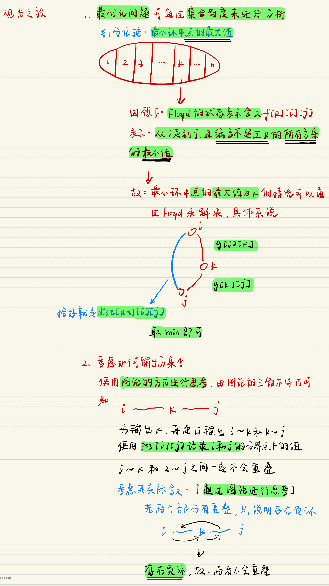

**代ç **

```c++
#include <iostream>
#include <cstring>
using namespace std;
const int N = 110, INF = 0x3f3f3f3f;
int n, m, cnt;
int path[N];
int g[N][N], dist[N][N], pos[N][N];
void dfs(int i, int j) {
    if (pos[i][j] == 0) return;
    // æšä¸¾iå’Œj的分界点
    int k = pos[i][j];
    // 递归左åŠè¾¹
    dfs(i, k);
    // 记录中间点
    path[cnt ++ ] = k;
    // 递归å³åŠè¾¹
    dfs(k, j);
    return;
}
int main() {
    scanf("%d%d", &n, &m);
    memset(g, 0x3f, sizeof g);
    for (int i = 1; i <= n; i ++ ) g[i][i] = 0;
    for (int i = 0; i < m; i ++ ) {
        int a, b, c;
        scanf("%d%d%d",&a, &b, &c);
        g[a][b] = g[b][a] = min(g[a][b], c);
    }
    memcpy(dist, g, sizeof g);
    int res = INF;
    for (int k = 1; k <= n; k ++ ) {
        for (int i = 1; i < k; i ++ )
            for (int j = i + 1; j < k; j ++ )
                // g[i][k]是iå’Œk之间的æƒå€¼
                // g[k][j]是kå’Œj之间的æƒå€¼
                if ((long long)dist[i][j] + g[i][k] + g[k][j] < res) {
                    cnt = 0;
                    res = dist[i][j] + g[i][k] + g[k][j];
                    path[cnt ++ ] = k;
                    path[cnt ++ ] = i;
                    dfs(i, j);
                    path[cnt ++ ] = j;
                }
        for (int i = 1; i <= n; i ++ )
            for (int j = 1; j <= n; j ++ )
                if (dist[i][j] > dist[i][k] + dist[k][j]) {
                    dist[i][j] = dist[i][k] + dist[k][j];
                    // 记录分界点
                    pos[i][j] = k;
                }
    }
    if (res == INF) puts("No solution.");
    else
        for (int i = 0; i < cnt; i ++ ) cout << path[i] << " ";
    return 0;
}
```

**时间å¤æ‚度**

$O(n^3)$

**空间å¤æ‚度**

$O(n^2)$

**标签**

`最å°ç¯`ã€`Floyd`

**ç¼åˆæ€ª**


### [AcWing 345. 牛站](https://www.acwing.com/problem/content/347/)

**题目æè¿°**

>   给定一张由 `T` æ¡è¾¹æ„æˆçš„æ— å‘图，点的编å·ä¸º `1 ∼ 1000` 之间的整数。
>
>   求ä»èµ·ç‚¹ `S` 到终点 `E` æ°å¥½ç»è¿‡ `N` æ¡è¾¹ï¼ˆå¯ä»¥é‡å¤ç»è¿‡ï¼‰çš„最短路。
>
>   **注æ„**: æ•°æ®ä¿è¯ä¸€å®šæœ‰è§£ã€‚

**输入格å¼**

>   第 `1` 行：包å«å››ä¸ªæ•´æ•° `N，T，S，E`。
>
>   第 `2..T + 1` 行：æ¯è¡ŒåŒ…å«ä¸‰ä¸ªæ•´æ•°ï¼Œæ述一æ¡è¾¹çš„边长以åŠæ„æˆè¾¹çš„两个点的编å·ã€‚

**输出格å¼**

>   输出一个整数，表示最短路的长度。

**æ•°æ®èŒƒå›´**

>   +   $2 ≤ T ≤ 100,$
>   +   $2 ≤ N ≤ 10^6$

**输入样例**

```c++
2 6 6 4
11 4 6
4 4 8
8 4 9
6 6 8
2 6 9
3 8 9
```

**输出样例**

```c++
10
```

**手写稿**


**代ç **

```c++
#include <iostream>
#include <cstring>
#include <unordered_map>
using namespace std;
const int N = 210;
int n, m, k, S, E;
int g[N][N], res[N][N];
unordered_map<int, int> id;
void mul(int c[][N], int a[][N], int b[][N]) {
    // ç”±äºcå’Œa或者b相等, 为防止读写冲çª
    // 因此, 使用tmp作为新的临时数组
    static int tmp[N][N];
    memset(tmp, 0x3f, sizeof tmp);
    // Floyd模æ¿
    for (int k = 1; k <= n; k ++ )
        for (int i = 1; i <= n; i ++ )
            for (int j = 1; j <= n; j ++ )
                tmp[i][j] = min(tmp[i][j], a[i][k] + b[k][j]);
    memcpy(c, tmp, sizeof tmp);
    return;
}
void qmi() {
    // res表示ç»è¿‡0æ¡è¾¹, ä»S到E的最短路径
    // æ•…: res[i][i]åˆå§‹åŒ–为0
    memset(res, 0x3f, sizeof res);
    for (int i = 1; i <= n; i ++ ) res[i][i] = 0;
    while (k) {
        if (k & 1) mul(res, res, g);
        // gå€å¢ä¸€æ¬¡, 表示ç»è¿‡2æ¡è¾¹, ä»S走到E的最短è·ç¦»
        // gå€å¢ä¸¤æ¬¡, 表示ç»è¿‡4æ¡è¾¹, ä»S走到E的最短è·ç¦»
        // ... ä¾æ¬¡ç±»æ¨
        mul(g, g, g);
        k >>= 1;
    }
    return;
}
int main() {
    // g数组表示ç»è¿‡1æ¡è¾¹, ä»S走到E的最短è·ç¦»
    memset(g, 0x3f, sizeof g);
    scanf("%d%d%d%d", &k, &m, &S, &E);
    if (!id.count(S)) id[S] = ++ n;
    if (!id.count(E)) id[E] = ++ n;
    // 离散化
    S = id[S], E = id[E];
    for (int i = 0; i < m; i ++ ) {
        int a, b, c;
        scanf("%d%d%d", &c, &a, &b);
        if (!id.count(a)) id[a] = ++ n;
        if (!id.count(b)) id[b] = ++ n;
        a = id[a], b = id[b];
        // 防止é‡è¾¹
        g[a][b] = g[b][a] = min(g[a][b], c);
    }
    qmi();
    cout << res[S][E] << endl;
    return 0;
}
```

**时间å¤æ‚度**

$O(n^3log_k)$

**空间å¤æ‚度**

$O(n^2)$

**标签**

`Floyd`ã€`å€å¢`

**ç¼åˆæ€ª**


## 最å°ç”Ÿæˆæ ‘

### 正确性è¯æ˜

#### `Prim`


#### `Kruskal`

>   1.   åŒ `prim` è¯æ˜æ–¹æ³•

### [AcWing 858. Prim算法求最å°ç”Ÿæˆæ ‘](https://www.acwing.com/problem/content/860/)

**题目æè¿°**

>   给定一个 `n` 个点 `m` æ¡è¾¹çš„æ— å‘图，图中å¯èƒ½å­˜åœ¨é‡è¾¹å’Œè‡ªç¯ï¼Œè¾¹æƒå¯èƒ½ä¸ºè´Ÿæ•°ã€‚
>
>   求最å°ç”Ÿæˆæ ‘çš„æ ‘è¾¹æƒé‡ä¹‹å’Œï¼Œå¦‚æœæœ€å°ç”Ÿæˆæ ‘ä¸å­˜åœ¨åˆ™è¾“出 `impossible`。
>
>   给定一张边带æƒçš„æ— å‘图 `G=(V,E)`，其中 `V` 表示图中点的集åˆï¼Œ`E` 表示图中边的集åˆï¼Œ`n=|V|`，`m=|E|`。
>
>   ç”± `V` 中的全部 `n` 个顶点和 `E` 中 `n − 1` æ¡è¾¹æ„æˆçš„æ— å‘è¿é€šå­å›¾è¢«ç§°ä¸º `G` 的一棵生æˆæ ‘，其中边的æƒå€¼ä¹‹å’Œæœ€å°çš„生æˆæ ‘被称为无å‘图 `G` 的最å°ç”Ÿæˆæ ‘。

**输入格å¼**

>   第一行包å«ä¸¤ä¸ªæ•´æ•° `n` å’Œ `m`。
>
>   æ¥ä¸‹æ¥ `m` 行，æ¯è¡ŒåŒ…å«ä¸‰ä¸ªæ•´æ•° `u,v,w`，表示点 `u` 和点 `v` 之间存在一æ¡æƒå€¼ä¸º `w` 的边。

**输出格å¼**

>   共一行，若存在最å°ç”Ÿæˆæ ‘，则输出一个整数，表示最å°ç”Ÿæˆæ ‘çš„æ ‘è¾¹æƒé‡ä¹‹å’Œï¼Œå¦‚æœæœ€å°ç”Ÿæˆæ ‘ä¸å­˜åœ¨åˆ™è¾“出 `impossible`。

**æ•°æ®èŒƒå›´**

>   +   $1 ≤ n ≤ 500,$
>   +   $1 ≤ m ≤ 10^5,$
>   +   $图中涉åŠè¾¹çš„è¾¹æƒçš„ç»å¯¹å€¼å‡ä¸è¶…过 10000。$

**输入样例**

```c++
4 5
1 2 1
1 3 2
1 4 3
2 3 2
3 4 4
```

**输出样例**

```c++
6
```

**手写稿**


**代ç **

```c++
#include <iostream>
#include <cstring>
using namespace std;
const int N = 510, INF = 0x3f3f3f3f;
int n, m;
int dist[N], st[N];
int g[N][N];
int prim() {
    // dist[i]表示点i到[集åˆ]的点的è·ç¦»
    memset(dist, 0x3f, sizeof dist);
    // st[i]表示点i是å¦åŠ å…¥åˆ°é›†åˆä¸­
    memset(st, false, sizeof st);
    int res = 0;
    // 一共å–n个点, æ•…, 循ç¯n次
    for (int i = 0; i < n; i ++ ) {
        int t = -1;
        for (int j = 1; j <= n; j ++ )
            // 寻找è·ç¦»[集åˆ]的点的最å°è·ç¦»
            if (!st[j] && (t == -1 || dist[t] > dist[j]))
                t = j;
        // 标记当å‰ç‚¹å·²ç»å¤„äº[集åˆ]内
        st[t] = true;
        // ä¸è¿é€š, è¿”å›false
        if (i && dist[t] == INF) return INF;
        if (i) res += dist[t];
        for (int j = 1; j <= n; j ++ )
            // 如æœå½“å‰ç‚¹å¤„äº[集åˆ]外并且当å‰ç‚¹åˆ°[集åˆ]内的点的è·ç¦»æ›´å°, 则更新
            if (!st[j] && dist[j] > g[t][j]) dist[j] = g[t][j];
    }
    return res;
}
int main() {
    scanf("%d%d", &n, &m);
    // 最å°ç”Ÿæˆæ ‘ä¸å«æœ‰è‡ªç¯
    // å› æ­¤, å°†g[i][i]之间的è·ç¦»ä¹Ÿåˆå§‹åŒ–为+âˆ
    memset(g, 0x3f, sizeof g);
    for (int i = 0; i < m; i ++ ) {
        int a, b, c;
        scanf("%d%d%d", &a, &b, &c);
        // å–é‡è¾¹çš„最å°å€¼å³å¯
        g[a][b] = g[b][a] = min(g[a][b], c);
    }
    int t = prim();
    if (t == INF) puts("impossible");
    else cout << t << endl;
    return 0;
}
```

**时间å¤æ‚度**

$O(n^2)$

**空间å¤æ‚度**

$O(n^2)$

**标签**

`最å°ç”Ÿæˆæ ‘`ã€`prim`

**ç¼åˆæ€ª**


### [AcWing 859. Kruskal算法求最å°ç”Ÿæˆæ ‘](https://www.acwing.com/problem/content/861/)

**题目æè¿°**

>   给定一个 `n` 个点 `m` æ¡è¾¹çš„æ— å‘图，图中å¯èƒ½å­˜åœ¨é‡è¾¹å’Œè‡ªç¯ï¼Œè¾¹æƒå¯èƒ½ä¸ºè´Ÿæ•°ã€‚
>
>   求最å°ç”Ÿæˆæ ‘çš„æ ‘è¾¹æƒé‡ä¹‹å’Œï¼Œå¦‚æœæœ€å°ç”Ÿæˆæ ‘ä¸å­˜åœ¨åˆ™è¾“出 `impossible`。
>
>   给定一张边带æƒçš„æ— å‘图 `G=(V,E)`，其中 `V` 表示图中点的集åˆï¼Œ`E` 表示图中边的集åˆï¼Œ`n=|V|`，`m=|E|`。
>
>   ç”± `V` 中的全部 `n` 个顶点和 `E` 中 `n − 1` æ¡è¾¹æ„æˆçš„æ— å‘è¿é€šå­å›¾è¢«ç§°ä¸º `G` 的一棵生æˆæ ‘，其中边的æƒå€¼ä¹‹å’Œæœ€å°çš„生æˆæ ‘被称为无å‘图 `G` 的最å°ç”Ÿæˆæ ‘。

**输入格å¼**

>   第一行包å«ä¸¤ä¸ªæ•´æ•° `n` å’Œ `m`。
>
>   æ¥ä¸‹æ¥ `m` 行，æ¯è¡ŒåŒ…å«ä¸‰ä¸ªæ•´æ•° `u,v,w`，表示点 `u` 和点 `v` 之间存在一æ¡æƒå€¼ä¸º `w` 的边。

**输出格å¼**

>   共一行，若存在最å°ç”Ÿæˆæ ‘，则输出一个整数，表示最å°ç”Ÿæˆæ ‘çš„æ ‘è¾¹æƒé‡ä¹‹å’Œï¼Œå¦‚æœæœ€å°ç”Ÿæˆæ ‘ä¸å­˜åœ¨åˆ™è¾“出 `impossible`。

**æ•°æ®èŒƒå›´**

>   +   $1 ≤ n ≤ 10^5,$
>   +   $1 ≤ m ≤ 2 ∗ 10^5,$
>   +   $图中涉åŠè¾¹çš„è¾¹æƒçš„ç»å¯¹å€¼å‡ä¸è¶…过 1000。$

**输入样例**

```c++
4 5
1 2 1
1 3 2
1 4 3
2 3 2
3 4 4
```

**输出样例**

```c++
6
```

**手写稿**

>   1.   算法æµç¨‹:
>        +   将所有边按照æƒå€¼ä»å°åˆ°å¤§è¿›è¡Œæ’åº
>        +   ä¾æ¬¡éå†æ¯æ¡è¾¹, 如æœè¾¹ä¸¤ç«¯çš„点 `a` å’Œ `b` ä¸åœ¨ä¸€ä¸ªé›†åˆ`[并查集]`, 则将其加入最å°ç”Ÿæˆæ ‘å³å¯
>        +   é‡å¤ä¸Šè¿°æ­¥éª¤, 直到结æŸ

**代ç **

````c++
#include <iostream>
#include <algorithm>
using namespace std;
const int N = 100010, M = 200010;
int n, m;
int f[N];
struct Edge {
    int u, v, w;
    bool operator < (const Edge &W) const {
        // 按照æƒå€¼ä»å°åˆ°å¤§è¿›è¡Œæ’åº
        return w < W.w;
    }
}edges[M];
int find(int x) {
    if (f[x] == x) return f[x];
    return f[x] = find(f[x]);
}
int main() {
    scanf("%d%d", &n, &m);
    for (int i = 1; i <= n; i ++ ) f[i] = i;
    for (int i = 0; i < m; i ++ ) {
        int a, b, c;
        scanf("%d%d%d", &a, &b, &c);
        edges[i] = {a, b, c};
    }
    sort(edges, edges + m);
    // res是最å°ç”Ÿæˆæ ‘çš„æƒå€¼
    // cnt是最å°ç”Ÿæˆæ ‘的边数
    int res = 0, cnt = 0;
    for (int i = 0; i < m; i ++ ) {
        int a = edges[i].u;
        int b = edges[i].v;
        int c = edges[i].w;
        int fa = find(a);
        int fb = find(b);
        if (fa != fb) { // 如æœä¸å¤„äºä¸€ä¸ªé›†åˆå½“中
            res += c; // æƒå€¼ç›¸åŠ 
            f[fb] = fa; // 强行èåˆä¸ºä¸€ä¸ªå’Œå’Œç¦ç¦çš„大家庭
            cnt ++; // 边数 ++
        }
    }
    // 如æœæœ€å°ç”Ÿæˆæ ‘的边的个数å°äº n - 1, 则说æ˜ä¸è¿é€š, 输出 "impossible"
    if (cnt < n - 1) puts("impossible");
    else cout << res << endl;
    return 0;
}
````

**时间å¤æ‚度**

$O(mlog_m)$

**空间å¤æ‚度**

$O(m)$

**标签**

`kruskal`ã€`最å°ç”Ÿæˆæ ‘`

**ç¼åˆæ€ª**

[AcWing 837. è¿é€šå—中点的数é‡](#AcWing 837. è¿é€šå—中点的数é‡)

### [AcWing 1140. 最短网络](https://www.acwing.com/problem/content/1142/)

**题目æè¿°**

>   农夫约翰被选为他们镇的镇长ï¼
>
>   他其中一个ç«é€‰æ‰¿è¯ºå°±æ˜¯åœ¨é•‡ä¸Šå»ºç«‹èµ·äº’è”网，并è¿æ¥åˆ°æ‰€æœ‰çš„农场。
>
>   约翰已ç»ç»™ä»–的农场安æ’了一æ¡é«˜é€Ÿçš„网络线路，他想把这æ¡çº¿è·¯å…±äº«ç»™å…¶ä»–农场。
>
>   约翰的农场的编å·æ˜¯ `1`，其他农场的编å·æ˜¯ `2 ∼ n`。
>
>   为了使花费最少，他希望用äºè¿æ¥æ‰€æœ‰çš„农场的光纤总长度尽å¯èƒ½çŸ­ã€‚
>
>   你将得到一份å„农场之间è¿æ¥è·ç¦»çš„列表，你必须找出能è¿æ¥æ‰€æœ‰å†œåœºå¹¶ä½¿æ‰€ç”¨å…‰çº¤æœ€çŸ­çš„方案。

**输入格å¼**

>   第一行包å«ä¸€ä¸ªæ•´æ•° `n`，表示农场个数。
>
>   æ¥ä¸‹æ¥ `n` 行，æ¯è¡ŒåŒ…å« `n` 个整数，输入一个对角线上全是 `0` 的对称矩阵。
>   其中第 `x + 1` è¡Œ `y` 列的整数表示è¿æ¥å†œåœº `x` 和农场 `y` 所需è¦çš„光纤长度。

**输出格å¼**

>   输出一个整数，表示所需的最å°å…‰çº¤é•¿åº¦ã€‚

**æ•°æ®èŒƒå›´**

>   +   $3 ≤ n ≤ 100$
>   +   $æ¯ä¸¤ä¸ªå†œåœºé—´çš„è·ç¦»å‡æ˜¯é负整数且ä¸è¶…过100000。$

**输入样例**

```c++
4
0  4  9  21
4  0  8  17
9  8  0  16
21 17 16  0
```

**输出样例**

```c++
28
```

**手写稿**

>   1.   裸的 `prim` 算法

**代ç **

```c++
#include <iostream>
#include <cstring>
using namespace std;
const int N = 110;
int n;
int dist[N], st[N];
int g[N][N];
int prim() {
    memset(dist, 0x3f, sizeof dist);
    memset(st, false, sizeof st);
    int res = 0;
    for (int i = 0; i < n; i ++ ) {
        int t = -1;
        for (int j = 1; j <= n; j ++ )
            if (!st[j] && (t == -1 || dist[t] > dist[j]))
                t = j;
        st[t] = true;
        if (i) res += dist[t];
        for (int j = 1; j <= n; j ++ )
            dist[j] = min(dist[j], g[t][j]);
    }
    return res;
}
int main() {
    scanf("%d", &n);
    // 下标ä»1开始
    for (int i = 1; i <= n; i ++ )
        for (int j = 1; j <= n; j ++ )
            scanf("%d", &g[i][j]);
    cout << prim() << endl;
    return 0;
}
```

**时间å¤æ‚度**

$O(n^2)$

**空间å¤æ‚度**

$O(n^2)$

**标签**

`prim`ã€`最å°ç”Ÿæˆæ ‘`

**ç¼åˆæ€ª**


### [AcWing 1141. 局域网](https://www.acwing.com/problem/content/1143/)

**题目æè¿°**

>   æŸä¸ªå±€åŸŸç½‘内有 `n` å°è®¡ç®—机和 `k` æ¡ **åŒå‘** 网线，计算机的编å·æ˜¯ `1 ∼ n`。由äºæ­å»ºå±€åŸŸç½‘时工作人员的ç–忽，ç°åœ¨å±€åŸŸç½‘内的è¿æ¥å½¢æˆäº†å›è·¯ï¼Œæˆ‘们知é“如æœå±€åŸŸç½‘å½¢æˆå›è·¯é‚£ä¹ˆæ•°æ®å°†ä¸åœçš„在å›è·¯å†…传输，造æˆç½‘络å¡çš„ç°è±¡ã€‚
>
>   **注æ„**：
>
>   -   对äºæŸä¸€ä¸ªè¿æ¥ï¼Œè™½ç„¶å®ƒæ˜¯åŒå‘的，但我们ä¸å°†å…¶å½“åšå›è·¯ã€‚本题中所æè¿°çš„å›è·¯è‡³å°‘è¦åŒ…å«ä¸¤æ¡ä¸åŒçš„è¿æ¥ã€‚
>   -   两å°è®¡ç®—机之间最多åªä¼šå­˜åœ¨ä¸€æ¡è¿æ¥ã€‚
>   -   ä¸å­˜åœ¨ä¸€æ¡è¿æ¥ï¼Œå®ƒæ‰€è¿æ¥çš„两端是åŒä¸€å°è®¡ç®—机。
>
>   因为è¿æ¥è®¡ç®—机的网线本身ä¸åŒï¼Œæ‰€ä»¥æœ‰ä¸€äº›è¿çº¿ä¸æ˜¯å¾ˆç•…通，我们用 `f(i, j)` 表示 `i, j` 之间è¿æ¥çš„畅通程度，`f(i, j)` 值越å°è¡¨ç¤º `i, j`之间è¿æ¥è¶Šé€šç•…。
>
>   ç°åœ¨æˆ‘们需è¦è§£å†³å›è·¯é—®é¢˜ï¼Œæˆ‘们将除å»ä¸€äº›è¿çº¿ï¼Œä½¿å¾—网络中没有å›è·¯ä¸”ä¸å½±å“è¿é€šæ€§ï¼ˆå³å¦‚æœä¹‹å‰æŸä¸¤ä¸ªç‚¹æ˜¯è¿é€šçš„，å»å®Œä¹‹å也必须是è¿é€šçš„），并且被除å»ç½‘线的 `Σf(i, j)` 最大，请求出这个最大值。

**输入格å¼**

>   第一行两个正整数 `n, k`。
>
>   æ¥ä¸‹æ¥çš„ `k` è¡Œæ¯è¡Œä¸‰ä¸ªæ­£æ•´æ•° `i, j, m` 表示 `i, j` 两å°è®¡ç®—机之间有网线è”通，通畅程度为 `m`。

**输出格å¼**

>   一个正整数，表示被除å»ç½‘线的 `Σf(i, j)` 的最大值。

**æ•°æ®èŒƒå›´**

>   +   $1 ≤ n ≤ 100$
>   +   $0 ≤ k ≤ 200$
>   +   $1 ≤ f(i, j) ≤ 1000$

**输入样例**

```c++
5 5
1 2 8
1 3 1
1 5 3
2 4 5
3 4 2
```

**输出样例**

```c++
8
```

**手写稿**

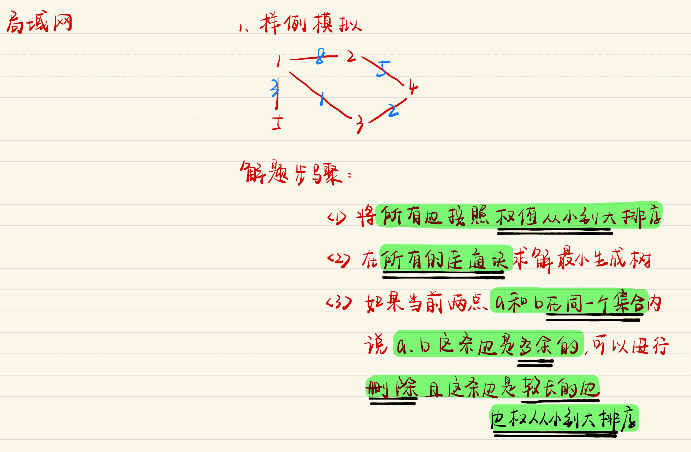

**代ç **

```c++
#include <iostream>
#include <algorithm>
using namespace std;
const int N = 110, M = 210;
struct Edge {
    int u, v, w;
    bool operator < (const Edge &W) const {
        // 按照æƒå€¼ä»å°åˆ°å¤§æ’åº
        return w < W.w;
    }
}edges[M];
int n, m;
int f[N];
int find(int x) {
    if (f[x] == x) return f[x];
    return f[x] = find(f[x]);
}
int main() {
    scanf("%d%d", &n, &m);
    for (int i = 1; i <= n; i ++ ) f[i] = i;
    for (int i = 0; i < m; i ++ ) {
        int a, b, c;
        scanf("%d%d%d", &a, &b, &c);
        edges[i] = {a, b, c};
    }
    sort(edges, edges + m);
    int res = 0;
    for (int i = 0; i < m; i ++ ) {
        int a = edges[i].u;
        int b = edges[i].v;
        int c = edges[i].w;
        int fa = find(a); // 找到其祖先
        int fb = find(b); // 找到其祖先
        if (fa != fb) f[fb] = fa;
        // 当其已ç»å¤„äºä¸€ä¸ªè¿é€šå—中, 则说æ˜å¯ä»¥å°†å…¶åˆ é™¤, åŒæ—¶, 累加其值
        else res += c;
    }
    cout << res << endl;
    return 0;
}
```

**时间å¤æ‚度**

$O(mlog_m)$

**空间å¤æ‚度**

$O(m)$

**标签**

`最å°ç”Ÿæˆæ ‘`ã€`并查集`

**ç¼åˆæ€ª**


### [AcWing 1142. ç¹å¿™çš„都市](https://www.acwing.com/problem/content/1144/)

**题目æè¿°**

>   åŸå¸‚ `C` 是一个é常ç¹å¿™çš„大都市，åŸå¸‚中的é“è·¯å分的拥挤，äºæ˜¯å¸‚长决定对其中的é“路进行改造。
>
>   åŸå¸‚ `C` çš„é“路是这样分布的：
>
>   åŸå¸‚中有 `n` 个交å‰è·¯å£ï¼Œç¼–å·æ˜¯ `1 ∼ n`，有些交å‰è·¯å£ä¹‹é—´æœ‰é“路相è¿ï¼Œä¸¤ä¸ªäº¤å‰è·¯å£ä¹‹é—´æœ€å¤šæœ‰ä¸€æ¡é“路相è¿æ¥ã€‚
>
>   这些é“路是 **åŒå‘** 的，且把所有的交å‰è·¯å£ç›´æ¥æˆ–é—´æ¥çš„è¿æ¥èµ·æ¥äº†ã€‚
>
>   æ¯æ¡é“路都有一个分值，分值越å°è¡¨ç¤ºè¿™ä¸ªé“路越ç¹å¿™ï¼Œè¶Šéœ€è¦è¿›è¡Œæ”¹é€ ã€‚
>
>   但是市政府的资金有é™ï¼Œå¸‚长希望进行改造的é“路越少越好，äºæ˜¯ä»–æ出下é¢çš„è¦æ±‚：
>
>   1ï¼æ”¹é€ çš„那些é“路能够把所有的交å‰è·¯å£ç›´æ¥æˆ–é—´æ¥çš„è¿é€šèµ·æ¥ã€‚
>
>   2ï¼åœ¨æ»¡è¶³è¦æ±‚ `1` 的情况下，改造的é“路尽é‡å°‘。
>
>   3ï¼åœ¨æ»¡è¶³è¦æ±‚ `1ã€2` 的情况下，改造的那些é“路中分值最大值尽é‡å°ã€‚
>
>   作为市规划局的你，应当作出最佳的决策，选择哪些é“路应当被修建。

**输入格å¼**

>   第一行有两个整数 `n, m` 表示åŸå¸‚有 `n` 个交å‰è·¯å£ï¼Œ`m` æ¡é“路。
>
>   æ¥ä¸‹æ¥ `m` 行是对æ¯æ¡é“路的æ述，æ¯è¡ŒåŒ…å«ä¸‰ä¸ªæ•´æ•° `u, v, c` 表示交å‰è·¯å£ `u` å’Œ `v` 之间有é“路相è¿ï¼Œåˆ†å€¼ä¸º `c`。

**输出格å¼**

>   两个整数 `s, max`，表示你选出了几æ¡é“路，分值最大的那æ¡é“路的分值是多少。

**æ•°æ®èŒƒå›´**

>   +   $1 ≤ n ≤ 300,$
>   +   $1 ≤ m ≤ 8000,$
>   +   $1 ≤ c ≤ 10000$

**输入样例**

```c++
4 5
1 2 3
1 4 5
2 4 7
2 3 6
3 4 8
```

**输出样例**

```c++
3 6
```

**手写稿**


**代ç **

```c++
#include <iostream>
#include <algorithm>
using namespace std;
const int N = 310, M = 8010;
struct Edge {
    int u, v, w;
    bool operator < (const Edge &W) const {
        // 按照æƒå€¼ä»å°åˆ°å¤§è¿›è¡Œæ’åº
        return w < W.w;
    }
}edges[M];
int n, m;
int f[N];
int find(int x) {
    if (f[x] == x) return f[x];
    return f[x] = find(f[x]);
}
int main() {
    scanf("%d%d", &n, &m);
    for (int i = 1; i <= n; i ++ ) f[i] = i;
    for (int i = 0; i < m; i ++ ) {
        int a, b, c;
        scanf("%d%d%d", &a, &b, &c);
        edges[i] = {a, b, c};
    }
    sort(edges, edges + m);
    int Max = 0;
    for (int i = 0; i < m; i ++ ) {
        int a = edges[i].u;
        int b = edges[i].v;
        int c = edges[i].w;
        int fa = find(a);
        int fb = find(b);
        if (fa != fb) {
            f[fb] = fa;
            Max = c;
        }
    }
    cout << n - 1 << " " << Max << endl;
    return 0;
}
```

**时间å¤æ‚度**

$O(mlog_m)$

**空间å¤æ‚度**

$O(m)$

**标签**


**ç¼åˆæ€ª**


### [AcWing 1143. è”络员](https://www.acwing.com/problem/content/1145/)

**题目æè¿°**

>   `Tyvj` å·²ç»ä¸€å²äº†ï¼Œç½‘站也由最åˆçš„几个用户å¢åŠ åˆ°äº†ä¸Šä¸‡ä¸ªç”¨æˆ·ï¼Œéšç€ `Tyvj` 网站的é€æ­¥å£®å¤§ï¼Œç®¡ç†å‘˜çš„数目也越æ¥è¶Šå¤šï¼Œç°åœ¨ä½ èº«ä¸º `Tyvj` 管ç†å±‚çš„è”络员，希望你找到一些通信渠é“，使得管ç†å‘˜ä¸¤ä¸¤éƒ½å¯ä»¥è”络（直æ¥æˆ–者是间æ¥éƒ½å¯ä»¥ï¼‰ã€‚本题中所涉åŠçš„通信渠é“都是 **åŒå‘** 的。
>
>   `Tyvj` 是一个公益性的网站，没有过多的利润，所以你è¦å°½å¯èƒ½çš„使费用少æ‰å¯ä»¥ã€‚
>
>   ç›®å‰ä½ å·²ç»çŸ¥é“，`Tyvj` 的通信渠é“分为两大类，一类是必选通信渠é“，无论价格多少，你都需è¦æŠŠæ‰€æœ‰çš„都选择上；还有一类是选择性的通信渠é“，你å¯ä»¥ä»ä¸­æŒ‘选一些作为最终管ç†å‘˜è”络的通信渠é“。
>
>   æ•°æ®ä¿è¯ç»™å‡ºçš„通信渠é“å¯ä»¥è®©æ‰€æœ‰çš„管ç†å‘˜è”通。
>
>   **注æ„：** 对äºæŸä¸¤ä¸ªç®¡ç†å‘˜ `u, v`，他们之间å¯èƒ½å­˜åœ¨å¤šæ¡é€šä¿¡æ¸ é“，你的程åºåº”该累加所有 `u, v` 之间的必选通行渠é“。

**输入格å¼**

>   第一行两个整数 `n，m` 表示 `Tyvj` 一共有 `n` 个管ç†å‘˜ï¼Œæœ‰ `m` 个通信渠é“;
>
>   第二行到 `m + 1` 行，æ¯è¡Œå››ä¸ªé负整数，`p, u, v, w` 当 `p = 1` 时，表示这个通信渠é“为必选通信渠é“；当 `p = 2` 时，表示这个通信渠é“为选择性通信渠é“ï¼›`u, v, w` 表示本æ¡ä¿¡æ¯æ述的是 `u，v` 管ç†å‘˜ä¹‹é—´çš„通信渠é“，`u` å¯ä»¥æ”¶åˆ° `v` çš„ä¿¡æ¯ï¼Œ`v` 也å¯ä»¥æ”¶åˆ° `u` çš„ä¿¡æ¯ï¼Œ`w` 表示费用。

**输出格å¼**

>   一个整数，表示最å°çš„通信费用。

**æ•°æ®èŒƒå›´**

>   +   $1 ≤ n ≤ 2000$
>   +   $1 ≤ m ≤ 10000$

**输入样例**

```c++
5 6
1 1 2 1
1 2 3 1
1 3 4 1
1 4 1 1
2 2 5 10
2 2 5 5
```

**输出样例**

```c++
9
```

**手写稿**


**代ç **

```c++
#include <iostream>
#include <algorithm>
using namespace std;
const int N = 2010, M = 10010;
struct Edge {
    int u, v, w;
    bool operator < (const Edge &W) const {
        return w < W.w;
    }
}edges[M];
int n, m;
int f[N];
int find(int x) {
    if (f[x] == x) return f[x];
    return f[x] = find(f[x]);
}
int main() {
    scanf("%d%d", &n, &m);
    for (int i = 1; i <= n; i ++ ) f[i] = i;
    int res = 0, cnt = 0;
    for (int i = 0; i < m; i ++ ) {
        int p, a, b, c;
        scanf("%d%d%d%d", &p, &a, &b, &c);
        // åªè¦æ˜¯å¿…选通é“, 则必须加上, ä¸ç®¡ä¹‹å‰æ˜¯å¦å¤„äºåŒä¸€ä¸ªè¿é€šå—内
        if (p == 1) {
            int fa = find(a);
            int fb = find(b);
            f[fb] = fa;
            res += c;
        }
        else edges[cnt ++ ] = {a, b, c};
    }
    sort(edges, edges + cnt);
    for (int i = 0; i < cnt; i ++ ) {
        int a = edges[i].u;
        int b = edges[i].v;
        int c = edges[i].w;
        int fa = find(a);
        int fb = find(b);
        // å¯é€‰é€šé“, 如æœå·²ç»å¤„äºåŒä¸€ä¸ªè¿é€šå—内, 则ä¸éœ€è¦åœ¨ç´¯åŠ æƒå€¼
        if (fa == fb) continue;
        f[fb] = fa;
        res += c;
    }
    cout << res << endl;
    return 0;
}
```

**时间å¤æ‚度**

$O(m)$

**空间å¤æ‚度**

$O(m)$

**标签**

`Kruskal`ã€`并查集`

**ç¼åˆæ€ª**


### [AcWing 1144. è¿æ¥æ ¼ç‚¹](https://www.acwing.com/problem/content/1146/)

**题目æè¿°**

>   有一个 `m` è¡Œ `n` 列的点阵，相邻两点å¯ä»¥ç›¸è¿ã€‚
>
>   一æ¡çºµå‘çš„è¿çº¿èŠ±è´¹ä¸€ä¸ªå•ä½ï¼Œä¸€æ¡æ¨ªå‘çš„è¿çº¿èŠ±è´¹ä¸¤ä¸ªå•ä½ã€‚
>
>   æŸäº›ç‚¹ä¹‹é—´å·²ç»æœ‰è¿çº¿äº†ï¼Œè¯•é—®è‡³å°‘还需è¦èŠ±è´¹å¤šå°‘个å•ä½æ‰èƒ½ä½¿æ‰€æœ‰çš„点全部è¿é€šã€‚

**输入格å¼**

>   第一行输入两个正整数 `m` 和 `n`。
>
>   以下若干行æ¯è¡Œå››ä¸ªæ­£æ•´æ•° $x_1,y_1,x_2,y_2$，表示第 $x_1$ 行第 $y_1$ 列的点和第 $x_2$ 行第 $y_2$ 列的点已ç»æœ‰è¿çº¿ã€‚
>
>   输入ä¿è¯$|x_1 − x_2| + |y_1 − y_2| = 1$。

**输出格å¼**

>   输出使得è¿é€šæ‰€æœ‰ç‚¹è¿˜éœ€è¦çš„最å°èŠ±è´¹ã€‚

**æ•°æ®èŒƒå›´**

>   +   $1 ≤ m, n ≤ 1000$
>   +   $0 ≤ å·²ç»å­˜åœ¨çš„è¿çº¿æ•° ≤ 10000$

**输入样例**

```c++
2 2
1 1 2 1
```

**输出样例**

```c++
3
```

**手写稿**

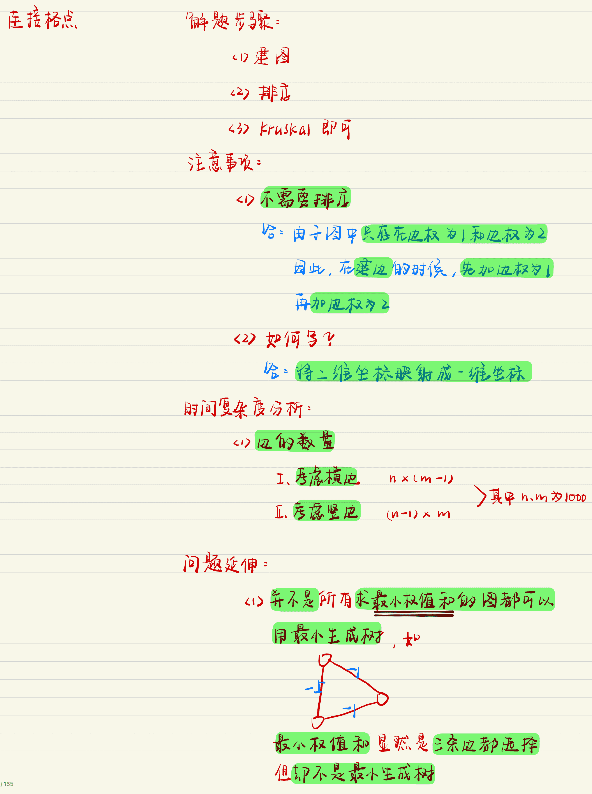

**代ç **

```c++
#include <iostream>
using namespace std;
const int N = 1010, M = N * N, K = 2 * N * N;
struct Edge {
    int u, v, w;
}edges[K];
int n, m, k;
int f[M];
int g[N][N];
int find(int x) {
    if (f[x] == x) return f[x];
    return f[x] = find(f[x]);
}
void get_edges() {
    int dx[4] = {-1, 0, 1, 0};
    int dy[4] = {0, 1, 0, -1};
    // 四个方å‘上的æƒå€¼
    int dw[4] = {1, 2, 1, 2};
    // éå†ä¸¤ç§æƒ…况, 一ç§æ˜¯æ¨ªå‘, å¦ä¸€ç§æ˜¯çºµå‘
    for (int z = 0; z < 2; z ++ )
        for (int x = 1; x <= n; x ++ )
            for (int y = 1; y <= m; y ++ )
                for (int u = 0; u < 4; u ++ ) {
                    int tx = x + dx[u];
                    int ty = y + dy[u];
                    // 越界, 则返å›å³å¯
                    if (tx <= 0 || tx > n || ty <= 0 || ty > m) continue;
                    // è·å–二维å标对应的一维åæ ‡
                    int a = g[x][y];
                    int b = g[tx][ty];
                    // å¦‚æœ 3 -> 5 有æ¡è¾¹ç›¸è¿æ¥, 则 5 -> 3 ä¸éœ€è¦å†è¿›è¡Œè¿è¾¹
                    // 如æœéè¦è¿›è¡Œè¿è¾¹, 则记得K需è¦å†å¤§æ‰“一å€, 4 * N * N
                    if (a > b) continue;
                    // 如æœå½“å‰çš„情况等äºz, z = 0 代表横å‘, 1 代表纵å‘
                    if (u % 2 == z) edges[k ++ ] = {a, b, dw[z]};
                }
    return;
}
int main() {
    scanf("%d%d", &n, &m);
    for (int i = 1; i <= n * m; i ++ ) f[i] = i;
    for (int i = 1, t = 0; i <= n; i ++ )
        for (int j = 1; j <= m; j ++ )
            g[i][j] = ++ t;
    int x1, y1, x2, y2;
    while (~scanf("%d%d%d%d", &x1, &y1, &x2, &y2)) {
        int a = g[x1][y1];
        int b = g[x2][y2];
        int fa = find(a);
        int fb = find(b);
        if (fa == fb) continue;
        f[fb] = fa;
    }
    get_edges();
    int res = 0;
    for (int i = 0; i < k; i ++ ) {
        int a = edges[i].u;
        int b = edges[i].v;
        int c = edges[i].w;
        int fa = find(a);
        int fb = find(b);
        if (fa == fb) continue;
        f[fb] = fa;
        res += c;
    }
    cout << res << endl;
    return 0;
}
```

**时间å¤æ‚度**

$O(nm)$

**空间å¤æ‚度**

$O(n ^ 2)$

**标签**

`最å°ç”Ÿæˆæ ‘`ã€`Kruskal`ã€`并查集`

**ç¼åˆæ€ª**


## 最å°ç”Ÿæˆæ ‘的扩展应用

### [AcWing 1146. 新的开始](https://www.acwing.com/problem/content/1148/)

**题目æè¿°**

>   å‘å±•é‡‡çŸ¿ä¸šå½“ç„¶é¦–å…ˆå¾—æœ‰çŸ¿äº•ï¼Œå° `F` 花了上次æ¢é™©è·å¾—çš„åƒåˆ†ä¹‹ä¸€çš„财富请人在岛上挖了 `n` å£çŸ¿äº•ï¼Œä½†ä»–ä¼¼ä¹å¿˜è®°äº†è€ƒè™‘矿井供电问题。
>
>   为了ä¿è¯ç”µåŠ›çš„ä¾›åº”ï¼Œå° `F` 想到了两ç§åŠæ³•ï¼š
>
>   1.  在矿井 `i` 上建立一个å‘电站，费用为 $v_i$（å‘电站的输出功ç‡å¯ä»¥ä¾›ç»™ä»»æ„多个矿井）。
>   2.  将这å£çŸ¿äº• `i` ä¸å¦å¤–çš„å·²ç»æœ‰ç”µåŠ›ä¾›åº”的矿井 `j` 之间建立电网，费用为 $p_{i,j}$。
>
>   å° `F` 希望你帮他想出一个ä¿è¯æ‰€æœ‰çŸ¿äº•ç”µåŠ›ä¾›åº”的最å°èŠ±è´¹æ–¹æ¡ˆã€‚

**输入格å¼**

>   第一行包å«ä¸€ä¸ªæ•´æ•° `n`，表示矿井总数。
>
>   æ¥ä¸‹æ¥ `n` 行，æ¯è¡Œä¸€ä¸ªæ•´æ•°ï¼Œç¬¬ `i` 个数 $v_i$ 表示在第 `i` å£çŸ¿äº•ä¸Šå»ºç«‹å‘电站的费用。
>
>   æ¥ä¸‹æ¥ä¸ºä¸€ä¸ª `n × n` 的矩阵 `P`，其中 $p_{i,j}$ 表示在第 `i` å£çŸ¿äº•å’Œç¬¬ `j` å£çŸ¿äº•ä¹‹é—´å»ºç«‹ç”µç½‘的费用。
>
>   æ•°æ®ä¿è¯ $p_{i,j} = p_{j,i}$，且 $p_{i,i} = 0$。

**输出格å¼**

>   输出一个整数，表示让所有矿井è·å¾—充足电能的最å°èŠ±è´¹ã€‚

**æ•°æ®èŒƒå›´**

>   +   $1 ≤ n ≤ 300,$
>   +   $0 ≤ v_i, p_{i, j} ≤ 10^5$

**输入样例**

```c++
4
5
4
4
3
0 2 2 2
2 0 3 3
2 3 0 4
2 3 4 0
```

**输出样例**

```c++
9
```

**手写稿**


**代ç **

```c++
#include <iostream>
#include <cstring>
using namespace std;
const int N = 310;
int n;
int dist[N], st[N];
int g[N][N];
// prim模æ¿
int prim() {
    memset(dist, 0x3f, sizeof dist);
    memset(st, false, sizeof st);
    int res = 0;
    // 注æ„有 n + 1 个点, 范围0 ~ n
    for (int i = 0; i < n + 1; i ++ ) {
        int t = -1;
        for (int j = 0; j <= n; j ++ )
            if (!st[j] && (t == -1 || dist[t] > dist[j]))
                t = j;
        st[t] = true;
        if (t) res += dist[t];
        for (int j = 0; j <= n; j ++ ) {
            if (st[j]) continue;
            dist[j] = min(dist[j], g[t][j]);
        }
    }
    return res;
}
int main() {
    scanf("%d", &n);
    // 将所有能够自己å‘电的矿井和虚拟æºç‚¹è¿ä¸€æ¡è¾¹å³å¯
    for (int i = 1; i <= n; i ++ ) {
        scanf("%d", &g[0][i]);
        g[i][0] = g[0][i];
    }
    for (int i = 1; i <= n; i ++ )
        for (int j = 1; j <= n; j ++ ) {
            scanf("%d", &g[i][j]);
            g[j][i] = g[i][j];
        }
    cout << prim() << endl;
    return 0;
}
```

**时间å¤æ‚度**

$O(n^2)$

**空间å¤æ‚度**

$O(n^2)$

**标签**

`虚拟æºç‚¹`ã€`Prim`ã€`最å°ç”Ÿæˆæ ‘`

**ç¼åˆæ€ª**


### [AcWing 1145. 北æ通讯网络](https://www.acwing.com/problem/content/1147/)

**题目æè¿°**

>   北æçš„æŸåŒºåŸŸå…±æœ‰ `n` 座æ‘庄，æ¯åº§æ‘庄的å标用一对整数 `(x, y)` 表示。
>
>   为了加强è”系，决定在æ‘庄之间建立通讯网络，使æ¯ä¸¤åº§æ‘庄之间都å¯ä»¥ç›´æ¥æˆ–é—´æ¥é€šè®¯ã€‚
>
>   通讯工具å¯ä»¥æ˜¯æ— çº¿ç”µæ”¶å‘机，也å¯ä»¥æ˜¯å«æ˜Ÿè®¾å¤‡ã€‚
>
>   无线电收å‘机有多ç§ä¸åŒå‹å·ï¼Œä¸åŒå‹å·çš„无线电收å‘机有一个ä¸åŒçš„å‚æ•° `d`，两座æ‘庄之间的è·ç¦»å¦‚æœä¸è¶…过 `d`，就å¯ä»¥ç”¨è¯¥å‹å·çš„无线电收å‘机直æ¥é€šè®¯ï¼Œ`d` 值越大的å‹å·ä»·æ ¼è¶Šè´µã€‚ç°åœ¨è¦å…ˆé€‰æ‹©æŸä¸€ç§å‹å·çš„无线电收å‘机，然å统一给所有æ‘庄é…备，**æ•°é‡ä¸é™**，但å‹å·éƒ½æ˜¯ **相åŒçš„**。
>
>   é…备å«æ˜Ÿè®¾å¤‡çš„两座æ‘庄无论相è·å¤šè¿œéƒ½å¯ä»¥ç›´æ¥é€šè®¯ï¼Œä½†å«æ˜Ÿè®¾å¤‡æ˜¯ **有é™çš„**，åªèƒ½ç»™ä¸€éƒ¨åˆ†æ‘庄é…备。
>
>   ç°åœ¨æœ‰ `k` å°å«æ˜Ÿè®¾å¤‡ï¼Œè¯·ä½ ç¼–一个程åºï¼Œè®¡ç®—出应该如何分é…è¿™ `k` å°å«æ˜Ÿè®¾å¤‡ï¼Œæ‰èƒ½ä½¿æ‰€é…备的无线电收å‘机的 `d` 值最å°ã€‚
>
>   例如，对äºä¸‹é¢ä¸‰åº§æ‘庄：
>
>   
>
>   其中，$|AB| = 10, |BC| = 20, |AC| = 10\sqrt{5} ≈ 22.36$。
>
>   如æœæ²¡æœ‰ä»»ä½•å«æ˜Ÿè®¾å¤‡æˆ–åªæœ‰ `1` å°å«æ˜Ÿè®¾å¤‡ (`k = 0` 或 `k = 1`)，则满足æ¡ä»¶çš„最å°çš„ `d = 20`，因为 `A` å’Œ `B`，`B` å’Œ `C` å¯ä»¥ç”¨æ— çº¿ç”µç›´æ¥é€šè®¯ï¼›è€Œ `A` å’Œ `C` å¯ä»¥ç”¨ `B` 中转å®ç°é—´æ¥é€šè®¯ (å³æ¶ˆæ¯ä» `A` 传到 `B`，å†ä» `B` 传到 `C`)ï¼›
>
>   如æœæœ‰ `2` å°å«æ˜Ÿè®¾å¤‡ (`k = 2`)，则å¯ä»¥æŠŠè¿™ä¸¤å°è®¾å¤‡åˆ†åˆ«åˆ†é…ç»™ `B` å’Œ `C` ，这样最å°çš„ `d` å¯å– `10`，因为 `A` å’Œ `B` 之间å¯ä»¥ç”¨æ— çº¿ç”µç›´æ¥é€šè®¯ï¼›`B` å’Œ `C` 之间å¯ä»¥ç”¨å«æ˜Ÿç›´æ¥é€šè®¯ï¼›`A` å’Œ `C` å¯ä»¥ç”¨ `B` 中转å®ç°é—´æ¥é€šè®¯ã€‚
>
>   如æœæœ‰ `3` å°å«æ˜Ÿè®¾å¤‡ï¼Œåˆ™ `A,B,C` 两两之间都å¯ä»¥ç›´æ¥ç”¨å«æ˜Ÿé€šè®¯ï¼Œæœ€å°çš„ `d` å¯å– `0`。

**输入格å¼**

>   第一行为由空格隔开的两个整数 `n, k`;
>
>   æ¥ä¸‹æ¥ `n` 行，æ¯è¡Œä¸¤ä¸ªæ•´æ•°ï¼Œç¬¬ `i` 行的 $x_i, y_i$ 表示第 `i` 座æ‘庄的åæ ‡ $(x_i, y_i)$。

**输出格å¼**

>   一个å®æ•°ï¼Œè¡¨ç¤ºæœ€å°çš„ `d` 值，结æœä¿ç•™ `2` ä½å°æ•°ã€‚

**æ•°æ®èŒƒå›´**

>   +   $1 ≤ n ≤ 500,$
>   +   $0 ≤ x, y ≤ 10^4,$
>   +   $0 ≤ k ≤ 100$

**输入样例**

```c++
3 2
10 10
10 0
30 0
```

**输出样例**

```c++
10.00
```

**手写稿**


**代ç **

```c++
#include <iostream>
#include <algorithm>
#include <cmath>
#define x first
#define y second
using namespace std;
typedef pair<int, int> PII;
const int N = 510, M = N * N / 2;
struct Edge {
    int u, v;
    // è·ç¦»æ˜¯ double ç±»å‹
    double w;
    bool operator < (const Edge& W) const {
        return w < W.w;
    }
}edges[M];
int n, m, k;
int f[N];
PII g[N];
double get_dist(PII a, PII b) {
    int dx = a.x - b.x;
    int dy = a.y - b.y;
    return sqrt(dx * dx + dy * dy);
}
int find(int x) {
    if (f[x] == x) return f[x];
    return f[x] = find(f[x]);
}
int main() {
    scanf("%d%d", &n, &k);
    for (int i = 0; i < n; i ++ ) f[i] = i;
    for (int i = 0; i < n; i ++ )
        scanf("%d%d", &g[i].x, &g[i].y);
    for (int i = 0; i < n; i ++ )
        for (int j = 0; j < i; j ++ )
            edges[m ++ ] = {i, j, get_dist(g[i], g[j])};
    sort(edges, edges + m);
    // 一开始所有点å„自为政, æ•…, è¿é€šå—çš„æ•°é‡ä¸ºn
    int cnt = n;
    double res = 0;
    for (int i = 0; i < m; i ++ ) {
        if (cnt <= k) break;
        int a = edges[i].u;
        int b = edges[i].v;
        double c = edges[i].w;
        int fa = find(a);
        int fb = find(b);
        if (fa == fb) continue;
        // æ¯æ¬¡åŠ å…¥ä¸€æ¡è¾¹, 说æ˜è¿é€šå—çš„æ•°é‡ --
        f[fb] = fa;
        cnt --;
        res = c;
    }
    printf("%.2lf\n", res);
    return 0;
}
```

**时间å¤æ‚度**

$O(m)$

**空间å¤æ‚度**

$O(m)$

**标签**

`最å°ç”Ÿæˆæ ‘`ã€`Kruskal`

**ç¼åˆæ€ª**


### [AcWing 346. 走廊泼水节](https://www.acwing.com/problem/content/348/)

**题目æè¿°**

>   给定一棵 `N` 个节点的树，è¦æ±‚å¢åŠ è‹¥å¹²æ¡è¾¹ï¼ŒæŠŠè¿™æ£µæ ‘扩充为完全图，并满足图的唯一最å°ç”Ÿæˆæ ‘ä»ç„¶æ˜¯è¿™æ£µæ ‘。
>
>   求å¢åŠ çš„边的æƒå€¼æ€»å’Œæœ€å°æ˜¯å¤šå°‘。
>
>   **注æ„：** 树中的所有边æƒå‡ä¸ºæ•´æ•°ï¼Œä¸”新加的所有边æƒä¹Ÿå¿…须为整数。

**输入格å¼**

>   第一行包å«æ•´æ•° `t`，表示共有 `t` 组测试数æ®ã€‚
>
>   对äºæ¯ç»„测试数æ®ï¼Œç¬¬ä¸€è¡ŒåŒ…å«æ•´æ•° `N`。
>
>   æ¥ä¸‹æ¥ `N − 1` 行，æ¯è¡Œä¸‰ä¸ªæ•´æ•° `X, Y, Z`，表示 `X` èŠ‚ç‚¹ä¸ `Y` 节点之间存在一æ¡è¾¹ï¼Œé•¿åº¦ä¸º `Z`。

**输出格å¼**

>   æ¯ç»„æ•°æ®è¾“出一个整数，表示æƒå€¼æ€»å’Œæœ€å°å€¼ã€‚
>
>   æ¯ä¸ªç»“æœå ä¸€è¡Œã€‚

**æ•°æ®èŒƒå›´**

>   +   $1 ≤ N ≤ 6000$
>   +   $1 ≤ Z ≤ 100$

**输入样例**

```c++
2
3
1 2 2
1 3 3
4
1 2 3
2 3 4
3 4 5 
```

**输出样例**

```c++
4
17 
```

**手写稿**


**代ç **

```c++
#include <iostream>
#include <algorithm>
using namespace std;
const int N = 6010;
struct Edge {
    int u, v, w;
    bool operator < (const Edge &W) const {
        return w < W.w;
    }
}edges[N];
int n, T;
int f[N], cnt[N];
int find(int x) {
    if (f[x] == x) return f[x];
    return f[x] = find(f[x]);
}
int main() {
    scanf("%d", &T);
    while (T -- ) {
        scanf("%d", &n);
        for (int i = 1; i <= n; i ++ ) f[i] = i, cnt[i] = 1;
        for (int i = 0; i < n - 1; i ++ ) {
            int a, b, c;
            scanf("%d%d%d", &a, &b, &c);
            edges[i] = {a, b, c};
        }
        sort(edges, edges + n - 1);
        int res = 0;
        for (int i = 0; i < n - 1; i ++ ) {
            int a = edges[i].u;
            int b = edges[i].v;
            int c = edges[i].w;
            int fa = find(a);
            int fb = find(b);
            if (fa == fb) continue;
            // 完全图边数
            res += (cnt[fa] * cnt[fb] - 1) * (c + 1);
            f[fb] = fa;
            // 统计个数
            cnt[fa] += cnt[fb];
        }
        cout << res << endl;
    }
    return 0;
}
```

**时间å¤æ‚度**

$O(n)$

**空间å¤æ‚度**

$O(n)$

**标签**

`最å°ç”Ÿæˆæ ‘`

**ç¼åˆæ€ª**


### [AcWing 1148. 秘密的牛奶è¿è¾“](https://www.acwing.com/problem/content/1150/)

**题目æè¿°**

>   农夫约翰è¦æŠŠä»–的牛奶è¿è¾“到å„个销售点。
>
>   è¿è¾“过程中，å¯ä»¥å…ˆæŠŠç‰›å¥¶è¿è¾“到一些销售点，å†ç”±è¿™äº›é”€å”®ç‚¹åˆ†åˆ«è¿è¾“到其他销售点。
>
>   è¿è¾“的总è·ç¦»è¶Šå°ï¼Œè¿è¾“çš„æˆæœ¬ä¹Ÿå°±è¶Šä½ã€‚
>
>   ä½æˆæœ¬çš„è¿è¾“是农夫约翰所希望的。
>
>   ä¸è¿‡ï¼Œä»–并ä¸æƒ³è®©ä»–çš„ç«äº‰å¯¹æ‰‹çŸ¥é“他具体的è¿è¾“方案，所以他希望采用费用第二å°çš„è¿è¾“方案而ä¸æ˜¯æœ€å°çš„。
>
>   ç°åœ¨è¯·ä½ å¸®å¿™æ‰¾åˆ°è¯¥è¿è¾“方案。
>
>   **注æ„：**
>
>   -   如æœä¸¤ä¸ªæ–¹æ¡ˆè‡³å°‘有一æ¡è¾¹ä¸åŒï¼Œåˆ™æˆ‘们认为是ä¸åŒæ–¹æ¡ˆï¼›
>   -   费用第二å°çš„方案在数值上一定è¦ä¸¥æ ¼å¤§äºè´¹ç”¨æœ€å°çš„方案；
>   -   答案ä¿è¯ä¸€å®šæœ‰è§£ï¼›

**输入格å¼**

>   第一行是两个整数 `N, M`，表示销售点数和交通线路数；
>
>   æ¥ä¸‹æ¥ `M` è¡Œæ¯è¡Œ `3` 个整数 `x, y, z`，表示销售点 `x` 和销售点 `y` 之间存在线路，长度为 `z`。

**输出格å¼**

>   输出费用第二å°çš„è¿è¾“方案的è¿è¾“总è·ç¦»ã€‚

**æ•°æ®èŒƒå›´**

>   +   $1 ≤ N ≤ 500,$
>   +   $1 ≤ M ≤ 10^4,$
>   +   $1 ≤ z ≤ 10^9,$
>   +   $æ•°æ®ä¸­å¯èƒ½åŒ…å«é‡è¾¹ã€‚$

**输入样例**

```c++
4 4
1 2 100
2 4 200
2 3 250
3 4 100
```

**输出样例**

```c++
450
```

**手写稿**


**代ç **

```c++
#include <iostream>
#include <cstring>
#include <algorithm>
using namespace std;
typedef long long LL;
const int N = 510, M = 10010, K = N * 2;
struct Edge {
    int u, v, w;
    bool flag;
    bool operator < (const Edge &W) const {
        return w < W.w;
    }
}edges[M];
int n, m, idx;
int f[N], h[N], e[K], w[K], ne[K];
int dist1[N][N], dist2[N][N];
int find(int x) {
    if (f[x] == x) return f[x];
    return f[x] = find(f[x]);
}
void add(int a, int b, int c) {
    e[idx] = b;
    w[idx] = c;
    ne[idx] = h[a];
    h[a] = idx ++;
    return;
}
void dfs(int u, int father, int Max1, int Max2, int dist1[], int dist2[]) {
    dist1[u] = Max1, dist2[u] = Max2;
    for (int i = h[u]; i != -1; i = ne[i]) {
        int j = e[i];
        if (j == father) continue;
        // 必须新开å˜é‡è¿›è¡Œè®°å½•, åŸå› : [手写稿]
        int tMax1 = Max1, tMax2 = Max2;
        if (w[i] > tMax1) {
            tMax2 = tMax1;
            tMax1 = w[i];
        }
        // 最大值必须è¦ä¸¥æ ¼å¤§äºæ¬¡å¤§å€¼, å› æ­¤, 这里必须判断w[i] < tMax1
        // ä¸åŠ åˆ¤æ–­çš„è¯, 则有å¯èƒ½ä¼šå‡ºç° w[i] == tMax1的情况
        else if (w[i] < tMax1 && w[i] > tMax2) tMax2 = w[i];
        dfs(j, u, tMax1, tMax2, dist1, dist2);
    }
    return;
}
int main() {
    scanf("%d%d", &n, &m);
    memset(h, -1, sizeof h);
    for (int i = 1; i <= n; i ++ ) f[i] = i;
    for (int i = 0; i < m; i ++ ) {
        int a, b, c;
        scanf("%d%d%d", &a, &b, &c);
        edges[i] = {a, b, c};
    }
    sort(edges, edges + m);
    // long long ç±»å‹
    LL sum = 0;
    for (int i = 0; i < m; i ++ ) {
        int a = edges[i].u;
        int b = edges[i].v;
        int c = edges[i].w;
        int fa = find(a);
        int fb = find(b);
        if (fa == fb) continue;
        f[fb] = fa;
        edges[i].flag = true;
        sum += c;
        // 给最å°ç”Ÿæˆæ ‘加边
        add(a, b, c);
        add(b, a, c);
    }
    for (int i = 1; i <= n; i ++ ) dfs(i, -1, 0, 0, dist1[i], dist2[i]);
    // long long ç±»å‹
    LL res = 1e18;
    for (int i = 0; i < m; i ++ ) {
        // 如æœæ˜¯æ ‘è¾¹, 则跳过此次循ç¯
        if (edges[i].flag) continue;
        int a = edges[i].u;
        int b = edges[i].v;
        int c = edges[i].w;
        // 最短路径
        if (c > dist1[a][b]) res = min(res, sum - dist1[a][b] + c);
        // 次短路径
        else if (c > dist2[a][b]) res = min(res, sum - dist2[a][b] + c);
    }
    printf("%lld\n", res);
    return 0;
}
```

**时间å¤æ‚度**

$O(mlog_m)$

**空间å¤æ‚度**

$O(n^2)$

**标签**

`次å°ç”Ÿæˆæ ‘`

**ç¼åˆæ€ª**


## è´Ÿç¯

### 概述


### [AcWing 904. 虫æ´](https://www.acwing.com/problem/content/906/)

**题目æè¿°**

>   农夫约翰在巡视他的众多农场时，å‘ç°äº†å¾ˆå¤šä»¤äººæƒŠå¹çš„虫æ´ã€‚
>
>   虫æ´é常奇特，它å¯ä»¥çœ‹ä½œæ˜¯ä¸€æ¡ **å•å‘** 路径，通过它å¯ä»¥ä½¿ä½ å›åˆ°è¿‡å»çš„æŸä¸ªæ—¶åˆ»ï¼ˆç›¸å¯¹äºä½ è¿›å…¥è™«æ´ä¹‹å‰ï¼‰ã€‚
>
>   农夫约翰的æ¯ä¸ªå†œåœºä¸­åŒ…å« `N` 片田地，`M` æ¡è·¯å¾„（**åŒå‘**ï¼‰ä»¥åŠ `W` 个虫æ´ã€‚
>
>   ç°åœ¨å†œå¤«çº¦ç¿°å¸Œæœ›èƒ½å¤Ÿä»å†œåœºä¸­çš„æŸç‰‡ç”°åœ°å‡ºå‘，ç»è¿‡ä¸€äº›è·¯å¾„和虫æ´å›åˆ°è¿‡å»ï¼Œå¹¶åœ¨ä»–的出å‘时刻之å‰èµ¶åˆ°ä»–的出å‘地。
>
>   他希望能够看到出å‘之å‰çš„自己。
>
>   请你判断一下约翰能å¦åšåˆ°è¿™ä¸€ç‚¹ã€‚
>
>   下é¢æˆ‘们将给你æä¾›çº¦ç¿°æ‹¥æœ‰çš„å†œåœºæ•°é‡ `F`，以åŠæ¯ä¸ªå†œåœºçš„完整信æ¯ã€‚
>
>   已知走过任何一æ¡è·¯å¾„所花费的时间都ä¸è¶…过 `10000` 秒，任何虫æ´å°†ä»–带å›çš„时间都ä¸ä¼šè¶…过 `10000` 秒。

**输入格å¼**

>   第一行包å«æ•´æ•° `F`，表示约翰共有 `F` 个农场。
>
>   对äºæ¯ä¸ªå†œåœºï¼Œç¬¬ä¸€è¡ŒåŒ…å«ä¸‰ä¸ªæ•´æ•° `N,M,W`。
>
>   æ¥ä¸‹æ¥ `M` 行，æ¯è¡ŒåŒ…å«ä¸‰ä¸ªæ•´æ•° `S,E,T`，表示田地 `S` å’Œ `E` 之间存在一æ¡è·¯å¾„，ç»è¿‡è¿™æ¡è·¯å¾„所花的时间为 `T`。
>
>   å†æ¥ä¸‹æ¥ `W` 行，æ¯è¡ŒåŒ…å«ä¸‰ä¸ªæ•´æ•° `S,E,T`，表示存在一æ¡ä»ç”°åœ° `S` 走到田地 `E` 的虫æ´ï¼Œèµ°è¿‡è¿™æ¡è™«æ´ï¼Œå¯ä»¥å›åˆ° `T` 秒之间。

**输出格å¼**

>   输出共 `F` 行，æ¯è¡Œè¾“出一个结æœã€‚
>
>   如æœçº¦ç¿°èƒ½å¤Ÿåœ¨å‡ºå‘时刻之å‰å›åˆ°å‡ºå‘地，则输出 `YES`，å¦åˆ™è¾“出 `NO`。

**æ•°æ®èŒƒå›´**

>   +   $1 ≤ F ≤ 5$
>   +   $1 ≤ N ≤ 500,$
>   +   $1 ≤ M ≤ 2500,$
>   +   $1 ≤ W ≤ 200,$
>   +   $1 ≤ T ≤ 10000,$
>   +   $1 ≤ S, E ≤ N$

**输入样例**

```c++
2
3 3 1
1 2 2
1 3 4
2 3 1
3 1 3
3 2 1
1 2 3
2 3 4
3 1 8
```

**输出样例**

```c++
NO
YES
```

**手写稿**

>   1.   模æ¿é¢˜, 看本章开头概述

**代ç **

```c++
#include <iostream>
#include <cstring>
using namespace std;
const int N = 510, M = 5210;
int n, m1, m2, T, idx;
int h[N], e[M], w[M], ne[M], dist[N], st[N], q[N], cnt[N];
void add(int a, int b, int c) {
    e[idx] = b;
    w[idx] = c;
    ne[idx] = h[a];
    h[a] = idx ++;
    return;
}
bool spfa() {
    memset(dist, 0, sizeof dist);
    memset(st, 0, sizeof st);
    memset(cnt, 0, sizeof cnt);
    int hh = 0, tt = 0;
    // ç”±äºä¸çŸ¥é“哪个点作为起点, å› æ­¤, 将所有点入队, 标记当å‰ç‚¹å·²ç»åœ¨é˜Ÿåˆ—中
    for (int i = 1; i <= n; i ++ ) {
        q[tt ++ ] = i;
        st[i] = true;
    }
    while (hh != tt) {
        int t = q[hh ++ ];
        st[t] = false;
        if (hh == N) hh = 0;
        for (int i = h[t]; i != -1; i = ne[i]) {
            int j = e[i];
            if (dist[j] > dist[t] + w[i]) {
                dist[j] = dist[t] + w[i];
                cnt[j] = cnt[t] + 1;
                if (cnt[j] >= n) return true;
                if (!st[j]) {
                    q[tt ++ ] = j;
                    st[j] = true;
                    if (tt == N) tt = 0;
                }
            }
        }
    }
    return false;
}
int main() {
    scanf("%d", &T);
    while (T -- ) {
        memset(h, -1, sizeof h);
        idx = 0;
        scanf("%d%d%d", &n, &m1, &m2);
        for (int i = 0; i < m1; i ++ ) {
            int a, b, c;
            scanf("%d%d%d", &a, &b, &c);
            add(a, b, c);
            add(b, a, c);
        }
        for (int i = 0; i < m2; i ++ ) {
            int a, b, c;
            scanf("%d%d%d", &a, &b, &c);
            add(a, b, -c);
        }
        if (spfa()) puts("YES");
        else puts("NO");
    }
    return 0;
}
```

**时间å¤æ‚度**

$spfa求负ç¯, 时间å¤æ‚度一般为O(nm)$

**空间å¤æ‚度**

$O(n)$

**标签**

`spfa`

**ç¼åˆæ€ª**

[AcWing 852. spfa判断负ç¯](#AcWing 852. spfa判断负ç¯)

### [AcWing 361. 观光奶牛](https://www.acwing.com/problem/content/363/)

**题目æè¿°**

>   给定一张 `L` 个点ã€`P` æ¡è¾¹çš„有å‘图，æ¯ä¸ªç‚¹éƒ½æœ‰ä¸€ä¸ªæƒå€¼ `f[i]`，æ¯æ¡è¾¹éƒ½æœ‰ä¸€ä¸ªæƒå€¼ `t[i]`。
>
>   求图中的一个ç¯ï¼Œä½¿â€œç¯ä¸Šå„点的æƒå€¼ä¹‹å’Œâ€é™¤ä»¥â€œç¯ä¸Šå„边的æƒå€¼ä¹‹å’Œâ€æœ€å¤§ã€‚
>
>   输出这个最大值。
>
>   **注æ„**：数æ®ä¿è¯è‡³å°‘存在一个ç¯ã€‚

**输入格å¼**

>   第一行包å«ä¸¤ä¸ªæ•´æ•° `L` å’Œ `P`。
>
>   æ¥ä¸‹æ¥ `L` è¡Œæ¯è¡Œä¸€ä¸ªæ•´æ•°ï¼Œè¡¨ç¤º `f[i]`。
>
>   å†æ¥ä¸‹æ¥ `P` 行，æ¯è¡Œä¸‰ä¸ªæ•´æ•° `a，b，t[i]`，表示点 `a` å’Œ `b` 之间存在一æ¡è¾¹ï¼Œè¾¹çš„æƒå€¼ä¸º `t[i]`。

**输出格å¼**

>   输出一个数表示结æœï¼Œä¿ç•™ä¸¤ä½å°æ•°ã€‚

**æ•°æ®èŒƒå›´**

>   +   $2 ≤ L ≤ 1000,$
>   +   $2 ≤ P ≤ 5000,$
>   +   $1 ≤ f[i], t[i] ≤ 1000$

**输入样例**

```c++
5 7
30
10
10
5
10
1 2 3
2 3 2
3 4 5
3 5 2
4 5 5
5 1 3
5 2 2
```

**输出样例**

```c++
6.00
```

**手写稿**

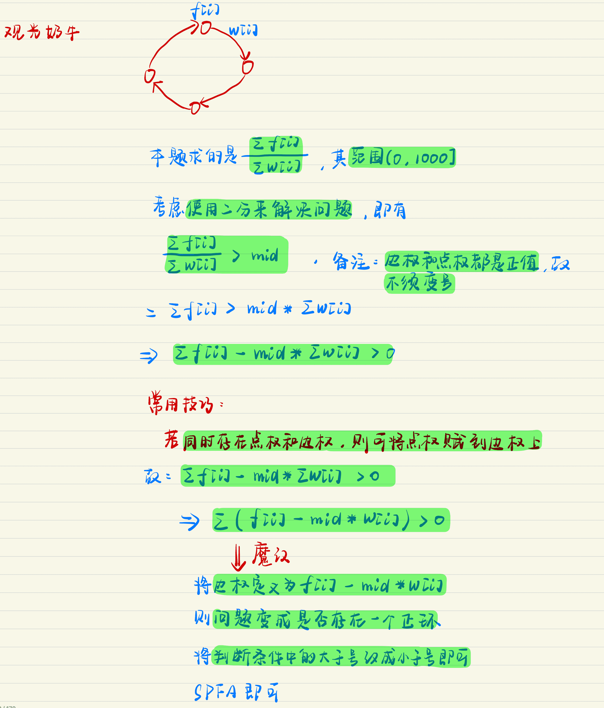

**代ç **

```c++
#include <iostream>
#include <cstring>
using namespace std;
const int N = 1010, M = 10010;
int n, m, idx;
int f[N], h[N], e[M], w[M], ne[M], st[N], q[N], cnt[N];
// 注æ„: doubleç±»å‹
double dist[N];
void add(int a, int b, int c) {
    e[idx] = b;
    w[idx] = c;
    ne[idx] = h[a];
    h[a] = idx ++;
    return;
}
// 注æ„: doubleç±»å‹
// SPFA求ç¯æ¨¡æ¿
bool check(double mid) {
    memset(st, 0, sizeof st);
    memset(cnt, 0, sizeof cnt);
    int hh = 0, tt = 0;
    for (int i = 1; i <= n; i ++ ) {
        q[tt ++ ] = i;
        st[i] = true;
    }
    while (hh != tt) {
        int t = q[hh ++ ];
        if (hh == N) hh = 0;
        st[t] = false;
        for (int i = h[t]; i != -1; i = ne[i]) {
            int j = e[i];
            // 求正ç¯, 使用å°äºå·<, 而ä¸æ˜¯å¤§äºå·>
            if (dist[j] < dist[t] + f[j] - mid * w[i]) {
                dist[j] = dist[t] + f[j] - mid * w[i];
                cnt[j] = cnt[t] + 1;
                if (cnt[j] >= n) return true;
                if (!st[j]) {
                    q[tt ++ ] = j;
                    if (tt == N) tt = 0;
                    st[j] = true;
                }
            }
        }
    }
    return false;
}
int main() {
    scanf("%d%d", &n, &m);
    memset(h, -1, sizeof h);
    for (int i = 1; i <= n; i ++ ) scanf("%d", &f[i]);
    for (int i = 1; i <= m; i ++ ) {
        int a, b, c;
        scanf("%d%d%d", &a, &b, &c);
        add(a, b, c);
    }
    double l = 0, r = 1010;
    while (r - l > 1e-4) {
        double mid = (l + r) / 2;
        if (check(mid)) l = mid;
        else r = mid;
    }
    printf("%.2lf\n", r);
    return 0;
}
```

**时间å¤æ‚度**

$O(nmlog_{1000})$

**空间å¤æ‚度**

$O(n)$

**标签**

`01规划问题`ã€`SPFA`

**ç¼åˆæ€ª**


### [AcWing 1165. å•è¯ç¯](https://www.acwing.com/problem/content/1167/)

**题目æè¿°**

>   我们有 `n` 个字符串，æ¯ä¸ªå­—符串都是由 `a∼z` çš„å°å†™è‹±æ–‡å­—æ¯ç»„æˆçš„。
>
>   如æœå­—符串 `A` 的结尾两个字符刚好ä¸å­—符串 `B` 的开头两个字符相匹é…，那么我们称 `A` ä¸ `B` 能够相è¿ï¼ˆæ³¨æ„：`A` èƒ½ä¸ `B` 相è¿ä¸ä»£è¡¨ `B` èƒ½ä¸ `A` 相è¿ï¼‰ã€‚
>
>   我们希望ä»ç»™å®šçš„字符串中找出一些，使得它们首尾相è¿å½¢æˆä¸€ä¸ªç¯ä¸²ï¼ˆä¸€ä¸ªä¸²é¦–尾相è¿ä¹Ÿç®—），我们想è¦ä½¿è¿™ä¸ªç¯ä¸²çš„å¹³å‡é•¿åº¦æœ€å¤§ã€‚
>
>   如下例：
>
>   ```c++
>   ababc
>   bckjaca
>   caahoynaab
>   ```
>
>   第一个串能ä¸ç¬¬äºŒä¸ªä¸²ç›¸è¿ï¼Œç¬¬äºŒä¸ªä¸²èƒ½ä¸ç¬¬ä¸‰ä¸ªä¸²ç›¸è¿ï¼Œç¬¬ä¸‰ä¸ªä¸²èƒ½ä¸ç¬¬ä¸€ä¸ªä¸²ç›¸è¿ï¼Œæˆ‘们按照此顺åºç›¸è¿ï¼Œä¾¿å½¢æˆäº†ä¸€ä¸ªç¯ä¸²ï¼Œé•¿åº¦ä¸º `5+7+10=22`（é‡å¤éƒ¨åˆ†ç®—两次），总共使用了 `3` 个串，所以平å‡é•¿åº¦æ˜¯ $\frac{22}{3}≈7.33$。

**输入格å¼**

>   本题有多组数æ®ã€‚
>
>   æ¯ç»„æ•°æ®çš„第一行，一个整数 `n`，表示字符串数é‡ï¼›
>
>   æ¥ä¸‹æ¥ `n` 行，æ¯è¡Œä¸€ä¸ªé•¿åº¦å°äºç­‰äº `1000` 的字符串。
>
>   读入以 `n=0` 结æŸã€‚

**输出格å¼**

>   è‹¥ä¸å­˜åœ¨ç¯ä¸²ï¼Œè¾“出`â€No solutionâ€`，å¦åˆ™è¾“出最长的ç¯ä¸²çš„å¹³å‡é•¿åº¦ã€‚
>
>   åªè¦ç­”案ä¸æ ‡å‡†ç­”案的差ä¸è¶…过 `0.01`，就视为答案正确。

**æ•°æ®èŒƒå›´**

>   +   $1 ≤ n ≤ 10^5$

**输入样例**

```c++
3
intercommunicational
alkylbenzenesulfonate
tetraiodophenolphthalein
0
```

**输出样例**

```c++
21.66
```

**手写稿**

>   讲解
>
>   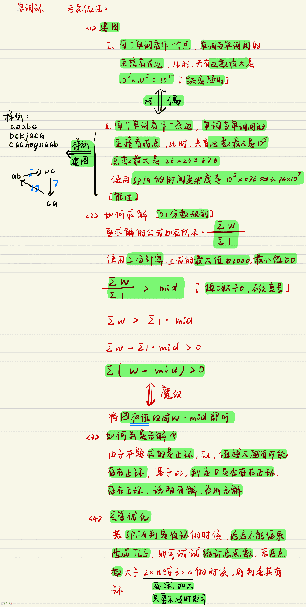
>
>   补充说æ˜
>
>   


**代ç ä¸€:ç„学优化**

```c++
#include <iostream>
#include <cstring>
using namespace std;
const int N = 700, M = 100010, K = 1010;
// 一共åªæœ‰676个点, n设置为676
int n = 676, m, idx;
char str[K];
int h[N], e[M], w[M], ne[M], st[N], q[N], cnt[N];
double dist[N];
// 加边的模æ¿[头æ’法]
void add(int a, int b, int c) {
    e[idx] = b;
    w[idx] = c;
    ne[idx] = h[a];
    h[a] = idx ++;
    return;
}
// SPFA模æ¿
bool check(double mid) {
    memset(st, false, sizeof st);
    memset(cnt, 0, sizeof cnt);
    int hh = 0, tt = 0;
    // 注æ„: 一共åªæœ‰676个点
    for (int i = 0; i < n; i ++ ) {
        q[tt ++ ] = i;
        st[i] = true;
    }
    int count = 0;
    while (hh != tt) {
        int t = q[hh ++ ];
        if (hh == N) hh = 0;
        st[t] = false;
        for (int i = h[t]; i != -1; i = ne[i]) {
            int j = e[i];
            // æƒå€¼ä¸ºw[i] - mid
            if (dist[j] < dist[t] + w[i] - mid) {
                dist[j] = dist[t] + w[i] - mid;
                cnt[j] = cnt[t] + 1;
                if (++ count > 5000) return true; // ç»éªŒä¸Šçš„trick, 点数的若干å€
                if (cnt[j] >= n) return true;
                if (!st[j]) {
                    q[tt ++ ] = j;
                    if (tt == N) tt = 0;
                    st[j] = true;
                }
            }
        }
    }
    return false;
}
int main() {
    while (scanf("%d", &m), m) {
        memset(h, -1, sizeof h);
        idx = 0;
        for (int i = 0; i < m; i ++ ) {
            scanf("%s", str);
            int len = strlen(str);
            if (len >= 2) {
                int a = (str[0] - 'a') * 26 + (str[1] - 'a');
                int b = (str[len - 2] - 'a') * 26 + (str[len - 1] - 'a');
                add(a, b, len);
            }
        }
        if (!check(0)) puts("No solution");
        else {
            double l = 0, r = 1000;
            while (r - l > 1e-4) {
                double mid = (l + r) / 2;
                if (check(mid)) l = mid;
                else r = mid;
            }
            printf("%lf\n", r);
        }
    }
    return 0;
}
```

**时间å¤æ‚度**

$O(ä¸å¥½åˆ†æ), ç„学优化$

**空间å¤æ‚度**

$O(m)$

**代ç äºŒ:栈优化**

```c++
#include <iostream>
#include <cstring>
using namespace std;
const int N = 700, M = 100010, K = 1010;
// 一共åªæœ‰676个点, n设置为676
int n = 676, m, idx;
char str[K];
int h[N], e[M], w[M], ne[M], st[N], stk[N], cnt[N];
double dist[N];
// 加边的模æ¿[头æ’法]
void add(int a, int b, int c) {
    e[idx] = b;
    w[idx] = c;
    ne[idx] = h[a];
    h[a] = idx ++;
    return;
}
// SPFA模æ¿
bool check(double mid) {
    memset(st, false, sizeof st);
    memset(cnt, 0, sizeof cnt);
    int tt = -1;
    // 注æ„: 一共åªæœ‰676个点
    for (int i = 0; i < n; i ++ ) {
        stk[++ tt] = i;
        st[i] = true;
    }
    int count = 0;
    // 使用栈ä¸æ˜¯é˜Ÿåˆ—!!
    while (tt != -1) {
        int t = stk[tt -- ];
        st[t] = false;
        for (int i = h[t]; i != -1; i = ne[i]) {
            int j = e[i];
            // æƒå€¼ä¸ºw[i] - mid
            if (dist[j] < dist[t] + w[i] - mid) {
                dist[j] = dist[t] + w[i] - mid;
                cnt[j] = cnt[t] + 1;
                if (cnt[j] >= n) return true;
                if (!st[j]) {
                    stk[++ tt] = j;
                    st[j] = true;
                }
            }
        }
    }
    return false;
}
int main() {
    while (scanf("%d", &m), m) {
        memset(h, -1, sizeof h);
        idx = 0;
        for (int i = 0; i < m; i ++ ) {
            scanf("%s", str);
            int len = strlen(str);
            if (len >= 2) {
                int a = (str[0] - 'a') * 26 + (str[1] - 'a');
                int b = (str[len - 2] - 'a') * 26 + (str[len - 1] - 'a');
                add(a, b, len);
            }
        }
        if (!check(0)) puts("No solution");
        else {
            double l = 0, r = 1000;
            while (r - l > 1e-4) {
                double mid = (l + r) / 2;
                if (check(mid)) l = mid;
                else r = mid;
            }
            printf("%lf\n", r);
        }
    }
    return 0;
}
```

**时间å¤æ‚度**

$O(ä¸å¥½è®¡ç®—), 因为有栈存在且剪æ$

**空间å¤æ‚度**

$O(m)$

**标签**

`SPFA`ã€`è´Ÿç¯`ã€`ç„学优化`

**ç¼åˆæ€ª**

## 差分约æŸ

### åŸç†


### [AcWing 1169. ç³–æœ](https://www.acwing.com/problem/content/1171/)

**题目æè¿°**

>   幼儿园里有 `N` 个å°æœ‹å‹ï¼Œè€å¸ˆç°åœ¨æƒ³è¦ç»™è¿™äº›å°æœ‹å‹ä»¬åˆ†é…ç³–æœï¼Œè¦æ±‚æ¯ä¸ªå°æœ‹å‹éƒ½è¦åˆ†åˆ°ç³–æœã€‚
>
>   但是å°æœ‹å‹ä»¬ä¹Ÿæœ‰å«‰å¦’心，总是会æ出一些è¦æ±‚，比如å°æ˜ä¸å¸Œæœ›å°çº¢åˆ†åˆ°çš„ç³–æœæ¯”他的多，äºæ˜¯åœ¨åˆ†é…ç³–æœçš„时候， è€å¸ˆéœ€è¦æ»¡è¶³å°æœ‹å‹ä»¬çš„ `K` 个è¦æ±‚。
>
>   幼儿园的糖æœæ€»æ˜¯æœ‰é™çš„，è€å¸ˆæƒ³çŸ¥é“他至少需è¦å‡†å¤‡å¤šå°‘个糖æœï¼Œæ‰èƒ½ä½¿å¾—æ¯ä¸ªå°æœ‹å‹éƒ½èƒ½å¤Ÿåˆ†åˆ°ç³–æœï¼Œå¹¶ä¸”满足å°æœ‹å‹ä»¬æ‰€æœ‰çš„è¦æ±‚。

**输入格å¼**

>   输入的第一行是两个整数 `N,K`。
>
>   æ¥ä¸‹æ¥ `K` 行，表示分é…ç³–æœæ—¶éœ€è¦æ»¡è¶³çš„关系，æ¯è¡Œ `3` 个数字 `X,A,B`。
>
>   -   å¦‚æœ `X=1`ï¼è¡¨ç¤ºç¬¬ `A` 个å°æœ‹å‹åˆ†åˆ°çš„ç³–æœå¿…须和第 `B` 个å°æœ‹å‹åˆ†åˆ°çš„ç³–æœä¸€æ ·å¤šã€‚
>   -   å¦‚æœ `X=2`，表示第 `A` 个å°æœ‹å‹åˆ†åˆ°çš„ç³–æœå¿…须少äºç¬¬ `B` 个å°æœ‹å‹åˆ†åˆ°çš„ç³–æœã€‚
>   -   å¦‚æœ `X=3`，表示第 `A` 个å°æœ‹å‹åˆ†åˆ°çš„ç³–æœå¿…é¡»ä¸å°‘äºç¬¬ `B` 个å°æœ‹å‹åˆ†åˆ°çš„ç³–æœã€‚
>   -   å¦‚æœ `X=4`，表示第 `A` 个å°æœ‹å‹åˆ†åˆ°çš„ç³–æœå¿…须多äºç¬¬ `B` 个å°æœ‹å‹åˆ†åˆ°çš„ç³–æœã€‚
>   -   å¦‚æœ `X=5`，表示第 `A` 个å°æœ‹å‹åˆ†åˆ°çš„ç³–æœå¿…é¡»ä¸å¤šäºç¬¬ `B` 个å°æœ‹å‹åˆ†åˆ°çš„ç³–æœã€‚
>
>   å°æœ‹å‹ç¼–å·ä» `1` 到 `N`。

**输出格å¼**

>   输出一行，表示è€å¸ˆè‡³å°‘需è¦å‡†å¤‡çš„ç³–æœæ•°ï¼Œå¦‚æœä¸èƒ½æ»¡è¶³å°æœ‹å‹ä»¬çš„所有è¦æ±‚，就输出 `−1`。

**æ•°æ®èŒƒå›´**

>   +   $1 ≤ N < 10^5,$
>   +   $1 ≤ K ≤ 10^5,$
>   +   $1 ≤ X ≤ 5,$
>   +   $1 ≤ A, B ≤ N$

**输入样例**

```c++
5 7
1 1 2
2 3 2
4 4 1
3 4 5
5 4 5
2 3 5
4 5 1
```

**输出样例**

```c++
11
```

**手写稿**

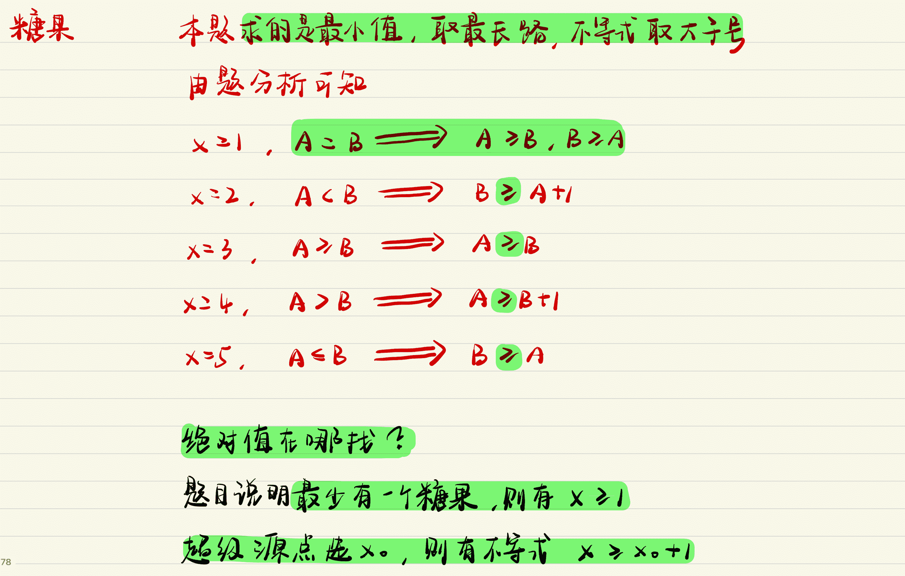

**代ç **

```c++
#include <iostream>
#include <cstring>
using namespace std;
typedef long long LL;
const int N = 100010, M = 300010;
int n, m, idx;
int h[N], e[M], w[M], ne[M], stk[N], dist[N], st[N], cnt[N];
void add(int a, int b, int c) {
    e[idx] = b;
    w[idx] = c;
    ne[idx] = h[a];
    h[a] = idx ++;
    return;
}
bool spfa() {
    int tt = -1;
    memset(dist, -0x3f, sizeof dist);
    memset(st, 0, sizeof st);
    memset(cnt, 0, sizeof cnt);
    // 求ç¯çš„时候, 使用栈的效æœæ¯”较好[åŸå› :ç¼åˆæ€ªé“¾æ¥]
    stk[ ++ tt] = 0;
    st[0] = true;
    dist[0] = 0;
    while (tt != -1) {
        int t = stk[tt -- ];
        st[t] = false;
        for (int i = h[t]; i != -1; i = ne[i]) {
            int j = e[i];
            // 求的是正ç¯!![注æ„]
            if (dist[j] < dist[t] + w[i]) {
                dist[j] = dist[t] + w[i];
                cnt[j] = cnt[t] + 1;
                if (cnt[j] >= n + 1) return true;
                if (!st[j]) {
                    stk[ ++ tt] = j;
                    st[j] = true;
                }
            }
        }
    }
    return false;
}
int main() {
    scanf("%d%d", &n, &m);
    memset(h, -1, sizeof h);
    for (int i = 0; i < m; i ++ ) {
        int x, a, b;
        scanf("%d%d%d", &x, &a, &b);
        if (x == 1) add(b, a, 0), add(a, b, 0);
        else if (x == 2) add(a, b, 1);
        else if (x == 3) add(b, a, 0);
        else if (x == 4) add(b, a, 1);
        else add(a, b, 0);
    }
    // å°†æ¯ä¸ªç‚¹éƒ½å’Œè¶…级æºç‚¹è¿ä¸€æ¡è¾¹, æƒå€¼ä¸º1
    for (int i = 1; i <= n; i ++ ) add(0, i, 1);
    LL res = 0; // 有å¯èƒ½çˆ†int
    // 求的是正ç¯
    if (spfa()) puts("-1");
    else {
        for (int i = 1; i <= n; i ++ ) res += dist[i];
        printf("%lld\n", res);
    }
    return 0;
}
```

**时间å¤æ‚度**

$O(nm)$

**空间å¤æ‚度**

$O(n)$

**标签**

`差分约æŸ`ã€`æ­£ç¯`

**ç¼åˆæ€ª**

[AcWing 1165. å•è¯ç¯](#AcWing 1165. å•è¯ç¯)

### [AcWinng 362. 区间](https://www.acwing.com/problem/content/364/)

**题目æè¿°**

>   给定 `n` 个区间 $[a_i, b_i]$ 和 `n` 个整数 $c_i$。
>
>   你需è¦æ„é€ ä¸€ä¸ªæ•´æ•°é›†åˆ `Z`，使得 $∀i∈[1,n]$，`Z` 中满足 $a_i ≤ x ≤ b_i$ çš„æ•´æ•° `x` ä¸å°‘äº $c_i$ 个。
>
>   æ±‚è¿™æ ·çš„æ•´æ•°é›†åˆ `Z` 最少包å«å¤šå°‘个数。

**输入格å¼**

>   第一行包å«æ•´æ•° `n`。
>
>   æ¥ä¸‹æ¥ `n` 行，æ¯è¡ŒåŒ…å«ä¸‰ä¸ª    æ•´æ•° $a_i, b_i, c_i$。

**输出格å¼**

>   输出一个整数表示结æœã€‚

**æ•°æ®èŒƒå›´**

>   +   $1 ≤ n ≤ 50000,$
>   +   $0 ≤ a_i, b_i ≤ 50000,$
>   +   $1 ≤ c_i ≤ b_i − a_i + 1$

**输入样例**

```c++
5
3 7 3
8 10 3
6 8 1
1 3 1
10 11 1
```

**输出样例**

```c++
6
```

**手写稿**

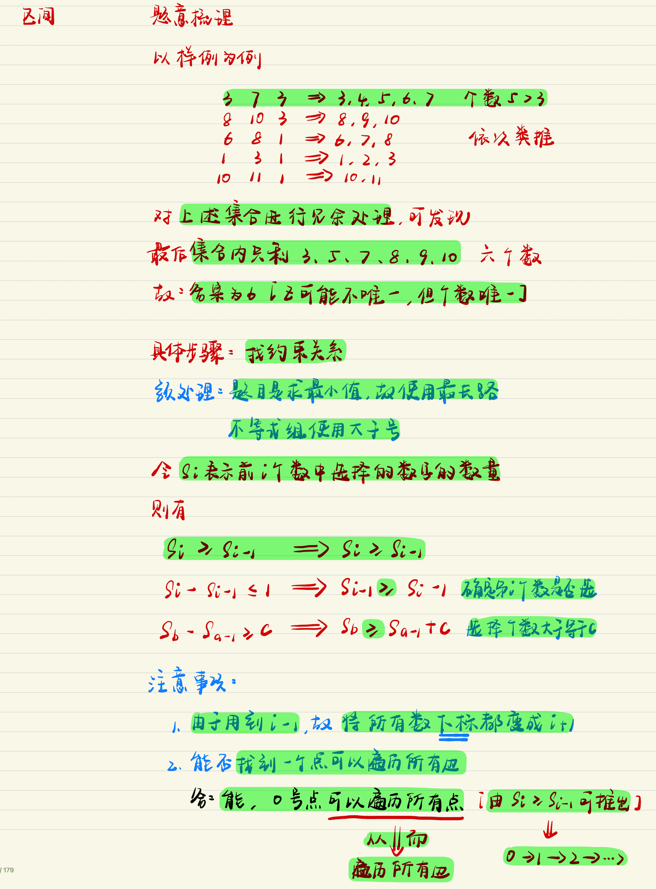

**代ç **

```c++
#include <iostream>
#include <cstring>
using namespace std;
const int N = 50010, M = 150010;
int n, idx;
int h[N], e[M], w[M], ne[M], dist[N], st[N], q[N];
void add(int a, int b, int c) {
    e[idx] = b;
    w[idx] = c;
    ne[idx] = h[a];
    h[a] = idx ++;
    return;
}
// spfa模æ¿
void spfa() {
    memset(dist, -0x3f, sizeof dist);
    memset(st, 0, sizeof st);
    int hh = 0, tt = 0;
    dist[0] = 0;
    q[tt ++ ] = 0;
    st[0] = true;
    while (hh != tt) {
        int t = q[hh ++ ];
        if (hh == N) hh = 0;
        st[t] = false;
        for (int i = h[t]; i != -1; i = ne[i]) {
            int j = e[i];
            if (dist[j] < dist[t] + w[i]) {
                dist[j] = dist[t] + w[i];
                if (!st[j]) {
                    q[tt ++ ] = j;
                    if (tt == N) tt = 0;
                    st[j] = true;
                }
            }
        }
    }
    return;
}
int main() {
    scanf("%d", &n);
    memset(h, -1, sizeof h);
    for (int i = 1; i <= 50001; i ++ ) {
        // 第一和第二个æ¡ä»¶
        add(i - 1, i, 0);
        add(i, i - 1, -1);
    }
    for (int i = 0; i < n; i ++ ) {
        int a, b, c;
        scanf("%d%d%d", &a, &b, &c);
        // 注æ„: 下标 + 1
        a ++, b ++;
        add(a - 1, b, c);
    }
    spfa();
    // 输出结æœå³å¯
    cout << dist[50001] << endl;
    return 0;
}
```

**时间å¤æ‚度**


**空间å¤æ‚度**

$O(n)$

**标签**

`差分约æŸ`ã€`spfa`

**ç¼åˆæ€ª**


### [AcWing 1170. æ’队布局](https://www.acwing.com/problem/content/1172/)

**题目æè¿°**

>   当æ’队等候喂食时，奶牛喜欢和它们的朋å‹ç«™å¾—é è¿‘些。
>
>   农夫约翰有 `N` 头奶牛，编å·ä» `1` 到 `N`，沿一æ¡ç›´çº¿ç«™ç€ç­‰å€™å–‚食。
>
>   奶牛æ’在队ä¼ä¸­çš„顺åºå’Œå®ƒä»¬çš„ç¼–å·æ˜¯ç›¸åŒçš„。
>
>   因为奶牛相当苗æ¡ï¼Œæ‰€ä»¥å¯èƒ½æœ‰ä¸¤å¤´æˆ–者更多奶牛站在åŒä¸€ä½ç½®ä¸Šã€‚
>
>   如æœæˆ‘们想象奶牛是站在一æ¡æ•°è½´ä¸Šçš„è¯ï¼Œå…许有两头或更多奶牛拥有相åŒçš„横å标。
>
>   一些奶牛相互间存有好感，它们希望两者之间的è·ç¦»ä¸è¶…过一个给定的数 `L`。
>
>   å¦ä¸€æ–¹é¢ï¼Œä¸€äº›å¥¶ç‰›ç›¸äº’é—´é常å感，它们希望两者间的è·ç¦»ä¸å°äºä¸€ä¸ªç»™å®šçš„æ•° `D`。
>
>   给出 $M_L$ æ¡å…³äºä¸¤å¤´å¥¶ç‰›é—´æœ‰å¥½æ„Ÿçš„æ述，å†ç»™å‡º $M_D$ æ¡å…³äºä¸¤å¤´å¥¶ç‰›é—´å­˜æœ‰åæ„Ÿçš„æ述。
>
>   你的工作是：如æœä¸å­˜åœ¨æ»¡è¶³è¦æ±‚的方案，输出`-1`ï¼›å¦‚æœ `1` å·å¥¶ç‰›å’Œ `N` å·å¥¶ç‰›é—´çš„è·ç¦»å¯ä»¥ä»»æ„大，输出`-2`ï¼›å¦åˆ™ï¼Œè®¡ç®—出在满足所有è¦æ±‚的情况下，`1` å·å¥¶ç‰›å’Œ `N` å·å¥¶ç‰›é—´å¯èƒ½çš„最大è·ç¦»ã€‚

**输入格å¼**

>   第一行包å«ä¸‰ä¸ªæ•´æ•° $N,M_L,M_D$。
>
>   æ¥ä¸‹æ¥ $M_L$ 行，æ¯è¡ŒåŒ…å«ä¸‰ä¸ªæ­£æ•´æ•° $A,B,L$，表示奶牛 `A` 和奶牛 `B` 至多相隔 `L` çš„è·ç¦»ã€‚
>
>   å†æ¥ä¸‹æ¥ $M_D$ 行，æ¯è¡ŒåŒ…å«ä¸‰ä¸ªæ­£æ•´æ•° $A,B,D$，表示奶牛 `A` 和奶牛 `B` 至少相隔 `D` çš„è·ç¦»ã€‚

**输出格å¼**

>   输出一个整数，如æœä¸å­˜åœ¨æ»¡è¶³è¦æ±‚的方案，输出`-1`ï¼›å¦‚æœ `1` å·å¥¶ç‰›å’Œ `N` å·å¥¶ç‰›é—´çš„è·ç¦»å¯ä»¥ä»»æ„大，输出`-2`ï¼›å¦åˆ™ï¼Œè¾“出在满足所有è¦æ±‚的情况下，`1` å·å¥¶ç‰›å’Œ `N` å·å¥¶ç‰›é—´å¯èƒ½çš„最大è·ç¦»ã€‚

**æ•°æ®èŒƒå›´**

>   +   $2≤N≤1000,$
>   +   $1 ≤ M_L, M_D ≤ 10 ^ 4,$
>   +   $1≤L,D≤10^6$

**输入样例**

```c++
4 2 1
1 3 10
2 4 20
2 3 3
```

**输出样例**

```c++
27
```

**手写稿**


**代ç **

```c++
#include <iostream>
#include <cstring>
using namespace std;
const int N = 1010, M = 21010, INF = 0x3f3f3f3f;
int n, m1, m2, idx;
int h[N], e[M], w[M], ne[M], dist[N], cnt[N], st[N], q[N];
void add(int a, int b, int c) {
    e[idx] = b;
    w[idx] = c;
    ne[idx] = h[a];
    h[a] = idx ++;
    return;
}
// spfa模æ¿
bool spfa(int size) {
    memset(dist, 0x3f, sizeof dist);
    memset(cnt, 0, sizeof cnt);
    memset(st, 0, sizeof st);
    int hh = 0, tt = 0;
    for (int i = 1; i <= size; i ++ ) {
        q[tt ++ ] = i;
        st[i] = true;
        dist[i] = 0;
    }
    while (hh != tt) {
        int t = q[hh ++ ];
        if (hh == N) hh = 0;
        st[t] = false;
        for (int i = h[t]; i != -1; i = ne[i]) {
            int j = e[i];
            if (dist[j] > dist[t] + w[i]) {
                dist[j] = dist[t] + w[i];
                cnt[j] = cnt[t] + 1;
                if (cnt[j] >= n) return true;
                if (!st[j]) {
                    q[tt ++ ] = j;
                    if (tt == N) tt = 0;
                    st[j] = true;
                }
            }
        }
    }
    return false;
}
int main() {
    scanf("%d%d%d", &n, &m1, &m2);
    memset(h, -1, sizeof h);
    for (int i = 1; i <= n; i ++ ) add(i + 1, i, 0);
    for (int i = 0; i < m1; i ++ ) {
        int a, b, c;
        scanf("%d%d%d", &a, &b, &c);
        // 注æ„: aå’Œb的大å°ä¸ç¡®å®š
        if (a < b) swap(a, b);
        add(b, a, c);
    }
    for (int i = 0; i < m2; i ++ ) {
        int a, b, c;
        scanf("%d%d%d", &a, &b, &c);
        // 注æ„: aå’Œb的大å°ä¸ç¡®å®š
        if (a < b) swap(a, b);
        add(a, b, -c);
    }
    // 将所有点入队[虚拟æºç‚¹ä½œç”¨]
    if (spfa(n)) { // 存在ç¯
        puts("-1");
    }
    else {
        // 将第一个点入队
        spfa(1);
        // 无穷大,è¿”å›-2
        if (dist[n] == INF) puts("-2");
        // è¿”å›æœ€å¤§è·ç¦»
        else cout << dist[n] << endl;
    }
    return 0;
}
```

**时间å¤æ‚度**


**空间å¤æ‚度**

$O(n)$

**标签**

`差分约æŸ`ã€`spfa`

**ç¼åˆæ€ª**


### [AcWing 393. 雇佣收银员](https://www.acwing.com/problem/content/395/)

**题目æè¿°**

>   一家超市è¦æ¯å¤© `24` å°æ—¶è¥ä¸šï¼Œä¸ºäº†æ»¡è¶³è¥ä¸šéœ€æ±‚，需è¦é›‡ä½£ä¸€å¤§æ‰¹æ”¶é“¶å‘˜ã€‚
>
>   已知ä¸åŒæ—¶é—´æ®µéœ€è¦çš„收银员数é‡ä¸åŒï¼Œä¸ºäº†èƒ½å¤Ÿé›‡ä½£å°½å¯èƒ½å°‘的人员，ä»è€Œå‡å°‘æˆæœ¬ï¼Œè¿™å®¶è¶…市的ç»ç†è¯·ä½ æ¥å¸®å¿™å‡ºè°‹åˆ’策。
>
>   ç»ç†ä¸ºä½ æ供了一个å„个时间段收银员最å°éœ€æ±‚æ•°é‡çš„æ¸…å• $R(0),R(1),R(2),…,R(23)$。
>
>   `R(0)` 表示åˆå¤œ `00:00` 到凌晨 `01:00` 的最å°éœ€æ±‚æ•°é‡ï¼Œ`R(1)` 表示凌晨 `01:00` 到凌晨 `02:00` 的最å°éœ€æ±‚æ•°é‡ï¼Œä»¥æ­¤ç±»æ¨ã€‚
>
>   一共有 `N` 个åˆæ ¼çš„申请人申请岗ä½ï¼Œç¬¬ `i` 个申请人å¯ä»¥ä» $t_i$ 时刻开始è¿ç»­å·¥ä½œ `8` å°æ—¶ã€‚
>
>   收银员之间ä¸å­˜åœ¨æ›¿æ¢ï¼Œä¸€å®šä¼šå®Œæ•´åœ°å·¥ä½œ `8` å°æ—¶ï¼Œæ”¶é“¶å°çš„æ•°é‡ä¸€å®šè¶³å¤Ÿã€‚
>
>   ç°åœ¨ç»™å®šä½ æ”¶é“¶å‘˜çš„需求清å•ï¼Œè¯·ä½ è®¡ç®—最少需è¦é›‡ä½£å¤šå°‘å收银员。

**输入格å¼**

>   第一行包å«ä¸€ä¸ªä¸è¶…过 `20` 的整数，表示测试数æ®çš„组数。
>
>   对äºæ¯ç»„测试数æ®ï¼Œç¬¬ä¸€è¡ŒåŒ…å« `24` 个整数，分别表示 `R(0),R(1),R(2),…,R(23)`。
>
>   第二行包å«æ•´æ•° `N`。
>
>   æ¥ä¸‹æ¥ `N` 行，æ¯è¡ŒåŒ…å«ä¸€ä¸ªæ•´æ•° $t_i$。

**输出格å¼**

>   æ¯ç»„æ•°æ®è¾“出一个结æœï¼Œæ¯ä¸ªç»“æœå ä¸€è¡Œã€‚
>
>   如æœæ²¡æœ‰æ»¡è¶³éœ€æ±‚的安æ’，输出 `No Solution`。

**æ•°æ®èŒƒå›´**

>   +   $0≤R(0)≤1000,$
>   +   $0≤N≤1000,$
>   +   $0≤t_i≤23$

**输入样例**

```c++
1
1 0 1 0 0 0 1 0 0 0 0 0 0 0 0 0 0 0 0 0 0 0 0 1
5
0
23
22
1
10
```

**输出样例**

```c++
1
```

**手写稿**


**代ç ä¸€:å·®åˆ†çº¦æŸ + 暴力æšä¸¾**

```c++
#include <iostream>
#include <cstring>
using namespace std;
const int N = 30, M = 110;
int n, T, idx;
int r[N], num[N], h[N], e[M], w[M], ne[M], cnt[N], st[N], dist[N], q[N];
void add(int a, int b, int c) {
    e[idx] = b;
    w[idx] = c;
    ne[idx] = h[a];
    h[a] = idx ++;
    return;
}
// 差分约æŸå»ºè¾¹[手写稿]
void build(int c) {
    memset(h, -1, sizeof h);
    idx = 0;
    for (int i = 1; i <= 24; i ++ ) {
        add(i - 1, i, 0);
        add(i, i - 1, -num[i]);
    }
    for (int i = 1; i <= 7; i ++ ) add(16 + i, i, -c + r[i]);
    for (int i = 8; i <= 24; i ++ ) add(i - 8, i, r[i]);
    add(0, 24, c);
    add(24, 0, -c);
    return;
}
// spfa模æ¿
bool spfa(int c) {
    build(c);
    memset(dist, -0x3f, sizeof dist);
    memset(st, 0, sizeof st);
    memset(cnt, 0, sizeof cnt);
    int hh = 0, tt = 0;
    q[tt ++ ] = 0;
    st[0] = true;
    dist[0] = 0;
    while (hh != tt) {
        int t = q[hh ++ ];
        if (hh == N) hh = 0;
        st[t] = false;
        for (int i = h[t]; i != -1; i = ne[i]) {
            int j = e[i];
            if (dist[j] < dist[t] + w[i]) {
                dist[j] = dist[t] + w[i];
                cnt[j] = cnt[t] + 1;
                // 注æ„: 图中的点ä¸æ˜¯n + 1个, n + 1是申请人的个数
                // 图中点的数é‡ä¸º25个, 0 ~ 24
                if (cnt[j] >= 25) return true;
                if (!st[j]) {
                    q[tt ++ ] = j;
                    if (tt == N) tt = 0;
                    st[j] = true;
                }
            }
        }
    }
    return false;
}
int main() {
    scanf("%d", &T);
    while (T -- ) {
        // 注æ„: ç€é‡ç†è§£r数组的å«ä¹‰
        for (int i = 1; i <= 24; i ++ ) scanf("%d", &r[i]);
        scanf("%d", &n);
        // 注æ„: ç€é‡ç†è§£num数组的å«ä¹‰
        // num[i]数组表示i时刻到店的人数, 本题为方便将所有时刻å‘åç§»åŠ¨ä¸€ä½ ++
        memset(num, 0, sizeof num);
        for (int i = 0; i < n; i ++ ) {
            int t;
            scanf("%d", &t);
            num[t + 1] ++;
        }
        int flag = false;
        // æšä¸¾s[24]的值
        for (int i = 0; i <= n; i ++ )
            // 如æœæ‰¾åˆ°ç­”案
            if (!spfa(i)) {
                cout << i << endl;
                flag = true;
                break;
            }
        if (!flag) puts("No Solution");
    }
    return 0;
}
```

**时间å¤æ‚度**

$O(Tn2500)$

**空间å¤æ‚度**

$O(m)$

**代ç äºŒ: å·®åˆ†çº¦æŸ + 二分**

```c++
#include <iostream>
#include <cstring>
using namespace std;
const int N = 30, M = 110;
int n, T, idx;
int r[N], num[N], h[N], e[M], w[M], ne[M], cnt[N], st[N], dist[N], q[N];
void add(int a, int b, int c) {
    e[idx] = b;
    w[idx] = c;
    ne[idx] = h[a];
    h[a] = idx ++;
    return;
}
// 差分约æŸå»ºè¾¹[手写稿]
void build(int c) {
    memset(h, -1, sizeof h);
    idx = 0;
    for (int i = 1; i <= 24; i ++ ) {
        add(i - 1, i, 0);
        add(i, i - 1, -num[i]);
    }
    for (int i = 1; i <= 7; i ++ ) add(16 + i, i, -c + r[i]);
    for (int i = 8; i <= 24; i ++ ) add(i - 8, i, r[i]);
    add(0, 24, c);
    add(24, 0, -c);
    return;
}
// spfa模æ¿
bool spfa(int c) {
    build(c);
    memset(dist, -0x3f, sizeof dist);
    memset(st, 0, sizeof st);
    memset(cnt, 0, sizeof cnt);
    int hh = 0, tt = 0;
    q[tt ++ ] = 0;
    st[0] = true;
    dist[0] = 0;
    while (hh != tt) {
        int t = q[hh ++ ];
        if (hh == N) hh = 0;
        st[t] = false;
        for (int i = h[t]; i != -1; i = ne[i]) {
            int j = e[i];
            if (dist[j] < dist[t] + w[i]) {
                dist[j] = dist[t] + w[i];
                cnt[j] = cnt[t] + 1;
                // 注æ„: 图中的点ä¸æ˜¯n + 1个, n + 1是申请人的个数
                // 图中点的数é‡ä¸º25个, 0 ~ 24
                if (cnt[j] >= 25) return true;
                if (!st[j]) {
                    q[tt ++ ] = j;
                    if (tt == N) tt = 0;
                    st[j] = true;
                }
            }
        }
    }
    return false;
}
int main() {
    scanf("%d", &T);
    while (T -- ) {
        // 注æ„: ç€é‡ç†è§£r数组的å«ä¹‰
        for (int i = 1; i <= 24; i ++ ) scanf("%d", &r[i]);
        scanf("%d", &n);
        // 注æ„: ç€é‡ç†è§£num数组的å«ä¹‰
        // num[i]数组表示i时刻到店的人数, 本题为方便将所有时刻å‘åç§»åŠ¨ä¸€ä½ ++
        memset(num, 0, sizeof num);
        for (int i = 0; i < n; i ++ ) {
            int t;
            scanf("%d", &t);
            num[t + 1] ++;
        }
        int flag = false;
        // æšä¸¾s[24]的值
        // 注æ„: 二分的范围[0, n]
        int l = 0, r = n;
        while (l < r) {
            int mid = l + r >> 1;
            if (!spfa(mid)) r = mid;
            else l = mid + 1;
        }
        if (spfa(l)) puts("No Solution");
        else cout << l << endl;
    }
    return 0;
}
```

**时间å¤æ‚度**

$O(Tlog_n2500)$

**空间å¤æ‚度**

$O(m)$

**标签**

`差分约æŸ`ã€`spfa`ã€`二分`

**ç¼åˆæ€ª**


## 最近公共祖先

### åŸç†


### [AcWing 1172. 祖孙询问](https://www.acwing.com/problem/content/1174/)

**题目æè¿°**

>   ç»™å®šä¸€æ£µåŒ…å« `n` 个节点的有根无å‘树，节点编å·äº’ä¸ç›¸åŒï¼Œä½†ä¸ä¸€å®šæ˜¯ `1 ∼ n`。
>
>   有 `m` 个询问，æ¯ä¸ªè¯¢é—®ç»™å‡ºäº†ä¸€å¯¹èŠ‚ç‚¹çš„ç¼–å· `x` å’Œ `y`，询问 `x` ä¸ `y` 的祖孙关系。

**输入格å¼**

>   输入第一行包括一个整数 表示节点个数；
>
>   æ¥ä¸‹æ¥ `n` è¡Œæ¯è¡Œä¸€å¯¹æ•´æ•° `a` å’Œ `b`，表示 `a` å’Œ `b` 之间有一æ¡æ— å‘è¾¹ã€‚å¦‚æœ `b` 是 `−1`，那么 `a` 就是树的根；
>
>   第 `n + 2` 行是一个整数 `m` 表示询问个数；
>
>   æ¥ä¸‹æ¥ `m` 行，æ¯è¡Œä¸¤ä¸ªä¸åŒçš„正整数 `x` å’Œ `y`，表示一个询问。

**输出格å¼**

>   对äºæ¯ä¸€ä¸ªè¯¢é—®ï¼Œè‹¥ `x` 是 `y` 的祖先则输出 `1`，若 `y` 是 `x` 的祖先则输出 `2`，å¦åˆ™è¾“出 `0`。

**æ•°æ®èŒƒå›´**

>   +   $1≤n,m≤4×10^4,$
>   +   $1≤æ¯ä¸ªèŠ‚点的编å·â‰¤4×10^4$

**输入样例**

```c++
10
234 -1
12 234
13 234
14 234
15 234
16 234
17 234
18 234
19 234
233 19
5
234 233
233 12
233 13
233 15
233 19
```

**输出样例**

```c++
1
0
0
0
2
```

**手写稿**

>   1.   模æ¿é¢˜,查看最近公共祖先 => åŸç† => 算法二

**代ç **

```c++
#include <iostream>
#include <cstring>
using namespace std;
const int N = 40010, M = 80010, K = 16;
int n, m, idx;
int h[N], e[M], ne[M], depth[N], st[N], q[N];
int fa[N][K];
void add(int a, int b) {
    e[idx] = b;
    ne[idx] = h[a];
    h[a] = idx ++;
    return;
}
void bfs(int u) {
    memset(depth, 0x3f, sizeof depth);
    memset(st, false, sizeof st);
    int hh = 0, tt = -1;
    depth[u] = 1;
    q[++ tt] = u;
    while (hh <= tt) {
        int t = q[hh ++ ];
        st[t] = true;
        for (int i = h[t]; i != -1; i = ne[i]) {
            int j = e[i];
            if (!st[j]) {
                depth[j] = depth[t] + 1;
                q[++ tt] = j;
                // ä»jèµ°1步到达t
                fa[j][0] = t;
                // 递æ¨å…¬å¼
                for (int k = 1; k <= 15; k ++ ) fa[j][k] = fa[fa[j][k - 1]][k - 1];
            }
        }
    }
    return;
}
int lca(int a, int b) {
    // 设置哨兵
    depth[0] = 0;
    // 为了方便编ç ,始终ä¿æŒa的深度depth[a] >= b的深度depth[b]
    // 注æ„: swap(a, b) ä¸æ˜¯ swap(depth[a], depth[b])
    if (depth[a] < depth[b]) swap(a, b);
    // å°†aå’Œb跳到åŒä¸€å±‚
    for (int k = 15; k >= 0; k -- )
        // 哨兵的作用一:
        // 如æœè·³å‡ºç•Œ,则fa[a][k] = 0, 此时depth[0] = 0, æ­¤æ¡ä»¶ä¸€å®šä¸ä¼šæˆç«‹
        // åŸå› :树中的深度至少为1
        if (depth[fa[a][k]] >= depth[b]) a = fa[a][k];
    // 如æœaå’Œbå·²ç»ç›¸ç­‰, 则返å›å³å¯
    if (a == b) return a;
    for (int k = 15; k >= 0; k -- )
        // 如æœaå’Œb相等, 则一直跳
        // å‡è®¾aå’Œb此时处äºæœ€è¿‘公共祖先的下一层, 则ä¸ä¼šè¿›è¡Œè·³è·ƒ
        // 哨兵的作用二:
        // 如æœè·³å‡ºç•Œ,则fa[a][k]å’Œfa[b][k]都为0, 此时depth[0] = depth[0] = 0
        // 两者相等,æ­¤æ¡ä»¶ä¹Ÿä¸ä¼šæˆç«‹
        if (fa[a][k] != fa[b][k]) {
            a = fa[a][k];
            b = fa[b][k];
        }
    // å‘上走一步,就是最近公共祖先
    return fa[a][0];
}
int main() {
    int root;
    scanf("%d", &n);
    memset(h, -1, sizeof h);
    for (int i = 0; i < n; i ++ ) {
        int a, b;
        scanf("%d%d", &a, &b);
        if (b == -1) root = a;
        else {
            add(a, b);
            add(b, a);
        }
    }
    bfs(root);
    scanf("%d", &m);
    while (m -- ) {
        int a, b;
        scanf("%d%d", &a, &b);
        int rt = lca(a, b);
        if (rt == a) puts("1");
        else if (rt == b) puts("2");
        else puts("0");
    }
    return 0;
}
```

**时间å¤æ‚度**

$O(nlog_n + mlog_n)$

**空间å¤æ‚度**

$O(nlog_n)$

**标签**

`LCA`ã€`å€å¢`

**ç¼åˆæ€ª**


### [AcWing 1171. è·ç¦»](https://www.acwing.com/problem/content/1173/)

**题目æè¿°**

>   给出 `n` 个点的一棵树，多次询问两点之间的最短è·ç¦»ã€‚
>
>   注æ„：
>
>   -   边是**æ— å‘**的。
>   -   所有节点的编å·æ˜¯ `1, 2, …, n`。

**输入格å¼**

>   第一行为两个整数 `n` 和 `m`。`n` 表示点数，`m` 表示询问次数；
>
>   ä¸‹æ¥ `n − 1` 行，æ¯è¡Œä¸‰ä¸ªæ•´æ•° `x, y, k`，表示点 `x` 和点 `y` 之间存在一æ¡è¾¹é•¿åº¦ä¸º `k`ï¼›
>
>   å†æ¥ä¸‹æ¥ `m` 行，æ¯è¡Œä¸¤ä¸ªæ•´æ•° `x, y`，表示询问点 `x` 到点 `y` 的最短è·ç¦»ã€‚
>
>   树中结点编å·ä» `1` 到 `n`。

**输出格å¼**

>   å…± `m` 行，对äºæ¯æ¬¡è¯¢é—®ï¼Œè¾“出一行询问结æœã€‚

**æ•°æ®èŒƒå›´**

>   +   $2≤n≤10^4,$
>   +   $1≤m≤2×10^4,$
>   +   $0<k≤100,$
>   +   $1≤x,y≤n$

**输入样例1**

```c++
2 2 
1 2 100 
1 2 
2 1
```

**输出样例1**

```c++
100
100
```

**输入样例2**

```c++
3 2
1 2 10
3 1 15
1 2
3 2
```

**输出样例2**

```c++
10
25
```

**手写稿**

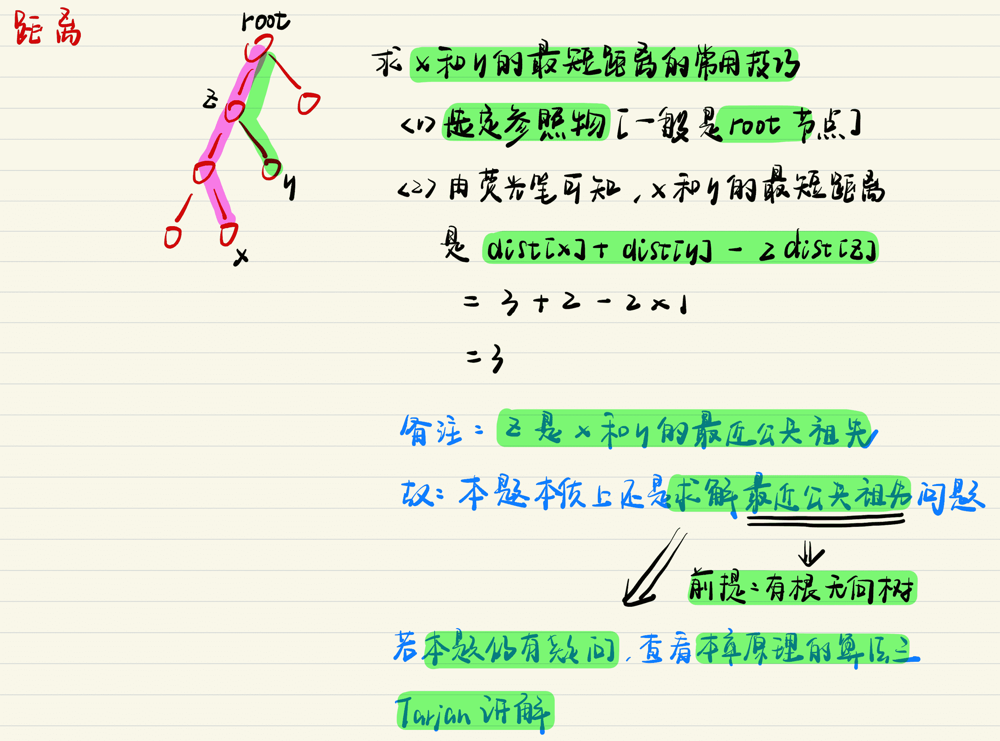

**代ç **

```c++
#include <iostream>
#include <cstring>
#include <vector>
using namespace std;
typedef pair<int, int> PII;
const int N = 10010, M = 20010;
int n, m, idx;
int h[N], e[M], w[M], ne[M], dist[N], res[M], st[N], f[N];
vector<PII> query[N];
int find(int x) {
    if (f[x] == x) return f[x];
    return f[x] = find(f[x]);
}
void add(int a, int b, int c) {
    e[idx] = b;
    w[idx] = c;
    ne[idx] = h[a];
    h[a] = idx ++;
    return;
}
// 计算è·ç¦»
void dfs(int u, int father) {
    for (int i = h[u]; i != -1; i = ne[i]) {
        int j = e[i];
        if (j == father) continue;
        // 计算è·ç¦»ä¸æ˜¯è®¡ç®—高度!!!
        dist[j] = dist[u] + w[i];
        dfs(j, u);
    }
    return;
}
void tarjan(int u) {
    // 标记当å‰æ­£åœ¨è®¿é—®u节点
    st[u] = 1;
    for (int i = h[u]; i != -1; i = ne[i]) {
        int j = e[i];
        // 如æœèŠ‚点j还没有被访问过
        if (!st[j]) {
            tarjan(j);
            // 将j的父亲标为u[手写稿进一步解释]
            f[j] = u;
        }
    }
    // 秋åç®—è´¦
    // æ¯éå†å®Œä¸€ä¸ªå­æ ‘,都需è¦è¿›è¡Œè¯¢é—®[åŸå› : 手写稿]
    for (auto [b, i] : query[u]) // éå†æ‰€æœ‰å’Œu相关的询问
        // 如æœbå·²ç»è¢«è®¿é—®è¿‡[åç»­ä¸ä¼šå†æ¬¡è¢«è®¿é—®]
        if (st[b] == 2) {
            // 找到其最近公共祖先
            int anc = find(b);
            // å…¬å¼
            res[i] = dist[u] + dist[b] - 2 * dist[anc];
        }
    // 标为u为已ç»è¢«è®¿é—®è¿‡
    st[u] = 2;
    return;
}
int main() {
    scanf("%d%d", &n, &m);
    memset(h, -1, sizeof h);
    for (int i = 1; i <= n; i ++ ) f[i] = i;
    for (int i = 0; i < n - 1; i ++ ) {
        int a, b, c;
        scanf("%d%d%d", &a, &b, &c);
        add(a, b, c);
        add(b, a, c);
    }
    for (int i = 0; i < m; i ++ ) {
        int a, b;
        scanf("%d%d", &a, &b);
        // 两边查询都è¦å»ºç«‹[åŸå› : 手写稿]
        // 第一维存节点编å·
        // 第二维存查询编å·
        query[a].push_back({b, i});
        query[b].push_back({a, i});
    }
    // ä»»æ„根结点, 如1
    dfs(1, -1);
    // ä»æ ¹èŠ‚点开始éå†
    tarjan(1);
    for (int i = 0; i < m; i ++ ) cout << res[i] << endl;
    return 0;
}
```

**时间å¤æ‚度**

$O(n)$

**空间å¤æ‚度**

$O(n)$

**标签**

`Tarjan`ã€`次å°ç”Ÿæˆæ ‘`

**ç¼åˆæ€ª**


### [AcWing 356. 次å°ç”Ÿæˆæ ‘](https://www.acwing.com/problem/content/description/358/)

**题目æè¿°**

>   给定一张 `N` 个点 `M` æ¡è¾¹çš„æ— å‘图，求无å‘图的严格次å°ç”Ÿæˆæ ‘。
>
>   设最å°ç”Ÿæˆæ ‘çš„è¾¹æƒä¹‹å’Œä¸º `sum`，严格次å°ç”Ÿæˆæ ‘就是指边æƒä¹‹å’Œå¤§äº `sum` 的生æˆæ ‘中最å°çš„一个。

**输入格å¼**

>   第一行包å«ä¸¤ä¸ªæ•´æ•° `N` å’Œ `M`。
>
>   æ¥ä¸‹æ¥ `M` 行，æ¯è¡ŒåŒ…å«ä¸‰ä¸ªæ•´æ•° `x，y，z`，表示点 `x` 和点 `y` 之å‰å­˜åœ¨ä¸€æ¡è¾¹ï¼Œè¾¹çš„æƒå€¼ä¸º `z`。

**输出格å¼**

>   包å«ä¸€è¡Œï¼Œä»…一个数，表示严格次å°ç”Ÿæˆæ ‘çš„è¾¹æƒå’Œã€‚(æ•°æ®ä¿è¯å¿…定存在严格次å°ç”Ÿæˆæ ‘)

**æ•°æ®èŒƒå›´**

>   +   $N≤10^5,M≤3×10^5$

**输入样例**

```c++
5 6
1 2 1
1 3 2
2 4 3
3 5 4
3 4 3
4 5 6
```

**输出样例**

```c++
11
```

**手写稿**


**代ç **

```c++
#include <iostream>
#include <cstring>
#include <algorithm>
using namespace std;
typedef long long LL;
const int N = 100010, M = 300010, K = 18, INF = 0x3f3f3f3f;
int n, m, idx;
int p[N], h[N], e[M], w[M], ne[M], depth[N], q[N], st[N];
int fa[N][K], d1[N][K], d2[N][K];
struct Edge {
    int u, v, w;
    bool used;
    bool operator < (const Edge &W) const {
        return w < W.w;
    }
}edges[M];
int find(int x) {
    if (p[x] == x) return p[x];
    return p[x] = find(p[x]);
}
// Kruskal模æ¿
LL kruskal() {
    sort(edges, edges + m);
    LL res = 0, cnt = 0;
    for (int i = 1; i <= n; i ++ ) p[i] = i;
    for (int i = 0; i < m; i ++ ) {
        if (cnt == n - 1) break;
        int a = edges[i].u;
        int b = edges[i].v;
        int c = edges[i].w;
        int fa = find(a);
        int fb = find(b);
        if (fa == fb) continue;
        // 标记当å‰è¾¹æ˜¯æ ‘è¾¹
        edges[i].used = true;
        p[fb] = fa;
        res += c;
        cnt ++;
    }
    return res;
}
void add(int a, int b, int c) {
    e[idx] = b;
    w[idx] = c;
    ne[idx] = h[a];
    h[a] = idx ++;
    return;
}
void build() {
    memset(h, -1, sizeof h);
    for (int i = 0; i < m; i ++ )
        if (edges[i].used) {
            int a = edges[i].u;
            int b = edges[i].v;
            int c = edges[i].w;
            // 建立åŒå‘è¾¹
            add(a, b, c);
            add(b, a, c);
        }
    return;
}
// BFS模æ¿
void bfs() {
    memset(depth, 0x3f, sizeof depth);
    memset(st, false, sizeof st);
    int hh = 0, tt = -1;
    // 0是哨兵, 1是根结点
    depth[0] = 0, depth[1] = 1;
    q[++ tt] = 1;
    st[1] = true;
    while (hh <= tt) {
        int t = q[hh ++ ];
        for (int i = h[t]; i != -1; i = ne[i]) {
            int j = e[i];
            if (!st[j]) {
                st[j] = true;
                // æ›´æ–°è·ç¦»
                depth[j] = depth[t] + 1;
                q[++ tt] = j;
                // ä»jå‘上走一步是t
                fa[j][0] = t;
                // åˆå§‹åŒ–, 一开始最大值是w[i], ç”±äºæ˜¯ä¸¥æ ¼æ¬¡å°å€¼, 故次å°å€¼ä¸º-INF
                d1[j][0] = w[i];
                d2[j][0] = -INF;
                for (int k = 1; k < 18; k ++ ) {
                    int anc = fa[j][k - 1];
                    fa[j][k] = fa[anc][k - 1];
                    // 注æ„: 此处容易出错, 四个值ä¸è¦å†™é”™äº†
                    int distance[4] = {d1[j][k - 1], d1[anc][k - 1], d2[j][k - 1], d2[anc][k - 1]};
                    d1[j][k] = d2[j][k] = -INF;
                    for (int u = 0; u < 4; u ++ ) {
                        int d = distance[u];
                        if (d > d1[j][k]) {
                            d2[j][k] = d1[j][k];
                            d1[j][k] = d;
                        }
                        // 严格次å°å€¼, æ•…, 需判断d != d1[j][k]
                        else if (d != d1[j][k] && d > d2[j][k]) d2[j][k] = d;
                    }
                }
            }
        }
    }
    return;
}
int lca(int a, int b, int c) {
    // 统计树中a到b路径上的所有的最大值和次大值
    static int distance[M];
    int cnt = 0;
    if (depth[a] < depth[b]) swap(a, b);
    for (int k = 17; k >= 0; k -- )
        if (depth[fa[a][k]] >= depth[b]) {
            distance[cnt ++ ] = d1[a][k];
            distance[cnt ++ ] = d2[a][k];
            a = fa[a][k];
        }
    if (a != b) {
        for (int k = 17; k >= 0; k -- )
            if (fa[a][k] != fa[b][k]) {
                distance[cnt ++ ] = d1[a][k];
                distance[cnt ++ ] = d2[a][k];
                distance[cnt ++ ] = d1[b][k];
                distance[cnt ++ ] = d2[b][k];
                a = fa[a][k];
                b = fa[b][k];
            }
        // 加上最å一步的最大值和次大值
        distance[cnt ++ ] = d1[a][0];
        distance[cnt ++ ] = d2[a][0];
        distance[cnt ++ ] = d1[b][0];
        distance[cnt ++ ] = d2[b][0];
    }
    // 找到全局的最大值和次大值
    int dist1 = -INF, dist2 = -INF;
    for (int i = 0; i < cnt; i ++ ) {
        int d = distance[i];
        if (d > dist1) {
            dist2 = dist1;
            dist1 = d;
        }
        else if (d != dist1 && d > dist2) dist2 = d;
    }
    if (c > dist1) return c - dist1;
    if (c > dist2) return c - dist2;
    return INF;
}
int main() {
    scanf("%d%d", &n, &m);
    for (int i = 0; i < m; i ++ ) {
        int a, b, c;
        scanf("%d%d%d", &a, &b, &c);
        edges[i] = {a, b, c};
    }
    // Kruskal求最å°ç”Ÿæˆæ ‘
    LL sum = kruskal();
    // 将最å°ç”Ÿæˆæ ‘进行建图, 方便求lca
    build();
    // 求lca所需的depth和fa数组
    bfs();
    LL res = 1e18;
    // æšä¸¾æ‰€æœ‰éæ ‘è¾¹
    for (int i = 0; i < m; i ++ ) {
        // 如æœæ˜¯æ ‘è¾¹, 则跳过
        if (edges[i].used) continue;
        int a = edges[i].u;
        int b = edges[i].v;
        int c = edges[i].w;
        res = min(res, sum + lca(a, b, c));
    }
    printf("%lld\n", res);
    return 0;
}
```

**时间å¤æ‚度**

$O(mlog_n)$

**空间å¤æ‚度**

$O(n)$

**标签**

`LCA`ã€`次å°ç”Ÿæˆæ ‘`

**ç¼åˆæ€ª**

[AcWing 1148. 秘密的牛奶è¿è¾“](#AcWing 1148. 秘密的牛奶è¿è¾“)

### [AcWing 352. é—‡ã®ï¦šé–](https://www.acwing.com/problem/content/description/354/)

**题目æè¿°**

>   传说中的暗之è¿é”被人们称为 `Dark`。
>
>   `Dark` 是人类内心的黑暗的产物，å¤ä»Šä¸­å¤–的勇者们都试图打倒它。
>
>   ç»è¿‡ç ”究，你å‘ç° `Dark` 呈ç°æ— å‘图的结æ„，图中有 `N` 个节点和两类边，一类边被称为主è¦è¾¹ï¼Œè€Œå¦ä¸€ç±»è¢«ç§°ä¸ºé™„加边。
>
>   `Dark` 有 `N – 1` æ¡ä¸»è¦è¾¹ï¼Œå¹¶ä¸” `Dark` çš„ä»»æ„两个节点之间都存在一æ¡åªç”±ä¸»è¦è¾¹æ„æˆçš„路径。
>
>   å¦å¤–，`Dark` 还有 `M` æ¡é™„加边。
>
>   你的任务是把 `Dark` 斩为ä¸è¿é€šçš„两部分。
>
>   一开始 `Dark` 的附加边都处äºæ— æ•ŒçŠ¶æ€ï¼Œä½ åªèƒ½é€‰æ‹©ä¸€æ¡ä¸»è¦è¾¹åˆ‡æ–­ã€‚
>
>   一旦你切断了一æ¡ä¸»è¦è¾¹ï¼Œ`Dark` 就会进入防御模å¼ï¼Œä¸»è¦è¾¹ä¼šå˜ä¸ºæ— æ•Œçš„而附加边å¯ä»¥è¢«åˆ‡æ–­ã€‚
>
>   但是你的能力åªèƒ½å†åˆ‡æ–­ `Dark` 的一æ¡é™„加边。
>
>   ç°åœ¨ä½ æƒ³è¦çŸ¥é“，一共有多少ç§æ–¹æ¡ˆå¯ä»¥å‡»è´¥ `Dark`。
>
>   注æ„，就算你第一步切断主è¦è¾¹ä¹‹å就已ç»æŠŠ `Dark` 斩为两截，你也需è¦åˆ‡æ–­ä¸€æ¡é™„加边æ‰ç®—击败了 `Dark`。

**输入格å¼**

>   第一行包å«ä¸¤ä¸ªæ•´æ•° `N` å’Œ `M`。
>
>   之å `N – 1` 行，æ¯è¡ŒåŒ…括两个整数 `A` å’Œ `B`，表示 `A` å’Œ `B` 之间有一æ¡ä¸»è¦è¾¹ã€‚
>
>   之å `M` 行以åŒæ ·çš„æ ¼å¼ç»™å‡ºé™„加边。

**输出格å¼**

>   输出一个整数表示答案。

**æ•°æ®èŒƒå›´**

>   +   $N≤100000,M≤200000，数æ®ä¿è¯ç­”案ä¸è¶…过2^{31}−1$

**输入样例**

```c++
4 1
1 2
2 3
1 4
3 4
```

**输出样例**

```c++
3
```

**手写稿**

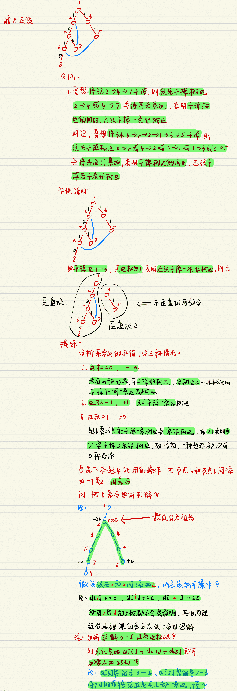

**代ç **

```c++
#include <iostream>
#include <cstring>
using namespace std;
const int N = 100010, M = 200010, K = 18;
int n, m, idx, ans;
int h[N], e[M], ne[M], depth[N], st[N], q[N], d[N];
int fa[N][K];
void add(int a, int b) {
    e[idx] = b;
    ne[idx] = h[a];
    h[a] = idx ++;
    return;
}
// 求depthå’Œfa模æ¿
void bfs() {
    memset(depth, 0x3f, sizeof depth);
    memset(st, false, sizeof st);
    int hh = 0, tt = -1;
    q[ ++ tt ] = 1;
    st[1] = true;
    depth[0] = 0, depth[1] = 1;
    while (hh <= tt) {
        int t = q[hh ++ ];
        for (int i = h[t]; i != -1; i = ne[i]) {
            int j = e[i];
            if (!st[j]) {
                depth[j] = depth[t] + 1;
                q[ ++ tt ] = j;
                st[j] = true;
                fa[j][0] = t;
                for (int k = 1; k <= 17; k ++ ) fa[j][k] = fa[fa[j][k - 1]][k - 1];
            }
        }
    }
    return;
}
// lca模æ¿
int lca(int a, int b) {
    if (depth[a] < depth[b]) swap(a, b);
    for (int k = 17; k >= 0; k -- )
        if (depth[fa[a][k]] >= depth[b])
            a = fa[a][k];
    if (a == b) return a;
    for (int k = 17; k >= 0; k -- )
        if (fa[a][k] != fa[b][k]) {
            a = fa[a][k];
            b = fa[b][k];
        }
    return fa[a][0];
}
int dfs(int u, int father) {
    int res = d[u];
    for (int i = h[u]; i != -1; i = ne[i]) {
        int j = e[i];
        if (j == father) continue;
        int s = dfs(j, u);
        // 计算到u到jè¿™æ¡è¾¹
        // åªéœ€ç´¯åŠ åˆ°jå³å¯ä¸éœ€è¦ç´¯åŠ åˆ°u[手写稿详细解释]
        if (s == 0) ans += m;
        else if (s == 1) ans ++;
        res += s;
    }
    return res;
}
int main() {
    scanf("%d%d", &n, &m);
    memset(h, -1, sizeof h);
    for (int i = 0; i < n - 1; i ++ ) {
        int a, b;
        scanf("%d%d", &a, &b);
        // åŒå‘è¾¹
        add(a, b);
        add(b, a);
    }
    // 求解lca所需è¦çš„depthå’Œfa函数
    bfs();
    for (int i = 0; i < m; i ++ ) {
        int a, b, root;
        scanf("%d%d", &a, &b);
        root = lca(a, b);
        // 树上差分
        d[a] ++, d[b] ++, d[root] -= 2;
    }
    // 求解答案
    dfs(1, -1);
    cout << ans << endl;
    return 0;
}
```

**时间å¤æ‚度**

$O(mlog_n)$

**空间å¤æ‚度**

$O(n)$

**标签**

`lca`ã€`树上差分`

**ç¼åˆæ€ª**


## 有å‘图的强è¿é€šåˆ†é‡

### åŸç†


### [AcWing 1174. å—欢è¿çš„牛](https://www.acwing.com/problem/content/1176/)

**题目æè¿°**

>   æ¯ä¸€å¤´ç‰›çš„愿望就是å˜æˆä¸€å¤´æœ€å—欢è¿çš„牛。
>
>   ç°åœ¨æœ‰ `N` 头牛，编å·ä» `1` 到 `N`，给你 `M` 对整数 `(A,B)`，表示牛 `A` 认为牛 `B` å—欢è¿ã€‚
>
>   è¿™ç§å…³ç³»æ˜¯å…·æœ‰ä¼ é€’æ€§çš„ï¼Œå¦‚æœ `A` 认为 `B` å—欢è¿ï¼Œ`B` 认为 `C` å—欢è¿ï¼Œé‚£ä¹ˆç‰› `A` 也认为牛 `C` å—欢è¿ã€‚
>
>   你的任务是求出有多少头牛被除自己之外的所有牛认为是å—欢è¿çš„。

**输入格å¼**

>   第一行两个数 `N,M`；
>
>   æ¥ä¸‹æ¥ `M` 行，æ¯è¡Œä¸¤ä¸ªæ•° `A,B`，æ„æ€æ˜¯ `A` 认为 `B` 是å—欢è¿çš„（给出的信æ¯æœ‰å¯èƒ½é‡å¤ï¼Œå³æœ‰å¯èƒ½å‡ºç°å¤šä¸ª `A,B`）。

**输出格å¼**

>   输出被除自己之外的所有牛认为是å—欢è¿çš„牛的数é‡ã€‚

**æ•°æ®èŒƒå›´**

>   +   $1≤N≤10^4,$
>   +   $1≤M≤5×10^4$

**输入样例**

```c++
3 3
1 2
2 1
2 3
```

**输出样例**

```c++
1
```

**样例解释**

>   åªæœ‰ç¬¬ä¸‰å¤´ç‰›è¢«é™¤è‡ªå·±ä¹‹å¤–的所有牛认为是å—欢è¿çš„。

**手写稿**

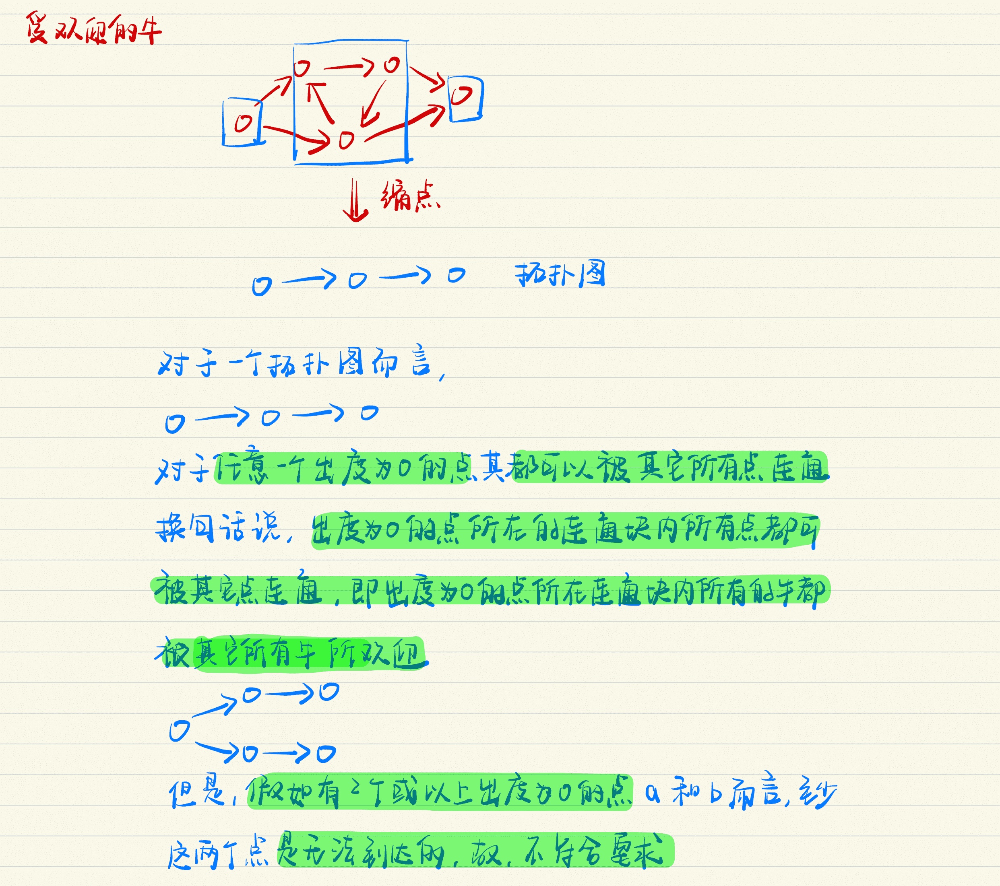

**代ç **

```c++
#include <iostream>
#include <cstring>
using namespace std;
const int N = 10010, M = 50010;
int n, m, idx, timestamp, top, scc_cnt;
int h[N], e[M], ne[M], dfn[N], low[N], stk[N], in_stk[N], id[N], sze[N], dout[N];
// 链å¼å‰å‘星
void add(int a, int b) {
    e[idx] = b;
    ne[idx] = h[a];
    h[a] = idx ++;
    return;
}
// 模æ¿
void tarjan(int u) {
    dfn[u] = low[u] = ++ timestamp;
    // å°†u进栈并且将u标记为已ç»å¤„äºæ ˆä¸­
    stk[top ++ ] = u, in_stk[u] = true;
    // éå†u的所有邻æ¥ç‚¹
    for (int i = h[u]; i != -1; i = ne[i]) {
        int j = e[i];
        // 如æœè¿˜æ²¡æœ‰è¢«éå†è¿‡
        if (!dfn[j]) {
            // éå†
            tarjan(j);
            // å–最å°å€¼
            low[u] = min(low[u], low[j]);
        }
        // 如æœå·²ç»å¤„äºæ ˆä¸­, æ›´æ–°low[u]的值
        else if (in_stk[j]) low[u] = min(low[u], dfn[j]);
    }
    // 如æœå½“å‰çš„强è¿é€šåˆ†é‡å†…所有点都已ç»è¢«éå†è¿‡
    if (low[u] == dfn[u]) {
        ++ scc_cnt; // è¿é€šåˆ†é‡ä¸ªæ•° ++
        int y;
        do {
            y = stk[ -- top]; // å–出栈顶
            in_stk[y] = false; // 标记为false, 表æ˜å·²ç»å‡ºæ ˆ
            id[y] = scc_cnt; // 标记当å‰ç‚¹å¤„äºå“ªä¸ªè¿é€šå—
            sze[scc_cnt] ++; // 当å‰è¿é€šå—内部点 ++ 
        } while(y != u); // 当两者相等时结æŸ
    }
    return;
}
int main() {
    scanf("%d%d", &n, &m);
    memset(h, -1, sizeof h);
    for (int i = 0; i < m; i ++ ) {
        int a, b;
        scanf("%d%d", &a, &b);
        add(a, b);
    }
    for (int i = 1; i <= n; i ++ )
        // 如æœi还没有被éå†è¿‡, 则éå†
        if (!dfn[i])
            tarjan(i);
    for (int i = 1; i <= n; i ++ )
        for (int j = h[i]; j != -1; j = ne[j]) {
            int k = e[j];
            // è·å–点i所在的è¿é€šå—ç¼–å·
            // è·å–点k所在的è¿é€šå—ç¼–å·
            int a = id[i], b = id[k];
            // 如æœç‚¹i和点kä¸åœ¨åŒä¸€ä¸ªè¿é€šå—内,则更新a的出度
            if (a != b) dout[a] ++;
        }
    int zero = 0, sum = 0;
    for (int i = 1; i <= scc_cnt; i ++ ) {
        // 如æœè¿é€šå—i的出度ä¸ä¸º0, 则进行下一次循ç¯
        if (dout[i]) continue;
        // 出度为0çš„è¿é€šå—æ•°é‡ ++
        zero ++;
        // ç‚¹æ•°é‡ + sze[i]
        sum += sze[i];
        // 如æœå‡ºåº¦ä¸º0çš„è¿é€šå—çš„æ•°é‡å¤šäº1个, 则说æ˜ä¸å­˜åœ¨åˆæ³•æ¡ä»¶
        if (zero > 1) {
            sum = 0;
            break;
        }
    }
    cout << sum << endl;
    return 0;
}
```

**时间å¤æ‚度**

$O(n)$

**空间å¤æ‚度**

$O(n)$

**标签**

`Tarjan`ã€`强è¿é€šåˆ†é‡`

**ç¼åˆæ€ª**


### [AcWing 367. 学校网络](https://www.acwing.com/problem/content/369/)

**题目æè¿°**

>   一些学校è¿æ¥åœ¨ä¸€ä¸ªè®¡ç®—机网络上，学校之间存在软件支æ´å议，æ¯ä¸ªå­¦æ ¡éƒ½æœ‰å®ƒåº”支æ´çš„学校åå•ï¼ˆå­¦æ ¡ `A` 支æ´å­¦æ ¡ `B`，并ä¸è¡¨ç¤ºå­¦æ ¡ `B` 一定è¦æ”¯æ´å­¦æ ¡ `A`）。
>
>   当æŸæ ¡è·å¾—一个新软件时，无论是直æ¥è·å¾—还是通过网络è·å¾—，该校都应立å³å°†è¿™ä¸ªè½¯ä»¶é€šè¿‡ç½‘络传é€ç»™å®ƒåº”支æ´çš„学校。
>
>   因此，一个新软件若想让所有学校都能使用，åªéœ€å°†å…¶æ供给一些学校å³å¯ã€‚
>
>   ç°åœ¨è¯·é—®æœ€å°‘需è¦å°†ä¸€ä¸ªæ–°è½¯ä»¶ç›´æ¥æ供给多少个学校，æ‰èƒ½ä½¿è½¯ä»¶èƒ½å¤Ÿé€šè¿‡ç½‘络被传é€åˆ°æ‰€æœ‰å­¦æ ¡ï¼Ÿ
>
>   最少需è¦æ·»åŠ å‡ æ¡æ–°çš„支æ´å…³ç³»ï¼Œä½¿å¾—将一个新软件æ供给任何一个学校，其他所有学校就都å¯ä»¥é€šè¿‡ç½‘络è·å¾—该软件？

**输入格å¼**

>   第 `1` 行包å«æ•´æ•° `N`，表示学校数é‡ã€‚
>
>   第 `2..N+1` 行，æ¯è¡ŒåŒ…å«ä¸€ä¸ªæˆ–多个整数，第 `i+1` 行表示学校 `i` 应该支æ´çš„学校åå•ï¼Œæ¯è¡Œæœ€å都有一个 `0` 表示åå•ç»“æŸï¼ˆåªæœ‰ä¸€ä¸ª `0` å³è¡¨ç¤ºè¯¥å­¦æ ¡æ²¡æœ‰éœ€è¦æ”¯æ´çš„学校）。

**输出格å¼**

>   输出两个问题的结æœï¼Œæ¯ä¸ªç»“æœå ä¸€è¡Œã€‚

**æ•°æ®èŒƒå›´**

>   +   $2≤N≤100$

**输入样例**

```c++
5
2 4 3 0
4 5 0
0
0
1 0
```

**输出样例**

```c++
1
2 
```

**手写稿**

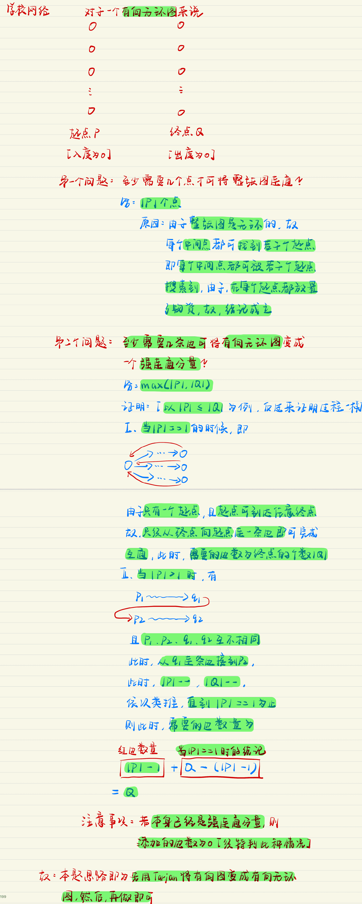

**代ç **

```c++
#include <iostream>
#include <cstring>
using namespace std;
const int N = 110, M = 10010;
int n, idx, top, timestamp, scc_cnt;
int h[N], e[M], ne[M], dfn[N], low[N], stk[N], in_stk[N], id[N], din[N], dout[N];
void add(int a, int b) {
    e[idx] = b;
    ne[idx] = h[a];
    h[a] = idx ++;
    return;
}
// tarjan模æ¿
void tarjan(int u) {
    dfn[u] = low[u] = ++ timestamp;
    stk[ ++ top ] = u, in_stk[u] = true;
    for (int i = h[u]; i != -1; i = ne[i]) {
        int j = e[i];
        if (!dfn[j]) {
            tarjan(j);
            low[u] = min(low[u], low[j]);
        }
        else if (in_stk[j]) low[u] = min(low[u], dfn[j]);
    }
    if (low[u] == dfn[u]) {
        // è¿é€šå—下标ä»1开始
        ++ scc_cnt;
        int y;
        do {
            y = stk[top -- ];
            in_stk[y] = false;
            id[y] = scc_cnt;
        } while (y != u);
    }
    return;
}

int main() {
    scanf("%d", &n);
    memset(h, -1, sizeof h);
    for (int i = 1, a; i <= n; i ++ )
        while (~scanf("%d", &a), a)
            add(i, a);
    for (int i = 1; i <= n; i ++ )
        // 如æœå½“å‰ç‚¹è¿˜æ²¡æœ‰è¢«éå†è¿‡, 则éå†æ­¤ç‚¹
        if (!dfn[i])
            tarjan(i);
    for (int i = 1; i <= n; i ++ )
        for (int j = h[i]; j != -1; j = ne[j]) {
            int k = e[j];
            int a = id[i], b = id[k];
            if (a == b) continue;
            dout[a] ++;
            din[b] ++;
        }
    int a = 0, b = 0;
    // éå†æ‰€æœ‰çš„è¿é€šå—, 下标ä»1开始
    for (int i = 1; i <= scc_cnt; i ++ ) {
        if (!dout[i]) a ++;
        if (!din[i]) b ++;
    }
    cout << b << endl;
    if (scc_cnt == 1) puts("0");
    else cout << max(a, b) << endl;
    return 0;
}
```

**时间å¤æ‚度**

$O(n)$

**空间å¤æ‚度**

$O(n)$

**标签**

`Tarjan`ã€`强è¿é€šåˆ†é‡`

**ç¼åˆæ€ª**


### [AcWing 1175. 最大åŠè¿é€šå­å›¾](https://www.acwing.com/problem/content/1177/)

**题目æè¿°**

>   一个**有å‘**图 `G=(V,E)` 称为åŠè¿é€šçš„ `(Semi-Connected)`，如æœæ»¡è¶³ï¼š`∀u,v∈V`，满足 `u→v` 或 `v→u`，å³å¯¹äºå›¾ä¸­ä»»æ„两点 `u,v`ï¼Œå­˜åœ¨ä¸€æ¡ `u` 到 `v` 的有å‘è·¯å¾„æˆ–è€…ä» `v` 到 `u` 的有å‘路径。
>
>   è‹¥ `G′=(V′,E′)` 满足，`E′` 是 `E` 中所有和 `V′` 有关的边，则称 `G′` 是 `G` 的一个导出å­å›¾ã€‚
>
>   è‹¥ `G′` 是 `G` 的导出å­å›¾ï¼Œä¸” `G′` åŠè¿é€šï¼Œåˆ™ç§° `G′` 为 `G` çš„åŠè¿é€šå­å›¾ã€‚
>
>   è‹¥ `G′` 是 `G` 所有åŠè¿é€šå­å›¾ä¸­åŒ…å«èŠ‚点数最多的，则称 `G′` 是 `G` 的最大åŠè¿é€šå­å›¾ã€‚
>
>   给定一个有å‘图 `G`，请求出 `G` 的最大åŠè¿é€šå­å›¾æ‹¥æœ‰çš„节点数 `K`，以åŠä¸åŒçš„最大åŠè¿é€šå­å›¾çš„æ•°ç›® `C`。
>
>   ç”±äº `C` å¯èƒ½æ¯”较大，仅è¦æ±‚输出 `C` 对 `X` 的余数。

**输入格å¼**

>   第一行包å«ä¸‰ä¸ªæ•´æ•° `N,M,X`。`N,M` 分别表示图 `G` 的点数ä¸è¾¹æ•°ï¼Œ`X` çš„æ„义如上文所述；
>
>   æ¥ä¸‹æ¥ `M` 行，æ¯è¡Œä¸¤ä¸ªæ­£æ•´æ•° `a,b`，表示一æ¡æœ‰å‘è¾¹ `(a,b)`。
>
>   图中的æ¯ä¸ªç‚¹å°†ç¼–å·ä¸º `1` 到 `N`，ä¿è¯è¾“入中åŒä¸€ä¸ª `(a,b)` ä¸ä¼šå‡ºç°ä¸¤æ¬¡ã€‚

**输出格å¼**

>   应包å«ä¸¤è¡Œã€‚
>
>   第一行包å«ä¸€ä¸ªæ•´æ•° `K`，第二行包å«æ•´æ•° `C mod X`。

**æ•°æ®èŒƒå›´**

>   +   $1≤N≤10^5,$
>   +   $1≤M≤10^6,$
>   +   $1≤X≤10^8$

**输入样例**

```c++
6 6 20070603
1 2
2 1
1 3
2 4
5 6
6 4
```

**输出样例**

```c++
3
3
```

**手写稿**


**代ç **

```c++
#include <iostream>
#include <cstring>
#include <unordered_set>
using namespace std;
typedef long long LL;
const int N = 100010, M = 2000010;
int n, m, mod, idx, timestamp, top, scc_cnt;
int h[N], hs[N], e[M], ne[M], dfn[N], low[N], stk[N], in_stk[N], id[N], scc_size[N], f[N], g[N];
unordered_set<LL> hx;
// 加边模æ¿
void add(int h[], int a, int b) {
    e[idx] = b;
    ne[idx] = h[a];
    h[a] = idx ++;
    return;
}
// Tarjan模æ¿
void tarjan(int u) {
    // 时间戳
    dfn[u] = low[u] = ++ timestamp;
    // 入栈并标记其已在栈中
    stk[ ++ top] = u, in_stk[u] = true;
    // éå†u的所有邻边
    for (int i = h[u]; i != -1; i = ne[i]) {
        int j = e[i];
        // 如æœj还没有被éå†è¿‡
        if (!dfn[j]) {
            // éå†j
            tarjan(j);
            // 更新u能走到的最旧的时间戳
            low[u] = min(low[u], low[j]);
        }
        // 如æœj已在栈中, 则直æ¥æ›´æ–°u能走到的最旧的时间戳
        else if (in_stk[j]) low[u] = min(low[u], dfn[j]);
    }
    // 如æœä¸€ä¸ªè¿é€šå—已被éå†å®Œ
    if (dfn[u] == low[u]) {
        int y;
        // ++ è¿é€šå—ç¼–å·
        ++ scc_cnt;
        do {
            // å–出栈顶
            y = stk[top -- ];
            // 标记为ä¸åœ¨æ ˆä¸­
            in_stk[y] = false;
            // 标记当å‰ç‚¹çš„è¿é€šå—çš„ç¼–å·
            id[y] = scc_cnt;
            // 当å‰è¿é€šå—çš„æ•°é‡ ++
            scc_size[scc_cnt] ++;
        } while (y != u);
    }
    return;
}
int main() {
    scanf("%d%d%d", &n, &m, &mod);
    memset(h, -1, sizeof h);
    memset(hs, -1, sizeof hs);
    for (int i = 0; i < m; i ++ ) {
        int a, b;
        scanf("%d%d", &a, &b);
        add(h, a, b);
    }
    for (int i = 1; i <= n; i ++ )
        if (!dfn[i])
            tarjan(i);
    for (int i = 1; i <= n; i ++ )
        for (int j = h[i]; j != -1; j = ne[j]) {
            int k = e[j];
            // è·å–点içš„è¿é€šå—ç¼–å·
            // è·å–点kçš„è¿é€šå—ç¼–å·
            int a = id[i], b = id[k];
            // 哈希
            LL t = a * 1000000ll + b;
            if (a != b && !hx.count(t)) {
                add(hs, a, b);
                hx.insert(t);
            }
        }
    // 倒åºä¸€å®šå°±æ˜¯æ‹“扑åº[手写稿解释]
    for (int i = scc_cnt; i; i -- ) {
        // 如æœè¿é€šå—i没有被更新, 则更新
        if (!f[i]) {
            // 更新最长路径
            f[i] = scc_size[i];
            // 更新个数
            g[i] = 1;
        }
        // éå†è¿é€šå—i的所有邻边
        for (int j = hs[i]; j != -1; j = ne[j]) {
            int k = e[j];
            // 更新看[手写稿]
            if (f[i] + scc_size[k] > f[k]) {
                f[k] = f[i] + scc_size[k];
                g[k] = g[i];
            }
            else if (f[i] + scc_size[k] == f[k])
                g[k] = (g[k] + g[i]) % mod;
        }
    }
    int maxf = -1, sum = 0;
    for (int i = 1; i <= scc_cnt; i ++ )
        if (f[i] > maxf) {
            maxf = f[i];
            sum = g[i];
        }
        else if (f[i] == maxf) sum = (sum + g[i]) % mod;
    printf("%d\n%d\n", maxf, sum);
    return 0;
}
```

**时间å¤æ‚度**

$O(m)$

**空间å¤æ‚度**

$O(n)$

**标签**

`Tarjan`ã€`拓扑æ’åº`

**ç¼åˆæ€ª**


### [AcWing 368. 银河](https://www.acwing.com/problem/content/370/)

**题目æè¿°**

>   银河中的æ’星浩如烟海，但是我们åªå…³æ³¨é‚£äº›æœ€äº®çš„æ’星。
>
>   我们用一个正整数æ¥è¡¨ç¤ºæ’星的亮度，数值越大则æ’星就越亮，æ’星的亮度最暗是 `1`。
>
>   ç°åœ¨å¯¹äº `N` 颗我们关注的æ’星，有 `M` 对亮度之间的相对关系已ç»åˆ¤æ˜ã€‚
>
>   你的任务就是求出这 `N` 颗æ’星的亮度值总和至少有多大。

**输入格å¼**

>   第一行给出两个整数 `N` 和 `M`。
>
>   之å `M` 行，æ¯è¡Œä¸‰ä¸ªæ•´æ•° `T,A,B`，表示一对æ’星 `(A,B)` 之间的亮度关系。æ’星的编å·ä» `1` 开始。
>
>   å¦‚æœ `T=1`ï¼Œè¯´æ˜ `A` å’Œ `B` 亮度相等。
>   å¦‚æœ `T=2`ï¼Œè¯´æ˜ `A` 的亮度å°äº `B` 的亮度。
>   å¦‚æœ `T=3`ï¼Œè¯´æ˜ `A` 的亮度ä¸å°äº `B` 的亮度。
>   å¦‚æœ `T=4`ï¼Œè¯´æ˜ `A` çš„äº®åº¦å¤§äº `B` 的亮度。
>   å¦‚æœ `T=5`ï¼Œè¯´æ˜ `A` 的亮度ä¸å¤§äº `B` 的亮度。

**输出格å¼**

>   输出一个整数表示结æœã€‚
>
>   若无解，则输出 `−1`。

**æ•°æ®èŒƒå›´**

>   +   $N≤100000,M≤100000$

**输入样例**

```c++
5 7 
1 1 2 
2 3 2 
4 4 1 
3 4 5 
5 4 5 
2 3 5 
4 5 1 
```

**输出样例**

```c++
11
```

**手写稿**


**代ç **

```c++
#include <iostream>
#include <algorithm>
#include <cstring>
using namespace std;
typedef long long LL;
const int N = 100010, M = 600010;
int n, m, idx, top, timestamp, scc_cnt;
int h[N], hs[N], e[M], w[M], ne[M], dfn[N], low[N], stk[N], in_stk[N], id[N], sz[N], dist[N];
// 加边函数
void add(int h[], int a, int b, int c) {
    e[idx] = b;
    w[idx] = c;
    ne[idx] = h[a];
    h[a] = idx ++;
    return;
}
// Tarjan模æ¿
void tarjan(int u) {
    dfn[u] = low[u] = ++ timestamp;
    stk[ ++ top ] = u, in_stk[u] = true;
    for (int i = h[u]; i != -1; i = ne[i]) {
        int j = e[i];
        if (!dfn[j]) {
            tarjan(j);
            low[u] = min(low[u], low[j]);
        }
        else if (in_stk[j]) low[u] = min(low[u], dfn[j]);
    }
    if (low[u] == dfn[u]) {
        ++ scc_cnt;
        int y;
        do {
            y = stk[top -- ];
            in_stk[y] = false;
            id[y] = scc_cnt;
            sz[scc_cnt] ++;
        } while (y != u);
    }
    return;
}
int main() {
    scanf("%d%d", &n, &m);
    memset(h, -1, sizeof h);
    memset(hs, -1, sizeof hs);
    // 建立超级æºç‚¹
    for (int i = 1; i <= n; i ++ ) add(h, 0, i, 1);
    // 约æŸæ¡ä»¶
    for (int i = 0; i < m; i ++ ) {
        int t, a, b;
        scanf("%d%d%d", &t, &a, &b);
        if (t == 1) add(h, b, a, 0), add(h, a, b, 0);
        else if (t == 2) add(h, a, b, 1);
        else if (t == 3) add(h, b, a, 0);
        else if (t == 4) add(h, b, a, 1);
        else add(h, a, b, 0);
    }
    // 求强è¿é€šåˆ†é‡
    tarjan(0);
    int flag = true;
    // éå†æ‰€æœ‰ç‚¹, ä»0开始
    for (int i = 0; i <= n; i ++ ) {
        // éå†æ‰€æœ‰é‚»è¾¹
        for (int j = h[i]; j != -1; j = ne[j]) {
            int k = e[j];
            // è·å–点içš„è¿é€šå—ç¼–å·
            // è·å–点kçš„è¿é€šå—ç¼–å·
            int a = id[i], b = id[k];
            // 如æœåœ¨åŒä¸€ä¸ªè¿é€šå—内部且æƒå€¼å¤§äº0, 则无解[手写稿]
            if (a == b && w[j] > 0) {
                flag = false;
                break;
            }
            // 两个è¿é€šå—之间å¯èƒ½ä¼šæœ‰å¤šæ¡è¾¹è¿›è¡Œè¿æ¥, æ¯æ¡è¾¹éƒ½éœ€è¦æ·»åŠ [手写稿]
            if (a != b) add(hs, a, b, w[j]);
        }
        if (!flag) break;
    }
    if (!flag) puts("-1");
    else {
        // 倒åºéå†æ¯ä¸ªè¿é€šå—[å³ä¸ºæ‹“扑顺åº]
        for (int i = scc_cnt; i; i -- )
            // éå†è¿é€šå—çš„æ¯ä¸ªé‚»è¿é€šå—
            for (int j = hs[i]; j != -1; j = ne[j]) {
                int k = e[j];
                // æ›´æ–°è·ç¦»
                dist[k] = max(dist[k], dist[i] + w[j]);
            }
        LL res = 0;
        // å…¬å¼[手写稿]
        for (int i = 1; i <= scc_cnt; i ++ ) res += (LL)dist[i] * sz[i];
        printf("%lld\n", res);
    }
    return 0;
}
```

**时间å¤æ‚度**

$O(m)$

**空间å¤æ‚度**

$O(m)$

**标签**

`Tarjan`ã€`差分约æŸ`ã€`强è¿é€šåˆ†é‡`

**ç¼åˆæ€ª**


## æ— å‘图的åŒè¿é€šåˆ†é‡

### åŸç†


### [AcWing 395. 冗余路径](https://www.acwing.com/problem/content/397/)

**题目æè¿°**

>   ä¸ºäº†ä» `F` 个è‰åœºä¸­çš„一个走到å¦ä¸€ä¸ªï¼Œå¥¶ç‰›ä»¬æœ‰æ—¶ä¸å¾—ä¸è·¯è¿‡ä¸€äº›å¥¹ä»¬è®¨åŒçš„å¯æ€•çš„树。
>
>   奶牛们已ç»åŒå€¦äº†è¢«è¿«èµ°æŸä¸€æ¡è·¯ï¼Œæ‰€ä»¥å¥¹ä»¬æƒ³å»ºä¸€äº›æ–°è·¯ï¼Œä½¿æ¯ä¸€å¯¹è‰åœºä¹‹é—´éƒ½ä¼šè‡³å°‘有两æ¡ç›¸äº’分离的路径，这样她们就有多一些选择。
>
>   æ¯å¯¹è‰åœºä¹‹é—´å·²ç»æœ‰è‡³å°‘一æ¡è·¯å¾„。
>
>   给出所有 `R` æ¡åŒå‘路的æ述，æ¯æ¡è·¯è¿æ¥äº†ä¸¤ä¸ªä¸åŒçš„è‰åœºï¼Œè¯·è®¡ç®—最少的新建é“路的数é‡ï¼Œè·¯å¾„由若干é“路首尾相è¿è€Œæˆã€‚
>
>   两æ¡è·¯å¾„相互分离，是指两æ¡è·¯å¾„没有一æ¡é‡åˆçš„é“路。
>
>   但是，两æ¡åˆ†ç¦»çš„路径上å¯ä»¥æœ‰ä¸€äº›ç›¸åŒçš„è‰åœºã€‚
>
>   对äºåŒä¸€å¯¹è‰åœºä¹‹é—´ï¼Œå¯èƒ½å·²ç»æœ‰ä¸¤æ¡ä¸åŒçš„é“路，你也å¯ä»¥åœ¨å®ƒä»¬ä¹‹é—´å†å»ºä¸€æ¡é“路，作为å¦ä¸€æ¡ä¸åŒçš„é“路。

**输入格å¼**

>   第 `1` 行输入 `F` 和 `R`。
>
>   æ¥ä¸‹æ¥ `R` 行，æ¯è¡Œè¾“入两个整数，表示两个è‰åœºï¼Œå®ƒä»¬ä¹‹é—´æœ‰ä¸€æ¡é“路。

**输出格å¼**

>   输出一个整数，表示最少的需è¦æ–°å»ºçš„é“路数。

**æ•°æ®èŒƒå›´**

>   +   $1≤F≤5000,$
>   +   $F−1≤R≤10000$

**输入样例**

```c++
7 7
1 2
2 3
3 4
2 5
4 5
5 6
5 7
```

**输出样例**

```c++
2
```

**手写稿**


**代ç **

```c++
#include <iostream>
#include <cstring>
using namespace std;
const int N = 5010, M = 20010;
int n, m, idx, timestamp, top, dcc_cnt;
int h[N], e[M], ne[M], dfn[N], low[N], stk[N], is_bridge[M], id[N], d[N];
// 加边函数
void add(int a, int b) {
    e[idx] = b;
    ne[idx] = h[a];
    h[a] = idx ++;
    return;
}
// from记录的是边, ä¸æ˜¯ç‚¹
void tarjan(int u, int from) {
    // 时间戳
    dfn[u] = low[u] = ++ timestamp;
    // 入栈
    stk[++ top] = u;
    // éå†u的所有邻边
    for (int i = h[u]; i != -1; i = ne[i]) {
        int j = e[i];
        // 如æœç‚¹j没有被éå†è¿‡
        if (!dfn[j]) {
            // 注æ„: 这里的fromä¸æ˜¯u, ä¸æ˜¯çˆ¶èŠ‚点father
            // 而是, 这里的from记录的是边
            tarjan(j, i);
            // 更新low值
            low[u] = min(low[u], low[j]);
            // 如æœç‚¹j无论如何也走ä¸åˆ°u之å‰, 则说æ˜å…¶æ˜¯æ¡¥
            if (low[j] > dfn[u])
                // 注æ„: 这里的边是æˆå¯¹å‡ºç°çš„
                // å³: 0 -> 1, 其下标为0, 1 -> 0, 其下标为1, 奇å¶äº¤æ›¿
                // æ•…: 标记桥的è¯, 两æ¡è¾¹éƒ½è¦è¿›è¡Œæ ‡è®°
                is_bridge[i] = is_bridge[i ^ 1] = true;
        }
        // 交替
        // 奇数 ^ 1 == 奇数 - 1 ==> 1 ^ 1 == 0, 1çš„åå‘边正好为0
        // å¶æ•° ^ 1 == å¶æ•° + 1 ==> 0 ^ 1 == 1, 0çš„åå‘边正好为1
        // 完ç¾ç¬¦åˆæ¡ä»¶
        // 更新low的值
        // æ¯æ¡è¾¹åªèƒ½èµ°ä¸€æ¬¡, è¦ä¹ˆèµ°æ­£å‘è¾¹è¦ä¹ˆèµ°åå‘è¾¹
        // å¦åˆ™, 0-1也是边åŒè¿é€šåˆ†é‡äº†, 但是, 显示ä¸æ˜¯
        // 人家就一æ¡è¾¹, ä½ é当æˆä¸¤æ¡è¾¹æ¥ç”¨, æ˜æ˜¾ä¸åˆç†
        else if (i != (from ^ 1)) low[u] = min(low[u], dfn[j]);
    }
    // åªèƒ½èµ°åˆ°è‡ªå·±, 说æ˜æ˜¯æ¡¥
    if (dfn[u] == low[u]) {
        // åŒè¿é€šåˆ†é‡çš„个数 ++
        ++ dcc_cnt;
        int y;
        do {
            // å–出栈顶
            y = stk[top -- ];
            // 标记当å‰å…ƒç´ æ‰€åœ¨çš„è¿é€šå—ç¼–å·ä¸ºdcc_cnt
            id[y] = dcc_cnt;
        } while(y != u);
    }
    return;
}
int main() {
    scanf("%d%d", &n, &m);
    memset(h, -1, sizeof h);
    for (int i = 0; i < m; i ++ ) {
        int a, b;
        scanf("%d%d", &a, &b);
        add(a, b);
        add(b, a);
    }
    tarjan(1, -1);
    // éå†æ‰€æœ‰è¾¹, 包括正å‘边和åå‘è¾¹
    // 例如: a - b, 则有, a的度数为1, b的度数也为1, æ— å‘图åªæœ‰åº¦æ•°, 没有入度和出度之说
    // a -> b说æ˜b的度数++
    // b -> a说æ˜a的度数++
    // 完ç¾ç¬¦åˆæ¡ä»¶
    for (int i = 0; i < idx; i ++ )
        // 如æœæ˜¯æ¡¥, 则统计度数
        if (is_bridge[i])
            d[id[e[i]]] ++;
    int cnt = 0;
    for (int i = 1; i <= dcc_cnt; i ++ )
        // 统计所有度为1的节点, 也就是å¶å­èŠ‚点
        if (d[i] == 1) cnt ++;
    // 结论
    cout << ++ cnt / 2 << endl;
    return 0;
}
```

**时间å¤æ‚度**

$O(m)$

**空间å¤æ‚度**

$O(m)$

**标签**

`Tarjan`ã€`è¾¹åŒè¿é€šåˆ†é‡`

**ç¼åˆæ€ª**


### [AcWing 1183. 电力](https://www.acwing.com/problem/content/1185/)

**题目æè¿°**

>   给定一个由 `n` 个点 `m` æ¡è¾¹æ„æˆçš„**æ— å‘**图，请你求出该图删除一个点之å，è¿é€šå—最多有多少。

**输入格å¼**

>   输入包å«å¤šç»„æ•°æ®ã€‚
>
>   æ¯ç»„æ•°æ®ç¬¬ä¸€è¡ŒåŒ…å«ä¸¤ä¸ªæ•´æ•° `n,m`。
>
>   æ¥ä¸‹æ¥ `m` 行，æ¯è¡ŒåŒ…å«ä¸¤ä¸ªæ•´æ•° `a,b`，表示 `a,b` 两点之间有边è¿æ¥ã€‚
>
>   æ•°æ®ä¿è¯æ— é‡è¾¹ã€‚
>
>   点的编å·ä» `0` 到 `n−1`。
>
>   读入以一行 `0 0` 结æŸã€‚

**输出格å¼**

>   æ¯ç»„æ•°æ®è¾“出一个结æœï¼Œå ä¸€è¡Œï¼Œè¡¨ç¤ºè¿é€šå—的最大数é‡ã€‚

**æ•°æ®èŒƒå›´**

>   +   $1≤n≤10000,$
>   +   $0≤m≤15000,$
>   +   $0≤a,b<n$

**输入样例**

```c++
3 3
0 1
0 2
2 1
4 2
0 1
2 3
3 1
1 0
0 0
```

**输出样例**

```c++
1
2
2
```

**手写稿**

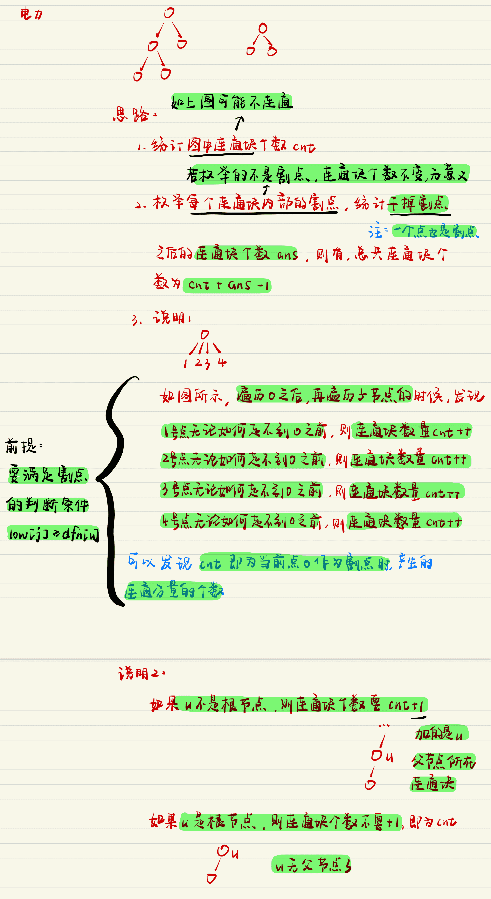

**代ç **

```c++
#include <iostream>
#include <cstring>
using namespace std;
const int N = 10010, M = 30010;
int n, m, idx, timestamp, ans, root;
int h[N], e[M], ne[M], dfn[N], low[N];
void add(int a, int b) {
    e[idx] = b;
    ne[idx] = h[a];
    h[a] = idx ++;
    return;
}
void tarjan(int u) {
    dfn[u] = low[u] = ++ timestamp;
    int cnt = 0;
    for (int i = h[u]; i != -1; i = ne[i]) {
        int j = e[i];
        if (!dfn[j]) {
            tarjan(j);
            low[u] = min(low[u], low[j]);
            // 满足割点的æ¡ä»¶
            // æ¯äº§ç”Ÿä¸€ä¸ªè¢«å µåœ¨u之å‰çš„节点, 则è¿é€šå—æ•°é‡ ++
            // 说æ˜u是割点, åŸå› : j被堵在u之å‰, 过ä¸æ¥
            // 手写稿说æ˜
            if (low[j] >= dfn[u]) cnt ++;
        }
        else low[u] = min(low[u], dfn[j]);
    }
    // 手写稿说æ˜
    if (u != root && cnt) cnt ++;
    ans = max(ans, cnt);
    return;
}
int main() {
    while (scanf("%d%d", &n, &m), n || m) {
        memset(h, -1, sizeof h);
        memset(dfn, 0, sizeof dfn);
        memset(low, 0, sizeof low);
        idx = timestamp = 0;
        for (int i = 0; i < m; i ++) {
            int a, b;
            scanf("%d%d", &a, &b);
            add(a, b);
            add(b, a);
        }
        // 统计所有è¿é€šå—æ•°é‡, 因为, 图å¯èƒ½ä¸è¿é€š
        int cnt = 0;
        // é‡ç½®å˜é‡
        ans = 0;
        for (root = 0; root < n; root ++ )
            if (!dfn[root]) {
                // è¿é€šå—æ•°é‡ ++
                cnt ++;
                tarjan(root);
            }
        printf("%d\n", cnt + ans - 1);
    }
    return 0;
}
```

**时间å¤æ‚度**

$O(n)$

**空间å¤æ‚度**

$O(n)$

**标签**

`Tarjan`ã€`割点`

**ç¼åˆæ€ª**


### [AcWing 396. 矿场æ­å»º](https://www.acwing.com/problem/content/398/)

**题目æè¿°**

>   煤矿工地å¯ä»¥çœ‹æˆæ˜¯ç”±éš§é“è¿æ¥æŒ–煤点组æˆçš„æ— å‘图。
>
>   为安全起è§ï¼Œå¸Œæœ›åœ¨å·¥åœ°å‘生事故时所有挖煤点的工人都能有一æ¡å‡ºè·¯é€ƒåˆ°æ•‘æ´å‡ºå£å¤„。
>
>   äºæ˜¯çŸ¿ä¸»å†³å®šåœ¨æŸäº›æŒ–煤点设立救æ´å‡ºå£ï¼Œä½¿å¾—无论哪一个挖煤点å塌之å，其他挖煤点的工人都有一æ¡é“路通å‘æ•‘æ´å‡ºå£ã€‚
>
>   请写一个程åºï¼Œç”¨æ¥è®¡ç®—至少需è¦è®¾ç½®å‡ ä¸ªæ•‘æ´å‡ºå£ï¼Œä»¥åŠä¸åŒæœ€å°‘æ•‘æ´å‡ºå£çš„设置方案总数。

**输入格å¼**

>   输入文件有若干组数æ®ï¼Œæ¯ç»„æ•°æ®çš„第一行是一个正整数 `N`，表示工地的隧é“数。
>
>   æ¥ä¸‹æ¥çš„ `N` è¡Œæ¯è¡Œæ˜¯ç”¨ç©ºæ ¼éš”开的两个整数 `S` å’Œ `T`，表示挖煤点 `S` ä¸æŒ–煤点 `T` 由隧é“ç›´æ¥è¿æ¥ã€‚
>
>   注æ„，æ¯ç»„æ•°æ®çš„挖煤点的编å·ä¸º `1∼Max`，其中 `Max` 表示由隧é“è¿æ¥çš„挖煤点中，编å·æœ€å¤§çš„挖煤点的编å·ï¼Œå¯èƒ½å­˜åœ¨æ²¡æœ‰è¢«éš§é“è¿æ¥çš„挖煤点。
>
>   输入数æ®ä»¥ `0` 结尾。

**输出格å¼**

>   æ¯ç»„æ•°æ®è¾“出结æœå ä¸€è¡Œã€‚
>
>   其中第 `i` 行以 `Case i:` 开始（注æ„大å°å†™ï¼Œ`Case` ä¸ `i` 之间有空格，`i` ä¸ `:` 之间无空格，`:` 之å有空格）。
>
>   å…¶å是用空格隔开的两个正整数，第一个正整数表示对äºç¬¬ `i` 组输入数æ®è‡³å°‘需è¦è®¾ç½®å‡ ä¸ªæ•‘æ´å‡ºå£ï¼Œç¬¬äºŒä¸ªæ­£æ•´æ•°è¡¨ç¤ºå¯¹äºç¬¬ `i` 组输入数æ®ä¸åŒæœ€å°‘æ•‘æ´å‡ºå£çš„设置方案总数。
>
>   输入数æ®ä¿è¯ç­”案å°äº $2^{64}$，输出格å¼å‚照以下输入输出样例。

**æ•°æ®èŒƒå›´**

>   +   $1≤N≤500，$
>   +   $1≤Max≤1000$

**输入样例**

```c++
9
1  3
4  1
3  5
1  2
2  6
1  5
6  3
1  6
3  2
6
1  2
1  3
2  4
2  5
3  6
3  7
0
```

**输出样例**

```c++
Case 1: 2 4
Case 2: 4 1
```

**手写稿**


**代ç **

```c++
#include <iostream>
#include <cstring>
#include <algorithm>
#include <vector>
using namespace std;
typedef unsigned long long ULL;
const int N = 1010, M = 2010;
int T, n, m, idx, timestamp, top, dcc_cnt, root;
int h[N], e[M], ne[M], dfn[N], low[N], stk[N], cut[N];
vector<int> dcc[N];
void add(int a, int b) {
    e[idx] = b;
    ne[idx] = h[a];
    h[a] = idx ++;
    return;
}
void tarjan(int u) {
    dfn[u] = low[u] = ++ timestamp;
    stk[ ++ top] = u;
    if (u == root && h[u] == -1) { // 孤立点, å•ä¸ªç‚¹ä¹Ÿæ˜¯ç‚¹åŒè¿é€šåˆ†é‡
        // è¿é€šå—ç¼–å· â• 1  
        dcc_cnt ++;
        // 将当å‰ç‚¹æ·»åŠ åˆ°å½“å‰è¿é€šå—内部
        dcc[dcc_cnt].push_back(u);
        // è¿”å›å³å¯
        return;
    }
    int cnt = 0; // 统计干æ‰å‰²ç‚¹åçš„è¿é€šå—个数
    // éå†æ‰€æœ‰é‚»è¾¹
    for (int i = h[u]; i != -1; i = ne[i]) {
        // è·å–点
        int j = e[i];
        // 如æœç‚¹j没有被访问过
        if (!dfn[j]) {
            // æ它
            tarjan(j);
            // 更新u的low值
            low[u] = min(low[u], low[j]);
            // 如æœç‚¹j无论如何也走ä¸åˆ°u的上部
            // 则说æ˜ç‚¹j所在的è¿é€šå—是uçš„æ–°ğŸ (新分支)
            if (low[j] >= dfn[u]) {
                // è¿é€šå—æ•°é‡ ++ 
                cnt ++;
                // 如æœuä¸æ˜¯æ ¹ç»“点或者uçš„åˆ†æ”¯æ•°é‡ > 1, 则说æ˜æ˜¯å‰²ç‚¹
                if (u != root || cnt > 1) cut[u] = true;
                // 缩点之åçš„è¿é€šå—æ•°é‡ ++ 
                ++ dcc_cnt;
                int y;
                do {
                    // å–出栈顶
                    y = stk[top -- ];
                    // å°†yæ’入到当å‰çš„è¿é€šå—dcc_cnt内部
                    dcc[dcc_cnt].push_back(y);
                } while (y != j);
                // 将割点也加入当å‰è¿é€šå—, 但是ä¸è¦å°†å…¶å¼¹å‡ºæ ˆ[手写稿åŸå› ]
                dcc[dcc_cnt].push_back(u);
            }
        }
        // 更新u的low值
        else low[u] = min(low[u], dfn[j]);
    }
    return;
}
int main() {
    while (scanf("%d", &m), m) {
        // 清空è¿é€šå—内部点
        for (int i = 1; i <= dcc_cnt; i ++ ) dcc[i].clear();
        // 清空相关å˜é‡
        n = idx = timestamp = top = dcc_cnt = 0;
        memset(h, -1, sizeof h);
        memset(dfn, 0, sizeof dfn);
        memset(low, 0, sizeof low);
        memset(stk, 0, sizeof stk);
        memset(cut, 0, sizeof cut);
        for (int i = 0; i < m; i ++ ) {
            int a, b;
            scanf("%d%d", &a, &b);
            // 寻找最大编å·
            n = max(n, max(a, b));
            add(a, b);
            add(b, a);
        }
        // Tarjan缩点
        for (root = 1; root <= n; root ++ )
            // 如æœroot还没有被æ过
            if (!dfn[root])
                // æ它
                tarjan(root);
        int res = 0;
        ULL num = 1;
        // éå†æ¯ä¸ªè¿é€šå—
        for (int i = 1; i <= dcc_cnt; i ++ ) {
            int cnt = 0, len = dcc[i].size();
            for (int j = 0; j < len; j ++ )
                // 如æœå½“å‰ç‚¹æ˜¯å‰²ç‚¹, 则统计数é‡
                if (cut[dcc[i][j]]) cnt ++;
            // 如æœå‰²ç‚¹æ•°é‡ä¸º0
            if (cnt == 0) {
                // 特判, 如æœä¸æ˜¯å­¤ç«‹ç‚¹, 上公å¼[手写稿]
                if (len > 1) res += 2, num *= len * (len - 1) / 2;
                // 特判, 如æœæ˜¯å­¤ç«‹ç‚¹, 则åªéœ€è¦æ·»åŠ ä¸€ä¸ªå‡ºå£å³å¯
                else res ++;
            }
            // 如æœå‰²ç‚¹æ•°é‡ä½1, 上公å¼[手写稿]
            else if (cnt == 1) res ++, num *= len - 1;
        }
        printf("Case %d: %d %llu\n", ++ T, res, num);
    }
    return 0;
}
```

**时间å¤æ‚度**

$O(m)$

**空间å¤æ‚度**

$O(m)$

**标签**

`Tarjan`ã€`点åŒè¿é€šåˆ†é‡`

**ç¼åˆæ€ª**


## 二分图

### 染色法

#### [AcWing 860. 染色法判定二分图](https://www.acwing.com/problem/content/862/)

**题目æè¿°**

>   给定一个 `n` 个点 `m` æ¡è¾¹çš„æ— å‘图，图中å¯èƒ½å­˜åœ¨é‡è¾¹å’Œè‡ªç¯ã€‚
>
>   请你判断这个图是å¦æ˜¯äºŒåˆ†å›¾ã€‚

**输入格å¼**

>   第一行包å«ä¸¤ä¸ªæ•´æ•° `n` å’Œ `m`。
>
>   æ¥ä¸‹æ¥ `m` 行，æ¯è¡ŒåŒ…å«ä¸¤ä¸ªæ•´æ•° `u` å’Œ `v`，表示点 `u` 和点 `v` 之间存在一æ¡è¾¹ã€‚

**输出格å¼**

>   如æœç»™å®šå›¾æ˜¯äºŒåˆ†å›¾ï¼Œåˆ™è¾“出 `Yes`，å¦åˆ™è¾“出 `No`。

**æ•°æ®èŒƒå›´**

>   +   $1 ≤ n, m ≤ 10^5$

**输入样例**

```c++
4 4
1 3
1 4
2 3
2 4
```

**输出样例**

```c++
Yes
```

**手写稿**


**代ç **

```c++
#include <iostream>
#include <cstring>
using namespace std;
const int N = 100010, M = 200010;
int n, m, idx;
int h[N], e[M], ne[M], color[N];
void add(int a, int b) {
    e[idx] = b;
    ne[idx] = h[a];
    h[a] = idx ++;
    return;
}
bool dfs(int u, int c) {
    color[u] = c;
    for (int i = h[u]; i != -1; i = ne[i]) {
        int j = e[i];
        if (!color[j]) { // 如æœå½“å‰ç‚¹æ²¡æŸ“颜色, 则将其染色
            // 如æœå½“å‰ç‚¹j染色失败, 则产生è¿é”å应, 都失败
            if (!dfs(j, 3 - c)) return false;
        }
        else {
            // 如æœå½“å‰ç‚¹j染的颜色和u染的颜色ä¸ä¸€æ ·, è¿”å›false
            if (color[j] == c) return false;
        }
    }
    return true;
}
int main() {
    memset(h, -1, sizeof h);
    scanf("%d%d", &n, &m);
    for (int i = 0; i < m; i ++ ) {
        int a, b;
        scanf("%d%d", &a, &b);
        add(a, b);
        add(b, a);
    }
    int flag = true;
    // 注æ„: 图å¯èƒ½ä¸æ˜¯è¿é€š
    for (int i = 1; i <= n; i ++ )
        if (!color[i])
            if (!dfs(i, 1)) {
                flag = false;
                break;
            }
    if (flag) puts("Yes");
    else puts("No");
    return 0;
}
```

**时间å¤æ‚度**

$O(n + m), n是点数, m是边数$

**空间å¤æ‚度**

$O(m)$

**标签**

`二分图`ã€`染色法`

**ç¼åˆæ€ª**


#### [AcWing 257. 关押罪犯](https://www.acwing.com/problem/content/259/)

**题目æè¿°**

>   `S` åŸç°æœ‰ä¸¤åº§ç›‘ç‹±ï¼Œä¸€å…±å…³æŠ¼ç€ `N` å罪犯，编å·åˆ†åˆ«ä¸º `1∼N`。
>
>   他们之间的关系自然也æä¸å’Œè°ã€‚
>
>   很多罪犯之间甚至积怨已久，如æœå®¢è§‚æ¡ä»¶å…·å¤‡åˆ™éšæ—¶å¯èƒ½çˆ†å‘冲çªã€‚
>
>   我们用“怨气值â€ï¼ˆä¸€ä¸ªæ­£æ•´æ•°å€¼ï¼‰æ¥è¡¨ç¤ºæŸä¸¤å罪犯之间的仇æ¨ç¨‹åº¦ï¼Œæ€¨æ°”值越大，则这两å罪犯之间的积怨越多。
>
>   如æœä¸¤å怨气值为 `c` 的罪犯被关押在åŒä¸€ç›‘狱，他们俩之间会å‘生摩擦，并造æˆå½±å“力为 `c` 的冲çªäº‹ä»¶ã€‚
>
>   æ¯å¹´å¹´æœ«ï¼Œè­¦å¯Ÿå±€ä¼šå°†æœ¬å¹´å†…监狱中的所有冲çªäº‹ä»¶æŒ‰å½±å“力ä»å¤§åˆ°å°æ’æˆä¸€ä¸ªåˆ—表，然å上报到 `S` åŸ `Z` 市长那里。
>
>   公务ç¹å¿™çš„ `Z` 市长åªä¼šå»çœ‹åˆ—表中的第一个事件的影å“力，如æœå½±å“很å，他就会考虑撤æ¢è­¦å¯Ÿå±€é•¿ã€‚
>
>   在详细考察了 `N` å罪犯间的矛盾关系å，警察局长觉得å‹åŠ›å·¨å¤§ã€‚
>
>   他准备将罪犯们在两座监狱内é‡æ–°åˆ†é…，以求产生的冲çªäº‹ä»¶å½±å“力都较å°ï¼Œä»è€Œä¿ä½è‡ªå·±çš„乌纱帽。
>
>   å‡è®¾åªè¦å¤„äºåŒä¸€ç›‘狱内的æŸä¸¤ä¸ªç½ªçŠ¯é—´æœ‰ä»‡æ¨ï¼Œé‚£ä¹ˆä»–们一定会在æ¯å¹´çš„æŸä¸ªæ—¶å€™å‘生摩擦。
>
>   那么，应如何分é…罪犯，æ‰èƒ½ä½¿ `Z` 市长看到的那个冲çªäº‹ä»¶çš„å½±å“力最å°ï¼Ÿè¿™ä¸ªæœ€å°å€¼æ˜¯å¤šå°‘？

**输入格å¼**

>   第一行为两个正整数 `N` å’Œ `M`，分别表示罪犯的数目以åŠå­˜åœ¨ä»‡æ¨çš„罪犯对数。
>
>   æ¥ä¸‹æ¥çš„ `M` è¡Œæ¯è¡Œä¸ºä¸‰ä¸ªæ­£æ•´æ•° $a_j，b_j，c_j$，表示 $a_j$ å·å’Œ $b_j$ å·ç½ªçŠ¯ä¹‹é—´å­˜åœ¨ä»‡æ¨ï¼Œå…¶æ€¨æ°”值为 $c_j$。
>
>   æ•°æ®ä¿è¯ $1≤a_j<b_j<N,0<c_j≤10^9$ 且æ¯å¯¹ç½ªçŠ¯ç»„åˆåªå‡ºç°ä¸€æ¬¡ã€‚

**输出格å¼**

>   输出共 `1` 行，为 `Z` 市长看到的那个冲çªäº‹ä»¶çš„å½±å“力。
>
>   如æœæœ¬å¹´å†…监狱中未å‘生任何冲çªäº‹ä»¶ï¼Œè¯·è¾“出 `0`。

**æ•°æ®èŒƒå›´**

>   +   $N≤20000,M≤100000$

**输入样例**

```c++
4 6
1 4 2534
2 3 3512
1 2 28351
1 3 6618
2 4 1805
3 4 12884
```

**输出样例**

```c++
3512
```

**手写稿**

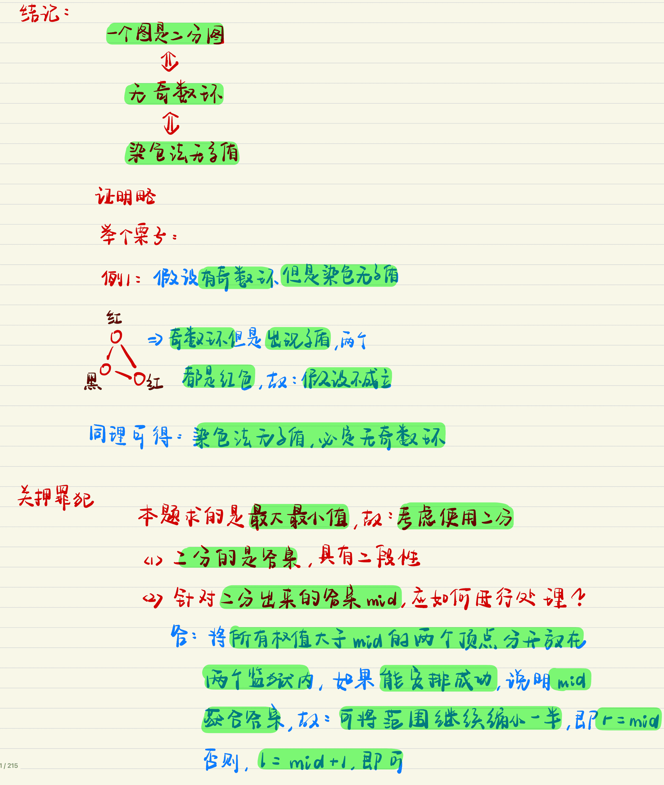

**代ç **

```c++
#include <iostream>
#include <cstring>
using namespace std;
const int N = 20010, M = 200010;
int n, m, idx;
int h[N], e[M], w[M], ne[M], color[N];
void add(int a, int b, int c) {
    e[idx] = b;
    w[idx] = c;
    ne[idx] = h[a];
    h[a] = idx ++;
    return;
}
bool dfs(int u, int c, int mid) {
    color[u] = c;
    for (int i = h[u]; i != -1; i = ne[i]) {
        int j = e[i];
        // 如æœå½“å‰ç‚¹å°äºç­‰äºmid, 则返å›
        if (w[i] <= mid) continue;
        // 当å‰ç‚¹æ²¡æœ‰è¢«æŸ“色并且给当å‰ç‚¹æŸ“色产生矛盾, 则返å›false
        if (!color[j] && !dfs(j, 3 - c, mid)) return false;
        // 如æœå·²ç»æŸ“色并且颜色相åŒ, è¿”å›false
        else if (c == color[j]) return false;
    }
    return true;
}
bool check(int mid) {
    // è®°å¾—æ¯ä¸€æ¬¡éƒ½éœ€è¦è¿›è¡Œåˆå§‹åŒ–
    memset(color, 0, sizeof color);
    // éå†æ¯ä¸ªç‚¹
    for (int i = 1; i <= n; i ++ )
        // 如æœå½“å‰ç‚¹æ²¡æœ‰è¢«æŸ“色并且给当å‰ç‚¹è¿›è¡ŒæŸ“色ä¸å¯èƒ½æˆåŠŸ, 则返å›false
        if (!color[i] && !dfs(i, 1, mid)) return false;
    return true;
}
int main() {
    scanf("%d%d", &n, &m);
    memset(h, -1, sizeof h);
    for (int i = 0; i < m; i ++ ) {
        int a, b, c;
        scanf("%d%d%d", &a, &b, &c);
        add(a, b, c);
        add(b, a, c);
    }
    int l = 0, r = 1e9;
    while (l < r) {
        int mid = l + r >> 1;
        if (check(mid)) r = mid;
        else l = mid + 1;
    }
    cout << r << endl;
    return 0;
}
```

**时间å¤æ‚度**

$O(log(1e9)*(n + m))$

**空间å¤æ‚度**

$O(m)$

**标签**

`染色法判断二分图`ã€`二分`

**ç¼åˆæ€ª**


### 匈牙利算法

#### åŸç†

>   1.   步骤和åŸç†åœ¨ [AcWing 861. 二分图的最大匹é…](#AcWing 861. 二分图的最大匹é…) 的手写稿

#### [AcWing 861. 二分图的最大匹é…](https://www.acwing.com/problem/content/863/)

**题目æè¿°**

>   给定一个二分图，其中左åŠéƒ¨åŒ…å« $n_1$ ä¸ªç‚¹ï¼ˆç¼–å· $1 ∼ n_1$），å³åŠéƒ¨åŒ…å« $n_2$ ä¸ªç‚¹ï¼ˆç¼–å· $1 ∼ n_2$ï¼‰ï¼ŒäºŒåˆ†å›¾å…±åŒ…å« `m` æ¡è¾¹ã€‚
>
>   æ•°æ®ä¿è¯ä»»æ„一æ¡è¾¹çš„两个端点都ä¸å¯èƒ½åœ¨åŒä¸€éƒ¨åˆ†ä¸­ã€‚
>
>   请你求出二分图的最大匹é…数。
>
>   >   二分图的匹é…：给定一个二分图 `G`，在 `G` 的一个å­å›¾ `M` 中，`M` 的边集 `{E}` 中的任æ„两æ¡è¾¹éƒ½ä¸ä¾é™„äºåŒä¸€ä¸ªé¡¶ç‚¹ï¼Œåˆ™ç§° `M` 是一个匹é…。
>   >
>   >   二分图的最大匹é…：所有匹é…中包å«è¾¹æ•°æœ€å¤šçš„一组匹é…被称为二分图的最大匹é…，其边数å³ä¸ºæœ€å¤§åŒ¹é…数。

**输入格å¼**

>   第一行包å«ä¸‰ä¸ªæ•´æ•° $n_1〠n_2$ å’Œ `m`。
>
>   æ¥ä¸‹æ¥ `m` 行，æ¯è¡ŒåŒ…å«ä¸¤ä¸ªæ•´æ•° `u` å’Œ `v`，表示左åŠéƒ¨ç‚¹é›†ä¸­çš„点 `u` å’Œå³åŠéƒ¨ç‚¹é›†ä¸­çš„点 `v` 之间存在一æ¡è¾¹ã€‚

**输出格å¼**

>   输出一个整数，表示二分图的最大匹é…数。

**æ•°æ®èŒƒå›´**

>   +   $1 ≤ n_1, n_2 ≤ 500,$
>   +   $1 ≤ u ≤ n_1,$
>   +   $1 ≤ v ≤ n_2,$
>   +   $1 ≤ m ≤ 10^5$

**输入样例**

```c++
2 2 4
1 1
1 2
2 1
2 2
```

**输出样例**

```c++
2
```

**手写稿**

>   1.   题解
>
>        
>
>   2.   补充
>
>        
>

**代ç **

```c++
#include <iostream>
#include <cstring>
using namespace std;
const int N = 510, M = 100010;
int n1, n2, m, idx;
int h[N], e[M], ne[M], match[N], st[N];
void add(int a, int b) {
    e[idx] = b;
    ne[idx] = h[a];
    h[a] = idx ++;
    return;
}
// st数组ä¿è¯åœ¨æ¯å±€çš„匹é…中æ¯ä¸ªå§‘娘åªä¼šè¢«éå†ä¸€æ¬¡
bool dfs(int u) {
    for (int i = h[u]; i != -1; i = ne[i]) {
        int j = e[i];
        // 如æœå½“å‰å§‘娘在本局当中还没有被访问过, 则访问
        if (!st[j]) {
            // 标记为已ç»è®¿é—®è¿‡
            st[j] = true;
            // 如æœæ²¡æœ‰åŒ¹é…或者当å‰å§‘娘的男朋å‹å¯ä»¥æ‰¾åˆ°å…¶ä»–的女孩å­, 则皆大欢喜
            if (!match[j] || dfs(match[j])) {
                match[j] = u;
                return true;
            }
        }
    }
    return false;
}
int main() {
    memset(h, -1, sizeof h);
    scanf("%d%d%d", &n1, &n2, &m);
    for (int i = 0; i < m; i ++ ) {
        int a, b;
        scanf("%d%d", &a, &b);
        add(a, b);
    }
    int res = 0;
    for (int i = 1; i <= n1; i ++ ) {
        // st数组ä¿è¯åœ¨æ¯å±€çš„匹é…中æ¯ä¸ªå§‘娘åªä¼šè¢«éå†ä¸€æ¬¡
        // æ¯æ¬¡æ–°å¼€ä¸€å±€éƒ½éœ€è¦é‡æ–°åˆå§‹åŒ–
        // åŸå› : å‡è®¾å½“å‰ç”·å­©A和女孩Gä¸åˆé€‚, 那你能确定下一个男孩和女孩Gä¸åˆé€‚??
        // 凭啥男孩A访问过女孩G之å, å°±ä¸è®©ä¸‹ä¸€ä¸ªç”·å­©è®¿é—®äº†???
        // 还有ç‹æ³•å—???还有法律å—???
        memset(st, false, sizeof st);
        if (dfs(i)) res ++;
    }
    cout << res << endl;
    return 0;
}
```

**时间å¤æ‚度**

$O(n_1m)$

**空间å¤æ‚度**

$O(m)$

**标签**

`匈牙利算法`ã€`二分图匹é…`

**ç¼åˆæ€ª**


#### [AcWing 372. 棋盘覆盖](https://www.acwing.com/problem/content/374/)

**题目æè¿°**

>   给定一个 `N` è¡Œ `N` 列的棋盘，已知æŸäº›æ ¼å­ç¦æ­¢æ”¾ç½®ã€‚
>
>   求最多能往棋盘上放多少å—的长度为 `2`ã€å®½åº¦ä¸º `1` 的骨牌，骨牌的边界ä¸æ ¼çº¿é‡åˆï¼ˆéª¨ç‰Œå ç”¨ä¸¤ä¸ªæ ¼å­ï¼‰ï¼Œå¹¶ä¸”ä»»æ„两张骨牌都ä¸é‡å ã€‚

**输入格å¼**

>   第一行包å«ä¸¤ä¸ªæ•´æ•° `N` å’Œ `t`，其中 `t` 为ç¦æ­¢æ”¾ç½®çš„æ ¼å­çš„æ•°é‡ã€‚
>
>   æ¥ä¸‹æ¥ `t` è¡Œæ¯è¡ŒåŒ…å«ä¸¤ä¸ªæ•´æ•° `x` å’Œ `y`，表示ä½äºç¬¬ `x` 行第 `y` 列的格å­ç¦æ­¢æ”¾ç½®ï¼Œè¡Œåˆ—æ•°ä» `1` 开始。

**输出格å¼**

>   输出一个整数，表示结æœã€‚

**æ•°æ®èŒƒå›´**

>   +   $1≤N≤100,$
>   +   $0≤t≤100$

**输入样例**

```c++
8 0
```

**输出样例**

```c++
32
```

**手写稿**


**代ç **

```c++
#include <iostream>
#include <cstring>
#define x first
#define y second
using namespace std;
typedef pair<int, int> PII;
const int N = 110;
int n, m;
int dx[4] = {1, 0, -1, 0}, dy[4] = {0, 1, 0, -1};
int g[N][N], st[N][N];
PII match[N][N];
bool dfs(int x, int y) {
    for (int i = 0; i < 4; i ++ ) {
        int tx = x + dx[i];
        int ty = y + dy[i];
        // 越界或者当å‰æ ¼å­æœ‰éšœç¢ç‰©æˆ–者当å‰æ ¼å­è¢«è®¿é—®è¿‡, 则直æ¥è¿›è¡Œä¸‹ä¸€æ¬¡å¾ªç¯
        if (tx < 1 || tx > n || ty < 1 || ty > n || g[tx][ty] || st[tx][ty])
            continue;
        // 标记当å‰æ ¼å­å·²ç»è¢«è®¿é—®è¿‡
        st[tx][ty] = true;
        PII t = match[tx][ty];
        // 如æœå½“å‰æ ¼å­æ²¡æœ‰è¢«åŒ¹é…或者当å‰å¦¹å­èƒ½æ‰¾åˆ°åˆ«çš„帅哥, 则干就完了
        if (t.x == -1 || dfs(t.x, t.y)) {
            match[tx][ty] = {x, y};
            return true; // 匹é…æˆåŠŸ
        }
    }
    return false;
}
int main() {
    scanf("%d%d", &n, &m);
    for (int i = 0; i < m; i ++ ) {
        int x, y;
        scanf("%d%d", &x, &y);
        g[x][y] = true;
    }
    // åˆå§‹åŒ–为-1, 表示没有进行匹é…
    memset(match, -1, sizeof match);
    int res = 0;
    // æšä¸¾æ¯ä¸€ä¸ªç‚¹(i, j), 其横å标和纵å标加起æ¥ä¸ºå¥‡æ•°çš„æ ¼å­
    for (int i = 1; i <= n; i ++ )
        for (int j = 1; j <= n; j ++ )
            if ((i + j) & 1 && !g[i][j]) {
                // æ¯æ¬¡åŒ¹é…è®°å¾—åˆå§‹åŒ–
                memset(st, 0, sizeof st);
                if (dfs(i, j)) res ++;
            }
    cout << res << endl;
    return 0;
}
```

**时间å¤æ‚度**

$O(n ^ 2)$

**空间å¤æ‚度**

$O(n^2)$

**标签**

`匈牙利算法`ã€`二分图求最大匹é…`

**ç¼åˆæ€ª**


#### [AcWing 376. 机器任务](https://www.acwing.com/problem/content/378/)

**题目æè¿°**

>   有两å°æœºå™¨ `A，B` ä»¥åŠ `K` 个任务。
>
>   机器 `A` 有 `N` ç§ä¸åŒçš„模å¼ï¼ˆæ¨¡å¼ `0∼N−1`），机器 `B` 有 `M` ç§ä¸åŒçš„模å¼ï¼ˆæ¨¡å¼ `0∼M−1`）。
>
>   **两å°æœºå™¨æœ€å¼€å§‹éƒ½å¤„äºæ¨¡å¼ 0。**
>
>   æ¯ä¸ªä»»åŠ¡æ—¢å¯ä»¥åœ¨ `A` 上执行，也å¯ä»¥åœ¨ `B` 上执行。
>
>   对äºæ¯ä¸ªä»»åŠ¡ `i`，给定两个整数 `a[i]` å’Œ `b[i]`，表示如æœè¯¥ä»»åŠ¡åœ¨ `A` 上执行，需è¦è®¾ç½®æ¨¡å¼ä¸º `a[i]`，如æœåœ¨ `B` 上执行，需è¦æ¨¡å¼ä¸º `b[i]`。
>
>   任务å¯ä»¥ä»¥ä»»æ„顺åºè¢«æ‰§è¡Œï¼Œä½†æ¯å°æœºå™¨è½¬æ¢ä¸€æ¬¡æ¨¡å¼å°±è¦é‡å¯ä¸€æ¬¡ã€‚
>
>   求æ€æ ·åˆ†é…任务并åˆç†å®‰æ’顺åºï¼Œèƒ½ä½¿æœºå™¨é‡å¯æ¬¡æ•°æœ€å°‘。

**输入格å¼**

>   输入包å«å¤šç»„测试数æ®ã€‚
>
>   æ¯ç»„æ•°æ®ç¬¬ä¸€è¡ŒåŒ…å«ä¸‰ä¸ªæ•´æ•° `N,M,K`。
>
>   æ¥ä¸‹æ¥ `K` 行，æ¯è¡Œä¸‰ä¸ªæ•´æ•° `i,a[i]` å’Œ `b[i]`，`i` 为任务编å·ï¼Œä» `0` 开始。
>
>   当输入一行为 `0` 时，表示输入终止。

**输出格å¼**

>   æ¯ç»„æ•°æ®è¾“出一个整数，表示所需的机器最少é‡å¯æ¬¡æ•°ï¼Œæ¯ä¸ªç»“æœå ä¸€è¡Œã€‚

**æ•°æ®èŒƒå›´**

>   +   $N,M<100,K<1000$
>   +   $0≤a[i]<N$
>   +   $0≤b[i]<M$

**输入样例**

```c++
5 5 10
0 1 1
1 1 2
2 1 3
3 1 4
4 2 1
5 2 2
6 2 3
7 2 4
8 3 3
9 4 3
0
```

**输出样例**

```c++
3
```

**手写稿**


**代ç **

```c++
#include <iostream>
#include <cstring>
using namespace std;
const int N = 110;
int n, m, k;
int st[N], match[N];
int g[N][N];
bool dfs(int u) {
    for (int i = 1; i < m; i ++ )
        // 如æœå½“å‰ç‚¹i没有被访问过并且ä»u到i有一æ¡è¾¹
        if (!st[i] && g[u][i]) {
            st[i] = true;
            if (!match[i] || dfs(match[i])) {
                match[i] = u;
                return true;
            }
        }
    return false;
}
int main() {
    while (scanf("%d%d%d", &n, &m, &k), n) {
        memset(match, 0, sizeof match);
        memset(g, 0, sizeof g);
        for (int i = 0; i < k; i ++ ) {
            int c, a, b;
            scanf("%d%d%d", &c, &a, &b);
            // 如æœå¤„äºæ¨¡å¼0, 则直æ¥è¿”å›, ä¸éœ€è¦ä»»ä½•ä»£ä»·
            if (!a || !b) continue;
            // 标记边
            g[a][b] = true;
        }
        int res = 0;
        for (int i = 1; i < n; i ++ ) {
            // æ¯æ¬¡éƒ½åˆå§‹åŒ–数组
            memset(st, 0, sizeof st);
            // 如æœå½“å‰ç‚¹iå¯ä»¥åŒ¹é…到对象, 则匹é…æ•°é‡ ++
            if (dfs(i)) res ++;
        }
        cout << res << endl;
    }
    return 0;
}
```

**时间å¤æ‚度**

$O(nVE)$

**空间å¤æ‚度**

$O(n^2)$

**标签**

`最å°ç‚¹è¦†ç›–`ã€`匈牙利算法`ã€`最大匹é…æ•°`

**ç¼åˆæ€ª**


#### [AcWing 378. 骑士放置](https://www.acwing.com/problem/content/380/)

**题目æè¿°**

>   给定一个 `N×M` 的棋盘，有一些格å­ç¦æ­¢æ”¾æ£‹å­ã€‚
>
>   问棋盘上最多能放多少个ä¸èƒ½äº’相攻击的骑士（国际象棋的“骑士â€ï¼Œç±»ä¼¼äºä¸­å›½è±¡æ£‹çš„“马â€ï¼ŒæŒ‰ç…§â€œæ—¥â€å­—攻击，但没有中国象棋“别马腿â€çš„规则）。

**输入格å¼**

>   第一行包å«ä¸‰ä¸ªæ•´æ•° `N,M,T`，其中 `T` 表示ç¦æ­¢æ”¾ç½®çš„æ ¼å­çš„æ•°é‡ã€‚
>
>   æ¥ä¸‹æ¥ `T` è¡Œæ¯è¡ŒåŒ…å«ä¸¤ä¸ªæ•´æ•° `x` å’Œ `y`，表示ä½äºç¬¬ `x` 行第 `y` 列的格å­ç¦æ­¢æ”¾ç½®ï¼Œè¡Œåˆ—æ•°ä» `1` 开始。

**输出格å¼**

>   输出一个整数表示结æœã€‚

**æ•°æ®èŒƒå›´**

>   +   $1≤N,M≤100$

**输入样例**

```c++
2 3 0
```

**输出样例**

```c++
4
```

**手写稿**

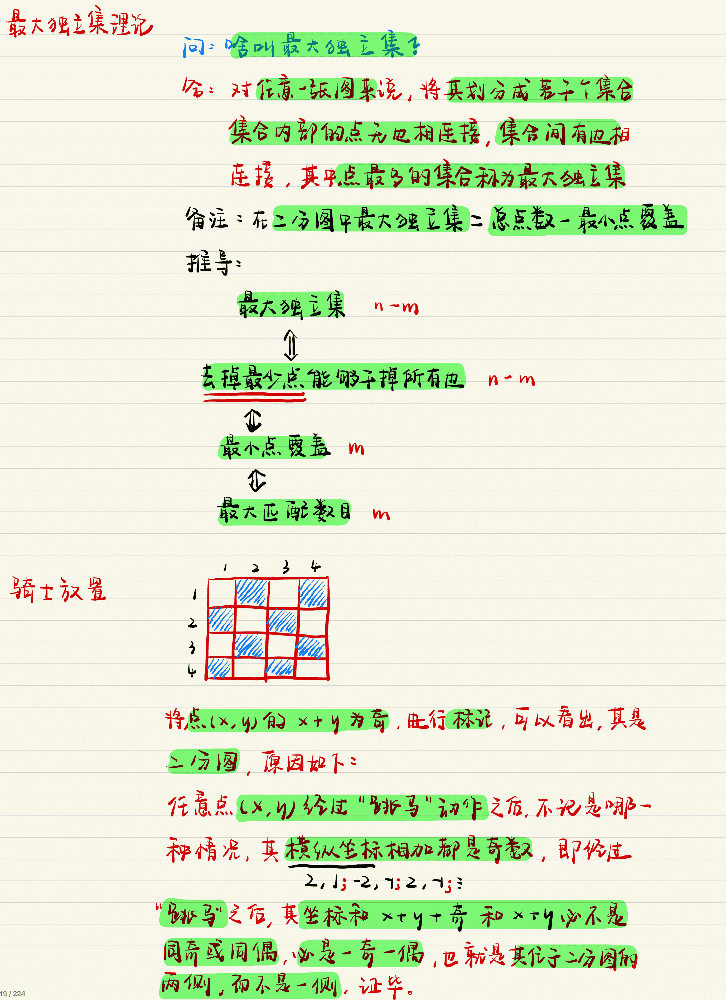

**代ç **

```c++
#include <iostream>
#include <cstring>
#define x first
#define y second
using namespace std;
typedef pair<int, int> PII;
const int N = 110;
int n, m, k;
int dx[] = {-2, -1, 1, 2, 2, 1, -1, -2};
int dy[] = {1, 2, 2, 1, -1, -2, -2, -1};
PII match[N][N];
int g[N][N], st[N][N];
bool dfs(int x, int y) {
    // éå†8个方å‘
    for (int i = 0; i < 8; i ++ ) {
        int tx = x + dx[i];
        int ty = y + dy[i];
        // 如æœè¶Šç•Œæˆ–者当å‰æ ¼å­æ˜¯åæ ¼å­æˆ–者当å‰æ ¼å­å·²è¢«è®¿é—®è¿‡, 则continue;
        if (tx < 1 || tx > n || ty < 1 || ty > m || g[tx][ty] || st[tx][ty]) continue;
        // 标记当å‰æ ¼å­å·²è¢«è®¿é—®è¿‡
        st[tx][ty] = true;
        PII t = match[tx][ty];
        // 如æœç‚¹(tx, ty)没被访问过或者其被访问过但是其能够找到备èƒ
        if (t.x == 0 || dfs(t.x, t.y)) {
            // 标记
            match[tx][ty] = {x, y};
            return true;
        }
    }
    return false;
}
int main() {
    scanf("%d%d%d", &n, &m, &k);
    for (int i = 0; i < k; i ++ ) {
        int a, b;
        scanf("%d%d", &a, &b);
        // 标记åæ ¼å­
        g[a][b] = 1;
    }
    int res = 0;
    // æšä¸¾æ‰€æœ‰å标和x + y为å¶æ•°çš„æ ¼å­
    for (int i = 1; i <= n; i ++ ) {
        for (int j = 1; j <= m; j ++ ) {
            // 如æœå标和为奇数或者当å‰æ ¼å­æ˜¯åæ ¼å­, 则continue;
            if ((i + j) & 1 || g[i][j]) continue;
            // åˆå§‹åŒ–st数组
            memset(st, 0, sizeof st);
            // 如æœç‚¹(i, j)å¯ä»¥æˆåŠŸæ‰¾åˆ°å¯¹è±¡, 则匹é…æ•° ++
            if (dfs(i, j)) res ++;
        }
    }
    // 总点数 - å点 - 最å°ç‚¹è¦†ç›–æ•°
    cout << n * m - k - res << endl;
    return 0;
}
```

**时间å¤æ‚度**

$O(n^2VE)$

**空间å¤æ‚度**

$O(n^2)$

**标签**

`最大独立集`ã€`二分图`ã€`匈牙利算法`

**ç¼åˆæ€ª**


#### [AcWing 379. æ‰è¿·è—](https://www.acwing.com/problem/content/381/)

**题目æè¿°**

>   `Vani` å’Œ `cl2` 在一片树æ—里æ‰è¿·è—。
>
>   这片树æ—里有 `N` 座房å­ï¼Œ`M` æ¡æœ‰å‘é“路，组æˆäº†ä¸€å¼ æœ‰å‘æ— ç¯å›¾ã€‚
>
>   æ ‘æ—里的树é常茂密，足以é®æŒ¡è§†çº¿ï¼Œä½†æ˜¯æ²¿ç€é“路望å»ï¼Œå´æ˜¯è§†é‡å¼€é˜”。
>
>   如æœä»æˆ¿å­ `A` 沿ç€è·¯èµ°ä¸‹å»èƒ½å¤Ÿåˆ°è¾¾ `B`，那么在 `A` å’Œ `B` 里的人是能够相互望è§çš„。
>
>   ç°åœ¨ `cl2` è¦åœ¨è¿™ `N` 座房å­é‡Œé€‰æ‹© `K` 座作为è—身点，åŒæ—¶ `Vani` 也专挑 `cl2` 作为è—身点的房å­è¿›å»å¯»æ‰¾ï¼Œä¸ºäº†é¿å…被 `Vani` 看è§ï¼Œ`cl2` è¦æ±‚è¿™ `K` 个è—身点的任æ„两个之间都没有路径相è¿ã€‚
>
>   为了让 `Vani` 更难找到自己，`cl2` 想知é“最多能选出多少个è—身点。

**输入格å¼**

>   输入数æ®çš„第一行是两个整数 `N` å’Œ `M`。
>
>   æ¥ä¸‹æ¥ `M` 行，æ¯è¡Œä¸¤ä¸ªæ•´æ•° `x,y`，表示一æ¡ä» `x` 到 `y` 的有å‘é“路。

**输出格å¼**

>   输出一个整数，表示最多能选å–çš„è—身点个数。

**æ•°æ®èŒƒå›´**

>   +   $N≤200,M≤30000$

**输入样例**

```c++
7 5
1 2
3 2
2 4
4 5
4 6
```

**输出样例**

```c++
3
```

**手写稿**

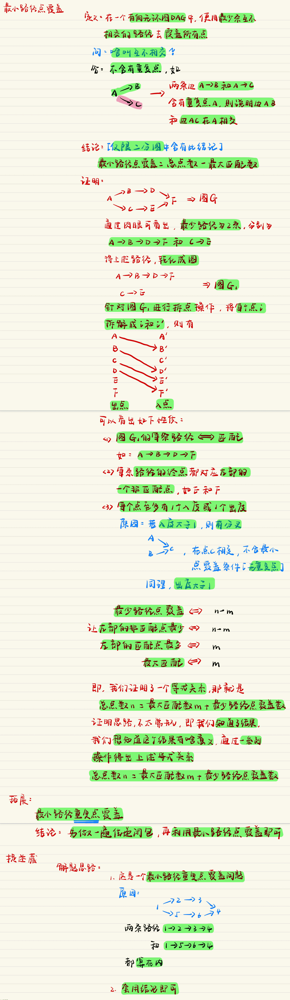

**代ç **

```c++
#include <iostream>
#include <cstring>
using namespace std;
const int N = 210;
int n, m;
int st[N], match[N];
int g[N][N];
// 匈牙利算法模æ¿
bool dfs(int u) {
    for (int i = 1; i <= n; i ++ )
        if (g[u][i] && !st[i]) {
            st[i] = true;
            if (!match[i] || dfs(match[i])) {
                match[i] = u;
                return true;
            }
        }
    return false;
}
int main() {
    scanf("%d%d", &n, &m);
    for (int i = 0; i < m; i ++ ) {
        int a, b;
        scanf("%d%d", &a, &b);
        // 有å‘è¾¹
        g[a][b] = true;
    }
    // 传递闭包
    for (int k = 1; k <= n; k ++ )
        for (int i = 1; i <= n; i ++ )
            for (int j = 1; j <= n; j ++ )
                // 是|=而ä¸æ˜¯=
                g[i][j] |= g[i][k] && g[k][j];
    int res = 0;
    for (int i = 1; i <= n; i ++ ) {
        memset(st, 0, sizeof st);
        if (dfs(i)) res ++;
    }
    // 最å°é‡å¤ç‚¹è¦†ç›–å…¬å¼
    cout << n - res << endl;
    return 0;
}
```

**时间å¤æ‚度**

$O(nVE)$

**空间å¤æ‚度**

$O(n^2)$

**标签**

`最å°è·¯å¾„é‡å¤ç‚¹è¦†ç›–`ã€`匈牙利算法`

**ç¼åˆæ€ª**


## 欧拉å›è·¯å’Œæ¬§æ‹‰è·¯å¾„

### åŸç†


### [AcWing 1123. 铲雪车](https://www.acwing.com/problem/content/1125/)

**题目æè¿°**

>   éšç€ç™½å¤©è¶Šæ¥è¶ŠçŸ­å¤œæ™šè¶Šæ¥è¶Šé•¿ï¼Œæˆ‘们ä¸å¾—ä¸è€ƒè™‘铲雪问题了。
>
>   整个åŸå¸‚所有的é“路都是åŒå‘车é“,é“路的两个方å‘å‡éœ€è¦é“²é›ªã€‚因为åŸå¸‚预算的削å‡ï¼Œæ•´ä¸ªåŸå¸‚åªæœ‰ `1` 辆铲雪车。
>
>   铲雪车åªèƒ½æŠŠå®ƒå¼€è¿‡çš„地方（车é“）的雪铲干净，无论哪儿有雪，铲雪车都得ä»åœæ”¾çš„地方出å‘，游å†æ•´ä¸ªåŸå¸‚çš„è¡—é“。
>
>   ç°åœ¨çš„问题是：最少è¦èŠ±å¤šå°‘时间å»é“²æ‰æ‰€æœ‰é“路上的雪呢？

**输入格å¼**

>   输入数æ®çš„第 `1` 行表示铲雪车的åœæ”¾åæ ‡ `(x,y)`，`x,y` 为整数，å•ä½ä¸ºç±³ã€‚
>
>   下é¢æœ€å¤šæœ‰`4000`行，æ¯è¡Œç»™å‡ºäº†ä¸€æ¡è¡—é“的起点å标和终点å标，åæ ‡å‡ä¸ºæ•´æ•°ï¼Œæ‰€æœ‰è¡—é“都是笔直的，且都是åŒå‘车é“。
>
>   铲雪车å¯ä»¥åœ¨ä»»æ„交å‰å£ã€æˆ–任何街é“的末尾任æ„转å‘，包括转 `U` å‹å¼¯ã€‚
>
>   铲雪车铲雪时å‰è¿›é€Ÿåº¦ä¸º `2020` åƒç±³/时，ä¸é“²é›ªæ—¶å‰è¿›é€Ÿåº¦ä¸º `5050` åƒç±³/时。
>
>   ä¿è¯ï¼šé“²é›ªè½¦ä»èµ·ç‚¹ä¸€å®šå¯ä»¥åˆ°è¾¾ä»»ä½•è¡—é“。

**输出格å¼**

>   输出铲æ‰æ‰€æœ‰è¡—é“上的雪并且返å›å‡ºå‘点的最短时间，精确到分钟，四èˆäº”入到整数。
>
>   输出格å¼ä¸º`â€hours:minutesâ€`，`minutes`ä¸è¶³ä¸¤ä½æ•°æ—¶éœ€è¦è¡¥å‰å¯¼é›¶ã€‚
>   具体格å¼å‚照样例。

**æ•°æ®èŒƒå›´**

>   +   $−10^6≤x,y≤10^6$
>   +   $所有ä½ç½®åæ ‡ç»å¯¹å€¼ä¸è¶…过 10^6。$

**输入样例**

```c++
0 0
0 0 10000 10000
5000 -10000 5000 10000
5000 10000 10000 10000
```

**输出样例**

```c++
3:55
```

**样例解释**

>   输出结æœè¡¨ç¤ºå…±éœ€`3`å°æ—¶`55`分钟。

**手写稿**

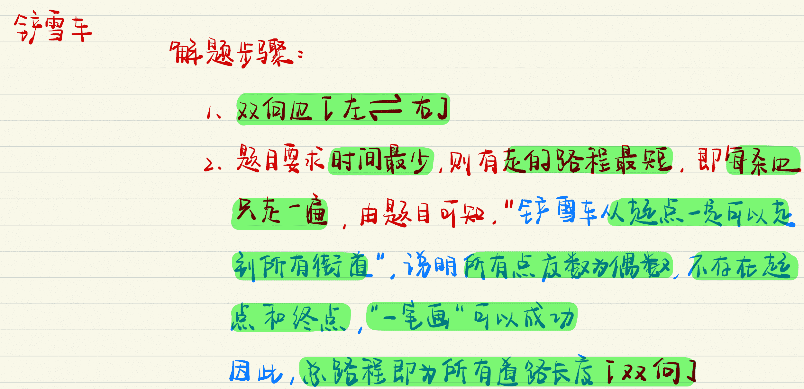

**代ç **

```c++
#include <iostream>
#include <algorithm>
#include <cmath>
using namespace std;
int x, y;
int main() {
    int x1, y1, x2, y2;
    // 注æ„使用doubleç±»å‹
    double sum = 0;
    scanf("%d%d", &x, &y);
    while (~scanf("%d%d%d%d", &x1, &y1, &x2, &y2)) {
        // 注æ„使用doubleç±»å‹
        double dx = x1 - x2;
        // 注æ„使用doubleç±»å‹
        double dy = y1 - y2;
        // 计算所有街é“总和
        sum += sqrt(dx * dx + dy * dy) * 2;
    }
    // 计算分钟总数, å››èˆäº”å…¥(round函数)
    int minutes = round(sum / 1000 / 20 * 60);
    printf("%d:%02d\n", minutes / 60, minutes % 60);
    return 0;
}
```

**时间å¤æ‚度**

$O(n)$

**空间å¤æ‚度**

$O(1)$

**标签**

`欧拉路径`ã€`欧拉å›è·¯`

**ç¼åˆæ€ª**


### [AcWing 1184. 欧拉å›è·¯](https://www.acwing.com/problem/content/1186/)

**题目æè¿°**

>   给定一张图，请你找出欧拉å›è·¯ï¼Œå³åœ¨å›¾ä¸­æ‰¾ä¸€ä¸ªç¯ä½¿å¾—æ¯æ¡è¾¹éƒ½åœ¨ç¯ä¸Šå‡ºç°æ°å¥½ä¸€æ¬¡ã€‚

**输入格å¼**

>   第一行包å«ä¸€ä¸ªæ•´æ•° `t`，`t∈{1,2}`ï¼Œå¦‚æœ `t=1`，表示所给图为**æ— å‘**å›¾ï¼Œå¦‚æœ `t=2`，表示所给图为**有å‘**图。
>
>   第二行包å«ä¸¤ä¸ªæ•´æ•° `n,m`，表示图的结点数和边数。
>
>   æ¥ä¸‹æ¥ `m` 行中，第 `i` 行两个整数 $v_i,u_i$，表示第 `i` æ¡è¾¹ï¼ˆä» `1` 开始编å·ï¼‰ã€‚
>
>   -   å¦‚æœ `t=1` 则表示 $v_i$ 到 $u_i$ 有一æ¡æ— å‘边。
>   -   å¦‚æœ `t=2` 则表示 $v_i$ 到 $u_i$ 有一æ¡æœ‰å‘边。
>
>   图中å¯èƒ½æœ‰é‡è¾¹ä¹Ÿå¯èƒ½æœ‰è‡ªç¯ã€‚
>
>   点的编å·ä» `1` 到 `n`。

**输出格å¼**

>   如æœæ— æ³•ä¸€ç¬”画出欧拉å›è·¯ï¼Œåˆ™è¾“出一行：`NO`。
>
>   å¦åˆ™ï¼Œè¾“出一行：`YES`，æ¥ä¸‹æ¥ä¸€è¡Œè¾“出 **ä»»æ„一组** åˆæ³•æ–¹æ¡ˆå³å¯ã€‚
>
>   -   å¦‚æœ `t=1`，输出 `m` 个整数 $p_1,p_2,…,p_m$。令 $e=|p_i|$，那么 `e` 表示ç»è¿‡çš„第 `i` æ¡è¾¹çš„ç¼–å·ã€‚å¦‚æœ $p_i$ ä¸ºæ­£æ•°è¡¨ç¤ºä» $v_e$ 走到 $u_e$，å¦åˆ™è¡¨ç¤ºä» $u_e$ 走到 $v_e$。
>   -   å¦‚æœ `t=2`，输出 `m` 个整数 $p_1,p_2,…,p_m$。其中 $p_i$ 表示ç»è¿‡çš„第 `i` æ¡è¾¹çš„ç¼–å·ã€‚

**æ•°æ®èŒƒå›´**

>   +   $1≤n≤10^5,$
>   +   $0≤m≤2×10^5$

**输入样例1**

```c++
1
3 3
1 2
2 3
1 3
```

**输出样例1**

```c++
YES
1 2 -3
```

**输入样例2**

```c++
2
5 6
2 3
2 5
3 4
1 2
4 2
5 1
```

**输出样例2**

```c++
YES
4 1 3 5 2 6
```

**手写稿**


**代ç **

```c++
#include <iostream>
#include <cstring>
using namespace std;
const int N = 100010, M = 400010;
int type, n, m, idx, cnt;
int h[N], e[M], ne[M], din[N], dout[N], ans[M], st[M];
void add(int a, int b) {
    e[idx] = b;
    ne[idx] = h[a];
    h[a] = idx ++;
    return;
}
void dfs(int u) {
    // éå†ã€æ¯æ¡è¾¹ã€‘, 注æ„: i = h[u]ä¸æ˜¯i = ne[i], åŸå› : [手写稿]
    for (int i = h[u]; i != -1; i = h[u]) {
        // 如æœã€å½“å‰è¾¹ã€‘å·²ç»è¢«è®¿é—®è¿‡, 则ã€åˆ é™¤ã€‘æ­¤æ¡è¾¹, åŸå› : [手写稿]
        if (st[i]) {
            // 删除当å‰è¾¹
            h[u] = ne[i];
            continue;
        }
        // 标记ã€å½“å‰è¾¹ã€‘å·²ç»è¢«è®¿é—®è¿‡
        // å·²ç»åˆ é™¤äº†, 为啥还è¦æ ‡è®°?
        // åŸå› : 防止åå‘è¾¹,a - bå¯ä»¥åˆ†æˆa -> bå’Œb -> aå®é™…上两者是åŒä¸€æ¡è¾¹
        st[i] = true;
        // æ— å‘图, 则标记å¦å¤–一æ¡è¾¹i ^ 1, åŸå› : [手写稿]
        if (type == 1) st[i ^ 1] = true;
        int t;
        // æ— å‘图, 则找到当å‰è¾¹çš„ç¼–å·, å…¬å¼: [手写稿]
        if (type == 1) {
            t = i / 2 + 1;
            // 如æœæ˜¯å¥‡æ•°, 则åå‘
            if (i & 1) t = -t;
        }
        // å…¬å¼: [手写稿]
        else t = i + 1;
        // 点
        int j = e[i];
        // 删除ã€å½“å‰è¾¹ã€‘
        h[u] = ne[i];
        // éå†ã€å½“å‰ç‚¹ã€‘
        dfs(j);
        // å°†ã€å½“å‰è¾¹ã€‘çš„ç¼–å·åŠ å…¥åˆ°ç­”案
        ans[++ cnt] = t;
    }
    return;
}
int main() {
    scanf("%d%d%d", &type, &n, &m);
    memset(h, -1, sizeof h);
    // éå†æ¯æ¡è¾¹
    for (int i = 0; i < m; i ++ ) {
        int a, b;
        scanf("%d%d", &a, &b);
        add(a, b);
        // æ— å‘图, 则添加åå‘è¾¹
        if (type == 1) add(b, a);
        // 记录入度和出度
        // 对äºæ— å‘图也适用[手写稿说æ˜]
        din[b] ++, dout[a] ++;
    }
    if (type == 1) { // æ— å‘图
        // éå†æ¯ä¸ªç‚¹
        for (int i = 1; i <= n; i ++ )
            // å…¬å¼
            if (din[i] + dout[i] & 1) {
                puts("NO");
                return 0;
            }
    }
    else { // 有å‘图
        // éå†æ¯ä¸ªç‚¹
        for (int i = 1; i <= n; i ++ )
            // å…¬å¼
            if (din[i] != dout[i]) {
                puts("NO");
                return 0;
            }
    }
    // éå†æ¯ä¸ªç‚¹
    for (int i = 1; i <= n; i ++ )
        // 如æœå½“å‰ç‚¹æœ‰è¾¹, 则éå†ä»å½“å‰ç‚¹å¼€å§‹èƒ½åˆ°è¾¾çš„所有边
        if (h[i] != -1) {
            dfs(i);
            // 跳出循ç¯å³å¯, åŸå› : 一笔画问题, 如æœå‡ºç°å­¤ç«‹ç‚¹, ä¸æ»¡è¶³ä¸€ç¬”ç”»
            break;
        }
    // 如æœè¾¹æ•°ä¸è¶³mæ¡
    if (cnt < m) {
        puts("NO");
        return 0;
    }
    puts("YES");
    // 倒åºè¾“出答案
    for (int i = cnt; i; i -- ) printf("%d ", ans[i]);
    return 0;
}
```

**时间å¤æ‚度**

$O(n)$

**空间å¤æ‚度**

$O(n)$

**标签**

`欧拉å›è·¯`

**ç¼åˆæ€ª**


### [AcWing 1124. 骑马修栅æ ](https://www.acwing.com/problem/content/1126/)

**题目æè¿°**

>   农民`John`æ¯å¹´æœ‰å¾ˆå¤šæ …æ è¦ä¿®ç†ã€‚
>
>   他总是骑ç€é©¬ç©¿è¿‡æ¯ä¸€ä¸ªæ …æ å¹¶ä¿®å¤å®ƒç ´æŸçš„地方。
>
>   `John`是一个ä¸å…¶ä»–农民一样懒的人。
>
>   他讨åŒéª‘马，因此ä»æ¥ä¸ä¸¤æ¬¡ç»è¿‡ä¸€ä¸ªæ …æ ã€‚
>
>   你必须编一个程åºï¼Œè¯»å…¥æ …æ ç½‘络的æ述，并计算出一æ¡ä¿®æ …æ çš„路径，使æ¯ä¸ªæ …æ éƒ½æ°å¥½è¢«ç»è¿‡ä¸€æ¬¡ã€‚
>
>   `John`能ä»ä»»ä½•ä¸€ä¸ªé¡¶ç‚¹(å³ä¸¤ä¸ªæ …æ çš„交点)开始骑马，在任æ„一个顶点结æŸã€‚
>
>   æ¯ä¸€ä¸ªæ …æ è¿æ¥ä¸¤ä¸ªé¡¶ç‚¹ï¼Œé¡¶ç‚¹ç”¨ `1` 到 `500` æ ‡å·(虽然有的农场并没有 `500` 个顶点)。
>
>   一个顶点上å¯è¿æ¥ä»»æ„多( `≥1` )个栅æ ã€‚
>
>   所有栅æ éƒ½æ˜¯è¿é€šçš„(也就是你å¯ä»¥ä»ä»»æ„一个栅æ åˆ°è¾¾å¦å¤–的所有栅æ )。
>
>   你的程åºå¿…须输出骑马的路径(用路上ä¾æ¬¡ç»è¿‡çš„顶点å·ç è¡¨ç¤º)。
>
>   我们如æœæŠŠè¾“出的路径看æˆæ˜¯ä¸€ä¸ª`500`进制的数，那么当存在多组解的情况下，输出`500`进制表示法中最å°çš„一个 (也就是输出第一个数较å°çš„，如æœè¿˜æœ‰å¤šç»„解，输出第二个数较å°çš„，等等)。
>
>   输入数æ®ä¿è¯è‡³å°‘有一个解。

**输入格å¼**

>   第 `1` è¡Œ:一个整数 `F`，表示栅æ çš„æ•°ç›®;
>
>   第 `2` 到 `F+1` è¡Œ:æ¯è¡Œä¸¤ä¸ªæ•´æ•° `i,j` 表示这æ¡æ …æ è¿æ¥ `i` ä¸ `j` å·é¡¶ç‚¹ã€‚

**输出格å¼**

>   输出应当有 `F+1` 行，æ¯è¡Œä¸€ä¸ªæ•´æ•°ï¼Œä¾æ¬¡è¡¨ç¤ºè·¯å¾„ç»è¿‡çš„顶点å·ã€‚
>
>   注æ„æ•°æ®å¯èƒ½æœ‰å¤šç»„解，但是åªæœ‰ä¸Šé¢é¢˜ç›®è¦æ±‚的那一组解是认为正确的。

**æ•°æ®èŒƒå›´**

>   +   $1≤F≤1024,$
>   +   $1≤i,j≤500$

**输入样例**

```c++
9
1 2
2 3
3 4
4 2
4 5
2 5
5 6
5 7
4 6
```

**输出样例**

```c++
1
2
3
4
2
5
4
6
5
7
```

**手写稿**

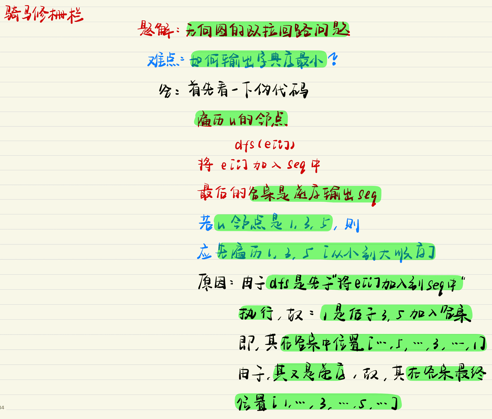

**代ç **

```c++
#include <iostream>
using namespace std;
const int N = 510, M = 1100;
int n = 500, m, cnt;
int d[N], ans[M];
int g[N][N];
void dfs(int u) {
    // éå†æ‰€æœ‰ç‚¹
    for (int i = 1; i <= n; i ++ )
        // 如æœu到i有æ¡è¾¹
        if (g[u][i]) {
            // å¹²æ‰åå‘è¾¹, 两个方å‘
            g[u][i] --, g[i][u] --;
            // 递归
            dfs(i);
        }
    // 加入答案
    ans[++ cnt] = u;
    return;
}
int main() {
    scanf("%d", &m);
    for (int i = 0; i < m; i ++ ) {
        int a, b;
        scanf("%d%d", &a, &b);
        // 标记无å‘è¾¹ a -> bå’Œb -> a
        g[a][b] ++, g[b][a] ++;
        // a的度数 ++, b的度数 ++
        d[a] ++, d[b] ++;
    }
    // å–最大值
    int start = 1e9;
    // éå†æ‰€æœ‰ç‚¹
    for (int i = 1; i <= n; i ++ )
        // 如æœè¯¥ç‚¹å­˜åœ¨
        if (d[i]) {
            // 如æœåº¦æ•°ä¸ºå¥‡æ•°
            if (d[i] & 1) {
                // 标记起点
                start = i;
                // 退出循ç¯
                break;
            }
            // 如æœåº¦æ•°ä¸ºå¶æ•°, å–最å°å€¼
            else start = min(start, i);
        }
    // ä»èµ·ç‚¹å¼€å§‹æœ, æ•°æ®ä¿è¯ä¸€å®šæœ‰è§£
    dfs(start);
    // 逆åºè¾“出
    for (int i = cnt; i; i -- ) cout << ans[i] << endl;
    return 0;
}
```

**时间å¤æ‚度**

$O(n)$

**空间å¤æ‚度**

$O(n^2)$

**标签**

`欧拉路径`

**ç¼åˆæ€ª**


### [AcWing 1185. å•è¯æ¸¸æˆ](https://www.acwing.com/problem/content/1187/)

**题目æè¿°**

>   有 `N` 个盘å­ï¼Œæ¯ä¸ªç›˜å­ä¸Šå†™ç€ä¸€ä¸ªä»…ç”±å°å†™å­—æ¯ç»„æˆçš„英文å•è¯ã€‚
>
>   你需è¦ç»™è¿™äº›ç›˜å­å®‰æ’一个åˆé€‚的顺åºï¼Œä½¿å¾—相邻两个盘å­ä¸­ï¼Œå‰ä¸€ä¸ªç›˜å­ä¸Šå•è¯çš„末字æ¯ç­‰äºå一个盘å­ä¸Šå•è¯çš„首字æ¯ã€‚
>
>   请你编写一个程åºï¼Œåˆ¤æ–­æ˜¯å¦èƒ½è¾¾åˆ°è¿™ä¸€è¦æ±‚。

**输入格å¼**

>   第一行包å«æ•´æ•° `T`，表示共有 `T` 组测试数æ®ã€‚
>
>   æ¯ç»„æ•°æ®ç¬¬ä¸€è¡ŒåŒ…å«æ•´æ•° `N`，表示盘å­æ•°é‡ã€‚
>
>   æ¥ä¸‹æ¥ `N` 行，æ¯è¡ŒåŒ…å«ä¸€ä¸ªå°å†™å­—æ¯å­—符串，表示一个盘å­ä¸Šçš„å•è¯ã€‚
>
>   一个å•è¯å¯èƒ½å‡ºç°å¤šæ¬¡ã€‚

**输出格å¼**

>   如æœå­˜åœ¨åˆæ³•è§£ï¼Œåˆ™è¾“出`â€Ordering is possible.â€`，å¦åˆ™è¾“出`â€The door cannot be opened.â€`。

**æ•°æ®èŒƒå›´**

>   +   $1≤N≤10^5,$
>   +   $å•è¯é•¿åº¦å‡ä¸è¶…过1000$

**输入样例**

```c++
3
2
acm
ibm
3
acm
malform
mouse
2
ok
ok
```

**输出样例**

```c++
The door cannot be opened.
Ordering is possible.
The door cannot be opened.
```

**手写稿**

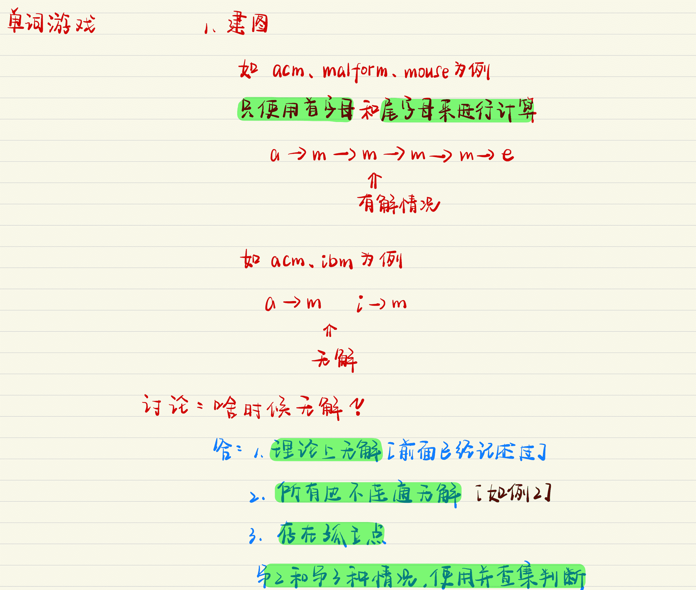

**代ç **

```c++
#include<iostream>
#include <cstring>
using namespace std;
const int N = 30, K = 1010;
int n, T;
int din[N], dout[N], p[N], st[N];
int find(int x) {
    if (p[x] == x) return p[x];
    return p[x] = find(p[x]);
}
int main() {
    char str[K];
    scanf("%d", &T);
    // T组测试数æ®
    while (T -- ) {
        // é‡ç½®
        memset(din, 0, sizeof din);
        memset(dout, 0, sizeof dout);
        memset(st, 0, sizeof st);
        // åˆå§‹åŒ–并查集数组
        for (int i = 0; i < 26; i ++ ) p[i] = i;
        scanf("%d", &n);
        for (int i = 0; i < n; i ++ ) {
            scanf("%s", str);
            int len = strlen(str);
            int a = str[0] - 'a', b = str[len - 1] - 'a';
            // 标记当å‰å­—æ¯å·²è¢«ä½¿ç”¨è¿‡
            st[a] = st[b] = true;
            // 统计入度和出度
            dout[a] ++, din[b] ++;
            int pa = find(a);
            int pb = find(b);
            // åˆå¹¶
            if (pa != pb) p[pb] = pa;
        }
        int start = 0, end = 0, succeed = true;
        for (int i = 0; i < 26; i ++ ) {
            // 如æœåº¦æ•°ä¸ç›¸ç­‰
            if (din[i] != dout[i]) {
                if (din[i] + 1 == dout[i]) start ++;
                else if (dout[i] + 1 == din[i]) end ++;
                else {
                    succeed = false;
                    break;
                }
            }
        }
        int cnt = 0;
        for (int i = 0; i < 26; i ++ )
            // 如æœå½“å‰ç‚¹å·²è¢«ç”¨è¿‡å¹¶ç»Ÿè®¡è¿é€šå—个数
            if (st[i] && p[i] == i) cnt ++;
        // 如æœè¿é€šå—个数大äº1, 说æ˜ä¸æˆåŠŸ
        if (cnt > 1) succeed = false;
        if (succeed) puts("Ordering is possible.");
        else puts("The door cannot be opened.");
    }
    return 0;
}
```

**时间å¤æ‚度**

$O(n)$

**空间å¤æ‚度**

$O(n)$

**标签**

`欧拉å›è·¯`ã€`并查集`

**ç¼åˆæ€ª**


## 拓扑æ’åº

### [U107394. 拓扑æ’åºæ¨¡æ¿](https://www.luogu.com.cn/problem/U107394)

**题目æè¿°**

>   有å‘æ— ç¯å›¾ä¸Šæœ‰ `n` 个点，`m` æ¡è¾¹ã€‚求这张图字典åºæœ€å°çš„拓扑æ’åºçš„结æœã€‚å­—å…¸åºæœ€å°æŒ‡å¸Œæœ›æ’好åºçš„结æœä¸­ï¼Œæ¯”较é å‰çš„æ•°å­—å°½å¯èƒ½å°ã€‚

**输入格å¼**

>   第一行是用空格隔开的两个整数 `n` å’Œ `m`，表示 `n` 个点和 `m` æ¡è¾¹ã€‚
>
>   æ¥ä¸‹æ¥æ˜¯ `m` 行，æ¯è¡Œç”¨ç©ºæ ¼éš”开的两个数 `u` å’Œ `v`，表示有一æ¡ä» `u` 到 `v` 的边。

**输出格å¼**

>   输出一行，拓扑æ’åºçš„结æœï¼Œæ•°å­—之间用空格隔开

**输入样例**

```c++
5 3
1 2
2 4
4 3
```

**输出样例**

```c++
1 2 4 3 5
```

**说æ˜/æ示**

>   +   $1 \leq n,m \leq 10^5$
>
>   +   $注æ„：图上å¯èƒ½æœ‰é‡è¾¹$

**手写稿**


**代ç **


**时间å¤æ‚度**


**空间å¤æ‚度**


**标签**


**ç¼åˆæ€ª**


### [LeetCode 207. 课程表](https://leetcode-cn.com/problems/course-schedule/)

**题目æè¿°**

>   你这个学期必须选修 `numCourses` 门课程，记为 `0` 到 `numCourses - 1` 。
>
>   在选修æŸäº›è¯¾ç¨‹ä¹‹å‰éœ€è¦ä¸€äº›å…ˆä¿®è¯¾ç¨‹ã€‚ 先修课程按数组 `prerequisites` 给出，其中 $prerequisites[i] = [a_i, b_i]$ ，表示如æœè¦å­¦ä¹ è¯¾ç¨‹ $a_i$ 则 å¿…é¡» 先学习课程  $b_i$ 。
>
>   例如，先修课程对 `[0, 1]` 表示：想è¦å­¦ä¹ è¯¾ç¨‹ `0` ，你需è¦å…ˆå®Œæˆè¯¾ç¨‹ `1` 。
>   请你判断是å¦å¯èƒ½å®Œæˆæ‰€æœ‰è¯¾ç¨‹çš„学习？如æœå¯ä»¥ï¼Œè¿”å› `true` ï¼›å¦åˆ™ï¼Œè¿”å› `false` 。

**示例 1**

>   输入：`numCourses = 2, prerequisites = [[1,0]]`
>   输出：`true`
>   解释：总共有 `2` 门课程。学习课程 `1` 之å‰ï¼Œä½ éœ€è¦å®Œæˆè¯¾ç¨‹ `0` 。这是å¯èƒ½çš„。

**示例 2**

>   输入：`numCourses = 2, prerequisites = [[1,0],[0,1]]`
>   输出：`false`
>   解释：总共有 `2` 门课程。学习课程 `1` 之å‰ï¼Œä½ éœ€è¦å…ˆå®Œæˆè¯¾ç¨‹ `0` ；并且学习课程 `0` 之å‰ï¼Œä½ è¿˜åº”先完æˆè¯¾ç¨‹ `1` 。这是ä¸å¯èƒ½çš„。

**æ示**

>   +   $1 <= numCourses <= 10^5$
>   +   $0 <= prerequisites.length <= 5000$
>   +   $prerequisites[i].length == 2$
>   +   $0 <= a_i, b_i < numCourses$
>   +   $prerequisites[i] 中的所有课程对 互ä¸ç›¸åŒ$

**手写稿**


**代ç **

```c++
class Solution {
public:
    bool canFinish(int n, vector<vector<int>>& gc) {
        queue<int> q;
        vector<int> d(n + 5);
        vector<vector<int>> g(n + 5);
        for (int i = 0; i < gc.size(); i ++ ) {
            int a = gc[i][0], b = gc[i][1];
            // å°†bæ’å…¥a中
            g[b].push_back(a);
            // a的入度++
            d[a] ++;
        }
        for (int i = 0; i < n; i ++ )
            // 统计所有入度为0的节点
            if (!d[i]) q.push(i);
        while (q.size()) {
            int t = q.front(); q.pop();
            for (int i = 0; i < g[t].size(); i ++ ) {
                // 入度为0, 继续下一次循ç¯
                if (!d[g[t][i]]) continue;
                // 入度 --
                d[g[t][i]] --;
                // 如æœåº¦ä¸º0, 则加入队列
                if (!d[g[t][i]]) q.push(g[t][i]);
            }
        }
        // 统计所有度为0的节点
        int res = 0;
        for (int i = 0; i < n; i ++ ) res += (d[i] == 0);
        return res == n;
    }
};
```

**时间å¤æ‚度**


**空间å¤æ‚度**


**标签**


**ç¼åˆæ€ª**


### [LeetCode 210. 课程表 II](https://leetcode-cn.com/problems/course-schedule-ii/)

**题目æè¿°**

>   ç°åœ¨ä½ æ€»å…±æœ‰ `numCourses` 门课需è¦é€‰ï¼Œè®°ä¸º `0` 到 `numCourses - 1`。给你一个数组 `prerequisites `，其中 $prerequisites[i] = [a_i, b_i]$ ，表示在选修课程 $a_i$ å‰ å¿…é¡» 先选修 $b_i$ 。
>
>   例如，想è¦å­¦ä¹ è¯¾ç¨‹ `0` ，你需è¦å…ˆå®Œæˆè¯¾ç¨‹ `1` ，我们用一个匹é…æ¥è¡¨ç¤ºï¼š`[0,1]` 。
>   è¿”å›ä½ ä¸ºäº†å­¦å®Œæ‰€æœ‰è¯¾ç¨‹æ‰€å®‰æ’的学习顺åºã€‚å¯èƒ½ä¼šæœ‰å¤šä¸ªæ­£ç¡®çš„顺åºï¼Œä½ åªè¦è¿”å› ä»»æ„ä¸€ç§ å°±å¯ä»¥äº†ã€‚如æœä¸å¯èƒ½å®Œæˆæ‰€æœ‰è¯¾ç¨‹ï¼Œè¿”å› ä¸€ä¸ªç©ºæ•°ç»„ 。

**示例 1**

>   输入：`numCourses = 2, prerequisites = [[1,0]]`
>   输出：`[0,1]`
>   解释：总共有 `2` 门课程。è¦å­¦ä¹ è¯¾ç¨‹ `1`，你需è¦å…ˆå®Œæˆè¯¾ç¨‹ `0`。因此，正确的课程顺åºä¸º `[0,1]` 。

**示例 2**

>   输入：`numCourses = 4, prerequisites = [[1,0],[2,0],[3,1],[3,2]]`
>   输出：`[0,2,1,3]`
>   解释：总共有 `4` 门课程。è¦å­¦ä¹ è¯¾ç¨‹ `3`，你应该先完æˆè¯¾ç¨‹ `1` 和课程 `2`。并且课程 `1` 和课程 `2` 都应该æ’在课程 `0` 之å。
>   因此，一个正确的课程顺åºæ˜¯ `[0,1,2,3]` 。å¦ä¸€ä¸ªæ­£ç¡®çš„æ’åºæ˜¯ `[0,2,1,3]` 。

**示例 3**

>   输入：`numCourses = 1, prerequisites = []`
>   输出：`[0]`

**æ示**

>   +   $1 <= numCourses <= 2000$
>   +   $0 <= prerequisites.length <= numCourses * (numCourses - 1)$
>   +   $prerequisites[i].length == 2$
>   +   $0 <= a_i, b_i < numCourses$
>   +   $a_i != b_i$
>   +   $所有[a_i, b_i] 互ä¸ç›¸åŒ$

**手写稿**

>   1.   详细手写稿, 请看上一题
>   2.   记录答案å³å¯

**代ç **

```c++
class Solution {
public:
    vector<int> findOrder(int n, vector<vector<int>>& g) {
        queue<int> q;
        vector<int> d(n + 5);
        vector<vector<int>> course(n + 5);
        for (int i = 0; i < g.size(); i ++ ) {
            int a = g[i][0], b = g[i][1];
            course[b].push_back(a);
            d[a] ++;
        }
        vector<int> res;
        for (int i = 0; i < n; i ++ )
            // 将所有入度为0的点全部加入答案
            if (!d[i]) {
                q.push(i);
                res.push_back(i);
            }
        while (q.size()) {
            int t = q.front(); q.pop();
            // 注æ„: 长度为course[t].size()而ä¸æ˜¯n
            for (int i = 0; i < course[t].size(); i ++ ) {
                if (!d[course[t][i]]) continue;
                d[course[t][i]] -- ;
                // 入度为0, 加入队列, 加入答案
                if (!d[course[t][i]]) {
                    q.push(course[t][i]);
                    res.push_back(course[t][i]);
                }
            }
        }
        // 答案个数ä¸æ»¡n, 则清空答案数组
        if (res.size() != n) res = {};
        return res;
    }
};
```

**时间å¤æ‚度**

$O(n + m), n是点数, m是边数$

**空间å¤æ‚度**

$O(n + m), n是点数, m是边数$

**标签**

`拓扑æ’åº`

**ç¼åˆæ€ª**


### [AcWing 848. 有å‘图的拓扑åºåˆ—](https://www.acwing.com/problem/content/description/850/)

**题目æè¿°**

>   给定一个 `n` 个点 `m` æ¡è¾¹çš„有å‘图，点的编å·æ˜¯ `1` 到 `n`，图中å¯èƒ½å­˜åœ¨é‡è¾¹å’Œè‡ªç¯ã€‚
>
>   请输出任æ„一个该有å‘图的拓扑åºåˆ—，如æœæ‹“扑åºåˆ—ä¸å­˜åœ¨ï¼Œåˆ™è¾“出 `−1`。
>
>   若一个由图中所有点æ„æˆçš„åºåˆ— `A` 满足：对äºå›¾ä¸­çš„æ¯æ¡è¾¹ `(x,y)`，`x` 在 `A` 中都出ç°åœ¨ `y` 之å‰ï¼Œåˆ™ç§° `A` 是该图的一个拓扑åºåˆ—。

**输入格å¼**

>   第一行包å«ä¸¤ä¸ªæ•´æ•° `n` å’Œ `m`。
>
>   æ¥ä¸‹æ¥ `m` 行，æ¯è¡ŒåŒ…å«ä¸¤ä¸ªæ•´æ•° `x` å’Œ `y`，表示存在一æ¡ä»ç‚¹ `x` 到点 `y` 的有å‘è¾¹ `(x,y)`。

**输出格å¼**

>   共一行，如æœå­˜åœ¨æ‹“扑åºåˆ—，则输出任æ„一个åˆæ³•çš„拓扑åºåˆ—å³å¯ã€‚
>
>   å¦åˆ™è¾“出 `−1`。

**æ•°æ®èŒƒå›´**

>   +   $1≤n,m≤10^5$

**输入样例**

```c++
3 3
1 2
2 3
1 3
```

**输出样例**

```c++
1 2 3
```

**手写稿**

>   1.   找到所有入度为 `0` 的点, 将其加入到队列中å³å¯
>   2.   如此循ç¯å¾€å¤, å³å¾—答案

**代ç **

```c++
#include <iostream>
#include <cstring>
using namespace std;
const int N = 100010;
int n, m, idx;
int h[N], e[N], ne[N], q[N], d[N];
void add(int a, int b) {
    e[idx] = b;
    ne[idx] = h[a];
    h[a] = idx ++;
    return;
}
void topsort() {
    int hh = 0, tt = -1;
    // éå†æ‰€æœ‰ç‚¹
    for (int i = 1; i <= n; i ++ )
        // 将所有入度为0的点加入到队列中
        if (!d[i])
            q[ ++ tt] = i;
    while (hh <= tt) {
        int t = q[hh ++ ];
        // éå†t的所有邻点
        for (int i = h[t]; i != -1; i = ne[i]) {
            int j = e[i];
            // 如æœå…¥åº¦ä¸º0, 则将其加入到队列中
            if (-- d[j] == 0) q[ ++ tt] = j;
        }
    }
    // 点数ä¸è¶³n, 说æ˜æ— è§£
    if (tt + 1 < n) puts("-1");
    // 输出答案
    else
        for (int i = 0; i < n; i ++ ) cout << q[i] << " ";
    return;
}
int main() {
    scanf("%d%d", &n, &m);
    memset(h, -1, sizeof h);
    for (int i = 0; i < m; i ++ ) {
        int a, b;
        scanf("%d%d", &a, &b);
        add(a, b);
        // b的入度 ++
        d[b] ++;
    }
    topsort();
    return 0;
}
```

**时间å¤æ‚度**

$O(n + m)$

**空间å¤æ‚度**

$O(n)$

**标签**

`拓扑æ’åº`

**ç¼åˆæ€ª**


### [AcWing 1191. 家谱树](https://www.acwing.com/problem/content/1193/)

**题目æè¿°**

>   有个人的家æ—很大，辈分关系很混乱，请你帮整ç†ä¸€ä¸‹è¿™ç§å…³ç³»ã€‚
>
>   给出æ¯ä¸ªäººçš„å­©å­çš„ä¿¡æ¯ã€‚
>
>   输出一个åºåˆ—，使得æ¯ä¸ªäººçš„å­©å­éƒ½æ¯”那个人å列出。

**输入格å¼**

>   第 `1` 行一个整数 `n`，表示家æ—的人数；
>
>   æ¥ä¸‹æ¥ `n` 行，第 `i` è¡Œæ述第 `i` 个人的孩å­ï¼›
>
>   æ¯è¡Œæœ€å是 `0` 表示æ述完毕。
>
>   æ¯ä¸ªäººçš„ç¼–å·ä» `1` 到 `n`。

**输出格å¼**

>   输出一个åºåˆ—，使得æ¯ä¸ªäººçš„å­©å­éƒ½æ¯”那个人å列出；
>
>   æ•°æ®ä¿è¯ä¸€å®šæœ‰è§£ï¼Œå¦‚æœæœ‰å¤šè§£è¾“出任æ„一解。

**æ•°æ®èŒƒå›´**

>   +   $1≤n≤100$

**输入样例**

```c++
5
0
4 5 1 0
1 0
5 3 0
3 0
```

**输出样例**

```c++
2 4 5 3 1
```

**手写稿**

>   1.   模æ¿é¢˜

**代ç **

```c++
#include <iostream>
#include <cstring>
using namespace std;
const int N = 110, M = 10010;
int n, idx;
int h[N], e[M], ne[M], q[N], d[N];
void add(int a, int b) {
    e[idx] = b;
    ne[idx] = h[a];
    h[a] = idx ++;
    return;
}
void topsort() {
    int hh = 0, tt = -1;
    // éå†æ‰€æœ‰ç‚¹
    for (int i = 1; i <= n; i ++ )
        // 如æœå…¥åº¦ä¸º0, 则加入队列
        if (!d[i])
            q[ ++ tt] = i;
    while (hh <= tt) {
        int t = q[hh ++ ];
        for (int i = h[t]; i != -1; i = ne[i]) {
            int j = e[i];
            // 寻找入度为0的点
            if ( -- d[j] == 0) q[ ++ tt ] = j;
        }
    }
    return;
}
int main() {
    scanf("%d", &n);
    memset(h, -1, sizeof h);
    for (int i = 1; i <= n; i ++ ) {
        int son;
        while (~scanf("%d", &son), son) {
            // 加边
            add(i, son);
            // son的入度 ++ 
            d[son] ++;
        }
    }
    topsort();
    for (int i = 0; i < n; i ++ ) cout << q[i] << " ";
    return 0;
}
```

**时间å¤æ‚度**

$O(n + e)$

**空间å¤æ‚度**

$O(n)$

**标签**

`拓扑æ’åº`

**ç¼åˆæ€ª**


### [AcWing 1192. 奖金](https://www.acwing.com/problem/content/1194/)

**题目æè¿°**

>   ç”±äºæ— æ•Œçš„凡凡在`2005`年世界英俊帅气男总决选中胜出，``Yali Company``总ç»ç†`Mr.Z`心情好，决定给æ¯ä½å‘˜å·¥å‘奖金。
>
>   å…¬å¸å†³å®šä»¥æ¯ä¸ªäººæœ¬å¹´åœ¨å…¬å¸çš„贡献为标准æ¥è®¡ç®—他们得到奖金的多少。
>
>   äºæ˜¯`Mr.Z`下令å¬å¼€ `m` 方会谈。
>
>   æ¯ä½å‚加会谈的代表æ出了自己的æ„è§ï¼šâ€œæˆ‘认为员工 `a` 的奖金应该比 `b` 高ï¼â€
>
>   `Mr.Z`决定è¦æ‰¾å‡ºä¸€ç§å¥–金方案，满足å„ä½ä»£è¡¨çš„æ„è§ï¼Œä¸”åŒæ—¶ä½¿å¾—总奖金数最少。
>
>   æ¯ä½å‘˜å·¥å¥–金最少为`100`元，且必须是整数。

**输入格å¼**

>   第一行包å«æ•´æ•° `n,m`，分别表示公å¸å†…员工数以åŠå‚会代表数。
>
>   æ¥ä¸‹æ¥ `m` 行，æ¯è¡Œ `2` 个整数 `a,b`，表示æŸä¸ªä»£è¡¨è®¤ä¸ºç¬¬ `a` å·å‘˜å·¥å¥–金应该比第 `b` å·å‘˜å·¥é«˜ã€‚

**输出格å¼**

>   若无法找到åˆç†æ–¹æ¡ˆï¼Œåˆ™è¾“出`“Poor Xedâ€`ï¼›
>
>   å¦åˆ™è¾“出一个数表示最少总奖金。

**æ•°æ®èŒƒå›´**

>   +   $1≤n≤10000,$
>   +   $1≤m≤20000$

**输入样例**

```c++
2 1
1 2
```

**输出样例**

```c++
201
```

**手写稿**

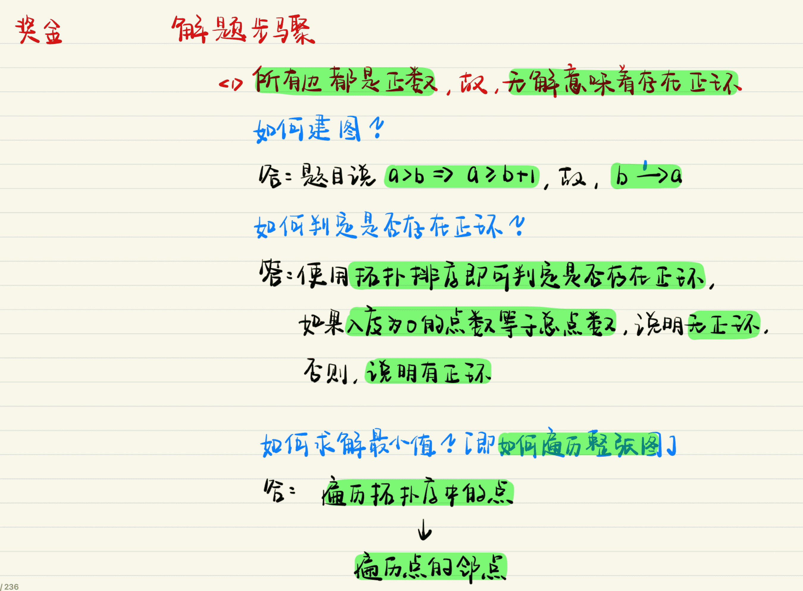

**代ç **

```c++
#include <iostream>
#include <cstring>
using namespace std;
const int N = 10010, M = 20010;
int n, m, idx;
int h[N], e[M], ne[M], d[N], q[N], dist[N];
void add(int a, int b) {
    e[idx] = b;
    ne[idx] = h[a];
    h[a] = idx ++;
    return;
}
bool topsort() {
    int hh = 0, tt = -1;
    // éå†æ¯ä¸ªç‚¹
    for (int i = 1; i <= n; i ++ )
        // 寻找入度为0的点并将其加入队列
        if (!d[i])
            q[ ++ tt] = i;
    while (hh <= tt) {
        int t = q[hh ++ ];
        // éå†é‚»è¾¹
        for (int i = h[t]; i != -1; i = ne[i]) {
            int j = e[i];
            // 若度数为0, 则将其加入队列
            if (-- d[j] == 0)
                q[ ++ tt] = j;
        }
    }
    // 查看是å¦æœ‰ç¯
    return tt + 1 == n;
}
int main() {
    scanf("%d%d", &n, &m);
    memset(h, -1, sizeof h);
    for (int i = 0; i < m; i ++ ) {
        int a, b;
        scanf("%d%d", &a, &b);
        // ä»b到aè¿ä¸€æ¡è¾¹
        add(b, a);
        d[a] ++;
    }
    if (!topsort()) puts("Poor Xed");
    else {
        // 最ä½ä¸º100
        for (int i = 1; i <= n; i ++ ) dist[i] = 100;
        for (int i = 0; i < n; i ++ ) {
            int j = q[i];
            for (int k = h[j]; k != -1; k = ne[k])
                dist[e[k]] = max(dist[e[k]], dist[j] + 1);
        }
        int res = 0;
        for (int i = 1; i <= n; i ++ ) res += dist[i];
        cout << res << endl;
    }
    return 0;
}
```

**时间å¤æ‚度**

$O(n + m)$

**空间å¤æ‚度**

$O(m)$

**标签**

`拓扑æ’åº`

**ç¼åˆæ€ª**


### [AcWing 164. å¯è¾¾æ€§ç»Ÿè®¡](https://www.acwing.com/problem/content/166/)

**题目æè¿°**

>   给定一张 `N` 个点 `M` æ¡è¾¹çš„有å‘æ— ç¯å›¾ï¼Œåˆ†åˆ«ç»Ÿè®¡ä»æ¯ä¸ªç‚¹å‡ºå‘能够到达的点的数é‡ã€‚

**输入格å¼**

>   第一行两个整数 `N,M`，æ¥ä¸‹æ¥ `M` è¡Œæ¯è¡Œä¸¤ä¸ªæ•´æ•° `x,y`ï¼Œè¡¨ç¤ºä» `x` 到 `y` 的一æ¡æœ‰å‘边。

**输出格å¼**

>   输出共 `N` 行，表示æ¯ä¸ªç‚¹èƒ½å¤Ÿåˆ°è¾¾çš„点的数é‡ã€‚

**æ•°æ®èŒƒå›´**

>   +   $1≤N,M≤30000$

**输入样例**

```c++
10 10
3 8
2 3
2 5
5 9
5 9
2 3
3 9
4 8
2 10
4 9
```

**输出样例**

```c++
1
6
3
3
2
1
1
1
1
1
```

**手写稿**

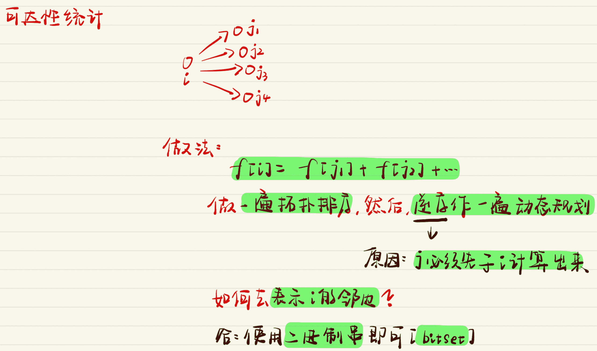

**代ç **

```c++
#include <iostream>
#include <cstring>
#include <bitset>
using namespace std;
const int N = 30010;
int n, m, idx;
int h[N], e[N], ne[N], d[N], q[N];
bitset<N> f[N];
void add(int a, int b) {
    e[idx] = b;
    ne[idx] = h[a];
    h[a] = idx ++;
    return;
}
void topsort() {
    int hh = 0, tt = -1;
    // éå†æ‰€æœ‰ç‚¹
    for (int i = 1; i <= n; i ++ )
        // 如æœåº¦æ•°ä¸º0, 则将其加入队列
        if (!d[i])
            q[ ++ tt] = i;
    while (hh <= tt) {
        int t = q[hh ++ ];
        for (int i = h[t]; i != -1; i = ne[i]) {
            int j = e[i];
            // 如æœåº¦æ•°ä¸º0, 则将其加入队列
            if (-- d[j] == 0)
                q[ ++ tt] = j;
        }
    }
    return;
}
int main() {
    scanf("%d%d", &n, &m);
    memset(h, -1, sizeof h);
    for (int i = 0; i < m; i ++ ) {
        int a, b;
        scanf("%d%d", &a, &b);
        add(a, b);
        d[b] ++;
    }
    topsort();
    // 逆åº
    for (int i = n - 1; i >= 0; i -- ) {
        int j = q[i];
        // j -> jå¯ä»¥ç›¸è¿
        f[j][j] = 1;
        for (int k = h[j]; k != -1; k = ne[k])
            f[j] |= f[e[k]];
    }
    // 统计1的个数
    for (int i = 1; i <= n; i ++ ) cout << f[i].count() << endl;
    return 0;
}
```

**时间å¤æ‚度**

$O(m * n / 32)$

**空间å¤æ‚度**

$O(n)$

**标签**

`拓扑æ’åº`ã€`动æ€è§„划`

**ç¼åˆæ€ª**


### [AcWing 456. 车站分级](https://www.acwing.com/problem/content/458/)

**题目æè¿°**

>   一æ¡å•å‘çš„é“路线上，ä¾æ¬¡æœ‰ç¼–å·ä¸º `1, 2, …, n` 的 `n` 个ç«è½¦ç«™ã€‚
>
>   æ¯ä¸ªç«è½¦ç«™éƒ½æœ‰ä¸€ä¸ªçº§åˆ«ï¼Œæœ€ä½ä¸º `1` 级。
>
>   ç°æœ‰è‹¥å¹²è¶Ÿè½¦æ¬¡åœ¨è¿™æ¡çº¿è·¯ä¸Šè¡Œé©¶ï¼Œæ¯ä¸€è¶Ÿéƒ½æ»¡è¶³å¦‚下è¦æ±‚：如æœè¿™è¶Ÿè½¦æ¬¡åœé äº†ç«è½¦ç«™ `x`，则始å‘ç«™ã€ç»ˆç‚¹ç«™ä¹‹é—´æ‰€æœ‰çº§åˆ«å¤§äºç­‰äºç«è½¦ç«™ `x` 的都必须åœé ã€‚（注æ„：起始站和终点站自然也算作事先已知需è¦åœé çš„站点） 
>
>   例如，下表是 `5` 趟车次的è¿è¡Œæƒ…况。
>
>   å…¶ä¸­ï¼Œå‰ `4` 趟车次å‡æ»¡è¶³è¦æ±‚，而第 `5` 趟车次由äºåœé äº† `3` å·ç«è½¦ç«™ï¼ˆ`2` 级）å´æœªåœé é€”ç»çš„ `6` å·ç«è½¦ç«™ï¼ˆäº¦ä¸º `2` 级）而ä¸æ»¡è¶³è¦æ±‚。
>
>   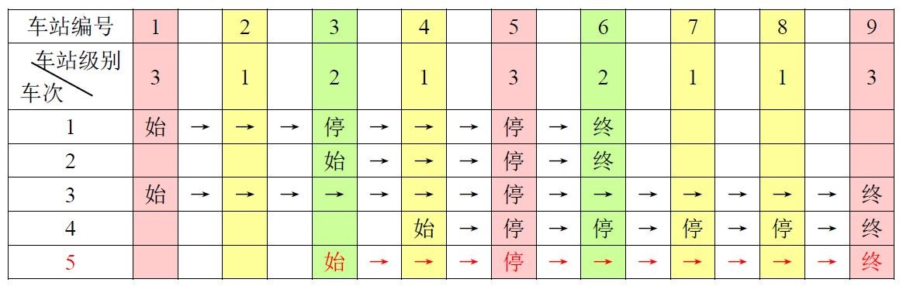
>
>   ç°æœ‰ `m` 趟车次的è¿è¡Œæƒ…况（全部满足è¦æ±‚），试æ¨ç®—è¿™ `n` 个ç«è½¦ç«™è‡³å°‘分为几个ä¸åŒçš„级别。

**输入格å¼**

>   ç¬¬ä¸€è¡ŒåŒ…å« `2` 个正整数 `n,m`，用一个空格隔开。
>
>   第 `i+1` 行（`1≤i≤m`）中，首先是一个正整数 $s_i$（$2≤s_i≤n$），表示第 `i` 趟车次有 $s_i$ 个åœé ç«™ï¼›æ¥ä¸‹æ¥æœ‰ $s_i$ 个正整数，表示所有åœé ç«™çš„ç¼–å·ï¼Œä»å°åˆ°å¤§æ’列。
>
>   æ¯ä¸¤ä¸ªæ•°ä¹‹é—´ç”¨ä¸€ä¸ªç©ºæ ¼éš”开。输入ä¿è¯æ‰€æœ‰çš„车次都满足è¦æ±‚。

**输出格å¼**

>   输出åªæœ‰ä¸€è¡Œï¼ŒåŒ…å«ä¸€ä¸ªæ­£æ•´æ•°ï¼Œå³ `n` 个ç«è½¦ç«™æœ€å°‘划分的级别数。

**æ•°æ®èŒƒå›´**

>   +   $1≤n,m≤1000$

**输入样例**

```c++
9 3 
4 1 3 5 6 
3 3 5 6 
3 1 5 9 
```

**输出样例**

```c++
3
```

**手写稿**

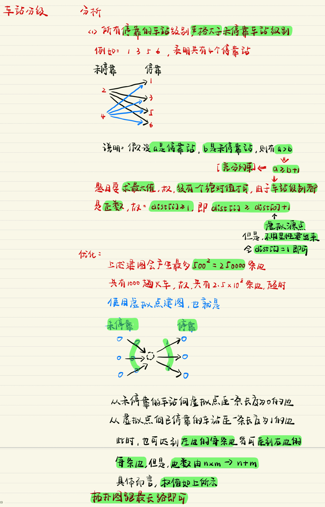

**代ç **

```c++
#include <iostream>
#include <cstring>
using namespace std;
const int N = 2010, M = 1000010, K = 1010;
int n, m, idx;
int h[N], e[M], w[M], ne[M], st[K], d[N], q[N], dist[N];
void add(int a, int b, int c) {
    e[idx] = b;
    w[idx] = c;
    ne[idx] = h[a];
    h[a] = idx ++;
    return;
}
void topsort() {
    int hh = 0, tt = -1;
    // 注æ„: n + mæ¡è¾¹
    for (int i = 1; i <= n + m; i ++ )
        // 入度为0, 则入队
        if (!d[i])
            q[++ tt] = i;
    while (hh <= tt) {
        int t = q[hh ++ ];
        for (int i = h[t]; i != -1; i = ne[i]) {
            int j = e[i];
            if (-- d[j] == 0) q[++ tt] = j;
        }
    }
    return;
}
int main() {
    scanf("%d%d", &n, &m);
    memset(h, -1, sizeof h);
    for (int i = 1; i <= m; i ++ ) {
        int cnt;
        memset(st, 0, sizeof st);
        scanf("%d", &cnt);
        // 统计起始点和终止点
        // åŸå› : 起点站ä¸ä¸€å®šæ˜¯1å·ç‚¹, 终点站也ä¸ä¸€å®šæ˜¯nå·ç‚¹
        int start = n, end = 1;
        while (cnt -- ) {
            int stop;
            scanf("%d", &stop);
            start = min(start, stop);
            end = max(end, stop);
            // 标记此站已被åœé 
            st[stop] = true;
        }
        // 建立虚拟æºèŠ‚点
        int source = n + i;
        // ä»å¼€å¤´åˆ°ç»“æŸ
        for (int j = start; j <= end; j ++ )
            // 如æœæ­¤ç«™æœªè¢«åœé 
            if (!st[j]) {
                // ä»æ­¤ç«™åˆ°è™šæ‹ŸèŠ‚点添加一æ¡æƒå€¼ä¸º0çš„è¾¹
                add(j, source, 0);
                // 入度 ++
                d[source] ++;
            }
            else { // 此站被åœé 
                // ä»æ­¤ç«™åˆ°è™šæ‹ŸèŠ‚点添加一æ¡æƒå€¼ä¸º1çš„è¾¹
                add(source, j, 1);
                // 入度 ++
                d[j] ++;
            }
    }
    // 拓扑æ’åº
    topsort();
    // åˆå§‹åŒ–[手写稿解释]
    for (int i = 1; i <= n; i ++ ) dist[i] = 1;
    // 注æ„: â•ä¸Šè™šæ‹ŸèŠ‚点,一共是n + mæ¡è¾¹
    for (int i = 0; i < n + m; i ++ ) {
        int j = q[i];
        for (int k = h[j]; k != -1; k = ne[k])
            dist[e[k]] = max(dist[e[k]], dist[j] + w[k]);
    }
    int res = 0;
    // 统计最长路
    for (int i = 0; i < n + m; i ++ ) res = max(res, dist[i]);
    cout << res << endl;
    return 0;
}
```

**时间å¤æ‚度**

$(n + m ^ 2)$

**空间å¤æ‚度**

$O(m)$

**标签**

`拓扑æ’åº`ã€`建图`

**ç¼åˆæ€ª**


### [AcWing 477. ç¥ç»ç½‘络](https://www.acwing.com/problem/content/description/479/)

**题目æè¿°**

>   人工ç¥ç»ç½‘络`（Artificial Neural Network）`是一ç§æ–°å…´çš„具有自我学习能力的计算系统，在模å¼è¯†åˆ«ã€å‡½æ•°é€¼è¿‘åŠè´·æ¬¾é£é™©è¯„估等诸多领域有广泛的应用。
>
>   对ç¥ç»ç½‘络的研究一直是当今的热门方å‘，兰兰åŒå­¦åœ¨è‡ªå­¦äº†ä¸€æœ¬ç¥ç»ç½‘络的入门书ç±å，æ出了一个简化模å‹ï¼Œä»–希望你能帮助他用程åºæ£€éªŒè¿™ä¸ªç¥ç»ç½‘络模å‹çš„å®ç”¨æ€§ã€‚
>
>   在兰兰的模å‹ä¸­ï¼Œç¥ç»ç½‘络就是一张有å‘图，图中的节点称为ç¥ç»å…ƒï¼Œè€Œä¸”两个ç¥ç»å…ƒä¹‹é—´è‡³å¤šæœ‰ä¸€æ¡è¾¹ç›¸è¿ï¼Œä¸‹å›¾æ˜¯ä¸€ä¸ªç¥ç»å…ƒçš„例å­ï¼š
>
>   
>
>   图中，$X_1—X_3$是信æ¯è¾“入渠é“，$Y_1ï¼Y_2$ 是信æ¯è¾“出渠é“，$C_1$ 表示ç¥ç»å…ƒç›®å‰çš„状æ€ï¼Œ$U_i$ 是阈值，å¯è§†ä¸ºç¥ç»å…ƒçš„一个内在å‚数。 
>
>   ç¥ç»å…ƒæŒ‰ä¸€å®šçš„顺åºæ’列，æ„æˆæ•´ä¸ªç¥ç»ç½‘络。
>
>   在兰兰的模å‹ä¹‹ä¸­ï¼Œç¥ç»ç½‘络中的ç¥ç»å…ƒåˆ†ä¸ºå‡ å±‚；称为输入层ã€è¾“出层，和若干个中间层。
>
>   æ¯å±‚ç¥ç»å…ƒåªå‘下一层的ç¥ç»å…ƒè¾“出信æ¯ï¼Œåªä»ä¸Šä¸€å±‚ç¥ç»å…ƒæ¥å—ä¿¡æ¯ã€‚
>
>   下图是一个简å•çš„三层ç¥ç»ç½‘络的例å­ã€‚
>
>   
>
>   兰兰规定，$C_i$ æœä»å…¬å¼ï¼šï¼ˆå…¶ä¸­ `n` 是网络中所有ç¥ç»å…ƒçš„数目）
>
>   
>
>   å…¬å¼ä¸­çš„$W_{ji}$（å¯èƒ½ä¸ºè´Ÿå€¼ï¼‰è¡¨ç¤ºè¿æ¥ $j$ å·ç¥ç»å…ƒå’Œ $i$ å·ç¥ç»å…ƒçš„边的æƒå€¼ã€‚
>
>   当 $C_i$ å¤§äº `0` 时，该ç¥ç»å…ƒå¤„äºå…´å¥‹çŠ¶æ€ï¼Œå¦åˆ™å°±å¤„äºå¹³é™çŠ¶æ€ã€‚
>
>   当ç¥ç»å…ƒå¤„äºå…´å¥‹çŠ¶æ€æ—¶ï¼Œä¸‹ä¸€ç§’它会å‘其他ç¥ç»å…ƒä¼ é€ä¿¡å·ï¼Œä¿¡å·çš„强度为 $C_i$。
>
>   如此ï¼åœ¨è¾“入层ç¥ç»å…ƒè¢«æ¿€å‘之å，整个网络系统就在信æ¯ä¼ è¾“çš„æ¨åŠ¨ä¸‹è¿›è¡Œè¿ä½œã€‚
>
>   ç°åœ¨ï¼Œç»™å®šä¸€ä¸ªç¥ç»ç½‘络，åŠå½“å‰è¾“入层ç¥ç»å…ƒçš„状æ€ï¼ˆ$C_i$），è¦æ±‚你的程åºè¿ç®—出最å网络输出层的状æ€ã€‚

**输入格å¼**

>   输入文件第一行是两个整数 `n` 和 `p`。
>
>   æ¥ä¸‹æ¥ `n` 行，æ¯è¡Œä¸¤ä¸ªæ•´æ•°ï¼Œç¬¬ `i＋1` 行是ç¥ç»å…ƒi最åˆçŠ¶æ€å’Œå…¶é˜ˆå€¼ï¼ˆ$U_i$）。**注æ„** 输入层给定的状æ€å³ä¸ºæœ€ç»ˆå€¼ï¼Œä¸éœ€è¦å†å‡å» $U_i$，é输入层的ç¥ç»å…ƒå¼€å§‹æ—¶çŠ¶æ€å¿…然为 `0`。
>
>   å†ä¸‹é¢ `P` 行，æ¯è¡Œæœ‰ä¸¤ä¸ªæ•´æ•° `i，j` åŠä¸€ä¸ªæ•´æ•° $W_{ij}$，表示è¿æ¥ç¥ç»å…ƒ `iã€j` çš„è¾¹æƒå€¼ä¸º $W_{ij}$。

**输出格å¼**

>   输出文件包å«è‹¥å¹²è¡Œï¼Œæ¯è¡Œæœ‰ä¸¤ä¸ªæ•´æ•°ï¼Œåˆ†åˆ«å¯¹åº”一个ç¥ç»å…ƒçš„ç¼–å·ï¼ŒåŠå…¶æœ€å的状æ€ï¼Œä¸¤ä¸ªæ•´æ•°é—´ä»¥ç©ºæ ¼åˆ†éš”。
>
>   仅输出最å状æ€å¤§äºé›¶çš„输出层ç¥ç»å…ƒçŠ¶æ€ï¼Œå¹¶ä¸”按照编å·ç”±å°åˆ°å¤§é¡ºåºè¾“出。
>
>   若输出层的ç¥ç»å…ƒæœ€å状æ€å‡ä¸º `0`，则输出 `NULL`。

**æ•°æ®èŒƒå›´**

>   +   $1≤n≤100$

**输入样例**

```c++
5 6
1 0
1 0
0 1
0 1
0 1
1 3 1
1 4 1
1 5 1
2 3 1
2 4 1
2 5 1
```

**输出样例**

```c++
3 1
4 1
5 1
```

**手写稿**

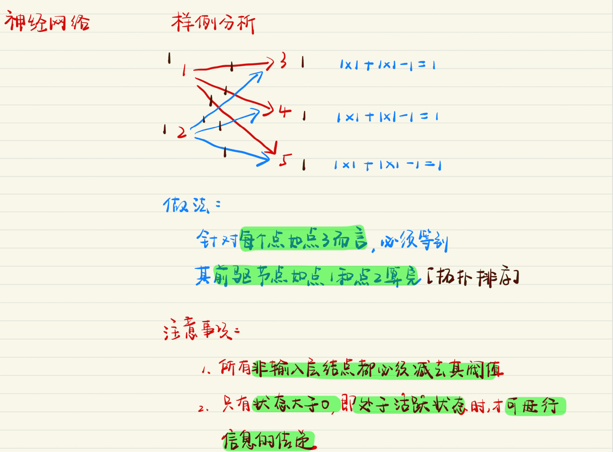

**代ç **

```c++
#include <iostream>
#include <cstring>
using namespace std;
const int N = 110, M = 10010;
int n, m, idx;
int f[N], u[N], h[N], e[M], w[M], ne[M], din[N], dout[N], q[N];
void add(int a, int b, int c) {
    e[idx] = b;
    w[idx] = c;
    ne[idx] = h[a];
    h[a] = idx ++;
    return;
}
void topsort() {
    int hh = 0, tt = -1;
    for (int i = 1; i <= n; i ++ )
        if (!din[i])
            q[++ tt] = i;
    while (hh <= tt) {
        int t = q[hh ++ ];
        for (int i = h[t]; i != -1; i = ne[i]) {
            int j = e[i];
            if (-- din[j] == 0) q[++ tt] = j;
        }
    }
    return;
}
int main() {
    scanf("%d%d", &n, &m);
    memset(h, -1, sizeof h);
    for (int i = 1; i <= n; i ++ ) scanf("%d%d", &f[i], &u[i]);
    for (int i = 0; i < m; i ++ ) {
        int a, b, c;
        scanf("%d%d%d", &a, &b, &c);
        add(a, b, c);
        // 统计入度和出度
        dout[a] ++, din[b] ++;
    }
    // 所有é输入层(din[i] > 0)都必须å‡å»é˜€å€¼
    for (int i = 1; i <= n; i ++ )
        if (din[i]) f[i] -= u[i];
    topsort();
    for (int i = 0; i < n; i ++ ) {
        int j = q[i];
        // 当f[j] > 0的时候, 处äºå…´å¥‹çŠ¶æ€, æ‰å¯ä»¥ä¼ é€’ä¿¡æ¯
        if (f[j] <= 0) continue;
        for (int k = h[j]; k != -1; k = ne[k])
            f[e[k]] += f[j] * w[k];
    }
    int flag = false;
    for (int i = 1; i <= n; i ++ ) {
        // 当节点iæ˜¯è¾“å‡ºå±‚å¹¶ä¸”çŠ¶æ€ > 0, æ‰è¾“出
        if (!dout[i] && f[i] > 0) {
            printf("%d %d\n", i, f[i]);
            flag = true;
        }
    }
    if (!flag) puts("NULL");
    return 0;
}
```

**时间å¤æ‚度**

$O(n + m)$

**空间å¤æ‚度**

$O(n)$

**标签**

`拓扑æ’åº`

**ç¼åˆæ€ª**


# æ•°æ®ç»“æ„


## 并查集

### åŸç†

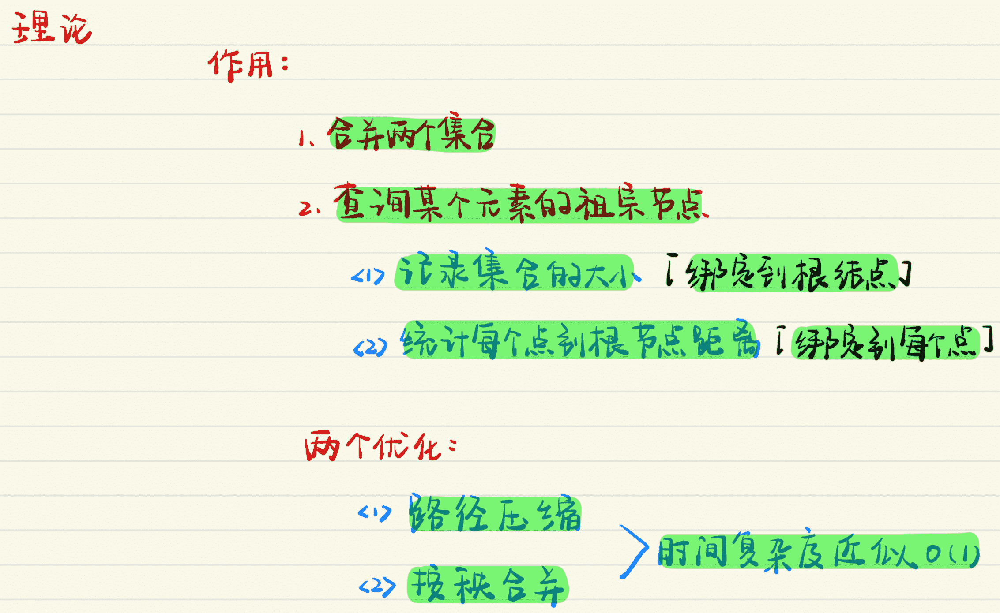

### [AcWing 836. åˆå¹¶é›†åˆ](https://www.acwing.com/problem/content/838/)

**题目æè¿°**

>   一共有 `n` 个数，编å·æ˜¯ `1 ∼ n`，最开始æ¯ä¸ªæ•°å„自在一个集åˆä¸­ã€‚
>
>   ç°åœ¨è¦è¿›è¡Œ `m` 个æ“作，æ“作共有两ç§ï¼š
>
>   1.  `M a b`，将编å·ä¸º `a` å’Œ `b` 的两个数所在的集åˆåˆå¹¶ï¼Œå¦‚æœä¸¤ä¸ªæ•°å·²ç»åœ¨åŒä¸€ä¸ªé›†åˆä¸­ï¼Œåˆ™å¿½ç•¥è¿™ä¸ªæ“作；
>   2.  `Q a b`，询问编å·ä¸º `a` å’Œ `b` 的两个数是å¦åœ¨åŒä¸€ä¸ªé›†åˆä¸­ï¼›

**输入格å¼**

>   第一行输入整数 `n` 和 `m`。
>
>   æ¥ä¸‹æ¥ `m` 行，æ¯è¡ŒåŒ…å«ä¸€ä¸ªæ“作指令，指令为 `M a b` 或 `Q a b` 中的一ç§ã€‚

**输出格å¼**

>   对äºæ¯ä¸ªè¯¢é—®æŒ‡ä»¤ `Q a b`，都è¦è¾“出一个结æœï¼Œå¦‚æœ `a` å’Œ `b` 在åŒä¸€é›†åˆå†…，则输出 `Yes`，å¦åˆ™è¾“出 `No`。
>
>   æ¯ä¸ªç»“æœå ä¸€è¡Œã€‚

**æ•°æ®èŒƒå›´**

>   +   $1 ≤ n, m ≤ 10^5$

**输入样例**

```c++
4 5
M 1 2
M 3 4
Q 1 2
Q 1 3
Q 3 4
```

**输出样例**

```c++
Yes
No
Yes
```

**手写稿**

>   1.   开始时æ¯ä¸ªé›†åˆéƒ½æ˜¯ä¸€ä¸ªç‹¬ç«‹çš„集åˆ,并且都是等äºè‡ªå·±æœ¬èº«ä¸‹æ ‡çš„æ•°
>   2.   例 `1`:
>        `p[5] = 5, p[3] = 3;`
>        如æœæ˜¯ `M` æ“作的è¯é‚£ä¹ˆå°±å°†é›†åˆè¿›è¡Œåˆå¹¶,åˆå¹¶çš„æ“作是:
>        `p[3] = p[5] = 5;`
>        所以 `3` 的祖宗节点便æˆä¸ºäº† `5`
>        此时以 `5` 为祖宗节点的集åˆä¸º `{5，3}`
>        如æœè¦å°† `p[9] = 9` æ’入到 `p[3]` 当中,应该找到 `3` 的祖宗节点,
>        然åå†æŠŠ `p[9] = 9` æ’入其中,所以`p[9] = find(3);`(`find()`函数用äºæŸ¥æ‰¾ç¥–宗节点)
>        也å¯ä»¥æ˜¯`p[find(9)] = find(3)`,因为 `9` 的节点本身就是 `9`
>        此时以 `5` 为祖宗节点的集åˆä¸º `{5, 3, 9};`
>        如æœç¢°åˆ°å¤šä¸ªæ•°çš„集åˆæ’å…¥å¦ä¸€ä¸ªé›†åˆå½“中其åŸç†æ˜¯ç›¸åŒçš„
>   3.   例 `2`:
>        上述中以 `5` 为祖宗节点的是`p[5], p[3], p[9];`(å³`p[5] = 5, p[3] = 5, p[9] = 5`)
>        å†æ„造一个以 `6` 为祖宗节点的集åˆä¸º `{6, 4, 7, 10}`
>        如æœè¦å°†ä»¥ `6` 为祖宗节点的集åˆæ’入到以 `5` 为祖宗节点的集åˆ,则该æ“作å¯ä»¥æ˜¯
>        `p[6] = find(3)`（或者`find(9), find(5)`）
>        此时`p[6] = 5`
>        当然如æœæ˜¯ä»¥ `6` 为祖宗节点集åˆä¸­çš„`4, 7, 10`则å¯ä»¥è¿™æ ·
>        `p[find(4)] = find(3)`
>        或者`p[find(7)] = find(3)`å‡å¯ä»¥
>        此时以 `6` 为祖宗节点的集åˆçš„祖宗节点都æˆä¸ºäº† `5`

**代ç **

```c++
#include <iostream>
using namespace std;
const int N = 100010;
int n, m;
int f[N];
int find(int x) {
    // 如æœå·²ç»èµ°åˆ°æœ€é¡¶éƒ¨, 则返å›
    if (f[x] == x) return f[x];
    // 让x的父亲指å‘家æ—中的è€ä¸æ­»
    return f[x] = find(f[x]);
}
int main() {
    scanf("%d%d", &n, &m);
    // å°†æ¯ä¸ªå­©å­çš„父亲都是本身
    for (int i = 1; i <= n; i ++ ) f[i] = i;
    for (int i = 0; i < m; i ++ ) {
        int a, b;
        char op[2];
        scanf("%s%d%d", op, &a, &b);
        // 找a的父亲, 找b的父亲
        int fa = find(a), fb = find(b);
        if (op[0] == 'M') {
            // 如æœéƒ½å±äºåŒä¸€ä¸ªå®¶æ—, 则跳过本次循ç¯
            if (fa == fb) continue;
            // 让faæˆä¸ºfb的父亲
            f[fb] = fa;
        }
        else {
            // 如æœåŒå±äºä¸€ä¸ªå®¶æ—, 则返å›Yes
            if (fa == fb) puts("Yes");
            // å¦åˆ™, è¿”å›No
            else puts("No");
        }
    }
    return 0;
}
```

**时间å¤æ‚度**

$O(n)$

**空间å¤æ‚度**

$O(n)$

**标签**

`并查集`

**ç¼åˆæ€ª**


### [AcWing 837. è¿é€šå—中点的数é‡](https://www.acwing.com/problem/content/839/)

**题目æè¿°**

>   ç»™å®šä¸€ä¸ªåŒ…å« `n` 个点（编å·ä¸º `1 ∼ n`）的无å‘图，åˆå§‹æ—¶å›¾ä¸­æ²¡æœ‰è¾¹ã€‚
>
>   ç°åœ¨è¦è¿›è¡Œ `m` 个æ“作，æ“作共有三ç§ï¼š
>
>   1.  `C a b`，在点 `a` 和点 `b` 之间è¿ä¸€æ¡è¾¹ï¼Œ`a` å’Œ `b` å¯èƒ½ç›¸ç­‰ï¼›
>   2.  `Q1 a b`，询问点 `a` 和点 `b` 是å¦åœ¨åŒä¸€ä¸ªè¿é€šå—中，`a` å’Œ `b` å¯èƒ½ç›¸ç­‰ï¼›
>   3.  `Q2 a`，询问点 `a` 所在è¿é€šå—中点的数é‡ï¼›

**输入格å¼**

>   第一行输入整数 `n` 和 `m`。
>
>   æ¥ä¸‹æ¥ `m` 行，æ¯è¡ŒåŒ…å«ä¸€ä¸ªæ“作指令，指令为 `C a b`，`Q1 a b` 或 `Q2 a` 中的一ç§ã€‚

**输出格å¼**

>   对äºæ¯ä¸ªè¯¢é—®æŒ‡ä»¤ `Q1 a b`ï¼Œå¦‚æœ `a` å’Œ `b` 在åŒä¸€ä¸ªè¿é€šå—中，则输出 `Yes`，å¦åˆ™è¾“出 `No`。
>
>   对äºæ¯ä¸ªè¯¢é—®æŒ‡ä»¤ `Q2 a`，输出一个整数表示点 `a` 所在è¿é€šå—中点的数é‡
>
>   æ¯ä¸ªç»“æœå ä¸€è¡Œã€‚

**æ•°æ®èŒƒå›´**

>   +   $1 ≤ n, m ≤ 10^5$

**输入样例**

```c++
5 5
C 1 2
Q1 1 2
Q2 1
C 2 5
Q2 5
```

**输出样例**

```c++
Yes
2
3
```

**手写稿**

>   1.   并查集模æ¿

**代ç **

```c++
#include <iostream>
#include <cstring>
using namespace std;
const int N = 100010;
int n, m;
int f[N], g[N];
int find(int x) {
    if (f[x] == x) return f[x];
    return f[x] = find(f[x]);
}
int main() {
    scanf("%d%d", &n, &m);
    // åˆå§‹è‡ªå·±ä¸ºè‡ªå·±çš„父亲, åˆå§‹é›†åˆå†…数字个数为1
    for (int i = 1; i <= n; i ++ ) f[i] = i, g[i] = 1;
    for (int i = 0; i < m; i ++ ) {
        int a, b;
        char op[2];
        scanf("%s", op);
        if (!strcmp(op, "C")) {
            scanf("%d%d", &a, &b);
            // 找到其祖先
            int fa = find(a), fb = find(b);
            // 相等, 则返å›
            if (fa == fb) continue;
            // å°†fb的父亲æ¢æˆfa
            f[fb] = fa;
            // 集åˆå†…的数字个数进行累加
            g[fa] += g[fb];
        }
        else if (!strcmp(op, "Q1")) {
            scanf("%d%d", &a, &b);
            // 找到其祖先
            int fa = find(a), fb = find(b);
            // 相等, 说æ˜æ˜¯ä¸€ä¸ªå¤§å®¶æ—, è¿”å›Yes, å¦åˆ™è¿”å›No
            if (fa == fb) puts("Yes");
            else puts("No");
        }
        else {
            scanf("%d", &a);
            // 找到其祖先, è¿”å›å¤§å®¶æ—内的人数
            int fa = find(a);
            cout << g[fa] << endl;
        }
    }
    return 0;
}
```

**时间å¤æ‚度**

$O(m)$

**空间å¤æ‚度**

$O(m)$

**标签**

`并查集`

**ç¼åˆæ€ª**


### [AcWing 240. 食物链](https://www.acwing.com/problem/content/242/)

**题目æè¿°**

>   动物ç‹å›½ä¸­æœ‰ä¸‰ç±»åŠ¨ç‰© `A,B,C`，这三类动物的食物链æ„æˆäº†æœ‰è¶£çš„ç¯å½¢ã€‚
>
>   `A` åƒ `B`，`B` åƒ `C`，`C` åƒ `A`。
>
>   ç°æœ‰ `N` 个动物，以 `1 ∼ N` ç¼–å·ã€‚
>
>   æ¯ä¸ªåŠ¨ç‰©éƒ½æ˜¯ `A,B,C` 中的一ç§ï¼Œä½†æ˜¯æˆ‘们并ä¸çŸ¥é“它到底是哪一ç§ã€‚
>
>   有人用两ç§è¯´æ³•å¯¹è¿™ `N` 个动物所æ„æˆçš„食物链关系进行æ述：
>
>   第一ç§è¯´æ³•æ˜¯ `1 X Y`，表示 `X` å’Œ `Y` 是åŒç±»ã€‚
>
>   第二ç§è¯´æ³•æ˜¯ `2 X Y`，表示 `X` åƒ `Y`。
>
>   此人对 `N` 个动物，用上述两ç§è¯´æ³•ï¼Œä¸€å¥æ¥ä¸€å¥åœ°è¯´å‡º `K` å¥è¯ï¼Œè¿™ `K` å¥è¯æœ‰çš„是真的，有的是å‡çš„。
>
>   当一å¥è¯æ»¡è¶³ä¸‹åˆ—三æ¡ä¹‹ä¸€æ—¶ï¼Œè¿™å¥è¯å°±æ˜¯å‡è¯ï¼Œå¦åˆ™å°±æ˜¯çœŸè¯ã€‚
>
>   1.  当å‰çš„è¯ä¸å‰é¢çš„æŸäº›çœŸçš„è¯å†²çªï¼Œå°±æ˜¯å‡è¯ï¼›
>   2.  当å‰çš„è¯ä¸­ `X` 或 `Y` 比 `N` 大，就是å‡è¯ï¼›
>   3.  当å‰çš„è¯è¡¨ç¤º `X` åƒ `X`，就是å‡è¯ã€‚
>
>   你的任务是根æ®ç»™å®šçš„ `N` å’Œ `K` å¥è¯ï¼Œè¾“出å‡è¯çš„总数。

**输入格å¼**

>   第一行是两个整数 `N` 和 `K`，以一个空格分隔。
>
>   以下 `K` è¡Œæ¯è¡Œæ˜¯ä¸‰ä¸ªæ­£æ•´æ•° `D，X，Y`，两数之间用一个空格隔开，其中 `D` 表示说法的ç§ç±»ã€‚
>
>   è‹¥ `D=1`，则表示 `X` å’Œ `Y` 是åŒç±»ã€‚
>
>   è‹¥ `D=2`，则表示 `X` åƒ `Y`。

**输出格å¼**

>   åªæœ‰ä¸€ä¸ªæ•´æ•°ï¼Œè¡¨ç¤ºå‡è¯çš„数目。

**æ•°æ®èŒƒå›´**

>   +   $1 ≤ N ≤ 50000,$
>   +   $0 ≤ K ≤ 100000$

**输入样例**

```c++
100 7
1 101 1
2 1 2
2 2 3
2 3 3
1 1 3
2 3 1
1 5 5
```

**输出样例**

```c++
3
```

**手写稿**


**代ç **

```c++
#include <iostream>
using namespace std;
const int N = 50010;
int n, k;
int f[N], dist[N];
int find(int x) {
    if (f[x] == x) return f[x];
    int p = find(f[x]);
    dist[x] += dist[f[x]];
    return f[x] = p;
}
int main() {
    scanf("%d%d", &n, &k);
    for (int i = 1; i <= n; i ++ ) f[i] = i;
    int res = 0;
    for (int i = 0; i < k; i ++ ) {
        int c, a, b;
        scanf("%d%d%d", &c, &a, &b);
        if (a > n || b > n) {
            res ++ ;
            continue;
        }
        int fa = find(a), fb = find(b);
        if (c == 1) {
            if (fa != fb) { // ä¸åœ¨ä¸€ä¸ªé›†åˆå†…, 说æ˜æ— çŸ›ç›¾!!
                f[fb] = fa; // 更新父节点
                dist[fb] = dist[a] - dist[b]; // æ›´æ–°è·ç¦»[è·ç¦»å«ä¹‰çœ‹æ‰‹å†™ç¨¿]
            }
            else if (fa == fb && (dist[a] - dist[b]) % 3) res ++;
        }
        else {
            if (fa != fb) { // ä¸åœ¨ä¸€ä¸ªé›†åˆå†…, 说æ˜æ— çŸ›ç›¾!!
                f[fb] = fa; // 更新父节点
                dist[fb] = dist[a] + 1 - dist[b]; // æ›´æ–°è·ç¦»[è·ç¦»å«ä¹‰çœ‹æ‰‹å†™ç¨¿]
            }
            else if(fa == fb && (dist[a] + 1 - dist[b]) % 3) res ++;
        }
    }
    cout << res << endl;
    return 0;
}
```

**时间å¤æ‚度**

$O(k)$

**空间å¤æ‚度**

$(n)$

**标签**

`带æƒå¹¶æŸ¥é›†`ã€`并查集`

**ç¼åˆæ€ª**


### [AcWing 1250. æ ¼å­æ¸¸æˆ](https://www.acwing.com/problem/content/1252/)

**题目æè¿°**

>   `Alice`å’Œ`Bob`ç©äº†ä¸€ä¸ªå¤è€çš„游æˆï¼šé¦–先画一个 `n×n` 的点阵（下图 `n=3` ）。
>
>   æ¥ç€ï¼Œä»–们两个轮æµåœ¨ç›¸é‚»çš„点之间画上红边和è“边：
>
>   
>
>   直到围æˆä¸€ä¸ªå°é—­çš„圈（é¢ç§¯ä¸å¿…为 `1`）为止，“å°åœˆâ€çš„那个人就是赢家。因为棋盘å®åœ¨æ˜¯å¤ªå¤§äº†ï¼Œä»–们的游æˆå®åœ¨æ˜¯å¤ªé•¿äº†ï¼
>
>   他们甚至在游æˆä¸­éƒ½ä¸çŸ¥é“è°èµ¢å¾—了游æˆã€‚
>
>   äºæ˜¯è¯·ä½ å†™ä¸€ä¸ªç¨‹åºï¼Œå¸®åŠ©ä»–们计算他们是å¦ç»“æŸäº†æ¸¸æˆï¼Ÿ

**输入格å¼**

>   输入数æ®ç¬¬ä¸€è¡Œä¸ºä¸¤ä¸ªæ•´æ•° `n` å’Œ `m`。`n`表示点阵的大å°ï¼Œ`m` 表示一共画了 `m` æ¡çº¿ã€‚
>
>   以å `m` 行，æ¯è¡Œé¦–先有两个数字 `(x,y)`，代表了画线的起点å标，æ¥ç€ç”¨ç©ºæ ¼éš”开一个字符，å‡å¦‚字符是 `D`，则是å‘下è¿ä¸€æ¡è¾¹ï¼Œå¦‚æœæ˜¯ `R` 就是å‘å³è¿ä¸€æ¡è¾¹ã€‚
>
>   输入数æ®ä¸ä¼šæœ‰é‡å¤çš„边且ä¿è¯æ­£ç¡®ã€‚

**输出格å¼**

>   输出一行：在第几步的时候结æŸã€‚
>
>   å‡å¦‚ `m` 步之å也没有结æŸï¼Œåˆ™è¾“出一行`“drawâ€`。

**æ•°æ®èŒƒå›´**

>   +   $1≤n≤200，$
>   +   $1≤m≤24000$

**输入样例**

```c++
3 5
1 1 D
1 1 R
1 2 D
2 1 R
2 2 D
```

**输出样例**

```c++
4
```

**手写稿**

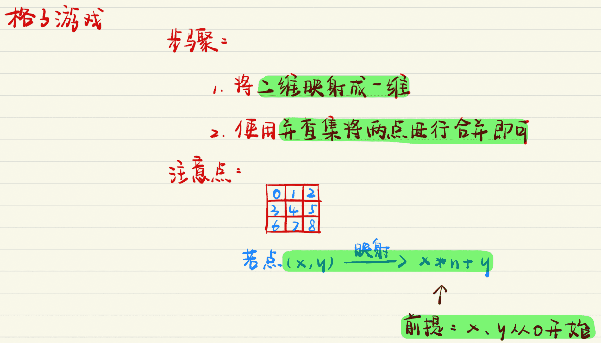

**代ç **

```c++
#include <iostream>
using namespace std;
const int N = 40010;
int n, m;
int p[N];
int get(int x, int y) {
    return x * n + y;
}
int find(int x) {
    if (p[x] == x) return p[x];
    return p[x] = find(p[x]);
}
int main() {
    scanf("%d%d", &n, &m);
    for (int i = 0; i < n * n; i ++ ) p[i] = i;
    int res = -1;
    for (int i = 1; i <= m; i ++ ) {
        int x, y;
        char op[2];
        scanf("%d%d%s", &x, &y, op);
        // åŸå§‹ä¸‹æ ‡ä»1开始, æ•…, 需è¦è¿›è¡Œ --
        x --, y --;
        int a = get(x, y), b;
        if (op[0] == 'D') b = get(x + 1, y);
        else b = get(x, y + 1);
        int pa = find(a), pb = find(b);
        // å±äºä¸€ä¸ªé›†åˆ, 说æ˜å·²ç»å­˜åœ¨ç¯, 记录答案, 退出å³å¯
        if (pa == pb) {
            res = i;
            break;
        }
        // 更新父å­å…³ç³»
        p[pb] = pa;
    }
    if (res == -1) cout << "draw" << endl;
    else cout << res << endl;
    return 0;
}
```

**时间å¤æ‚度**

$O(mlog_n)$

**空间å¤æ‚度**

$O(n)$

**标签**

`并查集`

**ç¼åˆæ€ª**


### [AcWing 1252. æ­é…è´­ä¹°](https://www.acwing.com/problem/content/1254/)

**题目æè¿°**

>   `Joe`觉得云朵很ç¾ï¼Œå†³å®šå»å±±ä¸Šçš„商店买一些云朵。
>
>   商店里有 `n` 朵云，云朵被编å·ä¸º `1,2,…,n`，并且æ¯æœµäº‘都有一个价值。
>
>   但是商店è€æ¿è·Ÿä»–说，一些云朵è¦æ­é…æ¥ä¹°æ‰å¥½ï¼Œæ‰€ä»¥ä¹°ä¸€æœµäº‘则ä¸è¿™æœµäº‘有æ­é…的云都è¦ä¹°ã€‚
>
>   但是`Joe`的钱有é™ï¼Œæ‰€ä»¥ä»–希望买的价值越多越好。

**输入格å¼**

>   第 `1` 行包å«ä¸‰ä¸ªæ•´æ•° `n，m，w`，表示有 `n` 朵云，`m` 个æ­é…，`Joe`有 `w` 的钱。
>
>   第 `2∼n+1`行，æ¯è¡Œä¸¤ä¸ªæ•´æ•° $c_i，d_i$ 表示 `i` 朵云的价钱和价值。
>
>   第 `n+2∼n+1+m` 行，æ¯è¡Œä¸¤ä¸ªæ•´æ•° $u_i，v_i$，表示买 $u_i$ 就必须买 $v_i$，åŒç†ï¼Œå¦‚æœä¹° $v_i$ 就必须买 $u_i$。

**输出格å¼**

>   一行，表示å¯ä»¥è·å¾—的最大价值。

**æ•°æ®èŒƒå›´**

>   +   $1≤n≤10000,$
>   +   $0≤m≤5000,$
>   +   $1≤w≤10000,$
>   +   $1≤c_i≤5000,$
>   +   $1≤d_i≤100,$
>   +   $1≤u_i,v_i≤n$

**输入样例**

```c++
5 3 10
3 10
3 10
3 10
5 100
10 1
1 3
3 2
4 2
```

**输出样例**

```c++
1
```

**手写稿**

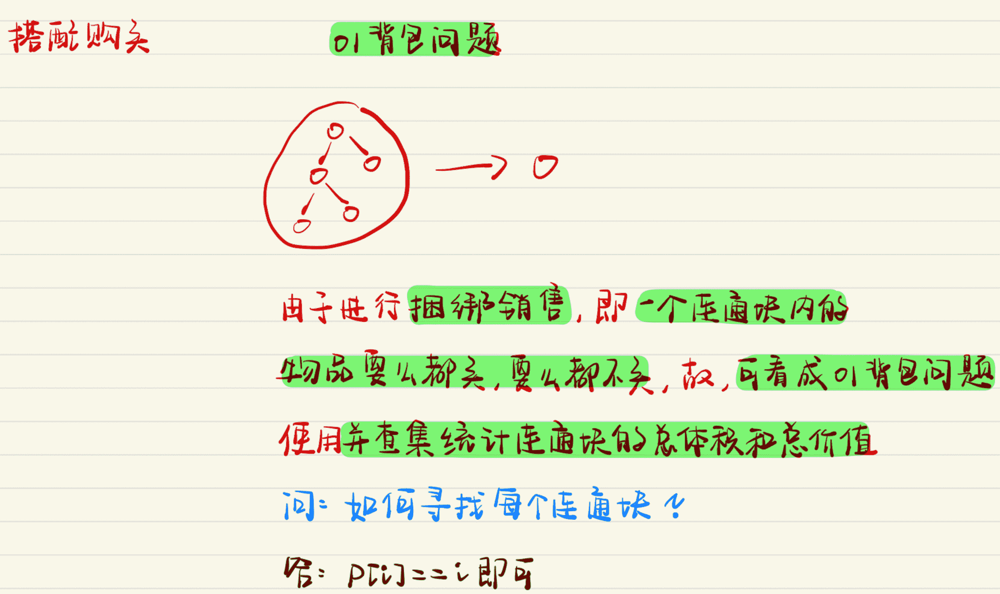

**代ç **

```c++
#include <iostream>
using namespace std;
const int N = 10010;
int n, m, k;
int w[N], v[N], p[N], f[N];
int find(int x) {
    if (p[x] == x) return p[x];
    return p[x] = find(p[x]);
}
int main() {
    scanf("%d%d%d", &n, &m, &k);
    for (int i = 1; i <= n; i ++ ) p[i] = i;
    for (int i = 1; i <= n; i ++ ) scanf("%d%d", &v[i], &w[i]);
    for (int i = 0; i < m; i ++ ) {
        int a, b;
        scanf("%d%d", &a, &b);
        int pa = find(a);
        int pb = find(b);
        // 如æœä¸åœ¨åŒä¸€ä¸ªé›†åˆ
        if (pa != pb) {
            // 更新体积
            v[pa] += v[pb];
            // 更新价值
            w[pa] += w[pb];
            // 更新父å­å…³ç³»
            p[pb] = pa;
        }
    }
    // 01背包
    for (int i = 1; i <= n; i ++ )
        // éå†æ¯ä¸ªç‚¹, 找到所有的è¿é€šå—
        if (p[i] == i)
            // 01背包
            for (int j = k; j >= v[i]; j -- )
                f[j] = max(f[j], f[j - v[i]] + w[i]);
    cout << f[k] << endl;
    return 0;
}
```

**时间å¤æ‚度**

$O(nm)$

**空间å¤æ‚度**

$O(n)$

**标签**

`并查集`ã€`01背包`

**ç¼åˆæ€ª**


### [AcWing 237. 程åºè‡ªåŠ¨åˆ†æ](https://www.acwing.com/problem/content/239/)

**题目æè¿°**

>   在å®ç°ç¨‹åºè‡ªåŠ¨åˆ†æ的过程中，常常需è¦åˆ¤å®šä¸€äº›çº¦æŸæ¡ä»¶æ˜¯å¦èƒ½è¢«åŒæ—¶æ»¡è¶³ã€‚
>
>   考虑一个约æŸæ»¡è¶³é—®é¢˜çš„简化版本：å‡è®¾ $x_1,x_2,x_3,…$ 代表程åºä¸­å‡ºç°çš„å˜é‡ï¼Œç»™å®š `n` 个形如 $x_i=x_j$ 或 $x_i≠x_j$ çš„å˜é‡ç›¸ç­‰/ä¸ç­‰çš„约æŸæ¡ä»¶ï¼Œè¯·åˆ¤å®šæ˜¯å¦å¯ä»¥åˆ†åˆ«ä¸ºæ¯ä¸€ä¸ªå˜é‡èµ‹äºˆæ°å½“的值，使得上述所有约æŸæ¡ä»¶åŒæ—¶è¢«æ»¡è¶³ã€‚
>
>   例如，一个问题中的约æŸæ¡ä»¶ä¸ºï¼š$x_1=x_2，x_2=x_3，x_3=x_4，x_1≠x_4$，这些约æŸæ¡ä»¶æ˜¾ç„¶æ˜¯ä¸å¯èƒ½åŒæ—¶è¢«æ»¡è¶³çš„，因此这个问题应判定为ä¸å¯è¢«æ»¡è¶³ã€‚
>
>   ç°åœ¨ç»™å‡ºä¸€äº›çº¦æŸæ»¡è¶³é—®é¢˜ï¼Œè¯·åˆ†åˆ«å¯¹å®ƒä»¬è¿›è¡Œåˆ¤å®šã€‚

**输入格å¼**

>   输入文件的第 `1` è¡ŒåŒ…å« `1` 个正整数 `t`，表示需è¦åˆ¤å®šçš„问题个数，注æ„这些问题之间是相互独立的。
>
>   对äºæ¯ä¸ªé—®é¢˜ï¼ŒåŒ…å«è‹¥å¹²è¡Œï¼š
>
>   第 `1` è¡ŒåŒ…å« `1` 个正整数 `n`，表示该问题中需è¦è¢«æ»¡è¶³çš„约æŸæ¡ä»¶ä¸ªæ•°ã€‚
>
>   æ¥ä¸‹æ¥ `n` 行，æ¯è¡ŒåŒ…括 `3` 个整数 `i,j,e`，æè¿° `1` 个相等/ä¸ç­‰çš„约æŸæ¡ä»¶ï¼Œç›¸é‚»æ•´æ•°ä¹‹é—´ç”¨å•ä¸ªç©ºæ ¼éš”开。若 `e=1`，则该约æŸæ¡ä»¶ä¸º $x_i=x_j$；若 `e=0`，则该约æŸæ¡ä»¶ä¸º $x_i≠x_j$。

**输出格å¼**

>   输出文件包括 `t` 行。
>
>   输出文件的第 `k` 行输出一个字符串 `YES` 或者 `NO`，`YES` 表示输入中的第 `k` 个问题判定为å¯ä»¥è¢«æ»¡è¶³ï¼Œ`NO` 表示ä¸å¯è¢«æ»¡è¶³ã€‚

**æ•°æ®èŒƒå›´**

>   +   $1≤n≤10^5$
>   +   $1≤i,j≤10^9$

**输入样例**

```c++
2
2
1 2 1
1 2 0
2
1 2 1
2 1 1
```

**输出样例**

```c++
NO
YES
```

**手写稿**

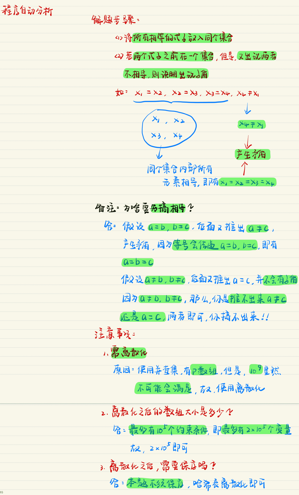

**代ç **

```c++
#include <iostream>
#include <unordered_map>
using namespace std;
const int N = 200010, M = 100010;
struct Query {
    int x, y, e;
}query[M];
int n, m, T;
int p[N];
unordered_map<int, int> S;
int get(int x) {
    if (!S.count(x)) S[x] = ++ n;
    return S[x];
}
int find(int x) {
    if (p[x] == x) return p[x];
    return p[x] = find(p[x]);
}
int main() {
    scanf("%d", &T);
    while (T -- ) {
        // åˆå§‹åŒ–
        n = 0;
        // 清空哈希表
        S.clear();
        scanf("%d", &m);
        // éå†æ¯ä¸ªçº¦æŸæ¡ä»¶
        for (int i = 0; i < m; i ++ ) {
            int x, y, e;
            scanf("%d%d%d", &x, &y, &e);
            // 注æ„: xå’Œy是离散化之å的数值
            query[i] = {get(x), get(y), e};
        }
        // åˆå§‹åŒ–并查集数组
        for (int i = 1; i <= n; i ++ ) p[i] = i;
        for (int i = 0; i < m; i ++ )
            // éå†æ‰€æœ‰ç›¸ç­‰çš„æ¡ä»¶
            if (query[i].e == 1) {
                int a = query[i].x;
                int b = query[i].y;
                int pa = find(a);
                int pb = find(b);
                if (pa != pb) p[pb] = pa;
            }
        bool has_conflict = false;
        for (int i = 0; i < m; i ++ )
            // éå†æ‰€æœ‰ä¸ç­‰çš„æ¡ä»¶
            if (query[i].e == 0) {
                int a = query[i].x;
                int b = query[i].y;
                int pa = find(a);
                int pb = find(b);
                // 之å‰æ¨å‡ºç›¸ç­‰, ç°åœ¨åˆæ¨å‡ºä¸æƒ³ç­‰, æ•…, 产生矛盾
                if (pa == pb) {
                    has_conflict = true;
                    break;
                }
            }
        if (has_conflict) puts("NO");
        else puts("YES");
    }
    return 0;
}
```

**时间å¤æ‚度**

$O(nlog_n)$

**空间å¤æ‚度**

$O(n)$

**标签**

`并查集`ã€`离散化`

**ç¼åˆæ€ª**


### [AcWing 239. 奇å¶æ¸¸æˆ](https://www.acwing.com/problem/content/241/)

**题目æè¿°**

>   å° `A` å’Œå° `B` 在ç©ä¸€ä¸ªæ¸¸æˆã€‚
>
>   é¦–å…ˆï¼Œå° `A` 写了一个由 `0` å’Œ `1` 组æˆçš„åºåˆ— `S`，长度为 `N`。
>
>   然åï¼Œå° `B` å‘å° `A` æ出了 `M` 个问题。
>
>   在æ¯ä¸ªé—®é¢˜ä¸­ï¼Œå° `B` 指定两个数 `l` å’Œ `r`ï¼Œå° `A` å›ç­” `S[l∼r]` 中有奇数个 `1` 还是å¶æ•°ä¸ª `1`。
>
>   æœºæ™ºçš„å° `B` å‘ç°å° `A` 有å¯èƒ½åœ¨æ’’è°ã€‚
>
>   ä¾‹å¦‚ï¼Œå° `A` 曾ç»å›ç­”过 `S[1∼3]` 中有奇数个 `1`，`S[4∼6]` 中有å¶æ•°ä¸ª `1`，ç°åœ¨åˆå›ç­” `S[1∼6]` 中有å¶æ•°ä¸ª `1`，显然这是自相矛盾的。
>
>   è¯·ä½ å¸®åŠ©å° `B` 检查这 `M` 个答案，并指出在至少多少个å›ç­”之åå¯ä»¥ç¡®å®šå° `A` 一定在撒è°ã€‚
>
>   å³æ±‚出一个最å°çš„ `k`，使得 `01` åºåˆ— `S` 满足第 `1∼k` 个å›ç­”，但ä¸æ»¡è¶³ç¬¬ `1∼k+1` 个å›ç­”。

**输入格å¼**

>   第一行包å«ä¸€ä¸ªæ•´æ•° `N`，表示 `01` åºåˆ—长度。
>
>   第二行包å«ä¸€ä¸ªæ•´æ•° `M`，表示问题数é‡ã€‚
>
>   æ¥ä¸‹æ¥ `M` 行，æ¯è¡ŒåŒ…å«ä¸€ç»„问答：两个整数 `l` å’Œ `r`，以åŠå›ç­” `even` 或 `odd`，用以æè¿° `S[l∼r]` 中有å¶æ•°ä¸ª `1` 还是奇数个 `1`。

**输出格å¼**

>   输出一个整数 `k`，表示 `01` åºåˆ—满足第 `1∼k` 个å›ç­”，但ä¸æ»¡è¶³ç¬¬ `1∼k+1` 个å›ç­”ï¼Œå¦‚æœ `01` åºåˆ—满足所有å›ç­”，则输出问题总数é‡ã€‚

**æ•°æ®èŒƒå›´**

>   +   $N≤10^9,M≤5000$

**输入样例**

```c++
10
5
1 2 even
3 4 odd
5 6 even
1 6 even
7 10 odd
```

**输出样例**

```c++
3
```

**手写稿**

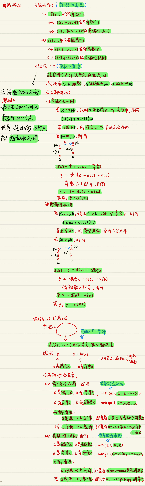

**代ç ä¸€: 带æƒå¹¶æŸ¥é›†**

```c++
#include <iostream>
#include <cstring>
#include <unordered_map>
using namespace std;
const int N = 10010;
int n, m;
int p[N], d[N];
unordered_map<int, int> S;
// 离散化
int get(int x) {
    if (S.count(x) == 0) S[x] = ++ n;
    return S[x];
}
int find(int x) {
    if (p[x] == x) return p[x];
    int root = find(p[x]);
    // d[x] += d[p[x]]; ä¸æ˜¯d[root]
    d[x] += d[p[x]];
    return p[x] = root;
}
int main() {
    scanf("%d%d", &n, &m);
    n = 0;
    for (int i = 1; i < N; i ++ ) p[i] = i;
    // 全部正确, 则答案是m
    int res = m;
    for (int i = 1; i <= m; i ++ ) {
        int l, r;
        char type[5];
        scanf("%d%d%s", &l, &r, type);
        // sum[l, r] = sum[r] - sum[l - 1];
        int a = get(l - 1), b = get(r);
        int pa = find(a);
        int pb = find(b);
        if (!strcmp(type, "odd")) { // 奇数
            // 如æœaå’Œb处äºåŒä¸ªé›†åˆå¹¶ä¸”ä¸æ˜¯åŒä¸€ç±»
            if (pa == pb && (d[a] + d[b]) % 2 == 0) {
                res = i - 1;
                break;
            }
            // ä¸åœ¨åŒä¸€ä¸ªé›†åˆ
            else if (pa != pb) {
                // æ›´æ–°
                d[pa] = 1 - d[a] - d[b];
                p[pa] = pb;
            }
        }
        else { // å¶æ•°
            // 如æœaå’Œb处äºåŒä¸ªé›†åˆå¹¶ä¸”ä¸æ˜¯åŒä¸€ç±»
            if (pa == pb && (d[a] + d[b]) % 2) {
                res = i - 1;
                break;
            }
            // ä¸åœ¨åŒä¸€ä¸ªé›†åˆ
            else if (pa != pb) {
                // æ›´æ–°
                d[pa] = -d[a] - d[b];
                p[pa] = pb;
            }
        }
    }
    cout << res << endl;
    return 0;
}
```

**代ç äºŒ: 扩展域**

```c++
#include <iostream>
#include <cstring>
#include <unordered_map>
using namespace std;
const int N = 20010, base = N / 2;
int n, m;
int p[N], d[N];
unordered_map<int, int> S;
int get(int x) {
    if (S.count(x) == 0) S[x] = ++ n;
    return S[x];
}
int find(int x) {
    if (p[x] == x) return p[x];
    int root = find(p[x]);
    d[x] += d[p[x]];
    return p[x] = root;
}
int main() {
    scanf("%d%d", &n, &m);
    n = 0;
    for (int i = 1; i < N; i ++ ) p[i] = i;
    int res = m;
    for (int i = 1; i <= m; i ++ ) {
        int l, r;
        char type[5];
        scanf("%d%d%s", &l, &r, type);
        int a = get(l - 1), b = get(r);
        if (strcmp("odd", type) == 0) { // 奇数
            // ä¸ç¬¦åˆæ¡ä»¶
            if (find(a) == find(b) || find(a + base) == find(b + base)) {
                res = i - 1;
                break;
            }
            else {
                p[find(a)] = find(b + base);
                p[find(a + base)] = find(b);
            }
        }
        else { // å¶æ•°
            // ä¸ç¬¦åˆæ¡ä»¶
            if (find(a) == find(b + base) || find(a + base) == find(b)) {
                res = i - 1;
                break;
            }
            else {
                p[find(a)] = find(b);
                p[find(a + base)] = find(b + base);
            }
        }
    }
    cout << res << endl;
    return 0;
}
```

**时间å¤æ‚度**

$O(mlog_n)$

**空间å¤æ‚度**

$O(n)$

**标签**

`带æƒå¹¶æŸ¥é›†`ã€`扩展域`

**ç¼åˆæ€ª**


### [AcWing 238. 银河英雄传说](https://www.acwing.com/problem/content/240/)

**题目æè¿°**

>   有一个划分为 `N` 列的星际战场，å„列ä¾æ¬¡ç¼–å·ä¸º `1,2,…,N`。
>
>   有 `N` 艘战舰，也ä¾æ¬¡ç¼–å·ä¸º `1,2,…,N`，其中第 `i` å·æˆ˜èˆ°å¤„äºç¬¬ `i` 列。
>
>   有 `T` æ¡æŒ‡ä»¤ï¼Œæ¯æ¡æŒ‡ä»¤æ ¼å¼ä¸ºä»¥ä¸‹ä¸¤ç§ä¹‹ä¸€ï¼š
>
>   1.  `M i j`，表示让第 `i` å·æˆ˜èˆ°æ‰€åœ¨åˆ—的全部战舰ä¿æŒåŸæœ‰é¡ºåºï¼Œæ¥åœ¨ç¬¬ `j` å·æˆ˜èˆ°æ‰€åœ¨åˆ—的尾部。
>   2.  `C i j`，表示询问第 `i` å·æˆ˜èˆ°ä¸ç¬¬ `j` å·æˆ˜èˆ°å½“å‰æ˜¯å¦å¤„äºåŒä¸€åˆ—中，如æœåœ¨åŒä¸€åˆ—中，它们之间间隔了多少艘战舰。
>
>   ç°åœ¨éœ€è¦ä½ ç¼–写一个程åºï¼Œå¤„ç†ä¸€ç³»åˆ—的指令。

**输入格å¼**

>   第一行包å«æ•´æ•° `T`，表示共有 `T` æ¡æŒ‡ä»¤ã€‚
>
>   æ¥ä¸‹æ¥ `T` 行，æ¯è¡Œä¸€ä¸ªæŒ‡ä»¤ï¼ŒæŒ‡ä»¤æœ‰ä¸¤ç§å½¢å¼ï¼š`M i j` 或 `C i j`。
>
>   其中 `M` å’Œ `C` 为大写字æ¯è¡¨ç¤ºæŒ‡ä»¤ç±»å‹ï¼Œ`i` å’Œ `j` 为整数，表示指令涉åŠçš„战舰编å·ã€‚

**输出格å¼**

>   你的程åºåº”当ä¾æ¬¡å¯¹è¾“入的æ¯ä¸€æ¡æŒ‡ä»¤è¿›è¡Œåˆ†æ和处ç†ï¼š
>
>   如æœæ˜¯ `M i j` å½¢å¼ï¼Œåˆ™è¡¨ç¤ºèˆ°é˜Ÿæ’列å‘生了å˜åŒ–，你的程åºè¦æ³¨æ„到这一点，但是ä¸è¦è¾“出任何信æ¯ï¼›
>
>   如æœæ˜¯ `C i j` å½¢å¼ï¼Œä½ çš„程åºè¦è¾“出一行，仅包å«ä¸€ä¸ªæ•´æ•°ï¼Œè¡¨ç¤ºåœ¨åŒä¸€åˆ—上，第 `i` å·æˆ˜èˆ°ä¸ç¬¬ `j` å·æˆ˜èˆ°ä¹‹é—´å¸ƒç½®çš„战舰数目，如æœç¬¬ `i` å·æˆ˜èˆ°ä¸ç¬¬ `j` å·æˆ˜èˆ°å½“å‰ä¸åœ¨åŒä¸€åˆ—上，则输出 `−1`。

**æ•°æ®èŒƒå›´**

>   +   $N≤30000,T≤500000$

**输入样例**

```c++
4
M 2 3
C 1 2
M 2 4
C 4 2
```

**输出样例**

```c++
-1
1
```

**手写稿**

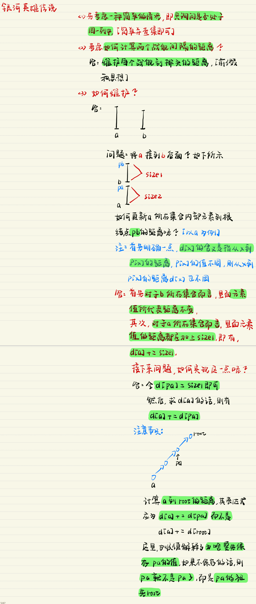

**代ç **

```c++
#include <iostream>
using namespace std;
const int N = 30010;
int n;
int p[N], sum[N], d[N];
int find(int x) {
    if (p[x] == x) return p[x];
    // 找到p[x]的祖先
    int root = find(p[x]);
    // 注æ„: 这里添加的是x的祖先p[x]çš„è·ç¦»è€Œä¸æ˜¯p[x]的祖先rootçš„è·ç¦»!!!!
    // [手写稿进一步说æ˜]
    d[x] += d[p[x]];
    return p[x] = root;
}
int main() {
    scanf("%d", &n);
    for (int i = 1; i < N; i ++ ) {
        // æ¯ä¸ªæ•°çš„祖先å‡æ˜¯è‡ªå·±
        p[i] = i;
        // 一开始集åˆå†…åªæœ‰ä¸€ä¸ªæ•°å­—
        sum[i] = 1;
    }
    for (int i = 0; i < n; i ++ ) {
        char op[2];
        int a, b;
        scanf("%s%d%d", op, &a, &b);
        int pa = find(a);
        int pb = find(b);
        if (op[0] == 'M') {
            // 如æœaå’Œbä¸åœ¨ä¸€ä¸ªé›†åˆå†…部
            if (pa != pb) {
                // 先更新d[pa]的值
                d[pa] = sum[pb];
                // å†æ›´æ–°b所在集åˆå†…的元素数目
                sum[pb] += sum[pa];
                // 注æ„: 题目è¦æ±‚是aæ¥åˆ°båé¢!!!
                p[pa] = pb;
            }
        }
        else {
            if (pa != pb) puts("-1");
            // 计算隔间数é‡åº”为 d[a] - d[b] - 1 !!注æ„: é—´éš”!!
            // 1 2 3, 则1å’Œ3间隔的数é‡ä¸º1, å³ä¸º2
            // 如æœä¸¤ä¸ªæˆ˜èˆ°ç´§æŒ¨ç€, 则间隔战舰数é‡ä¸º0, æ•…, 需è¦å’Œ0å–个maxå³å¯
            else cout << max(0, abs(d[a] - d[b]) - 1) << endl;
        }
    }
    return 0;
}
```

**时间å¤æ‚度**

$O(Tlog_n)$

**空间å¤æ‚度**

$O(n)$

**标签**

`带æƒå¹¶æŸ¥é›†`

**ç¼åˆæ€ª**


## 树状数组

### åŸç†

**手写稿**


### 注æ„事项

> 1. <font style="color: red">**å…ˆææ˜ç™½æ ‘状数组存的值的æ„义，此点至关é‡è¦ï¼ï¼ï¼**</font>

### [P3374 ã€æ¨¡æ¿ã€‘树状数组 1](https://www.luogu.com.cn/problem/P3374)

**题目æè¿°**

> 如题，已知一个数列，你需è¦è¿›è¡Œä¸‹é¢ä¸¤ç§æ“作：
>
> - å°†æŸä¸€ä¸ªæ•°åŠ ä¸Š `x`
> - 求出æŸåŒºé—´æ¯ä¸€ä¸ªæ•°çš„å’Œ

**输入格å¼**

> 第一行包å«ä¸¤ä¸ªæ­£æ•´æ•° `n,m`，分别表示该数列数字的个数和æ“作的总个数。
>
> ç¬¬äºŒè¡ŒåŒ…å« `n` 个用空格分隔的整数，其中第 `i` 个数字表示数列第 `i` 项的åˆå§‹å€¼ã€‚
>
> æ¥ä¸‹æ¥ `m` è¡Œæ¯è¡ŒåŒ…å« `3` 个整数，表示一个æ“作，具体如下：
>
> - `1 x k` å«ä¹‰ï¼šå°†ç¬¬ `x` 个数加上 `k`
> - `2 x y` å«ä¹‰ï¼šè¾“出区间 `[x,y]` 内æ¯ä¸ªæ•°çš„å’Œ

**输出格å¼**

> 输出包å«è‹¥å¹²è¡Œæ•´æ•°ï¼Œå³ä¸ºæ‰€æœ‰æ“作 `2` 的结æœã€‚

**输入 #1**

```c++
5 5
1 5 4 2 3
1 1 3
2 2 5
1 3 -1
1 4 2
2 1 4
```

**输出 #1**

```c++
14
16
```

**æ•°æ®èŒƒå›´**

> å¯¹äº `30%` çš„æ•°æ®ï¼Œ$1≤n≤8$，$1≤m≤10$ï¼›
> å¯¹äº `70%` çš„æ•°æ®ï¼Œ$1≤n,m≤10^4$ï¼›
> å¯¹äº `100%` çš„æ•°æ®ï¼Œ$1≤n,m≤5×10^5$。

**样例说æ˜**


故输出结æœ`14ã€16`

**代ç **

```c++
#include <iostream>
using namespace std;
typedef long long LL;
const int N = 500010;
int n, m;
LL tr[N];
int lowbit(int x) {
    return x & -x;
}
void add(int x, int c) {
    for (int i = x; i <= n; i += lowbit(i)) tr[i] += c;
    return;
}
int sum(int x) {
    LL res = 0;
    for (int i = x; i; i -= lowbit(i)) res += tr[i];
    return res;
}
int main() {
    scanf("%d%d", &n, &m);
    for (int i = 1, t; i <= n; i ++ ) {
        scanf("%d", &t);
        // 一开始在树状数组的下标为içš„ä½ç½®ä¸Šæ·»åŠ t
        add(i, t);
        // 注æ„必须使用add函数，因为add函数当中包å«å¯¹å…¶ä»–下标的值的更新
    }
    while (m -- ) {
        int op, x, y;
        scanf("%d%d%d", &op, &x, &y);
        if (op == 1) add(x, y);
        else cout << sum(y) - sum(x - 1) << endl;
    }
    return 0;
}
```

**标签**

`树状数组`

### [P1908 逆åºå¯¹](https://www.luogu.com.cn/problem/P1908)

**题目æè¿°**

>   猫猫 `TOM` å’Œå°è€é¼  `JERRY` 最近åˆè¾ƒé‡ä¸Šäº†ï¼Œä½†æ˜¯æ¯•ç«Ÿéƒ½æ˜¯æˆå¹´äººï¼Œä»–们已ç»ä¸å–œæ¬¢å†ç©é‚£ç§ä½ è¿½æˆ‘赶的游æˆï¼Œç°åœ¨ä»–们喜欢ç©ç»Ÿè®¡ã€‚
>
>   最近，`TOM` è€çŒ«æŸ¥é˜…到一个人类称之为“逆åºå¯¹â€çš„东西，这东西是这样定义的：对äºç»™å®šçš„一段正整数åºåˆ—，逆åºå¯¹å°±æ˜¯åºåˆ—中 $a_i>a_j$ 且 $i<j$ 的有åºå¯¹ã€‚知é“这概念å，他们就比赛è°å…ˆç®—出给定的一段正整数åºåˆ—中逆åºå¯¹çš„数目。注æ„åºåˆ—中å¯èƒ½æœ‰é‡å¤æ•°å­—。
>
>   **Update:æ•°æ®å·²åŠ å¼ºã€‚**

**输入格å¼**

>   第一行，一个数 `n`，表示åºåˆ—中有 `n` 个数。
>
>   第二行 `n` 个数，表示给定的åºåˆ—。åºåˆ—中æ¯ä¸ªæ•°å­—ä¸è¶…过 $10^9$。

**输出格å¼**

>   输出åºåˆ—中逆åºå¯¹çš„数目。

**输入样例**

```c++
6
5 4 2 6 3 1
```

**输出样例**

```c++
11
```

**说æ˜/æ示**

>   å¯¹äº $25\%$ çš„æ•°æ®ï¼Œ$n \leq 2500$
>
>   å¯¹äº $50\%$ çš„æ•°æ®ï¼Œ$n \leq 4 \times 10^4$。
>
>   对äºæ‰€æœ‰æ•°æ®ï¼Œ$n \leq 5 \times 10^5$
>
>   请使用较快的输入输出
>
>   应该ä¸ä¼š $O(n^2)$ 过 $50$ ä¸‡å§ $by chen_zhe$

**手写稿**


**代ç **


**时间å¤æ‚度**


**空间å¤æ‚度**


**标签**


**ç¼åˆæ€ª**


### [AcWing 241. 楼兰图腾](https://www.acwing.com/problem/content/243/)

**题目æè¿°**

> 在完æˆäº†åˆ†é…任务之å，西部 `314` æ¥åˆ°äº†æ¥¼å…°å¤åŸçš„西部。
>
> 相传很久以å‰è¿™ç‰‡åœŸåœ°ä¸Š(比楼兰å¤åŸè¿˜æ—©)生活ç€ä¸¤ä¸ªéƒ¨è½ï¼Œä¸€ä¸ªéƒ¨è½å´‡æ‹œå°–刀(`V`)，一个部è½å´‡æ‹œé“锹(`∧`)，他们分别用 `V` å’Œ `∧` 的形状æ¥ä»£è¡¨å„自部è½çš„图腾。
>
> 西部 `314` 在楼兰å¤åŸçš„下é¢å‘ç°äº†ä¸€å¹…巨大的å£ç”»ï¼Œå£ç”»ä¸Šè¢«æ ‡è®°å‡ºäº† `n` 个点，ç»æµ‹é‡å‘ç°è¿™ `n` 个点的水平ä½ç½®å’Œç«–ç›´ä½ç½®æ˜¯ä¸¤ä¸¤ä¸åŒçš„。
>
> 西部 `314` 认为这幅å£ç”»æ‰€åŒ…å«çš„ä¿¡æ¯ä¸è¿™ `n` 个点的相对ä½ç½®æœ‰å…³ï¼Œå› æ­¤ä¸å¦¨è®¾å标分别为 $(1,y_1),(2,y_2),…,(n,y_n)，$其中 $y_1∼y_n$ 是 `1` 到 `n` 的一个æ’列。
>
> 西部 `314` 打算研究这幅å£ç”»ä¸­åŒ…å«ç€å¤šå°‘个图腾。
>
> 如æœä¸‰ä¸ªç‚¹ $(i,y_i),(j,y_j),(k,y_k)$ 满足 `1≤i<j<k≤n` 且 $y_i>y_j,y_j<y_k$，则称这三个点æ„æˆ `V` 图腾;
>
> 如æœä¸‰ä¸ªç‚¹ $(i,y_i),(j,y_j),(k,y_k)$ 满足 `1≤i<j<k≤n` 且 $y_i<y_j,y_j>y_k$，则称这三个点æ„æˆ `∧` 图腾;
>
> 西部 `314` 想知é“，这 `n` 个点中两个部è½å›¾è…¾çš„数目。
>
> 因此，你需è¦ç¼–写一个程åºæ¥æ±‚出 `V` 的个数和 `∧` 的个数。

**输入格å¼**

> 第一行一个数 `n`。
>
> 第二行是 `n` 个数，分别代表 `y1，y2,…,yn`。

**输出格å¼**

> 两个数，中间用空格隔开，ä¾æ¬¡ä¸º `V` 的个数和 `∧` 的个数。

**æ•°æ®èŒƒå›´**

> 对äºæ‰€æœ‰æ•°æ®ï¼Œ`n≤200000`，且输出答案ä¸ä¼šè¶…过 `int64`。
> $y_1∼y_n$ 是 `1` 到 `n` 的一个æ’列。

**输入样例**

```c++
5
1 5 3 2 4
```

**输出样例**

```c++
3 4
```

**手写稿**

> 1. 使用 `g[i]` 表示åŸæ•°ç»„ï¼›`tr[i]` 表示在树状数组中<font style="color: red">下标为 `i` </font>çš„ä½ç½®ä¸Šæœ‰ä¸€ä¸ªæ•°å­—，使用 `1` åšæ ‡è®°ï¼›å¦‚æœä¸‹æ ‡ä¸º `i` çš„ä½ç½®ä¸Šæ²¡æœ‰æ•°å­—，使用 `0` åšæ ‡è®°ï¼Œç”±äºæ•°ç»„åˆå§‹åŒ–为 `0`，因此，ä¸éœ€è¦å†é¢å¤–åšæ ‡è®° ï¼›`great[i]` 表示 `g` 数组中比 `g[i]` 大的数字的个数；`lesser[i]` 表示 `g` 数组中比 `g[i]` å°çš„数字的个数
> 2. 以 `g` 数组的æ¯ä¸€ä¸ªä¸‹æ ‡ `i` 为索引，寻找 `i` 左边比 `g[i]` 大的数字的个数和 `i` å³è¾¹æ¯” `g[i]` 大的数字的个数，根æ®ä¹˜æ³•åŸç†ï¼Œä¸¤è€…å³å¯æ±‚å¾— $\vee$ 的个数；åŒç†ï¼Œæ±‚å¾— $\wedge$ 的个数
> 3. 两次éå†ã€<font style="color: red">æ易混淆需é‡ç‚¹é˜…读</font>】
>     + 第一次éå†ã€<font style="color: red">ä»å‰å¾€å</font>】
>         + 在当å‰æƒ…况（ä»å‰å¾€å）下，`great[i]` 表示 `g` 数组中所有下标在 `i` <font style="color: red">之å‰</font>的所有数字当中比 `g[i]` <font style="color: red">大</font> 的数字的个数；`less[i]` 表示 `g` 数组中所有下标在 `i` <font style="color: red">之å‰</font>的所有数字当中比 `g[i]` <font style="color: red">å°Â </font>的数字的个数
>     + 第二次éå†ã€<font style="color: red">ä»åå¾€å‰</font>】
>         + 在当å‰æƒ…况（ä»åå¾€å‰ï¼‰ä¸‹ï¼Œ`great[i]` 表示 `g` 数组中所有下标在 `i` <font style="color: red">之å</font>的所有数字当中比 `g[i]` <font style="color: red">大</font> 的数字的个数；`less[i]` 表示 `g` 数组中所有下标在 `i` <font style="color: red">之å</font>的所有数字当中比 `g[i]` <font style="color: red">å°</font> 的数字的个数

**代ç **

```c++
#include <iostream>
#include <cstring>
using namespace std;
typedef long long LL;
const int N = 200010;
int n;
int g[N], tr[N], great[N], lesser[N];
int lowbit(int x) {
    return x & -x;
}
void add(int x, int c) {
    for (int i = x; i <= n; i += lowbit(i) ) tr[i] += c;
    return;
}
int sum(int x) {
    int res = 0; 
    for (int i = x; i; i -= lowbit(i)) res += tr[i];
    return res;
}
int main() {
    scanf("%d", &n);
    for (int i = 1; i <= n; i ++ ) scanf("%d", &g[i]);
    // ã€ä»å‰å¾€å】éå†æ•°ç»„
    for (int i = 1; i <= n; i ++ ) {
        int y = g[i];
        // great[i]表示在ã€ä¸‹æ ‡ã€‘iã€ä¹‹å‰ã€‘的所有数字当中比yã€å¤§ã€‘的数字的个数
        great[i] = sum(n) - sum(y);
        // lesser[i]表示在ã€ä¸‹æ ‡ã€‘iã€ä¹‹å‰ã€‘的所有数字当中比yã€å°ã€‘的数字的个数
        lesser[i] = sum(y - 1);
        // 在下标为yçš„ä½ç½®ä¸Šæ·»åŠ 1，表示在下标为yçš„ä½ç½®ä¸Šæœ‰ä¸€ä¸ªæ•°å­—
        add(y, 1);
    }
    // åˆå§‹åŒ–数组
    memset(tr, 0, sizeof tr);
    LL res1 = 0, res2 = 0;
    // ã€ä»åå¾€å‰ã€‘éå†æ•°ç»„
    for (int i = n; i; i -- ) {
        int y = g[i];
        // sum(n) - sum(y) 表示在ã€ä¸‹æ ‡ã€‘为iã€ä¹‹å】的所有数字当中比yã€å¤§ã€‘的数字的个数
        res1 += great[i] * (LL)(sum(n) - sum(y));
        // sum(y - 1) 表示在ã€ä¸‹æ ‡ã€‘为iã€ä¹‹å】的所有数字当中比yã€å°ã€‘的数字的个数
        res2 += lesser[i] * (LL)sum(y - 1);
        // 在下标为yçš„ä½ç½®ä¸Šæ·»åŠ 1，表示在下标为yçš„ä½ç½®ä¸Šæœ‰ä¸€ä¸ªæ•°å­—
        add(y, 1);
    }
    printf("%lld %lld\n", res1, res2);
    return 0;
}
```

**标签**

`树状数组`

### [AcWing 242. 一个简å•çš„整数问题](https://www.acwing.com/problem/content/description/248/)

**题目æè¿°**

> 给定长度为 `N` 的数列 `A`，然å输入 `M` è¡Œæ“作指令。
>
> 第一类指令形如 `C l r d`，表示把数列中第 `l∼r` 个数都加 `d`。
>
> 第二类指令形如 `Q x`，表示询问数列中第 `x` 个数的值。
>
> 对äºæ¯ä¸ªè¯¢é—®ï¼Œè¾“出一个整数表示答案。

**输入格å¼**

> 第一行包å«ä¸¤ä¸ªæ•´æ•° `N` å’Œ `M`。
>
> ç¬¬äºŒè¡ŒåŒ…å« `N` 个整数 `A[i]`。
>
> æ¥ä¸‹æ¥ `M` 行表示 `M` æ¡æŒ‡ä»¤ï¼Œæ¯æ¡æŒ‡ä»¤çš„æ ¼å¼å¦‚题目æ述所示。

**输出格å¼**

> 对äºæ¯ä¸ªè¯¢é—®ï¼Œè¾“出一个整数表示答案。
>
> æ¯ä¸ªç­”案å ä¸€è¡Œã€‚

**æ•°æ®èŒƒå›´**

> + $1≤N,M≤10^5$,
> + $|d|≤10000$,
> + $|A[i]|≤10^9$

**输入样例**

```c++
10 5
1 2 3 4 5 6 7 8 9 10
Q 4
Q 1
Q 2
C 1 6 3
Q 2
```

**输出样例**

```c++
4
1
2
5
```

**步骤**

> 1. 树状数组å¯ä»¥è§£å†³çš„问题：
>     + 区间求和
>     + å•ç‚¹æ›´æ–°
>
> 2. 本题的è¦æ±‚有两个æ“作
>
>     + å°†åŸæ•°ç»„å˜æˆæ ‘状数组（差分数组）
>
>     + 将题目中的两个æ“作å˜æˆæ ‘状数组的ç»å…¸æ“作
>
>         + 第一个æ“作是数列中的第 `l ï½ r` 个数字都加上 `d`，分若干个步骤将其转化为树状数组的ç»å…¸æ“作之一å³å•ç‚¹æ›´æ–°
>             + 第 `l ï½ r` 个数字添加 `d`，由差分数组 `tr` å¯çŸ¥ï¼Œ`tr[l] += d，tr[r + 1] -= d` å³å¯å®Œæˆæ“作，对应树状数组ç»å…¸æ“作的å•ç‚¹æ›´æ–°
>
>         + 第二个æ“作是查询数列中的第 `x` 个数字，分若干个步骤将其转化为树状数组的ç»å…¸æ“作之一å³åŒºé—´æ±‚å’Œ
>             + 修改第 `x` 个数字，由差分数组 `tr` å¯çŸ¥ï¼Œ`sum[1 ~ x]` å³ä¸ºç¬¬ `x` 个数字的值，对应树状数组的区间求和æ“作

**代ç **

```c++
#include <iostream>
using namespace std;
typedef long long LL;
const int N = 100010;
int n, m;
int g[N], tr[N];
int lowbit(int x) {
    return x & -x;
}
void add(int x, int c) {
    for (int i = x; i <= n; i += lowbit(i)) tr[i] += c;
    return;
}
int sum(int x) {
    int res = 0;
    for (int i = x; i; i -= lowbit(i)) res += tr[i];
    return res;
}
int main() {
    scanf("%d%d",&n, &m);
    for (int i = 1; i <= n; i ++ ) {
        scanf("%d", &g[i]);
        // æ„建差分树状数组
        add(i, g[i] - g[i - 1]);
    }
    char op[2];
    while (m -- ) {
        scanf("%s", op);
        if (op[0] == 'C') {
            int l, r, d;
            scanf("%d%d%d", &l, &r, &d);
            // tr[l] += d;
            add(l, d);
            // tr[r + 1] -= d;
            add(r + 1, -d);
        }
        else {
            int x;
            scanf("%d", &x);
            // 求和
            cout << sum(x) << endl;
        }
    }
    return 0;
}
```

### [AcWing 243. 一个简å•çš„整数问题2](https://www.acwing.com/problem/content/244/)

**题目æè¿°**

> 给定一个长度为 `N` 的数列 `A`ï¼Œä»¥åŠ `M` æ¡æŒ‡ä»¤ï¼Œæ¯æ¡æŒ‡ä»¤å¯èƒ½æ˜¯ä»¥ä¸‹ä¸¤ç§ä¹‹ä¸€ï¼š
>
> 1. `C l r d`，表示把 `A[l],A[l+1],…,A[r]` 都加上 `d`。
> 2. `Q l r`，表示询问数列中第 `l∼r` 个数的和。
>
> 对äºæ¯ä¸ªè¯¢é—®ï¼Œè¾“出一个整数表示答案。

**输入格å¼**

> 第一行两个整数 `N,M`。
>
> 第二行 `N` 个整数 `A[i]`。
>
> æ¥ä¸‹æ¥ `M` 行表示 `M` æ¡æŒ‡ä»¤ï¼Œæ¯æ¡æŒ‡ä»¤çš„æ ¼å¼å¦‚题目æ述所示。

**输出格å¼**

> 对äºæ¯ä¸ªè¯¢é—®ï¼Œè¾“出一个整数表示答案。
>
> æ¯ä¸ªç­”案å ä¸€è¡Œã€‚

**æ•°æ®èŒƒå›´**

> + $1≤N,M≤10^5,$
> + $|d|≤10000,$
> + $|A[i]|≤10^9$

**输入样例**

```c++
10 5
1 2 3 4 5 6 7 8 9 10
Q 4 4
Q 1 10
Q 2 4
C 3 6 3
Q 2 4
```

**输出样例**

```c++
4
55
9
15
```

**手写稿**


**代ç **

```c++
#include <iostream>
using namespace std;
typedef long long LL;
const int N = 100010;
int n, m;
int g[N];
LL tr1[N], tr2[N];
int lowbit(int x) {
    return x & -x;
}
void add(LL tr[], int x, LL c) {
    for (int i = x; i <= n; i += lowbit(i)) tr[i] += c;
    return;
}
LL sum(LL tr[], LL x) {
    LL res = 0;
    for (int i = x; i; i -= lowbit(i)) res += tr[i];
    return res;
}
LL prefix_sum(int x) {
    return sum(tr1, x) * (x + 1) - sum(tr2, x);
}
int main() {
    scanf("%d%d", &n, &m);
    for (int i = 1; i <= n; i ++ ) scanf("%d", &g[i]);
    for (int i = 1; i <= n; i ++ ) {
        int b = g[i] - g[i - 1];
        // 第一个数组tr1存的是红+紫
        add(tr1, i, b);
        // 第二个数组tr2存的是紫
        add(tr2, i, (LL)i * b);
    }
    while (m -- ) {
        char op[2];
        scanf("%s", op);
        if (op[0] == 'C') {
            int l, r, d;
            scanf("%d%d%d", &l, &r, &d);
            add(tr1, l, d), add(tr2, l, l * d);
            add(tr1, r + 1, -d), add(tr2, r + 1, (r + 1) * -d);
        }
        else {
            int l, r;
            scanf("%d%d", &l, &r);
            cout << prefix_sum(r) - prefix_sum(l - 1) << endl;
        }
    }
    return 0;
}
```

**标签**

`树状数组`

### [AcWing 244. 谜一样的牛](https://www.acwing.com/problem/content/245/)

**题目æè¿°**

> 有 `n` 头奶牛，已知它们的身高为 `1∼n` 且å„ä¸ç›¸åŒï¼Œä½†ä¸çŸ¥é“æ¯å¤´å¥¶ç‰›çš„具体身高。
>
> ç°åœ¨è¿™ `n` 头奶牛站æˆä¸€åˆ—，已知第 `i` 头牛å‰é¢æœ‰ $A_i$ 头牛比它ä½ï¼Œæ±‚æ¯å¤´å¥¶ç‰›çš„身高。

**输入格å¼**

> 第 `1` 行：输入整数 `n`。
>
> 第 `2..n` 行：æ¯è¡Œè¾“入一个整数 $A_i$，第 `i` 行表示第 `i` 头牛å‰é¢æœ‰ $A_i$ 头牛比它ä½ã€‚
> （注æ„：因为第 `1` 头牛å‰é¢æ²¡æœ‰ç‰›ï¼Œæ‰€ä»¥å¹¶æ²¡æœ‰å°†å®ƒåˆ—出）

**输出格å¼**

> è¾“å‡ºåŒ…å« `n` 行，æ¯è¡Œè¾“出一个整数表示牛的身高。
>
> 第 `i` 行输出第 `i` 头牛的身高。

**æ•°æ®èŒƒå›´**

> + $1≤n≤10^5$

**输入样例**

```c++
5
1
2
1
0
```

**输出样例**

```c++
2
4
5
3
1
```

**手写稿**


**步骤**

> 1. `h[i]` 代表在第 `i` 头牛之å‰æœ‰ `h[i]` 头牛比当å‰ç¬¬ `i` 头牛矮
> 2. ä»åå¾€å‰éå†ï¼Œåœ¨å‰©ä¸‹çš„数字（包括当å‰æ•°å­—）当中寻找第 `h[i] + 1` å°çš„æ•°å­—å³å¯
> 3. 样例模拟（ä»åå¾€å‰ï¼‰
>     + åˆå§‹åŒ–：牛的高度å¯é€‰æ‹©èŒƒå›´ `1，2，3，4，5`（ä¸ä¸€å®šæœ‰åºï¼‰
>     + 第一步：倒数第一个数字是 `0`，代表在牛的高度å¯é€‰æ‹©èŒƒå›´`[1, 2, 3, 4, 5]`内有 `0` 头牛比自己矮，å³åœ¨ç‰›çš„高度å¯é€‰æ‹©èŒƒå›´`[1, 2, 3, 4, 5]`内寻找第 `1(h[i] + 1)` å°çš„高度的牛，å³ä¸º `1`，此时，剩下的牛的高度选择å¯ä¸º `2，3，4，5`
>     + 第二步：倒数第二个数字是 `1`，代表在牛的高度å¯é€‰æ‹©èŒƒå›´`[2, 3, 4, 5]`内有 `1` 头牛比自己矮，å³åœ¨ç‰›çš„高度å¯é€‰æ‹©èŒƒå›´`[2, 3, 4, 5]`内寻找第 `2(h[i] + 1)` å°çš„高度的牛，å³ä¸º `3`，此时，剩下的牛的高度选择å¯ä¸º `2，4，5`
>     + 第三步：倒数第三个数字是 `2`，代表在牛的高度å¯é€‰æ‹©èŒƒå›´`[2, 4, 5]`内有 `2` 头牛比自己矮，å³åœ¨ç‰›çš„高度å¯é€‰æ‹©èŒƒå›´`[2, 4, 5]`内寻找第 `3(h[i] + 1)` å°çš„高度的牛，å³ä¸º `5`，此时，剩下的牛的高度选择å¯ä¸º `2，4`
>     + 第四步：倒数第四个数字是 `1`，代表在牛的高度å¯é€‰æ‹©èŒƒå›´`[2, 4]`内有 `1` 头牛比自己矮，å³åœ¨ç‰›çš„高度å¯é€‰æ‹©èŒƒå›´`[2, 4]`内寻找第 `2(h[i] + 1)` å°çš„高度的牛，å³ä¸º `4`，此时，剩下的牛的高度å¯é€‰æ‹©ä¸º `2`
>     + 第五步：剩下的牛的高度为 `2`，故答案为 `[2, 4, 5, 3, 1]`
> 4. å®ç°æ–¹å¼ï¼šæ ‘状数组 + 二分
>     + 树状数组 `tr[i]` 表示高度为 `i` 是å¦å¯ä»¥ä½¿ç”¨ï¼Œ`1` 代表å¯ä½¿ç”¨ï¼Œå¦åˆ™ï¼Œä¸å¯ä½¿ç”¨
>         + 树状数组åˆå§‹åŒ–为 `1`，表æ˜ä¸€å¼€å§‹ï¼Œæ¯ä¸ªæ•°å­—都å¯ä»¥ä½¿ç”¨
>     + 树状数组 `sum[i]` å‰ç¼€å’Œæ˜¯å•è°ƒçš„，故å¯ä»¥ä½¿ç”¨äºŒåˆ†
> 5. 注æ„事项
>     + 二分的是ã€<font style = "color: red">**牛的高度**</font>】
>     + 树状数组 `tr[i]` 表示高度为 `i` 的牛是å¦å¯ä»¥ä½¿ç”¨ï¼Œ`1` 代表å¯ä»¥ä½¿ç”¨ï¼Œå¦åˆ™ï¼Œä¸å¯ä½¿ç”¨

**代ç **

```c++
#include <iostream>
using namespace std;
const int N = 100010;
int n;
int h[N], tr[N], ans[N];
int lowbit(int x) {
    return x & -x;
}
void add(int x, int c) {
    for (int i = x; i <= n; i += lowbit(i)) tr[i] += c;
    return;
}
int sum(int x) {
    int res = 0;
    for (int i = x; i; i -= lowbit(i)) res += tr[i];
    return res;
}
int main() {
    scanf("%d", &n);
    // 下标ä»2开始，因为第一头牛å‰é¢æ²¡æœ‰æ¯”它矮的，默认为0，题目中已ç»æ ‡æ³¨
    for (int i = 2; i <= n; i ++ ) scanf("%d", &h[i]);
    // æ¯å¤´ç‰›åˆå§‹åŒ–为1，表æ˜å½“å‰è¿™å¤´ç‰›çš„高度iå¯ä»¥è¢«ä½¿ç”¨ã€æœªè¢«å‰”除】
    for (int i = 1; i <= n; i ++ ) add(i, 1);
    for (int i = n; i; i --) {
        // 寻找iå‰é¢çš„第h[i]å°çš„数，算上当å‰å€¼ï¼Œæ•…寻找第h[i] + 1个数字
        int k = h[i] + 1;
        // 二分的是牛的高度，å³æŸ¥çœ‹å½“å‰ç‰›çš„高度是å¦æ»¡è¶³ç­”案
        int l = 1, r = n;
        while (l < r) {
            int mid = l + r >> 1;
            // mid代表牛的高度
            if (sum(mid) >= k) r = mid;
            else l = mid + 1;
        }
        // 将结æœåŠ å…¥ç­”案
        ans[i] = r;
        // 将已ç»åŠ å…¥ç­”案的数字进行æ’除
        add(r, -1);
    }
    for (int i = 1; i <= n; i ++ ) cout << ans[i] << endl;
    return 0;
}
```

**标签**

`树状数组`

### [LeetCode 307. 区域和检索 - 数组å¯ä¿®æ”¹](https://leetcode-cn.com/problems/range-sum-query-mutable/)

**题目æè¿°**

> 给你一个数组 `nums` ，请你完æˆä¸¤ç±»æŸ¥è¯¢ã€‚
>
> 其中一类查询è¦æ±‚ æ›´æ–° 数组 `nums` 下标对应的值
> å¦ä¸€ç±»æŸ¥è¯¢è¦æ±‚è¿”å›æ•°ç»„ `nums` 中索引 `left` 和索引 `right` 之间（ åŒ…å« ï¼‰çš„ `nums` 元素的 å’Œ ，其中 `left <= right`
> å®ç° `NumArray` 类：
>
> + `NumArray(int[] nums)` 用整数数组 `nums` åˆå§‹åŒ–对象
> + `void update(int index, int val)` 将 `nums[index]` 的值 更新 为 `val`
> + `int sumRange(int left, int right)` è¿”å›æ•°ç»„ `nums` 中索引 `left` 和索引 `right` 之间（ åŒ…å« ï¼‰çš„ `nums` 元素的 å’Œ `（å³ï¼Œnums[left] + nums[left + 1], ..., nums[right]）`

**示例 1**

> 输入：
> `["NumArray", "sumRange", "update", "sumRange"]
> [[[1, 3, 5]], [0, 2], [1, 2], [0, 2]]`
> 输出：
> `[null, 9, null, 8]`
>
> 解释：
> `NumArray numArray = new NumArray([1, 3, 5]);
> numArray.sumRange(0, 2); // è¿”å› 1 + 3 + 5 = 9
> numArray.update(1, 2);   // nums = [1,2,5]
> numArray.sumRange(0, 2); // è¿”å› 1 + 2 + 5 = 8`

**æ示**

> + $1 <= nums.length <= 3 * 10^4$
> + $-100 <= nums[i] <= 100$
> + $0 <= index < nums.length$
> + $-100 <= val <= 100$
> + $0 <= left <= right < nums.length$
> + $调用 pdate å’Œ sumRange 方法次数ä¸å¤§äº 3 * 10^4 $

**解题步骤**

> 1. 树状数组解决的基本问题
>
>     + å•ç‚¹æ›´æ–°
>     + 区间求和
>
> 2. 本题å•ç‚¹æ›´æ–°ç•¥æœ‰ç‰¹æ®Šï¼Œæœ¬é¢˜çš„å•ç‚¹æ›´æ–°ä¸æ˜¯å°†æŸä¸ªå€¼ `tr[i] += val` ，而是 `tr[i] = val` ，因此，本题的 `val` 应该为 `val = val - nums[i]` ，这样，`tr[i] += val` å˜æˆ `tr[i] = tr[i] + val - nums[i] = val` ，åŒæ—¶ï¼Œå°† `nums[i] = val` æ‰ç¬¦åˆé¢˜æ„
>
> 3. 必须更新的åŸå› 
>
>     + 模拟样例
>
>         + 输入
>
>             > `["NumArray","update","sumRange","update","sumRange"]`
>             > `[[[7]],[0,2],[0,0],[0,9],[0,0]]`
>
>         + 输出
>
>             > `[null,null,2,null,9]`

**代ç **

```c++
class NumArray {
public:
    int n;
    vector<int> tr, nums;
    int lowbit(int x) {
        return x & -x;
    }
    void add(int x, int c) {
        for (int i = x; i <= n; i += lowbit(i)) tr[i] += c;
        return;
    }
    int sum(int x) {
        int res = 0;
        for (int i = x; i; i -= lowbit(i)) res += tr[i];
        return res;
    }
    NumArray(vector<int>& _nums) {
        nums = _nums;
        n = nums.size();
        nums.resize(n + 1);
        tr = vector<int>(n + 5);
        // æ„建树状数组
        for (int i = 0; i < n; i ++ ) add(i + 1, nums[i]);
    }
    
    void update(int index, int val) {
        // 树状数组下标ä»1开始
        add(index + 1, val - nums[index]);
        // æ›´æ–°åŸæ•°ç»„
        // 更新缘由在解题步骤中
        nums[index] = val;
        return;
    }
    
    int sumRange(int left, int right) {
        left ++, right ++;
        return sum(right) - sum(left - 1);
    }
};

/**
 * Your NumArray object will be instantiated and called as such:
 * NumArray* obj = new NumArray(nums);
 * obj->update(index,val);
 * int param_2 = obj->sumRange(left,right);
 */
```

**标签**

`树状数组`


## 线段树

### åŸç†


### [AcWing 1275. 最大数](https://www.acwing.com/problem/content/1277/)

**题目æè¿°**

> 给定一个正整数数列 $a_1,a_2,…,a_n$，æ¯ä¸€ä¸ªæ•°éƒ½åœ¨ $0∼p−1$ 之间。
>
> å¯ä»¥å¯¹è¿™åˆ—数进行两ç§æ“作：
>
> 1. 添加æ“作：å‘åºåˆ—å添加一个数，åºåˆ—长度å˜æˆ `n+1`ï¼›
> 2. 询问æ“作：询问这个åºåˆ—中最å `L` 个数中最大的数是多少。
>
> 程åºè¿è¡Œçš„最开始，整数åºåˆ—为空。
>
> 一共è¦å¯¹æ•´æ•°åºåˆ—进行 `m` 次æ“作。
>
> 写一个程åºï¼Œè¯»å…¥æ“作的åºåˆ—，并输出询问æ“作的答案。

**输入格å¼**

> 第一行有两个正整数 `m,p`，æ„义如题目æè¿°ï¼›
>
> æ¥ä¸‹æ¥ `m` 行，æ¯ä¸€è¡Œè¡¨ç¤ºä¸€ä¸ªæ“作。
>
> 如æœè¯¥è¡Œçš„内容是 `Q L`，则表示这个æ“作是询问åºåˆ—中最å `L` 个数的最大数是多少；
>
> 如æœæ˜¯ `A t`，则表示å‘åºåˆ—åé¢åŠ ä¸€ä¸ªæ•°ï¼ŒåŠ å…¥çš„数是 `(t+a) mod p`。其中，`t` 是输入的å‚数，`a` 是在这个添加æ“作之å‰æœ€å一个询问æ“作的答案（如æœä¹‹å‰æ²¡æœ‰è¯¢é—®æ“作，则 `a=0`）。
>
> 第一个æ“作一定是添加æ“作。对äºè¯¢é—®æ“作，`L>0` 且ä¸è¶…过当å‰åºåˆ—的长度。

**输出格å¼**

> 对äºæ¯ä¸€ä¸ªè¯¢é—®æ“作，输出一行。该行åªæœ‰ä¸€ä¸ªæ•°ï¼Œå³åºåˆ—中最å `L` 个数的最大数。

**æ•°æ®èŒƒå›´**

> + $1≤m≤2×10^5$,
> + $1≤p≤2×10^9$,
> + $0≤t<p$

**输入样例**

```c++
10 100
A 97
Q 1
Q 1
A 17
Q 2
A 63
Q 1
Q 1
Q 3
A 99
```

**输出样例**

```c++
97
97
97
60
60
97
```

**样例解释**

> 最åçš„åºåˆ—是 `97,14,60,96`。

**备注**


**代ç **

```c++
#include <iostream>
using namespace std;
const int N = 200010;
int n, m, p;
struct Node {
    int l, r, Max; // Max是区间[l, r]的最大值
}tr[N * 4];
void build(int u, int l, int r) { // u当å‰èŠ‚点的下标，[l, r]是区间左å³ç«¯ç‚¹
    tr[u] = {l, r};
    // 区间åªæœ‰ä¸€ä¸ªæ•°å­—
    if (l == r) return;
    int mid = l + r >> 1;
    // å·¦å­æ ‘
    build(u << 1, l, mid);
    // å³å­æ ‘
    build(u << 1 | 1, mid + 1, r);
    return;
}
int query(int u, int l, int r) {
    // 如æœçº¿æ®µæ ‘的区间完全包å«åœ¨æ‰€æŸ¥è¯¢åŒºé—´çš„内部，则直æ¥è¿”å›æœ€å¤§å€¼å³å¯
    if (tr[u].l >= l && tr[u].r <= r) return tr[u].Max;
    int mid = tr[u].l + tr[u].r >> 1;
    int Max = 0;
    /**
    	问题：为啥ä¸åˆ¤æ–­ä¸¤ä¸ªåŒºé—´ä¸ç›¸äº¤çš„情况？
    	å›ç­”：查看备注
    */
    // 如æœå·¦è¾¹åŒºé—´æœ‰é‡åˆï¼Œåˆ™æŸ¥è¯¢å·¦è¾¹
    // 至äºä¸ºå•¥ä¸èƒ½å†™æˆquery(u << 1, l, mid)，查看åŸç†çš„样例模拟å³å¯çŸ¥æ™“
    if (l <= mid) Max = query(u << 1, l, r);
    // 如æœå³è¾¹åŒºé—´æœ‰é‡åˆï¼Œåˆ™æŸ¥è¯¢å³è¾¹
    // 至äºä¸ºå•¥ä¸èƒ½å†™æˆquery(u << 1, l, mid)，查看åŸç†çš„样例模拟å³å¯çŸ¥æ™“
    if (r > mid) Max = max(Max, query(u << 1 | 1, l, r));
    return Max;
}
// ç”±å­èŠ‚点更新父节点
void pushup(int u) {
    tr[u].Max = max(tr[u << 1].Max, tr[u << 1 | 1].Max);
    return;
}
void modify(int u, int x, int c) {
    // 如æœåˆ°è¾¾å¶å­ç»“点å³åŒºé—´å·¦å³ç«¯ç‚¹éƒ½æ˜¯x，则修改值å³å¯
    // ç”±äºåªæœ‰ä¸€ä¸ªå€¼ï¼Œå› æ­¤ï¼ŒåŒºé—´æœ€å¤§å€¼å³ä¸ºå½“å‰å€¼æœ¬èº«
    if (tr[u].l == x && tr[u].r == x) tr[u].Max = c;
    else {
        int mid = tr[u].l + tr[u].r >> 1;
        // 和左边有交集
        if (x <= mid) modify(u << 1, x, c);
        // å’Œå³è¾¹æœ‰äº¤é›†
        if (x > mid) modify(u << 1 | 1, x, c);
        // ç”±å­èŠ‚点更新父节点
        pushup(u);
    }
    return;
}
int main() {
    scanf("%d%d", &m, &p);
    // 最多有m个æ“作，因此，区间å³ç«¯ç‚¹ä¸ºm
    build(1, 1, m);
    int x, last = 0;
    char op[2];
    while (m -- ) {
        scanf("%s%d", op, &x);
        if (op[0] == 'Q') {
            // 查询最åx个数字的最大值，其区间为[n - x + 1, n]
            last = query(1, n - x + 1, n);
            cout << last << endl;
        }
        else {
            // 修改第n + 1个值
            modify(1, n + 1, (x + 0LL + last) % p);
            n ++;
        }
    }
    return 0;
}
```

**标签**

`线段树`

### [AcWing 245. 你能å›ç­”这些问题å—](https://www.acwing.com/problem/content/246/)

**题目æè¿°**

> 给定长度为 `N` 的数列 `A`ï¼Œä»¥åŠ `M` æ¡æŒ‡ä»¤ï¼Œæ¯æ¡æŒ‡ä»¤å¯èƒ½æ˜¯ä»¥ä¸‹ä¸¤ç§ä¹‹ä¸€ï¼š
>
> 1. `1 x y`，查询区间 `[x,y]` 中的最大è¿ç»­å­æ®µå’Œï¼Œå³ $max_{x≤l≤r≤y}\{∑\limits_{i=l}^rA[i]\}$。
> 2. `2 x y`，把 `A[x]` æ”¹æˆ `y`。
>
> 对äºæ¯ä¸ªæŸ¥è¯¢æŒ‡ä»¤ï¼Œè¾“出一个整数表示答案。

**输入格å¼**

> 第一行两个整数 `N,M`。
>
> 第二行 `N` 个整数 `A[i]`。
>
> æ¥ä¸‹æ¥ `M` è¡Œæ¯è¡Œ `3` 个整数 `k,x,y`，`k=1` è¡¨ç¤ºæŸ¥è¯¢ï¼ˆæ­¤æ—¶å¦‚æœ `x>y`ï¼Œè¯·äº¤æ¢ `x,y`），`k=2` 表示修改。

**输出格å¼**

> 对äºæ¯ä¸ªæŸ¥è¯¢æŒ‡ä»¤è¾“出一个整数表示答案。
>
> æ¯ä¸ªç­”案å ä¸€è¡Œã€‚

**æ•°æ®èŒƒå›´**

> + $N≤500000,M≤100000$,
> + $−1000≤A[i]≤1000$

**输入样例**

```c++
5 3
1 2 -3 4 5
1 2 3
2 2 -1
1 3 2
```

**输出样例**

```c++
2
-1
```

**手写稿**


**代ç **

```c++
#include <iostream>
using namespace std;
const int N = 500010;
struct Node {
    int l, r; // 区间左å³ç«¯ç‚¹
    int maxSum; // 最大è¿ç»­å­åŒºé—´å’Œ
    int lMaxSum, rMaxSum; // 最大å‰ç¼€å’Œå’Œæœ€å¤§å缀和
    int sum; // 区间和
}tr[N * 4];
int n, m;
int g[N];
void pushup(Node& u, Node& l, Node& r) {
    u.maxSum = max(max(l.maxSum, r.maxSum), l.rMaxSum + r.lMaxSum);
    u.lMaxSum = max(l.lMaxSum, l.sum + r.lMaxSum);
    u.rMaxSum = max(r.rMaxSum, r.sum + l.rMaxSum);
    u.sum = l.sum + r.sum;
    return;
}
// 由父节点更新å­èŠ‚点
void pushup(int u) {
    pushup(tr[u], tr[u << 1], tr[u << 1 | 1]);
    return;
}
void build(int u, int l, int r) {
    // 到达å¶å­èŠ‚点[l, r]是下标，记录所有å±æ€§å€¼
    if (l == r) tr[u] = {l, r, g[l], g[l], g[l], g[l]};
    else {
        // 如æœæ²¡æœ‰åˆ°è¾¾å¶å­ç»“点，则åªè®°å½•åŒºé—´ç«¯ç‚¹å³å¯ï¼Œåˆ«çš„值暂时无法得出
        tr[u] = {l, r};
        int mid = l + r >> 1;
        build(u << 1, l, mid);
        build(u << 1 | 1, mid + 1, r);
        // æ›´æ–°ã€çˆ¶èŠ‚点】中除了区间端点之外的其余å±æ€§å€¼å³å¯
        pushup(u);
    }
    return;
}
// ç”±äºæ ‘状数组的节点是结æ„体，因此，返å›å€¼æ˜¯èŠ‚点ã€ç»“æ„体】
Node query(int u, int l, int r) {
    if (tr[u].l >= l && tr[u].r <= r) return tr[u];
    else {
        int mid = tr[u].l + tr[u].r >> 1;
        // 区间查询区间å¯èƒ½ä¸å­˜åœ¨
        // 如æœæŸ¥è¯¢çš„区间在线段树区间的左边
        if (r <= mid) return query(u << 1, l, r);
        // 如æœæŸ¥è¯¢çš„区间在线段树区间的å³è¾¹
        else if (l > mid) return query(u << 1 | 1, l, r);
        else {
            // 如æœæŸ¥è¯¢çš„区间和左å³ç«¯ç‚¹æœ‰äº¤é›†
            auto left = query(u << 1, l, r);
            auto right = query(u << 1 | 1, l, r);
            // 使用结æ„体节点
            Node res;
            pushup(res, left, right);
            return res;
        }
    }
}
void modify(int u, int x, int c) {
    // 找到å¶å­èŠ‚点
    if (tr[u].l == x && tr[u].r == x) tr[u] = {x, x, c, c, c, c};
    else {
        // æ ¹æ®é¢˜ç›®æ述修改的区间一定是åˆæ³•åŒºé—´ï¼Œä¸€å®šä¼šæœ‰ç›¸äº¤
        int mid = tr[u].l + tr[u].r >> 1;
        // 如æœå’Œå·¦åŒºé—´æœ‰äº¤é›†
        if (x <= mid) modify(u << 1, x, c);
        // 如æœå’Œå³åŒºé—´æœ‰äº¤é›†
        else modify(u << 1 | 1, x, c);
        // 修改完记得更新父节点
        pushup(u);
    }
    return;
}
int main() {
    scanf("%d%d", &n, &m);
    for (int i = 1; i <= n; i ++ ) scanf("%d", &g[i]);
    build(1, 1, n);
    int k, x, y;
    while (m -- ) {
        scanf("%d%d%d", &k, &x, &y);
        if (k == 1) {
            // 如æœå·¦ç«¯ç‚¹å¤§äºå³ç«¯ç‚¹ï¼Œåˆ™äº¤æ¢ç«¯ç‚¹å³å¯
            if (x > y) swap(x, y);
            cout << query(1, x, y).maxSum << endl;
        }
        else modify(1, x, y);
    }
    return 0;
}
```

**标签**

`线段树`

### [AcWing 246. 区间最大公约数](https://www.acwing.com/problem/content/247/)

**题目æè¿°**

> 给定一个长度为 `N` 的数列 `A`ï¼Œä»¥åŠ `M` æ¡æŒ‡ä»¤ï¼Œæ¯æ¡æŒ‡ä»¤å¯èƒ½æ˜¯ä»¥ä¸‹ä¸¤ç§ä¹‹ä¸€ï¼š
>
> 1. `C l r d`，表示把 `A[l],A[l+1],…,A[r]` 都加上 `d`。
> 2. `Q l r`，表示询问 `A[l],A[l+1],…,A[r]` 的最大公约数(`GCD`)。
>
> 对äºæ¯ä¸ªè¯¢é—®ï¼Œè¾“出一个整数表示答案。

**输入格å¼**

> 第一行两个整数 `N,M`。
>
> 第二行 `N` 个整数 `A[i]`。
>
> æ¥ä¸‹æ¥ `M` 行表示 `M` æ¡æŒ‡ä»¤ï¼Œæ¯æ¡æŒ‡ä»¤çš„æ ¼å¼å¦‚题目æ述所示。

**输出格å¼**

> 对äºæ¯ä¸ªè¯¢é—®ï¼Œè¾“出一个整数表示答案。
>
> æ¯ä¸ªç­”案å ä¸€è¡Œã€‚

**æ•°æ®èŒƒå›´**

> + $N≤500000,M≤100000$,
> + $1≤A[i]≤10^{18}$,
> + $|d|≤10^{18}$

**输入样例**

```c++
5 5
1 3 5 7 9
Q 1 5
C 1 5 1
Q 1 5
C 3 3 6
Q 2 4
```

**输出样例**

```c++
1
2
4
```

**手写稿**


**代ç **

```c++
#include <iostream>
using namespace std;
typedef long long LL;
const int N = 500010;
struct Node {
    int l, r; // 区间左å³ç«¯ç‚¹
    LL sum, d; // 区间和和区间的最大公约数
}tr[N * 4];
int n, m;
LL g[N];
// 注æ„ç±»å‹LL
LL gcd(LL a, LL b) {
    if (!b) return a;
    return gcd(b, a % b);
}
void pushup(Node& u, Node& l, Node& r) {
    u.sum = l.sum + r.sum;
    u.d = gcd(l.d, r.d);
    return;
}
void pushup(int u) {
    pushup(tr[u], tr[u << 1], tr[u << 1 | 1]);
    return;
}
void build(int u, int l, int r) {
    if (l == r) {
        // 注æ„ç±»å‹LL
        LL a = g[r] - g[r - 1];
        tr[u] = {l, r, a, a};
    }
    else {
        tr[u] = {l, r};
        int mid = l + r >> 1;
        build(u << 1, l, mid);
        build(u << 1 | 1, mid + 1, r);
        // 注æ„更新下父节点u
        pushup(u);
    }
    return;
}
Node query(int u, int l, int r) {
    // 如æœçº¿æ®µæ ‘中的区间包å«åœ¨æ‰€æŸ¥è¯¢åŒºé—´çš„内部，则直æ¥è¿”å›
    if (tr[u].l >= l && tr[u].r <= r) return tr[u];
    else {
        int mid = tr[u].l + tr[u].r >> 1;
        // 如æœæŸ¥è¯¢åŒºé—´å‡ºç°åœ¨çº¿æ®µæ ‘区间的左边
        if (r <= mid) return query(u << 1, l, r);
        // 如æœæŸ¥è¯¢åŒºé—´å‡ºç°åœ¨çº¿æ®µæ ‘区间的å³è¾¹
        else if (l > mid) return query(u << 1 | 1, l, r);
        else {
            // 如æœæŸ¥è¯¢åŒºé—´å¤„äºçº¿æ®µæ ‘区间的两边
            auto left = query(u << 1, l, r);
            auto right = query(u << 1 | 1, l, r);
            Node res;
            pushup(res, left, right);
            return res;
        }
    }
}
void modify(int u, int x, LL c) {
    if (tr[u].l == x && tr[u].r == x) {
        // 注æ„ç±»å‹LL
        LL a = tr[u].sum + c;
        tr[u] = {x, x, a, a};
    }
    else {
        int mid = tr[u].l + tr[u].r >> 1;
        // 如æœæ•°xä½äºå·¦åŒºé—´
        if (x <= mid) modify(u << 1, x, c);
        // 如æœæ•°xä½äºå³åŒºé—´
        else modify(u << 1 | 1, x, c);
        // 更新父节点u
        pushup(u);
    }
    return;
}
int main() {
    scanf("%d%d", &n, &m);
    for (int i = 1; i <= n; i ++ ) scanf("%lld", &g[i]);
    build(1, 1, n);
    char op[2];
    int l, r;
    LL d;
    while (m -- ) {
        scanf("%s", op);
        if (op[0] == 'Q') {
            scanf("%d%d", &l, &r);
            // 注æ„最大公约数å¯èƒ½æ˜¯è´Ÿæ•°ï¼Œè®°å¾—å–ç»å¯¹å€¼
            cout << abs(gcd(query(1, 1, l).sum, query(1, l + 1, r).d)) << endl; 
        }
        else {
            scanf("%d%d%lld", &l, &r, &d);
            modify(1, l, d);
            // 记得判断是å¦è¶Šç•Œ
            if (r + 1 <= n) modify(1, r + 1, -d);
        }
    }
    return 0;
}
```

**标签**

`差分`ã€`树状数组`

### [AcWing 243. 一个简å•çš„整数问题2](https://www.acwing.com/problem/content/244/)

**题目æè¿°**

> 给定一个长度为 `N` 的数列 `A`ï¼Œä»¥åŠ `M` æ¡æŒ‡ä»¤ï¼Œæ¯æ¡æŒ‡ä»¤å¯èƒ½æ˜¯ä»¥ä¸‹ä¸¤ç§ä¹‹ä¸€ï¼š
>
> 1. `C l r d`，表示把 `A[l],A[l+1],…,A[r]` 都加上 `d`。
> 2. `Q l r`，表示询问数列中第 `l∼r` 个数的和。
>
> 对äºæ¯ä¸ªè¯¢é—®ï¼Œè¾“出一个整数表示答案。

**输入格å¼**

> 第一行两个整数 `N,M`。
>
> 第二行 `N` 个整数 `A[i]`。
>
> æ¥ä¸‹æ¥ `M` 行表示 `M` æ¡æŒ‡ä»¤ï¼Œæ¯æ¡æŒ‡ä»¤çš„æ ¼å¼å¦‚题目æ述所示。

**输出格å¼**

> 对äºæ¯ä¸ªè¯¢é—®ï¼Œè¾“出一个整数表示答案。
>
> æ¯ä¸ªç­”案å ä¸€è¡Œã€‚

**æ•°æ®èŒƒå›´**

> + $1≤N,M≤10^5$,
> + $|d|≤10000$,
> + $|A[i]|≤10^9$

**输入样例**

```c++
10 5
1 2 3 4 5 6 7 8 9 10
Q 4 4
Q 1 10
Q 2 4
C 3 6 3
Q 2 4
```

**输出样例**

```c++
4
55
9
15
```

**步骤**

> 1. `pushdown` æ“作（懒标记）
>     + 用途
>         + 将当å‰åŒºé—´ä¸­çš„æ¯ä¸€ä¸ªæ•°å­—都添加上 `d`
>     + 步骤
>         + 第一步：查看当å‰æ ¹èŠ‚点 `u` 所在区间是å¦å±äºæŸ¥è¯¢çš„区间
>         + 第二步：更新相对应的信æ¯
>         + 第三步：将懒标记 `add` 设置为 `0`，表示已ç»ä¸‹æ”¾å®Œæ¯•
> 2. æ³¨æ„ `pushdown` å’Œ `pushup` çš„ä½ç½®

**代ç **

```c++
#include <iostream>
using namespace std;
typedef long long LL;
const int N = 100010;
struct Node {
    int l, r;
    LL sum; // 区间和
    int add; // 懒标记
}tr[N * 4];
int n, m;
int g[N];
void pushup(int u) {
    // 懒标记ã€ä¸åŒ…å«ã€‘当å‰èŠ‚点
    tr[u].sum = tr[u << 1].sum + tr[u << 1 | 1].sum;
    return;
}
void pushdown(int u) {
    auto &root = tr[u], &left = tr[u << 1], &right = tr[u << 1 | 1];
    // 如æœæœ‰æ‡’标记，则将懒标记进行下放
    if (root.add) {
        // 左孩å­çš„懒标记进行累加，åŒæ—¶ï¼ŒåŒºé—´å’Œä¹Ÿéœ€è¦ç´¯åŠ 
        left.add += root.add, left.sum += (LL)(left.r - left.l + 1) * root.add;
        // å³å­©å­çš„懒标记进行累加，åŒæ—¶ï¼ŒåŒºé—´å’Œä¹Ÿéœ€è¦ç´¯åŠ 
        right.add += root.add, right.sum += (LL)(right.r - right.l + 1) * root.add;
        // 懒标记置为0
        root.add = 0;
    }
    return;
}
void build(int u, int l, int r) {
    // 如æœåˆ°è¾¾å¶å­ç»“点，则更新相对应的信æ¯
    if (l == r) tr[u] = {l, r, g[l], 0};
    else {
        // 更新区间的左å³ç«¯ç‚¹ä¿¡æ¯
        tr[u] = {l, r};
        int mid = tr[u].l + tr[u].r >> 1;
        // 如æœå’Œå·¦åŒºé—´æœ‰äº¤é›†ï¼Œå»ºç«‹æ ‘状数组
        build(u << 1, l, mid);
        // 如æœå’Œå³åŒºé—´æœ‰äº¤é›†ï¼Œå»ºç«‹æ ‘状数组
        build(u << 1 |1, mid + 1, r);
        // ç”±å­èŠ‚点更新父节点
        pushup(u);
    }
    return;
}
void modify(int u, int l, int r, int d) {
    // 如æœæ ‘状数组区间的左å³ç«¯ç‚¹åŒ…å«åœ¨è¦æŸ¥è¯¢çš„区间内部，则直æ¥æ›´æ–°ç›¸å¯¹åº”çš„ä¿¡æ¯
    if (tr[u].l >= l && tr[u].r <= r) {
        tr[u].sum += (LL)(tr[u].r - tr[u].l + 1) * d;
        tr[u].add += d;
    }
    else { // å¿…é¡»è¦è¿›è¡Œåˆ†è£‚
        // 分裂之å‰å¿…é¡»è¦è¿›è¡Œpushdownæ“作，å³ä¸‹æ”¾æ‡’标记æ“作
        pushdown(u);
        int mid = tr[u].l + tr[u].r >> 1;
        // 如æœå’Œå·¦åŒºé—´æœ‰äº¤é›†
        if (l <= mid) modify(u << 1, l, r, d);
        // 如æœå’Œå³åŒºé—´æœ‰äº¤é›†
        if (r > mid) modify(u << 1 | 1, l, r, d);
        // ç”±å­èŠ‚点信æ¯æ›´æ–°çˆ¶èŠ‚点信æ¯
        pushup(u);
    }
    return;
}
LL query(int u, int l, int r) {
    // 如æœæ ‘状数组区间的左å³ç«¯ç‚¹åŒ…å«åœ¨è¦æŸ¥è¯¢çš„区间内部，则直æ¥æ›´æ–°ç›¸å¯¹åº”çš„ä¿¡æ¯
    if (tr[u].l >= l && tr[u].r <= r) return tr[u].sum;
    // è¦è¿›è¡Œåˆ†è£‚
    pushdown(u);
    int mid = tr[u].l + tr[u].r >> 1;
    LL sum = 0;
    // 如æœå’Œå·¦è¾¹åŒºé—´æœ‰äº¤é›†
    if (l <= mid) sum += query(u << 1, l, r);
    // 如æœå’Œå³è¾¹åŒºé—´æœ‰äº¤é›†
    if (r > mid) sum += query(u << 1 | 1, l, r);
    return sum;
}
int main() {
    scanf("%d%d", &n, &m);
    for (int i = 1; i <= n; i ++ ) scanf("%d", &g[i]);
    build(1, 1, n);
    while (m -- ) {
        char op[2];
        int l, r, d;
        scanf("%s", op);
        if (op[0] == 'C') {
            scanf("%d%d%d", &l, &r, &d);
            modify(1, l, r, d);
        }
        else {
            scanf("%d%d", &l, &r);
            cout << query(1, l, r) << endl;
        }
    }
    return 0;
}
```

**标签**

`树状数组`ã€`懒标记`

### [AcWing 247. 亚特兰蒂斯](https://www.acwing.com/problem/content/249/)

**题目æè¿°**

> 有几个å¤å¸Œè…Šä¹¦ç±ä¸­åŒ…å«äº†å¯¹ä¼ è¯´ä¸­çš„亚特兰蒂斯岛的æ述。
>
> 其中一些甚至包括岛屿部分地图。
>
> 但ä¸å¹¸çš„是，这些地图æ述了亚特兰蒂斯的ä¸åŒåŒºåŸŸã€‚
>
> æ‚¨çš„æœ‹å‹ `Bill` 必须知é“地图的总é¢ç§¯ã€‚
>
> 你自告奋勇写了一个计算这个总é¢ç§¯çš„程åºã€‚

**输入格å¼**

> 输入包å«å¤šç»„测试用例。
>
> 对äºæ¯ç»„测试用例，第一行包å«æ•´æ•° `n`，表示总的地图数é‡ã€‚
>
> æ¥ä¸‹æ¥ `n` 行，æ绘了æ¯å¼ åœ°å›¾ï¼Œæ¯è¡ŒåŒ…å«å››ä¸ªæ•°å­— $x_1,y_1,x_2,y_2$（ä¸ä¸€å®šæ˜¯æ•´æ•°ï¼‰ï¼Œ$(x_1,y_1)$ å’Œ $(x_2,y_2)$ 分别是地图的左上角ä½ç½®å’Œå³ä¸‹è§’ä½ç½®ã€‚
>
> 注æ„，å标轴 `x` è½´ä»ä¸Šå‘下延伸，`y` è½´ä»å·¦å‘å³å»¶ä¼¸ã€‚
>
> 当输入用例 `n=0` 时，表示输入终止，该用例无需处ç†ã€‚

**输出格å¼**

> æ¯ç»„测试用例输出两行。
>
> 第一行输出 `Test case #k`，其中 `k` 是测试用例的编å·ï¼Œä» `1` 开始。
>
> 第二行输出 `Total explored area: a`，其中 `a` 是总地图é¢ç§¯ï¼ˆå³æ­¤æµ‹è¯•ç”¨ä¾‹ä¸­æ‰€æœ‰çŸ©å½¢çš„é¢ç§¯å¹¶ï¼Œæ³¨æ„如æœä¸€ç‰‡åŒºåŸŸè¢«å¤šä¸ªåœ°å›¾åŒ…å«ï¼Œåˆ™åœ¨è®¡ç®—总é¢ç§¯æ—¶åªè®¡ç®—一次），精确到å°æ•°ç‚¹å两ä½æ•°ã€‚
>
> 在æ¯ä¸ªæµ‹è¯•ç”¨ä¾‹å输出一个空行。

**æ•°æ®èŒƒå›´**

> + $1≤n≤10000$,
> + $0≤x1<x2≤100000$,
> + $0≤y1<y2≤100000$
> + 注æ„，本题 $n$ 的范围上é™åŠ å¼ºè‡³ $10000$。

**输入样例**

```c++
2
10 10 20 20
15 15 25 25.5
0
```

**输出样例**

```c++
Test ccase #1
Total explored area: 180.00 
```

**样例解释**

> 样例所示地图覆盖区域如下图所示，两个矩形区域所覆盖的总é¢ç§¯ï¼Œå³ä¸ºæ ·ä¾‹çš„解。


**手写稿**


**疑点详解**

> 1. 线段树中存储的节点是线段ä¸æ˜¯ç‚¹ï¼Œæ³¨æ„两者之间的对应关系
>
>     
>
> 1. 离散化的åŸå› 
>
>     + 注æ„树状数组中的值就是下标，并且`y` 轴上的端点ä¸ä¸€å®šæ˜¯æ•´æ•°ï¼Œæœ‰å¯èƒ½æ˜¯å°æ•°ï¼Œå› æ­¤ï¼Œä¸ºäº†é˜²æ­¢å‡ºç°å°æ•°çš„情况，故使用离散化处ç†
>
>     + ä¸¾ä¾‹è¯´æ˜ `g = [1, 1.5, 2, 5]`
>         + 如æœä¸ä½¿ç”¨ç¦»æ•£åŒ–，则ä¸èƒ½è®¡ç®— `g[1 ~ 1.5]` çš„å’Œ
>         + 如æœä½¿ç”¨ç¦»æ•£åŒ–，则 `1，1.5，2，2.5` 所对应的下标为 `0，1，2，3` 都是整数，则å¯ä»¥è®¡ç®—
>
> 1. 树状数组中的节点的å±æ€§å€¼ cnt 分类讨论的åŸå› 
>
>     

**代ç **

```c++
#include <iostream>
#include <vector>
#include <algorithm>
using namespace std;
const int N = 10010;
struct Segment {
    double x, y1, y2;
    // 表æ˜å½“å‰çº¿æ®µæ˜¯å·¦è¾¹ç•Œè¿˜æ˜¯å³è¾¹ç•Œï¼Œå·¦è¾¹ç•Œçš„æƒå€¼ä¸º1，å³è¾¹ç•Œçš„æƒå€¼ä¸º-1
    int k;
    bool operator < (Segment &T) { // 按照横åæ ‡x进行æ’åº
        return x < T.x;
    }
}segs[N * 2]; // 1个矩形对应2个横å标，因此，N个矩形对应2 * N个横åæ ‡
struct Node {
    int l, r;
    int cnt; // 当å‰åŒºé—´è¢«è¦†ç›–的层数
    double len; // 当å‰y轴上大äº1的区间长度，注æ„å˜é‡çš„ç±»å‹
}tr[N * 8]; // 左边界横å标对应4N空间，å³è¾¹ç•Œæ¨ªå标对应4N空间，共8N空间
int n;
vector<double> ys; // 存储y轴上所有的无é‡å¤çš„点，用æ¥åšç¦»æ•£åŒ–，注æ„å˜é‡ç±»å‹
// 查找大äºç­‰äºyçš„æ•°æ®çš„下标所在ä½ç½®
int find(double y) {
    return lower_bound(ys.begin(), ys.end(), y) - ys.begin();
}
void pushup(int u) {
    // 如æœå½“å‰çº¿æ®µæ ‘区间被覆盖，则当å‰åŒºé—´çš„长度å³ä¸ºçº¿æ®µæ ‘的长度len
    if (tr[u].cnt) tr[u].len = ys[tr[u].r + 1] - ys[tr[u].l];
    else if (tr[u].l != tr[u].r) // 如æœä¸æ˜¯å¶èŠ‚点
        tr[u].len = tr[u << 1].len + tr[u << 1 | 1].len;
    else tr[u].len = 0; // 如æœæ˜¯å¶èŠ‚点记得åˆå§‹åŒ–长度为0
    return;
}
void build(int u, int l, int r) {
    // åˆå§‹åŒ–树状数组，ä¸ç”¨ç®¡tr的区间问题，å³ä½¿l != r也è¦è¿›è¡Œåˆå§‹åŒ–
    tr[u] = {l, r, 0, 0};
    if (l != r) {
        int mid = l + r >> 1;
        build(u << 1, l, mid);
        build(u << 1 | 1, mid + 1, r);
    }
    return;
}
void modify(int u, int l, int r, int k) {
    if (tr[u].l >= l && tr[u].r <= r) {
        tr[u].cnt += k;
        // 计算长度，因为kä¸ä¸€å®šä¸ºæ­£æ•°ï¼Œå¦‚æœcnt == 0，则需è¦é€šè¿‡å½“å‰æ ¹èŠ‚点的å­èŠ‚点进行计算
        pushup(u);
    }
    else {
        int mid = tr[u].l + tr[u].r >> 1;
        if (l <= mid) modify(u << 1, l, r, k);
        if (r > mid) modify(u << 1 | 1, l, r, k);
        // 计算长度，因为kä¸ä¸€å®šä¸ºæ­£æ•°ï¼Œå¦‚æœcnt == 0，则需è¦é€šè¿‡å½“å‰æ ¹èŠ‚点的å­èŠ‚点进行计算
        pushup(u);
    }
    return;
}
int main() {
    int T = 0;
    while (scanf("%d", &n), n) {
        ys.clear(); // 多组输入，注æ„æ¯æ¬¡æ¸…空ys里é¢çš„æ•°æ®
        for (int i = 0, j = 0; i < n; i ++ ) {
            double x1, y1, x2, y2;
            scanf("%lf%lf%lf%lf", &x1, &y1, &x2, &y2);
            segs[j ++ ] = {x1, y1, y2, 1};
            segs[j ++ ] = {x2, y1, y2, -1};
            ys.push_back(y1);
            ys.push_back(y2);
        }
        // 对äºy轴上的点进行æ’åºï¼Œæ–¹ä¾¿å»é‡å¤„ç†
        sort(ys.begin(), ys.end());
        // å»é‡çš„å‰æ是有åºåºåˆ—，因此，事先è¦æ’åºï¼ŒåŸå› åœ¨äºæ­¤
        ys.erase(unique(ys.begin(), ys.end()), ys.end());
        // 建立线段树，区间的个数等äºç‚¹çš„个数å‡ä¸€ï¼Œç‚¹çš„范围[0, n - 1],æ¢ç®—区间的è¯ï¼Œå†å‡ä¸€ï¼ŒåŒºé—´çš„范围为[0, n - 2]
        build(1, 0, ys.size() - 2);
        // 对äºsegs进行æ’åº
        sort(segs, segs + n * 2);
        // 计算总é¢ç§¯
        double res = 0;
        for (int i = 0; i < n * 2; i ++ ) {
            if (i > 0) res += tr[1].len * (segs[i].x - segs[i - 1].x);
            modify(1, find(segs[i].y1), find(segs[i].y2) - 1, segs[i].k);
        }
        printf("Test case #%d\nTotal explored area: %.2lf\n\n", ++T, res);
    }
    return 0;
}
```

**标签**

`树状数组`ã€`扫æ线`

### [AcWing 1277. 维护åºåˆ—](https://www.acwing.com/problem/content/1279/)

**题目æè¿°**

> è€å¸ˆäº¤ç»™å°å¯å¯ä¸€ä¸ªç»´æŠ¤æ•°åˆ—的任务，ç°åœ¨å°å¯å¯å¸Œæœ›ä½ æ¥å¸®ä»–完æˆã€‚
>
> 有长为 `N` 的数列，ä¸å¦¨è®¾ä¸º $a_1,a_2,…,a_N$。
>
> 有如下三ç§æ“作形å¼ï¼š
>
> 1. 把数列中的一段数全部乘一个值；
> 2. 把数列中的一段数全部加一个值；
> 3. 询问数列中的一段数的和，由äºç­”案å¯èƒ½å¾ˆå¤§ï¼Œä½ åªéœ€è¾“出这个数模 `P` 的值。

**输入格å¼**

> 第一行两个整数 `N` 和 `P`；
>
> 第二行å«æœ‰ `N` 个é负整数，ä»å·¦åˆ°å³ä¾æ¬¡ä¸º $a_1,a_2,…,a_N$ï¼›
>
> 第三行有一个整数 `M`，表示æ“作总数；
>
> ä»ç¬¬å››è¡Œå¼€å§‹æ¯è¡Œæ述一个æ“作，输入的æ“作有以下三ç§å½¢å¼ï¼š
>
> - æ“作 `1`：`1 t g c`，表示把所有满足 $t≤i≤g$ çš„ $a_i$ 改为 $a_i×c$ï¼›
> - æ“作 `2`：`2 t g c`，表示把所有满足 $t≤i≤g$ çš„ $a_i$ 改为 $a_i+c$ï¼›
> - æ“作 `3`：`3 t g`，询问所有满足 $t≤i≤g$ çš„ $a_i$ 的和模 `P` 的值。
>
> åŒä¸€è¡Œç›¸é‚»ä¸¤æ•°ä¹‹é—´ç”¨ä¸€ä¸ªç©ºæ ¼éš”开，æ¯è¡Œå¼€å¤´å’Œæœ«å°¾æ²¡æœ‰å¤šä½™ç©ºæ ¼ã€‚

**输出格å¼**

对æ¯ä¸ªæ“作 `3`，按照它在输入中出ç°çš„顺åºï¼Œä¾æ¬¡è¾“出一行一个整数表示询问结æœã€‚

**æ•°æ®èŒƒå›´**

> + $1≤N,M≤10^5$,
> + $1≤t≤g≤N$,
> + $0≤c,a_i≤10^9$,
> + $1≤P≤10^9$

**输入样例**

```c++
7 43
1 2 3 4 5 6 7
5
1 2 5 5
3 2 4
2 3 7 9
3 1 3
3 4 7
```

**输出样例**

```c++
2
35
8
```

**样例解释**

> åˆå§‹æ—¶æ•°åˆ—为 `{1,2,3,4,5,6,7}`ï¼›
>
> ç»è¿‡ç¬¬ `1` 次æ“作å，数列为 `{1,10,15,20,25,6,7}`ï¼›
>
> 对第 `2` 次æ“作，和为 `10+15+20=45`，模 `43` 的结æœæ˜¯ `2`ï¼›
>
> ç»è¿‡ç¬¬ `3` 次æ“作å，数列为 `{1,10,24,29,34,15,16}`ï¼›
>
> 对第 `4` 次æ“作，和为 `1+10+24=35`，模 `43` 的结æœæ˜¯ `35`ï¼›
>
> 对第 `5` 次æ“作，和为 `29+34+15+16=94`，模 `43` 的结æœæ˜¯ `8`。

**解题步骤**

> 1. 线段树中维护五个信æ¯
>
>     + 区间左å³ç«¯ç‚¹ `[l, r]`
>     + 区间和 `sum`
>     + 懒标记 `add` å’Œ `mul`，表示区间内的æ¯ä¸ªæ•°å­—添加 `add` å’Œ 乘以 `mul`
>
> 2. 当线段树中的节点åŒæ—¶å«æœ‰æ‡’标记 `add` å’Œ `mul` 的时候，如何确定顺åºï¼Œä»¥æ–¹ä¾¿å¥½ç»´æŠ¤ä¿¡æ¯ï¼Ÿ
>
>     + 分两ç§æƒ…况：先 `add` 在 `mul` 和先 `mul` å† `add`
>
>         + 第一ç§æƒ…况：先 `add` å† `mul`
>
>             
>
>         + 第二ç§æƒ…况：先 `mul` å† `add`
>
>             
>
>         + 综上所述，顺åºåº”该为先 `mul` å† `add` å³å¯
>
>     + 确定完顺åºä¹‹å，按照顺åºå…ˆ `mul` å† `add` çš„æ“作，进行分æ，查看值的å˜åŒ–
>
>         
>
>         + 备注
>             + `x âœ–ï¸ mul + add` 是åŸæ¥çš„数，也就是区间和 `sum`
>             + 按照顺åºå…ˆ `mul` å† `add`，以方便区分å˜é‡ï¼Œæ•…使用 `mul'` å’Œ `add'` æ¥è¡¨ç¤ºå³å¯
>
> 3. 使用先 `mul` å† `add` 的顺åºç®€åŒ–区间加和区间乘æ“作
>
>     + 区间加
>         + 令 `mul = 1，add = d` å³å¯
>     + 区间乘
>         + 令 `mul = d，add = 0` å³å¯

**代ç **

```c++
#include <iostream>
using namespace std;
typedef long long LL;
const int N = 100010;
struct Node {
    int l, r; // å·¦å³åŒºé—´
    LL sum; // 区间和
    int mul, add; // 区间乘懒标记mul和区间加懒标记add
}tr[N * 4];
int n, m, p;
int g[N];
void eval(Node& root, int mul, int add) {
    // åŸç†æŸ¥çœ‹è§£æ
    root.sum = (root.sum * mul + (LL)(root.r - root.l + 1) * add) % p;
    root.mul = (LL)root.mul * mul % p;
    root.add = ((LL)root.add * mul + add) % p;
    return;
}
void pushup(int u) {
    // è®°å¾—å–模
    tr[u].sum = (tr[u << 1].sum + tr[u << 1 | 1].sum) % p;
    return;
}
void pushdown(int u) {
    eval(tr[u << 1], tr[u].mul, tr[u].add);
    eval(tr[u << 1 | 1], tr[u].mul, tr[u].add);
    // 记得将懒标记清空
    tr[u].mul = 1, tr[u].add = 0;
    return;
}
void build(int u, int l, int r) {
    if (l == r) tr[u] = {l, r, g[l], 1, 0};
    else {
        // sumå…ˆéšä¾¿è®¾ç½®ä¸€ä¸ªå€¼
        tr[u] = {l, r, 0, 1, 0};
        int mid = tr[u].l + tr[u].r >> 1;
        build(u << 1, l, mid);
        build(u << 1 | 1, mid + 1, r);
        pushup(u);
    }
    return;
}
void modify(int u, int l, int r, int mul, int add) {
    if (tr[u].l >= l && tr[u].r <= r) eval(tr[u], mul, add);
    else { // 区间è¦è¿›è¡Œåˆ†è£‚
        // 懒标记下传
        pushdown(u);
        int mid = tr[u].l + tr[u].r >> 1;
        // 左边有交集
        if (l <= mid) modify(u << 1, l, r, mul, add);
        // å³è¾¹æœ‰äº¤é›†
        if (r > mid) modify(u << 1 | 1, l, r, mul, add);
        // ç”±å­èŠ‚点更新父节点
        pushup(u);
    }
    return;
}
int query(int u, int l, int r) {
    if (tr[u].l >= l && tr[u].r <= r) return tr[u].sum;
    // 查询的时候需è¦å°†æ‡’标记下传
    pushdown(u);
    int sum = 0;
    int mid = tr[u].l + tr[u].r >> 1;
    // 左边有交集
    if (l <= mid) sum += query(u << 1, l, r);
    // å³è¾¹æœ‰äº¤é›†ï¼Œè®°å¾—å–模
    if (r > mid) sum = (sum + query(u << 1 | 1, l, r)) % p;
    return sum;
}
int main() {
    scanf("%d%d", &n, &p);
    for (int i = 1; i <= n; i ++ ) scanf("%d", &g[i]);
    // 建立线段树
    build(1, 1, n);
    scanf("%d", &m);
    while (m -- ) {
        int num, l, r, k;
        scanf("%d", &num);
        // 区间乘
        if (num == 1) {
            scanf("%d%d%d", &l, &r, &k);
            modify(1, l, r, k, 0);
        }
        // 区间加
        else if (num == 2) {
            scanf("%d%d%d", &l, &r, &k);
            modify(1, l, r, 1, k);
        }
        // 区间查询
        else {
            scanf("%d%d", &l, &r);
            cout << query(1, l, r) << endl;
        }
    }
    return 0;
}
```

**标签**

`线段树`


## `Trie`æ ‘

### [LeetCode 212. å•è¯æœç´¢ II](https://leetcode-cn.com/problems/word-search-ii/)

**题目æè¿°**

> 给定一个 `m x n` 二维字符网格 `board` 和一个å•è¯ï¼ˆå­—符串）列表 `words`，找出所有åŒæ—¶åœ¨äºŒç»´ç½‘格和字典中出ç°çš„å•è¯ã€‚
>
> å•è¯å¿…须按照字æ¯é¡ºåºï¼Œé€šè¿‡ 相邻的å•å…ƒæ ¼ 内的字æ¯æ„æˆï¼Œå…¶ä¸­â€œç›¸é‚»â€å•å…ƒæ ¼æ˜¯é‚£äº›æ°´å¹³ç›¸é‚»æˆ–å‚直相邻的å•å…ƒæ ¼ã€‚åŒä¸€ä¸ªå•å…ƒæ ¼å†…çš„å­—æ¯åœ¨ä¸€ä¸ªå•è¯ä¸­ä¸å…许被é‡å¤ä½¿ç”¨ã€‚

**示例 1**

> 输入：`board = [["o","a","a","n"],["e","t","a","e"],["i","h","k","r"],["i","f","l","v"]], words = ["oath","pea","eat","rain"]`
> 输出：`["eat","oath"]`

**示例 2**

> 输入：`board = [["a","b"],["c","d"]], words = ["abcb"]`
> 输出：`[]`

**æ示**

> + $m == board.length$
> + $n == board[i].length$
> + $1 <= m, n <= 12$
> + $board[i][j] 是一个å°å†™è‹±æ–‡å­—æ¯$
> + $1 <= words.length <= 3 * 10^4$
> + $1 <= words[i].length <= 10$
> + `words[i]` ç”±å°å†™è‹±æ–‡å­—æ¯ç»„æˆ
> + `words` 中的所有字符串互ä¸ç›¸åŒ

**题解**

> 1. 使用字典树存储æ¯ä¸ªå•è¯
> 2. ä»æ¯ä¸€ä¸ªèµ·ç‚¹ï¼Œæ·±åº¦ä¼˜å…ˆæœç´¢æ¯ä¸ªå•è¯å³å¯

**代ç **

```c++
class Solution {
public:
    // 定义字典树结æ„体
    struct Node {
        int id;
        Node* son[26];
        Node() {
            id = -1;
            for (int i = 0; i < 26; i ++ ) son[i] = NULL;
        }
    }*root;
    int n, m;
    int dx[4] = {1, -1, 0, 0};
    int dy[4] = {0, 0, -1, 1};
    unordered_set<int> ids;
    void insert(string word, int id) {
        auto p = root;
        for (int i = 0; i < word.size(); i ++ ) {
            int u = word[i] - 'a';
            if (!p -> son[u]) p -> son[u] = new Node();
            p = p -> son[u];
        }
        p -> id = id;
        return;
    }
    void dfs(vector<vector<char>>& g, int x, int y, Node* p) {
        if (p -> id != -1) ids.insert(p -> id);
        char t = g[x][y];
        g[x][y] = '.';
        for (int i = 0; i < 4; i ++ ) {
            int tx = x + dx[i];
            int ty = y + dy[i];
            if (tx < 0 || tx >= n || ty < 0 || ty >= m || g[tx][ty] == '.') continue;
            int u = g[tx][ty] - 'a';
            if (p -> son[u]) dfs(g, tx, ty, p -> son[u]);
        }
        g[x][y] = t;
        return;
    }
    vector<string> findWords(vector<vector<char>>& g, vector<string>& words) {
        n = g.size(), m = g[0].size();
        root = new Node();
        for (int i = 0; i < words.size(); i ++ ) insert(words[i], i);
        vector<string> res;
        for (int i = 0; i < n; i ++ )
            for (int j = 0; j < m; j ++ ) {
                int u = g[i][j] - 'a';
                if (root -> son[u]) dfs(g, i, j, root -> son[u]);
            }
        for (auto& id : ids) res.push_back(words[id]);
        return res;
    }
};
```

**标签**

`dfs`ã€`字典树`

# 多å‰æ ‘专题

## 二å‰æ ‘

### 二å‰æ ‘

#### [LeetCode 297. 二å‰æ ‘çš„åºåˆ—化ä¸ååºåˆ—化](https://leetcode-cn.com/problems/serialize-and-deserialize-binary-tree/)

**题目æè¿°**

> åºåˆ—化是将一个数æ®ç»“æ„或者对象转æ¢ä¸ºè¿ç»­çš„比特ä½çš„æ“作，进而å¯ä»¥å°†è½¬æ¢åçš„æ•°æ®å­˜å‚¨åœ¨ä¸€ä¸ªæ–‡ä»¶æˆ–者内存中，åŒæ—¶ä¹Ÿå¯ä»¥é€šè¿‡ç½‘络传输到å¦ä¸€ä¸ªè®¡ç®—机ç¯å¢ƒï¼Œé‡‡å–相åæ–¹å¼é‡æ„得到åŸæ•°æ®ã€‚
>
> 请设计一个算法æ¥å®ç°äºŒå‰æ ‘çš„åºåˆ—化ä¸ååºåˆ—化。这里ä¸é™å®šä½ çš„åºåˆ— / ååºåˆ—化算法执行逻辑，你åªéœ€è¦ä¿è¯ä¸€ä¸ªäºŒå‰æ ‘å¯ä»¥è¢«åºåˆ—化为一个字符串并且将这个字符串ååºåˆ—化为åŸå§‹çš„树结æ„。
>
> æ示: 输入输出格å¼ä¸ `LeetCode` ç›®å‰ä½¿ç”¨çš„æ–¹å¼ä¸€è‡´ï¼Œè¯¦æƒ…请å‚阅 `LeetCode` åºåˆ—化二å‰æ ‘çš„æ ¼å¼ã€‚你并é必须采å–è¿™ç§æ–¹å¼ï¼Œä½ ä¹Ÿå¯ä»¥é‡‡ç”¨å…¶ä»–的方法解决这个问题。

**示例 1**


> 输入：`root = [1,2,3,null,null,4,5]`
> 输出：`[1,2,3,null,null,4,5]`

**示例 2**

> 输入：`root = []`
> 输出：`[]`

**示例 3**

> 输入：`root = [1]`
> 输出：`[1]`

**示例 4**

> 输入：`root = [1,2]`
> 输出：`[1,2]`

**æ示**

> + $树中结点数在范围 [0, 10^4] 内$
> + $-1000 <= Node.val <= 1000$

**手写稿**


**代ç **

```c++
/**
 * Definition for a binary tree node.
 * struct TreeNode {
 *     int val;
 *     TreeNode *left;
 *     TreeNode *right;
 *     TreeNode(int x) : val(x), left(NULL), right(NULL) {}
 * };
 */
class Codec {
public:
    string str;
    void dfs_s(TreeNode* root) {
        if (!root) {
            str += "#,";
            return;
        }
        str += to_string(root -> val) + ",";
        dfs_s(root -> left);
        dfs_s(root -> right);
        return;
    }
    // Encodes a tree to a single string.
    string serialize(TreeNode* root) {
        // æ·±æœ
        dfs_s(root);
        return str;
    }
    TreeNode* dfs_d(string& data, int &u) {
        if (data[u] == '#') {
            // 跳过#å’Œåé¢çš„,
            u += 2;
            return NULL;
        }
        int k = u;
        while (data[u] != ',') u ++;
        auto root = new TreeNode(stoi(data.substr(k, u - k)));
        // 跳过,
        u ++;
        root -> left = dfs_d(data, u);
        root -> right = dfs_d(data, u);
        return root;
    }
    // Decodes your encoded data to tree.
    TreeNode* deserialize(string data) {
        int u = 0;
        return dfs_d(data, u);
    }
};

// Your Codec object will be instantiated and called as such:
// Codec ser, deser;
// TreeNode* ans = deser.deserialize(ser.serialize(root));
```

**标签**

`dfs`ã€`æ•°æ®ç»“æ„`

#### [LeetCode 331. 验è¯äºŒå‰æ ‘çš„å‰åºåºåˆ—化](https://leetcode-cn.com/problems/verify-preorder-serialization-of-a-binary-tree/)

**题目æè¿°**

>   åºåˆ—化二å‰æ ‘的一ç§æ–¹æ³•æ˜¯ä½¿ç”¨å‰åºéå†ã€‚当我们é‡åˆ°ä¸€ä¸ªé空节点时，我们å¯ä»¥è®°å½•ä¸‹è¿™ä¸ªèŠ‚点的值。如æœå®ƒæ˜¯ä¸€ä¸ªç©ºèŠ‚点，我们å¯ä»¥ä½¿ç”¨ä¸€ä¸ªæ ‡è®°å€¼è®°å½•ï¼Œä¾‹å¦‚ `#`。
>
>   ```c++
>   	_9_
>    /   \
>   3     2
>   / \   / \
>   4   1  #  6
>   / \ / \   / \
>   # # # #   # #
>   ```
>
>   例如，上é¢çš„二å‰æ ‘å¯ä»¥è¢«åºåˆ—化为字符串 `"9,3,4,#,#,1,#,#,2,#,6,#,#"`，其中 `#` 代表一个空节点。
>
>   给定一串以逗å·åˆ†éš”çš„åºåˆ—，验è¯å®ƒæ˜¯å¦æ˜¯æ­£ç¡®çš„二å‰æ ‘çš„å‰åºåºåˆ—化。编写一个在ä¸é‡æ„æ ‘çš„æ¡ä»¶ä¸‹çš„å¯è¡Œç®—法。
>
>   æ¯ä¸ªä»¥é€—å·åˆ†éš”的字符或为一个整数或为一个表示 `null` 指针的 `'#'` 。
>
>   ä½ å¯ä»¥è®¤ä¸ºè¾“入格å¼æ€»æ˜¯æœ‰æ•ˆçš„，例如它永远ä¸ä¼šåŒ…å«ä¸¤ä¸ªè¿ç»­çš„逗å·ï¼Œæ¯”如 `"1,,3"` 。

**示例 1**

>   输入: `"9,3,4,#,#,1,#,#,2,#,6,#,#"`
>   输出: `true`

**示例 2**

>   输入: `"1,#"`
>   输出: `false`

**示例 3**

>   输入: `"9,#,#,1"`
>   输出: `false`

**手写稿**

>   
>
>   若代ç ä¸ç†è§£ï¼Œå»ºè®®æ¨¡æ‹Ÿæ ·ä¾‹

**代ç **

```c++
class Solution {
public:
    int k = 0;
    bool isValidSerialization(string s) {
        // 以逗å·,结尾
        s += ',';
        if (!dfs(s)) return false;
        // 如æœè¿˜æ²¡æœ‰è®¡ç®—到结尾，说æ˜ä¸ç¬¦åˆæ¡ä»¶ï¼Œæ ·ä¾‹ï¼š3,#,#,1
        return k == s.size();
    }
    bool dfs(string& s) {
        // 如æœå·²ç»åˆ°è¾¾å…ƒç´ ç»“尾，返å›false
        if (k == s.size()) return false;
        // 跳过#和,
        if (s[k] == '#') return k += 2, true;
        // 跳过数字
        while (isdigit(s[k])) k ++ ;
        // 跳过逗å·
        k ++ ;
        // éå†å·¦å­æ ‘å’Œå³å­æ ‘
        return dfs(s) && dfs(s);
    }
};
```

**标签**

`二å‰æ ‘`ã€`dfs`

### 二å‰æœç´¢æ ‘

#### [LeetCode 501. 二å‰æœç´¢æ ‘中的众数](https://leetcode.cn/problems/find-mode-in-binary-search-tree/)

**题目æè¿°**

>   给你一个å«é‡å¤å€¼çš„二å‰æœç´¢æ ‘`（BST）`的根节点 `root` ï¼Œæ‰¾å‡ºå¹¶è¿”å› `BST` 中的所有 **ä¼—æ•°**（å³ï¼Œå‡ºç°é¢‘ç‡æœ€é«˜çš„元素）。
>
>   如æœæ ‘中有ä¸æ­¢ä¸€ä¸ªä¼—数，å¯ä»¥æŒ‰ ä»»æ„é¡ºåº è¿”å›ã€‚
>
>   å‡å®š `BST` 满足如下定义：
>
>   结点左å­æ ‘中所å«èŠ‚点的值 **å°äºç­‰äº** 当å‰èŠ‚点的值
>   结点å³å­æ ‘中所å«èŠ‚点的值 **大äºç­‰äº** 当å‰èŠ‚点的值
>   å·¦å­æ ‘å’Œå³å­æ ‘都是二å‰æœç´¢æ ‘

**示例 1**

>   输入：`root = [1,null,2,2]`
>   输出：`[2]`

**示例 2**

>   输入：`root = [0]`
>   输出：`[0]`

**æ示**

>   +   $树中节点的数目在范围 [1, 10^4] 内$
>   +   $-10^5 <= Node.val <= 10^5$

**进阶**

>   ä½ å¯ä»¥ä¸ä½¿ç”¨é¢å¤–的空间å—？（å‡è®¾ç”±é€’归产生的éšå¼è°ƒç”¨æ ˆçš„开销ä¸è¢«è®¡ç®—在内）

**手写稿**

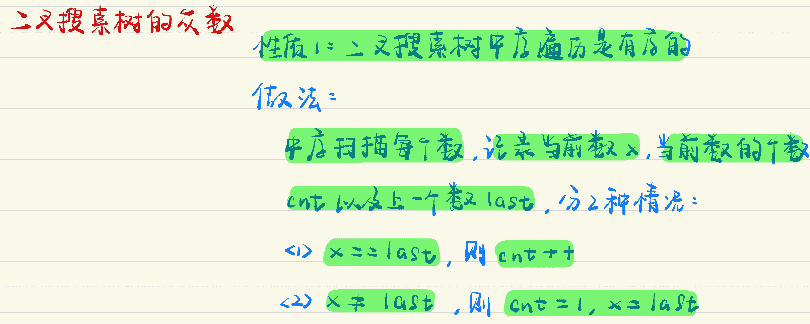

**代ç **

```c++
/**
 * Definition for a binary tree node.
 * struct TreeNode {
 *     int val;
 *     TreeNode *left;
 *     TreeNode *right;
 *     TreeNode() : val(0), left(nullptr), right(nullptr) {}
 *     TreeNode(int x) : val(x), left(nullptr), right(nullptr) {}
 *     TreeNode(int x, TreeNode *left, TreeNode *right) : val(x), left(left), right(right) {}
 * };
 */
class Solution {
public:
    vector<int> ans;
    int Mxcnt = 0, cnt = 0, last;
    void dfs(TreeNode* root) {
        // 空å­æ ‘ç›´æ¥è¿”å›
        if (!root) return;
        // éå†å·¦å­æ ‘
        dfs(root -> left);
        // 如æœå’Œä¸Šä¸€ä¸ªæ•°ç›¸ç­‰, 则 cnt ++
        if (root -> val == last) cnt ++;
        else {
            // 更新上一个数
            last = root -> val;
            // 更新个数
            cnt = 1;
        }
        // 如æœå½“å‰æ•°çš„个数大äºå…¨å±€æœ€å¤§æ•°, 则更新
        if (cnt > Mxcnt) {
            // 更新最大数
            Mxcnt = cnt;
            // 更新答案数组
            ans = {last};
        }
        // 答案多一个数
        else if (cnt == Mxcnt) ans.push_back(last);
        // éå†å³å­æ ‘
        dfs(root -> right);
        return;
    }
    vector<int> findMode(TreeNode* root) {
        dfs(root);
        return ans;
    }
};
```

**时间å¤æ‚度**

$O(n)$

**空间å¤æ‚度**

$O(n)$

**标签**

`二å‰æœç´¢æ ‘`

**ç¼åˆæ€ª**


#### [LeetCode 530. 二å‰æœç´¢æ ‘的最å°ç»å¯¹å·®](https://leetcode.cn/problems/minimum-absolute-difference-in-bst/)

**题目æè¿°**

>   给你一个二å‰æœç´¢æ ‘的根节点 `root` ï¼Œè¿”å› æ ‘ä¸­ä»»æ„两ä¸åŒèŠ‚点值之间的最å°å·®å€¼ 。
>
>   差值是一个正数，其数值等äºä¸¤å€¼ä¹‹å·®çš„ç»å¯¹å€¼ã€‚

**示例 1**

>   输入：`root = [4,2,6,1,3]`
>   输出：`1`

**示例 2**

>   输入：`root = [1,0,48,null,null,12,49]`
>   输出：`1`

**æ示**

>   +   $树中节点的数目范围是 [2, 10^4]$
>   +   $0 <= Node.val <= 10^5$

注æ„

>   æœ¬é¢˜ä¸ [LeetCode 783.](https://leetcode-cn.com/problems/minimum-distance-between-bst-nodes/) 相åŒ

**手写稿**


**代ç **

```c++
/**
 * Definition for a binary tree node.
 * struct TreeNode {
 *     int val;
 *     TreeNode *left;
 *     TreeNode *right;
 *     TreeNode() : val(0), left(nullptr), right(nullptr) {}
 *     TreeNode(int x) : val(x), left(nullptr), right(nullptr) {}
 *     TreeNode(int x, TreeNode *left, TreeNode *right) : val(x), left(left), right(right) {}
 * };
 */
class Solution {
public:
    int ans = 1e9, last, is_first = true;
    void dfs(TreeNode* root) {
        // 空树返å›
        if (!root) return;
        // éå†å·¦å­æ ‘
        dfs(root -> left);
        // 如æœæ˜¯ç¬¬ä¸€ä¸ªæ•°, 则标记
        if (is_first) is_first = false;
        // 如æœä¸æ˜¯ç¬¬ä¸€ä¸ªæ•°, 则更新最å°å·®å€¼
        else ans = min(ans, abs(root -> val - last));
        // 更新上一个数
        last = root -> val;
        // éå†å³å­æ ‘
        dfs(root -> right);
        return;
    }
    int getMinimumDifference(TreeNode* root) {
        dfs(root);
        return ans;
    }
};
```

**时间å¤æ‚度**

$O(n)$

**空间å¤æ‚度**

$O(n)$

**标签**

`二å‰æœç´¢æ ‘`

**ç¼åˆæ€ª**


# 字符串专题

## KMP

### [Leetode 214. 最短å›æ–‡ä¸²](https://leetcode-cn.com/problems/shortest-palindrome/)

**题目æè¿°**

> 给定一个字符串 s，你å¯ä»¥é€šè¿‡åœ¨å­—符串å‰é¢æ·»åŠ å­—符将其转æ¢ä¸ºå›æ–‡ä¸²ã€‚找到并返å›å¯ä»¥ç”¨è¿™ç§æ–¹å¼è½¬æ¢çš„最短å›æ–‡ä¸²ã€‚

**示例 1**

> 输入：`s = "aacecaaa"`
> 输出：`"aaacecaaa"`

**示例 2**

> 输入：`s = "abcd"`
> 输出：`"dcbabcd"`

**æ示**

> + $0 <= s.length <= 5 * 10^4$
> + $s$ ä»…ç”±å°å†™è‹±æ–‡å­—æ¯ç»„æˆ

**手写稿**


**æ€è·¯**

> 1. è¦æƒ³è®© `c + a + b` 最短，则åªè¦ `c` å’Œ `b` 最短å³å¯ï¼Œæ¢å¥è¯è¯´ï¼Œè®© `a` 最长å³å¯
>
> 2. 通过上述分æ，问题转化为在åŸä¸²`（a + b）`中寻找最长å›æ–‡å­ä¸²å³å¯è§£å†³é—®é¢˜
>
> 3. 通过以下步骤，寻找最长å›æ–‡å­ä¸²å³å¯
>
>     + å°†åŸä¸²é€†åºå¤åˆ¶ä¸€é，用 `#` è¿æ¥ï¼Œæ”¾åœ¨åŸä¸²çš„åé¢
>
>         
>
>     + 寻找新串 `a + b + b + a` 的最长å›æ–‡å‰ç¼€å³å¯ï¼Œå³ `KMP` çš„ `next` 数组的å«ä¹‰
>
> 4. 找出 `a` 之å，将 `a` 之åçš„éƒ¨åˆ†ï¼Œå³ `b` 截å–出æ¥ï¼Œé€†åºæ”¾åˆ°æœ€å‰æ–¹

**代ç **

```c++
class Solution {
public:
    string shortestPalindrome(string s) {
        string t = s;
        t = ' ' + t + '#' + string(t.rbegin(), t.rend());
        int n = t.size();
        vector<int> ne(n + 5);
        for (int i = 2, j = 0; i < n; i ++ ) {
            while (j && t[i] != t[j + 1]) j = ne[j];
            if (t[i] == t[j + 1]) j ++;
            ne[i] = j;
        }
        t = s.substr(ne[n - 1]);
        return string(t.rbegin(), t.rend()) + s;
    }
};
```

**标签**

`字符串`ã€`å›æ–‡ä¸²`ã€`KMP`

# 模拟题专题

## 模拟

### [LeetCode 299. 猜数字游æˆ](https://leetcode-cn.com/problems/bulls-and-cows/)

**题目æè¿°**

> 你在和朋å‹ä¸€èµ·ç© 猜数字`（Bulls and Cows）`游æˆï¼Œè¯¥æ¸¸æˆè§„则如下：
>
> 写出一个秘密数字，并请朋å‹çŒœè¿™ä¸ªæ•°å­—是多少。朋å‹æ¯çŒœæµ‹ä¸€æ¬¡ï¼Œä½ å°±ä¼šç»™ä»–一个包å«ä¸‹è¿°ä¿¡æ¯çš„æ示：
>
> 猜测数字中有多少ä½å±äºæ•°å­—和确切ä½ç½®éƒ½çŒœå¯¹äº†ï¼ˆç§°ä¸º "`Bulls`"，公牛），
> 有多少ä½å±äºæ•°å­—猜对了但是ä½ç½®ä¸å¯¹ï¼ˆç§°ä¸º "`Cows`"，奶牛）。也就是说，这次猜测中有多少ä½é公牛数字å¯ä»¥é€šè¿‡é‡æ–°æ’列转æ¢æˆå…¬ç‰›æ•°å­—。
> 给你一个秘密数字 `secret` 和朋å‹çŒœæµ‹çš„æ•°å­— `guess` ，请你返å›å¯¹æœ‹å‹è¿™æ¬¡çŒœæµ‹çš„æ示。
>
> æ示的格å¼ä¸º "`xAyB`" ，`x` 是公牛个数， `y` 是奶牛个数，`A` 表示公牛，`B` 表示奶牛。
>
> 请注æ„秘密数字和朋å‹çŒœæµ‹çš„数字都å¯èƒ½å«æœ‰é‡å¤æ•°å­—。

**示例 1**

> 输入：`secret = "1807", guess = "7810"`
> 输出：`"1A3B"`
> 解释：数字和ä½ç½®éƒ½å¯¹ï¼ˆå…¬ç‰›ï¼‰ç”¨ `'|'` è¿æ¥ï¼Œæ•°å­—猜对ä½ç½®ä¸å¯¹ï¼ˆå¥¶ç‰›ï¼‰çš„采用斜体加粗标识。
> `"1807"
> |
> "7810"`

**示例 2**

> 输入：`secret = "1123", guess = "0111"`
> 输出：`"1A1B"`
> 解释：数字和ä½ç½®éƒ½å¯¹ï¼ˆå…¬ç‰›ï¼‰ç”¨ `'|'` è¿æ¥ï¼Œæ•°å­—猜对ä½ç½®ä¸å¯¹ï¼ˆå¥¶ç‰›ï¼‰çš„采用斜体加粗标识。
> `"1123"        "1123"
> |      or     |
> "0111"        "0111"`
> 注æ„，两个ä¸åŒ¹é…çš„ `1` 中，åªæœ‰ä¸€ä¸ªä¼šç®—作奶牛（数字猜对ä½ç½®ä¸å¯¹ï¼‰ã€‚通过é‡æ–°æ’列é公牛数字，其中仅有一个 `1` å¯ä»¥æˆä¸ºå…¬ç‰›æ•°å­—。

**示例 3**

> 输入：`secret = "1", guess = "0"`
> 输出：`"0A0B"`

**示例 4**

> 输入：`secret = "1", guess = "1"`
> 输出：`"1A0B"`

**æ示**

> + $1 <= secret.length, guess.length <= 1000$
> + $secret.length == guess.length$
> + `secret` å’Œ `guess` 仅由数字组æˆ

**题解**

> 1. 两次éå†ï¼›
> 2. 第一次éå†æ•°ç»„并且统计公牛的次数，åŒæ—¶å°†ä¸æ»¡è¶³å…¬ç‰›çš„字符使用多é‡é›†åˆè®°å½•ä¸‹æ¥
> 3. 第二次éå†æ•°ç»„并且利用多é‡é›†åˆç»Ÿè®¡å¥¶ç‰›çš„次数，注æ„一个数字åªèƒ½å¯¹åº”一个数字，因此，如æœæ¯”对æˆåŠŸéœ€è¦å°†æˆåŠŸçš„字符ä»å¤šé‡é›†åˆé‡Œé¢åˆ é™¤

**代ç **

```c++
class Solution {
public:
    string getHint(string s, string t) {
        int a = 0, b = 0;
        multiset<char> hash;
        for (int i = 0; i < s.size(); i ++ ) {
            if (s[i] == t[i]) a ++;
            else hash.insert(s[i]);
        }
        for (int i = 0; i < s.size(); i ++ ) {
            if (s[i] == t[i]) continue;
            if (hash.count(t[i])) {
                b ++;
                hash.erase(hash.find(t[i]));
            }
        }
        return to_string(a) + "A" + to_string(b) + "B";
    }
};
```

**标签**

`模拟`

### [LeetCode 273. 整数转æ¢è‹±æ–‡è¡¨ç¤º](https://leetcode-cn.com/problems/integer-to-english-words/)

**题目æè¿°**

> å°†éè´Ÿæ•´æ•° num 转æ¢ä¸ºå…¶å¯¹åº”的英文表示。

**示例 1**

> 输入：`num = 123`
> 输出：`"One Hundred Twenty Three"`

**示例 2**

> 输入：`num = 12345`
> 输出：`"Twelve Thousand Three Hundred Forty Five"`

**示例 3**

> 输入：`num = 1234567`
> 输出：`"One Million Two Hundred Thirty Four Thousand Five Hundred Sixty Seven"`

**示例 4**

> 输入：`num = 1234567891`
> 输出：`"One Billion Two Hundred Thirty Four Million Five Hundred Sixty Seven Thousand Eight Hundred Ninety One"`

**æ示**

> + $0 <= num <= 2^{31} - 1$

**手写稿**


**代ç **

```c++
class Solution {
public:
    // 预处ç†æ•°æ®
    string nums0_19[20] = {
        "Zero", "One", "Two", "Three", "Four", 
        "Five", "Six", "Seven", "Eight", "Nine",
        "Ten", "Eleven", "Twelve", "Thirteen",
        "Fourteen", "Fifteen", "Sixteen", "Seventeen",
        "Eighteen", "Nineteen"
    };
    string nums20_90[8] = {
        "Twenty", "Thirty", "Forty", "Fifty",
        "Sixty", "Seventy", "Eighty", "Ninety"
    };
    string nums1000_1e9[4] = {
        "Billion ", "Million ", "Thousand ", ""
    };
    string get(int x) {
        if (x == 0) return "Zero";
        string res;
        if (x >= 100) {
            res += nums0_19[x / 100] + " Hundred ";
            x %= 100;
        }
        if (x >= 20) {
            res += nums20_90[x / 10 - 2] + " ";
            x %= 10;
        }
        if (x) res += nums0_19[x] + " ";
        return res;
    }
    string numberToWords(int num) {
        if (num == 0) return "Zero";
        string res;
        for (int i = 1e9, j = 0; i >= 1; i /= 1000, j ++ )
            if (num >= i) {
                res += get(num / i) + nums1000_1e9[j];
                num %= i;
            }
        // 注æ„空格问题
        res.pop_back();
        return res;
    }
};
```

**标签**

`模拟`ã€`数字转æ¢`ã€`中英文`

### [AcWing 1473. A + B æ ¼å¼](https://www.acwing.com/problem/content/1475/)

**题目æè¿°**

>   计算 `a + b` 并以标准格å¼è¾“出总和----也就是说，ä»æœ€ä½ä½å¼€å§‹æ¯éš”三ä½æ•°åŠ è¿›ä¸€ä¸ªé€—å·ï¼ˆåƒä½åˆ†éš”符），如æœç»“æœå°‘äºå››ä½åˆ™ä¸éœ€æ·»åŠ ã€‚

**输入格å¼**

>   共一行，包å«ä¸¤ä¸ªæ•´æ•° `a` å’Œ `b`。

**输出格å¼**

>   共一行，以标准格å¼è¾“出 `a + b` 的和。

**æ•°æ®èŒƒå›´**

>   +   $−10^6≤a,b≤10^6$

**输入样例**

```c++
-1000000 9
```

**输出样例**

```c++
-999,991
```

**手写稿**

>   1.   对 `a + b` å½¢æˆçš„字符串 `s`，进行éå†ï¼Œä½¿ç”¨ `t` 作为答案，分以下情况：
>        +   如æœå½“å‰éå†çš„å­—ç¬¦æ•°é‡ `k` å·²ç»è¾¾åˆ° `3` 个，则判断是å¦è¿˜æœ‰ä¸‹ä¸€ä¸ªå­—符并且下一个字符是å¦æ˜¯ `'-'`
>            +   如æœæ¡ä»¶æˆç«‹ï¼Œ`t += ,` 并且，将 `k` ç½® `0`
>            +   如æœæ¡ä»¶ä¸æˆç«‹ï¼Œé€€å‡ºå¾ªç¯
>        +   å转 `t`，如æœå­—符串 `s` 的第一个字符是 `'-'`，将其加入到答案å³å¯

**代ç **

```c++
#include <iostream>
#include <algorithm>
using namespace std;
int a, b;
int main() {
    cin >> a >> b;
    string s = to_string(a + b);
    string t;
    for (int i = s.size() - 1, k = 0; i >= 0 && s[i] != '-'; i -- ) {
        t += s[i];
        k ++;
        // 如æœæ•°é‡å·²ç»è¾¾åˆ°3个，并且，还有下一个字符或者下一个字符ä¸æ˜¯'-'
        // 将其加入到答案，将k置0
        if (k == 3 && i - 1 >= 0 && s[i - 1] != '-') t += ',', k = 0; 
    }
    // å转t
    reverse(t.begin(), t.end());
    // 如æœs的第一个字符是'-'，将其加入到答案
    if (s[0] == '-') t = '-' + t;
    cout << t << endl;
    return 0;
}
```

**时间å¤æ‚度**

$O(n)$

**空间å¤æ‚度**

$O(1)$

**标签**

`模拟`

**ç¼åˆæ€ª**

### [L1-049 天梯赛座ä½åˆ†é…](https://pintia.cn/problem-sets/994805046380707840/problems/994805081289900032)

**题目æè¿°**

> 天梯赛æ¯å¹´æœ‰å¤§é‡å‚赛队员，è¦ä¿è¯åŒä¸€æ‰€å­¦æ ¡çš„所有队员都ä¸èƒ½ç›¸é‚»ï¼Œåˆ†é…座ä½å°±æˆä¸ºä¸€ä»¶æ¯”较麻烦的事情。为此我们制定如下策略：å‡è®¾æŸèµ›åœºæœ‰ `N` 所学校å‚赛，第 `i` 所学校有 `M[i]` 支队ä¼ï¼Œæ¯é˜Ÿ `10` ä½å‚赛选手。令æ¯æ ¡é€‰æ‰‹æ’æˆä¸€åˆ—纵队，第 `i + 1` 队的选手æ’在第 `i` 队选手之å。ä»ç¬¬ `1` 所学校开始，å„校的第 `1` ä½é˜Ÿå‘˜é¡ºæ¬¡å…¥åº§ï¼Œç„¶å是å„校的第 `2` ä½é˜Ÿå‘˜â€¦â€¦ 以此类æ¨ã€‚如æœæœ€ååªå‰©ä¸‹ `1` 所学校的队ä¼è¿˜æ²¡æœ‰åˆ†é…座ä½ï¼Œåˆ™éœ€è¦å®‰æ’他们的队员隔ä½å°±å。本题就è¦æ±‚你编写程åºï¼Œè‡ªåŠ¨ä¸ºå„校生æˆé˜Ÿå‘˜çš„座ä½å·ï¼Œä» `1` 开始编å·ã€‚

**输入格å¼**

> 输入在一行中给出å‚赛的高校数 `N` （ä¸è¶…过`100`的正整数）；第二行给出 `N` 个ä¸è¶…过``10``的正整数，其中第 `i` 个数对应第 `i` 所高校的å‚赛队ä¼æ•°ï¼Œæ•°å­—间以空格分隔。

**输出格å¼**

> ä»ç¬¬ `1` 所高校的第 `1` 支队ä¼å¼€å§‹ï¼Œé¡ºæ¬¡è¾“出队员的座ä½å·ã€‚æ¯é˜Ÿå ä¸€è¡Œï¼Œåº§ä½å·é—´ä»¥ `1` 个空格分隔，行首尾ä¸å¾—有多余空格。å¦å¤–，æ¯æ‰€é«˜æ ¡çš„第一行按“`#X`â€è¾“出该校的编å·`X`ï¼Œä» `1` 开始。

**输入样例**

```c++
3
3 4 2
```

**输出样例**

```c++
#1
1 4 7 10 13 16 19 22 25 28
31 34 37 40 43 46 49 52 55 58
61 63 65 67 69 71 73 75 77 79
#2
2 5 8 11 14 17 20 23 26 29
32 35 38 41 44 47 50 53 56 59
62 64 66 68 70 72 74 76 78 80
82 84 86 88 90 92 94 96 98 100
#3
3 6 9 12 15 18 21 24 27 30
33 36 39 42 45 48 51 54 57 60
```

**手写稿**


**代ç **

```c++
#include <iostream>
using namespace std;
const int N = 110;
int n, m;
int q[N];
int g[N][N];
int main() {
    scanf("%d", &m);
    for (int i = 0; i < m; i ++ ) {
        scanf("%d", &q[i]);
        n = max(n, q[i] * 10);
    }
    int num = 0;
    int which = -1; // 记录上一个轮的最å一个报数的队ä¼çš„ID
    for (int i = 0; i < n; i ++ )
        for (int j = 0; j < m; j ++ ) {
            if (i >= q[j] * 10) continue;
            // 如æœä¸Šä¸€è½®æœ€å一个报数的队ä¼çš„ID和当å‰çš„队ä¼æ˜¯åŒä¸€ä¸ªé˜Ÿä¼
            // 说æ˜åªå‰©ä¸‹ä¸€ä¸ªé˜Ÿä¼, 需è¦éš”ä½å°±åš, ++ num
            if (j == which) ++ num;
            g[i][j] = ++ num;
            which = j;
        }
    for (int i = 0; i < m; i ++ ) {
        printf("#%d\n", i + 1);
        for (int j = 0; j < q[i]; j ++ ) {
            for (int k = 0; k < 10; k ++ ) {
                cout << g[j * 10 + k][i];
                if (k + 1 < 10) cout << ' ';
            }
            cout << endl;
        }
    }
    return 0;
}
```

**时间å¤æ‚度**

$O(nm)$

**空间å¤æ‚度**

$O(n^2)$

**标签**

`模拟题`

**ç¼åˆæ€ª**


### [LeetCode 38. 外观数列](https://leetcode-cn.com/problems/count-and-say/)

**题目æè¿°**

> 给定一个正整数 `n` ，输出外观数列的第 `n` 项。
>
> 「外观数列ã€æ˜¯ä¸€ä¸ªæ•´æ•°åºåˆ—，ä»æ•°å­— `1` 开始，åºåˆ—中的æ¯ä¸€é¡¹éƒ½æ˜¯å¯¹å‰ä¸€é¡¹çš„æ述。
>
> ä½ å¯ä»¥å°†å…¶è§†ä½œæ˜¯ç”±é€’å½’å…¬å¼å®šä¹‰çš„数字字符串åºåˆ—：
>
> + `countAndSay(1) = "1"`
> + `countAndSay(n)` 是对 `countAndSay(n - 1)` çš„æ述，然å转æ¢æˆå¦ä¸€ä¸ªæ•°å­—字符串。
>
> å‰äº”项如下:
>
> > 1.     `1`
> > 2.     `11`
> > 3.     `21`
> > 4.     ``1211``
> > 5.     `111221`
> >
> > 第一项是数字 `1` 
> > æè¿°å‰ä¸€é¡¹ï¼Œè¿™ä¸ªæ•°æ˜¯ `1` å³ â€œ 一 个 `1` â€ï¼Œè®°ä½œ "`11`"
> > æè¿°å‰ä¸€é¡¹ï¼Œè¿™ä¸ªæ•°æ˜¯ `11` å³ â€œ 二 个 `1` †，记作 "`21`"
> > æè¿°å‰ä¸€é¡¹ï¼Œè¿™ä¸ªæ•°æ˜¯ `21` å³ â€œ 一 个 `2` + 一 个 `1` †，记作 "`1211`"
> > æè¿°å‰ä¸€é¡¹ï¼Œè¿™ä¸ªæ•°æ˜¯ `1211` å³ â€œ 一 个 ``1`` + 一 个 `2` + 二 个 `1` †，记作 "`111221`"
>
>
> è¦ æè¿° 一个数字字符串，首先è¦å°†å­—符串分割为 æœ€å° æ•°é‡çš„组，æ¯ä¸ªç»„都由è¿ç»­çš„最多 相åŒå­—符 组æˆã€‚然å对äºæ¯ä¸ªç»„，先æ述字符的数é‡ï¼Œç„¶åæ述字符，形æˆä¸€ä¸ªæ述组。è¦å°†æ述转æ¢ä¸ºæ•°å­—字符串，先将æ¯ç»„中的字符数é‡ç”¨æ•°å­—替æ¢ï¼Œå†å°†æ‰€æœ‰æ述组è¿æ¥èµ·æ¥ã€‚
>
> 例如，数字字符串 "`3322251`" çš„æ述如下图：
>
> 

**示例 1**

> 输入：`n = 1`
> 输出：`"1"`
> 解释：这是一个基本样例。

**示例 2**

> 输入：`n = 4`
> 输出：`"1211"`
> 解释：
> `countAndSay(1) = "1"`
> `countAndSay(2) = 读 "1" = 一 个 1 = "11"`
> `countAndSay(3) = 读 "11" = 二 个 1 = "21"`
> `countAndSay(4) = 读 "21" = 一 个 2 + 一 个 1 = "12" + "11" = "1211"`

**æ示**

> + $1 <= n <= 30$

**手写稿**

>   1.   模拟å³å¯
>   2.   注æ„事项: 看代ç 

**代ç **

```c++
class Solution {
public:
    string countAndSay(int n) {
        string str = "1";
        for (int i = 2; i <= n; i ++ ) {
            string tmp;
            for (int j = 0; j < str.size(); j ++ ) {
                int k = j;
                // 判断字符str[j]的个数
                while (k < str.size() && str[k] == str[j]) k ++;
                // (k - j)个字符str[j]
                tmp += to_string(k - j) + str[j];
                j = k - 1;
            }
            str = tmp;
        }
        return str;
    }
};
```

**时间å¤æ‚度**

$O(nm), n是给定的正整数, m是生æˆå­—符串的长度$

**空间å¤æ‚度**

$O(m), m是生æˆå­—符串的最大长度$

**标签**

`模拟`

**ç¼åˆæ€ª**


### [LeetCode 68. 文本左å³å¯¹é½](https://leetcode-cn.com/problems/text-justification/)

**题目æè¿°**

>   给定一个å•è¯æ•°ç»„ `words` 和一个长度 `maxWidth` ，é‡æ–°æ’版å•è¯ï¼Œä½¿å…¶æˆä¸ºæ¯è¡Œæ°å¥½æœ‰ `maxWidth` 个字符，且左å³ä¸¤ç«¯å¯¹é½çš„文本。
>
>   你应该使用 “贪心算法†æ¥æ”¾ç½®ç»™å®šçš„å•è¯ï¼›ä¹Ÿå°±æ˜¯è¯´ï¼Œå°½å¯èƒ½å¤šåœ°å¾€æ¯è¡Œä¸­æ”¾ç½®å•è¯ã€‚å¿…è¦æ—¶å¯ç”¨ç©ºæ ¼ ' ' 填充，使得æ¯è¡Œæ°å¥½æœ‰ `maxWidth` 个字符。
>
>   è¦æ±‚å°½å¯èƒ½å‡åŒ€åˆ†é…å•è¯é—´çš„空格数é‡ã€‚如æœæŸä¸€è¡Œå•è¯é—´çš„空格ä¸èƒ½å‡åŒ€åˆ†é…，则左侧放置的空格数è¦å¤šäºå³ä¾§çš„空格数。
>
>   文本的最å一行应为左对é½ï¼Œä¸”å•è¯ä¹‹é—´ä¸æ’å…¥é¢å¤–的空格。
>
>   注æ„:
>
>   å•è¯æ˜¯æŒ‡ç”±é空格字符组æˆçš„字符åºåˆ—。
>   æ¯ä¸ªå•è¯çš„é•¿åº¦å¤§äº `0`，å°äºç­‰äº `maxWidth`。
>   输入å•è¯æ•°ç»„ `words` 至少包å«ä¸€ä¸ªå•è¯ã€‚

**示例 1**

>   输入: `words = ["This", "is", "an", "example", "of", "text", "justification."], maxWidth = 16`
>   输出:
>   `[
>     "This    is    an",
>     "example  of text",
>     "justification.  "
>   ]`

**示例 2**

>   输入:`words = ["What","must","be","acknowledgment","shall","be"], maxWidth = 16`
>   输出:
>   `[
>    "What   must   be",
>    "acknowledgment  ",
>    "shall be        "
>   ]`
>   解释: 注æ„最å一行的格å¼åº”为 `"shall be    "` 而ä¸æ˜¯ `"shall     be"`,
>       因为最å一行应为左对é½ï¼Œè€Œä¸æ˜¯å·¦å³ä¸¤ç«¯å¯¹é½ã€‚       
>       第二行åŒæ ·ä¸ºå·¦å¯¹é½ï¼Œè¿™æ˜¯å› ä¸ºè¿™è¡ŒåªåŒ…å«ä¸€ä¸ªå•è¯ã€‚

**示例 3**

>   输入:`words = ["Science","is","what","we","understand","well","enough","to","explain","to","a","computer.","Art","is","everything","else","we","do"]，maxWidth = 20`
>   输出:
>   `[
>    "Science  is  what we",
>    "understand      well",
>    "enough to explain to",
>    "a  computer.  Art is",
>    "everything  else  we",
>    "do                  "
>   ]`

**æ示**

>   +   $1 <= words.length <= 300$
>   +   $1 <= words[i].length <= 20$
>   +   $words[i] ç”±å°å†™è‹±æ–‡å­—æ¯å’Œç¬¦å·ç»„æˆ$
>   +   $1 <= maxWidth <= 100$
>   +   $words[i].length <= maxWidth$

**手写稿**

>   1.   模拟, 分两步进行
>        +   左对é½
>        +   两端对é½
>   2.   `++ usednum <= leftnum` 解释
>        +   `usednum` 表示的å«ä¹‰æ˜¯åœ¨å¤šå‡ºæ¥çš„空格中已ç»ä½¿ç”¨çš„个数
>        +   `leftnum` 表示多出æ¥ç©ºæ ¼çš„总个数
>        +   å‡è®¾ `leftnum = 0`
>        +   `usednum` åˆå§‹å€¼ä¸º `0`, 表示一个数字都没有被使用过
>        +   上å¼å«ä¹‰æ˜¯ç”¨è¿‡ä¸€ä¸ªæ•°å­—之å如æœå°äºç­‰äºæ€»ä¸ªæ•°, 说æ˜åˆæ³•, è¿”å› `true(1)`, å¦åˆ™, è¿”å› `false(0)`

**代ç **

```c++
class Solution {
public:
    vector<string> fullJustify(vector<string>& g, int Max) {
        int n = g.size();
        vector<string> res;
        for (int i = 0; i < n; i ++ ) {
            // speå«ä¹‰ä¸ºç©ºæ ¼çš„æ•°é‡
            int j = i, len = 0, spe = 0;
            string line;
            while (j < n && len + spe + g[j].size() <= Max) {
                len = len + spe + g[j].size();
                spe = 1, j ++ ;
            }
            int wdnum = j - i; // å•è¯çš„æ•°é‡
            if (j == n || wdnum == 1) { // 到达最å一行活ç€æœ¬è¡Œåªæœ‰ä¸€ä¸ªå•è¯, 左对é½
                // 先输入一个å•è¯
                line = g[i];
                for (int k = i + 1; k < j; k ++ ) line += ' ' + g[k];
                // 将剩余的空格补é½
                line += string(Max - line.size(), ' ');
            }
            else { // 两端对é½
                // 空格的平å‡æ•°é‡
                int spenum = (Max - len + wdnum - 1) / (wdnum - 1);
               	// 剩余空格的数é‡
                int leftnum = (Max - len + wdnum - 1) % (wdnum - 1);
                int usednum = 0; // å·²ç»ç”¨è¿‡çš„空格的数é‡
                line = g[i ++]; // 先输入一个å•è¯
                // 严格å°äº
                // ++ usednum <= leftnum[手写稿解释åŸå› ]
                while (line.size() < Max)
                    line += string(spenum + (++ usednum <= leftnum), ' ') + g[i ++ ];
            }
            i = j - 1;
            res.push_back(line);
        }
        return res;
    }
};
```

**时间å¤æ‚度**

$O(n), n表示å•è¯çš„æ•°é‡$

**空间å¤æ‚度**

$O(n), n表示å•è¯çš„总长度$

**标签**

`模拟`ã€`字符串`

**ç¼åˆæ€ª**


## 阅读ç†è§£é¢˜

### [LeetCode 275. H 指数 II](https://leetcode-cn.com/problems/h-index-ii/)

**题目æè¿°**

> 给你一个整数数组 `citations` ，其中 `citations[i]` 表示研究者的第 `i` 篇论文被引用的次数，`citations` å·²ç»æŒ‰ç…§ å‡åºæ’列 。计算并返å›è¯¥ç ”究者的 `h` 指数。
>
> `h` 指数的定义：`h` 代表“高引用次数â€ï¼ˆ`high citations`），一å科研人员的 `h` 指数是指他（她）的 （`n` 篇论文中）总共有 `h` 篇论文分别被引用了至少 `h` 次。且其余的 `n - h` 篇论文æ¯ç¯‡è¢«å¼•ç”¨æ¬¡æ•° ä¸è¶…过 `h` 次。
>
> æç¤ºï¼šå¦‚æœ `h` 有多ç§å¯èƒ½çš„值，h 指数 是其中最大的那个。
>
> 请你设计并å®ç°å¯¹æ•°æ—¶é—´å¤æ‚度的算法解决此问题。

**示例 1**

> 输入：`citations = [0,1,3,5,6]`
> 输出：`3`
> 解释：给定数组表示研究者总共有 `5` 篇论文，æ¯ç¯‡è®ºæ–‡ç›¸åº”的被引用了 `0, 1, 3, 5, 6` 次。
> ç”±äºç ”究者有 `3` 篇论文æ¯ç¯‡ 至少 被引用了 `3` 次，其余两篇论文æ¯ç¯‡è¢«å¼•ç”¨ ä¸å¤šäº `3` 次，所以她的 `h` 指数是 `3` 。

**示例 2**

> 输入：`citations = [1,2,100]`
> 输出：`2`

**æ示**

> + $n == citations.length$
> + $1 <= n <= 10^5$
> + $0 <= citations[i] <= 1000$
> + $citations 按 å‡åºæ’列$

**分æ**

> 1. 将数组ä»å¤§åˆ°å°æ’åºï¼Œç„¶åä»å‰å¾€å一次æšä¸¾æ¯ä¸€ä¸ªæ•°å­—，如æœå½“å‰æ•°å­— `g[i] >= n - i`，则找到答案
> 2. 本题中由äºæŒ‰ç…§ä»å°åˆ°å¤§æ’åºçš„，所以åšçš„时候需è¦è¿›è¡Œåæ ‡å˜æ¢ `g[n - mid]` 表示的是ä»å¤§åˆ°å°çš„第 `mid` 个数字
> 3. 本题中二分的是答案也就是 `H` 的值，最å°æ˜¯ `0`，最大是 `n`

**代ç **

```c++
class Solution {
public:
    int hIndex(vector<int>& g) {
        int n = g.size(), l = 0, r = n;
        while (l < r) {
            int mid = l + r + 1 >> 1;
            if (g[n - mid] >= mid) l = mid;
            else r = mid - 1;
        }
        return l;
    }
};
```

**标签**

`阅读ç†è§£`

### [LeetCode 393. UTF-8 ç¼–ç éªŒè¯](https://leetcode-cn.com/problems/utf-8-validation/)

**题目æè¿°**

>   给定一个表示数æ®çš„整数数组 `data` ，返å›å®ƒæ˜¯å¦ä¸ºæœ‰æ•ˆçš„ `UTF-8` ç¼–ç ã€‚
>
>   `UTF-8` 中的一个字符å¯èƒ½çš„长度为 `1` 到 `4` 字节，éµå¾ªä»¥ä¸‹çš„规则：
>
>   +   å¯¹äº `1` 字节 的字符，字节的第一ä½è®¾ä¸º `0` ，åé¢ `7` ä½ä¸ºè¿™ä¸ªç¬¦å·çš„ `unicode` ç ã€‚
>   +   å¯¹äº `n` 字节 的字符 (`n > 1`)ï¼Œç¬¬ä¸€ä¸ªå­—èŠ‚çš„å‰ `n` ä½éƒ½è®¾ä¸º`1`，第 `n + 1` ä½è®¾ä¸º `0` ，åé¢å­—节的å‰ä¸¤ä½ä¸€å¾‹è®¾ä¸º `10` 。剩下的没有æåŠçš„二进制ä½ï¼Œå…¨éƒ¨ä¸ºè¿™ä¸ªç¬¦å·çš„ `unicode` ç ã€‚
>
>   这是 `UTF-8` ç¼–ç çš„工作方å¼ï¼š
>
>   ```c++
>      Char. number range  |        UTF-8 octet sequence
>         (hexadecimal)    |              (binary)
>      --------------------+---------------------------------------------
>      0000 0000-0000 007F | 0xxxxxxx
>      0000 0080-0000 07FF | 110xxxxx 10xxxxxx
>      0000 0800-0000 FFFF | 1110xxxx 10xxxxxx 10xxxxxx
>      0001 0000-0010 FFFF | 11110xxx 10xxxxxx 10xxxxxx 10xxxxxx
>   ```
>
>
>   注æ„：输入是整数数组。åªæœ‰æ¯ä¸ªæ•´æ•°çš„ æœ€ä½ `8` ä¸ªæœ‰æ•ˆä½ ç”¨æ¥å­˜å‚¨æ•°æ®ã€‚è¿™æ„味ç€æ¯ä¸ªæ•´æ•°åªè¡¨ç¤º `1` 字节的数æ®ã€‚

**示例 1**

>   输入：`data = [197,130,1]`
>   输出：`true`
>   解释：数æ®è¡¨ç¤ºå­—节åºåˆ—:`11000101 10000010 00000001`。
>   这是有效的 `utf-8` ç¼–ç ï¼Œä¸ºä¸€ä¸ª `2` 字节字符，跟ç€ä¸€ä¸ª `1` 字节字符。

**示例 2**

>   输入：`data = [235,140,4]`
>   输出：`false`
>   解释：数æ®è¡¨ç¤º `8` ä½çš„åºåˆ—: `11101011 10001100 00000100`.
>   å‰ `3` ä½éƒ½æ˜¯ `1` ，第 `4` ä½ä¸º `0` 表示它是一个 `3` 字节字符。
>   下一个字节是开头为 `10` 的延续字节，这是正确的。
>   但第二个延续字节ä¸ä»¥ `10` 开头，所以是ä¸ç¬¦åˆè§„则的。

**æ示**

>   +   $1 <= data.length <= 2 * 10^4$
>   +   $0 <= data[i] <= 255$

**手写稿**


**代ç **

```c++
class Solution {
public:
    int get(int x, int k) {
        return x >> k & 1;
    }
    bool validUtf8(vector<int>& data) {
        for (int i = 0; i < data.size(); i ++ ) {
            // 如æœæ˜¯ä¸€ä¸ªå­—节, 则跳过
            if (!get(data[i], 7)) continue;
            int k = 0;
            // 查看当å‰å­—符å æ®çš„字节数
            while (k <= 4 && get(data[i], 7 - k)) k ++ ;
            if (k < 2 || k > 4) return false;
           	// 查看之åçš„k个字节[包括当å‰ä½ç½®]
            for (int j = 1; j < k; j ++ )
                // ä¸èƒ½è¶Šç•Œ
                if (i + j < data.size() && get(data[i + j], 7) && !get(data[i + j], 6))
                    continue;
                else return false;
            i += k - 1;
        }
        return true;
    }
};
```

**时间å¤æ‚度**

$O(n)$

**空间å¤æ‚度**

$O(1)$

**标签**

`阅读ç†è§£é¢˜`

**ç¼åˆæ€ª**


## 表达å¼æ±‚值

### [LeetCode 224. 基本计算器](https://leetcode-cn.com/problems/basic-calculator/)

**题目æè¿°**

> ç»™ä½ ä¸€ä¸ªå­—ç¬¦ä¸²è¡¨è¾¾å¼ s ，请你å®ç°ä¸€ä¸ªåŸºæœ¬è®¡ç®—器æ¥è®¡ç®—并返å›å®ƒçš„值。

**示例 1**

> 输入：`s = "1 + 1"`
> 输出：`2`

**示例 2**

> 输入：`s = " 2-1 + 2 "`
> 输出：`3`

**示例 3**

> 输入：`s = "(1+(4+5+2)-3)+(6+8)"`
> 输出：`23`

**æ示**

> + $1 <= s.length <= 3 * 10^5$
> + `s` 由数字`ã€'+'ã€'-'ã€'('ã€')'ã€`å’Œ `' '` 组æˆ
> + `s` 表示一个有效的表达å¼

**题解**

> 1. 使用两个栈，一个是数字栈 `num` ，å¦ä¸€ä¸ªæ˜¯å­—符串栈 `oper`
> 2. éå†æ¯ä¸€ä¸ªå­—符，分以下五ç§æƒ…况：
>     + 如æœé‡åˆ°ç©ºæ ¼ï¼Œç›´æ¥ `continue`
>     + 如æœé‡åˆ°`(`，直æ¥å…¥æ ˆ `oper`
>     + 如æœé‡åˆ° `)` ，计算答案，直到 `oper` 栈顶为 `(` 的时候åœæ­¢
>     + 如æœé‡åˆ°æ•°å­—，则计算数字的大å°ï¼Œå…¥æ ˆ `num`<font style="color:red">**（注æ„æ•°å­—ä¸ä¸€å®šæ˜¯ä¸€ä½æ•°ï¼‰**</font>
>     + 如æœé‡åˆ° `+`，`-`，则继续进行如下判断：
>         + 如æœå½“å‰å€¼æ˜¯ç¬¬ä¸€ä½ï¼Œä¾‹å¦‚ `+2`，则为了方便计算，在å‰é¢è¡¥ä¸€ä¸ª `0` å³å¯
>         + 如æœå½“å‰ä½ä¸æ˜¯ç¬¬ä¸€ä½å¹¶ä¸”å‰ä¸€ä½æ˜¯æ‹¬å·ï¼Œä¾‹å¦‚ `(+2)`，则为了方便，补一个 `0` å³å¯
>         + 除上述情况外，正常计算，直到栈为空或者é‡åˆ° `(` 的时候åœæ­¢
> 3. 如æœæ ˆä¸­è¿˜æœ‰è¿ç®—符，则继续计算，直到栈为空，答案就是栈顶元素

**代ç **

```c++
class Solution {
public:
    stack<int> num;
    stack<char> oper;
    void eval() {
        int b = num.top(); num.pop();
        int a = num.top(); num.pop();
        char op = oper.top(); oper.pop();
        if (op == '+') num.push(a + b);
        else num.push(a - b);
        return;
    }
    int calculate(string s) {
        for (int i = 0; i < s.size(); i ++ ) {
            if (s[i] == ' ') continue;
            else if (s[i] == '(') oper.push(s[i]);
            else if (s[i] == ')') {
                while (oper.top() != '(') eval();
                // 弹出左括å·
                oper.pop();
            }
            else if (isdigit(s[i])) {
                int sum = 0;
                while (i < s.size() && isdigit(s[i]))
                    sum = sum * 10 + (s[i ++ ] - '0');
                num.push(sum);
                i --;
            }
            else {
                // 处ç†ç‰¹æ®Šæƒ…况，如 +2 + a 或者 (-2 + a) 等类似情况
                if (!i || s[i - 1] == '(') num.push(0);
                while (oper.size() && oper.top() != '(') eval();
                // 将当å‰æ‹¬å·å…¥æ ˆ
                oper.push(s[i]);
            }
        }
        while (oper.size()) eval();
        return num.top();
    }
};
```

**标签**

`æ ˆ`ã€`表达å¼æ±‚值`

### [LeetCode 282. 给表达å¼æ·»åŠ è¿ç®—符](https://leetcode-cn.com/problems/expression-add-operators/)

**题目æè¿°**

> 给定一个仅包å«æ•°å­— `0-9` 的字符串 `num` 和一个目标值整数 `target` ，在 `num` 的数字之间添加 二元 è¿ç®—符（ä¸æ˜¯ä¸€å…ƒï¼‰`+`ã€`-` 或 `*` ，返å›æ‰€æœ‰èƒ½å¤Ÿå¾—到目标值的表达å¼ã€‚

**示例 1**

> 输入: `num = "123", target = 6`
> 输出: `["1+2+3", "1*2*3"] `

**示例 2**

> 输入: `num = "232", target = 8`
> 输出: `["2*3+2", "2+3*2"]`

**示例 3**

> 输入: `num = "105", target = 5`
> 输出: `["1*0+5","10-5"]`

**示例 4**

> 输入: `num = "00", target = 0`
> 输出: `["0+0", "0-0", "0*0"]`

**示例 5**

> 输入: `num = "3456237490", target = 9191`
> 输出: `[]`

**æ示**

> + $1 <= num.length <= 10$
> + $num ä»…å«æ•°å­—$
> + $-2^{31} <= target <= 2^{31} - 1$

**手写稿**

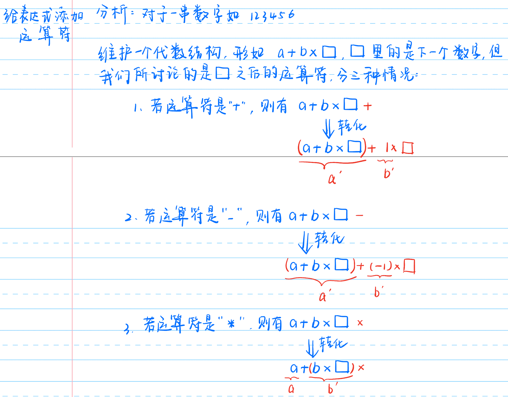

**代ç **

```c++
class Solution {
public:
    typedef long long LL;
    string path;
    vector<string> res;
    // ä¿è¯ç­”案ä¸è¶Šç•Œï¼Œä½†æ˜¯ä¸ä¿è¯ä¸­é—´è¿‡ç¨‹ä¸è¶Šç•Œ
    void dfs(string& num, int u, int len, LL a, LL b, LL target) {
        if (u == num.size())
            if (a == target) {
                res.push_back(path.substr(0, len - 1));
                return;
            }
        LL c = 0;
        for (int i = u; i < num.size(); i ++ ) {
            c = c * 10 + (num[i] - '0');
            path[len ++ ] = num[i];
            // æšä¸¾ç¬¬lenä½å¡«å†™çš„è¿ç®—符
            // +
            path[len] = '+';
            dfs(num, i + 1, len + 1, a + b * c, 1, target);
            if (i + 1 < num.size()) {
                // -
                path[len] = '-';
                dfs(num, i + 1, len + 1, a + b * c, -1, target);
                // *
                path[len] = '*';
                dfs(num, i + 1, len + 1, a, b * c, target);
            }
            // ä¸èƒ½æœ‰å‰å¯¼0
            if (num[u] == '0') return;
        }
        return;
    }
    vector<string> addOperators(string num, int target) {
        // 扩容
        path.resize(100);
        /*
        	å‚æ•°1: num字符串
        	å‚æ•°2: 当å‰æšä¸¾çš„是num中的哪ä½å­—符
        	å‚æ•°3: 答案字符串的长度
        	å‚æ•°4: a的值
        	å‚æ•°5: b的值
        	å‚æ•°6: 目标值
        */
        dfs(num, 0, 0, 0, 1, target);
        return res;
    }
};
```

**标签**

`dfs`ã€`表达å¼æ±‚值`

## 高精度

### 注æ„事项ã€å¿…看】

>   1.   分æ如下代ç ã€ä»¥é«˜ç²¾åº¦åŠ æ³•ä¸ºä¾‹ã€‘
>
>        ```c++
>        vector<int> add(vector<int>& A, vector<int>& B) {
>            vector<int> C;
>            // è¿›ä½
>            int t = 0;
>            for (int i = 0, j = 0; i < A.size() || j < B.size(); i ++, j ++ ) {
>                if (i < A.size()) t += A[i];
>                if (j < B.size()) t += B[i];
>                C.push_back(t % 10);
>                t /= 10;
>            }
>            // 如æœäº§ç”Ÿä½æ•°çš„å˜åŒ–，å³ç±»ä¼¼äº99 + 1，故还需处ç†è¿›ä½
>            while (t) {
>                C.push_back(t % 10);
>                t /= 10;
>            }
>            // 逆åºè¿”å›
>            return vector<int>(C.rbegin(), C.rend());
>        }
>        ```
>
>        +   问题如下
>
>            +   产生进ä½çš„时候，为啥è¦ä½¿ç”¨ `while(t)` 而ä¸æ˜¯ `if(t)` ?
>
>                >   1.   æ˜ç¡®ç›®æ ‡ï¼š`C` 中的<font style = "color: red">**æ¯ä¸€ä¸ªå…ƒç´ **</font>åªèƒ½æ˜¯<font style = "color: red">**一ä½æ•°**</font>
>                >
>                >        +   为啥 `C` 中的æ¯ä¸€ä¸ªå…ƒç´ å¿…é¡»åªèƒ½æ˜¯ä¸€ä½æ•°ï¼Ÿ
>                >
>                >            >   å‡è®¾`A` å’Œ `B` 中的æ¯ä¸€ä¸ªå…ƒç´ æœ‰å¯èƒ½ä¸æ˜¯ä¸€ä½æ•°ï¼Œä¾‹å¦‚，`A = {2e9}, B = {2e9}`，调用 `add(A, B)`，此时，答案应为 ` 4e9`，由äºï¼Œ`C` 中的æ¯ä¸€ä¸ªå…ƒç´ éƒ½æ˜¯ `int` ç±»å‹ï¼Œæ­¤æ—¶å°±è¶Šç•Œäº†ï¼Œæ— æ³•è®¡ç®—出正确答案，因此，`C` 中的æ¯ä¸€ä¸ªå…ƒç´ å¿…é¡»åªèƒ½æ˜¯ä¸€ä½æ•°ï¼Œè¿™æ ·å°±ä¸ä¼šäº§ç”Ÿè¶Šç•Œçš„问题，`long long` å’Œ `double` 等其他类å‹ï¼Œéƒ½æ˜¯ä¼šäº§ç”Ÿç›¸ä¼¼çš„问题

### [AcWing 791. 高精度加法](https://www.acwing.com/problem/content/793/)

**题目æè¿°**

>   给定两个正整数（ä¸å«å‰å¯¼ `0`），计算它们的和。

**输入格å¼**

>   共两行，æ¯è¡ŒåŒ…å«ä¸€ä¸ªæ•´æ•°ã€‚

**输出格å¼**

>   共一行，包å«æ‰€æ±‚的和。

**æ•°æ®èŒƒå›´**

>   +   $1≤整数长度≤100000$

**输入样例**

```c++
12
23
```

**输出样例**

```c++
35
```

**手写稿**

>   1.   模拟手算å³å¯
>
>   2.   注æ„事项：
>
>        +   数字需è¦<font style = "color: red">**倒ç€å­˜å‚¨**</font>，åŸå› å¦‚下
>
>            

**代ç ä¸€ï¼š`vector` 存储**

```c++
#include <iostream>
#include <vector>
using namespace std;
string a, b;
vector<int> A, B;
vector<int> add(vector<int>& A, vector<int>& B) {
    vector<int> C;
    // è¿›ä½
    int t = 0;
    for (int i = 0, j = 0; i < A.size() || j < B.size(); i ++, j ++ ) {
        if (i < A.size()) t += A[i];
        if (j < B.size()) t += B[i];
        C.push_back(t % 10);
        t /= 10;
    }
    // 如æœäº§ç”Ÿä½æ•°çš„å˜åŒ–，å³ç±»ä¼¼äº99 + 1，故还需处ç†è¿›ä½
    while (t) {
        C.push_back(t % 10);
        t /= 10;
    }
    // 逆åºè¿”å›
    return vector<int>(C.rbegin(), C.rend());
}
int main() {
    cin >> a >> b;
    for (int i = a.size() - 1; i >= 0; i -- ) A.push_back(a[i] - '0');
    for (int i = b.size() - 1; i >= 0; i -- ) B.push_back(b[i] - '0');
    vector<int> C = add(A, B);
    for (int i = 0; i < C.size(); i ++ ) cout << C[i];
    return 0;
}
```

**代ç äºŒï¼šæ•°ç»„存储**

```c++
#include <iostream>
using namespace std;
const int N = 100005;
string a, b;
// 记录A数组长度，B数组长度和C数组长度
int n, m, idx;
int A[N], B[N], C[N];
void add(int A[], int B[]) {
    // è¿›ä½
    int t = 0;
    for (int i = 0, j = 0; i < n || j < m; i ++, j ++ ) {
        if (i < n) t += A[i];
        if (j < m) t += B[i];
        C[idx ++ ] = t % 10; 
        t /= 10;
    }
    // 如æœäº§ç”Ÿä½æ•°çš„å˜åŒ–，å³ç±»ä¼¼äº99 + 1，故还需处ç†è¿›ä½
    while (t) {
        C[idx ++ ] = t % 10;
        t /= 10;
    }
    // 逆åº
    for (int i = 0; i < idx / 2; i ++ ) swap(C[i], C[idx - 1 - i]);
    return;
}
int main() {
    cin >> a >> b;
    n = a.size(), m = b.size();
    for (int i = n - 1; i >= 0; i -- ) A[n - 1 - i] = a[i] - '0';
    for (int i = m - 1; i >= 0; i -- ) B[m - 1 - i] = b[i] - '0';
    add(A, B);
    for (int i = 0; i < idx; i ++ ) cout << C[i];
    return 0;
}
```

**标签**

`高精度`ã€`高精度加法`

### [AcWing 792. 高精度å‡æ³•](https://www.acwing.com/problem/content/794/)

**题目æè¿°**

>   给定两个正整数（ä¸å«å‰å¯¼ `0`），计算它们的差，计算结æœå¯èƒ½ä¸ºè´Ÿæ•°ã€‚

**输入格å¼**

>   共两行，æ¯è¡ŒåŒ…å«ä¸€ä¸ªæ•´æ•°ã€‚

**输出格å¼**

>   共一行，包å«æ‰€æ±‚的差。

**æ•°æ®èŒƒå›´**

>   +   $1≤整数长度≤10^5$

**输入样例**

```c++
32
11
```

**输出样例**

```c++
21
```

**手写稿**

>   <font style = "color: red">**注æ„事项：**</font>
>
>   +   为了使得高精度模æ¿ç»Ÿä¸€ï¼Œæ•…<font style="color: red">**倒ç€å­˜å‚¨**</font>
>   +   计算 `A - B` 的时候，为了写代ç æ–¹ä¾¿ï¼Œè§„定 `A >= B`（手写写个判断函数 `cmp` ）
>   +   其余细节部分体ç°åœ¨ä»£ç ä¸­

**代ç **

```c++
#include <iostream>
#include <vector>
using namespace std;
string a, b;
vector<int> A, B;
bool cmp(string &a, string &b) {
    if (a.size() != b.size()) return a.size() >= b.size();
    return a >= b;
}
vector<int> sub(vector<int>& A, vector<int>& B) {
    vector<int> C;
    int t = 0;
    // 因为A >= B，因此，A的长度一定大äºç­‰äºB的长度
    for (int i = 0; i < A.size(); i ++ ) {
        t = A[i] - t;
        // 如æœå½“å‰æ²¡æœ‰åˆ°è¾¾B的结尾
        if (i < B.size()) t -= B[i];
        C.push_back((t + 10) % 10);
        if (t >= 0) t = 0;
        else t = 1;
    }
    while (t) C.push_back(t % 10), t /= 10;
    // å»æ‰å‰å¯¼0
    while (C.size() > 1 && C.back() == 0) C.pop_back();
    return vector<int>(C.rbegin(), C.rend());
}
int main() {
    cin >> a >> b;
    for (int i = a.size() - 1; i >= 0; i -- ) A.push_back(a[i] - '0');
    for (int i = b.size() - 1; i >= 0; i -- ) B.push_back(b[i] - '0');
    vector<int> C;
    if (cmp(a, b)) // å¦‚æœ A >= B
        C = sub(A, B);
    else { // å¦‚æœ A < B
        cout << "-";
        C = sub(B, A);
    }
    for (int i = 0; i < C.size(); i ++ ) cout << C[i];
    return 0;
}
```

**标签**

`高精度`ã€`高精度å‡æ³•`

### [AcWing 793. 高精度乘法](https://www.acwing.com/problem/content/795/)

**题目æè¿°**

>   给定两个é负整数（ä¸å«å‰å¯¼ `0`） `A` å’Œ `B`，请你计算 `A×B` 的值。

**输入格å¼**

>   共两行，第一行包å«æ•´æ•° `A`，第二行包å«æ•´æ•° `B`。

**输出格å¼**

>   å…±ä¸€è¡Œï¼ŒåŒ…å« `A×B` 的值。

**æ•°æ®èŒƒå›´**

>   +   $1≤A的长度≤100000,$
>   +   $0≤B≤10000$

**输入样例**

```c++
2
3
```

**输出样例**

```c++
6
```

**手写稿**

>   1.   为了写代ç æ–¹ä¾¿ä»¥åŠæ ¼å¼ç»Ÿä¸€<font style = "color: red">**倒ç€å­˜å‚¨**</font>

**代ç **

```c++
#include <iostream>
#include <vector>
using namespace std;
string a;
int b;
vector<int> A;
vector<int> mul(vector<int>& A, int b) {
    vector<int> C;
    int t = 0;
    for (int i = 0; i < A.size(); i ++ ) {
        t += A[i] * b;
        C.push_back(t % 10);
        t /= 10;
    }
    while (t) C.push_back(t % 10),t /= 10;
    // 处ç†ç±»ä¼¼ 1000 * 0 的情况
    // 如æœç­”案是0，则åªä¿ç•™ä¸€ä¸ª
    while (C.size() > 1 && C.back() == 0) C.pop_back();
    return vector<int>(C.rbegin(), C.rend());
}
int main() {
    cin >> a >> b;
    for (int i = a.size() - 1;i >= 0; i -- ) A.push_back(a[i] - '0');
    vector<int> C = mul(A, b);
    for (int i = 0; i < C.size(); i ++ ) cout << C[i];
    return 0;
}
```

**标签**

`高精度`ã€`高精度乘法`

### [AcWing 794. 高精度除法](https://www.acwing.com/problem/content/796/)

**题目æè¿°**

>   给定两个é负整数（ä¸å«å‰å¯¼ `0`） `A，B`，请你计算 `A/B` 的商和余数。

**输入格å¼**

>   共两行，第一行包å«æ•´æ•° `A`，第二行包å«æ•´æ•° `B`。

**输出格å¼**

>   共两行，第一行输出所求的商，第二行输出所求余数。

**æ•°æ®èŒƒå›´**

>   +   $1≤A的长度≤100000,$
>   +   $1≤B≤10000,$
>   +   $B 一定ä¸ä¸º 0$

**输入样例**

```c++
7
2
```

**输出样例**

```c++
3
1
```

**手写稿**

>   1.   <font style = "color: red">**注æ„事项：**</font>
>        +   除法是<font style = "color: red">æ­£ç€å­˜å‚¨</font>，因为除法是ä»<font style = "color: red">最高ä½</font>开始计算，而加å‡ä¹˜éƒ½æ˜¯ä»<font style = "color: red">最ä½ä½</font>开始计算
>        +   其余细节在代ç ä¸­

**代ç **

```c++
#include <iostream>
#include <vector>
using namespace std;
string a;
int b, re;
vector<int> A;
vector<int> divide(vector<int>& A, int b) {
    vector<int> C;
    int t = 0;
    for (int i = 0; i < A.size(); i ++ ) {
        t = t * 10 + A[i];
        // /bå’Œ%bä¸æ˜¯/10å’Œ%10
        C.push_back(t / b);
        t %= b;
    }
    re = t;
    // å转方便除å»åƒå²›0
    C = vector<int>(C.rbegin(), C.rend());
    while (C.size() > 1 && C.back() == 0) C.pop_back();
    // å†æ¬¡å转
    return vector<int>(C.rbegin(), C.rend());
}
int main() {
    cin >> a >> b;
    // æ­£ç€å­˜å‚¨
    for (int i = 0; i < a.size(); i ++ ) A.push_back(a[i] - '0');
    vector<int> C = divide(A, b);
    for (int i = 0; i < C.size(); i ++ ) cout << C[i];
    cout << endl << re << endl;
    return 0;
}
```

**标签**

`高精度`ã€`高精度除法`

# æ•°å­¦

##  普通数学

### [LeetCode 223. 矩形é¢ç§¯](https://leetcode-cn.com/problems/rectangle-area/)

**题目æè¿°**

> 给你 **二维** å¹³é¢ä¸Šä¸¤ä¸ª **由直线æ„æˆä¸”è¾¹ä¸å标轴平行/å‚ç›´** 的矩形，请你计算并返å›ä¸¤ä¸ªçŸ©å½¢è¦†ç›–的总é¢ç§¯ã€‚
>
> æ¯ä¸ªçŸ©å½¢ç”±å…¶ **左下** 顶点和 **å³ä¸Š** 顶点å标表示：
>
> 第一个矩形由其左下顶点 `(ax1, ay1)` å’Œå³ä¸Šé¡¶ç‚¹ `(ax2, ay2)` 定义。
> 第二个矩形由其左下顶点 `(bx1, by1)` å’Œå³ä¸Šé¡¶ç‚¹ `(bx2, by2)` 定义。

**示例 1**


> 输入：`ax1 = -3, ay1 = 0, ax2 = 3, ay2 = 4, bx1 = 0, by1 = -1, bx2 = 9, by2 = 2`
> 输出：`45`

**示例 2**

> 输入：`ax1 = -2, ay1 = -2, ax2 = 2, ay2 = 2, bx1 = -2, by1 = -2, bx2 = 2, by2 = 2`
> 输出：`16`

**æ示**

> $-10^4\;<=\;ax1,\;ay1,\;ax2,\;ay2,\;bx1,\;by1,\;bx2,\;by2\;<=\;10^4$

**手写稿**


**代ç **

```c++
class Solution {
public:
    int computeArea(int ax1, int ay1, int ax2, int ay2, int bx1, int by1, int bx2, int by2) {
        int X = max(0, min(ax2, bx2) - max(ax1, bx1));
        int Y = max(0, min(ay2, by2) - max(ay1, by1));
        return (ax2 - ax1) * (ay2 - ay1) + (bx2 - bx1) * (by2 - by1) - X * Y;
    }
};
```

**标签**

`几何`ã€`æ•°å­¦`

### [LeetCode 264. 丑数 II](https://leetcode-cn.com/problems/ugly-number-ii/)

**题目æè¿°**

> 给你一个整数 `n` ，请你找出并返å›ç¬¬ `n` 个丑数 。
>
> 丑数 就是åªåŒ…å«è´¨å› æ•° `2ã€3` å’Œ/或 `5` 的正整数。

**示例 1**

> 输入：`n = 10`
> 输出：`12`
> 解释：`[1, 2, 3, 4, 5, 6, 8, 9, 10, 12]` æ˜¯ç”±å‰ `10` 个丑数组æˆçš„åºåˆ—。

**示例 2**

> 输入：`n = 1`
> 输出：`1`
> 解释：`1` 通常被视为丑数。

**æ示**

> $1\;\leq\;n\;\leq\;1690$

**题解**

> 1. 若 `a` 是<font style ="color: red">**丑数**</font>，则 `a * 2` 也是丑数
>
>     + $$
>         è‹¥a是丑数，则aå¯ä»¥è¡¨ç¤ºæˆ \\
>         a = p_1^{n}\;*\;p_2^{m}\;*\;p_3^{k}，\;其中p_1为2，p_2为3，p_3为5 \\
>         ç°åœ¨æ¥çœ‹\;a\;*\;p = p_1^{n}\;*\;p_2^{m}\;*\;p_3^{k}\;*\;p，其中p为2，3，或5 \\
>         è¯æ¯•
>         $$
>
> 2. 三指针åšæ³•

**手写稿**

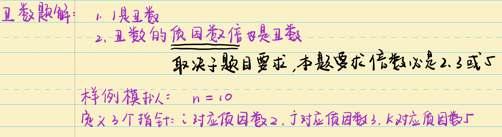

**解题步骤**

> 1. åˆå§‹ä¸‘æ ‘æ•°ç»„ç­‰äº `q = [1]`，定义三个指针，`i，j，k` 分别对应质因数 `2` 的集åˆï¼Œ`3` 的集åˆï¼Œ`5` 的集åˆï¼Œåˆå§‹å€¼ä¸º `i = j = k = 0`
>     + 第一步
>         + `t = min(q[i] * 2, q[j] * 3, q[k] * 5) = min(1 * 2, 1 * 3, 1 * 5) = min(2,  3, 5) = 2`
>         + `t` å–值为 `2`，对应的是 `i` 指针，因此，`i ++`
>         + 此时，`q = [1, 2], i = 1, j = k = 0`
>     + 第二步
>         + `t = min(q[i] * 2, q[j] * 3, q[k] * 5) = min(4, 3, 5) = 3`
>         + `t` å–值为 `3`，对应的是 `j` 指针，因此，`j ++`
>         + 此时，`q = [1, 2, 3], i = 1, j = 1, k = 0`
>     + 第三步
>         + `t = min(q[i] * 2, q[j] * 3, q[k] * 5) = min(4, 6, 5) = 4`
>         + `t` å–值为 `4`，对应的是 `i` 指针，因此，`i ++`
>         + 此时，`q = [1, 2, 3, 4], i = 2, j = 1, k = 0`
>     + 第四步
>         + `t = min(q[i] * 2, q[j] * 3, q[k] * 5) = min(6, 6, 5) = 5`
>         + `t` å–值为 `5`，对应的是 `k` 指针，因此，`k ++`
>         + 此时，`q = [1, 2, 3, 4, 5], i = 2, j = 1, k = 1`
>     + 第五步
>         + `t = min(q[i] * 2, q[j] * 3, q[k] * 5) = min(6, 6, 10) = 6`
>         + `t` å–值为 `6`，对应的是 `i` å’Œ `j` 指针，因此，`i ++, j ++`
>             + 注æ„：如æœæœ‰ç›¸ç­‰çš„，指针都需è¦è¿›è¡Œç§»åŠ¨ï¼Œè€Œä¸èƒ½åªç§»åŠ¨ä¸€ä¸ªæŒ‡é’ˆ
>         + 此时，`q = [1, 2, 3, 4, 5, 6], i = 3, j = 2, k = 1`
>     + ä¾æ¬¡ç±»æ¨

**代ç **

```c++
class Solution {
public:
    int nthUglyNumber(int n) {
        vector<int> q(1, 1);
        for (int i = 0, j = 0, k = 0; q.size() < n; ) {
            int t = min(q[i] * 2, min(q[j] * 3, q[k] * 5));
            q.push_back(t);
            // ä¸èƒ½ä½¿ç”¨ if else 因为会有相åŒå€¼
            if (q[i] * 2 == t) i ++;
            if (q[j] * 3 == t) j ++;
            if (q[k] * 5 == t) k ++;
        }
        return q.back();
    }
};
```

**标签**

`三路归并`ã€`归并æ’åº`

### [AcWing 313. 超级丑数](https://leetcode-cn.com/problems/super-ugly-number/)

**题目æè¿°**

> 超级丑数 是一个正整数，并满足其所有质因数都出ç°åœ¨è´¨æ•°æ•°ç»„ `primes` 中。
>
> 给你一个整数 `n` 和一个整数数组 `primes` ，返å›ç¬¬ `n` 个 超级丑数 。
>
> 题目数æ®ä¿è¯ç¬¬ `n` 个 超级丑数 在 `32-bit` 带符å·æ•´æ•°èŒƒå›´å†…。

**示例 1**

> 输入：`n = 12, primes = [2,7,13,19]`
> 输出：`32`
> 解释：给定长度为 `4` 的质数数组 `primes = [2,7,13,19]`ï¼Œå‰ `12` 个超级丑数åºåˆ—为：`[1,2,4,7,8,13,14,16,19,26,28,32]` 。

**示例 2**

> 输入：`n = 1, primes = [2,3,5]`
> 输出：`1`
> 解释：`1` ä¸å«è´¨å› æ•°ï¼Œå› æ­¤å®ƒçš„所有质因数都在质数数组 `primes = [2,3,5]` 中。

**æ示**

> + $1 <= n <= 10^6$
> + $1 <= primes.length <= 100$
> + $2 <= primes[i] <= 1000$
> + $é¢˜ç›®æ•°æ® ä¿è¯ primes[i] 是一个质数$
> + $primes 中的所有值都 互ä¸ç›¸åŒ ，且按 递å¢é¡ºåº æ’列$

**解题步骤**

> 1. åŒ `LeetCode 264 丑树 II`
>
> 2. 唯一ä¸åŒçš„是由 `3` 指针å˜æˆ `k` 指针
>
> 3. 具体å®ç°çš„细节
>
>     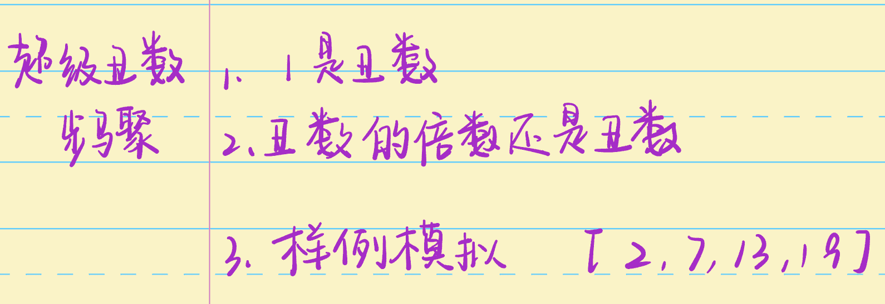
>
>     > 1. 三指针有一个寻找最å°å€¼çš„æ“作 `min(q[i] * 2, min(q[j] * 3, q[k] * 5))`，在本题中，将寻找 `k` 个指针的最å°å€¼æ“作，æ¢æˆå †ï¼ˆä¼˜å…ˆé˜Ÿåˆ—æ¥å®ç°ï¼‰
>     > 2. 优先队列中维护两个å˜é‡ï¼Œåˆ†åˆ«ä¸º `k` 个指针对应的值以åŠä¸‹æ ‡
>     > 3. 考虑一个问题，如何确定æŸä¸ªæ•° `x` 是由哪个质数迭代而æ¥çš„
>     >     + 对äºä¸‘æ ‘ $S_p$ æ¥è¯´ï¼Œå…¶ä¸‹ä¸€ä¸ªæ•°ä¸º $k = S_p * p$ ，因此，当å‰è´¨æ•° $p = k / S_p$
>     > 4. 如æœè¿˜æ˜¯æœ‰äº›è®¸æ¨¡ç³Šï¼Œæ‰‹åŠ¨æ¨¡æ‹Ÿæ ·ä¾‹å³å¯

**代ç **

```c++
class Solution {
public:
    typedef long long LL;
    typedef pair<LL, LL> PLL;
    int nthSuperUglyNumber(int n, vector<int>& primes) {
        // 定义å°æ ¹å †
        priority_queue<PLL, vector<PLL>, greater<PLL>> heap;
        // å«ä¹‰åœ¨å›¾ç¤ºæ‰‹å†™ç¨¿
        for (auto& x : primes) heap.push({x, 1});
        vector<int> q(n + 5);
        q[1] = 1;
        for (int i = 2; i <= n;) {
            auto tp = heap.top(); heap.pop();
            if (tp.first != q[i - 1]) q[i ++ ] = tp.first;
            int idx = tp.second, p = tp.first / q[idx];
            heap.push({(LL)p * q[idx + 1], idx + 1});
        }
        return q[n];
    }
};
```

**标签**

`优先队列`ã€`K路归并`

### [LeetCode 279. 完全平方数](https://leetcode-cn.com/problems/perfect-squares/)

**题目æè¿°**

> 给定正整数 n，找到若干个完全平方数（比如 1, 4, 9, 16, ...ï¼‰ä½¿å¾—å®ƒä»¬çš„å’Œç­‰äº n。你需è¦è®©ç»„æˆå’Œçš„完全平方数的个数最少。
>
> 给你一个整数 n ，返å›å’Œä¸º n 的完全平方数的 æœ€å°‘æ•°é‡ ã€‚
>
> 完全平方数 是一个整数，其值等äºå¦ä¸€ä¸ªæ•´æ•°çš„平方；æ¢å¥è¯è¯´ï¼Œå…¶å€¼ç­‰äºä¸€ä¸ªæ•´æ•°è‡ªä¹˜çš„积。例如，1ã€4ã€9 å’Œ 16 都是完全平方数，而 3 å’Œ 11 ä¸æ˜¯ã€‚

 **示例 1**

> 输入：`n = 12`
> 输出：`3` 
> 解释：`12 = 4 + 4 + 4`

**示例 2**

> 输入：`n = 13`
> 输出：`2`
> 解释：`13 = 4 + 9`

**æ示**

> $1 <= n <= 10^4$

**法一:动æ€è§„划**

**手写稿**


**代ç **

```c++
class Solution {
public:
    int numSquares(int n) {
        vector<int> f(n + 5, 1e9);
        f[0] = 0;
        for (int i = 1; i <= n; i ++ )
            for (int j = 1; j <= i / j; j ++ )
                f[i] = min(f[i], f[i - j * j] + 1);
        return f[n];
    }
};
```

**方法二:数学**

**步骤**

> 1. [四平方和定ç†](https://baike.baidu.com/item/%E5%9B%9B%E5%B9%B3%E6%96%B9%E5%92%8C%E5%AE%9A%E7%90%86):æ¯ä¸ªæ­£æ•´æ•°å‡å¯è¡¨ç¤ºä¸º4个整数的平方和,定义此题的上é™,答案åªèƒ½ä¸º `1, 2, 3, 4`
> 2. [勒让德三平方和定ç†](https://en.wikipedia.org/wiki/Legendre%27s_three-square_theorem):当 $n=4^a(8b+7)$时，`n` ä¸èƒ½å†™æˆ `3` 个数的平方和
> 3. æšä¸¾ç­”案是å¦ä¸º `2`

**代ç **

```c++
class Solution {
public:
    bool check(int n) {
        int r = sqrt(n);
        return r * r == n;
    }
    int numSquares(int n) {
        // 判断是å¦æ˜¯ä¸€ä¸ªæ•°å­—
        if (check(n)) return 1;
        // 判断是å¦æ˜¯ä¸¤ä¸ªæ•°å­—
        for (int i = 1; i <= n / i; i ++ )
            if (check(n - i * i)) return 2;
        // 判断是å¦æ˜¯å››ä¸ªæ•°å­—
        while (n % 4 == 0) n /= 4;
        if (n % 8 == 7) return 4;
        return 3;
    }
};
```

**标签**

`动æ€è§„划`ã€`æ•°å­¦`

### [LeetCode 233. 数字 1 的个数](https://leetcode-cn.com/problems/number-of-digit-one/)

**题目æè¿°**

> 给定一个整数 `n`，计算所有å°äºç­‰äº `n` çš„é负整数中数字 `1` 出ç°çš„个数。

**示例 1**

> 输入：`n = 13`
> 输出：`6`

**示例 2**

> 输入：`n = 0`
> 输出：`0`

**æ示**

> + $0 <= n <= 10^9$

**题解**

> 1. 将数字分解æˆæ¯ä¸ªæ•°å­—，存放到 vector 里é¢ï¼Œæ³¨æ„顺åºé—®é¢˜
> 2. ä»å‰å¾€åä¾æ¬¡éå†æ¯ä¸ªæ•°å­—，判断当å‰ä½ç½®ä¸Š 1 的个数累加å³å¯

**手写稿**

.png)

**代ç **

```c++
class Solution {
public:
    int countDigitOne(int n) {
        vector<int> num;
        while (n) {
            num.push_back(n % 10);
            n /= 10;
        }
        // 注æ„顺åºé—®é¢˜
        reverse(num.begin(), num.end());
        int res = 0;
        for (int i = 0; i < num.size(); i ++ ) {
            int left = 0, right = 0, p = 1;
            for (int j = 0; j < i; j ++ ) left = left * 10 + num[j];
            for (int j = i + 1; j < num.size(); j ++ )
                right = right * 10 + num[j], p *= 10;
            if (num[i] == 0) res += left * p;
            else if (num[i] == 1) res += left * p + right + 1;
            else res += (left + 1) * p;
        }
        return res;
    }
};
```

**标签**

`æ•°å­¦`

### [LeetCode 231. 2 的幂](https://leetcode-cn.com/problems/power-of-two/)

**题目æè¿°**

> 给你一个整数 `n`，请你判断该整数是å¦æ˜¯ `2` 的幂次方。如æœæ˜¯ï¼Œè¿”å› `true` ï¼›å¦åˆ™ï¼Œè¿”å› `false` 。
>
> 如æœå­˜åœ¨ä¸€ä¸ªæ•´æ•° `x`  使得 `n == 2x` ，则认为 `n` 是 `2` 的幂次方。

**示例 1**

> 输入：`n = 1`
> 输出：`true`
> 解释：$2^0 = 1$

**示例 2**

> 输入：`n = 16`
> 输出：`true`
> 解释：$2^4 = 16$

**示例 3**

> 输入：`n = 3`
> 输出：`false`

**示例 4**

> 输入：`n = 4`
> 输出：`true`

**示例 5**

> 输入：`n = 5`
> 输出：`false`

**æ示**

> + $-2^{31} <= n <= 2^{31} - 1$

**进阶**

> 你能够ä¸ä½¿ç”¨å¾ªç¯/递归解决此问题å—？

**方法一：对数**

**代ç **

```c++
class Solution {
public:
    bool isPowerOfTwo(int n) {
        if (n <= 0) return false;
        return (log2(n) - int(log2(n))) == 0;
    }
};
```

**方法二：ä½è¿ç®—**

**解æ**

> 1. 一个数字 `x` 如æœæ˜¯ `2` çš„å¹‚ï¼Œåˆ™è¯´æ˜ `x` 的二进制表示为 `000001000000`
> 2. `lowbit` 计算最åä¸€ä½ `1` 的大å°ï¼Œåˆ¤æ–­æ˜¯å¦å’Œ `x` 相等å³å¯

**代ç **

```c++
class Solution {
public:
    bool isPowerOfTwo(int n) {
        if (n <= 0) return false;
        return (n & -n) == n;
    }
};
```

**方法三：å–巧的ä½è¿ç®—**

**解æ**

> 1. ç”±<a href="https://baike.baidu.com/item/%E7%AE%97%E6%9C%AF%E5%9F%BA%E6%9C%AC%E5%AE%9A%E7%90%86/10920095">算术基本定ç†</a>å¯çŸ¥ï¼Œä»»æ„自然数都å¯ä»¥å”¯ä¸€åˆ†è§£ä¸ºè‹¥å¹²ä¸ªè´¨æ•°çš„乘积，数 `x` 若是 `2` 的幂，则 `x` 的质因数åªæœ‰ `2`，除此之外，ä¸å­˜åœ¨å…¶ä»–的质因数
>     + åè¯æ³•
>         + å¦‚æœ `x` 的质因数除了 `2` 之外，还有质因数 `p`，则 `p` 一定ä¸èƒ½è¢«åˆ†è§£ï¼Œå› ä¸º `p` 也是质数
> 2. 找出最大的åªå«æœ‰ `2` 的质因å­çš„æ•° `x`，ä¸éš¾å‘ç°ï¼Œæ‰€æœ‰æ»¡è¶³è´¨å› å­åªæœ‰ `2` çš„æ•°å‡æ˜¯ `x` çš„å› å­

**代ç **

```c++
class Solution {
public:
    bool isPowerOfTwo(int n) {
        if (n <= 0) return false;
        return (1 << 30) % n == 0;
    }
};
```

**标签**

`对数`ã€`ä½è¿ç®—`

### [LeetCode 326. 3 的幂](https://leetcode-cn.com/problems/power-of-three/)

**题目æè¿°**

> 给定一个整数，写一个函数æ¥åˆ¤æ–­å®ƒæ˜¯å¦æ˜¯ `3` 的幂次方。如æœæ˜¯ï¼Œè¿”å› `true` ï¼›å¦åˆ™ï¼Œè¿”å› `false` 。
>
> 整数 `n` 是 `3` 的幂次方需满足：存在整数 `x` 使得 `n == 3x`

**示例 1**

> 输入：`n = 27`
> 输出：`true`

**示例 2**

> 输入：`n = 0`
> 输出：`false`

**示例 3**

> 输入：`n = 9`
> 输出：`true`

**示例 4**

> 输入：`n = 45`
> 输出：`false`

**æ示**

> + $-2^{31} <= n <= 2^{31} - 1$

**方法一：对数函数**

**å…¬å¼æ¨å¯¼**

> ç”±äº c++ 没有以任æ„自然数为底的对数函数，因此，需è¦ä½¿ç”¨æ¢åº•å…¬å¼è¿›è¡Œæ¨å¯¼è®¡ç®—，è¯æ˜å¦‚下：
> $$
> æ¢åº•å…¬å¼ï¼šlog_ab = \frac{log_cb}{log_ca}，其中c为任æ„自然数 \\
> 当c=10时，有log_ab = \frac{loga}{logb}
> $$

**代ç **

```c++
class Solution {
public:
    bool isPowerOfThree(int n) {
        // ä¸èƒ½æ˜¯è´Ÿæ•°
        if (n <= 0) return false;
        double x = log10(n) / log10(3);
        return x == int(x);
    }
};
```

**方法二：打表**

**步骤**

> 1. 对äºä»»æ„一个数 `x` æ¥è¯´ï¼Œ$3^x$ å¯èƒ½çš„å–值为 $3^0, 3^1, 3^2, 3^3,..., 3^n,..., 3^{+\infty}$
> 2. å–最大值 $3^n = 3 * 3 ^ {n - 1}$ ，å¯ä»¥çœ‹å‡ºæ‰€æœ‰æ¯”最大值å°çš„æ•°åŒæ—¶åˆæ˜¯ `3` 的幂的数都是最大值的因å­ï¼Œå› æ­¤ï¼Œå¯ä»¥æ‰¾å‡ºæœ€å¤§å€¼ï¼Œç„¶å判断是å¦æ˜¯æœ€å¤§å€¼çš„å› å­å³å¯
> 3. <font style="color: red">**注æ„：x必须得是质数，åŸå› ï¼š<a href="https://baike.baidu.com/item/%E7%AE%97%E6%9C%AF%E5%9F%BA%E6%9C%AC%E5%AE%9A%E7%90%86/10920095">算术基本定ç†</a>**</font>，详细解释如下
>     + 由算术基本定ç†å¯çŸ¥ï¼Œä»»æ„<font style="color: red">**自然数**</font>都å¯ä»¥<font style="color: red">**唯一**</font>分解为若干个<font style="color: red">**质数**</font>相乘
>     + åè¯æ³•
>         + 如æœæ•° `x` 分解之å的质数除了 `3` 之外，还有别的质数 `p`，则 `x` 一定ä¸æ˜¯ `3` 的幂，因为 `p` 也是质数，且ä¸èƒ½å†æ¬¡åˆ†è§£
>         + 因此，如æœæ•° `x` 是 `3` 的幂，则其质因å­æœ‰ä¸”åªæœ‰ `3` æ‰å¯
> 4. 找出最大的满足质因å­åªæœ‰ `3` çš„æ•° `x`，ä¸éš¾å‘ç°ï¼Œæ‰€æœ‰æ»¡è¶³è´¨å› å­åªæœ‰ `3` çš„æ•°å‡æ˜¯ `x` çš„å› å­

**代ç **

```c++
class Solution {
public:
    bool isPowerOfThree(int n) {
        if (n <= 0) return false;
        return 1162261467 % n == 0;
    }
};
```

**标签**

`对数`ã€`算术基本定ç†`ã€`数论`

### [LeetCode 342. 4的幂](https://leetcode-cn.com/problems/power-of-four/)

**题目æè¿°**

> 给定一个整数，写一个函数æ¥åˆ¤æ–­å®ƒæ˜¯å¦æ˜¯ `4` 的幂次方。如æœæ˜¯ï¼Œè¿”å› `true` ï¼›å¦åˆ™ï¼Œè¿”å› `false` 。
>
> 整数 `n` 是 `4` 的幂次方需满足：存在整数 `x` 使得 `n == 4x`

**示例 1**

> 输入：`n = 16`
> 输出：`true`

**示例 2**

> 输入：`n = 5`
> 输出：`false`

**示例 3**

> 输入：`n = 1`
> 输出：`true`

**æ示**

> + $-2^{31} <= n <= 2{31} - 1$

**进阶**

> 你能ä¸ä½¿ç”¨å¾ªç¯æˆ–者递归æ¥å®Œæˆæœ¬é¢˜å—？

**方法一：对数**

**代ç **

```c++
class Solution {
public:
    bool isPowerOfFour(int n) {
        if (n <= 0) return false;
        double x = log10(n) / log10(4);
        return x == int(x);
    }
};
```

**方法二：ä½è¿ç®—**

**解æ**

> 1. 如æœæ•° `x` 是 `4` 的幂，则 `x` 也一定是 `2` 的幂，å³æœ‰ $4 ^ x = (2 ^ 2)^x = (2 ^ x) ^ 2$
>     + 先对 `x` 进行开方得到 `r`，判断 $r^2$ 是å¦ç­‰äº `x`
>         + ä¸ç­‰äºï¼Œè¿”å›âŒ
>         + ç­‰äºï¼Œåˆ¤æ–­ `r` 是å¦æ˜¯ `2` 的幂å³å¯

**代ç **

```c++
class Solution {
public:
    bool isPowerOfFour(int n) {
        if (n <= 0) return false;
        int r = sqrt(n);
        if (r * r != n) return false;
        return (1 << 30) % n == 0;
    }
};
```

**标签**

`对数`ã€`ä½è¿ç®—`

### [LeetCode 343. 整数拆分](https://leetcode-cn.com/problems/integer-break/)

**题目æè¿°**

>   给定一个正整数 `n` ，将其拆分为 `k` 个 正整数 的和（ `k >= 2` ），并使这些整数的乘积最大化。
>
>   è¿”å› ä½ å¯ä»¥è·å¾—的最大乘积 。

**示例 1**

>   输入: `n = 2`
>   输出: `1`
>   解释: `2 = 1 + 1, 1 × 1 = 1`。

**示例 2**

>   输入: `n = 10`
>   输出: `36`
>   解释: `10 = 3 + 3 + 4, 3 × 3 × 4 = 36`。

**æ示**

>   +   $2 <= n <= 58$

**手写稿**


**代ç **

```c++
class Solution {
public:
    int integerBreak(int n) {
        if (n <= 3) return 1 * (n - 1);
        int res = 1;
        while (n >= 5) n -= 3, res *= 3;
        return res * n;
    }
};
```

**标签**

`æ•°å­¦`

### [LeetCode 357. 计算å„个ä½æ•°ä¸åŒçš„数字个数](https://leetcode-cn.com/problems/count-numbers-with-unique-digits/)

**题目æè¿°**

>   给定一个éè´Ÿæ•´æ•° `n`，计算å„ä½æ•°å­—都ä¸åŒçš„æ•°å­— `x` 的个数，其中 $0 ≤ x < 10^n$ 。

**示例**

>   输入: `2`
>   输出: `91`
>   解释: ç­”æ¡ˆåº”ä¸ºé™¤å» `11,22,33,44,55,66,77,88,99` 外，在 `[0,100)` 区间内的所有数字。

**手写稿**

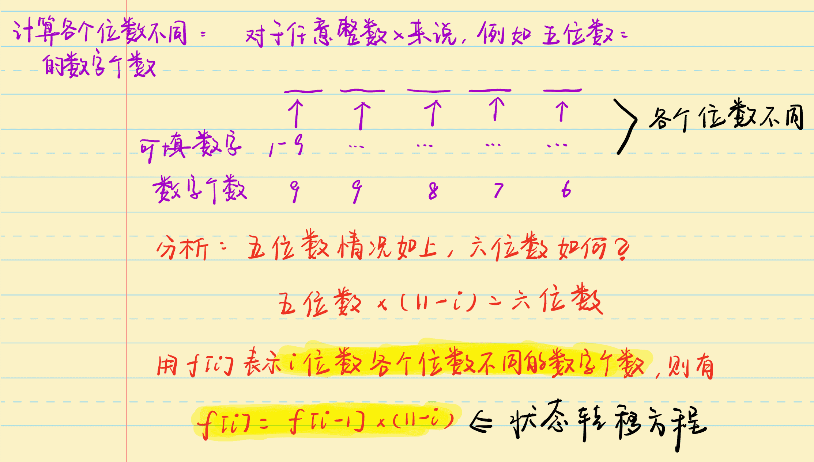

**代ç **

```c++
class Solution {
public:
    int countNumbersWithUniqueDigits(int n) {
        // 0 ï½ 9 å…±10个数字，n > 10 æ— æ„义
        n = min(n, 10);
        vector<int> f(n + 1);
        // 0 特判
        if (n == 0) return 1;
        f[1] = 9;
        for (int i = 2; i <= n; i ++ ) f[i] = f[i - 1] * (11 - i);
        int res = 0;
        for (int i = 1; i <= n; i ++ ) res += f[i];
        // 加上 0 这个数字
        return res + 1;
    }
};
```

**标签**

`æ’列组åˆ`ã€`æ•°å­¦`ã€`动æ€è§„划`

## 数论相关

### [AcWing 319. ç¯æ³¡å¼€å…³](https://leetcode-cn.com/problems/bulb-switcher/)

**题目æè¿°**

> åˆå§‹æ—¶æœ‰ `n` 个ç¯æ³¡å¤„äºå…³é—­çŠ¶æ€ã€‚第一轮，你将会打开所有ç¯æ³¡ã€‚æ¥ä¸‹æ¥çš„第二轮，你将会æ¯ä¸¤ä¸ªç¯æ³¡å…³é—­ç¬¬äºŒä¸ªã€‚
>
> 第三轮，你æ¯ä¸‰ä¸ªç¯æ³¡å°±åˆ‡æ¢ç¬¬ä¸‰ä¸ªç¯æ³¡çš„开关（å³ï¼Œæ‰“å¼€å˜å…³é—­ï¼Œå…³é—­å˜æ‰“开）。第 `i` è½®ï¼Œä½ æ¯ `i` 个ç¯æ³¡å°±åˆ‡æ¢ç¬¬ `i` 个ç¯æ³¡çš„开关。直到第 `n` 轮，你åªéœ€è¦åˆ‡æ¢æœ€å一个ç¯æ³¡çš„开关。
>
> æ‰¾å‡ºå¹¶è¿”å› `n` è½®å有多少个亮ç€çš„ç¯æ³¡ã€‚ 

**示例 1**


> 输入：`n = 3`
> 输出：`1 `
> 解释：
> åˆå§‹æ—¶, ç¯æ³¡çŠ¶æ€ [关闭, 关闭, 关闭].
> 第一轮å, ç¯æ³¡çŠ¶æ€ [å¼€å¯, å¼€å¯, å¼€å¯].
> 第二轮å, ç¯æ³¡çŠ¶æ€ [å¼€å¯, 关闭, å¼€å¯].
> 第三轮å, ç¯æ³¡çŠ¶æ€ [å¼€å¯, 关闭, 关闭]. 
>
> ä½ åº”è¯¥è¿”å› `1`，因为åªæœ‰ä¸€ä¸ªç¯æ³¡è¿˜äº®ç€ã€‚

**示例 2**

> 输入：`n = 0`
> 输出：`0`

**示例 3**

> 输入：`n = 1`
> 输出：`1`

**æ示**

> + $0 <= n <= 10^9$

**手写稿**


**代ç **

```c++
class Solution {
public:
    int bulbSwitch(int n) {
        // 寻找1ï½n中完全平方数的个数
        return sqrt(n);
    }
};
```

**标签**

`完全平方数`ã€`脑筋急转弯`ã€`数论`

### [LeetCode 365. 水壶问题](https://leetcode-cn.com/problems/water-and-jug-problem/)

>   有两个水壶，容é‡åˆ†åˆ«ä¸º `jug1Capacity` å’Œ `jug2Capacity` å‡ã€‚水的供应是无é™çš„。确定是å¦æœ‰å¯èƒ½ä½¿ç”¨è¿™ä¸¤ä¸ªå£¶å‡†ç¡®å¾—到 `targetCapacity` å‡ã€‚
>
>   如æœå¯ä»¥å¾—到 `targetCapacity` å‡æ°´ï¼Œæœ€å请用以上水壶中的一或两个æ¥ç››æ”¾å–å¾—çš„ `targetCapacity` å‡æ°´ã€‚
>
>   ä½ å¯ä»¥ï¼š
>
>   装满任æ„一个水壶
>   清空任æ„一个水壶
>   ä»ä¸€ä¸ªæ°´å£¶å‘å¦å¤–一个水壶倒水，直到装满或者倒空

**示例 1**

>   输入: `jug1Capacity = 3, jug2Capacity = 5, targetCapacity = 4`
>   输出: `true`
>   解释：æ¥è‡ªè‘—åçš„ ["Die Hard"](https://www.youtube.com/watch?v=BVtQNK_ZUJg)

**示例 2**

>   输入: `jug1Capacity = 2, jug2Capacity = 6, targetCapacity = 5`
>   输出: `false`

**示例 3**

>   输入: `jug1Capacity = 1, jug2Capacity = 2, targetCapacity = 3`
>   输出: `true`

**æ示**

>   +   $1 <= jug1Capacity, jug2Capacity, targetCapacity <= 10^6$

**手写稿**


**代ç **

```c++
class Solution {
public:
    int gcd(int a, int b) {
        if (!b) return a;
        return gcd(b, a % b);
    }
    bool canMeasureWater(int a, int b, int c) {
        if (a + b < c) return false;
        return c % gcd(a, b) == 0; 
    }
};
```

**标签**

`è´ç¥–定ç†`ã€`数论`ã€`欧几里得算法`

### [AcWing 4199. 公约数](https://www.acwing.com/problem/content/4202/)

**题目æè¿°**

>   给定两个正整数 `a` 和 `b`。
>
>   你需è¦å›ç­” `q` 个询问。
>
>   æ¯ä¸ªè¯¢é—®ç»™å®šä¸¤ä¸ªæ•´æ•° `l,r`，你需è¦æ‰¾åˆ°**最大**çš„æ•´æ•° `x`，满足：
>
>   1.  `x` 是 `a` 和 `b` 的公约数。
>   2.  `l ≤ x ≤ r`。

**输入格å¼**

>   第一行包å«ä¸¤ä¸ªæ•´æ•° `a,b`。
>
>   第二行包å«ä¸€ä¸ªæ•´æ•° `q`。
>
>   æ¥ä¸‹æ¥ `q` 行，æ¯è¡ŒåŒ…å«ä¸¤ä¸ªæ•´æ•° `l,r`。

**输出格å¼**

>   æ¯ä¸ªè¯¢é—®è¾“出一行答案，å³æ»¡è¶³æ¡ä»¶çš„最大的 `x`，如æœè¯¢é—®æ— è§£ï¼Œåˆ™è¾“出 `−1`。

**æ•°æ®èŒƒå›´**

>   +   $å‰å…­ä¸ªæµ‹è¯•ç‚¹æ»¡è¶³ 1 ≤ a, b ≤ 100，1 ≤ q ≤ 20。$
>   +   $所有测试点满足 1 ≤ a, b ≤ 10^9，1 ≤ q ≤ 10^4，1 ≤ l ≤ r ≤ 10^9。$

**输入样例**

```c++
9 27
3
1 5
10 11
9 11
```

**输出样例**

```c++
3
-1
9
```

**手写稿**


**代ç **

```c++
#include <iostream>
#include <algorithm>
using namespace std;
const int N = 10010;
int n, m, q, idx;
int p[N];
// 最大公约数模æ¿
int gcd(int a, int b) {
    if (!b) return a;
    return gcd(b, a % b);
}
void get_primes(int d) {
    for (int i = 1; i <= d / i; i ++ )
        if (d % i == 0) {
            p[idx ++ ] = i;
            // 防止出ç°é‡å¤å…ƒç´ 
            if (i != d / i) p[idx ++ ] = d / i;
        }
    return;
}
bool check(int mid, int l, int r) {
    // 手写稿具体解释
    if (p[mid] <= l) return true;
    else if (p[mid] <= r) return true;
    return false;
}
int main() {
    scanf("%d%d%d", &n, &m, &q);
    int d = gcd(n, m);
    get_primes(d);
    // 二分的å‰æ：数组有åºï¼Œæ•…应该先æ’åº
    sort(p, p + idx);
    while (q -- ) {
        int L, R;
        scanf("%d%d", &L, &R);
        int l = 0, r = idx - 1;
        while (l < r) {
            int mid = l + r + 1 >> 1;
            // check函数手写稿具体解释
            if (check(mid, L, R)) l = mid;
            else r = mid - 1;
        }
        // 二分一定是有答案的
        // 判断如æœç­”案ä½äºLå’ŒR之间，说æ˜ç­”案åˆæ³•ï¼Œå¦åˆ™ï¼Œä¸åˆæ³•
        if (p[l] >= L && p[l] <= R) cout << p[l] << endl;
        else cout << -1 << endl;
    }
    return 0;
}
```

**时间å¤æ‚度**

$O(qlog_n)$

**空间å¤æ‚度**

$O(n)，n指的是约数的个数$

**标签**

`欧几里得算法`ã€`试除法求约数个数`

**ç¼åˆæ€ª**


## 高斯消元

### [AcWing 883. 高斯消元解线性方程组](https://www.acwing.com/problem/content/885/)

**题目æè¿°**

>   è¾“å…¥ä¸€ä¸ªåŒ…å« `n` 个方程 `n` 个未知数的线性方程组。
>
>   方程组中的系数为å®æ•°ã€‚
>
>   求解这个方程组。
>
>   ä¸‹å›¾ä¸ºä¸€ä¸ªåŒ…å« `m` 个方程 `n` 个未知数的线性方程组示例：
>
>   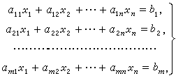

**输入格å¼**

>   第一行包å«æ•´æ•° `n`。
>
>   æ¥ä¸‹æ¥ `n` 行，æ¯è¡ŒåŒ…å« `n + 1` 个å®æ•°ï¼Œè¡¨ç¤ºä¸€ä¸ªæ–¹ç¨‹çš„ `n` 个系数以åŠç­‰å·å³ä¾§çš„常数。

**输出格å¼**

>   如æœç»™å®šçº¿æ€§æ–¹ç¨‹ç»„存在唯一解，则输出共 `n` 行，其中第 `i` 行输出第 `i` 个未知数的解，结æœä¿ç•™ä¸¤ä½å°æ•°ã€‚
>
>   如æœç»™å®šçº¿æ€§æ–¹ç¨‹ç»„存在无数解，则输出 `Infinite group solutions`。
>
>   如æœç»™å®šçº¿æ€§æ–¹ç¨‹ç»„无解，则输出 `No solution`。

**æ•°æ®èŒƒå›´**

>   +   $1≤n≤100,$
>   +   $所有输入系数以åŠå¸¸æ•°å‡ä¿ç•™ä¸¤ä½å°æ•°ï¼Œç»å¯¹å€¼å‡ä¸è¶…过 100。$

**输入样例**

```c++
3
1.00 2.00 -1.00 -6.00
2.00 1.00 -3.00 -9.00
-1.00 -1.00 2.00 7.00
```

**输出样例**

```c++
1.00
-2.00
3.00
```

**手写稿**


**代ç **

```c++
#include <iostream>
#include <cmath>
using namespace std;
const int N = 110;
const double eps = 1e-6;
int n;
double a[N][N];
int guass() {
    // 化æˆä¸Šä¸‰è§’矩阵
    int r, c;
    // æšä¸¾æ¯ä¸€åˆ—
    for (r = 1, c = 1; c <= n; c ++ ) {
        // 1. 找主元
        int t = r;
        for (int i = r; i <= n; i ++ )
            if (fabs(a[i][c]) > fabs(a[t][c])) t = i;
        // 如æœå½“å‰åˆ—的最大值已ç»æ˜¯0，则ä¸éœ€è¦å†è¿›è¡Œ2，3，4步骤
        if (fabs(a[t][c]) < eps) continue;
        // 2. 交æ¢ä¸¤è¡Œ
        if (t != r) // 如æœå½“å‰åˆ—的最大值所在的行ä¸æ˜¯æœ¬è¡Œï¼Œåˆ™äº¤æ¢ä¸¤è¡Œ
            for (int i = c; i <= n + 1; i ++ ) swap(a[r][i], a[t][i]);
        // 3. 归一化
        // 倒åºæšä¸¾
        for (int i = n + 1; i >= c; i -- ) a[r][i] /= a[r][c];
        // 4. 将当å‰åˆ—的其他值消æˆ0
        for (int i = r + 1; i <= n; i ++ )
            for (int j = n + 1; j >= c; j -- ) {
                // 如æœå·²ç»æ˜¯0，则ä¸éœ€è¦å†è¿›è¡Œ
                if (fabs(a[i][c]) < eps) continue;
                a[i][j] -= a[r][j] * a[i][c];
            }
        r ++;
    }
    if (r <= n)
        for (int i = r; i <= n; i ++ ) {
            if (fabs(a[i][n + 1])) return -1;
        return 0;
    }
    // 化æˆå¯¹è§’矩阵
    for (int i = n - 1; i >= 1; i -- )
        for (int j = i + 1; j <= n; j ++ )
            a[i][n + 1] -= a[i][j] * a[j][n + 1];
    return 1;
}
int main() {
    scanf("%d", &n);
    for (int i = 1; i <= n; i ++ )
        for (int j = 1; j <= n + 1; j ++ )
            scanf("%lf", &a[i][j]);
    int t = guass();
    if (t == -1) printf("No solution");
    else if (t == 0) printf("Infinite group solutions");
    else
        for (int i = 1; i <= n; i ++ ) {
            if (fabs(a[i][n + 1]) < eps) cout << "0.00" << endl;
            else printf("%.2lf\n", a[i][n + 1]);
        }
    return 0;
}
```

**时间å¤æ‚度**

$O(n^3)$

**空间å¤æ‚度**

$O(n^2)$

**标签**

`高斯消元`

**ç¼åˆæ€ª**

### [AcWing 884. 高斯消元解异或线性方程组](https://www.acwing.com/problem/content/886/)

**题目æè¿°**

>   è¾“å…¥ä¸€ä¸ªåŒ…å« `n` 个方程 `n` 个未知数的异或线性方程组。
>
>   方程组中的系数和常数为 `0` 或 `1`，æ¯ä¸ªæœªçŸ¥æ•°çš„å–值也为 `0` 或 `1`。
>
>   求解这个方程组。
>
>   异或线性方程组示例如下：
>
>   ```c++
>   M[1][1]x[1] ^ M[1][2]x[2] ^ … ^ M[1][n]x[n] = B[1]
>   M[2][1]x[1] ^ M[2][2]x[2] ^ … ^ M[2][n]x[n] = B[2]
>   …
>   M[n][1]x[1] ^ M[n][2]x[2] ^ … ^ M[n][n]x[n] = B[n]
>   ```
>
>   其中 `^` 表示异或`(XOR)`，`M[i][j]` 表示第 `i` 个å¼å­ä¸­ `x[j]` 的系数，`B[i]` 是第 `i` 个方程å³ç«¯çš„常数，å–值å‡ä¸º `0` 或 `1`。

**输入格å¼**

>   第一行包å«æ•´æ•° `n`。
>
>   æ¥ä¸‹æ¥ `n` 行，æ¯è¡ŒåŒ…å« `n + 1` 个整数 `0` 或 `1`，表示一个方程的 `n` 个系数以åŠç­‰å·å³ä¾§çš„常数。

**输出格å¼**

>   如æœç»™å®šçº¿æ€§æ–¹ç¨‹ç»„存在唯一解，则输出共 `n` 行，其中第 `i` 行输出第 `i` 个未知数的解。
>
>   如æœç»™å®šçº¿æ€§æ–¹ç¨‹ç»„存在多组解，则输出 `Multiple sets of solutions`。
>
>   如æœç»™å®šçº¿æ€§æ–¹ç¨‹ç»„无解，则输出 `No solution`。

**æ•°æ®èŒƒå›´**

>   +   $1≤n≤100$

**输入样例**

```c++
3
1 1 0 1
0 1 1 0
1 0 0 1
```

**输出样例**

```c++
1
0
0
```

**手写稿**

>   1.   åŒ `AcWing 883. 高斯消元解线性方程组`

**代ç **

```c++
#include <iostream>
using namespace std;
const int N = 110;
int n;
int a[N][N];
int guass() {
    int r, c;
    // 转化æˆä¸Šä¸‰è§’矩阵
    for (r = 1, c = 1; c <= n; c ++ ) {
        // 找到当å‰åˆ—ç»å¯¹å€¼æœ€å¤§çš„è¡Œ
        int t = r;
        for (int i = r; i <= n; i ++ )
            if (a[i][c]) {
                t = i;
                break;
            }
        // 如æœå½“å‰æœ€å¤§å€¼æ˜¯0，则此行ä¸éœ€è¦å†è¿›è¡Œé¢å¤–的处ç†
        if (!a[t][c]) continue;
        // 如æœå½“å‰è¡Œä¸æ˜¯æœ€å¤§å€¼æ‰€åœ¨çš„行，则交æ¢ä¸¤è¡Œ
        if (t != r) 
            for (int i = c; i <= n + 1; i ++ ) swap(a[t][i], a[r][i]);
        // 使用当å‰è¡Œå»æ¶ˆå…¶å®ƒè¡Œ
        for (int i = r + 1; i <= n; i ++ )
            for (int j = n + 1; j >= c; j -- ) {
                if (a[i][c] == 0) break;
                a[i][j] ^= a[r][j] & a[i][c];
            }
        r ++;
    }
    if (r <= n) {
        for (int i = r; i <= n; i ++ )
            if (a[i][n + 1]) return -1;
        return 0;
    }
    for (int i = n - 1; i >= 1; i -- )
        for (int j = i + 1; j <= n; j ++ ) 
            a[i][n + 1] ^= a[i][j] & a[j][n + 1];
    return 1;
}
int main() {
    scanf("%d", &n);
    for (int i = 1; i <= n; i ++ )
        for (int j = 1; j <= n + 1; j ++ )
            scanf("%d", &a[i][j]);
    int t = guass();
    if (t == -1) puts("No solution");
    else if (t == 0) puts("Multiple sets of solutions");
    else 
        for (int i = 1; i <= n; i ++ ) cout << a[i][n + 1] << endl;
    return 0;
}
```

**时间å¤æ‚度**

$O(n^3)$

**空间å¤æ‚度**

$O(n^2)$

**标签**

`高斯消元`

**ç¼åˆæ€ª**

### [AcWing 207. çƒå½¢ç©ºé—´äº§ç”Ÿå™¨](https://www.acwing.com/problem/content/209/)

**问题æè¿°**

>   有一个çƒå½¢ç©ºé—´äº§ç”Ÿå™¨èƒ½å¤Ÿåœ¨ `n` 维空间中产生一个åšç¡¬çš„çƒä½“。
>
>   ç°åœ¨ï¼Œä½ è¢«å›°åœ¨äº†è¿™ä¸ª `n` ç»´çƒä½“中，你åªçŸ¥é“çƒé¢ä¸Š `n + 1` 个点的å标，你需è¦ä»¥æœ€å¿«çš„速度确定这个 `n` ç»´çƒä½“çš„çƒå¿ƒå标，以便äºæ‘§æ¯è¿™ä¸ªçƒå½¢ç©ºé—´äº§ç”Ÿå™¨ã€‚
>
>   **注æ„：** æ•°æ®ä¿è¯æœ‰å”¯ä¸€è§£ã€‚

**输入格å¼**

>   第一行是一个整数 `n`。
>
>   æ¥ä¸‹æ¥çš„ `n + 1` 行，æ¯è¡Œæœ‰ `n` 个å®æ•°ï¼Œè¡¨ç¤ºçƒé¢ä¸Šä¸€ç‚¹çš„ `n` ç»´å标。
>
>   æ¯ä¸€ä¸ªå®æ•°ç²¾ç¡®åˆ°å°æ•°ç‚¹å `6` ä½ï¼Œä¸”å…¶ç»å¯¹å€¼éƒ½ä¸è¶…过 `20000`。

**输出格å¼**

>   有且åªæœ‰ä¸€è¡Œï¼Œä¾æ¬¡ç»™å‡ºçƒå¿ƒçš„ `n` ç»´å标（`n` 个å®æ•°ï¼‰ï¼Œä¸¤ä¸ªå®æ•°ä¹‹é—´ç”¨ä¸€ä¸ªç©ºæ ¼éš”开。
>
>   æ¯ä¸ªå®æ•°ç²¾ç¡®åˆ°å°æ•°ç‚¹å `3` ä½ã€‚

**æ•°æ®èŒƒå›´**

>   +   $1≤n≤10$

**输入样例**

```c++
2
0.0 0.0
-1.0 1.0
1.0 0.0
```

**输出样例**

```c++
0.500 1.500
```

**手写稿**


**代ç **

```c++
#include <iostream>
#include <cmath>
using namespace std;
const int N = 15;
const double eps = 1e-6;
int n;
double a[N][N], b[N][N];
// 高斯消元模æ¿
void guass() {
    int r, c;
    for (r = 1, c = 1; c <= n; c ++ ) {
        int t = r;
        for (int i = r; i <= n; i ++ )
            if (fabs(b[i][c]) > fabs(b[t][c])) t = i;
        if (fabs(b[t][c]) < eps) continue;
        if (t != r)
            for (int i = c; i <= n + 1; i ++ ) swap(b[t][i], b[r][i]);
        for (int i = n + 1; i >= c; i -- )
            b[r][i] /= b[r][c];
        for (int i = r + 1; i <= n; i ++ )
            for (int j = n + 1; j >= c; j -- ) {
                if (fabs(b[i][c]) < eps) break;
                b[i][j] -= b[r][j] * b[i][c];
            }
        r ++;
    }
    for (int i = n - 1; i >= 1; i -- )
        for (int j = i + 1; j <= n; j ++ )
            b[i][n + 1] -= b[i][j] * b[j][n + 1];
    return;
}
int main() {
    scanf("%d", &n);
    for (int i = 1; i <= n + 1; i ++ )
        for (int j = 1; j <= n; j ++ )
            scanf("%lf", &a[i][j]);
    // æ„造b数组
    for (int i = 2; i <= n + 1; i ++ )
        for (int j = 1; j <= n; j ++ ) {
            b[i - 1][j] = 2 * (a[1][j] - a[i][j]);
            b[i - 1][n + 1] += (a[1][j] * a[1][j]) - a[i][j] * a[i][j];
        }
    guass();
    for (int i = 1; i <= n; i ++ )
        printf("%.3lf ", b[i][n + 1]);
    return 0;

```

**时间å¤æ‚度**

$O(n^3)$

**空间å¤æ‚度**

$O(n^2)$

**标签**

`解方程`ã€`高斯消元`

**ç¼åˆæ€ª**

[AcWing 883. 高斯消元解线性方程组](#AcWing 883. 高斯消元解线性方程组)

## 约瑟夫ç¯

### åŸç†ä»‹ç»


### [PTA 7-28 猴å­é€‰å¤§ç‹](https://pintia.cn/problem-sets/14/problems/808)

**题目æè¿°**

>   一群猴å­è¦é€‰æ–°çŒ´ç‹ã€‚新猴ç‹çš„选择方法是：让 `N `åªå€™é€‰çŒ´å­å›´æˆä¸€åœˆï¼Œä»æŸä½ç½®èµ·é¡ºåºç¼–å·ä¸º `1~N` å·ã€‚ä»ç¬¬ `1` å·å¼€å§‹æŠ¥æ•°ï¼Œæ¯è½®ä» `1` 报到 `3`，凡报到 `3` 的猴å­å³é€€å‡ºåœˆå­ï¼Œæ¥ç€åˆä»ç´§é‚»çš„下一åªçŒ´å­å¼€å§‹åŒæ ·çš„报数。如此ä¸æ–­å¾ªç¯ï¼Œæœ€å剩下的一åªçŒ´å­å°±é€‰ä¸ºçŒ´ç‹ã€‚请问是åŸæ¥ç¬¬å‡ å·çŒ´å­å½“选猴ç‹ï¼Ÿ

**输入格å¼**

>   输入在一行中给一个正整数`N（≤1000）`。

**输出格å¼**

>   在一行中输出当选猴ç‹çš„ç¼–å·ã€‚

**输入样例**

```c++
11
```

**输出样例**

```c++
7
```

**手写稿**

>   åŸç†å·²ç»è¯´æ˜

**代ç **

```c++
#include <iostream>
using namespace std;
const int N = 1010;
int n, k = 3;
int f[N][5];
int main() {
    scanf("%d", &n);
    f[1][k] = 0;
    for (int i = 2; i <= n; i ++ )
        f[i][k] = (f[i - 1][k] + k) % i;
    // 计算的是下标，故答案ã€ç¼–å·ã€‘需è¦å†+1
    cout << f[n][k] + 1 << endl;
    return 0;
}
```

**时间å¤æ‚度**

$O(n)$

**空间å¤æ‚度**

$O(n)$

**标签**

`约瑟夫ç¯`

**ç¼åˆæ€ª**


### [LeetCode 390. 消除游æˆ](https://leetcode-cn.com/problems/elimination-game/)

**题目æè¿°**

>   列表 `arr` 由在范围 `[1, n]` 中的所有整数组æˆï¼Œå¹¶æŒ‰ä¸¥æ ¼é€’å¢æ’åºã€‚请你对 `arr` 应用下述算法：
>
>   ä»å·¦åˆ°å³ï¼Œåˆ é™¤ç¬¬ä¸€ä¸ªæ•°å­—，然åæ¯éš”一个数字删除一个，直到到达列表末尾。
>   é‡å¤ä¸Šé¢çš„步骤，但这次是ä»å³åˆ°å·¦ã€‚也就是，删除最å³ä¾§çš„数字，然å剩下的数字æ¯éš”一个删除一个。
>   ä¸æ–­é‡å¤è¿™ä¸¤æ­¥ï¼Œä»å·¦åˆ°å³å’Œä»å³åˆ°å·¦äº¤æ›¿è¿›è¡Œï¼Œç›´åˆ°åªå‰©ä¸‹ä¸€ä¸ªæ•°å­—。
>   给你整数 `n` ï¼Œè¿”å› `arr` 最å剩下的数字。

**示例 1**

>   输入：`n = 9`
>   输出：`6`
>   解释：
>   `arr = [1, 2, 3, 4, 5, 6, 7, 8, 9]`
>   `arr = [2, 4, 6, 8]`
>   `arr = [2, 6]`
>   `arr = [6]`

**示例 2**

>   输入：`n = 1`
>   输出：`1`

**æ示**

>   +   $1 <= n <= 10^9$

**手写稿**


**代ç **

```c++
class Solution {
public:
    int lastRemaining(int n) {
        if (n == 1) return 1;
        return 2 * (n / 2 + 1 - lastRemaining(n / 2));
    }
};
```

**时间å¤æ‚度**

$O(log_n)$

**空间å¤æ‚度**

$O(1)$

**标签**

`约瑟夫ç¯`

**ç¼åˆæ€ª**


## 计算几何

### 基础知识

#### å‰ç½®çŸ¥è¯†

##### 三角函数

>   1. $\pi = acos(-1);$
>
>       
>
>   2. ä½™å¼¦å®šç† $c^2 = a^2 + b^2 - 2abcos(t)$
>
>       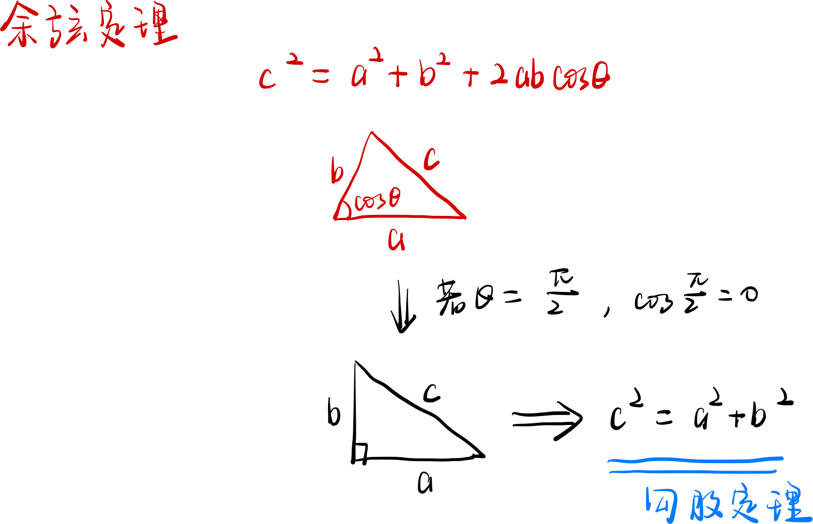

##### 浮点数

>   1.   浮点数的比较
>
>        ```c++
>        // æå°æ•°
>        const double eps = 1e-8;
>        int sign(double x) { // 符å·å‡½æ•°
>            // å–ç»å¯¹å€¼
>            if (fabs(x) < eps) return 0;
>            if (x < 0) return -1;
>            return 1;
>        }
>        ```
>
>        
>
>   2.   浮点数的比较
>
>        ```c++
>        // æå°æ•°
>        const double eps = 1e-8;
>        int cmp(double x, double y) { // 比较函数
>            // å–ç»å¯¹å€¼
>            if (fabs(x - y) < eps) return 0;
>            if (x < y) return -1;
>            return 1;
>        }
>        ```
>
>        

##### å‘é‡

###### 内积（点积）

>   1.   定义：`A·B = |A||B|cos(C)`
>
>   2.   几何æ„义
>
>        
>
>   3.   代ç å®ç°
>
>        ```c++
>        double dot(Point a, Point b) {
>        	return a.x * b.x + a.y * b.y;
>        }
>        ```

###### 外积（å‰ç§¯ï¼‰

>   1.   定义：`AxB = |A||B|sin(C)`
>
>   2.   几何æ„义
>
>   
>
>   3.   代ç å®ç°

```markdown
        
    3.3 外积（å‰ç§¯ï¼‰ 
        (1) 几何æ„义：å‘é‡Aä¸Bå¼ æˆçš„平行四边形的有å‘é¢ç§¯ã€‚B在A的逆时针方å‘为正。
        (2) 代ç å®ç°
        double cross(Point a, Point b)
        {
            return a.x * b.y - b.x * a.y;
        }
    3.4 常用函数
        3.4.1 å–模
        double get_length(Point a)
        {
            return sqrt(dot(a, a));
        }
        3.4.2 计算å‘é‡å¤¹è§’
        double get_angle(Point a, Point b)
        {
            return acos(dot(a, b) / get_length(a) / get_length(b));
        }
        3.4.3 计算两个å‘é‡æ„æˆçš„平行四边形有å‘é¢ç§¯
        double area(Point a, Point b, Point c)
        {
            return cross(b - a, c - a);
        }
        3.4.5 å‘é‡A顺时针旋转C的角度：
        Point rotate(Point a, double angle)
        {
            return Point(a.x * cos(angle) + a.y * sin(angle), -a.x * sin(angle) + a.y * cos(angle));
        }
4. 点ä¸çº¿
    4.1 直线定ç†
        (1) ä¸€èˆ¬å¼ ax + by + c = 0
        (2) 点å‘å¼ p0 + vt
        (3) æ–œæˆªå¼ y = kx + b
    4.2 常用æ“作
        (1) 判断点在直线上 A x B = 0
        (2) 两直线相交
        // cross(v, w) == 0则两直线平行或者é‡åˆ
        Point get_line_intersection(Point p, Vector v, Point q, vector w)
        {
            vector u = p - q;
            double t = cross(w, u) / cross(v, w);
            return p + v * t;
        }
        (3) 点到直线的è·ç¦»
        double distance_to_line(Point p, Point a, Point b)
        {
            vector v1 = b - a, v2 = p - a;
            return fabs(cross(v1, v2) / get_length(v1));
        }
        (4) 点到线段的è·ç¦»
        double distance_to_segment(Point p, Point a, Point b)
        {
            if (a == b) return get_length(p - a);
            Vector v1 = b - a, v2 = p - a, v3 = p - b;
            if (sign(dot(v1, v2)) < 0) return get_length(v2);
            if (sign(dot(v1, v3)) > 0) return get_length(v3);
            return distance_to_line(p, a, b);
        }
        (5) 点在直线上的投影
        double get_line_projection(Point p, Point a, Point b)
        {
            Vector v = b - a;
            return a + v * (dot(v, p - a) / dot(v, v));
        }
        (6) 点是å¦åœ¨çº¿æ®µä¸Š
        bool on_segment(Point p, Point a, Point b)
        {
            return sign(cross(p - a, p - b)) == 0 && sign(dot(p - a, p - b)) <= 0;
        }
        (7) 判断两线段是å¦ç›¸äº¤
        bool segment_intersection(Point a1, Point a2, Point b1, Point b2)
        {
            double c1 = cross(a2 - a1, b1 - a1), c2 = cross(a2 - a1, b2 - a1);
            double c3 = cross(b2 - b1, a2 - b1), c4 = cross(b2 - b1, a1 - b1);
            return sign(c1) * sign(c2) <= 0 && sign(c3) * sign(c4) <= 0;
        }
5. 多边形
    5.1 三角形
    5.1.1 é¢ç§¯
        (1) å‰ç§¯
        (2) 海伦公å¼
            p = (a + b + c) / 2;
            S = sqrt(p(p - a) * (p - b) * (p - c));
    5.1.2 三角形四心
        (1) 外心，外æ¥åœ†åœ†å¿ƒ
            三边中å‚线交点。到三角形三个顶点的è·ç¦»ç›¸ç­‰
        (2) 内心，内切圆圆心
            角平分线交点，到三边è·ç¦»ç›¸ç­‰
        (3) å‚心
            三æ¡å‚线交点
        (4) é‡å¿ƒ
            三æ¡ä¸­çº¿äº¤ç‚¹ï¼ˆåˆ°ä¸‰è§’形三顶点è·ç¦»çš„平方和最å°çš„点，三角形内到三边è·ç¦»ä¹‹ç§¯æœ€å¤§çš„点）
    5.2 普通多边形
        通常按逆时针存储所有点
        5.2.1 定义
        (1) 多边形
            由在åŒä¸€å¹³é¢ä¸”ä¸å†åŒä¸€ç›´çº¿ä¸Šçš„多æ¡çº¿æ®µé¦–尾顺次è¿æ¥ä¸”ä¸ç›¸äº¤æ‰€ç»„æˆçš„图形å«å¤šè¾¹å½¢
        (2) 简å•å¤šè¾¹å½¢
            简å•å¤šè¾¹å½¢æ˜¯é™¤ç›¸é‚»è¾¹å¤–其它边ä¸ç›¸äº¤çš„多边形
        (3) 凸多边形
            过多边形的任æ„一边åšä¸€æ¡ç›´çº¿ï¼Œå¦‚æœå…¶ä»–å„个顶点都在这æ¡ç›´çº¿çš„åŒä¾§ï¼Œåˆ™æŠŠè¿™ä¸ªå¤šè¾¹å½¢å«åšå‡¸å¤šè¾¹å½¢
            ä»»æ„凸多边形外角和å‡ä¸º360°
            ä»»æ„凸多边形内角和为(n−2)180°
        5.2.2 常用函数
        (1) 求多边形é¢ç§¯ï¼ˆä¸ä¸€å®šæ˜¯å‡¸å¤šè¾¹å½¢ï¼‰
        我们å¯ä»¥ä»ç¬¬ä¸€ä¸ªé¡¶ç‚¹é™¤æ³•æŠŠå‡¸å¤šè¾¹å½¢åˆ†æˆn − 2个三角形，然å把é¢ç§¯åŠ èµ·æ¥ã€‚
        double polygon_area(Point p[], int n)
        {
            double s = 0;
            for (int i = 1; i + 1 < n; i ++ )
                s += cross(p[i] - p[0], p[i + 1] - p[i]);
            return s / 2;
        }
        (2) 判断点是å¦åœ¨å¤šè¾¹å½¢å†…（ä¸ä¸€å®šæ˜¯å‡¸å¤šè¾¹å½¢ï¼‰
        a. 射线法，ä»è¯¥ç‚¹ä»»æ„åšä¸€æ¡å’Œæ‰€æœ‰è¾¹éƒ½ä¸å¹³è¡Œçš„射线。交点个数为å¶æ•°ï¼Œåˆ™åœ¨å¤šè¾¹å½¢å¤–，为奇数，则在多边形内。
        b. 转角法
        (3) 判断点是å¦åœ¨å‡¸å¤šè¾¹å½¢å†…
        åªéœ€åˆ¤æ–­ç‚¹æ˜¯å¦åœ¨æ‰€æœ‰è¾¹çš„左边（逆时针存储多边形）。
    5.3 皮克定ç†
        皮克定ç†æ˜¯æŒ‡ä¸€ä¸ªè®¡ç®—点阵中顶点在格点上的多边形é¢ç§¯å…¬å¼è¯¥å…¬å¼å¯ä»¥è¡¨ç¤ºä¸º:
            S = a + b/2 - 1
        其中a表示多边形内部的点数，b表示多边形边界上的点数，S表示多边形的é¢ç§¯ã€‚
6. 圆
    (1) 圆ä¸ç›´çº¿äº¤ç‚¹
    (2) 两圆交点
    (3) 点到圆的切线
    (4) 两圆公切线
    (5) 两圆相交é¢ç§¯
```

#### [AcWing 2983. ç©å…·](https://www.acwing.com/problem/content/2986/)

**题目æè¿°**

>   计算ç©å…·æ”¶çº³ç›’中，æ¯ä¸ªåˆ†åŒºå†…çš„ç©å…·æ•°é‡ã€‚
>
>   约翰的父æ¯æœ‰ä¸€ä¸ªçƒ¦æ¼----约翰æ¯æ¬¡ç©å®Œç©å…·ä»¥å总会将ç©å…·ä¹±æ‰”。
>
>   他们为约翰准备了一个长方形的ç©å…·æ”¶çº³ç›’，用æ¥æ”¾ä»–çš„ç©å…·ã€‚
>
>   但是约翰é常调皮，æ¯æ¬¡éƒ½é常éšæ„çš„å°†ç©å…·æ‰”进盒å­ä¸­ï¼Œä½¿å¾—所有ç©å…·éƒ½éšæ„混在一起，这让约翰难以找到他喜欢的ç©å…·ã€‚
>
>   对此，约翰的父æ¯æƒ³å‡ºäº†ä¸€ä¸ªå¯¹ç­–，用若干个纸æ¿å°†æ”¶çº³ç›’分隔æˆè‹¥å¹²ä¸ªåˆ†åŒºï¼Œè¿™æ ·è‡³å°‘扔到ä¸åŒåˆ†åŒºçš„ç©å…·ä¹‹é—´è¿˜æ˜¯èƒ½åˆ†å¼€çš„。
>
>   下é¢æ˜¯ä¸€ä¸ªæ”¶çº³ç›’的俯视图示例。
>
>   
>
>   你的任务是，æ¯å½“约翰将ç©å…·æ‰”进收纳盒中时，确定æ¯ä¸ªåˆ†åŒºä¸­æœ‰å¤šå°‘个ç©å…·ã€‚

**输入格å¼**

>   本题包å«å¤šç»„测试数æ®ã€‚
>
>   对äºæ¯ç»„æ•°æ®ï¼Œç¬¬ä¸€è¡ŒåŒ…å« `6` 个整数 $n,m,x_1,y_1,x_2,y_2$，表示共有 `n` 个纸æ¿ï¼Œ`m` 个ç©å…·ï¼Œæ”¶çº³ç›’的左上角å标为 `(x1,y1)`，å³ä¸‹è§’å标为 `(x2,y2)`。
>
>   æ¥ä¸‹æ¥ `n` 行，æ¯è¡ŒåŒ…å«ä¸¤ä¸ªæ•´æ•° $U_i,L_i$，表示第 `i` 个纸æ¿çš„两端点å标分别为 $(U_i,y_1)$ å’Œ $(L_i,y_2)$。数æ®ä¿è¯çº¸æ¿ä¹‹é—´ä¸ç›¸äº¤ï¼Œä¸”按照ä»å·¦è‡³å³é¡ºåºä¾æ¬¡ç»™å‡ºã€‚
>
>   æ¥ä¸‹æ¥ `m` 行，æ¯è¡ŒåŒ…å«ä¸¤ä¸ªæ•´æ•° $X_j,Y_j$，表示第 `j` 个ç©å…·çš„ä½ç½®å标。ç©å…·çš„给出顺åºæ˜¯éšæœºçš„。数æ®ä¿è¯ç©å…·ä¸ä¼šæ°å¥½è½åœ¨çº¸æ¿ä¸Šï¼Œä¹Ÿä¸ä¼šè½åœ¨ç›’å­å¤–。
>
>   输入由包å«å•ä¸ª `0` 的一行结æŸã€‚

**输出格å¼**

>   对äºæ¯ç»„æ•°æ®ï¼Œè¾“出 `n+1` 行。
>
>   `n` 个纸æ¿å°†æ”¶çº³ç›’划分为了 `n+1` 个分区，ä»å·¦åˆ°å³ç¼–å·ä¸º `0∼n`。
>
>   按照分区编å·ä»å°åˆ°å¤§çš„顺åºï¼Œæ¯è¡Œè¾“å‡ºä¸€è¡Œä¿¡æ¯ `i: j`，其中 `i` 表示分区编å·ï¼Œ`j` 表示分区内ç©å…·æ•°é‡ã€‚
>
>   æ¯ç»„æ•°æ®ä¹‹é—´ï¼Œ**用空行隔开**。

**æ•°æ®èŒƒå›´**

>   +   $æ¯ä¸ªæµ‹è¯•ç‚¹æœ€å¤šåŒ…å« 10 组数æ®ã€‚$
>   +   $1≤n,m≤5000,$
>   +   $所有åæ ‡å–值范围 [−10^5,10^5]。$

**输入样例**

```c++
5 6 0 10 60 0
3 1
4 3
6 8
10 10
15 30
1 5
2 1
2 8
5 5
40 10
7 9
4 10 0 10 100 0
20 20
40 40
60 60
80 80
 5 10
15 10
25 10
35 10
45 10
55 10
65 10
75 10
85 10
95 10
0
```

**输出样例**

```c++
0: 2
1: 1
2: 1
3: 1
4: 0
5: 1

0: 2
1: 2
2: 2
3: 2
4: 2
```

**注æ„**

>   如示例所示，è½åœ¨ç›’å­è¾¹ç¼˜çš„ç©å…·ä¹Ÿç®—在盒å­å†…。

**手写稿**


**代ç **


**时间å¤æ‚度**


**空间å¤æ‚度**


**标签**


**ç¼åˆæ€ª**


### 扫æ线问题

#### [AcWing 3068. 扫æ线](https://www.acwing.com/problem/content/3071/)

**题目æè¿°**

>   在二维平é¢ä¸­ç»™å®š `n` 个**两æ¡è¾¹åˆ†åˆ«ä¸ x è½´å’Œ y 轴平行**的矩形，请你求出它们的é¢ç§¯å¹¶ã€‚

**输入格å¼**

>   第一行包å«æ•´æ•° `n`。
>
>   æ¥ä¸‹æ¥ `n` 行，æ¯è¡ŒåŒ…å«å››ä¸ªæ•´æ•° `x1,y1,x2,y2`，表示其中一个矩形的左下角åæ ‡ `(x1,y1)` å’Œå³ä¸Šè§’åæ ‡ `(x2,y2)`。
>
>   注æ„，å标轴 `x` è½´ä»å·¦å‘å³å»¶ä¼¸ï¼Œ`y` è½´ä»ä¸‹å‘上延伸。
>
>   

**输出格å¼**

>   一个整数，表示矩形的é¢ç§¯å¹¶ã€‚

**æ•°æ®èŒƒå›´**

>   +   $1≤n≤1000,$
>   +   $−10^9≤x1<x2≤10^9,$
>   +   $−10^9≤y1<y2≤10^9$

**输入样例**

```c++
2
10 10 20 20
15 15 25 25
```

**输出样例**

```c++
175
```

**手写稿**


**代ç **

```c++
#include <iostream>
#include <vector>
#include <algorithm>
#define x first
#define y second
using namespace std;
typedef long long LL;
typedef pair<int, int> PII;
const int N = 1010, INF = 0x3f3f3f3f;
int n;
PII l[N], r[N];
vector<int> points;
LL merge_segs(int a, int b) {
    vector<PII> segs;
    // éå†æ¯ä¸ªçŸ©å½¢
    for (int i = 1; i <= n; i ++ )
        // 如æœå½“å‰çŸ©å½¢å°†åˆ†å‰²æˆçš„é•¿æ¡å®Œå…¨åŒ…裹在内
        if (l[i].x <= a && r[i].x >= b)
            // 记录此区间ã€yè½´æ–¹å‘】
            segs.push_back({l[i].y, r[i].y});
    // 区间åˆå¹¶æ¨¡æ¿
    // æ’åº
    sort(segs.begin(), segs.end());
    LL height = 0;
    int L = -INF, R = -INF;
    for (auto& [l, r] : segs)
        if (R < l) {
            height += ((LL)R - L);
            L = l, R = r;
        }
        else R = max(R, r);
    // 记得将最å一段的长度添加上
    height += (R - L);
    // 计算答案å³å¯
    return height * (b - a);
}
int main() {
    scanf("%d", &n);
    for (int i = 1; i <= n; i ++ ) {
        // 记录矩形左边的xå标和yåæ ‡
        // 记录矩形å³è¾¹çš„xå标和yåæ ‡
        scanf("%d%d%d%d", &l[i].x, &l[i].y, &r[i].x, &r[i].y);
        // 统计所有的横åæ ‡
        points.push_back(l[i].x);
        points.push_back(r[i].x);
    }
    // æ’åº
    sort(points.begin(), points.end());
    // å»é‡
    points.erase(unique(points.begin(), points.end()), points.end());
    // å¯èƒ½ä¼šè¶Šç•Œï¼Œä½¿ç”¨LL
    LL res = 0;
    // éå†æ¯ä¸ªåŒºé—´
    for (int i = 1; i < points.size(); i ++ )
        // 统计总和
        res += merge_segs(points[i - 1], points[i]);
    cout << res << endl;
    return 0;
}
```

**时间å¤æ‚度**

$O(n)$

**空间å¤æ‚度**

$O(n)$

**标签**

`扫æ线`

**ç¼åˆæ€ª**

[AcWing 803. 区间åˆå¹¶](#AcWing 803. 区间åˆå¹¶)

#### [AcWing 2801. 三角形é¢ç§¯å¹¶](https://www.acwing.com/problem/content/2803/)

>   给出 `n` 个三角形，求它们并的é¢ç§¯ã€‚

**输入格å¼**

>   第一行为 `n`，å³ä¸‰è§’形的个数。
>
>   以下 `n` 行，æ¯è¡Œ `6` 个å®æ•° $x_1,y_1,x_2,y_2,x_3,y_3$，代表三角形的顶点å标。
>
>   åæ ‡å‡ä¸ºä¸è¶…过 $10^6$ çš„å®æ•°ï¼Œè¾“入数æ®ä¿ç•™ `1` ä½å°æ•°ã€‚

**输出格å¼**

>   输出并的é¢ç§¯ `u`，ä¿ç•™ä¸¤ä½å°æ•°ã€‚

**æ•°æ®èŒƒå›´**

>   +   $1≤n≤100$

**输入样例**

```c++
2
0.0 0.0 2.0 0.0 1.0 1.0
1.0 0.0 3.0 0.0 2.0 1.0
```

**输出样例**

```c++
1.75
```

**手写稿**


**代ç **


**时间å¤æ‚度**


**空间å¤æ‚度**


**标签**


**ç¼åˆæ€ª**


#### [LeetCode 218. 天际线问题](https://leetcode-cn.com/problems/the-skyline-problem/)

**问题æè¿°**

> åŸå¸‚的天际线是ä»è¿œå¤„观看该åŸå¸‚中所有建筑物形æˆçš„轮廓的外部轮廓。给你所有建筑物的ä½ç½®å’Œé«˜åº¦ï¼Œè¯·è¿”å›ç”±è¿™äº›å»ºç­‘物形æˆçš„ 天际线 。
>
> æ¯ä¸ªå»ºç­‘物的几何信æ¯ç”±æ•°ç»„ `buildings` 表示，其中三元组 `buildings[i] = [lefti, righti, heighti]` 表示：
>
> + `lefti` 是第 `i` 座建筑物左边缘的 `x` å标。
> + `righti` 是第 `i` 座建筑物å³è¾¹ç¼˜çš„ `x` å标。
> + `heighti` 是第 `i` 座建筑物的高度。
>
> 天际线 应该表示为由 “关键点†组æˆçš„åˆ—è¡¨ï¼Œæ ¼å¼ `[[x1,y1],[x2,y2],...]` ，并按 `x` åæ ‡ 进行 æ’åº ã€‚å…³é”®ç‚¹æ˜¯æ°´å¹³çº¿æ®µçš„å·¦ç«¯ç‚¹ã€‚åˆ—è¡¨ä¸­æœ€å一个点是最å³ä¾§å»ºç­‘物的终点，`y` å标始终为 `0` ，仅用äºæ ‡è®°å¤©é™…线的终点。此外，任何两个相邻建筑物之间的地é¢éƒ½åº”被视为天际线轮廓的一部分。
>
> 注æ„：输出天际线中ä¸å¾—有è¿ç»­çš„相åŒé«˜åº¦çš„水平线。例如 `[...[2 3], [4 5], [7 5], [11 5], [12 7]...]` 是ä¸æ­£ç¡®çš„答案；三æ¡é«˜åº¦ä¸º `5` 的线应该在最终输出中åˆå¹¶ä¸ºä¸€ä¸ªï¼š`[...[2 3], [4 5], [12 7], ...]`

**示例 1**


> 输入：`buildings = [[2,9,10],[3,7,15],[5,12,12],[15,20,10],[19,24,8]]`
> 输出：`[[2,10],[3,15],[7,12],[12,0],[15,10],[20,8],[24,0]]`
> 解释：
> 图 `A` 显示输入的所有建筑物的ä½ç½®å’Œé«˜åº¦ï¼Œ
> 图 `B` 显示由这些建筑物形æˆçš„天际线。图 `B` 中的红点表示输出列表中的关键点。

**示例 2**

> 输入：`buildings = [[0,2,3],[2,5,3]]`
> 输出：`[[0,3],[5,0]]`

**æ示**

> + $1 <= buildings.length <= 10^4$
> + $0 <= left_i < right_i <= 2^{31} - 1$
> + $1 <= height_i <= 2^{31} - 1$
> + $buildings 按 left_i é递å‡æ’åº$

**题解**

> 1. 将横å标按照ä»å°åˆ°å¤§æ’åºï¼Œå¦‚æœæ¨ªå标相åŒï¼Œåˆ™åˆ†ä¸‹åˆ—三ç§æƒ…况：
>
>     + 如æœæ˜¯å·¦ç«¯ç‚¹ï¼Œåˆ™æŒ‰ç…§ä»å¤§åˆ°å°æ’åº
>
>         
>
>     + 如æœæ˜¯å³ç«¯ç‚¹ï¼Œåˆ™æŒ‰ç…§ä»å°åˆ°å¤§æ’åº
>
>         
>
>     + 如æœæ˜¯å·¦å³ç«¯ç‚¹é‡åˆï¼Œåˆ™æŒ‰ç…§å…ˆå¤„ç†å·¦ç«¯ç‚¹ï¼Œå†å¤„ç†å³ç«¯ç‚¹
>
>         
>
> 2. 使用 `pair` （默认å‡åºï¼‰æ•°ç»„ `point` æ¥å­˜å‚¨æ¯ä¸€ä¸ªç‚¹ï¼Œæ’åºï¼Œç”±äºç¬¬ä¸‰ç§æƒ…况的存在，所以，将左端点的值存储为负数，作用有二：
>
>     + 当左å³ç«¯ç‚¹é‡åˆçš„时候，å¯ä»¥ä¿è¯çš„是先处ç†å·¦ç«¯ç‚¹ï¼Œå†å¤„ç†å³ç«¯ç‚¹ã€
>     + å¯ä»¥æ ¹æ®æ­£è´Ÿå·ï¼Œåˆ¤æ–­å½“å‰å¤„ç†çš„是左端点还是å³ç«¯ç‚¹
>
> 3. éå† `point` 数组，使用 `multiset` 存储高度，分为两ç§æƒ…况：
>
>     + 如æœå½“å‰éå†çš„点是左端点并且当å‰ç‚¹å¤§äº `multiset` 中的最大值，说æ˜é«˜åº¦å‡é«˜ï¼Œä¸€å®šäº§ç”Ÿå…³é”®ç‚¹ï¼Œè®°å½•ç­”案，并将当å‰ç‚¹æ’å…¥ `multiset` 中
>     + 如æœå½“å‰éå†çš„点是å³ç«¯ç‚¹ `h` ，先将å³ç«¯ç‚¹ `h` 删除，查看最大值，若 `h` å¤§äº `multiset` çš„æœ€å¤§å€¼ï¼Œåˆ™è¯´æ˜ `h` 就是最大值，那么高度也会å‘生å˜åŒ–，å³é«˜åº¦å˜ä½ï¼Œè®°å½•ç­”案å³å¯
>
> 4. 问题解答
>
>     + 为啥è¦åˆ†å·¦ç«¯ç‚¹å’Œå³ç«¯ç‚¹å¤„ç†ï¼Œé¢˜ç›®ä¸æ˜¯è¯´æ°´å¹³çº¿æ®µçš„左端点？
>
>         
>
>         + 如图，答案并ä¸éƒ½æ˜¯åœ¨å·¦ç«¯ç‚¹ï¼Œå…¶ä¸­ä¸€ä¸ªç­”案在红色矩形的å³ç«¯ç‚¹

**代ç **

```c++
class Solution {
public:
    vector<vector<int>> getSkyline(vector<vector<int>>& g) {
        vector<vector<int>> res;
        vector<pair<int, int>> point;
        multiset<int> height;
        for (auto& item : g) {
            point.push_back({item[0], -item[2]});
            point.push_back({item[1], item[2]});
        }
        // 先将x轴加入答案
        height.insert(0);
        sort(point.begin(), point.end());
        for (auto& p : point) {
            int x = p.first, h = abs(p.second);
            if (p.second < 0) { // 左端点
                if (h > *height.rbegin()) res.push_back({x, h});
                height.insert(h);
            }
            else { // å³ç«¯ç‚¹
                height.erase(height.find(h));
                if (h > *height.rbegin()) res.push_back({x, *height.rbegin()});
            }
        }
        return res;
    }
};
```

**标签**

`扫æ线`


# 贪心


## 普通贪心

### [LeetCode 376. 摆动åºåˆ—](https://leetcode-cn.com/problems/wiggle-subsequence/)

**题目æè¿°**

>   如æœè¿ç»­æ•°å­—之间的差严格地在正数和负数之间交替，则数字åºåˆ—称为 摆动åºåˆ— 。第一个差（如æœå­˜åœ¨çš„è¯ï¼‰å¯èƒ½æ˜¯æ­£æ•°æˆ–负数。仅有一个元素或者å«ä¸¤ä¸ªä¸ç­‰å…ƒç´ çš„åºåˆ—也视作摆动åºåˆ—。
>
>   例如， `[1, 7, 4, 9, 2, 5]` 是一个 摆动åºåˆ— ，因为差值 `(6, -3, 5, -7, 3)` 是正负交替出ç°çš„。
>
>   相å，`[1, 4, 7, 2, 5]` å’Œ `[1, 7, 4, 5, 5]` ä¸æ˜¯æ‘†åŠ¨åºåˆ—，第一个åºåˆ—是因为它的å‰ä¸¤ä¸ªå·®å€¼éƒ½æ˜¯æ­£æ•°ï¼Œç¬¬äºŒä¸ªåºåˆ—是因为它的最å一个差值为零。
>   å­åºåˆ— å¯ä»¥é€šè¿‡ä»åŸå§‹åºåˆ—中删除一些（也å¯ä»¥ä¸åˆ é™¤ï¼‰å…ƒç´ æ¥è·å¾—，剩下的元素ä¿æŒå…¶åŸå§‹é¡ºåºã€‚
>
>   给你一个整数数组 `nums` ï¼Œè¿”å› `nums` 中作为 摆动åºåˆ— çš„ 最长å­åºåˆ—的长度 。

**示例 1**

>   输入：`nums = [1,7,4,9,2,5]`
>   输出：`6`
>   解释：整个åºåˆ—å‡ä¸ºæ‘†åŠ¨åºåˆ—，å„元素之间的差值为 `(6, -3, 5, -7, 3)` 。

**示例 2**

>   输入：`nums = [1,17,5,10,13,15,10,5,16,8]`
>   输出：`7`
>   解释：这个åºåˆ—包å«å‡ ä¸ªé•¿åº¦ä¸º `7` 摆动åºåˆ—。
>   其中一个是 `[1, 17, 10, 13, 10, 16, 8]` ，å„元素之间的差值为 `(16, -7, 3, -3, 6, -8)` 。

**示例 3**

>   输入：`nums = [1,2,3,4,5,6,7,8,9]`
>   输出：`2`

**æ示**

>   +   $1 <= nums.length <= 1000$
>   +   $0 <= nums[i] <= 1000$

**进阶**

>   你能å¦ç”¨ $O(n)$ 时间å¤æ‚度完æˆæ­¤é¢˜?

**手写稿**


**代ç **

```c++
class Solution {
public:
    int wiggleMaxLength(vector<int>& nums) {
        // 删除ã€è¿ç»­é‡å¤ã€‘元素
        nums.erase(unique(nums.begin(), nums.end()), nums.end());
        if (nums.size() <= 2) return nums.size();
        // 将首尾元素添加
        int res = 2;
        for (int i = 1; i + 1 < nums.size(); i ++ ) {
            // 如æœå½“å‰å…ƒç´ æ˜¯å±€éƒ¨æœ€å¤§å€¼æˆ–者局部最å°å€¼
            // åºåˆ—的长度++
            if (nums[i - 1] < nums[i] && nums[i + 1] < nums[i] || nums[i - 1] > nums[i] && nums[i + 1] > nums[i])
                res ++;
        }
        return res;
    }
};
```

**时间å¤æ‚度**

$O(n)$

**空间å¤æ‚度**

$O(1)$

**标签**

`贪心`

**ç¼åˆæ€ª**


## 字符串贪心

### [LeetCode 316. å»é™¤é‡å¤å­—æ¯](https://leetcode-cn.com/problems/remove-duplicate-letters/)

**问题æè¿°**

> 给你一个字符串 `s` ，请你å»é™¤å­—符串中é‡å¤çš„å­—æ¯ï¼Œä½¿å¾—æ¯ä¸ªå­—æ¯åªå‡ºç°ä¸€æ¬¡ã€‚需ä¿è¯ è¿”å›ç»“æœçš„å­—å…¸åºæœ€å°ï¼ˆè¦æ±‚ä¸èƒ½æ‰“乱其他字符的相对ä½ç½®ï¼‰ã€‚

**示例 1**

> 输入：`s = "bcabc"`
> 输出：`"abc"`

**示例 2**

> 输入：`s = "cbacdcbc"`
> 输出：`"acdb"`

**æ示**

> + $1 <= s.length <= 10^4$
> + $s$ ç”±å°å†™è‹±æ–‡å­—æ¯ç»„æˆ
> + 注æ„ï¼šè¯¥é¢˜ä¸ [`1081`](https://leetcode-cn.com/problems/smallest-subsequence-of-distinct-characters) 相åŒ

**手写稿**


**代ç **

```c++
class Solution {
public:
    string removeDuplicateLetters(string s) {
        string res;
        unordered_map<char, int> idxs;
        unordered_map<char, bool> is_appear;
        // 记录æ¯ä¸ªå­—符的下标所在的最å一ä½çš„ä½ç½®
        for (int i = 0; i < s.size(); i ++ ) idxs[s[i]] = i;
        for (int i = 0; i < s.size(); i ++ ) {
            // 如æœå½“å‰å­—符出ç°è¿‡ï¼Œåˆ™ç›´æ¥è¿›è¡Œä¸‹ä¸€æ¬¡å¾ªç¯
            if (is_appear[s[i]]) continue;
            // 判断是å¦å¯ä»¥åˆ é™¤å½“å‰å­—符
            while (res.size() && res.back() > s[i] && idxs[res.back()] > i) {
                is_appear[res.back()] = false;
                res.pop_back();
            }
            res += s[i];
            is_appear[s[i]] = true;
        }
        return res;
    }
};
```

**标签**

`贪心`

## 区间åˆå¹¶

### [AcWing 803. 区间åˆå¹¶](https://www.acwing.com/problem/content/805/)

**题目æè¿°**

>   给定 `n` 个区间 $[l_i,r_i]$，è¦æ±‚åˆå¹¶æ‰€æœ‰æœ‰äº¤é›†çš„区间。
>
>   注æ„如æœåœ¨ç«¯ç‚¹å¤„相交，也算有交集。
>
>   输出åˆå¹¶å®Œæˆå的区间个数。
>
>   例如：`[1,3]` å’Œ `[2,6]` å¯ä»¥åˆå¹¶ä¸ºä¸€ä¸ªåŒºé—´ `[1,6]`。

**输入格å¼**

>   第一行包å«æ•´æ•° `n`。
>
>   æ¥ä¸‹æ¥ `n` 行，æ¯è¡ŒåŒ…å«ä¸¤ä¸ªæ•´æ•° `l` å’Œ `r`。

**输出格å¼**

>   共一行，包å«ä¸€ä¸ªæ•´æ•°ï¼Œè¡¨ç¤ºåˆå¹¶åŒºé—´å®Œæˆå的区间个数。

**æ•°æ®èŒƒå›´**

>   +   $1≤n≤100000,$
>   +   $−10^9≤l_i≤r_i≤10^9$

**输入样例**

```c++
5
1 2
2 4
5 6
7 8
7 9
```

**输出样例**

```c++
3
```

**手写稿**

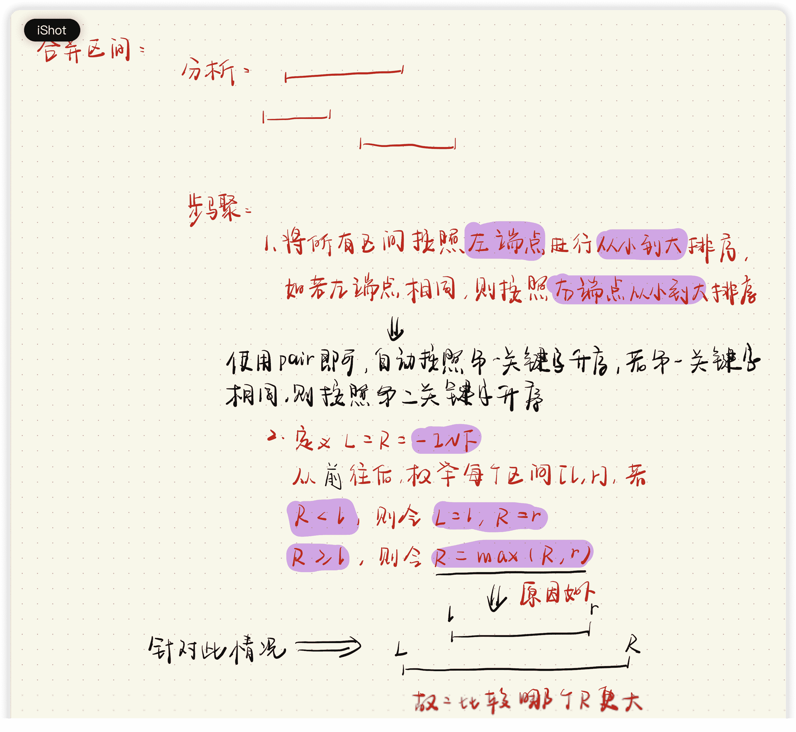

**代ç **

```c++
#include <iostream>
#include <algorithm>
using namespace std;
typedef pair<int, int> PII;
const int INF = 0x3f3f3f3f;
vector<PII> segs;
int n;
int main() {
    scanf("%d", &n);
    for (int i = 0; i < n; i ++ ) {
        int l, r;
        scanf("%d%d", &l, &r);
        segs.push_back({l, r});
    }
    sort(segs.begin(), segs.end());
    int res = 0;
    int L = -INF, R = -INF;
    for (auto& [l, r] : segs)
        if (R < l) {
            res ++;
            L = l, R = r;
        }
        else R = max(R, r);
    cout << res << endl;
    return 0;
}
```

**时间å¤æ‚度**

$O(n)$

**空间å¤æ‚度**

$O(n)$

**标签**

`贪心`ã€`æ’åº`

**ç¼åˆæ€ª**


# 分治

## [LeetCode 372. 超级次方](https://leetcode-cn.com/problems/super-pow/)

**题目æè¿°**

>   你的任务是计算 $a^b$ 对 `1337` å–模，`a` 是一个正整数，`b` 是一个é常大的正整数且会以数组形å¼ç»™å‡ºã€‚

**示例 1**

>   输入：`a = 2, b = [3]`
>   输出：`8`

**示例 2**

>   输入：`a = 2, b = [1,0]`
>   输出：`1024`

**示例 3**

>   输入：`a = 1, b = [4,3,3,8,5,2]`
>   输出：`1`

**示例 4**

>   输入：`a = 2147483647, b = [2,0,0]`
>   输出：`1198`

**æ示**

>   +   $1 <= a <= 2^{31} - 1$
>   +   $1 <= b.length <= 2000$
>   +   $0 <= b[i] <= 9$
>   +   $b ä¸å«å‰å¯¼ 0$

**手写稿**


**代ç **

```c++
const int p = 1337;
class Solution {
public:
    int qmi(int a, int b) {
        // a先模p，如æœä¸å…ˆæ¨¡p，第10è¡Œa * a会越界
        // è®°ä½å…ˆæ¨¡pã€æ¨¡æ¿ï¼ï¼ï¼ã€‘
        a %= p;
        int res = 1;
        while (b) {
            if (b & 1) res = res * a % p;
            a = a * a % p;
            b >>= 1;
        }
        return res;
    }
    int superPow(int a, vector<int>& b) {
        if (b.empty()) return 1;
        // 把最å一个数剔除，化归为分治的å­é—®é¢˜
        int t = b.back(); b.pop_back();
        return qmi(superPow(a, b), 10) * qmi(a, t) % p;
    }
};
```

**标签**

`快速幂`ã€`分治`


# 栈和队列

## æ ˆ

### 普通栈

#### [LeetCode 232. 用栈å®ç°é˜Ÿåˆ—](https://leetcode-cn.com/problems/implement-queue-using-stacks/)

**题目æè¿°**

>   请你仅使用两个栈å®ç°å…ˆå…¥å…ˆå‡ºé˜Ÿåˆ—。队列应当支æŒä¸€èˆ¬é˜Ÿåˆ—支æŒçš„所有æ“作（`push`ã€`pop`ã€`peek`ã€`empty`）：
>
>   å®ç° `MyQueue` 类：
>
>   +   `void push(int x)` 将元素 `x` æ¨åˆ°é˜Ÿåˆ—的末尾
>   +   `int pop()` ä»é˜Ÿåˆ—的开头移除并返å›å…ƒç´ 
>   +   `int peek()` è¿”å›é˜Ÿåˆ—开头的元素
>   +   `boolean empty()` 如æœé˜Ÿåˆ—ä¸ºç©ºï¼Œè¿”å› `true` ï¼›å¦åˆ™ï¼Œè¿”å› `false`
>
>   说æ˜ï¼š
>
>   +   ä½  åªèƒ½ 使用标准的栈æ“作 —— 也就是åªæœ‰ `push to top`, `peek/pop from top`, `size`, å’Œ `is empty` æ“作是åˆæ³•çš„。
>   +   你所使用的语言也许ä¸æ”¯æŒæ ˆã€‚ä½ å¯ä»¥ä½¿ç”¨ `list` 或者 `deque`（åŒç«¯é˜Ÿåˆ—）æ¥æ¨¡æ‹Ÿä¸€ä¸ªæ ˆï¼Œåªè¦æ˜¯æ ‡å‡†çš„æ ˆæ“作å³å¯ã€‚

**示例 1**

>   输入：
>   `["MyQueue", "push", "push", "peek", "pop", "empty"]`
>   `[[], [1], [2], [], [], []]`
>   输出：
>   `[null, null, null, 1, 1, false]`
>
>   解释：
>   `MyQueue myQueue = new MyQueue();`
>   `myQueue.push(1); // queue is: [1]`
>   `myQueue.push(2); // queue is: [1, 2] (leftmost is front of the queue)`
>   `myQueue.peek(); // return 1`
>   `myQueue.pop(); // return 1, queue is [2]`
>   `myQueue.empty(); // return false`

**æ示**

>   +   $1 <= x <= 9$
>   +   $最多调用 100 次 pushã€popã€peek å’Œ empty$
>   +   $å‡è®¾æ‰€æœ‰æ“作都是有效的 （例如，一个空的队列ä¸ä¼šè°ƒç”¨ pop 或者 peek æ“作）$

**进阶**

>   你能å¦å®ç°æ¯ä¸ªæ“作å‡æ‘Šæ—¶é—´å¤æ‚度为 `O(1)` 的队列？æ¢å¥è¯è¯´ï¼Œæ‰§è¡Œ `n` 个æ“作的总时间å¤æ‚度为 `O(n) `，å³ä½¿å…¶ä¸­ä¸€ä¸ªæ“作å¯èƒ½èŠ±è´¹è¾ƒé•¿æ—¶é—´ã€‚

**手写稿**


**代ç **

```c++
class MyQueue {
public:
    stack<int> sk1, sk2;
    MyQueue() {}
    
    void push(int x) {
        sk1.push(x);
        return;
    }
    
    int pop() {
        // 留下最å一个数
        while (sk1.size() > 1) {
            sk2.push(sk1.top());
            sk1.pop();
        }
        // 记录最å一个数
        int t = sk1.top();
        // 将最å一个数弹出
        sk1.pop();
        while (sk2.size()) {
            sk1.push(sk2.top());
            sk2.pop();
        }
        return t;
    }
    
    int peek() {
        // 留下最å一个数
        while (sk1.size() > 1) {
            sk2.push(sk1.top());
            sk1.pop();
        }
        // 记录最å一个数
        int t = sk1.top();
        while (sk2.size()) {
            sk1.push(sk2.top());
            sk2.pop();
        }
        return t;
    }
    
    bool empty() {
        return sk1.empty();
    }
};

/**
 * Your MyQueue object will be instantiated and called as such:
 * MyQueue* obj = new MyQueue();
 * obj->push(x);
 * int param_2 = obj->pop();
 * int param_3 = obj->peek();
 * bool param_4 = obj->empty();
 */
```

**时间å¤æ‚度**

$O(n)$

**空间å¤æ‚度**

$O(n)$

**标签**

`æ ˆ`

**ç¼åˆæ€ª**


### å•è°ƒæ ˆ

#### [LeetCode 42. æ¥é›¨æ°´](https://leetcode-cn.com/problems/trapping-rain-water/)

**题目æè¿°**

>   给定 `n` 个é负整数表示æ¯ä¸ªå®½åº¦ä¸º `1` 的柱å­çš„高度图，计算按此æ’列的柱å­ï¼Œä¸‹é›¨ä¹‹å能æ¥å¤šå°‘雨水。 

**示例 1**


>   输入：`height = [0,1,0,2,1,0,1,3,2,1,2,1]`
>   输出：`6`
>   解释：上é¢æ˜¯ç”±æ•°ç»„ `[0,1,0,2,1,0,1,3,2,1,2,1]` 表示的高度图，在这ç§æƒ…况下，å¯ä»¥æ¥ `6` 个å•ä½çš„雨水（è“色部分表示雨水）。 

**示例 2**

>   输入：`height = [4,2,0,3,2,5]`
>   输出：`9`

**æ示**

>   +   $n == height.length$
>   +   $1 <= n <= 2 * 10^4$
>   +   $0 <= height[i] <= 10^5$

**手写稿**


**代ç **

```c++
class Solution {
public:
    int trap(vector<int>& h) {
        // 维护一个å•è°ƒä¸‹é™æ ˆ
        stack<int> stk;
        int res = 0;
        for (int i = 0; i < h.size(); i ++ ) {
            // åˆå§‹åŒ–上一个水池的高度
            int height = 0;
            while (stk.size() && h[stk.top()] <= h[i]) {
                // 栈中存储的是下标
                res += (i - stk.top() - 1) * (h[stk.top()] - height);
                // 更新高度
                height = h[stk.top()];
                stk.pop();
            }
            // 如æœæ ˆä¸ç©ºï¼Œåˆ™è®¡ç®—ã€æœ€å一个水池】的水
            // 手模å³å¯
            if (stk.size()) res += (i - stk.top() - 1) * (h[i] - height);
            stk.push(i);
        }
        return res;
    }
};
```

**时间å¤æ‚度**

$O(n)$

**空间å¤æ‚度**

$O(n)$

**标签**

`å•è°ƒæ ˆ`

**ç¼åˆæ€ª**

#### [LeetCode 84. 柱状图中最大的矩形](https://leetcode-cn.com/problems/largest-rectangle-in-histogram/)

**题目æè¿°**

>   给定 `n` 个é负整数，用æ¥è¡¨ç¤ºæŸ±çŠ¶å›¾ä¸­å„个柱å­çš„高度。æ¯ä¸ªæŸ±å­å½¼æ­¤ç›¸é‚»ï¼Œä¸”宽度为 `1` 。
>
>   求在该柱状图中，能够勾勒出æ¥çš„矩形的最大é¢ç§¯ã€‚

**示例 1**


>   输入：`heights = [2,1,5,6,2,3]`
>   输出：`10`
>   解释：最大的矩形为图中红色区域，é¢ç§¯ä¸º `10`

**示例 2**


>   输入： `heights = [2,4]`
>   输出： `4`

**æ示**

>   +   $1 <= heights.length <=10^5$
>   +   $0 <= heights[i] <= 10^4$

**手写稿**


**代ç **

```c++
class Solution {
public:
    int largestRectangleArea(vector<int>& h) {
        int n = h.size();
        vector<int> left(n + 5), right(n + 5);
        stack<int> stk;
        // 对äºå½“å‰æ•°è€Œè¨€ï¼Œå¯»æ‰¾å·¦è¾¹ç¬¬ä¸€ä¸ªæ¯”当å‰æ•°ã€ä¸¥æ ¼å°ã€‘的值的ã€ä¸‹æ ‡ã€‘
        for (int i = 0; i < n; i ++ ) {
            while (stk.size() && h[stk.top()] >= h[i]) stk.pop();
            if (stk.empty()) left[i] = -1;
            else left[i] = stk.top();
            stk.push(i);
        }
        stk = stack<int>();
        // 对äºå½“å‰æ•°è€Œè¨€ï¼Œå¯»æ‰¾å³è¾¹ç¬¬ä¸€ä¸ªæ¯”当å‰æ•°ã€ä¸¥æ ¼å¤§ã€‘的值的ã€ä¸‹æ ‡ã€‘
        for (int i = n - 1; i >= 0; i -- ) {
            while (stk.size() && h[stk.top()] >= h[i]) stk.pop();
            if (stk.empty()) right[i] = n;
            else right[i] = stk.top();
            stk.push(i);
        }
        int res = 0;
        // 算就完了
        for (int i = 0; i < n; i ++ )
            res = max(res, h[i] * (right[i] - left[i] - 1));
        return res;
    }
};
```

**时间å¤æ‚度**

$O(n)$

**空间å¤æ‚度**

$O(n)$

**标签**

`å•è°ƒæ ˆ`

**ç¼åˆæ€ª**


## 队列

### 循ç¯é˜Ÿåˆ—

#### [LeetCode 622. 设计循ç¯é˜Ÿåˆ—](https://leetcode-cn.com/problems/design-circular-queue/)

**题目æè¿°**

>   设计你的循ç¯é˜Ÿåˆ—å®ç°ã€‚ 循ç¯é˜Ÿåˆ—是一ç§çº¿æ€§æ•°æ®ç»“æ„，其æ“作表ç°åŸºäº `FIFO`（先进先出）åŸåˆ™å¹¶ä¸”队尾被è¿æ¥åœ¨é˜Ÿé¦–之å以形æˆä¸€ä¸ªå¾ªç¯ã€‚它也被称为“ç¯å½¢ç¼“冲器â€ã€‚
>
>   循ç¯é˜Ÿåˆ—的一个好处是我们å¯ä»¥åˆ©ç”¨è¿™ä¸ªé˜Ÿåˆ—之å‰ç”¨è¿‡çš„空间。在一个普通队列里，一旦一个队列满了，我们就ä¸èƒ½æ’入下一个元素，å³ä½¿åœ¨é˜Ÿåˆ—å‰é¢ä»æœ‰ç©ºé—´ã€‚但是使用循ç¯é˜Ÿåˆ—，我们能使用这些空间å»å­˜å‚¨æ–°çš„值。
>
>   ä½ çš„å®ç°åº”该支æŒå¦‚下æ“作：
>
>   +   `MyCircularQueue(k):` æ„造器，设置队列长度为 `k` 。
>   +   `Front:` ä»é˜Ÿé¦–è·å–元素。如æœé˜Ÿåˆ—ä¸ºç©ºï¼Œè¿”å› `-1` 。
>   +   `Rear:` è·å–队尾元素。如æœé˜Ÿåˆ—ä¸ºç©ºï¼Œè¿”å› `-1` 。
>   +   `enQueue(value):` å‘循ç¯é˜Ÿåˆ—æ’入一个元素。如æœæˆåŠŸæ’入则返å›çœŸã€‚
>   +   `deQueue():` ä»å¾ªç¯é˜Ÿåˆ—中删除一个元素。如æœæˆåŠŸåˆ é™¤åˆ™è¿”å›çœŸã€‚
>   +   `isEmpty():` 检查循ç¯é˜Ÿåˆ—是å¦ä¸ºç©ºã€‚
>   +   `isFull():` 检查循ç¯é˜Ÿåˆ—是å¦å·²æ»¡ã€‚

**示例**

>   `MyCircularQueue circularQueue = new MyCircularQueue(3);` // 设置长度为 `3`
>   `circularQueue.enQueue(1);`  // è¿”å› `true`
>   `circularQueue.enQueue(2);`  // è¿”å› `true`
>   `circularQueue.enQueue(3);`  // è¿”å› `true`
>   `circularQueue.enQueue(4);`  // è¿”å› `false`，队列已满
>   `circularQueue.Rear();`  // è¿”å› `3`
>   `circularQueue.isFull();`  // è¿”å› `true`
>   `circularQueue.deQueue();`  // è¿”å› `true`
>   `circularQueue.enQueue(4);`  // è¿”å› `true`
>   `circularQueue.Rear();`  // è¿”å› `4`

**æ示**

>   +   所有的值都在 `0` 至 `1000` 的范围内；
>   +   æ“作数将在 `1` 至 `1000` 的范围内；
>   +   请ä¸è¦ä½¿ç”¨å†…置的队列库。

**手写稿**

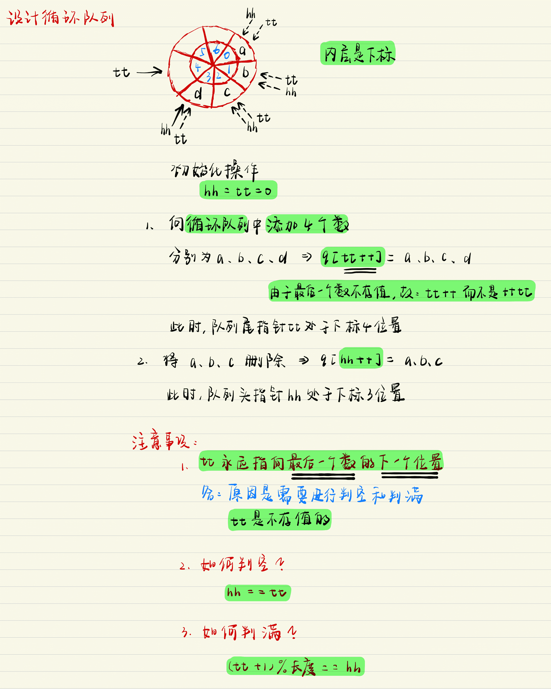


**代ç **

```c++
class MyCircularQueue {
public:
    int hh = 0, tt = 0;
    vector<int> q;
    MyCircularQueue(int k) {
        // 因为tt所在的ä½ç½®, ä¸å­˜å‚¨æ•°å­—, 故长度为n, 则需è¦å¼€é•¿åº¦ä¸ºn + 1的数组
        q.resize(k + 1);
    }
    
    bool enQueue(int value) {
        if (isFull()) return false;
        // 注æ„: 这里使用tt ++, åŸå› : tt所指的ä½ç½®ä¸ºç©º, ä¸å¡«å†™ä»»ä½•æ•°
        q[tt ++ ] = value;
        // 越界, 则ä»å¤´å¼€å§‹
        if (tt >= q.size()) tt = 0;
        return true;
    }
    
    bool deQueue() {
        if (isEmpty()) return false;
        hh ++;
        // 越界, 则ä»å¤´å¼€å§‹
        if (hh >= q.size()) hh = 0;
        return true; 
    }
    
    int Front() {
        if (isEmpty()) return -1;
        return q[hh];
    }
    
    int Rear() {
        if (isEmpty()) return -1;
        // 注æ„: tt - 1å¯èƒ½å°äº0, æ•…, 需è¦å…ˆâ•q.size(), å†%q.size()
        return q[(tt - 1 + q.size()) % q.size()];
    }
    
    bool isEmpty() {
        return hh == tt;
    }
    
    bool isFull() {
        return (tt + 1) % q.size() == hh;
    }
};

/**
 * Your MyCircularQueue object will be instantiated and called as such:
 * MyCircularQueue* obj = new MyCircularQueue(k);
 * bool param_1 = obj->enQueue(value);
 * bool param_2 = obj->deQueue();
 * int param_3 = obj->Front();
 * int param_4 = obj->Rear();
 * bool param_5 = obj->isEmpty();
 * bool param_6 = obj->isFull();
 */
```

**时间å¤æ‚度**

$O(n)$

**空间å¤æ‚度**

$O(n)$

**标签**

`循ç¯é˜Ÿåˆ—`

**ç¼åˆæ€ª**


### 滑动窗å£ã€åŒç«¯é˜Ÿåˆ—】

#### [LeetCode 5977. 最少交æ¢æ¬¡æ•°æ¥ç»„åˆæ‰€æœ‰çš„ 1 II](https://leetcode-cn.com/problems/minimum-swaps-to-group-all-1s-together-ii/)

**题目æè¿°**

> äº¤æ¢ å®šä¹‰ä¸ºé€‰ä¸­ä¸€ä¸ªæ•°ç»„ä¸­çš„ä¸¤ä¸ª 互ä¸ç›¸åŒ çš„ä½ç½®å¹¶äº¤æ¢äºŒè€…的值。
>
> ç¯å½¢ 数组是一个数组，å¯ä»¥è®¤ä¸º 第一个 元素和 最å一个 元素 相邻 。
>
> 给你一个 二进制ç¯å½¢ 数组 `nums` ，返å›åœ¨ ä»»æ„ä½ç½® 将数组中的所有 `1` èšé›†åœ¨ä¸€èµ·éœ€è¦çš„最少交æ¢æ¬¡æ•°ã€‚

**示例 1**

> 输入：`nums = [0,1,0,1,1,0,0]`
> 输出：`1`
> 解释：这里列出一些能够将所有 1 èšé›†åœ¨ä¸€èµ·çš„方案：
> `[0,0,1,1,1,0,0]` äº¤æ¢ `1` 次。
> `[0,1,1,1,0,0,0]` äº¤æ¢ `1` 次。
> `[1,1,0,0,0,0,1]` äº¤æ¢ `2` 次（利用数组的ç¯å½¢ç‰¹æ€§ï¼‰ã€‚
> æ— æ³•åœ¨äº¤æ¢ `0` 次的情况下将数组中的所有 `1` èšé›†åœ¨ä¸€èµ·ã€‚
> 因此，需è¦çš„最少交æ¢æ¬¡æ•°ä¸º `1` 。

**示例 2**

> 输入：`nums = [0,1,1,1,0,0,1,1,0]`
> 输出：`2`
> 解释：这里列出一些能够将所有 `1` èšé›†åœ¨ä¸€èµ·çš„方案：
> `[1,1,1,0,0,0,0,1,1]` äº¤æ¢ `2` 次（利用数组的ç¯å½¢ç‰¹æ€§ï¼‰ã€‚
> `[1,1,1,1,1,0,0,0,0]` äº¤æ¢ `2` 次。
> æ— æ³•åœ¨äº¤æ¢ `0` 次或 `1` 次的情况下将数组中的所有 `1` èšé›†åœ¨ä¸€èµ·ã€‚
> 因此，需è¦çš„最少交æ¢æ¬¡æ•°ä¸º `2` 。

**示例 3**

> 输入：`nums = [1,1,0,0,1]`
> 输出：`0`
> 解释：得益äºæ•°ç»„çš„ç¯å½¢ç‰¹æ€§ï¼Œæ‰€æœ‰çš„ `1` å·²ç»èšé›†åœ¨ä¸€èµ·ã€‚
> 因此，需è¦çš„最少交æ¢æ¬¡æ•°ä¸º `0` 。

**æ示**

> $1\;\leq\;nums.length\;\leq\;10^5$
> `nums[i]` 为 `0` 或者 `1`

**题解**

> 1. 统计出 `1` 的个数，作为滑动窗å£çš„大å°
> 2. 将数组å¤åˆ¶ä¸€é，目的是断ç¯æˆé“¾
> 3. 答案å³ä¸ºçª—å£å†… `0` 的最å°ä¸ªæ•°

**代ç **

```c++
class Solution {
public:
    int minSwaps(vector<int>& nums) {
        // 滑动窗å£
        // 第一步：统计 1 的个数 作为窗å£çš„大å°
        int cnt = 0;
        for (auto& num : nums) cnt += num;
        // 第二步：断ç¯æˆé“¾
        nums.insert(nums.begin(), nums.begin(), nums.end());
        int res = INT_MAX, tmp = 0;
        for (int i = 0, j = 0; i < nums.size(); i ++ ) {
            if (i + 1 > cnt) tmp -= nums[j ++];
            // tmp 统计的是窗å£å†… 1 的个数
            tmp += nums[i];
            res = min(res, cnt - tmp);
        }
        return res;
    }
};
```

 **标签**

`滑动窗å£`ã€`åŒç«¯é˜Ÿåˆ—`ã€`ç¯`

#### [LeetCode 239. 滑动窗å£æœ€å¤§å€¼](https://leetcode-cn.com/problems/sliding-window-maximum/)

**题目æè¿°**

> 给你一个整数数组 `nums`，有一个大å°ä¸º `k` 的滑动窗å£ä»æ•°ç»„的最左侧移动到数组的最å³ä¾§ã€‚ä½ åªå¯ä»¥çœ‹åˆ°åœ¨æ»‘动窗å£å†…çš„ `k` 个数字。滑动窗å£æ¯æ¬¡åªå‘å³ç§»åŠ¨ä¸€ä½ã€‚
>
> è¿”å›æ»‘动窗å£ä¸­çš„最大值。

**示例 1**

> 输入：`nums = [1,3,-1,-3,5,3,6,7], k = 3`
> 输出：`[3,3,5,5,6,7]`
> 解释：
> 滑动窗å£çš„ä½ç½®                            最大值
>
> ---------------               -----
>
> `[1  3  -1] -3  5  3  6  7       3
> 1 [3  -1  -3] 5  3  6  7       3
> 1  3 [-1  -3  5] 3  6  7       5
> 1  3  -1 [-3  5  3] 6  7       5
> 1  3  -1  -3 [5  3  6] 7       6
> 1  3  -1  -3  5 [3  6  7]      7`

**示例 2**

> 输入：`nums = [1], k = 1`
> 输出：`[1]`

**示例 3**

> 输入：`nums = [1,-1], k = 1`
> 输出：`[1,-1]`

**示例 4**

> 输入：`nums = [9,11], k = 2`
> 输出：`[11]`

**示例 5**

> 输入：`nums = [4,-2], k = 2`
> 输出：`[4]`

**æ示**

> + $1 <= nums.length <= 10^5$
> + $-10^4 <= nums[i] <= 10^4$
> + $1 <= k <= nums.length$

**题解**

> 1. <font style="color: red">**è®°ä½ï¼Œå•è°ƒé˜Ÿåˆ—是åŒç«¯é˜Ÿåˆ—å³å¯**</font>

**代ç **

```c++
class Solution {
public:
    vector<int> maxSlidingWindow(vector<int>& g, int k) {
        deque<int> dq;
        vector<int> res;
        for (int i = 0; i < g.size(); i ++ ) {
            if (dq.size() && i - dq.front() + 1 > k) dq.pop_front();
            while (dq.size() && g[i] >= g[dq.back()]) dq.pop_back();
            dq.push_back(i);
            if (i >= k - 1) res.push_back(g[dq.front()]);
        }
        return res;
    }
};
```

**标签**

`滑动窗å£`

## end

## end

# 堆专题

## 手写堆

### [AcWing 839. 模拟堆](https://www.acwing.com/problem/content/841/)

**题目æè¿°**

> 维护一个集åˆï¼Œåˆå§‹æ—¶é›†åˆä¸ºç©ºï¼Œæ”¯æŒå¦‚下几ç§æ“作：
>
> 1. `I x`，æ’入一个数 `x`ï¼›
> 2. `PM`，输出当å‰é›†åˆä¸­çš„最å°å€¼ï¼›
> 3. `DM`，删除当å‰é›†åˆä¸­çš„最å°å€¼ï¼ˆæ•°æ®ä¿è¯æ­¤æ—¶çš„最å°å€¼å”¯ä¸€ï¼‰ï¼›
> 4. `D k`，删除第 `k` 个æ’入的数；
> 5. `C k x`，修改第 `k` 个æ’入的数，将其å˜ä¸º `x`ï¼›
>
> ç°åœ¨è¦è¿›è¡Œ `N` 次æ“作，对äºæ‰€æœ‰ç¬¬ `2` 个æ“作，输出当å‰é›†åˆçš„最å°å€¼ã€‚

**输入格å¼**

> 第一行包å«æ•´æ•° `N`。
>
> æ¥ä¸‹æ¥ `N` 行，æ¯è¡ŒåŒ…å«ä¸€ä¸ªæ“作指令，æ“作指令为 `I x`，`PM`，`DM`，`D k` 或 `C k x` 中的一ç§ã€‚

**输出格å¼**

> 对äºæ¯ä¸ªè¾“出指令 `PM`，输出一个结æœï¼Œè¡¨ç¤ºå½“å‰é›†åˆä¸­çš„最å°å€¼ã€‚
>
> æ¯ä¸ªç»“æœå ä¸€è¡Œã€‚

**æ•°æ®èŒƒå›´**

> + $1 ≤ N ≤ 10^5$
> + $−10^9 ≤ x ≤ 10^9$
> + $æ•°æ®ä¿è¯åˆæ³•ã€‚$

**输入样例**

```c++
8
I -10
PM
I -10
D 1
C 2 8
I 6
PM
DM
```

**输出样例**

```c++
-10
6
```

**手写稿**

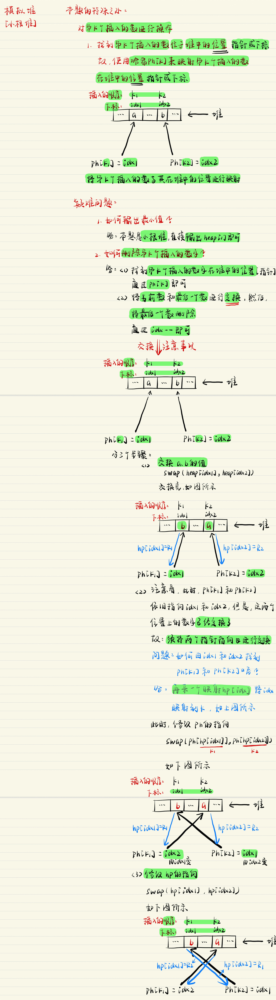

**代ç **

```c++
#include <iostream>
#include <cstring>
using namespace std;
const int N = 100010;
int n, idx, num;
char op[2];
int ph[N], hp[N], heap[N];
void heap_swap(int a, int b) {
    // 手写稿说æ˜
    swap(heap[a], heap[b]);
    swap(ph[hp[a]], ph[hp[b]]);
    swap(hp[a], hp[b]);
    return;
}
// 模æ¿
void up(int u) {
    if (u / 2 && heap[u] < heap[u / 2]) {
        heap_swap(u, u / 2);
        up(u / 2);
    }
    return;
}
// 模æ¿
void down(int u) {
    int t = u;
    if (u * 2 <= idx && heap[t] > heap[u * 2]) t = u * 2;
    if (u * 2 + 1 <= idx && heap[t] > heap[u * 2 + 1]) t = u * 2 + 1;
    if (t != u) {
        heap_swap(t, u);
        down(t);
    }
    return;
}
int main() {
    scanf("%d", &n);
    for (int i = 0; i < n; i ++ ) {
        scanf("%s", op);
        int k, x;
        if (!strcmp(op, "I")) {
            scanf("%d", &x);
            // å †æ’åºä¸‹æ ‡ä»1开始
            ph[++ num] = ++idx;
            hp[idx] = num;
            heap[idx] = x;
            up(idx);
        }
        else if (!strcmp(op, "PM")) cout << heap[1] << endl;
        else if (!strcmp(op, "DM")) {
            heap_swap(1, idx --);
            down(1);
        }
        else if (!strcmp(op, "D")) {
            scanf("%d", &k);
            // è·å–第k个输入的数字在堆中的下标[指针]
            k = ph[k];
            // 删除第k个数字
            // 分两步[手写稿]
            heap_swap(k, idx --);
            // ç”±äºä¸ç¡®å®šæ–°æ¢æ¥çš„数是大是å°, å› æ­¤, up一édown一é
            up(k);
            down(k);
        }
        else {
            scanf("%d%d", &k, &x);
            // è·å–第k个输入的数字在堆中的下标[指针]
            k = ph[k];
            // 修改第k个数字
            heap[k] = x;
            // ç”±äºä¸ç¡®å®šæ–°æ¢æ¥çš„数是大是å°, å› æ­¤, up一édown一é
            up(k);
            down(k);
        }
    }
    return 0;
}
```

**时间å¤æ‚度**

$O(nlog_n)$

**空间å¤æ‚度**

$O(n)$

**标签**

`å †`ã€`手写堆`

**ç¼åˆæ€ª**


## 对顶堆

### [LeetCode 295. æ•°æ®æµçš„中ä½æ•°](https://leetcode-cn.com/problems/find-median-from-data-stream/)

**题目æè¿°**

> 中ä½æ•°æ˜¯æœ‰åºåˆ—表中间的数。如æœåˆ—表长度是å¶æ•°ï¼Œä¸­ä½æ•°åˆ™æ˜¯ä¸­é—´ä¸¤ä¸ªæ•°çš„å¹³å‡å€¼ã€‚
>
> 例如，
>
> `[2,3,4]` 的中ä½æ•°æ˜¯ `3`
>
> `[2,3]` 的中ä½æ•°æ˜¯ `(2 + 3) / 2 = 2.5`
>
> 设计一个支æŒä»¥ä¸‹ä¸¤ç§æ“作的数æ®ç»“æ„：
>
> `void addNum(int num)` - ä»æ•°æ®æµä¸­æ·»åŠ ä¸€ä¸ªæ•´æ•°åˆ°æ•°æ®ç»“æ„中。
> `double findMedian()` - è¿”å›ç›®å‰æ‰€æœ‰å…ƒç´ çš„中ä½æ•°ã€‚

**示例**

> `addNum(1)`
> `addNum(2)`
> `findMedian() -> 1.5`
> `addNum(3) `
> `findMedian() -> 2`

**进阶**

> 如æœæ•°æ®æµä¸­æ‰€æœ‰æ•´æ•°éƒ½åœ¨ `0` 到 `100` 范围内，你将如何优化你的算法？
> 如æœæ•°æ®æµä¸­ `99%` 的整数都在 `0` 到 `100` 范围内，你将如何优化你的算法？

**手写稿**

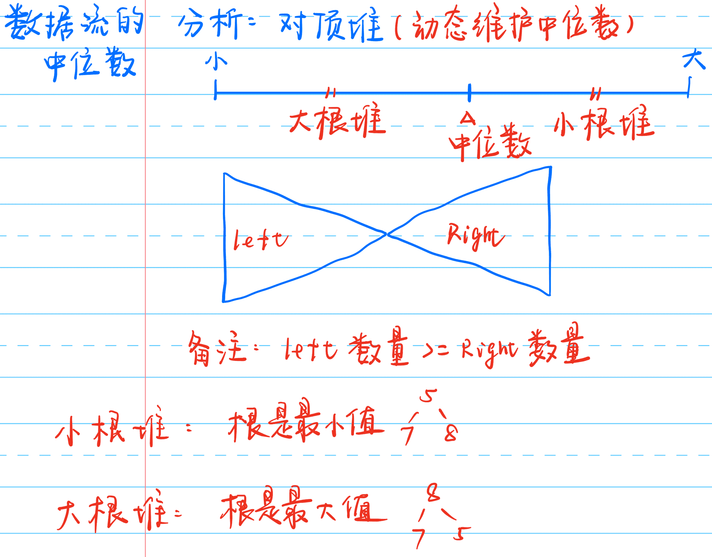

**记忆技巧**

> **大根堆**
>
> > 1. 记忆技巧：大根堆å³ä¸ºæŠŠ<font style="color:red">**å°äºç­‰äº(`less`)**</font>当å‰æ•°çš„数字往下按
> > 2. 定义：`priority_queue<int, vector<int>> q;`
>
> **å°æ ¹å †**
>
> > 1. 记忆技巧：å°æ ¹å †å³ä¸ºæŠŠ<font style="color:red">**大äºç­‰äº(`greater`)**</font>当å‰æ•°çš„数字往下按
> > 2. 定义：`priority_queue<int, vector<int>, greater<int>> q;`

**代ç **

```c++
class MedianFinder {
public:
    // 大根堆
    priority_queue<int, vector<int>> left;
    // å°æ ¹å †
    priority_queue<int, vector<int>, greater<int>> right;
    MedianFinder() {}
    
    void addNum(int num) {
        if (left.empty() || num <= left.top()) {
            left.push(num);
            // 左边添加完数æ®ä¹‹å，如æœå‡ºç°å·¦è¾¹å…ƒç´ çš„个数大äºå³è¾¹å…ƒç´ çš„个数 + 1
            // 因为ä¿è¯å·¦è¾¹å…ƒç´ çš„æ•°é‡ç­‰äºå³è¾¹å…ƒç´ çš„æ•°é‡æˆ–者等äºå³è¾¹å…ƒç´ çš„æ•°é‡ + 1
            // 则说æ˜éœ€è¦è¿›è¡Œè°ƒæ•´ï¼Œè°ƒæ•´å³å¯
            if (left.size() > right.size() + 1) right.push(left.top()), left.pop();
        }
        else {
            right.push(num);
            // åŒç†
            if (right.size() > left.size()) left.push(right.top()), right.pop();
        }
        return;
    }
    
    double findMedian() {
        if (left.size() + right.size() & 1) return left.top();
        return (left.top() + right.top()) / 2.0;
    }
};

/**
 * Your MedianFinder object will be instantiated and called as such:
 * MedianFinder* obj = new MedianFinder();
 * obj->addNum(num);
 * double param_2 = obj->findMedian();
 */
```

**标签**

`优先队列`ã€`对顶堆`

## 二å‰å †

### [AcWing 148. åˆå¹¶æœå­](https://www.acwing.com/problem/content/150/)

**题目æè¿°**

>   在一个æœå›­é‡Œï¼Œè¾¾è¾¾å·²ç»å°†æ‰€æœ‰çš„æœå­æ‰“了下æ¥ï¼Œè€Œä¸”按æœå­çš„ä¸åŒç§ç±»åˆ†æˆäº†ä¸åŒçš„堆。
>
>   达达决定把所有的æœå­åˆæˆä¸€å †ã€‚
>
>   æ¯ä¸€æ¬¡åˆå¹¶ï¼Œè¾¾è¾¾å¯ä»¥æŠŠä¸¤å †æœå­åˆå¹¶åˆ°ä¸€èµ·ï¼Œæ¶ˆè€—的体力等äºä¸¤å †æœå­çš„é‡é‡ä¹‹å’Œã€‚
>
>   å¯ä»¥çœ‹å‡ºï¼Œæ‰€æœ‰çš„æœå­ç»è¿‡ `n−1` 次åˆå¹¶ä¹‹å，就åªå‰©ä¸‹ä¸€å †äº†ã€‚
>
>   达达在åˆå¹¶æœå­æ—¶æ€»å…±æ¶ˆè€—的体力等äºæ¯æ¬¡åˆå¹¶æ‰€è€—体力之和。
>
>   因为还è¦èŠ±å¤§åŠ›æ°”把这些æœå­æ¬å›å®¶ï¼Œæ‰€ä»¥è¾¾è¾¾åœ¨åˆå¹¶æœå­æ—¶è¦å°½å¯èƒ½åœ°èŠ‚çœä½“力。
>
>   å‡å®šæ¯ä¸ªæœå­é‡é‡éƒ½ä¸º `1`，并且已知æœå­çš„ç§ç±»æ•°å’Œæ¯ç§æœå­çš„数目，你的任务是设计出åˆå¹¶çš„次åºæ–¹æ¡ˆï¼Œä½¿è¾¾è¾¾è€—费的体力最少，并输出这个最å°çš„体力耗费值。
>
>   例如有 `3` ç§æœå­ï¼Œæ•°ç›®ä¾æ¬¡ä¸º `1，2，9`。
>
>   å¯ä»¥å…ˆå°† `1ã€2` å †åˆå¹¶ï¼Œæ–°å †æ•°ç›®ä¸º `3`，耗费体力为 `3`。
>
>   æ¥ç€ï¼Œå°†æ–°å †ä¸åŸå…ˆçš„第三堆åˆå¹¶ï¼Œåˆå¾—到新的堆，数目为 `12`，耗费体力为 `12`。
>
>   所以达达总共耗费体力`=3+12=15`。
>
>   å¯ä»¥è¯æ˜ `15` 为最å°çš„体力耗费值。

**输入格å¼**

>   输入包括两行，第一行是一个整数 `n`，表示æœå­çš„ç§ç±»æ•°ã€‚
>
>   ç¬¬äºŒè¡ŒåŒ…å« `n` 个整数，用空格分隔，第 `i` 个整数 $a_i$ 是第 `i` ç§æœå­çš„数目。

**输出格å¼**

>   输出包括一行，这一行åªåŒ…å«ä¸€ä¸ªæ•´æ•°ï¼Œä¹Ÿå°±æ˜¯æœ€å°çš„体力耗费值。
>
>   输入数æ®ä¿è¯è¿™ä¸ªå€¼å°äº $2^{31}$。

**æ•°æ®èŒƒå›´**

>   +   $1≤n≤10000$,
>   +   $1≤a_i≤20000$

**输入样例**

```c++
3 
1 2 9 
```

**输出样例**

```c++
15
```

**手写稿**

>   1.   æ¯æ¬¡é€‰æ‹©è€—费体力最å°çš„两个æœå­è¿›è¡Œåˆå¹¶å³å¯ï¼Œä½¿ç”¨ `res` 计算总的耗费体力之和
>        +   选择耗费体力最å°çš„两个æœå­ä½¿ç”¨å †ï¼ˆä¼˜å…ˆé˜Ÿåˆ—）å³å¯
>        +   æ¯æ¬¡å°†åˆå¹¶å®Œçš„æœå­å†æ¬¡æ”¾è¿›å †é‡Œå³å¯

**代ç **

```c++
#include <iostream>
#include <queue>
using namespace std;
int n;
priority_queue<int, vector<int>, greater<int>> heap;
int main() {
    scanf("%d", &n);
    for (int i = 0, x; i < n; i ++ ) {
        scanf("%d", &x);
        heap.push(x);
    }
    int res = 0;
    while (heap.size() > 1) {
        // 选择耗费体力最å°çš„两个æœå­aå’Œb
        int a = heap.top(); heap.pop();
        int b = heap.top(); heap.pop();
        // 将新的æœå­æ”¾è¿›å †é‡Œé¢
        heap.push(a + b);
        res += a + b;
    }
    cout << res << endl;
    return 0;
}
```

**标签**

`二å‰å †`ã€`哈夫曼树`ã€`优先队列`

## `n` å‰å †

### [AcWing 149. è·é©¬å²è¯—](https://www.acwing.com/problem/content/description/151/)

>   追é€å½±å­çš„人，自己就是影å­ã€‚ ——è·é©¬
>
>   达达最近迷上了文学。
>
>   她喜欢在一个慵懒的åˆå，细细地å“上一æ¯å¡å¸ƒå¥‡è¯ºï¼Œé™é™åœ°é˜…读她爱ä¸é‡Šæ‰‹çš„《è·é©¬å²è¯—》。
>
>   但是由《奥德赛》和《伊利亚特》组æˆçš„鸿篇巨制《è·é©¬å²è¯—》å®åœ¨æ˜¯å¤ªé•¿äº†ï¼Œè¾¾è¾¾æƒ³é€šè¿‡ä¸€ç§ç¼–ç æ–¹å¼ä½¿å¾—它å˜å¾—短一些。
>
>   一部《è·é©¬å²è¯—》中有 `n` ç§ä¸åŒçš„å•è¯ï¼Œä» `1` 到 `n` 进行编å·ã€‚其中第 `i` ç§å•è¯å‡ºç°çš„总次数为 $w_i$。
>
>   达达想è¦ç”¨ `k` 进制串 $s_i$ æ¥æ›¿æ¢ç¬¬ `i` ç§å•è¯ï¼Œä½¿å¾—其满足如下è¦æ±‚:
>
>   对äºä»»æ„çš„ $1≤i,j≤n，i≠j$，都有：$s_i$ ä¸æ˜¯ $s_j$ çš„å‰ç¼€ã€‚
>
>   ç°åœ¨è¾¾è¾¾æƒ³è¦çŸ¥é“，如何选择 $s_i$，æ‰èƒ½ä½¿æ›¿æ¢ä»¥å得到的新的《è·é©¬å²è¯—》长度最å°ã€‚
>
>   在确ä¿æ€»é•¿åº¦æœ€å°çš„情况下，达达还想知é“最长的 $s_i$ 的最短长度是多少？
>
>   一个字符串被称为 `k` 进制字符串，当且仅当它的æ¯ä¸ªå­—符是 `0` 到 `k−1` 之间（包括 `0` å’Œ `k−1`）的整数。
>
>   字符串 `Str1` 被称为字符串 `Str2` çš„å‰ç¼€ï¼Œå½“且仅当：存在 `1≤t≤m`，使得 `Str1=Str2[1..t]`。
>
>   其中，`m` 是字符串 `Str2` 的长度，`Str2[1..t]` 表示 `Str2` çš„å‰ `t` 个字符组æˆçš„字符串。
>
>   **注æ„**:请使用 `64` ä½æ•´æ•°è¿›è¡Œè¾“入输出ã€å‚¨å­˜å’Œè®¡ç®—。

**输入格å¼**

>   输入文件的第 `1` è¡ŒåŒ…å« `2` 个正整数 `n,k`，中间用å•ä¸ªç©ºæ ¼éš”开，表示共有 `n` ç§å•è¯ï¼Œéœ€è¦ä½¿ç”¨ `k` 进制字符串进行替æ¢ã€‚
>
>   第 `2∼n+1` 行：第 `i+1` è¡ŒåŒ…å« `1` 个éè´Ÿæ•´æ•° $w_i$，表示第 $i$ ç§å•è¯çš„出ç°æ¬¡æ•°ã€‚

**输出格å¼**

>   输出文件包括 `2` 行。
>
>   第 `1` 行输出 `1` 个整数，为《è·é©¬å²è¯—》ç»è¿‡é‡æ–°ç¼–ç ä»¥å的最短长度。
>
>   第 `2` 行输出 `1` 个整数，为ä¿è¯æœ€çŸ­æ€»é•¿åº¦çš„情况下，最长字符串 $s_i$ 的最短长度。

**æ•°æ®èŒƒå›´**

>   +   $2≤n≤100000,$
>   +   $2≤k≤9$
>   +   $1≤wi≤10^{12}$

**输入样例**

```c++
4 2
1
1
2
2
```

**输出样例**

```c++
12
2
```

**手写稿**

>   1.   优先级队列的元素类å‹æ˜¯å¤åˆç±»å‹ï¼Œå¦‚ `pair`
>
>        默认情况下，æ’åºè§„则是先按照 `pair` çš„ `first` çš„å±æ€§é™åºæ’åˆ—ï¼Œå¦‚æœ `first` 相等，则按照 `second`å±æ€§é™åºæ’åº
>
>        åŒç†ï¼Œä¼ å…¥`std::greator` å，æ’åºè§„则是先按照 `pair` çš„ `first` çš„å±æ€§å‡åºæ’åˆ—ï¼Œå¦‚æœ `first` 相等，则按照 `second` å±æ€§å‡åºæ’列
>
>   2.   哈夫曼编ç å‰ç½®çŸ¥è¯†
>
>        
>
>   3.   本题步骤分æ
>
>        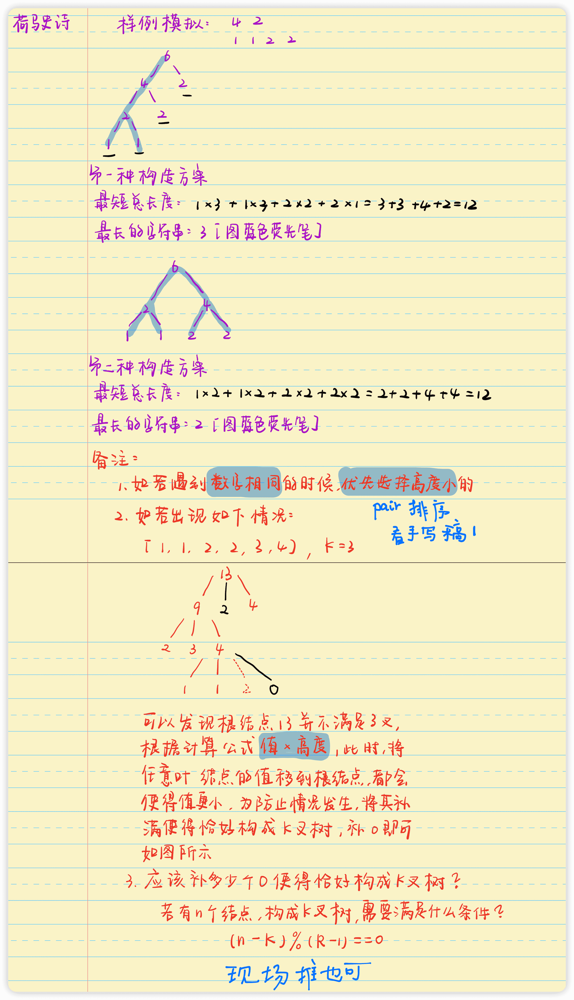

**代ç **

```c++
#include <iostream>
#include <queue>
using namespace std;
typedef long long LL;
typedef pair<LL, int> PLI;
const int N = 100010;
int n, k;
// å°æ ¹å †
priority_queue<PLI, vector<PLI>, greater<PLI>> heap;
int main() {
    scanf("%d%d", &n, &k);
    for (int i = 0; i < n; i ++ ) {
        LL x;
        scanf("%lld", &x);
        // 第一个å‚数存值
        // 第二个å‚数存高度ã€æ·±åº¦ã€‘
        heap.push({x, 0});
    }
    // 如æœä¸æ»¡è¶³nå‰æ ‘，则将其补满nå‰æ ‘
    while ((n - k) % (k - 1)) heap.push({0, 0}), n ++;
    // 记录答案
    LL res = 0;
    while (heap.size() > 1) {
        // 记录kå‰æ ‘åˆå¹¶ä¹‹åçš„å’Œ
        LL sum = 0;
        // 记录最大深度
        int depth = 0;
        for (int i = 0; i < k; i ++ ) {
            auto t = heap.top(); heap.pop();
            sum += t.first;
            // 记录最大深度
            depth = max(depth, t.second);
        }
        // 加上答案
        res += sum;
        // 深度+1，因为父节点深度等äºå­èŠ‚点深度+1
        heap.push({sum, depth + 1});
    }
    cout << res << endl << heap.top().second << endl;
    return 0;
}
```

**标签**

`nå‰å †`ã€`å°æ ¹å †`ã€`哈夫曼树`ã€`哈夫曼编ç `

# 链表专题

## [AcWing 826. å•é“¾è¡¨](https://www.acwing.com/problem/content/828/)

**题目æè¿°**

>   å®ç°ä¸€ä¸ªå•é“¾è¡¨ï¼Œé“¾è¡¨åˆå§‹ä¸ºç©ºï¼Œæ”¯æŒä¸‰ç§æ“作：
>
>   1.  å‘链表头æ’入一个数；
>   2.  删除第 `k` 个æ’入的数åé¢çš„æ•°ï¼›
>   3.  在第 `k` 个æ’入的数åæ’入一个数。
>
>   ç°åœ¨è¦å¯¹è¯¥é“¾è¡¨è¿›è¡Œ `M` 次æ“作，进行完所有æ“作å，ä»å¤´åˆ°å°¾è¾“出整个链表。
>
>   **注æ„**:题目中第 `k` 个æ’入的数并ä¸æ˜¯æŒ‡å½“å‰é“¾è¡¨çš„第 `k` 个数。例如æ“作过程中一共æ’入了 `n` 个数，则按照æ’入的时间顺åºï¼Œè¿™ `n` 个数ä¾æ¬¡ä¸ºï¼šç¬¬ `1` 个æ’入的数，第 `2` 个æ’入的数，…第 `n` 个æ’入的数。

**输入格å¼**

>   第一行包å«æ•´æ•° `M`，表示æ“作次数。
>
>   æ¥ä¸‹æ¥ `M` 行，æ¯è¡ŒåŒ…å«ä¸€ä¸ªæ“作命令，æ“作命令å¯èƒ½ä¸ºä»¥ä¸‹å‡ ç§ï¼š
>
>   1.  `H x`，表示å‘链表头æ’入一个数 `x`。
>   2.  `D k`，表示删除第 `k` 个æ’入的数åé¢çš„数（当 `k` 为 `0` 时，表示删除头结点）。
>   3.  `I k x`，表示在第 `k` 个æ’入的数åé¢æ’入一个数 `x`（此æ“作中 `k` å‡å¤§äº `0`）。

**输出格å¼**

>   共一行，将整个链表ä»å¤´åˆ°å°¾è¾“出。

**æ•°æ®èŒƒå›´**

>   +   $1 ≤ M ≤ 100000$
>   +   $所有æ“作ä¿è¯åˆæ³•ã€‚$

**输入样例**

```c++
10
H 9
I 1 1
D 1
D 0
H 6
I 3 6
I 4 5
I 4 5
I 3 4
D 6
```

**输出样例**

```c++
6 4 6 5
```

**手写稿**


**代ç **


**时间å¤æ‚度**


**空间å¤æ‚度**


**标签**


**ç¼åˆæ€ª**


## [AcWing 827. åŒé“¾è¡¨](https://www.acwing.com/problem/content/829/)

**题目æè¿°**

> å®ç°ä¸€ä¸ªåŒé“¾è¡¨ï¼ŒåŒé“¾è¡¨åˆå§‹ä¸ºç©ºï¼Œæ”¯æŒ `5` ç§æ“作：
>
> 1. 在最左侧æ’入一个数；
> 2. 在最å³ä¾§æ’入一个数；
> 3. 将第 `k` 个æ’入的数删除；
> 4. 在第 `k` 个æ’入的数左侧æ’入一个数；
> 5. 在第 `k` 个æ’入的数å³ä¾§æ’入一个数
>
> ç°åœ¨è¦å¯¹è¯¥é“¾è¡¨è¿›è¡Œ `M` 次æ“作，进行完所有æ“作å，ä»å·¦åˆ°å³è¾“出整个链表。
>
> **注æ„**:题目中第 `k` 个æ’入的数并ä¸æ˜¯æŒ‡å½“å‰é“¾è¡¨çš„第 `k` 个数。例如æ“作过程中一共æ’入了 `n` 个数，则按照æ’入的时间顺åºï¼Œè¿™ `n` 个数ä¾æ¬¡ä¸ºï¼šç¬¬ `1` 个æ’入的数，第 `2` 个æ’入的数，…第 `n` 个æ’入的数。

**输入格å¼**

> 第一行包å«æ•´æ•° `M`，表示æ“作次数。
>
> æ¥ä¸‹æ¥ `M` 行，æ¯è¡ŒåŒ…å«ä¸€ä¸ªæ“作命令，æ“作命令å¯èƒ½ä¸ºä»¥ä¸‹å‡ ç§ï¼š
>
> 1. `L x`，表示在链表的最左端æ’入数 `x`。
> 2. `R x`，表示在链表的最å³ç«¯æ’入数 `x`。
> 3. `D k`，表示将第 `k` 个æ’入的数删除。
> 4. `IL k x`，表示在第 `k` 个æ’入的数左侧æ’入一个数。
> 5. `IR k x`，表示在第 `k` 个æ’入的数å³ä¾§æ’入一个数。

**输出格å¼**

> 共一行，将整个链表ä»å·¦åˆ°å³è¾“出。

**æ•°æ®èŒƒå›´**

> + $1≤M≤100000$
> + $所有æ“作ä¿è¯åˆæ³•ã€‚$

**输入样例**

```c++
10
R 7
D 1
L 3
IL 2 10
D 3
IL 2 7
L 8
R 9
IL 4 7
IR 2 2
```

**输出样例**

```c++
8 7 7 3 2 9
```

**手写稿**


**代ç **

```c++
#include <iostream>
#include <cstring>
using namespace std;
const int N = 100010;
int n, idx;
char op[2];
int l[N], r[N], e[N];
// 手写稿说æ˜
void init() {
    r[0] = 1, l[1] = 0;
    idx = 2;
    return;
}
// 手写稿说æ˜
void insert(int k, int x) {
    e[idx] = x;
    r[idx] = r[k];
    l[r[k]] = idx;
    l[idx] = k;
    r[k] = idx ++;
    return;
}
// 手写稿说æ˜
void remove(int k) {
    r[l[k]] = r[k];
    l[r[k]] = l[k];
    return;
}
int main() {
    scanf("%d", &n);
    // åˆå§‹åŒ–
    init();
    while (n -- ) {
        scanf("%s", op);
        int k, x;
        if (!strcmp(op, "L")) {
            scanf("%d", &x);
            insert(0, x);
        }
        else if (!strcmp(op, "R")) {
            scanf("%d", &x);
            insert(l[1], x);
        }
        else if (!strcmp(op, "D")) {
            scanf("%d", &k);
            // 注æ„: 下标ä»2开始, å› æ­¤, 第k个数的指针[下标]为k + 1
            remove(k + 1);
        }
        else if (!strcmp(op, "IL")) {
            scanf("%d%d", &k, &x);
            // 注æ„: 下标ä»2开始, å› æ­¤, 第k个数的指针[下标]为k + 1
            insert(l[k + 1], x);
        }
        else {
            scanf("%d%d", &k, &x);
            // 注æ„: 下标ä»2开始, å› æ­¤, 第k个数的指针[下标]为k + 1
            insert(k + 1, x);
        }
    }
    for (int i = r[0]; i != 1; i = r[i]) cout << e[i] << " ";
    return 0;
}
```

**时间å¤æ‚度**

$O(m)$

**空间å¤æ‚度**

$O(m)$

**标签**

`数组模拟åŒé“¾è¡¨`

**ç¼åˆæ€ª**

## [SDUT 2054. åŒå‘链表](https://acm.sdut.edu.cn/onlinejudge3/problems/2054)

**问题æè¿°**

> 学会了å•å‘链表，我们åˆå¤šäº†ä¸€ç§è§£å†³é—®é¢˜çš„能力，å•é“¾è¡¨åˆ©ç”¨ä¸€ä¸ªæŒ‡é’ˆå°±èƒ½åœ¨å†…存中找到下一个ä½ç½®ï¼Œè¿™æ˜¯ä¸€ä¸ªä¸ä¼šè½»æ˜“断裂的链。但å•é“¾è¡¨æœ‰ä¸€ä¸ªå¼±ç‚¹â€”—ä¸èƒ½å›æŒ‡ã€‚比如在链表中有两个节点A,B，他们的关系是B是Açš„å继，A指å‘了B，便能轻易ç»A找到B,但ä»Bå´ä¸èƒ½æ‰¾åˆ°A。一个简å•çš„想法便能轻易解决这个问题——建立åŒå‘链表。在åŒå‘链表中，A有一个指针指å‘了节点B，åŒæ—¶ï¼ŒBåˆæœ‰ä¸€ä¸ªæŒ‡å‘A的指针。这样ä¸ä»…能ä»é“¾è¡¨å¤´èŠ‚点的ä½ç½®éå†æ•´ä¸ªé“¾è¡¨æ‰€æœ‰èŠ‚点，也能ä»é“¾è¡¨å°¾èŠ‚点开始éå†æ‰€æœ‰èŠ‚点。对äºç»™å®šçš„一列数æ®ï¼ŒæŒ‰ç…§ç»™å®šçš„顺åºå»ºç«‹åŒå‘链表，按照关键字找到相应节点，输出此节点的å‰é©±èŠ‚点关键字åŠå继节点关键字。

**输入格å¼**

> 第一行两个正整数n（代表节点个数），m（代表è¦æ‰¾çš„关键字的个数）。第二行是n个数（n个数没有é‡å¤ï¼‰ï¼Œåˆ©ç”¨è¿™n个数建立åŒå‘链表。æ¥ä¸‹æ¥æœ‰m个关键字，æ¯ä¸ªå ä¸€è¡Œã€‚

**输出格å¼**

> 对给定的æ¯ä¸ªå…³é”®å­—，输出此关键字å‰é©±èŠ‚点关键字和å继节点关键字。如æœç»™å®šçš„关键字没有å‰é©±æˆ–者å继，则ä¸è¾“出。
> 注æ„：æ¯ä¸ªç»™å®šå…³é”®å­—的输出å ä¸€è¡Œã€‚一行输出的数æ®ä¹‹é—´æœ‰ä¸€ä¸ªç©ºæ ¼ï¼Œè¡Œé¦–ã€è¡Œæœ«æ— ç©ºæ ¼ã€‚

**输入样例**

```c++
10 3
1 2 3 4 5 6 7 8 9 0
3
5
0
```

**输出样例**

```c++
2 4
4 6
9
```

**手写稿**

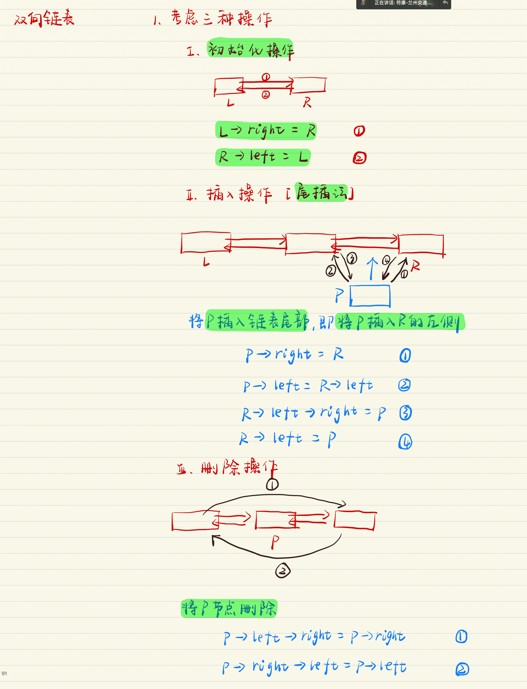

**代ç **

```c++
#include <iostream>
using namespace std;
// 定义结æ„体
struct DNode {
    int val;
    DNode *left, *right;
    DNode (int _val) : val(_val), left(NULL), right(NULL){}
}*L, *R;
int n, m;
// 手写稿
void init() {
    L = new DNode(-1);
    R = new DNode(-1);
    L -> right = R;
    R -> left = L;
    return;
}
// 手写稿
void insert(int x) {
    DNode *p = new DNode(x);
    p -> right = R;
    p -> left = R -> left;
    R -> left -> right = p;
    R -> left = p;
    return;
}
int main() {
    scanf("%d%d",&n, &m);
    init();
    for (int i = 0, x; i < n; i ++ ) {
        scanf("%d", &x);
        insert(x);
    }
    while (m -- ) {
        int x;
        scanf("%d", &x);
        for (DNode *p = L -> right; p != R; p = p -> right)
            if (p -> val == x) {
                if (p -> left != L) cout << p -> left -> val;
                if (p -> right != R) {
                  	// 注æ„æ ¼å¼[两ç§ç‰¹æ®Šæƒ…况]:
                  	// 1. åªæœ‰å‰ç¼€
                  	// 2. åªæœ‰åç¼€
                    if (p -> left != L)
                        cout << " ";
                    cout << p -> right -> val;
                }
                cout << endl;
                break;
            }
    }
    return 0;
}
```

**时间å¤æ‚度**

$O(m)$

**空间å¤æ‚度**

$O(m)$

**标签**

`åŒå‘链表`

**ç¼åˆæ€ª**


## [LeetCode 328. 奇å¶é“¾è¡¨](https://leetcode-cn.com/problems/odd-even-linked-list/)

**题目æè¿°**

> 给定å•é“¾è¡¨çš„头节点 `head` ，将所有索引为奇数的节点和索引为å¶æ•°çš„节点分别组åˆåœ¨ä¸€èµ·ï¼Œç„¶åè¿”å›é‡æ–°æ’åºçš„列表。
>
> 第一个节点的索引被认为是 奇数 ， 第二个节点的索引为 å¶æ•° ，以此类æ¨ã€‚
>
> 请注æ„，å¶æ•°ç»„和奇数组内部的相对顺åºåº”该ä¸è¾“入时ä¿æŒä¸€è‡´ã€‚
>
> 你必须在 `O(1)` çš„é¢å¤–空间å¤æ‚度和 `O(n)` 的时间å¤æ‚度下解决这个问题。

**示例 1**


> 输入: `head = [1,2,3,4,5]`
> 输出: `[1,3,5,2,4]`

**示例 2**


> 输入: `head = [2,1,3,5,6,4,7]`
> 输出: `[2,3,6,7,1,5,4]`

**æ示**

> + $n ==  链表中的节点数$
> + $0 <= n <= 10^4$
> + $-10^6 <= Node.val <= 10^6$

**手写稿**

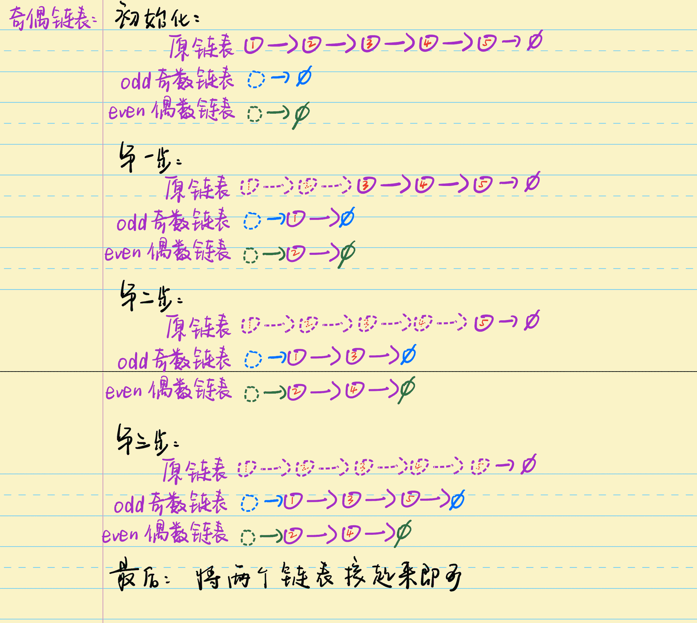

**代ç **

```c++
/**
 * Definition for singly-linked list.
 * struct ListNode {
 *     int val;
 *     ListNode *next;
 *     ListNode() : val(0), next(nullptr) {}
 *     ListNode(int x) : val(x), next(nullptr) {}
 *     ListNode(int x, ListNode *next) : val(x), next(next) {}
 * };
 */
class Solution {
public:
    ListNode* oddEvenList(ListNode* p) {
        // odd是奇数链表，even是å¶æ•°é“¾è¡¨
        auto odd = new ListNode(-1), even = new ListNode(-1);
        ListNode *a = odd, *b = even;
        while (p) {
            auto q = p -> next;
            p -> next = a -> next;
            a = a -> next = p;
            if (!q) break;
            auto r = q -> next;
            q -> next = b -> next;
            b = b -> next = q;
            p = r;
        }
        a -> next = even -> next;
        return odd -> next;
    }
};
```

**标签**

`链表`

# 设计类专题

## [LeetCode 341. æ‰å¹³åŒ–嵌套列表迭代器](https://leetcode-cn.com/problems/flatten-nested-list-iterator/)

**题目æè¿°**

>   给你一个嵌套的整数列表 `nestedList` 。æ¯ä¸ªå…ƒç´ è¦ä¹ˆæ˜¯ä¸€ä¸ªæ•´æ•°ï¼Œè¦ä¹ˆæ˜¯ä¸€ä¸ªåˆ—表；该列表的元素也å¯èƒ½æ˜¯æ•´æ•°æˆ–者是其他列表。请你å®ç°ä¸€ä¸ªè¿­ä»£å™¨å°†å…¶æ‰å¹³åŒ–，使之能够éå†è¿™ä¸ªåˆ—表中的所有整数。
>
>   å®ç°æ‰å¹³è¿­ä»£å™¨ç±» `NestedIterator` ：
>
>   +   `NestedIterator(List<NestedInteger> nestedList)` 用嵌套列表 `nestedList` åˆå§‹åŒ–迭代器。
>   +   `int next()` è¿”å›åµŒå¥—列表的下一个整数。
>   +   `boolean hasNext()` 如æœä»ç„¶å­˜åœ¨å¾…è¿­ä»£çš„æ•´æ•°ï¼Œè¿”å› `true` ï¼›å¦åˆ™ï¼Œè¿”å› `false` 。
>       你的代ç å°†ä¼šç”¨ä¸‹è¿°ä¼ªä»£ç æ£€æµ‹ï¼š
>
>   ```c++
>   initialize iterator with nestedList
>   res = []
>   while iterator.hasNext()
>       append iterator.next() to the end of res
>   return res
>   ```
>
>
>   å¦‚æœ `res` ä¸é¢„期的æ‰å¹³åŒ–列表匹é…，那么你的代ç å°†ä¼šè¢«åˆ¤ä¸ºæ­£ç¡®ã€‚

**示例 1**

>   输入：`nestedList = [[1,1],2,[1,1]]`
>   输出：`[1,1,2,1,1]`
>   解释：通过é‡å¤è°ƒç”¨ `next` 直到 `hasNext` è¿”å› `false`，`next` è¿”å›çš„元素的顺åºåº”该是: `[1,1,2,1,1]`。

**示例 2**

>   输入：`nestedList = [1,[4,[6]]]`
>   输出：`[1,4,6]`
>   解释：通过é‡å¤è°ƒç”¨ `next` 直到 `hasNext` è¿”å› `false`，`next` è¿”å›çš„元素的顺åºåº”该是: `[1,4,6]`。

**æ示**

>   +   $1 <= nestedList.length <= 500$
>   +   $嵌套列表中的整数值在范围 [-106, 106] 内$

**手写稿**

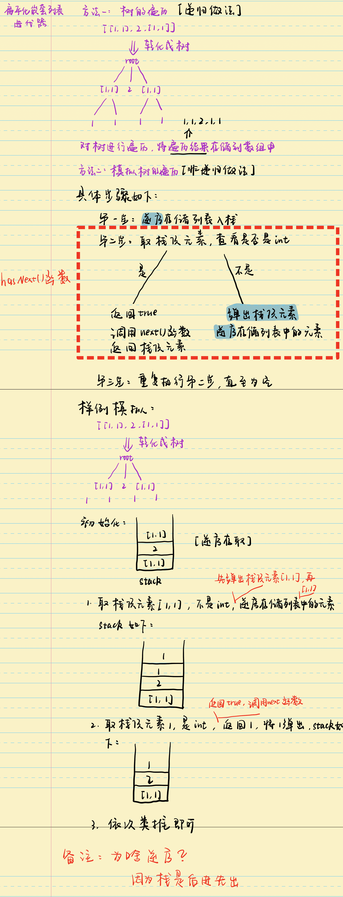

**代ç ä¸€ï¼šæ ‘çš„éå†ã€é€’归写法】**

```c++
/**
 * // This is the interface that allows for creating nested lists.
 * // You should not implement it, or speculate about its implementation
 * class NestedInteger {
 *   public:
 *     // Return true if this NestedInteger holds a single integer, rather than a nested list.
 *     bool isInteger() const;
 *
 *     // Return the single integer that this NestedInteger holds, if it holds a single integer
 *     // The result is undefined if this NestedInteger holds a nested list
 *     int getInteger() const;
 *
 *     // Return the nested list that this NestedInteger holds, if it holds a nested list
 *     // The result is undefined if this NestedInteger holds a single integer
 *     const vector<NestedInteger> &getList() const;
 * };
 */

class NestedIterator {
public:
    vector<int> q;
    int k;
    void dfs(NestedInteger& u) {
        // 如æœæ˜¯å¶å­ç»“点
        if (u.isInteger()) q.push_back(u.getInteger());
        // éå†æ ¹èŠ‚点的孩å­èŠ‚点
        else for (auto& u1 : u.getList()) dfs(u1);
        return;
    }
    NestedIterator(vector<NestedInteger> &nestedList) {
        k = 0;
        for (auto& u : nestedList) dfs(u);
    }
    
    int next() {
        return q[k ++];
    }
    
    bool hasNext() {
        return k < q.size();
    }
};

/**
 * Your NestedIterator object will be instantiated and called as such:
 * NestedIterator i(nestedList);
 * while (i.hasNext()) cout << i.next();
 */
```

**代ç äºŒï¼šè¿­ä»£**

```c++
/**
 * // This is the interface that allows for creating nested lists.
 * // You should not implement it, or speculate about its implementation
 * class NestedInteger {
 *   public:
 *     // Return true if this NestedInteger holds a single integer, rather than a nested list.
 *     bool isInteger() const;
 *
 *     // Return the single integer that this NestedInteger holds, if it holds a single integer
 *     // The result is undefined if this NestedInteger holds a nested list
 *     int getInteger() const;
 *
 *     // Return the nested list that this NestedInteger holds, if it holds a nested list
 *     // The result is undefined if this NestedInteger holds a single integer
 *     const vector<NestedInteger> &getList() const;
 * };
 */

class NestedIterator {
public:
    stack<NestedInteger> stk;
    NestedIterator(vector<NestedInteger> &nestedList) {
        for (int i = nestedList.size() - 1; i >= 0; i -- ) 
            stk.push(nestedList[i]);
    }
    
    int next() {
        int k = stk.top().getInteger(); stk.pop();
        return k;
    }
    
    bool hasNext() {
        while (stk.size()) {
            auto cur = stk.top();
            if (cur.isInteger()) return true;
            stk.pop();
            for (int i = cur.getList().size() - 1; i >= 0; i -- ) stk.push(cur.getList()[i]);
        }
        return false;
    }
};

/**
 * Your NestedIterator object will be instantiated and called as such:
 * NestedIterator i(nestedList);
 * while (i.hasNext()) cout << i.next();
 */
```

**标签**

`设计数æ®ç»“æ„`ã€`递归`ã€`迭代器`

**ç¼åˆæ€ª**

[LeetCode 385. 迷你语法分æ器](#LeetCode 385. 迷你语法分æ器)

## [LeetCode 380. O(1) 时间æ’å…¥ã€åˆ é™¤å’Œè·å–éšæœºå…ƒç´ ](https://leetcode-cn.com/problems/insert-delete-getrandom-o1/)

**题目æè¿°**

>   å®ç° `RandomizedSet` 类：
>
>   +   `RandomizedSet()` åˆå§‹åŒ– `RandomizedSet` 对象
>   +   `bool insert(int val)` 当元素 `val` ä¸å­˜åœ¨æ—¶ï¼Œå‘集åˆä¸­æ’å…¥è¯¥é¡¹ï¼Œå¹¶è¿”å› `true` ï¼›å¦åˆ™ï¼Œè¿”å› `false` 。
>   +   `bool remove(int val)` 当元素 `val` 存在时，ä»é›†åˆä¸­ç§»é™¤è¯¥é¡¹ï¼Œå¹¶è¿”å› `true` ï¼›å¦åˆ™ï¼Œè¿”å› `false` 。
>   +   `int getRandom()` éšæœºè¿”å›ç°æœ‰é›†åˆä¸­çš„一项（测试用例ä¿è¯è°ƒç”¨æ­¤æ–¹æ³•æ—¶é›†åˆä¸­è‡³å°‘存在一个元素）。æ¯ä¸ªå…ƒç´ åº”该有 相åŒçš„æ¦‚ç‡ è¢«è¿”å›ã€‚
>
>   ä½ å¿…é¡»å®ç°ç±»çš„所有函数，并满足æ¯ä¸ªå‡½æ•°çš„ å¹³å‡ æ—¶é—´å¤æ‚度为 `O(1)` 。

**示例**

>   输入
>   `["RandomizedSet", "insert", "remove", "insert", "getRandom", "remove", "insert", "getRandom"]
>   [[], [1], [2], [2], [], [1], [2], []]`
>   输出
>   `[null, true, false, true, 2, true, false, 2]`
>
>   解释
>   `RandomizedSet randomizedSet = new RandomizedSet();`
>   `randomizedSet.insert(1);` // å‘集åˆä¸­æ’å…¥ `1` ã€‚è¿”å› `true` 表示 `1` 被æˆåŠŸåœ°æ’入。
>   `randomizedSet.remove(2);` // è¿”å› `false` ，表示集åˆä¸­ä¸å­˜åœ¨ `2` 。
>   `randomizedSet.insert(2);` // å‘集åˆä¸­æ’å…¥ `2` ã€‚è¿”å› `true` 。集åˆç°åœ¨åŒ…å« `[1,2]` 。
>   `randomizedSet.getRandom();` // `getRandom` 应éšæœºè¿”å› `1` 或 `2` 。
>   `randomizedSet.remove(1);` // ä»é›†åˆä¸­ç§»é™¤ `1` ï¼Œè¿”å› `true` 。集åˆç°åœ¨åŒ…å« `[2]` 。
>   `randomizedSet.insert(2);` // `2` 已在集åˆä¸­ï¼Œæ‰€ä»¥è¿”å› `false` 。
>   `randomizedSet.getRandom();` // ç”±äº `2` 是集åˆä¸­å”¯ä¸€çš„数字，`getRandom` æ€»æ˜¯è¿”å› `2` 。

**æ示**

>   +   $-2^{31} <= val <= 2^{31} - 1$
>   +   $最多调用 insertã€remove å’Œ getRandom 函数 2 * 10^5 次$
>   +   $在调用 getRandom 方法时，数æ®ç»“æ„中 至少存在一个 元素。$

**手写稿**

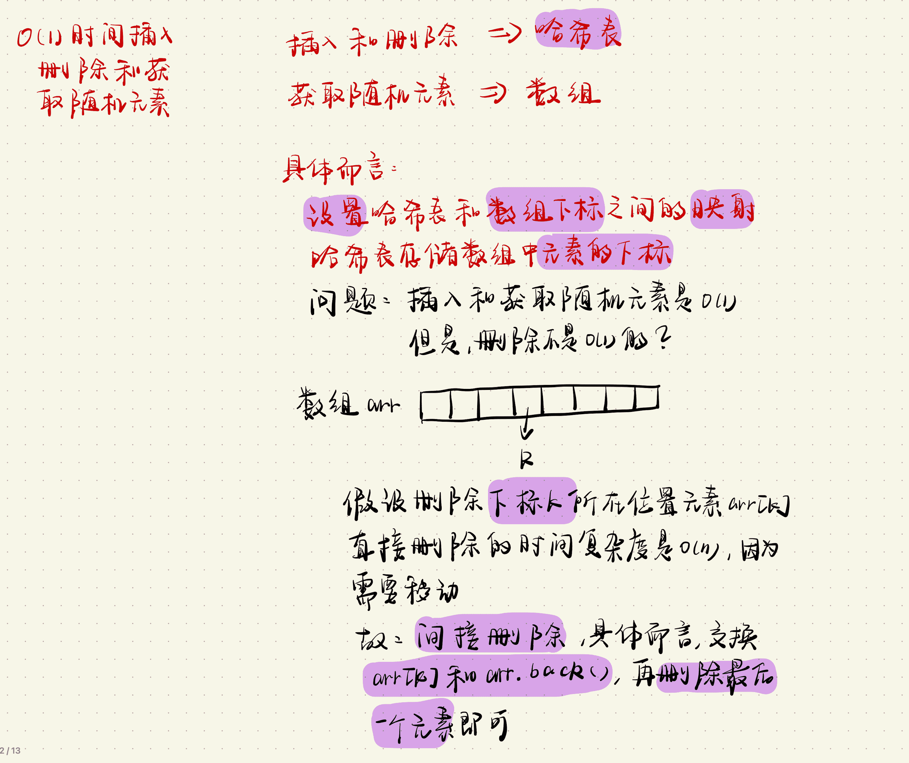

**代ç **

```c++
class RandomizedSet {
public:
    vector<int> g;
    unordered_map<int, int> hash;
    RandomizedSet() {}
    
    bool insert(int x) {
        if (hash.count(x) == 0) {
            hash[x] = g.size();
            g.push_back(x);
            return true;
        }
        return false;
    }
    
    bool remove(int x) {
        if (hash.count(x)) {
            // è·å–当å‰å…ƒç´ x的下标
            int idx = hash[x];
            // 在哈希表中交æ¢æ•°ç»„中当å‰å…ƒç´ çš„下标和最å一个元素的下标
            swap(hash[x], hash[g.back()]);
            // 在数组中交æ¢å½“å‰å…ƒç´ å’Œæœ€å一个元素
            swap(g[idx], g.back());
            // 在数组中将最å一个元素删除
            g.pop_back();
            // 在哈希表中将最å一个元素对应的下标删除
            hash.erase(x);
            return true;
        }
        return false;
    }
    
    int getRandom() {
        // è¿”å›éšæœºå€¼å³å¯
        return g[rand() % g.size()];
    }
};

/**
 * Your RandomizedSet object will be instantiated and called as such:
 * RandomizedSet* obj = new RandomizedSet();
 * bool param_1 = obj->insert(val);
 * bool param_2 = obj->remove(val);
 * int param_3 = obj->getRandom();
 */
```

**时间å¤æ‚度**

$O(1)$

**空间å¤æ‚度**

$O(n)$

**标签**

`哈希表`

**ç¼åˆæ€ª**

## [LeetCode 382. 链表éšæœºèŠ‚点](https://leetcode-cn.com/problems/linked-list-random-node/)

**题目æè¿°**

>   给你一个å•é“¾è¡¨ï¼Œéšæœºé€‰æ‹©é“¾è¡¨çš„一个节点，并返å›ç›¸åº”的节点值。æ¯ä¸ªèŠ‚点 被选中的概ç‡ä¸€æ · 。
>
>   å®ç° `Solution` 类：
>
>   +   `Solution(ListNode head)` 使用整数数组åˆå§‹åŒ–对象。
>   +   `int getRandom()` ä»é“¾è¡¨ä¸­éšæœºé€‰æ‹©ä¸€ä¸ªèŠ‚点并返å›è¯¥èŠ‚点的值。链表中所有节点被选中的概ç‡ç›¸ç­‰ã€‚

**示例**

>   输入
>   `["Solution", "getRandom", "getRandom", "getRandom", "getRandom", "getRandom"]
>   [[[1, 2, 3]], [], [], [], [], []]`
>   输出
>   `[null, 1, 3, 2, 2, 3]`
>
>   解释
>   `Solution solution = new Solution([1, 2, 3]);`
>   `solution.getRandom();` // è¿”å› `1`
>   `solution.getRandom();` // è¿”å› `3`
>   `solution.getRandom();` // è¿”å› `2`
>   `solution.getRandom();` // è¿”å› `2`
>   `solution.getRandom();` // è¿”å› `3`
>   // `getRandom()` 方法应éšæœºè¿”å› `1`ã€`2`ã€`3`中的一个，æ¯ä¸ªå…ƒç´ è¢«è¿”å›çš„概ç‡ç›¸ç­‰ã€‚

**æ示**

>   +   $链表中的节点数在范围 [1, 10^4] 内$
>   +   $-10^4 <= Node.val <= 10^4$
>   +   $至多调用 getRandom 方法 10^4 次$

**进阶**

>   如æœé“¾è¡¨é常大且长度未知，该æ€ä¹ˆå¤„ç†ï¼Ÿ
>   你能å¦åœ¨ä¸ä½¿ç”¨é¢å¤–空间的情况下解决此问题？

**手写稿**

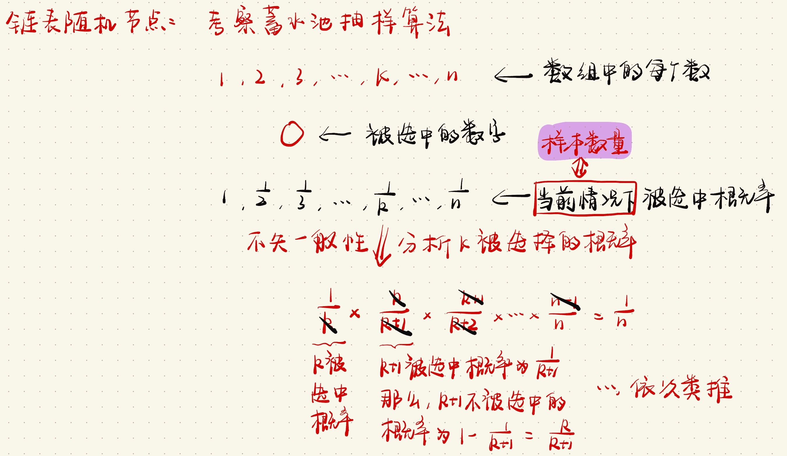

**代ç **

```c++
/**
 * Definition for singly-linked list.
 * struct ListNode {
 *     int val;
 *     ListNode *next;
 *     ListNode() : val(0), next(nullptr) {}
 *     ListNode(int x) : val(x), next(nullptr) {}
 *     ListNode(int x, ListNode *next) : val(x), next(next) {}
 * };
 */
class Solution {
public:
    ListNode* h;
    Solution(ListNode* head) {
        h = head;
    }
    
    int getRandom() {
        int c = -1, n = 0;
        for (auto p = h; p; p = p -> next) {
            // 元素的个数
            n ++;
            // éšæœºé€‰æ‹©æŸä¸ªå…ƒç´ 1/n
            if (rand() % n == 0) c = p -> val;
        }
        return c;
    }
};

/**
 * Your Solution object will be instantiated and called as such:
 * Solution* obj = new Solution(head);
 * int param_1 = obj->getRandom();
 */
```

**时间å¤æ‚度**

$O(n)$

**空间å¤æ‚度**

$O(1)$

**标签**

`蓄水池抽样算法`

**ç¼åˆæ€ª**

## [LeetCode 384. 打乱数组](https://leetcode-cn.com/problems/shuffle-an-array/)

**题目æè¿°**

>   给你一个整数数组 `nums` ，设计算法æ¥æ‰“乱一个没有é‡å¤å…ƒç´ çš„数组。打乱å，数组的所有æ’列应该是 ç­‰å¯èƒ½ 的。
>
>   å®ç° `Solution class`:
>
>   +   `Solution(int[] nums)` 使用整数数组 `nums` åˆå§‹åŒ–对象
>   +   `int[] reset()` é‡è®¾æ•°ç»„到它的åˆå§‹çŠ¶æ€å¹¶è¿”å›
>   +   `int[] shuffle()` è¿”å›æ•°ç»„éšæœºæ‰“ä¹±å的结æœ

**示例 1**

>   输入
>   `["Solution", "shuffle", "reset", "shuffle"]
>   [[[1, 2, 3]], [], [], []]`
>   输出
>   `[null, [3, 1, 2], [1, 2, 3], [1, 3, 2]]`
>
>   解释
>   `Solution solution = new Solution([1, 2, 3]);`
>   `solution.shuffle();`    // 打乱数组 `[1,2,3]` 并返å›ç»“æœã€‚任何 `[1,2,3]`çš„æ’列返å›çš„概ç‡åº”该相åŒã€‚ä¾‹å¦‚ï¼Œè¿”å› `[3, 1, 2]`
>   `solution.reset();`      // é‡è®¾æ•°ç»„到它的åˆå§‹çŠ¶æ€ `[1, 2, 3]` ã€‚è¿”å› `[1, 2, 3]`
>   `solution.shuffle();`    // éšæœºè¿”å›æ•°ç»„ `[1, 2, 3]` 打乱å的结æœã€‚ä¾‹å¦‚ï¼Œè¿”å› `[1, 3, 2]`

**æ示**

>   +   $1 <= nums.length <= 200$
>   +   $-10^6 <= nums[i] <= 10^6$
>   +   $nums 中的所有元素都是 唯一的$
>   +   $最多å¯ä»¥è°ƒç”¨ 5 * 10^4 次 reset å’Œ shuffle$

**手写稿**

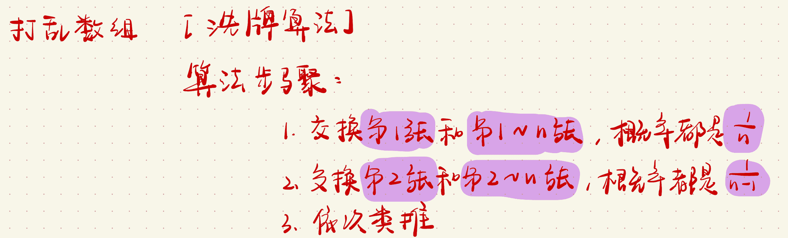

**代ç **

```c++
class Solution {
public:
    vector<int> a, b;
    Solution(vector<int>& nums) {
        a = nums;
    }
    
    vector<int> reset() {
        return a;
    }
    
    vector<int> shuffle() {
        b = a;
        int n = a.size();
        for (int i = 0; i < n; i ++ )
            // 交æ¢ç¬¬i张和第i~nå¼ 
            swap(b[i], b[i + rand() % (n - i)]);
        return b;
    }
};

/**
 * Your Solution object will be instantiated and called as such:
 * Solution* obj = new Solution(nums);
 * vector<int> param_1 = obj->reset();
 * vector<int> param_2 = obj->shuffle();
 */
```

**时间å¤æ‚度**

$O(n)$

**空间å¤æ‚度**

$O(n)$

**标签**

`洗牌算法`

**ç¼åˆæ€ª**

## [LeetCode 146. LRU 缓存](https://leetcode-cn.com/problems/lru-cache/)

**题目æè¿°**

>   请你设计并å®ç°ä¸€ä¸ªæ»¡è¶³  `LRU` (最近最少使用) 缓存 约æŸçš„æ•°æ®ç»“æ„。
>   å®ç° `LRUCache` 类：
>
>   +   `LRUCache(int capacity)` 以 正整数 ä½œä¸ºå®¹é‡ `capacity` åˆå§‹åŒ– `LRU` 缓存
>   +   `int get(int key)` 如æœå…³é”®å­— `key` 存在äºç¼“存中，则返å›å…³é”®å­—的值，å¦åˆ™è¿”å› `-1` 。
>   +   `void put(int key, int value)` 如æœå…³é”®å­— key å·²ç»å­˜åœ¨ï¼Œåˆ™å˜æ›´å…¶æ•°æ®å€¼ `value` ；如æœä¸å­˜åœ¨ï¼Œåˆ™å‘缓存中æ’入该组 `key-value` 。如æœæ’å…¥æ“作导致关键字数é‡è¶…过 `capacity` ，则应该 é€å‡º 最久未使用的关键字。
>
>   函数 `get` å’Œ `put` 必须以 `O(1)` çš„å¹³å‡æ—¶é—´å¤æ‚度è¿è¡Œã€‚

**示例**

>   输入
>   `["LRUCache", "put", "put", "get", "put", "get", "put", "get", "get", "get"]
>   [[2], [1, 1], [2, 2], [1], [3, 3], [2], [4, 4], [1], [3], [4]]`
>   输出
>   `[null, null, null, 1, null, -1, null, -1, 3, 4]`
>
>   解释
>   `LRUCache lRUCache = new LRUCache(2);`
>   `lRUCache.put(1, 1);` // 缓存是 `{1=1}`
>   `lRUCache.put(2, 2);` // 缓存是 `{1=1, 2=2}`
>   `lRUCache.get(1);`    // è¿”å› `1`
>   `lRUCache.put(3, 3);` // 该æ“作会使得关键字 `2` 作废，缓存是 `{1=1, 3=3}`
>   `lRUCache.get(2);`    // è¿”å› `-1` (未找到)
>   `lRUCache.put(4, 4);` // 该æ“作会使得关键字 `1` 作废，缓存是 `{4=4, 3=3}`
>   `lRUCache.get(1);`    // è¿”å› `-1` (未找到)
>   `lRUCache.get(3);`    // è¿”å› `3`
>   `lRUCache.get(4);`    // è¿”å› `4`

**æ示**

>   +   $1 <= capacity <= 3000$
>   +   $0 <= key <= 10000$
>   +   $0 <= value <= 10^5$
>   +   $最多调用 2 * 10^5 次 get 和 put$

**手写稿**

> 1. 手写稿在åŒé“¾è¡¨

**代ç **

```c++
class LRUCache {
public:
    struct DNode {
        int key, val;
        DNode *left, *right;
        DNode(int _key, int _val) : key(_key), val(_val), left(NULL), right(NULL){}
    }*L, *R;
    int capacity;
    unordered_map<int, DNode*> hash; // key -> pointer
    // åˆå§‹åŒ–
    void init() {
        L = new DNode({-1, -1});
        R = new DNode({-1, -1});
        L -> right = R;
        R -> left = L;
        return;
    }
    // 在p节点之åæ’å…¥pointer节点
    void insert(DNode* p, DNode* pointer) {
        pointer -> right = p -> right;
        pointer -> left = p;
        p -> right -> left = pointer;
        p -> right = pointer;
        return;
    }
    // 将pointer节点删除
    void remove(DNode* pointer) {
        pointer -> left -> right = pointer -> right;
        pointer -> right -> left = pointer -> left;
        return;
    }
    LRUCache(int _capacity) {
      	// åŒå‘链表尾部æ’å…¥
      	// 头部删除
        capacity = _capacity;
        init();
    }
    
    int get(int key) {
        if (hash.count(key)) {
            // è·å–key所指å‘的指针
            auto pointer = hash[key];
            // å°†pointer指å‘的节点删除
            remove(pointer);
            // æ’入到尾部
            insert(R -> left, pointer);
            // è¿”å›å€¼
            return pointer -> val;
        }
        return -1;
    }
    
    void put(int key, int value) {
        // 如æœkey存在
        if (hash.count(key)) {
            auto pointer = hash[key];
            pointer -> val = value;
            // 删除
            remove(pointer);
            // æ’入尾部
            insert(R -> left, pointer);
        }
        else {
            if (hash.size() >= capacity) { // 删除头节点
                // è·å–值
                int key = L -> right -> key;
                // 删除首元节点
                remove(L -> right);
                // å°†keyä»å“ˆå¸Œè¡¨ä¸­åˆ é™¤
                hash.erase(hash.find(key));
            }
            // 新建节点
            hash[key] = new DNode({key, value});
            // æ’入尾部
            insert(R -> left, hash[key]);
        }
        return;
    }
};

/**
 * Your LRUCache object will be instantiated and called as such:
 * LRUCache* obj = new LRUCache(capacity);
 * int param_1 = obj->get(key);
 * obj->put(key,value);
 */
```

**时间å¤æ‚度**

$O(1)$

**空间å¤æ‚度**

$O(n), n是节点的个数$

**标签**

`åŒå‘链表`

**ç¼åˆæ€ª**

[SDUT 2054. åŒå‘链表](#SDUT 2054. åŒå‘链表)

## end

# 附录


## 常用å˜é‡

### 次数

>   `tms`

### 检查

>   `check()`

### 行

>   `row`

### 列

>   `col`

## 常è§é”™è¯¯

### å˜é‡å冲çª

>   1.   `friend` ä¸èƒ½åœ¨å…¨å±€ä½¿ç”¨, 局部使用å¯ä»¥
>   2.   

## è¿ç®—符优先级

### `C++` è¿ç®—符优先级


### End