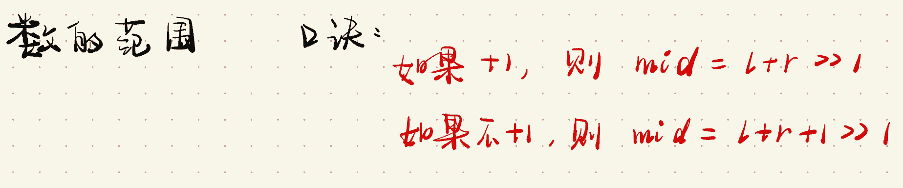
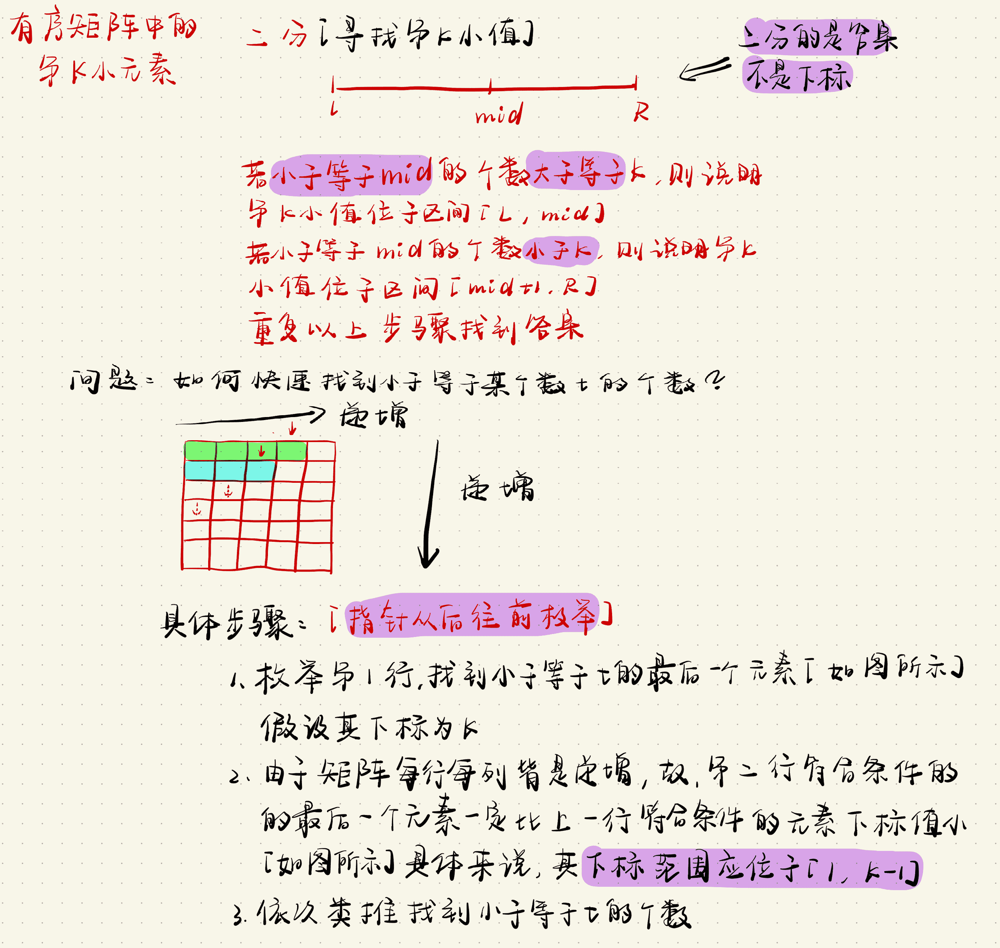

# 二分

## 整数二分

### 模板

>   ```c++
>   bool check(int x) {/* ... */} // 检查x是否满足某种性质
>   
>   // 注意！！【区间的划分】！！
>   // 区间[l, r]被划分成[l, mid]和[mid + 1, r]时使用：
>   int bsearch_1(int l, int r) {
>      while (l < r) {
>          int mid = l + r >> 1;
>          if (check(mid)) r = mid;    // check()判断mid是否满足性质
>          else l = mid + 1;
>      }
>      return l;
>   }
>   
>   // 区间[l, r]被划分成[l, mid - 1]和[mid, r]时使用：
>   int bsearch_2(int l, int r) {
>      while (l < r) {
>          int mid = l + r + 1 >> 1;
>          if (check(mid)) l = mid;
>          else r = mid - 1;
>      }
>      return l;
>   }
>   ```

### [AcWing 789. 数的范围](https://www.acwing.com/problem/content/791/)

**题目描述**

>   给定一个按照升序排列的长度为 `n` 的整数数组，以及 `q` 个查询。
>
>   对于每个查询，返回一个元素 `k` 的起始位置和终止位置（位置从 `0` 开始计数）。
>
>   如果数组中不存在该元素，则返回 `-1 -1`。

**输入格式**

>   第一行包含整数 `n` 和 `q`，表示数组长度和询问个数。
>
>   第二行包含 `n` 个整数（均在 `1∼10000` 范围内），表示完整数组。
>
>   接下来 `q` 行，每行包含一个整数 `k`，表示一个询问元素。

**输出格式**

>   共 `q` 行，每行包含两个整数，表示所求元素的起始位置和终止位置。
>
>   如果数组中不存在该元素，则返回 `-1 -1`。

**数据范围**

>   +   $1≤n≤100000$
>   +   $1≤q≤10000$
>   +   $1≤k≤10000$

**输入样例**

```c++
6 3
1 2 2 3 3 4
3
4
5
```

**输出样例**

```c++
3 4
5 5
-1 -1
```

**手写稿**



**代码**

```c++
#include <iostream>
using namespace std;
const int N = 100010;
int n, m;
int g[N];
int main(){
    scanf("%d%d", &n, &m);
    for (int i = 0; i < n; i ++ ) scanf("%d", &g[i]);
    while (m -- ) {
        int x;
        scanf("%d", &x);
        // 寻找左端点
        int l = 0, r = n - 1;
        int L, R;
        while (l < r) {
            int mid = l + r >> 1;
            // 寻找大于等于x的最小值
            if (g[mid] >= x) r = mid;
            else l = mid + 1;
        }
        if (g[l] != x) cout << -1 << " " << -1 << endl;
        else {
            // 寻找右端点
            L = l;
            l = 0, r = n - 1;
            while (l < r) {
                int mid = l + r + 1 >> 1;
                // 寻找小于等于x的最大值
                if (g[mid] <= x) l = mid;
                else r = mid - 1;
            }
            R = r;
            cout << L << " " << R << endl;
        }
    }
    return 0;
}
```

**时间复杂度**

$O(n)$

**空间复杂度**

$O(n)$

**标签**

`二分`、`整数二分`

**缝合怪**


### [LeetCode 378. 有序矩阵中第 K 小的元素](https://leetcode-cn.com/problems/kth-smallest-element-in-a-sorted-matrix/)

**题目描述**

>   给你一个 `n x n` 矩阵 `matrix` ，其中每行和每列元素均按升序排序，找到矩阵中第 `k` 小的元素。
>   请注意，它是 排序后 的第 `k` 小元素，而不是第 `k` 个 不同 的元素。
>
>   你必须找到一个内存复杂度优于 $O(n^2)$ 的解决方案。

**示例 1**

>   输入：`matrix = [[1,5,9],[10,11,13],[12,13,15]], k = 8`
>   输出：`13`
>   解释：矩阵中的元素为 `[1,5,9,10,11,12,13,13,15]`，第 `8` 小元素是 `13`

**示例 2**

>   输入：`matrix = [[-5]], k = 1`
>   输出：`-5`

**提示**

>   +   $n == matrix.length$
>   +   $n == matrix[i].length$
>   +   $1 <= n <= 300$
>   +   $-10^9 <= matrix[i][j] <= 10^9$
>   +   $题目数据 保证 matrix 中的所有行和列都按 非递减顺序 排列$
>   +   $1 <= k <= n^2$

**进阶**

>   你能否用一个恒定的内存(即 `O(1)` 内存复杂度)来解决这个问题?
>   你能在 `O(n)` 的时间复杂度下解决这个问题吗?这个方法对于面试来说可能太超前了，但是你会发现阅读这篇文章（ [this paper](http://www.cse.yorku.ca/~andy/pubs/X+Y.pdf) ）很有趣。

**手写稿**



**代码**

```c++
typedef long long LL;
class Solution {
public:
    int kthSmallest(vector<vector<int>>& g, int k) {
        // 二分的不是下标，而是答案
        int l = INT_MIN, r = INT_MAX;
        while (l < r) {
            int mid = (LL)l + r >> 1;
            // j从最后一个数开始枚举
            // cnt表示小于等于mid的个数
            int j = g[0].size() - 1, cnt = 0;
            // 枚举每一行
            for (int i = 0; i < g.size(); i ++ ) {
                // 如果当前值大于mid，则j--
                while (j >= 0 && g[i][j] > mid) j --;
                // 小于等于mid的个数为j + 1个
                cnt += j + 1;
            }
            if (cnt >= k) r = mid;
            else l = mid + 1;
        }
        return l;
    }
};
```

**时间复杂度**

$O(nlog_n)$

**空间复杂度**

$O(1)$

**标签**

`二分`

**缝合怪**


## 实数二分

### 模板

>   ```c++
>   bool check(double x) {/* ... */} // 检查x是否满足某种性质
>   
>   double bsearch_3(double l, double r) {
>      const double eps = 1e-6;   // eps 表示精度，取决于题目对精度的要求
>      while (r - l > eps) {
>          double mid = (l + r) / 2;
>          if (check(mid)) r = mid;
>          else l = mid;
>      }
>      return l;
>   }
>   ```

### [AcWing 790. 数的三次方根](https://www.acwing.com/problem/content/792/)

**题目描述**

>   给定一个浮点数 `n`，求它的三次方根。

**输入格式**

>   共一行，包含一个浮点数 `n`。

**输出格式**

>   共一行，包含一个浮点数，表示问题的解。
>
>   注意，结果保留 `6` 位小数。

**数据范围**

>   +   $−10000≤n≤10000$

**输入样例**

```c++
1000.00
```

**输出样例**

```c++
10.000000
```

**手写稿**

>   1.   [实数二分](#实数二分)

**代码**

```c++
#include <iostream>
#include <cmath>
using namespace std;
const double eps = 1e-8;
double n;
int main() {
    scanf("%lf", &n);
    // 注意：不能写成l = 0, r = n
    // 如果设置成l = 0, r = n，则无论如何也找不到其三次方根
    // 原因：0.001，其三次方根0.1是比本身大的
    double l = -100, r = 100;
    while (fabs(l - r) > eps) {
        double mid = (l + r) / 2;
        if (mid * mid * mid >= n) r = mid;
        else l = mid;
    }
    printf("%.6lf\n", l);
    return 0;
}
```

**时间复杂度**

$O(log_n)$

**空间复杂度**

$O(1)$

**标签**

`实数二分`

**缝合怪**