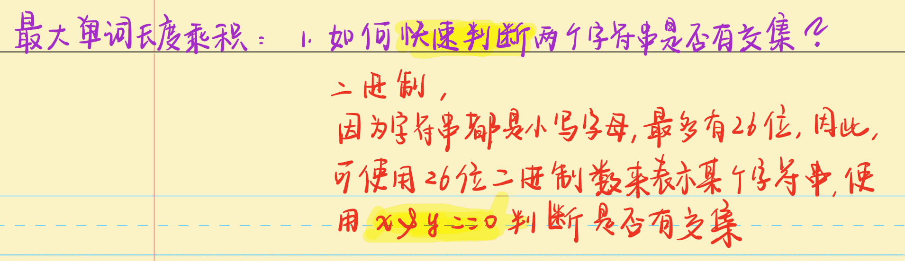

# 位运算

## [LeetCode 260. 只出现一次的数字 III](https://leetcode-cn.com/problems/single-number-iii/)

**题目描述**

> 给定一个整数数组 `nums`，其中恰好有两个元素只出现一次，其余所有元素均出现两次。 找出只出现一次的那两个元素。你可以按 任意顺序 返回答案。
>
> 进阶：你的算法应该具有线性时间复杂度。你能否仅使用常数空间复杂度来实现？

**示例 1**

> 输入：`nums = [1,2,1,3,2,5]`
> 输出：`[3,5]`
> 解释：`[5, 3]` 也是有效的答案。

**示例 2**

> 输入：`nums = [-1,0]`
> 输出：`[-1,0]`

**示例 3**

> 输入：`nums = [0,1]`
> 输出：`[1,0]`

**提示**

> + $2\;\leq\;nums.length\;\leq\;3\;*\;10^4$
> + $-2^{31}\;\leq\;nums[i]\;\leq\;2^{31}\;-\;1$
> + 除两个只出现一次的整数外，nums 中的其他数字都出现两次

**题解**

> 1. 将所有数字进行异或之后得到的值 `ab` 即为只出现一次的那两个元素 `a` 和 `b` 的异或值
> 2. 由异或的性质可知 `ab` 的二进制表示中某一位 `k`上的值为 `1` ，说明元素 `a` 和 元素 `b` 在 `k` 上的二进制是不同的。因此，可以根据第 `k` 位进行划分，将整个数组划分成为两部分，一部分表示第 `k` 位的值为 `1` ，另一部分表示第 `k` 位的值为 `0`，此时问题变成在一个数组中，只有一个数出现一次，其他数出现两次，可解

**代码**

```c++
class Solution {
public:
    int get(vector<int>& nums, int k, int u) {
        int res = 0;
        for (auto& num : nums)
            if ((num >> k & 1) == u) res ^= num;
        return res;
    }
    vector<int> singleNumber(vector<int>& nums) {
        int ab = 0;
        for (auto& num : nums) ab ^= num;
        int k = 0;
        while ((ab >> k & 1) == 0) k ++;
        return {get(nums, k, 1), get(nums, k, 0)};
    }
};
```

**标签**

`位运算`

## [LeetCode 338. 比特位计数](https://leetcode-cn.com/problems/counting-bits/)

**题目描述**

> 给你一个整数 `n` ，对于 `0 <= i <= n` 中的每个 `i` ，计算其二进制表示中 `1` 的个数 ，返回一个长度为 `n + 1` 的数组 `ans` 作为答案。

**示例 1**

> 输入：`n = 2`
> 输出：`[0,1,1]`
> 解释：
> `0 --> 0`
> `1 --> 1`
> `2 --> 10`

**示例 2**

> 输入：`n = 5`
> 输出：`[0,1,1,2,1,2]`
> 解释：
> `0 --> 0`
> `1 --> 1`
> `2 --> 10`
> `3 --> 11`
> `4 --> 100`
> `5 --> 101`

**提示**

> + $0 <= n <= 10^5$

**进阶**

> 很容易就能实现时间复杂度为 `O(n log n)` 的解决方案，你可以在线性时间复杂度 `O(n)` 内用一趟扫描解决此问题吗？
> 你能不使用任何内置函数解决此问题吗？（如，`C++` 中的 `__builtin_popcount` ）

**方法一：枚举 + 位运算**

**步骤**

> 1. 遍历每一个数字，检查每一个数字的二进制位中含有的 `1` 的个数即可
> 2. 使用 `lowbit` 函数进行检查 `1` 的数量
>     + `lowbit` 函数 `x & -x` 可以取得 `x` 的最后一位 `1`

**代码**

```c++
class Solution {
public:
    int get(int x) {
        int res = 0;
        while (x) {
            x -= x & -x;
            res ++;
        }
        return res;
    }
    vector<int> countBits(int n) {
        vector<int> res;
        for (int i = 0; i <= n; i ++ ) res.push_back(get(i));
        return res;
    }
};
```

**方法二：动态规划 + 位运算**

**手写稿**


**代码**

```c++
class Solution {
public:
    vector<int> countBits(int n) {
        vector<int> f(n + 1);
        for (int i = 0; i <= n; i ++ ) f[i] = f[i >> 1] + (i & 1);
        return f;
    }
};
```

**标签**

` 动态规划`、`位运算`

## [AcWing 318. 最大单词长度乘积](https://leetcode-cn.com/problems/maximum-product-of-word-lengths/)

**题目描述**

> 给你一个字符串数组 `words` ，找出并返回 `length(words[i]) * length(words[j])` 的最大值，并且这两个单词不含有公共字母。如果不存在这样的两个单词，返回 `0` 。

**示例 1**

> 输入：`words = ["abcw","baz","foo","bar","xtfn","abcdef"]`
> 输出：`16`
> 解释：这两个单词为 `"abcw", "xtfn"`。

**示例 2**

> 输入：`words = ["a","ab","abc","d","cd","bcd","abcd"]`
> 输出：`4` 
> 解释：这两个单词为 `"ab", "cd"`。

**示例 3**

> 输入：`words = ["a","aa","aaa","aaaa"]`
> 输出：`0`
> 解释：不存在这样的两个单词。

**提示**

> + $2 <= words.length <= 1000$
> + $1 <= words[i].length <= 1000$
> + $words[i]$ 仅包含小写字母

**手写稿**



**代码**

```c++
class Solution {
public:
    int maxProduct(vector<string>& words) {
        vector<int> state;
        for (auto& word : words) {
            int s = 0;
            // 26位二进制，也就是说a, aa, aaa实际上映射的都是同一个数字
            // 注意体会
            for (auto& c : word) s |= 1 << (c - 'a');
            state.push_back(s);
        }
        int res = 0;
        for (int i = 0; i < words.size(); i ++ )
            for (int j = i + 1; j < words.size(); j ++ )
                if (!(state[i] & state[j]))
                    res = max(res, (int)(words[i].size() * words[j].size()));
        return res;
    }
};
```

**标签**

`位运算`

## [LeetCode 371. 两整数之和](https://leetcode-cn.com/problems/sum-of-two-integers/)

**题目描述**

>   给你两个整数 `a` 和 `b` ，不使用 运算符 `+` 和 `-` ，计算并返回两整数之和。

**示例 1**

>   输入：`a = 1, b = 2`
>   输出：`3`

**示例 2**

>   输入：`a = 2, b = 3`
>   输出：`5`

**提示**

>   +   $-1000 <= a, b <= 1000$

**手写稿**


**代码**

```c++
class Solution {
public:
    int getSum(int a, int b) {
        if (!b) return a;
        int sum = a ^ b, carry = (unsigned)(a & b) << 1;
        return getSum(sum, carry);
    }
};
```

**标签**

`位运算`

## end