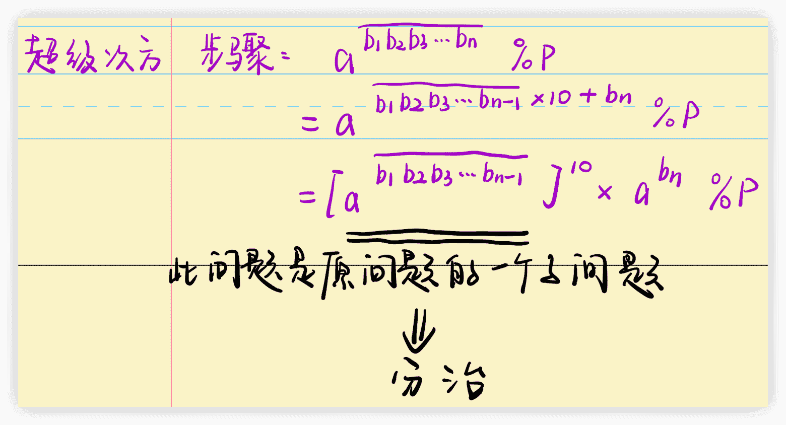

# 分治

## [LeetCode 372. 超级次方](https://leetcode-cn.com/problems/super-pow/)

**题目描述**

>   你的任务是计算 $a^b$ 对 `1337` 取模，`a` 是一个正整数，`b` 是一个非常大的正整数且会以数组形式给出。

**示例 1**

>   输入：`a = 2, b = [3]`
>   输出：`8`

**示例 2**

>   输入：`a = 2, b = [1,0]`
>   输出：`1024`

**示例 3**

>   输入：`a = 1, b = [4,3,3,8,5,2]`
>   输出：`1`

**示例 4**

>   输入：`a = 2147483647, b = [2,0,0]`
>   输出：`1198`

**提示**

>   +   $1 <= a <= 2^{31} - 1$
>   +   $1 <= b.length <= 2000$
>   +   $0 <= b[i] <= 9$
>   +   $b 不含前导 0$

**手写稿**



**代码**

```c++
const int p = 1337;
class Solution {
public:
    int qmi(int a, int b) {
        // a先模p，如果不先模p，第10行a * a会越界
        // 记住先模p【模板！！！】
        a %= p;
        int res = 1;
        while (b) {
            if (b & 1) res = res * a % p;
            a = a * a % p;
            b >>= 1;
        }
        return res;
    }
    int superPow(int a, vector<int>& b) {
        if (b.empty()) return 1;
        // 把最后一个数剔除，化归为分治的子问题
        int t = b.back(); b.pop_back();
        return qmi(superPow(a, b), 10) * qmi(a, t) % p;
    }
};
```

**标签**

`快速幂`、`分治`