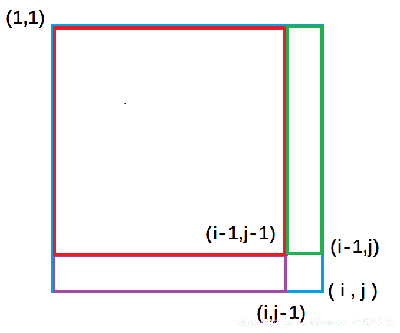

# 前缀和

## 一维前缀和

### [AcWing 795. 前缀和](https://www.acwing.com/problem/content/797/)

>   输入一个长度为 `n` 的整数序列。
>
>   接下来再输入 `m` 个询问，每个询问输入一对 `l,r`。
>
>   对于每个询问，输出原序列中从第 `l` 个数到第 `r` 个数的和。

**输入格式**

>   第一行包含两个整数 `n` 和 `m`。
>
>   第二行包含 `n` 个整数，表示整数数列。
>
>   接下来 `m` 行，每行包含两个整数 `l` 和 `r`，表示一个询问的区间范围。

**输出格式**

>   共 `m` 行，每行输出一个询问的结果。

**数据范围**

>   +   $1≤l≤r≤n,$
>   +   $1≤n,m≤100000,$
>   +   $−1000≤数列中元素的值≤1000$

**输入样例**

```c++
5 3
2 1 3 6 4
1 2
1 3
2 4
```

**输出样例**

```c++
3
6
10
```

**手写稿**

>   1.   `sum[i]` 表示区间 `[1, i]` 的和
>   2.   如果要计算区间 `[l, r]` 的和，首先需要明确
>        +   $sum[r] = a_1 + a_2 + ... + a_{r - 1} + a_r$
>        +   $sum[l] = a_1 + a_2 + ... + a_{l - 1} + a_l$
>        +   两者相减即可

**代码**

```c++
#include <iostream>
using namespace std;
const int N = 100010;
int n, m;
int sum[N];
int main() {
    scanf("%d%d", &n, &m);
    for (int i = 1, x; i <= n; i ++ ) {
        scanf("%d", &x);
        sum[i] = x + sum[i - 1];
    }
    while (m -- ) {
        int l, r;
        scanf("%d%d", &l, &r);
        printf("%d\n", sum[r] - sum[l - 1]);
    }
    return 0;
}
```

**标签**

`前缀和`

## 二维前缀和

### [AcWing 796. 子矩阵的和](https://www.acwing.com/problem/content/798/)

>   输入一个 `n` 行 `m` 列的整数矩阵，再输入 `q` 个询问，每个询问包含四个整数 `x1,y1,x2,y2`，表示一个子矩阵的左上角坐标和右下角坐标。
>
>   对于每个询问输出子矩阵中所有数的和。

**输入格式**

>   第一行包含三个整数 `n，m，q`。
>
>   接下来 `n` 行，每行包含 `m` 个整数，表示整数矩阵。
>
>   接下来 `q` 行，每行包含四个整数 `x1,y1,x2,y2`，表示一组询问。

**输出格式**

>   共 `q` 行，每行输出一个询问的结果。

**数据范围**

>   +   $1≤n,m≤1000,$
>   +   $1≤q≤200000,$
>   +   $1≤x1≤x2≤n,$
>   +   $1≤y1≤y2≤m,$
>   +   $−1000≤矩阵内元素的值≤1000$

**输入样例**

```c++
3 4 3
1 7 2 4
3 6 2 8
2 1 2 3
1 1 2 2
2 1 3 4
1 3 3 4
```

**输出样例**

```c++
17
27
21
```

**手写稿**

>   
>
>   紫色面积是指 `(1,1)` 左上角到 `(i,j-1)` 右下角的矩形面积, 绿色面积是指 `(1,1)` 左上角到 `(i-1, j )` 右下角的矩形面积。每一个颜色的矩形面积都代表了它所包围元素的和。
>
>   
>
>   从图中我们很容易看出，整个外围蓝色矩形面积`s[i][j]` = 绿色面积`s[i-1][j]` + 紫色面积`s[i][j-1]` - 重复加的红色的面积`s[i-1][j-1]` `+`小方块的面积`a[i][j]`;
>
>   因此得出二维前缀和预处理公式
>
>   `s[i] [j] = s[i-1][j] + s[i][j-1 ] + a[i] [j] - s[i-1][ j-1]`
>
>   接下来回归问题去求以 `(x1,y1)` 为左上角和以 `(x2,y2)` 为右下角的矩阵的元素的和。
>
>   同样的道理【<font style= "color: red">**你这题目一次一次换了多少个，改过不啦，换汤不换药啊**</font>】

**代码**

```c++
#include <iostream>
using namespace std;
const int N = 1010;
int n, m, q;
int g[N][N], sum[N][N];
int main() {
    scanf("%d%d%d", &n, &m, &q);
    for (int i = 1; i <= n; i ++ )
        for (int j = 1; j <= m; j ++ ) {
            scanf("%d", &g[i][j]);
            sum[i][j] = g[i][j] + sum[i - 1][j] + sum[i][j - 1] - sum[i - 1][j - 1];
        }
    while (q -- ) {
        int x1, y1, x2, y2;
        scanf("%d%d%d%d", &x1, &y1, &x2, &y2);
        cout << sum[x2][y2] - sum[x2][y1 - 1] - sum[x1 - 1][y2] + sum[x1 - 1][y1 - 1] << endl;
    }
    return 0;
}
```

**标签**

`前缀和`、`二维前缀和`