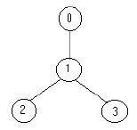

# 树形`DP`

## 树的直径经典求法

**前提条件**


**定理**

> 任意寻找树中的某一点，寻找树中距离当前节点最远的点 `u`，再寻找距离 `u` 最远的点 `v`，则树的直径即为 `u` 到 `v` 经过的节点数目

**证明**


## [AcWing 1072. 树的最长路径](https://www.acwing.com/problem/content/1074/)

**题目描述**

> 给定一棵树，树中包含 `n` 个结点（编号`1~n`）和 `n−1` 条无向边，每条边都有一个权值。
>
> 现在请你找到树中的一条最长路径。
>
> 换句话说，要找到一条路径，使得使得路径两端的点的距离最远。
>
> 注意：路径中可以只包含一个点。

**输入格式**

> 第一行包含整数 `n`。
>
> 接下来 `n−1` 行，每行包含三个整数 $a_i,b_i,c_i$，表示点 $a_i$ 和 $b_i$ 之间存在一条权值为 $c_i$ 的边。

**输出格式**

> 输出一个整数，表示树的最长路径的长度。

**数据范围**

> + $1≤n≤10000,$
> + $1≤a_i,b_i≤n,$
> + $−10^5≤c_i≤10^5$

**输入样例**

```c++
6
5 1 6
1 4 5
6 3 9
2 6 8
6 1 7
```

**输出样例**

```c++
22
```

**手写稿**


**代码**

```c++
#include <iostream>
#include <cstring>
using namespace std;
const int N = 10010, M = N << 1;
int n, idx, ans;
int h[N], e[M], w[M], ne[M];
void add(int a, int b, int c) {
    e[idx] = b;
    w[idx] = c;
    ne[idx] = h[a];
    h[a] = idx ++ ;
    return;
}
// 返回以u为根结点的最大权值和
int dfs(int u, int father) {
    // d1表示最大值，d2表示次大值
    int d1 = 0, d2 = 0;
    // 以u为根结点的子树的最大权值和
    int dist = 0;
    for (int i = h[u]; i != -1; i = ne[i]) {
        int j = e[i];
        if (j == father) continue; // 原因在题解中已经解释
        int d = dfs(j, u) + w[i];
        dist = max(dist, d);
        if (d >= d1) d2 = d1, d1 = d;
        else if (d >= d2) d2 = d;
    }
    ans = max(ans, d1 + d2);
    return dist;
}
int main() {
    scanf("%d", &n);
    memset(h, -1, sizeof h);
    for (int i = 0; i < n - 1; i ++ ) {
        int a, b, c;
        scanf("%d%d%d", &a, &b, &c);
        add(a, b, c);
        add(b, a, c);
    }
    dfs(1, -1);
    cout << ans << endl;
    return 0;
}
```

**标签**

`树形DP`

## [AcWing 846. 树的重心](https://www.acwing.com/problem/content/description/848/)

**题目描述**

> 给定一颗树，树中包含 `n` 个结点（编号 `1∼n`）和 `n−1` 条无向边。
>
> 请你找到树的重心，并输出将重心删除后，剩余各个连通块中点数的最大值。
>
> 重心定义：重心是指树中的一个结点，如果将这个点删除后，剩余各个连通块中点数的最大值最小，那么这个节点被称为树的重心。

**输入格式**

> 第一行包含整数 `n`，表示树的结点数。
>
> 接下来 `n−1` 行，每行包含两个整数 `a` 和 `b`，表示点 `a` 和点 `b` 之间存在一条边。

**输出格式**

> 输出一个整数 `m`，表示将重心删除后，剩余各个连通块中点数的最大值。

**数据范围**

> + $1≤n≤10^5$

**输入样例**

```c++
9
1 2
1 7
1 4
2 8
2 5
4 3
3 9
4 6
```

**输出样例**

```c++
4
```

**手写稿**


**注意事项**

> 1. 为啥 `dfs(int u, int father)` 要定义一个 `father` 变量，以防止 `圈2` 操作，从而导致无限循环
>
>     

**代码**

```c++
#include <iostream>
#include <cstring>
using namespace std;
const int N = 100010, M = N << 1;
int n, idx, ans = 1e9;
int h[N], e[M], ne[M];
void add(int a, int b) {
    e[idx] = b;
    ne[idx] = h[a];
    h[a] = idx ++;
    return;
}
int dfs(int u, int father) { // 以u为根节点的树中的节点个数
    int res = 0; // 以u为根结点的树中的节点个数的最大值
    int num = 1; // 各个子树的节点的个数，至少包含当前的节点，故初始值为1
    for (int i = h[u]; i != -1; i = ne[i]) {
        int j = e[i];
        // 如果当前遍历的点是其父亲节点，则返回，防止产生死循环，原因已解释
        if (j == father) continue;
        int d = dfs(j, u);
        num += d;
        res = max(res, d);
    }
    ans = min(ans, max(res, n - num));
    return num;
}
int main() {
    scanf("%d", &n);
    memset(h, -1, sizeof h);
    for (int i = 0; i < n - 1; i ++ ) {
        int a, b;
        scanf("%d%d", &a, &b);
        // 无向图
        add(a, b);
        add(b, a);
    }
    dfs(1, -1);
    cout << ans << endl;
    return 0;
}
```

**标签**

`动态规划`、`树形DP`、`深度优先搜索`

## [AcWing 1073. 树的中心](https://www.acwing.com/problem/content/1075/)

**题目描述**

> 给定一棵树，树中包含 `n` 个结点（编号`1~n`）和 `n−1` 条无向边，每条边都有一个权值。
>
> 请你在树中找到一个点，使得该点到树中其他结点的最远距离最近。

**输入格式**

> 第一行包含整数 `n`。
>
> 接下来 `n−1` 行，每行包含三个整数 $a_i,b_i,c_i$，表示点 $a_i$ 和 $b_i$ 之间存在一条权值为 $c_i$ 的边。

**输出格式**

> 输出一个整数，表示所求点到树中其他结点的最远距离。

**数据范围**

> + $1≤n≤10000,$
> + $1≤a_i,b_i≤n,$
> + $1≤c_i≤10^5$

**输入样例**

```c++
5 
2 1 1 
3 2 1 
4 3 1 
5 1 1
```

**输出样例**

```c++
2
```

**手写稿**


**代码**

```c++
#include <iostream>
#include <cstring>
using namespace std;
const int N = 10010, M = N << 1, INF = 0x3f3f3f3f;
int n, idx;
// d1[u]和d2[u]分别表示根为u的最长路径和次长路径
// up[u]表示向u的上方搜索的最长路径
// p1[u]表示u的最大值来自于父节点还是子节点
int h[N], e[M], w[M], ne[M], d1[N], d2[N], up[N], p1[N];
void add(int a, int b, int c) {
    e[idx] = b;
    w[idx] = c;
    ne[idx] = h[a];
    h[a] = idx ++;
    return;
}
// 向下搜索
int dfs_d(int u, int father) { // dfs_d返回节点u的所有【子树】的最大路径和
    // 初始化节点的最大路径和次大路径为负无穷
    d1[u] = d2[u] = -INF;
    for (int i = h[u]; i != -1; i = ne[i]) {
        int j = e[i];
        // 如果当前节点j是u的父亲，则返回，原因在楼上的一道题里面已经描述过
        if (j == father) continue;
        // 记得加上当前权值w[i]
        int d = dfs_d(j, u) + w[i];
        // 更新最大值和次大值，同时要记得更新u的最大值来自的路径，只需要记最大值即可
        if (d >= d1[u]) d2[u] = d1[u], d1[u] = d, p1[u] = j;
        else if (d >= d2[u]) d2[u] = d;
    }
    // 如果d1和d2没有被更新，则说明是叶节点，则将其最大值和次大值都初始化为0即可
    if (d1[u] == -INF) d1[u] = d2[u] = 0;
    // 返回节点u最大值
    return d1[u];
}
// 向上搜索
void dfs_u(int u, int father) {
    for (int i = h[u]; i != -1; i = ne[i]) {
        int j = e[i];
        if (j == father) continue;
        // 注意是up[j]和up[u]的位置
        // 注意w[i]是加在max的外面的
        if (p1[u] == j) up[j] = max(up[u], d2[u]) + w[i];
        else up[j] = max(up[u], d1[u]) + w[i];
        dfs_u(j, u);
    }
    return;
}
int main() {
    scanf("%d", &n);
    memset(h, -1, sizeof h);
    for (int i = 0; i < n - 1; i ++ ) {
        int a, b, c;
        scanf("%d%d%d", &a, &b, &c);
        add(a, b, c);
        add(b, a, c);
    }
    // 树的向下寻找【用子节点更新父节点】
    dfs_d(1, -1);
    // 树的向上寻找【用父节点更新子节点】
    dfs_u(1, -1);
    int res = INF;
    for (int i = 1; i <= n; i ++ ) res = min(res, max(d1[i], up[i]));
    cout << res << endl;
    return 0;
}
```

**标签**

`树形DP`、`换根DP`

## [AcWing 1075. 数字转换](https://www.acwing.com/problem/content/1077/)

**题目描述**

> 如果一个数 `x` 的约数之和 `y`（不包括他本身）比他本身小，那么 `x` 可以变成 `y`，`y` 也可以变成 `x`。
>
> 例如，`4` 可以变为 `3`，`1` 可以变为 `7`。
>
> 限定所有数字变换在不超过 `n` 的正整数范围内进行，求不断进行数字变换且不出现重复数字的最多变换步数。

**输入格式**

> 输入一个正整数 `n`。

**输出格式**

> 输出不断进行数字变换且不出现重复数字的最多变换步数。

**数据范围**

> + $1≤n≤50000$

**输入样例**

```c++
7
```

**输出样例**

```c++
3
```

**样例解释**

> 一种方案为：`4→3→1→74→3→1→7`。

**手写稿**


**代码**

```c++
#include <iostream>
#include <cstring>
using namespace std;
const int N = 50010;
int n, idx, ans;
int h[N], e[N], ne[N], st[N], sum[N];
void add(int a, int b) {
    e[idx] = b;
    ne[idx] = h[a];
    h[a] = idx ++;
    return;
}
int dfs(int u) {
    int d1 = 0, d2 = 0;
    for (int i = h[u]; i != -1; i = ne[i]) {
        int j = e[i];
        int d = dfs(j) + 1;
        if (d >= d1) d2 = d1, d1 = d;
        else if (d >= d2) d2 = d;
    }
    ans = max(ans, d1 + d2);
    return d1;
}
int main() {
    scanf("%d", &n);
    memset(h, -1, sizeof h);
    for (int i = 1; i <= n; i ++ )
        // 使用i去更新i*j，其中i就是约数
        for (int j = 2; j <= n / i; j ++ )
            sum[i * j] += i;
    for (int i = 2; i <= n; i ++ )
        // 如果i的约数之和sum[i]符合要求
        if (i > sum[i]) {
            // 注意边的顺序，要求sum[i] -> i，因此，因为add(sum[i], i)而不是add(i, add[i])
            add(sum[i], i);
            // 因为可能会有多棵树，因此，需要记录下树的哪些节点被访问过
            st[i] = true;
        }
    for (int i = 1; i <= n; i ++ )
        // 如果当前节点没有被访问过，则访问，即访问森林中的下一棵树
        if (!st[i]) dfs(i);
    cout << ans << endl;
    return 0;
}
```

**标签**

`树形DP`、`深度优先搜索`

## [AcWing 285. 没有上司的舞会](https://www.acwing.com/problem/content/287/)

**题目描述**

> `Ural` 大学有 `N` 名职员，编号为 `1∼N`。
>
> 他们的关系就像一棵以校长为根的树，父节点就是子节点的直接上司。
>
> 每个职员有一个快乐指数，用整数 $H_i$ 给出，其中 $1≤i≤N$。
>
> 现在要召开一场周年庆宴会，不过，没有职员愿意和直接上司一起参会。
>
> 在满足这个条件的前提下，主办方希望邀请一部分职员参会，使得所有参会职员的快乐指数总和最大，求这个最大值。

**输入格式**

> 第一行一个整数 `N`。
>
> 接下来 `N` 行，第 `i` 行表示 `i` 号职员的快乐指数 $H_i$。
>
> 接下来 `N−1` 行，每行输入一对整数 `L,K`，表示 `K` 是 `L` 的直接上司。

**输出格式**

> 输出最大的快乐指数。

**数据范围**

> + $1≤N≤6000$,
> + $−128≤Hi≤127$

**输入样例**

```c++
7
1
1
1
1
1
1
1
1 3
2 3
6 4
7 4
4 5
3 5
```

**输出样例**

```c++
5
```

**手写稿**


**代码**

```c++
#include <iostream>
#include <cstring>
using namespace std;
const int N = 6010;
int n, idx;
int happy[N], h[N], e[N], ne[N], is_root[N];
int f[N][2];
void add(int a, int b) {
    e[idx] = b;
    ne[idx] = h[a];
    h[a] = idx ++;
    return;
}
void dfs(int u) {
    // 如果确定选择当前节点，则先将当前节点的快乐值➕
    f[u][1] = happy[u];
    for (int i = h[u]; i != -1; i = ne[i]) {
        int j = e[i];
        // 先递归子树
        dfs(j);
        // 如果不选择根节点，则子树既可以选择，也可以不选择
        f[u][0] += max(f[j][0], f[j][1]);
        // 如果选择根节点，则子树只能不选择
        f[u][1] += f[j][0];
    }
    return;
}
int main() {
    scanf("%d", &n);
    memset(h, -1, sizeof h);
    memset(is_root, true, sizeof is_root);
    for (int i = 1; i <= n; i ++ ) scanf("%d", &happy[i]);
    for (int i = 1; i <= n - 1; i ++ ) {
        int u, v;
        scanf("%d%d", &u, &v);
        add(v, u);
        is_root[u] = false;
    }
    // 寻找根节点
    int root = 0;
    for (int i = 1; i <= n; i ++ )
        if (is_root[i]) {
            root = i;
            break;
        }
    dfs(root);
    cout << max(f[root][0], f[root][1]) << endl;
    return 0;
}
```

**标签**

`动态规划`、`树形DP`

## [LeetCode 337. 打家劫舍 III](https://leetcode-cn.com/problems/house-robber-iii/)

**题目描述**

>   小偷又发现了一个新的可行窃的地区。这个地区只有一个入口，我们称之为 `root` 。
>
>   除了 `root` 之外，每栋房子有且只有一个“父“房子与之相连。一番侦察之后，聪明的小偷意识到“这个地方的所有房屋的排列类似于一棵二叉树”。 如果 两个直接相连的房子在同一天晚上被打劫 ，房屋将自动报警。
>
>   给定二叉树的 `root` 。返回 在不触动警报的情况下 ，小偷能够盗取的最高金额 。

**示例 1**


>   输入: `root = [3,2,3,null,3,null,1]`
>   输出: `7` 
>   解释: 小偷一晚能够盗取的最高金额 `3 + 3 + 1 = 7`

**示例 2**


>   输入: `root = [3,4,5,1,3,null,1]`
>   输出: `9`
>   解释: 小偷一晚能够盗取的最高金额 `4 + 5 = 9`

**提示**

>   +   $树的节点数在 [1, 10^4] 范围内$
>   +   $0 <= Node.val <= 10^4$

**手写稿**


**代码**

```c++
/**
 * Definition for a binary tree node.
 * struct TreeNode {
 *     int val;
 *     TreeNode *left;
 *     TreeNode *right;
 *     TreeNode() : val(0), left(nullptr), right(nullptr) {}
 *     TreeNode(int x) : val(x), left(nullptr), right(nullptr) {}
 *     TreeNode(int x, TreeNode *left, TreeNode *right) : val(x), left(left), right(right) {}
 * };
 */
class Solution {
public:
    // dfs的返回值{选u, 不选u}，即对应着f[u][0]和f[u][1]
    vector<int> dfs(TreeNode* u) {
        if (!u) return {0, 0};
        auto l = dfs(u -> left), r = dfs(u -> right);
        // {不选u, 选u}
        return {max(l[0], l[1]) + max(r[0], r[1]), l[0] + r[0] + u -> val};
    }
    int rob(TreeNode* u) {
        vector<int> f = dfs(u);
        return max(f[0], f[1]);
    }
};
```

**标签**

`树形DP`

## [AcWing 310. 最小高度树](https://leetcode-cn.com/problems/minimum-height-trees/)

**题目描述**

> 树是一个无向图，其中任何两个顶点只通过一条路径连接。 换句话说，一个任何没有简单环路的连通图都是一棵树。
>
> 给你一棵包含 `n` 个节点的树，标记为 `0` 到 `n - 1` 。给定数字 `n` 和一个有 `n - 1` 条无向边的 `edges` 列表（每一个边都是一对标签），其中 $edges[i] = [a_i, b_i]$ 表示树中节点 $a_i$ 和 $b_i$ 之间存在一条无向边。
>
> 可选择树中任何一个节点作为根。当选择节点 `x` 作为根节点时，设结果树的高度为 `h` 。在所有可能的树中，具有最小高度的树（即，`min(h)`）被称为 最小高度树 。
>
> 请你找到所有的 最小高度树 并按 任意顺序 返回它们的根节点标签列表。
>
> 树的 高度 是指根节点和叶子节点之间最长向下路径上边的数量。

**示例 1**


> 输入：`n = 4, edges = [[1,0],[1,2],[1,3]]`
> 输出：`[1]`
> 解释：如图所示，当根是标签为 `1` 的节点时，树的高度是 `1` ，这是唯一的最小高度树。

**示例 2**


> 输入：`n = 6, edges = [[3,0],[3,1],[3,2],[3,4],[5,4]]`
> 输出：`[3,4]`

**提示**

> + $1 <= n <= 2 * 10^4$
> + $edges.length == n - 1$
> + $0 <= a_i, b_i < n$
> + $a_i != b_i$
> + $所有 (a_i, b_i) 互不相同$
> + $给定的输入 保证 是一棵树，并且 不会有重复的边$

**解题步骤**

> 1. 对于每一个点 `u` 来说，将其当作根节点，然后计算以 `u` 为根的树的高度，统计出来所有的高度以后，循环求解即可
>
> 2. 计算树的高度，使用树形 `DP` 来计算
>
>     

**代码**

```c++
class Solution {
public:
    vector<vector<int>> g;
    vector<int> d1, d2, up, p;
    // 向下寻找
    int dfs_d(int u, int father) {
        for (auto& j : g[u]) {
            if (j == father) continue;
            int d = dfs_d(j, u) + 1;
            if (d >= d1[u]) d2[u] = d1[u], d1[u] = d, p[u] = j;
            else if (d >= d2[u]) d2[u] = d;
        }
        return d1[u];
    }
    // 向上寻找
    void dfs_u(int u, int father) {
        for (auto& j : g[u]) {
            if (j == father) continue;
            if (p[u] == j) up[j] = max(up[u], d2[u]) + 1;
            else up[j] = max(up[u], d1[u]) + 1;
            dfs_u(j, u);
        }
        return;
    }
    vector<int> findMinHeightTrees(int n, vector<vector<int>>& edges) {
        g.resize(n + 5);
        d1 = d2 = p = up = vector<int>(n + 5);
        // 建图
        for (auto& edge : edges) {
            int a = edge[0], b = edge[1];
            g[a].push_back(b);
            g[b].push_back(a);
        }
        // 向下寻找
        dfs_d(0, -1);
        // 向上寻找
        dfs_u(0, -1);
        // 找最小值
        int Min = 1e9;
        for (int i = 0; i < n; i ++ ) Min = min(Min, max(up[i], d1[i]));
        // 找答案
        vector<int> res;
        for (int i = 0; i < n; i ++ ) 
            if (max(up[i], d1[i]) == Min) res.push_back(i);
        return res;
    }
};
```

**标签**

`树形DP`、`树的深度优先搜索`

## [AcWing 1074. 二叉苹果树](https://www.acwing.com/problem/content/1076/)

**题目描述**

>   有一棵二叉苹果树，如果树枝有分叉，一定是分两叉，即没有只有一个儿子的节点。
>
>   这棵树共 `N` 个节点，编号为 `1` 至 `N`，树根编号一定为 `1`。
>
>   我们用一根树枝两端连接的节点编号描述一根树枝的位置。
>
>   一棵苹果树的树枝太多了，需要剪枝。但是一些树枝上长有苹果，给定需要保留的树枝数量，求最多能留住多少苹果。
>
>   这里的保留是指最终与`1`号点连通。

**输入格式**

>   第一行包含两个整数 `N` 和 `Q`，分别表示树的节点数以及要保留的树枝数量。
>
>   接下来 `N−1` 行描述树枝信息，每行三个整数，前两个是它连接的节点的编号，第三个数是这根树枝上苹果数量。

**输出格式**

>   输出仅一行，表示最多能留住的苹果的数量。

**数据范围**

>   +   $1≤Q<N≤100.$
>   +   $N≠1,$
>   +   $每根树枝上苹果不超过 30000个。$

**输入样例**

```c++
5 2
1 3 1
1 4 10
2 3 20
3 5 20
```

**输出样例**

```c++
21
```

**手写稿**


**代码**

```c++
#include <iostream>
#include <cstring>
using namespace std;
const int N = 110, M = 210;
int n, m, idx;
int h[N], w[M], e[M], ne[M];
int f[N][N];
void add(int a, int b, int c) {
    e[idx] = b;
    w[idx] = c;
    ne[idx] = h[a];
    h[a] = idx ++;
    return;
}
void dfs(int u, int father) {
    for (int i = h[u]; i != -1; i = ne[i]) {
        // 如果已经访问过，直接返回
        if (e[i] == father) continue;
        dfs(e[i], u);
        // 枚举【以u为根】的子树所分得的树枝的数量
        for (int j = m; j >= 0; j -- )
            // 枚举【u的每棵子树】所分得的树枝的数量
            for (int k = 0; k < j; k ++ )
                f[u][j] = max(f[u][j], f[e[i]][k] + f[u][j - k - 1] + w[i]);
    }
    return;
}
int main() {
    scanf("%d%d", &n, &m);
    memset(h, -1, sizeof h);
    for (int i = 0; i < n - 1; i ++ ) {
        int a, b, c;
        scanf("%d%d%d", &a, &b, &c);
        add(a, b, c);
        add(b, a, c);
    }
    dfs(1, -1);
    cout << f[1][m] << endl;
    return 0;
}
```

**标签**

`树形DP`

**缝合怪**

[AcWing 10. 有依赖的背包问题](#AcWing 10. 有依赖的背包问题)

## [AcWing 323. 战略游戏](https://www.acwing.com/problem/content/325/)

**题目描述**

>   鲍勃喜欢玩电脑游戏，特别是战略游戏，但有时他找不到解决问题的方法，这让他很伤心。
>
>   现在他有以下问题。
>
>   他必须保护一座中世纪城市，这条城市的道路构成了一棵树。
>
>   每个节点上的士兵可以观察到所有和这个点相连的边。
>
>   他必须在节点上放置最少数量的士兵，以便他们可以观察到所有的边。
>
>   你能帮助他吗？
>
>   例如，下面的树：
>
>   
>
>   只需要放置 `1` 名士兵（在节点 `1` 处），就可观察到所有的边。

**输入格式**

>   输入包含多组测试数据，每组测试数据用以描述一棵树。
>
>   对于每组测试数据，第一行包含整数 `N`，表示树的节点数目。
>
>   接下来 `N` 行，每行按如下方法描述一个节点。
>
>   节点编号：(子节点数目) 子节点 子节点 …
>
>   节点编号从 `0` 到 `N−1`，每个节点的子节点数量均不超过 `10`，每个边在输入数据中只出现一次。

**输出格式**

>   对于每组测试数据，输出一个占据一行的结果，表示最少需要的士兵数。

**数据范围**

>   +   $0<N≤1500,$
>   +   $一个测试点所有 N 相加之和不超过 300650。$

**输入样例**

```c++
4
0:(1) 1
1:(2) 2 3
2:(0)
3:(0)
5
3:(3) 1 4 2
1:(1) 0
2:(0)
0:(0)
4:(0)
```

**输出样例**

```c++
1
2
```

**手写稿**


**代码**

```c++
#include <iostream>
#include <cstring>
using namespace std;
const int N = 1510;
int n, idx;
int h[N], e[N], ne[N], st[N];
int f[N][2];
void add(int a, int b) {
    e[idx] = b;
    ne[idx] = h[a];
    h[a] = idx ++;
    return;
}
void dfs(int u) {
    // 如果选择根节点，士兵数量为1
    f[u][1] = 1;
    for (int i = h[u]; i != -1; i = ne[i]) {
        int j = e[i];
        dfs(j);
        // 选择根节点
        f[u][0] += f[j][1];
        // 不选根节点
        f[u][1] += min(f[j][0], f[j][1]);
    }
    return;
}
int main() {
    while (scanf("%d", &n) != -1) {
        int id, cnt;
        // 多组输入，故都需要进行初始化
        memset(h, -1, sizeof h);
        memset(f, 0, sizeof f);
        memset(st, 0, sizeof st);
        idx = 0;
        for (int i = 0; i < n; i ++ ) {
            scanf("%d:(%d)", &id, &cnt);
            for (int j = 0, son; j < cnt; j ++ ) {
                scanf("%d", &son);
                st[son] = true;
                add(id, son);
            }
        }
        // 寻找根节点
        int root = 0;
        for (int i = 0; i < n; i ++ )
            if (!st[i]) {
                root = i;
                break;
            }
        dfs(root);
        cout << min(f[root][0], f[root][1]) << endl;
    }
    return 0;
}
```

**时间复杂度**

$O(n)$

**空间复杂度**

$O(n)$

**标签**

`树形DP`、`状态机`

**缝合怪**

[AcWing 285. 没有上司的舞会](#AcWing 285. 没有上司的舞会)

## [AcWing 1077. 皇宫看守](https://www.acwing.com/problem/content/description/1079/)

>   太平王世子事件后，陆小凤成了皇上特聘的御前一品侍卫。
>
>   皇宫各个宫殿的分布，呈一棵树的形状，宫殿可视为树中结点，两个宫殿之间如果存在道路直接相连，则该道路视为树中的一条边。
>
>   已知，在一个宫殿镇守的守卫不仅能够观察到本宫殿的状况，还能观察到与该宫殿直接存在道路相连的其他宫殿的状况。
>
>   大内保卫森严，三步一岗，五步一哨，每个宫殿都要有人全天候看守，在不同的宫殿安排看守所需的费用不同。
>
>   可是陆小凤手上的经费不足，无论如何也没法在每个宫殿都安置留守侍卫。
>
>   帮助陆小凤布置侍卫，在看守全部宫殿的前提下，使得花费的经费最少。

**输入格式**

>   输入中数据描述一棵树，描述如下：
>
>   第一行 `n`，表示树中结点的数目。
>
>   第二行至第 `n+1` 行，每行描述每个宫殿结点信息，依次为：该宫殿结点标号 `i`，在该宫殿安置侍卫所需的经费 `k`，该结点的子结点数 `m`，接下来 `m` 个数，分别是这个结点的 `m` 个子结点的标号 $r_1,r_2,…,r_m$。
>
>   对于一个 `n` 个结点的树，结点标号在 `1` 到 `n` 之间，且标号不重复。

**输出格式**

>   输出一个整数，表示最少的经费。

**数据范围**

>   +   $1≤n≤1500$

**输入样例**

```c++
6
1 30 3 2 3 4
2 16 2 5 6
3 5 0
4 4 0
5 11 0
6 5 0
```

**输出样例**

```c++
25
```

**样例解释**

>   在`2、3、4`结点安排护卫，可以观察到全部宫殿，所需经费最少，为 `16 + 5 + 4 = 25`。

**手写稿**

>   
>
>   本题和 `AcWing 323. 战略游戏` 的区别在于：
>
>   +   战略游戏说的是边，对于边来说，能管住的就只有两头的顶点
>   +   本题说的是点，对于一个点来说，能管住的就只有其本身，父节点和子节点，这就是为啥上一题需要两个状态就可以了，而本题需要三个状态的核心原因所在

**代码**

```c++
#include <iostream>
#include <cstring>
using namespace std;
const int N = 1510;
int n, idx;
int h[N], e[N], w[N], ne[N], st[N];
int f[N][3];
void add(int a, int b) {
    e[idx] = b;
    ne[idx] = h[a];
    h[a] = idx ++;
    return;
}
void dfs(int u) {
    f[u][2] = w[u];
    // 记录min(f[j][1], f[j][2])的总和
    // 便于计算f[u][1]，具体看手写稿
    int sum = 0;
    for (int i = h[u]; i != -1; i = ne[i]) {
        int j = e[i];
        dfs(j);
        f[u][0] += min(f[j][1], f[j][2]);
        f[u][2] += min(f[j][0], min(f[j][1], f[j][2]));
        sum += min(f[j][1], f[j][2]);
    }
    f[u][1] = 1e9;
    // 循环查找
    for (int i = h[u]; i != -1; i = ne[i]) {
        int k = e[i];
        // sum - min(f[k][1], f[k][2])就是除了k之外的所有的数总和
        f[u][1] = min(f[u][1], f[k][2] + sum - min(f[k][1], f[k][2]));
    }
    return;
}
int main() {
    scanf("%d", &n);
    memset(h, -1, sizeof h);
    for (int i = 1; i <= n; i ++ ) {
        int id, cost, m;
        scanf("%d%d%d", &id, &cost, &m);
        w[id] = cost;
        for (int j = 1, k; j <= m; j ++ ) {
            scanf("%d", &k);
            add(id, k);
            st[k] = true;
        }
    }
    // 寻找根节点
    int root = 1;
    while (st[root]) root ++;
    dfs(root);
    cout << min(f[root][1], f[root][2]) << endl;
    return 0;
}
```

**时间复杂度**

$O(n)$

**空间复杂度**

$O(n)$

**标签**

`状态机`、`树形DP`

**缝合怪**

# 状态压缩 `DP`

## [Acwing 1064. 小国王](https://www.acwing.com/problem/content/1066/)

**题目描述**

> 在 `n×n` 的棋盘上放 `k` 个国王，国王可攻击相邻的 `8` 个格子，求使它们无法互相攻击的方案总数。

**输入格式**

> 共一行，包含两个整数 `n` 和 `k`。

**输出格式**

> 共一行，表示方案总数，若不能够放置则输出 `0`。

**数据范围**

> $1\;\leq\;n\;\leq\;10$
>
> $0\;\leq\;k\;\leq{n^2}$

**输入样例**

```c++
3 2
```

**输出样例**

```c++
16
```

**手写稿**


**代码**

```c++
#include <iostream>
#include <vector>
using namespace std;
typedef long long LL;
const int N = 15, M = 110, K = 1 << 10;
int n, m;
int cnt[K];
vector<int> state;
vector<int> convert[K];
LL f[N][M][K];
// 判断是否含有连续的 1
bool check(int u) {
    for (int i = 0; i < n; i ++ )
        if (u >> i & 1 && u >> i + 1 & 1) return false;
    return true;
}
// 统计 1 的数量
int count(int u) {
    int res = 0;
    for (int i = 0; i < n; i ++ )
        if (u >> i & 1) res ++;
    return res;
}
int main() {
    scanf("%d%d", &n, &m);
    for (int i = 0; i < 1 << n; i ++ )
        if (check(i)) {
            state.push_back(i);
            cnt[i] = count(i);
        }
    for (int i = 0; i < state.size(); i ++ )
        for (int j = 0; j < state.size(); j ++ ) {
            int a = state[i], b = state[j];
            if ((a & b) == 0 && check(a | b)) convert[i].push_back(j);
        }
    f[0][0][0] = 1;
    for (int i = 1; i <= n + 1; i ++ )
        for (int j = 0; j <= m; j ++ )
            for (int a = 0; a < state.size(); a ++ )
                for (auto& b : convert[a])
                    if (j >= cnt[state[a]]) f[i][j][a] += f[i - 1][j - cnt[state[a]]][b];
    cout << f[n + 1][m][0] << endl;
    return 0;
}
```

**标签**

`动态规划`

## [Acwing 327. 玉米田](https://www.acwing.com/problem/content/329/)

**题目描述**

> 农夫约翰的土地由 `M×N` 个小方格组成，现在他要在土地里种植玉米。
>
> 非常遗憾，部分土地是不育的，无法种植。
>
> 而且，相邻的土地不能同时种植玉米，也就是说种植玉米的所有方格之间都不会有公共边缘。
>
> 现在给定土地的大小，请你求出共有多少种种植方法。
>
> 土地上什么都不种也算一种方法。

**输入格式**

> 第 `1` 行包含两个整数 `M` 和 `N`。
>
> 第 `2..M+1`行：每行包含 `N` 个整数 `0` 或 `1`，用来描述整个土地的状况，`1` 表示该块土地肥沃，`0` 表示该块土地不育。

**输出格式**

> 输出总种植方法对 $10^8$ 取模后的值。

**数据范围**

> $1\;\leq{M},\;N\leq12$

**输入样例**

```c++
2 3
1 1 1
0 1 0
```

**输出样例**

```c++
9
```

**手写稿**


**代码**

```c++
#include <iostream>
#include <vector>
using namespace std;
const int N = 15, M = 1 << 12, mod = 1e8;
int n, m;
int g[N];
int f[N][M];
vector<int> state;
vector<int> convert[M];
bool check(int u) {
    for (int i = 0; i < m; i ++ )
        if (u >> i & 1 && u >> i + 1 & 1) return false;
    return true;
}
int main() {
    scanf("%d%d", &n, &m);
    for (int i = 1; i <= n; i ++ )
        for (int j = 0, s; j < m; j ++ ) {
            scanf("%d", &s);
            // 通常情况下 1 代表有障碍 0 代表无障碍
            g[i] += !s << j;
        }
    for (int i = 0; i < 1 << m; i ++ )
        if (check(i))
            state.push_back(i);
    for (int i = 0; i < state.size(); i ++ )
        for (int j = 0; j < state.size(); j ++ ) {
            int a = state[i], b = state[j];
            if ((a & b) == 0 && check(a))
                convert[i].push_back(j);
        }
    f[0][0] = 1;
    // i 循环到 n + 1 小技巧 不需要额外在计算
    for (int i = 1; i <= n + 1; i ++ )
        for (int j = 0; j < state.size(); j ++ )
            for (auto& k : convert[j]) {
                // 如果同列的相邻两行之间都是 1 则放弃本次循环
                if (g[i] & state[j]) continue;
                f[i][j] = (f[i][j] + f[i - 1][k]) % mod;
            }
    cout << f[n + 1][0] << endl;
    return 0;
}
```

**标签**

`动态规划`

# 状态机

## [LeetCode 213. 打家劫舍 II](https://leetcode-cn.com/problems/house-robber-ii/)

**题目描述**

> 你是一个专业的小偷，计划偷窃沿街的房屋，每间房内都藏有一定的现金。这个地方所有的房屋都 **围成一圈** ，这意味着第一个房屋和最后一个房屋是紧挨着的。同时，相邻的房屋装有相互连通的防盗系统，如果两间相邻的房屋在同一晚上被小偷闯入，系统会自动报警 。
>
> 给定一个代表每个房屋存放金额的非负整数数组，计算你 在不触动警报装置的情况下 ，今晚能够偷窃到的最高金额。 

**示例 1**

> 输入：nums = [2,3,2]
> 输出：3
> 解释：你不能先偷窃 1 号房屋（金额 = 2），然后偷窃 3 号房屋（金额 = 2）, 因为他们是相邻的。

**示例 2**

> 输入：nums = [1,2,3,1]
> 输出：4
> 解释：你可以先偷窃 1 号房屋（金额 = 1），然后偷窃 3 号房屋（金额 = 3），偷窃到的最高金额 = 1 + 3 = 4 。

**示例 3**

> 输入：nums = [0]
> 输出：0

**提示**

> `1 <= nums.length <= 100`
> `0 <= nums[i] <= 1000`

**思路**

> 由于第一家和最后一家是相连的，故此分为两组：
>
> 第一组：`1～n - 1`
>
> 第二组：`2 ～n`
>
> 分别进行动态规划即可

**手写稿**


**代码**

```c++
class Solution {
public:
    int rob(vector<int>& nums) {
        int n = nums.size();
        if (n <= 1) return nums[0];
        int l;
        vector<vector<int>> f(n + 5, vector<int>(2));
        for (int i = 2; i <= n; i ++ ) {
            f[i][0] = max(f[i - 1][0], f[i - 1][1]);
            f[i][1] = f[i - 1][0] + nums[i - 1];
        }
        l = max(f[n][1], f[n][0]);
        f = vector<vector<int>>(n + 5, vector<int>(2));
        for (int i = 1; i <= n - 1; i ++ ) {
            f[i][0] = max(f[i - 1][0], f[i - 1][1]);
            f[i][1] = f[i - 1][0] + nums[i - 1];
        }
        return max(l, max(f[n - 1][0], f[n - 1][1]));
    }
};
```

**标签**

`动态规划`

## [AcWing 1058. 股票买卖 V](https://www.acwing.com/problem/content/1060/)

**题目描述**

> 给定一个长度为 `N` 的数组，数组中的第 `i` 个数字表示一个给定股票在第 `i` 天的价格。
>
> 设计一个算法计算出最大利润。在满足以下约束条件下，你可以尽可能地完成更多的交易（多次买卖一支股票）:
>
> - 你不能同时参与多笔交易（你必须在再次购买前出售掉之前的股票）。
> - 卖出股票后，你无法在第二天买入股票 (即冷冻期为 `1` 天)。

**输入格式**

> 第一行包含整数 `N`，表示数组长度。
>
> 第二行包含 `N` 个不超过 `10000` 的正整数，表示完整的数组。

**输出格式**

> 输出一个整数，表示最大利润。

**数据范围**

> + $1≤N≤10^5$

**输入样例**

```c++
5
1 2 3 0 2
```

**输出样例**

```c++
3
```

**样例解释**

> 对应的交易状态为: [买入, 卖出, 冷冻期, 买入, 卖出]，第一笔交易可得利润 `2-1 = 1`，第二笔交易可得利润 `2-0 = 2`，共得利润 `1+2 = 3`。

**手写稿**


**代码**

```c++
#include <iostream>
using namespace std;
const int N = 100010;
int n;
int w[N];
int f[N][3];
int main() {
    scanf("%d", &n);
    for (int i = 1; i <= n; i ++ ) scanf("%d", &w[i]);
    // 注意初始化
    f[0][0] = f[0][1] = -1e9, f[0][2] = 0;
    for (int i = 1; i <= n; i ++ ) {
        f[i][0] = max(f[i - 1][0], f[i - 1][2] - w[i]);
        f[i][1] = f[i - 1][0] + w[i];
        f[i][2] = max(f[i - 1][2], f[i - 1][1]);
    }
    cout << max(f[n][1], f[n][2]) << endl;
    return 0;
}
```

**标签**

`动态规划`、`状态机`

# 简单 `DP`

## [LeetCode 221. 最大正方形](https://leetcode-cn.com/problems/maximal-square/)

**题目描述**

> 在一个由 `'0'` 和 `'1'` 组成的二维矩阵内，找到只包含 `'1'` 的最大正方形，并返回其面积。

**示例 1**


> 输入：`matrix = [["1","0","1","0","0"],["1","0","1","1","1"],["1","1","1","1","1"],["1","0","0","1","0"]]`
> 输出：`4`

**示例 2**


> 输入：`matrix = [["0","1"],["1","0"]]`
> 输出：`1`

**示例 3**

> 输入：`matrix = [["0"]]`
> 输出：`0`

**提示**

> `m == matrix.length`
> `n == matrix[i].length`
> `1 <= m, n <= 300`
> `matrix[i][j] 为 '0' 或 '1'`

**法一：动态规划**


**代码一：二维数组**

```c++
class Solution {
public:
    int maximalSquare(vector<vector<char>>& g) {
        int n = g.size(), m = g[0].size();
        vector<vector<int>> f(n + 5, vector<int>(m + 5));
        int res = -1;
        for (int i = 1; i <= n; i ++ )
            for (int j = 1; j <= m; j ++ ) {
                if (g[i - 1][j - 1] == '0') f[i][j] = 0;
                else f[i][j] = min(f[i - 1][j], min(f[i][j - 1], f[i - 1][j - 1])) + 1;
                res = max(res, f[i][j] * f[i][j]);
            }
        return res;
    }
};
```

**代码二：滚动数组优化**

```c++
class Solution {
public:
    int maximalSquare(vector<vector<char>>& g) {
        int n = g.size(), m = g[0].size();
        vector<vector<int>> f(2, vector<int>(m + 5));
        int res = -1;
        for (int i = 1; i <= n; i ++ )
            for (int j = 1; j <= m; j ++ ) {
                if (g[i - 1][j - 1] == '0') f[i & 1][j] = 0;
                else f[i & 1][j] = min(f[i - 1 & 1][j], min(f[i & 1][j - 1], f[i - 1 & 1][j - 1])) + 1;
                res = max(res, f[i & 1][j] * f[i & 1][j]);
            }
        return res;
    }
};
```

**法二：单调栈**


**代码**

```c++
class Solution {
public:
    int maximalSquare(vector<vector<char>>& g) {
        int n = g.size(), m = g[0].size();
        vector<vector<int>> f(n + 5, vector<int>(m + 5));
        for (int i = 0; i < m; i ++ ) f[0][i] = g[0][i] - '0';
        for (int i = 1; i < n; i ++ )
            for (int j = 0; j < m; j ++ )
                if (g[i][j] == '1') f[i][j] = f[i - 1][j] + 1;
        int res = -1;
        for (int i = 0; i < n; i ++ ) {
            stack<int> sk;
            vector<int> left(m + 5), right(m + 5);
            for (int j = 0; j < m; j ++ ) {
                while (sk.size() && f[i][j] <= f[i][sk.top()]) sk.pop();
                if (sk.empty()) left[j] = -1;
                else left[j] = sk.top();
                sk.push(j);
            }
            sk = stack<int>();
            for (int j = m - 1; j >= 0; j -- ) {
                while (sk.size() && f[i][j] <= f[i][sk.top()]) sk.pop();
                if (sk.empty()) right[j] = m;
                else right[j] = sk.top();
                sk.push(j);
            }
            for (int j = 0; j < m; j ++ )
                if (right[j] - left[j] - 1 >= f[i][j])
                    res = max(res, f[i][j] * f[i][j]);
        }
        return res;
    }
};
```

**标签**

`动态规划`

# `LIS`

## [LeetCode 300. 最长递增子序列](https://leetcode-cn.com/problems/longest-increasing-subsequence/)

**题目描述**

> 给你一个整数数组 `nums` ，找到其中最长严格递增子序列的长度。
>
> 子序列是由数组派生而来的序列，删除（或不删除）数组中的元素而不改变其余元素的顺序。例如，`[3,6,2,7]` 是数组 `[0,3,1,6,2,2,7]` 的子序列。

**示例 1**

> 输入：`nums = [10,9,2,5,3,7,101,18]`
> 输出：`4`
> 解释：最长递增子序列是 `[2,3,7,101]`，因此长度为 `4` 。

**示例 2**

> 输入：`nums = [0,1,0,3,2,3]`
> 输出：`4`

**示例 3**

> 输入：`nums = [7,7,7,7,7,7,7]`
> 输出：`1`

**提示**

> $1 <= nums.length <= 2500$
> $-10^4 <= nums[i] <= 10^4$

**进阶**

> 你可以设计时间复杂度为 $O(n^2)$ 的解决方案吗？
> 你能将算法的时间复杂度降低到 $O(n log(n))$ 吗?

**方法一：动态规划**

**手写稿**


**代码**

```c++
// 时间复杂度 O(n ^ 2)
class Solution {
public:
    int lengthOfLIS(vector<int>& g) {
        int n = g.size();
        vector<int> f(n + 5, 1);
        int res = 0;
        for (int i = 0; i < n; i ++) {
            for (int j = 0; j < i; j ++ )
                if (g[i] > g[j]) f[i] = max(f[i], f[j] + 1);
            res = max(res, f[i]);
        }
        return res;
    }
};
```

**方法二：二分查找**

**思路一：**

**步骤**

> 1. 使用 `vector` 存储长度为 `i` 的递增子序列的最小值，其下标 `i` 表示递增子序列的长度，其值 `q[i]` 表示长度为 `i` 的递增子序列的最小值
> 2. 在 `q` 数组中二分查找小于 `x` 的最大值，则下一个值一定就是大于等于 `x` 的最小值
>     + 注意点：如果当前值比 `q` 中的所有值都小，则将当前值设置为最小值；不过，不进行特判，按照算法步骤，寻找下一个值的话，就会造成下一个值比当前值小
>     + 例子：`4, 10, 4`
> 3. `q` 是一个递增严格子序列

**代码**

```c++
class Solution {
public:
    int lengthOfLIS(vector<int>& nums) {
        vector<int> q;
        for (auto& num : nums) {
            if (q.empty() || num > q.back()) q.push_back(num);
            else {
                // 需要特判，如果 num 比最小值都小，则将最小值设置为 num
                if (q[0] >= num) q[0] = num;
                else {
                    // 二分查找小于当前数的最大值
                    int l = 0, r = q.size() - 1;
                    while (l < r) {
                        int mid = l + r + 1 >> 1;
                        if (q[mid] < num) l = mid;
                        else r = mid - 1;
                    }
                    q[l + 1] = num;
                }
            }
        }
        return q.size();
    }
};
```

**思路二：**

**步骤**

> 1. 同思路一，唯一不同的是，我们这次寻找的是大于等于 `x` 的最小值

**代码**

```c++
class Solution {
public:
    int lengthOfLIS(vector<int>& nums) {
        vector<int> q;
        for (auto& num : nums) {
            if (q.empty() || num > q.back()) q.push_back(num);
            else {
                // 二分查找大于等于当前数的最小值
                int l = 0, r = q.size() - 1;
                while (l < r) {
                    int mid = l + r >> 1;
                    if (nums[mid] >= num) r = mid;
                    else l = mid + 1;
                }
                q[r] = num;
            }
        }
        return q.size();
    }
};
```

**标签**

`LIS`、`二分`、`最长上升子序列`

## [LeetCode 334. 递增的三元子序列](https://leetcode-cn.com/problems/increasing-triplet-subsequence/)

**题目描述**

>   给你一个整数数组 `nums` ，判断这个数组中是否存在长度为 `3` 的递增子序列。
>
>   如果存在这样的三元组下标 `(i, j, k)` 且满足 `i < j < k` ，使得 `nums[i] < nums[j] < nums[k]` ，返回 `true` ；否则，返回 `false` 。

**示例 1**

>   输入：`nums = [1,2,3,4,5]`
>   输出：`true`
>   解释：任何 `i < j < k` 的三元组都满足题意

**示例 2**

>   输入：`nums = [5,4,3,2,1]`
>   输出：`false`
>   解释：不存在满足题意的三元组

**示例 3**

>   输入：`nums = [2,1,5,0,4,6]`
>   输出：`true`
>   解释：三元组 `(3, 4, 5)` 满足题意，因为 `nums[3] == 0 < nums[4] == 4 < nums[5] == 6`

**提示**

>   +   $1 <= nums.length <= 5 * 10^5$
>   +   $-2^{31} <= nums[i] <= 2^{31} - 1$

**进阶**

>   你能实现时间复杂度为 `O(n)` ，空间复杂度为 `O(1)` 的解决方案吗？

**手写稿**


**代码**

```c++
class Solution {
public:
    bool increasingTriplet(vector<int>& nums) {
        vector<int> q(2, INT_MAX);
        for (auto& x : nums) {
            // 对应情况一
            if (x <= q[0]) q[0] = x;
            // 对应情况二
            else if (x <= q[1]) q[1] = x;
            // 对应情况三
            else return true;
        }
        return false;
    }
};
```

**标签**

`LIS`、`最长上升子序列`

## [LeetCode 368. 最大整除子集](https://leetcode-cn.com/problems/largest-divisible-subset/)

**题目描述**

>   给你一个由 无重复 正整数组成的集合 `nums` ，请你找出并返回其中最大的整除子集 `answer` ，子集中每一元素对 `(answer[i], answer[j])` 都应当满足：
>
>   +   `answer[i] % answer[j] == 0` ，或
>   +   `answer[j] % answer[i] == 0`
>       如果存在多个有效解子集，返回其中任何一个均可。

**示例 1**

>   输入：`nums = [1,2,3]`
>   输出：`[1,2]`
>   解释：`[1,3]` 也会被视为正确答案。

**示例 2**

>   输入：`nums = [1,2,4,8]`
>   输出：`[1,2,4,8]`

**提示**

>   +   $1 <= nums.length <= 1000$
>   +   $1 <= nums[i] <= 2 * 10^9$
>   +   $nums 中的所有整数 互不相同$

**手写稿**


**代码**

```c++
class Solution {
public:
    vector<int> largestDivisibleSubset(vector<int>& a) {
        int n = a.size();
        // 长度至少为1【其本身一个数字】
        vector<int> f(n + 5, 1);
        // 排序
        sort(a.begin(), a.end());
        // 记录f最大时的下标
        int k = 1;
        for (int i = 1; i <= n; i ++ ) {
            for (int j = 1; j < i;j ++ )
                if (a[i - 1] % a[j - 1] == 0) f[i] = max(f[i], f[j] + 1);
            // 记录f最大时的下标
            if (f[i] > f[k]) k = i;
        }
        // 倒序查找方案，先把最后一个方案加进去
        vector<int> res(1, a[k - 1]);
        while (f[k] > 1)
            // 判断从哪个方案转移过来
            for (int i = 1; i < k; i ++ )
                if (a[k - 1] % a[i - 1] == 0 && f[k] == f[i] + 1) {
                    k = i;
                    res.push_back(a[k - 1]);
                    break;
                }
        return res;
    }
};
```

**标签**

`LIS`、`排序`

# 背包模型

## `01` 背包

### [AcWing 12. 背包问题求具体方案](https://www.acwing.com/problem/content/12/)

>   有 `N` 件物品和一个容量是 `V` 的背包。每件物品只能使用一次。
>
>   第 `i` 件物品的体积是 $v_i$，价值是 $w_i$。
>
>   求解将哪些物品装入背包，可使这些物品的总体积不超过背包容量，且总价值最大。
>
>   输出 **字典序最小的方案**。这里的字典序是指：所选物品的编号所构成的序列。物品的编号范围是 `1…N`。

**输入格式**

>   第一行两个整数，`N，V`，用空格隔开，分别表示物品数量和背包容积。
>
>   接下来有 `N` 行，每行两个整数 $v_i,w_i$，用空格隔开，分别表示第 `i` 件物品的体积和价值。

**输出格式**

>   输出一行，包含若干个用空格隔开的整数，表示最优解中所选物品的编号序列，且该编号序列的字典序最小。
>
>   物品编号范围是 `1…N`。

**数据范围**

>   +   $0<N,V≤1000$
>   +   $0<v_i,w_i≤1000$

**输入样例**

```c++
4 5
1 2
2 4
3 4
4 6
```

**输出样例**

```c++
1 4
```

**手写稿**


**代码**

```c++
#include <iostream>
using namespace std;
const int N = 1010;
int n, m;
int v[N], w[N], way[N];
int f[N][N];
int main() {
    scanf("%d%d", &n, &m);
    for (int i = 1; i <= n; i ++ )
        scanf("%d%d", &v[i], &w[i]);
    // 倒序枚举
    for (int i = n; i >= 1; i -- )
        for (int j = 0; j <= m; j ++ ) {
            f[i][j] = f[i + 1][j];
            if (j >= v[i]) f[i][j] = max(f[i][j], f[i + 1][j - v[i]] + w[i]);
        }
    int j = m;
    for (int i = 1; i <= n; i ++ )
        if (j >= v[i] && f[i][j] == f[i + 1][j - v[i]] + w[i]) {
            cout << i << " ";
            j -= v[i];
        }
    return 0;
}
```

**标签**

`01背包`、`01背包输出具体方案`、`逆序01背包`、`字典序`

## 完全背包

### [AcWing 3. 完全背包问题](https://www.acwing.com/problem/content/3/)

**题目描述**

> 有 `N` 种物品和一个容量是 `V` 的背包，每种物品都有无限件可用。
>
> 第 `i` 种物品的体积是 $v_i$，价值是 $w_i$。
>
> 求解将哪些物品装入背包，可使这些物品的总体积不超过背包容量，且总价值最大。
> 输出最大价值。

**输入格式**

> 第一行两个整数，`N，V`，用空格隔开，分别表示物品种数和背包容积。
>
> 接下来有 `N` 行，每行两个整数 $v_i,w_i$，用空格隔开，分别表示第 `i` 种物品的体积和价值。

**输出格式**

> 输出一个整数，表示最大价值。

**数据范围**

> + $0<N,V≤1000$
> + $0<v_i,w_i≤1000$

**输入样例**

```c++
4 5
1 2
2 4
3 4
4 5
```

**输出样例**

```c++
10
```

**手写稿**


**代码**

**代码一：二维数组**

```c++
#include <iostream>
using namespace std;
const int N = 1010;
int n, m;
int v[N], w[N];
int f[N][N];
int main() {
    scanf("%d%d", &n, &m);
    for (int i = 1; i <= n; i ++ ) scanf("%d%d", &v[i], &w[i]);
    for (int i = 1; i <= n; i ++ )
        for (int j = 0;j <= m; j ++ ) {
            // 不选第i件商品
            f[i][j] = f[i - 1][j];
            if (j >= v[i]) f[i][j] = max(f[i][j], f[i][j - v[i]] + w[i]);
        }
    cout << f[n][m] << endl;
    return 0;
}
```

**代码二：滚动数组**

```c++
#include <iostream>
using namespace std;
const int N = 1010;
int n, m;
int v[N], w[N];
int f[2][N];
int main() {
    scanf("%d%d", &n, &m);
    for (int i = 1; i <= n; i ++ ) scanf("%d%d", &v[i], &w[i]);
    for (int i = 1; i <= n; i ++ )
        for (int j = 0;j <= m; j ++ ) {
            f[i & 1][j] = f[i - 1 & 1][j];
            if (j >= v[i]) f[i & 1][j] = max(f[i & 1][j], f[i & 1][j - v[i]] + w[i]);
        }
    cout << f[n & 1][m] << endl;
    return 0;
}
```

**代码三：一维数组**

```c++
#include <iostream>
using namespace std;
const int N = 1010;
int n, m;
int v[N], w[N], f[N];
int main() {
    scanf("%d%d", &n, &m);
    for (int i = 1; i <= n; i ++ ) scanf("%d%d", &v[i], &w[i]);
    for (int i = 1; i <= n; i ++ )
        for (int j = v[i]; j <= m; j ++ )
            f[j] = max(f[j], f[j - v[i]] + w[i]);
    cout << f[m] << endl;
    return 0;
}
```

**标签**

`完全背包`

### [AcWing 1021. 货币系统](https://www.acwing.com/problem/content/description/1023/)

**题目描述**

> 给你一个 `n` 种面值的货币系统，求组成面值为 `m` 的货币有多少种方案。

**输入格式**

> 第一行，包含两个整数 `n` 和 `m`。
>
> 接下来 `n` 行，每行包含一个整数，表示一种货币的面值。

**输出格式**

> 共一行，包含一个整数，表示方案数。

**数据范围**

> + $n≤15,m≤3000$

**输入样例**

```c++
3 10
1
2
5
```

**输出样例**

```c++
10
```

**手写稿**


**代码**

**代码一：二维数组**

```c++
#include <iostream>
using namespace std;
typedef long long LL;
const int N = 20, M = 3010;
int n, m;
int v[N];
// 注意方案数目可能爆int
LL f[N][M];
int main() {
    scanf("%d%d", &n, &m);
    for (int i = 1; i <= n; i ++ ) scanf("%d", &v[i]);
    f[0][0] = 1;
    for (int i = 1; i <= n; i ++ )
        for (int j = 0; j <= m; j ++ ) {
            f[i][j] = f[i - 1][j];
            if (j >= v[i]) f[i][j] += f[i][j - v[i]];
        }
    cout << f[n][m] << endl;
    return 0;
}
```

**代码二：滚动数组**

```c++
#include <iostream>
using namespace std;
typedef long long LL;
const int N = 20, M = 3010;
int n, m;
int v[N];
LL f[2][M];
int main() {
    scanf("%d%d", &n, &m);
    for (int i = 1; i <= n; i ++ ) scanf("%d", &v[i]);
    f[0][0] = 1;
    for (int i = 1; i <= n; i ++ )
        for (int j = 0; j <= m; j ++ ) {
            // 注意：不能使用+=，因为f[i & 1][j]可能是别的层的，不一定为0
            f[i & 1][j] = f[i - 1 & 1][j];
            if (j >= v[i]) f[i & 1][j] += f[i & 1][j - v[i]];
        }
    cout << f[n & 1][m] << endl;
    return 0;
}
```

**代码三：一维数组**

```c++
#include <iostream>
using namespace std;
typedef long long LL;
const int N = 20, M = 3010;
int n, m;
int v[N];
LL f[M];
int main() {
    scanf("%d%d", &n, &m);
    for (int i = 1; i <= n; i ++ ) scanf("%d", &v[i]);
    f[0] = 1;
    for (int i = 1; i <= n; i ++ )
        for (int j = v[i]; j <= m; j ++ ) f[j] += f[j - v[i]];
    cout << f[m] << endl;
    return 0;
}
```

**标签**

`完全背包`

### [LeetCode 322. 零钱兑换](https://leetcode-cn.com/problems/coin-change/)

> 给你一个整数数组 `coins` ，表示不同面额的硬币；以及一个整数 `amount` ，表示总金额。
>
> 计算并返回可以凑成总金额所需的 最少的硬币个数 。如果没有任何一种硬币组合能组成总金额，返回 `-1` 。
>
> 你可以认为每种硬币的数量是无限的。

**示例 1**

> 输入：`coins = [1, 2, 5], amount = 11`
> 输出：`3`
> 解释：`11 = 5 + 5 + 1`

**示例 2**

> 输入：`coins = [2], amount = 3`
> 输出：`-1`

**示例 3**

> 输入：`coins = [1], amount = 0`
> 输出：`0`

**提示**

> + $1 <= coins.length <= 12$
> + $1 <= coins[i] <= 2^{31} - 1$
> + $0 <= amount <= 10^4$

**手写稿**


**代码**

**代码一：二维数组**

```c++
class Solution {
public:
    int coinChange(vector<int>& v, int m) {
        int n = v.size();
        // 初始化为正无穷
        vector<vector<int>> f(n + 5, vector<int>(m + 5, 1e9));
        // 前零张纸币，价值总额恰好为零的【纸币数量】为零张
        f[0][0] = 0;
        for (int i = 1; i <= n; i ++ )
            for (int j = 0; j <= m; j ++ ) {
                f[i][j] = f[i - 1][j];
                if (j >= v[i - 1]) f[i][j] = min(f[i][j], f[i][j - v[i - 1]] + 1);
            }
        // 如果不符合条件，输出-1
        if (f[n][m] == 1e9) f[n][m] = -1;
        return f[n][m];
    }
};
```

**代码二：滚动数组**

```c++
class Solution {
public:
    int coinChange(vector<int>& v, int m) {
        int n = v.size();
        // 初始化为正无穷
        vector<vector<int>> f(2, vector<int>(m + 5, 1e9));
        // 前零张纸币，价值总额恰好为零的【纸币数量】为零张
        f[0][0] = 0;
        for (int i = 1; i <= n; i ++ )
            for (int j = 0; j <= m; j ++ ) {
                f[i & 1][j] = f[i - 1 & 1][j];
                if (j >= v[i - 1]) f[i & 1][j] = min(f[i & 1][j], f[i & 1][j - v[i - 1]] + 1);
            }
        // 如果不符合条件，输出-1
        if (f[n & 1][m] == 1e9) f[n & 1][m] = -1;
        return f[n & 1][m];
    }
};
```

**代码三：一维数组**

```c++
class Solution {
public:
    int coinChange(vector<int>& v, int m) {
        int n = v.size();
        // 初始化为正无穷
        vector<int> f(m + 5, 1e9);
        // 前零张纸币，价值总额恰好为零的【纸币数量】为零张
        f[0] = 0;
        for (int i = 1; i <= n; i ++ )
            for (int j = v[i - 1]; j <= m; j ++ )
                f[j] = min(f[j], f[j - v[i - 1]] + 1);
        // 如果不符合条件，输出-1
        if (f[m] == 1e9) f[m] = -1;
        return f[m];
    }
};
```

**标签**

`完全背包`

### [LeetCode 377. 组合总和 Ⅳ](https://leetcode-cn.com/problems/combination-sum-iv/)

**题目描述**

>   给你一个由 不同 整数组成的数组 `nums` ，和一个目标整数 `target` 。请你从 `nums` 中找出并返回总和为 `target` 的元素组合的个数。
>
>   题目数据保证答案符合 `32` 位整数范围。

**示例 1**

>   输入：`nums = [1,2,3], target = 4`
>   输出：`7`
>   解释：
>   所有可能的组合为：
>   `(1, 1, 1, 1)`
>   `(1, 1, 2)`
>   `(1, 2, 1)`
>   `(1, 3)`
>   `(2, 1, 1)`
>   `(2, 2)`
>   `(3, 1)`
>   请注意，顺序不同的序列被视作不同的组合。

**示例 2**

>   输入：`nums = [9], target = 3`
>   输出：`0`

**提示**

>   +   $1 <= nums.length <= 200$
>   +   $1 <= nums[i] <= 1000$
>   +   $nums 中的所有元素 互不相同$
>   +   $1 <= target <= 1000$

**进阶**

>   如果给定的数组中含有负数会发生什么？问题会产生何种变化？如果允许负数出现，需要向题目中添加哪些限制条件？

**手写稿**


**代码一：二维数组**

```c++
typedef long long LL;
class Solution {
public:
    int combinationSum4(vector<int>& a, int n) {
        vector<vector<LL>> f(n + 5, vector<LL>(n + 5));
        f[0][0] = 1;
        // 统计答案
        int res = 0;
        // 枚举前i个位置
        for (int i = 1; i <= n; i ++ ) {
            // 枚举前i个位置构成的总和
            for (int j = 0; j <= n; j ++ )
                // 枚举最后一个位置选择的数字
                for (auto& num : a)
                    if (j >= num)
                        // 可能会越界，取模即可，因为，答案位于int范围内
                        // 如果超出int的话，随便余无所谓
                        f[i][j] = (f[i][j] + f[i - 1][j - num]) % INT_MAX;
            // 记录答案，因为
            // 可能前1个位置的和已经是n了
            // 可能前2个位置的和已经是n了
            // 以此类推
            res += f[i][n];
        }
        return res;
    }
};
```

**时间复杂度**

$O(n^3)$

**空间复杂度**

$O(n^2)$

**代码二：一维数组**

```c++
typedef long long LL;
class Solution {
public:
    int combinationSum4(vector<int>& a, int n) {
        vector<LL> f(n + 5);
        f[0] = 1;
        for (int j = 0; j <= n; j ++ )
            // 枚举最后一个位置选择的数字
            for (auto& num : a)
                if (j >= num)
                    // 可能会越界，取模即可，因为，答案位于int范围内
                    // 如果超出int的话，随便余无所谓
                    f[j] = (f[j] + f[j - num]) % INT_MAX;
        return f[n];
    }
};
```

**时间复杂度**

$O(n^2)$

**空间复杂度**

$O(n)$

**标签**

`有顺序的完全背包问题`

**缝合怪**

## 分组背包

### [AcWing 10. 有依赖的背包问题](https://www.acwing.com/problem/content/description/10/)

> 有 `N` 个物品和一个容量是 `V` 的背包。
>
> 物品之间具有依赖关系，且依赖关系组成一棵树的形状。如果选择一个物品，则必须选择它的父节点。
>
> 如下图所示：
> 
>
> 如果选择物品 `5`，则必须选择物品 `1` 和 `2`。这是因为 `2` 是 `5` 的父节点，`1` 是 `2` 的父节点。
>
> 每件物品的编号是 `i`，体积是 $v_i$，价值是 $w_i$，依赖的父节点编号是 $p_i$。物品的下标范围是 $1…N$。
>
> 求解将哪些物品装入背包，可使物品总体积不超过背包容量，且总价值最大。
>
> 输出最大价值。

**输入格式**

> 第一行有两个整数 `N，V`，用空格隔开，分别表示物品个数和背包容量。
>
> 接下来有 `N` 行数据，每行数据表示一个物品。
> 第 `i` 行有三个整数 $v_i,w_i,p_i$，用空格隔开，分别表示物品的体积、价值和依赖的物品编号。
> 如果 $p_i=−1$，表示根节点。 **数据保证所有物品构成一棵树。**

**输出格式**

> 输出一个整数，表示最大价值。

**数据范围**

> + $1≤N,V≤100$
> + $1≤v_i,w_i≤100$
>
> 父节点编号范围：
>
> - 内部结点：$1≤p_i≤N$;
> - 根节点 $p_i=−1$;

**输入样例**

```c++
5 7
2 3 -1
2 2 1
3 5 1
4 7 2
3 6 2
```

**输出样例**

```c++
11
```

**手写稿**


**代码**

```c++
#include <iostream>
#include <cstring>
using namespace std;
const int N = 110;
int n, m, p, root, idx;
int v[N], w[N], h[N], e[N], ne[N];
int f[N][N];
void add(int a, int b) {
    e[idx] = b;
    ne[idx] = h[a];
    h[a] = idx ++;
    return;
}
void dfs(int u) {
    for (int i = h[u]; i != -1; i = ne[i]) { // 枚举组
        int son = e[i];
        // 递归子树
        dfs(son);
        // 分组背包
        // 逆序的原因，在图解中
        for (int j = m - v[u]; j >= 0; j -- ) // 枚举组所占用的体积
            for (int k = 0; k <= j; k ++ ) // 枚举组内物品所占体积
                f[u][j] = max(f[u][j], f[u][j - k] + f[son][k]);
    }
    // 添加根节点的权值
    for (int i = m; i >= v[u]; i -- ) f[u][i] = f[u][i - v[u]] + w[u];
    // 如果体积连根节点也不能装下，则重置为0
    // 重置的原因，在图解中
    for (int i = 0; i < v[u]; i ++ ) f[u][i] = 0;
    return;
}
int main() {
    scanf("%d%d", &n, &m);
    memset(h, -1, sizeof h);
    for (int i = 1; i <= n; i ++ ) {
        scanf("%d%d%d", &v[i], &w[i] ,&p);
        if (p == -1) root = i;
        else add(p, i);
    }
    dfs(root);
    cout << f[root][m] << endl;
    return 0;
}
```

**标签**

`动态规划`、`分组背包`、`树形DP`

### [AcWing 9. 分组背包问题](https://www.acwing.com/problem/content/description/9/)

**题目描述**

> 有 `N` 组物品和一个容量是 `V` 的背包。
>
> 每组物品有若干个，同一组内的物品最多只能选一个。
> 每件物品的体积是 $v_{ij}$，价值是 $w_{ij}$，其中 $i$ 是组号，$j$ 是组内编号。
>
> 求解将哪些物品装入背包，可使物品总体积不超过背包容量，且总价值最大。
>
> 输出最大价值。

**输入格式**

> 第一行有两个整数 `N，V`，用空格隔开，分别表示物品组数和背包容量。
>
> 接下来有 `N` 组数据：
>
> - 每组数据第一行有一个整数 $S_i$，表示第 $i$ 个物品组的物品数量；
> - 每组数据接下来有 $S_i$ 行，每行有两个整数 $v_{ij},w_{ij}$，用空格隔开，分别表示第 $i$ 个物品组的第 $j$ 个物品的体积和价值；

**输出格式**

> 输出一个整数，表示最大价值。

**数据范围**

> + $0<N,V≤100$
> + $0<S_i≤100$
> + $0<v_{ij},w_{ij}≤100$

**输入样例**

```c++
3 5
2
1 2
2 4
1
3 4
1
4 5
```

**输出样例**

```c++
8
```

**手写稿**


**代码**

**二维数组**

```c++
#include <iostream>
using namespace std;
const int N = 110;
int n, m;
int s[N], v[N][N], w[N][N], f[N][N];
int main() {
    scanf("%d%d", &n, &m);
    for (int i = 1; i <= n; i ++ ) {
        scanf("%d", &s[i]);
        for (int j = 1; j <= s[i]; j ++ ) scanf("%d%d", &v[i][j], &w[i][j]);
    }
    for (int i = 1; i <= n; i ++ ) // 循环前i组
        for (int j = 0; j <= m; j ++ ) { // 循环体积
            f[i][j] = f[i - 1][j]; // 第i组的物品一个都不选
            for (int k = 1; k <= s[i]; k ++) // 枚举第i组的所有物品
                if (j >= v[i][k]) // 注意：体积需要大于等于当前物品体积才可转移
                    // 第i组的物品的某个物品选择1个
                    f[i][j] = max(f[i][j], f[i - 1][j - v[i][k]] + w[i][k]);
        }
    cout << f[n][m] << endl;
    return 0;
}
```

**一维数组优化**

```c++
#include <iostream>
using namespace std;
const int N = 110;
int n, m;
int f[N];
int s[N], v[N][N], w[N][N];
int main() {
    scanf("%d%d", &n, &m);
    for (int i = 1; i <= n; i ++ ) {
        scanf("%d", &s[i]);
        for (int j = 1; j <= s[i]; j ++ ) scanf("%d%d", &v[i][j], &w[i][j]);
    }
    for (int i = 1; i <= n; i ++ ) // 循环前i组
        for (int j = m; j >= 0; j -- ) { // 循环体积
            for (int k = 1; k <= s[i]; k ++)
                if (j >= v[i][k]) // 注意：体积需要大于等于当前物品体积才可转移
                    f[j] = max(f[j], f[j - v[i][k]] + w[i][k]);
        }
    cout << f[m] << endl;
    return 0;
}
```

**标签**

`分组背包`

### [AcWing 1013. 机器分配](https://www.acwing.com/problem/content/1015/)

>   总公司拥有 `M` 台 **相同** 的高效设备，准备分给下属的 `N` 个分公司。
>
>   各分公司若获得这些设备，可以为国家提供一定的盈利。盈利与分配的设备数量有关。
>
>   问：如何分配这 `M` 台设备才能使国家得到的盈利最大？
>
>   求出最大盈利值。
>
>   分配原则：每个公司有权获得任意数目的设备，但总台数不超过设备数 `M`。

**输入格式**

>   第一行有两个数，第一个数是分公司数 `N`，第二个数是设备台数 `M`；
>
>   接下来是一个 `N * M` 的矩阵，矩阵中的第 `i` 行第 `j` 列的整数表示第 `i` 个公司分配 `j` 台机器时的盈利。

**输出格式**

>   第一行输出最大盈利值；
>
>   接下 `N` 行，每行有 `2` 个数，即分公司编号和该分公司获得设备台数。
>
>   答案不唯一，输出任意合法方案即可。

**数据范围**

>   +   $1≤N≤10,$
>   +   $1≤M≤15$

**输入样例**

```c++
3 3
30 40 50
20 30 50
20 25 30
```

**输出样例**

```c++
70
1 1
2 1
3 1
```

**手写稿**


**代码**

```c++
#include <iostream>
using namespace std;
const int N = 15, M = 20;
int n, m;
int way[N];
int w[N][M], f[N][M];
int main() {
    scanf("%d%d", &n, &m);
    for (int i = 1; i <= n; i ++ )
        for (int j = 1; j <= m; j ++ )
            scanf("%d", &w[i][j]);
    for (int i = 1; i <= n; i ++ ) // 枚举物品组i
        for (int j = 1; j <= m; j ++ ) { // 枚举【前i组】分配的机器总数目
            f[i][j] = f[i - 1][j];
            for (int k = 1; k <= j; k ++ ) // 枚举【第i组】分配的机器数目
                f[i][j] = max(f[i][j], f[i - 1][j - k] + w[i][k]);
        }
    cout << f[n][m] << endl;
    for (int i = n; i >= 1; i -- )
        // 枚举分配的机器数目
        for (int j = m; j >= 0; j -- )
            // 状态转移方程逆过来
            if (f[i - 1][m - j] + w[i][j] == f[i][m]) {
                way[i] = j;
                m -= j;
                break;
            }
    for (int i = 1; i <= n; i ++ ) cout << i << " " << way[i] << endl;
    return 0;
}
```

**标签**

`分组背包`、`分组背包求方案数`

## 各种背包之间的区别

### `01`背包和分组背包

>1.   01背包代码
>
>     ```c++
>     // 枚举前i件物品
>     for (int i = 1; i <= n; i ++ ) {
>         // 枚举体积
>         for (int j = 1; j <= m; j ++ ){
>             f[i][j] = f[i - 1][j];
>             // 枚举第i件物品，选0件或者选1件
>             if (j >= v[i]) f[i][j] = max(f[i][j],f[i - 1][j - v[i]] + w[i]);
>         }
>     }
>     ```
>
>2.   分组背包代码
>
>     ```c++
>     // 枚举前i件物品
>     for (int i = 1; i <= n; i ++ ) {
>         // 枚举体积
>         for (int j = 1; j <= m; j ++ ) {
>             // 枚举第i件物品，选择0件，1件，2件，...，k件
>             f[i][j] = f[i - 1][j]; // 选择0件
>             for (int k = 1; k <= s[i]; k ++ ) // 选择1件到k件
>                 f[i][j] = max(f[i][j], f[i - 1][j - k * v[i]] + k * w[i]);
>         }
>     }
>     ```
>
>3.   疑难解答
>
>     +   为啥 `01` 背包是二维，而分组背包需要写三维？
>         +   `01` 背包对于每个物品只有两种选择，即选择 `0` 件物品和选择 `1` 件物品，可以不枚举即可完成大小的比较
>         +   分组背包对于每个物品而言不仅仅只有两种选择，可能有 `k + 1` 种选择，即选择 `0` 件物品，选择 `1` 件物品，`...`，选择 `k` 件物品，不枚举比较不出来，必须枚举

# 区间 `DP`

## 枚举顺序的解释

>   <font style = "color: red">**`AcWing 282` 石子合并的手写稿中有介绍**</font>

## [AcWing 282. 石子合并](https://www.acwing.com/problem/content/description/284/)

**题目描述**

>   设有 `N` 堆石子排成一排，其编号为 `1，2，3，…，N`。
>
>   每堆石子有一定的质量，可以用一个整数来描述，现在要将这 `N` 堆石子合并成为一堆。
>
>   每次只能合并相邻的两堆，合并的代价为这两堆石子的质量之和，合并后与这两堆石子相邻的石子将和新堆相邻，合并时由于选择的顺序不同，合并的总代价也不相同。
>
>   例如有 `4` 堆石子分别为 `1 3 5 2`， 我们可以先合并 `1、2` 堆，代价为 `4`，得到 `4 5 2`， 又合并 `1，2` 堆，代价为 `9`，得到 `9 2` ，再合并得到 `11`，总代价为 `4+9+11=24`；
>
>   如果第二步是先合并 `2，3` 堆，则代价为 `7`，得到 `4 7`，最后一次合并代价为 `11`，总代价为 `4+7+11=22`。
>
>   问题是：找出一种合理的方法，使总的代价最小，输出最小代价。

**输入格式**

>   第一行一个数 `N` 表示石子的堆数 `N`。
>
>   第二行 `N` 个数，表示每堆石子的质量(均不超过 `1000`)。

**输出格式**

>   输出一个整数，表示最小代价。

**数据范围**

>   +   $1≤N≤300$

**输入样例**

```c++
4
1 3 5 2
```

**输出样例**

```c++
22
```

**手写稿**


**代码**

```c++
#include <iostream>
#include <cstring>
using namespace std;
const int N = 310, inf = 0x3f3f3f3f;
int n;
int g[N], sum[N];
int f[N][N];
int main() {
    scanf("%d", &n);
    for (int i = 1; i <= n; i ++ ) {
        scanf("%d", &g[i]);
        sum[i] = sum[i - 1] + g[i];
    }
    // 枚举长度
    // 长度为1没意义，题目要求至少两堆石子合并才有意义
    for (int len = 2; len <= n; len ++ )
        // 枚举【当前区间】左端点的【下标】
        for (int i = 1; i + len - 1 <= n; i ++ ) {
            // 【当前区间】右端点的【下标】
            // 【下标】等于【len - 1】
            int j = i + len - 1;
            // 初始化为正无穷
            f[i][j] = inf;
            // 枚举分界点
            for (int k = i; k < j; k ++ )
                f[i][j] = min(f[i][j], f[i][k] + f[k + 1][j] + sum[j] - sum[i - 1]);
        }
    cout << f[1][n] << endl;
    return 0;
}
```

**标签**

`区间DP`

## [AcWing 1068. 环形石子合并](https://www.acwing.com/problem/content/1070/)

**题目描述**

>   将 `n` 堆石子绕圆形操场排放，现要将石子有序地合并成一堆。
>
>   规定每次只能选相邻的两堆合并成新的一堆，并将新的一堆的石子数记做该次合并的得分。
>
>   请编写一个程序，读入堆数 `n` 及每堆的石子数，并进行如下计算：
>
>   -   选择一种合并石子的方案，使得做 `n−1` 次合并得分总和最大。
>   -   选择一种合并石子的方案，使得做 `n−1` 次合并得分总和最小。

**输入格式**

>   第一行包含整数 `n`，表示共有 `n` 堆石子。
>
>   第二行包含 `n` 个整数，分别表示每堆石子的数量。

**输出格式**

>   输出共两行：
>
>   第一行为合并得分总和最小值，
>
>   第二行为合并得分总和最大值。

**数据范围**

>   +   $1≤n≤200$

**输入样例**

```c++
4
4 5 9 4
```

**输出样例**

```c++
43
54
```

**手写稿**


**代码**

```c++
#include <iostream>
#include <cstring>
using namespace std;
const int N = 410, INF = 0x3f3f3f3f;
int n;
int h[N], sum[N];
int f[N][N], g[N][N];
int main() {
    scanf("%d", &n);
    for (int i = 1; i <= n; i ++ ) {
        scanf("%d", &h[i]);
        // 复制一遍数组
        h[i + n] = h[i];
    }
    // 求前缀和
    for (int i = 1; i <= n * 2; i ++ )
        sum[i] = sum[i - 1] + h[i];
    // 区间DP
    memset(f, INF, sizeof f);
    memset(g, -INF, sizeof g);
    for (int len = 1; len <= n; len ++ )
        for (int i = 1; i + len - 1 <= n * 2; i ++ ) {
            int j = i + len - 1;
            // 合并石子，说明至少是两堆
            // 如果当前区间只有一个数字，说明只有一堆，不可能进行合并
            // 因此，合并的价值为0
            if (i == j) f[i][j] = g[i][j] = 0;
            for (int k = i; k < j; k ++ ) {
                f[i][j] = min(f[i][j], f[i][k] + f[k + 1][j] + sum[j] - sum[i - 1]);
                g[i][j] = max(g[i][j], g[i][k] + g[k + 1][j] + sum[j] - sum[i - 1]);
            }
        }
    int Minr = INF, Maxr = -INF;
    for (int i = 1; i <= n; i ++ ) {
        // 区间DP是下标
        // 枚举区间起点，寻找最大值和最小值
        // 答案可能位于[1, n]或者[2, n + 1]或，因此，需要进行枚举
        Minr = min(Minr, f[i][i + n - 1]);
        Maxr = max(Maxr, g[i][i + n - 1]);
    }
    cout << Minr << endl << Maxr << endl;
    return 0;
}
```

**标签**

`区间DP`、`环`、`断环成链`

## [AcWing 320. 能量项链](https://www.acwing.com/problem/content/322/)

>   在 `Mars` 星球上，每个 `Mars` 人都随身佩带着一串能量项链，在项链上有 `N` 颗能量珠。
>
>   能量珠是一颗有头标记与尾标记的珠子，这些标记对应着某个正整数。
>
>   并且，对于相邻的两颗珠子，前一颗珠子的尾标记一定等于后一颗珠子的头标记。
>
>   因为只有这样，通过吸盘（吸盘是 `Mars` 人吸收能量的一种器官）的作用，这两颗珠子才能聚合成一颗珠子，同时释放出可以被吸盘吸收的能量。
>
>   如果前一颗能量珠的头标记为 `m`，尾标记为 `r`，后一颗能量珠的头标记为 `r`，尾标记为 `n`，则聚合后释放的能量为 `m×r×n`（`Mars` 单位），新产生的珠子的头标记为 `m`，尾标记为 `n`。
>
>   需要时，`Mars` 人就用吸盘夹住相邻的两颗珠子，通过聚合得到能量，直到项链上只剩下一颗珠子为止。
>
>   显然，不同的聚合顺序得到的总能量是不同的，请你设计一个聚合顺序，使一串项链释放出的总能量最大。
>
>   例如：设 `N=4`，`4` 颗珠子的头标记与尾标记依次为 `(2，3)(3，5)(5，10)(10，2)`。
>
>   我们用记号 `⊕` 表示两颗珠子的聚合操作，`(j⊕k)` 表示第 `j`，`k` 两颗珠子聚合后所释放的能量。则
>
>   第 `4、1` 两颗珠子聚合后释放的能量为：`(4⊕1)=10×2×3=60`。
>
>   这一串项链可以得到最优值的一个聚合顺序所释放的总能量为 `((4⊕1)⊕2)⊕3)=10×2×3+10×3×5+10×5×10=710`。

**输入格式**

>   输入的第一行是一个正整数 `N`，表示项链上珠子的个数。
>
>   第二行是 `N` 个用空格隔开的正整数，所有的数均不超过 `1000`，第 `i` 个数为第 `i` 颗珠子的头标记，当 `i<N` 时，第 `i` 颗珠子的尾标记应该等于第 `i+1` 颗珠子的头标记，第 `N` 颗珠子的尾标记应该等于第 `1` 颗珠子的头标记。
>
>   至于珠子的顺序，你可以这样确定：将项链放到桌面上，不要出现交叉，随意指定第一颗珠子，然后按顺时针方向确定其他珠子的顺序。

**输出格式**

>   输出只有一行，是一个正整数 `E`，为一个最优聚合顺序所释放的总能量。

**数据范围**

>   +   $4≤N≤100,$
>   +   $1≤E≤2.1×10^9$

**输入样例**

```c++
4
2 3 5 10
```

**输出样例**

```c++
710
```

**手写稿**


**代码**

```c++
#include <iostream>
using namespace std;
const int N = 210;
int n;
int g[N];
int f[N][N];
int main() {
    scanf("%d", &n);
    for (int i = 1; i <= n; i ++ ) {
        scanf("%d", &g[i]);
        g[i + n] = g[i];
    }
    // 枚举区间长度
    // 至少需要两个区间，因此，长度最小为3
    for (int len = 3; len <= n + 1; len ++ )
        // 枚举左端点
        // 终点是【n * 2】
        for (int i = 1; i + len - 1 <= n * 2; i ++ ) {
            int j = i + len - 1;
            // 头和尾构成一个数对(x, y)
            // 树对对应的下标是[i, i + 1]不是[i, i]
            for (int k = i + 1; k < j; k ++ )
                f[i][j] = max(f[i][j], f[i][k] + f[k][j] + g[i] * g[k] * g[j]);
        }
    int res = 0;
    // 注意：长度为【n + 1】不是【n】
    // 原因：从1出发最后还是得回到1，共【n + 1】个数
    for (int i = 1; i <= n; i ++ ) res = max(res, f[i][i + n]);
    cout << res << endl;
    return 0;
}
```

**标签**

`区间DP`、`环`、`断环成链`

## [AcWing 1069. 凸多边形的划分](https://www.acwing.com/problem/content/1071/)

**题目描述**

>   给定一个具有 `N` 个顶点的凸多边形，将顶点从 `1` 至 `N` 标号，每个顶点的权值都是一个正整数。
>
>   将这个凸多边形划分成 `N−2` 个互不相交的三角形，对于每个三角形，其三个顶点的权值相乘都可得到一个权值乘积，试求所有三角形的顶点权值乘积之和至少为多少。

**输入格式**

>   第一行包含整数 `N`，表示顶点数量。
>
>   第二行包含 `N` 个整数，依次为顶点 `1` 至顶点 `N` 的权值。

**输出格式**

>   输出仅一行，为所有三角形的顶点权值乘积之和的最小值。

**数据范围**

>   +   $N≤50$,
>   +   $数据保证所有顶点的权值都小于10^9$

**输入样例**

```c++
5
121 122 123 245 231
```

**输出样例**

```c++
12214884
```

**手写稿**


**代码**

```c++
#include <iostream>
#include <vector>
using namespace std;
typedef long long LL;
const int N = 55, INF = 1e9;
int n;
int w[N];
vector<int> f[N][N];
// 高精度乘法
vector<int> mul(vector<int> A, int b) {
    vector<int> C;
    LL t = 0;
    for (int i = 0; i < A.size(); i ++ ) {
        t += (LL)A[i] * b;
        C.push_back(t % 10);
        t /= 10;
    }
    while (t) C.push_back(t % 10), t /= 10;
    while (C.size() > 1 && C.back() == 0) C.pop_back();
    return C;
}
// 高精度加法
vector<int> add(vector<int> A, vector<int> B) {
    vector<int> C;
    int t = 0;
    for (int i = 0, j = 0; i < A.size() || j < B.size(); i ++ , j ++ ) {
        if (i < A.size()) t += A[i];
        if (j < B.size()) t += B[i];
        C.push_back(t % 10);
        t /= 10;
    }
    while (t) C.push_back(t % 10), t /= 10;
    return C;
}
// 比较函数
bool cmp(vector<int>& A, vector<int>& B) {
    if (A.size() != B.size()) return A.size() > B.size();
    for (int i = A.size() - 1; i >= 0; i -- )
        if (A[i] != B[i]) return A[i] > B[i];
    return false;
}
int main() {
    scanf("%d", &n);
    for (int i = 1; i <= n; i ++ ) scanf("%d", &w[i]);
    for (int len = 3; len <= n; len ++ )
        for (int i = 1; i + len - 1 <= n; i ++ ) {
            int j = i + len - 1;
            for (int k = i + 1; k < j; k ++ ) {
                // w[i] * w[k] * w[j];
                auto new_mul = mul(mul({w[i]}, w[k]), w[j]);
                // f[i][k] + f[k][j] + w[i] * w[k] * w[j];
                auto new_add = add(add(f[i][k], f[k][j]), new_mul);
                // f[i][j] = min(f[i][j], f[i][k] + f[k][j] + w[i] * w[k] * w[j]);
                // 只有算过的才更新，没算过的就不需要更新
                if (f[i][j].empty() || cmp(f[i][j], new_add)) // 如果f[i][j] > new_add
                    f[i][j] = new_add;
            }
        }
    auto res = f[1][n];
    for (int i = res.size() - 1; i >= 0; i -- ) cout << res[i];
    return 0;
}
```

**标签**

`区间DP`、`高精度`

**缝合怪**

[高精度](#高精度)

## [AcWing 479. 加分二叉树](https://www.acwing.com/problem/content/481/)

**题目描述**

>   设一个 `n` 个节点的二叉树 `tree` 的中序遍历为`（1,2,3,…,n）`，其中数字 `1,2,3,…,n` 为节点编号。
>
>   每个节点都有一个分数（均为正整数），记第 `i` 个节点的分数为 $d_i$，`tree` 及它的每个子树都有一个加分，任一棵子树 `subtree`（也包含 `tree` 本身）的加分计算方法如下：     
>
>   `subtree` 的左子树的加分 `×` `subtree` 的右子树的加分 `＋` `subtree` 的根的分数 
>
>   若某个子树为空，规定其加分为 `1`。
>
>   叶子的加分就是叶节点本身的分数，不考虑它的空子树。
>
>   试求一棵符合中序遍历为`（1,2,3,…,n）`且加分最高的二叉树 `tree`。
>
>   要求输出： 
>
>   （1）`tree` 的最高加分 
>
>   （2）`tree` 的前序遍历

**输入格式**

>   第 `1` 行：一个整数 `n`，为节点个数。 
>
>   第 `2` 行：`n` 个用空格隔开的整数，为每个节点的分数`（0<分数<100）`。

**输出格式**

>   第 `1` 行：一个整数，为最高加分（结果不会超过`int`范围）。     
>
>   第 `2` 行：`n` 个用空格隔开的整数，为该树的前序遍历。如果存在多种方案，则输出字典序最小的方案。

**数据范围**

>   +   `n < 30`

**输入样例**

```c++
5
5 7 1 2 10
```

**输出样例**

```c++
145
3 1 2 4 5
```

**手写稿**


**代码**

```c++
#include <iostream>
using namespace std;
const int N = 35;
int n;
int w[N];
int f[N][N], g[N][N];
void dfs(int l, int r) {
    if (l > r) return;
    // [l, r]的根节点是g[l][r]
    cout << g[l][r] << " ";
    // 左右子树不包括根节点
    // 左子树的区间[l, g[l][r] - 1]
    dfs(l, g[l][r] - 1);
    // 左子树的区间[g[l][r] + 1, r]
    dfs(g[l][r] + 1, r);
    return;
}
int main() {
    scanf("%d", &n);
    for (int i = 1; i <= n; i ++ ) scanf("%d", &w[i]);
    for (int len = 1; len <= n; len ++ )
        for (int i = 1; i + len - 1 <= n; i ++ ) {
            int j = i + len - 1;
            if (len == 1) { // 叶节点
                // 叶节点的价值为叶节点本身的分数
                f[i][j] = w[i];
                // 叶节点的根节点为其本身
                g[i][j] = i;
            }
            else { // 非叶节点
                for (int k = i; k <= j; k ++ ) {
                    // 说明无左子树，规定其分数为1
                    if (k == i) f[i][k - 1] = 1;
                    // 说明无右子树，规定其分数为1
                    if (k == j) f[k + 1][j] = 1;
                    // 计算以k为根节点的二叉树的分数
                    int score = f[i][k - 1] * f[k + 1][j] + w[k];
                    // 区间[i, j]的分数小于score时，才更新
                    // 区间[i, j]的分数等于score时，由于字典序的限制，不更新
                    // 具体看手写稿分析
                    if (f[i][j] < score) {
                        f[i][j] = score;
                        g[i][j] = k;
                    }
                }
            }
        }
    cout << f[1][n] << endl;
    dfs(1, n);
    return 0;
}
```

**标签**

`区间DP`、`区间DP求具体方案`

## [AcWing 321. 棋盘分割](https://www.acwing.com/problem/content/323/)

**题目描述**

>   将一个 `8×8` 的棋盘进行如下分割：将原棋盘割下一块矩形棋盘并使剩下部分也是矩形，再将剩下的部分继续如此分割，这样割了 `(n−1)` 次后，连同最后剩下的矩形棋盘共有 `n` 块矩形棋盘。(每次切割都只能沿着棋盘格子的边进行)
>
>   
>
>   原棋盘上每一格有一个分值，一块矩形棋盘的总分为其所含各格分值之和。
>
>   现在需要把棋盘按上述规则分割成 `n` 块矩形棋盘，并使各矩形棋盘总分的均方差最小。
>
>   均方差 ，其中平均值 ，$x_i$ 为第 `i` 块矩形棋盘的总分。
>
>   请编程对给出的棋盘及 `n`，求出均方差的最小值。

**输入格式**

>   第 `1` 行为一个整数 `n`。
>
>   第 `2` 行至第 `9` 行每行为 `8` 个小于 `100` 的非负整数，表示棋盘上相应格子的分值。每行相邻两数之间用一个空格分隔。

**输出格式**

>   输出最小均方差值（四舍五入精确到小数点后三位）。

**数据范围**

>   +   $1<n<15$

**输入样例**

```c++
3
1 1 1 1 1 1 1 3
1 1 1 1 1 1 1 1
1 1 1 1 1 1 1 1
1 1 1 1 1 1 1 1
1 1 1 1 1 1 1 1
1 1 1 1 1 1 1 1
1 1 1 1 1 1 1 0
1 1 1 1 1 1 0 3
```

**输出样例**

```c++
1.633
```

**手写稿**


**代码**

```c++
#include <iostream>
#include <cstring>
#include <cmath>
using namespace std;
const int N = 10, M = 15;
int n;
double X;
int g[N][N], sum[N][N];
double f[N][N][N][N][M];
// 计算方差
double get(int x1, int y1, int x2, int y2) {
    double s = sum[x2][y2] - sum[x1 - 1][y2] - sum[x2][y1 - 1] + sum[x1 - 1][y1 - 1] - X;
    return (double)s * s / n;
}
double dfs(int x1, int y1, int x2, int y2, int k) {
    double &v = f[x1][y1][x2][y2][k];
    // 如果已经计算过，则直接返回
    if (v >= 0) return v;
    // 如果只需要1个矩形，直接计算即可
    if (k == 1) return v = get(x1, y1, x2, y2);
    // 初始化为最大值
    v = 1e9;
    // 横着切
    for (int i = x1; i <= x2; i ++ ) {
        v = min(v, dfs(x1, y1, i, y2, k - 1) + get(i + 1, y1, x2, y2));
        v = min(v, dfs(i, y1, x2, y2, k - 1) + get(x1, y1, i - 1, y2));
    }
    // 竖着切
    for (int i = y1; i <= y2; i ++ ) {
        v = min(v, dfs(x1, y1, x2, i, k - 1) + get(x1, i + 1, x2, y2));
        v = min(v, dfs(x1, i, x2, y2, k - 1) + get(x1, y1, x2, i - 1));
    }
    return v;
}
int main() {
    scanf("%d", &n);
    for (int i = 1; i <= 8; i ++ )
        for (int j = 1; j <= 8; j ++ ) {
            scanf("%d", &g[i][j]);
            // 前缀和
            sum[i][j] = g[i][j] + sum[i - 1][j] + sum[i][j - 1] - sum[i - 1][j - 1];
        }
    // X拔
    X = (double)sum[8][8] / n;
    // 浮点型数组初始化-1，其值为NaN
    memset(f, -1, sizeof f);
    printf("%.3lf\n", sqrt(dfs(1, 1, 8, 8, n)));
    return 0;
}
```

**标签**

`区间DP`、`记忆化搜索`、`前缀和`

## [LeetCode 375. 猜数字大小 II](https://leetcode-cn.com/problems/guess-number-higher-or-lower-ii/)

**题目描述**

>   我们正在玩一个猜数游戏，游戏规则如下：
>
>   +   我从 `1` 到 `n` 之间选择一个数字。
>   +   你来猜我选了哪个数字。
>   +   如果你猜到正确的数字，就会 赢得游戏 。
>   +   如果你猜错了，那么我会告诉你，我选的数字比你的 更大或者更小 ，并且你需要继续猜数。
>   +   每当你猜了数字 `x` 并且猜错了的时候，你需要支付金额为 `x` 的现金。如果你花光了钱，就会 输掉游戏 。
>
>   给你一个特定的数字 `n` ，返回能够 确保你获胜 的最小现金数，不管我选择那个数字 。

**示例 1**


>   输入：`n = 10`
>   输出：`16`
>   解释：制胜策略如下：
>
>   - 数字范围是 `[1,10]` 。你先猜测数字为 `7` 。
>       - 如果这是我选中的数字，你的总费用为 `0` 。否则，你需要支付 `7` 。
>       - 如果我的数字更大，则下一步需要猜测的数字范围是 `[8,10]` 。你可以猜测数字为 `9` 。
>           - 如果这是我选中的数字，你的总费用为 `7` 。否则，你需要支付 `9` 。
>           - 如果我的数字更大，那么这个数字一定是 `10` 。你猜测数字为 `10` 并赢得游戏，总费用为 `7 + 9 = 16` 。
>           - 如果我的数字更小，那么这个数字一定是 `8` 。你猜测数字为 `8` 并赢得游戏，总费用为 `7 + 9 = 16` 。
>       - 如果我的数字更小，则下一步需要猜测的数字范围是 `[1,6]` 。你可以猜测数字为 `3` 。
>           - 如果这是我选中的数字，你的总费用为 `7` 。否则，你需要支付 `3` 。
>           - 如果我的数字更大，则下一步需要猜测的数字范围是 `[4,6]` 。你可以猜测数字为 `5` 。
>               - 如果这是我选中的数字，你的总费用为 `7 + 3 = 10` 。否则，你需要支付 `5` 。
>               - 如果我的数字更大，那么这个数字一定是 `6` 。你猜测数字为 `6` 并赢得游戏，总费用为 `7 + 3 + 5 = 15` 。
>               - 如果我的数字更小，那么这个数字一定是 `4` 。你猜测数字为 `4` 并赢得游戏，总费用为 `7 + 3 + 5 = 15` 。
>           - 如果我的数字更小，则下一步需要猜测的数字范围是 `[1,2]` 。你可以猜测数字为 `1` 。
>               - 如果这是我选中的数字，你的总费用为 `7 + 3 = 10` 。否则，你需要支付 `1` 。
>               - 如果我的数字更大，那么这个数字一定是 `2` 。你猜测数字为 `2` 并赢得游戏，总费用为 `7 + 3 + 1 = 11` 。
>
>   在最糟糕的情况下，你需要支付 `16` 。因此，你只需要 `16` 就可以确保自己赢得游戏。

**示例 2**

>   输入：`n = 1`
>   输出：`0`
>   解释：只有一个可能的数字，所以你可以直接猜 `1` 并赢得游戏，无需支付任何费用。

**示例 3**

>   输入：`n = 2`
>   输出：`1`
>   解释：有两个可能的数字 `1` 和 `2` 。
>
>   - 你可以先猜 `1` 。
>       - 如果这是我选中的数字，你的总费用为 `0` 。否则，你需要支付 `1` 。
>       - 如果我的数字更大，那么这个数字一定是 `2` 。你猜测数字为 `2` 并赢得游戏，总费用为 `1` 。
>           最糟糕的情况下，你需要支付 `1` 。

**提示**

>   +   $1 <= n <= 200$

**手写稿**


**代码**

```c++
class Solution {
public:
    int getMoneyAmount(int n) {
        vector<vector<int>> f(n + 5, vector<int>(n + 5));
        // 枚举区间长度
        for (int len = 2; len <= n; len ++ )
            // 枚举左端点
            for (int i = 1; i + len - 1 <= n; i ++ ) {
                // 找到右端点
                int j = i + len - 1;
                f[i][j] = 1e9;
                for (int k = i; k <= j; k ++ ) 
                    f[i][j] = min(f[i][j], max(f[i][k - 1], f[k + 1][j]) + k);
            }
        return f[1][n];
    }
};
```

**时间复杂度**

$O(n^3)$

**空间复杂度**

$O(n^2)$

**标签**

`区间DP`

**缝合怪**

