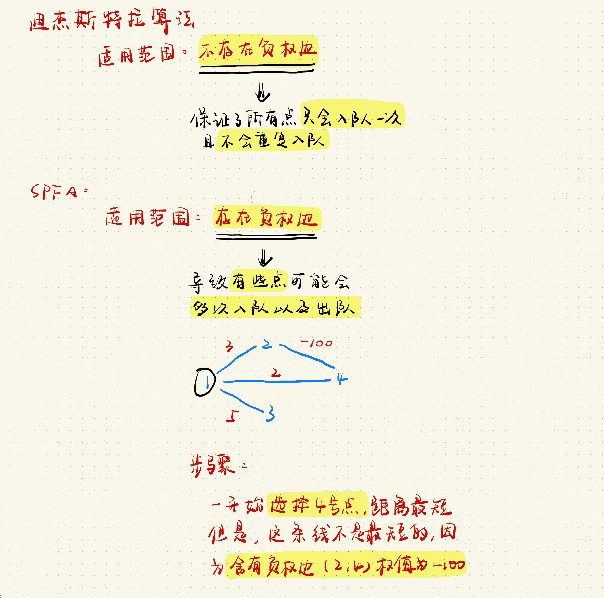
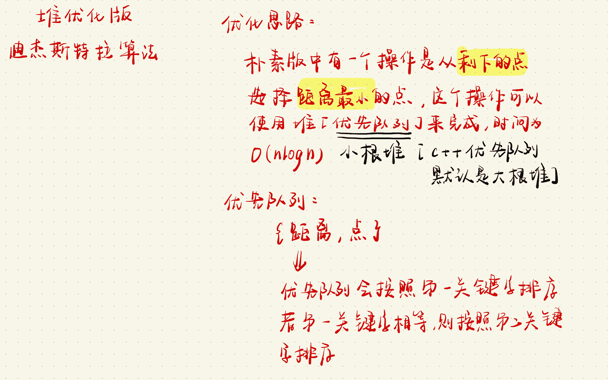

# 图论

## `Dijkstra`

### 原理以及与 `SPFA` 的区别



### [AcWing 849. Dijkstra求最短路 I](https://www.acwing.com/problem/content/851/)

**题目描述**

>   给定一个 `n` 个点 `m` 条边的有向图，图中可能存在重边和自环，所有边权均为正值。
>
>   请你求出 `1` 号点到 `n` 号点的最短距离，如果无法从 `1` 号点走到 `n` 号点，则输出 `−1`。

**输入格式**

>   第一行包含整数 `n` 和 `m`。
>
>   接下来 `m` 行每行包含三个整数 `x,y,z`，表示存在一条从点 `x` 到点 `y` 的有向边，边长为 `z`。

**输出格式**

>   输出一个整数，表示 `1` 号点到 `n` 号点的最短距离。
>
>   如果路径不存在，则输出 `−1`。

**数据范围**

>   +   $1≤n≤500,$
>   +   $1≤m≤10^5,$
>   +   $图中涉及边长均不超过10000。$

**输入样例**

```c++
3 3
1 2 2
2 3 1
1 3 4
```

**输出样例**

```c++
3
```

**手写稿**


**代码**

```c++
#include <iostream>
#include <cstring>
using namespace std;
const int N = 510, INF = 0x3f3f3f3f;
int n, m;
int st[N], dist[N];
int g[N][N];
int dijkstra() {
    memset(dist, 0x3f, sizeof dist);
    memset(st, 0, sizeof st);
    // 初始化距离
    dist[1] = 0;
    for (int i = 0; i < n; i ++ ) {
        // 找到【未被选择】的最小的点
        int t = -1;
        for (int j = 1; j <= n; j ++ )
            if (!st[j] && (t == -1 || dist[j] < dist[t])) t = j;
        // 标记当前点已经被选择
        st[t] = true;
        // 使用最小点t去更新【未被选择】的点
        for (int j = 1; j <= n; j ++ )
            if (!st[j] && dist[j] > dist[t] + g[t][j])
                dist[j] = dist[t] + g[t][j];
    }
    if (dist[n] == INF) return -1;
    return dist[n];
}
int main() {
    scanf("%d%d", &n, &m);
    // 初始化为正无穷
    memset(g, 0x3f, sizeof g);
    // 初始化对角线的距离
    for (int i = 1; i <= n; i ++ ) g[i][i] = 0;
    for (int i = 0; i < m; i ++ ) {
        int u, v, w;
        scanf("%d%d%d", &u, &v, &w);
        // 注意：有【重边】，取重边的最小值
        g[u][v] = min(g[u][v], w);
    }
    cout << dijkstra() << endl;
    return 0;
}
```

**时间复杂度**

$O(n^2)$

**空间复杂度**

$O(n^2)$

**标签**

`最短路`、`Dijkstra`

**缝合怪**

### [AcWing 850. Dijkstra求最短路 II](https://www.acwing.com/problem/content/852/)

**题目描述**

>   给定一个 `n` 个点 `m` 条边的有向图，图中可能存在重边和自环，所有边权均为非负值。
>
>   请你求出 `1` 号点到 `n` 号点的最短距离，如果无法从 `1` 号点走到 `n` 号点，则输出 `−1`。

**输入格式**

>   第一行包含整数 `n` 和 `m`。
>
>   接下来 `m` 行每行包含三个整数 `x,y,z`，表示存在一条从点 `x` 到点 `y` 的有向边，边长为 `z`。

**输出格式**

>   输出一个整数，表示 `1` 号点到 `n` 号点的最短距离。
>
>   如果路径不存在，则输出 `−1`。

**数据范围**

>   +   $1≤n,m≤1.5×10^5,$
>   +   $图中涉及边长均不小于 0，且不超过 10000。$
>   +   $数据保证：如果最短路存在，则最短路的长度不超过 10^9。$

**输入样例**

```c++
3 3
1 2 2
2 3 1
1 3 4
```

**输出样例**

```c++
3
```

**手写稿**



**代码**

```c++
#include <iostream>
#include <cstring>
#include <queue>
#define x first
#define y second
using namespace std;
typedef pair<int, int> PII;
const int N = 1.5e5 + 10, INF = 0x3f3f3f3f;
int n, m, idx;
int h[N], e[N], w[N], ne[N], dist[N], st[N];
priority_queue<PII, vector<PII>, greater<PII>> q;
void add(int a, int b, int c) {
    e[idx] = b;
    w[idx] = c;
    ne[idx] = h[a];
    h[a] = idx ++;
    return;
}
int dijkstra() {
    memset(dist, 0x3f, sizeof dist);
    dist[1] = 0;
    q.push({0, 1});
    while (q.size()) {
        auto t = q.top(); q.pop();
        int v = t.y;
        // 如果v已经被访问过，则直接进行下一次访问【原因在手写稿中已经说明】
        if (st[v]) continue;
        // 如果已经访问到终点
        if (v == n) break;
        // 将当前点标记为已经选择
        st[v] = true;
        // 遍历v的邻接点
        for (int i = h[v]; i != -1; i = ne[i]) {
            int j = e[i];
            // 如果当前点没有被访问过并且当前点有更优的路径
            // 那就干它
            if (!st[j] && dist[j] > dist[v] + w[i]) {
                dist[j] = dist[v] + w[i];
                q.push({dist[j], j});
            }
        }
    }
    if (dist[n] == INF) return -1;
    return dist[n];
}
int main() {
    scanf("%d%d", &n, &m);
    memset(h, -1, sizeof h);
    for (int i = 0; i < m; i ++ ) {
        int u, v, w;
        scanf("%d%d%d", &u, &v, &w);
        // 领接表不需要考虑重边的问题
        add(u, v, w);
    }
    cout << dijkstra() << endl;
    return 0;
}
```

**时间复杂度**

$O(log_n)$

**空间复杂度**

$O(m)$

**标签**

`堆优化版Dijkstra`

**缝合怪**

## `Bellman-Ford`

### [AcWing 853. 有边数限制的最短路](https://www.acwing.com/problem/content/855/)

**题目描述**

>   给定一个 `n` 个点 `m` 条边的有向图，图中可能存在重边和自环， **边权可能为负数**。
>
>   请你求出从 `1` 号点到 `n` 号点的最多经过 `k` 条边的最短距离，如果无法从 `1` 号点走到 `n` 号点，输出 `impossible`。
>
>   注意：图中可能 **存在负权回路** 。

**输入格式**

>   第一行包含三个整数 `n,m,k`。
>
>   接下来 `m` 行，每行包含三个整数 `x,y,z`，表示存在一条从点 `x` 到点 `y` 的有向边，边长为 `z`。

**输出格式**

>   输出一个整数，表示从 `1` 号点到 `n` 号点的最多经过 `k` 条边的最短距离。
>
>   如果不存在满足条件的路径，则输出 `impossible`。

**数据范围**

>   +   $1≤n,k≤500,$
>   +   $1≤m≤10000,$
>   +   $任意边长的绝对值不超过 10000。$

**输入样例**

```c++
3 3 1
1 2 1
2 3 1
1 3 3
```

**输出样例**

```c++
3
```

**手写稿**


**代码**

```c++
#include <iostream>
#include <cstring>
using namespace std;
const int N = 1e4 + 10, INF = 0x3f3f3f3f;
struct Node {
    int u, v, w;
}edges[N];
int n, m, k;
int backup[N], dist[N];
int Bellman_Ford() {
    // 初始化距离
    memset(dist, 0x3f, sizeof dist);
    // 距离源点的距离为0
    dist[1] = 0;
    for (int i = 0; i < k; i ++ ) { // 限制走k条路
        // 将上一层的数据备份
        memcpy(backup, dist, sizeof dist);
        for (int j = 0; j < m; j ++ ) { // 遍历每条边
            int u = edges[j].u, v = edges[j].v, w = edges[j].w;
            // 记得使用上一层的数据
            dist[v] = min(dist[v], backup[u] + w);
        }
    }
    if (dist[n] > INF / 2) return INF;
    return dist[n];
}
int main() {
    scanf("%d%d%d", &n, &m, &k);
    for (int i = 0; i < m; i ++ ) {
        int u, v, w;
        scanf("%d%d%d", &u, &v, &w);
        edges[i] = {u, v, w};
    }
    int t = Bellman_Ford();
    if (t == INF) puts("impossible");
    else cout << t << endl;
    return 0;
}
```

**时间复杂度**

$O(mk)$

**空间复杂度**

$O(m)$

**标签**

`Bellman_Ford`

**缝合怪**

## `SPFA`【优化版 `Bellman-Ford`】

### [AcWing 851. spfa求最短路](https://www.acwing.com/problem/content/853/)

**题目描述**

>   给定一个 `n` 个点 `m` 条边的有向图，图中可能存在重边和自环， **边权可能为负数**。
>
>   请你求出 `1` 号点到 `n` 号点的最短距离，如果无法从 `1` 号点走到 `n` 号点，则输出 `impossible`。
>
>   数据保证不存在负权回路。

**输入格式**

>   第一行包含整数 `n` 和 `m`。
>
>   接下来 `m` 行每行包含三个整数 `x,y,z`，表示存在一条从点 `x` 到点 `y` 的有向边，边长为 `z`。

**输出格式**

>   输出一个整数，表示 `1` 号点到 `n` 号点的最短距离。
>
>   如果路径不存在，则输出 `impossible`。

**数据范围**

>   +   $1≤n,m≤10^5,$
>   +   $图中涉及边长绝对值均不超过 10000。$

**输入样例**

```c++
3 3
1 2 5
2 3 -3
1 3 4
```

**输出样例**

```c++
2
```

**手写稿**


**代码**

```c++
#include <iostream>
#include <cstring>
#include <queue>
using namespace std;
const int N = 1e5 + 10, INF = 0x3f3f3f3f;
int n, m, idx;
queue<int> q;
int h[N], e[N], w[N], ne[N], dist[N], st[N];
void add(int a, int b, int c) {
    e[idx] = b;
    w[idx] = c;
    ne[idx] = h[a];
    h[a] = idx ++;
    return;
}
int spfa() {
    // 初始化距离
    memset(dist, 0x3f, sizeof dist);
    // 源点距离为0
    dist[1] = 0;
    // 将源点入队
    q.push(1);
    // 标记1号点已经在队列中
    st[1] = true;
    while (q.size()) {
        int t = q.front(); q.pop();
        // 标记1号点已经出队列
        st[t] = false;
        for (int i = h[t]; i != -1; i = ne[i]) {
            int j = e[i];
            // 不断更新最小距离
            if (dist[j] > dist[t] + w[i]) {
                dist[j] = dist[t] + w[i];
                // 如果当前点j不在队列中
                // 入队
                // 标记其在队列中
                if (!st[j]) {
                    st[j] = true;
                    q.push(j);
                }
            }
        }
    }
    if (dist[n] > INF / 2) return INF;
    return dist[n];
}
int main() {
    scanf("%d%d", &n, &m);
    memset(h, -1, sizeof h);
    for (int i = 0; i < m; i ++ ) {
        int u, v, w;
        scanf("%d%d%d", &u, &v, &w);
        add(u, v, w);
    }
    int t = spfa();
    if (t == INF) puts("impossible");
    else cout << t << endl;
    return 0;
}
```

**时间复杂度**

$最坏时间复杂度O(n^2)$

**空间复杂度**

$O(n)$

**标签**

`spfa`

**缝合怪**

### [AcWing 852. spfa判断负环](https://www.acwing.com/problem/content/854/)

**题目描述**

>   给定一个 `n` 个点 `m` 条边的有向图，图中可能存在重边和自环， **边权可能为负数**。
>
>   请你判断图中是否存在负权回路。

**输入格式**

>   第一行包含整数 `n` 和 `m`。
>
>   接下来 `m` 行每行包含三个整数 `x,y,z`，表示存在一条从点 `x` 到点 `y` 的有向边，边长为 `z`。

**输出格式**

>   如果图中**存在**负权回路，则输出 `Yes`，否则输出 `No`。

**数据范围**

>   +   $1≤n≤2000,$
>   +   $1≤m≤10000,$
>   +   $图中涉及边长绝对值均不超过 10000。$

**输入样例**

```c++
3 3
1 2 -1
2 3 4
3 1 -4
```

**输出样例**

```c++
Yes
```

**手写稿**

>   1.   如果某个点被更新的次数大于等于 `n`，说明一定存在负环

**代码**

```c++
#include <iostream>
#include <cstring>
#include <queue>
using namespace std;
const int N = 2010, M = 10010;
int n, m, idx;
int h[N], dist[N], cnt[N], st[N], e[M], w[M], ne[M];
queue<int> q;
void add(int a, int b, int c) {
    e[idx] = b;
    w[idx] = c;
    ne[idx] = h[a];
    h[a] = idx ++;
    return;
}
bool spfa() {
    for (int i = 1; i <= n; i ++ ) {
        q.push(i);
        st[i] = true;
    }
    while (q.size()) {
        int t = q.front(); q.pop();
        st[t] = false;
        for (int i = h[t]; i != -1; i = ne[i]) {
            int j = e[i];
            if (dist[j] > dist[t] + w[i]) {
                dist[j] = dist[t] + w[i];
                // 记录每个点被更新的次数
                cnt[j] = cnt[t] + 1;
                // 如果被更新的次数大于等于n，说明存在环
        		if (cnt[j] >= n) return true;
                if (!st[j]) {
                    st[j] = true;
                    q.push(j);
                }
            }
        }
    }
    return false;
}
int main() {
    scanf("%d%d", &n, &m);
    memset(h, -1, sizeof h);
    for (int i = 0; i < m; i ++ ) {
        int u, v, w;
        scanf("%d%d%d", &u, &v, &w);
        add(u, v, w);
    }
    if(spfa()) puts("Yes");
    else puts("No");
    return 0;
}
```

**时间复杂度**

$O(nm)$

**空间复杂度**

$O(m)$

**标签**

`SPFA判负环`

**缝合怪**

