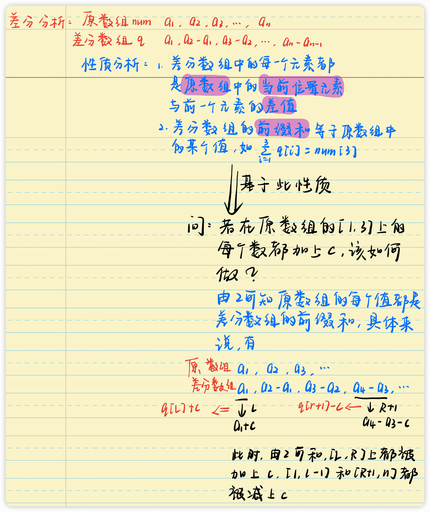
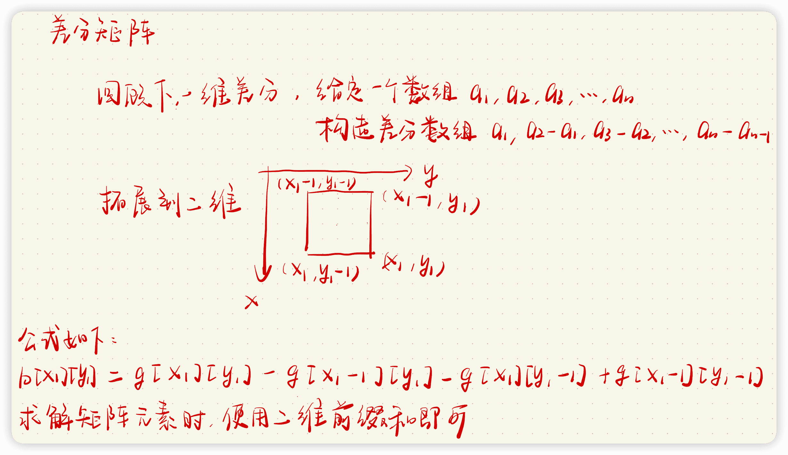

# 差分

## 一维差分

### [AcWing 797. 差分](https://www.acwing.com/problem/content/799/)

>   输入一个长度为 `n` 的整数序列。
>
>   接下来输入 `m` 个操作，每个操作包含三个整数 `l,r,c`，表示将序列中 `[l,r]` 之间的每个数加上 `c`。
>
>   请你输出进行完所有操作后的序列。

**输入格式**

>   第一行包含两个整数 `n` 和 `m`。
>
>   第二行包含 `n` 个整数，表示整数序列。
>
>   接下来 `m` 行，每行包含三个整数 `l，r，c`，表示一个操作。

**输出格式**

>   共一行，包含 `n` 个整数，表示最终序列。

**数据范围**

>   +   $1≤n,m≤100000,$
>   +   $1≤l≤r≤n,$
>   +   $−1000≤c≤1000,$
>   +   $−1000≤整数序列中元素的值≤1000$

**输入样例**

```c++
6 3
1 2 2 1 2 1
1 3 1
3 5 1
1 6 1
```

**输出样例**

```c++
3 4 5 3 4 2
```

**手写稿**



**代码**

```c++
#include <iostream>
using namespace std;
const int N = 100010;
int n, m;
int g[N];
int main() {
    scanf("%d%d", &n, &m);
    for (int i = 1, a = 0, b = 0; i <= n; i ++ ) {
        scanf("%d", &a);
        g[i] = a - b;
        b = a;
    }
    while (m -- ) {
        int l, r, c;
        scanf("%d%d%d", &l, &r, &c);
        g[l] += c;
        g[r + 1] -= c;
    }
    for (int i = 1, x; i <= n; i ++ ) {
        x += g[i];
        cout << x << " ";
    }
    return 0;
}
```

**标签**

`差分`、`一维差分`

### [AcWing 4195. 线段覆盖](https://www.acwing.com/problem/content/4198/)

>   在一个坐标轴上有 `n` 条线段。
>
>   每条线段的每个端点的坐标都为整数。
>
>   可能存在退化成点的线段。
>
>   线段之间可以相互交叉、嵌套甚至重合。
>
>   请你计算，对于每个 `k∈{1,2,…,n}`，坐标轴中共有多少个**整数坐标**的点满足恰好被 `k` 条线段覆盖。
>
>   注意，左右端点分别为 $l_i,r_i$ 的线段覆盖点 `x` 当且仅当 $l_i≤x≤r_i$。

**输入格式**

>   第一行包含整数 `n`。
>
>   接下来 `n` 行，每行包含两个整数 $l_i,r_i$，表示一条线段的左右端点。

**输出格式**

>   一行 `n` 个整数，其中第 `i` 个整数表示坐标轴中满足恰好被 `i` 条线段覆盖的**整数坐标**的点的数量。

**数据范围**

>   +   $前三个测试点满足 1≤n≤3。$
>   +   $所有测试点满足 1≤n≤2×10^5，0≤li≤ri≤10^{18}。$

**输入样例1**

```c++
3
0 3
1 3
3 8
```

**输出样例1**

```c++
6 2 1
```

**输入样例2**

```c++
3
1 3
2 4
5 7
```

**输出样例2**

```c++
5 2 0
```

**手写稿**


**代码**

```c++
#include <iostream>
#include <map>
using namespace std;
typedef long long LL;
const int N = 200010;
int n;
LL ans[N];
// 差分数组
map<LL, LL> q;
int main() {
    scanf("%d", &n);
    for (int i = 1; i <= n; i ++ ) {
        LL l, r;
        scanf("%lld%lld", &l, &r);
        q[l] += 1;
        q[r + 1] -= 1;
    }
    // last表示上一个位置，sum表示前缀和
    LL last = -1, sum = 0;
    for (auto& [x, c] : q) {
        ans[sum] += x - last;
        last = x;
        sum += c;
    }
    for (int i = 1; i <= n; i ++ ) cout << ans[i] << " ";
    return 0;
}
```

**标签**

`离散化`、`差分`

## 二维差分

### [AcWing 798. 差分矩阵](https://www.acwing.com/problem/content/800/)

>   输入一个 `n` 行 `m` 列的整数矩阵，再输入 `q` 个操作，每个操作包含五个整数 `x1,y1,x2,y2,c`，其中 `(x1,y1)` 和 `(x2,y2)` 表示一个子矩阵的左上角坐标和右下角坐标。
>
>   每个操作都要将选中的子矩阵中的每个元素的值加上 `c`。
>
>   请你将进行完所有操作后的矩阵输出。

**输入格式**

>   第一行包含整数 `n,m,q`。
>
>   接下来 `n` 行，每行包含 `m` 个整数，表示整数矩阵。
>
>   接下来 `q` 行，每行包含 `5` 个整数 `x1,y1,x2,y2,c`，表示一个操作。

**输出格式**

>   共 `n` 行，每行 `m` 个整数，表示所有操作进行完毕后的最终矩阵。

**数据范围**

>   +   $1≤n,m≤1000,$
>   +   $1≤q≤100000,$
>   +   $1≤x1≤x2≤n,$
>   +   $1≤y1≤y2≤m,$
>   +   $−1000≤c≤1000,$
>   +   $−1000≤矩阵内元素的值≤1000$

**输入样例**

```c++
3 4 3
1 2 2 1
3 2 2 1
1 1 1 1
1 1 2 2 1
1 3 2 3 2
3 1 3 4 1
```

**输出样例**

```c++
2 3 4 1
4 3 4 1
2 2 2 2
```

**手写稿**



**代码**

```c++
#include <iostream>
using namespace std;
const int N = 1010;
int n, m, q;
int g[N][N], b[N][N];
int main() {
    scanf("%d%d%d",&n, &m, &q);
    for (int i = 1; i <= n; i ++ )
        for (int j = 1; j <= m; j ++ ) {
            scanf("%d", &g[i][j]);
            // 构建差分矩阵
            b[i][j] = g[i][j] - g[i - 1][j] - g[i][j - 1] + g[i - 1][j - 1];
            
        }
    while (q -- ) {
        int x1, y1, x2, y2, c;
        scanf("%d%d%d%d%d", &x1, &y1, &x2, &y2, &c);
        // 差分矩阵公式
        b[x1][y1] += c;
        b[x2 + 1][y1] -= c;
        b[x1][y2 + 1] -= c;
        b[x2 + 1][y2 + 1] += c;
    }
    for (int i = 1; i <= n; i ++ ) {
        for (int j = 1; j <= m; j ++ ) {
            // 求前缀和
            b[i][j] = b[i][j] + b[i - 1][j] + b[i][j - 1] - b[i - 1][j - 1];
            cout << b[i][j] << " ";
        }
        cout << endl;
    }
    return 0;
}
```

**标签**

`差分`、`二维差分`