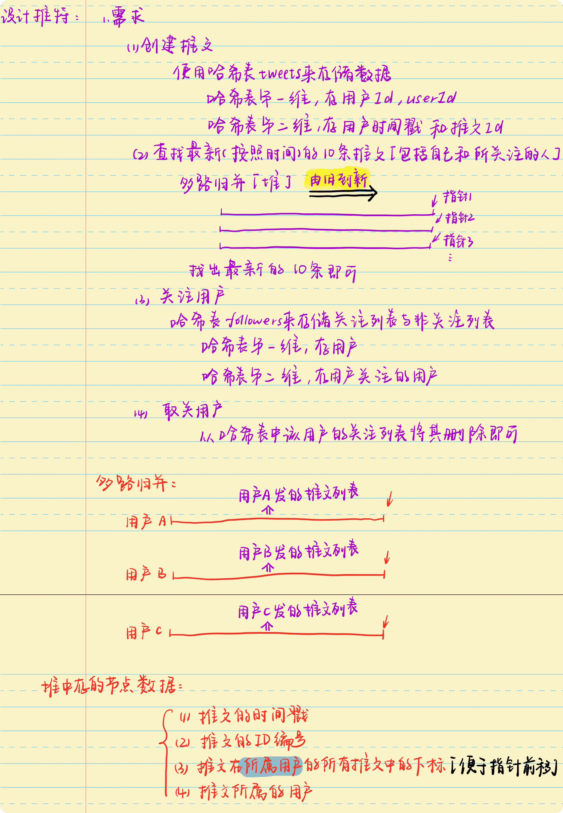

# 排序专题

## 快排

### [AcWing 786. 第k个数](https://www.acwing.com/problem/content/description/788/)

**题目描述**

> 给定一个长度为 `n` 的整数数列，以及一个整数 `k`，请用快速选择算法求出数列从小到大排序后的第 `k` 个数。

**输入格式**

> 第一行包含两个整数 `n` 和 `k`。
>
> 第二行包含 `n` 个整数（所有整数均在 $1∼10^9$ 范围内），表示整数数列。

**输出格式**

> 输出一个整数，表示数列的第 `k` 小数。

**数据范围**

> + $1≤n≤100000$,
> + $1≤k≤n$

**输入样例**

```c++
5 3
2 4 1 5 3
```

**输出样例**

```c++
3
```

**手写稿**


**代码**

```c++
#include <iostream>
using namespace std;
const int N = 100010;
int n, k;
int g[N];
int quick_sort(int g[], int l, int r, int k) {
    if (l == r) return g[l];
    int x = g[l];
    int i = l - 1, j = r + 1;
    while (i < j) {
        // 为啥不能写等号，如果全部都是相同值会越界
        do i ++ ; while(g[i] < x);
        do j -- ; while(g[j] > x);
        if (i < j) swap(g[i], g[j]);
    }
    // 统计左边小于等于x的数目
    int sl = j - l + 1;
    // 递归左区间
    if (k <= sl) return quick_sort(g, l, j, k);
    // 递归右区间
    return quick_sort(g, j + 1, r, k - sl);
}
int main() {
    scanf("%d%d", &n, &k);
    for (int i = 1; i <= n; i ++ ) scanf("%d", &g[i]);
    cout << quick_sort(g, 1, n, k) << endl;
    return 0;
}
```

**标签**

`快速排序`、`快速选择算法`

### [LeetCode 324. 摆动排序 II](https://leetcode-cn.com/problems/wiggle-sort-ii/)

**题目描述**

> 给你一个整数数组 `nums`，将它重新排列成 `nums[0] < nums[1] > nums[2] < nums[3]...` 的顺序。
>
> 你可以假设所有输入数组都可以得到满足题目要求的结果。

**示例 1**

> 输入：`nums = [1,5,1,1,6,4]`
> 输出：`[1,6,1,5,1,4]`
> 解释：`[1,4,1,5,1,6]` 同样是符合题目要求的结果，可以被判题程序接受。

**示例 2**

> 输入：`nums = [1,3,2,2,3,1]`
> 输出：`[2,3,1,3,1,2]`

**提示**

> + $1 <= nums.length <= 5 * 10^4$
> + $0 <= nums[i] <= 5000$
> + $题目数据保证，对于给定的输入 nums ，总能产生满足题目要求的结果$

**进阶**

> 你能用 `O(n)` 时间复杂度和 / 或原地 `O(1)` 额外空间来实现吗？

**手写稿**


**代码**

```c++
class Solution {
public:
    void wiggleSort(vector<int>& nums) {
        int n = nums.size();
        // 找到中位数的迭代器
        auto midptr = nums.begin() + n / 2;
        nth_element(nums.begin(), midptr, nums.end());
        int mid = *midptr;
        // 三数排序，同LeetCode75题
        for (int i = 0, j = 0, k = n - 1; i <= k; ) {
            if (nums[i] < mid) swap(nums[i ++ ], nums[j ++ ]);
            else if (nums[i] == mid) i ++;
            else swap(nums[i], nums[k --]);
        }
        if (n & 1) ++ midptr;
        auto left = vector<int>(nums.begin(), midptr);
        // 逆序
        reverse(left.begin(), left.end());
        auto right = vector<int>(midptr, nums.end());
        // 逆序
        reverse(right.begin(), right.end());
        // 将前半部分放置在偶数位置
        for (int i = 0; i < left.size(); i ++ ) nums[i * 2] = left[i];
        // 将后半部分放置在奇数位置
        for (int i = 0; i < right.size(); i ++ ) nums[i * 2 + 1] = right[i];
        return;
    }
};
```

**标签**

`快速选择排序`

## 计数排序

### 原理

**简介**

>   计数排序不是基于比较的排序算法，其核心在于将输入的数据值转化为键存储在额外开辟的数组空间中。 作为一种线性时间复杂度的排序，计数排序要求输入的数据必须是有确定范围的整数。

**动图演示**


### [LeetCode 347. 前 K 个高频元素](https://leetcode-cn.com/problems/top-k-frequent-elements/)

**题目描述**

>   给你一个整数数组 `nums` 和一个整数 `k` ，请你返回其中出现频率前 `k` 高的元素。你可以按 任意顺序 返回答案。

**示例 1**

>   输入: `nums = [1,1,1,2,2,3], k = 2`
>   输出: `[1,2]`

**示例 2**

>   输入: `nums = [1], k = 1`
>   输出: `[1]`

**提示**

>   +   $1 <= nums.length <= 10^5$
>   +   $k 的取值范围是 [1, 数组中不相同的元素的个数]$
>   +   $题目数据保证答案唯一，换句话说，数组中前 k 个高频元素的集合是唯一的$

**进阶**

>   你所设计算法的时间复杂度 必须 优于 `O(n log n)` ，其中 `n` 是数组大小。

**手写稿**


**代码**

```c++
class Solution {
public:
    vector<int> topKFrequent(vector<int>& nums, int k) {
        unordered_map<int, int> cnt;
        int n = nums.size();
        // 统计每个数字出现的次数
        for (auto& num : nums) cnt[num] ++;
        vector<int> s(n + 1);
        for (auto [x, c] : cnt) s[c] ++;
        int i = n, t = 0;
        while (t < k) t += s[i --];
        vector<int> res;
        for (auto [x, c] : cnt)
            if (c > i) res.push_back(x);
        return res;
    }
};
```

**标签**

`计数排序`

## 归并排序

### 多路归并

#### [LeetCode 355. 设计推特](https://leetcode-cn.com/problems/design-twitter/)

**题目描述**

>   设计一个简化版的推特`(Twitter)`，可以让用户实现发送推文，关注/取消关注其他用户，能够看见关注人（包括自己）的最近 `10` 条推文。
>
>   实现 `Twitter` 类：
>
>   +   `Twitter()` 初始化简易版推特对象
>   +   `void postTweet(int userId, int tweetId)` 根据给定的 `tweetId` 和 `userId` 创建一条新推文。每次调用此函数都会使用一个不同的 `tweetId` 。
>   +   `List<Integer> getNewsFeed(int userId)` 检索当前用户新闻推送中最近  `10` 条推文的 `ID` 。新闻推送中的每一项都必须是由用户关注的人或者是用户自己发布的推文。推文必须 按照时间顺序由最近到最远排序 。
>   +   `void follow(int followerId, int followeeId)` `ID` 为 `followerId` 的用户开始关注 `ID` 为 `followeeId` 的用户。
>   +   `void unfollow(int followerId, int followeeId)` `ID` 为 `followerId` 的用户不再关注 `ID` 为 `followeeId` 的用户。

**示例**

>   输入
>   `["Twitter", "postTweet", "getNewsFeed", "follow", "postTweet", "getNewsFeed", "unfollow", "getNewsFeed"]
>   [[], [1, 5], [1], [1, 2], [2, 6], [1], [1, 2], [1]]`
>   输出
>   `[null, null, [5], null, null, [6, 5], null, [5]]`
>
>   解释
>   `Twitter twitter = new Twitter();`
>   `twitter.postTweet(1, 5);` // 用户 `1` 发送了一条新推文 (用户 `id = 1`, 推文 `id = 5`)
>   `twitter.getNewsFeed(1);`  // 用户 `1` 的获取推文应当返回一个列表，其中包含一个 `id` 为 `5` 的推文
>   `twitter.follow(1, 2);`    // 用户 `1` 关注了用户 `2`
>   `twitter.postTweet(2, 6);` // 用户 `2` 发送了一个新推文 (推文 `id = 6`)
>   `twitter.getNewsFeed(1);`  // 用户 `1` 的获取推文应当返回一个列表，其中包含两个推文，`id` 分别为 `-> [6, 5] `。推文 `id 6` 应当在推文 `id 5` 之前，因为它是在 `5` 之后发送的
>   `twitter.unfollow(1, 2);`  // 用户 `1` 取消关注了用户 `2`
>   `twitter.getNewsFeed(1);`  // 用户 `1` 获取推文应当返回一个列表，其中包含一个 `id` 为 `5` 的推文。因为用户 `1` 已经不再关注用户 `2`

**提示**

>   +   $1 <= userId, followerId, followeeId <= 500$
>   +   $0 <= tweetId <= 10^4$
>   +   $所有推特的 ID 都互不相同$
>   +   $postTweet、getNewsFeed、follow 和 unfollow 方法最多调用 3 * 10^4 次$

**手写稿**



**代码**

```c++
typedef pair<int, int> PII;
#define x first
#define y second
class Twitter {
public:
    // 存储发布推文信息
    unordered_map<int, vector<PII>> tweets;
    // 存储用户的关注列表
    unordered_map<int, unordered_set<int>> followers;
    // 时间戳
    int ts;
    Twitter() {
        ts = 0;
    }
    
    void postTweet(int userId, int tweetId) {
        tweets[userId].push_back({ts ++ , tweetId});
        return;
    }
    
    vector<int> getNewsFeed(int u) {
        // 多路归并
        priority_queue<vector<int>> heap;
        followers[u].insert(u);
        // 遍历u的所有关注者【包括自己】，其原因是因为自己的推文也算在最新的10条推文内
        for (auto user : followers[u]) {
            // 获取当前用户所有推文
            auto& ts = tweets[user];
            // 如果当前用户还有剩余的推文
            if (ts.size()) {
                // 找到当前用户的【最新发布】的推文的位置【数组的最后一个元素的下标】
                int i = ts.size() - 1;
                // 【推文发布的时间，推文编号，推文的位置，所属用户】
                heap.push({ts[i].x, ts[i].y, i, user});
            }
        }
        vector<int> res;
        for (int i = 0; i < 10 && heap.size(); i ++ ) { // 最近的10条推文
            auto t = heap.top(); heap.pop();
            // 获取推文的编号
            res.push_back(t[1]);
            // 获取当前推文所属的下标位置
            int j = t[2];
            // 如果还有推文
            if (j) {
                // 多路归并的指针前移
                j -- ;
                // 获取当前推文所属的用户
                auto& user = t[3];
                // 获取用户的所有推文
                auto& ts = tweets[user];
                // 保存当前指针对应的推文的信息
                // 【推文发布的时间，推文编号，推文的位置，所属用户】
                heap.push({ts[j].x, ts[j].y, j, user});
            }
        }
        return res;
    }
    
    void follow(int followerId, int followeeId) {
        followers[followerId].insert(followeeId);
        return;
    }
    
    void unfollow(int followerId, int followeeId) {
        followers[followerId].erase(followeeId);
        return;
    }
};

/**
 * Your Twitter object will be instantiated and called as such:
 * Twitter* obj = new Twitter();
 * obj->postTweet(userId,tweetId);
 * vector<int> param_2 = obj->getNewsFeed(userId);
 * obj->follow(followerId,followeeId);
 * obj->unfollow(followerId,followeeId);
 */
```

**标签**

`多路归并`

#### [LeetCode 373. 查找和最小的 K 对数字](https://leetcode-cn.com/problems/find-k-pairs-with-smallest-sums/)

**题目描述**

>   给定两个以 升序排列 的整数数组 `nums1` 和 `nums2` , 以及一个整数 `k` 。
>
>   定义一对值 `(u,v)`，其中第一个元素来自 `nums1`，第二个元素来自 `nums2` 。
>
>   请找到和最小的 `k` 个数对 $(u_1,v_1),  (u_2,v_2)  ...  (u_k,v_k)$ 。

**示例 1**

>   输入: `nums1 = [1,7,11], nums2 = [2,4,6], k = 3`
>   输出: `[1,2],[1,4],[1,6]`
>   解释: 返回序列中的前 `3` 对数：
>       `[1,2],[1,4],[1,6],[7,2],[7,4],[11,2],[7,6],[11,4],[11,6]`

**示例 2**

>   输入: `nums1 = [1,1,2], nums2 = [1,2,3], k = 2`
>   输出: `[1,1],[1,1]`
>   解释: 返回序列中的前 `2` 对数：
>       `[1,1],[1,1],[1,2],[2,1],[1,2],[2,2],[1,3],[1,3],[2,3]`

**示例 3**

>   输入: `nums1 = [1,2], nums2 = [3], k = 3`
>   输出: `[1,3],[2,3]`
>   解释: 也可能序列中所有的数对都被返回:`[1,3],[2,3]`

**提示**

>   +   $1 <= nums1.length, nums2.length <= 10^5$
>   +   $-10^9 <= nums1[i], nums2[i] <= 10^9$
>   +   $nums1 和 nums2 均为升序排列$
>   +   $1 <= k <= 1000$

**手写稿**


**代码**

```c++
class Solution {
public:
    vector<vector<int>> kSmallestPairs(vector<int>& a, vector<int>& b, int k) {
        if (a.empty() || b.empty()) return {};
        priority_queue<vector<int>, vector<vector<int>>, greater<vector<int>>> heap;
        int n = a.size(), m = b.size();
        for (int i = 0; i < n; i ++ ) heap.push({a[i] + b[0], i, 0});
        vector<vector<int>> res;
        // k路归并
        while (k -- && heap.size()) {
            auto t = heap.top(); heap.pop();
            res.push_back({a[t[1]], b[t[2]]});
            // 如果其中的某个数组已经到达末尾，则【该数组】不需要继续后移
            // 但是，可不能【退出】，原因在【手写稿】中
            if (t[2] + 1 < m)
                heap.push({a[t[1]] + b[t[2] + 1], t[1], t[2] + 1});
        }
        return res;
    }
};
```

**标签**

`优先队列`、`K路归并`
