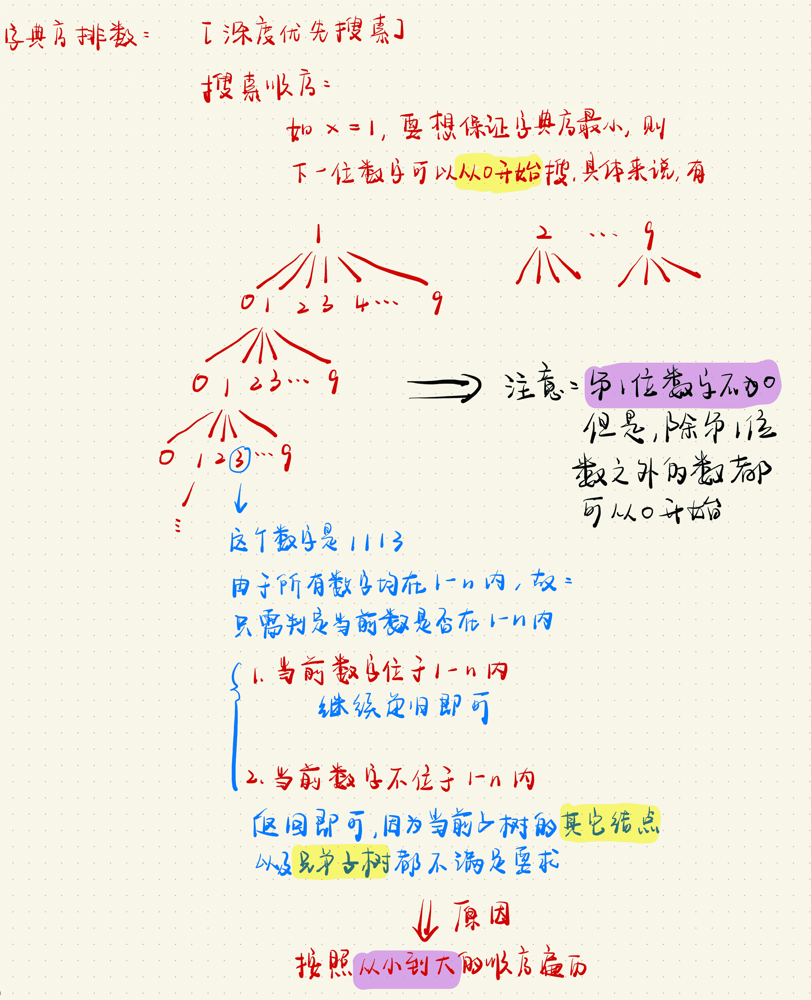
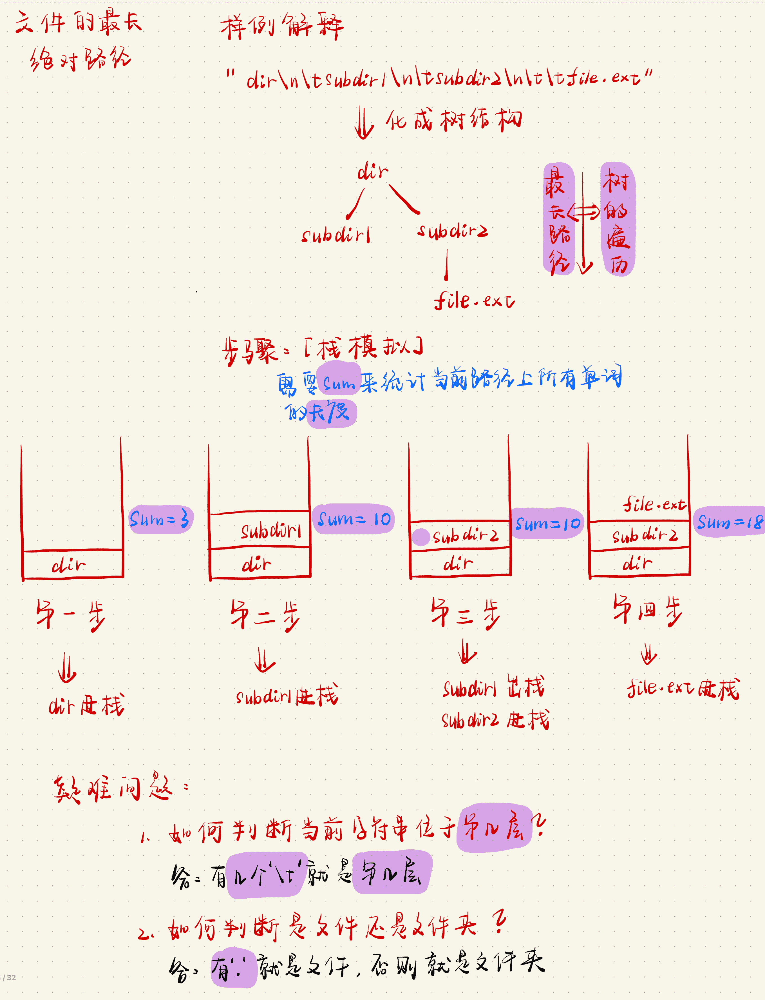
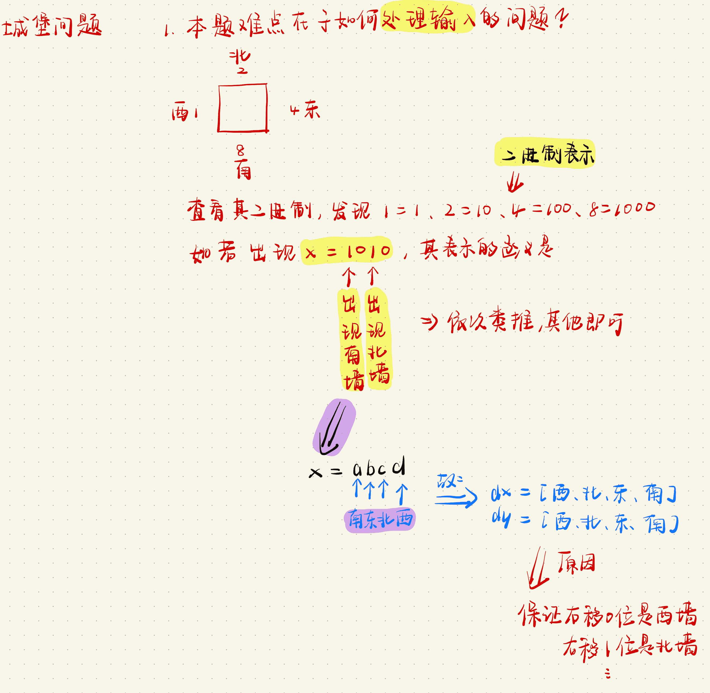
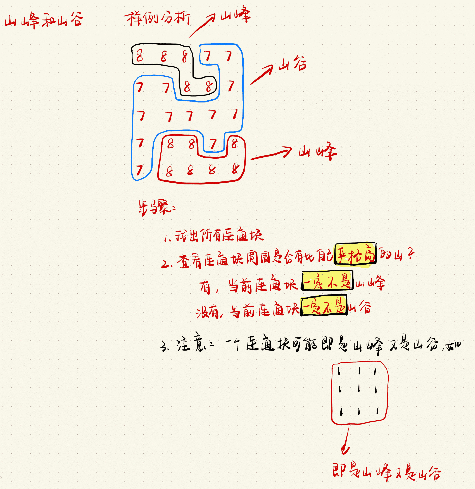
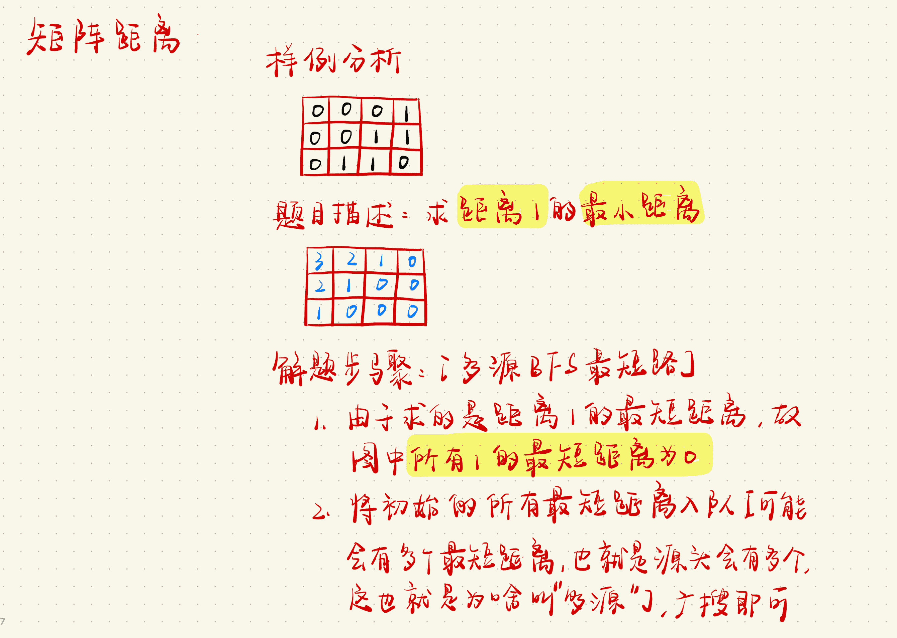
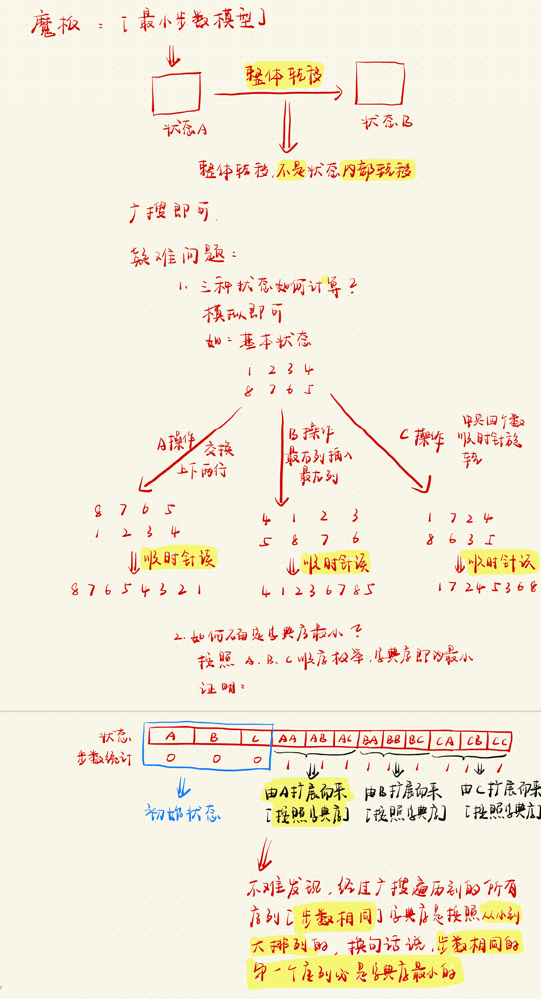

# 深度优先搜索

## [LeetCode 306. 累加数](https://leetcode-cn.com/problems/additive-number/)

**题目描述**

> 累加数 是一个字符串，组成它的数字可以形成累加序列。
>
> 一个有效的 累加序列 必须 至少 包含 `3` 个数。除了最开始的两个数以外，序列中的每个后续数字必须是它之前两个数字之和。
>
> 给你一个只包含数字 `'0'-'9'` 的字符串，编写一个算法来判断给定输入是否是 累加数 。如果是，返回 `true` ；否则，返回 `false` 。
>
> 说明：累加序列里的数，除数字 `0` 之外，不会 以 `0` 开头，所以不会出现 `1, 2, 03` 或者 `1, 02, 3` 的情况。

**示例 1**

> 输入：`"112358"`
> 输出：`true`
> 解释：累加序列为: `1, 1, 2, 3, 5, 8 。1 + 1 = 2, 1 + 2 = 3, 2 + 3 = 5, 3 + 5 = 8`

**示例 2**

> 输入：`"199100199"`
> 输出：`true`
> 解释：累加序列为: `1, 99, 100, 199。1 + 99 = 100, 99 + 100 = 199`

**提示**

> + $1 <= num.length <= 35$
> + $num 仅由数字（0 - 9）组成$

**进阶**

> 你计划如何处理由过大的整数输入导致的溢出?

**步骤**

> 1. 深度优先搜索，爆搜 `num` 字符串，枚举每个数字字符并且将其记录在 `path` 数组当中 ，查看是否满足答案
> 2. 递归出口
>     + 如果 `path` 的个数大于等于 `3` 个，进行判断 `path[n - 3] + path[n - 2] == path[n - 1]` 是否成立，分以下两种情况
>         + 如果条件成立，则继续向下操作
>         + 如果条件不成立，则直接截去当前分支，即返回 `false`
>     + 如果当前枚举的字符位置 `u` 为最后一个位置，则进行如下判断
>         + 如果 `path` 的个数大于等于 `3` 个，则说明存在一组答案，返回 `true`
>         + 否则，返回 `false`
> 3. 遍历字符串即可

**代码**

```c++
class Solution {
public:
    string add(string& a, string& b) {
        vector<int> A, B, C;
        for (int i = a.size() - 1; i >= 0; i -- ) A.push_back(a[i] - '0');
        for (int i = b.size() - 1; i >= 0; i -- ) B.push_back(b[i] - '0');
        for (int i = 0, t = 0; i < A.size() || i < B.size() || t; i ++ ) {
            if (i < A.size()) t += A[i];
            if (i < B.size()) t += B[i];
            C.push_back(t % 10);
            t /= 10;
        }
        string res;
        for (int i = C.size() - 1; i >= 0; i -- ) res += to_string(C[i]);
        return res;
    }
    bool dfs(string& num, vector<string>& path, int u) {
        int n = path.size();
        // 如果个数大于等于3个
        if (n >= 3) {
            string a = path[n - 3];
            string b = path[n - 2];
            string c = path[n - 1];
            string d = add(a, b);
            // 如果不相等，返回false
            if (d != c) return false;
        }
        // 如果枚举到最后一个字符
        if (u == num.size()) {
            // 如果个数大于等于3个，返回true
            if (path.size() >= 3) return true;
            return false;
        }
        for (int i = u; i < num.size(); i ++ ) {
            // 从u开始截取长度为i - u + 1的字符串
            path.push_back(num.substr(u, i - u + 1));
            // 如果能够搜索到正确答案，则返回true
            if (dfs(num, path, i + 1)) return true;
            // 回溯
            path.pop_back();
            // 如果出现前导0，则返回false
            // 注意，在后面添加此条件，说明当前字符已经被遍历过
            // 即0已经被遍历过，接下来要遍历的是形如01，02之类的数字，必不满足条件，返回即可
            if (num[u] == '0') return false;
        }
        return false;
    }
    bool isAdditiveNumber(string num) {
        vector<string> path;
        return dfs(num, path, 0);
    }
};
```

**标签**

`dfs`、`高精度`

## [LeetCode 385. 迷你语法分析器](https://leetcode-cn.com/problems/mini-parser/)

**题目描述**

>   给定一个字符串 `s` 表示一个整数嵌套列表，实现一个解析它的语法分析器并返回解析的结果 `NestedInteger` 。
>
>   列表中的每个元素只可能是整数或整数嵌套列表

**示例 1**

>   输入：`s = "324",`
>   输出：`324`
>   解释：你应该返回一个 `NestedInteger` 对象，其中只包含整数值 `324`。

**示例 2**

>   输入：`s = "[123,[456,[789]]]",`
>   输出：`[123,[456,[789]]]`
>   解释：返回一个 `NestedInteger` 对象包含一个有两个元素的嵌套列表：
>
>   1. 一个 `integer` 包含值 `123`
>   2. 一个包含两个元素的嵌套列表：
>       i.  一个 `integer` 包含值 `456`
>       ii. 一个包含一个元素的嵌套列表
>            a. 一个 `integer` 包含值 `789`

**提示**

>   +   $1 <= s.length <= 5 * 10^4$
>   +   $s 由数字、方括号 "[]"、负号 '-' 、逗号 ','组成$
>   +   $用例保证 s 是可解析的 NestedInteger$
>   +   $输入中的所有值的范围是 [-10^6, 10^6]$

**手写稿**


**代码**

```c++
/**
 * // This is the interface that allows for creating nested lists.
 * // You should not implement it, or speculate about its implementation
 * class NestedInteger {
 *   public:
 *     // Constructor initializes an empty nested list.
 *     NestedInteger();
 *
 *     // Constructor initializes a single integer.
 *     NestedInteger(int value);
 *
 *     // Return true if this NestedInteger holds a single integer, rather than a nested list.
 *     bool isInteger() const;
 *
 *     // Return the single integer that this NestedInteger holds, if it holds a single integer
 *     // The result is undefined if this NestedInteger holds a nested list
 *     int getInteger() const;
 *
 *     // Set this NestedInteger to hold a single integer.
 *     void setInteger(int value);
 *
 *     // Set this NestedInteger to hold a nested list and adds a nested integer to it.
 *     void add(const NestedInteger &ni);
 *
 *     // Return the nested list that this NestedInteger holds, if it holds a nested list
 *     // The result is undefined if this NestedInteger holds a single integer
 *     const vector<NestedInteger> &getList() const;
 * };
 */
class Solution {
public:
    NestedInteger dfs(string& s, int& u) {
        NestedInteger res;
        if (s[u] == '[') {
            u ++; // 跳过左括号
            while (s[u] != ']') res.add(dfs(s, u));
            u ++; // 跳过右括号
            if (u < s.size() && s[u] == ',') u ++; // 跳过逗号
        }
        else {
            int k = u;
            // 将数字部分找出来
            // 注意不能使用isdigit()，因为，数字可能是负数，有'-'
            while (k < s.size() && s[k] != ',' && s[k] != ']') k ++;
            // 将数字转化成int类型
            res.setInteger(stoi(s.substr(u, k - u)));
            // 跳过逗号
            if (k < s.size() && s[k] == ',') k ++;
            u = k;
        }
        return res;
    }
    NestedInteger deserialize(string s) {
        int u = 0;
        // 注意这里使用的是引用
        // 其原因是不需要回溯操作，沿着字符串一条路走到黑即可
        return dfs(s, u);
    }
};
```

**时间复杂度**

$O(n)$

**空间复杂度**

$O(n)$

**标签**

`深度优先搜索`

**缝合怪**

[LeetCode 341. 扁平化嵌套列表迭代器](#LeetCode 341. 扁平化嵌套列表迭代器)

## [LeetCode 386. 字典序排数](https://leetcode-cn.com/problems/lexicographical-numbers/)

**题目描述**

>   给你一个整数 `n` ，按字典序返回范围 `[1, n]` 内所有整数。
>
>   你必须设计一个时间复杂度为 `O(n)` 且使用 `O(1)` 额外空间的算法。

**示例 1**

>   输入：`n = 13`
>   输出：`[1,10,11,12,13,2,3,4,5,6,7,8,9]`

**示例 2**

>   输入：`n = 2`
>   输出：`[1,2]`

**提示**

>   +   $1 <= n <= 5 * 10^4$

**手写稿**



**代码**

```c++
class Solution {
public:
    vector<int> res;
    void dfs(int cur, int n) {
        // 如果当前的数字大于n，则直接返回
        if (cur > n) return;
        // 如果当前的数字小于等于n，说明符合条件，加入答案数组即可
        if (cur <= n) res.push_back(cur);
        // 枚举下一位数字，注意：除第一位数字之外的每一位上的数字可填的范围为[0, 9]
        for (int i = 0; i <= 9; i ++ ) dfs(cur * 10 + i, n);
        return;
    }
    vector<int> lexicalOrder(int n) {
        // 枚举第一位数字
        for (int i = 1; i <= 9; i ++ ) dfs(i, n);
        return res;
    }
};
```

**时间复杂度**

$递归复杂度不好分析$

**空间复杂度**

$O(n)$

**标签**

`深度优先搜索`

**缝合怪**

## [LeetCode 388. 文件的最长绝对路径](https://leetcode-cn.com/problems/longest-absolute-file-path/)

**题目描述**

>   假设有一个同时存储文件和目录的文件系统。下图展示了文件系统的一个示例：
>
>   
>
>   这里将 `dir` 作为根目录中的唯一目录。`dir` 包含两个子目录 `subdir1` 和 `subdir2` 。`subdir1` 包含文件 `file1.ext` 和子目录 `subsubdir1`；`subdir2` 包含子目录 `subsubdir2`，该子目录下包含文件 `file2.ext` 。
>
>   在文本格式中，如下所示(⟶表示制表符)：
>
>   >   dir
>   >   ⟶ subdir1
>   >   ⟶ ⟶ file1.ext
>   >   ⟶ ⟶ subsubdir1
>   >   ⟶ subdir2
>   >   ⟶ ⟶ subsubdir2
>   >   ⟶ ⟶ ⟶ file2.ext
>
>
>   如果是代码表示，上面的文件系统可以写为 `"dir\n\tsubdir1\n\t\tfile1.ext\n\t\tsubsubdir1\n\tsubdir2\n\t\tsubsubdir2\n\t\t\tfile2.ext"` 。`'\n'` 和 `'\t'` 分别是换行符和制表符。
>
>   文件系统中的每个文件和文件夹都有一个唯一的 绝对路径 ，即必须打开才能到达文件/目录所在位置的目录顺序，所有路径用 `'/'` 连接。上面例子中，指向 `file2.ext` 的 绝对路径 是 `"dir/subdir2/subsubdir2/file2.ext"` 。每个目录名由字母、数字和/或空格组成，每个文件名遵循 `name.extension` 的格式，其中 `name` 和 `extension`由字母、数字和/或空格组成。
>
>   给定一个以上述格式表示文件系统的字符串 `input` ，返回文件系统中 指向 文件 的 最长绝对路径 的长度 。 如果系统中没有文件，返回 `0`。

**示例 1**

>   输入：`input = "dir\n\tsubdir1\n\tsubdir2\n\t\tfile.ext"`
>   输出：`20`
>   解释：只有一个文件，绝对路径为 `"dir/subdir2/file.ext"` ，路径长度 `20`

**示例 2**

>   输入：`input = "dir\n\tsubdir1\n\t\tfile1.ext\n\t\tsubsubdir1\n\tsubdir2\n\t\tsubsubdir2\n\t\t\tfile2.ext"`
>   输出：`32`
>   解释：存在两个文件：
>   `"dir/subdir1/file1.ext"` ，路径长度 `21`
>   `"dir/subdir2/subsubdir2/file2.ext"` ，路径长度 `32`
>   返回 `32` ，因为这是最长的路径

**示例 3**

>   输入：`input = "a"`
>   输出：`0`
>   解释：不存在任何文件

**示例 4**

>   输入：`input = "file1.txt\nfile2.txt\nlongfile.txt"`
>   输出：`12`
>   解释：根目录下有 `3` 个文件。
>   因为根目录中任何东西的绝对路径只是名称本身，所以答案是 `"longfile.txt"` ，路径长度为 `12`

**提示**

>   +   $1 <= input.length <= 10^4$
>   +   $input 可能包含小写或大写的英文字母，一个换行符 '\n'，一个制表符 '\t'，一个点 '.'，一个空格 ' '，和数字。$

**手写稿**



**代码**

```c++
class Solution {
public:
    int lengthLongestPath(string s) {
        int ans = 0;
        stack<string> stk;
        // 【sum始终记录【栈中】保存的单词的【长度】】
        for (int i = 0, sum = 0; i < s.size(); i ++ ) {
            int k = 0;
            // 判断下一个单词位于第几层
            while (i < s.size() && s[i] == '\t') k ++, i ++;
            // 判断当前处于第几层
            // 如果层数不对，需要进行回溯
            // 更新sum的值，注意sum值的含义
            while (stk.size() > k) sum -= stk.top().size(), stk.pop();
            // 找出当前的单词
            int j = i;
            while (j < s.size() && s[j] != '\n') j ++;
            // 将当前的单词扣出来
            string t = s.substr(i, j - i);
            // 将当前【单词的长度】压入栈中
            stk.push(t);
            // 更新sum的值
            sum += t.size();
            if (t.find('.') != -1) // 还需要加'/'，n个单词需要n - 1个/
                ans = max(ans, sum + (int)stk.size() - 1);
            i = j;
        }
        return ans;
    }
};
```

**时间复杂度**

$O(n)$

**空间复杂度**

$O(n)$

**标签**

`模拟`

**缝合怪**


# 宽度优先搜索

## 概述

>   1.   宽搜解决的一般是最短、最少等类似问题
>   2.   宽搜相比较于深搜，不会存在爆栈等问题

## `Flood Fill`

### [AcWing 1097. 池塘计数](https://www.acwing.com/problem/content/1099/)

**题目描述**

>   农夫约翰有一片 `N ∗ M` 的矩形土地。
>
>   最近，由于降雨的原因，部分土地被水淹没了。
>
>   现在用一个字符矩阵来表示他的土地。
>
>   每个单元格内，如果包含雨水，则用”`W`”表示，如果不含雨水，则用”`.`”表示。
>
>   现在，约翰想知道他的土地中形成了多少片池塘。
>
>   每组相连的积水单元格集合可以看作是一片池塘。
>
>   每个单元格视为与其上、下、左、右、左上、右上、左下、右下八个邻近单元格相连。
>
>   请你输出共有多少片池塘，即矩阵中共有多少片相连的”`W`”块。

**输入格式**

>   第一行包含两个整数 `N` 和 `M`。
>
>   接下来 `N` 行，每行包含 `M` 个字符，字符为”`W`”或”`.`”，用以表示矩形土地的积水状况，字符之间没有空格。

**输出格式**

>   输出一个整数，表示池塘数目。

**数据范围**

>   +   `1≤N,M≤1000`

**输入样例**

```c++
10 12
W........WW.
.WWW.....WWW
....WW...WW.
.........WW.
.........W..
..W......W..
.W.W.....WW.
W.W.W.....W.
.W.W......W.
..W.......W.
```

**输出样例**

```c++
3
```

**手写稿**


**代码**

```c++
#include <iostream>
#define x first
#define y second
using namespace std;
typedef pair<int, int> PII;
const int N = 1010, M = N * N;
int n, m;
// 存储每一个点
PII q[M];
// 存储x的八个方向
int dx[8] = {-1, -1, -1, 0, 1, 1, 1, 0};
// 存储y的八个方向
int dy[8] = {-1, 0, 1, 1, 1, 0, -1, -1};
char g[N][N];
// st数组保证每个点都只被遍历一次
int st[N][N];
void bfs(int sx, int sy) {
    int hh = 0, tt = -1;
    q[++ tt] = {sx, sy};
    // 一开始当前水洼已经被访问过
    st[sx][sy] = true;
    while (hh <= tt) {
        PII t = q[hh ++ ];
        for (int i = 0; i < 8; i ++ ) {
            int tx = t.x + dx[i];
            int ty = t.y + dy[i];
            // 如果没有越界，并且当前田地是水洼，并且当前田地没有被访问过
            if (tx < 0 || tx >= n || ty < 0 || ty >= m || g[tx][ty] == '.' || st[tx][ty])
                continue;
            // 当前田地已经被访问过
            // 保证每个点都只被遍历一次
            st[tx][ty] = true;
            // 入队
            q[++ tt] = {tx, ty};
        }
    }
    return;
}
int main() {
    scanf("%d%d", &n, &m);
    for (int i = 0; i < n; i ++ ) scanf("%s", g[i]);
    int cnt = 0;
    for (int i = 0; i < n; i ++ )
        for (int j = 0; j < m; j ++ )
            // 如果当前位置为'W'并且当前位置没有被访问过
            if (g[i][j] == 'W' && !st[i][j]) {
                bfs(i, j);
                // 池塘数量++
                cnt ++;
            }
    cout << cnt << endl;
    return 0;
}
```

**时间复杂度**

$O(nm)$

**空间复杂度**

$O(n^2)$

**标签**

`宽搜`、`Flood Fill`

**缝合怪**

### [AcWing 1098. 城堡问题](https://www.acwing.com/problem/content/1100/)

**题目描述**

>   ```c++
>     1   2   3   4   5   6   7  
>     #############################
>   1 #   |   #   |   #   |   |   #
>     #####---#####---#---#####---#
>   2 #   #   |   #   #   #   #   #
>     #---#####---#####---#####---#
>   3 #   |   |   #   #   #   #   #
>     #---#########---#####---#---#
>   4 #   #   |   |   |   |   #   #
>     #############################
>             (图 1)
>   
>     #  = Wall   
>     |  = No wall
>      -  = No wall
>   
>      方向：上北下南左西右东。
>   ```
>
>   图 `1` 是一个城堡的地形图。
>
>   请你编写一个程序，计算城堡一共有多少房间，最大的房间有多大。
>
>   城堡被分割成 `m ∗ n`个方格区域，每个方格区域可以有 `0 ~ 4` 面墙。
>
>   注意：墙体厚度忽略不计。

**输入格式**

>   第一行包含两个整数 `m` 和 `n`，分别表示城堡南北方向的长度和东西方向的长度。
>
>   接下来 `m` 行，每行包含 `n` 个整数，每个整数都表示平面图对应位置的方块的墙的特征。
>
>   每个方块中墙的特征由数字 `P` 来描述，我们用 `1` 表示西墙，`2` 表示北墙，`4` 表示东墙，`8` 表示南墙，`P` 为该方块包含墙的数字之和。
>
>   例如，如果一个方块的 `P` 为 `3`，则 `3 = 1 + 2`，该方块包含西墙和北墙。
>
>   城堡的内墙被计算两次，方块`(1,1)`的南墙同时也是方块`(2,1)`的北墙。
>
>   输入的数据保证城堡至少有两个房间。

**输出格式**

>   共两行，第一行输出房间总数，第二行输出最大房间的面积（方块数）。

**数据范围**

>   +   $1≤m,n≤50,$
>   +   $0≤P≤15$

**输入样例**

```c++
4 7 
11 6 11 6 3 10 6 
7 9 6 13 5 15 5 
1 10 12 7 13 7 5 
13 11 10 8 10 12 13 
```

**输出样例**

```c++
5
9
```

**手写稿**



**代码**

```c++
#include <iostream>
#define x first
#define y second
using namespace std;
typedef pair<int, int> PII;
const int N = 55, M = N * N;
int n, m;
// 注意：此处设置的方向要和题目中的一致【手写稿有说明】
int dx[4] = {0, -1, 0, 1};
int dy[4] = {-1, 0, 1, 0};
PII q[M];
int g[N][N], st[N][N];
int bfs(int sx, int sy) {
    // 方块的数量
    int area = 0;
    int hh = 0, tt = -1;
    q[++ tt] = {sx, sy};
    st[sx][sy] = true;
    while (hh <= tt) {
        PII t = q[hh ++];
        area ++;
        // 枚举四个方向
        for (int i = 0; i < 4; i ++ ) {
            int tx = t.x + dx[i];
            int ty = t.y + dy[i];
            // 判断是否越界以及是否已经被访问过
            if (tx < 0 || tx >= n || ty < 0 || ty >= m || st[tx][ty]) continue;
            // 判断是否有墙
            if (g[t.x][t.y] >> i & 1) continue;
            q[++ tt] = {tx, ty};
            // 放置某个点被重复加入
            // 保证每个点只被遍历一次
            st[tx][ty] = true;
        }
    }
    return area;
}
int main() {
    scanf("%d%d", &n, &m);
    for (int i = 0; i < n; i ++ )
        for (int j = 0; j < m; j ++ )
            scanf("%d", &g[i][j]);
    int cnt = 0, area = 0;
    for (int i = 0; i < n; i ++ )
        for (int j = 0; j < m; j ++ )
            if (!st[i][j]) {
                area = max(area, bfs(i, j));
                cnt ++;
            }
    cout << cnt << endl << area << endl;
    return 0;
}
```

**时间复杂度**

$O(nm)$

**空间复杂度**

$O(nm)$

**标签**

`Flood Fill`

**缝合怪**

### [AcWing 1106. 山峰和山谷](https://www.acwing.com/problem/content/1108/)

**题目描述**

>   `FGD`小朋友特别喜欢爬山，在爬山的时候他就在研究山峰和山谷。
>
>   为了能够对旅程有一个安排，他想知道山峰和山谷的数量。
>
>   给定一个地图，为 `FGD` 想要旅行的区域，地图被分为 `n × n` 的网格，每个格子 `(i,j)` 的高度 `w(i,j)` 是给定的。
>
>   若两个格子有公共顶点，那么它们就是相邻的格子，如与 `(i,j)` 相邻的格子有`(i−1,j−1),(i−1,j),(i−1,j+1),(i,j−1),(i,j+1),(i+1,j−1),(i+1,j),(i+1,j+1)`。
>
>   我们定义一个格子的集合 `S` 为山峰（山谷）当且仅当：
>
>   1.  `S` 的所有格子都有相同的高度。
>   2.  `S` 的所有格子都连通。
>   3.  对于 `s` 属于 `S`，与 `s` 相邻的 `s′` 不属于 `S`，都有 $w_s>w_{s′}$（山峰），或者 $w_s<w_{s′}$（山谷）。
>   4.  如果周围不存在相邻区域，则同时将其视为山峰和山谷。
>
>   你的任务是，对于给定的地图，求出山峰和山谷的数量，如果所有格子都有相同的高度，那么整个地图即是山峰，又是山谷。

**输入格式**

>   第一行包含一个正整数 `n`，表示地图的大小。
>
>   接下来一个 `n × n` 的矩阵，表示地图上每个格子的高度 `w`。

**输出格式**

>   共一行，包含两个整数，表示山峰和山谷的数量。

**数据范围**

>   +   $1≤n≤1000,$
>   +   $0≤w≤10^9$

**输入样例1**

```c++
5
8 8 8 7 7
7 7 8 8 7
7 7 7 7 7
7 8 8 7 8
7 8 8 8 8
```

**输出样例1**

```c++
2 1
```

**输入样例2**

```c++
5
5 7 8 3 1
5 5 7 6 6
6 6 6 2 8
5 7 2 5 8
7 1 0 1 7
```

**输出样例2**

```c++
3 3
```

**样例解释**

>   样例1：
>
>   
>
>   样例2：
>
>   

**手写稿**



**代码**

```c++
#include <iostream>
#define x first
#define y second
using namespace std;
typedef pair<int, int> PII;
const int N = 1010, M = N * N;
int n;
int dx[8] = {-1, -1, -1, 0, 1, 1, 1, 0};
int dy[8] = {-1, 0, 1, 1, 1, 0, -1, -1};
PII q[M];
int g[N][N], st[N][N];
void bfs(int sx, int sy, bool &is_peak, bool &is_valley) {
    int hh = 0, tt = -1;
    q[++ tt] = {sx, sy};
    st[sx][sy] = true;
    while (hh <= tt) {
        PII t = q[hh ++ ];
        // 遍历8个方向
        for (int i = 0; i < 8; i ++ ) {
            int tx = t.x + dx[i];
            int ty = t.y + dy[i];
            // 注意：这里不能添加此条件st[tx][ty]
            // 原因：需要判断当前点与周围点的高度，用以判断是否是山峰还是山谷
            if (tx < 0 || tx >= n || ty < 0 || ty >= n) continue;
            // 如果当前点和周围点高度不相等
            if (g[t.x][t.y] != g[tx][ty]) {
                // 如果当前点比周围点高，则当前点一定不是山谷
                if (g[t.x][t.y] > g[tx][ty]) is_valley = false;
                // 如果当前点比周围点低，则当前点一定不是山峰
                else is_peak = false;
            }
            // 在此处进行判断st[tx][ty]这个条件
            // 如果当前点没有被访问过，则加入当前点，并标记为已访问过
            else if (!st[tx][ty]) {
                q[++ tt] = {tx, ty};
                st[tx][ty] = true;
            }
        }
    }
    return;
}
int main() {
    scanf("%d", &n);
    for (int i = 0; i < n; i ++ )
        for (int j = 0; j < n; j ++ )
            scanf("%d", &g[i][j]);
    // 定义山峰和山谷的数量
    int peak = 0, valley = 0;
    for (int i = 0; i < n; i ++ )
        for (int j = 0; j < n; j ++ )
            if (!st[i][j]) {
                // 初始假设即是山峰又是山谷
                bool is_peak = true, is_valley = true;
                bfs(i, j, is_peak, is_valley);
                // 如果是山峰
                if (is_peak) peak ++;
                // 如果是山谷
                if (is_valley) valley ++;
            }
    cout << peak << " " << valley << endl;
    return 0;
}
```

**时间复杂度**

$O(n^2)$

**空间复杂度**

$O(n^2)$

**标签**

`Flood Fill`

**缝合怪**


## 最短路模型

### [AcWing 1076. 迷宫问题](https://www.acwing.com/problem/content/1078/)

**题目描述**

>   给定一个 `n × n` 的二维数组，如下所示：
>
>   ```c++
>   int maze[5][5] = {
>   
>   0, 1, 0, 0, 0,
>   
>   0, 1, 0, 1, 0,
>   
>   0, 0, 0, 0, 0,
>   
>   0, 1, 1, 1, 0,
>   
>   0, 0, 0, 1, 0,
>   
>   };
>   ```
>
>   它表示一个迷宫，其中的`1`表示墙壁，`0`表示可以走的路，只能横着走或竖着走，不能斜着走，要求编程序找出从左上角到右下角的最短路线。
>
>   数据保证至少存在一条从左上角走到右下角的路径。

**输入格式**

>   第一行包含整数 `n`。
>
>   接下来 `n` 行，每行包含 `n` 个整数 `0` 或 `1`，表示迷宫。

**输出格式**

>   输出从左上角到右下角的最短路线，如果答案不唯一，输出任意一条路径均可。
>
>   按顺序，每行输出一个路径中经过的单元格的坐标，左上角坐标为 `(0,0)`，右下角坐标为 `(n−1,n−1)`。

**数据范围**

>   +   $0≤n≤1000$

**输入样例**

```c++
5
0 1 0 0 0
0 1 0 1 0
0 0 0 0 0
0 1 1 1 0
0 0 0 1 0
```

**输出样例**

```c++
0 0
1 0
2 0
2 1
2 2
2 3
2 4
3 4
4 4
```

**手写稿**


**代码**

```c++
#include <iostream>
#define x first
#define y second
using namespace std;
typedef pair<int, int> PII;
const int N = 1010, M = N * N;
int n;
int dx[4] = {1, -1, 0, 0};
int dy[4] = {0, 0, -1, 1};
PII q[M];
// st判重数组，保证宽搜的时候每个数据只进一次队列
int g[N][N], st[N][N];
// 记录某个点从哪个点转移过来的，使用pair数组记录
PII pre[N][N];
// 宽搜模板
void bfs(int sx, int sy) {
    int hh = 0, tt = -1;
    q[++ tt] = {sx, sy};
    st[sx][sy] = true;
    pre[sx][sy] = {0, 0};
    while (hh <= tt) {
        PII t = q[hh ++ ];
        for (int i = 0; i < 4; i ++ ) {
            int tx = t.x + dx[i];
            int ty = t.y + dy[i];
            if (tx < 0 || tx >= n || ty < 0 || ty >= n || g[tx][ty] || st[tx][ty])
                continue;
            q[++ tt] = {tx, ty};
            st[tx][ty] = true;
            pre[tx][ty] = {t.x, t.y};
        }
    }
    return;
}
int main() {
    scanf("%d", &n);
    for (int i = 0; i < n; i ++ )
        for (int j = 0; j < n; j ++ )
            scanf("%d", &g[i][j]);
    bfs(n - 1, n - 1);
    // 初始值
    PII end(0, 0);
    while (true) {
        cout << end.x << " " << end.y << endl;
        // 如果已经到达终点，则结束
        if (end.x == n - 1 && end.y == n - 1) break;
        // 否则，记录前驱值
        end = pre[end.x][end.y];
    }
    return 0;
}
```

**时间复杂度**

$O(n^2)$

**空间复杂度**

$O(n^2)$

**标签**

`宽度优先搜索`

**缝合怪**

### [AcWing 188. 武士风度的牛](https://www.acwing.com/problem/content/190/)

**题目描述**

>   农民 `John` 有很多牛，他想交易其中一头被 `Don` 称为 `The Knight` 的牛。
>
>   这头牛有一个独一无二的超能力，在农场里像 `Knight` 一样地跳（就是我们熟悉的象棋中马的走法）。
>
>   虽然这头神奇的牛不能跳到树上和石头上，但是它可以在牧场上随意跳，我们把牧场用一个 `x，y` 的坐标图来表示。
>
>   这头神奇的牛像其它牛一样喜欢吃草，给你一张地图，上面标注了 `The Knight` 的开始位置，树、灌木、石头以及其它障碍的位置，除此之外还有一捆草。
>
>   现在你的任务是，确定 `The Knight` 要想吃到草，至少需要跳多少次。
>
>   `The Knight` 的位置用 `K` 来标记，障碍的位置用 `*` 来标记，草的位置用 `H` 来标记。
>
>   这里有一个地图的例子：
>
>   ```c++
>               11 | . . . . . . . . . .
>               10 | . . . . * . . . . . 
>                9 | . . . . . . . . . . 
>                8 | . . . * . * . . . . 
>                7 | . . . . . . . * . . 
>                6 | . . * . . * . . . H 
>                5 | * . . . . . . . . . 
>                4 | . . . * . . . * . . 
>                3 | . K . . . . . . . . 
>                2 | . . . * . . . . . * 
>                1 | . . * . . . . * . . 
>                0 ----------------------
>                                      1 
>                  0 1 2 3 4 5 6 7 8 9 0 
>   ```
>
>   `The Knight` 可以按照下图中的 `A,B,C,D…` 这条路径用 `5` 次跳到草的地方（有可能其它路线的长度也是 `5`）：
>
>   ```c++
>               11 | . . . . . . . . . .
>               10 | . . . . * . . . . .
>                9 | . . . . . . . . . .
>                8 | . . . * . * . . . .
>                7 | . . . . . . . * . .
>                6 | . . * . . * . . . F<
>                5 | * . B . . . . . . .
>                4 | . . . * C . . * E .
>                3 | .>A . . . . D . . .
>                2 | . . . * . . . . . *
>                1 | . . * . . . . * . .
>                0 ----------------------
>                                      1
>                  0 1 2 3 4 5 6 7 8 9 0
>   ```
>
>   **注意：** 数据保证一定有解。

**输入格式**

>   第 `1` 行： 两个数，表示农场的列数 `C` 和行数 `R`。
>
>   第 `2..R+1` 行: 每行一个由 `C` 个字符组成的字符串，共同描绘出牧场地图。

**输出格式**

>   一个整数，表示跳跃的最小次数。

**数据范围**

>   +   $1≤R,C≤150$

**输入样例**

```c++
10 11
..........
....*.....
..........
...*.*....
.......*..
..*..*...H
*.........
...*...*..
.K........
...*.....*
..*....*..
```

**输出样例**

```c++
5
```

**手写稿**


**代码**

```c++
#include <iostream>
#define x first
#define y second
using namespace std;
const int N = 155, M = N * N;
typedef pair<int, int> PII;
int n, m;
int dx[8] = {-2, -1, 1, 2, 2, 1, -1, -2};
int dy[8] = {1, 2, 2, 1, -1, -2, -2, -1};
PII q[M];
int st[N][N], dist[N][N];
char g[N][N];
// bfs模板
int bfs() {
    int sx = -1, sy = -1;
    // 找起始点
    for (int i = 0; i < n; i ++ ) {
        for (int j = 0; j < m; j ++ )
            if (g[i][j] == 'K') {
                sx = i, sy = j;
                break;
            }
        if (sx != -1 && sy != -1) break;
    }
    int hh = 0, tt = -1;
    q[++ tt] = {sx, sy};
    st[sx][sy] = true;
    while (hh <= tt) {
        auto t = q[hh ++ ];
        for (int i = 0; i < 8; i ++ ) {
            int tx = t.x + dx[i];
            int ty = t.y + dy[i];
            if (tx < 0 || tx >= n || ty < 0 || ty >= m || st[tx][ty] || g[tx][ty] == '*')
                continue;
            q[++ tt] = {tx, ty};
            // 将当前点标记为已经被访问过
            st[tx][ty] = true;
            // 距离 ➕ 1 
            dist[tx][ty] = dist[t.x][t.y] + 1;
            // 如果到达终点，则直接返回
            if (g[tx][ty] == 'H') return dist[tx][ty];
        }
    }
    return -1;
}
int main() {
    scanf("%d%d", &m, &n);
    for (int i = 0; i < n; i ++ ) scanf("%s", g[i]);
    cout << bfs() << endl;
    return 0;
}
```

**时间复杂度**

$O(n^2)$

**空间复杂度**

$O(n^2)$

**标签**

`宽度优先搜索`

**缝合怪**

### [AcWing 1100. 抓住那头牛](https://www.acwing.com/problem/content/1102/)

>   农夫知道一头牛的位置，想要抓住它。
>
>   农夫和牛都位于数轴上，农夫起始位于点 `N`，牛位于点 `K`。
>
>   农夫有两种移动方式：
>
>   1.  从 `X` 移动到 `X−1` 或 `X+1`，每次移动花费一分钟
>   2.  从 `X` 移动到 `2∗X`，每次移动花费一分钟
>
>   假设牛没有意识到农夫的行动，站在原地不动。
>
>   农夫最少要花多少时间才能抓住牛？

**输入格式**

>   共一行，包含两个整数`N`和`K`。

**输出格式**

>   输出一个整数，表示抓到牛所花费的最少时间。

**数据范围**

>   +   $0≤N,K≤10^5$

**输入样例**

```c++
5 17
```

**输出样例**

```c++
4
```

**手写稿**

>   1.   裸的广搜
>   2.   遍历三种走路的方式即可

**代码**

```c++
#include <iostream>
using namespace std;
const int N = 1e5 + 10;
int n, m;
int q[N], st[N], dist[N];
int bfs() {
    int hh = 0, tt = -1;
    q[++ tt] = n;
    st[n] = true;
    while (hh <= tt) {
        int t = q[hh ++ ];
        if (t == m) return dist[t];
        // 遍历三种方式
        if (t - 1 >= 0 && !st[t - 1]) {
            st[t - 1] = true;
            dist[t - 1] = dist[t] + 1;
            q[++ tt] = t - 1;
        }
        // 注意小于等于N
        if (t + 1 <= N && !st[t + 1]) {
            st[t + 1] = true;
            dist[t + 1] = dist[t] + 1;
            q[++ tt ] = t + 1;
        }
        // 注意小于等于N
        if (t * 2 <= N && !st[t * 2]) {
            st[t * 2] = true;
            dist[t * 2] = dist[t] + 1;
            q[++ tt ] = t * 2;
        }
    }
    return -1;
}
int main() {
    scanf("%d%d", &n, &m);
    cout << bfs() << endl;
    return 0;
}
```

**时间复杂度**

$O(n^2)$

**空间复杂度**

$O(n^2)$

**标签**

`宽度优先搜索`

**缝合怪**

## 多源 `BFS` 模型

### [AcWing 173. 矩阵距离](https://www.acwing.com/problem/content/175/)

>   给定一个 `N` 行 `M` 列的 `01` 矩阵 `A`，`A[i][j]` 与 `A[k][l]` 之间的曼哈顿距离定义为：
>
>   $dist(A[i][j],A[k][l])=|i−k|+|j−l|$
>
>   输出一个 `N` 行 `M` 列的整数矩阵 `B`，其中：
>
>   $B[i][j]=min_{1≤x≤N,1≤y≤M,A[x][y]=1}dist(A[i][j],A[x][y])$

**输入格式**

>   第一行两个整数 `N,M`。
>
>   接下来一个 `N` 行 `M` 列的 `01` 矩阵，数字之间没有空格。

**输出格式**

>   一个 `N` 行 `M` 列的矩阵 `B`，相邻两个整数之间用一个空格隔开。

**数据范围**

>   +   $1≤N,M≤1000$

**输入样例**

```c++
3 4
0001
0011
0110
```

**输出样例**

```c++
3 2 1 0
2 1 0 0
1 0 0 1
```

**手写稿**



**代码**

```c++
#include <iostream>
#include <cstring>
#define x first
#define y second
using namespace std;
typedef pair<int, int> PII;
const int N = 1010, M = N * N;
int n, m;
int dx[] = {1, -1, 0, 0};
int dy[] = {0, 0, -1, 1};
PII q[M];
char g[N][N];
int dist[N][N];
bool st[N][N];
void bfs() {
    memset(dist, -1, sizeof dist);
    int hh = 0, tt = -1;
    // 找出所有源点，找出所有初始化的最短距离
    for (int i = 0; i < n; i ++ )
        for (int j = 0; j < m; j ++ )
            if (g[i][j] == '1') {
                // 最短距离为0
                dist[i][j] = 0;
                // 状态为true
                st[i][j] = true;
                // 将当前点入队
                q[++ tt] = {i, j};
            }
    while (hh <= tt) {
        auto t = q[hh ++];
        // 枚举四个方向
        for (int i = 0; i < 4; i ++ ) {
            int tx = t.x + dx[i];
            int ty = t.y + dy[i];
            if (tx < 0 || tx >= n || ty < 0 || ty >= m || st[tx][ty]) continue;
            st[tx][ty] = true;
            // 距离 ➕ 1
            dist[tx][ty] = dist[t.x][t.y] + 1;
            q[++ tt] = {tx, ty};
        }
    }
    return;
}
int main() {
    scanf("%d%d", &n, &m);
    for (int i = 0; i < n; i ++ ) scanf("%s", g[i]);
    bfs();
    for (int i = 0; i < n; i ++ ) {
        for (int j = 0; j < m; j ++ ) 
            printf("%d ", dist[i][j]);
        cout << endl;
    }
    return 0;
}
```

**时间复杂度**

$O(n^2)$

**空间复杂度**

$O(n^2)$

**标签**

`多源BFS`

**缝合怪**


## 最小步数模型

### [AcWing 845. 八数码](https://www.acwing.com/problem/content/847/)

**题目描述**

>   在一个 `3 × 3` 的网格中，`1 ∼ 8` 这 `8` 个数字和一个 `x` 恰好不重不漏地分布在这 `3 × 3` 的网格中。
>
>   例如：
>
>   ```c++
>   1 2 3
>   x 4 6
>   7 5 8
>   ```
>
>   在游戏过程中，可以把 `x` 与其上、下、左、右四个方向之一的数字交换（如果存在）。
>
>   我们的目的是通过交换，使得网格变为如下排列（称为正确排列）：
>
>   ```c++
>   1 2 3
>   4 5 6
>   7 8 x
>   ```
>
>   例如，示例中图形就可以通过让 `x` 先后与右、下、右三个方向的数字交换成功得到正确排列。
>
>   交换过程如下：
>
>   ```c++
>   1 2 3   1 2 3   1 2 3   1 2 3
>   x 4 6   4 x 6   4 5 6   4 5 6
>   7 5 8   7 5 8   7 x 8   7 8 x
>   ```
>
>   现在，给你一个初始网格，请你求出得到正确排列至少需要进行多少次交换。

**输入格式**

>   输入占一行，将 `3 × 3` 的初始网格描绘出来。
>
>   例如，如果初始网格如下所示：
>
>   ```c++
>   1 2 3
>   x 4 6
>   7 5 8
>   ```
>
>   则输入为：`1 2 3 x 4 6 7 5 8`

**输出格式**

>   输出占一行，包含一个整数，表示最少交换次数。
>
>   如果不存在解决方案，则输出 `−1`。

**输入样例**

```c++
2  3  4  1  5  x  7  6  8
```

**输出样例**

```c++
19
```

**手写稿**


**代码**


**时间复杂度**


**空间复杂度**


**标签**


**缝合怪**


### [AcWing 1107. 魔板](https://www.acwing.com/problem/content/1109/)

**题目描述**

>   `Rubik` 先生在发明了风靡全球的魔方之后，又发明了它的二维版本——魔板。
>
>   这是一张有 `8` 个大小相同的格子的魔板：
>
>   ```c++
>   1 2 3 4
>   8 7 6 5
>   ```
>
>   我们知道魔板的每一个方格都有一种颜色。
>
>   这 `8` 种颜色用前 `8` 个正整数来表示。
>
>   可以用颜色的序列来表示一种魔板状态，规定从魔板的左上角开始，沿顺时针方向依次取出整数，构成一个颜色序列。
>
>   对于上图的魔板状态，我们用序列 `(1,2,3,4,5,6,7,8)` 来表示，这是基本状态。
>
>   这里提供三种基本操作，分别用大写字母 `A`，`B`，`C` 来表示（可以通过这些操作改变魔板的状态）：
>
>   `A`：交换上下两行；
>   `B`：将最右边的一列插入到最左边；
>   `C`：魔板中央对的4个数作顺时针旋转。
>
>   下面是对基本状态进行操作的示范：
>
>   `A`：
>
>   ```c++
>   8 7 6 5
>   1 2 3 4
>   ```
>
>   `B`：
>
>   ```c++
>   4 1 2 3
>   5 8 7 6
>   ```
>
>   `C`：
>
>   ```c++
>   1 7 2 4
>   8 6 3 5
>   ```
>
>   对于每种可能的状态，这三种基本操作都可以使用。
>
>   你要编程计算用最少的基本操作完成基本状态到特殊状态的转换，输出基本操作序列。
>
>   **注意**：数据保证一定有解。

**输入格式**

>   输入仅一行，包括 `8` 个整数，用空格分开，表示目标状态。

**输出格式**

>   输出文件的第一行包括一个整数，表示最短操作序列的长度。
>
>   如果操作序列的长度大于`0`，则在第二行输出字典序最小的操作序列。

**数据范围**

>   输入数据中的所有数字均为 `1` 到 `8` 之间的整数。

**输入样例**

```c++
2 6 8 4 5 7 3 1
```

**输出样例**

```c++
7
BCABCCB
```

**手写稿**



**代码**

```c++
#include <iostream>
#include <unordered_map>
#include <algorithm>
#include <queue>
using namespace std;
char g[2][4];
queue<string> q;
unordered_map<string, int> dist;
unordered_map<string, bool> st;
unordered_map<string, pair<string, char>> pre;
void set(string state) { // 将字符串变成字符矩阵
    for (int i = 0; i < 4; i ++ ) g[0][i] = state[i];
    for (int i = 0; i < 4; i ++ ) g[1][i] = state[7 - i];
    return;
}
string get() { // 将字符矩阵变成字符串
    string res = "";
    for (int i = 0; i < 4; i ++ ) res += g[0][i];
    for (int i = 3; i >= 0; i -- ) res += g[1][i];
    return res;
}
string move0(string state) {
    set(state);
    for (int i = 0; i < 4; i ++ ) swap(g[0][i], g[1][i]);
    return get();
}
string move1(string state) {
    set(state);
    char c0 = g[0][3], c1 = g[1][3];
    for (int j = 2; j >= 0; j -- )
        for (int i = 0; i < 2; i ++ )
            g[i][j + 1] = g[i][j];
    g[0][0] = c0;
    g[1][0] = c1;
    return get();
}
string move2(string state) {
    set(state);
    char t = g[0][1];
    g[0][1] = g[1][1];
    g[1][1] = g[1][2];
    g[1][2] = g[0][2];
    g[0][2] = t;
    return get();
}
void bfs(string start, string end) {
    if (start == end) return;
    q.push(start);
    st[start] = true;
    while (q.size()) {
        auto t = q.front(); q.pop();
        string m0 = move0(t);
        string m1 = move1(t);
        string m2 = move2(t);
        // 三种操作
        for (int i = 0; i < 3; i ++ ) {
            if (i == 0) {
                if (!st.count(m0)) {
                    st[m0] = true;
                    dist[m0] = dist[t] + 1;
                    q.push(m0);
                    // 记录从哪个状态转移过来的，并且记录下是哪个操作
                    pre[m0] = {t, 'A'};
                }
                if (m0 == end) return;
            }
            else if (i == 1) {
                if (!st.count(m1)) {
                    st[m1] = true;
                    dist[m1] = dist[t] + 1;
                    q.push(m1);
                    // 记录从哪个状态转移过来的，并且记录下是哪个操作
                    pre[m1] = {t, 'B'};
                }
                if (m1 == end) return;
            }
            else {
                if (!st.count(m2)) {
                    st[m2] = true;
                    dist[m2] = dist[t] + 1;
                    q.push(m2);
                    // 记录从哪个状态转移过来的，并且记录下是哪个操作
                    pre[m2] = {t, 'C'};
                }
                if (m2 == end) return;
            }
        }
    }
    return;
}
int main() {
    string start, end;
    for (int i = 0, x; i < 8; i ++ ) {
        scanf("%d", &x);
        end += char(x + '0');
    }
    for (int i = 1; i <= 8; i ++ ) start += char(i + '0');
    bfs(start, end);
    // 记录下步数
    // 因为while循环之后，end == start
    int step = dist[end];
    cout << step << endl;
    string res;
    while (end != start) {
        // while(true) 中的 if判断应该位于这里
        // 否则，res就会多执行一次+=，就会出错，原因不明
        res += pre[end].second;
        end = pre[end].first;
    }
    // 反转
    reverse(res.begin(), res.end());
    if (step) cout << res << endl;
    return 0;
}
```

**时间复杂度**

$O(n^2)$

**空间复杂度**

$O(n^2)$

**标签**

`BFS`

**缝合怪**


## 双端队列广搜

### [AcWing 175. 电路维修](https://www.acwing.com/problem/content/177/)

**题目描述**

>   达达是来自异世界的魔女，她在漫无目的地四处漂流的时候，遇到了善良的少女翰翰，从而被收留在地球上。
>
>   翰翰的家里有一辆飞行车。
>
>   有一天飞行车的电路板突然出现了故障，导致无法启动。
>
>   电路板的整体结构是一个 `R` 行 `C` 列的网格（`R,C≤500`），如下图所示。
>
>   
>
>   每个格点都是电线的接点，每个格子都包含一个电子元件。
>
>   电子元件的主要部分是一个可旋转的、连接一条对角线上的两个接点的短电缆。
>
>   在旋转之后，它就可以连接另一条对角线的两个接点。
>
>   电路板左上角的接点接入直流电源，右下角的接点接入飞行车的发动装置。
>
>   达达发现因为某些元件的方向不小心发生了改变，电路板可能处于断路的状态。
>
>   她准备通过计算，旋转最少数量的元件，使电源与发动装置通过若干条短缆相连。
>
>   不过，电路的规模实在是太大了，达达并不擅长编程，希望你能够帮她解决这个问题。
>
>   **注意**：只能走斜向的线段，水平和竖直线段不能走。

**输入格式**

>   输入文件包含多组测试数据。
>
>   第一行包含一个整数 `T`，表示测试数据的数目。
>
>   对于每组测试数据，第一行包含正整数 `R` 和 `C`，表示电路板的行数和列数。
>
>   之后 `R` 行，每行 `C` 个字符，字符是`"/"`和`"\"`中的一个，表示标准件的方向。

**输出格式**

>   对于每组测试数据，在单独的一行输出一个正整数，表示所需的最小旋转次数。
>
>   如果无论怎样都不能使得电源和发动机之间连通，输出 `NO SOLUTION`。

**数据范围**

>   +   $1≤R,C≤500,$
>   +   $1≤T≤5$

**输入样例**

```c++
1
3 5
\\/\\
\\///
/\\\\
```

**输出样例**

```c++
1
```

**样例解释**

>   样例的输入对应于题目描述中的情况。
>
>   只需要按照下面的方式旋转标准件，就可以使得电源和发动机之间连通。
>
>   

**手写稿**


**代码**

```c++
#include <iostream>
#include <cstring>
#include <deque>
#define x first
#define y second
using namespace std;
typedef pair<int, int> PII;
const int N = 510, M = N * N;
int T, n, m;
int dx[4] = {-1, -1, 1, 1};
int dy[4] = {-1, 1, 1, -1};
int ix[4] = {-1, -1, 0, 0};
int iy[4] = {-1, 0, 0, -1};
// 合法序列的解释【手写稿】
char cs[] = "\\/\\/";
char g[N][N];
int dist[N][N], st[N][N];
int bfs() {
    // 多组数据
    // 每次进行初始化
    memset(dist, 0x3f, sizeof dist);
    memset(st, 0, sizeof st);
    // 双端队列
    deque<PII> q;
    q.push_front({0, 0});
    // 初始化距离
    dist[0][0] = 0;
    while (q.size()) {
        auto t = q.front(); q.pop_front();
        // 若已被访问过
        if (st[t.x][t.y]) continue;
        // 将当前点标记为已被访问
        st[t.x][t.y] = true;
        // 遍历四个方向上的点
        for (int i = 0; i < 4; i ++ ) {
            int tx = t.x + dx[i];
            int ty = t.y + dy[i];
            // 处理越界的问题
            if (tx < 0 || tx > n || ty < 0 || ty > m || st[tx][ty]) continue;
            // 由点的坐标得到线的坐标
            int ga = t.x + ix[i];
            int gb = t.y + iy[i];
            if (g[ga][gb] != cs[i]) {
                // 取min的原因在【手写稿】
                dist[tx][ty] = min(dist[tx][ty], dist[t.x][t.y] + 1);
                q.push_back({tx, ty});
            }
            else {
                dist[tx][ty] = dist[t.x][t.y];
                q.push_front({tx, ty});
            }
            if (tx == n && ty == m) return dist[tx][ty];
        }
    }
    return -1;
}
int main() {
    scanf("%d", &T);
    while (T -- ) {
        scanf("%d%d", &n, &m);
        for (int i = 0; i < n; i ++ ) scanf("%s", g[i]);
        if (n + m & 1) puts("NO SOLUTION");
        else cout << bfs() << endl;
    }
    return 0;
}
```

**时间复杂度**

$O(n^2)$

**空间复杂度**

$O(n^2)$

**标签**

`双端队列广搜`

**缝合怪**

## 双向广搜

### [AcWing 190. 字串变换](https://www.acwing.com/problem/content/192/)

**题目描述**

>   已知有两个字串 `A`, `B` 及一组字串变换的规则（至多 `6` 个规则）:
>
>   $A_1→B_1$
>
>   $A_2→B_2$
>
>   $…$
>
>   规则的含义为：在 `A` 中的子串 $A_1$ 可以变换为 $B_1$、$A_2$ 可以变换为 $B_2…$。
>
>   例如：`A` `＝` `abcd` `B` `＝` `xyz`
>
>   变换规则为：
>
>   ```c++
>   abc` →→ `xu` `ud` →→ `y` `y` →→ `yz
>   ```
>
>   则此时，AA 可以经过一系列的变换变为 BB，其变换的过程为：
>
>   ```c++
>   abcd` →→ `xud` →→ `xy` →→ `xyz
>   ```
>
>   共进行了三次变换，使得 `A` 变换为 `B`。

**输入格式**

>   输入格式如下：
>   $$
>   A B \\
>   A_1 B_1 \\
>   A_2 B_2 \\
>   … …
>   $$
>   第一行是两个给定的字符串 `A` 和 `B`。
>
>   接下来若干行，每行描述一组字串变换的规则。
>
>   所有字符串长度的上限为 `20`。

**输出格式**

>   若在 `10` 步（包含 `10` 步）以内能将 `A` 变换为 `B` ，则输出最少的变换步数；否则输出 `NO ANSWER!`。

**输入样例**

```c++
abcd xyz
abc xu
ud y
y yz
```

**输出样例**

```c++
3
```

**手写稿**


**代码**


**时间复杂度**


**空间复杂度**


**标签**


**缝合怪**


## `A*`

### [AcWing 178. 第K短路](https://www.acwing.com/problem/content/180/)

**题目描述**

>   给定一张 `N` 个点（编号 `1,2…N`），`M` 条边的有向图，求从起点 `S` 到终点 `T` 的第 `K` 短路的长度，路径允许重复经过点或边。
>
>   **注意：** 每条最短路中至少要包含一条边。

**输入格式**

>   第一行包含两个整数 `N` 和 `M`。
>
>   接下来 `M` 行，每行包含三个整数 `A,B` 和 `L`，表示点 `A` 与点 `B` 之间存在有向边，且边长为 `L`。
>
>   最后一行包含三个整数 `S,T` 和 `K`，分别表示起点 `S`，终点 `T` 和第 `K` 短路。

**输出格式**

>   输出占一行，包含一个整数，表示第 `K` 短路的长度，如果第 `K` 短路不存在，则输出 `−1`。

**数据范围**

>   +   $1≤S,T≤N≤1000,$
>   +   $0≤M≤10^4,$
>   +   $1≤K≤1000,$
>   +   $1≤L≤100$

**输入样例**

```c++
2 2
1 2 5
2 1 4
1 2 2
```

**输出样例**

```c++
14
```

**手写稿**


**代码**


**时间复杂度**


**空间复杂度**


**标签**


**缝合怪**


## DFS之连通性模型

# 启发式算法

## 模拟退火

### 原理概述

>   1.   手写稿
>
>        
>
>   2.   动画演示
>
>        


### [AcWing 3167. 星星还是树](https://www.acwing.com/problem/content/3170/)

**题目描述**

>   在二维平面上有 `n` 个点，第 `i` 个点的坐标为 $(x_i,y_i)$。
>
>   请你找出一个点，使得该点到这 `n` 个点的距离之和最小。
>
>   该点可以选择在平面中的任意位置，甚至与这 `n` 个点的位置重合。

**输入格式**

>   第一行包含一个整数 `n`。
>
>   接下来 `n` 行，每行包含两个整数 $x_i,y_i$，表示其中一个点的位置坐标。

**输出格式**

>   输出最小距离和，答案四舍五入取整。

**数据范围**

>   +   $1≤n≤100,$
>   +   $0≤x_i,y_i≤10000$

**输入样例**

```c++
4
0 0
0 10000
10000 10000
10000 0
```

**输出样例**

```c++
28284
```

**手写稿**

>   1.   原理概述

**代码**

```c++
#include <iostream>
#include <cmath>
#define x first
#define y second
using namespace std;
typedef pair<double, double> PDD;
const int N = 110, INF = 0x3f3f3f3f;
int n;
double ans = INF;
PDD q[N];
// 等概率生成区间[l, r]内的一个随机点
double rand(int l, int r) {
    return (double)rand() / RAND_MAX * (r - l) + l;
}
double get_dist(PDD a, PDD b) {
    double dx = a.x - b.x;
    double dy = a.y - b.y;
    return sqrt(dx * dx + dy * dy);
}
double calc(PDD p) {
    double res = 0;
    for (int i = 0; i < n; i ++ )
        res += get_dist(p, q[i]);
    // 更新答案
    ans = min(ans, res);
    return res;
}
void simulate_anneal() {
    // 随机生成当前点
    PDD cur(rand(0, 10000), rand(0, 10000));
    // 遍历温度[步长]
    for (double t = 1e4; t > 1e-4; t *= 0.99) {
        // 随机生成当前点的领域内的点
        PDD np(rand(cur.x - t, cur.x + t), rand(cur.y - t, cur.y + t));
        double dt = calc(np) - calc(cur);
        // 如果dt < 0,则-dt / t > 0, e^{-dt / t} > 1，则一定会通过此条件
        // 如果dt > 0,则-dt / t < 0, 0 < e^{-dt / t} < 1,则有一定概率可以过去
        // 差的越大越不容易过去
        if (exp(-dt / t) > rand(0, 1)) cur = np;
    }
    return;
}
int main() {
    scanf("%d", &n);
    for (int i = 0; i < n; i ++ ) 
        scanf("%lf%lf", &q[i].x, &q[i].y);
    // 迭代一百次
    for (int i = 0; i < 100; i ++ ) 
        simulate_anneal();
    printf("%.0lf\n", ans);
    return 0;
}
```

**时间复杂度**

$O(log_t)$

**空间复杂度**

$O(n)$

**标签**

`启发式算法`、`模拟退火`

**缝合怪**

### [AcWing 2424. 保龄球](https://www.acwing.com/problem/content/2426/)

**题目描述**

>   `JYY` 很喜欢打保龄球，虽然技术不高，但是还是总想着的高分。
>
>   这里 `JYY` 将向你介绍他所参加的特殊保龄球比赛的规则，然后请你帮他得到尽量多的分数。
>
>   一场保龄球比赛一共有 `N` 个轮次，每一轮都会有 `10` 个木瓶放置在木板道的另一端。
>
>   每一轮中，选手都有两次投球的机会来尝试击倒全部的 `10` 个木瓶。
>
>   对于每一次投球机会，选手投球的得分等于这一次投球所击倒的木瓶数量。
>
>   选手每一轮的得分是他两次机会击倒全部木瓶的数量。
>
>   对于每一个轮次，有如下三种情况：
>
>   1.  “全中”：如果选手第一次尝试就击倒了全部 `10` 个木瓶，那么这一轮就称为“全中”。在一个“全中”轮中，由于所有木瓶在第一次尝试中都已经被击倒，所以选手不需要再进行第二次投球尝试。同时，在计算总分时，选手在下一轮的得分将会被乘 `2` 计入总分。
>   2.  “补中”：如果选手使用两次尝试击倒了 `10` 个木瓶，那么这一轮就称为“补中”。同时，在计算总分时，选手在下一轮中的第一次尝试的得分将会被乘以 `2` 计入总分。
>   3.  “失误”：如果选手未能通过两次尝试击倒全部的木瓶，那么这一轮就被称为“失误”。同时，在计算总分时，选手在下一轮的得分会被计入总分，没有分数被翻倍。
>
>   此外，如果第 `N` 轮是“全中”，那么选手可以进行一次附加轮：也就是，如果第 `N` 轮是“全中”，那么选手将一共进行 `N + 1` 轮比赛。
>
>   显然，在这种情况下，第 `N + 1` 轮的分数一定会被加倍。
>
>   附加轮的规则只执行一次。
>
>   也就是说，即使第 `N + 1` 轮选手又打出了“全中”，也不会进行第 `N + 2` 轮比赛。
>
>   因而，附加轮的成绩不会使得其他轮的分数翻番。
>
>   最后，选手的总得分就是附加轮规则执行过，并且分数按上述规则加倍后的每一轮分数之和。
>
>   `JYY` 刚刚进行了一场 `N` 个轮次的保龄球比赛，但是，`JYY` 非常不满意他的得分。
>
>   `JYY` 想出了一个办法：他可以把记分表上，他所打出的所有轮次的顺序重新排列，这样重新排列之后，由于翻倍规则的存在，`JYY` 就可以得到更高的分数了！
>
>   当然了，`JYY` 不希望做的太假，他希望保证重新排列之后，所需要进行的轮数和重排前所进行的轮数是一致的：
>
>   比如如果重排前 `JYY` 在第 `N` 轮打出了“全中”，那么重排之后，第 `N` 轮还得是“全中”以保证比赛一共进行 `N+1` 轮；同样的，如果 `JYY` 第 `N` 轮没有打出“全中”，那么重排过后第 `N` 轮也不能是全中。
>
>   请你帮助 `JYY` 计算一下，他可以得到的最高的分数。

**输入格式**

>   第一行包含一个整数 `N`，表示保龄球比赛所需要进行的轮数。
>
>   接下来包含 `N` 或者 `N+1` 行，第 `i` 行包含两个非负整数 $X_i$ 和 $Y_i$，表示 `JYY` 在这一轮两次投球尝试所得到的分数，$X_i$ 表示第一次尝试，$Y_i$ 表示第二次尝试。
>
>   我们用 `10 0` 表示一个“全中”轮。
>
>   输入数据保证合法，当且仅当 $X_n=10,Y_n=0$ 时，存在 `N+1` 行 $X_i$ 和 $Y_i$。

**输出格式**

>   输出一行一个整数，表示 `JYY` 最大可能得到的分数。

**数据范围**

>   +   $1≤N≤50$

**输入样例**

```c++
2
5 2
10 0
3 7
```

**输出样例**

```c++
44
```

**样例**

>   按照输入顺序，`JYY` 将得到 $37$ 分。
>
>   最佳方案是将 `3` 个轮次排列成如下顺序：
>
>   ```c++
>   3 7
>   10 0
>   5 2
>   ```

**手写稿**


**代码**

```c++
#include <iostream>
#include <cmath>
#define x first
#define y second
using namespace std;
typedef pair<int, int> PII;
const int N = 55;
int n, m, ans;
PII q[N];
int calc() {
    int res = 0;
    for (int i = 0; i < m; i ++ ) {
        res += q[i].x + q[i].y;
        if (q[i].x == 10) res += q[i + 1].x + q[i + 1].y;
        else if (q[i].x + q[i].y == 10) res += q[i + 1].x;
    }
    ans = max(ans, res);
    return res;
}
void simulate_anneal() {
    // 温度
    for (double t = 1e4; t > 1e-6; t *= 0.98) {
        // 生成随机排列
        int x = calc();
        // 随机生成两个下标
        int a = rand() % m, b = rand() % m;
        // 交换
        swap(q[a], q[b]);
        // 如果交换之前和交换之后的轮数一样，则是合法的交换
        if (n + (q[n - 1].x == 10) == m) {
            // 计算交换之后的值
            int y = calc();
            // 计算差值
            int dt = y - x;
            // 如果新的值比当前值小，则以一定概率跳过去
            // 如果以当前的概率跳不过去，则记得恢复现场
            if (exp(dt / t) < (double)rand() / RAND_MAX) swap(q[a], q[b]);
        }
        // 如果当前交换不合法，记得恢复现场
        else swap(q[a], q[b]);
    }
    return;
}
int main() {
    scanf("%d", &n);
    m = n;
    for (int i = 0; i < n; i ++ )
        scanf("%d%d", &q[i].x, &q[i].y);
    if (q[n - 1].x == 10) scanf("%d%d", &q[n].x, &q[n].y), m ++ ;
    // 模拟退火
    for (int i = 0; i < 100; i ++ ) simulate_anneal();
    cout << ans << endl;
    return 0;
}
```

**时间复杂度**

$O(nlog_t)$

**空间复杂度**

$O(n)$

**标签**

`启发式算法`、`模拟退火`

**缝合怪**

### [AcWing 2680. 均分数据](https://www.acwing.com/problem/content/2682/)

**题目描述**

>   已知 `N` 个正整数：$A_1、A_2、……、A_n$。
>
>   今要将它们分成 `M` 组，使得各组数据的数值和最平均，即各组的均方差最小。
>
>   均方差公式如下：
>   $$
>   \sigma=\sqrt{\frac{\sum\nolimits_{i = 1}^{n}(x_i - \bar x)^2}{n}}, 
>   \bar x = \frac{\sum\nolimits_{i = 1}^{n}x_i}{n}
>   $$
>   其中 `σ` 为均方差，$\bar x$ 为各组数据和的平均值，$x_i$ 为第 `i` 组数据的数值和。

**输入格式**

>   第一行是两个整数，表示 `N,M` 的值（`N` 是整数个数，`M` 是要分成的组数）。
>
>   第二行有 `N` 个整数，表示 $A_1、A_2、……、A_n$。（同一行的整数间用空格分开）

**输出格式**

>   包括一行，这一行只包含一个数，表示最小均方差的值(保留小数点后两位数字)。

**数据范围**

>   +   $M≤N≤20,$
>   +   $2≤M≤6,$
>   +   $1≤A_i≤50$

**输入样例**

```c++
6 3
1 2 3 4 5 6
```

**输出样例**

```c++
0.00
```

**手写稿**


**代码**

```c++
#include <iostream>
#include <algorithm>
#include <cstring>
#include <cmath>
using namespace std;
const int N = 25, INF = 0x3f3f3f3f;
int n, m;
// 注意是double类型
double ans = INF;
int q[N], sum[N];
int calc() {
    // 每次清空总和
    memset(sum, 0, sizeof sum);
    // 贪心的枚举当前数应该放置于哪个组中
    for (int i = 0; i < n; i ++ ) {
        // 默认组k = 0
        int k = 0;
        for (int j = 0; j < m; j ++ )
            // 如果当前组的总和更小，则更新组的编号
            if (sum[j] < sum[k]) k = j;
        // 将当前树插入到组k中
        sum[k] += q[i];
    }
    // 计算平均值
    double avg = 0;
    for (int i = 0; i < m; i ++ ) avg += (double)sum[i] / m;
    double res = 0;
    for (int i = 0; i < m; i ++ )
        // 均方差的公式
        res += (sum[i] - avg) * (sum[i] - avg);
    // 别忘记除m，不是除n，好好理解下题意
    res = sqrt(res / m);
    // 更新答案
    ans = min(ans, res);
    return res;
}
void simulate_anneal() {
    // 随机生成序列
    random_shuffle(q, q + n);
    for (double t = 1e6; t > 1e-6; t *= 0.99) {
        // 随机生成两个下标
        int a = rand() % n, b = rand() % n;
        double x = calc();
        swap(q[a], q[b]);
        double y = calc();
        double dt = y - x;
        if (exp(-dt / t) < (double)rand() / RAND_MAX) swap(q[a], q[b]);
    }
    return;
}
int main() {
    scanf("%d%d", &n, &m);
    for (int i = 0; i < n; i ++ ) scanf("%d", &q[i]);
    // 迭代100次
    for (int i = 0; i < 100; i ++ )
        simulate_anneal();
    printf("%.2lf\n", ans);
    return 0;
}
```

**时间复杂度**

$O(nm)$

**空间复杂度**

$O(n)$

**标签**

`贪心`、`模拟退火`

**缝合怪**


## 爬山法

### [AcWing 207. 球形空间产生器](https://www.acwing.com/problem/content/209/)

**题目描述**

>   有一个球形空间产生器能够在 `n` 维空间中产生一个坚硬的球体。
>
>   现在，你被困在了这个 `n` 维球体中，你只知道球面上 `n+1` 个点的坐标，你需要以最快的速度确定这个 `n` 维球体的球心坐标，以便于摧毁这个球形空间产生器。
>
>   **注意：** 数据保证有唯一解。

**输入格式**

>   第一行是一个整数 `n`。
>
>   接下来的 `n + 1` 行，每行有 `n` 个实数，表示球面上一点的 `n` 维坐标。
>
>   每一个实数精确到小数点后 `6` 位，且其绝对值都不超过 `20000`。

**输出格式**

>   有且只有一行，依次给出球心的 `n` 维坐标（`n` 个实数），两个实数之间用一个空格隔开。
>
>   每个实数精确到小数点后 `3` 位。

**数据范围**

>   +   $1≤n≤10$

**输入样例**

```c++
2
0.0 0.0
-1.0 1.0
1.0 0.0
```

**输出样例**

```c++
0.500 1.500
```

**手写稿**


**代码**

```c++
#include <iostream>
#include <cmath>
#include <cstring>
using namespace std;
const int N = 15;
int n;
// dist[N]表示圆心的n维坐标
// delta[N]表示每个点在当前方向上的偏移量
// d[N]表示每个点距离圆心的欧式距离
double dist[N], delta[N], d[N];
double a[N][N];
void calc() {
    double avg = 0;
    memset(d, 0, sizeof d);
    memset(delta, 0, sizeof delta);
    // 枚举每个点
    for (int i = 1; i <= n + 1; i ++ ) {
        // 计算欧式距离
        for (int j = 1; j <= n; j ++ )
            d[i] += (a[i][j] - dist[j]) * (a[i][j] - dist[j]);
        // 距离要开根号
        d[i] = sqrt(d[i]);
        // 计算平均值
        avg += d[i] / (n + 1);
    }
    // 枚举每个点
    for (int i = 1; i <= n + 1; i ++ )
        // 枚举每个点的每一维向量
        for (int j = 1; j <= n; j ++ )
            // 将所有点在当前维的方向上的偏移量累加
            delta[j] += (d[i] - avg) / avg * (a[i][j] - dist[j]);
    return;
}

int main() {
    scanf("%d", &n);
    for (int i = 1; i <= n + 1; i ++ )
        for (int j = 1; j <= n; j ++ ) {
            scanf("%lf", &a[i][j]);
            // n个点的质心
            // 质心距离原点比较近
            dist[j] += a[i][j] / (n + 1);
        }
    for (double t = 1e4; t > 1e-6; t *= 0.99997) {
        calc();
        for (int i = 1; i <= n; i ++ )
            // 乘温度的目的，是让偏移量趋于稳定
            // delta带正负，所以，直接加即可
            dist[i] += t * delta[i];
    }
    for (int i = 1; i <= n; i ++ )
        printf("%.3lf ", dist[i]);
    return 0;
}
```

**时间复杂度**

$O(nlog_t)$

**空间复杂度**

$O(n^2)$

**标签**

`爬山法`

**缝合怪**

