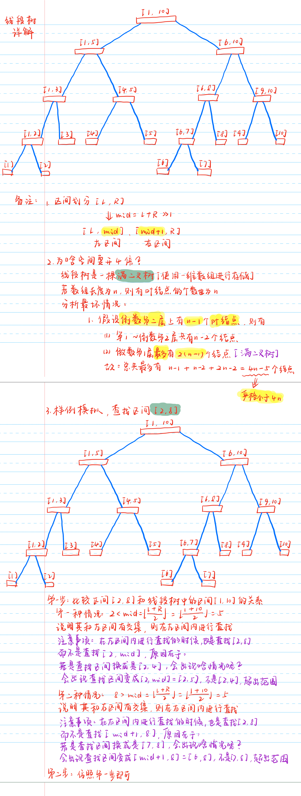
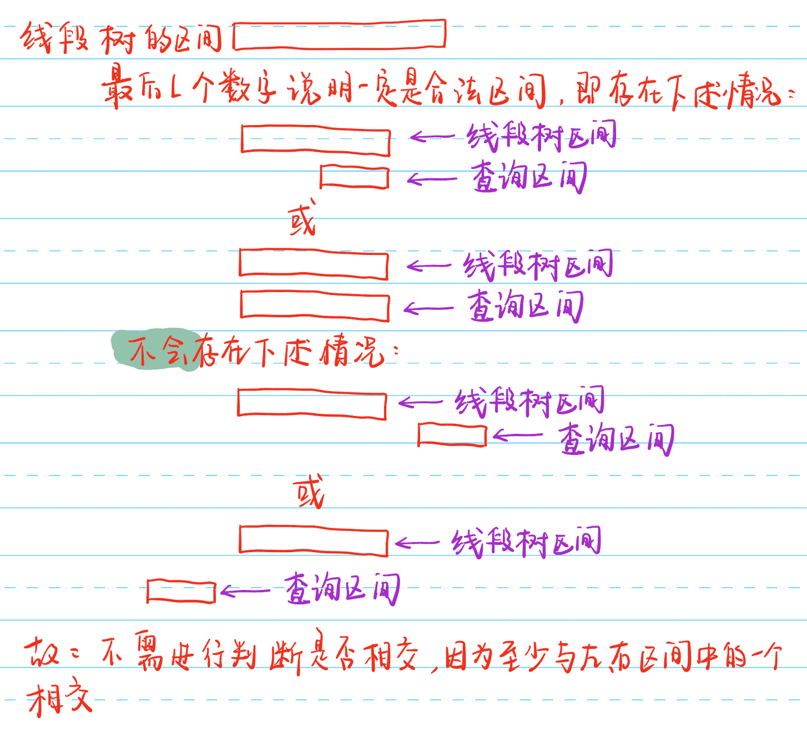
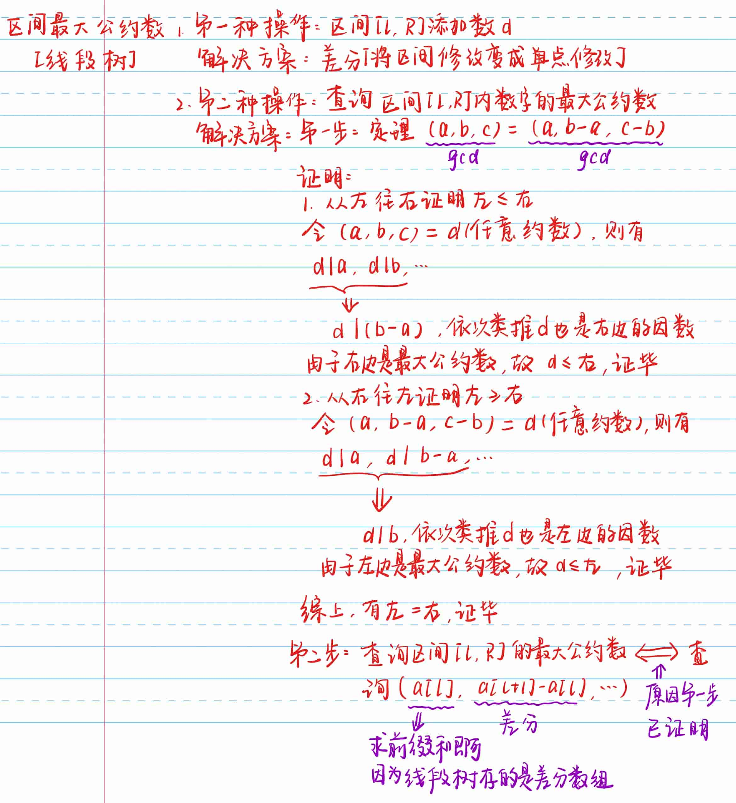
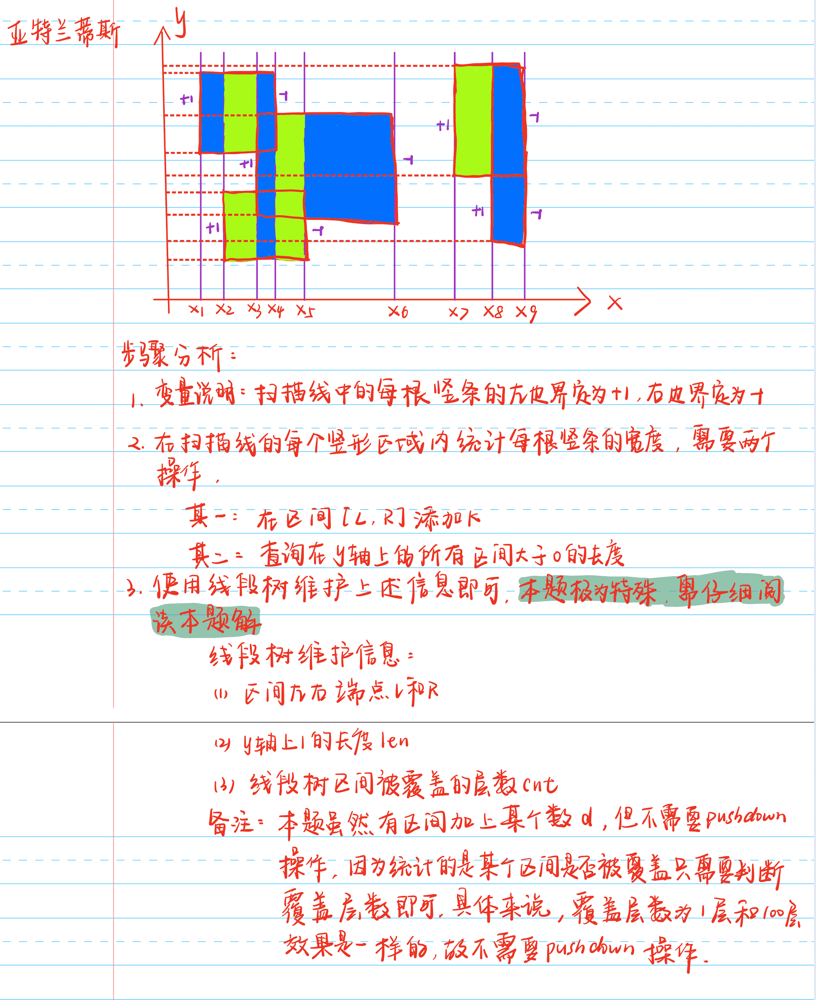
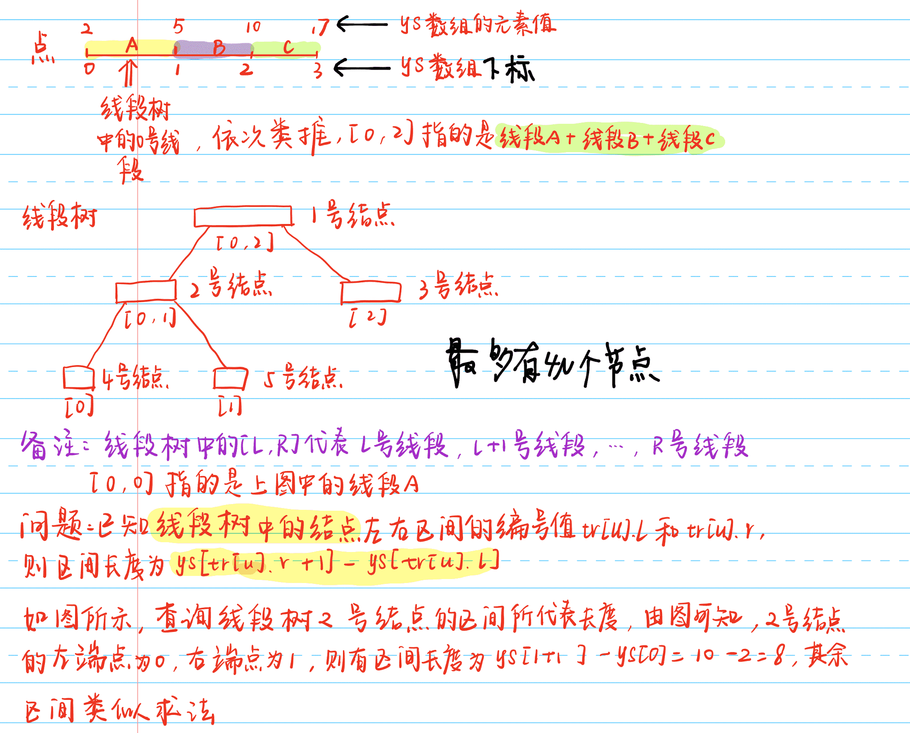
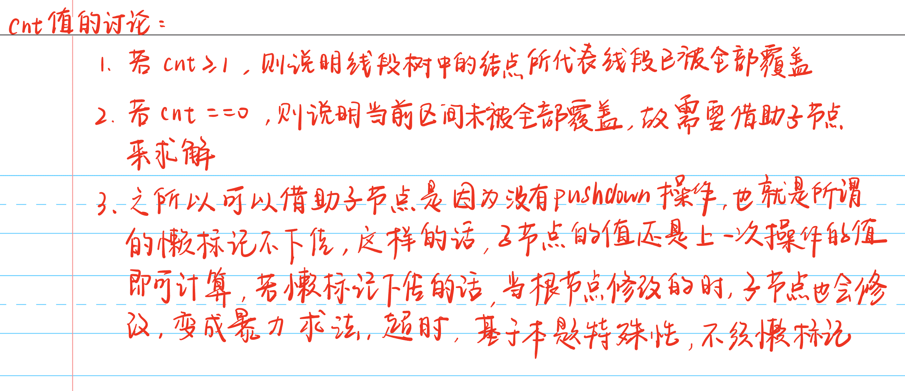

# 树专题

## 字典树

### [LeetCode 212. 单词搜索 II](https://leetcode-cn.com/problems/word-search-ii/)

**题目描述**

> 给定一个 `m x n` 二维字符网格 `board` 和一个单词（字符串）列表 `words`，找出所有同时在二维网格和字典中出现的单词。
>
> 单词必须按照字母顺序，通过 相邻的单元格 内的字母构成，其中“相邻”单元格是那些水平相邻或垂直相邻的单元格。同一个单元格内的字母在一个单词中不允许被重复使用。

**示例 1**

> 输入：`board = [["o","a","a","n"],["e","t","a","e"],["i","h","k","r"],["i","f","l","v"]], words = ["oath","pea","eat","rain"]`
> 输出：`["eat","oath"]`

**示例 2**

> 输入：`board = [["a","b"],["c","d"]], words = ["abcb"]`
> 输出：`[]`

**提示**

> + $m == board.length$
> + $n == board[i].length$
> + $1 <= m, n <= 12$
> + $board[i][j] 是一个小写英文字母$
> + $1 <= words.length <= 3 * 10^4$
> + $1 <= words[i].length <= 10$
> + `words[i]` 由小写英文字母组成
> + `words` 中的所有字符串互不相同

**题解**

> 1. 使用字典树存储每个单词
> 2. 从每一个起点，深度优先搜索每个单词即可

**代码**

```c++
class Solution {
public:
    // 定义字典树结构体
    struct Node {
        int id;
        Node* son[26];
        Node() {
            id = -1;
            for (int i = 0; i < 26; i ++ ) son[i] = NULL;
        }
    }*root;
    int n, m;
    int dx[4] = {1, -1, 0, 0};
    int dy[4] = {0, 0, -1, 1};
    unordered_set<int> ids;
    void insert(string word, int id) {
        auto p = root;
        for (int i = 0; i < word.size(); i ++ ) {
            int u = word[i] - 'a';
            if (!p -> son[u]) p -> son[u] = new Node();
            p = p -> son[u];
        }
        p -> id = id;
        return;
    }
    void dfs(vector<vector<char>>& g, int x, int y, Node* p) {
        if (p -> id != -1) ids.insert(p -> id);
        char t = g[x][y];
        g[x][y] = '.';
        for (int i = 0; i < 4; i ++ ) {
            int tx = x + dx[i];
            int ty = y + dy[i];
            if (tx < 0 || tx >= n || ty < 0 || ty >= m || g[tx][ty] == '.') continue;
            int u = g[tx][ty] - 'a';
            if (p -> son[u]) dfs(g, tx, ty, p -> son[u]);
        }
        g[x][y] = t;
        return;
    }
    vector<string> findWords(vector<vector<char>>& g, vector<string>& words) {
        n = g.size(), m = g[0].size();
        root = new Node();
        for (int i = 0; i < words.size(); i ++ ) insert(words[i], i);
        vector<string> res;
        for (int i = 0; i < n; i ++ )
            for (int j = 0; j < m; j ++ ) {
                int u = g[i][j] - 'a';
                if (root -> son[u]) dfs(g, i, j, root -> son[u]);
            }
        for (auto& id : ids) res.push_back(words[id]);
        return res;
    }
};
```

**标签**

`dfs`、`字典树`

## 线段树

### 原理



### [AcWing 1275. 最大数](https://www.acwing.com/problem/content/1277/)

**题目描述**

> 给定一个正整数数列 $a_1,a_2,…,a_n$，每一个数都在 $0∼p−1$ 之间。
>
> 可以对这列数进行两种操作：
>
> 1. 添加操作：向序列后添加一个数，序列长度变成 `n+1`；
> 2. 询问操作：询问这个序列中最后 `L` 个数中最大的数是多少。
>
> 程序运行的最开始，整数序列为空。
>
> 一共要对整数序列进行 `m` 次操作。
>
> 写一个程序，读入操作的序列，并输出询问操作的答案。

**输入格式**

> 第一行有两个正整数 `m,p`，意义如题目描述；
>
> 接下来 `m` 行，每一行表示一个操作。
>
> 如果该行的内容是 `Q L`，则表示这个操作是询问序列中最后 `L` 个数的最大数是多少；
>
> 如果是 `A t`，则表示向序列后面加一个数，加入的数是 `(t+a) mod p`。其中，`t` 是输入的参数，`a` 是在这个添加操作之前最后一个询问操作的答案（如果之前没有询问操作，则 `a=0`）。
>
> 第一个操作一定是添加操作。对于询问操作，`L>0` 且不超过当前序列的长度。

**输出格式**

> 对于每一个询问操作，输出一行。该行只有一个数，即序列中最后 `L` 个数的最大数。

**数据范围**

> + $1≤m≤2×10^5$,
> + $1≤p≤2×10^9$,
> + $0≤t<p$

**输入样例**

```c++
10 100
A 97
Q 1
Q 1
A 17
Q 2
A 63
Q 1
Q 1
Q 3
A 99
```

**输出样例**

```c++
97
97
97
60
60
97
```

**样例解释**

> 最后的序列是 `97,14,60,96`。

**备注**



**代码**

```c++
#include <iostream>
using namespace std;
const int N = 200010;
int n, m, p;
struct Node {
    int l, r, Max; // Max是区间[l, r]的最大值
}tr[N * 4];
void build(int u, int l, int r) { // u当前节点的下标，[l, r]是区间左右端点
    tr[u] = {l, r};
    // 区间只有一个数字
    if (l == r) return;
    int mid = l + r >> 1;
    // 左子树
    build(u << 1, l, mid);
    // 右子树
    build(u << 1 | 1, mid + 1, r);
    return;
}
int query(int u, int l, int r) {
    // 如果线段树的区间完全包含在所查询区间的内部，则直接返回最大值即可
    if (tr[u].l >= l && tr[u].r <= r) return tr[u].Max;
    int mid = tr[u].l + tr[u].r >> 1;
    int Max = 0;
    /**
    	问题：为啥不判断两个区间不相交的情况？
    	回答：查看备注
    */
    // 如果左边区间有重合，则查询左边
    // 至于为啥不能写成query(u << 1, l, mid)，查看原理的样例模拟即可知晓
    if (l <= mid) Max = query(u << 1, l, r);
    // 如果右边区间有重合，则查询右边
    // 至于为啥不能写成query(u << 1, l, mid)，查看原理的样例模拟即可知晓
    if (r > mid) Max = max(Max, query(u << 1 | 1, l, r));
    return Max;
}
// 由子节点更新父节点
void pushup(int u) {
    tr[u].Max = max(tr[u << 1].Max, tr[u << 1 | 1].Max);
    return;
}
void modify(int u, int x, int c) {
    // 如果到达叶子结点即区间左右端点都是x，则修改值即可
    // 由于只有一个值，因此，区间最大值即为当前值本身
    if (tr[u].l == x && tr[u].r == x) tr[u].Max = c;
    else {
        int mid = tr[u].l + tr[u].r >> 1;
        // 和左边有交集
        if (x <= mid) modify(u << 1, x, c);
        // 和右边有交集
        if (x > mid) modify(u << 1 | 1, x, c);
        // 由子节点更新父节点
        pushup(u);
    }
    return;
}
int main() {
    scanf("%d%d", &m, &p);
    // 最多有m个操作，因此，区间右端点为m
    build(1, 1, m);
    int x, last = 0;
    char op[2];
    while (m -- ) {
        scanf("%s%d", op, &x);
        if (op[0] == 'Q') {
            // 查询最后x个数字的最大值，其区间为[n - x + 1, n]
            last = query(1, n - x + 1, n);
            cout << last << endl;
        }
        else {
            // 修改第n + 1个值
            modify(1, n + 1, (x + 0LL + last) % p);
            n ++;
        }
    }
    return 0;
}
```

**标签**

`线段树`

### [AcWing 245. 你能回答这些问题吗](https://www.acwing.com/problem/content/246/)

**题目描述**

> 给定长度为 `N` 的数列 `A`，以及 `M` 条指令，每条指令可能是以下两种之一：
>
> 1. `1 x y`，查询区间 `[x,y]` 中的最大连续子段和，即 $max_{x≤l≤r≤y}\{∑\limits_{i=l}^rA[i]\}$。
> 2. `2 x y`，把 `A[x]` 改成 `y`。
>
> 对于每个查询指令，输出一个整数表示答案。

**输入格式**

> 第一行两个整数 `N,M`。
>
> 第二行 `N` 个整数 `A[i]`。
>
> 接下来 `M` 行每行 `3` 个整数 `k,x,y`，`k=1` 表示查询（此时如果 `x>y`，请交换 `x,y`），`k=2` 表示修改。

**输出格式**

> 对于每个查询指令输出一个整数表示答案。
>
> 每个答案占一行。

**数据范围**

> + $N≤500000,M≤100000$,
> + $−1000≤A[i]≤1000$

**输入样例**

```c++
5 3
1 2 -3 4 5
1 2 3
2 2 -1
1 3 2
```

**输出样例**

```c++
2
-1
```

**手写稿**


**代码**

```c++
#include <iostream>
using namespace std;
const int N = 500010;
struct Node {
    int l, r; // 区间左右端点
    int maxSum; // 最大连续子区间和
    int lMaxSum, rMaxSum; // 最大前缀和和最大后缀和
    int sum; // 区间和
}tr[N * 4];
int n, m;
int g[N];
void pushup(Node& u, Node& l, Node& r) {
    u.maxSum = max(max(l.maxSum, r.maxSum), l.rMaxSum + r.lMaxSum);
    u.lMaxSum = max(l.lMaxSum, l.sum + r.lMaxSum);
    u.rMaxSum = max(r.rMaxSum, r.sum + l.rMaxSum);
    u.sum = l.sum + r.sum;
    return;
}
// 由父节点更新子节点
void pushup(int u) {
    pushup(tr[u], tr[u << 1], tr[u << 1 | 1]);
    return;
}
void build(int u, int l, int r) {
    // 到达叶子节点[l, r]是下标，记录所有属性值
    if (l == r) tr[u] = {l, r, g[l], g[l], g[l], g[l]};
    else {
        // 如果没有到达叶子结点，则只记录区间端点即可，别的值暂时无法得出
        tr[u] = {l, r};
        int mid = l + r >> 1;
        build(u << 1, l, mid);
        build(u << 1 | 1, mid + 1, r);
        // 更新【父节点】中除了区间端点之外的其余属性值即可
        pushup(u);
    }
    return;
}
// 由于树状数组的节点是结构体，因此，返回值是节点【结构体】
Node query(int u, int l, int r) {
    if (tr[u].l >= l && tr[u].r <= r) return tr[u];
    else {
        int mid = tr[u].l + tr[u].r >> 1;
        // 区间查询区间可能不存在
        // 如果查询的区间在线段树区间的左边
        if (r <= mid) return query(u << 1, l, r);
        // 如果查询的区间在线段树区间的右边
        else if (l > mid) return query(u << 1 | 1, l, r);
        else {
            // 如果查询的区间和左右端点有交集
            auto left = query(u << 1, l, r);
            auto right = query(u << 1 | 1, l, r);
            // 使用结构体节点
            Node res;
            pushup(res, left, right);
            return res;
        }
    }
}
void modify(int u, int x, int c) {
    // 找到叶子节点
    if (tr[u].l == x && tr[u].r == x) tr[u] = {x, x, c, c, c, c};
    else {
        // 根据题目描述修改的区间一定是合法区间，一定会有相交
        int mid = tr[u].l + tr[u].r >> 1;
        // 如果和左区间有交集
        if (x <= mid) modify(u << 1, x, c);
        // 如果和右区间有交集
        else modify(u << 1 | 1, x, c);
        // 修改完记得更新父节点
        pushup(u);
    }
    return;
}
int main() {
    scanf("%d%d", &n, &m);
    for (int i = 1; i <= n; i ++ ) scanf("%d", &g[i]);
    build(1, 1, n);
    int k, x, y;
    while (m -- ) {
        scanf("%d%d%d", &k, &x, &y);
        if (k == 1) {
            // 如果左端点大于右端点，则交换端点即可
            if (x > y) swap(x, y);
            cout << query(1, x, y).maxSum << endl;
        }
        else modify(1, x, y);
    }
    return 0;
}
```

**标签**

`线段树`

### [AcWing 246. 区间最大公约数](https://www.acwing.com/problem/content/247/)

**题目描述**

> 给定一个长度为 `N` 的数列 `A`，以及 `M` 条指令，每条指令可能是以下两种之一：
>
> 1. `C l r d`，表示把 `A[l],A[l+1],…,A[r]` 都加上 `d`。
> 2. `Q l r`，表示询问 `A[l],A[l+1],…,A[r]` 的最大公约数(`GCD`)。
>
> 对于每个询问，输出一个整数表示答案。

**输入格式**

> 第一行两个整数 `N,M`。
>
> 第二行 `N` 个整数 `A[i]`。
>
> 接下来 `M` 行表示 `M` 条指令，每条指令的格式如题目描述所示。

**输出格式**

> 对于每个询问，输出一个整数表示答案。
>
> 每个答案占一行。

**数据范围**

> + $N≤500000,M≤100000$,
> + $1≤A[i]≤10^{18}$,
> + $|d|≤10^{18}$

**输入样例**

```c++
5 5
1 3 5 7 9
Q 1 5
C 1 5 1
Q 1 5
C 3 3 6
Q 2 4
```

**输出样例**

```c++
1
2
4
```

**手写稿**



**代码**

```c++
#include <iostream>
using namespace std;
typedef long long LL;
const int N = 500010;
struct Node {
    int l, r; // 区间左右端点
    LL sum, d; // 区间和和区间的最大公约数
}tr[N * 4];
int n, m;
LL g[N];
// 注意类型LL
LL gcd(LL a, LL b) {
    if (!b) return a;
    return gcd(b, a % b);
}
void pushup(Node& u, Node& l, Node& r) {
    u.sum = l.sum + r.sum;
    u.d = gcd(l.d, r.d);
    return;
}
void pushup(int u) {
    pushup(tr[u], tr[u << 1], tr[u << 1 | 1]);
    return;
}
void build(int u, int l, int r) {
    if (l == r) {
        // 注意类型LL
        LL a = g[r] - g[r - 1];
        tr[u] = {l, r, a, a};
    }
    else {
        tr[u] = {l, r};
        int mid = l + r >> 1;
        build(u << 1, l, mid);
        build(u << 1 | 1, mid + 1, r);
        // 注意更新下父节点u
        pushup(u);
    }
    return;
}
Node query(int u, int l, int r) {
    // 如果线段树中的区间包含在所查询区间的内部，则直接返回
    if (tr[u].l >= l && tr[u].r <= r) return tr[u];
    else {
        int mid = tr[u].l + tr[u].r >> 1;
        // 如果查询区间出现在线段树区间的左边
        if (r <= mid) return query(u << 1, l, r);
        // 如果查询区间出现在线段树区间的右边
        else if (l > mid) return query(u << 1 | 1, l, r);
        else {
            // 如果查询区间处于线段树区间的两边
            auto left = query(u << 1, l, r);
            auto right = query(u << 1 | 1, l, r);
            Node res;
            pushup(res, left, right);
            return res;
        }
    }
}
void modify(int u, int x, LL c) {
    if (tr[u].l == x && tr[u].r == x) {
        // 注意类型LL
        LL a = tr[u].sum + c;
        tr[u] = {x, x, a, a};
    }
    else {
        int mid = tr[u].l + tr[u].r >> 1;
        // 如果数x位于左区间
        if (x <= mid) modify(u << 1, x, c);
        // 如果数x位于右区间
        else modify(u << 1 | 1, x, c);
        // 更新父节点u
        pushup(u);
    }
    return;
}
int main() {
    scanf("%d%d", &n, &m);
    for (int i = 1; i <= n; i ++ ) scanf("%lld", &g[i]);
    build(1, 1, n);
    char op[2];
    int l, r;
    LL d;
    while (m -- ) {
        scanf("%s", op);
        if (op[0] == 'Q') {
            scanf("%d%d", &l, &r);
            // 注意最大公约数可能是负数，记得取绝对值
            cout << abs(gcd(query(1, 1, l).sum, query(1, l + 1, r).d)) << endl; 
        }
        else {
            scanf("%d%d%lld", &l, &r, &d);
            modify(1, l, d);
            // 记得判断是否越界
            if (r + 1 <= n) modify(1, r + 1, -d);
        }
    }
    return 0;
}
```

**标签**

`差分`、`树状数组`

### [AcWing 243. 一个简单的整数问题2](https://www.acwing.com/problem/content/244/)

**题目描述**

> 给定一个长度为 `N` 的数列 `A`，以及 `M` 条指令，每条指令可能是以下两种之一：
>
> 1. `C l r d`，表示把 `A[l],A[l+1],…,A[r]` 都加上 `d`。
> 2. `Q l r`，表示询问数列中第 `l∼r` 个数的和。
>
> 对于每个询问，输出一个整数表示答案。

**输入格式**

> 第一行两个整数 `N,M`。
>
> 第二行 `N` 个整数 `A[i]`。
>
> 接下来 `M` 行表示 `M` 条指令，每条指令的格式如题目描述所示。

**输出格式**

> 对于每个询问，输出一个整数表示答案。
>
> 每个答案占一行。

**数据范围**

> + $1≤N,M≤10^5$,
> + $|d|≤10000$,
> + $|A[i]|≤10^9$

**输入样例**

```c++
10 5
1 2 3 4 5 6 7 8 9 10
Q 4 4
Q 1 10
Q 2 4
C 3 6 3
Q 2 4
```

**输出样例**

```c++
4
55
9
15
```

**步骤**

> 1. `pushdown` 操作（懒标记）
>     + 用途
>         + 将当前区间中的每一个数字都添加上 `d`
>     + 步骤
>         + 第一步：查看当前根节点 `u` 所在区间是否属于查询的区间
>         + 第二步：更新相对应的信息
>         + 第三步：将懒标记 `add` 设置为 `0`，表示已经下放完毕
> 2. 注意 `pushdown` 和 `pushup` 的位置

**代码**

```c++
#include <iostream>
using namespace std;
typedef long long LL;
const int N = 100010;
struct Node {
    int l, r;
    LL sum; // 区间和
    int add; // 懒标记
}tr[N * 4];
int n, m;
int g[N];
void pushup(int u) {
    // 懒标记【不包含】当前节点
    tr[u].sum = tr[u << 1].sum + tr[u << 1 | 1].sum;
    return;
}
void pushdown(int u) {
    auto &root = tr[u], &left = tr[u << 1], &right = tr[u << 1 | 1];
    // 如果有懒标记，则将懒标记进行下放
    if (root.add) {
        // 左孩子的懒标记进行累加，同时，区间和也需要累加
        left.add += root.add, left.sum += (LL)(left.r - left.l + 1) * root.add;
        // 右孩子的懒标记进行累加，同时，区间和也需要累加
        right.add += root.add, right.sum += (LL)(right.r - right.l + 1) * root.add;
        // 懒标记置为0
        root.add = 0;
    }
    return;
}
void build(int u, int l, int r) {
    // 如果到达叶子结点，则更新相对应的信息
    if (l == r) tr[u] = {l, r, g[l], 0};
    else {
        // 更新区间的左右端点信息
        tr[u] = {l, r};
        int mid = tr[u].l + tr[u].r >> 1;
        // 如果和左区间有交集，建立树状数组
        build(u << 1, l, mid);
        // 如果和右区间有交集，建立树状数组
        build(u << 1 |1, mid + 1, r);
        // 由子节点更新父节点
        pushup(u);
    }
    return;
}
void modify(int u, int l, int r, int d) {
    // 如果树状数组区间的左右端点包含在要查询的区间内部，则直接更新相对应的信息
    if (tr[u].l >= l && tr[u].r <= r) {
        tr[u].sum += (LL)(tr[u].r - tr[u].l + 1) * d;
        tr[u].add += d;
    }
    else { // 必须要进行分裂
        // 分裂之前必须要进行pushdown操作，即下放懒标记操作
        pushdown(u);
        int mid = tr[u].l + tr[u].r >> 1;
        // 如果和左区间有交集
        if (l <= mid) modify(u << 1, l, r, d);
        // 如果和右区间有交集
        if (r > mid) modify(u << 1 | 1, l, r, d);
        // 由子节点信息更新父节点信息
        pushup(u);
    }
    return;
}
LL query(int u, int l, int r) {
    // 如果树状数组区间的左右端点包含在要查询的区间内部，则直接更新相对应的信息
    if (tr[u].l >= l && tr[u].r <= r) return tr[u].sum;
    // 要进行分裂
    pushdown(u);
    int mid = tr[u].l + tr[u].r >> 1;
    LL sum = 0;
    // 如果和左边区间有交集
    if (l <= mid) sum += query(u << 1, l, r);
    // 如果和右边区间有交集
    if (r > mid) sum += query(u << 1 | 1, l, r);
    return sum;
}
int main() {
    scanf("%d%d", &n, &m);
    for (int i = 1; i <= n; i ++ ) scanf("%d", &g[i]);
    build(1, 1, n);
    while (m -- ) {
        char op[2];
        int l, r, d;
        scanf("%s", op);
        if (op[0] == 'C') {
            scanf("%d%d%d", &l, &r, &d);
            modify(1, l, r, d);
        }
        else {
            scanf("%d%d", &l, &r);
            cout << query(1, l, r) << endl;
        }
    }
    return 0;
}
```

**标签**

`树状数组`、`懒标记`

### [AcWing 247. 亚特兰蒂斯](https://www.acwing.com/problem/content/249/)

**题目描述**

> 有几个古希腊书籍中包含了对传说中的亚特兰蒂斯岛的描述。
>
> 其中一些甚至包括岛屿部分地图。
>
> 但不幸的是，这些地图描述了亚特兰蒂斯的不同区域。
>
> 您的朋友 `Bill` 必须知道地图的总面积。
>
> 你自告奋勇写了一个计算这个总面积的程序。

**输入格式**

> 输入包含多组测试用例。
>
> 对于每组测试用例，第一行包含整数 `n`，表示总的地图数量。
>
> 接下来 `n` 行，描绘了每张地图，每行包含四个数字 $x_1,y_1,x_2,y_2$（不一定是整数），$(x_1,y_1)$ 和 $(x_2,y_2)$ 分别是地图的左上角位置和右下角位置。
>
> 注意，坐标轴 `x` 轴从上向下延伸，`y` 轴从左向右延伸。
>
> 当输入用例 `n=0` 时，表示输入终止，该用例无需处理。

**输出格式**

> 每组测试用例输出两行。
>
> 第一行输出 `Test case #k`，其中 `k` 是测试用例的编号，从 `1` 开始。
>
> 第二行输出 `Total explored area: a`，其中 `a` 是总地图面积（即此测试用例中所有矩形的面积并，注意如果一片区域被多个地图包含，则在计算总面积时只计算一次），精确到小数点后两位数。
>
> 在每个测试用例后输出一个空行。

**数据范围**

> + $1≤n≤10000$,
> + $0≤x1<x2≤100000$,
> + $0≤y1<y2≤100000$
> + 注意，本题 $n$ 的范围上限加强至 $10000$。

**输入样例**

```c++
2
10 10 20 20
15 15 25 25.5
0
```

**输出样例**

```c++
Test ccase #1
Total explored area: 180.00 
```

**样例解释**

> 样例所示地图覆盖区域如下图所示，两个矩形区域所覆盖的总面积，即为样例的解。


**手写稿**



**疑点详解**

> 1. 线段树中存储的节点是线段不是点，注意两者之间的对应关系
>
>     
>
> 1. 离散化的原因
>
>     + 注意树状数组中的值就是下标，并且`y` 轴上的端点不一定是整数，有可能是小数，因此，为了防止出现小数的情况，故使用离散化处理
>
>     + 举例说明 `g = [1, 1.5, 2, 5]`
>         + 如果不使用离散化，则不能计算 `g[1 ~ 1.5]` 的和
>         + 如果使用离散化，则 `1，1.5，2，2.5` 所对应的下标为 `0，1，2，3` 都是整数，则可以计算
>
> 1. 树状数组中的节点的属性值 cnt 分类讨论的原因
>
>     

**代码**

```c++
#include <iostream>
#include <vector>
#include <algorithm>
using namespace std;
const int N = 10010;
struct Segment {
    double x, y1, y2;
    // 表明当前线段是左边界还是右边界，左边界的权值为1，右边界的权值为-1
    int k;
    bool operator < (Segment &T) { // 按照横坐标x进行排序
        return x < T.x;
    }
}segs[N * 2]; // 1个矩形对应2个横坐标，因此，N个矩形对应2 * N个横坐标
struct Node {
    int l, r;
    int cnt; // 当前区间被覆盖的层数
    double len; // 当前y轴上大于1的区间长度，注意变量的类型
}tr[N * 8]; // 左边界横坐标对应4N空间，右边界横坐标对应4N空间，共8N空间
int n;
vector<double> ys; // 存储y轴上所有的无重复的点，用来做离散化，注意变量类型
// 查找大于等于y的数据的下标所在位置
int find(double y) {
    return lower_bound(ys.begin(), ys.end(), y) - ys.begin();
}
void pushup(int u) {
    // 如果当前线段树区间被覆盖，则当前区间的长度即为线段树的长度len
    if (tr[u].cnt) tr[u].len = ys[tr[u].r + 1] - ys[tr[u].l];
    else if (tr[u].l != tr[u].r) // 如果不是叶节点
        tr[u].len = tr[u << 1].len + tr[u << 1 | 1].len;
    else tr[u].len = 0; // 如果是叶节点记得初始化长度为0
    return;
}
void build(int u, int l, int r) {
    // 初始化树状数组，不用管tr的区间问题，即使l != r也要进行初始化
    tr[u] = {l, r, 0, 0};
    if (l != r) {
        int mid = l + r >> 1;
        build(u << 1, l, mid);
        build(u << 1 | 1, mid + 1, r);
    }
    return;
}
void modify(int u, int l, int r, int k) {
    if (tr[u].l >= l && tr[u].r <= r) {
        tr[u].cnt += k;
        // 计算长度，因为k不一定为正数，如果cnt == 0，则需要通过当前根节点的子节点进行计算
        pushup(u);
    }
    else {
        int mid = tr[u].l + tr[u].r >> 1;
        if (l <= mid) modify(u << 1, l, r, k);
        if (r > mid) modify(u << 1 | 1, l, r, k);
        // 计算长度，因为k不一定为正数，如果cnt == 0，则需要通过当前根节点的子节点进行计算
        pushup(u);
    }
    return;
}
int main() {
    int T = 0;
    while (scanf("%d", &n), n) {
        ys.clear(); // 多组输入，注意每次清空ys里面的数据
        for (int i = 0, j = 0; i < n; i ++ ) {
            double x1, y1, x2, y2;
            scanf("%lf%lf%lf%lf", &x1, &y1, &x2, &y2);
            segs[j ++ ] = {x1, y1, y2, 1};
            segs[j ++ ] = {x2, y1, y2, -1};
            ys.push_back(y1);
            ys.push_back(y2);
        }
        // 对于y轴上的点进行排序，方便去重处理
        sort(ys.begin(), ys.end());
        // 去重的前提是有序序列，因此，事先要排序，原因在于此
        ys.erase(unique(ys.begin(), ys.end()), ys.end());
        // 建立线段树，区间的个数等于点的个数减一，点的范围[0, n - 1],换算区间的话，再减一，区间的范围为[0, n - 2]
        build(1, 0, ys.size() - 2);
        // 对于segs进行排序
        sort(segs, segs + n * 2);
        // 计算总面积
        double res = 0;
        for (int i = 0; i < n * 2; i ++ ) {
            if (i > 0) res += tr[1].len * (segs[i].x - segs[i - 1].x);
            modify(1, find(segs[i].y1), find(segs[i].y2) - 1, segs[i].k);
        }
        printf("Test case #%d\nTotal explored area: %.2lf\n\n", ++T, res);
    }
    return 0;
}
```

**标签**

`树状数组`、`扫描线`

### [AcWing 1277. 维护序列](https://www.acwing.com/problem/content/1279/)

**题目描述**

> 老师交给小可可一个维护数列的任务，现在小可可希望你来帮他完成。
>
> 有长为 `N` 的数列，不妨设为 $a_1,a_2,…,a_N$。
>
> 有如下三种操作形式：
>
> 1. 把数列中的一段数全部乘一个值；
> 2. 把数列中的一段数全部加一个值；
> 3. 询问数列中的一段数的和，由于答案可能很大，你只需输出这个数模 `P` 的值。

**输入格式**

> 第一行两个整数 `N` 和 `P`；
>
> 第二行含有 `N` 个非负整数，从左到右依次为 $a_1,a_2,…,a_N$；
>
> 第三行有一个整数 `M`，表示操作总数；
>
> 从第四行开始每行描述一个操作，输入的操作有以下三种形式：
>
> - 操作 `1`：`1 t g c`，表示把所有满足 $t≤i≤g$ 的 $a_i$ 改为 $a_i×c$；
> - 操作 `2`：`2 t g c`，表示把所有满足 $t≤i≤g$ 的 $a_i$ 改为 $a_i+c$；
> - 操作 `3`：`3 t g`，询问所有满足 $t≤i≤g$ 的 $a_i$ 的和模 `P` 的值。
>
> 同一行相邻两数之间用一个空格隔开，每行开头和末尾没有多余空格。

**输出格式**

对每个操作 `3`，按照它在输入中出现的顺序，依次输出一行一个整数表示询问结果。

**数据范围**

> + $1≤N,M≤10^5$,
> + $1≤t≤g≤N$,
> + $0≤c,a_i≤10^9$,
> + $1≤P≤10^9$

**输入样例**

```c++
7 43
1 2 3 4 5 6 7
5
1 2 5 5
3 2 4
2 3 7 9
3 1 3
3 4 7
```

**输出样例**

```c++
2
35
8
```

**样例解释**

> 初始时数列为 `{1,2,3,4,5,6,7}`；
>
> 经过第 `1` 次操作后，数列为 `{1,10,15,20,25,6,7}`；
>
> 对第 `2` 次操作，和为 `10+15+20=45`，模 `43` 的结果是 `2`；
>
> 经过第 `3` 次操作后，数列为 `{1,10,24,29,34,15,16}`；
>
> 对第 `4` 次操作，和为 `1+10+24=35`，模 `43` 的结果是 `35`；
>
> 对第 `5` 次操作，和为 `29+34+15+16=94`，模 `43` 的结果是 `8`。

**解题步骤**

> 1. 线段树中维护五个信息
>
>     + 区间左右端点 `[l, r]`
>     + 区间和 `sum`
>     + 懒标记 `add` 和 `mul`，表示区间内的每个数字添加 `add` 和 乘以 `mul`
>
> 2. 当线段树中的节点同时含有懒标记 `add` 和 `mul` 的时候，如何确定顺序，以方便好维护信息？
>
>     + 分两种情况：先 `add` 在 `mul` 和先 `mul` 再 `add`
>
>         + 第一种情况：先 `add` 再 `mul`
>
>             
>
>         + 第二种情况：先 `mul` 再 `add`
>
>             
>
>         + 综上所述，顺序应该为先 `mul` 再 `add` 即可
>
>     + 确定完顺序之后，按照顺序先 `mul` 再 `add` 的操作，进行分析，查看值的变化
>
>         
>
>         + 备注
>             + `x ✖️ mul + add` 是原来的数，也就是区间和 `sum`
>             + 按照顺序先 `mul` 再 `add`，以方便区分变量，故使用 `mul'` 和 `add'` 来表示即可
>
> 3. 使用先 `mul` 再 `add` 的顺序简化区间加和区间乘操作
>
>     + 区间加
>         + 令 `mul = 1，add = d` 即可
>     + 区间乘
>         + 令 `mul = d，add = 0` 即可

**代码**

```c++
#include <iostream>
using namespace std;
typedef long long LL;
const int N = 100010;
struct Node {
    int l, r; // 左右区间
    LL sum; // 区间和
    int mul, add; // 区间乘懒标记mul和区间加懒标记add
}tr[N * 4];
int n, m, p;
int g[N];
void eval(Node& root, int mul, int add) {
    // 原理查看解析
    root.sum = (root.sum * mul + (LL)(root.r - root.l + 1) * add) % p;
    root.mul = (LL)root.mul * mul % p;
    root.add = ((LL)root.add * mul + add) % p;
    return;
}
void pushup(int u) {
    // 记得取模
    tr[u].sum = (tr[u << 1].sum + tr[u << 1 | 1].sum) % p;
    return;
}
void pushdown(int u) {
    eval(tr[u << 1], tr[u].mul, tr[u].add);
    eval(tr[u << 1 | 1], tr[u].mul, tr[u].add);
    // 记得将懒标记清空
    tr[u].mul = 1, tr[u].add = 0;
    return;
}
void build(int u, int l, int r) {
    if (l == r) tr[u] = {l, r, g[l], 1, 0};
    else {
        // sum先随便设置一个值
        tr[u] = {l, r, 0, 1, 0};
        int mid = tr[u].l + tr[u].r >> 1;
        build(u << 1, l, mid);
        build(u << 1 | 1, mid + 1, r);
        pushup(u);
    }
    return;
}
void modify(int u, int l, int r, int mul, int add) {
    if (tr[u].l >= l && tr[u].r <= r) eval(tr[u], mul, add);
    else { // 区间要进行分裂
        // 懒标记下传
        pushdown(u);
        int mid = tr[u].l + tr[u].r >> 1;
        // 左边有交集
        if (l <= mid) modify(u << 1, l, r, mul, add);
        // 右边有交集
        if (r > mid) modify(u << 1 | 1, l, r, mul, add);
        // 由子节点更新父节点
        pushup(u);
    }
    return;
}
int query(int u, int l, int r) {
    if (tr[u].l >= l && tr[u].r <= r) return tr[u].sum;
    // 查询的时候需要将懒标记下传
    pushdown(u);
    int sum = 0;
    int mid = tr[u].l + tr[u].r >> 1;
    // 左边有交集
    if (l <= mid) sum += query(u << 1, l, r);
    // 右边有交集，记得取模
    if (r > mid) sum = (sum + query(u << 1 | 1, l, r)) % p;
    return sum;
}
int main() {
    scanf("%d%d", &n, &p);
    for (int i = 1; i <= n; i ++ ) scanf("%d", &g[i]);
    // 建立线段树
    build(1, 1, n);
    scanf("%d", &m);
    while (m -- ) {
        int num, l, r, k;
        scanf("%d", &num);
        // 区间乘
        if (num == 1) {
            scanf("%d%d%d", &l, &r, &k);
            modify(1, l, r, k, 0);
        }
        // 区间加
        else if (num == 2) {
            scanf("%d%d%d", &l, &r, &k);
            modify(1, l, r, 1, k);
        }
        // 区间查询
        else {
            scanf("%d%d", &l, &r);
            cout << query(1, l, r) << endl;
        }
    }
    return 0;
}
```

**标签**

`线段树`

## 树状数组

### 原理

**手写稿**


### 注意事项

> 1. <font style="color: red">**先搞明白树状数组存的值的意义，此点至关重要！！！**</font>

### [P3374 【模板】树状数组 1](https://www.luogu.com.cn/problem/P3374)

**题目描述**

> 如题，已知一个数列，你需要进行下面两种操作：
>
> - 将某一个数加上 `x`
> - 求出某区间每一个数的和

**输入格式**

> 第一行包含两个正整数 `n,m`，分别表示该数列数字的个数和操作的总个数。
>
> 第二行包含 `n` 个用空格分隔的整数，其中第 `i` 个数字表示数列第 `i` 项的初始值。
>
> 接下来 `m` 行每行包含 `3` 个整数，表示一个操作，具体如下：
>
> - `1 x k` 含义：将第 `x` 个数加上 `k`
> - `2 x y` 含义：输出区间 `[x,y]` 内每个数的和

**输出格式**

> 输出包含若干行整数，即为所有操作 `2` 的结果。

**输入 #1**

```c++
5 5
1 5 4 2 3
1 1 3
2 2 5
1 3 -1
1 4 2
2 1 4
```

**输出 #1**

```c++
14
16
```

**数据范围**

> 对于 `30%` 的数据，$1≤n≤8$，$1≤m≤10$；
> 对于 `70%` 的数据，$1≤n,m≤10^4$；
> 对于 `100%` 的数据，$1≤n,m≤5×10^5$。

**样例说明**


故输出结果`14、16`

**代码**

```c++
#include <iostream>
using namespace std;
typedef long long LL;
const int N = 500010;
int n, m;
LL tr[N];
int lowbit(int x) {
    return x & -x;
}
void add(int x, int c) {
    for (int i = x; i <= n; i += lowbit(i)) tr[i] += c;
    return;
}
int sum(int x) {
    LL res = 0;
    for (int i = x; i; i -= lowbit(i)) res += tr[i];
    return res;
}
int main() {
    scanf("%d%d", &n, &m);
    for (int i = 1, t; i <= n; i ++ ) {
        scanf("%d", &t);
        // 一开始在树状数组的下标为i的位置上添加t
        add(i, t);
        // 注意必须使用add函数，因为add函数当中包含对其他下标的值的更新
    }
    while (m -- ) {
        int op, x, y;
        scanf("%d%d%d", &op, &x, &y);
        if (op == 1) add(x, y);
        else cout << sum(y) - sum(x - 1) << endl;
    }
    return 0;
}
```

**标签**

`树状数组`

### [AcWing 241. 楼兰图腾](https://www.acwing.com/problem/content/243/)

**题目描述**

> 在完成了分配任务之后，西部 `314` 来到了楼兰古城的西部。
>
> 相传很久以前这片土地上(比楼兰古城还早)生活着两个部落，一个部落崇拜尖刀(`V`)，一个部落崇拜铁锹(`∧`)，他们分别用 `V` 和 `∧` 的形状来代表各自部落的图腾。
>
> 西部 `314` 在楼兰古城的下面发现了一幅巨大的壁画，壁画上被标记出了 `n` 个点，经测量发现这 `n` 个点的水平位置和竖直位置是两两不同的。
>
> 西部 `314` 认为这幅壁画所包含的信息与这 `n` 个点的相对位置有关，因此不妨设坐标分别为 $(1,y_1),(2,y_2),…,(n,y_n)，$其中 $y_1∼y_n$ 是 `1` 到 `n` 的一个排列。
>
> 西部 `314` 打算研究这幅壁画中包含着多少个图腾。
>
> 如果三个点 $(i,y_i),(j,y_j),(k,y_k)$ 满足 `1≤i<j<k≤n` 且 $y_i>y_j,y_j<y_k$，则称这三个点构成 `V` 图腾;
>
> 如果三个点 $(i,y_i),(j,y_j),(k,y_k)$ 满足 `1≤i<j<k≤n` 且 $y_i<y_j,y_j>y_k$，则称这三个点构成 `∧` 图腾;
>
> 西部 `314` 想知道，这 `n` 个点中两个部落图腾的数目。
>
> 因此，你需要编写一个程序来求出 `V` 的个数和 `∧` 的个数。

**输入格式**

> 第一行一个数 `n`。
>
> 第二行是 `n` 个数，分别代表 `y1，y2,…,yn`。

**输出格式**

> 两个数，中间用空格隔开，依次为 `V` 的个数和 `∧` 的个数。

**数据范围**

> 对于所有数据，`n≤200000`，且输出答案不会超过 `int64`。
> $y_1∼y_n$ 是 `1` 到 `n` 的一个排列。

**输入样例**

```c++
5
1 5 3 2 4
```

**输出样例**

```c++
3 4
```

**手写稿**

> 1. 使用 `g[i]` 表示原数组；`tr[i]` 表示在树状数组中<font style="color: red">下标为 `i` </font>的位置上有一个数字，使用 `1` 做标记；如果下标为 `i` 的位置上没有数字，使用 `0` 做标记，由于数组初始化为 `0`，因此，不需要再额外做标记 ；`great[i]` 表示 `g` 数组中比 `g[i]` 大的数字的个数；`lesser[i]` 表示 `g` 数组中比 `g[i]` 小的数字的个数
> 2. 以 `g` 数组的每一个下标 `i` 为索引，寻找 `i` 左边比 `g[i]` 大的数字的个数和 `i` 右边比 `g[i]` 大的数字的个数，根据乘法原理，两者即可求得 $\vee$ 的个数；同理，求得 $\wedge$ 的个数
> 3. 两次遍历【<font style="color: red">极易混淆需重点阅读</font>】
>     + 第一次遍历【<font style="color: red">从前往后</font>】
>         + 在当前情况（从前往后）下，`great[i]` 表示 `g` 数组中所有下标在 `i` <font style="color: red">之前</font>的所有数字当中比 `g[i]` <font style="color: red">大</font> 的数字的个数；`less[i]` 表示 `g` 数组中所有下标在 `i` <font style="color: red">之前</font>的所有数字当中比 `g[i]` <font style="color: red">小 </font>的数字的个数
>     + 第二次遍历【<font style="color: red">从后往前</font>】
>         + 在当前情况（从后往前）下，`great[i]` 表示 `g` 数组中所有下标在 `i` <font style="color: red">之后</font>的所有数字当中比 `g[i]` <font style="color: red">大</font> 的数字的个数；`less[i]` 表示 `g` 数组中所有下标在 `i` <font style="color: red">之后</font>的所有数字当中比 `g[i]` <font style="color: red">小</font> 的数字的个数

**代码**

```c++
#include <iostream>
#include <cstring>
using namespace std;
typedef long long LL;
const int N = 200010;
int n;
int g[N], tr[N], great[N], lesser[N];
int lowbit(int x) {
    return x & -x;
}
void add(int x, int c) {
    for (int i = x; i <= n; i += lowbit(i) ) tr[i] += c;
    return;
}
int sum(int x) {
    int res = 0; 
    for (int i = x; i; i -= lowbit(i)) res += tr[i];
    return res;
}
int main() {
    scanf("%d", &n);
    for (int i = 1; i <= n; i ++ ) scanf("%d", &g[i]);
    // 【从前往后】遍历数组
    for (int i = 1; i <= n; i ++ ) {
        int y = g[i];
        // great[i]表示在【下标】i【之前】的所有数字当中比y【大】的数字的个数
        great[i] = sum(n) - sum(y);
        // lesser[i]表示在【下标】i【之前】的所有数字当中比y【小】的数字的个数
        lesser[i] = sum(y - 1);
        // 在下标为y的位置上添加1，表示在下标为y的位置上有一个数字
        add(y, 1);
    }
    // 初始化数组
    memset(tr, 0, sizeof tr);
    LL res1 = 0, res2 = 0;
    // 【从后往前】遍历数组
    for (int i = n; i; i -- ) {
        int y = g[i];
        // sum(n) - sum(y) 表示在【下标】为i【之后】的所有数字当中比y【大】的数字的个数
        res1 += great[i] * (LL)(sum(n) - sum(y));
        // sum(y - 1) 表示在【下标】为i【之后】的所有数字当中比y【小】的数字的个数
        res2 += lesser[i] * (LL)sum(y - 1);
        // 在下标为y的位置上添加1，表示在下标为y的位置上有一个数字
        add(y, 1);
    }
    printf("%lld %lld\n", res1, res2);
    return 0;
}
```

**标签**

`树状数组`

### [AcWing 242. 一个简单的整数问题](https://www.acwing.com/problem/content/description/248/)

**题目描述**

> 给定长度为 `N` 的数列 `A`，然后输入 `M` 行操作指令。
>
> 第一类指令形如 `C l r d`，表示把数列中第 `l∼r` 个数都加 `d`。
>
> 第二类指令形如 `Q x`，表示询问数列中第 `x` 个数的值。
>
> 对于每个询问，输出一个整数表示答案。

**输入格式**

> 第一行包含两个整数 `N` 和 `M`。
>
> 第二行包含 `N` 个整数 `A[i]`。
>
> 接下来 `M` 行表示 `M` 条指令，每条指令的格式如题目描述所示。

**输出格式**

> 对于每个询问，输出一个整数表示答案。
>
> 每个答案占一行。

**数据范围**

> + $1≤N,M≤10^5$,
> + $|d|≤10000$,
> + $|A[i]|≤10^9$

**输入样例**

```c++
10 5
1 2 3 4 5 6 7 8 9 10
Q 4
Q 1
Q 2
C 1 6 3
Q 2
```

**输出样例**

```c++
4
1
2
5
```

**步骤**

> 1. 树状数组可以解决的问题：
>     + 区间求和
>     + 单点更新
>
> 2. 本题的要求有两个操作
>
>     + 将原数组变成树状数组（差分数组）
>
>     + 将题目中的两个操作变成树状数组的经典操作
>
>         + 第一个操作是数列中的第 `l ～ r` 个数字都加上 `d`，分若干个步骤将其转化为树状数组的经典操作之一即单点更新
>             + 第 `l ～ r` 个数字添加 `d`，由差分数组 `tr` 可知，`tr[l] += d，tr[r + 1] -= d` 即可完成操作，对应树状数组经典操作的单点更新
>
>         + 第二个操作是查询数列中的第 `x` 个数字，分若干个步骤将其转化为树状数组的经典操作之一即区间求和
>             + 修改第 `x` 个数字，由差分数组 `tr` 可知，`sum[1 ~ x]` 即为第 `x` 个数字的值，对应树状数组的区间求和操作

**代码**

```c++
#include <iostream>
using namespace std;
typedef long long LL;
const int N = 100010;
int n, m;
int g[N], tr[N];
int lowbit(int x) {
    return x & -x;
}
void add(int x, int c) {
    for (int i = x; i <= n; i += lowbit(i)) tr[i] += c;
    return;
}
int sum(int x) {
    int res = 0;
    for (int i = x; i; i -= lowbit(i)) res += tr[i];
    return res;
}
int main() {
    scanf("%d%d",&n, &m);
    for (int i = 1; i <= n; i ++ ) {
        scanf("%d", &g[i]);
        // 构建差分树状数组
        add(i, g[i] - g[i - 1]);
    }
    char op[2];
    while (m -- ) {
        scanf("%s", op);
        if (op[0] == 'C') {
            int l, r, d;
            scanf("%d%d%d", &l, &r, &d);
            // tr[l] += d;
            add(l, d);
            // tr[r + 1] -= d;
            add(r + 1, -d);
        }
        else {
            int x;
            scanf("%d", &x);
            // 求和
            cout << sum(x) << endl;
        }
    }
    return 0;
}
```

### [AcWing 243. 一个简单的整数问题2](https://www.acwing.com/problem/content/244/)

**题目描述**

> 给定一个长度为 `N` 的数列 `A`，以及 `M` 条指令，每条指令可能是以下两种之一：
>
> 1. `C l r d`，表示把 `A[l],A[l+1],…,A[r]` 都加上 `d`。
> 2. `Q l r`，表示询问数列中第 `l∼r` 个数的和。
>
> 对于每个询问，输出一个整数表示答案。

**输入格式**

> 第一行两个整数 `N,M`。
>
> 第二行 `N` 个整数 `A[i]`。
>
> 接下来 `M` 行表示 `M` 条指令，每条指令的格式如题目描述所示。

**输出格式**

> 对于每个询问，输出一个整数表示答案。
>
> 每个答案占一行。

**数据范围**

> + $1≤N,M≤10^5,$
> + $|d|≤10000,$
> + $|A[i]|≤10^9$

**输入样例**

```c++
10 5
1 2 3 4 5 6 7 8 9 10
Q 4 4
Q 1 10
Q 2 4
C 3 6 3
Q 2 4
```

**输出样例**

```c++
4
55
9
15
```

**手写稿**


**代码**

```c++
#include <iostream>
using namespace std;
typedef long long LL;
const int N = 100010;
int n, m;
int g[N];
LL tr1[N], tr2[N];
int lowbit(int x) {
    return x & -x;
}
void add(LL tr[], int x, LL c) {
    for (int i = x; i <= n; i += lowbit(i)) tr[i] += c;
    return;
}
LL sum(LL tr[], LL x) {
    LL res = 0;
    for (int i = x; i; i -= lowbit(i)) res += tr[i];
    return res;
}
LL prefix_sum(int x) {
    return sum(tr1, x) * (x + 1) - sum(tr2, x);
}
int main() {
    scanf("%d%d", &n, &m);
    for (int i = 1; i <= n; i ++ ) scanf("%d", &g[i]);
    for (int i = 1; i <= n; i ++ ) {
        int b = g[i] - g[i - 1];
        // 第一个数组tr1存的是红+紫
        add(tr1, i, b);
        // 第二个数组tr2存的是紫
        add(tr2, i, (LL)i * b);
    }
    while (m -- ) {
        char op[2];
        scanf("%s", op);
        if (op[0] == 'C') {
            int l, r, d;
            scanf("%d%d%d", &l, &r, &d);
            add(tr1, l, d), add(tr2, l, l * d);
            add(tr1, r + 1, -d), add(tr2, r + 1, (r + 1) * -d);
        }
        else {
            int l, r;
            scanf("%d%d", &l, &r);
            cout << prefix_sum(r) - prefix_sum(l - 1) << endl;
        }
    }
    return 0;
}
```

**标签**

`树状数组`

### [AcWing 244. 谜一样的牛](https://www.acwing.com/problem/content/245/)

**题目描述**

> 有 `n` 头奶牛，已知它们的身高为 `1∼n` 且各不相同，但不知道每头奶牛的具体身高。
>
> 现在这 `n` 头奶牛站成一列，已知第 `i` 头牛前面有 $A_i$ 头牛比它低，求每头奶牛的身高。

**输入格式**

> 第 `1` 行：输入整数 `n`。
>
> 第 `2..n` 行：每行输入一个整数 $A_i$，第 `i` 行表示第 `i` 头牛前面有 $A_i$ 头牛比它低。
> （注意：因为第 `1` 头牛前面没有牛，所以并没有将它列出）

**输出格式**

> 输出包含 `n` 行，每行输出一个整数表示牛的身高。
>
> 第 `i` 行输出第 `i` 头牛的身高。

**数据范围**

> + $1≤n≤10^5$

**输入样例**

```c++
5
1
2
1
0
```

**输出样例**

```c++
2
4
5
3
1
```

**手写稿**


**步骤**

> 1. `h[i]` 代表在第 `i` 头牛之前有 `h[i]` 头牛比当前第 `i` 头牛矮
> 2. 从后往前遍历，在剩下的数字（包括当前数字）当中寻找第 `h[i] + 1` 小的数字即可
> 3. 样例模拟（从后往前）
>     + 初始化：牛的高度可选择范围 `1，2，3，4，5`（不一定有序）
>     + 第一步：倒数第一个数字是 `0`，代表在牛的高度可选择范围`[1, 2, 3, 4, 5]`内有 `0` 头牛比自己矮，即在牛的高度可选择范围`[1, 2, 3, 4, 5]`内寻找第 `1(h[i] + 1)` 小的高度的牛，即为 `1`，此时，剩下的牛的高度选择可为 `2，3，4，5`
>     + 第二步：倒数第二个数字是 `1`，代表在牛的高度可选择范围`[2, 3, 4, 5]`内有 `1` 头牛比自己矮，即在牛的高度可选择范围`[2, 3, 4, 5]`内寻找第 `2(h[i] + 1)` 小的高度的牛，即为 `3`，此时，剩下的牛的高度选择可为 `2，4，5`
>     + 第三步：倒数第三个数字是 `2`，代表在牛的高度可选择范围`[2, 4, 5]`内有 `2` 头牛比自己矮，即在牛的高度可选择范围`[2, 4, 5]`内寻找第 `3(h[i] + 1)` 小的高度的牛，即为 `5`，此时，剩下的牛的高度选择可为 `2，4`
>     + 第四步：倒数第四个数字是 `1`，代表在牛的高度可选择范围`[2, 4]`内有 `1` 头牛比自己矮，即在牛的高度可选择范围`[2, 4]`内寻找第 `2(h[i] + 1)` 小的高度的牛，即为 `4`，此时，剩下的牛的高度可选择为 `2`
>     + 第五步：剩下的牛的高度为 `2`，故答案为 `[2, 4, 5, 3, 1]`
> 4. 实现方式：树状数组 + 二分
>     + 树状数组 `tr[i]` 表示高度为 `i` 是否可以使用，`1` 代表可使用，否则，不可使用
>         + 树状数组初始化为 `1`，表明一开始，每个数字都可以使用
>     + 树状数组 `sum[i]` 前缀和是单调的，故可以使用二分
> 5. 注意事项
>     + 二分的是【<font style = "color: red">**牛的高度**</font>】
>     + 树状数组 `tr[i]` 表示高度为 `i` 的牛是否可以使用，`1` 代表可以使用，否则，不可使用

**代码**

```c++
#include <iostream>
using namespace std;
const int N = 100010;
int n;
int h[N], tr[N], ans[N];
int lowbit(int x) {
    return x & -x;
}
void add(int x, int c) {
    for (int i = x; i <= n; i += lowbit(i)) tr[i] += c;
    return;
}
int sum(int x) {
    int res = 0;
    for (int i = x; i; i -= lowbit(i)) res += tr[i];
    return res;
}
int main() {
    scanf("%d", &n);
    // 下标从2开始，因为第一头牛前面没有比它矮的，默认为0，题目中已经标注
    for (int i = 2; i <= n; i ++ ) scanf("%d", &h[i]);
    // 每头牛初始化为1，表明当前这头牛的高度i可以被使用【未被剔除】
    for (int i = 1; i <= n; i ++ ) add(i, 1);
    for (int i = n; i; i --) {
        // 寻找i前面的第h[i]小的数，算上当前值，故寻找第h[i] + 1个数字
        int k = h[i] + 1;
        // 二分的是牛的高度，即查看当前牛的高度是否满足答案
        int l = 1, r = n;
        while (l < r) {
            int mid = l + r >> 1;
            // mid代表牛的高度
            if (sum(mid) >= k) r = mid;
            else l = mid + 1;
        }
        // 将结果加入答案
        ans[i] = r;
        // 将已经加入答案的数字进行排除
        add(r, -1);
    }
    for (int i = 1; i <= n; i ++ ) cout << ans[i] << endl;
    return 0;
}
```

**标签**

`树状数组`

### [LeetCode 307. 区域和检索 - 数组可修改](https://leetcode-cn.com/problems/range-sum-query-mutable/)

**题目描述**

> 给你一个数组 `nums` ，请你完成两类查询。
>
> 其中一类查询要求 更新 数组 `nums` 下标对应的值
> 另一类查询要求返回数组 `nums` 中索引 `left` 和索引 `right` 之间（ 包含 ）的 `nums` 元素的 和 ，其中 `left <= right`
> 实现 `NumArray` 类：
>
> + `NumArray(int[] nums)` 用整数数组 `nums` 初始化对象
> + `void update(int index, int val)` 将 `nums[index]` 的值 更新 为 `val`
> + `int sumRange(int left, int right)` 返回数组 `nums` 中索引 `left` 和索引 `right` 之间（ 包含 ）的 `nums` 元素的 和 `（即，nums[left] + nums[left + 1], ..., nums[right]）`

**示例 1**

> 输入：
> `["NumArray", "sumRange", "update", "sumRange"]
> [[[1, 3, 5]], [0, 2], [1, 2], [0, 2]]`
> 输出：
> `[null, 9, null, 8]`
>
> 解释：
> `NumArray numArray = new NumArray([1, 3, 5]);
> numArray.sumRange(0, 2); // 返回 1 + 3 + 5 = 9
> numArray.update(1, 2);   // nums = [1,2,5]
> numArray.sumRange(0, 2); // 返回 1 + 2 + 5 = 8`

**提示**

> + $1 <= nums.length <= 3 * 10^4$
> + $-100 <= nums[i] <= 100$
> + $0 <= index < nums.length$
> + $-100 <= val <= 100$
> + $0 <= left <= right < nums.length$
> + $调用 pdate 和 sumRange 方法次数不大于 3 * 10^4 $

**解题步骤**

> 1. 树状数组解决的基本问题
>
>     + 单点更新
>     + 区间求和
>
> 2. 本题单点更新略有特殊，本题的单点更新不是将某个值 `tr[i] += val` ，而是 `tr[i] = val` ，因此，本题的 `val` 应该为 `val = val - nums[i]` ，这样，`tr[i] += val` 变成 `tr[i] = tr[i] + val - nums[i] = val` ，同时，将 `nums[i] = val` 才符合题意
>
> 3. 必须更新的原因
>
>     + 模拟样例
>
>         + 输入
>
>             > `["NumArray","update","sumRange","update","sumRange"]`
>             > `[[[7]],[0,2],[0,0],[0,9],[0,0]]`
>
>         + 输出
>
>             > `[null,null,2,null,9]`

**代码**

```c++
class NumArray {
public:
    int n;
    vector<int> tr, nums;
    int lowbit(int x) {
        return x & -x;
    }
    void add(int x, int c) {
        for (int i = x; i <= n; i += lowbit(i)) tr[i] += c;
        return;
    }
    int sum(int x) {
        int res = 0;
        for (int i = x; i; i -= lowbit(i)) res += tr[i];
        return res;
    }
    NumArray(vector<int>& _nums) {
        nums = _nums;
        n = nums.size();
        nums.resize(n + 1);
        tr = vector<int>(n + 5);
        // 构建树状数组
        for (int i = 0; i < n; i ++ ) add(i + 1, nums[i]);
    }
    
    void update(int index, int val) {
        // 树状数组下标从1开始
        add(index + 1, val - nums[index]);
        // 更新原数组
        // 更新缘由在解题步骤中
        nums[index] = val;
        return;
    }
    
    int sumRange(int left, int right) {
        left ++, right ++;
        return sum(right) - sum(left - 1);
    }
};

/**
 * Your NumArray object will be instantiated and called as such:
 * NumArray* obj = new NumArray(nums);
 * obj->update(index,val);
 * int param_2 = obj->sumRange(left,right);
 */
```

**标签**

`树状数组`

## 二叉树

### [LeetCode 297. 二叉树的序列化与反序列化](https://leetcode-cn.com/problems/serialize-and-deserialize-binary-tree/)

**题目描述**

> 序列化是将一个数据结构或者对象转换为连续的比特位的操作，进而可以将转换后的数据存储在一个文件或者内存中，同时也可以通过网络传输到另一个计算机环境，采取相反方式重构得到原数据。
>
> 请设计一个算法来实现二叉树的序列化与反序列化。这里不限定你的序列 / 反序列化算法执行逻辑，你只需要保证一个二叉树可以被序列化为一个字符串并且将这个字符串反序列化为原始的树结构。
>
> 提示: 输入输出格式与 `LeetCode` 目前使用的方式一致，详情请参阅 `LeetCode` 序列化二叉树的格式。你并非必须采取这种方式，你也可以采用其他的方法解决这个问题。

**示例 1**


> 输入：`root = [1,2,3,null,null,4,5]`
> 输出：`[1,2,3,null,null,4,5]`

**示例 2**

> 输入：`root = []`
> 输出：`[]`

**示例 3**

> 输入：`root = [1]`
> 输出：`[1]`

**示例 4**

> 输入：`root = [1,2]`
> 输出：`[1,2]`

**提示**

> + $树中结点数在范围 [0, 10^4] 内$
> + $-1000 <= Node.val <= 1000$

**手写稿**


**代码**

```c++
/**
 * Definition for a binary tree node.
 * struct TreeNode {
 *     int val;
 *     TreeNode *left;
 *     TreeNode *right;
 *     TreeNode(int x) : val(x), left(NULL), right(NULL) {}
 * };
 */
class Codec {
public:
    string str;
    void dfs_s(TreeNode* root) {
        if (!root) {
            str += "#,";
            return;
        }
        str += to_string(root -> val) + ",";
        dfs_s(root -> left);
        dfs_s(root -> right);
        return;
    }
    // Encodes a tree to a single string.
    string serialize(TreeNode* root) {
        // 深搜
        dfs_s(root);
        return str;
    }
    TreeNode* dfs_d(string& data, int &u) {
        if (data[u] == '#') {
            // 跳过#和后面的,
            u += 2;
            return NULL;
        }
        int k = u;
        while (data[u] != ',') u ++;
        auto root = new TreeNode(stoi(data.substr(k, u - k)));
        // 跳过,
        u ++;
        root -> left = dfs_d(data, u);
        root -> right = dfs_d(data, u);
        return root;
    }
    // Decodes your encoded data to tree.
    TreeNode* deserialize(string data) {
        int u = 0;
        return dfs_d(data, u);
    }
};

// Your Codec object will be instantiated and called as such:
// Codec ser, deser;
// TreeNode* ans = deser.deserialize(ser.serialize(root));
```

**标签**

`dfs`、`数据结构`

### [LeetCode 331. 验证二叉树的前序序列化](https://leetcode-cn.com/problems/verify-preorder-serialization-of-a-binary-tree/)

**题目描述**

>   序列化二叉树的一种方法是使用前序遍历。当我们遇到一个非空节点时，我们可以记录下这个节点的值。如果它是一个空节点，我们可以使用一个标记值记录，例如 `#`。
>
>   ```c++
>   	_9_
>      /   \
>     3     2
>    / \   / \
>   4   1  #  6
>   / \ / \   / \
>   # # # #   # #
>   ```
>
>   例如，上面的二叉树可以被序列化为字符串 `"9,3,4,#,#,1,#,#,2,#,6,#,#"`，其中 `#` 代表一个空节点。
>
>   给定一串以逗号分隔的序列，验证它是否是正确的二叉树的前序序列化。编写一个在不重构树的条件下的可行算法。
>
>   每个以逗号分隔的字符或为一个整数或为一个表示 `null` 指针的 `'#'` 。
>
>   你可以认为输入格式总是有效的，例如它永远不会包含两个连续的逗号，比如 `"1,,3"` 。

**示例 1**

>   输入: `"9,3,4,#,#,1,#,#,2,#,6,#,#"`
>   输出: `true`

**示例 2**

>   输入: `"1,#"`
>   输出: `false`

**示例 3**

>   输入: `"9,#,#,1"`
>   输出: `false`

**手写稿**

>   
>
>   若代码不理解，建议模拟样例

**代码**

```c++
class Solution {
public:
    int k = 0;
    bool isValidSerialization(string s) {
        // 以逗号,结尾
        s += ',';
        if (!dfs(s)) return false;
        // 如果还没有计算到结尾，说明不符合条件，样例：3,#,#,1
        return k == s.size();
    }
    bool dfs(string& s) {
        // 如果已经到达元素结尾，返回false
        if (k == s.size()) return false;
        // 跳过#和,
        if (s[k] == '#') return k += 2, true;
        // 跳过数字
        while (isdigit(s[k])) k ++ ;
        // 跳过逗号
        k ++ ;
        // 遍历左子树和右子树
        return dfs(s) && dfs(s);
    }
};
```

**标签**

`二叉树`、`dfs`