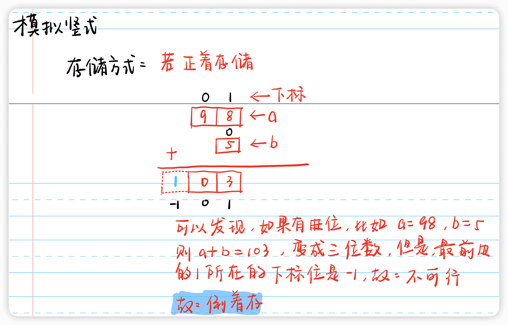

# 模拟题专题

## 模拟

### [LeetCode 299. 猜数字游戏](https://leetcode-cn.com/problems/bulls-and-cows/)

**题目描述**

> 你在和朋友一起玩 猜数字`（Bulls and Cows）`游戏，该游戏规则如下：
>
> 写出一个秘密数字，并请朋友猜这个数字是多少。朋友每猜测一次，你就会给他一个包含下述信息的提示：
>
> 猜测数字中有多少位属于数字和确切位置都猜对了（称为 "`Bulls`"，公牛），
> 有多少位属于数字猜对了但是位置不对（称为 "`Cows`"，奶牛）。也就是说，这次猜测中有多少位非公牛数字可以通过重新排列转换成公牛数字。
> 给你一个秘密数字 `secret` 和朋友猜测的数字 `guess` ，请你返回对朋友这次猜测的提示。
>
> 提示的格式为 "`xAyB`" ，`x` 是公牛个数， `y` 是奶牛个数，`A` 表示公牛，`B` 表示奶牛。
>
> 请注意秘密数字和朋友猜测的数字都可能含有重复数字。

**示例 1**

> 输入：`secret = "1807", guess = "7810"`
> 输出：`"1A3B"`
> 解释：数字和位置都对（公牛）用 `'|'` 连接，数字猜对位置不对（奶牛）的采用斜体加粗标识。
> `"1807"
> |
> "7810"`

**示例 2**

> 输入：`secret = "1123", guess = "0111"`
> 输出：`"1A1B"`
> 解释：数字和位置都对（公牛）用 `'|'` 连接，数字猜对位置不对（奶牛）的采用斜体加粗标识。
> `"1123"        "1123"
> |      or     |
> "0111"        "0111"`
> 注意，两个不匹配的 `1` 中，只有一个会算作奶牛（数字猜对位置不对）。通过重新排列非公牛数字，其中仅有一个 `1` 可以成为公牛数字。

**示例 3**

> 输入：`secret = "1", guess = "0"`
> 输出：`"0A0B"`

**示例 4**

> 输入：`secret = "1", guess = "1"`
> 输出：`"1A0B"`

**提示**

> + $1 <= secret.length, guess.length <= 1000$
> + $secret.length == guess.length$
> + `secret` 和 `guess` 仅由数字组成

**题解**

> 1. 两次遍历；
> 2. 第一次遍历数组并且统计公牛的次数，同时将不满足公牛的字符使用多重集合记录下来
> 3. 第二次遍历数组并且利用多重集合统计奶牛的次数，注意一个数字只能对应一个数字，因此，如果比对成功需要将成功的字符从多重集合里面删除

**代码**

```c++
class Solution {
public:
    string getHint(string s, string t) {
        int a = 0, b = 0;
        multiset<char> hash;
        for (int i = 0; i < s.size(); i ++ ) {
            if (s[i] == t[i]) a ++;
            else hash.insert(s[i]);
        }
        for (int i = 0; i < s.size(); i ++ ) {
            if (s[i] == t[i]) continue;
            if (hash.count(t[i])) {
                b ++;
                hash.erase(hash.find(t[i]));
            }
        }
        return to_string(a) + "A" + to_string(b) + "B";
    }
};
```

**标签**

`模拟`

### [LeetCode 273. 整数转换英文表示](https://leetcode-cn.com/problems/integer-to-english-words/)

**题目描述**

> 将非负整数 num 转换为其对应的英文表示。

**示例 1**

> 输入：`num = 123`
> 输出：`"One Hundred Twenty Three"`

**示例 2**

> 输入：`num = 12345`
> 输出：`"Twelve Thousand Three Hundred Forty Five"`

**示例 3**

> 输入：`num = 1234567`
> 输出：`"One Million Two Hundred Thirty Four Thousand Five Hundred Sixty Seven"`

**示例 4**

> 输入：`num = 1234567891`
> 输出：`"One Billion Two Hundred Thirty Four Million Five Hundred Sixty Seven Thousand Eight Hundred Ninety One"`

**提示**

> + $0 <= num <= 2^{31} - 1$

**手写稿**


**代码**

```c++
class Solution {
public:
    // 预处理数据
    string nums0_19[20] = {
        "Zero", "One", "Two", "Three", "Four", 
        "Five", "Six", "Seven", "Eight", "Nine",
        "Ten", "Eleven", "Twelve", "Thirteen",
        "Fourteen", "Fifteen", "Sixteen", "Seventeen",
        "Eighteen", "Nineteen"
    };
    string nums20_90[8] = {
        "Twenty", "Thirty", "Forty", "Fifty",
        "Sixty", "Seventy", "Eighty", "Ninety"
    };
    string nums1000_1e9[4] = {
        "Billion ", "Million ", "Thousand ", ""
    };
    string get(int x) {
        if (x == 0) return "Zero";
        string res;
        if (x >= 100) {
            res += nums0_19[x / 100] + " Hundred ";
            x %= 100;
        }
        if (x >= 20) {
            res += nums20_90[x / 10 - 2] + " ";
            x %= 10;
        }
        if (x) res += nums0_19[x] + " ";
        return res;
    }
    string numberToWords(int num) {
        if (num == 0) return "Zero";
        string res;
        for (int i = 1e9, j = 0; i >= 1; i /= 1000, j ++ )
            if (num >= i) {
                res += get(num / i) + nums1000_1e9[j];
                num %= i;
            }
        // 注意空格问题
        res.pop_back();
        return res;
    }
};
```

**标签**

`模拟`、`数字转换`、`中英文`

### [AcWing 1473. A + B 格式](https://www.acwing.com/problem/content/1475/)

**题目描述**

>   计算 `a + b` 并以标准格式输出总和----也就是说，从最低位开始每隔三位数加进一个逗号（千位分隔符），如果结果少于四位则不需添加。

**输入格式**

>   共一行，包含两个整数 `a` 和 `b`。

**输出格式**

>   共一行，以标准格式输出 `a + b` 的和。

**数据范围**

>   +   $−10^6≤a,b≤10^6$

**输入样例**

```c++
-1000000 9
```

**输出样例**

```c++
-999,991
```

**手写稿**

>   1.   对 `a + b` 形成的字符串 `s`，进行遍历，使用 `t` 作为答案，分以下情况：
>        +   如果当前遍历的字符数量 `k` 已经达到 `3` 个，则判断是否还有下一个字符并且下一个字符是否是 `'-'`
>            +   如果条件成立，`t += ,` 并且，将 `k` 置 `0`
>            +   如果条件不成立，退出循环
>        +   反转 `t`，如果字符串 `s` 的第一个字符是 `'-'`，将其加入到答案即可

**代码**

```c++
#include <iostream>
#include <algorithm>
using namespace std;
int a, b;
int main() {
    cin >> a >> b;
    string s = to_string(a + b);
    string t;
    for (int i = s.size() - 1, k = 0; i >= 0 && s[i] != '-'; i -- ) {
        t += s[i];
        k ++;
        // 如果数量已经达到3个，并且，还有下一个字符或者下一个字符不是'-'
        // 将其加入到答案，将k置0
        if (k == 3 && i - 1 >= 0 && s[i - 1] != '-') t += ',', k = 0; 
    }
    // 反转t
    reverse(t.begin(), t.end());
    // 如果s的第一个字符是'-'，将其加入到答案
    if (s[0] == '-') t = '-' + t;
    cout << t << endl;
    return 0;
}
```

**时间复杂度**

$O(n)$

**空间复杂度**

$O(1)$

**标签**

`模拟`

**缝合怪**


## 表达式求值

### [LeetCode 224. 基本计算器](https://leetcode-cn.com/problems/basic-calculator/)

**题目描述**

> 给你一个字符串表达式 s ，请你实现一个基本计算器来计算并返回它的值。

**示例 1**

> 输入：`s = "1 + 1"`
> 输出：`2`

**示例 2**

> 输入：`s = " 2-1 + 2 "`
> 输出：`3`

**示例 3**

> 输入：`s = "(1+(4+5+2)-3)+(6+8)"`
> 输出：`23`

**提示**

> + $1 <= s.length <= 3 * 10^5$
> + `s` 由数字`、'+'、'-'、'('、')'、`和 `' '` 组成
> + `s` 表示一个有效的表达式

**题解**

> 1. 使用两个栈，一个是数字栈 `num` ，另一个是字符串栈 `oper`
> 2. 遍历每一个字符，分以下五种情况：
>     + 如果遇到空格，直接 `continue`
>     + 如果遇到`(`，直接入栈 `oper`
>     + 如果遇到 `)` ，计算答案，直到 `oper` 栈顶为 `(` 的时候停止
>     + 如果遇到数字，则计算数字的大小，入栈 `num`<font style="color:red">**（注意数字不一定是一位数）**</font>
>     + 如果遇到 `+`，`-`，则继续进行如下判断：
>         + 如果当前值是第一位，例如 `+2`，则为了方便计算，在前面补一个 `0` 即可
>         + 如果当前位不是第一位并且前一位是括号，例如 `(+2)`，则为了方便，补一个 `0` 即可
>         + 除上述情况外，正常计算，直到栈为空或者遇到 `(` 的时候停止
> 3. 如果栈中还有运算符，则继续计算，直到栈为空，答案就是栈顶元素

**代码**

```c++
class Solution {
public:
    stack<int> num;
    stack<char> oper;
    void eval() {
        int b = num.top(); num.pop();
        int a = num.top(); num.pop();
        char op = oper.top(); oper.pop();
        if (op == '+') num.push(a + b);
        else num.push(a - b);
        return;
    }
    int calculate(string s) {
        for (int i = 0; i < s.size(); i ++ ) {
            if (s[i] == ' ') continue;
            else if (s[i] == '(') oper.push(s[i]);
            else if (s[i] == ')') {
                while (oper.top() != '(') eval();
                // 弹出左括号
                oper.pop();
            }
            else if (isdigit(s[i])) {
                int sum = 0;
                while (i < s.size() && isdigit(s[i]))
                    sum = sum * 10 + (s[i ++ ] - '0');
                num.push(sum);
                i --;
            }
            else {
                // 处理特殊情况，如 +2 + a 或者 (-2 + a) 等类似情况
                if (!i || s[i - 1] == '(') num.push(0);
                while (oper.size() && oper.top() != '(') eval();
                // 将当前括号入栈
                oper.push(s[i]);
            }
        }
        while (oper.size()) eval();
        return num.top();
    }
};
```

**标签**

`栈`、`表达式求值`

### [LeetCode 282. 给表达式添加运算符](https://leetcode-cn.com/problems/expression-add-operators/)

**题目描述**

> 给定一个仅包含数字 `0-9` 的字符串 `num` 和一个目标值整数 `target` ，在 `num` 的数字之间添加 二元 运算符（不是一元）`+`、`-` 或 `*` ，返回所有能够得到目标值的表达式。

**示例 1**

> 输入: `num = "123", target = 6`
> 输出: `["1+2+3", "1*2*3"] `

**示例 2**

> 输入: `num = "232", target = 8`
> 输出: `["2*3+2", "2+3*2"]`

**示例 3**

> 输入: `num = "105", target = 5`
> 输出: `["1*0+5","10-5"]`

**示例 4**

> 输入: `num = "00", target = 0`
> 输出: `["0+0", "0-0", "0*0"]`

**示例 5**

> 输入: `num = "3456237490", target = 9191`
> 输出: `[]`

**提示**

> + $1 <= num.length <= 10$
> + $num 仅含数字$
> + $-2^{31} <= target <= 2^{31} - 1$

**手写稿**


**代码**

```c++
class Solution {
public:
    typedef long long LL;
    string path;
    vector<string> res;
    // 保证答案不越界，但是不保证中间过程不越界
    void dfs(string& num, int u, int len, LL a, LL b, LL target) {
        if (u == num.size())
            if (a == target) {
                res.push_back(path.substr(0, len - 1));
                return;
            }
        LL c = 0;
        for (int i = u; i < num.size(); i ++ ) {
            c = c * 10 + (num[i] - '0');
            path[len ++ ] = num[i];
            // 枚举第len位填写的运算符
            // +
            path[len] = '+';
            dfs(num, i + 1, len + 1, a + b * c, 1, target);
            if (i + 1 < num.size()) {
                // -
                path[len] = '-';
                dfs(num, i + 1, len + 1, a + b * c, -1, target);
                // *
                path[len] = '*';
                dfs(num, i + 1, len + 1, a, b * c, target);
            }
            // 不能有前导0
            if (num[u] == '0') return;
        }
        return;
    }
    vector<string> addOperators(string num, int target) {
        // 扩容
        path.resize(100);
        /*
        	参数1: num字符串
        	参数2: 当前枚举的是num中的哪位字符
        	参数3: 答案字符串的长度
        	参数4: a的值
        	参数5: b的值
        	参数6: 目标值
        */
        dfs(num, 0, 0, 0, 1, target);
        return res;
    }
};
```

**标签**

`dfs`、`表达式求值`

## 高精度

### 注意事项【必看】

>   1.   分析如下代码【以高精度加法为例】
>
>        ```c++
>        vector<int> add(vector<int>& A, vector<int>& B) {
>            vector<int> C;
>            // 进位
>            int t = 0;
>            for (int i = 0, j = 0; i < A.size() || j < B.size(); i ++, j ++ ) {
>                if (i < A.size()) t += A[i];
>                if (j < B.size()) t += B[i];
>                C.push_back(t % 10);
>                t /= 10;
>            }
>            // 如果产生位数的变化，即类似于99 + 1，故还需处理进位
>            while (t) {
>                C.push_back(t % 10);
>                t /= 10;
>            }
>            // 逆序返回
>            return vector<int>(C.rbegin(), C.rend());
>        }
>        ```
>
>        +   问题如下
>
>            +   产生进位的时候，为啥要使用 `while(t)` 而不是 `if(t)` ?
>
>                >   1.   明确目标：`C` 中的<font style = "color: red">**每一个元素**</font>只能是<font style = "color: red">**一位数**</font>
>                >
>                >        +   为啥 `C` 中的每一个元素必须只能是一位数？
>                >
>                >            >   假设`A` 和 `B` 中的每一个元素有可能不是一位数，例如，`A = {2e9}, B = {2e9}`，调用 `add(A, B)`，此时，答案应为 ` 4e9`，由于，`C` 中的每一个元素都是 `int` 类型，此时就越界了，无法计算出正确答案，因此，`C` 中的每一个元素必须只能是一位数，这样就不会产生越界的问题，`long long` 和 `double` 等其他类型，都是会产生相似的问题

### [AcWing 791. 高精度加法](https://www.acwing.com/problem/content/793/)

**题目描述**

>   给定两个正整数（不含前导 `0`），计算它们的和。

**输入格式**

>   共两行，每行包含一个整数。

**输出格式**

>   共一行，包含所求的和。

**数据范围**

>   +   $1≤整数长度≤100000$

**输入样例**

```c++
12
23
```

**输出样例**

```c++
35
```

**手写稿**

>   1.   模拟手算即可
>
>   2.   注意事项：
>
>        +   数字需要<font style = "color: red">**倒着存储**</font>，原因如下
>
>            

**代码一：`vector` 存储**

```c++
#include <iostream>
#include <vector>
using namespace std;
string a, b;
vector<int> A, B;
vector<int> add(vector<int>& A, vector<int>& B) {
    vector<int> C;
    // 进位
    int t = 0;
    for (int i = 0, j = 0; i < A.size() || j < B.size(); i ++, j ++ ) {
        if (i < A.size()) t += A[i];
        if (j < B.size()) t += B[i];
        C.push_back(t % 10);
        t /= 10;
    }
    // 如果产生位数的变化，即类似于99 + 1，故还需处理进位
    while (t) {
        C.push_back(t % 10);
        t /= 10;
    }
    // 逆序返回
    return vector<int>(C.rbegin(), C.rend());
}
int main() {
    cin >> a >> b;
    for (int i = a.size() - 1; i >= 0; i -- ) A.push_back(a[i] - '0');
    for (int i = b.size() - 1; i >= 0; i -- ) B.push_back(b[i] - '0');
    vector<int> C = add(A, B);
    for (int i = 0; i < C.size(); i ++ ) cout << C[i];
    return 0;
}
```

**代码二：数组存储**

```c++
#include <iostream>
using namespace std;
const int N = 100005;
string a, b;
// 记录A数组长度，B数组长度和C数组长度
int n, m, idx;
int A[N], B[N], C[N];
void add(int A[], int B[]) {
    // 进位
    int t = 0;
    for (int i = 0, j = 0; i < n || j < m; i ++, j ++ ) {
        if (i < n) t += A[i];
        if (j < m) t += B[i];
        C[idx ++ ] = t % 10; 
        t /= 10;
    }
    // 如果产生位数的变化，即类似于99 + 1，故还需处理进位
    while (t) {
        C[idx ++ ] = t % 10;
        t /= 10;
    }
    // 逆序
    for (int i = 0; i < idx / 2; i ++ ) swap(C[i], C[idx - 1 - i]);
    return;
}
int main() {
    cin >> a >> b;
    n = a.size(), m = b.size();
    for (int i = n - 1; i >= 0; i -- ) A[n - 1 - i] = a[i] - '0';
    for (int i = m - 1; i >= 0; i -- ) B[m - 1 - i] = b[i] - '0';
    add(A, B);
    for (int i = 0; i < idx; i ++ ) cout << C[i];
    return 0;
}
```

**标签**

`高精度`、`高精度加法`

### [AcWing 792. 高精度减法](https://www.acwing.com/problem/content/794/)

**题目描述**

>   给定两个正整数（不含前导 `0`），计算它们的差，计算结果可能为负数。

**输入格式**

>   共两行，每行包含一个整数。

**输出格式**

>   共一行，包含所求的差。

**数据范围**

>   +   $1≤整数长度≤10^5$

**输入样例**

```c++
32
11
```

**输出样例**

```c++
21
```

**手写稿**

>   <font style = "color: red">**注意事项：**</font>
>
>   +   为了使得高精度模板统一，故<font style="color: red">**倒着存储**</font>
>   +   计算 `A - B` 的时候，为了写代码方便，规定 `A >= B`（手写写个判断函数 `cmp` ）
>   +   其余细节部分体现在代码中

**代码**

```c++
#include <iostream>
#include <vector>
using namespace std;
string a, b;
vector<int> A, B;
bool cmp(string &a, string &b) {
    if (a.size() != b.size()) return a.size() >= b.size();
    return a >= b;
}
vector<int> sub(vector<int>& A, vector<int>& B) {
    vector<int> C;
    int t = 0;
    // 因为A >= B，因此，A的长度一定大于等于B的长度
    for (int i = 0; i < A.size(); i ++ ) {
        t = A[i] - t;
        // 如果当前没有到达B的结尾
        if (i < B.size()) t -= B[i];
        C.push_back((t + 10) % 10);
        if (t >= 0) t = 0;
        else t = 1;
    }
    while (t) C.push_back(t % 10), t /= 10;
    // 去掉前导0
    while (C.size() > 1 && C.back() == 0) C.pop_back();
    return vector<int>(C.rbegin(), C.rend());
}
int main() {
    cin >> a >> b;
    for (int i = a.size() - 1; i >= 0; i -- ) A.push_back(a[i] - '0');
    for (int i = b.size() - 1; i >= 0; i -- ) B.push_back(b[i] - '0');
    vector<int> C;
    if (cmp(a, b)) // 如果 A >= B
        C = sub(A, B);
    else { // 如果 A < B
        cout << "-";
        C = sub(B, A);
    }
    for (int i = 0; i < C.size(); i ++ ) cout << C[i];
    return 0;
}
```

**标签**

`高精度`、`高精度减法`

### [AcWing 793. 高精度乘法](https://www.acwing.com/problem/content/795/)

**题目描述**

>   给定两个非负整数（不含前导 `0`） `A` 和 `B`，请你计算 `A×B` 的值。

**输入格式**

>   共两行，第一行包含整数 `A`，第二行包含整数 `B`。

**输出格式**

>   共一行，包含 `A×B` 的值。

**数据范围**

>   +   $1≤A的长度≤100000,$
>   +   $0≤B≤10000$

**输入样例**

```c++
2
3
```

**输出样例**

```c++
6
```

**手写稿**

>   1.   为了写代码方便以及格式统一<font style = "color: red">**倒着存储**</font>

**代码**

```c++
#include <iostream>
#include <vector>
using namespace std;
string a;
int b;
vector<int> A;
vector<int> mul(vector<int>& A, int b) {
    vector<int> C;
    int t = 0;
    for (int i = 0; i < A.size(); i ++ ) {
        t += A[i] * b;
        C.push_back(t % 10);
        t /= 10;
    }
    while (t) C.push_back(t % 10),t /= 10;
    // 处理类似 1000 * 0 的情况
    // 如果答案是0，则只保留一个
    while (C.size() > 1 && C.back() == 0) C.pop_back();
    return vector<int>(C.rbegin(), C.rend());
}
int main() {
    cin >> a >> b;
    for (int i = a.size() - 1;i >= 0; i -- ) A.push_back(a[i] - '0');
    vector<int> C = mul(A, b);
    for (int i = 0; i < C.size(); i ++ ) cout << C[i];
    return 0;
}
```

**标签**

`高精度`、`高精度乘法`

### [AcWing 794. 高精度除法](https://www.acwing.com/problem/content/796/)

**题目描述**

>   给定两个非负整数（不含前导 `0`） `A，B`，请你计算 `A/B` 的商和余数。

**输入格式**

>   共两行，第一行包含整数 `A`，第二行包含整数 `B`。

**输出格式**

>   共两行，第一行输出所求的商，第二行输出所求余数。

**数据范围**

>   +   $1≤A的长度≤100000,$
>   +   $1≤B≤10000,$
>   +   $B 一定不为 0$

**输入样例**

```c++
7
2
```

**输出样例**

```c++
3
1
```

**手写稿**

>   1.   <font style = "color: red">**注意事项：**</font>
>        +   除法是<font style = "color: red">正着存储</font>，因为除法是从<font style = "color: red">最高位</font>开始计算，而加减乘都是从<font style = "color: red">最低位</font>开始计算
>        +   其余细节在代码中

**代码**

```c++
#include <iostream>
#include <vector>
using namespace std;
string a;
int b, re;
vector<int> A;
vector<int> divide(vector<int>& A, int b) {
    vector<int> C;
    int t = 0;
    for (int i = 0; i < A.size(); i ++ ) {
        t = t * 10 + A[i];
        // /b和%b不是/10和%10
        C.push_back(t / b);
        t %= b;
    }
    re = t;
    // 反转方便除去千岛0
    C = vector<int>(C.rbegin(), C.rend());
    while (C.size() > 1 && C.back() == 0) C.pop_back();
    // 再次反转
    return vector<int>(C.rbegin(), C.rend());
}
int main() {
    cin >> a >> b;
    // 正着存储
    for (int i = 0; i < a.size(); i ++ ) A.push_back(a[i] - '0');
    vector<int> C = divide(A, b);
    for (int i = 0; i < C.size(); i ++ ) cout << C[i];
    cout << endl << re << endl;
    return 0;
}
```

**标签**

`高精度`、`高精度除法`