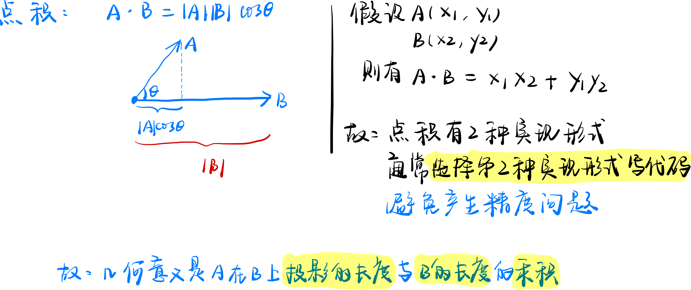
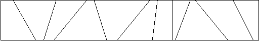
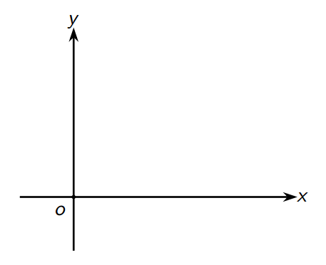
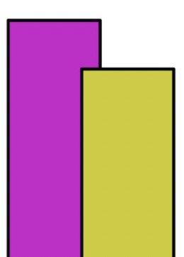

# 计算几何

## 基础知识

### 前置知识

#### 三角函数

>   1. $\pi = acos(-1);$
>
>       
>
>   2. 余弦定理 $c^2 = a^2 + b^2 - 2abcos(t)$
>
>       

#### 浮点数

>   1.   浮点数的比较
>
>        ```c++
>        // 极小数
>        const double eps = 1e-8;
>        int sign(double x) { // 符号函数
>            // 取绝对值
>            if (fabs(x) < eps) return 0;
>            if (x < 0) return -1;
>            return 1;
>        }
>        ```
>
>        
>
>   2.   浮点数的比较
>
>        ```c++
>        // 极小数
>        const double eps = 1e-8;
>        int cmp(double x, double y) { // 比较函数
>            // 取绝对值
>            if (fabs(x - y) < eps) return 0;
>            if (x < y) return -1;
>            return 1;
>        }
>        ```
>
>        

#### 向量

##### 内积（点积）

>   1.   定义：`A·B = |A||B|cos(C)`
>
>   2.   几何意义
>
>        
>
>   3.   代码实现
>
>        ```c++
>        double dot(Point a, Point b) {
>        	return a.x * b.x + a.y * b.y;
>        }
>        ```

##### 外积（叉积）

>   1.   定义：`AxB = |A||B|sin(C)`
>
>   2.   几何意义
>
>   
>
>   3.   代码实现

```markdown
        
    3.3 外积（叉积） 
        (1) 几何意义：向量A与B张成的平行四边形的有向面积。B在A的逆时针方向为正。
        (2) 代码实现
        double cross(Point a, Point b)
        {
            return a.x * b.y - b.x * a.y;
        }
    3.4 常用函数
        3.4.1 取模
        double get_length(Point a)
        {
            return sqrt(dot(a, a));
        }
        3.4.2 计算向量夹角
        double get_angle(Point a, Point b)
        {
            return acos(dot(a, b) / get_length(a) / get_length(b));
        }
        3.4.3 计算两个向量构成的平行四边形有向面积
        double area(Point a, Point b, Point c)
        {
            return cross(b - a, c - a);
        }
        3.4.5 向量A顺时针旋转C的角度：
        Point rotate(Point a, double angle)
        {
            return Point(a.x * cos(angle) + a.y * sin(angle), -a.x * sin(angle) + a.y * cos(angle));
        }
4. 点与线
    4.1 直线定理
        (1) 一般式 ax + by + c = 0
        (2) 点向式 p0 + vt
        (3) 斜截式 y = kx + b
    4.2 常用操作
        (1) 判断点在直线上 A x B = 0
        (2) 两直线相交
        // cross(v, w) == 0则两直线平行或者重合
        Point get_line_intersection(Point p, Vector v, Point q, vector w)
        {
            vector u = p - q;
            double t = cross(w, u) / cross(v, w);
            return p + v * t;
        }
        (3) 点到直线的距离
        double distance_to_line(Point p, Point a, Point b)
        {
            vector v1 = b - a, v2 = p - a;
            return fabs(cross(v1, v2) / get_length(v1));
        }
        (4) 点到线段的距离
        double distance_to_segment(Point p, Point a, Point b)
        {
            if (a == b) return get_length(p - a);
            Vector v1 = b - a, v2 = p - a, v3 = p - b;
            if (sign(dot(v1, v2)) < 0) return get_length(v2);
            if (sign(dot(v1, v3)) > 0) return get_length(v3);
            return distance_to_line(p, a, b);
        }
        (5) 点在直线上的投影
        double get_line_projection(Point p, Point a, Point b)
        {
            Vector v = b - a;
            return a + v * (dot(v, p - a) / dot(v, v));
        }
        (6) 点是否在线段上
        bool on_segment(Point p, Point a, Point b)
        {
            return sign(cross(p - a, p - b)) == 0 && sign(dot(p - a, p - b)) <= 0;
        }
        (7) 判断两线段是否相交
        bool segment_intersection(Point a1, Point a2, Point b1, Point b2)
        {
            double c1 = cross(a2 - a1, b1 - a1), c2 = cross(a2 - a1, b2 - a1);
            double c3 = cross(b2 - b1, a2 - b1), c4 = cross(b2 - b1, a1 - b1);
            return sign(c1) * sign(c2) <= 0 && sign(c3) * sign(c4) <= 0;
        }
5. 多边形
    5.1 三角形
    5.1.1 面积
        (1) 叉积
        (2) 海伦公式
            p = (a + b + c) / 2;
            S = sqrt(p(p - a) * (p - b) * (p - c));
    5.1.2 三角形四心
        (1) 外心，外接圆圆心
            三边中垂线交点。到三角形三个顶点的距离相等
        (2) 内心，内切圆圆心
            角平分线交点，到三边距离相等
        (3) 垂心
            三条垂线交点
        (4) 重心
            三条中线交点（到三角形三顶点距离的平方和最小的点，三角形内到三边距离之积最大的点）
    5.2 普通多边形
        通常按逆时针存储所有点
        5.2.1 定义
        (1) 多边形
            由在同一平面且不再同一直线上的多条线段首尾顺次连接且不相交所组成的图形叫多边形
        (2) 简单多边形
            简单多边形是除相邻边外其它边不相交的多边形
        (3) 凸多边形
            过多边形的任意一边做一条直线，如果其他各个顶点都在这条直线的同侧，则把这个多边形叫做凸多边形
            任意凸多边形外角和均为360°
            任意凸多边形内角和为(n−2)180°
        5.2.2 常用函数
        (1) 求多边形面积（不一定是凸多边形）
        我们可以从第一个顶点除法把凸多边形分成n − 2个三角形，然后把面积加起来。
        double polygon_area(Point p[], int n)
        {
            double s = 0;
            for (int i = 1; i + 1 < n; i ++ )
                s += cross(p[i] - p[0], p[i + 1] - p[i]);
            return s / 2;
        }
        (2) 判断点是否在多边形内（不一定是凸多边形）
        a. 射线法，从该点任意做一条和所有边都不平行的射线。交点个数为偶数，则在多边形外，为奇数，则在多边形内。
        b. 转角法
        (3) 判断点是否在凸多边形内
        只需判断点是否在所有边的左边（逆时针存储多边形）。
    5.3 皮克定理
        皮克定理是指一个计算点阵中顶点在格点上的多边形面积公式该公式可以表示为:
            S = a + b/2 - 1
        其中a表示多边形内部的点数，b表示多边形边界上的点数，S表示多边形的面积。
6. 圆
    (1) 圆与直线交点
    (2) 两圆交点
    (3) 点到圆的切线
    (4) 两圆公切线
    (5) 两圆相交面积
```

### [AcWing 2983. 玩具](https://www.acwing.com/problem/content/2986/)

**题目描述**

>   计算玩具收纳盒中，每个分区内的玩具数量。
>
>   约翰的父母有一个烦恼----约翰每次玩完玩具以后总会将玩具乱扔。
>
>   他们为约翰准备了一个长方形的玩具收纳盒，用来放他的玩具。
>
>   但是约翰非常调皮，每次都非常随意的将玩具扔进盒子中，使得所有玩具都随意混在一起，这让约翰难以找到他喜欢的玩具。
>
>   对此，约翰的父母想出了一个对策，用若干个纸板将收纳盒分隔成若干个分区，这样至少扔到不同分区的玩具之间还是能分开的。
>
>   下面是一个收纳盒的俯视图示例。
>
>   
>
>   你的任务是，每当约翰将玩具扔进收纳盒中时，确定每个分区中有多少个玩具。

**输入格式**

>   本题包含多组测试数据。
>
>   对于每组数据，第一行包含 `6` 个整数 $n,m,x_1,y_1,x_2,y_2$，表示共有 `n` 个纸板，`m` 个玩具，收纳盒的左上角坐标为 `(x1,y1)`，右下角坐标为 `(x2,y2)`。
>
>   接下来 `n` 行，每行包含两个整数 $U_i,L_i$，表示第 `i` 个纸板的两端点坐标分别为 $(U_i,y_1)$ 和 $(L_i,y_2)$。数据保证纸板之间不相交，且按照从左至右顺序依次给出。
>
>   接下来 `m` 行，每行包含两个整数 $X_j,Y_j$，表示第 `j` 个玩具的位置坐标。玩具的给出顺序是随机的。数据保证玩具不会恰好落在纸板上，也不会落在盒子外。
>
>   输入由包含单个 `0` 的一行结束。

**输出格式**

>   对于每组数据，输出 `n+1` 行。
>
>   `n` 个纸板将收纳盒划分为了 `n+1` 个分区，从左到右编号为 `0∼n`。
>
>   按照分区编号从小到大的顺序，每行输出一行信息 `i: j`，其中 `i` 表示分区编号，`j` 表示分区内玩具数量。
>
>   每组数据之间，**用空行隔开**。

**数据范围**

>   +   $每个测试点最多包含 10 组数据。$
>   +   $1≤n,m≤5000,$
>   +   $所有坐标取值范围 [−10^5,10^5]。$

**输入样例**

```c++
5 6 0 10 60 0
3 1
4 3
6 8
10 10
15 30
1 5
2 1
2 8
5 5
40 10
7 9
4 10 0 10 100 0
20 20
40 40
60 60
80 80
 5 10
15 10
25 10
35 10
45 10
55 10
65 10
75 10
85 10
95 10
0
```

**输出样例**

```c++
0: 2
1: 1
2: 1
3: 1
4: 0
5: 1

0: 2
1: 2
2: 2
3: 2
4: 2
```

**注意**

>   如示例所示，落在盒子边缘的玩具也算在盒子内。

**手写稿**


**代码**


**时间复杂度**


**空间复杂度**


**标签**


**缝合怪**


## 扫描线问题

### [AcWing 3068. 扫描线](https://www.acwing.com/problem/content/3071/)

**题目描述**

>   在二维平面中给定 `n` 个**两条边分别与 x 轴和 y 轴平行**的矩形，请你求出它们的面积并。

**输入格式**

>   第一行包含整数 `n`。
>
>   接下来 `n` 行，每行包含四个整数 `x1,y1,x2,y2`，表示其中一个矩形的左下角坐标 `(x1,y1)` 和右上角坐标 `(x2,y2)`。
>
>   注意，坐标轴 `x` 轴从左向右延伸，`y` 轴从下向上延伸。
>
>   

**输出格式**

>   一个整数，表示矩形的面积并。

**数据范围**

>   +   $1≤n≤1000,$
>   +   $−10^9≤x1<x2≤10^9,$
>   +   $−10^9≤y1<y2≤10^9$

**输入样例**

```c++
2
10 10 20 20
15 15 25 25
```

**输出样例**

```c++
175
```

**手写稿**


**代码**

```c++
#include <iostream>
#include <vector>
#include <algorithm>
#define x first
#define y second
using namespace std;
typedef long long LL;
typedef pair<int, int> PII;
const int N = 1010, INF = 0x3f3f3f3f;
int n;
PII l[N], r[N];
vector<int> points;
LL merge_segs(int a, int b) {
    vector<PII> segs;
    // 遍历每个矩形
    for (int i = 1; i <= n; i ++ )
        // 如果当前矩形将分割成的长条完全包裹在内
        if (l[i].x <= a && r[i].x >= b)
            // 记录此区间【y轴方向】
            segs.push_back({l[i].y, r[i].y});
    // 区间合并模板
    // 排序
    sort(segs.begin(), segs.end());
    LL height = 0;
    int L = -INF, R = -INF;
    for (auto& [l, r] : segs)
        if (R < l) {
            height += ((LL)R - L);
            L = l, R = r;
        }
        else R = max(R, r);
    // 记得将最后一段的长度添加上
    height += (R - L);
    // 计算答案即可
    return height * (b - a);
}
int main() {
    scanf("%d", &n);
    for (int i = 1; i <= n; i ++ ) {
        // 记录矩形左边的x坐标和y坐标
        // 记录矩形右边的x坐标和y坐标
        scanf("%d%d%d%d", &l[i].x, &l[i].y, &r[i].x, &r[i].y);
        // 统计所有的横坐标
        points.push_back(l[i].x);
        points.push_back(r[i].x);
    }
    // 排序
    sort(points.begin(), points.end());
    // 去重
    points.erase(unique(points.begin(), points.end()), points.end());
    // 可能会越界，使用LL
    LL res = 0;
    // 遍历每个区间
    for (int i = 1; i < points.size(); i ++ )
        // 统计总和
        res += merge_segs(points[i - 1], points[i]);
    cout << res << endl;
    return 0;
}
```

**时间复杂度**

$O(n)$

**空间复杂度**

$O(n)$

**标签**

`扫描线`

**缝合怪**

[AcWing 803. 区间合并](#AcWing 803. 区间合并)

### [AcWing 2801. 三角形面积并](https://www.acwing.com/problem/content/2803/)

>   给出 `n` 个三角形，求它们并的面积。

**输入格式**

>   第一行为 `n`，即三角形的个数。
>
>   以下 `n` 行，每行 `6` 个实数 $x_1,y_1,x_2,y_2,x_3,y_3$，代表三角形的顶点坐标。
>
>   坐标均为不超过 $10^6$ 的实数，输入数据保留 `1` 位小数。

**输出格式**

>   输出并的面积 `u`，保留两位小数。

**数据范围**

>   +   $1≤n≤100$

**输入样例**

```c++
2
0.0 0.0 2.0 0.0 1.0 1.0
1.0 0.0 3.0 0.0 2.0 1.0
```

**输出样例**

```c++
1.75
```

**手写稿**


**代码**


**时间复杂度**


**空间复杂度**


**标签**


**缝合怪**


### [LeetCode 218. 天际线问题](https://leetcode-cn.com/problems/the-skyline-problem/)

**问题描述**

> 城市的天际线是从远处观看该城市中所有建筑物形成的轮廓的外部轮廓。给你所有建筑物的位置和高度，请返回由这些建筑物形成的 天际线 。
>
> 每个建筑物的几何信息由数组 `buildings` 表示，其中三元组 `buildings[i] = [lefti, righti, heighti]` 表示：
>
> + `lefti` 是第 `i` 座建筑物左边缘的 `x` 坐标。
> + `righti` 是第 `i` 座建筑物右边缘的 `x` 坐标。
> + `heighti` 是第 `i` 座建筑物的高度。
>
> 天际线 应该表示为由 “关键点” 组成的列表，格式 `[[x1,y1],[x2,y2],...]` ，并按 `x` 坐标 进行 排序 。关键点是水平线段的左端点。列表中最后一个点是最右侧建筑物的终点，`y` 坐标始终为 `0` ，仅用于标记天际线的终点。此外，任何两个相邻建筑物之间的地面都应被视为天际线轮廓的一部分。
>
> 注意：输出天际线中不得有连续的相同高度的水平线。例如 `[...[2 3], [4 5], [7 5], [11 5], [12 7]...]` 是不正确的答案；三条高度为 `5` 的线应该在最终输出中合并为一个：`[...[2 3], [4 5], [12 7], ...]`

**示例 1**


> 输入：`buildings = [[2,9,10],[3,7,15],[5,12,12],[15,20,10],[19,24,8]]`
> 输出：`[[2,10],[3,15],[7,12],[12,0],[15,10],[20,8],[24,0]]`
> 解释：
> 图 `A` 显示输入的所有建筑物的位置和高度，
> 图 `B` 显示由这些建筑物形成的天际线。图 `B` 中的红点表示输出列表中的关键点。

**示例 2**

> 输入：`buildings = [[0,2,3],[2,5,3]]`
> 输出：`[[0,3],[5,0]]`

**提示**

> + $1 <= buildings.length <= 10^4$
> + $0 <= left_i < right_i <= 2^{31} - 1$
> + $1 <= height_i <= 2^{31} - 1$
> + $buildings 按 left_i 非递减排序$

**题解**

> 1. 将横坐标按照从小到大排序，如果横坐标相同，则分下列三种情况：
>
>     + 如果是左端点，则按照从大到小排序
>
>         
>
>     + 如果是右端点，则按照从小到大排序
>
>         
>
>     + 如果是左右端点重合，则按照先处理左端点，再处理右端点
>
>         
>
> 2. 使用 `pair` （默认升序）数组 `point` 来存储每一个点，排序，由于第三种情况的存在，所以，将左端点的值存储为负数，作用有二：
>
>     + 当左右端点重合的时候，可以保证的是先处理左端点，再处理右端点、
>     + 可以根据正负号，判断当前处理的是左端点还是右端点
>
> 3. 遍历 `point` 数组，使用 `multiset` 存储高度，分为两种情况：
>
>     + 如果当前遍历的点是左端点并且当前点大于 `multiset` 中的最大值，说明高度升高，一定产生关键点，记录答案，并将当前点插入 `multiset` 中
>     + 如果当前遍历的点是右端点 `h` ，先将右端点 `h` 删除，查看最大值，若 `h` 大于 `multiset` 的最大值，则说明 `h` 就是最大值，那么高度也会发生变化，即高度变低，记录答案即可
>
> 4. 问题解答
>
>     + 为啥要分左端点和右端点处理，题目不是说水平线段的左端点？
>
>         
>
>         + 如图，答案并不都是在左端点，其中一个答案在红色矩形的右端点

**代码**

```c++
class Solution {
public:
    vector<vector<int>> getSkyline(vector<vector<int>>& g) {
        vector<vector<int>> res;
        vector<pair<int, int>> point;
        multiset<int> height;
        for (auto& item : g) {
            point.push_back({item[0], -item[2]});
            point.push_back({item[1], item[2]});
        }
        // 先将x轴加入答案
        height.insert(0);
        sort(point.begin(), point.end());
        for (auto& p : point) {
            int x = p.first, h = abs(p.second);
            if (p.second < 0) { // 左端点
                if (h > *height.rbegin()) res.push_back({x, h});
                height.insert(h);
            }
            else { // 右端点
                height.erase(height.find(h));
                if (h > *height.rbegin()) res.push_back({x, *height.rbegin()});
            }
        }
        return res;
    }
};
```

**标签**

`扫描线`