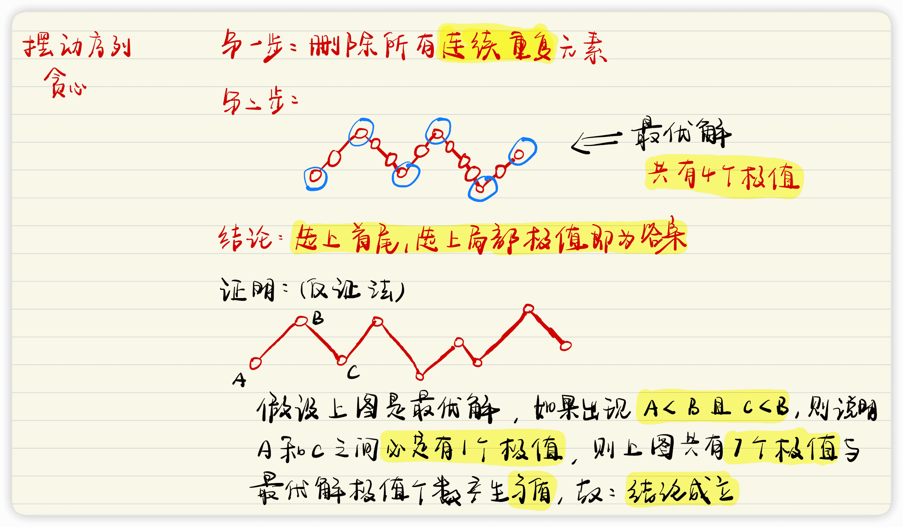

# 贪心

## 字符串贪心

### [LeetCode 316. 去除重复字母](https://leetcode-cn.com/problems/remove-duplicate-letters/)

**问题描述**

> 给你一个字符串 `s` ，请你去除字符串中重复的字母，使得每个字母只出现一次。需保证 返回结果的字典序最小（要求不能打乱其他字符的相对位置）。

**示例 1**

> 输入：`s = "bcabc"`
> 输出：`"abc"`

**示例 2**

> 输入：`s = "cbacdcbc"`
> 输出：`"acdb"`

**提示**

> + $1 <= s.length <= 10^4$
> + $s$ 由小写英文字母组成
> + 注意：该题与 [`1081`](https://leetcode-cn.com/problems/smallest-subsequence-of-distinct-characters) 相同

**手写稿**


**代码**

```c++
class Solution {
public:
    string removeDuplicateLetters(string s) {
        string res;
        unordered_map<char, int> idxs;
        unordered_map<char, bool> is_appear;
        // 记录每个字符的下标所在的最后一位的位置
        for (int i = 0; i < s.size(); i ++ ) idxs[s[i]] = i;
        for (int i = 0; i < s.size(); i ++ ) {
            // 如果当前字符出现过，则直接进行下一次循环
            if (is_appear[s[i]]) continue;
            // 判断是否可以删除当前字符
            while (res.size() && res.back() > s[i] && idxs[res.back()] > i) {
                is_appear[res.back()] = false;
                res.pop_back();
            }
            res += s[i];
            is_appear[s[i]] = true;
        }
        return res;
    }
};
```

**标签**

`贪心`

## 区间合并

### [AcWing 803. 区间合并](https://www.acwing.com/problem/content/805/)

**题目描述**

>   给定 `n` 个区间 $[l_i,r_i]$，要求合并所有有交集的区间。
>
>   注意如果在端点处相交，也算有交集。
>
>   输出合并完成后的区间个数。
>
>   例如：`[1,3]` 和 `[2,6]` 可以合并为一个区间 `[1,6]`。

**输入格式**

>   第一行包含整数 `n`。
>
>   接下来 `n` 行，每行包含两个整数 `l` 和 `r`。

**输出格式**

>   共一行，包含一个整数，表示合并区间完成后的区间个数。

**数据范围**

>   +   $1≤n≤100000,$
>   +   $−10^9≤l_i≤r_i≤10^9$

**输入样例**

```c++
5
1 2
2 4
5 6
7 8
7 9
```

**输出样例**

```c++
3
```

**手写稿**


**代码**

```c++
#include <iostream>
#include <algorithm>
using namespace std;
typedef pair<int, int> PII;
const int INF = 0x3f3f3f3f;
vector<PII> segs;
int n;
int main() {
    scanf("%d", &n);
    for (int i = 0; i < n; i ++ ) {
        int l, r;
        scanf("%d%d", &l, &r);
        segs.push_back({l, r});
    }
    sort(segs.begin(), segs.end());
    int res = 0;
    int L = -INF, R = -INF;
    for (auto& [l, r] : segs)
        if (R < l) {
            res ++;
            L = l, R = r;
        }
        else R = max(R, r);
    cout << res << endl;
    return 0;
}
```

**时间复杂度**

$O(n)$

**空间复杂度**

$O(n)$

**标签**

`贪心`、`排序`

**缝合怪**

## 普通贪心

### [LeetCode 376. 摆动序列](https://leetcode-cn.com/problems/wiggle-subsequence/)

**题目描述**

>   如果连续数字之间的差严格地在正数和负数之间交替，则数字序列称为 摆动序列 。第一个差（如果存在的话）可能是正数或负数。仅有一个元素或者含两个不等元素的序列也视作摆动序列。
>
>   例如， `[1, 7, 4, 9, 2, 5]` 是一个 摆动序列 ，因为差值 `(6, -3, 5, -7, 3)` 是正负交替出现的。
>
>   相反，`[1, 4, 7, 2, 5]` 和 `[1, 7, 4, 5, 5]` 不是摆动序列，第一个序列是因为它的前两个差值都是正数，第二个序列是因为它的最后一个差值为零。
>   子序列 可以通过从原始序列中删除一些（也可以不删除）元素来获得，剩下的元素保持其原始顺序。
>
>   给你一个整数数组 `nums` ，返回 `nums` 中作为 摆动序列 的 最长子序列的长度 。

**示例 1**

>   输入：`nums = [1,7,4,9,2,5]`
>   输出：`6`
>   解释：整个序列均为摆动序列，各元素之间的差值为 `(6, -3, 5, -7, 3)` 。

**示例 2**

>   输入：`nums = [1,17,5,10,13,15,10,5,16,8]`
>   输出：`7`
>   解释：这个序列包含几个长度为 `7` 摆动序列。
>   其中一个是 `[1, 17, 10, 13, 10, 16, 8]` ，各元素之间的差值为 `(16, -7, 3, -3, 6, -8)` 。

**示例 3**

>   输入：`nums = [1,2,3,4,5,6,7,8,9]`
>   输出：`2`

**提示**

>   +   $1 <= nums.length <= 1000$
>   +   $0 <= nums[i] <= 1000$

**进阶**

>   你能否用 $O(n)$ 时间复杂度完成此题?

**手写稿**



**代码**

```c++
class Solution {
public:
    int wiggleMaxLength(vector<int>& nums) {
        // 删除【连续重复】元素
        nums.erase(unique(nums.begin(), nums.end()), nums.end());
        if (nums.size() <= 2) return nums.size();
        // 将首尾元素添加
        int res = 2;
        for (int i = 1; i + 1 < nums.size(); i ++ ) {
            // 如果当前元素是局部最大值或者局部最小值
            // 序列的长度++
            if (nums[i - 1] < nums[i] && nums[i + 1] < nums[i] || nums[i - 1] > nums[i] && nums[i + 1] > nums[i])
                res ++;
        }
        return res;
    }
};
```

**时间复杂度**

$O(n)$

**空间复杂度**

$O(1)$

**标签**

`贪心`

**缝合怪**

